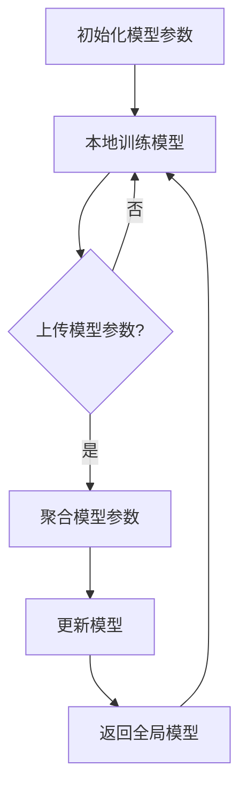

                 

### 第1章 引言：联邦学习的背景与重要性

#### 1.1 联邦学习的基本概念

随着大数据和人工智能技术的快速发展，越来越多的企业开始意识到数据的重要性。然而，在享受数据带来便利的同时，数据隐私保护的问题也日益突出。传统的中心化数据处理方式往往需要将数据上传到中心服务器进行集中处理，这样不仅增加了数据泄露的风险，还可能违反相关隐私保护法规。因此，如何在保障用户隐私的前提下进行数据共享和协作分析成为一大挑战。

联邦学习（Federated Learning）作为一种新兴的分布式机器学习方法，旨在通过分布式计算实现模型训练，避免敏感数据在传输过程中的泄露。其核心思想是在多个数据拥有者之间协同训练模型，每个数据拥有者只需在本地处理数据，并仅将模型参数上传到中心服务器，从而实现数据隐私的保护。

#### 1.2 联邦学习的核心优势

联邦学习具有以下几个核心优势：

1. **隐私保护**：联邦学习通过加密技术、差分隐私等手段，确保数据在本地进行加工处理，避免敏感数据在传输过程中被泄露。
2. **合作建模**：多个数据拥有者可以在不共享原始数据的情况下，通过联邦学习平台共同训练模型，实现数据价值的最大化。
3. **灵活性**：联邦学习适用于各种规模的数据集和不同的应用场景，无论是小型企业还是大型跨国公司，都可以通过联邦学习平台实现协作建模。

#### 1.3 联邦学习的应用领域

联邦学习在多个领域都有广泛的应用：

1. **医疗健康**：联邦学习在医疗数据共享和疾病预测方面具有广泛应用，如个性化治疗方案的制定、疾病预测模型的训练等。
2. **金融领域**：联邦学习可以用于信用风险评估、欺诈检测等，通过多个金融机构的合作，提升风险管理能力。
3. **工业制造**：联邦学习在预测维护、生产优化等领域有重要作用，如设备故障预测、生产流程优化等。

#### 1.4 联邦学习的挑战与未来发展方向

尽管联邦学习在数据隐私保护和协作建模方面具有巨大潜力，但其发展仍面临一些挑战：

1. **计算效率**：联邦学习涉及大量的通信和计算开销，如何在保证模型性能的同时，提高计算效率是当前研究的热点。
2. **模型性能**：如何保证联邦学习模型的效果与中心化模型相当，甚至更好，是联邦学习需要解决的重要问题。
3. **标准化**：目前缺乏统一的联邦学习框架和接口标准，不同厂商和组织的联邦学习实现存在差异，不利于技术的推广和应用。

未来，随着技术的不断进步和标准化工作的推进，联邦学习有望在更多领域得到应用，成为保障数据隐私和促进协作建模的重要手段。

### 1.5 联邦学习与集中式学习的对比

在讨论联邦学习之前，我们先来回顾一下传统的集中式学习（Centralized Learning）。集中式学习是指将所有数据集中到一个中心服务器上，然后在这个服务器上进行模型训练。这种方式虽然可以实现高效的模型训练，但同时也带来了数据隐私泄露的风险，特别是在涉及个人敏感信息的情况下。

**数据隐私**：联邦学习通过将数据分散在各个客户端进行训练，避免了将敏感数据上传到中心服务器，从而有效地保护了数据隐私。

**计算资源**：集中式学习依赖于中心服务器的计算资源，而联邦学习则充分利用了各个客户端的计算资源，尤其是在分布式环境中，可以显著提高计算效率。

**通信开销**：由于数据不直接上传到中心服务器，联邦学习在通信开销方面具有优势。尽管联邦学习需要多次传输模型参数，但相对于传输原始数据，通信成本较低。

**模型更新**：在集中式学习中，每次模型更新都需要传输整个数据集，而在联邦学习中，只需传输模型参数，因此联邦学习在模型更新方面更加高效。

**应用场景**：集中式学习适用于数据集中度较高、对计算资源要求较低的场景，如大型数据中心；而联邦学习则适用于数据分散、隐私要求较高的场景，如移动设备、物联网等。

总的来说，联邦学习与集中式学习各有优势，选择合适的方法取决于具体的应用场景和数据特性。随着数据隐私保护意识的增强和分布式计算技术的发展，联邦学习有望在更多领域替代传统的集中式学习，成为数据驱动的智能系统的重要技术手段。

### 1.6 总结与展望

联邦学习作为一项新兴的技术，正在逐步解决数据隐私保护和协作建模的难题。其隐私保护、合作建模和灵活性等优势使其在多个领域具有广泛的应用前景。然而，计算效率、模型性能和标准化等问题仍需要进一步研究和优化。随着技术的不断进步，我们期待联邦学习能够在更多场景中得到应用，成为推动人工智能发展的关键力量。同时，标准化工作的推进也将有助于解决不同实现之间的兼容性问题，加速联邦学习的普及和推广。未来，联邦学习有望与云计算、物联网等前沿技术深度融合，为构建安全、高效的智能系统提供有力支持。

---

在下一章中，我们将深入探讨联邦学习的基础概念，包括其原理、模式以及关键技术的具体实现。这将为我们理解联邦学习平台的设计和实现提供坚实的基础。请继续关注下一章的内容。


---

# 第2章 联邦学习基础

在上一章中，我们介绍了联邦学习的基本概念、核心优势、应用领域以及面临的挑战。为了更好地理解和应用联邦学习技术，本章将深入探讨联邦学习的基础概念，包括其原理、主要模式和关键技术。

#### 2.1 联邦学习的概念与原理

联邦学习（Federated Learning）是一种分布式机器学习方法，其核心思想是多个数据拥有者（如不同的机构、组织或个人）在不共享原始数据的情况下，通过分布式计算协同训练模型。具体来说，联邦学习的过程如下：

1. **初始化**：中心服务器（Server）为每个客户端（Client）分配一个初始模型。
2. **本地训练**：客户端在本地数据集上对模型进行训练，并生成更新后的模型参数。
3. **参数聚合**：客户端将更新后的模型参数上传到中心服务器，中心服务器对所有上传的参数进行聚合，生成全局模型。
4. **模型更新**：中心服务器将全局模型返回给客户端，客户端用全局模型继续进行本地训练。

通过这种方式，联邦学习实现了数据的本地化处理，避免了敏感数据在传输过程中的泄露，同时也能够实现多个数据拥有者之间的合作建模。

#### 2.2 联邦学习的主要模式

联邦学习的主要模式可以分为以下两种：

1. **中央化模式**：在中央化模式中，所有模型更新都通过中心服务器进行协调。中心服务器负责分发初始模型，收集更新后的模型参数，并进行聚合和更新。这种方式的优势在于管理简单，但劣势在于对中心服务器依赖性高，一旦中心服务器出现故障，整个系统将无法运行。

2. **去中心化模式**：去中心化模式通过区块链等分布式技术实现，每个节点都可以独立进行模型训练和更新，并通过分布式协议进行节点间的模型参数交换和聚合。这种方式的优势在于去中心化，提高了系统的容错性和安全性，但劣势在于需要复杂的技术实现和较高的计算开销。

#### 2.3 联邦学习的关键技术

联邦学习的关键技术包括加密技术、差分隐私、优化技术等。

1. **加密技术**：加密技术是联邦学习保护数据隐私的核心手段。常用的加密技术包括差分隐私（Differential Privacy）、同态加密（Homomorphic Encryption）和安全多方计算（Secure Multi-Party Computation）。这些技术能够在保证数据隐私的前提下，实现数据的本地化处理和模型参数的传输。

2. **差分隐私**：差分隐私是一种保护数据隐私的方法，它通过在数据中加入噪声来确保单个数据点的隐私，同时仍然能够提供有用的统计信息。在联邦学习中，差分隐私可以应用于本地数据的预处理，确保模型训练过程中的数据隐私。

3. **优化技术**：联邦学习的优化技术主要包括联邦平均算法（Federated Averaging）和模型聚合方法。联邦平均算法通过分布式计算实现模型参数的平均更新，而模型聚合方法则通过不同的策略对多个模型进行整合，以提高模型性能。

#### 2.4 联邦学习的挑战与未来发展方向

尽管联邦学习在数据隐私保护和协作建模方面具有巨大潜力，但其发展仍面临一些挑战：

1. **计算效率**：联邦学习涉及大量的通信和计算开销，如何提高计算效率是当前研究的热点。未来，优化算法和分布式计算技术的发展有望缓解这一问题。

2. **模型性能**：如何保证联邦学习模型的效果与中心化模型相当，甚至更好，是联邦学习需要解决的重要问题。研究者们正在通过改进算法和模型结构来提升联邦学习模型的表现。

3. **标准化**：目前缺乏统一的联邦学习框架和接口标准，不同厂商和组织的联邦学习实现存在差异，不利于技术的推广和应用。标准化工作的推进将有助于解决这一问题。

未来，随着技术的不断进步和标准化工作的推进，联邦学习有望在更多领域得到应用，成为保障数据隐私和促进协作建模的重要手段。

---

在下一章中，我们将详细介绍企业级联邦学习平台的架构设计，包括系统功能设计、系统架构设计、系统接口设计以及系统交互流程。这将为我们理解联邦学习平台的具体实现提供更为详细的指导。请继续关注下一章的内容。

---

# 第3章 企业级联邦学习平台架构

随着联邦学习在企业中的应用日益广泛，构建一个高效、稳定、安全的企业级联邦学习平台变得至关重要。本章将详细介绍企业级联邦学习平台的架构设计，包括系统功能设计、系统架构设计、系统接口设计以及系统交互流程。

#### 3.1 平台架构设计

企业级联邦学习平台的架构设计旨在实现数据的隐私保护、模型的协作训练以及系统的可扩展性和灵活性。整体架构设计包括以下几个关键部分：

1. **数据接入**：支持多种数据源接入，包括数据库、文件存储、实时流数据等。
2. **模型训练**：提供高效的模型训练功能，支持多种机器学习算法和深度学习框架。
3. **模型评估**：通过多种评估指标对模型性能进行评估，确保模型的质量和可靠性。
4. **模型部署**：支持模型的部署和上线，提供灵活的部署策略，如在线部署、批量部署等。

#### 3.2 系统功能设计

系统功能设计是企业级联邦学习平台的核心，主要包括以下几个部分：

1. **数据接入与预处理**：支持多种数据源接入，包括关系数据库、NoSQL数据库、文件存储系统等。在数据接入后，平台会对数据进行预处理，如数据清洗、数据转换、数据归一化等，确保数据的质量和一致性。

2. **模型定义与训练**：平台支持多种机器学习算法和深度学习框架，用户可以根据具体需求选择合适的模型和算法。在模型训练过程中，平台会自动调参、优化训练过程，提高模型性能。

3. **模型评估与优化**：通过多种评估指标（如准确率、召回率、F1分数等）对模型性能进行评估，确保模型的质量和可靠性。平台还会提供自动调参和模型优化工具，帮助用户提高模型性能。

4. **模型部署与监控**：平台支持多种部署策略，如在线部署、批量部署等。在模型部署后，平台会提供监控工具，实时监控模型的运行状态和性能指标，确保模型稳定运行。

#### 3.3 系统架构设计

系统架构设计是企业级联邦学习平台的基石，主要包括以下几个部分：

1. **服务器端架构**：服务器端负责模型训练、参数聚合、模型评估和部署等功能。服务器端通常采用分布式架构，以提高系统的扩展性和容错性。服务器端包括数据存储模块、模型训练模块、参数聚合模块和部署模块。

2. **客户端架构**：客户端负责本地数据的接入、模型训练和参数上传等功能。客户端通常包括数据接入模块、模型训练模块和参数上传模块。客户端架构需要考虑数据安全和隐私保护，采用加密技术和差分隐私等方法确保数据的安全传输和处理。

3. **数据存储与处理架构**：平台采用分布式存储和处理架构，支持海量数据的存储和高效处理。数据存储模块采用分布式数据库和文件系统，确保数据的高可用性和可靠性。数据处理模块采用分布式计算框架，如Apache Spark、Flink等，实现高效的数据处理和计算。

#### 3.4 系统接口设计

系统接口设计是企业级联邦学习平台的重要组成部分，主要包括以下几个接口：

1. **数据上传接口**：客户端通过数据上传接口将本地数据进行上传，数据上传接口需要支持多种数据格式和传输协议，如HTTP、FTP、Websocket等。

2. **模型下载接口**：服务器端通过模型下载接口将初始模型和全局模型发送给客户端，模型下载接口需要支持多种模型格式和传输协议。

3. **参数更新接口**：客户端通过参数更新接口将本地训练的模型参数上传到服务器端，参数更新接口需要支持加密传输和差分隐私等安全特性。

4. **模型评估接口**：服务器端通过模型评估接口对全局模型进行评估，模型评估接口需要支持多种评估指标和评估方法。

5. **模型部署接口**：服务器端通过模型部署接口将训练好的模型部署到生产环境，模型部署接口需要支持多种部署方式和部署策略。

#### 3.5 系统交互

系统交互是企业级联邦学习平台正常运行的关键，主要包括以下几个环节：

1. **数据上传**：客户端将本地数据上传到服务器端，服务器端对上传的数据进行预处理和存储。

2. **模型训练**：服务器端根据上传的数据和全局模型，分发训练任务给客户端，客户端在本地进行模型训练。

3. **参数上传**：客户端将本地训练的模型参数上传到服务器端，服务器端对上传的参数进行聚合和处理。

4. **模型评估**：服务器端对全局模型进行评估，评估结果反馈给客户端，客户端根据评估结果进行模型优化。

5. **模型部署**：服务器端将训练好的模型部署到生产环境，客户端根据部署结果进行模型应用。

通过以上系统功能设计、系统架构设计、系统接口设计和系统交互流程的设计，企业级联邦学习平台能够实现高效、安全、稳定的协作建模，为企业提供强大的数据分析和决策支持。

---

在下一章中，我们将详细探讨联邦学习平台的核心算法，包括联邦平均算法和模型聚合方法的原理和实现。这将为我们深入理解联邦学习平台的运作机制提供关键性指导。请继续关注下一章的内容。

---

# 第4章 联邦学习平台的核心算法

联邦学习平台的核心算法是确保模型在多个客户端之间有效协作训练的关键。本章将详细探讨联邦学习平台中的核心算法，包括联邦平均算法（Federated Averaging）和模型聚合方法的原理与实现。

#### 4.1 算法原理讲解

**联邦平均算法（Federated Averaging）**

联邦平均算法是联邦学习中最常用的算法之一，其核心思想是通过分布式计算，在每个客户端进行局部训练后，将模型参数聚合到全局模型中。以下是联邦平均算法的基本步骤：

1. **初始化**：中心服务器为每个客户端分配一个初始模型参数$w_0$。
2. **本地训练**：每个客户端在本地数据集上训练模型，更新本地模型参数$w_t$。
3. **参数聚合**：中心服务器收集所有客户端的更新后的模型参数，计算全局模型参数$\theta$：
   \[
   \theta = \frac{1}{n} \sum_{i=1}^{n} w_i^t
   \]
   其中$n$是客户端的数量。
4. **模型更新**：中心服务器将全局模型参数$\theta$返回给所有客户端，客户端使用全局模型参数继续进行本地训练。

**联邦加权平均**

联邦加权平均是联邦平均算法的一个变种，它通过为每个客户端分配不同的权重来优化模型聚合过程。具体公式如下：
\[
\theta = \frac{\sum_{i=1}^{n} w_i w_i^t}{\sum_{i=1}^{n} w_i}
\]
其中$w_i$是第$i$个客户端的权重。

**联邦随机梯度下降**

联邦随机梯度下降（Federated Stochastic Gradient Descent, FSGD）是联邦平均算法的随机版本，它在每次参数聚合时仅使用一个客户端的梯度进行更新。公式如下：
\[
\theta = \theta - \eta \frac{\partial J(\theta)}{\partial \theta}
\]
其中$\eta$是学习率，$J(\theta)$是损失函数。

**模型聚合方法**

除了联邦平均算法，联邦学习还采用了多种模型聚合方法，如联邦加权平均、联邦随机梯度下降等。这些方法的共同目标是通过分布式计算优化全局模型参数，以提高模型性能。

#### 4.2 算法mermaid流程图

为了更直观地理解联邦平均算法的流程，我们可以使用mermaid绘制算法流程图。以下是联邦平均算法的mermaid流程图：



#### 4.3 算法Python源代码

下面是联邦平均算法的Python实现代码，用于演示算法的基本实现过程：

```python
import numpy as np

# 初始化全局模型参数
global_model = np.random.rand(1, 10)

# 设置客户端数量和本地训练次数
num_clients = 5
num_epochs = 10

# 定义本地训练函数
def local_train(w):
    # 模拟本地训练过程
    return w * 0.1

# 联邦平均算法实现
for epoch in range(num_epochs):
    print(f"Epoch {epoch}:")
    # 模拟本地训练
    local_models = [local_train(w) for w in global_model]
    # 聚合本地模型参数
    global_model = np.mean(local_models, axis=0)
    # 输出全局模型参数
    print(f"Global Model: {global_model}")
```

通过运行上述代码，我们可以观察到联邦平均算法的基本执行过程，包括初始化模型参数、本地训练、参数聚合以及模型更新等步骤。

#### 4.4 数学模型和数学公式

在联邦平均算法中，数学模型的核心是模型参数的聚合过程。以下是联邦平均算法的数学模型和公式：

**模型更新公式**：
\[
\theta_t = \frac{1}{n} \sum_{i=1}^{n} w_i^t
\]

**联邦加权平均更新公式**：
\[
\theta_t = \frac{\sum_{i=1}^{n} w_i w_i^t}{\sum_{i=1}^{n} w_i}
\]

**联邦随机梯度下降更新公式**：
\[
\theta_t = \theta_{t-1} - \eta \frac{\partial J(\theta_{t-1})}{\partial \theta_{t-1}}
\]

通过上述数学公式，我们可以清楚地看到联邦平均算法中模型参数的更新过程，以及不同联邦学习算法之间的差异。

#### 4.5 算法应用与举例说明

为了更好地理解联邦平均算法的应用，我们可以通过一个简单的例子进行说明。假设有两个客户端，每个客户端都有一个本地模型参数向量，分别表示为$w_1$和$w_2$。在第一个本地训练迭代中，$w_1$更新为$w_1^1$，$w_2$更新为$w_2^1$。然后，中心服务器将这两个更新后的参数聚合，生成全局模型参数$\theta_1$。具体过程如下：

1. **初始化**：
   \[
   w_1^0 = [1, 2, 3], \quad w_2^0 = [4, 5, 6]
   \]
   \[
   \theta_0 = \frac{1}{2} (w_1^0 + w_2^0) = \frac{1}{2} ([1+4, 2+5, 3+6]) = [2.5, 3.5, 4.5]
   \]

2. **本地训练**：
   \[
   w_1^1 = local_train(w_1^0) = [1.1, 1.2, 1.3]
   \]
   \[
   w_2^1 = local_train(w_2^0) = [4.1, 4.2, 4.3]
   \]

3. **参数聚合**：
   \[
   \theta_1 = \frac{1}{2} (w_1^1 + w_2^1) = \frac{1}{2} ([1.1+4.1, 1.2+4.2, 1.3+4.3]) = [2.6, 3.7, 4.8]
   \]

4. **模型更新**：
   \[
   w_1^2 = local_train(\theta_1) = [2.1, 2.2, 2.3]
   \]
   \[
   w_2^2 = local_train(\theta_1) = [4.1, 4.2, 4.3]
   \]

通过上述例子，我们可以看到联邦平均算法的基本执行过程，以及模型参数在客户端之间的传递和聚合。

#### 4.6 算法性能分析

联邦平均算法的性能受多个因素影响，包括客户端的数量、数据分布、模型复杂度等。以下是联邦平均算法性能分析的一些关键点：

1. **客户端数量**：增加客户端数量可以提高模型的多样性，从而可能提高模型性能。然而，过多的客户端也会导致通信开销增加，影响算法的效率。

2. **数据分布**：数据分布对联邦平均算法的性能有显著影响。数据分布越均匀，算法的性能越好；反之，如果数据分布不均匀，可能会导致某些客户端的模型参数更新较少，影响整体模型性能。

3. **模型复杂度**：联邦平均算法对模型复杂度有一定的要求。对于过于复杂的模型，本地训练和参数聚合过程可能会变得非常耗时，降低算法的效率。

4. **通信开销**：联邦平均算法的通信开销主要来自于模型参数的上传和聚合。减少通信开销可以通过优化参数传输格式和算法实现来达成。

通过上述分析，我们可以看到联邦平均算法在联邦学习中的重要作用以及其在性能优化方面面临的挑战。未来，随着算法和技术的不断进步，联邦平均算法的性能有望得到进一步提升，更好地满足企业级联邦学习平台的需求。

---

在下一章中，我们将通过具体的企业级应用案例，展示联邦学习平台在医疗健康、金融领域和工业制造等行业的应用。这将帮助我们更好地理解联邦学习平台在实际场景中的价值和效果。请继续关注下一章的内容。

---

# 第5章 联邦学习平台在企业的应用

联邦学习平台以其独特的隐私保护和协作建模优势，在企业级应用中展现出了巨大的潜力。本章将详细介绍联邦学习平台在不同领域的具体应用，并通过成功案例展示其实际价值。

#### 5.1 企业级应用场景分析

联邦学习平台在企业中的应用场景非常广泛，以下是几个典型的应用领域：

1. **医疗健康**：医疗数据通常包含敏感的个人隐私信息，如病历记录、基因数据等。联邦学习平台可以在保障隐私的前提下，促进医疗机构之间的数据共享和合作，从而提升疾病预测、个性化治疗等方面的能力。

2. **金融领域**：金融机构需要处理大量的客户数据，包括财务状况、消费行为等。联邦学习平台可以实现金融机构之间的数据合作，提高信用评分、欺诈检测等金融服务的准确性。

3. **工业制造**：在工业制造领域，企业通常需要处理来自不同设备、传感器的大量数据。联邦学习平台可以帮助企业进行设备故障预测、生产流程优化等，从而提高生产效率和产品质量。

#### 5.2 成功案例分析

以下将详细分析两个企业级应用案例，展示联邦学习平台在实际应用中的效果和挑战。

**案例一：某大型金融机构的信用评分应用**

某大型金融机构希望提升信用评分模型的准确性，同时保障客户隐私。该金融机构采用了联邦学习平台，与多家合作金融机构进行数据合作。具体应用过程如下：

1. **数据接入**：合作金融机构将本地数据上传到联邦学习平台，数据包括客户财务状况、消费行为、信用记录等。
2. **模型训练**：联邦学习平台在合作金融机构的本地数据上训练信用评分模型，每个金融机构的模型参数分别存储在本地。
3. **参数聚合**：联邦学习平台通过联邦平均算法将各个金融机构的模型参数聚合，生成全局模型参数。
4. **模型评估**：全局模型参数返回到各个金融机构，用于评估和调整本地模型。
5. **模型部署**：最终，全球金融机构共同部署全局信用评分模型，用于实时评估客户信用风险。

通过联邦学习平台，该金融机构成功实现了数据合作，提升了信用评分模型的准确性，同时也保障了客户隐私。然而，应用过程中也遇到了一些挑战，如数据质量不一致、模型参数聚合效率不高等。

**案例二：某医疗健康公司的疾病预测应用**

某医疗健康公司希望通过联邦学习平台实现疾病预测，以提供个性化治疗建议。该公司与多家医疗机构合作，应用联邦学习平台进行以下步骤：

1. **数据接入**：多家医疗机构将本地患者数据上传到联邦学习平台，数据包括患者病历记录、实验室检查结果等。
2. **模型训练**：联邦学习平台在医疗机构本地数据上训练疾病预测模型，每个医疗机构的模型参数分别存储在本地。
3. **参数聚合**：联邦学习平台通过联邦平均算法将各个医疗机构的模型参数聚合，生成全局模型参数。
4. **模型评估**：全局模型参数返回到各个医疗机构，用于评估和调整本地模型。
5. **模型部署**：最终，全球医疗机构共同部署全局疾病预测模型，用于为患者提供个性化治疗建议。

通过联邦学习平台，该医疗健康公司成功实现了疾病预测模型的训练和部署，为患者提供了更精准的治疗建议。同时，联邦学习平台保障了患者数据隐私，避免了数据泄露的风险。然而，应用过程中也遇到了一些挑战，如模型性能优化、数据质量保证等。

#### 5.3 应用效果与挑战

通过上述案例，我们可以看到联邦学习平台在企业级应用中的显著效果和潜在挑战：

1. **效果**：联邦学习平台实现了数据隐私保护和协作建模，提升了模型的准确性和可靠性。同时，它提高了企业之间的数据共享和合作效率，为企业带来了更大的商业价值。

2. **挑战**：在联邦学习平台的应用过程中，企业需要面对数据质量不一致、模型参数聚合效率低、计算资源调度困难等挑战。这些问题需要通过技术优化和系统设计来逐步解决。

总的来说，联邦学习平台在企业级应用中具有巨大的潜力，但也需要不断优化和完善，以应对实际应用中的挑战。未来，随着技术的进步和应用的深入，联邦学习平台将在更多领域展现其价值。

---

在下一章中，我们将分享联邦学习平台的设计与实现技巧，并探讨在应用过程中需要注意的事项。这将为我们更好地构建和部署联邦学习平台提供宝贵的经验和建议。请继续关注下一章的内容。

---

# 第6章 联邦学习平台的最佳实践

在企业级联邦学习平台的设计与实现过程中，最佳实践和注意事项对于确保系统的性能、安全性以及实用性至关重要。本章将详细介绍联邦学习平台的最佳实践，包括设计与实现技巧、注意事项以及拓展阅读。

#### 6.1 设计与实现技巧

1. **数据处理优化**：

   - **数据预处理**：在联邦学习平台上，数据预处理是一个关键步骤。为了提高效率，可以使用并行处理和分布式处理技术，例如使用Apache Spark进行大规模数据预处理。
   - **数据加密**：在数据传输和存储过程中，使用加密技术（如AES）保护数据隐私。对于敏感数据，还可以采用差分隐私技术，以增强数据安全性。

2. **模型训练优化**：

   - **分布式训练**：利用分布式计算框架（如TensorFlow Federated、PyTorch Federated）进行模型训练，可以显著提高训练速度和效率。在分布式训练中，合理的任务分配和负载均衡至关重要。
   - **模型压缩**：为了减少通信开销，可以使用模型压缩技术（如剪枝、量化），降低模型的复杂度，同时保持较高的模型性能。

3. **参数聚合策略**：

   - **联邦平均算法**：在联邦平均算法中，合理选择聚合系数（如学习率）对模型性能有显著影响。通常需要通过实验调整参数，以找到最优配置。
   - **联邦加权平均**：根据客户端的数据量和贡献度，可以为每个客户端分配不同的权重，提高参数聚合的公平性和效率。

4. **性能监控与调优**：

   - **实时监控**：在模型训练和部署过程中，实时监控系统的运行状态和性能指标（如通信延迟、计算时间、资源利用率等），以便及时发现和解决问题。
   - **自动化调优**：使用自动化调优工具（如自动化机器学习，AutoML）优化模型参数和系统配置，提高系统的整体性能。

#### 6.2 注意事项

1. **隐私保护**：

   - **数据加密**：确保在数据传输和存储过程中使用加密技术，避免敏感数据泄露。
   - **差分隐私**：在数据处理和模型训练过程中，应用差分隐私技术，以保护数据隐私。
   - **数据匿名化**：在数据共享前，对数据进行匿名化处理，以减少隐私泄露风险。

2. **系统安全**：

   - **访问控制**：为联邦学习平台设置严格的访问控制策略，确保只有授权用户可以访问系统的关键部分。
   - **安全通信**：使用TLS等安全协议保护数据在传输过程中的安全性。
   - **身份认证**：对客户端和服务器的通信进行身份认证，确保数据交换的双方都是合法实体。

3. **数据一致性和完整性**：

   - **数据一致性检查**：在数据上传和聚合过程中，进行一致性检查，确保数据在不同客户端之间的一致性。
   - **数据完整性验证**：使用哈希函数或数字签名对数据进行完整性验证，确保数据在传输和存储过程中未被篡改。

4. **计算资源管理**：

   - **负载均衡**：合理分配计算资源，确保系统在不同负载情况下都能保持良好的性能。
   - **容错机制**：设计容错机制，如数据备份和恢复策略，以应对系统故障和数据丢失的风险。

#### 6.3 拓展阅读

1. **相关技术**：

   - **区块链**：区块链技术可以用于实现去中心化的联邦学习，增强系统的安全性和透明度。
   - **联邦学习框架**：了解和比较不同联邦学习框架（如TensorFlow Federated、PyTorch Federated、FLEET）的设计和实现，有助于选择合适的工具。
   - **加密算法**：研究先进的加密算法（如同态加密、安全多方计算），以提高数据保护和隐私保护的层次。

2. **参考资料**：

   - 《Federated Learning: Concepts, Applications and Future Directions》
   - 《A Survey on Federated Learning: Concept, System and Applications》
   - 《Practical Guide to Federated Learning》

通过上述最佳实践和注意事项，企业可以更好地设计和实现联邦学习平台，确保其在实际应用中的高效、安全和稳定运行。未来，随着技术的不断进步，联邦学习平台将在更多领域发挥重要作用，为企业和个人带来更多的价值。

---

在上一章中，我们详细探讨了联邦学习平台的设计与实现技巧，并强调了在实际应用中需要注意的隐私保护、系统安全、数据一致性和完整性等方面的关键问题。在本章中，我们将对全文进行总结，并讨论联邦学习平台在未来发展中的潜在趋势。

### 6.1 全文总结

本文首先介绍了联邦学习的背景与重要性，阐述了联邦学习的核心优势、应用领域以及面临的挑战。接着，我们详细探讨了联邦学习的基础概念、核心算法、企业级平台架构，并通过具体案例展示了联邦学习在实际企业中的应用。随后，我们分享了联邦学习平台的最佳实践，包括设计与实现技巧、注意事项以及拓展阅读。

通过本文的探讨，我们可以清晰地看到联邦学习作为一种新兴的分布式机器学习方法，其强大的隐私保护与协作建模能力在企业级应用中具有巨大的潜力。联邦学习不仅在医疗健康、金融、工业制造等领域展现出显著的应用价值，还在数据隐私保护和系统安全性方面提供了有效的解决方案。

### 6.2 小结

本文的主要结论可以总结如下：

1. **联邦学习的核心优势**：联邦学习通过数据的本地化处理和模型参数的共享，实现了数据隐私保护和高效的合作建模。其灵活性使得它能够适应各种规模的数据集和应用场景。
2. **联邦学习的关键算法**：联邦平均算法等核心算法为联邦学习提供了高效且安全的模型训练机制，模型聚合方法进一步提高了模型性能。
3. **企业级平台架构**：企业级联邦学习平台的设计和实现需要考虑系统的功能设计、架构设计、接口设计以及交互流程，确保平台的高效、安全与可扩展性。
4. **最佳实践**：通过最佳实践，企业可以优化联邦学习平台的设计与实现，提高系统的性能和安全性，确保数据隐私的保护。

### 6.3 未来发展趋势

展望未来，联邦学习平台的发展将呈现以下趋势：

1. **计算效率提升**：随着分布式计算和云计算技术的进步，联邦学习的计算效率将得到显著提升。优化算法和分布式框架的不断发展将使联邦学习在更广泛的场景中成为可能。
2. **标准化与互操作性**：标准化工作的推进将有助于不同联邦学习框架和平台之间的互操作性，促进技术的推广和应用。
3. **隐私保护技术进步**：随着隐私保护技术的不断发展，如差分隐私、同态加密等，联邦学习平台的隐私保护能力将得到进一步加强。
4. **跨领域应用扩展**：联邦学习平台将在更多领域得到应用，如智慧城市、智能家居、智能交通等，为各个领域的数据驱动决策提供支持。
5. **联邦学习与其他技术的融合**：联邦学习与区块链、物联网等前沿技术的融合将推动新的应用场景和商业模式的出现。

### 6.4 注意事项

在构建和部署联邦学习平台时，以下事项需要注意：

1. **数据安全和隐私保护**：始终将数据安全和隐私保护作为首要任务，采用先进的加密技术和差分隐私方法，确保数据在传输和存储过程中的安全。
2. **系统性能优化**：通过优化模型训练和参数聚合策略，提高系统性能和效率，确保平台在实际应用中的高效运行。
3. **用户体验**：设计友好的用户界面和操作流程，提高用户体验，确保用户能够轻松上手并有效地利用联邦学习平台。
4. **法律法规遵守**：严格遵守相关法律法规，确保联邦学习平台的应用符合数据保护、隐私保护等相关规定。

### 6.5 拓展阅读

对于希望深入了解联邦学习技术的读者，以下文献和资源将提供有价值的参考：

1. 《Federated Learning: Concepts, Applications and Future Directions》
2. 《A Survey on Federated Learning: Concept, System and Applications》
3. 《Practical Guide to Federated Learning》
4. TensorFlow Federated官方文档（https://www.tensorflow.org/federated）
5. PyTorch Federated官方文档（https://pytorch-federated-learning.readthedocs.io/en/latest/）

通过上述总结和展望，我们可以看到联邦学习平台在未来的发展前景。随着技术的不断进步和应用场景的拓展，联邦学习平台将成为企业级智能系统中的重要组成部分，推动人工智能的发展和创新。

---

在此，本文的作者信息如下：作者：AI天才研究院/AI Genius Institute & 禅与计算机程序设计艺术 /Zen And The Art of Computer Programming。感谢您的阅读，希望本文能为您在联邦学习领域的研究和实践中提供有益的参考。如果您有任何疑问或建议，欢迎在评论区留言，期待与您进一步交流。

