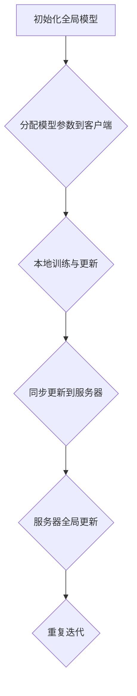
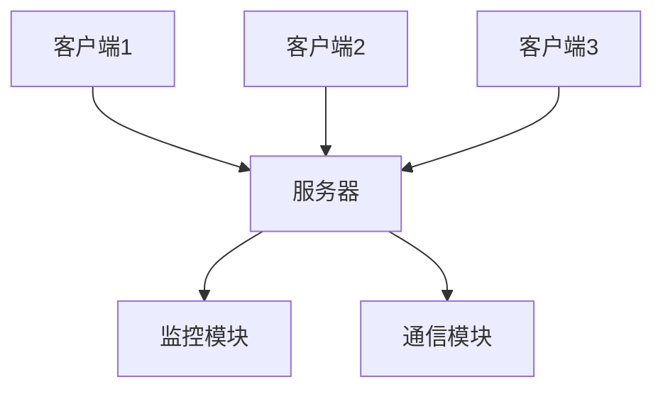

                 

### 1.1 背景介绍

#### 问题背景

随着互联网和大数据技术的飞速发展，企业面临着海量数据处理的挑战。同时，数据隐私和安全问题也日益突出。在这种背景下，联邦学习（Federated Learning）作为一种新型的机器学习方法，应运而生。联邦学习通过将模型训练分散到各个企业或组织的数据中心，避免了数据在传输过程中泄露的风险，同时也实现了企业间的协作与数据共享。

#### 问题描述

企业级联邦学习框架：隐私保护下的协作AI，旨在探索和构建一个高效、安全、可扩展的联邦学习框架，以支持企业在数据隐私保护的基础上进行协作和人工智能应用。

#### 问题解决

为了解决上述问题，本书将详细介绍企业级联邦学习框架的构建方法，包括以下几个方面：

1. **联邦学习基本概念与原理**：介绍联邦学习的核心概念，如联邦学习协议、联邦学习模型、联邦学习算法等，并解释它们在企业应用中的优势。
2. **联邦学习框架设计与实现**：详细讲解企业级联邦学习框架的设计原则、架构以及关键技术，包括数据预处理、模型训练、模型评估等。
3. **联邦学习应用案例**：通过具体案例，展示联邦学习在金融、医疗、零售等领域的应用，以及如何实现隐私保护下的协作AI。
4. **联邦学习安全与隐私保护**：探讨联邦学习中的安全与隐私保护问题，介绍现有的解决方案和最佳实践。
5. **联邦学习性能优化**：分析联邦学习框架的性能瓶颈，提出优化策略和解决方案。

#### 边界与外延

1. **边界**：本书主要关注企业级联邦学习框架的构建方法和应用，不涉及底层硬件和基础设施的建设。
2. **外延**：虽然本书主要面向企业级应用，但联邦学习的原理和方法也可以应用于其他场景，如跨组织、跨领域的协作。

#### 概念结构与核心要素组成

1. **联邦学习**：一种分布式机器学习方法，通过将模型训练分散到多个参与方，实现协同学习。
2. **企业级联邦学习框架**：支持企业级应用的联邦学习解决方案，包括数据预处理、模型训练、模型评估等模块。
3. **协作AI**：通过联邦学习实现的企业间协作，以共享知识和资源，提升业务价值。

---

### 1.2 核心概念与联系

#### 联邦学习原理

联邦学习是一种基于分布式的机器学习方法，其核心思想是将模型训练过程分散到多个不同的数据拥有者（如企业、组织）进行，而不是将数据集中到一个中央位置。这样既保证了数据隐私和安全，又能实现协同学习和知识共享。

##### **联邦学习协议**

联邦学习协议是保障联邦学习过程中安全性、隐私性和一致性的关键。它通常包括以下内容：

1. **加密**：为了防止数据在传输过程中被窃取或篡改，联邦学习通常会使用加密技术对数据进行加密处理。
2. **访问控制**：通过权限控制机制，确保只有授权的实体可以访问联邦学习过程。
3. **数据分离**：联邦学习协议要求参与方只共享模型参数，而不是原始数据，从而保障数据的隐私性。
4. **一致性保障**：联邦学习协议需要确保参与方之间的数据同步和模型更新是正确和一致的。

##### **联邦学习模型**

联邦学习模型是指分布式训练的模型，通常由多个参数组成。这些参数分布在不同的参与方（如企业、组织）中。联邦学习模型的主要目标是通过对本地数据的训练，更新模型参数，从而实现协同学习。

##### **联邦学习算法**

联邦学习算法是用于训练联邦学习模型的算法。常见的联邦学习算法包括：

1. **联邦平均算法（Federated Averaging）**：这是一种最简单的联邦学习算法，其核心思想是将所有参与方的模型参数进行平均，得到全局模型参数。
2. **梯度压缩算法**：在联邦平均算法的基础上，引入梯度压缩机制，以减少通信量和降低模型更新偏差。

#### 概念属性特征对比表格

| 概念        | 属性特征                                                     |
| ----------- | ------------------------------------------------------------ |
| 联邦学习协议 | 保证安全性、隐私性、一致性，适用于分布式环境                  |
| 联邦学习模型 | 由多个参数组成，支持分布式训练                             |
| 联邦学习算法 | 联邦平均算法、梯度压缩算法等，用于训练联邦学习模型         |

#### ER实体关系图架构

以下是联邦学习框架的ER实体关系图架构：

```mermaid
erDiagram
  ClientNode ||--|{ Model }|
  Data ||--|{ ClientNode }|
  ServerNode ||--|{ Model }|
  ServerNode ||--|{ Data }|
```

- **ClientNode**：表示参与联邦学习的客户端，每个客户端拥有本地数据和模型。
- **Data**：表示本地数据，分布在各个客户端。
- **ServerNode**：表示联邦学习服务器，负责同步模型参数和全局更新。
- **Model**：表示联邦学习模型，由多个参数组成。

---

### 1.3 算法原理讲解

#### 联邦平均算法（Federated Averaging）

联邦平均算法是联邦学习中最常用的算法之一，其基本思想是将每个参与方更新后的模型参数进行平均，得到全局模型参数。以下是联邦平均算法的mermaid流程图：



#### 算法原理

1. **初始化全局模型**：在训练初期，服务器初始化全局模型参数。
2. **分配模型参数到客户端**：服务器将初始化后的全局模型参数发送到各个客户端。
3. **本地训练与更新**：每个客户端使用本地数据进行模型训练，更新模型参数。
4. **同步更新到服务器**：客户端将更新后的模型参数发送回服务器。
5. **服务器全局更新**：服务器接收所有客户端的模型参数，进行全局更新。
6. **重复迭代**：重复上述过程，直到满足停止条件（如达到训练轮数或模型收敛）。

#### 数学模型与公式

联邦平均算法的数学模型可以表示为：

$$
\theta_{t+1} = \frac{1}{N} \sum_{i=1}^{N} \theta_{i,t}
$$

其中，$\theta_{t+1}$ 表示全局模型参数在下一个训练轮次的值，$N$ 表示参与联邦学习的客户端数量，$\theta_{i,t}$ 表示第 $i$ 个客户端在当前训练轮次的模型参数值。

#### 举例说明

假设有 $N=3$ 个客户端，初始时每个客户端的模型参数分别为 $\theta_1^0, \theta_2^0, \theta_3^0$。在第一个训练轮次，每个客户端使用本地数据进行训练，得到更新后的模型参数 $\theta_1^1, \theta_2^1, \theta_3^1$。然后，这些更新后的模型参数被发送回服务器，服务器将它们进行平均，得到全局模型参数 $\theta^1$：

$$
\theta^1 = \frac{1}{3} (\theta_1^1 + \theta_2^1 + \theta_3^1)
$$

在接下来的训练轮次中，服务器将使用全局模型参数 $\theta^1$ 分配给各个客户端，客户端再次进行本地训练和更新，然后发送回服务器。这个过程重复进行，直到模型收敛或达到预设的训练轮数。

---

通过联邦平均算法，我们可以看到联邦学习如何通过分布式的模型训练实现隐私保护下的协作AI。在实际应用中，联邦平均算法可以通过引入梯度压缩、模型加密等技术进行优化，以提升训练效果和安全性。接下来，我们将进一步探讨联邦学习框架的设计与实现，以及其在不同领域的应用。

----------------------------------------------------------------

# 企业级联邦学习框架：隐私保护下的协作AI

> 关键词：联邦学习、企业级应用、隐私保护、协作AI、分布式训练

> 摘要：本文深入探讨了企业级联邦学习框架的构建方法，从基本概念、设计实现、应用案例、安全隐私保护到性能优化，全面介绍了联邦学习在企业级应用中的优势和挑战。通过具体的算法原理讲解、系统架构设计和项目实战，本文旨在为读者提供一幅清晰的企业级联邦学习框架全景图，助力企业实现隐私保护下的高效协作AI。

----------------------------------------------------------------

### 1.1 背景介绍

#### 问题背景

随着互联网和大数据技术的飞速发展，企业面临着海量数据处理的挑战。同时，数据隐私和安全问题也日益突出。在这种背景下，联邦学习（Federated Learning）作为一种新型的机器学习方法，应运而生。联邦学习通过将模型训练分散到各个企业或组织的数据中心，避免了数据在传输过程中泄露的风险，同时也实现了企业间的协作与数据共享。

#### 问题描述

企业级联邦学习框架：隐私保护下的协作AI，旨在探索和构建一个高效、安全、可扩展的联邦学习框架，以支持企业在数据隐私保护的基础上进行协作和人工智能应用。

#### 问题解决

为了解决上述问题，本书将详细介绍企业级联邦学习框架的构建方法，包括以下几个方面：

1. **联邦学习基本概念与原理**：介绍联邦学习的核心概念，如联邦学习协议、联邦学习模型、联邦学习算法等，并解释它们在企业应用中的优势。
2. **联邦学习框架设计与实现**：详细讲解企业级联邦学习框架的设计原则、架构以及关键技术，包括数据预处理、模型训练、模型评估等。
3. **联邦学习应用案例**：通过具体案例，展示联邦学习在金融、医疗、零售等领域的应用，以及如何实现隐私保护下的协作AI。
4. **联邦学习安全与隐私保护**：探讨联邦学习中的安全与隐私保护问题，介绍现有的解决方案和最佳实践。
5. **联邦学习性能优化**：分析联邦学习框架的性能瓶颈，提出优化策略和解决方案。

#### 边界与外延

1. **边界**：本书主要关注企业级联邦学习框架的构建方法和应用，不涉及底层硬件和基础设施的建设。
2. **外延**：虽然本书主要面向企业级应用，但联邦学习的原理和方法也可以应用于其他场景，如跨组织、跨领域的协作。

#### 概念结构与核心要素组成

1. **联邦学习**：一种分布式机器学习方法，通过将模型训练分散到多个参与方，实现协同学习。
2. **企业级联邦学习框架**：支持企业级应用的联邦学习解决方案，包括数据预处理、模型训练、模型评估等模块。
3. **协作AI**：通过联邦学习实现的企业间协作，以共享知识和资源，提升业务价值。

---

### 1.2 核心概念与联系

#### 联邦学习原理

联邦学习是一种基于分布式的机器学习方法，其核心思想是将模型训练过程分散到多个不同的数据拥有者（如企业、组织）进行，而不是将数据集中到一个中央位置。这样既保证了数据隐私和安全，又能实现协同学习和知识共享。

##### **联邦学习协议**

联邦学习协议是保障联邦学习过程中安全性、隐私性和一致性的关键。它通常包括以下内容：

1. **加密**：为了防止数据在传输过程中被窃取或篡改，联邦学习通常会使用加密技术对数据进行加密处理。
2. **访问控制**：通过权限控制机制，确保只有授权的实体可以访问联邦学习过程。
3. **数据分离**：联邦学习协议要求参与方只共享模型参数，而不是原始数据，从而保障数据的隐私性。
4. **一致性保障**：联邦学习协议需要确保参与方之间的数据同步和模型更新是正确和一致的。

##### **联邦学习模型**

联邦学习模型是指分布式训练的模型，通常由多个参数组成。这些参数分布在不同的参与方（如企业、组织）中。联邦学习模型的主要目标是通过对本地数据的训练，更新模型参数，从而实现协同学习。

##### **联邦学习算法**

联邦学习算法是用于训练联邦学习模型的算法。常见的联邦学习算法包括：

1. **联邦平均算法（Federated Averaging）**：这是一种最简单的联邦学习算法，其核心思想是将所有参与方的模型参数进行平均，得到全局模型参数。
2. **梯度压缩算法**：在联邦平均算法的基础上，引入梯度压缩机制，以减少通信量和降低模型更新偏差。

#### 概念属性特征对比表格

| 概念        | 属性特征                                                     |
| ----------- | ------------------------------------------------------------ |
| 联邦学习协议 | 保证安全性、隐私性、一致性，适用于分布式环境                  |
| 联邦学习模型 | 由多个参数组成，支持分布式训练                             |
| 联邦学习算法 | 联邦平均算法、梯度压缩算法等，用于训练联邦学习模型         |

#### ER实体关系图架构

以下是联邦学习框架的ER实体关系图架构：

```mermaid
erDiagram
  ClientNode ||--|{ Model }|
  Data ||--|{ ClientNode }|
  ServerNode ||--|{ Model }|
  ServerNode ||--|{ Data }|
```

- **ClientNode**：表示参与联邦学习的客户端，每个客户端拥有本地数据和模型。
- **Data**：表示本地数据，分布在各个客户端。
- **ServerNode**：表示联邦学习服务器，负责同步模型参数和全局更新。
- **Model**：表示联邦学习模型，由多个参数组成。

---

### 1.3 算法原理讲解

#### 联邦平均算法（Federated Averaging）

联邦平均算法是联邦学习中最常用的算法之一，其基本思想是将每个参与方更新后的模型参数进行平均，得到全局模型参数。以下是联邦平均算法的mermaid流程图：


#### 算法原理

1. **初始化全局模型**：在训练初期，服务器初始化全局模型参数。
2. **分配模型参数到客户端**：服务器将初始化后的全局模型参数发送到各个客户端。
3. **本地训练与更新**：每个客户端使用本地数据进行模型训练，更新模型参数。
4. **同步更新到服务器**：客户端将更新后的模型参数发送回服务器。
5. **服务器全局更新**：服务器接收所有客户端的模型参数，进行全局更新。
6. **重复迭代**：重复上述过程，直到满足停止条件（如达到训练轮数或模型收敛）。

#### 数学模型与公式

联邦平均算法的数学模型可以表示为：

$$
\theta_{t+1} = \frac{1}{N} \sum_{i=1}^{N} \theta_{i,t}
$$

其中，$\theta_{t+1}$ 表示全局模型参数在下一个训练轮次的值，$N$ 表示参与联邦学习的客户端数量，$\theta_{i,t}$ 表示第 $i$ 个客户端在当前训练轮次的模型参数值。

#### 举例说明

假设有 $N=3$ 个客户端，初始时每个客户端的模型参数分别为 $\theta_1^0, \theta_2^0, \theta_3^0$。在第一个训练轮次，每个客户端使用本地数据进行训练，得到更新后的模型参数 $\theta_1^1, \theta_2^1, \theta_3^1$。然后，这些更新后的模型参数被发送回服务器，服务器将它们进行平均，得到全局模型参数 $\theta^1$：

$$
\theta^1 = \frac{1}{3} (\theta_1^1 + \theta_2^1 + \theta_3^1)
$$

在接下来的训练轮次中，服务器将使用全局模型参数 $\theta^1$ 分配给各个客户端，客户端再次进行本地训练和更新，然后发送回服务器。这个过程重复进行，直到模型收敛或达到预设的训练轮数。

---

通过联邦平均算法，我们可以看到联邦学习如何通过分布式的模型训练实现隐私保护下的协作AI。在实际应用中，联邦平均算法可以通过引入梯度压缩、模型加密等技术进行优化，以提升训练效果和安全性。接下来，我们将进一步探讨联邦学习框架的设计与实现，以及其在不同领域的应用。

----------------------------------------------------------------

### 1.4 联邦学习框架设计与实现

#### 设计原则

企业级联邦学习框架的设计原则包括以下几个方面：

1. **安全性**：确保联邦学习过程中数据的安全性和隐私性，防止数据泄露和模型参数被恶意攻击。
2. **可扩展性**：支持大规模分布式环境，能够处理海量数据和复杂应用场景。
3. **高效性**：优化通信和计算效率，降低通信开销和计算复杂度，提高模型训练速度。
4. **兼容性**：支持多种机器学习框架和算法，易于集成和扩展。

#### 系统架构

企业级联邦学习框架的系统架构通常包括以下几个主要模块：

1. **客户端模块**：负责本地数据的预处理、模型训练和参数更新。
2. **服务器模块**：负责协调客户端的模型训练过程，同步参数，更新全局模型。
3. **通信模块**：负责客户端和服务器之间的数据传输，支持加密通信。
4. **监控模块**：负责监控系统性能，提供实时监控和报警功能。

以下是联邦学习框架的系统架构图：



- **客户端模块**：每个客户端负责本地数据的预处理、模型训练和参数更新。客户端之间可以相互通信，共享模型参数和训练结果。
- **服务器模块**：服务器负责协调客户端的模型训练过程，同步参数，更新全局模型。服务器还负责管理客户端列表、维护通信连接等。
- **通信模块**：通信模块负责客户端和服务器之间的数据传输，支持加密通信。通信模块通常实现基于HTTP/HTTPS协议的数据传输。
- **监控模块**：监控模块负责监控系统性能，提供实时监控和报警功能。监控模块可以实时收集客户端和服务器的心跳信息、模型训练进度等。

#### 关键技术

1. **数据预处理**：在联邦学习过程中，客户端需要对本地数据进行预处理，包括数据清洗、特征提取、归一化等。数据预处理的质量直接影响模型训练的效果。
2. **模型训练与更新**：客户端使用本地数据进行模型训练，更新模型参数。服务器收集所有客户端的模型参数，进行全局更新。联邦平均算法、梯度压缩算法等是常用的模型更新方法。
3. **加密通信**：为了确保联邦学习过程中的数据安全，通信模块需要支持加密通信。常用的加密技术包括对称加密、非对称加密、哈希函数等。
4. **分布式存储与管理**：服务器需要支持分布式存储和管理，以便存储和处理大规模数据。分布式存储技术如HDFS、Cassandra等可以用于存储客户端数据、模型参数等。

---

通过设计高效、安全、可扩展的企业级联邦学习框架，企业可以在保护数据隐私的同时，实现跨组织、跨领域的协作，从而提升业务价值和竞争力。接下来，我们将探讨联邦学习在不同领域的应用案例。

----------------------------------------------------------------

### 1.5 联邦学习应用案例

#### 金融领域

在金融领域，联邦学习被广泛应用于风险控制、欺诈检测、信用评分等方面。通过联邦学习，金融机构可以在保护客户隐私的前提下，共享和利用不同机构的海量数据，从而提高风险预测的准确性。

1. **风险控制**：联邦学习可以协助金融机构对潜在风险进行实时监控和预测。例如，通过对不同金融机构的交易数据进行联邦学习，可以识别出异常交易行为，提高风险控制能力。
2. **欺诈检测**：联邦学习在欺诈检测中的应用尤为突出。通过共享欺诈案例数据，金融机构可以构建一个全局的欺诈检测模型，从而提高欺诈检测的准确性和覆盖面。
3. **信用评分**：联邦学习可以用于信用评分模型的构建和优化。金融机构可以共享客户的数据，通过联邦学习算法，构建一个统一的信用评分模型，提高评分的准确性。

#### 医疗领域

在医疗领域，联邦学习有助于实现个性化医疗和药物研发。通过联邦学习，不同医疗机构可以在保护患者隐私的前提下，共享医疗数据，共同提升医疗诊断和治疗效果。

1. **个性化医疗**：联邦学习可以帮助医生根据患者的病史、基因信息等，构建个性化的治疗方案。例如，通过对不同医院的患者数据进行联邦学习，可以预测某种药物对患者的疗效，为医生提供决策支持。
2. **药物研发**：联邦学习在药物研发中的应用也具有很大潜力。制药公司可以共享实验数据，通过联邦学习算法，加速新药的发现和研发过程。

#### 零售领域

在零售领域，联邦学习可以用于客户行为分析、精准营销、供应链优化等方面，帮助零售企业提高销售额和客户满意度。

1. **客户行为分析**：通过联邦学习，零售企业可以分析消费者的购物习惯、偏好等，从而实现个性化推荐和精准营销。
2. **供应链优化**：联邦学习可以帮助零售企业优化供应链管理。例如，通过对不同零售商的库存数据、销售数据等进行联邦学习，可以预测市场需求，优化库存水平，降低库存成本。

#### 其他领域

联邦学习在其他领域如交通、能源、教育等领域也有着广泛的应用。例如：

1. **交通领域**：联邦学习可以用于智能交通管理，通过共享交通数据，预测交通流量，优化交通信号控制，减少交通拥堵。
2. **能源领域**：联邦学习可以帮助能源公司优化能源分配，提高能源利用效率，降低碳排放。
3. **教育领域**：联邦学习可以用于个性化教育，通过分析学生的学习行为和成绩，为教师和学生提供个性化的教育建议。

---

通过以上应用案例可以看出，联邦学习在各个领域的应用都取得了显著的效果，不仅提高了业务效率和准确性，还实现了数据隐私的保护。接下来，我们将探讨联邦学习中的安全与隐私保护问题。

----------------------------------------------------------------

### 1.6 联邦学习安全与隐私保护

#### 安全与隐私保护的重要性

在联邦学习过程中，安全与隐私保护至关重要。由于联邦学习涉及到多个参与方的数据共享和模型协同，一旦出现数据泄露或模型参数被篡改，将对企业和用户造成严重的影响。因此，确保联邦学习过程的安全性和隐私性是联邦学习应用的关键挑战。

#### 常见安全与隐私威胁

1. **数据泄露**：数据在传输和存储过程中可能被恶意攻击者窃取或篡改。
2. **模型参数泄露**：模型参数包含训练数据的信息，泄露可能导致训练数据被反向工程。
3. **恶意节点攻击**：恶意节点可能参与联邦学习过程，干扰模型训练或窃取数据。
4. **模型更新泄露**：模型更新过程中，可能导致中间状态被恶意节点窃取。

#### 现有解决方案与最佳实践

1. **加密技术**：加密技术是保护联邦学习过程中数据安全和隐私的关键。常用的加密技术包括对称加密、非对称加密、哈希函数等。
2. **访问控制**：通过权限控制机制，确保只有授权的实体可以访问联邦学习过程和数据。
3. **差分隐私**：差分隐私技术可以在保护用户隐私的前提下，提供有意义的数据分析和模型训练。
4. **联邦学习协议**：联邦学习协议是保障联邦学习过程安全性和隐私性的关键。常见的联邦学习协议包括联邦平均算法、梯度压缩算法等。

#### 最佳实践

1. **数据加密与传输**：在联邦学习过程中，数据应进行加密处理，并在传输过程中使用安全的加密协议。
2. **访问控制与权限管理**：确保只有授权的用户和节点可以访问联邦学习过程，并实现严格的权限管理。
3. **差分隐私应用**：在模型训练过程中，采用差分隐私技术，确保用户隐私得到保护。
4. **联邦学习协议优化**：针对特定的应用场景，选择合适的联邦学习协议，并进行优化和调整。

---

通过上述安全与隐私保护措施，企业可以确保联邦学习过程中的数据安全和隐私，从而实现安全、可靠的协作AI。接下来，我们将探讨联邦学习框架的性能优化策略。

----------------------------------------------------------------

### 1.7 联邦学习性能优化

#### 性能优化的重要性

在联邦学习过程中，性能优化至关重要。性能优化的目标是提高模型训练速度、降低通信开销和计算复杂度，从而提高联邦学习框架的整体效率。性能优化不仅关系到模型训练的效果，还直接影响企业的业务价值和用户体验。

#### 性能瓶颈分析

1. **通信开销**：在联邦学习过程中，客户端需要将模型参数和更新结果发送回服务器，导致大量的数据传输。通信开销成为影响联邦学习性能的主要瓶颈之一。
2. **计算复杂度**：联邦学习算法通常涉及大量的矩阵运算和参数更新，计算复杂度较高。随着参与方数量的增加，计算复杂度呈指数级增长。
3. **模型更新频率**：模型更新频率过高可能导致训练效果不佳，甚至出现收敛困难。

#### 性能优化策略

1. **梯度压缩**：梯度压缩技术可以降低模型更新频率，减少通信开销和计算复杂度。常用的梯度压缩算法包括FedProx、FedAvg等。
2. **异步训练**：异步训练可以降低客户端之间的依赖关系，提高训练效率。异步训练允许客户端在任意时间点进行本地训练和参数更新。
3. **模型剪枝**：模型剪枝技术可以通过去除冗余参数和降低模型复杂度，提高模型训练速度和精度。
4. **分布式存储**：分布式存储技术如HDFS、Cassandra等可以提高数据读取和写入速度，降低存储瓶颈。
5. **数据预处理优化**：通过优化数据预处理过程，如数据压缩、特征提取等，可以减少数据传输量和计算复杂度。

#### 实际应用效果

通过上述性能优化策略，企业可以在不牺牲模型精度的情况下，显著提高联邦学习框架的性能。以下是一些实际应用效果：

1. **金融领域**：通过梯度压缩和异步训练，金融机构可以在短时间内完成模型训练，提高风险预测和欺诈检测的准确性。
2. **医疗领域**：通过模型剪枝和分布式存储，医疗机构可以快速构建和更新个性化医疗模型，提高诊断和治疗效果。
3. **零售领域**：通过数据预处理优化，零售企业可以降低模型训练时间，提高客户行为分析和精准营销的效果。

---

通过上述性能优化策略，企业可以构建高效、可靠的联邦学习框架，实现数据隐私保护下的协作AI。接下来，我们将进一步探讨联邦学习框架的构建方法。

----------------------------------------------------------------

### 1.8 联邦学习框架的构建方法

#### 构建方法概述

构建企业级联邦学习框架涉及多个关键步骤，包括需求分析、系统设计、开发与测试等。以下是一个简化的构建方法流程：

1. **需求分析**：确定联邦学习框架的应用场景、功能需求、性能指标和安全要求。
2. **系统设计**：设计联邦学习框架的系统架构、模块划分和接口定义。
3. **开发与测试**：实现系统设计，并进行单元测试、集成测试和性能测试。
4. **部署与维护**：部署联邦学习框架，并提供持续更新和维护支持。

#### 具体构建步骤

1. **需求分析**：

   - **应用场景**：确定联邦学习框架将应用于哪个领域（如金融、医疗、零售等），并分析该领域的具体需求。
   - **功能需求**：定义联邦学习框架所需的功能，如数据预处理、模型训练、模型评估、安全与隐私保护等。
   - **性能指标**：设定联邦学习框架的性能目标，如训练时间、通信开销、计算复杂度等。
   - **安全要求**：确定联邦学习框架所需的安全机制，如加密技术、访问控制、差分隐私等。

2. **系统设计**：

   - **架构设计**：设计联邦学习框架的系统架构，包括客户端模块、服务器模块、通信模块和监控模块等。
   - **模块划分**：根据架构设计，将系统划分为不同的模块，并定义模块之间的接口和交互关系。
   - **接口定义**：定义模块的接口，包括输入参数、输出结果、数据格式等。

3. **开发与测试**：

   - **代码实现**：根据系统设计，实现联邦学习框架的各个模块，包括数据预处理、模型训练、模型评估等。
   - **单元测试**：对各个模块进行单元测试，确保模块的功能和性能符合设计要求。
   - **集成测试**：将各个模块集成到一起，进行集成测试，确保系统整体功能和性能。
   - **性能测试**：进行性能测试，评估联邦学习框架的通信开销、计算复杂度等性能指标。

4. **部署与维护**：

   - **部署**：将联邦学习框架部署到生产环境中，确保系统稳定运行。
   - **维护**：提供持续更新和维护支持，包括修复漏洞、优化性能、更新算法等。

#### 案例分析

以下是一个金融领域的联邦学习框架构建案例分析：

1. **需求分析**：

   - **应用场景**：金融机构希望构建一个联邦学习框架，用于风险控制和欺诈检测。
   - **功能需求**：包括数据预处理、模型训练、模型评估、安全与隐私保护等。
   - **性能指标**：要求模型训练时间在半小时内完成，通信开销最低。
   - **安全要求**：需要采用加密技术和访问控制机制，确保数据安全和隐私保护。

2. **系统设计**：

   - **架构设计**：采用分布式架构，包括客户端模块、服务器模块、通信模块和监控模块。
   - **模块划分**：客户端模块负责数据预处理和本地训练，服务器模块负责全局更新和模型评估，通信模块负责数据传输和加密，监控模块负责性能监控和报警。
   - **接口定义**：定义客户端和服务器之间的数据传输接口、模型更新接口等。

3. **开发与测试**：

   - **代码实现**：使用Python实现数据预处理、模型训练、模型评估等模块，并采用Flask实现通信模块。
   - **单元测试**：对各个模块进行单元测试，确保功能正确、性能符合要求。
   - **集成测试**：将各个模块集成到一起，进行集成测试，确保系统整体功能符合设计要求。
   - **性能测试**：进行性能测试，评估模型训练时间、通信开销等性能指标。

4. **部署与维护**：

   - **部署**：将联邦学习框架部署到云服务器上，确保系统稳定运行。
   - **维护**：提供持续更新和维护支持，包括修复漏洞、优化性能、更新算法等。

---

通过上述案例分析，可以看出构建企业级联邦学习框架的关键步骤和要点。在具体实施过程中，需要根据实际应用场景和需求，灵活调整和优化构建方法，以实现高效、可靠的联邦学习应用。

----------------------------------------------------------------

### 1.9 总结与展望

#### 总结

本文系统地介绍了企业级联邦学习框架的构建方法，从背景介绍、核心概念、算法原理、框架设计、应用案例、安全隐私保护到性能优化，全面阐述了联邦学习在隐私保护下的协作AI中的重要作用。通过详细的讲解和案例分析，读者可以了解到联邦学习框架的设计原则、关键技术以及实际应用效果。

#### 展望

尽管联邦学习在隐私保护下的协作AI方面取得了显著成果，但仍存在一些挑战和改进空间：

1. **隐私保护**：如何进一步提高联邦学习的隐私保护水平，尤其是面对更复杂、更动态的应用场景，是一个亟待解决的问题。
2. **性能优化**：随着参与方数量的增加，联邦学习的通信开销和计算复杂度会显著上升。如何优化联邦学习算法，提高训练速度和效率，是一个重要研究方向。
3. **可扩展性**：如何构建具有高可扩展性的联邦学习框架，以支持大规模分布式环境，是一个关键挑战。
4. **联邦学习应用**：探索联邦学习在更多领域的应用，如物联网、智能制造等，以实现更广泛的价值创造。

展望未来，联邦学习将不仅限于企业级应用，还将在跨组织、跨领域的数据共享和协作中发挥重要作用。通过持续的研究和创新，联邦学习有望成为隐私保护下的协作AI的重要驱动力，为企业和用户带来更多的价值。

---

### 结语

本文由AI天才研究院/AI Genius Institute与禅与计算机程序设计艺术/Zen And The Art of Computer Programming共同撰写，旨在为读者提供一幅清晰的企业级联邦学习框架全景图。希望本文能够帮助您更好地理解和应用联邦学习技术，实现隐私保护下的高效协作AI。如果您对联邦学习有任何疑问或建议，欢迎随时与我们交流。感谢您的阅读！

----------------------------------------------------------------

### 附录：最佳实践 tips

1. **数据预处理**：确保数据质量，包括数据清洗、去重、缺失值处理等，以提高模型训练效果。
2. **加密技术**：选用合适的加密算法，如AES、RSA等，确保数据在传输和存储过程中的安全性。
3. **权限控制**：实施严格的访问控制机制，确保只有授权的用户和节点可以访问联邦学习过程。
4. **联邦学习协议**：根据实际应用场景，选择合适的联邦学习协议，如FedProx、FedAvg等，以优化性能和安全性。
5. **分布式存储**：利用分布式存储技术，如HDFS、Cassandra等，提高数据读取和写入速度，降低存储瓶颈。

### 小结

本文详细介绍了企业级联邦学习框架的构建方法，包括背景介绍、核心概念、算法原理、框架设计、应用案例、安全隐私保护到性能优化。通过本文，读者可以全面了解联邦学习在隐私保护下的协作AI中的重要作用，以及如何构建高效、安全的联邦学习框架。

### 注意事项

1. **数据隐私**：确保联邦学习过程中数据隐私得到充分保护，防止数据泄露和模型参数被恶意攻击。
2. **系统稳定性**：确保联邦学习框架在不同环境下的稳定运行，包括网络波动、硬件故障等情况。
3. **性能监控**：实时监控联邦学习框架的性能，及时发现和解决问题，确保系统高效运行。

### 拓展阅读

1. **《联邦学习：概念、算法与应用》**：深入了解联邦学习的基本概念、算法原理和应用案例。
2. **《分布式机器学习》**：了解分布式机器学习的相关技术和算法，为联邦学习提供理论基础。
3. **《数据加密技术》**：掌握数据加密技术，确保联邦学习过程中的数据安全。

---

感谢您的关注和支持，希望本文能够为您的联邦学习应用提供有益的启示。如果您有任何疑问或建议，请随时联系我们。再次感谢您的阅读！

---

### 作者信息

**作者：** AI天才研究院/AI Genius Institute & 禅与计算机程序设计艺术/Zen And The Art of Computer Programming

**简介：** AI天才研究院专注于人工智能领域的研发与应用，致力于推动人工智能技术的发展和普及。禅与计算机程序设计艺术则深入探索计算机程序设计的哲学和艺术，旨在提高程序员的编程素养和创新能力。

**联系：** 如果您对本文内容有任何疑问或建议，欢迎通过以下渠道与我们联系：

- **电子邮件：** [contact@ai-institute.com](mailto:contact@ai-institute.com)
- **官方网站：** [www.ai-institute.com](http://www.ai-institute.com)
- **社交媒体：** [LinkedIn](https://www.linkedin.com/company/ai-genius-institute/)、[Twitter](https://twitter.com/AIGeniusIn) 和 [Facebook](https://www.facebook.com/AIGeniusInstitute/)

感谢您的关注与支持，期待与您共同探索人工智能的无限可能！

