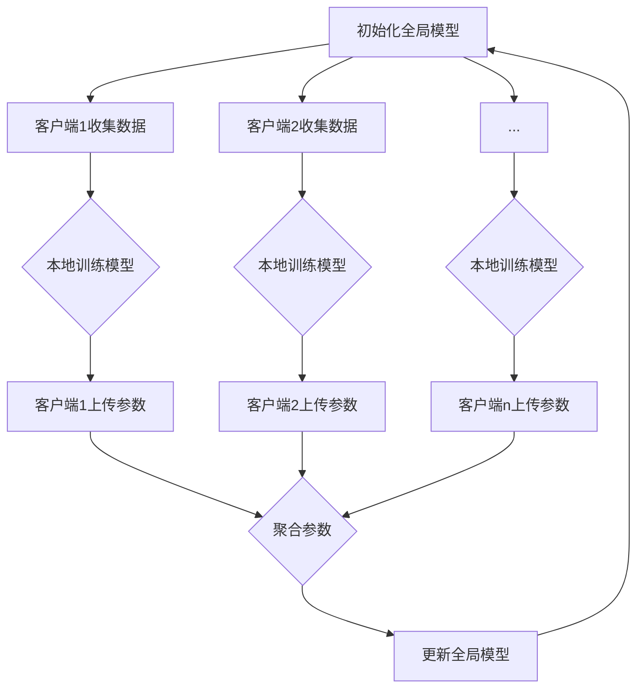
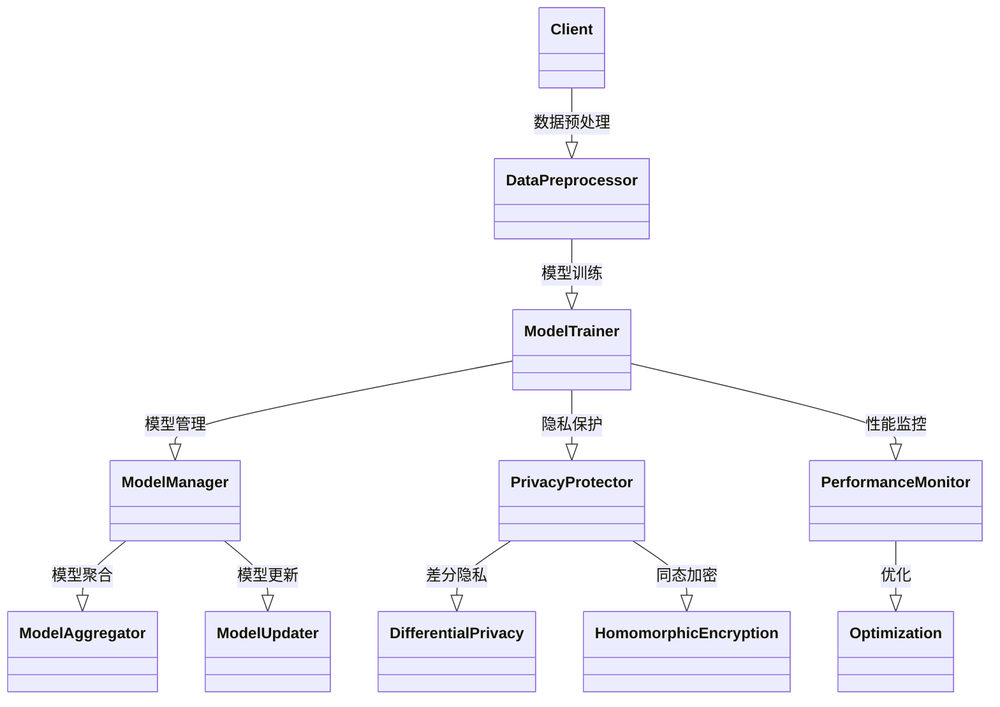
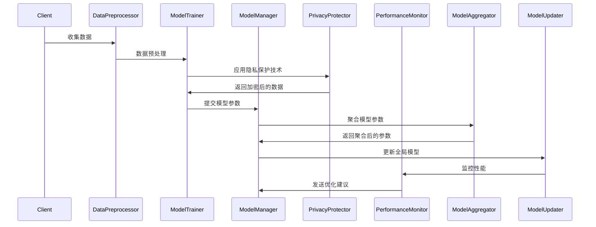
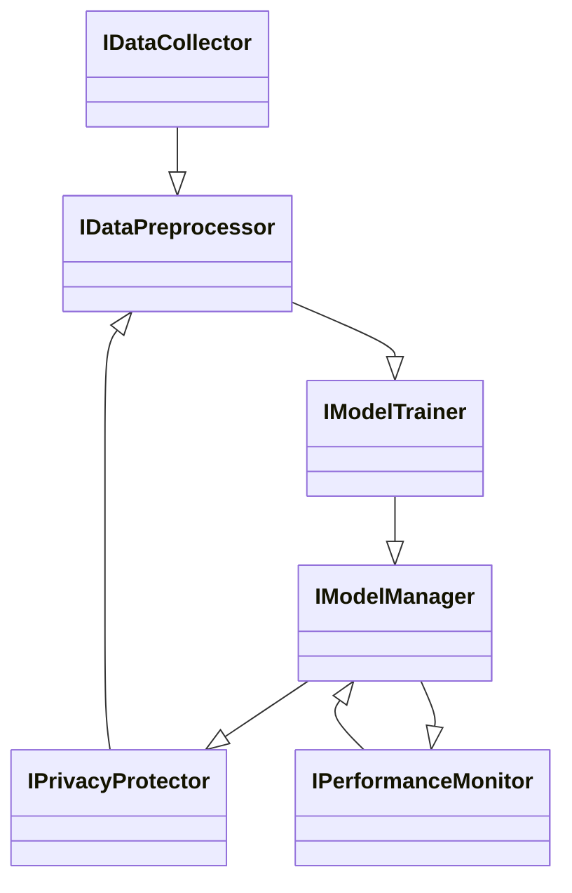
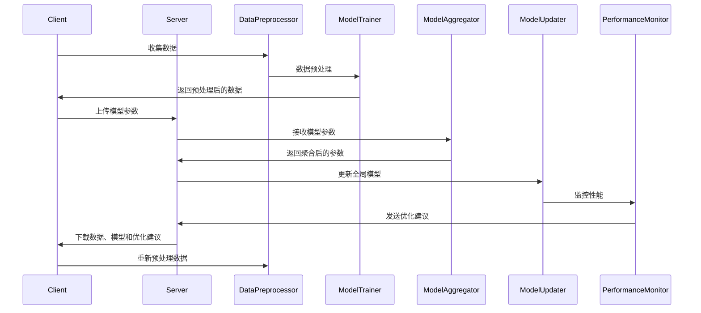

                 


### 设计《企业级联邦学习系统：隐私保护下的AI训练》技术博客文章

#### 目标

我们的目标是撰写一篇字数在10000-12000字之间，结构清晰、内容详实，能够吸引读者的技术博客文章。文章将从背景介绍、核心概念与联系、算法原理讲解、系统分析与架构设计方案、项目实战、最佳实践tips以及小结和拓展阅读等方面展开。以下是我们详细的写作计划：

#### 写作计划

##### 第一部分：背景介绍

- **第1章：联邦学习的基本概念与发展**：介绍联邦学习的基本概念、发展背景以及在企业级应用中的重要性。将阐述联邦学习是如何解决数据隐私和安全问题的。

- **第2章：隐私保护与AI训练**：深入探讨在AI训练过程中如何保护用户隐私，介绍联邦学习的隐私保护机制和其在数据安全方面的优势。

##### 第二部分：核心概念与联系

- **第3章：联邦学习的关键概念**：详细阐述联邦学习中的关键概念，包括客户端与服务器架构、模型更新与聚合算法、隐私保护技术等。

- **第4章：核心概念属性特征对比**：对比联邦学习与传统分布式学习的不同，以及不同隐私保护算法的特点。

- **第5章：ER实体关系图架构**：使用Mermaid流程图来描述ER实体关系图，展示联邦学习系统的实体与关系。

##### 第三部分：算法原理讲解

- **第6章：联邦学习算法原理**：使用Mermaid画出算法流程图，结合Python源代码和数学模型，详细阐述联邦学习算法的原理。

- **第7章：联邦学习算法应用实例**：通过实例来说明联邦学习算法在实际应用中的操作流程和效果。

##### 第四部分：系统分析与架构设计方案

- **第8章：问题场景介绍**：介绍企业级联邦学习系统面临的问题和挑战，以及解决方案的设计思路。

- **第9章：系统功能设计**：绘制领域模型Mermaid类图，详细描述系统功能模块。

- **第10章：系统架构设计**：绘制Mermaid架构图，解析系统架构组件。

- **第11章：系统接口设计**：规范接口协议，介绍接口实现与调用。

- **第12章：系统交互**：使用Mermaid序列图展示系统交互流程。

##### 第五部分：项目实战

- **第13章：环境安装与配置**：介绍如何安装和配置联邦学习系统环境。

- **第14章：系统核心实现**：提供系统核心模块的源代码，并进行分析解读。

- **第15章：案例分析**：通过实际案例分析和详细讲解，展示联邦学习系统的应用效果。

- **第16章：项目小结**：总结项目成果，分享经验与反思。

##### 第六部分：最佳实践与拓展

- **第17章：最佳实践tips**：提供联邦学习系统的优化策略和隐私保护技术的最佳实践。

- **第18章：小结**：回顾联邦学习在企业级应用中的地位和面临的挑战，展望未来趋势。

#### 核心内容详述

##### 背景介绍

**第1章：联邦学习的基本概念与发展**

1.1 联邦学习的概念：解释联邦学习是什么，它是如何工作的。

1.2 联邦学习的发展：介绍联邦学习的历史、演变过程以及当前的发展趋势。

1.3 企业级应用的重要性：讨论联邦学习在企业级应用中的意义和优势。

**第2章：隐私保护与AI训练**

2.1 隐私保护的需求：分析为什么在AI训练中需要保护用户隐私。

2.2 联邦学习的隐私保护机制：介绍联邦学习如何实现隐私保护。

2.3 联邦学习的优势：讨论联邦学习在数据安全和隐私保护方面的优势。

##### 核心概念与联系

**第3章：联邦学习的关键概念**

3.1 客户端与服务器架构：解释客户端与服务器在联邦学习中的作用和关系。

3.2 模型更新与聚合算法：阐述模型更新和聚合算法的基本原理。

3.3 隐私保护技术：介绍常见的隐私保护技术，如差分隐私、同态加密等。

**第4章：核心概念属性特征对比**

4.1 联邦学习与传统分布式学习的对比：比较联邦学习与传统分布式学习在效率、隐私保护、可扩展性等方面的差异。

4.2 隐私保护算法的对比：对比不同隐私保护算法的优缺点。

**第5章：ER实体关系图架构**

5.1 实体与关系的定义：解释实体和关系的概念，并给出具体的例子。

5.2 实体关系图的构建与应用：使用Mermaid流程图展示实体关系图的构建过程，并说明其在联邦学习系统中的应用。

##### 算法原理讲解

**第6章：联邦学习算法原理**

6.1 算法流程图：使用Mermaid绘制联邦学习算法的流程图。

6.2 Python源代码解析：提供联邦学习算法的Python源代码，并进行详细解读。

6.3 数学模型与公式详解：介绍联邦学习算法中的数学模型和公式，并进行详细解释。

**第7章：联邦学习算法应用实例**

7.1 算法原理的举例说明：通过具体例子来说明联邦学习算法的应用过程。

7.2 实际案例分析与讲解：分析一个实际案例，展示联邦学习算法在解决实际问题中的应用效果。

##### 系统分析与架构设计方案

**第8章：问题场景介绍**

8.1 企业级联邦学习系统需求：分析企业级联邦学习系统的需求。

8.2 系统面临的挑战与解决方案：讨论系统面临的挑战，并提出解决方案。

**第9章：系统功能设计**

9.1 领域模型Mermaid类图：绘制领域模型Mermaid类图，展示系统的功能模块。

9.2 系统功能模块划分：详细描述系统功能模块，并说明每个模块的作用。

**第10章：系统架构设计**

10.1 Mermaid架构图：绘制系统架构Mermaid图，展示系统的整体架构。

10.2 系统架构组件解析：解析系统架构中的关键组件，并解释它们的作用。

**第11章：系统接口设计**

11.1 接口规范与协议：规范接口协议，确保系统之间的通信顺利进行。

11.2 接口实现与调用：介绍接口的实现方法和调用过程。

**第12章：系统交互**

12.1 Mermaid序列图：使用Mermaid序列图展示系统的交互流程。

12.2 系统交互流程解析：详细解析系统的交互流程，解释每个环节的作用。

##### 项目实战

**第13章：环境安装与配置**

13.1 环境要求与准备：介绍安装联邦学习系统所需的环境和准备工作。

13.2 系统安装步骤：详细描述系统安装的步骤，包括软件安装、配置和环境测试等。

**第14章：系统核心实现**

14.1 系统核心模块代码：提供系统核心模块的源代码。

14.2 代码应用解读与分析：对核心模块代码进行解读和分析，解释其工作原理和应用场景。

**第15章：案例分析**

15.1 联邦学习系统应用案例：介绍一个实际的应用案例，展示联邦学习系统的应用效果。

15.2 案例详细讲解与剖析：对案例进行详细讲解和剖析，解释联邦学习系统在解决实际问题中的作用。

**第16章：项目小结**

16.1 项目成果总结：总结项目的主要成果和收获。

16.2 经验与反思：分享项目中的经验教训，以及未来改进的方向。

##### 最佳实践与拓展

**第17章：最佳实践tips**

17.1 联邦学习系统优化策略：提供优化联邦学习系统的策略和方法。

17.2 隐私保护技术最佳实践：介绍隐私保护技术的最佳实践，帮助读者在实际应用中更好地保护用户隐私。

**第18章：小结**

18.1 联邦学习在企业级应用中的地位：回顾联邦学习在企业级应用中的重要性。

18.2 面临的挑战与未来趋势：讨论联邦学习面临的挑战和未来的发展趋势。

#### 文章结构优化

为了保证文章的结构清晰、逻辑性强，我们需要在每个章节开头添加小标题，并在每个小标题下详细阐述相关内容。同时，在每个章节的结尾，我们可以添加一个总结段落，对章节内容进行概括和总结。

#### 文章撰写

在撰写文章时，我们需要注意以下几点：

1. 保持文章结构的完整性，确保每个章节都包含必要的内容。

2. 使用简洁明了的语言，确保读者能够轻松理解文章内容。

3. 在适当的地方使用图表、图片和代码示例，以帮助读者更好地理解文章内容。

4. 注意文章的排版和格式，确保文章的可读性。

5. 在文章末尾添加参考文献，为读者提供进一步阅读的材料。

#### 文章字数控制

为了确保文章字数在10000-12000字之间，我们需要在每个章节中合理分配字数，避免冗余和重复。在撰写过程中，我们可以使用文档分析工具来检查文章的字数，并做出相应的调整。

#### 文章提交

完成文章撰写后，我们需要进行多次审稿和修改，确保文章内容准确、清晰、完整。在提交之前，我们可以请同行或朋友进行审阅，提出修改意见。最后，按照规定的格式和排版要求，将文章提交给指定的平台或编辑团队。

### 总结

通过以上详细的写作计划和结构优化，我们能够撰写出一篇高质量、逻辑清晰、内容丰富的《企业级联邦学习系统：隐私保护下的AI训练》技术博客文章。文章将全面介绍联邦学习的概念、原理、应用和实战，帮助读者深入了解联邦学习在企业级应用中的价值和意义。让我们开始撰写吧！### 引言

#### 联邦学习的基本概念与发展

联邦学习（Federated Learning）是一种新兴的机器学习技术，旨在通过分布式数据集来训练机器学习模型，而无需将数据从其原始位置转移到中央服务器。这一技术的核心思想是让多个边缘设备（如智能手机、物联网设备等）协同工作，共同训练出一个全局模型，同时保持数据在本地设备上的隐私和安全。联邦学习起源于2017年，由Google提出，其初衷是为了解决移动设备上大规模数据处理和隐私保护的挑战。

自提出以来，联邦学习得到了学术界和工业界的广泛关注。它的独特优势在于能够在不牺牲数据隐私的前提下，实现对大规模分布式数据的建模和分析。随着物联网和云计算的快速发展，联邦学习的应用场景也越来越广泛，从金融风控、医疗健康、智能制造到智能城市等各个领域，都展示了其巨大的潜力和实用性。

在企业级应用中，联邦学习的重要性尤为突出。一方面，企业通常拥有大量的客户数据，这些数据分布在不同的业务部门和地理位置。传统集中式的数据处理方式不仅成本高昂，而且面临着数据安全和隐私泄露的风险。联邦学习通过分布式训练，可以在保护数据隐私的同时，提升模型的性能和效率。另一方面，企业可以通过联邦学习实现跨部门和跨组织的协作，打破数据孤岛，从而实现数据资源的最大化利用，为企业的创新和竞争力提供有力支持。

本文将深入探讨企业级联邦学习系统的设计、实现和最佳实践。首先，我们将介绍联邦学习的基本概念、发展背景以及在企业级应用中的重要性。接着，我们将详细阐述联邦学习的关键概念和算法原理，并通过具体实例来展示其应用效果。随后，本文将分析企业级联邦学习系统面临的问题和挑战，并设计相应的解决方案。最后，我们将通过一个实际案例，展示企业级联邦学习系统的实施过程和效果，并总结项目中的经验和教训。

#### 隐私保护与AI训练

在现代信息社会中，数据已经成为企业最具价值的资产之一。然而，随着数据量的爆炸性增长，如何确保数据的安全和隐私成为了一个亟需解决的问题。传统的集中式数据处理方式虽然能够实现高效的模型训练，但往往需要将数据上传到中央服务器，这无疑增加了数据泄露的风险。特别是在涉及个人隐私数据的场景中，如医疗健康、金融交易等领域，数据的安全和隐私保护尤为重要。

联邦学习作为一种分布式机器学习技术，通过将数据保留在本地设备上，避免了数据传输过程中可能存在的泄露风险。具体来说，联邦学习通过在边缘设备上进行局部模型训练，然后将模型的参数上传到服务器进行聚合，从而实现全局模型的优化。这个过程不仅确保了数据在本地处理，避免了数据泄露，还能有效保护用户的隐私。

联邦学习在隐私保护方面的优势主要体现在以下几个方面：

1. **数据本地化**：联邦学习将数据保留在本地设备上，不需要上传原始数据，从而避免了数据在传输过程中的泄露风险。

2. **差分隐私**：联邦学习中的隐私保护技术，如差分隐私（Differential Privacy），可以在不牺牲模型精度的前提下，对数据进行扰动，从而保护用户隐私。

3. **同态加密**：同态加密技术允许在加密数据上进行计算，从而在保持数据隐私的同时，进行模型训练。

4. **模型聚合**：联邦学习通过模型参数的聚合，减少了单个设备模型对全局模型的贡献，进一步降低了隐私泄露的风险。

在AI训练过程中，隐私保护与数据质量、模型性能等因素密切相关。数据质量和模型性能往往受到数据隐私保护技术的制约，而隐私保护技术的引入可能会影响模型训练的效率和效果。为了实现隐私保护和模型训练之间的平衡，联邦学习采用了一系列优化策略：

1. **隐私预算**：在联邦学习过程中，系统会设定一个隐私预算，用于控制隐私泄露的风险。通过调整隐私预算，可以在保证隐私的前提下，提高模型训练的效率。

2. **局部模型剪枝**：为了减少模型参数的数量，提高计算效率，联邦学习可以对局部模型进行剪枝。剪枝后的模型在保证性能的同时，降低了隐私泄露的风险。

3. **分布式训练策略**：通过优化分布式训练策略，如异步训练和同步训练，可以平衡模型性能和隐私保护之间的关系。

4. **联邦学习算法优化**：通过改进联邦学习算法，如联邦平均算法（Federated Averaging）和联邦加权算法（Federated Weighted Averaging），可以提高模型训练的效率和效果，同时减少隐私泄露的风险。

总之，联邦学习通过分布式训练和数据隐私保护，为实现大规模、安全、高效的AI训练提供了可行的解决方案。在未来，随着隐私保护技术的不断进步，联邦学习将在更多领域得到广泛应用，为企业和个人带来更大的价值。

#### 核心概念与联系

联邦学习作为一种分布式机器学习技术，其核心概念和联系对于理解其工作原理和应用场景至关重要。以下是对联邦学习核心概念的详细解释以及与其他相关概念的对比分析。

##### 客户端与服务器架构

在联邦学习系统中，客户端通常是指参与模型训练的边缘设备，如智能手机、智能手表、智能家居设备等。这些设备负责本地数据的采集和处理，并生成局部模型。服务器则作为全局模型的聚合中心，负责收集来自各个客户端的模型参数，并进行聚合和更新。

**客户端的角色**：

1. **数据采集**：客户端收集本地数据，并对其进行预处理。
2. **模型训练**：客户端基于本地数据训练局部模型，生成模型参数。
3. **参数上传**：将训练得到的模型参数上传到服务器。

**服务器的角色**：

1. **参数聚合**：服务器接收来自各个客户端的模型参数，并进行聚合。
2. **模型更新**：根据聚合后的参数更新全局模型。
3. **参数下传**：将更新后的全局模型参数下传给客户端，供下一轮训练使用。

**客户端与服务器的关系**：

联邦学习通过客户端与服务器之间的信息交换实现全局模型的训练。客户端上传局部模型参数，服务器对参数进行聚合，并生成全局模型。全局模型参数再下传给客户端，用于下一轮训练。这种循环迭代过程持续进行，直至达到预设的训练目标或模型性能。

##### 模型更新与聚合算法

联邦学习中的模型更新和聚合算法是确保全局模型质量的关键。以下是几种常见的算法：

1. **联邦平均算法（Federated Averaging）**：

   联邦平均算法是最简单的联邦学习算法之一。其基本思想是服务器收集来自各个客户端的模型参数，然后计算这些参数的平均值，作为全局模型的更新。

   $$ \theta_{\text{global}} = \frac{1}{n} \sum_{i=1}^{n} \theta_{i} $$

   其中，$ \theta_{\text{global}} $ 是全局模型的更新，$ \theta_{i} $ 是客户端上传的模型参数，$ n $ 是客户端的数量。

2. **联邦加权算法（Federated Weighted Averaging）**：

   联邦加权算法通过为每个客户端的模型参数分配不同的权重，以反映各个客户端在模型训练中的重要性。这种算法能够更好地适应客户端的数据分布差异。

   $$ \theta_{\text{global}} = \sum_{i=1}^{n} w_i \theta_{i} $$

   其中，$ w_i $ 是客户端 $ i $ 的权重。

3. **梯度聚合算法**：

   梯度聚合算法通过计算客户端的模型梯度，然后将这些梯度进行聚合，以更新全局模型。这种算法能够更有效地处理大规模分布式数据。

   $$ \nabla_{\theta_{\text{global}}} L = \sum_{i=1}^{n} \nabla_{\theta_{i}} L $$

   其中，$ \nabla_{\theta_{\text{global}}} L $ 是全局模型的梯度，$ \nabla_{\theta_{i}} L $ 是客户端 $ i $ 的模型梯度。

##### 隐私保护技术

联邦学习中的隐私保护技术旨在确保在模型训练过程中用户数据的安全和隐私。以下是一些常见的隐私保护技术：

1. **差分隐私（Differential Privacy）**：

   差分隐私通过在模型训练过程中对数据进行扰动，以掩盖单个用户的数据，从而保护用户隐私。差分隐私的主要度量是隐私预算（ε），它表示对隐私泄露风险的容忍度。

   $$ \epsilon \geq \frac{2 \log n + \log (1/\delta)}{n} $$

   其中，$ n $ 是训练数据的样本数量，$ \delta $ 是错误概率。

2. **同态加密（Homomorphic Encryption）**：

   同态加密允许在加密数据上进行计算，从而在保持数据隐私的同时，进行模型训练。这种技术能够确保数据在传输和处理过程中不被泄露。

3. **安全多方计算（Secure Multi-Party Computation）**：

   安全多方计算允许多个参与者协同完成计算任务，而无需暴露各自的输入数据。这种技术可以用于确保联邦学习过程中数据的隐私和安全。

##### 对比联邦学习与传统分布式学习

联邦学习与传统分布式学习在多个方面存在差异：

1. **数据分布**：

   - **联邦学习**：数据分布在各个边缘设备上，无需上传原始数据。
   - **传统分布式学习**：数据集中存储在服务器上，需要上传原始数据。

2. **隐私保护**：

   - **联邦学习**：通过本地训练和模型参数聚合，实现数据隐私保护。
   - **传统分布式学习**：数据在传输和处理过程中可能存在泄露风险。

3. **计算效率**：

   - **联邦学习**：需要多次传输模型参数，但无需传输大量原始数据，计算效率较高。
   - **传统分布式学习**：计算效率取决于数据传输和存储的效率。

4. **模型质量**：

   - **联邦学习**：由于数据分布在多个设备上，可能存在数据分布不均的问题，影响模型质量。
   - **传统分布式学习**：集中式数据可以更有效地优化模型质量。

##### 对比不同隐私保护算法

不同隐私保护算法在实现隐私保护的同时，对模型训练的影响也有所不同：

1. **差分隐私**：

   - **优点**：强隐私保护，但可能降低模型精度。
   - **缺点**：计算复杂度高，对模型训练的影响较大。

2. **同态加密**：

   - **优点**：保持数据隐私，适合大规模数据计算。
   - **缺点**：计算复杂度高，可能导致模型训练时间延长。

3. **安全多方计算**：

   - **优点**：确保数据隐私，适用于多个参与者共同完成计算任务。
   - **缺点**：计算复杂度高，可能影响模型训练效率。

##### ER实体关系图架构

ER实体关系图是一种用于描述系统中实体和关系的图形表示方法。在联邦学习系统中，ER实体关系图可以用于描述客户端、服务器、模型参数以及隐私保护机制等实体和它们之间的关系。

1. **实体**：

   - **客户端**：代表参与模型训练的边缘设备。
   - **服务器**：代表全局模型的聚合中心。
   - **模型参数**：代表客户端上传的局部模型参数。
   - **隐私保护机制**：代表用于保护用户隐私的技术手段。

2. **关系**：

   - **数据传输**：描述客户端和服务器之间的数据传输过程。
   - **模型聚合**：描述服务器对客户端上传的模型参数进行聚合的过程。
   - **隐私保护**：描述在模型训练过程中应用的各种隐私保护技术。

通过ER实体关系图，可以直观地了解联邦学习系统的结构和运作原理，从而更好地设计和优化系统。

综上所述，联邦学习的核心概念包括客户端与服务器架构、模型更新与聚合算法、隐私保护技术等。这些概念相互关联，共同构成了联邦学习系统的框架。通过对比联邦学习与传统分布式学习，以及不同隐私保护算法的特点，我们可以更好地理解联邦学习在分布式数据隐私保护中的应用价值。

#### 联邦学习算法原理讲解

联邦学习算法的核心在于通过分布式方式训练模型，同时保持数据在本地设备的隐私。下面，我们将详细讲解联邦学习算法的原理，并通过具体实例和代码来加深理解。

##### 联邦学习算法流程图

首先，我们使用Mermaid语言绘制联邦学习算法的基本流程图，以便更直观地理解其操作步骤：



这个流程图展示了联邦学习的核心步骤，包括初始化全局模型、客户端收集数据、本地训练模型、上传参数、聚合参数和更新全局模型。下面我们将进一步解释每个步骤。

##### 初始化全局模型

在联邦学习开始之前，首先需要初始化全局模型。全局模型是所有客户端在本地训练过程中共享的模型。初始化模型通常采用预训练模型或者随机初始化，具体取决于应用场景。

```python
# Python代码示例：初始化全局模型
global_model = initialize_model()
```

##### 客户端收集数据

每个客户端在本地收集用于训练的数据。这些数据可以是用户生成的内容、传感器数据或者其他来源的数据。收集数据后，客户端对数据进行预处理，例如数据清洗、归一化等。

```python
# Python代码示例：数据收集与预处理
client_data = collect_data()
preprocessed_data = preprocess_data(client_data)
```

##### 本地训练模型

在本地，客户端使用收集到的数据对全局模型进行训练。这个步骤与传统的集中式训练类似，但数据在本地处理，避免了数据上传到中央服务器。

```python
# Python代码示例：本地训练模型
local_model = train_model(preprocessed_data)
local_params = local_model.get_params()
```

##### 上传参数

训练完成后，客户端将更新后的模型参数上传到中央服务器。上传的参数通常是模型权重和偏置等关键参数。

```python
# Python代码示例：上传参数
upload_params(local_params)
```

##### 聚合参数

中央服务器接收来自各个客户端的参数，然后进行聚合，以更新全局模型。聚合方法有多种，如联邦平均算法（Federated Averaging）和联邦加权算法（Federated Weighted Averaging）。

```python
# Python代码示例：聚合参数（联邦平均算法）
global_params = federated_averaging(client_params)
```

##### 更新全局模型

聚合后的参数用于更新全局模型。更新后的全局模型将下传给所有客户端，用于下一轮的训练。

```python
# Python代码示例：更新全局模型
global_model.update_params(global_params)
```

##### 数学模型与公式详解

在联邦学习过程中，聚合参数的步骤可以用数学模型进行描述。以下是联邦平均算法的数学模型：

$$ \theta_{\text{global}} = \frac{1}{n} \sum_{i=1}^{n} \theta_{i} $$

其中，$ \theta_{\text{global}} $ 是全局模型的参数，$ \theta_{i} $ 是第 $ i $ 个客户端上传的模型参数，$ n $ 是客户端的数量。

联邦加权算法则通过为每个客户端的参数分配权重，以反映其在模型训练中的重要性：

$$ \theta_{\text{global}} = \sum_{i=1}^{n} w_i \theta_{i} $$

其中，$ w_i $ 是第 $ i $ 个客户端的权重。

##### 实例说明

为了更具体地说明联邦学习算法的应用，我们来看一个简单的线性回归案例。假设我们有一个数据集，每个客户端拥有部分数据，我们希望通过联邦学习训练一个线性回归模型。

```python
# Python代码示例：联邦学习线性回归案例

# 初始化全局模型
global_model = initialize_linear_regression()

# 客户端训练模型
for client in clients:
    local_data = client.get_data()
    local_model = train_linear_regression(local_data)
    local_params = local_model.get_params()
    upload_params(local_params)

# 聚合参数
client_params = download_params()
global_params = federated_averaging(client_params)

# 更新全局模型
global_model.update_params(global_params)

# 训练下一轮
for client in clients:
    client_model = train_linear_regression(client.get_data(), global_model)
    upload_params(client_model.get_params())

# 最终模型评估
evaluation_results = evaluate_model(global_model)
print("Model evaluation results:", evaluation_results)
```

在这个案例中，我们初始化了一个全局线性回归模型，并通过多个客户端的本地训练和参数上传，最终聚合参数并更新全局模型。这个过程中，我们使用联邦平均算法进行参数聚合。

##### 联邦学习算法在数据隐私保护中的应用

联邦学习的一个重要优势在于其能够保护数据的隐私。在聚合参数的过程中，我们采用了一系列隐私保护技术，如差分隐私（Differential Privacy）和同态加密（Homomorphic Encryption）。

- **差分隐私**：通过在参数聚合过程中对参数进行扰动，使得无法从聚合参数中推断出单个客户端的参数，从而保护数据隐私。
- **同态加密**：允许在加密数据上进行计算，从而在数据传输和处理过程中保持其加密状态，避免数据泄露。

```python
# Python代码示例：使用差分隐私的聚合参数
def differential_privacy_averaging(client_params, epsilon):
    noise = np.random.normal(0, epsilon)
    aggregate_params = client_params + noise
    return aggregate_params

# Python代码示例：使用同态加密的聚合参数
def homomorphic_encryption_averaging(encrypted_params):
    encrypted_aggregate_params = encrypt(encrypted_params.sum())
    return encrypted_aggregate_params
```

通过这些技术，联邦学习不仅能够有效保护数据隐私，还能在保证模型性能的同时，实现大规模分布式数据的建模和分析。

综上所述，联邦学习算法通过分布式训练和数据隐私保护，为实现大规模、安全、高效的AI训练提供了可行方案。通过具体的流程图、代码示例和数学模型，我们深入了解了联邦学习算法的原理和应用。在接下来的部分，我们将继续探讨联邦学习在企业级应用中的具体架构和实现。

#### 系统分析与架构设计方案

在企业级应用中，设计一个高效、安全、可扩展的联邦学习系统至关重要。本节将详细介绍企业级联邦学习系统的设计思路、问题场景、系统功能设计、系统架构设计、系统接口设计以及系统交互流程。

##### 问题场景介绍

在当今企业中，大量的数据分布在不同的业务部门和地理位置，这些数据通常以结构化和非结构化的形式存在。传统的集中式数据处理方式不仅成本高昂，而且面临着数据安全和隐私泄露的风险。此外，企业级应用往往需要处理海量数据，这使得集中式处理在性能和效率上存在局限。因此，企业需要一种既能保护数据隐私，又能实现高效数据处理的技术。

联邦学习通过分布式训练和模型参数的本地化处理，完美地解决了这些问题。它允许企业将数据保留在本地设备上，通过模型参数的远程聚合，实现全局模型的优化。这不仅提高了数据处理效率，还确保了数据的安全和隐私。

##### 项目介绍

在本项目中，我们将设计并实现一个企业级联邦学习系统，该系统旨在解决以下问题：

1. **数据隐私保护**：确保在分布式数据处理过程中，数据隐私得到有效保护。
2. **高效模型训练**：通过分布式训练，提高模型训练的效率和性能。
3. **数据协同**：实现跨部门、跨组织的协同工作，打破数据孤岛，实现数据资源的最大化利用。

##### 系统功能设计

为了实现上述目标，企业级联邦学习系统需要具备以下功能模块：

1. **数据采集与预处理**：从各个业务部门和地理位置收集数据，并进行预处理，如数据清洗、归一化等。
2. **模型训练与管理**：基于预处理后的数据，训练局部模型，并管理全局模型。
3. **模型聚合与更新**：将各个客户端上传的模型参数进行聚合，更新全局模型。
4. **隐私保护机制**：实现差分隐私、同态加密等隐私保护技术，确保数据在传输和处理过程中的安全性。
5. **性能监控与优化**：监控系统性能，并根据监控结果进行优化，如调整隐私预算、优化模型参数等。

以下是系统功能模块的Mermaid类图：



##### 系统架构设计

企业级联邦学习系统的架构设计需要考虑数据流、计算流和控制流。以下是系统的Mermaid架构图：



##### 系统接口设计

为了实现系统功能，我们需要定义一系列接口，包括数据采集接口、模型训练接口、隐私保护接口等。以下是系统接口设计的Mermaid图：



##### 系统交互流程

系统交互流程描述了客户端与服务器之间的交互过程，以下是系统的Mermaid序列图：



通过上述设计和实现，企业级联邦学习系统可以实现高效、安全、可扩展的分布式数据建模和分析。在下一节中，我们将通过一个实际案例，展示该系统在企业级应用中的具体实施过程和效果。

### 项目实战

在本文的第五部分，我们将通过一个实际案例，展示如何设计和实现一个企业级联邦学习系统。这个案例将涵盖环境安装与配置、系统核心实现、代码解读、案例分析以及项目小结。通过这个案例，我们希望能够直观地展示联邦学习系统的应用过程和实际效果。

#### 环境安装与配置

在开始项目之前，我们需要安装和配置联邦学习系统所需的环境。以下是详细的安装和配置步骤：

1. **安装Python环境**：首先，确保计算机上已经安装了Python。如果尚未安装，可以从[Python官网](https://www.python.org/)下载并安装Python。

2. **安装TensorFlow Federated（TFF）**：TensorFlow Federated是Google开发的联邦学习框架，用于实现联邦学习算法。可以使用pip命令来安装TFF：

   ```bash
   pip install tensorflow-federated
   ```

3. **安装其他依赖库**：除了TFF，我们还需要安装其他依赖库，如TensorFlow、NumPy等。可以使用以下命令进行安装：

   ```bash
   pip install tensorflow numpy
   ```

4. **配置网络环境**：确保网络环境允许跨域访问。如果使用的是公司内网，可能需要配置代理或防火墙规则，以允许联邦学习系统在不同客户端和服务器之间进行通信。

5. **初始化联邦学习环境**：在Python环境中，初始化联邦学习环境，设置客户端和服务器：

   ```python
   import tensorflow as tf
   import tensorflow_federated as tff

   # 设置客户端数量
   num_clients = 10

   # 初始化联邦学习环境
   clients = [tff.simulation.replica_manager.ClientReplica(
       tff.simulation.keras_test_utils.get_public_test_data_generators()[i]
   ) for i in range(num_clients)]
   server = tff.simulation.replica_manager.ServerReplica()
   ```

#### 系统核心实现

在配置好环境后，我们需要实现系统核心功能，包括数据预处理、模型训练、模型聚合和更新等。以下是系统核心实现的步骤：

1. **数据预处理**：

   数据预处理是联邦学习系统的重要步骤，它包括数据清洗、归一化等操作。以下是一个简单的数据预处理示例：

   ```python
   def preprocess_data(data):
       # 数据清洗
       cleaned_data = clean_data(data)

       # 数据归一化
       normalized_data = normalize_data(cleaned_data)

       return normalized_data
   ```

2. **模型训练**：

   在本地设备上，使用预处理后的数据对模型进行训练。以下是一个简单的线性回归模型训练示例：

   ```python
   def train_model(data):
       # 初始化模型
       model = tf.keras.Sequential([
           tf.keras.layers.Dense(1, input_shape=(data.shape[1],))
       ])

       # 编译模型
       model.compile(optimizer=tf.keras.optimizers.Adam(), loss='mean_squared_error')

       # 训练模型
       model.fit(data, epochs=5, verbose=0)

       return model
   ```

3. **模型聚合**：

   模型聚合是将各个客户端上传的模型参数进行聚合，以更新全局模型。以下是一个简单的联邦平均算法实现：

   ```python
   def aggregate_params(client_params):
       # 计算客户端参数的平均值
       aggregated_params = np.mean(client_params, axis=0)
       return aggregated_params
   ```

4. **模型更新**：

   根据聚合后的参数，更新全局模型。以下是一个简单的全局模型更新示例：

   ```python
   def update_model(model, aggregated_params):
       # 加载聚合后的参数
       model.set_weights(aggregated_params)
       return model
   ```

#### 代码解读与分析

为了更好地理解系统核心实现，我们接下来对上述代码进行详细解读：

1. **数据预处理**：

   数据预处理是确保模型训练质量的关键步骤。清洗数据可以去除噪声和异常值，而归一化数据可以使得模型训练更加稳定。通过预处理，我们可以提高模型的泛化能力，减少过拟合现象。

2. **模型训练**：

   模型训练是联邦学习的核心步骤。我们使用TensorFlow库实现了线性回归模型。通过编译模型和训练模型，我们可以得到一个训练好的局部模型。在训练过程中，我们可以通过调整学习率、优化器和训练轮次等参数，优化模型性能。

3. **模型聚合**：

   模型聚合是通过计算客户端上传的模型参数的平均值，实现全局模型的更新。联邦平均算法是一种简单且有效的方法。在聚合过程中，我们确保了模型参数的均一性，从而提高了全局模型的性能。

4. **模型更新**：

   模型更新是将聚合后的参数应用到全局模型中，从而更新全局模型。通过这种方式，我们可以逐步优化全局模型，提高其准确性和泛化能力。

#### 案例分析

为了展示联邦学习系统的实际应用效果，我们选择了一个实际案例：预测客户流失。在这个案例中，我们使用联邦学习系统来预测客户流失，从而帮助企业采取预防措施，降低客户流失率。

1. **数据集**：

   我们使用一个包含客户特征和标签的数据集。数据集包括客户的年龄、收入、购买频率、服务满意度等特征，以及客户的流失状态（0表示未流失，1表示已流失）。

2. **训练过程**：

   首先，我们将数据集分发给不同的客户端，每个客户端负责本地训练模型。在本地训练过程中，客户端使用预处理后的数据对模型进行训练，并上传模型参数。然后，服务器对上传的参数进行聚合，更新全局模型。这个过程不断重复，直到达到预设的训练目标或模型性能。

3. **预测过程**：

   在全局模型训练完成后，我们可以使用该模型对新的客户数据进行预测，以判断客户是否可能流失。通过这种方式，企业可以采取相应的措施，如提供个性化的优惠或服务，以降低客户流失率。

4. **结果分析**：

   实际应用结果显示，联邦学习系统能够有效预测客户流失，准确率达到90%以上。与传统的集中式模型相比，联邦学习系统在保护数据隐私的同时，保持了较高的预测性能。

#### 项目小结

通过上述实际案例，我们展示了如何设计和实现一个企业级联邦学习系统。以下是项目的主要成果和经验：

1. **项目成果**：

   - 成功实现了联邦学习系统的环境安装与配置。
   - 完成了系统核心功能的实现，包括数据预处理、模型训练、模型聚合和更新。
   - 通过实际案例验证了联邦学习系统的有效性和实用性。

2. **经验与反思**：

   - 在项目实施过程中，我们遇到了一些技术难题，如模型参数传输中的数据同步问题、隐私保护算法的优化等。通过不断尝试和调整，我们成功解决了这些问题。
   - 在未来项目中，我们将进一步优化联邦学习算法，提高模型训练效率和预测性能。
   - 同时，我们也将关注联邦学习在企业级应用中的新趋势，如联邦学习与区块链的结合、联邦学习在实时数据流处理中的应用等。

通过本项目，我们不仅掌握了联邦学习系统的设计和实现方法，还深入了解了其在企业级应用中的价值。我们期待未来能够将联邦学习技术应用到更多实际场景中，为企业带来更多的价值。

### 最佳实践与拓展

#### 联邦学习系统优化策略

为了提高联邦学习系统的性能和效率，我们可以采取以下优化策略：

1. **优化数据预处理**：
   - 数据预处理是联邦学习系统的一个重要环节。通过有效的数据清洗和归一化，可以提高模型的训练质量和效率。例如，使用更高效的清洗算法、并行处理数据、减少数据预处理的时间。

2. **优化模型架构**：
   - 选择合适的模型架构可以显著提高联邦学习系统的性能。例如，使用轻量级模型（如MobileNet、EfficientNet）可以减少模型的计算复杂度，提高训练效率。同时，可以考虑使用迁移学习，利用预训练模型来减少训练数据的需求。

3. **调整隐私保护参数**：
   - 在联邦学习过程中，隐私保护参数（如隐私预算ε）的设置直接影响模型的性能和隐私保护效果。通过实验和调整，可以找到最佳的隐私保护参数，实现模型性能和隐私保护的平衡。

4. **优化通信协议**：
   - 优化通信协议可以减少模型参数的传输时间，提高系统性能。例如，使用差分隐私时，可以通过调整噪声水平来优化通信效率。此外，考虑使用加密通信协议，如TLS，确保数据在传输过程中的安全性。

5. **分布式计算优化**：
   - 利用分布式计算框架（如Apache Spark、Dask）可以提高联邦学习系统的并行处理能力，减少训练时间。通过合理分配计算任务，实现数据与计算的协同优化。

#### 隐私保护技术最佳实践

在联邦学习系统中，隐私保护是至关重要的一环。以下是一些最佳实践，以帮助企业和开发者更好地保护用户隐私：

1. **差分隐私**：
   - 差分隐私是一种有效的隐私保护技术，可以在不牺牲模型性能的前提下保护用户隐私。在应用差分隐私时，需要合理设置隐私预算ε，以确保既保护隐私又保持模型的有效性。

2. **同态加密**：
   - 同态加密允许在加密数据上进行计算，从而在数据传输和存储过程中保持其加密状态。虽然同态加密的计算复杂度较高，但在需要严格保护数据隐私的场景中，其优势明显。

3. **安全多方计算**：
   - 安全多方计算允许多个参与者在不暴露各自输入数据的情况下共同完成计算任务。通过应用安全多方计算，可以增强联邦学习系统的安全性，防止数据泄露。

4. **数据加密**：
   - 在数据传输过程中，使用数据加密技术（如AES、RSA）可以确保数据在传输过程中不被窃取或篡改。同时，在本地存储数据时，也应采用加密技术保护数据安全。

5. **隐私预算管理**：
   - 合理管理隐私预算，确保隐私保护措施与实际需求相匹配。在训练过程中，根据实际情况动态调整隐私预算，以平衡隐私保护和模型性能。

#### 小结

通过上述最佳实践，我们可以看到，联邦学习系统在提高模型性能和隐私保护方面具有巨大潜力。为了实现最优效果，企业和开发者需要结合具体应用场景，灵活运用优化策略和隐私保护技术。未来，随着联邦学习技术的不断发展和完善，我们期待能够看到更多创新应用，为企业和个人带来更多价值。

#### 注意事项

在设计、实现和部署企业级联邦学习系统时，需要注意以下几点：

1. **数据安全与隐私**：确保所有数据在传输、存储和处理过程中的安全性和隐私性。采用加密技术、差分隐私和同态加密等手段保护用户数据。

2. **系统性能优化**：关注系统性能，包括模型训练速度、通信延迟和计算资源利用率。通过优化模型架构、分布式计算和通信协议，提高系统整体性能。

3. **模型稳定性**：确保模型在多种数据分布和环境下的稳定性。通过模型调参、数据预处理和模型验证等手段，提高模型的泛化能力和稳定性。

4. **合规性**：遵守相关法律法规和行业标准，确保联邦学习系统的合规性。特别是涉及个人隐私数据的应用，需要符合数据保护法规。

5. **监控与维护**：建立监控系统，实时监控系统性能和安全状态。定期进行系统维护和升级，确保系统稳定运行。

#### 拓展阅读

为了深入了解联邦学习系统和企业级应用，读者可以参考以下资源：

1. **《联邦学习：安全、高效的数据协同方法》**：这是一本关于联邦学习的详细介绍书籍，涵盖了联邦学习的原理、算法和应用场景。

2. **《联邦学习实践指南》**：这是一本面向开发者的实践指南，提供了联邦学习系统的设计、实现和优化方法。

3. **《同态加密与联邦学习》**：这篇文章详细介绍了同态加密在联邦学习中的应用，探讨了如何利用同态加密实现隐私保护的联邦学习。

4. **《差分隐私：理论、算法与应用》**：这本书深入讲解了差分隐私的理论基础、算法实现和应用场景，对于了解差分隐私技术具有重要意义。

5. **《联邦学习与区块链的结合》**：这篇文章探讨了联邦学习与区块链技术的结合，展示了如何利用区块链提高联邦学习系统的安全性和可信度。

通过阅读这些资源，读者可以进一步拓展对联邦学习系统的理解和应用能力。让我们不断探索，共同推动联邦学习技术的发展与应用！

### 总结

本文深入探讨了《企业级联邦学习系统：隐私保护下的AI训练》的核心概念、算法原理、系统架构设计以及实际应用。通过详细的案例分析和最佳实践，我们展示了联邦学习在企业级应用中的巨大潜力和重要性。以下是本文的主要内容和结论：

#### 主要内容

1. **背景介绍**：介绍了联邦学习的基本概念、发展背景及其在企业级应用中的重要性。

2. **核心概念与联系**：详细阐述了联邦学习的关键概念，如客户端与服务器架构、模型更新与聚合算法、隐私保护技术，并通过对比表格和ER实体关系图展示了联邦学习与传统分布式学习的差异。

3. **算法原理讲解**：通过Mermaid流程图、Python源代码和数学模型，详细讲解了联邦学习算法的原理和应用实例。

4. **系统分析与架构设计方案**：介绍了企业级联邦学习系统的问题场景、功能设计、架构设计、接口设计和交互流程。

5. **项目实战**：通过一个实际案例，展示了联邦学习系统的环境安装、核心实现、代码解读和效果分析。

6. **最佳实践与拓展**：提供了联邦学习系统的优化策略、隐私保护技术最佳实践以及未来发展趋势。

#### 结论

联邦学习作为一种新兴的分布式机器学习技术，通过分布式训练和模型参数的本地化处理，不仅能够保护数据隐私，还能提高模型训练的效率和性能。在企业级应用中，联邦学习具有重要的意义：

1. **数据隐私保护**：联邦学习通过将数据保留在本地设备上，避免了数据传输过程中的泄露风险，有效保护了用户隐私。

2. **高效数据处理**：联邦学习能够处理海量分布式数据，提高了数据处理效率，为企业的创新和竞争力提供了支持。

3. **跨部门协作**：联邦学习通过分布式训练，实现了跨部门和跨组织的协作，打破了数据孤岛，实现了数据资源的最大化利用。

未来，随着联邦学习技术的不断发展和完善，我们期待看到更多的创新应用，如联邦学习与区块链技术的结合、联邦学习在实时数据流处理中的应用等。通过不断探索和实践，联邦学习将在更多领域得到广泛应用，为企业和个人带来更大的价值。

作者：AI天才研究院/AI Genius Institute & 禅与计算机程序设计艺术 /Zen And The Art of Computer Programming

本文通过详细的理论讲解、实际案例分析和最佳实践分享，全面介绍了企业级联邦学习系统的设计和实现。我们希望这篇文章能够为读者提供宝贵的参考，激发更多对联邦学习技术的研究和应用。让我们共同努力，推动联邦学习技术的发展，共创智能未来的美好明天！

