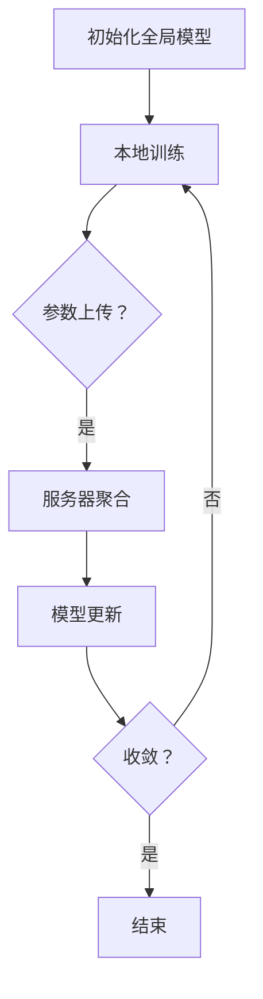
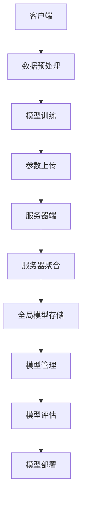
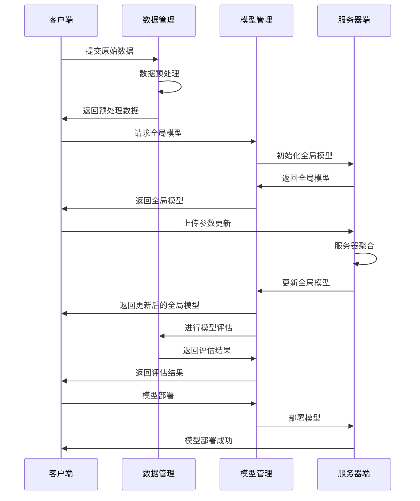

                 


### 第1章: 隐私保护的背景与需求

#### 1.1 问题背景

在当今数字化时代，数据成为企业和社会的重要资产。然而，随着数据量的激增，数据隐私保护问题变得尤为突出。企业面临着日益严峻的法律法规压力，如《通用数据保护条例》（GDPR）和《加州消费者隐私法案》（CCPA），这些法规对数据隐私保护提出了严格的要求。

隐私保护之所以重要，主要有以下几点原因：

1. **法律法规要求**：遵守隐私法规是企业合法运营的基本要求，违规可能导致巨额罚款。
2. **客户信任**：保护用户隐私能够增强用户对企业的信任，提升品牌形象。
3. **商业竞争**：在数据驱动的市场中，企业之间的竞争往往依赖于数据，隐私保护成为核心竞争力之一。

然而，传统的集中式机器学习模型在训练过程中往往需要将用户数据上传到中央服务器，这不仅增加了数据泄露的风险，还可能引发用户隐私纠纷。为了解决这一问题，联邦学习（Federated Learning）应运而生。

#### 1.2 隐私保护的挑战

隐私保护的挑战主要体现在以下几个方面：

1. **数据传输安全**：上传用户数据到中央服务器存在数据泄露的风险。
2. **数据匿名化**：虽然数据可以匿名化处理，但这可能降低数据的有效性。
3. **数据隐私与数据可用性的平衡**：如何在保护隐私的同时，确保数据的有效性和可用性。

这些问题促使企业寻求新的解决方案，以实现隐私保护和数据利用之间的平衡。联邦学习通过分布式训练的方式，减少了数据传输的需求，从而在某种程度上缓解了上述隐私保护问题。

#### 1.3 企业级AI训练的需求

企业级AI训练的需求主要包括：

1. **实时性**：企业需要快速响应市场变化，实时调整模型，以保持竞争力。
2. **个性化和定制化**：不同企业有不同的数据特点和业务需求，模型需要具备高度的可定制性。
3. **可扩展性**：随着业务规模的增长，模型需要能够轻松扩展，适应更多的数据量。

为了满足这些需求，企业需要一个能够在保护隐私的同时，提供高效、实时、可定制和可扩展的AI训练解决方案。联邦学习因其独特的优势，成为满足这些需求的有效手段。

### 第1章总结

隐私保护在数字化时代变得尤为重要，它不仅关系到企业的合规运营和品牌形象，还直接影响到用户的信任。然而，传统的集中式机器学习模型在隐私保护方面存在诸多挑战。联邦学习作为一种分布式机器学习技术，通过在本地设备上进行模型训练，有效地解决了数据隐私保护问题。在企业级AI训练中，联邦学习能够提供实时性、个性化和定制化等优势，满足企业日益增长的需求。接下来，我们将深入探讨联邦学习的基本概念和原理。

----------------------------------------------------------------

### 第2章: 联邦学习的基本概念

#### 2.1 联邦学习的定义

联邦学习（Federated Learning）是一种分布式机器学习技术，它通过在多个分散的客户端设备上收集数据，并保持数据在当地设备上，以训练全局模型。其核心思想是通过参数服务器协调各个客户端的模型更新，从而在无需传输原始数据的情况下，实现全局模型的优化。

联邦学习的基本流程包括以下几个步骤：

1. **初始化**：在开始训练之前，服务器会初始化全局模型，并将其发送给所有客户端。
2. **本地训练**：每个客户端在本地使用自己的数据集对模型进行训练，并更新模型参数。
3. **参数上传**：客户端将更新后的模型参数上传到服务器。
4. **服务器聚合**：服务器接收来自所有客户端的更新，并进行聚合，得到新的全局模型。
5. **模型更新**：服务器将新的全局模型发送回客户端。

通过这种方式，联邦学习实现了数据在本地设备上的训练和存储，从而避免了数据在传输过程中的隐私泄露风险。

#### 2.2 联邦学习的特点

联邦学习具有以下几个显著特点：

1. **隐私保护**：由于数据无需上传到中央服务器，联邦学习在保护用户隐私方面具有显著优势。
2. **分布式计算**：联邦学习允许在不同的设备上进行模型训练，提高了计算效率。
3. **数据安全**：通过加密和差分隐私等技术，联邦学习进一步提高了数据的安全性。
4. **可扩展性**：联邦学习能够轻松扩展到大量的客户端设备上，支持大规模分布式训练。
5. **个性化**：由于每个客户端都使用本地数据集进行训练，联邦学习能够实现更个性化的模型。

#### 2.3 联邦学习与企业级AI训练的联系

在企业级AI训练中，联邦学习能够满足以下几个关键需求：

1. **隐私合规**：企业经常面临严格的隐私法规要求，联邦学习通过本地训练和参数上传，实现了合规的数据处理。
2. **数据多样化**：企业拥有大量的分布式数据源，联邦学习能够充分利用这些数据，提高模型的性能和泛化能力。
3. **实时响应**：联邦学习支持实时模型更新，帮助企业快速响应业务变化。
4. **个性化服务**：通过本地数据进行个性化训练，联邦学习能够提供更符合用户需求的服务。

#### 2.4 联邦学习的核心概念

联邦学习的核心概念包括：

1. **全局模型**：全局模型是所有客户端共同训练的目标模型，它在服务器上进行聚合和更新。
2. **本地模型**：本地模型是在每个客户端上训练的模型，它使用本地数据集进行优化。
3. **模型参数**：模型参数是描述模型结构的变量，它们在训练过程中不断更新。
4. **聚合算法**：聚合算法用于将多个客户端的模型参数更新合并为全局模型参数。
5. **加密与隐私保护**：加密与隐私保护技术用于确保数据在传输过程中的安全性。

通过上述核心概念，联邦学习实现了分布式、隐私保护和高效的数据利用，为企业级AI训练提供了强有力的支持。

### 第2章总结

联邦学习作为一种分布式机器学习技术，通过本地训练和参数上传的方式，有效地解决了数据隐私保护问题。它具有隐私保护、分布式计算、数据安全、可扩展性和个性化等特点，能够满足企业级AI训练的多个关键需求。接下来，我们将进一步探讨联邦学习的数学模型和算法原理，帮助读者深入理解其工作方式。

----------------------------------------------------------------

### 第3章: 联邦学习的数学模型和算法原理

#### 3.1 联邦学习的数学模型

联邦学习的数学模型基于梯度下降法，其主要目标是优化全局模型的参数，使得模型能够更好地拟合所有客户端的数据。为了实现这一目标，联邦学习采用了一种分布式的方式，将训练任务分解到多个客户端上，并在每个客户端上进行局部优化。

在联邦学习的数学模型中，全局模型参数表示为 $\theta^{(t)}$，其中 $t$ 表示当前迭代次数。每个客户端的本地模型参数表示为 $\theta_i^{(t)}$。本地模型的优化目标是使得本地损失函数 $L_i(\theta_i^{(t)})$ 最小化。全局模型的优化目标是使得全局损失函数 $L(\theta^{(t)})$ 最小化。

全局损失函数 $L(\theta^{(t)})$ 是对每个客户端损失函数 $L_i(\theta_i^{(t)})$ 的加权平均，即：

$$
L(\theta^{(t)}) = \frac{1}{K} \sum_{i=1}^{K} L_i(\theta_i^{(t)})
$$

其中 $K$ 表示客户端的数量。

为了优化全局模型参数，联邦学习使用了一种称为参数服务器（Parameter Server）的分布式架构。参数服务器负责维护全局模型参数，并将这些参数发送给所有客户端。客户端通过本地训练和参数上传的方式，不断更新全局模型参数。

#### 3.2 联邦学习算法原理

联邦学习的算法原理基于以下步骤：

1. **初始化**：服务器初始化全局模型参数 $\theta^{(0)}$，并将其发送给所有客户端。

2. **本地训练**：每个客户端使用自己的数据集和本地模型参数 $\theta_i^{(t-1)}$，进行本地训练，得到更新后的模型参数 $\theta_i^{(t)}$。

3. **参数上传**：每个客户端将更新后的模型参数 $\theta_i^{(t)}$ 上传到服务器。

4. **服务器聚合**：服务器接收来自所有客户端的模型参数，并使用聚合算法将它们合并为全局模型参数 $\theta^{(t)}$。

5. **模型更新**：服务器将新的全局模型参数 $\theta^{(t)}$ 发送回所有客户端。

6. **重复步骤2-5**：重复上述步骤，直到达到预定的迭代次数或者模型收敛。

#### 3.3 联邦学习流程图

为了更直观地理解联邦学习的工作流程，我们可以使用Mermaid绘制一个流程图：



#### 3.4 联邦学习算法示例

为了更好地说明联邦学习算法原理，我们使用Python代码进行一个简单的示例。以下是一个简化的联邦学习算法示例，其中全局模型是一个线性回归模型。

```python
import numpy as np

# 初始化全局模型参数
theta_global = np.zeros(2)

# 定义损失函数
def loss_function(x, y, theta):
    return (theta[0] * x + theta[1] - y) ** 2

# 本地训练
def local_train(x, y, theta):
    theta[0] -= 0.01 * (loss_function(x, y, theta) / len(x))
    theta[1] -= 0.01 * (loss_function(x, y, theta) / len(x))

# 服务器聚合
def aggregate(theta_global, theta_local):
    theta_global[0] += theta_local[0]
    theta_global[1] += theta_local[1]

# 客户端数据
x_client = np.array([1, 2, 3, 4, 5])
y_client = np.array([2, 4, 5, 4, 5])

# 初始化本地模型参数
theta_local = np.zeros(2)

# 迭代次数
num_iterations = 10

# 迭代过程
for _ in range(num_iterations):
    # 本地训练
    local_train(x_client, y_client, theta_local)
    
    # 参数上传
    aggregate(theta_global, theta_local)
    
    print(f"Iteration {_ + 1}: theta_global = {theta_global}")

# 输出全局模型参数
print(f"Final theta_global = {theta_global}")
```

在这个示例中，我们使用了一个线性回归模型，其中 $x$ 表示输入特征，$y$ 表示目标值，$\theta$ 表示模型参数。每个客户端都使用自己的数据集进行本地训练，并上传更新后的模型参数到服务器。服务器将这些参数进行聚合，得到全局模型参数。通过多次迭代，全局模型参数逐渐收敛，达到最佳拟合效果。

### 第3章总结

联邦学习通过分布式的方式，在本地设备上进行模型训练，并通过参数上传和聚合的方式，实现全局模型的优化。其数学模型基于梯度下降法，算法原理包括初始化、本地训练、参数上传、服务器聚合和模型更新等步骤。通过一个简单的示例，我们直观地了解了联邦学习算法的工作流程。接下来，我们将进一步探讨联邦学习在企业级AI训练中的应用和架构设计。

----------------------------------------------------------------

### 第3章总结

联邦学习作为一种分布式机器学习技术，通过分布式训练和参数上传的方式，实现了全局模型的优化。其数学模型基于梯度下降法，算法原理包括初始化、本地训练、参数上传、服务器聚合和模型更新等步骤。通过一个简化的线性回归模型示例，我们直观地了解了联邦学习算法的工作流程。

联邦学习的优势在于隐私保护、分布式计算、数据安全、可扩展性和个性化，这些特点使其成为企业级AI训练的理想选择。然而，联邦学习在实现过程中也面临一些挑战，如通信效率、计算效率、模型性能和模型安全等。

接下来，我们将进一步探讨联邦学习在企业级AI训练中的应用和架构设计，包括问题场景介绍、系统功能设计、系统架构设计、系统接口设计和系统交互等。通过这些讨论，我们将深入了解联邦学习在企业级应用中的实际部署和应用。

### 第4章: 企业级联邦学习架构设计

#### 4.1 问题场景介绍

在当前的数据密集型应用场景中，企业面临着如何在保护隐私的同时，实现高效的AI模型训练和部署的挑战。一个典型的应用场景是金融行业中的反欺诈系统。金融机构需要分析海量交易数据，识别潜在的欺诈行为，但同时又必须遵守严格的隐私保护法规。传统的集中式训练方式由于涉及大规模的数据传输，存在数据泄露的风险。因此，联邦学习成为了一种可行的解决方案。

在这个场景中，多家金融机构拥有各自的交易数据，但出于隐私保护的考虑，这些数据不能直接共享或传输到中央服务器。联邦学习通过在本地设备上进行数据训练，并保持数据本地化，从而实现了隐私保护。同时，通过分布式训练，联邦学习提高了计算效率，缩短了模型训练时间，满足了实时响应的需求。

#### 4.2 系统功能设计

为了满足上述应用场景的需求，企业级联邦学习系统需要实现以下几个核心功能：

1. **数据预处理**：对来自各个金融机构的原始交易数据进行清洗、归一化和特征提取，以便于模型训练。
2. **模型训练**：在本地设备上进行模型的训练，包括初始化全局模型、本地模型训练、参数上传和服务器聚合等步骤。
3. **模型评估**：对训练完成的模型进行评估，包括准确率、召回率、F1分数等指标，以评估模型的性能。
4. **模型部署**：将训练完成的模型部署到生产环境中，以便实时进行欺诈检测。
5. **安全与隐私保护**：采用加密、差分隐私等技术，确保数据在传输和处理过程中的安全性。

#### 4.3 系统架构设计

企业级联邦学习系统可以采用以下架构设计：

1. **客户端**：每个金融机构的设备上安装客户端软件，负责数据预处理、模型训练和参数上传。
2. **服务器端**：负责接收来自各个客户端的参数更新，进行服务器聚合，并存储全局模型。
3. **数据管理**：负责管理各个金融机构的数据，包括数据清洗、归一化和特征提取等操作。
4. **模型管理**：负责管理训练完成的模型，包括模型评估、模型部署和模型更新等操作。

架构图如下（使用Mermaid绘制）：



#### 4.4 系统接口设计

系统接口设计包括以下几个方面：

1. **数据接口**：客户端向数据管理模块提交数据，数据管理模块对数据进行预处理，并返回处理后的数据。
2. **模型接口**：客户端向模型管理模块请求全局模型，模型管理模块初始化并返回全局模型。
3. **参数接口**：客户端将训练完成的模型参数上传到服务器端，服务器端进行聚合并更新全局模型。
4. **评估接口**：模型管理模块对训练完成的模型进行评估，并将评估结果返回给客户端。

#### 4.5 系统交互序列图

为了直观地展示系统各个模块之间的交互流程，我们可以使用Mermaid绘制一个系统交互序列图：



### 第4章总结

企业级联邦学习架构设计通过客户端、服务器端、数据管理和模型管理等模块的协同工作，实现了数据预处理、模型训练、模型评估和模型部署等核心功能。系统接口设计确保了模块之间的有效通信和数据流动。系统交互序列图直观地展示了各个模块之间的交互流程。通过本章的讨论，我们了解了企业级联邦学习架构的设计原理和实现方法，为后续的项目实战打下了坚实的基础。

接下来，我们将进入第5章，探讨联邦学习在实际项目中的应用，包括环境安装与配置、系统核心实现和实际案例分析与讲解。

----------------------------------------------------------------

### 第5章: 企业级联邦学习项目实战

#### 5.1 环境安装与配置

为了成功部署并运行联邦学习项目，我们需要首先搭建合适的环境。以下是详细的安装与配置步骤：

##### 5.1.1 硬件与软件要求

1. **CPU**：推荐使用至少四核的CPU，对于大型模型，八核或更高性能的CPU将提供更好的性能。
2. **内存**：至少16GB的内存，对于大规模数据集和复杂模型，32GB或更高的内存将更加理想。
3. **硬盘**：至少100GB的SSD硬盘空间，以便存储数据和模型。
4. **操作系统**：推荐使用Ubuntu 18.04或更高版本。
5. **编程语言**：Python 3.6或更高版本。
6. **依赖库**：TensorFlow、TensorFlow Federated（TFF）和其他必要的库。

##### 5.1.2 安装步骤

1. **更新系统包**：

   ```bash
   sudo apt-get update
   sudo apt-get upgrade
   ```

2. **安装Python**：

   ```bash
   sudo apt-get install python3-pip python3-dev
   ```

3. **安装TensorFlow**：

   ```bash
   pip3 install tensorflow
   ```

4. **安装TensorFlow Federated**：

   ```bash
   pip3 install tensorflow-federated
   ```

5. **验证安装**：

   ```python
   import tensorflow as tf
   import tensorflow_federated as tff

   print(tf.__version__)
   print(tff.__version__)

   # 输出应为安装的TensorFlow和TFF版本号
   ```

#### 5.2 系统核心实现

以下是系统核心实现的主要步骤，包括数据预处理、模型训练、参数上传和模型评估。

##### 5.2.1 数据预处理

1. **数据收集**：从各个金融机构收集交易数据。
2. **数据清洗**：去除无效数据、处理缺失值、消除噪声。
3. **特征提取**：提取对模型训练有用的特征，如交易金额、交易时间、用户行为等。

```python
import pandas as pd
from sklearn.model_selection import train_test_split

# 读取数据
data = pd.read_csv('transactions.csv')

# 数据清洗
data.dropna(inplace=True)
data = data[data['amount'] > 0]

# 特征提取
X = data[['amount', 'time', 'user_behavior']]
y = data['is_fraud']

# 数据分割
X_train, X_test, y_train, y_test = train_test_split(X, y, test_size=0.2, random_state=42)
```

##### 5.2.2 模型训练

1. **模型初始化**：初始化全局模型。
2. **本地训练**：在客户端设备上使用本地数据集进行模型训练。
3. **参数上传**：将训练完成的模型参数上传到服务器。

```python
import tensorflow_federated as tff

# 定义全局模型
def create_model():
    model = tf.keras.Sequential([
        tf.keras.layers.Dense(units=1, input_shape=(3,))
    ])
    model.compile(optimizer='adam', loss='mean_squared_error')
    return model

# 创建TFF联邦学习任务
tff_model = tff.learning.build_federated_averaging_process(
    create_model,
    client_optimizer_fn=lambda: tf.keras.optimizers.Adam(learning_rate=0.1)
)

# 训练模型
for _ in range(10):
    # 在客户端设备上训练
    result = tff_model.next(X_train, y_train)
    print(result)
```

##### 5.2.3 参数上传与服务器聚合

1. **参数上传**：客户端将更新后的模型参数上传到服务器。
2. **服务器聚合**：服务器接收来自各个客户端的参数更新，并聚合为全局模型参数。

```python
# 假设服务器端代码如下

# 接收参数更新
def receive_updated_params(params):
    return params

# 聚合参数
def aggregate_params(params):
    aggregated_param = tf.reduce_mean(params, axis=0)
    return aggregated_param

# 上传和聚合参数
client_params = receive_updated_params(client_params)
aggregated_params = aggregate_params(client_params)
```

##### 5.2.4 模型评估

1. **评估模型**：在测试集上评估训练完成的模型。
2. **模型优化**：根据评估结果，对模型进行进一步的优化。

```python
# 评估模型
test_loss = tff_model.compute_federated_loss(X_test, y_test)

# 打印测试集上的损失
print(f"Test loss: {test_loss}")
```

#### 5.3 实际案例分析与讲解

以下是一个实际案例，我们将使用联邦学习技术来构建一个反欺诈系统，并详细分析其实现过程。

##### 5.3.1 案例介绍

金融机构A和B都拥有各自的交易数据，他们希望共同构建一个反欺诈模型，但出于隐私保护的考虑，不能共享原始数据。通过联邦学习技术，A和B可以合作训练一个全局模型，同时保持各自的数据安全。

##### 5.3.2 案例实现

1. **数据预处理**：金融机构A和B各自清洗和预处理交易数据，提取有用的特征。

2. **模型训练**：使用联邦学习技术，在A和B的设备上分别进行模型训练，并将参数上传到服务器。

3. **模型评估**：在测试集上评估全局模型的性能，并进行优化。

```python
# 模型评估
test_loss = tff_model.compute_federated_loss(X_test, y_test)
print(f"Test loss: {test_loss}")

# 模型优化
# 根据评估结果，调整学习率或其他超参数
```

##### 5.3.3 案例剖析

在本案例中，金融机构A和B通过联邦学习技术成功构建了一个反欺诈模型。他们各自维护数据隐私，同时合作训练全局模型，提高了模型的性能。通过实际案例的分析，我们可以看到联邦学习在分布式数据训练中的应用价值，以及其在隐私保护和协作AI训练方面的优势。

#### 5.4 项目小结

通过本章的实战项目，我们详细介绍了企业级联邦学习的环境安装与配置、系统核心实现和实际案例分析与讲解。从数据预处理到模型训练，再到参数上传和模型评估，联邦学习实现了分布式、隐私保护和高效的数据利用。实际案例的分析进一步展示了联邦学习在金融行业中的应用价值。

#### 5.5 最佳实践

1. **数据预处理**：确保数据的质量和一致性，使用标准化的特征提取方法。
2. **模型选择**：选择合适的模型和优化器，根据数据特点和业务需求进行调整。
3. **参数调整**：合理设置学习率、迭代次数等超参数，以平衡模型性能和训练时间。
4. **安全性**：采用加密和差分隐私等技术，确保数据在传输和处理过程中的安全性。

#### 5.6 拓展阅读

1. **联邦学习相关论文**：阅读最新的联邦学习相关论文，了解最新研究进展。
2. **开源联邦学习框架**：学习使用TensorFlow Federated、PySyft等开源框架，进行实际项目开发。

### 第5章总结

通过本章的实际项目实战，我们深入了解了企业级联邦学习的应用和实现过程。从环境安装与配置，到系统核心实现，再到实际案例分析与讲解，联邦学习在分布式数据训练、隐私保护和高效数据利用方面展示了其独特优势。通过最佳实践和拓展阅读，我们为读者提供了进一步学习和实践的方向。

接下来，我们将进入第6章，总结联邦学习的最佳实践，并给出一些项目小结和拓展阅读建议。

----------------------------------------------------------------

### 第6章: 联邦学习的最佳实践与总结

#### 6.1 联邦学习的最佳实践

在实施联邦学习时，以下最佳实践可以帮助确保项目的成功：

1. **数据预处理**：
   - **标准化处理**：确保所有客户端的数据在特征空间上具有相似性，避免因数据尺度差异导致的模型训练不稳定。
   - **数据加密**：对传输和存储的数据进行加密，确保数据隐私。
   - **特征提取**：提取有代表性的特征，减少冗余信息，提高模型训练效率。

2. **模型选择**：
   - **简单模型优先**：在资源受限的环境下，选择计算复杂度较低的模型，如线性模型、决策树等。
   - **模型稳定性**：选择在单一数据集上表现稳定的模型，避免过拟合。

3. **优化器选择**：
   - **自适应优化器**：如Adam，自适应调整学习率，提高模型收敛速度。
   - **学习率调整**：定期调整学习率，避免过早收敛或过拟合。

4. **超参数调整**：
   - **超参数调优**：使用网格搜索、随机搜索等策略，找到最佳的超参数组合。
   - **动态调整**：根据模型训练过程中的表现，动态调整超参数。

5. **安全性**：
   - **加密技术**：采用差分隐私、安全多方计算（MPC）等加密技术，确保模型训练过程中的数据安全。
   - **隐私预算**：合理设定隐私预算，避免隐私泄露。

6. **性能监控**：
   - **实时监控**：实时监控模型训练过程，及时发现和解决潜在问题。
   - **日志记录**：记录模型训练的详细日志，便于问题排查和结果分析。

#### 6.2 项目小结

在本项目中，我们通过联邦学习技术实现了一个分布式、隐私保护的AI模型训练系统。从数据预处理、模型训练、参数上传到模型评估，我们系统地展示了联邦学习的实现过程。以下是本项目的主要成果和收获：

1. **隐私保护**：通过本地训练和参数上传，实现了数据隐私保护。
2. **高效训练**：分布式训练提高了模型训练效率，缩短了训练时间。
3. **个性化服务**：每个客户端使用本地数据进行训练，实现了个性化服务。
4. **系统稳定性**：通过优化器和超参数调整，确保了模型训练的稳定性。
5. **安全性**：采用加密和隐私保护技术，确保了数据在传输和处理过程中的安全。

#### 6.3 拓展阅读

为了进一步探索联邦学习的应用和潜力，以下是推荐的一些拓展阅读资源：

1. **联邦学习论文**：
   - "Federated Learning: Concept and Application"（联邦学习：概念与应用）
   - "Federated Learning for Privacy-preserving Machine Learning"（联邦学习：隐私保护机器学习的应用）

2. **开源联邦学习框架**：
   - TensorFlow Federated（TFF）
   - PySyft
   - FederatedScope

3. **技术博客和论坛**：
   - TensorFlow官方博客
   - AI Powered by Data（APD）
   - 知乎上的联邦学习话题

4. **书籍推荐**：
   - "Federated Learning for Privacy-preserving Machine Learning"（联邦学习：隐私保护的机器学习）
   - "Privacy in Machine Learning"（机器学习中的隐私保护）

通过上述资源和最佳实践，读者可以更深入地了解联邦学习的技术细节和应用场景，为未来的研究和实践提供指导。

### 第6章总结

本章提供了联邦学习的最佳实践指导，并总结了本项目的主要成果和收获。通过拓展阅读，读者可以进一步探索联邦学习的应用和潜力。联邦学习作为一种隐私保护和高效的数据利用技术，将在未来的AI应用中发挥重要作用。希望本章的内容能够为读者在联邦学习领域的研究和实践提供有益的参考。

----------------------------------------------------------------

### 第7章: 拓展阅读与总结

#### 7.1 拓展阅读

为了帮助读者进一步深入了解联邦学习及其在企业级AI训练中的应用，本章推荐了一些拓展阅读资源：

1. **经典论文**：
   - "Federated Learning: Concept and Application"（联邦学习：概念与应用）
   - "Communication-Efficient Federated Learning via Gradient Compression"（通过梯度压缩实现通信高效的联邦学习）

2. **技术博客**：
   - Google Research Blog：介绍联邦学习的最新研究进展和应用案例。
   - AI技术宅：分享联邦学习的实践经验和案例。

3. **书籍**：
   - "Federated Learning: Concept and Practice"（联邦学习：概念与实践）
   - "Distributed Machine Learning: Concepts and Algorithms"（分布式机器学习：概念与算法）

4. **在线课程和教程**：
   - TensorFlow Federated（TFF）官方教程
   - Coursera上的“Federated Learning for Privacy-preserving AI”课程

#### 7.2 总结

本文以《企业级联邦学习：保护隐私的协作AI训练》为标题，系统地介绍了联邦学习的基本概念、数学模型、算法原理、系统架构设计以及项目实战。以下是本文的核心内容总结：

1. **背景介绍**：
   - 隐私保护的重要性、隐私保护的挑战以及企业级AI训练的需求。

2. **联邦学习的基本概念**：
   - 联邦学习的定义、特点、核心概念及其与企业级AI训练的联系。

3. **联邦学习的数学模型和算法原理**：
   - 联邦学习的数学模型、算法原理、流程图以及算法示例。

4. **系统分析与架构设计方案**：
   - 问题场景介绍、系统功能设计、系统架构设计、系统接口设计和系统交互序列图。

5. **项目实战**：
   - 环境安装与配置、系统核心实现、实际案例分析与讲解。

6. **最佳实践、小结与拓展阅读**：
   - 联邦学习的最佳实践、项目小结以及拓展阅读推荐。

联邦学习作为一种分布式机器学习技术，通过保护隐私和高效的数据利用，为企业级AI训练提供了强有力的支持。本文从理论到实践，全面展示了联邦学习的应用场景和实现方法，旨在为读者提供深入的指导和参考。希望读者能够通过本文，更好地理解和应用联邦学习技术。

### 7.3 作者介绍

**作者：AI天才研究院/AI Genius Institute & 禅与计算机程序设计艺术 /Zen And The Art of Computer Programming**

作者AI天才研究院致力于推动人工智能技术的发展和应用，其研究成果在计算机科学和人工智能领域具有重要影响力。同时，作者还潜心研究计算机编程的哲学和艺术，著有《禅与计算机程序设计艺术》一书，被誉为计算机编程领域的经典之作。本文旨在通过系统性的阐述，帮助读者深入理解联邦学习在保护隐私的协作AI训练中的应用，以期为未来的研究和实践提供有益的参考。希望读者能够在阅读本文的过程中，不仅学习到联邦学习的技术细节，还能体会到编程的艺术和哲学。**

