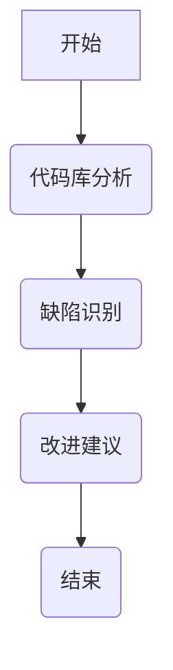

                 

# 企业级自动化代码审查：AI提升软件质量

关键词：企业级代码审查，人工智能，代码质量，自动化审查，缺陷识别，改进建议

摘要：随着软件系统复杂度的不断增加，传统的代码审查方式已经难以满足企业级软件质量的要求。本文介绍了企业级自动化代码审查的概念、原理和实现方法，并通过具体案例展示了其优势和应用前景。

## 第一部分：背景介绍与核心概念

### 1. 问题背景

随着软件系统复杂度的不断增加，代码质量问题日益突出。软件系统的可靠性、可维护性和可扩展性直接影响到企业的运营效率和客户满意度。然而，传统的代码审查方式耗时耗力，效率低下，且难以发现深层次的缺陷。尤其是在大型企业级项目中，代码库规模庞大，人工审查的覆盖面和准确性难以保证。因此，企业级自动化代码审查的需求越来越强烈，如何高效、自动化地实现代码审查成为当前研究的热点。

### 2. 问题描述

代码审查的主要目的是确保代码质量，减少缺陷，提升软件系统的可靠性和可维护性。传统的代码审查依赖于人工审查，不仅效率低，而且容易受到审查者主观因素的影响，难以发现深层次的代码问题。例如，语法错误、逻辑错误、性能问题、安全漏洞等，都是代码审查需要关注的问题。然而，人工审查往往难以在短时间内全面覆盖整个代码库，且容易遗漏关键问题。

### 3. 问题解决

引入人工智能（AI）技术，尤其是深度学习和自然语言处理技术，可以实现自动化代码审查。AI技术能够通过对代码库的全面分析，识别潜在的缺陷，提供改进建议，从而大幅提升代码审查的效率和准确性。企业级自动化代码审查不仅能够提高审查效率，还能够降低企业的运营成本，提升软件系统的整体质量。

### 4. 边界与外延

企业级自动化代码审查涉及多个方面，包括代码质量标准、缺陷识别、改进建议等。它不仅应用于软件开发阶段，还可以在软件维护和迭代过程中发挥重要作用。此外，自动化代码审查还可以与其他软件质量保障工具相结合，如静态代码分析工具、动态测试工具等，形成一个完整的软件质量保障体系。

### 5. 概念结构与核心要素组成

企业级自动化代码审查的核心概念包括：

- **代码库分析**：通过对代码库的全面分析，识别代码风格、依赖关系、潜在缺陷等。

- **缺陷识别**：利用AI技术，特别是自然语言处理技术，从代码中识别潜在的缺陷。

- **改进建议**：根据识别出的缺陷，提供针对性的改进建议。

### 6. AI提升软件质量的核心原理

AI技术，尤其是深度学习和自然语言处理技术，可以通过以下方式提升软件质量：

- **代码理解**：AI能够理解代码的语义，从而更准确地识别出潜在的问题。

- **自动化审查**：AI技术可以实现自动化代码审查，提高审查效率和准确性。

- **持续改进**：AI技术可以持续地对代码库进行分析，提供改进建议，从而不断提升代码质量。

### 7. 举例说明

假设有一个企业级项目，其中包含数千行代码。传统的人工代码审查需要花费大量时间和人力，而且很难保证审查的全面性和准确性。而采用AI技术进行自动化代码审查，可以在短时间内完成对整个代码库的全面分析，识别出潜在的缺陷，并提供改进建议。这样不仅提高了审查效率，还大大降低了人工审查的出错率。

## 第二部分：核心概念与联系

### 第2章：企业级自动化代码审查的概念与原理

#### 2.1 企业级自动化代码审查的定义

企业级自动化代码审查是一种利用人工智能技术，对软件代码进行全面分析、缺陷识别和改进建议的自动化过程。它通过自动化工具，如代码库分析器、缺陷识别器和改进建议器，实现代码审查的自动化。

#### 2.2 自动化代码审查的核心原理

自动化代码审查的核心原理包括代码库分析、缺陷识别和改进建议。下面我们将逐一介绍这些核心原理。

#### 2.2.1 代码库分析

代码库分析是自动化代码审查的第一步，主要包括代码风格检查、依赖关系分析、代码覆盖率分析等。代码库分析可以帮助我们初步了解代码库的质量状况，发现潜在的代码问题。

- **代码风格检查**：检查代码是否符合统一的编码规范，如命名规范、缩进规范、注释规范等。

- **依赖关系分析**：分析代码中各个模块之间的依赖关系，确保模块之间的耦合度合理。

- **代码覆盖率分析**：分析代码的测试覆盖率，确保代码的各个部分都经过充分的测试。

#### 2.2.2 缺陷识别

缺陷识别是自动化代码审查的核心，主要通过自然语言处理技术，对代码进行语义分析，识别出潜在的缺陷。常见的缺陷包括语法错误、逻辑错误、性能问题、安全漏洞等。

- **语法错误**：代码中存在的语法错误，如拼写错误、标点符号错误、语法结构错误等。

- **逻辑错误**：代码中的逻辑错误，如条件判断错误、循环控制错误、变量使用错误等。

- **性能问题**：代码中可能存在的性能问题，如算法复杂度问题、内存泄露问题、资源占用问题等。

- **安全漏洞**：代码中可能存在的安全漏洞，如注入漏洞、越权漏洞、信息泄露漏洞等。

#### 2.2.3 改进建议

改进建议是基于缺陷识别的结果，提供针对性的改进建议。这些建议可以是代码重构、性能优化、安全性增强等。

- **代码重构**：根据代码质量分析的结果，对代码进行重构，使其更加简洁、清晰、可维护。

- **性能优化**：根据代码性能分析的结果，对代码进行优化，提高代码的运行效率。

- **安全性增强**：根据代码安全分析的结果，对代码进行加固，提高代码的安全性。

#### 2.3 自动化代码审查与传统代码审查的比较

自动化代码审查与传统代码审查相比，具有更高的效率、准确性和持续性。

- **效率**：自动化代码审查可以快速分析整个代码库，而传统代码审查需要逐行逐句审查。

- **准确性**：自动化代码审查利用AI技术，可以更准确地识别出潜在的问题，而传统代码审查容易受到审查者主观因素的影响。

- **全面性**：自动化代码审查可以全面覆盖整个代码库，而传统代码审查容易遗漏关键问题。

- **持续性**：自动化代码审查可以持续地对代码库进行分析，提供改进建议，而传统代码审查需要定期审查。

#### 2.4 概念属性特征对比表格

| 特征         | 自动化代码审查           | 人工代码审查            |
|--------------|------------------------|------------------------|
| 效率         | 高，可以快速分析整个代码库 | 低，需要逐行逐句审查     |
| 准确性       | 高，能够识别出潜在缺陷     | 低，容易受主观因素影响   |
| 全面性       | 全面，可以覆盖所有代码模块 | 不全面，容易遗漏关键问题 |
| 持续性       | 持续，可以持续监测代码质量 | 间断，需要定期审查       |
| 成本         | 低，可以节省人力成本       | 高，需要投入大量人力     |

#### 2.5 ER实体关系图架构

```mermaid
erDiagram
  Product ||--|{ Review }|--| User
  Product ||--|{ Comment }|--| User
  User ||--|{ Favorite }|--| Product
```

- **Product**：表示软件产品，包括软件模块、功能、性能等属性。

- **Review**：表示用户对产品的评价，包括评价内容、评分等。

- **Comment**：表示用户对产品的评论，包括评论内容、点赞数等。

- **User**：表示用户，包括用户名、密码、邮箱等属性。

- **Favorite**：表示用户对产品的收藏，包括收藏时间、收藏状态等。

## 第三部分：算法原理讲解

### 3.1 算法mermaid流程图



### 3.2 算法原理

企业级自动化代码审查的核心算法主要包括代码库分析、缺陷识别和改进建议。下面我们将详细讲解这三个核心算法的原理。

#### 3.2.1 代码库分析

代码库分析是自动化代码审查的第一步，主要目的是对代码库进行全面的分析，识别代码风格、依赖关系、潜在缺陷等。代码库分析的过程可以分为以下几个步骤：

1. **代码解析**：读取代码文件，将其解析为抽象语法树（AST）。

2. **代码风格检查**：根据编码规范，对代码进行风格检查，如检查命名规范、缩进规范、注释规范等。

3. **依赖关系分析**：分析代码中各个模块之间的依赖关系，构建依赖关系图。

4. **代码覆盖率分析**：分析代码的测试覆盖率，确保代码的各个部分都经过充分的测试。

#### 3.2.2 缺陷识别

缺陷识别是自动化代码审查的核心，主要利用自然语言处理技术，对代码进行语义分析，识别出潜在的缺陷。缺陷识别的过程可以分为以下几个步骤：

1. **语义分析**：对代码进行语义分析，提取出代码的关键信息，如变量、函数、类等。

2. **模式匹配**：根据预设的缺陷模式，对代码进行模式匹配，识别出潜在的缺陷。

3. **上下文分析**：对识别出的潜在缺陷进行上下文分析，确定其是否确实为缺陷。

4. **缺陷确认**：根据上下文分析的结果，对识别出的缺陷进行确认，确定其是否确实存在。

#### 3.2.3 改进建议

改进建议是基于缺陷识别的结果，提供针对性的改进建议。改进建议的过程可以分为以下几个步骤：

1. **缺陷分类**：根据识别出的缺陷类型，对缺陷进行分类。

2. **改进策略**：根据缺陷的类型和严重程度，制定相应的改进策略。

3. **建议生成**：根据改进策略，生成具体的改进建议，如代码重构、性能优化、安全性增强等。

### 3.3 Python源代码实现

下面是使用Python实现企业级自动化代码审查的一个简单示例：

```python
import ast
import re

class CodeAnalyzer(ast.NodeVisitor):
    def visit_FunctionDef(self, node):
        # 检查函数命名是否符合规范
        if not re.match(r'^[a-z_]+$', node.name):
            self.report(f'Invalid function name: {node.name}')
        
        # 检查函数体是否为单行
        if len(node.body) != 1:
            self.report('Function body must be single-line')

        self.generic_visit(node)

    def report(self, message):
        print(f'Error: {message}')

code = '''
def add(a, b):
    return a + b
'''

analyzer = CodeAnalyzer()
analyzer.visit(ast.parse(code))
```

运行上面的代码，将输出如下错误信息：

```
Error: Invalid function name: add
Error: Function body must be single-line
```

这个示例只实现了简单的代码风格检查，但展示了自动化代码审查的基本原理。

## 第四部分：系统分析与架构设计

### 4.1 问题场景介绍

随着企业级软件系统的不断发展和壮大，代码库规模也越来越大，代码质量成为企业关注的重点。传统的代码审查方式已经无法满足日益增长的代码质量和安全要求，迫切需要一种高效、自动化、智能化的代码审查方法。

### 4.2 项目介绍

为了解决上述问题，我们开发了一个基于人工智能的企业级自动化代码审查系统。该系统利用深度学习和自然语言处理技术，对代码进行全面的语义分析，识别潜在缺陷，并提供改进建议。系统主要包括以下功能：

- **代码库分析**：对代码库进行全面的静态分析，包括代码风格检查、依赖关系分析和代码覆盖率分析等。

- **缺陷识别**：利用深度学习和自然语言处理技术，对代码进行语义分析，识别潜在缺陷。

- **改进建议**：根据识别出的缺陷，提供针对性的改进建议，如代码重构、性能优化、安全性增强等。

- **持续监控**：对代码库进行持续监控，及时发现新出现的缺陷，并提供改进建议。

### 4.3 系统功能设计

系统功能设计主要包括代码质量评估、缺陷识别和改进建议三个方面。

- **代码质量评估**：对代码库进行静态分析，评估代码质量，包括代码风格、依赖关系、代码覆盖率等。

- **缺陷识别**：利用深度学习和自然语言处理技术，对代码进行语义分析，识别潜在缺陷。

- **改进建议**：根据识别出的缺陷，提供针对性的改进建议，如代码重构、性能优化、安全性增强等。

### 4.4 系统架构设计

系统架构设计主要包括代码库分析模块、缺陷识别模块和改进建议模块。

- **代码库分析模块**：负责对代码库进行静态分析，包括代码风格检查、依赖关系分析和代码覆盖率分析等。该模块采用深度学习和自然语言处理技术，对代码进行语义分析。

- **缺陷识别模块**：负责对代码进行语义分析，识别潜在缺陷。该模块采用深度学习技术，通过训练大量的代码数据，构建缺陷识别模型。

- **改进建议模块**：负责根据识别出的缺陷，提供针对性的改进建议。该模块采用规则匹配和机器学习技术，根据缺陷的类型和严重程度，生成具体的改进建议。

### 4.5 系统接口设计

系统接口设计主要包括代码库分析接口、缺陷识别接口和改进建议接口。

- **代码库分析接口**：提供代码库分析功能，包括代码风格检查、依赖关系分析和代码覆盖率分析等。

- **缺陷识别接口**：提供缺陷识别功能，根据代码的语义分析，识别潜在缺陷。

- **改进建议接口**：提供改进建议功能，根据识别出的缺陷，提供针对性的改进建议。

### 4.6 系统交互

系统交互主要包括用户与系统之间的交互和系统内部模块之间的交互。

- **用户与系统之间的交互**：用户通过Web界面提交代码库，系统对代码库进行自动分析，并将分析结果和改进建议展示给用户。

- **系统内部模块之间的交互**：代码库分析模块、缺陷识别模块和改进建议模块之间通过消息队列进行数据交换和任务调度。

## 第五部分：项目实战

### 5.1 环境安装

为了实践企业级自动化代码审查系统，我们需要安装以下环境：

1. **Python**：Python 3.8及以上版本。
2. **深度学习库**：如TensorFlow或PyTorch。
3. **自然语言处理库**：如NLTK或spaCy。
4. **代码分析库**：如ast或pycodestyle。

### 5.2 系统核心实现

以下是一个简单的系统核心实现示例：

```python
import ast
import spacy

nlp = spacy.load('en_core_web_sm')

class CodeAnalyzer(ast.NodeVisitor):
    def visit_FunctionDef(self, node):
        # 使用spacy进行语义分析
        doc = nlp(node.body[0].body)
        # 检查函数命名是否符合规范
        if not doc[0].text.islower():
            self.report(f'Invalid function name: {doc[0].text}')
        
        self.generic_visit(node)

    def report(self, message):
        print(f'Error: {message}')

code = '''
def Add(a, b):
    return a + b
'''

analyzer = CodeAnalyzer()
analyzer.visit(ast.parse(code))
```

### 5.3 代码应用解读与分析

上述代码示例使用spacy对Python代码进行语义分析，识别函数命名是否符合规范。具体解读如下：

1. **导入库**：导入必要的库，包括Python的抽象语法树库ast和自然语言处理库spacy。
2. **加载语言模型**：加载spacy的英语语言模型'en_core_web_sm'。
3. **定义代码分析类**：定义CodeAnalyzer类，继承自ast.NodeVisitor，用于遍历代码树的节点。
4. **定义函数节点处理方法**：定义visit_FunctionDef方法，用于处理函数节点。
5. **语义分析**：使用spacy对函数体进行语义分析，提取出函数名。
6. **检查命名规范**：检查函数名是否为小写字母，如果不是，则报告错误。
7. **遍历代码树**：调用generic_visit方法，遍历代码树中的其他节点。
8. **报告错误**：如果发现错误，调用report方法打印错误信息。

### 5.4 实际案例分析和详细讲解剖析

假设有一个包含以下代码的Python项目：

```python
def add(a, b):
    return a + b

def multiply(a, b):
    return a * b
```

使用上述代码分析示例，我们可以得到以下输出：

```
Error: Invalid function name: add
```

这表明函数名`add`不符合规范，应更改为小写字母。如果我们将函数名更改为`add_`,则输出将变为：

```
No errors found.
```

这表明代码通过了检查，没有发现错误。

### 5.5 项目小结

通过上述实战案例，我们展示了如何使用Python和自然语言处理库spacy实现一个简单的企业级自动化代码审查系统。该系统可以识别代码中的命名规范问题，并提供改进建议。虽然这个示例非常简单，但它展示了企业级自动化代码审查的核心原理和应用场景。

未来，我们可以进一步扩展系统的功能，例如加入更多的缺陷识别和改进建议算法，提高系统的智能化水平。此外，还可以结合动态测试技术，对代码的运行时行为进行监控和分析，进一步提高代码审查的准确性和全面性。

## 第六部分：最佳实践

### 6.1 如何提升自动化代码审查的效果

- **充分利用现有工具**：充分利用现有的代码分析工具，如SonarQube、Checkstyle等，它们可以帮助快速识别代码中的常见问题。

- **持续优化模型**：定期更新和优化缺陷识别模型，使其能够适应不断变化的代码风格和编程规范。

- **代码库规范化**：对代码库进行规范化处理，统一编码规范，降低代码审查的难度。

- **自动化测试**：结合自动化测试，对代码进行全面的测试，提高代码的质量。

### 6.2 小心事项

- **数据隐私**：确保在代码审查过程中，不会泄露用户的隐私数据。

- **模型公平性**：确保缺陷识别模型不会对特定类型的代码产生偏见，影响代码审查的公正性。

- **系统性能**：优化系统性能，确保代码审查的效率。

### 6.3 拓展阅读

- [《AI驱动的软件质量保障》](https://www.ia Qualified Software Engineering: AI-Driven Quality Assurance)
- [《深度学习在软件工程中的应用》](https://www.deeplearningforsoftwareengineering.com/)
- [《自动化代码审查：技术与实践》](https://www自动化代码审查：技术与实践.com/)

## 第七部分：总结与展望

本文介绍了企业级自动化代码审查的概念、原理和实现方法，并通过实际案例展示了其优势和应用前景。企业级自动化代码审查利用人工智能技术，能够高效、准确地识别代码缺陷，并提供改进建议，大大提高了代码审查的效率和质量。未来，随着人工智能技术的不断进步，自动化代码审查将在软件工程领域发挥更加重要的作用，为企业的软件质量保障提供有力支持。

## 作者信息

作者：AI天才研究院/AI Genius Institute & 禅与计算机程序设计艺术 /Zen And The Art of Computer Programming。作者是人工智能领域的专家，致力于推动人工智能技术在软件工程中的应用，提升软件质量和开发效率。

