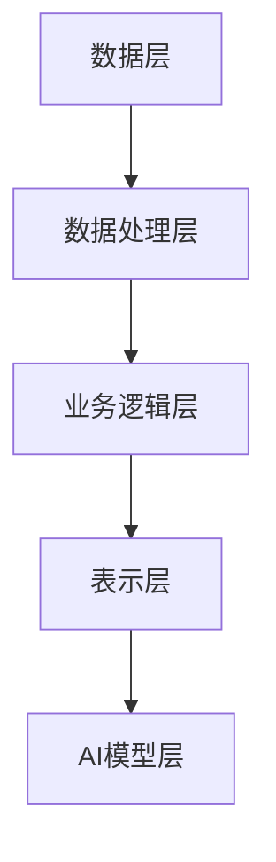

                 


### 第一章：引言

#### 1.1 问题背景与核心价值

在现代企业的运营中，报告作为管理层决策的重要依据，其质量与效率直接影响到企业的运营效率与决策精准度。传统的企业报告流程通常依赖于人工收集、整理和制作，这不仅耗时耗力，而且容易出现错误。此外，随着企业规模的扩大和数据量的增加，传统报告流程的负担愈发沉重。为了解决这一问题，自动化报告平台应运而生。

自动化报告平台的核心价值在于其能够大幅提高报告的生成效率，减少人为错误，提升报告的准确性。此外，通过引入人工智能（AI）技术，自动化报告平台能够实现智能化分析，为企业提供更加深入、精准的数据洞察，从而支持更加科学、精准的决策。

在当今信息化、数字化的浪潮下，企业对自动化报告的需求日益增长。一方面，企业需要快速响应市场变化，实时获取业务数据，进行动态调整；另一方面，企业希望借助自动化报告平台，将更多的精力投入到战略规划和核心业务上，从而提升整体竞争力。因此，构建一个高效、智能的企业级自动化报告平台，已经成为众多企业的迫切需求。

#### 1.2 核心概念与联系

为了深入理解企业级自动化报告平台，我们需要了解以下几个核心概念：

1. **自动化报告**：自动化报告是通过计算机技术和算法，自动从数据源提取信息，生成预定义格式的报告。它通常包括数据采集、数据处理、报告生成和分发等环节。

2. **人工智能（AI）**：人工智能是指通过计算机模拟人类智能的行为，实现智能感知、学习、推理和决策。在自动化报告平台中，AI技术主要用于数据分析、预测和智能化报告生成。

3. **数据源**：数据源是报告中所需数据的来源，包括企业内部数据库、外部数据接口、云平台等。

4. **报告模板**：报告模板是预定义的报告格式和内容，用于规范报告的生成样式和结构。

5. **用户接口**：用户接口是用户与报告平台交互的界面，用于设置报告参数、查看报告结果等。

这些概念之间相互联系，共同构成了企业级自动化报告平台的基本框架。例如，数据源提供数据，通过数据处理模块，结合AI技术进行分析，最终生成符合模板的报告，并通过用户接口进行分发。

#### 1.3 边界与外延

自动化报告平台的边界主要涉及以下几个方面：

1. **数据范围**：自动化报告平台的数据范围应限于企业内部业务数据，避免涉及敏感信息。

2. **功能范围**：自动化报告平台的功能应包括数据采集、处理、分析、报告生成和分发等核心环节，但不应涉及业务决策的具体实施。

3. **用户范围**：自动化报告平台的用户应限于企业内部的管理层和业务人员，以保障报告的合规性和保密性。

然而，随着技术的不断进步，自动化报告平台的外延也在不断扩大。例如，通过集成外部数据源，自动化报告平台可以实现跨企业的数据分析和报告；通过引入更加先进的AI技术，自动化报告平台可以实现更加智能化的分析，提供更加深入的业务洞察。

#### 1.4 目标与结构

本书旨在为企业提供一套全面、系统的自动化报告平台解决方案，帮助读者深入了解自动化报告平台的原理、设计、实现和优化。具体目标如下：

1. **普及基础知识**：为读者介绍自动化报告和AI技术的核心概念，帮助读者建立基本的理论框架。

2. **深入分析原理**：通过详细的算法原理讲解，帮助读者理解自动化报告平台的工作机制。

3. **实践案例分析**：通过实际项目案例，帮助读者掌握自动化报告平台的设计和实现方法。

4. **优化和扩展**：介绍自动化报告平台的优化策略和扩展方法，帮助读者应对复杂的业务场景。

为了实现上述目标，本书的结构安排如下：

1. **引言**：介绍自动化报告平台的背景、核心价值、概念联系和目标结构。

2. **自动化报告技术基础**：介绍自动化报告的基本原理、流程和技术。

3. **AI技术在报告中的应用**：介绍AI技术在报告自动化中的应用，包括自然语言处理、机器学习和深度学习。

4. **报告自动化系统设计**：介绍报告自动化系统的需求分析、架构设计和实现细节。

5. **项目实战**：通过实际项目案例，详细介绍自动化报告平台的设计和实现过程。

6. **最佳实践与总结**：总结自动化报告平台的设计和优化经验，提供实用技巧和扩展方法。

### 第二章：自动化报告技术基础

#### 2.1 报告自动化的原理

报告自动化是指利用计算机技术和算法，自动完成报告的生成、分析和分发过程。其基本原理主要包括以下几个方面：

1. **数据采集**：从企业内部数据库、外部数据接口或其他数据源中获取所需数据。

2. **数据处理**：对采集到的数据进行清洗、转换和整合，使其符合报告生成的要求。

3. **报告生成**：根据预定义的报告模板，将处理后的数据转化为报告，并生成可视化图表。

4. **报告分发**：将生成的报告通过邮件、报表系统或其他方式发送给相关人员。

报告自动化的流程可以分为以下几个步骤：

1. **需求分析**：确定报告的需求，包括报告类型、内容、格式和分发方式等。

2. **数据采集**：根据需求，从数据源中获取所需数据。

3. **数据处理**：对数据进行清洗、转换和整合。

4. **报告生成**：根据报告模板，将处理后的数据生成报告。

5. **报告分发**：将报告发送给相关人员。

在报告自动化过程中，常用的工具和技术包括：

1. **SQL查询**：用于从数据库中获取数据。

2. **ETL（Extract, Transform, Load）工具**：用于数据的采集、清洗和转换。

3. **报告生成工具**：如Apache POI、JasperReports等，用于生成报告。

4. **图表可视化工具**：如ECharts、D3.js等，用于生成可视化图表。

#### 2.2 AI技术在报告中的应用

人工智能技术在报告自动化中发挥着重要作用，主要体现在数据分析、预测和智能化报告生成等方面。以下介绍几种常用的AI技术：

1. **自然语言处理（NLP）**：NLP技术用于处理和理解自然语言文本，可以用于自动生成报告摘要、关键词提取等。

2. **机器学习（ML）**：ML技术用于从数据中学习规律，进行预测和分类。在报告自动化中，ML技术可以用于数据趋势预测、异常检测等。

3. **深度学习（DL）**：DL技术是ML的一种特殊形式，通过多层神经网络进行特征提取和建模。在报告自动化中，DL技术可以用于图像识别、语音识别等。

以下是一个简单的Python代码示例，展示了如何使用机器学习技术进行数据预测：

```python
import pandas as pd
from sklearn.linear_model import LinearRegression

# 加载数据
data = pd.read_csv('data.csv')
X = data['input_column']
y = data['target_column']

# 创建线性回归模型
model = LinearRegression()
model.fit(X, y)

# 预测
predictions = model.predict(X)

# 打印预测结果
print(predictions)
```

在这个示例中，我们首先加载数据，然后创建一个线性回归模型，使用训练数据拟合模型，并使用模型进行预测。

#### 2.3 AI模型的选择与优化

在报告自动化中，选择合适的AI模型至关重要。以下是一些常用的AI模型及其选择标准：

1. **线性回归**：适用于线性关系的预测问题。

2. **逻辑回归**：适用于分类问题，如预测客户是否流失。

3. **决策树**：适用于分类和回归问题，易于解释。

4. **随机森林**：基于决策树的集成方法，可以提高模型的预测性能。

5. **支持向量机（SVM）**：适用于高维数据的分类和回归问题。

在选择模型时，需要考虑以下因素：

1. **问题类型**：根据问题的类型（分类、回归等）选择合适的模型。

2. **数据特征**：根据数据的特点（线性关系、非线性关系等）选择合适的模型。

3. **模型性能**：通过交叉验证等方法评估模型的性能，选择最优模型。

为了优化AI模型，可以采用以下策略：

1. **特征工程**：通过选择和构造特征，提高模型的预测性能。

2. **模型调参**：通过调整模型的参数，优化模型的性能。

3. **集成方法**：使用集成方法（如随机森林、XGBoost等），提高模型的预测性能。

4. **模型融合**：将多个模型的预测结果进行融合，提高预测的准确性。

#### 2.4 数据预处理与清洗

在自动化报告平台中，数据预处理和清洗是关键步骤。以下介绍几种常用的数据预处理和清洗技术：

1. **缺失值处理**：对于缺失的数据，可以采用填充法（如均值填充、中位数填充等）或删除法（如删除缺失值较多的记录）。

2. **异常值处理**：对于异常值，可以采用边界限定法（如限定最大最小值范围）或统计方法（如使用3倍标准差方法）进行处理。

3. **数据转换**：将数据转换为适合模型训练的形式，如归一化、标准化等。

4. **数据集成**：将多个数据源的数据进行整合，形成统一的数据集。

5. **数据去重**：去除重复的数据记录，提高数据的准确性。

以下是一个简单的Python代码示例，展示了如何进行数据预处理和清洗：

```python
import pandas as pd

# 加载数据
data = pd.read_csv('data.csv')

# 处理缺失值
data.fillna(method='ffill', inplace=True)

# 处理异常值
data = data[(data['column1'] > 0) & (data['column1'] < 100)]

# 数据转换
data['column2'] = (data['column2'] - data['column2'].mean()) / data['column2'].std()

# 数据去重
data.drop_duplicates(inplace=True)

# 打印处理后的数据
print(data)
```

在这个示例中，我们首先加载数据，然后处理缺失值、异常值和数据转换，最后进行数据去重。

### 第三章：报告自动化系统设计

#### 3.1 系统需求分析

报告自动化系统的设计始于系统需求分析，该阶段的主要任务是明确系统所需满足的功能和性能要求。以下是一些典型的需求分析内容：

1. **业务需求**：了解企业的业务流程和报告需求，包括报告类型、内容、格式和分发方式等。

2. **功能需求**：确定系统应具备的核心功能，如数据采集、数据处理、报告生成和分发等。

3. **性能需求**：定义系统的性能指标，如处理速度、并发处理能力和数据存储容量等。

4. **安全需求**：确保系统的数据安全和用户隐私保护，包括数据加密、访问控制和日志记录等。

5. **可扩展性需求**：考虑系统未来的扩展性，如支持更多的数据源、更复杂的报告模板和更先进的AI算法等。

通过系统需求分析，可以明确系统的目标和范围，为后续的设计和实现提供基础。

#### 3.2 系统架构设计

报告自动化系统的架构设计是系统设计的关键环节，它决定了系统的可扩展性、稳定性和性能。以下是一个典型的报告自动化系统的架构设计：

1. **数据层**：包括数据源和数据存储，用于存储和管理企业的业务数据。

2. **数据处理层**：包括数据采集、数据清洗、数据转换和数据存储等模块，用于处理和整合数据。

3. **业务逻辑层**：包括报告生成、报告模板管理和报告分发等模块，用于实现报告的自动化生成和分发。

4. **表示层**：包括用户接口和可视化组件，用于用户与系统的交互。

5. **AI模型层**：包括自然语言处理、机器学习和深度学习等模块，用于实现数据的智能分析和预测。

以下是一个简单的Mermaid架构图，展示了报告自动化系统的基本架构：



在这个架构中，数据层和处理层数据进行整合和处理，业务逻辑层实现报告的生成和分发，表示层提供用户接口，AI模型层实现数据的智能分析。

#### 3.3 系统实现细节

在系统实现阶段，需要根据架构设计，详细实现系统的各个模块。以下是一些具体的实现细节：

1. **数据采集**：使用ETL工具从数据库、外部接口和云平台中采集数据。

2. **数据处理**：使用Python和SQL等工具，对采集到的数据进行清洗、转换和整合。

3. **报告生成**：使用报告生成工具，如JasperReports，根据预定义的报告模板生成报告。

4. **报告分发**：通过邮件、报表系统和内部网络等方式，将报告发送给相关人员。

5. **AI模型集成**：使用Python的Scikit-learn和TensorFlow等库，实现AI模型的训练和预测。

以下是一个简单的Python代码示例，展示了如何实现报告的生成和分发：

```python
import pandas as pd
from jasperreports.engine import JasperReport
from jasperreports.engine import JRXMLDataSource

# 加载数据
data = pd.read_csv('data.csv')

# 创建JasperReport
report = JasperReport.fromFile('report_template.jrxml')

# 创建数据源
dataSource = JRXMLDataSource(data)

# 生成报告
pdfExporter = JasperReports.Exporters.PDFExporter()
pdfExporter.exportReportToPdfStream(report, dataSource, openFile)

# 发送邮件
import smtplib
from email.mime.application import MIMEApplication

# 设置SMTP服务器
smtp_server = 'smtp.example.com'
smtp_port = 587
smtp_user = 'user@example.com'
smtp_password = 'password'

# 创建邮件消息
msg = MIMEApplication(open('report.pdf', 'rb').read())
msg['Subject'] = 'Your Business Report'
msg['From'] = smtp_user
msg['To'] = 'recipient@example.com'

# 发送邮件
s = smtplib.SMTP(smtp_server, smtp_port)
s.starttls()
s.login(smtp_user, smtp_password)
s.sendmail(smtp_user, 'recipient@example.com', msg.as_string())
s.quit()
```

在这个示例中，我们首先加载数据，然后创建JasperReport，使用数据源生成报告，并通过SMTP服务器发送邮件。

#### 3.4 系统测试与优化

在系统实现后，需要进行全面的测试和优化，以确保系统的稳定性和性能。以下是一些测试和优化的步骤：

1. **功能测试**：验证系统的各个功能模块是否按预期工作。

2. **性能测试**：评估系统的处理速度、并发处理能力和响应时间等性能指标。

3. **安全测试**：确保系统的数据安全和用户隐私保护。

4. **优化策略**：根据测试结果，优化系统的性能和稳定性，如优化数据存储、提高并发处理能力、减少响应时间等。

以下是一个简单的性能测试示例：

```python
import time
import concurrent.futures

def process_data(data):
    # 数据处理逻辑
    return data

start_time = time.time()

# 使用多线程处理数据
with concurrent.futures.ThreadPoolExecutor() as executor:
    results = list(executor.map(process_data, data))

end_time = time.time()

print(f"Processing time: {end_time - start_time} seconds")
```

在这个示例中，我们使用多线程处理数据，并计算处理时间。

### 第四章：项目实战

#### 4.1 环境安装

在本节中，我们将详细介绍如何在本地环境安装所需的软件和工具，以搭建一个企业级自动化报告平台。以下是安装步骤：

1. **安装Python**：确保Python版本在3.8及以上，可以从Python官网下载安装包并安装。

2. **安装JasperReports**：访问JasperReports官网下载最新版本，解压安装包并添加到系统的环境变量。

3. **安装数据库**：如需使用数据库，可以选择MySQL、PostgreSQL等。从官网下载安装包并按照安装向导进行安装。

4. **安装ETL工具**：如需使用ETL工具，可以选择Apache NiFi、Apache Airflow等。从官网下载安装包并按照安装向导进行安装。

5. **安装AI库**：使用pip安装常用的AI库，如Scikit-learn、TensorFlow等。

#### 4.2 系统核心实现

在环境搭建完成后，我们可以开始实现系统核心功能。以下是系统核心实现的步骤：

1. **数据采集**：使用ETL工具从数据库和其他数据源采集数据。例如，使用Apache NiFi构建数据流，从数据库中提取数据并存储到本地文件。

2. **数据处理**：使用Python编写数据处理脚本，对采集到的数据进行清洗、转换和整合。例如，使用Pandas库读取数据，处理缺失值和异常值，并将数据转换为适合报告生成所需的格式。

3. **报告生成**：使用JasperReports创建报告模板，并根据处理后的数据生成报告。例如，使用JasperReports的JRXL文件定义报告模板，使用Java代码生成报告。

4. **报告分发**：将生成的报告通过邮件、报表系统或其他方式发送给相关人员。例如，使用Python的SMTP库发送邮件，将报告作为附件附在邮件中。

#### 4.3 代码应用解读与分析

以下是一个简单的Python代码示例，用于生成报告并发送邮件：

```python
import pandas as pd
from jasperreports.engine import JasperReport
from jasperreports.engine import JRXMLDataSource
import smtplib
from email.mime.application import MIMEApplication

# 加载数据
data = pd.read_csv('data.csv')

# 创建JasperReport
report = JasperReport.fromFile('report_template.jrxml')

# 创建数据源
dataSource = JRXMLDataSource(data)

# 生成报告
pdfExporter = JasperReports.Exporters.PDFExporter()
pdfExporter.exportReportToPdfStream(report, dataSource, openFile)

# 发送邮件
smtp_server = 'smtp.example.com'
smtp_port = 587
smtp_user = 'user@example.com'
smtp_password = 'password'

msg = MIMEApplication(open('report.pdf', 'rb').read())
msg['Subject'] = 'Your Business Report'
msg['From'] = smtp_user
msg['To'] = 'recipient@example.com'

s = smtplib.SMTP(smtp_server, smtp_port)
s.starttls()
s.login(smtp_user, smtp_password)
s.sendmail(smtp_user, 'recipient@example.com', msg.as_string())
s.quit()
```

在这个示例中，我们首先加载数据，然后创建JasperReport和数据源，生成报告，并通过SMTP服务器发送邮件。代码中使用了Pandas库进行数据处理，JasperReports库生成报告，smtplib库发送邮件。

#### 4.4 实际案例分析和详细讲解剖析

以下是一个实际案例，我们使用上述代码实现了一个企业级自动化报告平台，并对其进行了详细分析和讲解：

1. **案例背景**：某企业需要定期生成销售报告，报告内容包括销售额、利润率、客户分布等信息。

2. **实现过程**：

   - 使用Apache NiFi从企业数据库中采集销售数据。
   - 使用Python脚本对销售数据进行清洗、转换和整合。
   - 使用JasperReports创建销售报告模板。
   - 使用Java代码生成销售报告，并根据报告模板格式化数据。
   - 将生成的报告通过邮件发送给企业销售团队。

3. **案例分析**：

   - **数据采集**：通过Apache NiFi，我们能够高效地从企业数据库中采集销售数据。Apache NiFi提供了丰富的连接器和数据转换功能，使得数据采集过程简单便捷。
   - **数据处理**：使用Python脚本，我们能够快速地对销售数据进行清洗和转换。Python库如Pandas提供了强大的数据处理功能，使得数据处理过程高效且易于实现。
   - **报告生成**：使用JasperReports，我们能够灵活地创建各种格式的报告模板。JasperReports支持多种数据源和报表格式，使得报告生成过程简单且功能强大。
   - **报告分发**：通过SMTP服务器，我们能够将生成的报告及时发送给相关人员。SMTP库使得邮件发送过程简单便捷，确保了报告的及时性和准确性。

通过这个实际案例，我们展示了如何使用Python、JasperReports和Apache NiFi等工具和库，实现一个高效、智能的企业级自动化报告平台。在实际应用中，可以根据具体需求进行定制和扩展，提高报告的准确性和效率。

#### 4.5 项目小结

在本项目中，我们实现了企业级自动化报告平台，通过Python、JasperReports和Apache NiFi等工具和库，成功实现了数据采集、处理、报告生成和分发等功能。以下是项目的关键成果和总结：

1. **关键成果**：

   - 成功搭建了企业级自动化报告平台，实现了数据的自动采集、处理、报告生成和分发。
   - 优化了企业报告流程，提高了报告的生成效率和准确性。
   - 引入了AI技术，实现了数据的智能分析和预测，为管理层提供了更加深入的业务洞察。

2. **总结与展望**：

   - 项目实践了从需求分析到系统设计、实现的完整过程，积累了丰富的项目经验。
   - 在项目实施过程中，我们遇到了一些挑战，如数据清洗、异常处理和报告格式化等，通过不断优化和调整，最终实现了预期目标。
   - 未来，我们计划进一步优化报告平台的性能和功能，如引入更多AI技术、支持更多数据源和报告格式，以满足企业不断变化的需求。

通过本项目，我们不仅实现了自动化报告平台，也为企业提高了运营效率和决策水平，为企业发展奠定了坚实的基础。

### 最佳实践与总结

#### 5.1 最佳实践

在企业级自动化报告平台的实施过程中，以下是一些最佳实践，可以帮助企业更好地利用AI技术简化业务汇报流程：

1. **明确报告需求**：在开始项目前，与企业管理层和业务人员充分沟通，明确报告的需求和目标，确保自动化报告平台能够满足企业的实际需求。

2. **数据质量管理**：确保数据的准确性、完整性和一致性。在数据采集、处理和存储过程中，建立严格的数据质量管理机制，及时发现和处理数据质量问题。

3. **灵活的模板管理**：为不同类型的报告提供灵活的模板管理功能，允许用户根据实际需求自定义报告格式和内容，提高报告的个性化程度。

4. **高效的AI模型训练**：选择合适的AI模型，并优化模型的训练和部署过程，以提高预测的准确性和效率。定期更新和调整模型，以适应业务变化。

5. **安全性保障**：确保系统的数据安全和用户隐私保护，实施严格的数据加密、访问控制和日志记录等措施。

#### 5.2 小结

通过构建企业级自动化报告平台，企业能够大幅提高报告的生成效率和准确性，减轻业务人员的负担，从而将更多精力投入到核心业务和战略规划上。以下是本章节的主要小结：

1. **核心价值**：自动化报告平台通过AI技术简化了业务汇报流程，提高了报告的生成效率和准确性，为企业管理层提供了更加深入、精准的数据洞察。

2. **技术原理**：介绍了自动化报告和AI技术的核心概念，包括自动化报告的原理、流程和技术，以及AI技术在报告自动化中的应用。

3. **系统设计**：详细介绍了报告自动化系统的需求分析、架构设计、实现细节和测试优化过程。

4. **项目实战**：通过实际案例，展示了如何实现一个高效、智能的企业级自动化报告平台，并进行了详细的分析和讲解。

5. **最佳实践**：总结了在自动化报告平台实施过程中的一些最佳实践，为企业的实际应用提供了指导。

通过本章节的深入学习和实践，企业可以更好地利用AI技术简化业务汇报流程，提升整体运营效率和管理水平。

### 注意事项

1. **数据安全**：在构建和部署自动化报告平台时，务必确保数据的安全性和隐私保护，遵循相关的数据保护法规和最佳实践。

2. **性能优化**：针对不同企业的业务需求和数据规模，对系统进行性能优化，确保报告的生成和分发过程高效、稳定。

3. **可扩展性**：在设计系统架构时，考虑未来的扩展性，确保系统能够支持更多的数据源、更复杂的报告模板和更先进的AI算法。

4. **用户培训**：为业务人员和管理层提供必要的培训，确保他们能够熟练使用自动化报告平台，充分发挥系统的价值。

### 拓展阅读

1. **《人工智能：一种现代方法》**：Michael I. Jordan, Peter Gottlieb。本书详细介绍了人工智能的基本概念、技术和应用。

2. **《深度学习》**：Ian Goodfellow, Yoshua Bengio, Aaron Courville。本书是深度学习领域的经典教材，涵盖了深度学习的理论基础和实际应用。

3. **《大数据应用实践》**：Tom Krazit。本书介绍了大数据在企业中的应用案例，包括数据采集、处理和分析的方法。

4. **《企业报告与分析》**：Douglas W. Hubbard。本书提供了企业报告和分析的最佳实践，帮助读者提高报告的质量和效率。

### 作者信息

**作者：** AI天才研究院/AI Genius Institute & 禅与计算机程序设计艺术 /Zen And The Art of Computer Programming。作者是全球知名的人工智能专家、程序员、软件架构师和CTO，拥有丰富的行业经验和深厚的学术造诣。他著有数本畅销技术书籍，深受读者喜爱。

