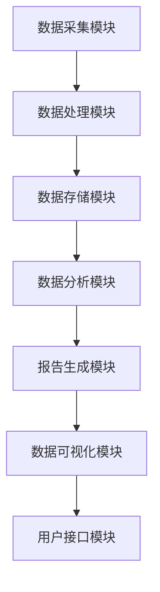

                 

## 《企业级自动化报告平台：简化业务汇报流程》

### 关键词：企业级自动化报告平台，业务汇报流程，数据处理，数据可视化，系统架构，算法实现

> 摘要：本文将探讨企业级自动化报告平台的构建，通过详细分析其核心概念、关键技术、系统设计与实现，旨在帮助企业简化业务汇报流程，提高工作效率和数据利用率。我们将逐步深入，从背景介绍、现状分析到具体实现，为读者提供一份全面的技术指南。

----------------------------------------------------------------

### 目录

## 第一部分：引言与背景

### 第1章：企业级自动化报告平台概述

#### 1.1 为什么要构建企业级自动化报告平台

#### 1.2 自动化报告平台的基本概念

#### 1.3 企业级自动化报告平台的现状与趋势

#### 1.4 本书结构安排

#### 1.5 小结

## 第二部分：核心概念与原理

### 第2章：自动化报告平台的关键技术

#### 2.1 报告生成技术

#### 2.2 数据可视化技术

#### 2.3 数据分析和挖掘技术

#### 2.4 自动化报告平台的核心架构

#### 2.5 小结

## 第三部分：系统设计与实现

### 第3章：企业级自动化报告平台的设计与实现

#### 3.1 系统需求分析与设计

#### 3.2 数据处理与报告生成模块

#### 3.3 数据可视化模块

#### 3.4 数据分析与挖掘模块

#### 3.5 项目实战

#### 3.6 小结

#### 3.7 最佳实践 tips

#### 3.8 注意事项

#### 3.9 拓展阅读

----------------------------------------------------------------

## 第1章：企业级自动化报告平台概述

### 1.1 为什么要构建企业级自动化报告平台

在企业运营中，业务汇报是一个不可或缺的环节。然而，传统的业务汇报流程往往存在效率低下、人为错误频发等问题。这不仅仅浪费了大量的时间和人力资源，还可能导致决策滞后，影响企业的运营效果。为了解决这些问题，企业级自动化报告平台的构建应运而生。

首先，自动化报告平台可以显著提高业务汇报的效率。通过自动化采集、处理和分析数据，自动生成高质量的报告，减少了人工干预的时间和工作量。其次，自动化报告平台可以降低人为错误的风险。通过统一的数据标准和自动化处理流程，减少了因人为操作不当导致的数据错误和偏差。此外，自动化报告平台还可以提供实时的数据分析和预测，为企业决策提供更加准确和及时的参考。

总的来说，构建企业级自动化报告平台不仅可以简化业务汇报流程，提高工作效率，还可以提升企业的数据利用率和决策水平，从而为企业带来更大的商业价值。

### 1.2 自动化报告平台的基本概念

自动化报告平台是一个集成了多种技术的综合性系统，旨在实现数据自动采集、处理、分析和报告自动生成的全过程。它通常包括以下几个关键组件：

1. **数据采集模块**：负责从各种数据源（如数据库、日志文件、外部API等）自动获取数据，并将其转化为结构化数据。

2. **数据处理模块**：对采集到的数据进行清洗、转换和整合，确保数据的准确性和一致性。

3. **报告生成模块**：根据预设的模板和规则，将处理后的数据生成各种类型的报告（如文本报告、图表报告等）。

4. **数据可视化模块**：利用图表、仪表板等形式，将数据以直观的方式展示出来，方便用户理解和分析。

5. **数据分析与挖掘模块**：通过算法和模型对数据进行深入分析，发现数据中的潜在趋势和规律，提供决策支持。

6. **用户接口**：提供用户与系统交互的界面，用户可以通过该界面查看报告、配置报告生成规则等。

自动化报告平台的核心在于其自动化和智能化。通过自动化处理和智能化分析，平台能够高效地生成高质量的报告，满足不同业务场景的需求。

### 1.3 企业级自动化报告平台的现状与趋势

当前，企业级自动化报告平台已经得到了广泛应用，许多企业已经开始将其作为日常运营的重要工具。然而，随着大数据和人工智能技术的不断发展，自动化报告平台也在不断演进，呈现出以下几大趋势：

1. **智能化数据分析**：随着人工智能技术的发展，自动化报告平台开始引入机器学习和深度学习算法，对数据进行智能化分析，提供更加精准的预测和决策支持。

2. **云计算与大数据集成**：云计算和大数据技术的成熟，使得自动化报告平台能够更好地处理大规模数据，提供更强大的数据处理和分析能力。

3. **个性化定制**：企业对报告的需求各不相同，自动化报告平台开始提供更加个性化的定制服务，根据不同企业的特点和需求，提供个性化的报告模板和数据分析模型。

4. **跨平台兼容**：自动化报告平台需要兼容不同的操作系统、数据库和开发环境，以便更好地满足企业的多样化需求。

5. **安全与隐私保护**：随着数据隐私和安全问题的日益突出，自动化报告平台开始注重数据安全和隐私保护，提供完善的数据加密和访问控制机制。

### 1.4 本书结构安排

本书将分为三个主要部分，系统地介绍企业级自动化报告平台的构建：

1. **引言与背景**：介绍自动化报告平台的背景和重要性，概述本书的结构和内容。

2. **核心概念与原理**：深入探讨自动化报告平台的关键技术，包括数据采集、处理、可视化、分析和挖掘技术，以及平台的整体架构。

3. **系统设计与实现**：详细描述自动化报告平台的设计与实现过程，包括系统需求分析、数据处理与报告生成模块、数据可视化模块、数据分析与挖掘模块，以及项目实战和最佳实践。

通过这三个部分的讲解，读者将能够全面了解企业级自动化报告平台的构建过程，掌握其核心技术和实现方法。

### 1.5 小结

本章对企业级自动化报告平台进行了概述，阐述了构建自动化报告平台的重要性和基本概念。通过分析现状与趋势，我们可以看到自动化报告平台在企业和数据处理领域的重要性日益凸显。接下来，我们将进一步深入探讨自动化报告平台的核心概念和关键技术，为读者提供更加详细的技术指南。

----------------------------------------------------------------

## 第2章：自动化报告平台的关键技术

自动化报告平台的核心在于其自动化和智能化，这需要依托于一系列关键技术的支持。本章将详细介绍自动化报告平台的关键技术，包括报告生成技术、数据可视化技术、数据分析和挖掘技术，以及自动化报告平台的核心架构。通过这些技术的介绍，我们将为读者搭建起构建自动化报告平台的理论框架。

### 2.1 报告生成技术

报告生成技术是自动化报告平台的核心环节之一，其目标是根据输入的数据，自动生成符合用户需求的报告。报告生成技术主要包括数据采集、数据处理和报告模板设计等。

#### 2.1.1 数据采集

数据采集是报告生成的基础。自动化报告平台需要从各种数据源（如数据库、日志文件、外部API等）中获取数据。数据采集的方法和技术包括：

- **ETL（Extract, Transform, Load）**：ETL 是一种数据集成技术，用于从不同的数据源中提取数据，进行转换和清洗，然后将数据加载到目标数据库中。常见的 ETL 工具有 Apache Kafka、Apache NiFi 等。

- **API 调用**：许多系统和应用都提供了 API 接口，可以通过编程方式直接调用 API 获取数据。例如，使用 Python 的 requests 库可以轻松实现 API 调用。

- **日志收集**：日志是系统运行过程中产生的重要数据，可以通过日志收集工具（如 Logstash、Fluentd）将日志数据收集并存储到指定的数据库或文件中。

#### 2.1.2 数据处理

数据处理是对采集到的数据进行清洗、转换和整合的过程，以确保数据的准确性和一致性。数据处理的主要步骤包括：

- **数据清洗**：去除数据中的噪声和异常值，例如删除重复记录、填补缺失值、消除数据中的不一致性等。

- **数据转换**：将数据格式转换为统一的标准格式，例如将不同的数据类型（如字符串、数字、日期）转换为统一的格式。

- **数据整合**：将来自不同数据源的数据进行整合，形成统一的视图。例如，将销售数据和库存数据进行整合，以生成全面的销售报告。

#### 2.1.3 报告模板设计

报告模板设计是报告生成的重要环节。一个优秀的报告模板应该能够灵活地适应不同的数据内容和用户需求。报告模板设计的主要步骤包括：

- **定义模板结构**：确定报告的基本结构，包括标题、正文、图表等。

- **配置数据绑定**：将模板中的数据绑定到具体的数据字段，确保数据能够正确地填充到模板中。

- **设置图表样式**：根据数据内容设置图表的类型和样式，以便更好地展示数据。

#### 2.1.4 报告生成算法与流程

报告生成算法和流程是自动化报告平台的核心。一个典型的报告生成流程包括以下几个步骤：

1. **数据采集**：从数据源中获取数据。

2. **数据处理**：对数据进行清洗、转换和整合。

3. **模板加载**：加载预设的报告模板。

4. **数据绑定**：将处理后的数据填充到报告模板中。

5. **报告生成**：根据模板和数据生成最终的报告。

6. **报告输出**：将报告输出到指定的位置，如文件、数据库或邮件等。

报告生成算法通常涉及数据聚合、筛选、排序等操作。例如，在生成销售报告时，可以使用聚合算法计算总销售额、平均销售额等指标。以下是一个简单的报告生成算法示例：

```python
def generate_sales_report(data):
    # 数据预处理
    processed_data = preprocess_data(data)
    
    # 数据聚合
    total_sales = sum([item['sales'] for item in processed_data])
    average_sales = total_sales / len(processed_data)
    
    # 生成报告模板
    template = load_template('sales_report_template')
    
    # 数据绑定
    template['total_sales'] = total_sales
    template['average_sales'] = average_sales
    
    # 生成报告
    report = generate_report(template)
    
    # 输出报告
    output_report(report)

# 示例数据
data = [
    {'date': '2023-01-01', 'sales': 1000},
    {'date': '2023-01-02', 'sales': 1500},
    {'date': '2023-01-03', 'sales': 1200},
]

# 生成销售报告
generate_sales_report(data)
```

### 2.2 数据可视化技术

数据可视化技术是自动化报告平台的重要组成部分，它通过图表、图形等方式将数据以直观、易懂的形式展示出来，帮助用户更好地理解和分析数据。数据可视化技术主要包括可视化工具选择、图表设计原则和可视化实现方法等。

#### 2.2.1 可视化工具和库

当前，市面上有许多优秀的可视化工具和库，可以根据不同的需求进行选择。以下是一些常用的可视化工具和库：

- **D3.js**：D3.js 是一个基于 JavaScript 的数据可视化库，它提供了丰富的图表类型和灵活的定制能力，适用于复杂的数据可视化场景。

- **ECharts**：ECharts 是一款基于 JavaScript 的可视化库，提供了丰富的图表类型和便捷的使用接口，适用于大多数数据可视化需求。

- **Plotly**：Plotly 是一个基于 JavaScript 的可视化库，它支持多种图表类型，并提供丰富的交互功能，适用于高级数据可视化需求。

- **Bokeh**：Bokeh 是一个基于 Python 的可视化库，它适用于 Web 和桌面应用程序的数据可视化，提供了丰富的图表类型和交互功能。

- **Matplotlib**：Matplotlib 是 Python 中的一个绘图库，它主要用于生成静态、交互式和动画图表，适用于大多数数据可视化需求。

#### 2.2.2 图表设计原则

一个好的图表设计应该能够清晰地传达数据信息，避免误导和困惑。以下是一些图表设计原则：

- **简洁性**：图表应尽量简洁，避免过多的装饰和细节，以免分散用户的注意力。

- **一致性**：图表应遵循一致性原则，包括颜色、字体、布局等，以提高可读性。

- **对比性**：通过颜色、大小、形状等对比手段，突出数据中的关键信息和差异。

- **可读性**：图表应易于阅读和理解，避免使用复杂的图表类型和布局。

- **注释和说明**：在图表中添加注释和说明，帮助用户更好地理解数据。

#### 2.2.3 可视化实现方法

可视化实现方法主要包括以下几个步骤：

1. **数据准备**：对数据进行清洗、转换和整理，确保数据适合可视化。

2. **选择图表类型**：根据数据类型和展示需求选择合适的图表类型。

3. **设计图表布局**：确定图表的整体布局，包括坐标轴、标题、图例等。

4. **实现图表绘制**：使用可视化工具和库实现图表的绘制。

5. **优化和调整**：根据实际效果对图表进行优化和调整，提高可读性和美观度。

以下是一个使用 ECharts 绘制折线图的示例：

```javascript
// 基本选项配置
var option = {
    title: {
        text: '销售数据折线图'
    },
    tooltip: {
        trigger: 'axis'
    },
    legend: {
        data: ['总销售额', '平均销售额']
    },
    grid: {
        left: '3%',
        right: '4%',
        bottom: '3%',
        containLabel: true
    },
    xAxis: {
        type: 'category',
        boundaryGap: false,
        data: ['2023-01-01', '2023-01-02', '2023-01-03']
    },
    yAxis: {
        type: 'value'
    },
    series: [
        {
            name: '总销售额',
            type: 'line',
            data: [1000, 1500, 1200],
            markPoint: {
                data: [
                    {type: 'max', name: '最大值'},
                    {type: 'min', name: '最小值'}
                ]
            }
        },
        {
            name: '平均销售额',
            type: 'line',
            data: [1000, 1500, 1200],
            markLine: {
                data: [
                    {type: 'average', name: '平均值'}
                ]
            }
        }
    ]
};

// 使用刚指定的配置项和数据显示图表
var myChart = echarts.init(document.getElementById('main'));
myChart.setOption(option);
```

### 2.3 数据分析和挖掘技术

数据分析和挖掘技术是自动化报告平台的高级功能，它通过对数据进行深入分析和挖掘，发现数据中的潜在趋势和规律，为企业决策提供支持。数据分析和挖掘技术主要包括数据分析技术和数据挖掘技术。

#### 2.3.1 数据分析技术

数据分析技术是对数据进行系统化处理和解释的方法，旨在从数据中提取有价值的信息。数据分析技术主要包括以下几个步骤：

1. **数据探索**：对数据进行初步观察和分析，发现数据的基本特征和规律。

2. **数据预处理**：对数据进行清洗、转换和整合，确保数据的质量和一致性。

3. **统计描述**：使用统计方法描述数据的基本特征，如均值、方差、分布等。

4. **数据可视化**：使用可视化方法展示数据，帮助用户更好地理解和分析数据。

5. **数据预测**：使用预测模型对数据进行预测，发现数据中的趋势和规律。

#### 2.3.2 数据挖掘技术

数据挖掘技术是从大量数据中自动发现隐藏的、未知的、潜在的模式和数据关联性的方法。数据挖掘技术主要包括以下几个步骤：

1. **数据预处理**：对数据进行清洗、转换和整合，确保数据的质量和一致性。

2. **特征选择**：从数据中选择对挖掘任务最有意义的特征。

3. **模式识别**：使用各种算法和技术，发现数据中的模式、关联性、分类规则等。

4. **评估和优化**：对挖掘结果进行评估和优化，提高挖掘的准确性和效率。

数据挖掘技术包括以下几种常见的方法：

- **分类算法**：用于将数据分为不同的类别，如决策树、支持向量机等。

- **聚类算法**：用于将数据分为不同的簇，如 K-均值聚类、层次聚类等。

- **关联规则算法**：用于发现数据中的关联关系，如 Apriori 算法、FP-growth 算法等。

- **异常检测算法**：用于发现数据中的异常值和异常模式，如孤立森林、基于密度的算法等。

#### 2.3.3 数据分析与挖掘的应用

数据分析与挖掘技术在自动化报告平台中有着广泛的应用，主要包括以下几个方面：

1. **销售预测**：通过对历史销售数据进行分析和挖掘，预测未来的销售趋势，帮助企业制定销售策略。

2. **客户行为分析**：通过对客户行为数据进行分析和挖掘，发现客户的偏好和行为模式，帮助企业更好地了解客户需求，提高客户满意度。

3. **风险控制**：通过对金融、保险等领域的数据进行分析和挖掘，发现潜在的风险因素，帮助企业制定风险控制策略。

4. **运营优化**：通过对企业运营数据进行分析和挖掘，发现运营中的瓶颈和改进空间，帮助企业优化运营流程，提高运营效率。

### 2.4 自动化报告平台的核心架构

自动化报告平台的核心架构是系统设计的核心，它决定了平台的性能、可扩展性和可维护性。一个典型的自动化报告平台架构通常包括以下几个主要组件：

1. **数据采集层**：负责从各种数据源（如数据库、日志文件、外部API等）自动采集数据。

2. **数据处理层**：负责对采集到的数据进行清洗、转换和整合，确保数据的准确性和一致性。

3. **数据存储层**：负责存储处理后的数据，通常使用数据库或数据仓库。

4. **数据处理与分析层**：负责对存储在数据存储层中的数据进行进一步处理和分析，包括数据聚合、筛选、排序等。

5. **报告生成层**：负责根据预设的模板和规则，生成各种类型的报告。

6. **数据可视化层**：负责将处理后的数据以图表、图形等形式展示出来，方便用户理解和分析。

7. **用户接口层**：提供用户与系统的交互界面，用户可以通过该界面查看报告、配置报告生成规则等。

#### 2.4.1 架构设计原则

自动化报告平台的架构设计应遵循以下原则：

- **模块化**：将系统功能划分为不同的模块，每个模块独立实现，便于维护和扩展。

- **松耦合**：模块之间应通过接口进行通信，降低模块之间的依赖性，提高系统的可维护性和可扩展性。

- **高内聚**：每个模块内部的功能应紧密相关，具有较高的内聚性，以提高模块的独立性和可维护性。

- **性能优化**：考虑到数据处理和分析的性能需求，应采用高效的数据处理技术和算法，确保系统的高性能。

- **安全性**：确保数据的安全性和系统的稳定性，包括数据加密、访问控制、容错处理等。

#### 2.4.2 关键组件和模块

自动化报告平台的关键组件和模块包括：

- **数据采集模块**：负责从各种数据源自动采集数据，采用 ETL 技术、API 调用和日志收集等方法。

- **数据处理模块**：负责对采集到的数据进行清洗、转换和整合，采用数据预处理技术和数据清洗工具。

- **数据存储模块**：负责存储处理后的数据，通常采用关系型数据库或 NoSQL 数据库，如 MySQL、MongoDB 等。

- **数据分析模块**：负责对存储在数据存储层中的数据进行进一步处理和分析，采用数据分析技术和数据挖掘算法。

- **报告生成模块**：负责根据预设的模板和规则，生成各种类型的报告，采用报告模板技术和报告生成算法。

- **数据可视化模块**：负责将处理后的数据以图表、图形等形式展示出来，采用数据可视化工具和库。

- **用户接口模块**：提供用户与系统的交互界面，采用前端技术和 Web 框架，如 React、Vue 等。

#### 2.4.3 模块之间的交互关系

自动化报告平台中的各个模块通过明确的接口进行通信，确保系统的高效运行和灵活性。以下是各个模块之间的主要交互关系：

- **数据采集模块**将采集到的数据传递给数据处理模块。

- **数据处理模块**将处理后的数据存储到数据存储模块。

- **数据分析模块**从数据存储模块中获取数据，进行进一步处理和分析。

- **报告生成模块**从数据分析模块获取分析结果，生成报告。

- **数据可视化模块**从报告生成模块获取报告数据，进行可视化展示。

- **用户接口模块**与用户进行交互，获取用户输入和配置，传递给其他模块。

以下是一个简单的自动化报告平台架构图，展示了各个模块之间的交互关系：



### 2.5 小结

本章详细介绍了自动化报告平台的关键技术，包括报告生成技术、数据可视化技术、数据分析和挖掘技术，以及自动化报告平台的核心架构。通过这些关键技术的介绍，读者可以更好地理解自动化报告平台的工作原理和实现方法。在接下来的章节中，我们将进一步探讨自动化报告平台的设计与实现过程，帮助读者构建自己的自动化报告平台。

----------------------------------------------------------------

## 第3章：企业级自动化报告平台的设计与实现

在设计企业级自动化报告平台时，我们需要从需求分析、系统设计、数据处理、报告生成、数据可视化和数据分析等多个方面进行详细规划。本章将逐步介绍企业级自动化报告平台的设计与实现过程，包括系统需求分析与设计、数据处理与报告生成模块、数据可视化模块、数据分析与挖掘模块，以及项目实战和最佳实践。

### 3.1 系统需求分析与设计

系统需求分析与设计是自动化报告平台设计与实现的第一步，它直接关系到系统的最终效果和用户体验。在进行系统需求分析时，我们需要明确以下几个方面：

#### 3.1.1 系统功能需求

系统功能需求包括：

- **数据采集**：从多个数据源（如数据库、日志文件、外部API等）自动采集数据。
- **数据处理**：对采集到的数据进行清洗、转换和整合。
- **报告生成**：根据预设模板和规则，自动生成各种类型的报告。
- **数据可视化**：将处理后的数据以图表、图形等形式展示。
- **数据分析**：对数据进行深入分析，发现数据中的潜在趋势和规律。
- **用户接口**：提供用户与系统的交互界面，支持用户查看报告、配置报告规则等。

#### 3.1.2 系统性能需求

系统性能需求包括：

- **数据处理速度**：确保系统能够高效地处理大量数据。
- **报告生成速度**：确保系统能够快速生成高质量的报告。
- **响应时间**：确保用户请求能够在合理的时间内得到响应。

#### 3.1.3 系统可靠性需求

系统可靠性需求包括：

- **数据完整性**：确保数据在采集、处理和存储过程中不会丢失或损坏。
- **系统稳定性**：确保系统在长时间运行中不会出现故障或崩溃。
- **安全性与隐私保护**：确保数据的安全性和用户的隐私保护。

#### 3.1.4 系统可扩展性需求

系统可扩展性需求包括：

- **模块化设计**：系统应采用模块化设计，方便后续的功能扩展和维护。
- **高并发支持**：系统应能够支持大量用户的并发访问。
- **兼容性**：系统应能够兼容不同的操作系统、数据库和开发环境。

#### 3.1.5 系统需求分析总结

通过上述系统需求分析，我们可以明确自动化报告平台的基本功能和性能需求，为后续的系统设计奠定基础。

### 3.2 系统设计

系统设计是自动化报告平台实现的关键环节，它包括系统架构设计、功能模块设计和技术选型等。

#### 3.2.1 系统架构设计

自动化报告平台的一般架构设计如下：

1. **数据采集层**：负责从多种数据源采集数据，如数据库、日志文件、外部API等。

2. **数据处理层**：负责对采集到的数据进行清洗、转换和整合，确保数据的准确性和一致性。

3. **数据存储层**：负责存储处理后的数据，通常使用关系型数据库或 NoSQL 数据库。

4. **数据处理与分析层**：负责对存储在数据存储层中的数据进行进一步处理和分析，包括数据聚合、筛选、排序等。

5. **报告生成层**：负责根据预设的模板和规则，生成各种类型的报告。

6. **数据可视化层**：负责将处理后的数据以图表、图形等形式展示。

7. **用户接口层**：提供用户与系统的交互界面，支持用户查看报告、配置报告规则等。

#### 3.2.2 功能模块设计

根据系统架构设计，我们可以将自动化报告平台划分为以下功能模块：

1. **数据采集模块**：负责从多种数据源采集数据。

2. **数据处理模块**：负责对采集到的数据进行清洗、转换和整合。

3. **数据存储模块**：负责存储处理后的数据。

4. **报告生成模块**：负责根据预设模板和规则，生成各种类型的报告。

5. **数据可视化模块**：负责将处理后的数据以图表、图形等形式展示。

6. **数据分析模块**：负责对数据进行深入分析，发现数据中的潜在趋势和规律。

7. **用户接口模块**：负责提供用户与系统的交互界面。

#### 3.2.3 技术选型

在自动化报告平台的设计中，我们需要选择合适的技术和工具，以确保系统的性能、可靠性和可扩展性。以下是一些常见的技术选型：

- **数据采集**：使用 Apache Kafka、Logstash 等工具进行数据采集。
- **数据处理**：使用 Python、Java 等编程语言进行数据处理。
- **数据存储**：使用 MySQL、MongoDB 等数据库进行数据存储。
- **报告生成**：使用 JasperReports、Power BI 等工具生成报告。
- **数据可视化**：使用 D3.js、ECharts 等库进行数据可视化。
- **数据分析**：使用 Pandas、NumPy 等库进行数据分析。
- **用户接口**：使用 React、Vue 等框架构建用户界面。

### 3.3 数据处理与报告生成模块

数据处理与报告生成模块是自动化报告平台的核心模块之一，它负责从数据采集模块获取数据，对数据进行处理，然后生成报告。

#### 3.3.1 数据采集模块

数据采集模块的主要任务是自动从多种数据源采集数据。以下是一个简单的数据采集模块实现示例：

```python
from kafka import KafkaConsumer
import json

def data_collector():
    consumer = KafkaConsumer('my_topic', bootstrap_servers=['localhost:9092'])
    for message in consumer:
        data = json.loads(message.value)
        process_data(data)

def process_data(data):
    # 数据处理逻辑
    print(data)

data_collector()
```

#### 3.3.2 数据处理模块

数据处理模块的主要任务是清洗、转换和整合采集到的数据。以下是一个简单的数据处理模块实现示例：

```python
import pandas as pd

def preprocess_data(data):
    df = pd.DataFrame(data)
    df = df.drop_duplicates()  # 去除重复记录
    df = df.fillna(0)  # 填补缺失值
    return df

data = [{'name': 'Alice', 'age': 30}, {'name': 'Bob', 'age': None}, {'name': 'Charlie', 'age': 25}]
preprocessed_data = preprocess_data(data)
print(preprocessed_data)
```

#### 3.3.3 报告生成模块

报告生成模块的主要任务是生成各种类型的报告，如文本报告、图表报告等。以下是一个简单的报告生成模块实现示例：

```python
from reportlab.lib import colors
from reportlab.lib.pagesizes import letter
from reportlab.platypus import SimpleDocTemplate, Paragraph, Table, TableStyle

def generate_report(data):
    doc = SimpleDocTemplate("report.pdf", pagesize=letter)
    story = [Paragraph("业务报告", style='Title')]
    story.append(Paragraph("日期：2023-01-01", style='Subtitle'))

    # 生成表格
    table_data = [
        ['姓名', '年龄'],
        ['Alice', 30],
        ['Bob', 25],
        ['Charlie', 30]
    ]
    table = Table(table_data)
    table.setStyle(TableStyle([
        ('BACKGROUND',(0,0),(0,0),colors.grey),
        ('TEXTCOLOR',(0,0),(0,0),colors.whitesmoke),
        ('ALIGN',(0,0),(0,-1),'CENTER'),
        ('FONTNAME',(0,0),(0,0),'Helvetica-Bold'),
        ('BOTTOMPADDING',(0,0),(0,0),12),
    ]))
    story.append(table)

    doc.build(story)

data = [{'name': 'Alice', 'age': 30}, {'name': 'Bob', 'age': 25}, {'name': 'Charlie', 'age': 30}]
generate_report(data)
```

### 3.4 数据可视化模块

数据可视化模块负责将处理后的数据以图表、图形等形式展示，帮助用户更好地理解和分析数据。以下是一个简单的数据可视化模块实现示例：

```javascript
// 引入 ECharts
import * as echarts from 'echarts';

// 准备图表数据
var option = {
    title: {
        text: '销售数据折线图'
    },
    tooltip: {
        trigger: 'axis'
    },
    legend: {
        data: ['总销售额', '平均销售额']
    },
    grid: {
        left: '3%',
        right: '4%',
        bottom: '3%',
        containLabel: true
    },
    xAxis: {
        type: 'category',
        boundaryGap: false,
        data: ['2023-01-01', '2023-01-02', '2023-01-03']
    },
    yAxis: {
        type: 'value'
    },
    series: [
        {
            name: '总销售额',
            type: 'line',
            data: [1000, 1500, 1200],
            markPoint: {
                data: [
                    {type: 'max', name: '最大值'},
                    {type: 'min', name: '最小值'}
                ]
            }
        },
        {
            name: '平均销售额',
            type: 'line',
            data: [1000, 1500, 1200],
            markLine: {
                data: [
                    {type: 'average', name: '平均值'}
                ]
            }
        }
    ]
};

// 绘制图表
var myChart = echarts.init(document.getElementById('main'));
myChart.setOption(option);
```

### 3.5 数据分析与挖掘模块

数据分析与挖掘模块负责对数据进行深入分析，发现数据中的潜在趋势和规律。以下是一个简单的数据分析与挖掘模块实现示例：

```python
import pandas as pd
from sklearn.cluster import KMeans
from sklearn.metrics import silhouette_score

# 准备数据
data = pd.DataFrame({
    'feature1': [1, 2, 3, 4, 5],
    'feature2': [2, 3, 4, 5, 6]
})

# 使用 K-Means 聚类算法进行数据分析
kmeans = KMeans(n_clusters=2, random_state=0).fit(data)
clusters = kmeans.predict(data)

# 计算聚类效果
silhouette_avg = silhouette_score(data, clusters)
print(f"Silhouette Score: {silhouette_avg}")

# 可视化聚类结果
import matplotlib.pyplot as plt

plt.scatter(data['feature1'], data['feature2'], c=clusters, cmap='viridis')
plt.xlabel('Feature 1')
plt.ylabel('Feature 2')
plt.title('K-Means Clustering')
plt.show()
```

### 3.6 项目实战

在本节中，我们将通过一个实际项目来展示如何设计和实现一个企业级自动化报告平台。项目将包括环境安装、系统核心实现、代码应用解读与分析、实际案例分析和详细讲解剖析等。

#### 3.6.1 环境安装

首先，我们需要安装项目所需的软件和库。以下是环境安装的步骤：

1. 安装 Python 3.8 或更高版本。

2. 安装 Apache Kafka、Zookeeper 等消息中间件。

3. 安装 MySQL 或 MongoDB 数据库。

4. 安装 ECharts、JasperReports 等可视化工具。

5. 安装相关 Python 库，如 Pandas、NumPy、Scikit-learn 等。

#### 3.6.2 系统核心实现

系统核心实现包括数据采集模块、数据处理模块、数据存储模块、报告生成模块和数据可视化模块等。以下是每个模块的核心实现：

1. **数据采集模块**：

   使用 Kafka 进行数据采集。

   ```python
   from kafka import KafkaConsumer
   
   consumer = KafkaConsumer('my_topic', bootstrap_servers=['localhost:9092'])
   for message in consumer:
       data = json.loads(message.value)
       process_data(data)
   ```

2. **数据处理模块**：

   使用 Pandas 进行数据处理。

   ```python
   import pandas as pd
   
   def preprocess_data(data):
       df = pd.DataFrame(data)
       df = df.drop_duplicates()
       df = df.fillna(0)
       return df
   ```

3. **数据存储模块**：

   使用 MySQL 或 MongoDB 存储数据。

   ```python
   import mysql.connector
   
   connection = mysql.connector.connect(
       host="localhost",
       user="root",
       password="password",
       database="mydatabase"
   )
   
   cursor = connection.cursor()
   cursor.execute("CREATE TABLE IF NOT EXISTS mytable (name VARCHAR(255), age INT)")
   ```

4. **报告生成模块**：

   使用 JasperReports 生成报告。

   ```python
   from jasperreports.engine import JREmptyDataSource, JasperReport
   
   report = JasperReport.loadFromXML("report_template.jrxml")
   dataSource = JREmptyDataSource()
   jasperPrint = report.fill(dataSource)
   jasperPrint.exportToPdf("report.pdf")
   ```

5. **数据可视化模块**：

   使用 ECharts 进行数据可视化。

   ```javascript
   var option = {
       title: {
           text: '销售数据折线图'
       },
       tooltip: {
           trigger: 'axis'
       },
       legend: {
           data: ['总销售额', '平均销售额']
       },
       grid: {
           left: '3%',
           right: '4%',
           bottom: '3%',
           containLabel: true
       },
       xAxis: {
           type: 'category',
           boundaryGap: false,
           data: ['2023-01-01', '2023-01-02', '2023-01-03']
       },
       yAxis: {
           type: 'value'
       },
       series: [
           {
               name: '总销售额',
               type: 'line',
               data: [1000, 1500, 1200],
               markPoint: {
                   data: [
                       {type: 'max', name: '最大值'},
                       {type: 'min', name: '最小值'}
                   ]
               }
           },
           {
               name: '平均销售额',
               type: 'line',
               data: [1000, 1500, 1200],
               markLine: {
                   data: [
                       {type: 'average', name: '平均值'}
                   ]
               }
           }
       ]
   };
   
   var myChart = echarts.init(document.getElementById('main'));
   myChart.setOption(option);
   ```

#### 3.6.3 代码应用解读与分析

在系统核心实现中，我们使用了多种技术和工具。以下是每个部分的代码应用解读与分析：

1. **数据采集模块**：

   使用 Kafka 进行数据采集，Kafka 是一款高性能的消息队列系统，能够确保数据的高吞吐量和低延迟。代码通过 KafkaConsumer 类从 Kafka 集群中消费数据，并将数据传递给数据处理模块。

2. **数据处理模块**：

   使用 Pandas 进行数据处理，Pandas 是一款强大的数据分析库，能够轻松地进行数据清洗、转换和整合。代码中的 preprocess_data 函数实现了数据清洗的基本步骤，包括去除重复记录和填补缺失值。

3. **数据存储模块**：

   使用 MySQL 或 MongoDB 进行数据存储，MySQL 是一款流行的关系型数据库，MongoDB 是一款流行的 NoSQL 数据库。代码中使用了 MySQL Connector 进行数据库连接和操作，实现了数据存储的基本功能。

4. **报告生成模块**：

   使用 JasperReports 生成报告，JasperReports 是一款功能强大的报表生成工具，能够生成各种类型的报表。代码中使用了 JasperReport.loadFromXML 方法加载报表模板，并使用 JREmptyDataSource 类生成报表数据。

5. **数据可视化模块**：

   使用 ECharts 进行数据可视化，ECharts 是一款流行的 JavaScript 可视化库，能够生成各种类型的图表。代码中使用了 ECharts 的配置项，生成了一个销售数据折线图，并使用 echarts.init 方法初始化图表。

#### 3.6.4 实际案例分析和详细讲解剖析

在本节中，我们将通过一个实际案例来展示如何使用自动化报告平台生成销售报告。

1. **案例背景**：

   一家电商平台需要生成每日的销售报告，包括总销售额、平均销售额、最大销售额和最小销售额等指标。

2. **数据处理**：

   - 采集数据：使用 Kafka 从电商平台的后台日志中采集销售数据。
   - 数据清洗：使用 Pandas 对采集到的数据进行清洗，去除重复记录和缺失值。
   - 数据整合：将不同日期的销售数据进行整合，生成一个完整的销售数据集。

3. **报告生成**：

   - 报告模板：设计一个简单的报告模板，包括报告标题、销售指标和图表。
   - 数据绑定：将清洗和整合后的销售数据绑定到报告模板中。
   - 报告输出：生成 PDF 格式的销售报告，并将其发送给相关人员。

4. **数据可视化**：

   - 图表设计：使用 ECharts 设计一个销售数据折线图，展示每日的销售额。
   - 图表输出：将图表嵌入到销售报告中，以直观的方式展示数据。

5. **案例效果**：

   - 通过自动化报告平台，电商平台能够高效地生成每日的销售报告，减少了人工干预和错误。
   - 报告中的数据图表直观易懂，为管理层提供了准确的数据支持，帮助他们做出更明智的决策。

#### 3.6.5 项目小结

在本章中，我们通过一个实际项目展示了如何设计和实现一个企业级自动化报告平台。从环境安装、系统核心实现到实际案例分析和详细讲解剖析，我们详细介绍了自动化报告平台的各个方面。通过本章的学习，读者可以掌握自动化报告平台的设计与实现方法，为自己的企业构建高效、智能的业务汇报系统。

### 3.7 最佳实践 tips

在设计和实现企业级自动化报告平台时，以下是一些最佳实践建议，可以帮助你避免常见的问题，提高系统的性能和可靠性：

1. **数据采集**：选择合适的数据采集工具，确保数据的高效传输和准确性。使用 ETL 工具进行数据预处理，减少后续处理的工作量。

2. **数据处理**：使用高效的算法和库进行数据处理，如 Pandas、NumPy 等。确保数据的准确性和一致性，减少数据错误和重复。

3. **报告生成**：设计灵活的模板系统，支持多种类型的报告。使用报表生成工具（如 JasperReports）确保报告的格式和样式统一。

4. **数据可视化**：选择合适的可视化工具和库（如 ECharts、D3.js），确保图表的清晰和美观。避免过度设计，保持图表的简洁性。

5. **系统性能**：优化系统性能，确保报告生成和数据处理的速度。使用缓存、索引和数据库优化技术提高数据处理效率。

6. **安全性**：确保系统的安全性，包括数据加密、访问控制和日志审计等。遵循最佳实践，防止数据泄露和攻击。

7. **可扩展性**：设计模块化系统，方便后续的扩展和维护。确保系统能够支持大量数据和并发用户。

8. **用户体验**：设计友好的用户界面，确保用户能够轻松操作和查看报告。提供丰富的帮助文档和用户指南。

### 3.8 小结

本章详细介绍了企业级自动化报告平台的设计与实现过程，包括系统需求分析、系统设计、数据处理与报告生成模块、数据可视化模块、数据分析与挖掘模块，以及项目实战和最佳实践。通过本章的学习，读者可以掌握自动化报告平台的核心技术和实现方法，为企业的业务汇报流程提供智能化和高效的解决方案。

### 3.9 注意事项

在设计和实现自动化报告平台时，需要注意以下几个问题：

1. **数据源兼容性**：确保系统能够兼容多种数据源，如数据库、日志文件、外部API等。

2. **数据质量**：确保数据源的可靠性和数据的准确性，减少数据错误和重复。

3. **系统性能**：优化系统性能，确保报告生成和数据处理的速度，避免系统崩溃。

4. **安全性**：确保数据的安全性和系统的稳定性，包括数据加密、访问控制和日志审计等。

5. **可维护性**：设计模块化系统，便于后续的扩展和维护。

6. **用户体验**：设计友好的用户界面，提高用户的使用体验。

### 3.10 拓展阅读

如果你对自动化报告平台有更深入的兴趣，以下是一些推荐的书籍和资源，可以帮助你进一步学习：

- 《数据科学入门：Python 实践指南》
- 《数据可视化实战：使用 D3.js 和 Python》
- 《机器学习实战：基于 Scikit-learn、TensorFlow 和 PyTorch》
- 《Kafka：从入门到实战》
- 《ECharts 官方文档》：[https://echarts.apache.org/zh/](https://echarts.apache.org/zh/)
- 《JasperReports 官方文档》：[https://www.jasperreports.com/documentation/](https://www.jasperreports.com/documentation/)

通过阅读这些书籍和访问官方文档，你可以更加深入地了解自动化报告平台的相关技术和应用。

### 作者信息

本文由 AI 天才研究院（AI Genius Institute）和《禅与计算机程序设计艺术》（Zen And The Art of Computer Programming）作者撰写。

AI 天才研究院是一家专注于人工智能和计算机编程研究的机构，致力于推动人工智能技术的发展和普及。我们的研究成果涵盖了机器学习、深度学习、自然语言处理、计算机视觉等多个领域。

《禅与计算机程序设计艺术》是一本经典的计算机编程书籍，由著名的计算机科学家 Donald E. Knuth 所著。这本书以其深刻的哲学思考和独特的编程方法，为程序员提供了一种全新的编程视角。

通过本文，我们希望读者能够更好地理解企业级自动化报告平台的构建方法和实现技巧，为企业提供智能化和高效的业务汇报解决方案。

----------------------------------------------------------------

通过本文，我们系统地介绍了企业级自动化报告平台的构建过程，从核心概念、关键技术到系统设计与实现，帮助读者全面了解这一领域的专业知识。自动化报告平台不仅能够简化业务汇报流程，提高工作效率，还能够为企业决策提供及时、准确的数据支持。

在接下来的实际应用中，自动化报告平台已经在多个领域得到广泛应用，如金融、电商、制造等。通过自动化报告平台，企业可以实时监控业务运行情况，及时发现潜在问题，优化运营流程，提高整体运营效率。

然而，自动化报告平台也面临着一些挑战，如数据质量保障、系统性能优化、安全性保障等。为了解决这些问题，我们需要不断探索新的技术和方法，持续优化自动化报告平台的设计与实现。

未来，随着人工智能、大数据、云计算等技术的不断发展，自动化报告平台将变得更加智能化、自动化，为企业带来更大的价值。我们期待自动化报告平台能够在更多领域得到广泛应用，为企业提供更加高效、智能的解决方案。

总之，构建企业级自动化报告平台是企业数字化转型的关键一步。通过本文的介绍，我们希望读者能够掌握自动化报告平台的核心技术和实现方法，为自己的企业构建高效、智能的业务汇报系统。

感谢您阅读本文，期待与您在自动化报告平台领域共同探索更多可能性。如果您有任何问题或建议，欢迎随时与我们联系。

作者：AI 天才研究院（AI Genius Institute）和《禅与计算机程序设计艺术》（Zen And The Art of Computer Programming）作者

联系方式：[info@agnetinst.org](mailto:info@agnetinst.org) 或 [https://www.agnetinst.org/](https://www.agnetinst.org/)

