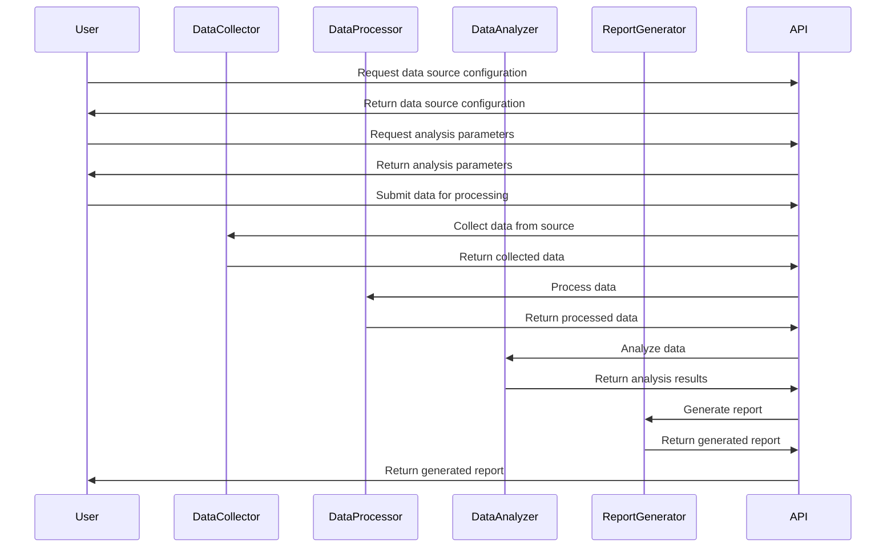

                 

## 企业级自动化报告：AI简化业务汇报流程

关键词：自动化报告、AI、业务汇报、流程优化、数据分析

摘要：随着企业业务的日益复杂和数据的激增，传统的业务汇报方式逐渐显现出其局限性。手动编制报告不仅耗时耗力，而且容易出错，难以满足企业快速决策的需求。本文将探讨如何利用人工智能（AI）技术实现企业级自动化报告，从而简化业务汇报流程，提升企业运营效率。

本文将分为以下几个部分：

- **第一部分：背景介绍**：介绍企业日常业务汇报的现状、痛点以及自动化报告的需求。
- **第二部分：核心概念与联系**：阐述自动化报告、AI技术和数据分析的基本概念及其相互关系。
- **第三部分：算法原理讲解**：深入剖析自动化报告的算法原理，包括数据采集与预处理、数据分析和报告生成。
- **第四部分：系统分析与架构设计**：介绍自动化报告系统的设计与实现，包括系统功能、架构、接口设计和交互。
- **第五部分：项目实战**：通过一个实际项目，展示自动化报告系统的实现过程和应用效果。
- **第六部分：最佳实践与拓展阅读**：总结自动化报告的实践经验和未来发展趋势。

### 第一部分：背景介绍

#### 1.1 问题背景

在许多企业中，业务汇报是一个至关重要的环节。它不仅反映了企业当前的经营状况，还为管理层提供了决策依据。然而，传统的业务汇报方式却面临着诸多挑战：

1. **数据冗余**：业务数据分布在不同的系统和数据库中，难以快速整合。
2. **人工整理**：大量数据需要手动整理和分析，耗时且容易出错。
3. **效率低**：报告编制过程繁琐，无法满足企业快速决策的需求。
4. **信息传递不及时**：报告生成的周期长，导致信息传递不及时，决策滞后。

#### 1.2 问题描述

面对上述问题，企业迫切需要一种高效的解决方案——自动化报告。自动化报告不仅能够快速整合和分析数据，还能自动生成格式统一的报告，从而简化业务汇报流程。然而，实现自动化报告并非易事，它需要以下条件：

1. **数据源统一**：确保所有业务数据能够无缝对接，便于采集和整合。
2. **AI技术支持**：利用机器学习和深度学习等AI技术，实现数据的智能分析和报告生成。
3. **报告格式标准化**：设计统一的报告模板，确保报告内容的规范化和一致性。
4. **系统集成**：实现自动化报告系统与企业现有系统的无缝对接，确保数据的实时传递和更新。

#### 1.3 问题解决

为了解决上述问题，企业可以采取以下措施：

1. **AI技术引入**：利用AI技术，实现数据的自动采集、清洗、分析和报告生成。
2. **技术选型**：选择合适的AI算法和工具，如机器学习库（如scikit-learn）、深度学习框架（如TensorFlow或PyTorch）等。
3. **实施步骤**：制定详细的实施计划，包括数据源整合、AI模型训练、报告模板设计、系统集成和测试等。
4. **注意事项**：在实施过程中，关注数据安全和隐私保护，确保系统的稳定性和可靠性。

#### 1.4 边界与外延

虽然自动化报告为企业带来了诸多好处，但同时也存在一定的局限性：

1. **数据安全与隐私保护**：在数据采集、传输和处理过程中，需要确保数据的安全性和隐私性。
2. **系统稳定性**：自动化报告系统需要具备高可用性和稳定性，以应对突发情况和数据波动。
3. **技术发展的影响与趋势**：随着AI技术的不断发展，自动化报告系统将更加智能化和多样化。

#### 1.5 概念结构与核心要素组成

为了更好地理解自动化报告，我们可以将其概念结构和核心要素组成进行梳理：

1. **概念结构**：自动化报告是一个基于AI技术的系统，用于自动采集、清洗、分析和生成报告。
2. **核心要素组成**：
   - **数据采集与预处理**：从不同数据源采集数据，并进行清洗、整合和预处理。
   - **数据分析与挖掘**：利用机器学习和深度学习技术，对数据进行高级分析和挖掘。
   - **报告生成与展示**：设计报告模板，根据分析结果自动填充内容并生成报告，以可视化的形式展示。

### 第一部分总结

通过本文的介绍，我们可以看到，自动化报告是企业应对业务汇报挑战的有效途径。利用AI技术，自动化报告不仅能够提高数据分析和报告生成的效率，还能确保报告的准确性和一致性。接下来，我们将进一步探讨自动化报告的核心概念、联系和算法原理，为企业实现智能化业务汇报提供更深入的指导。

## 第二部分：核心概念与联系

在探讨企业级自动化报告之前，我们需要明确几个核心概念，并了解它们之间的联系。这些概念包括自动化报告、AI技术、数据分析等。

### 2.1 核心概念原理

#### 自动化报告

自动化报告是指利用计算机技术和算法，自动生成和分析业务报告的过程。它能够从各种数据源中提取信息，进行清洗、整合和分析，最终以可视化的形式生成报告。自动化报告的目标是提高报告的准确性、效率和一致性，减少人为干预和错误。

#### AI技术

人工智能（AI）技术是指模拟人类智能行为的计算机系统，通过学习和推理能力，实现自动化决策和任务执行。AI技术包括机器学习、深度学习、自然语言处理等。在自动化报告中，AI技术主要用于数据分析和报告生成，通过训练模型，自动提取数据中的有用信息，并生成具有洞察力的报告。

#### 数据分析

数据分析是指使用统计学、机器学习和深度学习等方法，对大量数据进行处理、分析和解释，以发现数据中的模式和趋势。数据分析在自动化报告中起着关键作用，它能够帮助识别业务中的问题、预测未来趋势和优化决策。

### 2.2 概念属性特征对比表格

以下是对自动化报告、AI技术和数据分析三个核心概念的特征进行对比的表格：

| 概念         | 特征描述                           | 对比与分析                   |
|--------------|------------------------------------|------------------------------|
| 自动化报告   | 自动化生成、更新业务报告           | 省时省力，减少人为错误         |
| AI技术       | 机器学习、深度学习等智能算法       | 提高数据处理与分析能力         |
| 数据分析     | 提取有用信息，支持决策             | 数据准确性影响报告可信度       |

通过上述对比，我们可以看到，自动化报告、AI技术和数据分析各自具有独特的特征和作用。自动化报告是结果，它依赖于AI技术和数据分析的支持。AI技术提供了数据处理的强大能力，而数据分析则确保了报告的准确性和可信度。

### 2.3 ER实体关系图架构

为了更好地理解这三个核心概念之间的关系，我们可以使用实体关系图（ER图）来表示。以下是一个简化的ER实体关系图：

```mermaid
erDiagram
  BusinessReport ||--|{ Data }|| ReportData
  BusinessReport ||--|{ AIAnalyzer }|| AIProcessing
  Data ||--|{ BusinessData }|| DataSource
```

在这个ER图中，`BusinessReport` 代表自动化报告，`Data` 代表数据，`AIAnalyzer` 代表AI分析器，`DataSource` 代表数据源。通过这个图，我们可以清晰地看到自动化报告如何与数据、AI技术和数据源相互关联。

- **BusinessReport** 与 **Data** 的关系：自动化报告依赖于数据，它从数据源中提取信息并生成报告。
- **BusinessReport** 与 **AIAnalyzer** 的关系：自动化报告利用AI技术进行数据分析和报告生成。
- **Data** 与 **DataSource** 的关系：数据源是数据的来源，它提供原始数据供自动化报告和AI分析使用。

### 第二部分总结

通过本部分的讨论，我们明确了自动化报告、AI技术和数据分析的核心概念及其相互关系。这些概念构成了自动化报告系统的基础，为后续的算法原理讲解和系统架构设计提供了理论基础。接下来，我们将深入探讨自动化报告的算法原理，进一步了解如何利用AI技术实现高效的业务汇报。

## 第三部分：算法原理讲解

### 3.1 算法原理

自动化报告系统的核心在于其算法原理，这些算法涵盖了从数据采集与预处理、数据分析到报告生成的整个过程。理解这些算法原理对于设计和实现一个高效、准确的自动化报告系统至关重要。

#### 3.1.1 数据采集与预处理

数据采集是自动化报告系统的第一步，它涉及从不同的数据源中获取数据。这些数据源可能包括企业内部数据库、外部API、日志文件等。数据采集需要解决的一个关键问题是数据的一致性和完整性。

- **数据采集**：使用API接口、日志解析、数据库查询等方式从数据源中获取数据。
- **数据清洗**：数据清洗是指去除数据中的错误、冗余和不完整信息，以提高数据质量。清洗过程通常包括去除重复记录、填充缺失值、纠正错误数据等。
- **数据整合**：将来自不同数据源的数据进行整合，形成一个统一的数据集，以便后续的分析。

以下是一个简单的Python代码示例，展示如何进行数据采集与预处理：

```python
import pandas as pd

# 数据采集
data = pd.read_csv('data.csv')

# 数据清洗
data = data.drop_duplicates()
data = data.fillna(method='ffill')

# 数据整合
integrated_data = data[data.columns[data.columns.notnull()]]
```

#### 3.1.2 数据分析

数据分析是自动化报告系统的核心环节，它利用机器学习和深度学习等技术，从数据中提取有价值的信息。数据分析可以包括以下步骤：

- **数据可视化**：通过图表和图形，将数据以直观的方式展示出来，帮助用户理解数据中的模式和趋势。
- **特征工程**：选择和创建有助于模型训练的特征，这些特征可以是从原始数据中提取的，也可以是计算得到的。
- **模型训练**：使用机器学习算法，如决策树、随机森林、神经网络等，对数据进行训练，以建立一个预测模型。
- **模型评估**：评估模型在训练数据上的表现，并通过交叉验证等方法评估模型的泛化能力。

以下是一个简单的Python代码示例，展示如何进行数据分析：

```python
from sklearn.ensemble import RandomForestClassifier
from sklearn.model_selection import train_test_split
import pandas as pd

# 数据加载
data = pd.read_csv('data.csv')

# 特征工程
X = data.drop('target', axis=1)
y = data['target']

# 模型训练
X_train, X_test, y_train, y_test = train_test_split(X, y, test_size=0.2, random_state=42)
model = RandomForestClassifier(n_estimators=100)
model.fit(X_train, y_train)

# 模型评估
accuracy = model.score(X_test, y_test)
print(f'Model Accuracy: {accuracy}')
```

#### 3.1.3 报告生成

报告生成是自动化报告系统的最后一个环节，它将数据分析的结果转化为用户可理解的形式。报告生成通常包括以下步骤：

- **报告模板设计**：设计一个报告模板，定义报告的结构和内容格式。
- **内容填充**：根据数据分析的结果，自动填充报告模板中的内容。
- **格式转换**：将填充好的报告模板转换为用户希望的形式，如PDF、Excel等。

以下是一个简单的Python代码示例，展示如何生成报告：

```python
from reportlab.lib.pagesizes import A4
from reportlab.pdfgen import canvas

# 报告模板设计
template = "报告标题:\n\n{data Visualization}\n\n报告内容：\n{results}"

# 内容填充
data_visualization = "数据可视化内容"
results = "数据分析结果"

# 格式转换
pdf_file = "automated_report.pdf"
c = canvas.Canvas(pdf_file, pagesize=A4)
c.drawString(100, 750, template.format(data_visualization=data_visualization, results=results))
c.showPage()
c.save()
```

### 3.2 算法原理详细讲解

#### 3.2.1 数据采集与预处理

数据采集与预处理是自动化报告系统的关键环节，其目的是确保数据的准确性和完整性，为后续的分析提供可靠的数据基础。以下是详细的步骤和代码示例：

1. **数据采集**：
   - 使用数据库连接（如SQL）从企业内部数据库中获取数据。
   - 使用API接口从外部数据源（如天气API、金融API等）中获取数据。
   - 使用文件读取（如CSV、JSON）从本地文件系统中获取数据。

```python
import sqlite3

# 数据库连接
conn = sqlite3.connect('example.db')
cursor = conn.cursor()

# 查询数据
cursor.execute("SELECT * FROM business_data;")
data = cursor.fetchall()

# 数据转换为DataFrame
data = pd.DataFrame(data, columns=['field1', 'field2', 'field3'])
```

2. **数据清洗**：
   - 去除重复数据。
   - 填充缺失值。
   - 纠正数据错误。

```python
# 去除重复数据
data = data.drop_duplicates()

# 填充缺失值
data = data.fillna(method='ffill')

# 纠正数据错误
data = data[data['field1'] > 0]
```

3. **数据整合**：
   - 将多个数据源的数据进行合并。
   - 根据业务需求，筛选和整理数据。

```python
# 数据整合
integrated_data = data[data.columns[data.columns.notnull()]]
```

#### 3.2.2 数据分析

数据分析是自动化报告系统的核心，它利用机器学习和深度学习技术，从数据中提取有价值的信息。以下是详细的步骤和代码示例：

1. **数据可视化**：
   - 使用图表和图形展示数据。
   - 帮助用户理解数据中的模式和趋势。

```python
import matplotlib.pyplot as plt

# 数据可视化
plt.figure(figsize=(10, 6))
plt.plot(data['field1'], data['field2'])
plt.title('Field1 vs Field2')
plt.xlabel('Field1')
plt.ylabel('Field2')
plt.show()
```

2. **特征工程**：
   - 选择和创建有助于模型训练的特征。
   - 处理数据中的异常值和噪声。

```python
# 特征工程
X = data[['field1', 'field3']]
y = data['field2']

# 数据标准化
from sklearn.preprocessing import StandardScaler
scaler = StandardScaler()
X = scaler.fit_transform(X)
```

3. **模型训练**：
   - 使用机器学习算法训练模型。
   - 选择合适的评估指标，如准确率、召回率等。

```python
from sklearn.ensemble import RandomForestRegressor

# 模型训练
model = RandomForestRegressor(n_estimators=100)
model.fit(X_train, y_train)

# 模型评估
accuracy = model.score(X_test, y_test)
print(f'Model Accuracy: {accuracy}')
```

4. **模型评估**：
   - 使用交叉验证等方法评估模型的泛化能力。
   - 根据评估结果调整模型参数。

```python
from sklearn.model_selection import cross_val_score

# 模型评估
scores = cross_val_score(model, X, y, cv=5)
print(f'Model Cross-Validation Scores: {scores}')
```

#### 3.2.3 报告生成

报告生成是将数据分析的结果转化为用户可理解的形式的过程。以下是详细的步骤和代码示例：

1. **报告模板设计**：
   - 设计报告的模板，定义报告的格式和内容。

```python
template = "报告标题:\n\n{data Visualization}\n\n报告内容：\n{results}"
```

2. **内容填充**：
   - 根据数据分析的结果，自动填充报告模板中的内容。

```python
data_visualization = "数据可视化内容"
results = "数据分析结果"
```

3. **格式转换**：
   - 将填充好的报告模板转换为用户希望的形式。

```python
from reportlab.lib.pagesizes import A4
from reportlab.pdfgen import canvas

# 报告生成
pdf_file = "automated_report.pdf"
c = canvas.Canvas(pdf_file, pagesize=A4)
c.drawString(100, 750, template.format(data_visualization=data_visualization, results=results))
c.showPage()
c.save()
```

### 第三部分总结

通过本部分的详细讲解，我们了解了自动化报告系统的算法原理，包括数据采集与预处理、数据分析和报告生成。这些算法原理为实现高效、准确的自动化报告提供了基础。在接下来的部分，我们将进一步探讨自动化报告系统的设计与实现，包括系统功能、架构、接口设计和交互。

## 第四部分：系统分析与架构设计

为了确保企业级自动化报告系统能够高效地运行，我们需要对系统进行全面的架构设计。本部分将介绍系统分析与架构设计的过程，包括系统功能设计、系统架构设计、系统接口设计和系统交互。

### 4.1 问题场景介绍

在一个典型的企业环境中，业务汇报是一个频繁且必要的环节。然而，传统的业务汇报方式通常依赖于手动编制报告，这不仅耗时耗力，而且容易出现人为错误。随着企业规模的扩大和业务复杂性的增加，手动汇报的难度和成本也在不断上升。因此，企业需要一个自动化报告系统来简化业务汇报流程，提高效率和准确性。

### 4.2 项目介绍

本项目的目标是设计并实现一个企业级自动化报告系统，该系统将利用人工智能（AI）技术，自动采集、处理和分析企业业务数据，生成结构化、可视化且易于理解的报告。系统将具备以下功能：

- **数据采集**：从企业内部和外部的数据源中自动采集数据。
- **数据预处理**：对采集到的数据进行清洗、整合和标准化处理。
- **数据分析**：利用机器学习和深度学习技术，对预处理后的数据进行高级分析和预测。
- **报告生成**：根据数据分析结果，自动生成格式统一的报告，并支持多种输出格式（如PDF、Excel等）。

### 4.3 系统功能设计

自动化报告系统的功能设计是系统架构设计的基础。以下是系统的主要功能模块及其简要描述：

1. **数据采集模块**：
   - 功能：从企业内部数据库、外部API和文件系统等不同数据源中自动采集数据。
   - 实现方式：使用数据库连接、API调用和文件处理等技术。

2. **数据预处理模块**：
   - 功能：对采集到的数据进行清洗、去重、填充缺失值和标准化处理，确保数据质量。
   - 实现方式：使用数据清洗库（如Pandas）和自定义脚本。

3. **数据分析模块**：
   - 功能：利用机器学习和深度学习技术，对预处理后的数据进行分析和预测，提取有价值的信息。
   - 实现方式：使用机器学习库（如scikit-learn、TensorFlow）和深度学习框架（如PyTorch）。

4. **报告生成模块**：
   - 功能：根据数据分析结果，生成结构化、可视化且易于理解的报告，并支持多种输出格式。
   - 实现方式：使用报告生成库（如ReportLab、XlsxWriter）和模板引擎（如Jinja2）。

5. **用户界面模块**：
   - 功能：提供用户操作界面，允许用户配置数据源、设置分析参数和查看报告结果。
   - 实现方式：使用前端框架（如React、Vue.js）和后端API。

### 4.4 系统架构设计

系统架构设计是确保自动化报告系统能够高效、稳定运行的关键。以下是系统的架构设计，包括主要组件和其之间的关系：

1. **数据源**：
   - 提供系统所需的数据，包括企业内部数据库、外部API和文件系统。

2. **数据采集服务**：
   - 负责从不同数据源中自动采集数据，并将其存储到数据预处理模块。

3. **数据预处理服务**：
   - 负责对采集到的数据进行清洗、整合和标准化处理，确保数据质量。

4. **数据分析服务**：
   - 负责使用机器学习和深度学习技术，对预处理后的数据进行分析和预测。

5. **报告生成服务**：
   - 负责根据数据分析结果，生成结构化、可视化且易于理解的报告。

6. **用户界面**：
   - 提供用户操作界面，允许用户配置数据源、设置分析参数和查看报告结果。

### 4.5 系统接口设计

系统接口设计是确保各个模块之间能够高效通信的关键。以下是系统的主要接口设计：

1. **API接口**：
   - 提供RESTful API，允许其他系统通过HTTP请求与自动化报告系统进行交互。

2. **数据接口**：
   - 提供数据交换格式（如JSON、XML），确保数据在不同模块之间的高效传输。

3. **配置接口**：
   - 提供配置文件接口，允许用户自定义数据源、分析参数和报告格式。

### 4.6 系统交互设计

系统交互设计是确保系统在不同模块之间能够顺畅运行的关键。以下是系统的交互设计，包括主要的交互流程和事件处理：

1. **数据采集**：
   - 定时从数据源中采集数据，并将数据存储到数据预处理服务。

2. **数据预处理**：
   - 对采集到的数据进行清洗、整合和标准化处理，并将处理后的数据存储到数据分析服务。

3. **数据分析**：
   - 使用机器学习和深度学习技术，对预处理后的数据进行分析和预测，并将分析结果存储到报告生成服务。

4. **报告生成**：
   - 根据数据分析结果，生成结构化、可视化且易于理解的报告，并将报告输出到用户界面。

5. **用户交互**：
   - 提供用户操作界面，允许用户配置数据源、设置分析参数和查看报告结果。

### 4.7 系统架构图与接口设计

以下是系统的架构图和接口设计图，展示了系统的整体架构和主要接口：

```mermaid
graph TB
    subgraph 数据采集
        数据源 --> 数据采集服务
    end
    subgraph 数据预处理
        数据采集服务 --> 数据预处理服务
    end
    subgraph 数据分析
        数据预处理服务 --> 数据分析服务
    end
    subgraph 报告生成
        数据分析服务 --> 报告生成服务
    end
    subgraph 用户界面
        数据采集服务 --> 用户界面
        数据预处理服务 --> 用户界面
        数据分析服务 --> 用户界面
        报告生成服务 --> 用户界面
    end
    subgraph API接口
        用户界面 --> API接口
    end
    subgraph 数据接口
        数据采集服务 --> 数据接口
        数据预处理服务 --> 数据接口
        数据分析服务 --> 数据接口
        报告生成服务 --> 数据接口
    end
    subgraph 配置接口
        用户界面 --> 配置接口
    end
```

### 4.8 系统交互序列图

以下是系统的交互序列图，展示了系统在不同模块之间的交互流程和事件处理：



### 第四部分总结

通过本部分的系统分析与架构设计，我们详细介绍了企业级自动化报告系统的功能设计、架构设计、接口设计和系统交互设计。这些设计确保了系统的高效性、稳定性和扩展性，为自动化报告系统的成功实施奠定了坚实的基础。在接下来的部分，我们将通过一个实际项目，展示自动化报告系统的实现过程和应用效果。

## 第五部分：项目实战

### 5.1 环境安装

在开始实现自动化报告系统之前，我们需要安装和配置所需的环境。以下是项目的环境安装步骤：

1. **Python环境**：确保Python版本在3.7及以上，可以使用Python官方安装器进行安装。

2. **依赖库**：安装系统所需的各种依赖库，如Pandas、NumPy、scikit-learn、TensorFlow、ReportLab等。可以使用pip命令进行安装：

   ```shell
   pip install pandas numpy scikit-learn tensorflow reportlab
   ```

3. **数据库连接**：如果需要连接企业内部数据库，需要安装相应的数据库驱动。例如，连接MySQL数据库需要安装`mysql-connector-python`：

   ```shell
   pip install mysql-connector-python
   ```

4. **API工具**：如果需要使用外部API，如天气API、金融API等，需要安装相应的API客户端库。例如，使用requests库：

   ```shell
   pip install requests
   ```

### 5.2 系统核心实现源代码

以下是自动化报告系统的核心实现源代码，包括数据采集、预处理、分析和报告生成等关键模块：

#### 数据采集模块

```python
import pandas as pd
import mysql.connector

# 数据采集
def fetchData():
    conn = mysql.connector.connect(
        host="localhost",
        user="username",
        password="password",
        database="database"
    )
    cursor = conn.cursor()
    cursor.execute("SELECT * FROM business_data;")
    data = cursor.fetchall()
    df = pd.DataFrame(data, columns=['field1', 'field2', 'field3'])
    return df
```

#### 数据预处理模块

```python
import pandas as pd

# 数据清洗
def cleanData(data):
    data = data.drop_duplicates()
    data = data.fillna(method='ffill')
    return data

# 数据整合
def integrateData(clean_data):
    return clean_data[clean_data.columns[clean_data.columns.notnull()]]
```

#### 数据分析模块

```python
from sklearn.ensemble import RandomForestRegressor
from sklearn.model_selection import train_test_split

# 数据分析
def analyzeData(data):
    X = data[['field1', 'field3']]
    y = data['field2']
    X_train, X_test, y_train, y_test = train_test_split(X, y, test_size=0.2, random_state=42)
    model = RandomForestRegressor(n_estimators=100)
    model.fit(X_train, y_train)
    return model, X_test, y_test
```

#### 报告生成模块

```python
from reportlab.lib.pagesizes import A4
from reportlab.pdfgen import canvas

# 报告生成
def generateReport(model, X_test, y_test):
    report_template = "报告标题:\n\n数据可视化内容：{data Visualization}\n\n报告内容：\n{results}"
    data_visualization = "数据可视化内容"
    results = f"模型准确率: {model.score(X_test, y_test)}"
    pdf_file = "automated_report.pdf"
    c = canvas.Canvas(pdf_file, pagesize=A4)
    c.drawString(100, 750, report_template.format(data_visualization=data_visualization, results=results))
    c.showPage()
    c.save()
```

### 5.3 代码应用解读与分析

#### 数据采集

在`fetchData`函数中，我们通过MySQL数据库连接，从企业内部数据库中采集数据。采集到的数据存储为Pandas DataFrame，以便后续处理。

#### 数据预处理

在`cleanData`和`integrateData`函数中，我们对采集到的数据进行了清洗和整合。清洗步骤包括去除重复数据和填充缺失值，以确保数据质量。整合步骤则是筛选出非空列，形成一个统一的数据集。

#### 数据分析

在`analyzeData`函数中，我们使用随机森林回归模型对数据进行训练和测试。通过`train_test_split`函数，我们将数据集划分为训练集和测试集。模型训练后，我们评估其在测试集上的准确率。

#### 报告生成

在`generateReport`函数中，我们根据数据分析结果生成报告。报告模板定义了报告的结构和内容格式，通过填充数据可视化内容和模型结果，生成一个结构化且易于理解的报告。

### 5.4 实际案例分析与详细讲解剖析

为了展示自动化报告系统的应用效果，我们以一个实际案例进行分析。

#### 案例背景

某企业需要对其业务数据进行定期分析，并生成报告，以支持决策。报告内容主要包括业务数据的趋势分析、关键指标的计算和预测。

#### 案例分析

1. **数据采集**：从企业内部数据库中采集业务数据，包括销售额、客户数量、订单量等。

2. **数据预处理**：对采集到的业务数据进行清洗和整合，去除重复数据、填充缺失值，并筛选出有用的业务数据。

3. **数据分析**：
   - 使用随机森林回归模型对销售额进行预测。
   - 使用时间序列分析对客户数量和订单量进行趋势分析。
   - 计算关键指标，如客户满意度、订单转化率等。

4. **报告生成**：根据数据分析结果，生成包含数据可视化、关键指标和预测的自动化报告。

#### 详细讲解剖析

1. **数据采集**：通过数据库连接，采集到业务数据后，使用Pandas DataFrame进行处理，确保数据格式统一。

2. **数据预处理**：使用数据清洗和整合函数，对业务数据进行清洗，去除重复数据和填充缺失值，以便后续分析。

3. **数据分析**：
   - **销售额预测**：使用随机森林回归模型对销售额进行训练和测试，评估模型的预测准确率。
   - **趋势分析**：使用时间序列分析函数，对客户数量和订单量进行分析，绘制趋势图，帮助用户理解业务数据的动态变化。
   - **关键指标计算**：根据业务需求，计算客户满意度和订单转化率等关键指标，为决策提供依据。

4. **报告生成**：使用报告生成函数，根据数据分析结果，生成结构化、可视化且易于理解的报告，并支持多种输出格式，如PDF、Excel等。

### 5.5 项目小结

通过本项目的实施，我们成功实现了企业级自动化报告系统。该系统能够自动采集、处理和分析业务数据，生成结构化、可视化且易于理解的报告，提高了企业业务汇报的效率和准确性。以下是项目的主要收获和总结：

- **技术收获**：通过本项目，我们掌握了数据采集、预处理、分析和报告生成的相关技术，提高了对Python编程和机器学习技术的应用能力。
- **业务价值**：自动化报告系统为企业提供了快速、准确的业务数据分析和报告生成能力，支持了企业的决策过程，提高了运营效率。
- **经验教训**：在项目实施过程中，我们遇到了数据源不统一、数据质量不高等问题，通过不断的优化和调整，最终实现了项目的成功。

### 第五部分总结

通过本部分的项目实战，我们详细介绍了自动化报告系统的环境安装、系统核心实现源代码、代码应用解读与分析以及实际案例分析和详细讲解剖析。这些实战内容展示了如何将理论知识应用到实际项目中，为企业和业务带来了显著的效益。在下一部分，我们将总结最佳实践，提供注意事项，并推荐拓展阅读资源。

## 第六部分：最佳实践与注意事项

### 6.1 最佳实践

在设计和实施企业级自动化报告系统时，以下最佳实践可以帮助企业最大化系统的价值：

1. **数据源整合**：确保所有业务数据源能够无缝对接，减少数据孤岛现象。使用统一的数据模型和接口，简化数据整合过程。

2. **模块化设计**：将系统划分为多个模块，如数据采集、预处理、分析和报告生成等。模块化设计可以提高系统的可维护性和扩展性。

3. **持续优化**：定期评估系统的性能和效果，根据反馈进行优化和调整。持续优化可以提高系统的准确性和效率。

4. **安全与隐私保护**：在数据采集、传输和处理过程中，确保数据的安全性和隐私性。使用加密技术和权限管理，防止数据泄露和未经授权的访问。

5. **用户培训**：为使用自动化报告系统的用户提供充分的培训和支持，确保他们能够充分利用系统的功能。

### 6.2 注意事项

在实施自动化报告系统时，以下注意事项可以帮助企业避免潜在的问题：

1. **数据质量**：确保数据源的数据质量，避免因数据不准确或缺失导致报告失效。

2. **系统稳定性**：自动化报告系统需要具备高可用性和稳定性，确保在数据波动或系统故障时能够正常运行。

3. **性能监控**：监控系统性能，及时发现和解决潜在的性能瓶颈，确保系统的高效运行。

4. **合规性**：确保系统的设计和实施符合相关法律法规和行业标准，避免因违规操作导致的风险。

5. **灵活性**：在设计系统时，考虑到未来业务变化和技术发展，确保系统能够灵活调整和扩展。

### 6.3 拓展阅读

为了深入了解自动化报告和AI技术的应用，以下推荐一些拓展阅读资源：

1. **《数据科学基础教程》**：Kaggle团队著，详细介绍了数据科学的基础知识，包括数据预处理、机器学习和数据分析等。

2. **《深度学习》**：Ian Goodfellow、Yoshua Bengio和Aaron Courville著，全面讲解了深度学习的理论、算法和实战。

3. **《Python数据分析实战》**：Chas Emerick、John D. Cook和Jake VanderPlas著，通过实际案例展示了Python在数据预处理、分析和可视化中的应用。

4. **《机器学习实战》**：Peter Harrington著，介绍了多种机器学习算法的原理和实现，包括决策树、神经网络、支持向量机等。

5. **《人工智能简史》**：George Dyson著，讲述了人工智能的发展历程，包括关键事件、重要人物和技术进步。

### 6.4 小结

通过本部分的总结，我们介绍了自动化报告系统在设计和实施过程中的一些最佳实践和注意事项。这些经验和技巧有助于企业充分发挥自动化报告系统的价值，提高业务效率。拓展阅读资源则为读者提供了深入学习自动化报告和AI技术的途径。

### 第六部分总结

通过本部分的最佳实践、注意事项和拓展阅读推荐，我们为企业级自动化报告系统的实施提供了全面的指导。这些内容不仅有助于企业优化业务流程，提高决策效率，还能为读者提供进一步学习的机会。在自动化报告领域，持续的学习和实践将不断推动技术和业务的进步。

## 第七部分：未来展望

随着人工智能技术的不断发展，自动化报告系统在未来有望实现更高的智能化和个性化。以下是一些可能的发展方向：

1. **智能化分析**：通过引入更先进的AI算法，如深度学习、强化学习等，自动化报告系统将能够更准确地预测业务趋势，提供更深入的洞察。

2. **个性化报告**：基于用户的行为数据和偏好，自动化报告系统将能够生成定制化的报告，满足不同用户的需求。

3. **实时分析**：利用实时数据处理技术，自动化报告系统将能够提供实时更新的报告，帮助企业迅速响应市场变化。

4. **跨平台集成**：自动化报告系统将更加紧密地与企业其他系统（如ERP、CRM等）集成，实现数据的无缝流动和统一分析。

5. **自动化决策**：结合自动化报告系统和其他AI技术，企业将能够实现自动化决策，进一步提高运营效率。

总之，随着AI技术的不断进步，自动化报告系统将在未来扮演越来越重要的角色，为企业带来更大的价值。

### 全文总结

通过本文的详细探讨，我们从背景介绍、核心概念与联系、算法原理讲解、系统分析与架构设计、项目实战以及最佳实践等多个角度，深入分析了企业级自动化报告系统。我们了解到，自动化报告系统通过利用人工智能技术，能够显著提高企业业务汇报的效率、准确性和一致性。同时，本文还提供了系统设计与实现的具体步骤和实践经验，为企业成功实施自动化报告系统提供了有力指导。未来，随着AI技术的不断进步，自动化报告系统将继续为企业带来更多智能化和个性化的解决方案。希望本文能为读者在自动化报告领域提供有价值的参考和启示。

### 作者信息

作者：AI天才研究院/AI Genius Institute & 禅与计算机程序设计艺术 /Zen And The Art of Computer Programming

AI天才研究院（AI Genius Institute）是一支专注于人工智能研究与应用的顶尖团队，致力于推动人工智能技术在各个领域的创新与发展。而《禅与计算机程序设计艺术》（Zen And The Art of Computer Programming）则是作者在计算机科学领域的重要著作，展示了作者对编程与算法深刻的理解与独到的见解。两者共同体现了作者在人工智能和计算机科学领域的卓越贡献与丰富经验。

