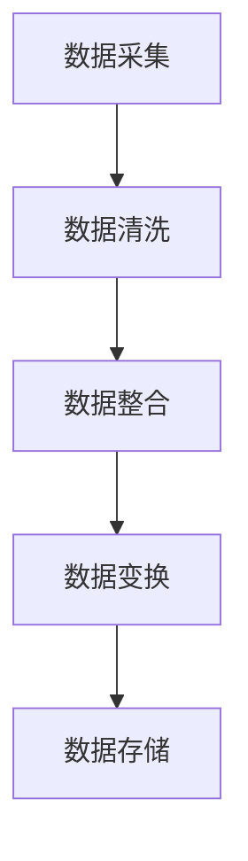
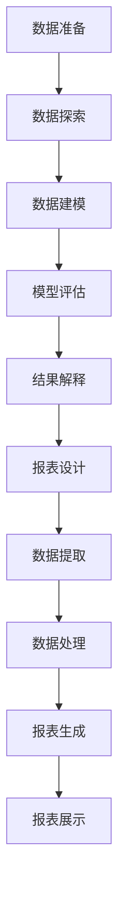
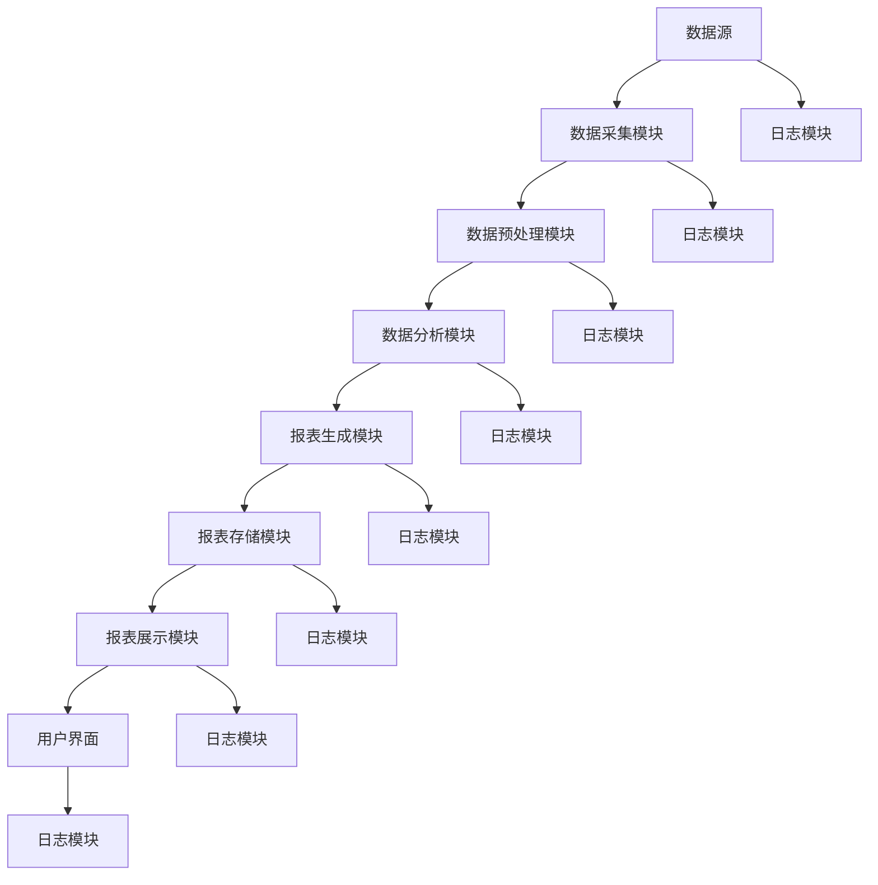
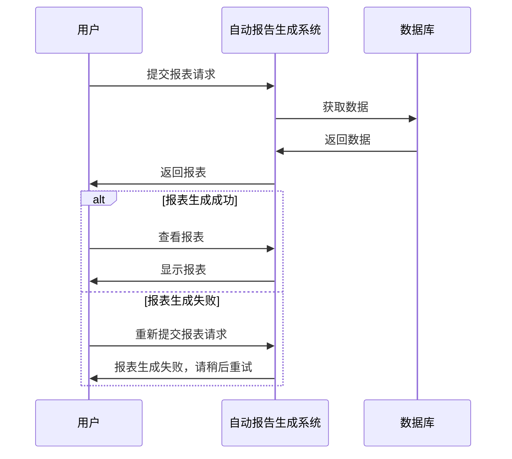
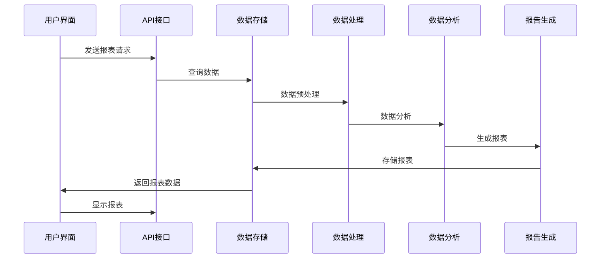

                 

## 企业级自动报告生成：简化业务汇报流程

### 关键词：企业级报告生成、自动化技术、业务流程优化、数据采集、数据分析、报表设计

### 摘要：
随着企业业务的日益复杂，传统的业务汇报流程变得越来越繁琐且耗时。本文将深入探讨企业级自动报告生成技术，通过逻辑分析和实际案例展示，阐述如何利用自动化技术简化业务汇报流程，提高企业运营效率。

### 1.1 问题背景

#### 1.1.1 问题提出
在许多企业中，业务汇报是一个不可或缺的过程，用于跟踪业绩、评估项目进度和资源利用率。然而，传统的手工汇报方式存在许多问题，如信息不完整、数据不准确、汇报不及时等。

#### 1.1.2 问题描述
- 数据采集困难：手工录入数据容易出错，且难以保证数据的一致性和完整性。
- 报告生成复杂：报表格式多样，生成过程繁琐，且需要大量的手工操作。
- 汇报不及时：业务变化快速，传统汇报方式难以满足即时性的需求。

#### 1.1.3 问题解决
为了解决上述问题，企业开始探索自动化报告生成技术，通过自动化数据采集、处理和分析，实现快速、准确的报告生成。

#### 1.1.4 边界与外延
- 企业级：指应用于大中型企业的报告生成系统。
- 自动化技术：包括数据采集、处理、分析和报表生成的全过程。

### 1.2 核心概念与联系

#### 1.2.1 自动报告生成概述

##### 1.2.1.1 定义
自动报告生成是一种利用计算机技术和算法，从数据源自动采集、处理和分析数据，生成预定义格式的报告的过程。

##### 1.2.1.2 特点
- 自动化：减少人工干预，提高效率。
- 灵活性：适应不同的报表格式和需求。
- 可扩展性：支持大规模数据处理。

##### 1.2.1.3 类型
- 定期报告：如月度财务报表、季度项目进度报告等。
- 即时报告：如销售业绩实时报表、生产进度实时监控报表等。

#### 1.2.2 企业级应用

##### 1.2.2.1 概念
企业级应用是指为满足企业规模和业务复杂度而设计的信息系统。

##### 1.2.2.2 应用领域
- 财务管理：生成财务报表。
- 项目管理：监控项目进度和资源利用率。
- 销售与市场：分析销售数据和市场趋势。

##### 1.2.2.3 优势
- 提高数据准确性：减少人为错误，提高数据可靠性。
- 节省时间和成本：自动化处理，减少人工操作。
- 支持决策：提供及时、准确的数据支持。

### 1.3 报告生成技术概述

#### 1.3.1 技术基础

##### 1.3.1.1 报告的定义与类型
- 报告定义：报告是对某一主题的系统性描述和总结。
- 报告类型：包括财务报表、项目进度报告、市场分析报告等。

##### 1.3.1.2 报告生成的需求分析
- 数据准确性：保证报告中的数据来源可靠，准确无误。
- 报告格式：满足企业特定的报告格式和排版要求。
- 可扩展性：支持不同部门、不同业务场景的报告生成。

##### 1.3.1.3 报告生成技术概述
- 数据采集：从不同的数据源（如数据库、文件、API等）采集数据。
- 数据处理：对采集到的数据进行清洗、转换和聚合。
- 数据分析：利用统计和机器学习算法对数据进行分析。
- 报表生成：根据分析结果生成预定义格式的报表。

### 1.4 企业级自动报告生成应用前景

#### 1.4.1 潜在应用领域
- 财务管理：自动生成财务报表，如资产负债表、利润表等。
- 项目管理：自动生成项目进度报告，监控项目执行情况。
- 营销与销售：自动生成销售数据分析报告，帮助制定营销策略。
- 生产管理：自动生成生产数据分析报告，优化生产流程。

#### 1.4.2 企业采用自动报告生成技术的优势
- 提高工作效率：自动化处理，减少重复性劳动。
- 提升数据质量：减少人为错误，提高数据的准确性。
- 支持决策：提供实时、准确的数据支持，帮助管理者做出明智的决策。

#### 1.4.3 面临的挑战与机遇
- 技术挑战：需要处理大量的数据，保证系统的稳定性和性能。
- 数据隐私和安全：确保数据的安全性和隐私保护。
- 适应不同的业务场景：需要根据企业的特定需求进行调整和优化。

## 1.5 本章小结
本文介绍了企业级自动报告生成的背景、核心概念、技术基础和应用前景。通过分析，我们可以看到自动报告生成技术对于简化业务汇报流程、提高企业运营效率具有巨大的潜力。在接下来的章节中，我们将进一步探讨数据采集与处理、数据分析和报表生成等关键技术。  
作者：AI天才研究院/AI Genius Institute & 禅与计算机程序设计艺术 /Zen And The Art of Computer Programming

----------------------------------------------------------------

## 2.1 数据采集与处理

数据采集与处理是自动报告生成的关键环节，它决定了报告的质量和准确性。在本节中，我们将详细探讨数据采集的方法、数据预处理技术和数据存储与组织。

### 2.1.1 数据采集方法

#### 2.1.1.1 数据源类型
- 结构化数据：如关系型数据库中的表格数据。
- 半结构化数据：如XML、JSON等格式化的数据。
- 非结构化数据：如文本、图片、音频等。

#### 2.1.1.2 数据采集方式
- API调用：通过API接口从外部系统获取数据。
- 数据爬取：使用爬虫技术从互联网上抓取数据。
- 手动输入：通过用户界面手动输入数据。
- 设备采集：如传感器采集设备数据。

### 2.1.2 数据预处理技术

#### 2.1.2.1 数据清洗
- 去除重复数据：确保数据集的纯净性。
- 数据格式转换：统一数据格式，如将所有日期转换为YYYY-MM-DD格式。
- 缺失值处理：根据实际情况填补缺失值或删除含有缺失值的记录。

#### 2.1.2.2 数据整合
- 跨源数据整合：将来自不同数据源的数据整合到一个数据集中。
- 数据归一化：将不同单位或范围的数据转换为同一尺度。

#### 2.1.2.3 数据变换
- 特征工程：提取有助于分析的数据特征。
- 数据聚合：对大量数据进行汇总，如按时间、地区等维度聚合。

### 2.1.3 数据存储与组织

#### 2.1.3.1 数据存储方案
- 关系型数据库：适用于结构化数据存储和管理。
- NoSQL数据库：适用于半结构化或非结构化数据存储。
- 分布式存储系统：如Hadoop、Spark等，适用于大规模数据存储和处理。

#### 2.1.3.2 数据索引与查询优化
- 数据索引：提高数据查询速度。
- 查询优化：优化SQL查询，减少查询时间。

#### 2.1.3.3 数据备份与恢复
- 数据备份：定期备份数据，防止数据丢失。
- 数据恢复：在数据丢失时能够迅速恢复。

### 2.1.4 数据采集与处理流程

#### 2.1.4.1 流程概述
- 数据采集：从数据源获取数据。
- 数据清洗：去除重复数据、处理缺失值。
- 数据整合：将不同来源的数据整合。
- 数据变换：提取特征、进行数据聚合。
- 数据存储：将处理后的数据存储到数据库。

#### 2.1.4.2 流程图
使用Mermaid语法绘制数据采集与处理流程图：



### 2.1.5 数据采集与处理的重要性

- 数据采集与处理是自动报告生成的基石，决定了报告的数据质量和准确性。
- 不完善的数据采集和处理会导致报告错误，影响决策。
- 高效的数据采集与处理能够提高报告生成速度，满足即时性需求。

### 2.1.6 本章小结
数据采集与处理是企业级自动报告生成的重要环节。通过合理的数据采集方法、有效的数据预处理技术和科学的数据存储与组织，我们可以确保报告的数据准确性和效率。在下一章节，我们将进一步探讨数据分析与报表生成技术。

---

### 2.2 数据分析与报表生成

数据分析与报表生成是企业级自动报告生成系统的核心部分，它将处理后的数据进行深入分析，并转化为直观的报表，为管理层提供决策支持。下面，我们将详细讲解数据分析的基本概念、常见报表类型以及数据分析和报表生成的具体流程。

#### 2.2.1 数据分析的基本概念

##### 2.2.1.1 数据分析定义
数据分析是通过量化和解释数据来提取有价值信息的过程，包括数据清洗、数据整合、数据变换、数据挖掘等步骤。

##### 2.2.1.2 数据分析目标
- 提取隐藏在数据中的模式和关系。
- 发现数据中的异常和趋势。
- 为业务决策提供数据支持。

##### 2.2.1.3 数据分析类型
- 描述性分析：描述数据的分布、趋势等。
- 探索性分析：发现数据中的潜在模式和关系。
- 预测性分析：基于历史数据预测未来趋势。

#### 2.2.2 常见报表类型

##### 2.2.2.1 财务报表
- 资产负债表：反映企业在某一时间点的资产、负债和所有者权益状况。
- 利润表：反映企业在一定时间内的收入、成本和利润情况。
- 现金流量表：反映企业在一定时间内的现金流入和流出情况。

##### 2.2.2.2 项目进度报表
- Gantt图：展示项目任务的完成情况。
- 报表表格：列出项目各阶段的完成情况和预计完成时间。

##### 2.2.2.3 销售与市场分析报表
- 销售分析报表：分析销售数据，如销售额、利润率等。
- 客户分析报表：分析客户数据，如客户满意度、客户忠诚度等。

##### 2.2.2.4 生产报表
- 生产进度报表：展示生产计划执行情况。
- 质量报表：分析产品质量数据，如缺陷率、合格率等。

#### 2.2.3 数据分析与报表生成的具体流程

##### 2.2.3.1 数据分析流程
- 数据准备：确保数据的准确性和完整性。
- 数据探索：使用统计方法探索数据特征和关系。
- 数据建模：建立数学模型，如回归分析、聚类分析等。
- 模型评估：评估模型的性能和适用性。
- 结果解释：解释模型结果，提取有价值的信息。

##### 2.2.3.2 报表生成流程
- 报表设计：设计报表的格式和内容。
- 数据提取：从数据库中提取所需数据。
- 数据处理：对提取的数据进行处理，如排序、分组、计算等。
- 报表生成：将处理后的数据转化为报表。
- 报表展示：将报表以电子表格、图表等形式展示。

#### 2.2.4 数据分析与报表生成的示例

假设我们想要生成一份销售分析报表，具体步骤如下：



#### 2.2.5 数据分析工具与库

- Python的Pandas库：提供高效的数据操作和分析功能。
- Python的Matplotlib和Seaborn库：用于生成各种类型的图表。
- R语言：专门用于统计分析和绘图。

### 2.2.6 数据分析与报表生成的最佳实践

- 确保数据质量：数据是分析的基础，保证数据准确和完整至关重要。
- 选择合适的分析方法：根据业务需求和数据特征选择合适的分析方法和工具。
- 报表可视化：使用图表和图形将分析结果可视化，使数据更易于理解和解读。

### 2.2.7 本章小结
数据分析与报表生成是企业级自动报告生成系统的重要组成部分，它通过深入分析数据，生成直观、易于理解的报表，为管理层提供决策支持。在下一章节，我们将探讨自动报告生成系统的设计与实现。

---

### 2.3 自动报告生成系统设计

自动报告生成系统是企业级系统中的一项关键功能，它不仅要求系统具备强大的数据处理和分析能力，还需要灵活的架构设计以适应不同的业务场景。下面，我们将详细讨论自动报告生成系统的系统架构设计、报告模板设计、系统接口设计和系统交互。

#### 2.3.1 系统架构设计

自动报告生成系统的架构设计应考虑系统的扩展性、稳定性和易维护性。以下是一个典型的自动报告生成系统架构：



##### 2.3.1.1 模块功能

- 数据采集模块：负责从各种数据源获取数据。
- 数据预处理模块：负责数据清洗、转换和整合。
- 数据分析模块：负责对预处理后的数据进行深入分析。
- 报表生成模块：负责生成预定义格式的报表。
- 报表存储模块：负责存储生成的报表，以便后续查看和打印。
- 报表展示模块：负责将报表以图表、电子表格等形式展示给用户。
- 用户界面：提供用户交互界面，用户可以通过界面提交报表请求、查看报表等。
- 日志模块：负责记录系统运行过程中的日志信息，用于监控和调试。

#### 2.3.2 报告模板设计

报告模板是自动报告生成系统的核心组件之一，它定义了报表的格式、内容以及数据展示方式。以下是一个报告模板设计的示例：

```mermaid
gantt
    dateFormat  YYYY-MM-DD
    title 报告模板设计

    section 数据源
    数据源  :G2019-01-01,2019-01-05

    section 数据采集
    数据采集  :A2019-01-02,2d

    section 数据预处理
    数据预处理  :B2019-01-04,3d

    section 数据分析
    数据分析  :C2019-01-06,4d

    section 报表生成
    报表生成  :D2019-01-07,2d

    section 报表展示
    报表展示  :E2019-01-09,2d
```

##### 2.3.2.1 模板组成部分

- 标题：报表的标题和摘要信息。
- 数据源：报表所依赖的数据源。
- 数据采集：数据采集的时间和方式。
- 数据预处理：数据清洗、转换和整合的过程。
- 数据分析：数据分析的方法和结果。
- 报表生成：报表的生成时间和格式。
- 报表展示：报表的展示方式和查看方式。

#### 2.3.3 系统接口设计

系统接口设计是自动报告生成系统与外部系统进行数据交换的桥梁，主要包括API接口和Web服务接口。以下是一个API接口设计的示例：



##### 2.3.3.1 接口功能

- 数据获取接口：提供获取数据的API接口，如GET /data。
- 报表生成接口：提供生成报表的API接口，如POST /report。
- 报表展示接口：提供查看报表的API接口，如GET /report/{id}。

#### 2.3.4 系统交互

系统交互是指自动报告生成系统内部各模块之间的协同工作，以及与外部系统的数据交换。以下是一个系统交互的示例：



##### 2.3.4.1 交互流程

- 用户通过用户界面提交报表请求。
- API接口接收请求，查询数据存储模块。
- 数据存储模块返回所需数据。
- 数据处理模块对数据进行预处理。
- 数据分析模块对预处理后的数据进行深入分析。
- 报告生成模块根据分析结果生成报表。
- 报告生成模块将报表存储到数据存储模块。
- 数据存储模块返回报表数据到用户界面。
- 用户界面显示报表。

#### 2.3.5 系统架构与接口设计的最佳实践

- 模块化设计：将系统功能划分为独立的模块，提高系统的可维护性和可扩展性。
- API设计：遵循RESTful API设计原则，确保接口的简洁性和易用性。
- 系统交互：使用异步处理和消息队列，提高系统的响应速度和处理能力。

### 2.3.6 本章小结

自动报告生成系统的设计是一个复杂的工程任务，需要考虑系统的架构、接口、交互等多个方面。通过合理的架构设计、接口设计和系统交互，可以实现高效、稳定、灵活的自动报告生成系统。在下一章节，我们将探讨自动报告生成系统在实际应用中的案例。

---

### 2.4 案例分析：某企业自动报告生成系统实战

在本节中，我们将通过一个实际案例，详细分析某企业自动报告生成系统的设计与实现过程。该案例将涵盖系统需求分析、系统架构设计、报告模板设计、数据采集与处理、报告生成流程以及系统测试与优化。

#### 2.4.1 案例背景

某大型制造企业需要对其生产、销售、财务等多个部门的数据进行整合和分析，以生成定期的业务报告。传统的手工报告方式不仅耗时耗力，而且容易出现数据错误，影响了决策的准确性和及时性。因此，企业决定开发一套自动报告生成系统，以提高业务效率。

#### 2.4.2 系统需求分析

在系统需求分析阶段，企业明确了以下需求：

- **数据源**：系统需要从ERP系统、库存管理系统、销售管理系统等多个数据源采集数据。
- **数据类型**：包括结构化数据（如销售数据、库存数据）和半结构化数据（如日志文件）。
- **报表类型**：定期生成生产报表、销售报表、财务报表等。
- **报告格式**：支持Excel、PDF等多种格式。
- **报告周期**：根据不同部门的需求，设置不同的报告生成周期，如每周、每月。
- **用户界面**：提供简洁直观的报表查询和下载界面。
- **系统性能**：能够快速处理大量数据，确保报告生成的实时性和准确性。

#### 2.4.3 系统设计与实现

##### 2.4.3.1 系统架构设计

系统架构设计如图所示：


##### 2.4.3.2 报告模板设计

报告模板设计如下：

```mermaid
gantt
    dateFormat  YYYY-MM-DD
    title 报告模板设计

    section 数据源
    数据源  :G2019-01-01,2019-01-05

    section 数据采集
    数据采集  :A2019-01-02,2d

    section 数据预处理
    数据预处理  :B2019-01-04,3d

    section 数据分析
    数据分析  :C2019-01-06,4d

    section 报表生成
    报表生成  :D2019-01-07,2d

    section 报表展示
    报表展示  :E2019-01-09,2d
```

##### 2.4.3.3 数据采集与处理

数据采集与处理流程如下：

1. **数据采集**：从ERP系统、库存管理系统、销售管理系统等多个数据源中提取数据。
2. **数据清洗**：去除重复数据、处理缺失值，确保数据的一致性和完整性。
3. **数据整合**：将来自不同系统的数据进行整合，统一数据格式。
4. **数据存储**：将处理后的数据存储到数据仓库中，便于后续分析。

##### 2.4.3.4 报告生成流程

报告生成流程如下：

1. **数据提取**：从数据仓库中提取需要分析的数据。
2. **数据分析**：使用统计学方法对提取的数据进行分析，提取有价值的信息。
3. **报表生成**：根据分析结果生成预定义格式的报表。
4. **报表展示**：将报表以电子表格、PDF等形式展示给用户。

##### 2.4.3.5 系统测试与优化

在系统测试与优化阶段，进行了以下工作：

1. **功能测试**：确保系统各项功能正常运行。
2. **性能测试**：对系统进行压力测试，确保在高负载情况下仍能稳定运行。
3. **优化策略**：通过索引优化、查询优化等手段提高系统性能。

#### 2.4.4 案例总结与启示

通过该案例，我们可以得出以下总结与启示：

- **自动化技术的重要性**：自动报告生成系统显著提高了企业的业务效率和数据准确性。
- **系统架构设计的关键**：合理的系统架构设计是系统稳定性和扩展性的关键。
- **数据质量的重要性**：高质量的数据是生成准确报告的基础。
- **持续优化与迭代**：系统上线后，需要持续进行优化和迭代，以适应不断变化的企业需求。

### 2.4.5 本章小结

通过本节案例的分析，我们详细展示了自动报告生成系统的设计与实现过程，从需求分析到系统架构设计，从报告模板设计到数据采集与处理，从报告生成流程到系统测试与优化。这个案例为我们提供了一个实际的参考，展示了如何通过自动报告生成系统简化业务汇报流程，提高企业运营效率。

---

### 2.5 报告生成的最佳实践与注意事项

在自动报告生成系统的实施过程中，遵循最佳实践和注意事项是确保系统高效、稳定运行的关键。以下是一些关于数据采集、数据处理、报告生成和系统维护的最佳实践与注意事项。

#### 2.5.1 数据采集最佳实践

- **数据源可靠性**：确保数据源的数据准确性，选择稳定可靠的数据源。
- **数据采集频率**：根据业务需求，合理设置数据采集频率，避免频繁采集导致系统资源浪费。
- **数据一致性**：确保不同数据源的数据在格式、编码等方面的一致性，减少数据转换的复杂性。

#### 2.5.2 数据处理最佳实践

- **数据清洗**：在数据处理前，务必进行彻底的数据清洗，去除重复数据、填补缺失值、修正错误数据。
- **数据整合**：将来自不同数据源的数据进行整合，构建统一的数据视图。
- **数据存储**：选择合适的数据存储方案，如关系型数据库、NoSQL数据库或分布式存储系统，确保数据的安全和可扩展性。

#### 2.5.3 报告生成最佳实践

- **模板设计**：设计灵活且易于扩展的报告模板，满足不同部门、不同业务场景的需求。
- **报表格式**：支持多种报表格式，如Excel、PDF、HTML等，以满足不同用户的需求。
- **自动化程度**：尽可能提高报告生成的自动化程度，减少人工干预。

#### 2.5.4 系统维护与优化注意事项

- **性能监控**：定期对系统性能进行监控，识别并解决潜在的性能瓶颈。
- **安全防护**：加强系统安全防护，防止数据泄露和未经授权的访问。
- **数据备份与恢复**：定期进行数据备份，确保在数据丢失或系统故障时能够迅速恢复。

#### 2.5.5 常见问题与解决策略

- **数据不一致**：解决策略包括数据清洗、数据整合和建立数据同步机制。
- **报表生成缓慢**：解决策略包括优化查询、使用缓存、优化报表生成算法。
- **系统故障**：解决策略包括建立故障转移机制、定期维护和监控系统状态。

### 2.5.6 本章小结

通过遵循报告生成的最佳实践和注意事项，企业可以确保自动报告生成系统的稳定运行和高效性能。在下一章节中，我们将探讨自动报告生成技术的未来发展趋势与前景。

---

### 2.6 未来发展趋势与展望

随着大数据、云计算、人工智能等技术的不断发展，自动报告生成技术也在不断演进，为企业带来了更多的机遇和挑战。以下是自动报告生成技术的未来发展趋势与展望。

#### 2.6.1 技术发展动态

- **大数据与云计算**：大数据和云计算技术的进步使得自动报告生成系统能够处理和分析海量数据，提高了系统的性能和可扩展性。
- **人工智能与机器学习**：人工智能和机器学习技术的应用使得自动报告生成系统能够从数据中自动提取模式和趋势，提供更准确的报告。
- **自然语言处理**：自然语言处理技术的发展使得自动报告生成系统可以生成更自然、更易于理解的语言描述，提高了报告的可读性。

#### 2.6.2 企业级自动报告生成技术的应用前景

- **智能化报表**：随着人工智能技术的应用，自动报告生成系统将能够自动识别数据中的异常和趋势，生成智能化的报表。
- **实时报告**：云计算和大数据技术的支持使得自动报告生成系统能够实现实时报告，为企业提供即时的业务洞察。
- **多渠道报告**：自动报告生成系统将支持多种报告格式和渠道，如邮件、Web门户、移动应用等，满足不同用户的需求。

#### 2.6.3 潜在挑战与机遇

- **数据隐私与安全**：随着数据量的增加，数据隐私和安全将成为自动报告生成系统面临的重要挑战。企业需要确保数据的安全性和隐私保护。
- **复杂业务场景**：不同的业务场景对自动报告生成系统提出了不同的需求，如何设计一个灵活、可扩展的系统架构是一个重要的挑战。

#### 2.6.4 未来发展方向

- **自动化程度提升**：通过优化算法和系统架构，进一步提高自动报告生成系统的自动化程度，减少人工干预。
- **智能化分析**：利用人工智能和机器学习技术，实现更智能的数据分析和报告生成，提供更深入的洞察。
- **用户体验优化**：通过改进用户界面和交互设计，提高自动报告生成系统的用户体验。

### 2.6.5 本章小结

自动报告生成技术正随着技术的进步而不断演进，为企业提供了更多的机遇。未来，随着人工智能和大数据等技术的发展，自动报告生成系统将变得更加智能化、实时化和多样化。企业需要紧跟技术发展趋势，充分利用自动报告生成技术，以提高业务效率和决策质量。

---

### 2.7 拓展阅读

为了帮助读者更深入地了解自动报告生成技术，本节将推荐一些相关技术文献、行业报告与资讯以及开源项目与工具。

#### 2.7.1 相关技术文献

- 《大数据分析：理论与实践》（张江，2018年）：该书详细介绍了大数据分析的理论和方法，包括数据采集、预处理、分析和报表生成等内容。
- 《机器学习实战》（彼得·哈林顿，2013年）：该书通过丰富的实例，介绍了机器学习的基本概念和应用，对于自动报告生成中的数据分析部分有很好的参考价值。
- 《数据处理与统计分析：使用R语言》（约翰·考克斯，2016年）：该书介绍了如何使用R语言进行数据处理和统计分析，适用于自动报告生成系统的数据分析模块。

#### 2.7.2 行业报告与资讯

- Gartner：Gartner是一家知名的市场研究公司，其发布的报告涵盖了许多与自动报告生成相关的技术趋势和市场分析。
- Forrester：Forrester同样是一家知名的市场研究公司，其发布的报告对自动报告生成技术的应用和前景进行了深入分析。
- 数据分析师社区：如Kaggle、DataCamp等，这些平台提供了大量的数据分析和报告生成的实战案例和教程。

#### 2.7.3 相关开源项目与工具

- Pandas：Python的数据分析库，提供了强大的数据处理和分析功能。
- Matplotlib：Python的数据可视化库，用于生成各种类型的图表。
- TensorFlow：谷歌开发的机器学习框架，适用于自动报告生成中的机器学习模块。
- Apache Spark：分布式数据处理框架，适用于处理大规模数据。

#### 2.7.4 本章小结

通过阅读这些文献、报告和开源项目，读者可以更全面地了解自动报告生成技术的最新动态和实际应用。这些资源不仅提供了理论知识，还包括了许多实用的案例和工具，有助于读者将理论应用到实践中。

### 2.7.5 本章小结

本章节通过推荐相关技术文献、行业报告、开源项目与工具，为读者提供了深入了解自动报告生成技术的丰富资源。这些资料不仅涵盖了理论和方法，还包括了实际的案例和工具，有助于读者更好地掌握自动报告生成技术的应用和实践。

---

## 总结

本文从背景介绍、核心概念与联系、数据采集与处理、数据分析与报表生成、系统设计与实现、案例分析和最佳实践等多个角度，全面探讨了企业级自动报告生成技术。通过实际案例的分析，我们展示了如何利用自动报告生成技术简化业务汇报流程，提高企业运营效率。

我们强调了数据采集与处理、数据分析与报表生成在自动报告生成系统中的关键作用，并提出了系统架构设计、报告模板设计、系统接口设计和系统交互等方面的最佳实践。通过本文的探讨，我们希望读者能够对自动报告生成技术有更深入的理解，并在实际工作中加以应用。

未来，随着大数据、人工智能等技术的不断进步，自动报告生成技术将继续发展，为企业提供更加智能化、实时化和多样化的报告生成解决方案。企业需要紧跟技术发展趋势，积极探索和实践自动报告生成技术，以提升业务效率和决策质量。

感谢读者的阅读，希望本文对您有所启发和帮助。如有任何疑问或建议，欢迎在评论区留言，期待与您共同探讨自动报告生成技术的未来发展。作者：AI天才研究院/AI Genius Institute & 禅与计算机程序设计艺术 /Zen And The Art of Computer Programming

