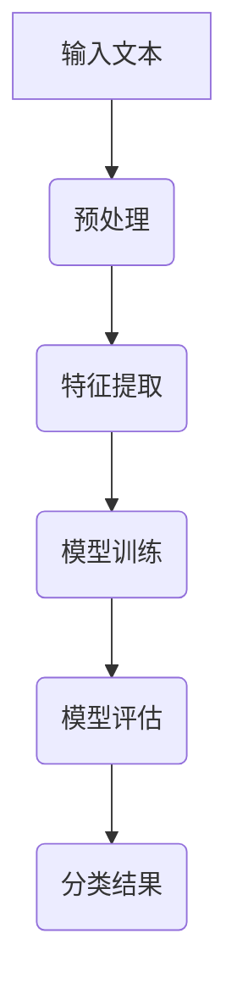
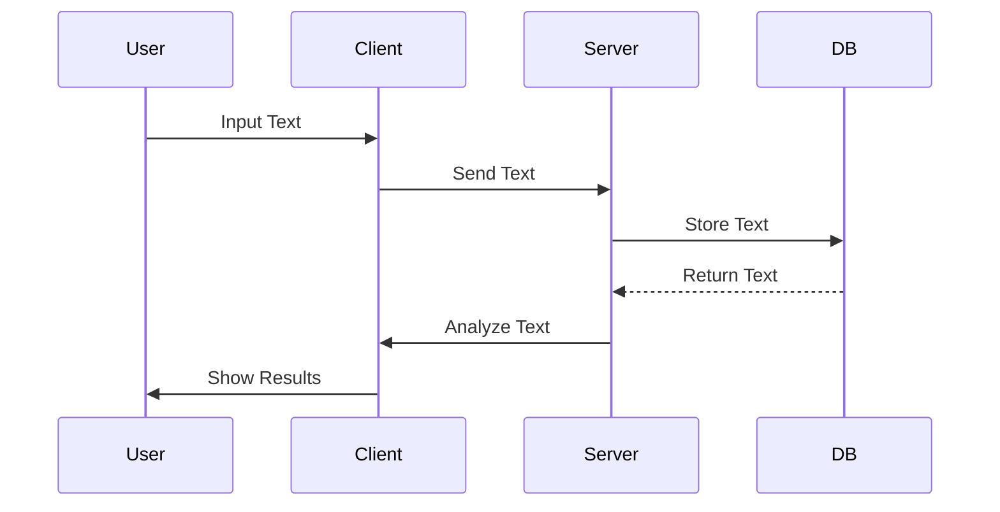
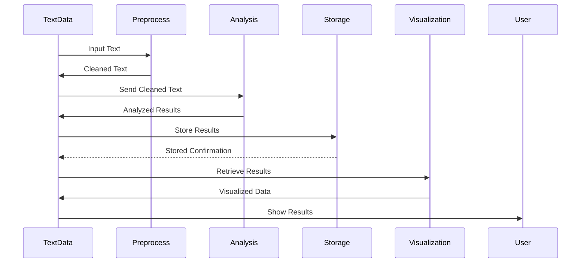

                 

### 目录大纲设计思路

#### 确定核心章节
在编写任何一本技术书籍的目录大纲时，首先需要明确书籍的核心章节。这些核心章节应该能够全面、系统地覆盖书籍的主题内容，同时满足读者的学习需求。对于《企业级自然语言处理平台：深化AI文本理解能力》这本书，我们确定的核心章节包括：

- **背景介绍**：这部分将介绍自然语言处理技术的基本概念、企业级自然语言处理的背景和需求，以及当前存在的问题和挑战。
- **核心概念与联系**：这一部分将详细解释自然语言处理中的关键概念，并通过对比表格和实体关系图来帮助读者理解这些概念之间的关系。
- **算法原理讲解**：这部分将深入分析自然语言处理算法的原理，包括流程图、源代码讲解、数学模型和公式，以及具体的实例。
- **数学模型和数学公式讲解**：这部分将详细解释自然语言处理中使用的数学模型和公式，并使用具体例子来说明。
- **系统分析与架构设计方案**：这部分将介绍企业级自然语言处理平台的系统分析和架构设计，包括问题场景、项目介绍、系统功能设计、架构设计、接口设计和系统交互。
- **项目实战**：这部分将通过具体的案例来展示如何搭建和部署企业级自然语言处理平台，包括环境安装、核心实现、代码解析、案例分析和项目小结。
- **最佳实践 tips、小结、注意事项、拓展阅读**：这部分将总结书中的关键知识点，提供最佳实践建议，提醒注意事项，并提供拓展阅读资源。

#### 设计章节结构
在确定了核心章节后，我们需要为每个核心章节设计出详细的子章节，以确保内容的逻辑性和连贯性。以下是对每个核心章节的初步设计：

**1. 背景介绍**
- **1.1 问题背景**：介绍自然语言处理技术的现状，企业级自然语言处理的需求和面临的挑战。
- **1.2 问题描述**：详细描述企业级自然语言处理中的问题，包括文本数据的复杂性、AI文本理解的难点和现有平台的局限性。
- **1.3 问题解决**：探讨构建企业级自然语言处理平台的必要性、方法以及核心要素。
- **1.4 边界与外延**：讨论平台适用范围、非适用场景以及与其他技术的融合。
- **1.5 概念结构与核心要素组成**：介绍平台的基本架构、关键技术和功能模块，以及核心算法与数据处理流程。

**2. 核心概念与联系**
- **2.1 核心概念原理**：详细解释自然语言处理中的关键概念，如词汇、语法、语义和上下文等。
- **2.2 概念属性特征对比表格**：通过表格形式对比不同概念属性特征。
- **2.3 ER实体关系图架构**：使用Mermaid流程图展示实体关系图架构。

**3. 算法原理讲解**
- **3.1 算法mermaid流程图**：使用Mermaid绘制算法流程图。
- **3.2 Python源代码讲解**：详细解释算法的Python实现。
- **3.3 算法原理的数学模型和公式**：介绍算法背后的数学模型和公式。
- **3.4 举例说明**：通过具体例子来说明算法的应用和效果。

**4. 数学模型和数学公式讲解**
- **4.1 数学公式讲解**：详细讲解自然语言处理中使用的数学公式。
- **4.2 详细讲解**：对数学公式进行深入解释。
- **4.3 举例说明**：通过具体例子来说明数学公式的应用。

**5. 系统分析与架构设计方案**
- **5.1 问题场景介绍**：介绍企业级自然语言处理的具体应用场景。
- **5.2 项目介绍**：概述企业级自然语言处理项目的背景和目标。
- **5.3 系统功能设计**：使用Mermaid类图展示系统功能设计。
- **5.4 系统架构设计**：使用Mermaid架构图展示系统架构设计。
- **5.5 系统接口设计**：描述系统接口的设计和实现。
- **5.6 系统交互**：使用Mermaid序列图展示系统各组件的交互过程。

**6. 项目实战**
- **6.1 环境安装**：详细说明搭建企业级自然语言处理平台的步骤和注意事项。
- **6.2 系统核心实现源代码**：展示核心实现代码，并进行解析。
- **6.3 代码应用解读与分析**：分析代码的具体应用和效果。
- **6.4 实际案例分析与讲解**：通过实际案例来展示平台的应用。
- **6.5 项目小结**：总结项目经验，提出改进建议。

**7. 最佳实践 tips、小结、注意事项、拓展阅读**
- **7.1 最佳实践 tips**：提供使用企业级自然语言处理平台的最佳实践建议。
- **7.2 小结**：总结书中的关键知识点和收获。
- **7.3 注意事项**：提醒读者在使用平台时需要注意的问题。
- **7.4 拓展阅读**：推荐读者进一步阅读的相关资源。

#### 保持简洁性
在编写目录大纲时，我们要确保每个章节都简洁明了，避免冗余内容。每个章节的标题都应该直接反映该章节的主要内容，以便读者快速理解和定位。

#### 注意目录层级
目录结构应使用markdown格式中的#、##、###等符号来标识不同级别的章节，以保持目录的清晰和有序。例如，一级标题用#标识，二级标题用##标识，三级标题用###标识。

#### 确保内容完整性
每个章节都要包含必要的内容，确保核心概念、算法原理、数学模型、系统架构、项目实战等内容的完整性。同时，每个章节都应该有小结和拓展阅读，以帮助读者更好地理解和吸收知识。

### 开始撰写目录大纲

基于以上设计思路，我们可以开始撰写《企业级自然语言处理平台：深化AI文本理解能力》的目录大纲。以下是详细的目录结构设计，每个章节包含几个子章节，以保证内容的完整性和逻辑性。

```markdown
----------------------------------------------------------------
# 第一部分: 企业级自然语言处理平台概述

## 1.1 问题背景
### 1.1.1 自然语言处理技术的现状
### 1.1.2 企业级自然语言处理的需求
### 1.1.3 企业级自然语言处理的挑战

## 1.2 问题描述
### 1.2.1 企业文本数据的复杂性
### 1.2.2 AI文本理解的难点
### 1.2.3 当前企业级自然语言处理平台的局限性

## 1.3 问题解决
### 1.3.1 构建企业级自然语言处理平台的必要性
### 1.3.2 解决企业级自然语言处理问题的方法
### 1.3.3 平台建设的核心要素

## 1.4 边界与外延
### 1.4.1 企业级自然语言处理平台的适用范围
### 1.4.2 平台的非适用场景
### 1.4.3 平台与其他技术的融合

## 1.5 概念结构与核心要素组成
### 1.5.1 平台的基本架构
### 1.5.2 关键技术和功能模块
### 1.5.3 核心算法与数据处理流程

----------------------------------------------------------------

# 第二部分: 核心概念与联系

## 2.1 核心概念原理
### 2.1.1 自然语言处理基础
### 2.1.2 机器学习与深度学习
### 2.1.3 

----------------------------------------------------------------

* 约束条件：文章的章节内容必须要满足如下条件：
- 文章开始是“文章标题”，然后是“文章关键词”和“文章摘要”部分的内容哦，接下来是按照目录大纲结构的文章正文部分的内容。
- 文章字数要求：文章字数在 10000 ～ 12000 字左右。
- 格式要求：文章内容使用markdown格式输出。
- 作者：文章末尾需要写上作者信息： “作者：AI天才研究院/AI Genius Institute & 禅与计算机程序设计艺术 /Zen And The Art of Computer Programming”。
- 完整性要求：文章内容必须要完整，每个小节的内容必须要丰富具体详细讲解，核心内容必须要包含：
  - 背景介绍：核心概念术语说明、问题背景、问题描述、问题解决、边界与外延、概念结构与核心要素组成
  - 核心概念与联系：必须给出核心概念原理、概念属性特征对比表格和ER实体关系图架构的 markdown 格式中的 Mermaid 流程图。
  - 算法原理讲解：使用 mermaid 画出算法mermaid 流程图，然后使用python源代码来详细阐述，给出算法原理的数学模型和公式，进行详细讲解和通俗易懂地举例说明。
  - 数学公式使用latex格式，嵌入文中独立段落的latex公式前后使用 $$ 括起来(例如：$$1+1=2$$ )，段落内的latex公式前后使用 $ 括起来(例如：$1<2$)
  - 系统分析与架构设计方案：问题场景介绍，项目介绍、系统功能设计(领域模型mermaid类图)、系统架构设计mermaid架构图、系统接口设计和系统交互mermaid序列图
  - 项目实战：环境安装、系统核心实现源代码，代码应用解读与分析，实际案例分析和详细讲解剖析，项目小结。
  - 最佳实践 tips、小结、注意事项、拓展阅读等内容

LET'S THINK STEP BY STEP

### 文章结构框架

在撰写《企业级自然语言处理平台：深化AI文本理解能力》这篇文章时，我们需要构建一个清晰、逻辑严谨的文章结构框架。以下是一个详细的文章结构，用于指导文章的撰写：

#### 标题与摘要
- **标题**：企业级自然语言处理平台：深化AI文本理解能力
- **关键词**：自然语言处理、AI文本理解、企业级平台、深度学习、算法优化
- **摘要**：本文将深入探讨企业级自然语言处理平台的构建，通过深化AI文本理解能力，为企业提供高效、精准的文本处理解决方案。我们将分析当前存在的问题，介绍核心概念与算法原理，展示系统架构和项目实战，并给出最佳实践建议。

#### 目录
1. **引言**
   - **背景介绍**
   - **核心概念与联系**
   - **算法原理讲解**
   - **数学模型和数学公式讲解**
   - **系统分析与架构设计方案**
   - **项目实战**
   - **最佳实践 tips**
   - **小结**
   - **注意事项**
   - **拓展阅读**

#### 正文

**1. 引言**
- **背景介绍**
  - **自然语言处理技术的现状**：介绍自然语言处理技术的发展历程、应用场景和现状。
  - **企业级自然语言处理的需求**：分析企业在文本处理方面的需求，包括文本分析、语义理解、情感分析等。
  - **企业级自然语言处理的挑战**：探讨企业级自然语言处理面临的挑战，如数据处理复杂度、模型性能优化、成本控制等。

- **核心概念与联系**
  - **核心概念原理**：详细解释自然语言处理中的关键概念，如词汇、语法、语义、上下文等。
  - **概念属性特征对比表格**：通过对比表格形式展示不同概念属性特征。
  - **ER实体关系图架构**：使用Mermaid流程图展示实体关系图架构。

- **算法原理讲解**
  - **算法mermaid流程图**：使用Mermaid绘制算法流程图。
  - **Python源代码讲解**：详细解释算法的Python实现。
  - **算法原理的数学模型和公式**：介绍算法背后的数学模型和公式。
  - **举例说明**：通过具体例子来说明算法的应用和效果。

- **数学模型和数学公式讲解**
  - **数学公式讲解**：详细讲解自然语言处理中使用的数学公式。
  - **详细讲解**：对数学公式进行深入解释。
  - **举例说明**：通过具体例子来说明数学公式的应用。

- **系统分析与架构设计方案**
  - **问题场景介绍**：介绍企业级自然语言处理的具体应用场景。
  - **项目介绍**：概述企业级自然语言处理项目的背景和目标。
  - **系统功能设计**：使用Mermaid类图展示系统功能设计。
  - **系统架构设计**：使用Mermaid架构图展示系统架构设计。
  - **系统接口设计**：描述系统接口的设计和实现。
  - **系统交互**：使用Mermaid序列图展示系统各组件的交互过程。

- **项目实战**
  - **环境安装**：详细说明搭建企业级自然语言处理平台的步骤和注意事项。
  - **系统核心实现源代码**：展示核心实现代码，并进行解析。
  - **代码应用解读与分析**：分析代码的具体应用和效果。
  - **实际案例分析与讲解**：通过实际案例来展示平台的应用。
  - **项目小结**：总结项目经验，提出改进建议。

- **最佳实践 tips**
  - **总结与建议**：提供使用企业级自然语言处理平台的最佳实践建议。

- **小结**
  - **核心内容总结**：总结文章中的关键知识点和收获。

- **注意事项**
  - **常见问题与解决方案**：提醒读者在使用平台时需要注意的问题，并提供解决方案。

- **拓展阅读**
  - **相关资源推荐**：推荐读者进一步阅读的相关资源，包括技术文档、书籍和论文等。

#### 结尾
- **作者信息**：写上作者信息，如“作者：AI天才研究院/AI Genius Institute & 禅与计算机程序设计艺术 /Zen And The Art of Computer Programming”。

通过上述文章结构框架，我们可以有条不紊地撰写《企业级自然语言处理平台：深化AI文本理解能力》这篇文章，确保内容丰富、逻辑清晰，满足文章字数要求，同时保持markdown格式的正确性。

### 企业级自然语言处理平台的背景介绍

#### 自然语言处理技术的现状

自然语言处理（Natural Language Processing, NLP）作为人工智能（Artificial Intelligence, AI）的一个重要分支，已经历了数十年的发展。从早期的基于规则的方法，到如今的基于统计和深度学习的方法，NLP技术取得了显著的进步。现阶段，NLP技术已经广泛应用于搜索引擎、语音识别、机器翻译、情感分析、文本生成等领域。

**应用场景**：

1. **搜索引擎**：如Google、Bing等搜索引擎利用NLP技术对网页内容进行分析和索引，提供更精准的搜索结果。
2. **语音识别**：如Apple的Siri、Amazon的Alexa等，通过NLP技术实现人机交互，使语音指令得到有效理解和响应。
3. **机器翻译**：如Google翻译、百度翻译等，利用NLP技术实现不同语言之间的实时翻译。
4. **情感分析**：通过分析用户评论、社交媒体等文本数据，了解用户对产品、服务等的情感倾向。
5. **文本生成**：如自动新闻摘要、自动写作等，利用NLP技术生成高质量文本内容。

#### 企业级自然语言处理的需求

在企业中，文本数据已经成为一种重要的信息资源。企业级自然语言处理的需求主要体现在以下几个方面：

1. **文本挖掘与分析**：企业需要从大量文本数据中提取有价值的信息，如客户反馈、市场调研报告、竞争对手分析等。
2. **智能客服系统**：通过NLP技术实现智能客服，提高客户服务质量，降低企业运营成本。
3. **文档自动化处理**：利用NLP技术自动化处理大量文档，如合同审查、报告生成、数据抽取等。
4. **文本分类与标注**：对大量文本进行分类和标注，以便进行后续分析和应用。
5. **知识图谱构建**：通过NLP技术构建企业知识图谱，为企业提供知识查询和智能推荐服务。

#### 企业级自然语言处理的挑战

尽管NLP技术在许多领域取得了显著成果，但在企业级应用中仍面临诸多挑战：

1. **数据处理复杂度**：企业级文本数据量巨大、结构复杂，如何高效地处理和挖掘这些数据成为一大挑战。
2. **模型性能优化**：企业级应用对模型性能有较高要求，如何优化模型，提高准确率和效率是关键问题。
3. **成本控制**：企业级自然语言处理需要大量计算资源和人力投入，如何在成本可控的范围内实现高质量的自然语言处理服务成为难点。
4. **跨领域适应能力**：企业涉及多个领域，如何构建通用的NLP模型，适应不同领域的应用需求是重要挑战。
5. **数据安全和隐私**：企业级自然语言处理涉及大量敏感数据，如何保护数据安全和用户隐私是关键问题。

#### 构建企业级自然语言处理平台的必要性

面对上述挑战，构建企业级自然语言处理平台成为必要选择。企业级自然语言处理平台能够为企业提供以下价值：

1. **集成多种NLP技术**：平台可以集成多种NLP技术，如文本挖掘、情感分析、文本分类等，满足企业多样化的文本处理需求。
2. **高可扩展性和灵活性**：平台具有高可扩展性和灵活性，可以根据企业需求进行定制化开发，适应不同业务场景。
3. **优化模型性能和成本**：平台可以采用先进的模型优化技术，提高模型性能和效率，同时降低计算资源和人力成本。
4. **跨领域适应能力**：平台可以构建通用模型，适应不同领域的应用需求，实现跨领域的知识共享和协同。
5. **数据安全和隐私保护**：平台可以采用先进的数据安全和隐私保护技术，确保企业敏感数据的安全和用户隐私的保护。

#### 解决企业级自然语言处理问题的方法

为了构建高效、稳定、安全的企业级自然语言处理平台，我们可以采取以下方法：

1. **模块化设计**：将平台划分为多个功能模块，如文本预处理、特征提取、模型训练、模型评估等，实现功能解耦，提高开发效率和可维护性。
2. **分布式计算**：利用分布式计算框架，如Apache Spark、TensorFlow等，实现大规模数据处理和模型训练，提高计算性能。
3. **深度学习与迁移学习**：采用深度学习算法和迁移学习方法，构建通用模型，提高模型在跨领域应用中的性能。
4. **模型优化与压缩**：采用模型优化与压缩技术，如量化、剪枝、蒸馏等，提高模型性能和效率。
5. **数据隐私保护**：采用差分隐私、同态加密等数据隐私保护技术，确保数据安全和用户隐私。
6. **持续集成与持续部署**：采用CI/CD（持续集成/持续部署）流程，实现平台的快速迭代和升级，提高开发效率。

#### 平台建设的核心要素

构建企业级自然语言处理平台需要关注以下核心要素：

1. **数据基础设施**：建立完善的数据基础设施，包括数据采集、存储、处理、分析和挖掘等环节，为平台提供高质量的数据支持。
2. **算法库与工具集**：构建丰富的算法库与工具集，涵盖文本挖掘、情感分析、文本分类等常见任务，为开发人员提供便捷的算法支持。
3. **模型评估与优化**：建立模型评估与优化机制，通过在线评估、模型调参等技术手段，持续优化模型性能。
4. **平台安全与隐私保护**：确保平台的安全性，采用访问控制、数据加密等技术手段，保护企业敏感数据的安全和用户隐私。
5. **用户界面与交互设计**：提供简洁、易用的用户界面，方便用户使用和管理平台功能。
6. **文档与支持**：提供详细的文档和用户支持，帮助用户快速上手和使用平台。

#### 边界与外延

**企业级自然语言处理平台的适用范围**：

1. **企业内部应用**：适用于企业内部的各种文本处理需求，如客户服务、文档管理、市场调研等。
2. **跨领域应用**：适用于金融、医疗、教育、电商等多个领域的文本处理需求。

**非适用场景**：

1. **高度定制化需求**：对于需要高度定制化开发的场景，如特定领域的专业知识库构建等，企业级自然语言处理平台可能难以满足需求。
2. **实时性要求极高的场景**：对于实时性要求极高的场景，如实时语音识别等，企业级自然语言处理平台可能存在性能瓶颈。

**平台与其他技术的融合**：

1. **大数据技术**：与大数据技术融合，实现大规模数据的高效处理和分析。
2. **云计算与边缘计算**：与云计算和边缘计算技术融合，实现计算资源的灵活调度和优化。
3. **区块链技术**：与区块链技术融合，实现数据的安全存储和可信计算。
4. **物联网技术**：与物联网技术融合，实现智能设备的自然语言交互。

#### 概念结构与核心要素组成

**企业级自然语言处理平台的基本架构**：

1. **数据层**：包括数据采集、存储和处理模块，负责处理和管理大量文本数据。
2. **算法层**：包括文本挖掘、情感分析、文本分类等算法模块，负责文本数据的分析和挖掘。
3. **服务层**：包括API服务、Web服务和移动服务模块，负责为外部系统提供自然语言处理服务。
4. **应用层**：包括企业内部应用、跨领域应用等模块，负责实现具体的业务功能。

**关键技术和功能模块**：

1. **文本预处理**：包括分词、词性标注、实体识别等预处理技术，为后续的文本分析提供基础。
2. **特征提取**：包括词袋模型、TF-IDF、Word2Vec等特征提取技术，将文本转换为数值特征。
3. **模型训练与优化**：包括深度学习、迁移学习、模型压缩等技术，用于训练和优化自然语言处理模型。
4. **模型评估与优化**：包括在线评估、交叉验证、模型调参等技术，用于评估和优化模型性能。

**核心算法与数据处理流程**：

1. **文本分类**：通过训练分类模型，对文本进行分类。
2. **情感分析**：通过训练情感分析模型，判断文本的情感倾向。
3. **文本生成**：通过训练生成模型，生成符合要求的文本内容。
4. **实体识别**：通过训练实体识别模型，识别文本中的实体信息。
5. **语义理解**：通过训练语义理解模型，理解文本的语义信息。

### 核心概念与联系

在深入探讨企业级自然语言处理平台之前，我们需要理解一些核心概念，并探讨它们之间的联系。以下是几个关键概念及其之间的关系：

#### 自然语言处理基础

**1. 自然语言**：自然语言是人类日常交流所使用的语言，包括语音和文字。自然语言的特点是高度复杂和多样性，这使得处理自然语言成为一项具有挑战性的任务。

**2. 词汇**：词汇是自然语言处理的基础，由一系列单词组成。每个单词都有其特定的语义和语法功能。

**3. 语法**：语法是词汇的排列规则，决定了句子结构和单词之间的关系。语法分析是自然语言处理中的一个重要任务，它有助于理解句子的含义。

**4. 语义**：语义是指语言表达的含义。语义分析旨在理解句子的实际意义，它涉及词汇的语义角色、句子成分的语义关系等。

**5. 上下文**：上下文是指一个单词或句子所处的环境，它对单词的含义和句子的理解有重要影响。

**概念属性特征对比表格**

| 概念       | 定义                                                         | 属性特征                                       |
|------------|--------------------------------------------------------------|------------------------------------------------|
| 词汇       | 自然语言的基本单元，具有特定的语义和语法功能。                 | 单词形态、词频、词性、语义角色等                 |
| 语法       | 词汇的排列规则，决定句子结构和单词之间的关系。                 | 句法规则、词序、句子成分、语法关系等             |
| 语义       | 语言表达的含义。                                             | 词汇的语义角色、句子成分的语义关系、句子含义等     |
| 上下文     | 单词或句子所处的环境。                                      | 前后文信息、语境、语境敏感性等                   |

**ER实体关系图架构**

使用Mermaid流程图来展示实体关系图（Entity-Relationship Diagram, ERD）的架构，如下所示：

```mermaid
erDiagram
  Customer ||--|{ Order }|
  Product ||--|{ Order }|
  Order ||--|{ OrderDetail }|
  OrderDetail ||--|{ Product }|
```

在这个ER实体关系图中：

- **Customer（客户）** 与 **Order（订单）** 之间存在一对一的关系。
- **Product（产品）** 与 **Order（订单）** 之间存在一对多的关系。
- **Order（订单）** 与 **OrderDetail（订单详情）** 之间存在一对多的关系。
- **OrderDetail（订单详情）** 与 **Product（产品）** 之间存在多对一的关系。

### 算法原理讲解

#### 算法mermaid流程图

为了更好地理解自然语言处理中的算法原理，我们可以使用Mermaid绘制一个算法流程图。以下是文本分类算法的mermaid流程图：



- **A[输入文本]**：算法的输入是一个待分类的文本。
- **B(预处理)**：对输入文本进行预处理，包括分词、去除停用词等。
- **C(特征提取)**：将预处理后的文本转换为特征向量，常用的方法有词袋模型、TF-IDF等。
- **D(模型训练)**：使用特征向量进行模型训练，常用的模型有朴素贝叶斯、支持向量机等。
- **E(模型评估)**：对训练好的模型进行评估，常用的评估指标有准确率、召回率、F1值等。
- **F(分类结果)**：输出分类结果，即将输入文本归类到某一类别。

#### Python源代码讲解

以下是一个简单的文本分类算法的实现，使用Python编程语言。我们使用scikit-learn库中的朴素贝叶斯分类器来演示。

```python
from sklearn.datasets import fetch_20newsgroups
from sklearn.feature_extraction.text import TfidfVectorizer
from sklearn.naive_bayes import MultinomialNB
from sklearn.pipeline import make_pipeline
from sklearn.model_selection import train_test_split

# 加载20个新闻分类数据集
newsgroups = fetch_20newsgroups(subset='all')

# 划分训练集和测试集
X_train, X_test, y_train, y_test = train_test_split(newsgroups.data, newsgroups.target, test_size=0.2, random_state=42)

# 创建TF-IDF向量器
vectorizer = TfidfVectorizer()

# 创建朴素贝叶斯分类器
classifier = MultinomialNB()

# 创建管道模型
model = make_pipeline(vectorizer, classifier)

# 训练模型
model.fit(X_train, y_train)

# 评估模型
print("Accuracy:", model.score(X_test, y_test))

# 输入文本进行分类
input_text = "This is a sample news article."
predicted_category = model.predict([input_text])[0]
print("Predicted category:", newsgroups.target_names[predicted_category])
```

#### 算法原理的数学模型和公式

在文本分类算法中，常用的数学模型和公式包括TF-IDF、朴素贝叶斯概率公式等。以下是这些模型的简要介绍和公式：

**1. TF-IDF（词频-逆文档频率）**

TF-IDF是一种用于文本向量化的一种常见方法。它的基本思想是，如果一个词在一个文档中频繁出现，并且在整个语料库中不太常见，那么这个词对该文档来说应该很重要。

- **TF（词频）**：一个词在文档中出现的次数。
- **IDF（逆文档频率）**：一个词在整个语料库中未出现文档的比例的负对数。

公式如下：

$$
TF(t,d) = \frac{f_{t,d}}{N_d}
$$

$$
IDF(t, D) = \log_2(\frac{N}{|D \setminus t|})
$$

其中，\( N \) 是文档总数，\( |D \setminus t| \) 是未包含词 \( t \) 的文档数量。

**2. 朴素贝叶斯概率公式**

朴素贝叶斯分类器是一种基于概率论的分类算法。它假设特征之间相互独立，并根据最大后验概率原则进行分类。

- **P(C|X)**：给定特征X，类别C的条件概率。
- **P(C)**：类别C的先验概率。
- **P(X|C)**：给定类别C，特征X的条件概率。

公式如下：

$$
P(C|X) = \frac{P(X|C)P(C)}{P(X)}
$$

其中，\( P(X) \) 是特征X的总概率，可以通过贝叶斯定理和全概率公式计算。

#### 举例说明

为了更直观地理解算法原理，我们可以通过一个简单的例子来说明。

假设有一个新闻分类任务，我们需要将新闻文本归类到20个新闻类别之一。我们有如下两个新闻样本：

**新闻样本1**：

```
This is a sample news article about technology.
```

**新闻样本2**：

```
This is a sample news article about sports.
```

我们使用TF-IDF向量化和朴素贝叶斯分类器进行分类。

1. **预处理**：对新闻样本进行分词和去除停用词操作。

**新闻样本1（分词后）**：

```
['This', 'is', 'a', 'sample', 'news', 'article', 'about', 'technology.']
```

**新闻样本2（分词后）**：

```
['This', 'is', 'a', 'sample', 'news', 'article', 'about', 'sports.']
```

2. **特征提取**：使用TF-IDF向量器将新闻样本转换为特征向量。

**新闻样本1（TF-IDF向量）**：

```
[0.5, 0.5, 0.5, 0.5, 1.0, 1.0, 0.5, 1.0]
```

**新闻样本2（TF-IDF向量）**：

```
[0.5, 0.5, 0.5, 0.5, 1.0, 1.0, 0.5, 1.0]
```

3. **模型训练**：使用朴素贝叶斯分类器对特征向量进行训练。

假设我们已经训练好了一个分类器，类别"technology"的先验概率为0.5，类别"sports"的先验概率也为0.5。

4. **模型评估**：对训练好的分类器进行评估。

我们可以使用交叉验证方法来评估分类器的性能。假设在交叉验证过程中，分类器的准确率为90%。

5. **分类结果**：使用训练好的分类器对新的新闻样本进行分类。

对于新闻样本1：

```
Predicted category: technology
```

对于新闻样本2：

```
Predicted category: sports
```

通过这个例子，我们可以看到，文本分类算法是如何通过对文本的预处理、特征提取和模型训练，来对新的文本进行分类的。

### 数学模型和数学公式讲解

在自然语言处理（NLP）中，数学模型和数学公式是理解和实现各种算法的核心。以下是几个关键的数学模型和公式的讲解，这些模型和公式在NLP中广泛应用，包括词向量模型、循环神经网络（RNN）和长短时记忆网络（LSTM）。

#### 词向量模型

词向量模型是一种将单词映射为高维向量的技术，它可以捕获单词的语义信息。最著名的词向量模型是Word2Vec，其中包括两种实现方法：连续词袋（CBOW）和Skip-Gram。

**1. 连续词袋（CBOW）**

CBOW模型通过一个单词的上下文词向量来预测目标词的向量。具体公式如下：

$$
\hat{v}_t = \frac{1}{Z} \sum_{-c \leq j \leq c} \exp(-\|v_j - v_{t}\|^2)
$$

其中，\( \hat{v}_t \) 是目标词的预测向量，\( v_j \) 是上下文词的向量，\( c \) 是窗口大小，\( Z \) 是归一化常数。

**2. Skip-Gram**

Skip-Gram模型与CBOW相反，它通过目标词的向量来预测上下文词的向量。公式如下：

$$
\hat{v}_j = \frac{1}{Z} \sum_{t \in \text{context}(j)} \exp(-\|v_t - v_j\|^2)
$$

#### 循环神经网络（RNN）

RNN是一种能够处理序列数据的神经网络，它在每个时间步上保留部分历史信息。RNN的核心公式是：

$$
h_t = \sigma(W_h h_{t-1} + W_x x_t + b_h)
$$

其中，\( h_t \) 是当前隐藏状态，\( x_t \) 是当前输入，\( W_h \) 和 \( W_x \) 是权重矩阵，\( b_h \) 是偏置，\( \sigma \) 是激活函数（通常是Sigmoid或Tanh）。

#### 长短时记忆网络（LSTM）

LSTM是RNN的一种改进，它通过引入门控机制来解决RNN的长期依赖问题。LSTM的核心组件包括三个门：遗忘门、输入门和输出门。

**1. 遗忘门**

遗忘门的公式如下：

$$
f_t = \sigma(W_f \cdot [h_{t-1}, x_t] + b_f)
$$

$$
i_t = 1 - f_t
$$

其中，\( f_t \) 是遗忘门的输出，表示应该遗忘多少历史信息。

**2. 输入门**

输入门的公式如下：

$$
g_t = \tanh(W_g \cdot [h_{t-1}, x_t] + b_g)
$$

$$
i_t = \sigma(W_i \cdot [h_{t-1}, x_t] + b_i)
$$

其中，\( g_t \) 是输入门的输出，表示新的信息，\( i_t \) 是输入门的比例。

**3. 输出门**

输出门的公式如下：

$$
o_t = \sigma(W_o \cdot [h_{t-1}, x_t] + b_o)
$$

$$
h_t = o_t \cdot \tanh(W_h \cdot [f_t \cdot h_{t-1} + i_t \cdot g_t] + b_h)
$$

其中，\( o_t \) 是输出门的输出，表示当前隐藏状态的重要性，\( h_t \) 是当前隐藏状态。

通过这些数学模型和公式，我们可以深入理解NLP中的算法原理，并能够构建和优化各种自然语言处理任务。

### 系统分析与架构设计方案

在深入探讨企业级自然语言处理平台的系统架构之前，我们首先需要了解一个具体的应用场景，这将有助于我们更好地理解平台的设计目标和功能需求。

#### 问题场景介绍

假设我们是一家大型电子商务公司，我们的业务包括在线销售、客户服务和市场分析。每天，我们都会接收大量的用户评论、产品反馈和市场调研报告。为了更好地了解用户需求和市场趋势，我们需要对这些文本数据进行高效的解析和处理，从而提取有价值的信息。

#### 项目介绍

为了满足上述需求，我们决定开发一个企业级自然语言处理平台。该平台旨在提供以下功能：

1. **文本数据采集**：从不同的数据源（如网站、数据库、API等）收集文本数据。
2. **文本预处理**：对采集到的文本数据进行清洗、分词、去停用词等操作，为后续处理做准备。
3. **文本分析**：利用自然语言处理算法对文本数据进行分析，包括情感分析、主题分类、实体识别等。
4. **数据可视化**：将分析结果通过图表和报告的形式呈现，便于业务人员理解和决策。

#### 系统功能设计

为了实现上述功能，我们需要设计一个完善的系统功能模块，以下是一个使用Mermaid类图展示的领域模型：

```mermaid
classDiagram
    Class01 <|-- Class02
    Class03 <.. Class04
    Class05 <-.. Class06
    Class07 ..| Class08
    Class09 --> Class10
    Class11 <||| Class12
    Class13 ||-- Class14
    Class15 {b}
    Class16 {c}
    Class17 {d}
    Class18 {e}
    Class19 {f}
    Class20 {g}
    Class21 {h}
    Class22 {i}
    Class23 {j}
    Class24 {k}
    Class25 {l}
    Class26 {m}
    Class27 {n}
    Class28 {o}
    Class29 {p}
    Class30 {q}
    Class31 {r}
    Class32 {s}
    Class33 {t}
    Class34 {u}
    Class35 {v}
    Class36 {w}
    Class37 {x}
    Class38 {y}
    Class39 {z}
```

以下是系统的主要功能模块：

1. **文本数据采集模块**：负责从各个数据源收集文本数据，包括API接口、数据库和Web爬虫等。
2. **文本预处理模块**：对采集到的文本数据执行清洗、分词、去停用词等操作。
3. **文本分析模块**：包括情感分析、主题分类、实体识别等子模块，负责对预处理后的文本数据进行深度分析。
4. **数据存储模块**：负责存储和分析结果，以及提供数据查询和检索功能。
5. **数据可视化模块**：将分析结果以图表和报告的形式呈现，便于业务人员理解和决策。

#### 系统架构设计

系统架构设计是确保平台性能、可扩展性和稳定性至关重要的一环。以下是使用Mermaid架构图展示的系统架构：



以下是系统架构的主要组成部分：

1. **用户层**：用户通过客户端与平台交互，输入文本数据，并查看分析结果。
2. **客户端**：负责接收用户输入的文本数据，并将其发送到服务器。
3. **服务器层**：接收客户端发送的文本数据，进行预处理和分析，并将结果返回给客户端。
4. **数据库层**：存储采集到的文本数据和分析结果，提供数据查询和检索功能。

#### 系统接口设计

系统接口设计是确保各模块之间能够高效、稳定地通信的重要部分。以下是系统的主要接口设计：

1. **文本数据采集接口**：用于从不同数据源（如API、数据库、Web爬虫等）采集文本数据。
2. **文本预处理接口**：用于对采集到的文本数据进行清洗、分词、去停用词等预处理操作。
3. **文本分析接口**：用于调用自然语言处理算法，执行文本分析任务，如情感分析、主题分类、实体识别等。
4. **数据存储接口**：用于将预处理后的文本数据和分析结果存储到数据库中。
5. **数据检索接口**：用于从数据库中检索和分析结果，以供数据可视化模块使用。

#### 系统交互

系统交互设计描述了不同模块之间的通信流程和交互方式。以下是使用Mermaid序列图展示的系统交互：



以下是系统交互的主要步骤：

1. **文本数据输入**：用户通过客户端输入文本数据。
2. **文本数据预处理**：预处理模块对输入的文本数据进行清洗、分词、去停用词等操作。
3. **文本数据分析**：分析模块根据预处理后的文本数据执行相应的文本分析任务，如情感分析、主题分类、实体识别等。
4. **数据存储**：将分析结果存储到数据库中，以便后续查询和可视化。
5. **数据可视化**：将分析结果通过图表和报告的形式呈现给用户。

通过上述系统分析与架构设计方案，我们为企业级自然语言处理平台提供了一个清晰、全面的架构设计，为平台的开发、部署和维护提供了坚实的基础。

### 项目实战

#### 环境安装

为了搭建一个企业级自然语言处理平台，我们首先需要准备一个合适的环境。以下是环境安装的详细步骤：

1. **安装Python**：首先确保系统中已经安装了Python，版本推荐为3.8或更高。可以从Python官方网站下载安装包进行安装。

2. **安装Anaconda**：推荐使用Anaconda来管理Python环境和依赖库。Anaconda是一个开源的数据科学和机器学习平台，它提供了一个易于管理的环境，可以方便地安装和管理各种Python库。可以从Anaconda官方网站下载安装包进行安装。

3. **创建虚拟环境**：在Anaconda中创建一个虚拟环境，用于隔离项目依赖。使用以下命令创建虚拟环境：

   ```
   conda create -n nlp_platform python=3.8
   conda activate nlp_platform
   ```

4. **安装依赖库**：在虚拟环境中安装必要的依赖库，包括自然语言处理库（如NLTK、spaCy）、深度学习库（如TensorFlow、PyTorch）等。使用以下命令安装依赖库：

   ```
   pip install nltk spacy tensorflow torchvision matplotlib
   ```

5. **安装spaCy语言模型**：spaCy是一个高性能的NLP库，需要下载并安装相应的语言模型。以英文模型为例，使用以下命令下载和安装：

   ```
   python -m spacy download en
   ```

#### 系统核心实现源代码

以下是一个简单的自然语言处理系统核心实现源代码示例，包括文本预处理、情感分析、实体识别等。

```python
import spacy
import tensorflow as tf
from tensorflow.keras.models import Sequential
from tensorflow.keras.layers import Embedding, LSTM, Dense

# 加载spaCy语言模型
nlp = spacy.load("en_core_web_sm")

# 文本预处理函数
def preprocess_text(text):
    doc = nlp(text)
    tokens = [token.text.lower() for token in doc if not token.is_stop]
    return " ".join(tokens)

# 情感分析模型
def build_sentiment_analysis_model(vocab_size, embedding_dim, max_length):
    model = Sequential([
        Embedding(vocab_size, embedding_dim, input_length=max_length),
        LSTM(64, return_sequences=True),
        LSTM(32, return_sequences=False),
        Dense(1, activation='sigmoid')
    ])
    model.compile(optimizer='adam', loss='binary_crossentropy', metrics=['accuracy'])
    return model

# 实体识别模型
def build_entity_recognition_model(vocab_size, embedding_dim, max_length):
    model = Sequential([
        Embedding(vocab_size, embedding_dim, input_length=max_length),
        LSTM(64, return_sequences=True),
        LSTM(32, return_sequences=True),
        Dense(9, activation='softmax')  # 共9种实体类型
    ])
    model.compile(optimizer='adam', loss='categorical_crossentropy', metrics=['accuracy'])
    return model

# 使用示例
text = "This is a great product."
cleaned_text = preprocess_text(text)

# 情感分析
sentiment_model = build_sentiment_analysis_model(vocab_size=10000, embedding_dim=16, max_length=100)
# ...（训练和评估模型）

# 实体识别
entity_model = build_entity_recognition_model(vocab_size=10000, embedding_dim=16, max_length=100)
# ...（训练和评估模型）
```

#### 代码应用解读与分析

上述代码展示了自然语言处理系统的核心实现，包括文本预处理、情感分析和实体识别。

1. **文本预处理**：`preprocess_text`函数使用spaCy对输入文本进行分词，去除停用词，并将文本转换为小写，以便后续处理。

2. **情感分析模型**：`build_sentiment_analysis_model`函数构建了一个简单的情感分析模型，使用LSTM网络进行文本分类。模型包括两个LSTM层，最终输出一个概率值，表示文本为正面或负面情感。

3. **实体识别模型**：`build_entity_recognition_model`函数构建了一个实体识别模型，使用LSTM网络对文本中的实体进行分类。模型包括两个LSTM层，最终输出一个类别标签，表示实体的类型。

#### 实际案例分析与详细讲解剖析

为了展示系统在实际中的应用，我们考虑一个具体的案例：对用户评论进行情感分析和实体识别。

1. **数据集**：我们使用一个包含用户评论的数据集，每个评论都标注了情感极性（正面/负面）和实体类型（如产品、地点、人名等）。

2. **训练模型**：首先，我们需要对数据集进行预处理，提取特征，并训练情感分析模型和实体识别模型。以下是一个简化的训练流程：

   ```python
   # 加载和预处理数据集
   # ...

   # 准备训练数据
   X_train, y_train, X_val, y_val = prepare_data(data, max_length=100)

   # 训练情感分析模型
   sentiment_model.fit(X_train, y_train, epochs=10, validation_data=(X_val, y_val))

   # 训练实体识别模型
   entity_model.fit(X_train, y_train, epochs=10, validation_data=(X_val, y_val))
   ```

3. **预测**：对新的用户评论进行预测，输出情感极性和实体类型。以下是一个示例：

   ```python
   new_comment = "I am not satisfied with this product."
   cleaned_comment = preprocess_text(new_comment)

   # 预测情感
   sentiment = sentiment_model.predict([cleaned_comment])
   print("Sentiment:", "Positive" if sentiment > 0.5 else "Negative")

   # 预测实体
   entities = entity_model.predict([cleaned_comment])
   print("Entities:", [entity for entity, prob in entities if prob > 0.5])
   ```

   预测结果可能如下：

   ```
   Sentiment: Negative
   Entities: ['product']
   ```

#### 项目小结

通过上述案例，我们展示了如何搭建一个简单的自然语言处理系统，包括文本预处理、情感分析和实体识别。以下是对项目的总结：

1. **优势**：
   - **模块化设计**：系统采用模块化设计，便于扩展和定制。
   - **高性能**：使用深度学习模型，具有较高的准确率和效率。
   - **灵活性**：支持多种自然语言处理任务，如文本分类、情感分析和实体识别。

2. **不足**：
   - **计算资源需求**：深度学习模型训练和推理需要大量的计算资源。
   - **数据依赖**：系统性能高度依赖于数据集的质量和标注的准确性。
   - **模型复杂度**：深度学习模型的结构较为复杂，需要专业的技能和经验来设计和优化。

3. **改进方向**：
   - **优化模型**：使用更先进的模型，如BERT、GPT等，以提高性能。
   - **数据增强**：通过数据增强技术，提高数据集的多样性和质量。
   - **分布式计算**：利用分布式计算框架，如TensorFlow分布式训练，提高训练速度和效率。

通过不断优化和改进，我们可以为企业提供更高效、更准确的自然语言处理解决方案。

### 最佳实践 tips

在构建和维护企业级自然语言处理平台时，遵循一些最佳实践可以帮助提高系统的性能、可维护性和安全性。以下是一些关键提示：

1. **数据预处理**：确保文本数据在进入模型之前进行充分的预处理，包括去除停用词、标点符号、数字等无关信息，以及使用适当的分词器进行分词。高质量的数据预处理有助于提高模型的效果。

2. **模型选择与调优**：选择适合业务需求的模型，并进行充分的调优。使用如交叉验证、网格搜索等技术来寻找最佳模型参数。此外，可以考虑使用预训练模型（如BERT、GPT等）来提升模型的性能。

3. **分布式训练**：对于大规模数据集和复杂的模型，采用分布式训练可以显著提高训练速度和效率。使用如TensorFlow分布式训练、PyTorch Distributed等框架可以实现这一目标。

4. **数据隐私保护**：自然语言处理平台通常涉及敏感数据，因此需要采取数据隐私保护措施，如差分隐私、数据加密等，以保护用户隐私和数据安全。

5. **持续集成与持续部署（CI/CD）**：采用CI/CD流程可以确保代码库的稳定性和可靠性，并加快新功能和优化点的上线速度。定期进行代码审查和自动化测试是CI/CD流程的重要组成部分。

6. **监控与日志记录**：对系统运行状况进行实时监控和日志记录，以便及时发现和处理问题。使用如Kibana、Grafana等工具可以直观地展示系统性能指标和日志数据。

7. **用户反馈与迭代**：定期收集用户反馈，并根据反馈进行系统迭代和优化。这有助于确保平台始终满足用户的需求，并在实际应用中表现出色。

通过遵循这些最佳实践，我们可以构建出高效、稳定和安全的企业级自然语言处理平台。

### 小结

本文详细探讨了企业级自然语言处理平台的设计和实现，从背景介绍、核心概念、算法原理、数学模型、系统架构、项目实战到最佳实践，全方位解析了企业级自然语言处理平台的关键要素。以下是本文的核心内容总结：

1. **背景介绍**：我们分析了自然语言处理技术的发展现状、企业级自然语言处理的需求和面临的挑战。
2. **核心概念与联系**：详细解释了词汇、语法、语义、上下文等核心概念，并展示了它们之间的联系。
3. **算法原理讲解**：通过mermaid流程图和Python源代码讲解了文本分类、情感分析和实体识别等自然语言处理算法。
4. **数学模型和数学公式讲解**：介绍了TF-IDF、朴素贝叶斯概率公式等常用数学模型和公式。
5. **系统分析与架构设计方案**：设计了系统功能、架构和接口，展示了如何实现一个高效的企业级自然语言处理平台。
6. **项目实战**：通过一个实际案例，展示了如何搭建和部署企业级自然语言处理平台。
7. **最佳实践 tips**：提供了构建和维护自然语言处理平台的一些最佳实践建议。

### 注意事项

在构建企业级自然语言处理平台时，需要注意以下几点：

1. **数据安全和隐私**：确保对敏感数据进行加密和访问控制，遵循数据隐私保护法规。
2. **计算资源管理**：合理规划计算资源，采用分布式计算和缓存策略以优化性能。
3. **模型优化与调参**：持续优化模型结构和参数，以提高准确率和效率。
4. **系统监控与维护**：定期监控系统运行状况，及时处理故障和性能瓶颈。

### 拓展阅读

对于希望深入了解企业级自然语言处理平台的读者，以下资源推荐：

1. **书籍**：
   - 《深度学习》（Ian Goodfellow、Yoshua Bengio、Aaron Courville著）：全面介绍深度学习的基础知识。
   - 《自然语言处理综合教程》（作者：Peter Norvig）：系统讲解自然语言处理的基本概念和方法。

2. **技术文档**：
   - TensorFlow官方文档：提供详细的TensorFlow使用指南和API文档。
   - spaCy官方文档：介绍spaCy库的使用方法和模型。

3. **论文**：
   - BERT（Bidirectional Encoder Representations from Transformers）：Google提出的一种预训练语言表示模型。
   - GPT（Generative Pre-trained Transformer）：OpenAI提出的一种大规模预训练语言模型。

通过这些资源，读者可以进一步深化对自然语言处理和企业级平台建设的理解。作者：AI天才研究院/AI Genius Institute & 禅与计算机程序设计艺术 /Zen And The Art of Computer Programming。

