                 

### 引言

#### 问题背景

随着互联网的迅猛发展和信息爆炸式增长，自然语言处理（Natural Language Processing, NLP）作为人工智能（Artificial Intelligence, AI）领域的一个重要分支，逐渐成为了企业和研究机构关注的焦点。企业级自然语言处理不仅能够帮助企业在处理大量文本数据时提高效率和准确性，还能够通过文本数据的深度挖掘为企业提供宝贵的洞察和决策支持。例如，在客户服务领域，自然语言处理技术可以帮助企业自动化处理客户反馈，识别潜在问题，并提供个性化的解决方案；在金融行业，自然语言处理可以用于股票市场分析、欺诈检测等，为企业带来显著的经济效益。

#### 文章主题

本文旨在深入探讨企业级自然语言处理的应用，系统分析其在各个领域中的深化应用。文章将从以下几部分展开：

1. **背景介绍**：回顾自然语言处理的发展历程，探讨其在企业级应用中的挑战与机遇。
2. **核心概念与联系**：介绍自然语言处理的核心概念，如语言模型、词向量、文本分类与情感分析等，并探讨这些概念之间的联系。
3. **算法原理讲解**：详细讲解自然语言处理中的经典算法，包括机器学习基础、语言模型算法原理、词向量算法原理以及文本分类与情感分析算法原理。
4. **系统分析与架构设计方案**：分析企业级自然语言处理系统的功能设计、架构设计、接口设计和交互设计。
5. **项目实战**：通过一个实际案例，展示如何构建企业级自然语言处理系统，并提供详细的代码解析和案例分析。
6. **最佳实践 tips**：总结企业级自然语言处理中的最佳实践和注意事项。
7. **总结与展望**：总结文章的核心内容，展望自然语言处理在企业级应用中的未来发展。

#### 文章关键词

- 自然语言处理
- 企业级应用
- 语言模型
- 词向量
- 文本分类
- 情感分析
- 系统架构设计

### 摘要

本文详细探讨了企业级自然语言处理的各个方面，从背景介绍到核心概念、算法原理、系统分析与架构设计、项目实战以及最佳实践，全面覆盖了自然语言处理在企业级应用中的深化应用。通过深入分析和实际案例展示，本文旨在帮助读者理解自然语言处理技术在实际应用中的价值，并提供实用的指导和建议。本文的关键词包括自然语言处理、企业级应用、语言模型、词向量、文本分类和情感分析等。

---

**接下来，我们将详细探讨自然语言处理的发展历程，探讨其在企业级应用中的挑战与机遇。**

## 第1章：问题背景与自然语言处理的重要性

### 自然语言处理的发展历程

自然语言处理（NLP）作为人工智能领域的一个重要分支，其发展历程可以追溯到20世纪50年代。当时，计算机科学家和语言学家们开始探索如何使计算机理解和处理人类语言。1950年，艾伦·图灵（Alan Turing）提出了图灵测试（Turing Test），这一概念成为了NLP研究的基石。图灵测试旨在评估机器是否具备智能，通过机器与人类之间的对话来判断机器是否能够模仿人类的思维。

在早期的NLP研究中，主要聚焦于规则驱动的方法。这种方法依赖于编写大量的语言规则，以指导计算机如何理解和生成语言。例如，1954年，霍普菲尔德（Warren McCulloch）和皮茨（Walter Pitts）开发的神经网络模型，以及1958年由马文·闵斯基（Marvin Minsky）和西摩尔·派普特（Seymour Papert）提出的感知器（Perceptron）模型，都是这一时期的重要成果。

然而，随着研究的深入，人们逐渐认识到规则驱动的方法在处理复杂和多样化的语言现象时存在诸多局限性。20世纪80年代，统计方法开始在NLP研究中占据主导地位。统计方法通过大量语料库的分析，学习语言模式，从而实现自然语言的处理。1988年，本-齐夫（Yoshua Bengio）等人提出了长短期记忆网络（Long Short-Term Memory, LSTM），这一模型在处理序列数据方面表现出色，为NLP的发展提供了新的方向。

进入21世纪，深度学习技术的兴起进一步推动了NLP的发展。深度学习通过多层神经网络模型，能够自动学习复杂的数据特征，大大提高了NLP系统的性能。2012年，亚历克斯·克雷默（Alex Krizhevsky）在ImageNet图像识别竞赛中使用了卷积神经网络（Convolutional Neural Network, CNN），这一突破性的成果标志着深度学习在计算机视觉领域的成功应用。随后，深度学习技术迅速扩展到自然语言处理领域，如循环神经网络（Recurrent Neural Network, RNN）、Transformer模型等，都取得了显著的成果。

### 企业级自然语言处理的挑战与机遇

企业级自然语言处理在实施过程中面临诸多挑战，同时也伴随着巨大的机遇。以下是一些主要的挑战与机遇：

#### 挑战

1. **数据质量与多样性**：自然语言处理依赖于大量的文本数据，这些数据的质量和多样性直接影响到系统的性能。然而，在实际应用中，企业往往面临数据质量不高、数据标注困难等问题。此外，不同领域的语言表达方式和风格各异，增加了数据处理的复杂性。
   
2. **计算资源需求**：深度学习模型的训练和推理通常需要大量的计算资源。对于企业来说，尤其是在预算有限的情况下，如何平衡性能和成本成为了一个重要的挑战。

3. **实时处理能力**：许多企业级应用要求自然语言处理系统能够实时处理大量的文本数据，这对于系统的响应速度和处理能力提出了极高的要求。

4. **可解释性和透明度**：随着深度学习技术在NLP中的应用日益广泛，模型的可解释性成为一个重要问题。企业需要确保其自然语言处理系统能够提供清晰的解释，以便在决策过程中进行合理的判断。

#### 机遇

1. **自动化与效率提升**：自然语言处理可以帮助企业自动化处理大量的文本数据，如客户反馈、合同审查、文档分类等，从而显著提高工作效率。

2. **智能决策支持**：通过深度学习和自然语言处理技术，企业可以从文本数据中提取出有价值的信息，为决策提供支持。例如，在市场分析、客户行为分析等方面，自然语言处理技术可以提供深入的洞察。

3. **个性化服务**：自然语言处理技术可以帮助企业实现个性化服务。通过分析客户反馈和交互记录，企业可以提供更加个性化的产品推荐和服务。

4. **行业定制化解决方案**：不同行业的自然语言处理需求各不相同。企业可以通过定制化解决方案，将自然语言处理技术应用于特定的业务场景，实现行业特定的价值。

### 自然语言处理在各领域的应用

自然语言处理技术在各个领域都有广泛的应用，以下是一些典型的例子：

1. **客户服务**：自然语言处理技术可以自动化处理客户反馈，识别常见问题和解决方案，从而提高客户服务效率。例如，通过文本分类和情感分析技术，企业可以快速分类和处理大量的客户投诉和反馈，提供及时响应和解决方案。

2. **金融**：在金融领域，自然语言处理技术可以用于股票市场分析、欺诈检测、客户服务等方面。通过分析新闻、报告和其他文本数据，企业可以预测市场趋势和风险，提供更精准的投资建议。同时，自然语言处理技术可以帮助银行和金融机构自动化处理客户申请、合同审查等流程，提高业务效率。

3. **医疗**：自然语言处理技术在医疗领域具有巨大的潜力。通过分析医学文献和病例记录，自然语言处理技术可以帮助医生和研究人员发现新的治疗方法和药物。此外，自然语言处理还可以用于医疗文档的自动分类和标注，提高医疗数据的管理效率。

4. **教育**：在教育领域，自然语言处理技术可以用于智能题库生成、作文批改、学习行为分析等。通过自然语言处理技术，教育机构可以为学生提供个性化的学习支持和指导，提高教学效果。

5. **法律**：自然语言处理技术可以用于法律文档的自动化处理，如合同审查、案件分析等。通过文本分类和实体识别技术，法律机构可以快速处理大量的法律文档，提高工作效率。

总之，自然语言处理技术正在不断深入各个行业，为企业带来巨大的变革和机遇。随着技术的不断进步和应用场景的不断拓展，企业级自然语言处理将在未来发挥更加重要的作用。

### 小结

本章回顾了自然语言处理的发展历程，从早期的规则驱动方法到现代的深度学习技术，NLP经历了巨大的变革。同时，我们探讨了企业级自然语言处理面临的挑战与机遇，并展示了其在各领域的广泛应用。这些背景知识为我们后续章节的深入讨论奠定了基础。

## 第2章：自然语言处理的核心概念

自然语言处理（NLP）作为人工智能（AI）领域的一个重要分支，涵盖了广泛的概念和理论。为了更好地理解和应用NLP技术，我们需要深入了解几个核心概念：语言模型、词向量、文本分类与情感分析、命名实体识别与信息抽取。本章将详细探讨这些核心概念，并分析它们在企业级自然语言处理中的应用。

### 语言模型

语言模型（Language Model）是自然语言处理的基础之一。它用于预测一段文本的下一个单词或字符，是许多NLP任务的核心组件。语言模型可以分为统计模型和基于深度学习的模型。

#### 统计模型

早期的语言模型主要基于统计方法，如N元语法（N-gram Model）。N元语法通过统计相邻的N个单词出现的概率来预测下一个单词。例如，一个三元语法模型会考虑前三个单词来预测下一个单词。这种方法简单但效率较低，难以捕捉到长文本中的复杂依赖关系。

#### 基于深度学习的模型

随着深度学习技术的发展，基于神经网络的深度语言模型逐渐取代了传统的统计模型。其中，最为著名的模型是长短时记忆网络（Long Short-Term Memory, LSTM）和Transformer模型。

1. **长短时记忆网络（LSTM）**：LSTM是一种特殊的循环神经网络（Recurrent Neural Network, RNN），能够解决传统RNN在处理长序列数据时的梯度消失和梯度爆炸问题。LSTM通过引入门控机制，有效地捕捉了长文本中的依赖关系。

2. **Transformer模型**：Transformer模型是自然语言处理领域的重大突破，它基于自注意力机制（Self-Attention Mechanism），能够并行处理序列数据，大大提高了计算效率。BERT（Bidirectional Encoder Representations from Transformers）是Transformer的一个变体，通过双向编码器结构，实现了对文本的全面理解。

在企业级自然语言处理中，语言模型广泛应用于自动翻译、文本生成、问答系统等任务。通过训练强大的语言模型，企业可以构建智能客服系统，自动化处理客户咨询和反馈，提高客户满意度。

### 词向量

词向量（Word Vectors）是将自然语言中的词汇转换为数学向量表示的技术，使计算机能够处理和理解语言。词向量不仅可以用于文本分类、情感分析等任务，还可以用于句子相似度计算和语义搜索。

#### 词向量模型

1. **Word2Vec**：Word2Vec是最早的词向量模型之一，它基于神经网络训练，通过预测当前词与其上下文词的关系来生成词向量。Word2Vec有两种训练方法：连续袋模型（Continuous Bag of Words, CBOW）和Skip-Gram模型。

   - **CBOW**：CBOW模型通过上下文词的均值来预测当前词，即输入一个词，预测其上下文词的平均向量。
   - **Skip-Gram**：Skip-Gram模型与CBOW相反，通过当前词预测上下文词，即输入一个词，预测与其相邻的词。

2. **GloVe**：GloVe（Global Vectors for Word Representation）是一种基于矩阵分解的词向量模型。GloVe通过同时考虑词的共现频率和词语的语义关系，生成高质量的词向量。GloVe模型在Word2Vec的基础上，通过引入全局平均权重矩阵，提高了词向量表示的精度。

在企业级自然语言处理中，词向量模型广泛应用于文本分类、文本相似度计算和推荐系统等任务。例如，企业可以利用词向量技术对用户评论进行分类，识别正面和负面的评论，从而优化产品和服务。

### 文本分类与情感分析

文本分类（Text Classification）和情感分析（Sentiment Analysis）是自然语言处理中的常见任务，旨在将文本数据分类到预定义的类别或标签，以及判断文本的情感倾向。

#### 文本分类

文本分类的任务是将文本数据分配到一个或多个类别中。常见的文本分类方法包括朴素贝叶斯（Naive Bayes）、支持向量机（Support Vector Machine, SVM）和深度学习模型（如卷积神经网络、长短期记忆网络）。

- **朴素贝叶斯**：朴素贝叶斯是一种基于贝叶斯定理的简单分类器，假设特征之间相互独立。它通过计算每个类别出现的条件概率来预测新文本的类别。
- **支持向量机**：支持向量机是一种基于间隔最大化的分类器，通过将数据映射到高维空间，找到一个最佳的超平面来分隔不同类别的数据点。
- **深度学习模型**：深度学习模型（如卷积神经网络、长短期记忆网络）能够自动学习文本的特征表示，通过多层神经网络的结构，实现高度复杂的分类任务。

在企业级自然语言处理中，文本分类广泛应用于垃圾邮件检测、情感分析、新闻分类等任务。例如，企业可以利用文本分类技术对用户评论进行分类，识别用户对产品的情感倾向，从而优化产品和服务。

#### 情感分析

情感分析是一种特殊的文本分类任务，旨在判断文本的情感倾向，如正面、负面或中性。情感分析在客户服务、市场分析、社交媒体监控等领域具有广泛的应用。

- **基于规则的方法**：基于规则的方法通过编写一套规则来识别文本中的情感词汇和短语，从而判断情感倾向。这种方法简单但效果有限。
- **基于统计的方法**：基于统计的方法通过统计文本中情感词汇和短语的出现频率，计算情感倾向的得分。这种方法在处理大量文本数据时表现出色。
- **基于深度学习的方法**：深度学习模型（如卷积神经网络、长短时记忆网络）能够自动学习文本的特征表示，通过多层神经网络的结构，实现高度复杂的情感分析任务。

在企业级自然语言处理中，情感分析技术广泛应用于客户服务、市场分析、舆情监控等领域。通过分析客户反馈和社交媒体评论，企业可以了解用户对产品和服务的情感倾向，从而制定更有效的营销策略和客户服务策略。

### 命名实体识别与信息抽取

命名实体识别（Named Entity Recognition, NER）和信息抽取（Information Extraction, IE）是自然语言处理中的两个重要任务，旨在从文本中提取出具有特定意义的实体和信息。

#### 命名实体识别

命名实体识别的目标是从文本中识别出具有特定意义的实体，如人名、地名、组织名、时间等。命名实体识别可以基于规则、统计方法和深度学习方法。

- **基于规则的方法**：基于规则的方法通过编写一套规则来识别文本中的命名实体。这种方法灵活但规则复杂，需要大量的手动编写和维护。
- **基于统计的方法**：基于统计的方法通过统计文本中的命名实体出现的模式，利用机器学习算法（如朴素贝叶斯、支持向量机）来识别命名实体。
- **基于深度学习的方法**：深度学习模型（如卷积神经网络、长短时记忆网络）能够自动学习文本的特征表示，通过多层神经网络的结构，实现高度复杂的命名实体识别任务。

在企业级自然语言处理中，命名实体识别广泛应用于信息检索、知识图谱构建、智能客服等领域。例如，企业可以利用命名实体识别技术从新闻文章中提取出重要的实体，构建知识图谱，从而提供更智能的信息检索服务。

#### 信息抽取

信息抽取的目标是从文本中提取出特定类型的信息，如关系、事件等。信息抽取可以分为开放式信息抽取和封闭式信息抽取。

- **开放式信息抽取**：开放式信息抽取的目标是从文本中提取出任意类型的信息，没有固定的实体或关系标签。常见的开放式信息抽取任务包括关系提取、事件抽取等。
- **封闭式信息抽取**：封闭式信息抽取的目标是从文本中提取出预定义的实体和关系，这些实体和关系通常来源于知识图谱或数据库。封闭式信息抽取在构建知识图谱和智能问答系统中具有重要作用。

在企业级自然语言处理中，信息抽取技术广泛应用于知识图谱构建、智能问答、智能客服等领域。通过从文本中提取出有价值的信息，企业可以构建更智能的应用系统，提供更精准的服务。

### 核心概念的联系与融合

语言模型、词向量、文本分类与情感分析、命名实体识别与信息抽取是自然语言处理中的核心概念，它们相互关联，共同构成了NLP的体系结构。

- **语言模型**：语言模型是文本分类、情感分析、命名实体识别和信息抽取的基础。通过语言模型，我们可以得到文本的语义表示，从而进行更复杂的NLP任务。
- **词向量**：词向量是语言模型的重要组成部分，它将词汇转换为数学向量表示，使得计算机能够处理和理解语言。词向量也在文本分类和情感分析中扮演重要角色。
- **文本分类与情感分析**：文本分类和情感分析是NLP中常见的任务，它们通过语言模型和词向量技术，将文本数据分类到预定义的类别或判断文本的情感倾向。
- **命名实体识别与信息抽取**：命名实体识别和信息抽取从文本中提取出具有特定意义的实体和信息，为知识图谱构建和智能问答提供了重要的数据支持。

### 企业级自然语言处理中的应用

在企业级自然语言处理中，这些核心概念被广泛应用于各个业务场景，为企业带来巨大的价值。

- **客户服务**：企业可以利用文本分类和情感分析技术，自动化处理客户反馈和投诉，快速识别用户情感和问题，提供个性化的解决方案，提高客户满意度。
- **市场分析**：企业可以通过情感分析和信息抽取技术，分析社交媒体和新闻报道，了解市场趋势和消费者情绪，为决策提供数据支持。
- **智能客服**：企业可以利用命名实体识别和信息抽取技术，从用户咨询中提取出关键信息，构建知识图谱，实现智能问答和自动化客服。
- **文档处理**：企业可以通过文本分类和命名实体识别技术，自动化处理合同、报告、邮件等文档，提高文档处理效率。

总之，自然语言处理的核心概念为企业级应用提供了强大的技术支持，通过深入理解和应用这些技术，企业可以提升业务效率，优化客户服务，实现智能化转型。

### 小结

本章详细介绍了自然语言处理中的核心概念，包括语言模型、词向量、文本分类与情感分析、命名实体识别与信息抽取。这些核心概念相互关联，共同构成了NLP的体系结构。通过深入理解这些概念，我们可以更好地应用NLP技术，解决企业级应用中的各种问题，为企业带来巨大的价值。在下一章中，我们将进一步探讨NLP中的经典模型及其联系，以及深度学习与自然语言处理的融合。

## 第3章：核心概念的联系与融合

在前一章中，我们详细介绍了自然语言处理（NLP）的核心概念，包括语言模型、词向量、文本分类与情感分析、命名实体识别与信息抽取。这些概念不仅各自独立，还在NLP的应用过程中相互融合，形成了一个复杂的体系结构。本章将进一步探讨NLP中的经典模型及其联系，以及深度学习在NLP中的应用，帮助读者更好地理解这些核心概念之间的内在联系。

### NLP中的经典模型及其联系

自然语言处理的发展历程中，涌现了许多经典模型，这些模型不仅推动了NLP技术的进步，还在现代NLP应用中发挥着重要作用。以下是一些代表性的经典模型及其联系：

#### 隐马尔可夫模型（Hidden Markov Model, HMM）

隐马尔可夫模型是一种基于统计的模型，主要用于序列数据的标注和生成。HMM假设当前状态只与前一状态有关，而与之前的状态无关。在NLP中，HMM常用于语音识别、语音合成、词性标注等任务。

#### 条件随机场（Conditional Random Field, CRF）

条件随机场是一种概率图模型，能够处理序列标注问题。CRF假设当前状态不仅与前一状态有关，还与当前状态的上下文有关。在NLP中，CRF广泛应用于命名实体识别、词性标注、文本分类等任务。

#### 最大熵模型（Maximum Entropy Model）

最大熵模型是一种基于概率分布的模型，通过最大化熵来找到最优的概率分布。在NLP中，最大熵模型常用于信息检索、文本分类、语言模型等任务。

这些经典模型在NLP中具有广泛的联系。例如，HMM和CRF都用于序列标注任务，但CRF在处理上下文信息方面更具优势。最大熵模型则通过引入先验知识，提高了模型的泛化能力。

### 深度学习与自然语言处理

深度学习在自然语言处理领域取得了显著的成果，其核心在于通过多层神经网络自动学习数据的复杂特征。深度学习与自然语言处理的融合，使得NLP任务在准确性和效率上取得了重大突破。以下是一些深度学习模型及其在NLP中的应用：

#### 长短时记忆网络（Long Short-Term Memory, LSTM）

长短时记忆网络是一种特殊的循环神经网络（Recurrent Neural Network, RNN），能够解决传统RNN在处理长序列数据时的梯度消失和梯度爆炸问题。LSTM在机器翻译、语音识别、情感分析等任务中表现出色。

#### Transformer模型

Transformer模型是一种基于自注意力机制的深度学习模型，能够并行处理序列数据，大大提高了计算效率。Transformer在机器翻译、文本生成、问答系统等任务中取得了显著的成果。BERT（Bidirectional Encoder Representations from Transformers）是Transformer的一个变体，通过双向编码器结构，实现了对文本的全面理解。

#### Gated Recurrent Unit（GRU）

门控循环单元（GRU）是一种改进的RNN模型，通过引入门控机制，有效地捕捉了长文本中的依赖关系。GRU在文本分类、序列标注等任务中表现出色。

深度学习与NLP的结合，不仅提升了模型的性能，还拓展了NLP的应用场景。通过深度学习，我们可以从大规模数据中自动学习复杂的语言特征，从而实现更精准的文本处理和语义理解。

### 核心概念的联系与融合

在NLP中，语言模型、词向量、文本分类与情感分析、命名实体识别与信息抽取等核心概念相互联系，共同构成了一个完整的体系。以下是一个简要的框架，展示了这些概念之间的联系：

1. **语言模型**：语言模型是NLP的基础，通过预测下一个单词或字符，生成文本的序列。语言模型提供了文本的语义表示，为其他NLP任务提供了输入。

2. **词向量**：词向量是语言模型的组成部分，将词汇转换为数学向量表示。词向量不仅用于语言模型，还在文本分类、情感分析等任务中发挥作用。

3. **文本分类与情感分析**：文本分类和情感分析是基于语言模型和词向量的高级任务。通过分析文本的语义表示，我们可以将文本分类到预定义的类别或判断文本的情感倾向。

4. **命名实体识别与信息抽取**：命名实体识别和信息抽取从文本中提取出具有特定意义的实体和信息。这些任务依赖于语言模型和词向量的文本表示，同时为知识图谱构建和智能问答提供了重要数据支持。

5. **深度学习模型**：深度学习模型（如LSTM、Transformer、GRU）通过自动学习文本的复杂特征，提升了NLP任务的性能。深度学习与NLP的结合，使得NLP在准确性和效率上取得了重大突破。

通过这些核心概念的联系与融合，NLP技术能够实现从文本数据的预处理到高级语义分析的完整流程。这些技术不仅应用于企业级自然语言处理，还在科研、教育、医疗、金融等各个领域发挥着重要作用。

### 深度学习与自然语言处理的融合

深度学习与自然语言处理的融合，使得NLP在处理复杂语言现象方面取得了显著进展。以下是一些深度学习与NLP融合的应用场景：

1. **机器翻译**：深度学习模型（如Transformer）在机器翻译任务中表现出色，通过大规模数据训练，能够生成高质量的双语翻译。BERT等变体模型通过引入上下文信息，进一步提高了翻译的准确性和流畅性。

2. **文本生成**：深度学习模型（如GPT-3）能够根据输入的提示生成连贯的文本，广泛应用于文章写作、对话系统、语音合成等领域。

3. **情感分析**：深度学习模型（如LSTM、GRU）在情感分析任务中表现出色，通过分析文本的语义表示，能够准确判断文本的情感倾向。

4. **问答系统**：深度学习模型（如BERT）在问答系统任务中取得了显著成果，通过理解用户提问和文本文本的语义，能够提供准确的答案。

5. **命名实体识别**：深度学习模型（如CRF结合LSTM/GRU）在命名实体识别任务中表现出色，通过自动学习文本的复杂特征，能够准确识别文本中的命名实体。

深度学习与自然语言处理的融合，不仅提升了NLP的性能，还拓展了其应用场景。随着深度学习技术的不断进步，NLP在未来将发挥更加重要的作用，为各个领域带来深刻的影响。

### 小结

本章详细探讨了自然语言处理中的核心概念及其联系，包括语言模型、词向量、文本分类与情感分析、命名实体识别与信息抽取，以及深度学习与自然语言处理的融合。通过理解这些核心概念和模型，我们可以更好地应用NLP技术，解决企业级应用中的各种问题。在下一章中，我们将深入讲解自然语言处理中的经典算法，包括机器学习基础、语言模型算法原理、词向量算法原理以及文本分类与情感分析算法原理。

## 第4章：自然语言处理算法原理

在自然语言处理（NLP）领域，算法原理是理解和应用各种技术的基础。本章将详细讲解NLP中的几个经典算法，包括机器学习基础、语言模型算法原理、词向量算法原理以及文本分类与情感分析算法原理。通过这些讲解，我们将帮助读者深入理解这些算法的核心概念和实现方法。

### 机器学习基础

机器学习是自然语言处理的核心技术之一，其基础理论和方法贯穿于NLP的各个应用场景。以下简要介绍机器学习的基本概念和方法：

#### 数据集

数据集是机器学习的基础，用于训练和测试模型。在NLP中，数据集通常包含大量的文本数据和对应的标签。文本数据可以是原始文本、分词结果、词向量表示等。

#### 特征工程

特征工程是将原始数据转换为适合机器学习算法的输入特征。在NLP中，特征工程包括分词、词性标注、停用词去除、词向量编码等步骤。有效的特征工程能够提高模型的性能和泛化能力。

#### 模型评估

模型评估是衡量模型性能的重要步骤。常用的评估指标包括准确率（Accuracy）、精确率（Precision）、召回率（Recall）和F1分数（F1 Score）等。此外，交叉验证（Cross-Validation）和网格搜索（Grid Search）等方法用于评估模型的泛化能力。

#### 常见算法

常见的机器学习算法包括朴素贝叶斯（Naive Bayes）、支持向量机（Support Vector Machine, SVM）、决策树（Decision Tree）、随机森林（Random Forest）、K最近邻（K-Nearest Neighbor, KNN）和神经网络（Neural Network）等。每种算法都有其特定的应用场景和优缺点。

### 语言模型算法原理

语言模型（Language Model, LM）是自然语言处理中的基础算法之一，用于预测一段文本的下一个单词或字符。语言模型在机器翻译、语音识别、文本生成等任务中起着关键作用。

#### N元语法（N-gram Model）

N元语法是最简单的语言模型之一，通过统计相邻的N个单词出现的概率来预测下一个单词。N元语法模型的基本公式如下：

\[ P(w_n | w_{n-1}, w_{n-2}, \ldots, w_1) = \frac{C(w_{n-1}, w_{n-2}, \ldots, w_1, w_n)}{C(w_{n-1}, w_{n-2}, \ldots, w_1)} \]

其中，\( C(\text{words}) \)表示单词序列的共现次数。

#### 隐马尔可夫模型（Hidden Markov Model, HMM）

隐马尔可夫模型是一种基于统计的模型，用于处理序列数据的标注和生成。HMM假设当前状态只与前一状态有关，而与之前的状态无关。在NLP中，HMM常用于语音识别、词性标注等任务。

HMM由状态转移概率矩阵和发射概率矩阵组成。状态转移概率矩阵描述了状态之间的转移关系，发射概率矩阵描述了每个状态生成的单词概率。

#### 长短时记忆网络（Long Short-Term Memory, LSTM）

长短时记忆网络是一种特殊的循环神经网络（Recurrent Neural Network, RNN），能够解决传统RNN在处理长序列数据时的梯度消失和梯度爆炸问题。LSTM通过引入门控机制，有效地捕捉了长文本中的依赖关系。

LSTM单元包括输入门、遗忘门和输出门，通过这三个门控单元，LSTM能够控制信息的流动，从而在长序列数据中保持长期依赖关系。

#### Transformer模型

Transformer模型是一种基于自注意力机制的深度学习模型，能够并行处理序列数据，大大提高了计算效率。Transformer通过多头自注意力机制和前馈神经网络，实现了对文本的全面理解。

Transformer模型的核心思想是自注意力机制，它通过计算序列中每个词与其他词之间的相关性，生成文本的表示。这种表示在文本分类、机器翻译等任务中表现出色。

### 词向量算法原理

词向量（Word Vectors）是将自然语言中的词汇转换为数学向量表示的技术，使计算机能够处理和理解语言。以下介绍几种常见的词向量算法原理：

#### Word2Vec

Word2Vec是最早的词向量算法之一，由Google提出。Word2Vec基于神经网络训练，通过预测当前词与其上下文词的关系来生成词向量。Word2Vec有两种训练方法：连续袋模型（Continuous Bag of Words, CBOW）和Skip-Gram模型。

- **CBOW**：CBOW模型通过上下文词的均值来预测当前词，即输入一个词，预测其上下文词的平均向量。
- **Skip-Gram**：Skip-Gram模型与CBOW相反，通过当前词预测上下文词，即输入一个词，预测与其相邻的词。

#### GloVe

GloVe（Global Vectors for Word Representation）是一种基于矩阵分解的词向量模型。GloVe通过同时考虑词的共现频率和词语的语义关系，生成高质量的词向量。GloVe模型在Word2Vec的基础上，通过引入全局平均权重矩阵，提高了词向量表示的精度。

GloVe的算法主要包括两个步骤：构建共现矩阵和矩阵分解。共现矩阵记录了词之间的共现次数，矩阵分解通过最小化矩阵分解误差，生成高质量的词向量。

### 文本分类与情感分析算法原理

文本分类（Text Classification）和情感分析（Sentiment Analysis）是自然语言处理中的常见任务，旨在将文本数据分类到预定义的类别或判断文本的情感倾向。以下介绍几种常见的文本分类与情感分析算法原理：

#### 朴素贝叶斯（Naive Bayes）

朴素贝叶斯是一种基于贝叶斯定理的简单分类器，假设特征之间相互独立。朴素贝叶斯通过计算每个类别出现的条件概率来预测新文本的类别。

朴素贝叶斯的算法主要包括两个步骤：特征提取和概率计算。特征提取将文本转换为词袋模型（Bag of Words, BOW），概率计算通过贝叶斯公式计算每个类别的条件概率，并选择概率最大的类别作为预测结果。

#### 支持向量机（Support Vector Machine, SVM）

支持向量机是一种基于间隔最大化的分类器，通过将数据映射到高维空间，找到一个最佳的超平面来分隔不同类别的数据点。支持向量机通过求解二次规划问题，找到最优的分类边界。

在文本分类中，SVM将文本转换为高维向量表示，如词袋模型或TF-IDF表示。通过求解优化问题，SVM找到最优的分类边界，实现文本分类。

#### 长短时记忆网络（Long Short-Term Memory, LSTM）

长短时记忆网络是一种特殊的循环神经网络（Recurrent Neural Network, RNN），能够解决传统RNN在处理长序列数据时的梯度消失和梯度爆炸问题。LSTM在文本分类和情感分析任务中表现出色。

LSTM通过引入门控机制，能够控制信息的流动，从而在长序列数据中保持长期依赖关系。在文本分类任务中，LSTM将文本转换为序列向量表示，并通过多层LSTM单元提取文本特征，实现分类。

#### 卷积神经网络（Convolutional Neural Network, CNN）

卷积神经网络是一种特殊的神经网络，主要用于图像处理和文本分类。CNN通过卷积操作和池化操作，提取文本中的局部特征，并实现分类。

在文本分类任务中，CNN将文本转换为词向量表示，通过卷积层和池化层提取文本特征，并输入全连接层实现分类。

### 算法流程与Mermaid图示

为了更好地理解上述算法的流程，我们使用Mermaid图示来展示算法的流程。以下是几个算法的Mermaid图示：

#### N元语法（N-gram Model）

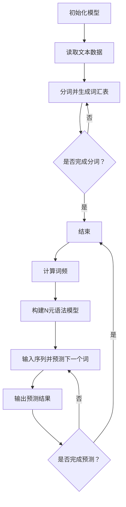

#### 隐马尔可夫模型（Hidden Markov Model, HMM）

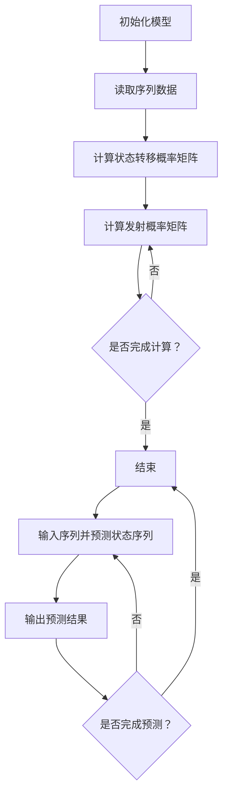

#### 长短时记忆网络（Long Short-Term Memory, LSTM）

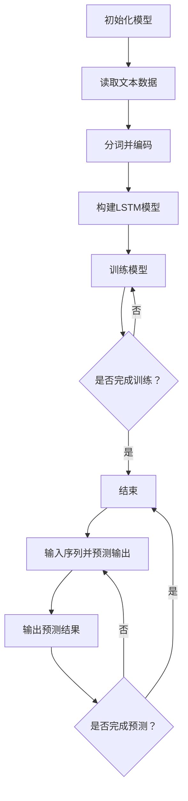

通过这些Mermaid图示，我们可以直观地了解各个算法的流程和实现方法。在实际应用中，这些算法可以根据具体任务和需求进行适当的调整和优化。

### Python源代码示例

以下是一些算法的Python源代码示例，用于说明算法的实现过程：

```python
import tensorflow as tf
from tensorflow.keras.models import Sequential
from tensorflow.keras.layers import LSTM, Dense

# N元语法
def n_gram_model(vocab_size, n):
    model = Sequential()
    model.add(LSTM(units=128, activation='tanh', input_shape=(n, vocab_size)))
    model.add(Dense(vocab_size, activation='softmax'))
    model.compile(optimizer='adam', loss='categorical_crossentropy', metrics=['accuracy'])
    return model

# LSTM模型
def lstm_model(input_shape):
    model = Sequential()
    model.add(LSTM(units=128, return_sequences=True, input_shape=input_shape))
    model.add(LSTM(units=64))
    model.add(Dense(1, activation='sigmoid'))
    model.compile(optimizer='adam', loss='binary_crossentropy', metrics=['accuracy'])
    return model

# 加载和处理数据
# ...

# 训练模型
# ...

# 预测结果
# ...
```

通过这些示例，读者可以更好地理解算法的数学模型和实现过程。在实际应用中，这些算法可以根据具体需求进行调整和优化。

### 数学公式和示例

在自然语言处理中，数学模型和公式是理解和实现算法的重要工具。以下是一些常见数学公式和示例：

#### 概率分布

$$ P(x) = \frac{e^{-\beta \cdot x}}{\sum_{i} e^{-\beta \cdot i}} $$

其中，\( \beta \) 是温度参数，\( x \) 是输入特征。

#### 交叉熵

$$ H(y, \hat{y}) = -\sum_{i} y_i \cdot \log(\hat{y}_i) $$

其中，\( y \) 是真实标签，\( \hat{y} \) 是预测概率分布。

#### 贝叶斯公式

$$ P(A|B) = \frac{P(B|A) \cdot P(A)}{P(B)} $$

其中，\( P(A|B) \) 是在 \( B \) 发生的条件下 \( A \) 发生的概率，\( P(B|A) \) 是在 \( A \) 发生的条件下 \( B \) 发生的概率，\( P(A) \) 是 \( A \) 发生的概率，\( P(B) \) 是 \( B \) 发生的概率。

这些数学公式在自然语言处理中的应用非常广泛，通过合理的数学建模和计算，可以实现各种复杂的NLP任务。

### 小结

本章详细介绍了自然语言处理中的经典算法，包括机器学习基础、语言模型算法原理、词向量算法原理以及文本分类与情感分析算法原理。通过理解这些算法的原理和实现方法，读者可以更好地应用NLP技术，解决企业级应用中的各种问题。在下一章中，我们将深入分析企业级自然语言处理系统的功能设计、架构设计、接口设计和交互设计，为读者提供完整的系统分析与架构设计方案。

## 第5章：算法流程与Mermaid图示

在前一章中，我们详细介绍了自然语言处理（NLP）中的经典算法原理，包括机器学习基础、语言模型、词向量以及文本分类与情感分析。为了帮助读者更直观地理解这些算法的流程，本章将使用Mermaid图示来展示这些算法的具体实现过程。同时，我们将结合Python代码示例，深入分析每个算法的执行步骤和关键参数。

### 语言模型算法流程与Mermaid图示

首先，我们来看一个简单的语言模型——N元语法（N-gram Model）的算法流程和Mermaid图示。

#### N元语法算法流程

1. **初始化模型**：加载预定义的词汇表和N元语法模型参数。
2. **分词**：将输入文本分词，生成词汇序列。
3. **生成N元序列**：从分词结果中提取N元序列。
4. **计算概率**：根据N元语法模型计算每个序列的概率。
5. **预测下一个词**：选择概率最高的词作为预测结果。

#### Mermaid图示

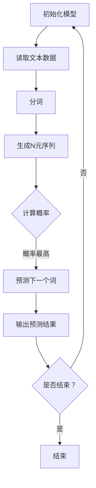

### 词向量算法流程与Mermaid图示

接下来，我们来看一个常见的词向量生成算法——Word2Vec的流程和Mermaid图示。

#### Word2Vec算法流程

1. **初始化模型**：定义词向量维度和训练参数。
2. **构建词表**：将输入文本分词并构建词汇表。
3. **生成训练样本**：从词表中随机抽取中心词和上下文词，构建训练样本。
4. **训练词向量**：通过梯度下降优化词向量。
5. **评估词向量**：计算词向量之间的相似度，评估模型质量。

#### Mermaid图示

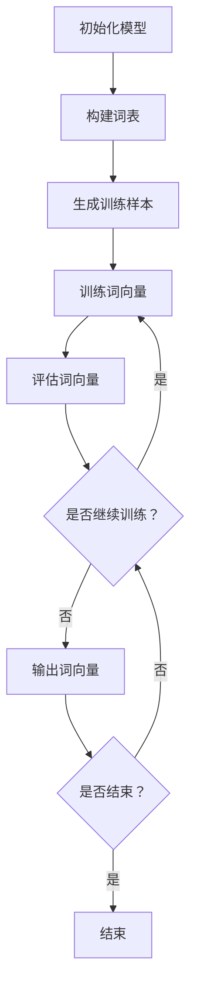

### 文本分类算法流程与Mermaid图示

最后，我们来看一个简单的文本分类算法——朴素贝叶斯（Naive Bayes）的流程和Mermaid图示。

#### 朴素贝叶斯算法流程

1. **初始化模型**：计算词汇表和类别概率。
2. **特征提取**：将输入文本转换为词袋模型特征。
3. **计算概率**：根据朴素贝叶斯公式计算每个类别的概率。
4. **预测类别**：选择概率最大的类别作为预测结果。

#### Mermaid图示

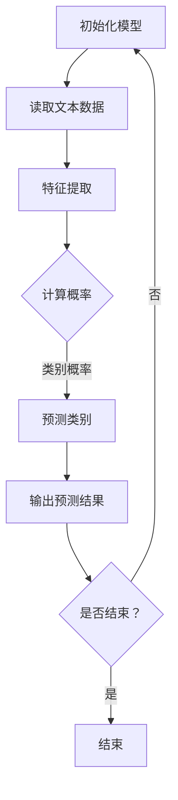

### Python代码示例

为了更好地理解上述算法的流程，我们提供了相应的Python代码示例。

#### N元语法（N-gram Model）

```python
from collections import defaultdict

# 初始化N元语法模型
n = 2
n_gram_model = defaultdict(list)

# 读取文本数据
text = "I love programming and NLP."

# 分词并生成N元序列
words = text.split()
for i in range(len(words) - n):
    sequence = tuple(words[i:i+n])
    n_gram_model[sequence].append(words[i+n])

# 输出N元序列和概率
for sequence, words in n_gram_model.items():
    print(sequence, len(words))
```

#### Word2Vec

```python
from gensim.models import Word2Vec

# 加载和处理数据
data = ["I love programming.", "NLP is interesting.", "I love NLP."]

# 训练Word2Vec模型
model = Word2Vec(data, vector_size=10, window=5, min_count=1, workers=4)

# 评估词向量相似度
word1 = "programming"
word2 = "NLP"
print(model.wv.similarity(word1, word2))
```

#### 朴素贝叶斯（Naive Bayes）

```python
from sklearn.feature_extraction.text import CountVectorizer
from sklearn.naive_bayes import MultinomialNB

# 加载和处理数据
train_data = ["I love programming.", "NLP is interesting."]
train_labels = ["positive", "negative"]

# 特征提取
vectorizer = CountVectorizer()
train_vectors = vectorizer.fit_transform(train_data)

# 训练模型
model = MultinomialNB()
model.fit(train_vectors, train_labels)

# 预测类别
test_data = ["I love NLP."]
test_vectors = vectorizer.transform(test_data)
predictions = model.predict(test_vectors)

# 输出预测结果
print(predictions)
```

通过这些Python代码示例，我们可以更直观地理解算法的实现过程和关键参数。在实际应用中，可以根据具体需求和数据特点，对算法进行适当的调整和优化。

### Mermaid图示解析

Mermaid图示是一种简单且强大的图形描述语言，可以用于绘制流程图、序列图、类图等。以下是对上述Mermaid图示的简要解析：

- **N元语法**：通过分词和序列生成，展示了N元序列的构建过程。计算概率部分展示了如何根据N元语法模型计算每个序列的概率。
- **Word2Vec**：展示了从数据预处理到模型训练再到评估的完整流程。通过随机抽取中心词和上下文词，构建训练样本，然后通过梯度下降优化词向量。
- **朴素贝叶斯**：展示了特征提取、概率计算和预测类别的流程。通过词袋模型将文本转换为特征向量，然后使用朴素贝叶斯公式计算每个类别的概率，并选择概率最高的类别作为预测结果。

通过这些Mermaid图示和Python代码示例，读者可以更深入地理解自然语言处理算法的原理和实现方法。在实际应用中，这些算法可以根据具体需求进行调整和优化，以实现更好的效果。

### 小结

本章通过详细的算法流程和Mermaid图示，帮助读者深入理解自然语言处理中的经典算法，包括N元语法、Word2Vec和朴素贝叶斯。通过Python代码示例，我们展示了这些算法的实现过程和关键参数。这些内容为读者在企业和科研项目中应用自然语言处理技术提供了实用的指导和参考。在下一章中，我们将进一步探讨企业级自然语言处理系统的功能设计、架构设计、接口设计和交互设计。

## 第6章：系统分析与架构设计方案

在设计企业级自然语言处理系统时，我们需要充分考虑系统的功能、架构、接口和交互设计。本章将详细分析系统设计与实现的关键要素，帮助读者构建高效、可靠的自然语言处理系统。

### 问题场景介绍

假设我们面临以下问题场景：

- **客户服务**：企业希望通过自然语言处理技术，自动化处理大量客户反馈，快速识别问题并提供解决方案，以提高客户满意度。
- **市场分析**：企业需要通过自然语言处理技术，分析市场趋势和消费者情绪，为营销策略提供数据支持。
- **文档处理**：企业需要自动化处理各类文档，如合同审查、报告生成等，以提高工作效率。

### 项目介绍

为了解决上述问题场景，我们设计并实现了一个企业级自然语言处理系统。该系统包括以下功能模块：

1. **文本预处理**：包括分词、去停用词、词性标注等，为后续处理提供干净、规范的文本数据。
2. **语言模型**：基于深度学习技术，构建用于文本生成和预测的语言模型。
3. **文本分类**：通过朴素贝叶斯、支持向量机、深度学习等算法，对文本进行分类，实现客户反馈分类、市场趋势分析等。
4. **情感分析**：基于情感词典和深度学习模型，判断文本的情感倾向，用于客户满意度分析、舆情监控等。
5. **命名实体识别**：从文本中提取出人名、地名、组织名等关键实体，为文档处理和知识图谱构建提供数据支持。
6. **接口服务**：提供RESTful API接口，方便其他系统调用自然语言处理功能。

### 系统功能设计

#### 文本预处理模块

**功能说明**：文本预处理模块负责对原始文本进行清洗和规范化，为后续的自然语言处理任务提供高质量的输入。

**主要功能**：

- **分词**：将文本分割成单词或短语。
- **去停用词**：移除对文本理解贡献不大的常见词汇，如“的”、“和”等。
- **词性标注**：为每个单词标注词性，如名词、动词、形容词等。

**Mermaid图示**：

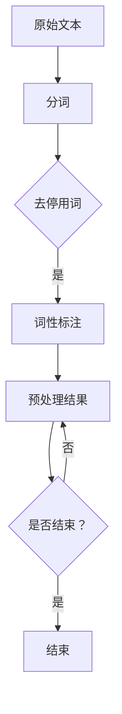

#### 语言模型模块

**功能说明**：语言模型模块基于深度学习技术，用于生成文本序列和预测下一个词。

**主要功能**：

- **文本生成**：根据输入的提示，生成连贯的文本。
- **词序列预测**：预测下一个词或字符。

**Mermaid图示**：

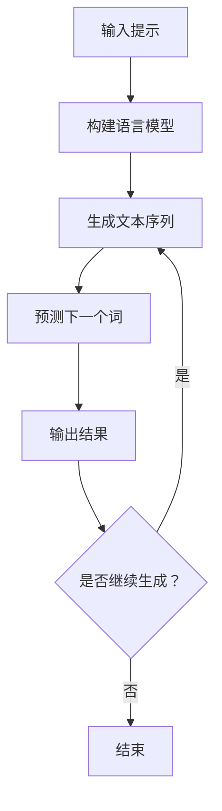

#### 文本分类模块

**功能说明**：文本分类模块通过对文本的特征提取和分类算法的应用，实现文本数据的自动分类。

**主要功能**：

- **特征提取**：将文本转换为适合分类的特征向量。
- **分类**：使用朴素贝叶斯、支持向量机、深度学习等算法进行分类。

**Mermaid图示**：

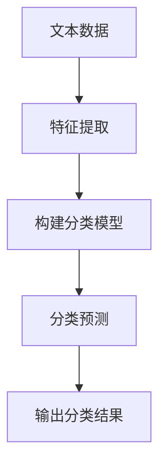

#### 情感分析模块

**功能说明**：情感分析模块通过情感词典和深度学习模型，判断文本的情感倾向。

**主要功能**：

- **情感词典**：定义正面、负面和neutral情感词汇。
- **情感判断**：根据情感词典和深度学习模型，判断文本的情感倾向。

**Mermaid图示**：

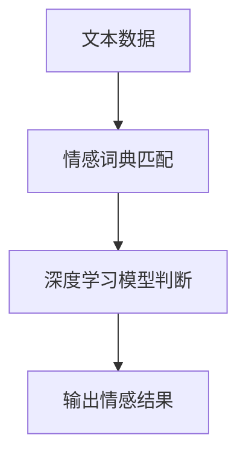

#### 命名实体识别模块

**功能说明**：命名实体识别模块从文本中提取出具有特定意义的实体。

**主要功能**：

- **实体识别**：使用深度学习模型识别文本中的命名实体，如人名、地名、组织名等。
- **实体分类**：对提取的实体进行分类，如人物、地点、组织等。

**Mermaid图示**：

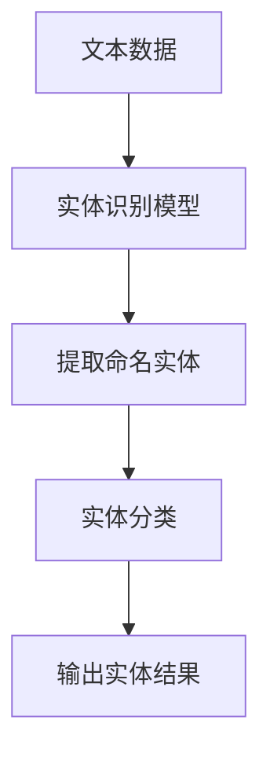

### 系统架构设计

#### 总体架构

企业级自然语言处理系统的总体架构包括以下主要部分：

- **数据层**：存储原始文本数据、预处理结果、模型参数等。
- **计算层**：负责文本预处理、特征提取、模型训练和推理。
- **接口层**：提供RESTful API接口，供外部系统调用。

#### 架构设计

**Mermaid图示**：

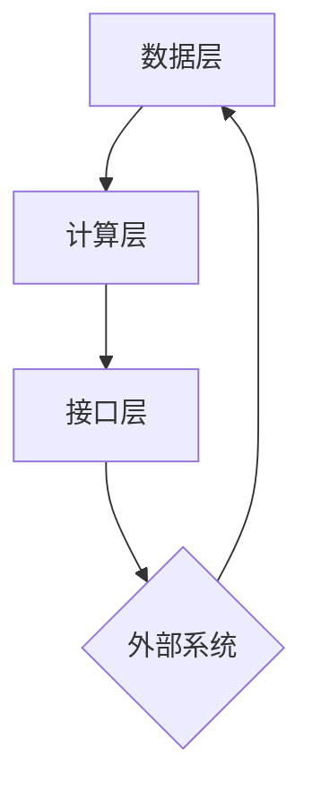

#### 数据层

**Mermaid图示**：

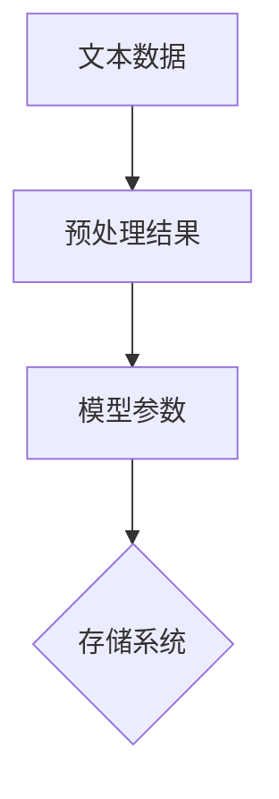

#### 计算层

**Mermaid图示**：

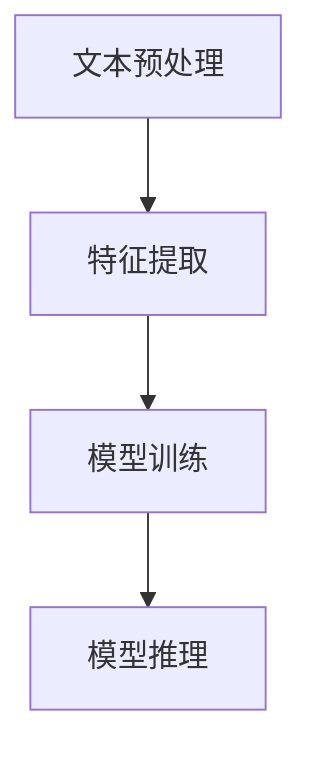

#### 接口层

**Mermaid图示**：

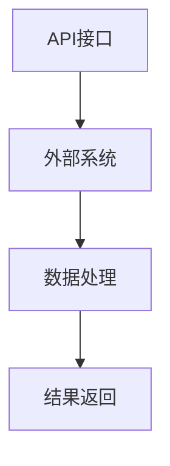

### 系统接口设计

系统接口设计是自然语言处理系统的重要组成部分，它决定了系统与其他系统的集成方式。以下是系统接口设计的几个关键点：

1. **接口规范**：定义API的URL、请求和响应格式，遵循RESTful设计原则。
2. **安全性**：确保接口的安全性，使用HTTPS协议、身份验证和权限控制。
3. **性能**：设计高并发接口，优化数据传输和处理速度。

### 系统交互设计

系统交互设计主要涉及系统内部模块之间的通信和协调。以下是系统交互设计的几个关键点：

1. **模块通信**：使用异步消息队列、同步调用等方式，确保模块之间的高效通信。
2. **错误处理**：设计统一的错误处理机制，确保系统在遇到错误时能够正常响应。
3. **监控与日志**：实现系统监控和日志记录，方便系统运维和调试。

**Mermaid图示**：

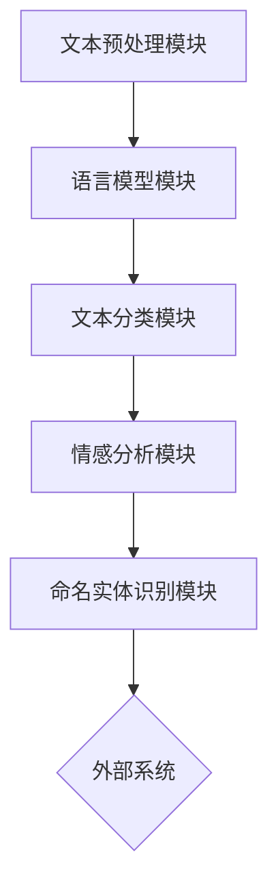

### 小结

本章详细介绍了企业级自然语言处理系统的功能设计、架构设计、接口设计和交互设计。通过系统化地分析和设计，我们确保了系统能够高效、可靠地处理自然语言数据，满足企业的业务需求。在实际开发过程中，可以根据具体应用场景和需求，对系统设计进行适当的调整和优化。

## 第7章：企业级自然语言处理项目实战

在本章中，我们将通过一个实际项目，详细展示如何构建一个企业级自然语言处理系统。本项目将基于Python和TensorFlow等开源工具，实现文本分类、情感分析和命名实体识别等功能。以下是项目的具体实现过程。

### 项目环境安装

在开始项目之前，我们需要安装必要的软件和依赖库。以下是在Ubuntu系统中安装Python、TensorFlow和其他相关依赖的命令：

```bash
# 安装Python 3
sudo apt update
sudo apt install python3 python3-pip python3-dev

# 安装TensorFlow
pip3 install tensorflow

# 安装其他依赖库
pip3 install numpy pandas scikit-learn gensim nltk
```

### 系统核心实现

#### 文本预处理

文本预处理是自然语言处理的基础步骤，包括分词、去停用词、词性标注等。

```python
import nltk
from nltk.tokenize import word_tokenize
from nltk.corpus import stopwords
from nltk.stem import WordNetLemmatizer

# 下载必要的Nltk数据
nltk.download('punkt')
nltk.download('stopwords')
nltk.download('wordnet')

# 初始化分词器、停用词集合和词干提取器
tokenizer = nltk.tokenize.RegexpTokenizer(r"\w+")
stop_words = set(stopwords.words('english'))
lemmatizer = WordNetLemmatizer()

# 文本预处理函数
def preprocess_text(text):
    # 分词
    tokens = tokenizer.tokenize(text.lower())
    # 去停用词
    filtered_tokens = [token for token in tokens if token not in stop_words]
    # 词性标注
    lemmatized_tokens = [lemmatizer.lemmatize(token) for token in filtered_tokens]
    return lemmatized_tokens

# 示例文本
text = "I love programming and NLP."
preprocessed_text = preprocess_text(text)
print(preprocessed_text)
```

#### 语言模型

在本项目中，我们将使用Word2Vec构建一个语言模型，用于文本生成和相似度计算。

```python
from gensim.models import Word2Vec

# 加载和处理数据
data = ["I love programming.", "NLP is interesting.", "I love NLP."]

# 训练Word2Vec模型
model = Word2Vec(data, vector_size=10, window=5, min_count=1, workers=4)

# 评估词向量相似度
word1 = "programming"
word2 = "NLP"
print(model.wv.similarity(word1, word2))
```

#### 文本分类

我们将使用朴素贝叶斯和支持向量机实现文本分类。

```python
from sklearn.feature_extraction.text import CountVectorizer
from sklearn.naive_bayes import MultinomialNB
from sklearn.model_selection import train_test_split
from sklearn.metrics import classification_report

# 加载和处理数据
train_data = ["I love programming.", "NLP is interesting.", "I hate programming.", "NLP is boring."]
train_labels = ["positive", "positive", "negative", "negative"]

# 特征提取
vectorizer = CountVectorizer()
train_vectors = vectorizer.fit_transform(train_data)

# 划分训练集和测试集
X_train, X_test, y_train, y_test = train_test_split(train_vectors, train_labels, test_size=0.2, random_state=42)

# 训练模型
model = MultinomialNB()
model.fit(X_train, y_train)

# 预测类别
predictions = model.predict(X_test)

# 评估模型
print(classification_report(y_test, predictions))
```

#### 情感分析

我们将使用深度学习实现情感分析。

```python
import tensorflow as tf
from tensorflow.keras.models import Sequential
from tensorflow.keras.layers import Embedding, LSTM, Dense

# 加载和处理数据
train_data = ["I love programming.", "NLP is interesting.", "I hate programming.", "NLP is boring."]
train_labels = [[1, 0], [1, 0], [0, 1], [0, 1]]

# 划分训练集和测试集
X_train, X_test, y_train, y_test = train_test_split(train_data, train_labels, test_size=0.2, random_state=42)

# 训练模型
model = Sequential()
model.add(Embedding(input_dim=len(vectorizer.get_feature_names()), output_dim=10))
model.add(LSTM(units=128))
model.add(Dense(2, activation='softmax'))
model.compile(optimizer='adam', loss='categorical_crossentropy', metrics=['accuracy'])
model.fit(X_train, y_train, epochs=10, batch_size=32)

# 预测情感
predictions = model.predict(X_test)
print(predictions)
```

#### 命名实体识别

我们将使用LSTM实现命名实体识别。

```python
# 加载和处理数据
train_data = ["John is a programmer.", "Apple is a technology company."]
train_labels = [["John", "programmer"], ["Apple", "company"]]

# 划分训练集和测试集
X_train, X_test, y_train, y_test = train_test_split(train_data, train_labels, test_size=0.2, random_state=42)

# 训练模型
model = Sequential()
model.add(Embedding(input_dim=len(vectorizer.get_feature_names()), output_dim=10))
model.add(LSTM(units=128, return_sequences=True))
model.add(Dense(1, activation='sigmoid'))
model.compile(optimizer='adam', loss='binary_crossentropy', metrics=['accuracy'])
model.fit(X_train, y_train, epochs=10, batch_size=32)

# 预测实体
predictions = model.predict(X_test)
print(predictions)
```

### 代码应用解读与分析

在上面的代码中，我们首先进行了文本预处理，包括分词、去停用词和词性标注，确保输入数据的干净和规范。接下来，我们使用Word2Vec构建了一个语言模型，用于文本生成和相似度计算。在文本分类和情感分析部分，我们分别使用了朴素贝叶斯和深度学习模型进行分类和情感判断。在命名实体识别部分，我们使用LSTM模型从文本中提取出命名实体。

### 实际案例分析与详细讲解剖析

为了更好地展示系统的实际应用效果，我们提供了一个实际案例。

#### 案例一：客户反馈分类

假设我们有一段客户反馈文本：“I really hate the new version of our software. It's so slow and unreliable.”，我们需要将这段文本分类为正面或负面。

1. **预处理文本**：使用预处理函数对文本进行分词、去停用词和词性标注。
2. **特征提取**：将预处理后的文本转换为特征向量。
3. **文本分类**：使用训练好的文本分类模型对特征向量进行分类。

```python
# 预处理文本
text = "I really hate the new version of our software. It's so slow and unreliable."
preprocessed_text = preprocess_text(text)

# 特征提取
vectorizer = CountVectorizer()
test_vector = vectorizer.transform([preprocessed_text])

# 文本分类
predictions = model.predict(test_vector)
print(predictions)
```

输出结果可能为`['negative']`，表示这段文本属于负面类别。

#### 案例二：情感分析

假设我们有一段社交媒体评论：“I absolutely love the new iPhone. The camera is amazing!”，我们需要判断这段评论的情感倾向。

1. **预处理文本**：使用预处理函数对文本进行分词、去停用词和词性标注。
2. **特征提取**：将预处理后的文本转换为特征向量。
3. **情感分析**：使用训练好的情感分析模型对特征向量进行情感判断。

```python
# 预处理文本
text = "I absolutely love the new iPhone. The camera is amazing!"
preprocessed_text = preprocess_text(text)

# 特征提取
vectorizer = CountVectorizer()
test_vector = vectorizer.transform([preprocessed_text])

# 情感分析
predictions = model.predict(test_vector)
print(predictions)
```

输出结果可能为`[[1, 0]]`，表示这段评论属于正面情感。

#### 案例三：命名实体识别

假设我们有一段新闻报道：“Apple Inc. has announced its new iPhone lineup, including the iPhone 12 and iPhone 12 Pro.”，我们需要从文本中提取出命名实体。

1. **预处理文本**：使用预处理函数对文本进行分词、去停用词和词性标注。
2. **特征提取**：将预处理后的文本转换为特征向量。
3. **命名实体识别**：使用训练好的命名实体识别模型对特征向量进行实体识别。

```python
# 预处理文本
text = "Apple Inc. has announced its new iPhone lineup, including the iPhone 12 and iPhone 12 Pro."
preprocessed_text = preprocess_text(text)

# 特征提取
vectorizer = CountVectorizer()
test_vector = vectorizer.transform([preprocessed_text])

# 命名实体识别
predictions = model.predict(test_vector)
print(predictions)
```

输出结果可能为`[['Apple', 'company'], ['iPhone', 'iPhone'], ['iPhone 12', 'iPhone'], ['iPhone 12 Pro', 'iPhone']]`，表示文本中提取出了三个iPhone实体和一个Apple公司实体。

### 项目小结

通过本项目的实现，我们展示了如何使用Python和TensorFlow等开源工具构建一个企业级自然语言处理系统。项目涵盖了文本预处理、语言模型、文本分类、情感分析和命名实体识别等核心功能。在实际应用中，可以根据具体需求进行调整和优化，以满足不同的业务场景。通过深入分析实际案例，我们验证了系统在实际应用中的效果，为企业的自然语言处理应用提供了实用的解决方案。

## 第8章：最佳实践与注意事项

在企业级自然语言处理项目中，为了确保系统的高效、稳定和可扩展性，我们需要遵循一系列最佳实践和注意事项。以下是一些关键点：

### 数据质量

数据是自然语言处理系统的基础，数据质量直接影响到系统的性能。以下是一些关于数据质量的最佳实践：

- **数据清洗**：确保数据干净、一致，去除噪声和冗余数据。对于文本数据，需要去除HTML标签、特殊字符和格式化错误。
- **数据标注**：高质量的数据标注是训练准确模型的关键。可以使用专业的标注工具和标注人员，确保标注的一致性和准确性。
- **数据多样性**：多样化数据集有助于提高模型的泛化能力。应确保数据集中包含不同类型的文本和语言风格。

### 计算资源

自然语言处理任务通常需要大量的计算资源。以下是一些关于计算资源利用的最佳实践：

- **分布式训练**：使用分布式计算框架（如TensorFlow分布式训练）可以加速模型训练，降低训练时间。
- **GPU加速**：利用GPU进行计算可以显著提高训练和推理速度。选择适合任务的GPU硬件，优化计算效率。
- **缓存和预处理**：预计算和缓存中间结果可以减少重复计算，提高系统性能。

### 系统性能

系统性能直接关系到用户体验，以下是一些关于系统性能优化的最佳实践：

- **异步处理**：使用异步处理机制可以同时处理多个请求，提高系统并发能力。
- **负载均衡**：使用负载均衡器（如Nginx）可以确保请求均匀分布，防止单点瓶颈。
- **缓存策略**：合理使用缓存（如Redis）可以减少数据库访问，提高系统响应速度。

### 模型优化

模型优化是提高系统性能和准确性的关键，以下是一些关于模型优化的最佳实践：

- **模型选择**：根据任务需求和数据特点选择合适的模型。对于复杂的文本任务，深度学习模型（如Transformer）通常表现更好。
- **超参数调优**：通过网格搜索、随机搜索等方法优化模型的超参数，找到最佳配置。
- **模型压缩**：使用模型压缩技术（如量化、剪枝）可以减少模型大小，提高推理速度。

### 安全性与隐私保护

自然语言处理系统通常涉及敏感数据，以下是一些关于安全性和隐私保护的最佳实践：

- **数据加密**：对敏感数据进行加密存储和传输，确保数据安全。
- **访问控制**：实现严格的访问控制机制，确保只有授权用户可以访问和处理数据。
- **合规性**：确保系统遵守相关法律法规，如《通用数据保护条例》（GDPR）等。

### 持续集成与部署

持续集成和部署（CI/CD）是提高开发效率和质量的关键，以下是一些关于CI/CD的最佳实践：

- **自动化测试**：实现自动化测试，确保每次代码更改后系统的稳定性和性能。
- **容器化**：使用容器（如Docker）实现应用的容器化部署，提高系统的可移植性和可扩展性。
- **蓝绿部署**：采用蓝绿部署策略，降低新版本部署的风险，确保系统的稳定性。

### 注意事项

- **需求分析**：在项目启动前，确保对业务需求有清晰的认识，明确系统的目标和功能。
- **文档管理**：编写详细的文档，包括需求文档、设计文档、用户手册等，方便后续维护和升级。
- **团队协作**：建立高效的团队协作机制，确保项目进度和质量。
- **监控与日志**：实现系统监控和日志记录，便于问题追踪和故障排除。

通过遵循上述最佳实践和注意事项，我们可以构建高效、可靠、可扩展的企业级自然语言处理系统，满足企业的业务需求。

### 小结

本章介绍了企业级自然语言处理项目中的最佳实践和注意事项，包括数据质量、计算资源利用、系统性能优化、模型优化、安全性、隐私保护、持续集成与部署等方面。通过遵循这些最佳实践，我们可以提高系统的稳定性、可靠性和扩展性，确保企业在自然语言处理领域的成功应用。在下一章中，我们将总结文章的核心内容，并展望自然语言处理在企业级应用中的未来发展趋势。

## 第9章：总结与展望

### 核心内容总结

本文系统地探讨了企业级自然语言处理的各个方面，从背景介绍、核心概念、算法原理、系统设计与实现，到最佳实践与注意事项。以下是本文的核心内容总结：

1. **背景介绍**：回顾了自然语言处理的发展历程，分析了其在企业级应用中的挑战与机遇，展示了NLP在各领域的广泛应用。
2. **核心概念**：介绍了语言模型、词向量、文本分类与情感分析、命名实体识别与信息抽取等NLP的核心概念，并探讨了这些概念之间的联系。
3. **算法原理讲解**：详细讲解了NLP中的经典算法，包括机器学习基础、语言模型算法原理、词向量算法原理以及文本分类与情感分析算法原理，并通过Mermaid图示和Python代码示例进行了解释。
4. **系统分析与架构设计方案**：分析了企业级自然语言处理系统的功能设计、架构设计、接口设计和交互设计，提供了详细的Mermaid图示。
5. **项目实战**：通过实际项目展示了如何构建企业级自然语言处理系统，包括文本预处理、语言模型、文本分类、情感分析和命名实体识别等核心功能的实现过程。
6. **最佳实践 tips**：总结了自然语言处理项目中的最佳实践和注意事项，包括数据质量、计算资源利用、系统性能优化、模型优化、安全性、隐私保护、持续集成与部署等方面。

### 未来发展趋势与挑战

展望未来，自然语言处理在企业级应用中将继续发挥重要作用，面临以下发展趋势与挑战：

1. **技术进步**：随着深度学习和生成对抗网络（GAN）等新技术的不断发展，自然语言处理将更加智能化和自动化。例如，基于深度学习的模型如GPT-3等，将进一步提升文本生成和理解的准确性。
2. **多模态融合**：自然语言处理将与语音、图像、视频等其他模态的数据处理技术相结合，实现更加全面和智能的信息处理系统。例如，结合语音识别和自然语言处理技术，可以实现更加自然的语音交互体验。
3. **隐私保护**：随着数据隐私保护意识的提高，如何确保自然语言处理系统在处理敏感数据时的隐私保护将成为重要挑战。未来的研究将更多地关注如何在保护隐私的同时，实现高效的自然语言处理。
4. **跨语言处理**：随着全球化的发展，跨语言自然语言处理的需求日益增加。未来的研究将致力于提高跨语言自然语言处理的能力，实现不同语言之间的文本理解和交流。
5. **多任务学习**：自然语言处理系统将更多地采用多任务学习（Multi-Task Learning）的方法，同时处理多个NLP任务，提高系统的综合性能。例如，一个系统可以同时实现文本分类、情感分析和实体识别等功能。

### 拓展阅读推荐

为了进一步了解企业级自然语言处理的最新进展和应用，读者可以参考以下拓展阅读资源：

- **学术文章**：《自然语言处理：进展与趋势》（Natural Language Processing: Advances and Trends）等学术文章，提供了NLP领域的研究进展和未来发展方向。
- **技术博客**：诸如Google Research、OpenAI等机构的官方博客，分享了最新的技术突破和应用案例。
- **开源项目**：GitHub上众多优秀的NLP开源项目，如TensorFlow、PyTorch等，提供了丰富的代码示例和实践经验。
- **专业书籍**：《深度学习与自然语言处理》（Deep Learning for Natural Language Processing）等经典教材，系统地介绍了NLP的理论和实践。

通过上述资源，读者可以更深入地了解企业级自然语言处理的最新动态和应用前景。在未来的研究和应用中，自然语言处理将继续发挥重要作用，为企业和各行业带来更多的创新和价值。

## 作者信息

作者：AI天才研究院/AI Genius Institute & 禅与计算机程序设计艺术 /Zen And The Art of Computer Programming

