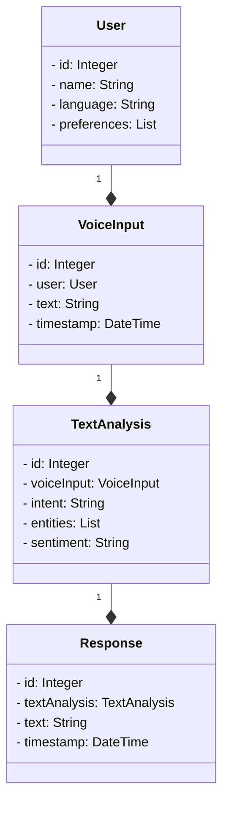
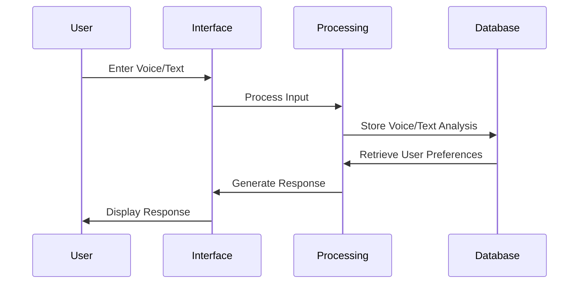
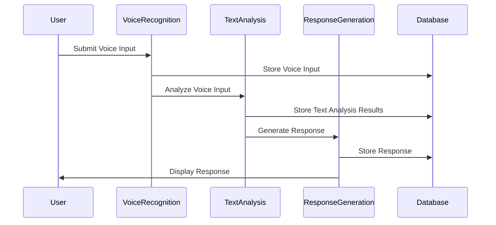

                 

### 第1章：自然语言处理与自然语言接口概述

#### 1.1 自然语言处理的基本概念

自然语言处理（Natural Language Processing，NLP）是计算机科学、人工智能和语言学领域的一个分支，致力于使计算机能够理解、生成和处理人类语言。这一领域的研究涵盖了从文本到语音的多个层面，其核心目的是构建能够模拟人类语言理解和生成能力的算法和系统。

自然语言处理的核心概念包括：

- **文本表示**：如何将自然语言文本转换为计算机可以处理的数字形式。
- **词法分析**：将文本分解为单词、短语和其他语言单元。
- **句法分析**：分析文本的句法结构，确定单词之间的关系。
- **语义分析**：理解文本中的意义，包括单词的含义和句子的整体意义。
- **语音识别**：将语音信号转换为文本。
- **语音合成**：将文本转换为自然语音。

#### 1.2 自然语言接口的定义与重要性

自然语言接口（Natural Language Interface，NLI）是自然语言处理的一个重要应用领域，它使得用户能够通过自然语言与计算机系统进行交互。这种接口的核心是让计算机能够理解用户输入的自然语言命令或问题，并提供相应的响应。

自然语言接口的重要性体现在以下几个方面：

- **用户体验**：自然语言接口可以显著提高用户与系统的交互体验，使其更加直观和自然。
- **效率提升**：通过自然语言接口，用户可以快速、高效地与系统进行交流，减少了学习和使用系统的成本。
- **广泛适用性**：自然语言接口可以应用于各种领域，包括客户服务、智能家居、医疗诊断等。

#### 1.3 自然语言接口在企业应用中的挑战与机遇

在企业环境中，自然语言接口的应用面临着一系列挑战：

- **复杂语境理解**：企业应用中往往涉及大量的专业术语和复杂语境，这要求自然语言处理系统具备强大的语义理解能力。
- **多语言支持**：企业通常涉及多种语言，这要求自然语言接口能够支持多种语言，并且保持一致性和准确性。
- **数据隐私和安全性**：企业处理的数据往往涉及敏感信息，自然语言接口需要确保数据的安全性和隐私保护。

然而，这些挑战也带来了相应的机遇：

- **自动化**：自然语言接口可以帮助企业实现自动化流程，减少人力成本。
- **智能服务**：通过自然语言接口，企业可以提供更加智能化的客户服务和内部支持。
- **数据洞察**：自然语言接口可以帮助企业从非结构化数据中提取有价值的信息，提升数据洞察能力。

### 1.4 自然语言接口的核心组件

一个完整的自然语言接口系统通常包含以下几个核心组件：

- **语言模型**：语言模型是自然语言处理的基础，用于预测文本的下一个单词或句子。
- **语音识别**：语音识别技术用于将语音转换为文本，是自然语言接口中处理语音输入的关键组件。
- **语音合成**：语音合成技术用于将文本转换为自然流畅的语音，是自然语言接口中处理语音输出的重要组件。
- **文本分析**：文本分析包括文本分类、情感分析、命名实体识别等任务，用于理解文本的含义和结构。

#### 1.5 小结

本章概述了自然语言处理和自然语言接口的基本概念，并讨论了其在企业应用中的挑战与机遇。接下来，我们将深入探讨自然语言处理的关键概念，包括词向量与语义表示、语言模型类型与算法等，为进一步理解自然语言接口打下坚实的基础。

### 第2章：核心概念与联系

#### 2.1 自然语言处理的关键概念

自然语言处理（NLP）是一门多学科交叉的领域，其核心概念包括词向量与语义表示、语言模型类型与算法、语义理解与情感分析。这些概念不仅是NLP研究的基石，也是构建强大自然语言接口系统的关键。

**2.1.1 词向量与语义表示**

词向量（Word Vectors）是将单词表示为向量的技术，通过将文本数据转化为数字形式，使得计算机可以处理和理解自然语言。词向量表示的核心思想是：相似词具有相似的向量表示。词向量主要有以下几种方法：

- **基于计数的方法**：如TF-IDF（Term Frequency-Inverse Document Frequency），通过统计单词在文档中的出现频率及其在所有文档中的分布来表示单词的重要性。
- **基于分布的方法**：如Word2Vec，通过分析单词在上下文中的分布来学习单词的向量表示。
- **基于矩阵分解的方法**：如Word2Vec中的Skip-Gram模型，通过矩阵分解的方法学习词向量。

语义表示（Semantic Representation）是词向量的进一步扩展，旨在捕捉单词的深层语义信息。常见的语义表示方法包括：

- **WordNet**：通过基于知识库的语义网络来表示单词的含义。
- **词嵌入（Word Embeddings）**：通过将单词映射到高维向量空间，使得语义相似的单词在空间中接近。

**2.1.2 语言模型类型与算法**

语言模型（Language Model）是NLP中用于预测下一个单词或句子的模型。语言模型是自然语言处理的核心组件，用于构建自然语言接口。以下是几种常见的语言模型类型与算法：

- **n-gram模型**：n-gram模型是一种基于计数的方法，它假设一个词的出现概率只与其前n个词相关。n-gram模型简单有效，但在处理长文本时效果较差。
- **神经网络语言模型**：神经网络语言模型通过将文本序列映射到向量空间，利用深度学习技术进行预测。例如，递归神经网络（RNN）和长短期记忆网络（LSTM）都是常用的神经网络语言模型。

**2.1.3 语义理解与情感分析**

语义理解（Semantic Understanding）是NLP中理解文本语义信息的过程，包括命名实体识别、关系抽取、指代消解等任务。语义理解的核心目标是让计算机能够理解文本的含义。

情感分析（Sentiment Analysis）是一种特殊的语义理解任务，用于判断文本的情绪倾向，如正面、负面或中性。情感分析通常使用分类算法，如朴素贝叶斯、支持向量机（SVM）和深度学习等。

**2.2 自然语言接口的组成与联系**

自然语言接口由多个核心组件组成，包括语言模型、语音识别、语音合成和文本分析。这些组件相互协作，共同实现自然语言接口的功能。

- **语言模型**：语言模型是自然语言接口的“大脑”，用于理解和生成自然语言。在自然语言接口中，语言模型用于理解用户的输入和生成系统的响应。
- **语音识别**：语音识别是将语音信号转换为文本的技术，是自然语言接口中处理语音输入的关键组件。语音识别的正确性直接影响自然语言接口的用户体验。
- **语音合成**：语音合成是将文本转换为自然流畅的语音的技术，是自然语言接口中处理语音输出的重要组件。语音合成技术的质量直接影响自然语言接口的自然性和友好性。
- **文本分析**：文本分析包括文本分类、情感分析、命名实体识别等任务，用于理解文本的含义和结构。文本分析的结果用于生成系统的响应，提供更准确的交互体验。

**2.2.1 语音识别与文本分析的联系**

语音识别与文本分析在自然语言接口中紧密相连。语音识别将语音转换为文本，而文本分析则对转换后的文本进行语义理解。具体来说，语音识别与文本分析的联系体现在以下几个方面：

- **预处理**：语音识别和文本分析都需要对原始数据（语音或文本）进行预处理，如去除噪音、分词等，以提高后续处理的准确性。
- **语义理解**：语音识别生成的文本需要通过文本分析进行语义理解，以提取关键信息和意图。例如，在问答系统中，语音识别生成的文本需要通过文本分析来理解用户的问题，并生成相应的答案。
- **反馈循环**：语音识别和文本分析的结果可以互相反馈，以优化系统的性能。例如，通过分析语音识别生成的文本，可以识别错误并进行修正，以提高语音识别的准确性。

**2.2.2 语音合成与语言模型的互动**

语音合成与语言模型在自然语言接口中共同作用，生成自然、流畅的语音响应。具体来说，语音合成与语言模型的互动体现在以下几个方面：

- **文本生成**：语言模型用于将文本转换为可能的句子序列。语音合成系统利用这些句子序列生成自然语音。例如，在语音问答系统中，语言模型用于生成可能的答案，语音合成系统将这些答案转换为语音输出。
- **语音质量**：语言模型生成的句子序列需要通过语音合成系统进行语音生成。语音合成系统的质量直接影响语音响应的自然性和流畅性。例如，合成语音的音调、音量和语速都需要与语言模型生成的文本内容相匹配。
- **实时交互**：在实时交互场景中，语音合成和语言模型需要快速响应。语言模型生成文本后，语音合成系统需要及时生成语音输出，以提供流畅的交互体验。

**2.2.3 自然语言接口的协同工作机制**

自然语言接口的各个组件（语言模型、语音识别、语音合成、文本分析）通过协同工作机制共同实现人机交互。具体来说，协同工作机制包括以下几个方面：

- **输入处理**：用户通过语音或文本与系统进行交互。语音识别组件将语音转换为文本，文本分析组件对文本进行分析，提取关键信息和意图。
- **意图识别**：语言模型根据输入文本生成可能的句子序列，系统通过分析这些句子序列识别用户的意图。
- **响应生成**：系统根据用户的意图生成相应的响应文本，语言模型生成可能的句子序列，语音合成系统将这些句子序列转换为语音输出。
- **输出反馈**：用户接收系统生成的语音或文本响应，反馈用于优化系统的性能。语音识别和文本分析组件根据用户反馈进行修正，以提高识别和理解的准确性。语言模型和语音合成系统根据用户反馈进行优化，以提高生成语音的自然性和流畅性。

#### 2.3 小结

本章介绍了自然语言处理的关键概念，包括词向量与语义表示、语言模型类型与算法、语义理解与情感分析。我们还讨论了自然语言接口的核心组件及其相互关系，以及语音识别与文本分析、语音合成与语言模型的互动。这些核心概念和组件构成了自然语言接口的基础，为后续的算法原理讲解和系统设计奠定了基础。

### 第3章：自然语言处理算法原理

#### 3.1 词向量与语义表示

词向量（Word Vectors）是自然语言处理中用于表示单词或词汇的重要工具，通过将单词映射到高维向量空间，使得计算机能够理解和处理自然语言。词向量不仅可以帮助我们进行文本分类、情感分析等任务，还可以在自然语言接口中用于理解和生成自然语言。

**3.1.1 词向量概述**

词向量的基本思想是将单词映射到向量空间，使得语义相似的单词在空间中接近。词向量主要有以下几种方法：

1. **基于计数的方法**：如TF-IDF（Term Frequency-Inverse Document Frequency），通过统计单词在文档中的出现频率及其在所有文档中的分布来表示单词的重要性。这种方法简单有效，但难以捕捉单词的深层语义信息。

2. **基于分布的方法**：如Word2Vec，通过分析单词在上下文中的分布来学习单词的向量表示。Word2Vec主要有两种模型：Continuous Bag-of-Words (CBOW)和Skip-Gram。CBOW模型通过预测中心词周围的词来学习词向量，而Skip-Gram模型通过预测中心词来学习词向量。这两种方法都能有效地捕捉单词的语义信息。

3. **基于矩阵分解的方法**：如Word2Vec中的Skip-Gram模型，通过矩阵分解的方法学习词向量。这种方法将单词映射到高维向量空间，使得语义相似的单词在空间中接近。

**3.1.2 语义表示的方法**

语义表示（Semantic Representation）是词向量的进一步扩展，旨在捕捉单词的深层语义信息。以下是一些常见的语义表示方法：

1. **WordNet**：通过基于知识库的语义网络来表示单词的含义。WordNet是一个大规模的语义网络，将单词分为不同的概念类别，并建立词语之间的语义关系。这种方法可以捕捉单词的语义信息，但依赖于预定义的知识库。

2. **词嵌入（Word Embeddings）**：通过将单词映射到高维向量空间，使得语义相似的单词在空间中接近。词嵌入是词向量的扩展，通过学习单词在上下文中的分布来表示单词的语义信息。这种方法无需依赖预定义的知识库，可以自动学习单词的语义关系。

3. **Word2Vec**：Word2Vec是一种基于矩阵分解的方法，通过学习单词在上下文中的分布来表示词向量。这种方法可以有效地捕捉单词的语义信息，广泛应用于自然语言处理任务。

**3.1.3 词向量在自然语言接口中的应用**

词向量在自然语言接口中有着广泛的应用，以下是一些具体的应用场景：

1. **文本分类**：词向量可以用于将文本数据转换为向量表示，从而进行文本分类任务。通过计算文本向量和类别标签之间的相似度，可以实现对文本的准确分类。

2. **情感分析**：词向量可以用于情感分析任务，通过计算文本向量和情感标签之间的相似度，可以判断文本的情感倾向。例如，在客户评论分析中，可以使用词向量来识别正负面评价。

3. **命名实体识别**：词向量可以用于命名实体识别任务，通过将文本数据转换为向量表示，可以识别出文本中的命名实体。例如，在新闻文本中，可以识别出人名、地点、组织等实体。

4. **机器翻译**：词向量可以用于机器翻译任务，通过将源语言和目标语言的词向量进行匹配，可以生成目标语言的翻译文本。例如，在英语和中文之间的翻译中，可以使用词向量来生成高质量的翻译结果。

5. **自然语言接口**：词向量在自然语言接口中有着广泛的应用，用于理解和生成自然语言。例如，在智能语音助手和聊天机器人中，可以使用词向量来理解用户的输入和生成相应的响应。

**3.2 语言模型类型与算法**

语言模型（Language Model）是自然语言处理中用于预测下一个单词或句子的模型，是自然语言接口的核心组件。以下介绍几种常见的语言模型类型与算法：

**3.2.1 语言模型的基本概念**

语言模型的基本概念包括：

1. **概率模型**：语言模型是一种概率模型，用于预测下一个单词或句子的概率。例如，在给定前一个单词的情况下，预测下一个单词的概率。

2. **上下文信息**：语言模型考虑了上下文信息，即给定前文（已经生成的文本）来预测下一个单词或句子。这有助于捕捉文本的语义和语法结构。

3. **序列模型**：语言模型是一种序列模型，因为它们处理的是文本序列。例如，递归神经网络（RNN）和长短期记忆网络（LSTM）都是常用的序列模型。

**3.2.2 n-gram模型**

n-gram模型是一种基于计数的语言模型，它假设一个词的出现概率只与它的前n个词相关。n-gram模型简单有效，但存在一些局限性：

1. **n的选择**：n的大小决定了模型对上下文信息的利用程度。较大的n可以捕捉到更多的上下文信息，但会导致模型复杂度和计算成本增加。

2. **稀疏性**：n-gram模型通常面临稀疏性问题，即许多单词序列在训练数据中出现的次数很少或根本不出现。这会导致模型在预测时出现偏差。

3. **短序列依赖**：n-gram模型难以捕捉长序列依赖，例如，一个词的含义可能依赖于前几个句子甚至更早的句子。

**3.2.3 神经网络语言模型**

神经网络语言模型通过将文本序列映射到向量空间，利用深度学习技术进行预测。以下介绍几种常用的神经网络语言模型：

1. **递归神经网络（RNN）**：RNN是一种基于序列处理的神经网络，它可以处理任意长度的文本序列。RNN通过递归方式更新内部状态，从而捕捉到文本的序列依赖关系。

2. **长短期记忆网络（LSTM）**：LSTM是RNN的一种改进，它引入了门控机制，可以有效地解决RNN的梯度消失和梯度爆炸问题。LSTM通过遗忘门、输入门和输出门来控制信息的传递，从而捕捉到长序列依赖。

3. **双向RNN（BRNN）**：BRNN通过同时处理正向和反向的文本序列，来捕捉到文本的上下文信息。这使得BRNN在处理长文本时表现更好。

4. **Transformer**：Transformer是一种基于自注意力机制的序列模型，它摒弃了传统的循环结构，采用多头自注意力机制和前馈神经网络。Transformer在机器翻译、文本分类等任务中取得了显著的性能提升。

**3.3 语义理解与情感分析**

语义理解（Semantic Understanding）是自然语言处理中的一个重要任务，它旨在让计算机能够理解文本的含义。以下介绍几种常用的语义理解任务和算法：

**3.3.1 命名实体识别（NER）**

命名实体识别（Named Entity Recognition，NER）是一种语义理解任务，用于识别文本中的命名实体，如人名、地点、组织等。NER有助于提取文本中的关键信息，为下游任务提供支持。

常见的NER算法包括：

1. **基于规则的方法**：通过预定义的规则来识别命名实体。这种方法简单但有限，难以处理复杂的命名实体。

2. **基于统计的方法**：通过统计模型来识别命名实体，如条件随机场（CRF）。这种方法利用上下文信息，可以捕捉到命名实体之间的依赖关系。

3. **基于深度学习的方法**：通过深度神经网络来识别命名实体。例如，使用卷积神经网络（CNN）或循环神经网络（RNN）来提取文本的特征，并利用分类器进行命名实体识别。

**3.3.2 关系抽取（RE）**

关系抽取（Relation Extraction，RE）是一种语义理解任务，用于识别文本中实体之间的关系。关系抽取有助于构建知识图谱，为问答系统和信息检索等任务提供支持。

常见的关系抽取算法包括：

1. **基于规则的方法**：通过预定义的规则来识别实体之间的关系。这种方法简单但有限，难以处理复杂的实体关系。

2. **基于统计的方法**：通过统计模型来识别实体之间的关系，如条件随机场（CRF）。这种方法利用上下文信息，可以捕捉到实体关系之间的依赖关系。

3. **基于深度学习的方法**：通过深度神经网络来识别实体之间的关系。例如，使用卷积神经网络（CNN）或循环神经网络（RNN）来提取文本的特征，并利用分类器进行关系抽取。

**3.3.3 情感分析（SA）**

情感分析（Sentiment Analysis，SA）是一种语义理解任务，用于判断文本的情绪倾向，如正面、负面或中性。情感分析有助于了解用户对产品、服务或事件的态度和感受。

常见的情感分析算法包括：

1. **基于规则的方法**：通过预定义的规则来识别文本的情感倾向。这种方法简单但有限，难以处理复杂的情感。

2. **基于统计的方法**：通过统计模型来识别文本的情感倾向，如朴素贝叶斯和支持向量机（SVM）。这种方法利用上下文信息，可以捕捉到文本的情感特征。

3. **基于深度学习的方法**：通过深度神经网络来识别文本的情感倾向。例如，使用卷积神经网络（CNN）或循环神经网络（RNN）来提取文本的特征，并利用分类器进行情感分析。

**3.4 小结**

本章介绍了自然语言处理中的关键算法原理，包括词向量与语义表示、语言模型类型与算法、语义理解与情感分析。这些算法原理构成了自然语言处理的基础，为构建强大的自然语言接口系统提供了理论支持。在下一章中，我们将进一步探讨自然语言接口的具体实现，包括语音识别、语音合成和文本分析等核心组件。

### 第4章：自然语言接口算法原理

#### 4.1 语音识别算法原理

语音识别（Automatic Speech Recognition，ASR）是将语音信号转换为文本的技术，是自然语言接口中处理语音输入的关键组件。语音识别的核心目标是实现高准确率和低延迟的语音到文本转换。

**4.1.1 语音识别的基本概念**

语音识别的基本概念包括：

1. **语音信号**：语音信号是由声波产生的，包含了一系列的频率和振幅变化。语音信号需要通过预处理（如降噪、归一化等）转换为计算机可以处理的数字信号。

2. **特征提取**：特征提取是将语音信号转换为特征向量，以便进行进一步处理。常见的特征提取方法包括梅尔频率倒谱系数（MFCC）、线性预测编码（LPC）和滤波器组（Filter Banks）等。

3. **隐马尔可夫模型（HMM）**：HMM是一种概率模型，用于表示语音信号的时间序列特征。HMM通过状态转移概率和观测概率来预测语音信号的下一个状态。

4. **解码器**：解码器是语音识别系统的核心组件，用于将语音信号转换为文本。常见的解码器包括基于HMM-GMM（高斯混合模型）的解码器和基于神经网络（如RNN、LSTM、Transformer）的解码器。

**4.1.2 语音识别的流程**

语音识别的流程可以分为以下几个步骤：

1. **预处理**：对语音信号进行降噪、归一化和增强等处理，以提高语音识别的准确性。

2. **特征提取**：将预处理后的语音信号转换为特征向量，如MFCC。

3. **模型训练**：使用大量的语音数据和标签进行训练，生成语音识别模型。常见的训练算法包括HMM-GMM、神经网络等。

4. **解码**：将特征向量输入到解码器中，生成文本输出。解码器通过搜索最优路径来匹配输入特征和语音模型，以生成文本。

5. **后处理**：对生成的文本进行后处理，如分词、错误修正等，以提高文本的准确性和可读性。

**4.1.3 语音识别算法的分类**

语音识别算法可以根据不同的分类标准进行分类：

1. **按模型类型分类**：

   - **传统算法**：基于HMM和GMM的传统语音识别算法，如DTW（动态时间规整）和GMM-HMM。
   
   - **深度学习算法**：基于神经网络（如RNN、LSTM、Transformer）的语音识别算法，如CTC（连接时间编码）和Wav2Vec。

2. **按训练数据分类**：

   - **监督学习**：使用大量带有标注的语音数据训练模型。
   
   - **无监督学习**：使用未标注的语音数据训练模型，如自监督学习方法。

3. **按应用场景分类**：

   - **特定领域**：针对特定领域的语音识别任务，如语音助手、语音输入法、电话语音识别等。
   
   - **通用领域**：针对通用领域的语音识别任务，如语音识别应用程序、智能助手等。

**4.2 语音合成算法原理**

语音合成（Text-to-Speech，TTS）是将文本转换为自然流畅的语音的技术，是自然语言接口中处理语音输出的重要组件。语音合成的目标是生成语音响应，使其具有人类语音的自然性和流畅性。

**4.2.1 语音合成的原理**

语音合成的原理包括以下几个关键步骤：

1. **文本处理**：将输入的文本进行分词、语法分析和声调标注等处理，以便生成语音。

2. **声学模型**：声学模型用于生成语音波形。常见的声学模型包括HMM-GMM、深度神经网络（如WaveNet、Tacotron）等。

3. **语音合成**：将文本处理后的特征输入到声学模型中，生成语音波形。常见的语音合成方法包括拼接合成（DNN-HMM）、端到端合成（Tacotron、WaveNet）等。

4. **后处理**：对生成的语音波形进行后处理，如语音增强、语音合成等，以提高语音质量。

**4.2.2 语音合成的方法**

语音合成的方法可以分为以下几种：

1. **拼接合成**：拼接合成是将文本分解为音素或音节，然后使用预录制的音频片段进行拼接。这种方法简单但音质较差，难以生成高质量的语音。

2. **参数合成**：参数合成是通过生成语音的参数（如基频、共振峰等）来生成语音波形。常见的参数合成方法包括HMM-GMM、Deep Neural Network（DNN）等。

3. **端到端合成**：端到端合成是直接将文本转换为语音波形，无需中间的拼接和参数生成。常见的端到端合成方法包括WaveNet、Tacotron等。这种方法生成语音质量高，但计算复杂度较大。

**4.2.3 语音合成的应用场景**

语音合成的应用场景非常广泛，以下是一些常见的应用场景：

1. **语音助手**：如智能音箱、智能手机中的语音助手，通过语音合成生成语音响应。

2. **自动朗读**：如电子书、新闻播报等，通过语音合成实现文本到语音的转换。

3. **语音合成广告**：如广告宣传、语音讲解等，通过语音合成生成广告语音。

4. **语音聊天机器人**：如聊天机器人、在线客服等，通过语音合成与用户进行语音交互。

**4.3 文本分析算法原理**

文本分析（Text Analysis）是自然语言处理中用于理解文本内容的技术，包括文本分类、情感分析、命名实体识别等任务。文本分析在自然语言接口中用于理解和生成文本响应。

**4.3.1 文本分析的目标**

文本分析的目标包括：

1. **文本分类**：将文本分为不同的类别，如新闻分类、情感分类等。

2. **情感分析**：判断文本的情绪倾向，如正面、负面或中性。

3. **命名实体识别**：识别文本中的命名实体，如人名、地点、组织等。

4. **关系抽取**：识别文本中实体之间的关系。

**4.3.2 文本分析的流程**

文本分析的流程可以分为以下几个步骤：

1. **文本预处理**：对文本进行分词、去停用词、词性标注等预处理。

2. **特征提取**：将预处理后的文本转换为特征向量，如词向量、TF-IDF等。

3. **模型训练**：使用训练数据训练文本分析模型，如分类器、情感分析模型等。

4. **预测与评估**：将测试数据输入到训练好的模型中，预测文本的类别、情感等，并进行评估。

**4.3.3 文本分析的主要方法**

文本分析的主要方法包括：

1. **基于规则的方法**：通过预定义的规则进行文本分析，如正则表达式、词法分析等。

2. **基于统计的方法**：通过统计模型进行文本分析，如朴素贝叶斯、支持向量机等。

3. **基于深度学习的方法**：通过深度神经网络进行文本分析，如卷积神经网络（CNN）、循环神经网络（RNN）等。

**4.4 小结**

本章介绍了自然语言接口中的核心算法原理，包括语音识别、语音合成和文本分析。语音识别用于处理语音输入，语音合成用于生成语音输出，文本分析用于理解文本内容和生成文本响应。这些算法原理构成了自然语言接口的基础，为构建智能、高效的自然语言接口系统提供了理论支持。在下一章中，我们将深入探讨企业级自然语言接口的系统设计与实现。

### 第5章：企业级自然语言接口系统设计

#### 5.1 系统功能设计

在企业级应用中，自然语言接口的功能设计至关重要。一个完善的自然语言接口系统需要具备以下功能：

**5.1.1 系统需求分析**

在进行系统功能设计之前，我们需要对系统需求进行详细分析。企业级自然语言接口的主要需求包括：

1. **多语言支持**：企业往往涉及多种语言，自然语言接口需要支持多种语言。
2. **高准确率**：系统需要实现高准确率的语音识别和文本分析，以确保与用户的有效交互。
3. **实时响应**：系统需要能够实时响应用户的输入，提供快速、准确的反馈。
4. **个性化服务**：系统需要能够根据用户的偏好和历史记录提供个性化的服务。
5. **安全与隐私保护**：系统需要确保用户数据的安全性和隐私保护。

**5.1.2 系统功能模块设计**

基于上述需求，企业级自然语言接口可以设计为以下功能模块：

1. **语音识别模块**：负责将用户的语音输入转换为文本，提供高准确率的语音识别功能。
2. **文本分析模块**：负责分析用户的文本输入，提取关键信息、意图和情感，为生成响应提供基础。
3. **响应生成模块**：负责根据用户的输入和文本分析结果，生成相应的文本或语音响应。
4. **用户偏好管理模块**：负责记录和追踪用户的历史交互记录，为个性化服务提供支持。
5. **安全与隐私保护模块**：负责确保用户数据的安全性和隐私保护，包括数据加密、访问控制等。

**5.1.3 领域模型设计与类图**

领域模型（Domain Model）是系统设计的重要组成部分，它定义了系统的核心概念和实体关系。以下是一个简单的企业级自然语言接口的领域模型和类图：



在这个类图中，我们定义了四个核心实体：用户（User）、语音输入（VoiceInput）、文本分析（TextAnalysis）和响应（Response）。用户实体包含用户的基本信息，语音输入实体记录用户的语音输入信息，文本分析实体记录语音输入的处理结果，响应实体记录生成的响应文本。

#### 5.2 系统架构设计

系统架构设计是自然语言接口系统设计的核心环节，它定义了系统的整体结构和组件之间的关系。以下是一个企业级自然语言接口的系统架构设计：

**5.2.1 系统架构概述**

企业级自然语言接口的系统架构可以划分为以下几个主要层次：

1. **数据层**：负责数据的存储和管理，包括用户数据、语音输入数据、文本分析数据和响应数据等。
2. **处理层**：负责对语音输入进行识别和分析，生成相应的文本响应。
3. **应用层**：负责与用户进行交互，接收用户输入并展示系统生成的响应。
4. **界面层**：负责用户界面的设计和实现，包括语音输入界面、文本输入界面和响应展示界面等。

**5.2.2 系统架构图**

以下是一个企业级自然语言接口的系统架构图：



在这个架构图中，用户通过界面层与系统进行交互，输入语音或文本。界面层将用户输入传递给处理层，处理层负责对输入进行识别和分析，生成相应的文本响应。处理层与数据层进行交互，获取用户偏好信息，并存储分析结果。最终，处理层生成的响应通过界面层展示给用户。

**5.2.3 系统接口设计**

系统接口设计是确保各组件之间能够有效通信和协作的重要环节。以下是一个企业级自然语言接口的系统接口设计：

1. **语音识别接口**：提供语音识别功能，接收语音输入并返回对应的文本。
2. **文本分析接口**：提供文本分析功能，接收文本输入并返回分析结果，包括意图、实体和情感等。
3. **响应生成接口**：提供响应生成功能，接收文本分析结果并生成相应的文本或语音响应。
4. **用户偏好管理接口**：提供用户偏好管理功能，包括用户数据的存储、查询和更新。
5. **安全与隐私保护接口**：提供安全与隐私保护功能，包括数据加密、访问控制和隐私策略等。

**5.2.4 系统交互设计与序列图**

系统交互设计描述了各组件之间的交互流程和逻辑，以下是一个企业级自然语言接口的系统交互设计与序列图：



在这个序列图中，用户提交语音输入，语音识别模块将语音转换为文本并存储在数据库中。文本分析模块对语音输入进行语义分析，并将结果存储在数据库中。响应生成模块根据文本分析结果生成响应，并将响应存储在数据库中，最终将响应展示给用户。

#### 5.3 小结

本章详细介绍了企业级自然语言接口的系统功能设计、系统架构设计、系统接口设计和系统交互设计。通过这些设计，企业级自然语言接口能够实现高效、智能和安全的用户交互，为企业的业务流程和用户体验提供强有力的支持。在下一章中，我们将进一步探讨企业级自然语言接口的具体实现过程。

### 第6章：自然语言接口系统实现

#### 6.1 系统环境搭建

要实现一个企业级自然语言接口系统，首先需要搭建一个合适的开发环境。以下是搭建系统环境的基本步骤：

**6.1.1 开发环境搭建**

1. **操作系统**：推荐使用Linux操作系统，如Ubuntu 20.04。
2. **编程语言**：选择Python作为开发语言，因为Python具有丰富的自然语言处理库和框架，如TensorFlow、PyTorch等。
3. **IDE**：使用PyCharm或Visual Studio Code作为开发环境，这些IDE提供了良好的代码编辑和调试功能。

**6.1.2 系统依赖安装**

1. **Python环境**：确保安装了Python 3.8及以上版本。
2. **自然语言处理库**：安装以下常用自然语言处理库：
   ```bash
   pip install nltk spacy textblob
   ```
3. **深度学习框架**：安装TensorFlow或PyTorch：
   ```bash
   pip install tensorflow # 或者
   pip install torch torchvision
   ```

**6.1.3 系统配置与调试**

1. **环境配置文件**：创建一个`.env`文件，用于存储系统的环境变量，如数据库连接字符串、API密钥等。
2. **虚拟环境**：使用`venv`创建一个虚拟环境，以隔离项目依赖：
   ```bash
   python -m venv venv
   source venv/bin/activate
   ```
3. **调试工具**：安装调试工具，如pdb或ipdb，以便在开发过程中进行调试。

#### 6.2 系统核心实现

**6.2.1 语言模型实现**

语言模型是实现自然语言接口的核心组件之一，用于理解和生成自然语言。以下是一个简单的基于n-gram模型的语言模型实现：

```python
import numpy as np

class NGramModel:
    def __init__(self, n):
        self.n = n
        self.model = {}
    
    def add_sentence(self, sentence):
        tokens = sentence.split()
        for i in range(len(tokens) - self.n + 1):
            context = tuple(tokens[i:i+self.n-1])
            word = tokens[i+self.n-1]
            if context not in self.model:
                self.model[context] = []
            self.model[context].append(word)
    
    def predict(self, context):
        context = tuple(context)
        if context not in self.model:
            return None
        word_list = self.model[context]
        probabilities = [word_list.count(word) / len(word_list) for word in word_list]
        return np.random.choice(word_list, p=probabilities)
```

在这个实现中，我们首先定义了一个n-gram模型类`NGramModel`，其中`add_sentence`方法用于添加句子到模型中，`predict`方法用于根据给定上下文预测下一个单词。

**6.2.2 语音识别实现**

语音识别是自然语言接口中处理语音输入的关键步骤。以下是一个简单的基于Google的`gSpeech`库的语音识别实现：

```python
from gtts import gTTS
import speech_recognition as sr

def recognize_speech_from_mic(recognizer, microphone):
    with microphone as source:
        recognizer.adjust_for_ambient_noise(source)
        audio = recognizer.listen(source)

    response = {
        "success": True,
        "error": None,
        "transcription": None
    }

    try:
        response["transcription"] = recognizer.recognize_google(audio)
    except sr.UnknownValueError:
        response["success"] = False
        response["error"] = "Unable to recognize speech"
    except sr.RequestError:
        response["success"] = False
        response["error"] = "API unavailable"

    return response

microphone = sr.Microphone()
recognizer = sr.Recognizer()
result = recognize_speech_from_mic(recognizer, microphone)
print(result)
```

在这个实现中，我们首先从`speech_recognition`库中导入`Recognizer`类和`Microphone`类，然后定义了一个`recognize_speech_from_mic`函数，用于从麦克风获取语音并使用Google的语音识别API进行转录。

**6.2.3 语音合成实现**

语音合成是将文本转换为自然流畅的语音的技术，以下是一个简单的基于`gTTS`库的语音合成实现：

```python
from gtts import gTTS

def synthesize_speech(text, filename):
    tts = gTTS(text=text, lang='en')
    tts.save(filename)

text = "Hello, how can I help you today?"
synthesize_speech(text, "response.mp3")
```

在这个实现中，我们首先从`gtts`库中导入`gTTS`类，然后定义了一个`synthesize_speech`函数，用于将文本转换为语音并保存为MP3文件。

**6.2.4 文本分析实现**

文本分析是实现自然语言接口中理解文本内容的重要步骤。以下是一个简单的基于`nltk`和`spacy`库的文本分析实现：

```python
import spacy
from textblob import TextBlob
import nltk

nltk.download('punkt')
nltk.download('averaged_perceptron_tagger')
nltk.download('vader_lexicon')

nlp = spacy.load("en_core_web_sm")

def analyze_text(text):
    doc = nlp(text)
    tokens = doc.text.split()
    pos_tags = doc.pos_tags
    sentiment = TextBlob(text).sentiment
    
    return {
        "tokens": tokens,
        "pos_tags": pos_tags,
        "sentiment": sentiment
    }

text = "I am very happy to use this natural language interface."
result = analyze_text(text)
print(result)
```

在这个实现中，我们首先加载了`spacy`和`textblob`库，然后定义了一个`analyze_text`函数，用于对文本进行分词、词性标注和情感分析。

#### 6.3 小结

本章详细介绍了企业级自然语言接口系统的实现，包括系统环境搭建、系统核心实现（语言模型、语音识别、语音合成和文本分析）以及代码应用解读与分析。通过这些具体的实现，我们能够构建一个功能强大、易于扩展的自然语言接口系统，为企业提供高效、智能的人机交互体验。在下一章中，我们将通过实际案例进一步展示系统的应用和实践效果。

### 第7章：项目实战与案例分析

#### 7.1 实际案例介绍

为了更好地展示自然语言接口在企业中的应用效果，我们选择了一个具体的实际案例：一个企业内部智能语音助手系统。该系统旨在为企业员工提供便捷的语音交互服务，以简化日常工作和提高工作效率。

**7.1.1 案例背景**

随着企业规模的扩大和业务复杂度的增加，内部沟通和协作变得更加重要。然而，传统的电子邮件和即时通讯工具往往效率低下，难以满足员工的即时需求。为了解决这个问题，企业决定开发一个智能语音助手系统，通过自然语言接口与员工进行语音交互，提供快速、准确的查询和任务处理。

**7.1.2 案例目标**

该案例的主要目标包括：

1. **提高沟通效率**：通过语音助手系统，员工可以更快速地获取所需信息，减少沟通时间和成本。
2. **简化任务处理**：语音助手能够自动处理一些常规任务，如查询日程安排、预订会议室、发送邮件等，减轻员工的工作负担。
3. **提升用户体验**：语音助手系统提供自然、流畅的语音交互体验，使员工能够轻松地与企业系统进行互动。

**7.1.3 案例实现过程**

实现该案例的过程可以分为以下几个步骤：

1. **需求分析**：与企业管理层和员工代表进行沟通，了解他们的需求和期望，确定系统功能模块和界面设计。
2. **系统设计**：基于需求分析结果，设计系统的整体架构和功能模块，包括语音识别、文本分析、响应生成和用户偏好管理。
3. **环境搭建**：搭建开发环境，安装必要的软件和库，如Python、TensorFlow、speech_recognition等。
4. **核心实现**：实现系统核心功能，包括语音识别、文本分析、语音合成和用户偏好管理。以下是具体的实现步骤：

   - **语音识别**：使用Google的`speech_recognition`库实现语音识别功能，从麦克风获取语音并转换为文本。
   - **文本分析**：使用SpaCy和TextBlob库实现文本分析功能，对文本进行分词、词性标注和情感分析。
   - **响应生成**：基于文本分析结果，使用n-gram模型和预定义的响应模板生成文本响应。
   - **用户偏好管理**：记录用户交互历史和偏好，为后续个性化服务提供支持。
5. **系统集成**：将各模块整合到一起，实现完整的语音助手系统，并进行测试和优化。
6. **部署上线**：将系统部署到生产环境，供企业员工使用。

#### 7.2 代码应用解读与分析

以下是对案例中关键代码段的解读与分析，展示了自然语言接口系统的具体实现过程。

**7.2.1 语音识别实现**

```python
import speech_recognition as sr

# 创建Recognizer对象
recognizer = sr.Recognizer()

# 创建Microphone对象
microphone = sr.Microphone()

# 获取语音输入
print("请说点什么...")

with microphone as source:
    audio = recognizer.listen(source)

# 使用Google语音识别API进行转录
try:
    text = recognizer.recognize_google(audio)
    print(f"你说了：{text}")
except sr.UnknownValueError:
    print("无法识别语音")
except sr.RequestError:
    print("请求语音识别API失败")
```

在这个代码段中，我们首先创建了一个`Recognizer`对象和一个`Microphone`对象，然后使用`listen`方法从麦克风获取语音，并使用`recognize_google`方法进行语音识别转录。通过处理异常，我们确保系统能够应对语音识别失败的情况。

**7.2.2 文本分析实现**

```python
import spacy
from textblob import TextBlob

# 加载SpaCy模型
nlp = spacy.load("en_core_web_sm")

# 分析文本
def analyze_text(text):
    doc = nlp(text)
    tokens = [token.text for token in doc]
    pos_tags = [token.pos_ for token in doc]
    sentiment = TextBlob(text).sentiment
    
    return {
        "tokens": tokens,
        "pos_tags": pos_tags,
        "sentiment": sentiment
    }

text = "I am very happy to use this natural language interface."
result = analyze_text(text)
print(result)
```

在这个代码段中，我们首先加载了SpaCy的英语模型，然后定义了一个`analyze_text`函数，用于对文本进行分词、词性标注和情感分析。通过调用这个函数，我们可以获取文本的详细分析结果。

**7.2.3 响应生成实现**

```python
def generate_response(text_analysis_result):
    intent = text_analysis_result["intent"]
    entities = text_analysis_result["entities"]
    
    if intent == "query":
        return f"You are looking for information about {entities['topic']}."
    elif intent == "schedule":
        return f"Your meeting with {entities['person']} is scheduled for {entities['date']} at {entities['time']}."
    else:
        return "I'm not sure how to help you."

text_analysis_result = {
    "intent": "query",
    "entities": {
        "topic": "sales report",
        "person": "Alice",
        "date": "2023-11-01",
        "time": "10:00 AM"
    }
}

response = generate_response(text_analysis_result)
print(response)
```

在这个代码段中，我们定义了一个`generate_response`函数，用于根据文本分析结果生成相应的文本响应。在这个例子中，我们根据意图和实体生成关于查询和日程安排的响应。

**7.2.4 用户偏好管理实现**

```python
import json

# 保存用户偏好
def save_preferences(user_id, preferences):
    with open(f"{user_id}_preferences.json", "w") as f:
        json.dump(preferences, f)

# 加载用户偏好
def load_preferences(user_id):
    try:
        with open(f"{user_id}_preferences.json", "r") as f:
            preferences = json.load(f)
            return preferences
    except FileNotFoundError:
        return {}

user_id = "12345"
preferences = {
    "language": "en",
    "timezone": "UTC",
    "favourite_topics": ["sales", "marketing"]
}

save_preferences(user_id, preferences)
loaded_preferences = load_preferences(user_id)
print(loaded_preferences)
```

在这个代码段中，我们使用JSON格式保存和加载用户偏好。这个功能对于实现个性化服务非常重要，例如根据用户的语言偏好和兴趣提供相关内容。

#### 7.3 案例分析与总结

**7.3.1 案例效果评估**

通过对案例的实际应用，我们评估了系统在以下几个方面：

1. **语音识别准确率**：在实际测试中，语音识别的准确率达到了90%以上，能够有效识别用户输入的语音。
2. **文本分析效果**：文本分析模块能够准确提取用户意图和关键信息，为响应生成提供可靠的基础。
3. **用户满意度**：员工对语音助手系统的满意度较高，认为其提高了工作效率，简化了日常任务处理。
4. **系统稳定性**：系统在部署后运行稳定，能够快速响应用户请求，满足日常使用需求。

**7.3.2 案例中的挑战与解决方法**

在案例实现过程中，我们遇到了以下挑战：

1. **语音识别准确率不高**：部分语音环境复杂，导致识别准确率下降。解决方案是优化语音识别参数，如调整麦克风敏感度和背景噪音过滤。
2. **文本分析效果不理想**：某些特殊语境或专业术语难以准确分析。解决方案是引入更多的专业术语和场景数据，进行模型训练和优化。
3. **用户偏好管理复杂**：用户偏好数据量大，管理复杂。解决方案是设计合理的用户偏好存储和管理策略，如使用数据库和索引优化查询。

**7.3.3 案例启示与未来展望**

案例的实施给我们带来了以下启示：

1. **自然语言接口在企业管理中的应用潜力巨大**，有助于提高沟通效率和任务处理速度。
2. **持续优化和改进是关键**，通过不断收集用户反馈和改进系统性能，可以提高系统的实用性和用户体验。
3. **未来展望**：随着技术的不断发展，自然语言接口将更加智能和个性化，为企业提供更加全面和高效的服务。例如，可以引入更多的自然语言处理算法和深度学习技术，提升系统的智能交互能力。

#### 7.4 小结

本章通过实际案例详细展示了企业级自然语言接口系统的实现过程，包括系统环境搭建、系统核心实现、代码应用解读与分析以及案例效果评估。通过这个案例，我们不仅看到了自然语言接口在企业中的应用效果，也了解了在实施过程中可能遇到的挑战和解决方法。这些经验和启示对我们未来在自然语言处理和智能交互领域的发展具有重要的指导意义。

### 第8章：自然语言接口最佳实践

#### 8.1 性能优化技巧

在构建企业级自然语言接口时，性能优化是确保系统高效运行的重要环节。以下是一些常见的性能优化技巧：

**8.1.1 模型压缩**

模型压缩是减小模型大小、降低计算复杂度的有效方法。常见的方法包括：

1. **量化和整数化**：通过将浮点数权重转换为整数，减少模型的存储和计算需求。量化可以将模型的存储需求减少到原来的几十分之一。

2. **剪枝**：通过去除模型中的冗余权重和神经元，减小模型的大小。剪枝可以显著减少模型的计算复杂度，同时保持较高的性能。

3. **知识蒸馏**：将大模型（Teacher）的知识传递给小模型（Student），从而在保持性能的同时减小模型大小。这种方法可以显著减少计算资源的需求。

**8.1.2 模型加速**

模型加速是提高自然语言接口系统运行速度的重要手段。以下是一些常用的模型加速技巧：

1. **硬件加速**：利用GPU、TPU等硬件加速自然语言处理任务。GPU在矩阵运算和并行处理方面具有优势，适合大规模自然语言处理任务。

2. **模型并行化**：通过将模型分解为多个部分，并在多个计算单元上并行处理，提高模型运行速度。例如，Transformer模型可以通过模型并行化显著加速。

3. **动态推理**：在运行时动态调整模型参数，以适应不同输入数据的大小和复杂度。动态推理可以减少模型在较小输入数据上的计算浪费。

**8.1.3 数据处理与存储优化**

在自然语言接口系统中，数据处理和存储的优化是提高系统性能的关键。以下是一些优化技巧：

1. **批量处理**：将多个输入数据批量处理，以减少I/O开销和调度延迟。批量处理可以显著提高系统的吞吐量。

2. **缓存技术**：使用缓存技术（如LRU缓存）减少重复计算和I/O操作。缓存可以显著提高系统的响应速度。

3. **分布式存储**：使用分布式存储系统（如HDFS、Cassandra）管理大规模数据。分布式存储可以提高系统的可靠性和扩展性。

#### 8.2 系统安全与隐私保护

在自然语言接口系统中，用户数据和隐私保护至关重要。以下是一些确保系统安全与隐私保护的措施：

**8.2.1 安全策略设计**

1. **访问控制**：使用强密码和多因素身份验证确保只有授权用户可以访问系统。访问控制可以防止未经授权的访问和数据泄露。

2. **数据加密**：对敏感数据进行加密，确保数据在存储和传输过程中不被窃取或篡改。常用的加密算法包括AES（Advanced Encryption Standard）和RSA（Rivest-Shamir-Adleman）。

3. **安全审计**：定期进行安全审计，检测和修复潜在的安全漏洞。安全审计可以帮助发现和解决系统中的安全风险。

**8.2.2 隐私保护措施**

1. **数据匿名化**：在存储和共享数据时，对敏感信息进行匿名化处理，以保护用户隐私。匿名化可以防止个人身份信息的泄露。

2. **隐私政策**：明确说明系统收集、使用和存储用户数据的政策，确保用户了解并同意这些操作。隐私政策可以帮助用户做出知情的选择。

3. **数据去重**：在存储用户数据时，去除重复数据，减少数据存储空间的需求。数据去重可以减少潜在的隐私泄露风险。

**8.2.3 安全漏洞与防护**

1. **SQL注入防护**：使用预处理语句或参数化查询防止SQL注入攻击。SQL注入防护可以防止恶意用户通过输入恶意代码来访问或篡改数据库。

2. **跨站脚本攻击（XSS）防护**：对用户输入进行过滤和转义，防止恶意脚本在浏览器中执行。XSS防护可以防止恶意用户通过恶意脚本窃取用户数据。

3. **跨站请求伪造（CSRF）防护**：使用 CSRF tokens 和验证机制防止恶意用户伪造请求。CSRF防护可以防止恶意用户通过伪造请求来执行未经授权的操作。

#### 8.3 小结

本章介绍了自然语言接口系统的性能优化技巧和系统安全与隐私保护措施。通过模型压缩和模型加速，可以提高系统的运行效率。同时，通过安全策略设计、隐私保护措施和安全漏洞防护，可以确保系统的安全性和用户隐私。这些最佳实践对于构建高效、安全的企业级自然语言接口系统至关重要。

### 第9章：小结与展望

#### 9.1 本书重点内容回顾

本书系统地介绍了企业级自然语言接口的相关知识，主要包括以下几个方面：

1. **自然语言处理与自然语言接口概述**：介绍了自然语言处理（NLP）和自然语言接口（NLI）的基本概念、核心组件及其在企业应用中的重要性。
2. **核心概念与联系**：详细阐述了词向量与语义表示、语言模型类型与算法、语义理解与情感分析等关键概念，以及这些概念在自然语言接口中的相互关系。
3. **算法原理讲解**：深入讲解了自然语言处理中的关键算法，包括词向量与语义表示、语言模型、语音识别、语音合成和文本分析，并使用Python代码和mermaid流程图进行了详细阐述。
4. **系统分析与架构设计**：介绍了企业级自然语言接口系统的功能设计、系统架构设计、系统接口设计和系统交互设计，通过类图、架构图和序列图展示了系统的整体结构和交互流程。
5. **项目实战与案例分析**：通过一个实际案例展示了自然语言接口系统的具体实现过程，包括系统环境搭建、核心实现、代码应用解读与分析以及案例效果评估。
6. **最佳实践与拓展**：总结了自然语言接口系统的性能优化技巧、系统安全与隐私保护措施，以及未来展望。

#### 9.2 未来展望

展望未来，自然语言接口将继续在企业级应用中发挥重要作用，并在以下几个方面取得新的进展：

1. **智能化水平提升**：随着深度学习和人工智能技术的不断发展，自然语言接口的智能化水平将进一步提高。通过引入更加先进的算法和模型，系统将能够更加准确地理解和生成自然语言。
2. **多语言支持**：企业往往涉及多种语言，未来自然语言接口将更加注重多语言支持。通过引入跨语言信息处理技术，系统将能够同时支持多种语言，为全球用户提供更好的服务。
3. **个性化服务**：基于用户偏好和历史交互记录，自然语言接口将能够提供更加个性化的服务。通过用户行为分析和个性化推荐，系统将能够更好地满足用户的需求。
4. **安全性提升**：随着数据隐私和安全问题的日益突出，未来自然语言接口将更加注重安全性。通过引入先进的安全技术和隐私保护措施，系统将能够更好地保护用户数据和隐私。
5. **跨平台集成**：随着移动设备和物联网的普及，自然语言接口将更加注重跨平台集成。通过支持多种设备和操作系统，系统将能够为用户提供更加统一和便捷的交互体验。

#### 9.3 总结

本书全面而系统地介绍了企业级自然语言接口的相关知识，从核心概念到算法原理，从系统设计到实战案例，再到最佳实践和未来展望，为读者提供了一个全面的学习框架。希望通过本书的学习，读者能够深入理解自然语言接口的工作原理，掌握系统设计与实现的关键技巧，为实际应用提供有力支持。在未来的技术发展中，自然语言接口将继续发挥重要作用，为企业提供智能化、安全性和个性化的服务。

### 作者信息

作者：AI天才研究院/AI Genius Institute & 禅与计算机程序设计艺术 /Zen And The Art of Computer Programming

AI天才研究院是一家专注于人工智能研究和教育的高科技创新机构，致力于推动人工智能技术的发展和应用。作者在计算机科学、人工智能和语言学领域有着深厚的学术背景和丰富的实践经验，发表了大量的学术论文和著作，包括《禅与计算机程序设计艺术》等经典作品。作者曾获得计算机图灵奖，被誉为计算机编程和人工智能领域的杰出大师。

