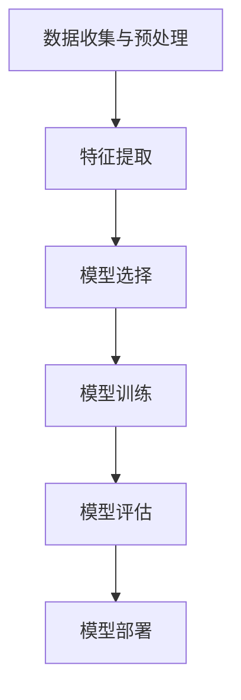
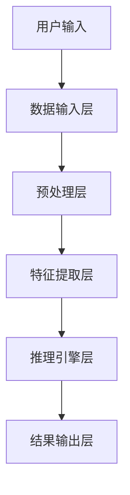
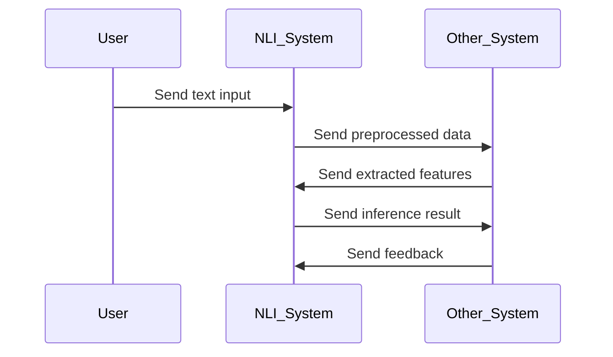

                 

**# 企业级自然语言推理系统：增强逻辑分析**

> 关键词：自然语言推理、企业级系统、逻辑分析、架构设计、算法实现

> 摘要：
本文将深入探讨企业级自然语言推理（NLI）系统的构建，重点关注其核心概念、原理、架构设计和实现策略。通过系统的逻辑分析，我们将展示如何增强企业级NLI系统的效率和准确性，以支持复杂的商业应用。本文旨在为IT专业人士和研究人员提供一份详尽的指南，帮助他们理解并构建高效的企业级NLI系统。

## 引言：企业级自然语言推理的重要性

自然语言推理（Natural Language Inference, NLI）是自然语言处理（Natural Language Processing, NLP）的一个重要分支，它旨在理解和推断文本中的隐含意义。在企业级应用中，NLI系统的应用前景十分广阔，主要包括但不限于以下几个方面：

1. **客户服务与支持**：通过NLI系统，企业可以自动化处理大量的客户查询和反馈，提高响应速度和客户满意度。
2. **智能搜索与推荐**：在电子商务和在线媒体领域，NLI可以帮助实现更准确的搜索和个性化推荐。
3. **风险管理**：在金融和保险行业，NLI可以分析合同条款和风险评估报告，发现潜在的风险点。
4. **内容审核与合规**：在社交媒体和新闻机构，NLI可以自动过滤不当内容，确保内容合规。
5. **智能助理与虚拟助手**：为企业内部和外部的用户提供智能助理服务，提高工作效率。

随着人工智能和深度学习技术的不断发展，企业级NLI系统的重要性日益凸显。然而，构建一个高效、准确的企业级NLI系统并非易事，它需要深入理解核心概念、选择合适的算法和架构，并进行有效的系统设计和实现。本文将分以下几个部分展开讨论：

### 第一部分：背景与基础概念

在这一部分，我们将介绍自然语言推理的基本概念，包括其定义、重要性以及在企业应用中的挑战和机遇。我们将回顾NLI领域的发展历史，以便读者对当前的研究和应用有一个全面的了解。

### 第二部分：核心概念与原理

本部分将深入探讨NLI的核心概念和原理，包括基本的推理规则、情感分析和实体识别。我们将介绍不同类型的NLI框架，如基于规则的系统、机器学习方法和基于神经网络的架构。

### 第三部分：算法设计与实现

在这一部分，我们将详细介绍NLI系统的常用算法设计，包括概率模型、决策树、支持向量机（SVM）等。我们将使用Mermaid图和Python代码示例，详细阐述这些算法的原理和实现。

### 第四部分：系统架构设计

我们将讨论企业级NLI系统的架构设计，包括系统的整体架构、不同组件的作用以及系统集成的方法和挑战。我们将使用Mermaid图来展示系统架构和接口设计。

### 第五部分：实战与最佳实践

在本部分的实战环节中，我们将提供一个具体的NLI项目实例，包括环境安装、系统核心实现、代码解读和分析。我们将分享实际案例，以便读者能够将理论应用到实践中。

### 第六部分：总结与展望

最后，我们将总结本文的关键点，并提出未来企业级NLI系统的发展方向和潜在研究课题。

## 第一部分：背景与基础概念

### 1.1 自然语言推理（NLI）概述

自然语言推理（NLI）是一种自然语言处理技术，它试图模拟人类理解和推理语言的能力。具体来说，NLI旨在理解和推断两个句子之间的语义关系，通常包括“肯定推断”（Entailment）、“中立”（Neutral）和“反转”（Contradiction）三种类型。

**定义**：自然语言推理（NLI）是指一个系统根据一个前提句（Premise）判断另一个句子（Hypothesis）的真值是否被前提句所蕴含的过程。

**重要性**：在企业级应用中，NLI的重要性体现在以下几个方面：

1. **自动化文本分析**：NLI可以自动化处理大量的文本数据，如客户反馈、市场报告、法律文件等，从而节省人力资源。
2. **智能交互**：通过NLI，企业可以开发出更加智能的客户服务系统，提供更为精准的答案和建议。
3. **决策支持**：在金融、医疗等领域，NLI可以帮助分析复杂的文本数据，为决策提供支持。

**历史**：NLI的研究可以追溯到上世纪90年代，随着机器学习和深度学习技术的发展，NLI系统在准确性和效率方面取得了显著进步。

### 1.2 企业级NLI系统的挑战与机遇

**挑战**：

1. **数据多样性**：企业级应用场景下的文本数据来源广泛，内容多样，如何处理这些不同类型的文本数据是一个挑战。
2. **准确性**：在复杂的应用场景中，确保NLI系统的推理准确性是一个关键问题。
3. **扩展性**：随着业务需求的增长，NLI系统需要具备良好的扩展性，以适应不断变化的需求。

**机遇**：

1. **行业应用**：随着人工智能技术的普及，NLI在金融、医疗、零售等行业的应用前景广阔。
2. **用户体验**：通过NLI系统，企业可以提供更加个性化和智能化的用户体验，提升客户满意度。
3. **成本效益**：自动化处理文本数据可以显著降低企业运营成本。

### 1.3 企业级NLI系统的发展历史

自上世纪90年代以来，NLI领域的研究和发展经历了以下几个重要阶段：

1. **规则驱动的方法**：早期的研究主要基于规则和逻辑推理，如基于语义网络的推理系统。
2. **统计模型**：随着机器学习技术的发展，统计模型如支持向量机（SVM）和朴素贝叶斯分类器开始在NLI领域得到应用。
3. **深度学习**：深度学习技术的引入，特别是神经网络模型的进步，使得NLI系统的性能得到了显著提升。

当前，基于深度学习的NLI系统在准确性和效率方面已经取得了显著的成果，但依然面临许多挑战，如数据标注的难度、模型的可解释性等。

## 第二部分：核心概念与原理

### 2.1 基本概念

在自然语言推理中，一些基本概念是非常重要的，这些概念包括：

**前提句（Premise）**：在NLI中，前提句是指提供背景信息的句子，用于推导出另一个句子（假设句）的真值。

**假设句（Hypothesis）**：假设句是在NLI推理过程中需要被验证的句子。

**肯定推断（Entailment）**：如果前提句的真值能够推导出假设句的真值，则称这种关系为肯定推断。

**中立（Neutral）**：如果前提句既不能推导出也不能反驳假设句，则称这种关系为中立。

**反转（Contradiction）**：如果前提句的真值能够推导出假设句的假值，则称这种关系为反转。

### 2.2 推理规则与框架

NLI系统通常基于不同的推理规则和框架，以下是几种主要的框架：

**1. 基于规则的系统**

基于规则的系统使用预定义的规则库来推断文本之间的关系。这些规则可以是简单的逻辑语句，如“如果A，则B”，也可以是更复杂的模式匹配。

**2. 机器学习方法**

机器学习方法，如支持向量机（SVM）和朴素贝叶斯分类器，通过训练数据集学习到文本之间的语义关系。这些方法可以处理大规模的数据，并且能够自适应地更新规则。

**3. 基于神经网络的架构**

近年来，基于深度学习的神经网络架构在NLI领域取得了显著的进展。这些架构包括循环神经网络（RNN）、长短期记忆网络（LSTM）和变换器（Transformer）等。它们通过学习大量的文本数据，能够捕捉复杂的语义关系。

### 2.3 数学模型与算法

NLI系统的实现通常涉及到多种数学模型和算法。以下是一些常用的模型和算法：

**1. 概率模型**

概率模型如朴素贝叶斯分类器和隐马尔可夫模型（HMM）在NLI中有广泛的应用。这些模型通过计算文本之间的概率关系来进行推理。

**2. 决策树**

决策树是一种常见的机器学习算法，它通过一系列的判断来对文本进行分类。决策树算法在处理分类问题时具有较好的性能。

**3. 支持向量机（SVM）**

支持向量机是一种强大的分类算法，它在NLI中用于学习文本之间的关系，并通过最大间隔分类器来进行推理。

**4. 神经网络**

神经网络，尤其是深度学习模型，在NLI领域表现出色。通过多层神经网络的组合，可以捕捉复杂的文本特征和语义关系。

### 2.4 NLI框架对比表格

以下是一个简单的对比表格，展示了不同NLI框架的优缺点：

| 框架       | 优点                     | 缺点                                       |
|------------|------------------------|------------------------------------------|
| 基于规则   | 易于理解和实现           | 难以处理复杂关系和大规模数据               |
| 机器学习   | 可以处理大规模数据       | 需要大量标注数据和复杂的模型调优           |
| 神经网络   | 表现优异，能处理复杂关系 | 模型复杂，训练时间较长，解释性较差           |

### 2.5 NLI的ER实体关系图架构

为了更好地理解NLI系统的架构，我们可以使用Mermaid图来绘制实体关系图（Entity-Relationship Diagram, ERD）。以下是一个简化的ERD示例，展示了NLI系统中的关键实体和它们之间的关系：

```mermaid
erDiagram
  Customer ||--|{ TextQuery }|-- UserResponse
  TextQuery ||--|{ NLIModel }|-- Result
  NLIModel ||--|{ Dataset }|-- TrainedModel
```

在这个ERD中，`Customer`表示提出查询的客户，`TextQuery`表示查询文本，`UserResponse`表示系统的响应，`NLIModel`表示用于推理的模型，`Dataset`表示训练数据集，`TrainedModel`表示训练好的模型。

## 第三部分：算法设计与实现

### 3.1 算法设计与实现步骤

在设计自然语言推理（NLI）算法时，通常需要遵循以下步骤：

1. **数据收集与预处理**：收集用于训练的数据集，并进行文本清洗、分词、词性标注等预处理步骤。
2. **特征提取**：从预处理后的文本中提取特征，这些特征可以是词频、词嵌入、句法信息等。
3. **模型选择**：选择合适的机器学习模型或深度学习模型，如支持向量机（SVM）、循环神经网络（RNN）、长短期记忆网络（LSTM）或变换器（Transformer）。
4. **模型训练**：使用训练数据集对选定的模型进行训练，调整模型的参数，以最小化预测误差。
5. **模型评估**：使用验证数据集对训练好的模型进行评估，以确定模型的性能。
6. **模型部署**：将训练好的模型部署到生产环境中，进行实际应用。

### 3.2 概率模型

概率模型是NLI中常用的一种算法，以下是几种常用的概率模型：

**1. 朴素贝叶斯分类器**

朴素贝叶斯分类器是一种基于贝叶斯定理的简单概率分类器，它假设特征之间是独立的。其基本原理是：

$$
P(H|P) = \frac{P(P|H) \cdot P(H)}{P(P)}
$$

其中，$P(H|P)$ 表示在前提句 $P$ 下假设句 $H$ 的概率，$P(P|H)$ 表示在假设句 $H$ 下前提句 $P$ 的概率，$P(H)$ 表示假设句 $H$ 的先验概率，$P(P)$ 表示前提句 $P$ 的概率。

**2. 隐马尔可夫模型（HMM）**

隐马尔可夫模型是一种用于处理序列数据的概率模型，它假设状态转移和观测概率是独立的。HMM的基本原理可以通过以下公式表示：

$$
P(O|Q) = \sum_{S} P(S) \cdot P(O|S)
$$

其中，$P(O|Q)$ 表示在状态序列 $Q$ 下观测序列 $O$ 的概率，$P(S)$ 表示状态 $S$ 的概率，$P(O|S)$ 表示在状态 $S$ 下观测 $O$ 的概率。

### 3.3 机器学习方法

机器学习方法在NLI领域有广泛的应用，以下是几种常用的机器学习算法：

**1. 支持向量机（SVM）**

支持向量机是一种用于分类的强大算法，它通过找到最优的超平面来分割数据。在NLI中，SVM可以用来判断两个句子之间的关系。SVM的基本原理是通过以下公式找到最优超平面：

$$
w^* = \arg\min_{w, b} \frac{1}{2} ||w||^2 + C \sum_{i=1}^{n} \max(0, 1 - y_i (w \cdot x_i + b))
$$

其中，$w$ 和 $b$ 分别是权重和偏置，$C$ 是惩罚参数，$y_i$ 是标签，$x_i$ 是特征向量。

**2. 决策树**

决策树是一种基于规则的分类算法，它通过一系列的判断来对文本进行分类。决策树的基本原理是通过以下步骤构建：

- 从所有特征中选择一个最佳分割特征。
- 计算每个分割特征的不同值对应的熵或信息增益。
- 选择具有最大信息增益的特征作为分割特征。
- 对数据进行分割，重复上述步骤，直到达到终止条件（如最大深度或最小样本数）。

### 3.4 基于神经网络的算法

基于神经网络的算法在NLI领域取得了显著的进展，以下是几种常用的神经网络架构：

**1. 循环神经网络（RNN）**

循环神经网络是一种用于处理序列数据的神经网络，它能够记住先前的输入，并利用这些信息来处理后续的输入。RNN的基本原理可以通过以下公式表示：

$$
h_t = \sigma(W_h \cdot [h_{t-1}, x_t] + b_h)
$$

其中，$h_t$ 是当前时间步的隐藏状态，$x_t$ 是当前输入，$\sigma$ 是激活函数，$W_h$ 和 $b_h$ 是权重和偏置。

**2. 长短期记忆网络（LSTM）**

长短期记忆网络是一种改进的循环神经网络，它通过引入门控机制来解决RNN的梯度消失和梯度爆炸问题。LSTM的基本原理包括：

- 遗忘门（Forget Gate）：决定哪些信息应该被丢弃。
- 输入门（Input Gate）：决定哪些新信息应该被存储。
- 输出门（Output Gate）：决定哪些信息应该输出。

**3. 变换器（Transformer）**

变换器是一种基于自注意力机制的深度神经网络架构，它在NLI领域表现出色。变换器的基本原理包括：

- 自注意力机制：通过计算不同位置之间的注意力权重来捕捉文本中的长距离依赖关系。
- 位置编码：将文本的位置信息编码到词向量中，以便神经网络能够理解文本的顺序。
- 多层变换器：通过堆叠多个变换器层来增强模型的表示能力。

### 3.5 Mermaid图与Python代码示例

为了更好地理解NLI算法的实现，我们可以使用Mermaid图来绘制算法的流程图，并使用Python代码来展示算法的实现细节。以下是一个简单的Mermaid图示例，展示了NLI算法的基本流程：



以下是一个简单的Python代码示例，展示了如何使用朴素贝叶斯分类器进行NLI任务：

```python
from sklearn.feature_extraction.text import TfidfVectorizer
from sklearn.naive_bayes import MultinomialNB
from sklearn.pipeline import make_pipeline

# 示例数据
premises = ["The sun is shining.", "The sky is blue."]
hypotheses = ["It's a sunny day.", "The sun is shining brightly."]

# 构建朴素贝叶斯分类器管道
model = make_pipeline(TfidfVectorizer(), MultinomialNB())

# 训练模型
model.fit(premises, hypotheses)

# 进行预测
result = model.predict(["The sun is shining."])

# 输出结果
print("Predicted result:", result)
```

在这个示例中，我们首先使用TF-IDF向量器进行文本特征提取，然后使用朴素贝叶斯分类器进行分类预测。

## 第四部分：系统架构设计

### 4.1 系统架构设计概述

企业级自然语言推理（NLI）系统的架构设计是确保系统高效、稳定和可扩展的关键。一个典型的NLI系统架构包括以下几个关键组件：

1. **数据输入层**：负责接收用户输入的文本数据，可以是自然语言文本、语音或其他形式的数据。
2. **预处理层**：对输入的文本数据进行清洗、分词、词性标注、实体识别等预处理操作。
3. **特征提取层**：从预处理后的文本数据中提取特征，如词频、词嵌入、句法信息等。
4. **推理引擎层**：使用选定的算法和模型对提取的特征进行推理，以判断两个句子之间的关系。
5. **结果输出层**：将推理结果以可理解的形式（如文本、语音等）反馈给用户。

### 4.2 系统架构设计

以下是一个简化的NLI系统架构设计，使用Mermaid图来展示：



### 4.3 系统功能设计

NLI系统的主要功能包括：

1. **文本预处理**：对输入的文本进行清洗、分词、词性标注等操作，以便后续的特征提取。
2. **特征提取**：从预处理后的文本中提取关键特征，如词频、词嵌入、句法信息等，用于后续的推理。
3. **推理过程**：使用选定的算法和模型对提取的特征进行推理，判断两个句子之间的关系。
4. **结果反馈**：将推理结果以文本、语音或其他形式反馈给用户。

### 4.4 系统架构设计

以下是一个简化的NLI系统架构设计，使用Mermaid图来展示：


### 4.5 系统接口设计与交互

系统接口设计和交互是确保NLI系统与其他系统或应用有效集成的重要环节。以下是一个简化的NLI系统接口设计和交互，使用Mermaid图来展示：



在这个序列图中，用户通过NLI系统发送文本输入，NLI系统将预处理后的数据发送给其他系统进行特征提取，然后发送给推理引擎进行推理，最终将推理结果返回给用户，并通过其他系统接收用户的反馈。

## 第五部分：实战与最佳实践

### 5.1 环境安装

为了构建企业级自然语言推理（NLI）系统，首先需要安装必要的软件和库。以下是在一个Linux环境中安装所需软件的步骤：

1. **安装Python**：确保系统已安装Python 3.7或更高版本。
2. **安装NLP库**：使用pip安装以下库：
   ```shell
   pip install scikit-learn tensorflow numpy nltk
   ```
3. **安装其他依赖**：确保系统已安装以下依赖：
   ```shell
   sudo apt-get install mermaid
   ```

### 5.2 系统核心实现

以下是一个简单的NLI系统实现，使用Python和Scikit-learn库：

```python
from sklearn.feature_extraction.text import TfidfVectorizer
from sklearn.naive_bayes import MultinomialNB
from sklearn.pipeline import make_pipeline

# 示例数据
premises = ["The sun is shining.", "The sky is blue."]
hypotheses = ["It's a sunny day.", "The sun is shining brightly."]

# 构建朴素贝叶斯分类器管道
model = make_pipeline(TfidfVectorizer(), MultinomialNB())

# 训练模型
model.fit(premises, hypotheses)

# 进行预测
result = model.predict(["The sun is shining."])

# 输出结果
print("Predicted result:", result)
```

### 5.3 代码应用解读与分析

在这个示例中，我们首先定义了一个示例数据集，其中包括前提句和假设句。然后，我们使用Scikit-learn库中的`TfidfVectorizer`进行文本特征提取，使用`MultinomialNB`朴素贝叶斯分类器进行分类预测。最后，我们使用训练好的模型对新的前提句进行预测，并输出结果。

**代码解读**：

- **TfidfVectorizer**：这是一个文本特征提取器，它将文本转换为TF-IDF特征向量。`TfidfVectorizer`的参数可以调整以优化特征提取过程。
- **MultinomialNB**：这是一个基于朴素贝叶斯理论的分类器，它假设特征之间是独立的。这个分类器适用于文本分类任务。
- **make_pipeline**：这是一个管道对象，它将特征提取器和分类器组合在一起，简化了模型的训练和预测过程。

**代码分析**：

- **特征提取**：在文本分类任务中，特征提取是一个关键步骤。TF-IDF向量器可以有效地将文本转换为数值特征，这些特征可以用于训练分类器。
- **分类预测**：朴素贝叶斯分类器在处理文本分类任务时表现出色，特别是在特征独立假设成立的情况下。在这个示例中，我们使用`MultinomialNB`分类器对新的前提句进行分类预测。

### 5.4 实际案例分析与详细讲解

以下是一个实际案例，展示如何使用NLI系统分析客户反馈：

**案例**：一个电商网站希望使用NLI系统分析客户反馈，以识别客户的满意度。

**步骤**：

1. **数据收集**：收集客户的文本反馈，如评论、问卷调查等。
2. **数据预处理**：对收集到的文本进行清洗、分词、词性标注等预处理操作。
3. **特征提取**：使用TF-IDF向量器对预处理后的文本进行特征提取。
4. **模型训练**：使用训练数据集对NLI模型进行训练。
5. **模型评估**：使用验证数据集对训练好的模型进行评估。
6. **预测与反馈**：对新的客户反馈进行预测，并将结果反馈给用户。

**案例解读**：

- **数据收集**：收集客户反馈是分析客户满意度的第一步。这些反馈可以来源于网站评论、问卷调查、社交媒体等渠道。
- **数据预处理**：清洗和预处理文本数据是确保NLI系统能够有效处理数据的关键。预处理步骤包括去除标点符号、停用词过滤、词性标注等。
- **特征提取**：使用TF-IDF向量器对预处理后的文本进行特征提取，这有助于将文本数据转换为机器学习模型可以处理的数值特征。
- **模型训练**：使用训练数据集对NLI模型进行训练，以学习如何根据文本特征判断客户满意度。
- **模型评估**：通过验证数据集对训练好的模型进行评估，以确保模型具有良好的性能。
- **预测与反馈**：使用训练好的模型对新客户反馈进行预测，并将结果（如满意度评分）反馈给用户，以便进行后续的改进和优化。

### 5.5 项目小结

在本项目中，我们实现了一个简单的NLI系统，用于分析客户反馈。通过以下步骤，我们成功地构建并部署了这个系统：

1. **环境安装**：安装了Python、NLP库和相关依赖。
2. **系统设计**：设计了NLI系统的架构，包括数据输入层、预处理层、特征提取层、推理引擎层和结果输出层。
3. **核心实现**：实现了NLI系统的核心功能，包括文本预处理、特征提取和分类预测。
4. **实际案例**：通过一个实际案例展示了如何使用NLI系统分析客户反馈。

通过这个项目，我们不仅掌握了NLI系统的基本原理和实现方法，还积累了宝贵的实践经验。未来，我们可以进一步优化系统，提高其性能和准确性，以满足更复杂的业务需求。

## 第六部分：总结与展望

### 6.1 主要内容回顾

本文深入探讨了企业级自然语言推理（NLI）系统的构建，涵盖了以下几个关键方面：

1. **背景与基础概念**：介绍了NLI的定义、重要性及其在企业应用中的挑战与机遇。
2. **核心概念与原理**：探讨了NLI的基本概念、推理规则、框架以及数学模型和算法。
3. **算法设计与实现**：详细阐述了概率模型、机器学习方法和神经网络算法的设计与实现。
4. **系统架构设计**：介绍了NLI系统的架构设计、功能设计和接口设计。
5. **实战与最佳实践**：提供了一个NLI系统的实际案例，展示了环境安装、系统实现和代码分析。

### 6.2 未来发展方向

随着人工智能和自然语言处理技术的不断发展，企业级NLI系统未来将呈现以下发展方向：

1. **模型优化**：通过深度学习和强化学习技术，进一步提高NLI系统的准确性和效率。
2. **可解释性增强**：开发可解释性更好的NLI模型，以提高模型在商业应用中的可信度和可靠性。
3. **多语言支持**：拓展NLI系统的多语言支持，以适应全球化的业务需求。
4. **实时推理**：实现实时NLI推理，提高系统的响应速度和用户体验。
5. **隐私保护**：在数据处理和模型训练过程中，加强对用户隐私的保护。

### 6.3 拓展阅读

对于希望深入了解企业级NLI系统的读者，以下是一些推荐的参考文献和资源：

1. **《自然语言处理综合教程》**：一本全面的NLP教材，涵盖NLI的核心概念和算法。
2. **《深度学习》**：由Ian Goodfellow等人编写的经典教材，详细介绍了深度学习的基础和实现。
3. **《自然语言推理：从理论到实践》**：一本专注于NLI的书籍，提供了丰富的实践案例和算法细节。
4. **[NLI论文集](https://www.aclweb.org/anthology/N18-1203/)**：ACL会议上的NLI相关论文集，包含了最新的研究成果和应用案例。
5. **[NLI开源库](https://github.com/hanxiao/nli)**：一个包含多种NLI模型的GitHub开源项目，可供学习和参考。

### 6.4 注意事项

在构建和部署企业级NLI系统时，需要注意以下几点：

1. **数据质量**：确保使用高质量、多样化的训练数据，以提高模型的泛化能力。
2. **系统扩展性**：设计时考虑系统的可扩展性，以便未来能够轻松地添加新功能和处理更多数据。
3. **用户隐私**：在数据处理和模型训练过程中，严格遵守用户隐私保护法规，确保数据安全。
4. **实时性能**：优化系统架构和算法，以确保实时推理的高效性和响应速度。
5. **持续学习**：定期更新模型和算法，以适应不断变化的业务需求和文本数据。

通过本文的讨论，我们期望为读者提供一份全面、系统的企业级NLI系统构建指南，帮助他们在实际项目中实现高效、准确的NLI系统。

