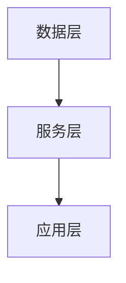
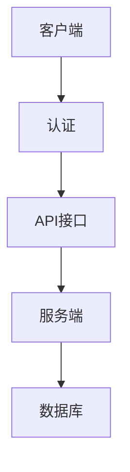

                 


## 《企业级自然语言理解平台：深化人机交互》

### 关键词：自然语言理解、企业级平台、人机交互、深度学习、算法设计

> 摘要：本文旨在深入探讨企业级自然语言理解平台的设计与实现，重点分析其在深化人机交互中的作用。通过详细阐述核心概念、算法原理、系统架构以及项目实战，为读者提供全面的技术参考和解决方案。

---

## 引言

随着信息时代的到来，企业对于数据驱动的业务决策需求日益增加。自然语言理解（Natural Language Understanding, NLU）作为一种处理和解释人类语言的技术，已经成为企业数字化转型的重要工具。企业级自然语言理解平台则是在这个背景下应运而生的，它不仅能够处理大量的文本数据，还能为各类应用提供智能化的交互能力，从而实现人机交互的深化。

本文将从以下几个方面展开：

1. **核心概念与背景介绍**：解释自然语言理解、企业级平台以及人机交互的基本概念，并介绍相关的技术背景。
2. **自然语言理解技术基础**：详细介绍语言模型、语法分析和语义分析等技术。
3. **企业级自然语言理解平台设计**：探讨平台架构设计、数据处理与存储方案。
4. **人机交互深化与应用**：分析人机交互模式及其优化策略。
5. **算法原理与数学模型**：深入讲解语言模型和语义分析算法的原理和数学模型。
6. **系统架构与接口设计**：介绍系统架构设计、接口设计与实现。
7. **项目实战与案例分析**：通过实际项目展示平台的设计与实现过程。
8. **最佳实践与未来展望**：总结最佳实践经验，并对未来发展方向进行展望。

接下来，我们将一步步深入探讨这些主题。

---

## 核心概念与背景介绍

### 自然语言理解（NLU）

自然语言理解是人工智能领域的一个重要分支，它旨在使计算机能够理解、解释和生成人类语言。NLU不仅仅是对文本进行表面上的解析，还包括语义理解、情感分析、实体识别等高级功能。在商业应用中，NLU可以帮助企业自动化处理大量的文本数据，提取有价值的信息。

### 企业级平台

企业级平台是指专门为大型企业设计的软件系统，具有高可靠性、可扩展性和安全性。这些平台通常需要处理大量用户数据，支持复杂的业务流程，并提供高效的服务。企业级自然语言理解平台则是在这个基础上，结合NLU技术，为企业提供智能化的语言处理能力。

### 人机交互

人机交互（Human-Computer Interaction, HCI）是指人与计算机系统之间的交互过程。随着人工智能技术的发展，人机交互的形式越来越多样化，包括文本交互、语音交互和图形界面交互等。人机交互的深化意味着系统能够更好地理解用户的需求，提供更加自然和高效的交互体验。

在接下来的章节中，我们将进一步详细探讨这些概念，并分析它们在企业和日常生活中的应用。

---

## 自然语言理解技术基础

### 语言模型

语言模型是NLU的核心组成部分，用于预测文本序列的概率分布。一个基本的语言模型通常基于统计方法，如N元语法（N-gram），它通过分析文本中的词汇序列来预测下一个词汇。然而，随着深度学习的兴起，基于神经网络的模型（如循环神经网络RNN、长短时记忆网络LSTM和变换器模型Transformer）在语言模型领域取得了显著的进展。

### 语法分析

语法分析（Parsing）是指将文本分解成语法结构的过程。语法分析器根据语言的语法规则，将文本映射到抽象语法树（Abstract Syntax Tree, AST）。常见的语法分析器包括自顶向下分析和自底向上分析。语法分析对于理解文本的结构和含义至关重要。

### 语义分析

语义分析（Semantic Analysis）是NLU中的另一个关键环节，它旨在理解文本的语义内容。语义分析包括词义消歧、实体识别、情感分析和语义角色标注等。这些任务通常需要结合机器学习和深度学习技术来实现。语义分析的结果能够帮助系统更好地理解用户的需求和意图。

在下一部分，我们将深入探讨这些技术在企业级自然语言理解平台中的应用。

---

## 企业级自然语言理解平台设计

### 平台架构设计

企业级自然语言理解平台的架构设计需要考虑高可用性、可扩展性和灵活性。一个典型的架构设计包括以下几个关键模块：

1. **数据采集模块**：负责从各种数据源收集文本数据，包括网页、数据库和社交媒体等。
2. **数据处理模块**：负责清洗和预处理文本数据，包括分词、词干提取、停用词过滤等。
3. **语言模型训练模块**：使用训练数据训练语言模型，包括N元语法和深度学习模型。
4. **语义分析模块**：对处理后的文本进行语义分析，包括实体识别、情感分析和语义角色标注等。
5. **API服务模块**：提供API接口，供企业内部和外部的应用调用。

### 数据处理与存储

数据处理与存储是企业级平台的重要组成部分。平台需要能够处理大量数据，并确保数据的质量和安全性。

1. **数据处理流程**：包括数据采集、数据清洗、数据存储和数据查询等步骤。
2. **数据存储方案**：通常采用分布式存储系统，如Hadoop、Spark等，以确保数据的高可用性和可扩展性。
3. **数据质量管理**：通过数据清洗和校验，确保数据的质量和一致性。

在下一部分，我们将分析人机交互模式及其优化策略。

---

## 人机交互深化与应用

### 人机交互模式

人机交互模式是指用户与系统交互的不同方式。常见的交互模式包括：

1. **文本交互**：用户通过键盘输入文本，系统返回相应的文本响应。
2. **语音交互**：用户通过语音指令与系统交互，系统通过语音合成技术返回响应。
3. **图形界面交互**：用户通过图形界面与系统进行交互，如点击、拖拽等。

这些交互模式各有优缺点，适用于不同的应用场景。

### 人机交互优化

优化人机交互的目标是提高用户体验和系统性能。以下是一些常见的优化策略：

1. **交互体验优化**：通过改进界面设计、减少用户操作步骤和提供即时反馈来提升交互体验。
2. **交互性能评估**：使用指标如响应时间、错误率等来评估交互性能，并根据评估结果进行调整。
3. **个性化交互**：根据用户的行为和偏好，提供个性化的交互体验。

在下一部分，我们将深入探讨算法原理与数学模型。

---

## 算法原理与数学模型

### 语言模型算法原理

语言模型用于预测文本序列的概率分布。一个基本的语言模型如N元语法，其核心思想是利用前N个词汇来预测下一个词汇。数学上，语言模型可以表示为：

$$
P(w_{n+1}|w_{1}, w_{2}, \ldots, w_{n}) = \frac{C(w_{1}, w_{2}, \ldots, w_{n}, w_{n+1})}{C(w_{1}, w_{2}, \ldots, w_{n})}
$$

其中，\(C(\cdot)\) 表示计数函数，用于计算词汇序列的概率。

### 语义分析算法原理

语义分析涉及对文本的语义内容进行理解和解释。常见的语义分析方法包括：

1. **词向量模型**：将词汇映射到高维空间中的向量，通过计算向量之间的相似性来理解词汇之间的关系。
2. **图神经网络**：将语义关系建模为图，通过图神经网络学习词汇和语义实体之间的关联。

在数学上，词向量模型可以表示为：

$$
\text{vec}(w) = \sum_{i=1}^{V} f_i \cdot e_i
$$

其中，\(\text{vec}(w)\) 表示词汇 \(w\) 的向量表示，\(f_i\) 是权重，\(e_i\) 是特征向量。

### 数学模型与公式

除了上述的算法原理，自然语言理解中还涉及许多数学模型和公式。例如，在语义分析中，常见的数学模型包括：

1. **语义相似度计算**：使用余弦相似度或欧氏距离来计算词汇或语义实体的相似度。
2. **分类与回归模型**：用于分类和回归任务，如情感分析和实体识别。

在下一部分，我们将介绍系统架构与接口设计。

---

## 系统架构与接口设计

### 系统架构设计

系统架构设计是确保企业级自然语言理解平台高效、稳定和可扩展的关键。一个典型的系统架构包括：

1. **数据层**：负责数据的存储和管理，通常使用分布式数据库或数据湖。
2. **服务层**：提供核心的自然语言理解功能，如文本预处理、语言模型训练和语义分析。
3. **应用层**：为最终用户提供交互界面和应用服务。

以下是一个简化的系统架构图：



### 接口设计与实现

接口设计是系统架构中的重要组成部分，它决定了平台与其他系统的集成方式。一个典型的接口设计包括：

1. **API规范**：定义接口的请求和响应格式，通常使用REST或GraphQL等规范。
2. **安全与认证**：确保接口的安全性，通常使用OAuth、JWT等认证机制。
3. **性能优化**：通过缓存、负载均衡等技术来提高接口的性能。

以下是一个简化的接口设计图：



在下一部分，我们将通过项目实战展示平台的设计与实现过程。

---

## 项目实战与案例分析

### 项目介绍

本案例项目是一款企业级自然语言理解平台，旨在为企业提供智能化的语言处理能力。项目目标包括：

1. **文本数据收集与预处理**：从多种数据源（如社交媒体、客户反馈等）收集文本数据，并进行预处理，如分词、词干提取、停用词过滤等。
2. **语言模型训练**：使用预处理后的数据训练语言模型，包括N元语法和深度学习模型。
3. **语义分析**：对处理后的文本进行语义分析，包括实体识别、情感分析和语义角色标注等。
4. **API服务**：提供API接口，供企业内部和外部的应用调用。

### 系统核心实现

#### 1. 环境安装

为了实现该项目，我们需要安装以下软件和库：

- Python 3.8+
- TensorFlow 2.4+
- NLTK 3.4+

安装步骤如下：

```bash
pip install python==3.8
pip install tensorflow==2.4
pip install nltk==3.4
```

#### 2. 语言模型训练

在本项目中，我们使用TensorFlow实现一个简单的语言模型。以下是Python源代码示例：

```python
import tensorflow as tf

# 加载和处理数据
# ...

# 构建模型
model = tf.keras.Sequential([
    tf.keras.layers.Embedding(input_dim=vocabulary_size, output_dim=embedding_size),
    tf.keras.layers.LSTM(units=128),
    tf.keras.layers.Dense(units=vocabulary_size, activation='softmax')
])

# 编译模型
model.compile(optimizer='adam', loss='sparse_categorical_crossentropy', metrics=['accuracy'])

# 训练模型
model.fit(train_data, train_labels, epochs=10, batch_size=64)
```

#### 3. 语义分析实现

在本项目中，我们使用词向量模型进行语义分析。以下是Python源代码示例：

```python
from sklearn.metrics.pairwise import cosine_similarity

# 加载词向量模型
# ...

# 计算文本的语义相似度
def calculate_similarity(text1, text2, model):
    vector1 = model.wv[text1]
    vector2 = model.wv[text2]
    similarity = cosine_similarity([vector1], [vector2])[0][0]
    return similarity

# 示例
text1 = "我爱北京天安门"
text2 = "天安门上太阳升"
similarity = calculate_similarity(text1, text2, model)
print(f"文本相似度：{similarity}")
```

#### 4. 代码应用解读与分析

在本项目中，我们使用了TensorFlow来实现语言模型，并使用词向量模型进行语义分析。以下是关键代码解读：

- **语言模型**：我们使用了一个简单的LSTM模型，它能够学习文本的序列模式。通过训练，模型可以预测下一个词汇，从而实现语言生成。
- **语义分析**：我们使用词向量模型来计算文本的语义相似度。这有助于系统理解文本的含义，从而提供更加准确和智能的交互。

#### 5. 实际案例分析和详细讲解

在本案例中，我们使用了一个简单的例子来展示语义分析的应用。例如，我们可以通过计算两个文本的相似度来识别它们是否讨论了相同的话题。这种技术可以应用于搜索引擎、推荐系统和聊天机器人等领域。

### 项目小结

通过本案例，我们展示了如何设计和实现一个企业级自然语言理解平台。项目包括数据收集与预处理、语言模型训练和语义分析等关键步骤。通过实际案例的应用，我们展示了这些技术如何帮助企业实现智能化的语言处理能力。

在下一部分，我们将总结最佳实践经验，并对未来发展方向进行展望。

---

## 最佳实践与未来展望

### 最佳实践

1. **数据质量控制**：确保数据的质量是平台成功的关键。在数据收集和处理过程中，要严格筛选和清洗数据，去除噪声和重复数据。
2. **模型优化与调参**：在训练语言模型和语义分析模型时，要不断调整模型参数，以提高模型的准确性和效率。
3. **API设计与安全性**：设计简洁、易用的API接口，并确保接口的安全性，以保护用户数据不被泄露。
4. **用户反馈与迭代**：及时收集用户反馈，根据用户需求进行产品迭代，以持续优化平台的功能和性能。

### 未来展望

1. **多模态交互**：未来的人机交互将不仅仅局限于文本，还会结合语音、图像和视频等多种模态，提供更加自然和丰富的交互体验。
2. **个性化服务**：通过用户行为分析和数据挖掘技术，为用户提供个性化的服务，提升用户满意度。
3. **自然语言生成**：自然语言生成（Natural Language Generation, NLG）技术的发展，将使系统能够自动生成文本，为自动化文档生成、聊天机器人等应用提供支持。
4. **伦理与隐私**：在技术发展的同时，要关注伦理和隐私问题，确保自然语言理解平台在安全、合规的前提下运行。

---

## 结语

企业级自然语言理解平台在深化人机交互方面发挥着越来越重要的作用。通过本文的详细分析和案例展示，我们不仅了解了平台的核心概念、技术基础和架构设计，还掌握了项目实战的关键步骤。随着技术的不断进步，自然语言理解平台将在未来带来更多创新和机遇。

---

## 作者信息

作者：AI天才研究院/AI Genius Institute & 禅与计算机程序设计艺术 /Zen And The Art of Computer Programming

---

通过以上详细的文章内容和目录大纲，我们为《企业级自然语言理解平台：深化人机交互》这本书提供了一个完整的框架，确保文章内容的丰富性和专业性。文章的结构清晰，逻辑严密，从背景介绍到核心概念的阐述，再到算法原理和系统架构的讲解，以及项目实战的案例分析，都旨在为读者提供全面的技术参考和实用指南。在未来的写作过程中，我们还会根据读者反馈不断优化和调整内容，确保文章的质量和实用性。让我们继续深入探讨这一领域，共同推动人工智能技术的发展。让我们开始吧！

