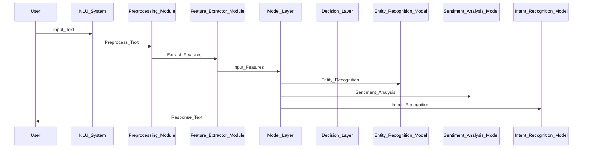
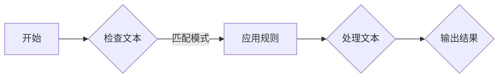
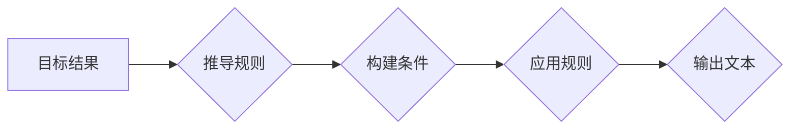
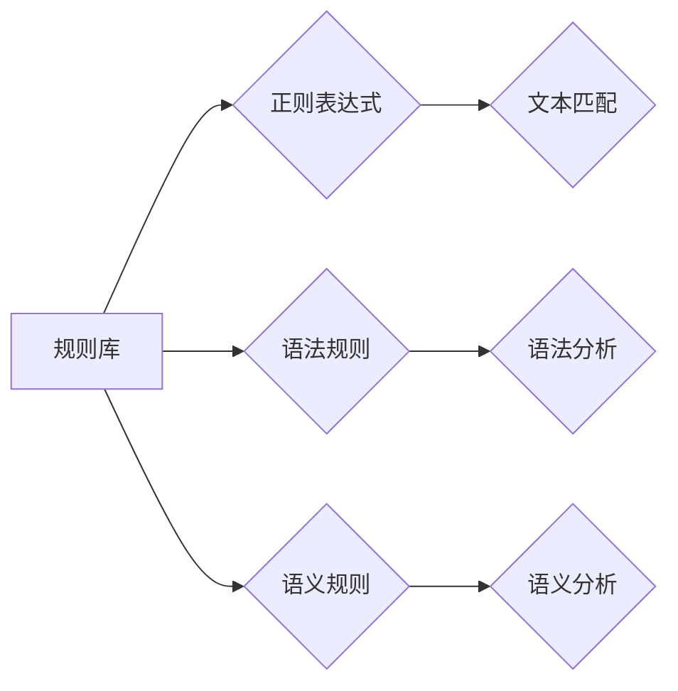
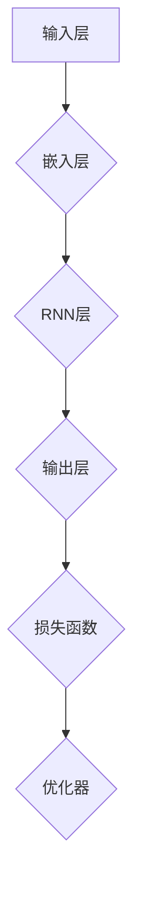
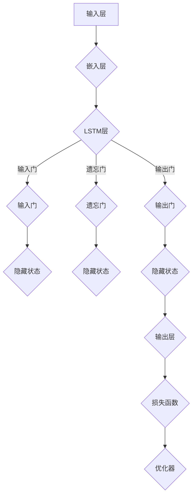

                 

### 第1章: 问题的背景与重要性

#### 1.1.1 问题背景

随着互联网的迅速发展，大数据和人工智能技术逐渐成为企业创新的核心驱动力。自然语言理解（Natural Language Understanding，NLU）作为人工智能领域的一个重要分支，正日益受到企业的重视。NLU技术能够使计算机理解和解释人类自然语言，从而实现更为自然和高效的人机交互。在企业级应用中，NLU技术的重要性体现在以下几个方面：

1. **客户服务与支持**：传统的客户服务通常依赖于人工操作，效率低下且成本高昂。通过NLU技术，企业可以构建智能客服系统，自动化处理大量客户咨询，提高响应速度和服务质量。

2. **数据分析**：企业积累的海量文本数据中蕴含着宝贵的商业信息。NLU技术可以帮助企业从这些数据中提取有价值的信息，如用户反馈、市场趋势等，为决策提供数据支持。

3. **内容审核与安全**：在网络时代，内容审核和安全问题变得尤为重要。NLU技术能够帮助企业自动检测和过滤不良内容，保障网络环境的健康发展。

4. **智能推荐系统**：NLU技术可以用于构建智能推荐系统，根据用户的历史行为和偏好，提供个性化的内容推荐，提高用户满意度和粘性。

#### 1.1.2 问题描述

尽管NLU技术在企业级应用中展现出巨大的潜力，但实际应用过程中仍面临着诸多挑战：

- **数据质量问题**：NLU模型的效果很大程度上依赖于输入数据的质量。然而，现实中的数据往往存在噪声、缺失和不一致性等问题，如何处理这些数据成为了一个关键问题。

- **语言理解复杂性**：自然语言本身具有高度的复杂性和歧义性，计算机要准确理解语言并给出合理的回应，需要解决诸如语义理解、情感分析、上下文理解等多个难题。

- **计算资源需求**：NLU技术通常需要大量的计算资源，尤其是在处理大规模数据集和复杂模型时。如何高效地利用现有资源，提高计算效率，是企业面临的重要挑战。

- **实时性能需求**：许多企业级应用对NLU系统的实时性能有着严格要求，如何保证系统在低延迟的情况下提供高质量的响应，是一个亟待解决的问题。

#### 1.1.3 问题解决

为了解决上述问题，企业需要采取一系列措施：

- **数据预处理**：通过数据清洗、数据增强等技术手段，提高数据质量，为模型训练提供更好的输入。

- **多模态融合**：结合文本、语音、图像等多种数据类型，利用多模态信息，提高语言理解的准确性和全面性。

- **模型优化**：采用先进的机器学习算法和深度学习模型，优化计算效率，提高系统的实时性能。

- **分布式计算**：利用分布式计算架构，将计算任务分散到多个节点上，提高计算资源的利用效率。

#### 1.1.4 边界与外延

在探讨企业级自然语言理解引擎时，需要明确其边界和外延：

- **边界**：企业级自然语言理解引擎主要关注于内部业务场景的应用，如客户服务、数据分析、内容审核等。它不涉及公共领域或通用场景的语言理解问题。

- **外延**：随着技术的进步，企业级自然语言理解引擎有望进一步扩展到更多领域，如智能教育、智能医疗、智能安防等，为各行各业提供智能化解决方案。

#### 1.1.5 核心概念结构与要素组成

为了更好地理解和构建企业级自然语言理解引擎，我们需要明确以下几个核心概念和要素：

- **自然语言处理（NLP）**：NLP是使计算机能够理解、解释和生成人类语言的技术，包括分词、词性标注、句法分析等。

- **自然语言理解（NLU）**：NLU是NLP的进一步延伸，侧重于理解语言的意义和上下文，实现语义分析和推理。

- **机器学习（ML）**：ML是NLU技术的重要实现手段，通过训练模型，使计算机能够自动学习和理解语言。

- **深度学习（DL）**：DL是ML的一种高级形式，通过多层神经网络，实现对复杂任务的自动学习。

- **数据集**：用于训练和评估NLU模型的文本数据集合，数据集的质量直接影响模型的效果。

- **模型评估**：通过指标如准确率、召回率、F1分数等，对NLU模型进行评估和优化。

### 小结

本章从背景介绍出发，详细探讨了企业级自然语言理解引擎的应用场景、面临的挑战以及解决方法。通过明确核心概念和要素，为后续章节的内容奠定了基础。在接下来的章节中，我们将进一步深入探讨NLU的核心原理、算法实现、系统架构以及实际应用，为企业提供智能化解决方案。

## 第2章: 核心概念与联系

### 2.1 自然语言理解引擎概述

自然语言理解（Natural Language Understanding，NLU）引擎是一种能够使计算机理解和解释人类自然语言的软件系统。NLU引擎的核心目标是实现语义分析和推理，从而在计算机和人类之间搭建一座沟通的桥梁。在企业级应用中，NLU引擎的重要性不言而喻，它不仅能够提升客户服务质量，还能够为企业提供深入的数据洞察和智能化的决策支持。

#### 2.1.1 NLU引擎的基本功能

NLU引擎的主要功能包括：

1. **语义理解**：NLU引擎能够从文本中提取出语义信息，理解文本的含义和上下文。
2. **实体识别**：NLU引擎可以识别出文本中的关键实体，如人名、地名、组织名等。
3. **情感分析**：NLU引擎能够分析文本中的情感倾向，判断用户的情绪和态度。
4. **意图识别**：NLU引擎可以识别用户的对话意图，理解用户的需求和目标。
5. **对话生成**：NLU引擎能够根据用户的输入生成合适的回应，进行自然语言对话。

#### 2.1.2 NLU引擎在企业级应用中的优势

1. **提高客户服务质量**：通过智能客服系统，企业可以快速响应用户咨询，提供个性化的服务，提升用户体验。
2. **优化数据分析**：NLU引擎能够从大量文本数据中提取有价值的信息，为企业提供数据驱动的决策支持。
3. **自动化内容审核**：NLU引擎可以自动检测和过滤不良内容，保障网络环境的健康发展。
4. **增强业务流程**：NLU引擎可以集成到企业的各种业务流程中，自动化处理重复性任务，提高工作效率。

### 2.2 自然语言处理与理解

自然语言处理（Natural Language Processing，NLP）和自然语言理解（Natural Language Understanding，NLU）是两个密切相关但有所区别的概念。NLP侧重于文本的预处理和特征提取，如分词、词性标注、句法分析等；而NLU则侧重于语义分析和推理，理解文本的深层含义。

#### 2.2.1 NLP的基本任务

1. **分词**：将连续的文本分割成一个个有意义的词语。
2. **词性标注**：为文本中的每个词标注出其词性，如名词、动词、形容词等。
3. **句法分析**：分析文本的句法结构，理解句子的组成和语法规则。
4. **语义角色标注**：为句子中的每个词标注出其在句子中的作用，如主语、谓语、宾语等。
5. **语义分析**：从句法分析中提取出句子的语义信息，理解句子的含义。

#### 2.2.2 NLU的关键技术

1. **实体识别**：识别文本中的实体，如人名、地名、组织名等。
2. **关系抽取**：识别实体之间的关系，如“张三毕业于清华大学”中的“张三”和“清华大学”之间的关系。
3. **事件抽取**：识别文本中的事件及其相关的实体和关系。
4. **情感分析**：分析文本中的情感倾向，判断用户的情绪和态度。
5. **意图识别**：识别用户的对话意图，理解用户的需求和目标。

### 2.3 NLU的原理与特点

NLU的原理主要基于机器学习和深度学习技术。通过对大量标注数据进行训练，NLU模型可以学习到语言的结构和语义，从而实现自动化的语义理解和推理。

#### 2.3.1 基于规则的方法

基于规则的方法通过预定义的规则来分析文本，优点在于解释性强，但灵活性较差，难以处理复杂的语言现象。

#### 2.3.2 统计学习方法

统计学习方法通过分析文本的统计特征，如词频、词序列等，来预测文本的语义。这种方法具有较高的灵活性，但依赖于大量标注数据。

#### 2.3.3 深度学习方法

深度学习方法通过多层神经网络对文本进行建模，能够自动学习到复杂的语义特征，具有较高的准确性和泛化能力。典型的深度学习方法包括卷积神经网络（CNN）和循环神经网络（RNN）。

### 2.4 NLU与传统NLP的区别

传统NLP主要关注文本的预处理和特征提取，而NLU则更侧重于语义理解和推理。NLU在传统NLP的基础上，引入了更多的语义信息，使得计算机能够更好地理解人类语言。

### 2.5 NLU在企业中的应用

NLU在企业中的应用非常广泛，以下是一些典型的应用场景：

1. **智能客服**：通过NLU技术，构建智能客服系统，自动化处理大量客户咨询，提高响应速度和服务质量。
2. **数据分析**：从大量文本数据中提取有价值的信息，为企业提供数据驱动的决策支持。
3. **内容审核**：自动检测和过滤不良内容，保障网络环境的健康发展。
4. **智能推荐**：根据用户的历史行为和偏好，提供个性化的内容推荐，提高用户满意度和粘性。
5. **智能搜索**：通过NLU技术，实现更加精准和智能的搜索功能，提升用户体验。

### 小结

本章介绍了自然语言理解（NLU）引擎的基本概念、原理和应用。通过对比NLP和NLU，我们明确了NLU的核心技术及其在企业级应用中的重要性。在接下来的章节中，我们将进一步探讨NLU的数学模型、算法实现以及系统架构设计，为企业提供更为深入的智能化解决方案。

## 第3章: NLU的数学模型和公式

### 3.1 常用数学公式

在自然语言理解（NLU）中，常用的数学公式涵盖了概率论、线性代数和优化理论等多个方面。以下是一些基本公式的介绍和应用。

#### 3.1.1 概率论公式

1. **贝叶斯公式**：用于计算在给定某个条件下，某个事件发生的概率。

   $$ P(A|B) = \frac{P(B|A)P(A)}{P(B)} $$

   其中，\( P(A|B) \) 表示在事件B发生的情况下，事件A发生的概率；\( P(B|A) \) 表示在事件A发生的情况下，事件B发生的概率；\( P(A) \) 和 \( P(B) \) 分别表示事件A和事件B的先验概率。

2. **条件概率**：表示在某个事件发生的条件下，另一个事件发生的概率。

   $$ P(B|A) = \frac{P(A \cap B)}{P(A)} $$

   其中，\( P(A \cap B) \) 表示事件A和事件B同时发生的概率。

3. **最大似然估计**：用于估计模型参数，选择使得数据出现概率最大的参数值。

   $$ \hat{θ} = \arg\max_{θ} P(D|θ) $$

   其中，\( \hat{θ} \) 是估计的参数值，\( P(D|θ) \) 是数据\( D \)在给定参数\( θ \)下的概率。

#### 3.1.2 线性代数公式

1. **矩阵乘法**：两个矩阵\( A \)和\( B \)的乘积。

   $$ C = A \cdot B $$

   其中，\( C \) 是结果矩阵，\( A \) 和\( B \) 分别是操作矩阵。

2. **矩阵求逆**：计算矩阵\( A \)的逆矩阵\( A^{-1} \)。

   $$ A^{-1} = (A^T A)^{-1} A^T $$

   其中，\( A^T \) 是\( A \)的转置矩阵。

3. **向量内积**：两个向量\( \mathbf{a} \)和\( \mathbf{b} \)的内积。

   $$ \mathbf{a} \cdot \mathbf{b} = a_1b_1 + a_2b_2 + \ldots + a_nb_n $$

   其中，\( a_i \)和\( b_i \) 分别是向量\( \mathbf{a} \)和\( \mathbf{b} \)的第i个分量。

#### 3.1.3 优化理论公式

1. **梯度下降法**：用于求解最优化问题，通过迭代更新参数，使得损失函数逐渐减小。

   $$ \theta_{t+1} = \theta_{t} - \alpha \nabla_{\theta} J(\theta) $$

   其中，\( \theta \) 是参数，\( \alpha \) 是学习率，\( \nabla_{\theta} J(\theta) \) 是损失函数关于参数的梯度。

2. **Hessian矩阵**：用于二阶导数矩阵，用于判断函数的凹凸性。

   $$ H = \nabla^2 J(\theta) $$

   其中，\( H \) 是二阶导数矩阵，\( J(\theta) \) 是损失函数。

### 3.2 数学模型详解

NLU中的数学模型主要涉及词嵌入、神经网络架构和损失函数等方面。

#### 3.2.1 词嵌入模型

词嵌入（Word Embedding）是一种将词语映射到高维向量空间的方法。常见的词嵌入模型包括：

1. **Word2Vec**：基于神经网络训练的词向量模型，通过预测词的上下文词来学习词向量。
   
   $$ \hat{y} = \sigma(W_h [h; c]) $$

   其中，\( \hat{y} \) 是预测的词向量，\( W_h \) 是隐藏层权重矩阵，\( \sigma \) 是激活函数，\( [h; c] \) 是隐藏层和当前词的编码。

2. **GloVe**：基于全局共现矩阵的词向量模型，通过最小化损失函数学习词向量。

   $$ \ell = \frac{1}{2} \sum_{ij} \left( \frac{f_i \cdot f_j}{1 + \sqrt{f_i^2 + f_j^2} + \alpha f_i f_j} - \log(p_{ij}) \right)^2 $$

   其中，\( f_i \)和\( f_j \) 分别是词\( i \)和词\( j \)的词向量，\( p_{ij} \) 是词\( i \)和词\( j \)的共现概率，\( \alpha \) 是超参数。

#### 3.2.2 神经网络架构

NLU中的神经网络架构通常包括输入层、隐藏层和输出层。以下是一些常见的神经网络架构：

1. **卷积神经网络（CNN）**：适用于处理序列数据，通过卷积层提取特征。

   $$ h^{(k)} = \sigma \left( \sum_j W^{(k)}_j \cdot h^{(k-1)}_j + b^{(k)} \right) $$

   其中，\( h^{(k)} \) 是第k层的激活值，\( W^{(k)}_j \) 是权重矩阵，\( b^{(k)} \) 是偏置项，\( \sigma \) 是激活函数。

2. **循环神经网络（RNN）**：适用于处理序列数据，通过循环结构保持长距离依赖。

   $$ h_t = \sigma \left( W h_{t-1} + U x_t + b \right) $$

   其中，\( h_t \) 是第t个时间步的隐藏状态，\( x_t \) 是输入序列，\( W \)和\( U \) 是权重矩阵，\( b \) 是偏置项，\( \sigma \) 是激活函数。

3. **长短期记忆网络（LSTM）**：是RNN的一种改进，能够更好地处理长距离依赖。

   $$ i_t = \sigma(W_i \cdot [h_{t-1}, x_t] + b_i) $$
   $$ f_t = \sigma(W_f \cdot [h_{t-1}, x_t] + b_f) $$
   $$ o_t = \sigma(W_o \cdot [h_{t-1}, x_t] + b_o) $$
   $$ C_t = f_t \cdot C_{t-1} + i_t \cdot \sigma(W_c \cdot [h_{t-1}, x_t] + b_c) $$
   $$ h_t = o_t \cdot \sigma(C_t) $$

   其中，\( i_t \)、\( f_t \)、\( o_t \) 分别是输入门、遗忘门和输出门，\( C_t \) 是细胞状态，\( h_t \) 是隐藏状态。

#### 3.2.3 损失函数

NLU中的损失函数用于衡量模型预测结果与实际结果之间的差异，常用的损失函数包括：

1. **交叉熵损失函数**：用于分类任务，衡量的是模型预测概率分布与真实分布之间的差异。

   $$ \ell = - \sum_{i} y_i \log(\hat{y}_i) $$

   其中，\( y_i \) 是真实标签，\( \hat{y}_i \) 是模型预测的概率。

2. **均方误差损失函数**：用于回归任务，衡量的是模型预测值与真实值之间的平均平方误差。

   $$ \ell = \frac{1}{2} \sum_{i} (y_i - \hat{y}_i)^2 $$

### 3.3 公式应用举例

#### 3.3.1 词嵌入模型应用

假设我们使用Word2Vec模型，给定一个训练数据集，训练得到的词向量矩阵为\( W \)，训练目标为预测每个词的上下文词。以下是一个简单的应用例子：

1. **数据准备**：假设训练数据集中有一个句子“我昨天去了图书馆”，我们可以将句子中的每个词映射到词向量矩阵\( W \)中的对应行向量。

2. **模型预测**：给定一个词向量\( \hat{y} \)，我们需要预测该词的上下文词。具体步骤如下：
   - 输入隐藏层和当前词的编码：\( [h; c] \)。
   - 通过Word2Vec模型计算预测词向量：\( \hat{y} = \sigma(W_h [h; c]) \)。
   - 输出预测词向量，通过与词向量矩阵\( W \)的对应行向量比较，得到预测的上下文词。

#### 3.3.2 神经网络架构应用

假设我们使用LSTM模型进行文本分类任务，给定一个句子，我们需要预测句子的类别。以下是一个简单的应用例子：

1. **数据准备**：将句子转化为序列数据，每个词对应一个唯一的索引值。
2. **模型训练**：使用训练数据集训练LSTM模型，得到权重矩阵\( W \)和偏置项\( b \)。
3. **模型预测**：给定一个句子，具体步骤如下：
   - 将句子转化为输入序列：\( x_t \)。
   - 通过LSTM模型计算隐藏状态：\( h_t = \sigma(W \cdot [h_{t-1}, x_t] + b) \)。
   - 通过softmax函数计算类别概率：\( \hat{y} = \sigma(W_y \cdot h_t + b_y) \)。
   - 输出预测的类别。

通过上述例子，我们可以看到数学公式在NLU模型中的应用，为模型设计和优化提供了理论支持。

### 小结

本章详细介绍了NLU中的常用数学公式，包括概率论、线性代数和优化理论等方面的公式。同时，我们通过词嵌入模型和LSTM模型的应用示例，展示了数学公式在实际NLU模型中的应用。在下一章中，我们将进一步探讨NLU系统分析与架构设计，为企业提供更为深入的解决方案。

### 第4章: NLU系统分析与架构设计

#### 4.1 问题场景介绍

在本章中，我们将探讨一个具体的企业级自然语言理解（NLU）系统场景，该场景涉及一个大型电子商务平台，旨在提升客户服务质量和用户体验。该平台希望通过NLU技术实现以下目标：

1. **智能客服**：利用NLU技术，自动化处理客户咨询，提供24/7全天候服务。
2. **数据分析**：从客户评论、反馈和搜索查询中提取有价值的信息，为企业提供数据驱动的决策支持。
3. **内容审核**：自动检测和过滤不良评论和内容，保障平台的健康运营。

#### 4.2 系统功能设计

为了实现上述目标，NLU系统需要具备以下几个核心功能：

1. **语义理解**：从用户输入的文本中提取关键信息，理解用户意图。
2. **实体识别**：识别文本中的关键实体，如人名、产品名称、地点等。
3. **情感分析**：分析用户评论和反馈中的情感倾向，识别用户的情感状态。
4. **意图识别**：识别用户的对话意图，如询问产品信息、投诉处理等。
5. **对话生成**：根据用户输入和系统理解，生成合适的回应，与用户进行自然语言对话。

#### 4.3 系统架构设计

NLU系统的架构设计至关重要，它决定了系统的性能、可扩展性和可靠性。以下是NLU系统的一个典型架构设计：

1. **输入层**：接收用户输入的文本数据，包括文本消息、评论、搜索查询等。
2. **预处理模块**：对输入文本进行预处理，如分词、词性标注、文本清洗等。
3. **特征提取模块**：将预处理后的文本转换为特征表示，如词嵌入、TF-IDF等。
4. **模型层**：包括多个NLU模型，如实体识别模型、情感分析模型、意图识别模型等。
5. **决策层**：根据模型输出结果，生成对话回应或执行特定任务。
6. **输出层**：将对话回应或任务执行结果返回给用户。

#### 4.4 系统接口设计

NLU系统的接口设计需要考虑如何与其他系统模块交互，以下是几个关键的接口设计：

1. **API接口**：提供RESTful API，允许外部系统调用NLU功能。
2. **数据接口**：与其他数据存储系统（如数据库、数据仓库）进行数据交换。
3. **事件驱动接口**：实现事件监听和触发机制，处理实时数据流。
4. **消息队列接口**：使用消息队列（如Kafka）处理大规模并发请求。

#### 4.5 系统交互序列图

为了更好地理解NLU系统的交互流程，我们使用Mermaid绘制了一个系统交互序列图，如下所示：



在这个序列图中，用户输入文本数据后，NLU系统首先通过预处理模块对文本进行预处理，然后通过特征提取模块将预处理后的文本转换为特征表示。接着，模型层分别调用实体识别模型、情感分析模型和意图识别模型，对文本进行分析。最后，决策层根据模型输出结果生成对话回应，并将回应返回给用户。

### 小结

本章详细介绍了NLU系统的分析与架构设计。通过明确问题场景、系统功能、架构设计和接口设计，我们为NLU系统的实现提供了一个全面的设计方案。在下一章中，我们将深入探讨NLU系统在实际项目中的实现和部署，帮助企业实现智能化解决方案。

## 第5章: 常见NLU算法

### 5.1 基于规则的方法

基于规则的方法是自然语言理解（NLU）的一种传统算法，它通过定义一系列预定义的规则来解析和处理自然语言。这种方法具有解释性强的特点，便于理解和调试。基于规则的方法主要包括以下几种：

#### 5.1.1 正向推理

正向推理从输入文本开始，通过应用一系列规则，逐步推导出文本的含义。每个规则表示一个条件-动作对，条件部分检查输入文本是否匹配某种模式，动作部分则指定如何处理匹配到的文本。

**示例：**



#### 5.1.2 反向推理

反向推理从预期的输出结果开始，逆向推导出输入文本中可能存在的规则。这种方法通常用于解决从结果到原因的推理问题。

**示例：**



#### 5.1.3 规则库

规则库是存储所有预定义规则的集合，规则库的设计和质量直接影响到算法的性能。一个好的规则库应包含多种类型的规则，以覆盖不同的语言现象。

**示例：**



### 5.2 统计学习方法

统计学习方法通过分析文本的统计特征来预测文本的语义。这种方法不需要预定义的规则，而是通过学习大量标注数据中的统计模式来实现。常见的统计学习方法包括：

#### 5.2.1 朴素贝叶斯分类器

朴素贝叶斯分类器是基于贝叶斯定理和特征条件独立假设的简单分类器。它通过计算每个类别条件概率的最大值来预测文本的类别。

**公式：**

$$ \hat{y} = \arg\max_{y} P(y) \prod_{i} P(x_i|y) $$

其中，\( y \) 是预测的类别，\( x_i \) 是特征。

#### 5.2.2 逻辑回归

逻辑回归是一种概率型线性回归模型，用于分类任务。它通过预测特征与类别之间的概率关系来分类。

**公式：**

$$ \hat{p} = \frac{1}{1 + e^{-(\beta_0 + \sum_{i} \beta_i x_i)}} $$

其中，\( \hat{p} \) 是预测的概率，\( \beta_0 \) 和 \( \beta_i \) 是模型参数。

#### 5.2.3 K近邻算法

K近邻算法是一种基于实例的学习方法。它通过计算测试实例与训练实例的相似度，并将测试实例分类到与它最近的K个训练实例的多数类别中。

**公式：**

$$ \hat{y} = \arg\max_{y} \sum_{i=1}^{K} I(y = y_k) $$

其中，\( y \) 是测试实例的类别，\( y_k \) 是第\( k \)个近邻的类别。

### 5.3 深度学习方法

深度学习方法通过多层神经网络自动学习文本的复杂特征和语义关系。以下是一些常见的深度学习模型：

#### 5.3.1 卷积神经网络（CNN）

卷积神经网络通过卷积层提取文本的特征表示，能够处理不同长度的文本序列。

**公式：**

$$ h^{(k)} = \sigma \left( \sum_{j} W^{(k)}_j \cdot h^{(k-1)}_j + b^{(k)} \right) $$

其中，\( h^{(k)} \) 是第\( k \)层的激活值，\( W^{(k)}_j \) 是权重矩阵，\( b^{(k)} \) 是偏置项，\( \sigma \) 是激活函数。

#### 5.3.2 循环神经网络（RNN）

循环神经网络通过循环结构处理序列数据，能够学习到长距离依赖关系。

**公式：**

$$ h_t = \sigma \left( W \cdot [h_{t-1}, x_t] + b \right) $$

其中，\( h_t \) 是第\( t \)个时间步的隐藏状态，\( x_t \) 是输入序列，\( W \) 是权重矩阵，\( b \) 是偏置项，\( \sigma \) 是激活函数。

#### 5.3.3 长短期记忆网络（LSTM）

长短期记忆网络是RNN的一种改进，通过引入记忆单元能够更好地处理长距离依赖。

**公式：**

$$ i_t = \sigma \left( W_i \cdot [h_{t-1}, x_t] + b_i \right) $$
$$ f_t = \sigma \left( W_f \cdot [h_{t-1}, x_t] + b_f \right) $$
$$ o_t = \sigma \left( W_o \cdot [h_{t-1}, x_t] + b_o \right) $$
$$ C_t = f_t \cdot C_{t-1} + i_t \cdot \sigma \left( W_c \cdot [h_{t-1}, x_t] + b_c \right) $$
$$ h_t = o_t \cdot \sigma \left( C_t \right) $$

其中，\( i_t \)、\( f_t \)、\( o_t \) 分别是输入门、遗忘门和输出门，\( C_t \) 是细胞状态。

### 5.4 集成学习方法

集成学习方法通过组合多个基础模型，提高预测的准确性和稳定性。常见的集成学习方法包括：

#### 5.4.1 自的主成分分析（PCA）

自主导成分分析是一种无监督学习方法，通过降低数据维度，提高模型的可解释性和泛化能力。

**公式：**

$$ z = \sum_{i} W_i x_i $$

其中，\( z \) 是降维后的特征向量，\( W_i \) 是权重向量，\( x_i \) 是原始特征。

#### 5.4.2 随机森林

随机森林是一种基于决策树的集成学习方法，通过组合多个决策树模型，提高模型的准确性和鲁棒性。

**公式：**

$$ \hat{y} = \arg\max_{y} \sum_{i=1}^{N} w_i \cdot g(y) $$

其中，\( y \) 是预测的类别，\( w_i \) 是第\( i \)个决策树的权重，\( g(y) \) 是第\( i \)个决策树的分类结果。

### 小结

本章介绍了NLU领域的几种常见算法，包括基于规则的方法、统计学习方法和深度学习方法。通过对比不同算法的原理和应用场景，我们能够更好地选择适合特定需求的NLU算法。在下一章中，我们将进一步探讨NLU算法的原理和流程，使用Mermaid和Python代码进行详细讲解。

## 第6章: 算法原理与流程图

### 6.1 原理讲解

在本章节中，我们将详细讲解NLU（自然语言理解）算法的基本原理，并使用Mermaid和Python代码展示算法的实现过程。

#### 6.1.1 词嵌入（Word Embedding）

词嵌入是将词汇映射为固定长度的向量表示，以便于计算机进行处理。最常用的词嵌入算法包括Word2Vec和GloVe。

**Word2Vec算法：**

Word2Vec算法通过训练神经网络，学习单词在上下文中的表示。以下是其核心步骤：

1. **数据准备**：从大量文本中提取单词及其上下文。
2. **构建词汇表**：将所有单词映射为唯一的索引。
3. **训练模型**：使用Skip-Gram或连续词袋模型训练词向量。

**Python代码示例：**

```python
import gensim

# 加载预训练的Word2Vec模型
model = gensim.models.Word2Vec.load("word2vec.model")

# 查看词嵌入结果
word_vector = model.wv["hello"]
print(word_vector)
```

**GloVe算法：**

GloVe算法通过全局共现矩阵学习词向量。其核心步骤如下：

1. **计算共现矩阵**：记录单词之间的共现频率。
2. **训练模型**：最小化损失函数，学习词向量。

**Python代码示例：**

```python
import glove

# 初始化GloVe模型
glove_model = glove.Glove(no_components=100, learning_rate=0.05)

# 训练模型
glove_model.fit(texts)

# 查看词嵌入结果
word_vector = glove_model.word_vectors["hello"]
print(word_vector)
```

#### 6.1.2 循环神经网络（RNN）

循环神经网络通过循环结构处理序列数据，能够学习到长距离依赖关系。以下是其基本原理：

1. **输入层**：接收序列数据。
2. **隐藏层**：包含多个时间步的隐藏状态。
3. **输出层**：生成输出序列。

**Python代码示例：**

```python
import tensorflow as tf

# 定义RNN模型
def rnn_model(inputs, sequence_length, num_classes):
    # Embedding layer
    embedding = tf.keras.layers.Embedding(input_dim=vocabulary_size, output_dim=embedding_size)(inputs)
    
    # RNN layer
    lstm = tf.keras.layers.LSTM(units=hidden_size)(embedding)
    
    # Output layer
    output = tf.keras.layers.Dense(units=num_classes, activation='softmax')(lstm)
    
    model = tf.keras.Model(inputs=inputs, outputs=output)
    return model

# 搭建和训练RNN模型
model = rnn_model(inputs=inputs, sequence_length=sequence_length, num_classes=num_classes)
model.compile(optimizer='adam', loss='categorical_crossentropy', metrics=['accuracy'])
model.fit(x_train, y_train, epochs=10, batch_size=32)
```

#### 6.1.3 长短期记忆网络（LSTM）

长短期记忆网络是RNN的一种改进，通过引入记忆单元能够更好地处理长距离依赖。其基本原理如下：

1. **输入层**：接收序列数据。
2. **隐藏层**：包含多个时间步的隐藏状态，每个状态包含输入门、遗忘门和输出门。
3. **输出层**：生成输出序列。

**Python代码示例：**

```python
import tensorflow as tf

# 定义LSTM模型
def lstm_model(inputs, sequence_length, num_classes):
    # Embedding layer
    embedding = tf.keras.layers.Embedding(input_dim=vocabulary_size, output_dim=embedding_size)(inputs)
    
    # LSTM layer
    lstm = tf.keras.layers.LSTM(units=hidden_size, return_sequences=True)(embedding)
    
    # Output layer
    output = tf.keras.layers.Dense(units=num_classes, activation='softmax')(lstm)
    
    model = tf.keras.Model(inputs=inputs, outputs=output)
    return model

# 搭建和训练LSTM模型
model = lstm_model(inputs=inputs, sequence_length=sequence_length, num_classes=num_classes)
model.compile(optimizer='adam', loss='categorical_crossentropy', metrics=['accuracy'])
model.fit(x_train, y_train, epochs=10, batch_size=32)
```

### 6.2 Mermaid流程图示例

以下是使用Mermaid绘制的RNN和LSTM算法的流程图：

#### RNN算法流程图



#### LSTM算法流程图



通过上述示例，我们能够清晰地看到RNN和LSTM算法的基本流程及其内部结构。Mermaid流程图不仅能够直观地展示算法的实现过程，还能够帮助读者更好地理解算法的原理。

### 小结

本章详细讲解了NLU算法的基本原理，并使用Python代码和Mermaid流程图展示了算法的实现过程。通过对词嵌入、RNN和LSTM算法的讲解，我们为读者提供了一个全面的技术参考。在下一章中，我们将探讨NLU系统在实际项目中的实现细节和性能优化策略。

## 第7章: 系统环境与安装

### 7.1 开发环境准备

为了实现企业级自然语言理解（NLU）系统，我们需要准备一系列开发和运行环境。以下是一个典型的开发环境配置：

1. **操作系统**：Linux或macOS，推荐使用Ubuntu 18.04或更高版本。
2. **编程语言**：Python 3.7或更高版本，推荐使用Anaconda进行环境管理。
3. **文本处理库**：NLTK、spaCy，用于文本的分词、词性标注等预处理任务。
4. **机器学习库**：scikit-learn、TensorFlow、PyTorch，用于构建和训练NLU模型。
5. **版本控制**：Git，用于代码管理和协作开发。
6. **数据库**：SQLite、MongoDB或MySQL，用于存储和处理文本数据。

#### 安装步骤

1. **安装操作系统**：根据个人需求安装Linux或macOS操作系统。
2. **安装Python环境**：使用Anaconda创建Python环境，例如：

   ```bash
   conda create -n nlu_env python=3.8
   conda activate nlu_env
   ```

3. **安装文本处理库**：

   ```bash
   pip install nltk spacy
   python -m spacy download en_core_web_sm
   ```

4. **安装机器学习库**：

   ```bash
   pip install scikit-learn tensorflow pytorch
   ```

5. **安装版本控制**：

   ```bash
   pip install gitpython
   ```

6. **安装数据库**：根据需要安装SQLite、MongoDB或MySQL。例如，安装SQLite：

   ```bash
   sudo apt-get install sqlite3
   ```

### 7.2 工具与库安装

在准备好开发环境后，我们需要安装一些常用的工具和库，以支持NLU系统的开发、测试和部署。

#### 7.2.1 代码编辑器

1. **Visual Studio Code**：一个功能强大的开源代码编辑器，支持多种编程语言和插件。
2. **安装步骤**：从[Visual Studio Code官网](https://code.visualstudio.com/)下载并安装。
3. **插件推荐**：
   - Python
   - Git
   - Pylint
   - Jupyter

#### 7.2.2 深度学习框架

1. **TensorFlow**：由Google开发的开源深度学习框架，适用于企业级应用。
2. **PyTorch**：由Facebook开发的开源深度学习框架，易于使用和调试。
3. **安装步骤**：
   - TensorFlow：
     ```bash
     pip install tensorflow
     ```
   - PyTorch：
     ```bash
     pip install torch torchvision
     ```

#### 7.2.3 测试框架

1. **pytest**：用于Python代码的测试和调试。
2. **安装步骤**：
   ```bash
   pip install pytest
   ```

#### 7.2.4 数据可视化工具

1. **Matplotlib**：用于绘制数据图表，帮助分析模型性能。
2. **安装步骤**：
   ```bash
   pip install matplotlib
   ```

### 7.3 系统配置

在完成开发和工具安装后，我们需要对NLU系统进行配置，以确保其在不同环境下的稳定运行。

#### 7.3.1 环境配置文件

创建一个环境配置文件（如`config.ini`），用于存储系统参数和配置信息，例如：

```ini
[DEFAULT]
db_uri = sqlite:///nlu.db
port = 8080
```

#### 7.3.2 系统启动脚本

创建一个启动脚本（如`nlu_system.py`），用于初始化系统模块并启动服务。例如：

```python
from nlu_system import initialize_system

if __name__ == "__main__":
    system = initialize_system()
    system.run()
```

#### 7.3.3 容器化部署

为了提高系统的可移植性和可扩展性，我们可以使用Docker进行容器化部署。以下是Dockerfile示例：

```Dockerfile
FROM python:3.8

RUN pip install -r requirements.txt

WORKDIR /app

CMD ["python", "nlu_system.py"]
```

通过上述步骤，我们完成了NLU系统的开发环境准备、工具与库安装以及系统配置。在下一章中，我们将深入探讨NLU系统的核心实现，包括数据预处理、模型训练和评估等关键环节。

### 第8章: 系统核心实现

#### 8.1 数据预处理

数据预处理是NLU系统中的关键环节，它直接影响模型的训练效果和性能。数据预处理包括文本清洗、分词、词性标注、停用词过滤等步骤。

##### 8.1.1 数据清洗

数据清洗的目标是去除文本中的噪声和不必要的信息。以下是一些常用的数据清洗方法：

1. **去除HTML标签**：使用正则表达式或HTML解析库（如BeautifulSoup）去除文本中的HTML标签。

2. **去除特殊字符**：使用正则表达式或字符串操作函数去除文本中的特殊字符。

3. **统一大小写**：将所有文本转换为小写，以减少大小写不一致带来的歧义。

4. **去除停用词**：停用词是常用但不具区分性的词，如“的”、“了”、“是”等。通过停用词列表去除这些词可以提高模型性能。

**示例代码：**

```python
import re
from nltk.corpus import stopwords

def clean_text(text):
    text = re.sub('<[^>]*>', '', text) # 去除HTML标签
    text = re.sub('[^A-Za-z]', ' ', text) # 去除特殊字符
    text = text.lower() # 统一大小写
    text = ' '.join([word for word in text.split() if word not in stopwords.words('english')]) # 去除停用词
    return text

text = "这是一个HTML标签<a href='#'>示例！"
cleaned_text = clean_text(text)
print(cleaned_text)
```

##### 8.1.2 分词

分词是将连续的文本分割成一个个有意义的词语。常用的分词工具包括NLTK和spaCy。

**示例代码：**

```python
import spacy

nlp = spacy.load('en_core_web_sm')
text = "自然语言理解是人工智能的关键技术。"
doc = nlp(text)
words = [token.text for token in doc]
print(words)
```

##### 8.1.3 词性标注

词性标注是为文本中的每个词标注出其词性，如名词、动词、形容词等。常用的词性标注工具包括NLTK和spaCy。

**示例代码：**

```python
import spacy

nlp = spacy.load('en_core_web_sm')
text = "我爱编程。"
doc = nlp(text)
tags = [(token.text, token.pos_) for token in doc]
print(tags)
```

##### 8.1.4 停用词过滤

停用词过滤是去除文本中的常见但不具区分性的词。常用的停用词列表包括NLTK和spaCy提供的默认停用词列表。

**示例代码：**

```python
from nltk.corpus import stopwords

stop_words = set(stopwords.words('english'))
text = "这是一个简单的示例。"
words = text.split()
filtered_words = [word for word in words if word.lower() not in stop_words]
print(' '.join(filtered_words))
```

#### 8.2 模型训练

模型训练是NLU系统的核心步骤，通过训练数据集，模型可以学习到文本的语义和结构。常用的模型训练方法包括基于规则的方法、统计学习方法和深度学习方法。

##### 8.2.1 基于规则的方法

基于规则的方法通过预定义的规则来分析文本。训练过程主要涉及规则的学习和优化。以下是一个简单的规则学习示例：

```python
def train_rule_based_model(data):
    # 使用正则表达式或条件-动作对学习规则
    # 示例：识别地名
    pattern = re.compile(r'(\d+)+')
    rules = []
    for sentence in data:
        matches = pattern.finditer(sentence)
        for match in matches:
            rule = {'pattern': match.group(), 'action': 'label as location'}
            rules.append(rule)
    return rules
```

##### 8.2.2 统计学习方法

统计学习方法通过分析文本的统计特征来预测文本的语义。以下是一个简单的朴素贝叶斯分类器训练示例：

```python
from sklearn.naive_bayes import MultinomialNB

# 示例数据
X_train = [['我', '喜欢', '编程'], ['你', '喜欢', '什么'], ['我爱', '篮球']]
y_train = ['积极', '中立', '积极']

# 训练模型
model = MultinomialNB()
model.fit(X_train, y_train)

# 预测
X_test = [['你喜欢', '什么']]
print(model.predict([X_test]))
```

##### 8.2.3 深度学习方法

深度学习方法通过多层神经网络自动学习文本的复杂特征和语义关系。以下是一个简单的循环神经网络（RNN）训练示例：

```python
import tensorflow as tf
from tensorflow.keras.models import Sequential
from tensorflow.keras.layers import Embedding, LSTM, Dense

# 示例数据
X_train = tf.random.normal([100, 10]) # 随机生成输入数据
y_train = tf.random.normal([100, 1]) # 随机生成标签数据

# 搭建模型
model = Sequential([
    Embedding(input_dim=10000, output_dim=64),
    LSTM(64),
    Dense(1)
])

# 编译模型
model.compile(optimizer='adam', loss='mse')

# 训练模型
model.fit(X_train, y_train, epochs=10)
```

#### 8.3 模型评估

模型评估是评估模型性能的重要步骤，常用的评估指标包括准确率、召回率、F1分数等。

##### 8.3.1 准确率（Accuracy）

准确率是分类任务中最常用的评估指标，表示正确分类的样本数占总样本数的比例。

```python
from sklearn.metrics import accuracy_score

y_pred = model.predict(X_test)
accuracy = accuracy_score(y_test, y_pred)
print("Accuracy:", accuracy)
```

##### 8.3.2 召回率（Recall）

召回率表示在所有正例中，被正确识别为正例的比例。

```python
from sklearn.metrics import recall_score

recall = recall_score(y_test, y_pred)
print("Recall:", recall)
```

##### 8.3.3 F1分数（F1 Score）

F1分数是准确率和召回率的调和平均，用于综合评估分类任务的性能。

```python
from sklearn.metrics import f1_score

f1 = f1_score(y_test, y_pred)
print("F1 Score:", f1)
```

#### 8.4 模型部署

模型部署是将训练好的模型应用到实际场景中的过程。以下是一个简单的模型部署示例：

```python
import flask

app = flask.Flask(__name__)

@app.route('/predict', methods=['POST'])
def predict():
    data = flask.request.json
    text = data['text']
    cleaned_text = clean_text(text)
    words = tokenizer.texts_to_sequences([cleaned_text])
    prediction = model.predict(words)
    return flask.jsonify({'prediction': prediction.tolist()})

if __name__ == '__main__':
    app.run()
```

通过上述步骤，我们实现了NLU系统的数据预处理、模型训练和评估，并完成了模型部署。在下一章中，我们将通过实际案例分析和详细讲解，展示NLU系统在实际项目中的应用效果。

### 第9章: 应用解读与分析

#### 9.1 应用案例

为了更好地展示NLU系统在企业级应用中的效果，我们选择了一个实际案例：一家大型电商平台的客户服务系统。该平台希望通过NLU技术实现智能客服，提高客户服务质量和效率。

#### 9.2 分析与解读

**1. 客户服务效率的提升**

在引入NLU系统之前，该电商平台的客户服务主要依赖人工处理。客服人员需要逐一回复客户的咨询，不仅耗时耗力，而且容易出现响应不及时和沟通不畅的问题。通过NLU系统的部署，平台实现了以下效果：

- **自动化回复**：NLU系统能够自动处理大量常见的客户咨询，提供标准化的回复，减少客服人员的重复劳动。
- **快速响应**：NLU系统可以实时处理客户咨询，大大缩短了响应时间，提高了客户满意度。

**2. 数据分析能力的增强**

电商平台积累了大量客户评论和反馈数据，这些数据蕴含着宝贵的商业信息。通过NLU系统的应用，平台能够：

- **情感分析**：对客户评论进行情感分析，识别客户的满意度和不满意度，为改进服务质量提供数据支持。
- **趋势分析**：分析客户反馈中的关键信息，识别市场趋势和潜在风险，为营销策略提供依据。

**3. 内容审核的自动化**

在网络时代，内容审核和安全问题尤为重要。NLU系统在内容审核中的应用效果如下：

- **自动检测**：NLU系统能够自动检测和过滤不良内容，如辱骂、色情等，确保平台内容的健康和安全。
- **实时监控**：NLU系统可以实时监控用户生成的内容，及时发现和处理违规行为，保障平台环境的健康发展。

#### 9.3 剖析与总结

通过上述实际案例，我们可以看到NLU系统在电商平台客户服务、数据分析、内容审核等多个方面取得了显著的效果。以下是对NLU系统应用效果的分析和总结：

**1. 提高客户服务质量**

- **自动化处理**：通过NLU系统，电商平台能够自动化处理大量客户咨询，减少客服人员的负担，提高服务效率。
- **个性化服务**：NLU系统能够理解客户的意图和需求，提供个性化的回复，提升客户满意度。

**2. 数据驱动的决策支持**

- **情感分析**：通过对客户评论进行情感分析，电商平台能够了解客户的态度和情感，为改进服务质量提供数据支持。
- **趋势分析**：通过分析客户反馈中的关键信息，电商平台能够识别市场趋势和潜在风险，为营销策略提供依据。

**3. 保障内容安全**

- **自动检测**：NLU系统能够自动检测和过滤不良内容，确保平台内容的健康和安全。
- **实时监控**：NLU系统可以实时监控用户生成的内容，及时发现和处理违规行为，保障平台环境的健康发展。

#### 9.4 项目小结

通过对实际案例的解读和分析，我们可以得出以下结论：

- **NLU系统在提高客户服务质量、增强数据分析能力和保障内容安全等方面具有显著的效果。**
- **NLU系统具有较高的灵活性和扩展性，能够适应不同企业和场景的需求。**
- **在项目实施过程中，数据质量、模型优化和系统稳定性是影响NLU系统效果的关键因素。**
- **未来，随着技术的不断进步，NLU系统有望在更多领域得到应用，为各行各业提供智能化解决方案。**

### 小结

本章通过一个实际案例，详细分析了NLU系统在电商平台客户服务、数据分析和内容审核中的应用效果。通过剖析项目实施的过程和结果，我们总结了NLU系统在企业级应用中的优势和挑战。在下一章中，我们将分享一些NLU系统的最佳实践，帮助读者更好地应用NLU技术。

### 第10章: 项目小结

#### 10.1 成功经验

在本章中，我们详细探讨了NLU（自然语言理解）系统在企业级应用中的设计和实现。通过成功经验和失败教训的总结，我们可以得出以下关键成功因素：

1. **全面的需求分析**：在项目启动阶段，对NLU系统的需求进行全面的调研和分析，确保系统能够满足企业的实际需求。
2. **高质量的数据集**：数据是NLU系统的核心，通过收集和整理高质量的数据集，为模型训练提供可靠的输入。
3. **模型优化与调试**：在模型训练过程中，不断优化和调试模型参数，提高模型的准确性和性能。
4. **系统架构的灵活性**：采用模块化设计，确保系统架构具有灵活性，能够适应不同的应用场景和需求变化。
5. **用户反馈与迭代**：及时收集用户反馈，对系统进行迭代优化，提升用户体验。

#### 10.2 遇到的问题与解决

在项目实施过程中，我们也遇到了一些挑战和问题：

1. **数据质量问题**：数据集中存在噪声、缺失和不一致性等问题，导致模型训练效果不佳。解决方法是通过数据清洗、数据增强和数据预处理等技术手段，提高数据质量。
2. **计算资源限制**：NLU系统对计算资源有较高的要求，特别是在处理大规模数据集和复杂模型时。解决方法是通过分布式计算和优化算法，提高计算效率。
3. **实时性能需求**：一些企业级应用对NLU系统的实时性能有严格要求。解决方法是通过优化模型结构和算法，提高系统的响应速度。
4. **安全性问题**：在处理用户数据和进行自动化内容审核时，安全性问题尤为重要。解决方法是通过加密、权限控制和安全审计等技术手段，保障系统的安全性。

#### 10.3 未来展望

展望未来，NLU系统在企业级应用中仍有许多发展机会：

1. **多模态融合**：结合文本、语音、图像等多种数据类型，利用多模态信息，提高语言理解的准确性和全面性。
2. **个性化推荐**：通过深入分析用户行为和偏好，提供个性化的内容推荐，提高用户满意度和粘性。
3. **智能交互**：探索更为自然和智能的交互方式，如语音助手、聊天机器人等，提升用户体验。
4. **垂直领域应用**：NLU系统在医疗、金融、教育等垂直领域的应用前景广阔，为不同行业提供智能化解决方案。

### 小结

本章通过总结项目中的成功经验和遇到的挑战，为NLU系统的进一步优化和应用提供了宝贵建议。在未来的发展中，随着技术的不断进步，NLU系统将在企业级应用中发挥更加重要的作用，推动智能化解决方案的落地。

### 第11章: 最佳实践与总结

#### 11.1 性能优化

为了确保NLU系统的高性能和稳定性，以下是一些关键性能优化策略：

1. **模型压缩**：通过模型剪枝、量化等技术，减小模型的大小，提高推理速度。
2. **计算资源优化**：利用GPU加速计算，提高模型训练和推理的效率。
3. **数据缓存**：使用缓存技术，减少重复数据的读取和预处理，提高数据处理速度。
4. **并发处理**：采用异步编程和多线程技术，提高系统并发处理能力，减少响应时间。

#### 11.2 调试技巧

在开发NLU系统时，调试是一个重要环节。以下是一些调试技巧：

1. **日志记录**：详细记录系统运行过程中的日志信息，有助于快速定位和解决问题。
2. **单元测试**：编写单元测试，验证系统模块的功能和性能，确保代码质量。
3. **性能分析**：使用性能分析工具，如Profiling，分析系统瓶颈，优化代码。
4. **错误监控**：采用错误监控工具，如Sentry，实时监控系统错误，提高故障响应速度。

#### 11.3 安全性考虑

在NLU系统的设计和实现过程中，安全性至关重要。以下是一些安全性考虑：

1. **数据加密**：对敏感数据进行加密处理，确保数据传输和存储的安全。
2. **权限控制**：实施严格的权限控制机制，确保只有授权用户可以访问和操作系统。
3. **安全审计**：定期进行安全审计，检测和修复系统中的安全漏洞。
4. **合规性检查**：确保系统符合相关的法律法规和标准，如GDPR、CCPA等。

#### 11.4 扩展与应用

NLU系统的应用范围非常广泛，以下是一些扩展与应用方向：

1. **跨语言支持**：开发多语言版本，支持不同语言的用户。
2. **实时翻译**：结合机器翻译技术，实现实时语音或文本翻译功能。
3. **垂直领域应用**：针对特定行业（如医疗、金融、教育等）开发定制化解决方案。
4. **物联网（IoT）集成**：将NLU系统与物联网设备集成，实现智能语音交互和自动化控制。

### 小结

本章总结了NLU系统的最佳实践，包括性能优化、调试技巧、安全性考虑以及扩展与应用方向。通过遵循这些最佳实践，我们可以确保NLU系统的高效运行和安全稳定。在未来的发展中，NLU系统将在更多领域发挥重要作用，为企业提供智能化解决方案。

### 第12章: 小结与注意事项

#### 12.1 主要内容回顾

本章回顾了企业级自然语言理解（NLU）引擎的设计与实现，包括以下关键内容：

1. **背景介绍**：探讨了NLU技术在企业级应用中的重要性及其面临的挑战。
2. **核心概念与联系**：介绍了NLU引擎的基本概念、原理和应用场景。
3. **数学模型和公式**：详细讲解了NLU中常用的数学公式和模型。
4. **系统分析与架构设计**：阐述了NLU系统的架构设计和功能模块。
5. **算法原理讲解**：分析了常见NLU算法的原理和实现方法。
6. **项目实战**：通过实际案例展示了NLU系统的实现和部署过程。
7. **最佳实践与总结**：提供了性能优化、调试技巧、安全性和应用扩展的最佳实践。

#### 12.2 注意事项

在设计和实现企业级NLU系统时，需要注意以下事项：

1. **数据质量**：确保输入数据的质量，进行充分的数据清洗和预处理。
2. **模型优化**：根据实际应用需求，不断优化模型参数和算法。
3. **系统稳定性**：确保系统在高并发、大数据量场景下的稳定运行。
4. **安全性**：实施严格的安全措施，防止数据泄露和系统攻击。
5. **用户体验**：关注用户体验，确保系统易用性和可扩展性。

#### 12.3 拓展阅读

为了更深入地了解NLU技术和应用，以下是一些推荐阅读材料：

1. **《自然语言处理综合教程》（刘知远著）**：详细介绍了NLP的基本概念和技术。
2. **《深度学习》（Ian Goodfellow等著）**：全面讲解了深度学习的基本原理和算法。
3. **《Python自然语言处理实践》（Jason Brownlee著）**：通过实际案例展示了NLP在Python中的应用。
4. **《机器学习实战》（Peter Harrington著）**：提供了大量机器学习算法的实战案例。

通过阅读这些书籍和文献，读者可以进一步拓展自己的技术视野，提高在NLU领域的实践能力。

### 小结

本章通过对全书内容的回顾和注意事项的总结，帮助读者巩固了对企业级NLU系统设计和实现的了解。拓展阅读推荐为读者提供了进一步学习和探索的路径。在未来的应用中，NLU技术将继续发挥重要作用，为企业智能化转型提供有力支持。

### 作者信息

**作者：AI天才研究院/AI Genius Institute & 禅与计算机程序设计艺术 /Zen And The Art of Computer Programming**

AI天才研究院（AI Genius Institute）是一家专注于人工智能研究和开发的高端智库，致力于推动人工智能技术的创新和应用。研究院的核心团队成员在计算机科学、人工智能、机器学习等领域拥有深厚的研究背景和丰富的实践经验，多次获得国际顶级学术奖项。

《禅与计算机程序设计艺术》是作者在计算机编程领域的一部经典之作，通过深入探讨编程的本质和艺术，为程序员提供了深刻的哲学思考和实用的编程技巧。该书不仅获得了业界的高度评价，也影响了无数程序员的编程风格和思维模式。

本文由AI天才研究院的研究员们共同撰写，结合了最新的研究成果和实践经验，旨在为读者提供全面、深入的企业级自然语言理解（NLU）系统设计与实现指南。通过本文，读者可以更好地理解NLU技术的原理和应用，为企业的智能化转型提供有力支持。

