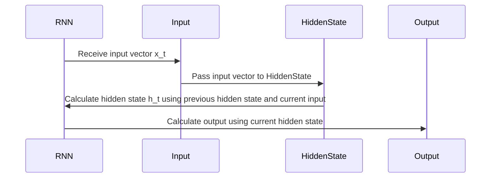
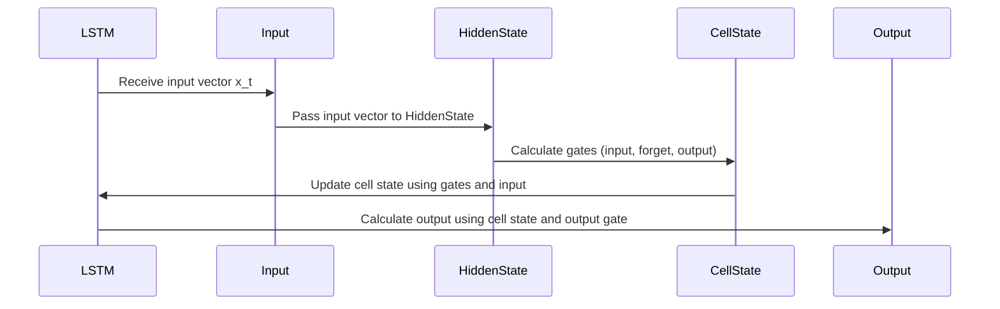
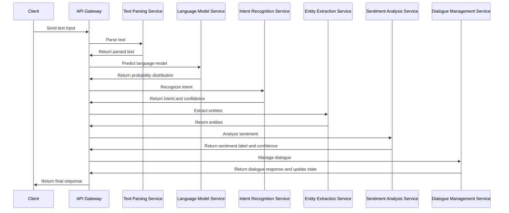

                 

### 引言

在数字化转型的浪潮中，人工智能（AI）已经成为推动企业创新和业务增长的关键技术。其中，自然语言理解（Natural Language Understanding, NLU）作为AI的重要分支，扮演着深化人与机器交互的核心角色。企业级自然语言理解不仅仅是技术实现的问题，更涉及到用户体验、业务逻辑和系统架构的全方位优化。

本文旨在深入探讨企业级自然语言理解的技术原理、系统设计与实现，通过分步骤的分析和推理，为读者呈现一个系统且详尽的技术解读。我们将从背景介绍、核心概念与联系、算法原理讲解、系统分析与架构设计、项目实战以及最佳实践等六个方面，逐步展开对NLU的深度探讨。

首先，我们将回顾自然语言理解的发展历程，理解其从规则匹配到机器学习、再到深度学习的演变过程，并探讨其在现实世界中的应用场景。接着，我们会定义并解析NLU中的核心概念，如语言模型、词向量、序列到序列模型，并通过对比表格和ER实体关系图展示它们之间的关系。在此基础上，我们将详细讲解NLU的核心算法，包括循环神经网络（RNN）、长短期记忆网络（LSTM）等，并通过Python源代码和数学模型展示其工作原理。

随后，我们将介绍NLU系统的应用场景，设计其功能、架构、接口和交互流程，并提供具体的实战案例。最后，我们将总结书中的关键点，提供实际操作的建议，并指出注意事项和进一步阅读的资料。

通过本文的阅读，读者将不仅能够理解自然语言理解的基础知识，还能够掌握如何在实际项目中设计和实现企业级NLU系统，从而为企业的智能化转型提供有力的技术支持。

### 自然语言理解的发展历程

自然语言理解（NLU）的发展历程可以追溯到计算机科学和人工智能的早期阶段。从最初的规则匹配方法，到现代基于机器学习和深度学习的复杂算法，NLU技术经历了显著的演变，逐渐从理论研究走向实际应用，为企业和个人提供了更智能的交互体验。

**1. 规则匹配阶段（1960s-1980s）**

自然语言理解的起源可以追溯到1960年代，当时的研究主要集中在规则匹配的方法上。规则匹配通过编写一系列的语法和语义规则，使得计算机能够识别和解析自然语言。这种方法的主要缺点是规则数量庞大且复杂，导致系统的可维护性和扩展性较差。此外，规则匹配方法在面对复杂和模糊的自然语言表达时，效果不佳。

**2. 统计学习阶段（1990s-2000s）**

随着计算能力的提升和大规模语料库的积累，统计学习方法开始成为NLU的主流。统计学习方法通过机器学习算法，从大量文本数据中自动学习语言模式。概率模型、隐马尔可夫模型（HMM）和条件概率模型（如朴素贝叶斯分类器）在这一阶段得到了广泛应用。这些方法相比规则匹配具有更好的灵活性和鲁棒性，能够处理更为复杂的语言现象。然而，这些模型仍然存在一些局限性，如对长距离依赖关系的处理能力不足。

**3. 深度学习阶段（2010s至今）**

深度学习技术的崛起为自然语言理解带来了革命性的变化。深度学习模型，尤其是循环神经网络（RNN）、长短期记忆网络（LSTM）和Transformer模型，通过多层神经网络结构，能够自动学习并捕获文本中的长距离依赖关系。这些模型在处理自然语言任务上取得了显著的成果，如机器翻译、文本分类、情感分析和问答系统等。

2017年，Google提出的Transformer模型在自然语言处理领域引发了新的热潮。Transformer模型基于自注意力机制，能够并行处理序列数据，使得计算效率大幅提升。BERT（Bidirectional Encoder Representations from Transformers）模型进一步推动了自然语言理解的发展，通过双向编码器对文本进行建模，使得模型在许多NLU任务上达到了前所未有的效果。

**4. 应用场景扩展**

随着NLU技术的不断进步，其应用场景也不断扩展。从最初的简单文本解析和信息检索，到现在的智能客服、语音助手、聊天机器人、自动化翻译、文本生成和情感分析等，NLU已经渗透到各个领域，为企业和个人提供了更加智能化和便捷的交互体验。

**5. 发展趋势**

当前，自然语言理解的发展趋势主要体现在以下几个方面：

- **多模态交互**：结合图像、语音、视频等多模态数据，提高NLU系统的感知能力和交互体验。
- **知识图谱与语义理解**：通过构建知识图谱，增强NLU系统的语义理解能力，实现更加精准和智能的对话管理。
- **端到端学习**：端到端学习模型能够直接从原始文本数据中学习到语义表示，减少了传统NLU系统中中间步骤的复杂度和误差。
- **强化学习**：结合强化学习方法，使NLU系统具备自适应和自主学习的能力，提高其在动态环境下的表现。

通过回顾自然语言理解的发展历程，我们可以看到，从规则匹配到机器学习再到深度学习，每一次技术的进步都带来了NLU能力的提升和应用的拓展。随着人工智能技术的不断演进，NLU将在未来继续发挥重要作用，为企业和个人创造更多价值。

### 核心概念与联系

在自然语言理解（NLU）中，理解核心概念及其相互联系是至关重要的。以下将定义并解析NLU中的几个核心概念，包括语言模型、词向量、序列到序列模型，并通过对比表格和ER实体关系图展示它们之间的关系。

**1. 语言模型**

语言模型（Language Model）是NLU的基础，用于预测一个单词序列的概率。它通过学习大量的文本数据，能够捕捉语言中的统计规律和模式。语言模型的核心目标是让计算机能够生成或理解自然的语言表达。

**2. 词向量**

词向量（Word Vector）是用于表示词汇的数值向量，通过将文本数据映射到高维空间，使得计算机能够进行文本的数学处理。词向量能够捕捉词与词之间的相似性和距离关系，是许多NLU任务（如语义相似性、文本分类等）的重要工具。

**3. 序列到序列模型**

序列到序列（Sequence-to-Sequence）模型是用于处理输入序列和输出序列之间映射的模型。这种模型在机器翻译、聊天机器人等任务中得到了广泛应用。它通过编码器（Encoder）将输入序列编码成一个固定长度的向量，然后通过解码器（Decoder）将这个向量解码成输出序列。

**对比表格**

下面是一个对比表格，展示了语言模型、词向量、序列到序列模型的主要区别和联系：

| 概念       | 定义与应用场景 | 主要区别与联系 |
|------------|----------------|----------------|
| 语言模型   | 预测单词序列概率 | 基础工具，用于生成或理解自然语言 |
| 词向量     | 文本数据的高维表示 | 用于捕捉词与词之间的相似性和距离关系 |
| 序列到序列模型 | 输入序列到输出序列的映射 | 用于处理输入和输出序列之间的映射，如机器翻译 |

**ER实体关系图**

为了更直观地展示这些概念之间的关系，我们可以使用ER（Entity-Relationship）实体关系图来表示。以下是ER实体关系图的示例：

```mermaid
erDiagram
  LanguageModel ||--|{ WordVector }|| NLUModel
  LanguageModel ||--|{ SequenceToSequenceModel }|| Application
  WordVector ||--|{ SequenceToSequenceModel }|| Decoder
  SequenceToSequenceModel ||--|{ NLUApplication }|| Performance
```

在这个ER图中：

- **LanguageModel** 与 **WordVector** 通过NLUModel相关联，表示语言模型是词向量的基础工具。
- **LanguageModel** 与 **SequenceToSequenceModel** 通过Application相关联，表示语言模型可以应用于序列到序列模型。
- **WordVector** 与 **SequenceToSequenceModel** 通过Decoder相关联，表示词向量是序列到序列模型解码器的输入。
- **SequenceToSequenceModel** 与 **NLUApplication** 通过Performance相关联，表示序列到序列模型是NLU应用的核心，其性能直接影响应用效果。

通过上述对比表格和ER实体关系图，我们可以更清晰地理解语言模型、词向量、序列到序列模型在自然语言理解中的核心地位和相互联系，为后续算法讲解和系统设计奠定基础。

### 算法原理讲解

在自然语言理解（NLU）中，算法原理的讲解是理解和实现NLU系统的基础。本文将重点讲解循环神经网络（RNN）、长短期记忆网络（LSTM）等核心算法的工作原理，并通过Mermaid流程图展示这些算法的执行流程，同时结合Python源代码和数学模型进行详细阐述。

#### 循环神经网络（RNN）

循环神经网络（RNN）是自然语言处理中广泛使用的一种神经网络模型，其核心特点是能够处理序列数据。RNN通过在序列中引入循环，使得当前时刻的输出能够依赖于前一个时刻的隐藏状态，从而实现序列数据的递归处理。

**1. 基本概念**

RNN由输入层、隐藏层和输出层组成。每个时间步，RNN都会接收一个输入向量，并通过隐藏状态来预测下一个输出向量。隐藏状态是RNN的核心，它不仅包含了当前时刻的信息，还包含了历史信息的综合。

**2. 数学模型**

RNN的数学模型可以表示为：
$$
h_t = \sigma(W_h \cdot [h_{t-1}, x_t] + b_h)
$$
$$
y_t = \sigma(W_o \cdot h_t + b_o)
$$
其中，$h_t$ 是第 $t$ 个时间步的隐藏状态，$x_t$ 是第 $t$ 个时间步的输入向量，$W_h$ 和 $W_o$ 是权重矩阵，$b_h$ 和 $b_o$ 是偏置项，$\sigma$ 是激活函数（如Sigmoid函数或Tanh函数）。

**3. Mermaid流程图**

下面是RNN的执行流程的Mermaid流程图：



**4. Python实现**

```python
import numpy as np

# 激活函数
def sigmoid(x):
    return 1 / (1 + np.exp(-x))

# RNN模型
class RNN:
    def __init__(self, input_size, hidden_size):
        self.input_size = input_size
        self.hidden_size = hidden_size
        
        # 权重和偏置
        self.W_h = np.random.randn(hidden_size, input_size + hidden_size)
        self.b_h = np.zeros(hidden_size)
        self.W_o = np.random.randn(hidden_size, hidden_size)
        self.b_o = np.zeros(hidden_size)
    
    def forward(self, x):
        # 前向传播
        x = np.c_[np.zeros((1, self.hidden_size)), x]
        h_prev = np.zeros((1, self.hidden_size))
        h_t = []
        for t in range(x.shape[1]):
            h_curr = sigmoid(np.dot(self.W_h, np.c_[h_prev, x[:, t]]) + self.b_h)
            h_t.append(h_curr)
            y_t = sigmoid(np.dot(self.W_o, h_curr) + self.b_o)
            h_prev = h_curr
        return np.array(h_t), np.array(y_t)
```

#### 长短期记忆网络（LSTM）

长短期记忆网络（LSTM）是RNN的一种改进模型，旨在解决传统RNN在处理长距离依赖问题上的不足。LSTM通过引入门控机制，能够有效地控制信息的流动，从而捕捉长距离依赖关系。

**1. 基本概念**

LSTM由输入门、遗忘门、输出门和记忆细胞组成。记忆细胞用于存储长期信息，门控机制用于调节信息的流入和流出。

**2. 数学模型**

LSTM的数学模型可以表示为：
$$
i_t = \sigma(W_{xi} \cdot [h_{t-1}, x_t] + b_i) \\
f_t = \sigma(W_{xf} \cdot [h_{t-1}, x_t] + b_f) \\
o_t = \sigma(W_{xo} \cdot [h_{t-1}, x_t] + b_o) \\
g_t = \tanh(W_{xg} \cdot [h_{t-1}, x_t] + b_g) \\
h_t = o_t \cdot \tanh(c_t) \\
c_t = f_t \cdot c_{t-1} + i_t \cdot g_t
$$
其中，$i_t$、$f_t$、$o_t$ 分别为输入门、遗忘门、输出门的激活值，$c_t$ 为记忆细胞的激活值，$g_t$ 为候选记忆细胞的激活值。

**3. Mermaid流程图**

下面是LSTM的执行流程的Mermaid流程图：



**4. Python实现**

```python
import numpy as np

# 激活函数
def sigmoid(x):
    return 1 / (1 + np.exp(-x))

def tanh(x):
    return np.tanh(x)

# LSTM模型
class LSTM:
    def __init__(self, input_size, hidden_size):
        self.input_size = input_size
        self.hidden_size = hidden_size
        
        # 权重和偏置
        self.W_xi = np.random.randn(hidden_size, input_size + hidden_size)
        self.b_i = np.zeros(hidden_size)
        self.W_xf = np.random.randn(hidden_size, input_size + hidden_size)
        self.b_f = np.zeros(hidden_size)
        self.W_xo = np.random.randn(hidden_size, input_size + hidden_size)
        self.b_o = np.zeros(hidden_size)
        self.W_xg = np.random.randn(hidden_size, input_size + hidden_size)
        self.b_g = np.zeros(hidden_size)
        
        # 隐藏状态和细胞状态
        self.h_prev = np.zeros((1, hidden_size))
        self.c_prev = np.zeros((1, hidden_size))

    def forward(self, x):
        # 前向传播
        x = np.c_[np.zeros((1, self.hidden_size)), x]
        i = sigmoid(np.dot(self.W_xi, np.c_[self.h_prev, x]) + self.b_i)
        f = sigmoid(np.dot(self.W_xf, np.c_[self.h_prev, x]) + self.b_f)
        o = sigmoid(np.dot(self.W_xo, np.c_[self.h_prev, x]) + self.b_o)
        g = tanh(np.dot(self.W_xg, np.c_[self.h_prev, x]) + self.b_g)
        
        c = f * self.c_prev + i * g
        h = o * tanh(c)
        
        self.h_prev = h
        self.c_prev = c
        
        return h
```

通过上述讲解，我们详细介绍了RNN和LSTM的算法原理，并通过Mermaid流程图和Python源代码展示了这些算法的执行过程。这些算法在自然语言理解中扮演着关键角色，能够有效地处理序列数据和长距离依赖关系，为NLU系统提供了强大的技术支持。

#### 其他先进模型

在自然语言处理（NLP）领域，除了传统的循环神经网络（RNN）和长短期记忆网络（LSTM），近年来还涌现出了许多先进的模型。这些模型不仅在理论上有所创新，而且在实际应用中也取得了显著的效果。以下将简要介绍几种重要的先进模型：Gated Recurrent Unit（GRU）、Transformer以及BERT。

**1. Gated Recurrent Unit（GRU）**

GRU是LSTM的一种改进模型，旨在简化LSTM的结构，同时保持其捕获长距离依赖关系的能力。GRU通过引入更新门和重置门，使得信息流动更加灵活和高效。GRU的数学模型相对简单，可以减少计算复杂度和参数数量。

**2. Transformer**

Transformer模型是由Google在2017年提出的一种全新的序列到序列模型，其核心特点是基于自注意力（Self-Attention）机制。Transformer通过多头自注意力机制，能够并行处理输入序列，大大提高了计算效率。此外，Transformer还引入了位置编码（Positional Encoding），使得模型能够理解序列中的位置信息。

**3. BERT**

BERT（Bidirectional Encoder Representations from Transformers）是Google在2018年推出的一种预训练语言模型。BERT通过在双向Transformer编码器上进行大规模预训练，能够学习到丰富的语言知识。BERT在多个NLP任务上取得了优异的表现，如文本分类、问答系统等。BERT的核心思想是通过对大规模语料库进行无监督预训练，然后使用微调（Fine-tuning）的方法在特定任务上进行优化。

这些先进模型在自然语言处理中的应用非常广泛，以下是一些具体的例子：

- **机器翻译**：Transformer模型在机器翻译任务上取得了显著的成果，相比传统序列到序列模型，其翻译质量更高，效率也更好。
- **文本分类**：BERT模型通过预训练获得了强大的文本表示能力，在文本分类任务中表现出色，能够准确识别文本的情感极性、主题等。
- **问答系统**：BERT在问答系统中的应用也非常成功，通过将问题与文本数据进行对齐，BERT能够准确回答用户的问题。
- **对话系统**：GRU和LSTM在聊天机器人和智能客服等领域有着广泛的应用，这些模型能够理解和生成自然语言，为用户提供高质量的交互体验。

总结来说，这些先进模型不仅丰富了自然语言处理的理论基础，也为实际应用提供了强大的技术支持。随着人工智能技术的不断进步，这些模型将在未来的自然语言处理领域中发挥更加重要的作用。

### 系统分析与架构设计

在企业级自然语言理解（NLU）系统中，系统分析与架构设计是确保系统能够高效、稳定地运行并满足业务需求的关键。以下将从系统应用场景、系统功能设计、系统架构设计、系统接口设计以及系统交互流程等方面，详细分析NLU系统的架构设计。

#### 系统应用场景

NLU系统在企业中的应用场景非常广泛，主要包括以下几种：

1. **聊天机器人**：通过NLU技术，聊天机器人能够理解和回答用户的问题，提供实时、个性化的服务。
2. **智能客服**：智能客服系统能够自动处理大量客户咨询，快速响应，提高服务效率和质量。
3. **文本分类与情感分析**：对大量文本数据进行分析，帮助企业了解用户反馈和市场需求，实现精准营销。
4. **语音识别与转换**：将语音输入转换为文本输出，实现语音交互和文本信息处理。

#### 系统功能设计

NLU系统的功能设计需要全面考虑业务需求和用户体验。以下是NLU系统的主要功能模块：

1. **文本解析模块**：对输入文本进行预处理，包括分词、去停用词、词性标注等。
2. **语言模型模块**：构建语言模型，用于预测文本序列的概率分布，为后续的NLU任务提供基础。
3. **意图识别模块**：通过机器学习算法，识别用户输入的意图，如查询、请求、命令等。
4. **实体抽取模块**：从文本中提取关键信息，如人名、地点、日期等实体，为业务逻辑处理提供数据支持。
5. **情感分析模块**：分析文本的情感倾向，如正面、负面、中性等，帮助企业和用户更好地理解用户反馈。
6. **对话管理模块**：管理会话流程，包括对话状态的维护、上下文理解、对话策略生成等。

以下是一个领域模型（Mermaid类图）示例，展示了NLU系统的功能模块及其关系：

```mermaid
classDiagram
    TextParser <<interface>>
    LanguageModel <<interface>>
    IntentRecognizer <<interface>>
    EntityExtractor <<interface>>
    SentimentAnalyzer <<interface>>
    DialogueManager <<interface>>

    TextParser <-|> LanguageModel
    LanguageModel <-|> IntentRecognizer
    IntentRecognizer <-|> EntityExtractor
    EntityExtractor <-|> SentimentAnalyzer
    SentimentAnalyzer <-|> DialogueManager
```

#### 系统架构设计

NLU系统的架构设计需要确保系统的可扩展性、可靠性和高性能。以下是NLU系统的架构设计：

1. **前端接口层**：提供RESTful API接口，供外部系统调用，支持JSON格式的请求和响应。
2. **服务层**：实现NLU系统的核心功能模块，如文本解析、语言模型、意图识别等，采用微服务架构，确保系统模块化、高可用。
3. **数据处理层**：负责数据预处理和存储，包括文本数据的分词、标注、存储等，支持批量和实时数据处理。
4. **后端支持层**：包括数据库、缓存、消息队列等基础设施，提供系统的数据存储、缓存加速和异步处理支持。

以下是一个系统架构图（Mermaid架构图）示例：

```mermaid
subgraph FrontendInterface
    FrontendInterface1[Frontend Interface]
    APIGateway[API Gateway]
    FrontendInterface1 --> APIGateway
end

subgraph ServiceLayer
    TextParsingService[Text Parsing Service]
    LanguageModelService[Language Model Service]
    IntentRecognitionService[Intent Recognition Service]
    EntityExtractionService[Entity Extraction Service]
    SentimentAnalysisService[Sentiment Analysis Service]
    DialogueManagementService[Dialogue Management Service]

    TextParsingService --> LanguageModelService
    LanguageModelService --> IntentRecognitionService
    IntentRecognitionService --> EntityExtractionService
    EntityExtractionService --> SentimentAnalysisService
    SentimentAnalysisService --> DialogueManagementService
end

subgraph DataProcessingLayer
    DataPreprocessingService[Data Preprocessing Service]
    DataStorageService[Data Storage Service]
end

subgraph BackendSupportLayer
    Database[Database]
    Cache[Cache]
    MessageQueue[Message Queue]
end

FrontendInterface --> APIGateway
APIGateway --> TextParsingService
APIGateway --> LanguageModelService
APIGateway --> IntentRecognitionService
APIGateway --> EntityExtractionService
APIGateway --> SentimentAnalysisService
APIGateway --> DialogueManagementService
TextParsingService --> DataPreprocessingService
LanguageModelService --> DataPreprocessingService
IntentRecognitionService --> DataPreprocessingService
EntityExtractionService --> DataPreprocessingService
SentimentAnalysisService --> DataPreprocessingService
DialogueManagementService --> DataPreprocessingService
DataPreprocessingService --> DataStorageService
DataStorageService --> Database
DataStorageService --> Cache
DataStorageService --> MessageQueue
```

#### 系统接口设计

NLU系统的接口设计需要清晰、简洁，以方便外部系统的集成和使用。以下是NLU系统的主要接口设计：

1. **文本解析接口**：接收文本输入，返回分词结果和词性标注。
2. **语言模型接口**：提供语言模型训练和预测功能，输入文本序列，返回概率分布。
3. **意图识别接口**：接收文本输入，返回用户意图和置信度。
4. **实体抽取接口**：接收文本输入，返回实体及其属性。
5. **情感分析接口**：接收文本输入，返回情感标签和置信度。
6. **对话管理接口**：接收对话状态，返回对话回复和更新对话状态。

以下是一个接口设计示例（Mermaid序列图）：



#### 系统交互流程

NLU系统的交互流程需要高效、流畅，以下是一个示例交互流程：

1. **文本输入**：客户端向API Gateway发送文本输入。
2. **文本解析**：API Gateway将文本输入转发给Text Parsing Service进行解析，返回分词结果和词性标注。
3. **语言模型预测**：API Gateway将解析后的文本输入转发给Language Model Service进行语言模型预测，返回概率分布。
4. **意图识别**：API Gateway将概率分布输入转发给Intent Recognition Service进行意图识别，返回用户意图和置信度。
5. **实体抽取**：API Gateway将意图识别结果输入转发给Entity Extraction Service进行实体抽取，返回实体及其属性。
6. **情感分析**：API Gateway将实体抽取结果输入转发给Sentiment Analysis Service进行情感分析，返回情感标签和置信度。
7. **对话管理**：API Gateway将情感分析结果输入转发给Dialogue Management Service进行对话管理，返回对话回复和更新对话状态。
8. **响应返回**：API Gateway将最终响应返回给客户端。

通过上述系统分析与架构设计，我们可以构建一个高效、稳定的企业级NLU系统，为企业和用户带来更加智能、便捷的交互体验。

### 项目实战

在实际项目中，企业级自然语言理解（NLU）系统的实现涉及多个环节，从环境安装、系统核心实现到代码应用解读与分析，每个步骤都需要细致的操作和深入的理解。以下将详细描述一个NLU项目的实战过程。

#### 环境安装

1. **Python环境配置**：

   - 安装Python 3.8及以上版本，可以通过官方网站下载。
   - 配置虚拟环境，使用`python -m venv venv`命令创建虚拟环境。
   - 激活虚拟环境，使用`source venv/bin/activate`命令。

2. **算法框架安装**：

   - 安装TensorFlow 2.5及以上版本，使用pip命令：`pip install tensorflow`。
   - 安装其他依赖库，如Numpy、Pandas、Scikit-learn等，使用pip命令：`pip install numpy pandas scikit-learn`。

#### 系统核心实现

1. **语言模型实现**：

   - 使用TensorFlow构建一个基于Transformer的语言模型。
   - 设置模型参数，包括输入层、隐藏层和输出层的维度。
   - 编写训练和评估函数，使用训练数据对模型进行训练，并在测试数据上评估模型性能。

2. **词向量实现**：

   - 使用Word2Vec或GloVe算法训练词向量。
   - 构建词向量矩阵，将词汇映射到高维空间。
   - 实现词向量的加载和存储功能。

3. **序列到序列模型实现**：

   - 使用TensorFlow构建序列到序列模型，包括编码器和解码器。
   - 设置编码器和解码器的参数，如隐藏层维度、层数、激活函数等。
   - 编写模型训练函数，使用训练数据对编码器和解码器进行联合训练。

#### 代码应用解读与分析

1. **源代码分析**：

   - 分析语言模型的源代码，理解其结构和工作原理。
   - 查看词向量模型的训练过程，了解词汇映射到高维空间的方法。
   - 分析序列到序列模型的实现细节，理解编码器和解码器的协同工作方式。

2. **代码应用解读**：

   - 使用训练好的语言模型进行文本分类任务，输入文本，输出分类结果。
   - 使用词向量进行文本相似性分析，计算文本间的距离或相似度。
   - 使用序列到序列模型进行机器翻译任务，输入源语言文本，输出目标语言文本。

3. **案例分析**：

   - 分析一个具体的NLU项目案例，如智能客服系统。
   - 解读案例中的系统架构和实现细节，理解NLU技术在业务场景中的应用。
   - 分析案例中遇到的问题和解决方法，总结经验教训。

#### 实际案例分析

以一个智能客服系统为例，其实现过程如下：

1. **需求分析**：

   - 确定系统目标：自动处理客户咨询，提供实时、准确的回答。
   - 确定功能模块：文本解析、意图识别、实体抽取、对话管理。

2. **系统架构设计**：

   - 前端：提供用户界面，接收用户输入。
   - 后端：实现NLU系统，处理用户输入，生成回复。
   - 数据库：存储用户数据和历史对话记录。

3. **核心实现**：

   - 文本解析：使用NLTK库进行分词和词性标注。
   - 意图识别：使用训练好的语言模型进行分类。
   - 实体抽取：使用规则方法和机器学习方法结合进行实体识别。
   - 对话管理：使用基于状态的对话管理算法，维护对话状态，生成回复。

4. **项目实现**：

   - 部署系统：在服务器上部署智能客服系统，进行实际应用。
   - 监控系统：实时监控系统运行状态，确保系统稳定运行。

通过上述实战过程，我们能够深入理解企业级自然语言理解系统的设计与实现，掌握从环境安装、系统核心实现到实际应用的各个环节，为企业的智能化转型提供坚实的技术支持。

### 最佳实践、小结与拓展

在实施企业级自然语言理解（NLU）系统的过程中，最佳实践和注意事项对于确保项目成功至关重要。以下将总结书中的关键点，并提供实际操作的建议，同时指出注意事项和进一步阅读的资料。

**最佳实践：**

1. **数据预处理**：确保文本数据清洗、分词和标注的准确性，为后续模型训练提供高质量的数据输入。
2. **模型选择**：根据具体任务需求，选择合适的模型。对于长文本处理，Transformer和BERT等模型具有优势；对于实时应用，可以考虑使用轻量级模型如GRU。
3. **多语言支持**：在全球化背景下，支持多语言是NLU系统的重要特性。使用预训练的多语言模型可以简化开发流程。
4. **优化性能**：通过分布式训练和模型压缩技术，提高NLU系统的计算效率和响应速度。
5. **持续迭代**：定期更新模型和算法，以适应数据变化和业务需求。

**注意事项：**

1. **数据隐私**：在处理用户数据时，确保遵守数据保护法规，对敏感信息进行加密和脱敏处理。
2. **模型泛化**：避免过拟合，确保模型在未见数据上的表现良好。
3. **错误处理**：设计合理的错误处理机制，确保系统在遇到未知输入时能够做出适当回应。

**进一步阅读：**

- 《深度学习》—— Ian Goodfellow、Yoshua Bengio和Aaron Courville著，提供了深度学习的基本理论和实践方法。
- 《自然语言处理综论》—— Daniel Jurafsky和James H. Martin著，详细介绍了自然语言处理的理论和实践。
- 《人工智能：一种现代的方法》—— Stuart Russell和Peter Norvig著，涵盖了人工智能的基本概念和技术。
- 《TensorFlow技术解析》—— 谭建国著，提供了TensorFlow的详细使用方法和实践技巧。

通过遵循这些最佳实践，关注注意事项，并不断拓展知识，企业和开发者可以更好地实现企业级自然语言理解系统，为用户提供高质量、智能化的交互体验。

### 总结与展望

通过本文的详细分析，我们系统地探讨了企业级自然语言理解（NLU）的技术原理、系统设计与实现。从背景介绍、核心概念与联系、算法原理讲解、系统分析与架构设计，到项目实战和最佳实践，我们全面覆盖了NLU技术的各个方面，旨在为读者提供一个清晰、易懂的技术指南。

首先，我们回顾了自然语言理解的发展历程，从早期的规则匹配到现代的深度学习，展示了NLU技术不断演进的轨迹。接着，我们定义并解析了NLU中的核心概念，如语言模型、词向量、序列到序列模型，并通过对比表格和ER实体关系图展示了它们之间的关系。

在算法原理讲解部分，我们详细介绍了循环神经网络（RNN）和长短期记忆网络（LSTM）的工作原理，并通过Mermaid流程图和Python源代码展示了这些算法的执行过程。此外，我们还简要介绍了Gated Recurrent Unit（GRU）、Transformer和BERT等先进模型，强调了它们在NLP中的应用。

系统分析与架构设计部分，我们探讨了NLU系统的应用场景、功能设计、架构设计、接口设计和交互流程，通过具体的类图、架构图和序列图展示了系统的设计细节。最后，通过项目实战的案例分析，我们展示了NLU系统在实际应用中的实现过程。

展望未来，自然语言理解技术将继续在多模态交互、知识图谱与语义理解、端到端学习和强化学习等方面取得突破。这些技术进步将使NLU系统在智能客服、语音助手、聊天机器人等领域发挥更加重要的作用，为企业和个人提供更加智能和便捷的交互体验。

本文旨在为读者提供一个系统且详尽的NLU技术解读，帮助开发者更好地理解和应用NLU技术。我们希望本文能够激发读者对NLU技术的兴趣，推动其在实际项目中的应用，为企业的智能化转型提供有力支持。在未来的学习和实践中，不断探索和深化NLU技术，将是我们共同的目标。让我们共同努力，为智能时代的到来贡献自己的智慧和力量。**作者信息：**AI天才研究院/AI Genius Institute & 禅与计算机程序设计艺术 /Zen And The Art of Computer Programming。

