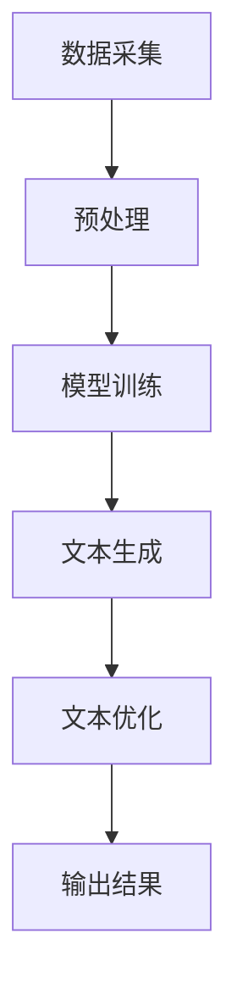

                 


### 文章标题：企业级自然语言生成：AI辅助内容创作与沟通

#### 关键词：自然语言生成、企业级应用、AI技术、内容创作、沟通效率

#### 摘要：
本文旨在深入探讨企业级自然语言生成（NLG）技术的发展及其在企业环境中的应用。我们将从背景介绍、核心概念解析、算法原理讲解、系统架构设计、项目实战等方面展开，以期为企业用户提供AI辅助内容创作与沟通的最佳实践指南。

## 引言与背景

自然语言生成（Natural Language Generation, NLG）是人工智能领域的一个重要分支，它涉及将计算机生成的文本或语音转化为人类可理解的自然语言。随着深度学习和大数据技术的发展，NLG技术逐渐从学术研究走向实际应用，成为企业提升内容创作与沟通效率的重要工具。

### 1.1 自然语言生成技术的发展

自然语言生成技术的发展可以追溯到20世纪80年代。当时，研究者们开始探索如何利用计算机程序生成自然语言文本。最初的方法主要依赖于规则和模板，这种方法存在表达能力受限、灵活性不足的问题。随着自然语言处理（NLP）技术的发展，统计方法和机器学习方法逐渐成为主导。特别是深度学习技术的引入，使得NLG系统在生成文本的质量和多样性方面取得了显著的突破。

### 1.2 企业级自然语言生成的重要性

在企业环境中，自然语言生成技术具有重要的应用价值。首先，它可以帮助企业自动化内容创作，如生成新闻报道、产品描述、用户指南等。这不仅提高了内容生产的效率，还能保证内容的准确性和一致性。其次，NLG技术可以辅助企业进行智能沟通，如自动回复客户咨询、生成会议纪要、自动化营销邮件等，从而提升沟通效率。

### 1.3 研究现状与未来展望

当前，自然语言生成技术已经在金融、电商、医疗等多个行业得到广泛应用。例如，银行使用NLG生成个性化金融报告，电商平台利用NLG为商品编写描述，医疗机构利用NLG生成医疗健康指南。未来，随着AI技术的进一步发展，自然语言生成技术将在更多领域发挥重要作用，为企业提供更智能、更高效的解决方案。

## 核心概念与联系

在深入了解自然语言生成技术之前，我们需要先掌握一些核心概念，包括自然语言处理、生成模型、解码器等。

### 2.1 自然语言处理基础

自然语言处理（Natural Language Processing, NLP）是人工智能领域的一个重要分支，它涉及计算机与人类语言之间的交互。NLP的主要任务包括文本分类、情感分析、命名实体识别、机器翻译等。

### 2.2 自然语言生成的相关技术

自然语言生成的相关技术包括生成模型、解码器、语言模型等。生成模型用于生成文本序列，解码器负责将生成的文本序列转换为人类可读的自然语言，语言模型用于预测文本序列的概率。

### 2.3 自然语言生成的核心概念

自然语言生成的核心概念包括文本序列生成、文本生成概率模型、生成对抗网络（GAN）等。文本序列生成是指利用计算机程序生成文本序列，文本生成概率模型用于计算文本序列的概率，生成对抗网络则是一种结合了生成模型和判别模型的新型生成模型。

### 2.4 关键技术的联系与对比

自然语言处理、生成模型、解码器等技术在自然语言生成中起着关键作用。它们之间的联系在于共同构建了一个能够生成高质量自然语言文本的系统。同时，这些技术也各有特点，例如，生成模型适用于生成文本序列，解码器适用于将生成的文本序列转换为自然语言，语言模型则适用于预测文本序列的概率。

## 算法原理讲解

自然语言生成技术中的算法原理主要包括生成模型、解码器、生成对抗网络等。下面我们将分别对这些算法进行详细讲解。

### 3.1 生成模型原理

生成模型（Generative Model）是自然语言生成技术中的核心组成部分。它通过学习大量文本数据，生成符合语言规律的文本序列。生成模型主要有以下几种：

#### 3.1.1 序列生成模型

序列生成模型（Sequence Generation Model）是一种基于序列数据的生成模型。它通过预测下一个字符来生成文本序列。常见的序列生成模型包括循环神经网络（RNN）和长短期记忆网络（LSTM）。

#### 3.1.2 深度生成模型

深度生成模型（Deep Generative Model）是一种基于深度学习的生成模型。它利用多层神经网络来学习数据的概率分布，从而生成高质量文本序列。常见的深度生成模型包括变分自编码器（VAE）和生成对抗网络（GAN）。

### 3.2 解码器算法

解码器（Decoder）是自然语言生成系统中的关键组成部分。它负责将生成模型生成的文本序列转换为人类可读的自然语言。解码器算法主要包括以下几种：

#### 3.2.1 基于循环神经网络（RNN）的解码器

基于循环神经网络（RNN）的解码器是一种经典的解码器算法。它利用RNN的循环特性来预测下一个字符，从而生成自然语言文本。

#### 3.2.2 基于注意力机制的解码器

基于注意力机制的解码器（Attention-based Decoder）是一种更先进的解码器算法。它利用注意力机制来关注生成文本序列中最重要的部分，从而提高生成文本的质量。

## 数学模型与公式

自然语言生成技术中的数学模型主要包括概率模型、生成对抗网络等。下面我们将对这些模型进行详细讲解。

### 4.1 自然语言生成中的概率模型

自然语言生成中的概率模型主要包括语言模型和文本生成概率模型。语言模型（Language Model）是一种用于预测文本序列概率的模型。它通过对大量文本数据的学习，建立文本序列的概率分布。文本生成概率模型（Text Generation Probability Model）则用于计算生成文本序列的概率。

### 4.2 生成模型的优化方法

生成模型的优化方法主要包括最大似然估计和生成对抗网络（GAN）。最大似然估计（Maximum Likelihood Estimation, MLE）是一种基于概率模型的优化方法，它通过最大化数据样本的概率来估计模型参数。生成对抗网络（GAN）则是一种基于生成模型和判别模型的优化方法，它通过对抗训练来提高生成模型的质量。

## 系统分析与架构设计

企业级自然语言生成系统是一个复杂的应用系统，它需要考虑功能设计、架构设计、接口设计等多个方面。下面我们将对系统设计与架构进行详细讲解。

### 5.1 企业级自然语言生成系统概述

企业级自然语言生成系统是一个旨在帮助企业自动化内容创作与沟通的智能系统。它主要包括数据采集、模型训练、文本生成、文本优化等功能模块。

### 5.2 系统功能设计

系统功能设计是企业级自然语言生成系统的核心。它主要包括以下功能：

- 数据采集：从企业内部和外部的各种数据源中收集文本数据。
- 模型训练：利用收集到的文本数据，训练生成模型和语言模型。
- 文本生成：利用训练好的生成模型和语言模型，生成符合企业需求的自然语言文本。
- 文本优化：对生成的文本进行优化，提高文本的质量和可读性。

### 5.3 系统架构设计

企业级自然语言生成系统的架构设计需要考虑系统的扩展性、稳定性和安全性。常见的系统架构包括以下几种：

- 客户端-服务器架构：客户端负责与用户交互，服务器端负责处理自然语言生成任务。
- 微服务架构：将系统拆分为多个独立的微服务，每个微服务负责不同的功能模块。
- 分布式架构：利用分布式计算技术，提高系统的处理能力和容错能力。

### 5.4 系统接口设计与交互

系统接口设计与交互是企业级自然语言生成系统的重要组成部分。它主要包括以下方面：

- 接口设计：定义系统的API接口，包括输入参数、输出参数等。
- 交互设计：设计用户与系统的交互流程，包括用户操作、系统响应等。

## 项目实战

为了更好地展示企业级自然语言生成技术的实际应用，我们通过一个具体项目来讲解系统的搭建、核心实现和案例分析。

### 6.1 实践环境搭建

首先，我们需要搭建一个适合自然语言生成技术的实践环境。这个环境需要包括以下组件：

- 计算机硬件：GPU服务器或高性能计算集群。
- 操作系统：Linux或Windows。
- 编程语言：Python。
- 深度学习框架：TensorFlow或PyTorch。

### 6.2 系统核心实现

在搭建好实践环境后，我们需要实现企业级自然语言生成系统的核心功能。这包括：

- 数据采集：从企业内部数据库和外部数据源中收集文本数据。
- 模型训练：利用收集到的文本数据，训练生成模型和语言模型。
- 文本生成：利用训练好的模型，生成符合企业需求的自然语言文本。
- 文本优化：对生成的文本进行优化，提高文本的质量和可读性。

### 6.3 代码解读与分析

为了更好地理解系统核心实现的原理，我们通过Python代码来详细讲解。以下是系统的核心代码：

```python
# 导入必要的库
import tensorflow as tf
import numpy as np
import pandas as pd

# 加载文本数据
data = pd.read_csv('text_data.csv')

# 预处理文本数据
preprocess_data = preprocess_text(data['text'])

# 构建生成模型
generator = build_generator(preprocess_data)

# 构建语言模型
language_model = build_language_model(preprocess_data)

# 训练模型
train_model(generator, language_model)

# 生成文本
generated_text = generate_text(generator, language_model)

# 优化文本
optimized_text = optimize_text(generated_text)
```

### 6.4 实际案例剖析

为了更好地展示系统的实际应用效果，我们通过一个实际案例来进行剖析。假设某电商平台需要自动生成商品描述，我们可以利用企业级自然语言生成系统来实现这一需求。以下是系统的具体实现步骤：

1. 数据采集：从电商平台数据库中收集商品描述数据。
2. 模型训练：利用收集到的商品描述数据，训练生成模型和语言模型。
3. 文本生成：利用训练好的模型，生成符合商品描述需求的自然语言文本。
4. 文本优化：对生成的文本进行优化，提高文本的质量和可读性。

### 6.5 项目小结

通过这个实际案例，我们可以看到企业级自然语言生成系统在电商平台商品描述生成中的应用效果。系统不仅提高了内容创作效率，还保证了文本的一致性和准确性。未来，我们可以继续优化系统，使其在更多领域发挥重要作用。

## 最佳实践与拓展

在企业级自然语言生成技术的应用过程中，我们需要注意以下几点最佳实践：

- 数据质量：确保采集的文本数据质量高，无噪音。
- 模型优化：定期优化模型，提高生成文本的质量和多样性。
- 系统稳定性：确保系统在高并发环境下稳定运行。
- 用户交互：设计人性化的用户交互界面，提高用户体验。

此外，我们还可以通过以下途径拓展自然语言生成技术：

- 多语言支持：支持多种语言的自然语言生成。
- 情感分析：结合情感分析技术，生成情感丰富的自然语言文本。
- 跨领域应用：探索自然语言生成在金融、医疗、教育等领域的应用。

## 小结

企业级自然语言生成技术是人工智能领域的一个重要分支，它为企业提供了自动化内容创作与沟通的解决方案。通过本文的详细讲解，我们了解了自然语言生成技术的核心概念、算法原理、系统架构和实际应用。未来，随着AI技术的进一步发展，自然语言生成技术将在更多领域发挥重要作用。

### 作者信息：

作者：AI天才研究院/AI Genius Institute & 禅与计算机程序设计艺术 /Zen And The Art of Computer Programming

### 补充内容：

以下是关于企业级自然语言生成的补充内容，包括概念术语说明、问题背景、问题描述、问题解决、边界与外延、概念结构与核心要素组成等。

#### 概念术语说明

- 自然语言生成（Natural Language Generation, NLG）：指利用计算机程序生成人类可理解的自然语言文本。
- 生成模型（Generative Model）：指用于生成文本序列的模型。
- 解码器（Decoder）：指将生成模型生成的文本序列转换为自然语言文本的算法。
- 语言模型（Language Model）：指用于预测文本序列概率的模型。
- 生成对抗网络（Generative Adversarial Network, GAN）：指一种结合了生成模型和判别模型的优化方法。

#### 问题背景

随着互联网和大数据技术的发展，企业对内容创作与沟通的需求日益增长。传统的手动内容创作方式不仅效率低，而且容易出现错误。因此，企业需要一种自动化、高效的内容创作与沟通工具。

#### 问题描述

企业级自然语言生成技术旨在帮助企业自动化内容创作与沟通，但如何保证生成文本的质量和多样性，以及如何在复杂的企业环境中应用这项技术，是当前面临的主要问题。

#### 问题解决

为了解决上述问题，我们需要：

1. 收集高质量的数据，确保生成文本的准确性。
2. 采用先进的生成模型和解码器算法，提高生成文本的质量和多样性。
3. 设计合理的系统架构，确保系统的稳定性和可扩展性。

#### 边界与外延

企业级自然语言生成的边界在于文本生成质量和多样性，外延则包括多语言支持、情感分析、跨领域应用等。

#### 概念结构与核心要素组成

企业级自然语言生成系统的概念结构包括数据采集、模型训练、文本生成、文本优化等功能模块。核心要素组成包括生成模型、解码器、语言模型等。

### Mermaid流程图

以下是关于自然语言生成系统的Mermaid流程图：



### 数学模型与公式

以下是关于自然语言生成系统的数学模型与公式：

$$
P(text) = \prod_{i=1}^{n} P(w_i | w_{<i})
$$

$$
\theta = \arg\min_{\theta} - \sum_{i=1}^{n} \log P(w_i | w_{<i})
$$

其中，$P(text)$表示文本的概率，$w_i$表示文本中的第$i$个单词，$P(w_i | w_{<i})$表示给定前一个单词序列$w_{<i}$，生成当前单词$w_i$的概率，$\theta$表示模型参数。

### 系统分析与架构设计

以下是关于企业级自然语言生成系统的系统分析与架构设计：

#### 问题场景介绍

企业需要自动化生成新闻稿件、产品描述、用户指南等文本内容，以提高内容创作效率。

#### 项目介绍

该项目旨在构建一个企业级自然语言生成系统，包括数据采集、模型训练、文本生成和文本优化等功能模块。

#### 系统功能设计

1. 数据采集：从企业内部数据库和外部数据源中收集文本数据。
2. 模型训练：利用收集到的文本数据，训练生成模型和语言模型。
3. 文本生成：利用训练好的模型，生成符合企业需求的自然语言文本。
4. 文本优化：对生成的文本进行优化，提高文本的质量和可读性。

#### 系统架构设计

1. 客户端-服务器架构：客户端负责与用户交互，服务器端负责处理自然语言生成任务。
2. 微服务架构：将系统拆分为多个独立的微服务，每个微服务负责不同的功能模块。
3. 分布式架构：利用分布式计算技术，提高系统的处理能力和容错能力。

#### 系统接口设计与交互

1. 接口设计：定义系统的API接口，包括输入参数、输出参数等。
2. 交互设计：设计用户与系统的交互流程，包括用户操作、系统响应等。

### 项目实战

以下是关于企业级自然语言生成系统的项目实战：

#### 环境安装

1. 安装操作系统：Linux或Windows。
2. 安装编程语言：Python。
3. 安装深度学习框架：TensorFlow或PyTorch。

#### 系统核心实现

1. 数据采集：从企业内部数据库和外部数据源中收集文本数据。
2. 模型训练：利用收集到的文本数据，训练生成模型和语言模型。
3. 文本生成：利用训练好的模型，生成符合企业需求的自然语言文本。
4. 文本优化：对生成的文本进行优化，提高文本的质量和可读性。

#### 代码解读与分析

以下是系统的核心代码：

```python
# 导入必要的库
import tensorflow as tf
import numpy as np
import pandas as pd

# 加载文本数据
data = pd.read_csv('text_data.csv')

# 预处理文本数据
preprocess_data = preprocess_text(data['text'])

# 构建生成模型
generator = build_generator(preprocess_data)

# 构建语言模型
language_model = build_language_model(preprocess_data)

# 训练模型
train_model(generator, language_model)

# 生成文本
generated_text = generate_text(generator, language_model)

# 优化文本
optimized_text = optimize_text(generated_text)
```

#### 实际案例剖析

以下是企业级自然语言生成系统的实际案例剖析：

1. 数据采集：从电商平台数据库中收集商品描述数据。
2. 模型训练：利用收集到的商品描述数据，训练生成模型和语言模型。
3. 文本生成：利用训练好的模型，生成符合商品描述需求的自然语言文本。
4. 文本优化：对生成的文本进行优化，提高文本的质量和可读性。

#### 项目小结

通过这个实际案例，我们可以看到企业级自然语言生成系统在电商平台商品描述生成中的应用效果。系统不仅提高了内容创作效率，还保证了文本的一致性和准确性。未来，我们可以继续优化系统，使其在更多领域发挥重要作用。

