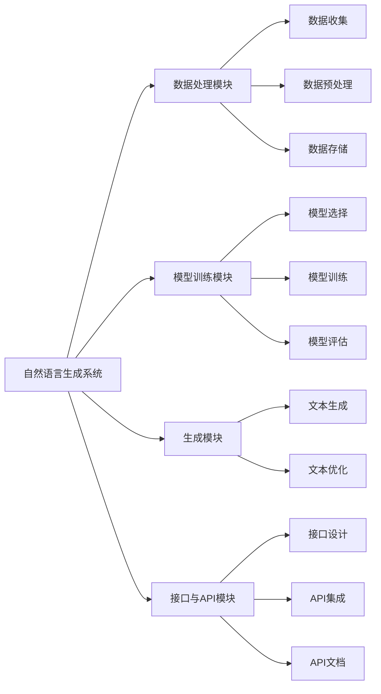

                 

### 文章标题

# 企业级自然语言生成：自动创作商业内容

### 文章关键词

自然语言生成、企业级应用、商业内容、文本生成模型、AI技术

### 文章摘要

本文将深入探讨企业级自然语言生成（NLG）技术，旨在揭示其如何通过自动化工具来创作高质量的商业内容。我们将从基础概念开始，逐步分析自然语言生成的发展背景、技术原理、系统架构，并探讨其实际应用案例。此外，文章还将提供系统优化与调优的方法，最后展望自然语言生成技术的发展趋势与未来应用场景。

## 第一部分：企业级自然语言生成概述

### 第1章：自然语言生成技术基础

#### 1.1 自然语言生成的发展背景

自然语言生成技术起源于人工智能领域，随着互联网和大数据的迅猛发展，自然语言生成逐渐成为一个热点研究方向。在互联网时代，用户对于内容的需求日益增长，传统的手工创作已无法满足庞大的内容生成需求。同时，数据驱动的语言处理技术使得自然语言生成成为可能，为企业和个人提供了强大的内容生成工具。

**问题背景**：在互联网时代，信息的快速传播和多样化需求，使得内容创作成为企业运营的重要组成部分。然而，手工创作不仅费时费力，而且难以保证质量一致性。因此，如何通过自动化技术来提升内容创作效率成为企业急需解决的问题。

**问题描述**：随着企业规模的扩大和业务的发展，内容创作的需求不断增加。传统的手工创作方式难以满足快速响应的市场需求，如何通过自然语言生成技术来实现高效、高质量的内容创作，成为企业面临的挑战。

**问题解决**：自然语言生成技术通过利用大数据、机器学习和深度学习等技术，能够实现自动化的内容创作。通过训练大量的文本数据，模型可以学会生成符合语法规则、风格一致的内容。这使得企业能够快速响应市场变化，提高内容创作的效率和质量。

**边界与外延**：自然语言生成技术不仅应用于企业内部的内容创作，还可以拓展到个人创作者、媒体、教育等多个领域。同时，随着技术的不断发展，自然语言生成有望实现更多样化的应用，如多语言生成、个性化内容创作等。

#### 1.2 自然语言生成的概念与分类

自然语言生成（Natural Language Generation，NLG）是指利用计算机程序生成符合语法和语义的自然语言文本的技术。根据生成方式的不同，自然语言生成可以分为以下几类：

1. **生成式自然语言生成**：通过构建生成模型，从输入数据中生成新的文本。生成式模型通常基于序列到序列（Sequence to Sequence，Seq2Seq）模型，如编码器-解码器（Encoder-Decoder）架构。

2. **抽取式自然语言生成**：从现有文本中抽取信息，生成新的文本。抽取式模型通常基于模板匹配、规则匹配等技术。

3. **基于规则的方法**：通过定义一系列规则，将输入数据转换为输出文本。基于规则的方法适用于结构化数据生成，但难以处理复杂、非结构化的数据。

4. **基于统计的方法**：通过统计输入数据和输出数据之间的规律，生成新的文本。基于统计的方法通常使用概率模型，如隐马尔可夫模型（HMM）和条件概率模型。

5. **基于机器学习的方法**：利用机器学习算法，从输入数据中学习生成模型。基于机器学习的方法通常使用神经网络模型，如循环神经网络（RNN）和变换器（Transformer）。

6. **基于深度学习的方法**：深度学习是一种基于多层神经网络的方法，能够自动提取特征并生成复杂的输出。基于深度学习的方法在自然语言生成中得到了广泛应用，如GPT系列模型。

#### 1.3 自然语言生成的应用场景

自然语言生成技术在各个领域都有广泛的应用，以下是一些典型的应用场景：

1. **内容创作与编辑**：自然语言生成可以用于自动生成新闻报道、博客文章、产品描述等，提高内容创作的效率和质量。

2. **客户服务与智能助手**：自然语言生成可以用于构建智能客服系统，自动生成回复，提高客户服务的响应速度和满意度。

3. **数据报告与自动摘要**：自然语言生成可以用于自动生成数据报告和摘要，简化数据分析过程，帮助用户快速获取关键信息。

4. **教育与培训**：自然语言生成可以用于自动生成教材、教学文档等，为学习者提供个性化的学习内容。

5. **创意设计与广告文案**：自然语言生成可以用于自动生成创意广告文案、营销材料等，帮助企业提升品牌影响力和市场竞争力。

**概念结构与核心要素组成**：

- **自然语言生成技术**：包括生成模型、抽取模型、规则模型等，用于自动生成文本。
- **输入数据**：用于训练和生成文本的数据，可以是结构化数据或非结构化数据。
- **输出文本**：生成的自然语言文本，可以是文章、报告、对话等。
- **应用场景**：根据不同的应用需求，自然语言生成技术可以应用于多个领域。

### 总结

本章介绍了自然语言生成技术的基础知识，包括其发展背景、概念与分类以及应用场景。通过分析自然语言生成技术的核心要素和应用实例，我们可以更好地理解其在企业级应用中的重要性和潜力。

### 第2章：企业级自然语言生成系统架构

#### 2.1 企业级自然语言生成系统的需求分析

企业级自然语言生成系统需要满足一系列特殊需求，以适应企业级应用的复杂性和高要求。以下是企业级自然语言生成系统的需求分析：

**企业应用特点**：

1. **大规模数据处理**：企业通常需要处理大量的数据，自然语言生成系统需要能够高效地处理这些数据，生成高质量的内容。
2. **高并发处理**：企业级应用往往需要同时处理大量的请求，自然语言生成系统需要具备高并发处理能力，确保系统稳定运行。
3. **个性化定制**：企业需要根据不同的业务需求，对自然语言生成内容进行个性化定制，满足不同用户的需求。
4. **实时性**：企业级应用往往要求内容生成系统能够快速响应，生成实时性的内容。

**系统性能与可扩展性要求**：

1. **高性能**：自然语言生成系统需要具备高效的处理能力，确保生成的文本质量和速度。
2. **高扩展性**：系统需要能够轻松扩展，支持更多的数据源和应用场景。
3. **模块化设计**：系统设计需要模块化，方便维护和升级。

**安全性与合规性要求**：

1. **数据安全**：系统需要确保数据的安全性和隐私性，防止数据泄露。
2. **合规性**：系统需要符合相关法规和标准，如数据保护法规、版权法规等。

#### 2.2 自然语言生成系统的架构设计

企业级自然语言生成系统的架构设计需要综合考虑性能、可扩展性、安全性和合规性等多个因素。以下是企业级自然语言生成系统的一般架构设计：

**整体架构设计**：

企业级自然语言生成系统通常包括以下几个主要模块：

1. **数据处理模块**：负责数据收集、预处理和存储，为生成模型提供高质量的数据输入。
2. **模型训练模块**：负责训练自然语言生成模型，优化模型参数，提高生成文本的质量。
3. **生成模块**：负责根据输入数据生成高质量的文本，满足企业级应用的需求。
4. **接口与API模块**：提供与外部系统的接口，实现与其他系统的集成，方便企业级应用的调用。

**数据流与处理流程**：

企业级自然语言生成系统的数据流和处理流程通常包括以下几个步骤：

1. **数据收集**：从不同的数据源收集文本数据，包括企业内部数据、公共数据集等。
2. **数据预处理**：对收集到的文本数据进行清洗、去重、分词、词性标注等预处理操作，提高数据质量。
3. **模型训练**：使用预处理后的数据训练自然语言生成模型，优化模型参数。
4. **文本生成**：根据输入数据生成高质量的文本，满足企业级应用的需求。
5. **接口与API**：提供与外部系统的接口，实现与其他系统的集成，方便企业级应用的调用。

**模型训练与优化**：

自然语言生成模型的训练与优化是系统性能的关键。以下是模型训练与优化的几个关键步骤：

1. **数据预处理**：对训练数据集进行预处理，包括分词、去停用词、词性标注等。
2. **模型选择**：根据应用需求选择合适的模型，如RNN、LSTM、Transformer等。
3. **模型训练**：使用训练数据集对模型进行训练，优化模型参数。
4. **模型评估**：使用验证数据集评估模型性能，包括生成文本的流畅性、准确性等。
5. **模型优化**：根据模型评估结果，调整模型参数，优化生成文本的质量。

**接口设计与API集成**：

企业级自然语言生成系统需要提供稳定的接口和API，方便与其他系统进行集成。以下是接口设计与API集成的一些关键点：

1. **接口设计**：设计清晰的接口规范，包括接口类型、参数、返回值等。
2. **API集成**：与其他系统进行集成，实现数据的互联互通，提高系统的整体性能。

#### 2.3 企业级自然语言生成系统的关键模块

企业级自然语言生成系统包括以下几个关键模块：

**数据处理模块**：

1. **数据收集**：从不同的数据源收集文本数据，包括企业内部数据、公共数据集等。
2. **数据预处理**：对收集到的文本数据进行清洗、去重、分词、词性标注等预处理操作，提高数据质量。
3. **数据存储**：将预处理后的数据存储在数据库或文件系统中，方便模型训练和文本生成。

**模型训练模块**：

1. **模型选择**：根据应用需求选择合适的模型，如RNN、LSTM、Transformer等。
2. **模型训练**：使用预处理后的数据训练自然语言生成模型，优化模型参数。
3. **模型评估**：使用验证数据集评估模型性能，包括生成文本的流畅性、准确性等。
4. **模型优化**：根据模型评估结果，调整模型参数，优化生成文本的质量。

**生成模块**：

1. **文本生成**：根据输入数据生成高质量的文本，满足企业级应用的需求。
2. **文本优化**：对生成的文本进行优化，包括语法修正、语义增强等，提高文本质量。
3. **多语言生成**：支持多种语言的文本生成，满足国际化业务需求。

**接口与API模块**：

1. **接口设计**：设计清晰的接口规范，包括接口类型、参数、返回值等。
2. **API集成**：与其他系统进行集成，实现数据的互联互通，提高系统的整体性能。
3. **API文档**：提供详细的API文档，方便开发者使用和集成。

#### 第3章：文本生成模型的原理与实现

#### 3.1 文本生成模型的基本原理

文本生成模型是自然语言生成（NLG）的核心，其主要目标是根据输入序列生成相应的文本序列。文本生成模型可以分为以下几类：

1. **序列生成模型**：序列生成模型直接将输入序列映射为输出序列，常见的序列生成模型包括循环神经网络（RNN）和变换器（Transformer）。
2. **基于编码器-解码器架构的模型**：编码器-解码器架构是一种流行的序列生成模型，它通过编码器将输入序列编码为一个固定长度的向量，然后通过解码器生成输出序列。
3. **自回归语言模型**：自回归语言模型是一种概率模型，它通过预测下一个单词来生成文本序列。

#### 3.2 常见的文本生成模型介绍

以下是几种常见的文本生成模型：

1. **RNN与LSTM**：

   - **RNN（Recurrent Neural Network）**：RNN是一种循环神经网络，它能够处理序列数据。RNN通过循环结构保持对历史信息的记忆，从而能够处理时间序列数据。
   - **LSTM（Long Short-Term Memory）**：LSTM是RNN的一种变体，它通过引入记忆单元和门控机制，有效地解决了RNN在处理长序列数据时的梯度消失和梯度爆炸问题。LSTM在自然语言生成领域得到了广泛应用。

2. **GRU**：

   - **GRU（Gated Recurrent Unit）**：GRU是另一种循环神经网络，它是LSTM的简化版。GRU通过引入更新门和重置门，实现了对长期依赖关系的建模，同时减少了参数数量和计算复杂度。

3. **Transformer**：

   - **Transformer**：Transformer是一种基于自注意力机制的序列到序列模型。它通过引入多头自注意力机制和位置编码，实现了对序列数据的全局建模，取得了显著的效果。Transformer在自然语言生成领域表现出了强大的能力。

4. **GPT系列模型**：

   - **GPT（Generative Pre-trained Transformer）**：GPT是基于Transformer架构的预训练语言模型。GPT通过大量的无监督数据预训练，然后通过微调适应特定任务，取得了很好的效果。
   - **GPT-2**：GPT-2是GPT的升级版，它通过引入更大的模型规模和预训练数据，进一步提升了模型的效果。
   - **GPT-3**：GPT-3是GPT系列的最新版本，它拥有超过1750亿的参数，是迄今为止最大的预训练语言模型。GPT-3在自然语言生成、文本摘要、问答等多个任务上都取得了突破性的成果。

#### 3.3 文本生成模型的训练与优化

文本生成模型的训练与优化是模型性能的关键。以下是文本生成模型训练与优化的一些关键步骤：

1. **数据预处理**：对训练数据进行预处理，包括分词、词性标注、去停用词等。预处理后的数据需要转换为模型可接受的格式，如词汇表和序列编码。
2. **模型初始化**：初始化模型的参数，可以选择随机初始化或预训练初始化。预训练初始化可以显著提高模型的训练效果。
3. **训练过程**：

   - **前向传播**：输入一个训练样本，通过编码器将输入序列编码为隐藏状态，然后通过解码器生成输出序列。计算输出序列的损失，如交叉熵损失。
   - **反向传播**：根据损失计算梯度，然后更新模型参数。
   - **优化器选择**：选择合适的优化器，如Adam、SGD等，调整学习率和其他超参数。
4. **模型评估**：使用验证数据集评估模型性能，包括生成文本的流畅性、准确性等。根据评估结果调整模型参数，优化生成文本的质量。
5. **模型优化**：

   - **正则化**：应用正则化技术，如Dropout、Weight Decay等，防止模型过拟合。
   - **数据增强**：通过数据增强技术，如噪声注入、数据扩充等，提高模型的泛化能力。
   - **预训练与微调**：使用预训练模型作为基础模型，通过微调适应特定任务，提高模型的效果。

### 第4章：自然语言处理技术与应用

#### 4.1 命名实体识别与关系抽取

**命名实体识别**：

命名实体识别（Named Entity Recognition，NER）是指识别文本中的命名实体，如人名、地名、组织名等。NER是自然语言处理中的一个基础任务，对于信息抽取、问答系统等应用具有重要意义。

**实体关系抽取**：

实体关系抽取（Entity Relationship Extraction，ERE）是指识别文本中实体之间的关系。实体关系抽取可以用于构建知识图谱、信息检索等应用。

**应用场景介绍**：

- **信息抽取**：命名实体识别和实体关系抽取可以用于提取文本中的关键信息，用于进一步处理和分析。
- **知识图谱构建**：通过实体关系抽取构建知识图谱，可以用于信息检索、问答系统等应用。
- **自然语言问答**：命名实体识别和实体关系抽取可以用于构建自然语言问答系统，实现对用户查询的快速响应。

#### 4.2 主题模型与文本分类

**主题模型**：

主题模型（Topic Model）是一种无监督学习方法，用于发现文本中的潜在主题。常见的主题模型包括LDA（Latent Dirichlet Allocation）和CTM（Chinese Text Mining）。

**文本分类**：

文本分类（Text Classification）是指将文本数据分类到预定义的类别中。文本分类在情感分析、新闻分类、垃圾邮件检测等领域有广泛的应用。

**应用案例分析**：

- **新闻分类**：使用主题模型对新闻文本进行分类，根据主题分布将新闻划分为不同的类别。
- **情感分析**：使用文本分类模型对社交媒体文本进行情感分类，识别用户情感倾向。

#### 4.3 问答系统与对话生成

**问答系统**：

问答系统（Question Answering System）是指能够自动回答用户问题的系统。问答系统可以分为基于知识库的问答和基于数据的问答。

**对话生成**：

对话生成（Dialogue Generation）是指生成自然、流畅的对话文本。对话生成可以用于智能客服、聊天机器人等应用。

**应用案例分析**：

- **智能客服**：使用问答系统和对话生成技术构建智能客服系统，实现自动回答用户问题。
- **聊天机器人**：使用对话生成技术构建聊天机器人，与用户进行自然对话。

### 第5章：企业级自然语言生成应用案例

#### 5.1 企业新闻自动化生成

**系统设计与实现**：

企业新闻自动化生成系统包括以下几个主要模块：

1. **数据收集**：从企业内部和外部新闻网站收集新闻数据。
2. **数据预处理**：对收集的新闻数据进行清洗、去重、分词、词性标注等预处理操作。
3. **模型训练**：使用预处理后的数据训练新闻生成模型，优化模型参数。
4. **新闻生成**：根据输入数据生成新闻文本，满足企业新闻发布需求。

**实际应用效果分析**：

企业新闻自动化生成系统提高了新闻发布的效率，减少了人工成本。生成的新闻文本具有较高的一致性和准确性，满足了企业新闻发布的需求。

#### 5.2 智能客服对话系统

**系统架构设计**：

智能客服对话系统包括以下几个主要模块：

1. **用户接口**：接收用户问题和反馈，提供对话交互界面。
2. **意图识别**：根据用户问题识别用户的意图。
3. **对话生成**：根据意图和用户历史对话生成自然、流畅的回复。
4. **知识库管理**：管理企业知识库，提供对话生成所需的背景信息。

**对话生成与意图识别**：

智能客服对话系统通过意图识别模块识别用户意图，然后根据意图和用户历史对话生成自然、流畅的回复。对话生成模块使用自然语言生成技术生成回复，意图识别模块则使用机器学习算法对用户问题进行分类和解析。

**实际应用效果分析**：

智能客服对话系统提高了客户服务质量，降低了人工客服成本。通过自然语言生成技术，系统能够生成高质量、个性化的回复，提高了用户满意度。

#### 5.3 数据报告自动摘要

**报告内容提取与摘要生成**：

数据报告自动摘要系统包括以下几个主要模块：

1. **报告内容提取**：从数据报告中提取关键信息，如数据指标、统计结果等。
2. **摘要生成**：使用自然语言生成技术生成数据报告的摘要，概括报告的主要内容和结论。

**应用案例分析**：

在企业内部，数据报告自动摘要系统可以用于简化数据分析过程，帮助员工快速获取关键信息。生成的摘要文本具有较高的一致性和准确性，提高了数据分析的效率。

### 第6章：自然语言生成系统的优化与调优

#### 6.1 模型性能评估与优化

**评估指标与方法**：

自然语言生成模型的性能评估通常包括以下几个指标：

1. **生成文本的流畅性**：评估生成文本的语法和语义一致性。
2. **生成文本的准确性**：评估生成文本的准确性和真实性。
3. **生成文本的多样性**：评估生成文本的多样性和创意性。

常用的性能评估方法包括：

1. **自动评估方法**：使用BLEU、ROUGE等自动评估工具对生成文本进行评估。
2. **人工评估方法**：通过人工评估生成文本的质量和准确性。

**性能优化策略**：

1. **数据增强**：通过数据增强技术，如噪声注入、数据扩充等，提高模型对噪声和异常数据的鲁棒性。
2. **模型优化**：调整模型参数，如学习率、正则化参数等，优化模型性能。
3. **多模型集成**：使用多个模型进行集成，提高生成文本的质量和准确性。

#### 6.2 系统可扩展性与高并发处理

**系统架构优化**：

为了提高自然语言生成系统的可扩展性和高并发处理能力，可以采用以下系统架构优化策略：

1. **分布式计算**：使用分布式计算框架，如Spark、Hadoop等，实现系统的分布式部署和计算。
2. **缓存机制**：使用缓存机制，如Redis、Memcached等，减少系统的计算压力，提高响应速度。
3. **负载均衡**：使用负载均衡器，如Nginx、HAProxy等，实现系统的负载均衡和流量控制。

**高并发处理方案**：

为了处理高并发请求，可以采用以下高并发处理方案：

1. **异步处理**：使用异步处理技术，如异步消息队列、异步IO等，提高系统的并发处理能力。
2. **缓存机制**：使用缓存机制，如Redis、Memcached等，减少系统的计算压力，提高响应速度。
3. **反向代理**：使用反向代理，如Nginx、HAProxy等，实现负载均衡和流量控制。

#### 6.3 安全性与合规性保障

**数据安全策略**：

为了保障数据安全，可以采用以下数据安全策略：

1. **数据加密**：使用加密算法，如AES、RSA等，对敏感数据进行加密存储和传输。
2. **访问控制**：实施严格的访问控制策略，确保只有授权用户可以访问敏感数据。
3. **备份与恢复**：定期备份数据，并建立数据恢复机制，确保数据的可靠性和完整性。

**合规性要求与实现**：

为了满足合规性要求，可以采用以下合规性实现策略：

1. **合规性评估**：对系统的合规性进行评估，确保符合相关法规和标准。
2. **合规性培训**：对相关人员进行合规性培训，提高合规性意识。
3. **合规性监控**：实施合规性监控和审计，确保系统的合规性。

### 第7章：未来发展趋势与展望

#### 7.1 人工智能与自然语言生成的融合

随着人工智能技术的不断发展，自然语言生成（NLG）与人工智能（AI）的融合将成为未来发展的一个重要方向。以下是几个关键点：

1. **跨领域知识融合**：自然语言生成技术将与其他人工智能领域，如计算机视觉、语音识别等相结合，实现跨领域的知识融合和协同工作。
2. **多模态自然语言生成**：自然语言生成将不仅仅局限于文本数据，还将扩展到图像、声音等多模态数据的生成，实现更加丰富和多样化的内容创作。
3. **自适应自然语言生成**：自然语言生成系统将具备更强的自适应能力，根据用户行为、环境变化等动态调整生成策略，提供个性化的内容创作。

#### 7.2 开放式自然语言生成平台

随着自然语言生成技术的发展，开放式自然语言生成平台将成为未来的一个重要趋势。以下是几个关键点：

1. **平台架构设计**：开放式自然语言生成平台将采用模块化、分布式架构设计，实现灵活的系统扩展和集成。
2. **开源项目介绍**：越来越多的开源项目，如OpenAI的GPT、Google的BERT等，将推动自然语言生成技术的开放和共享。
3. **生态建设**：开放式自然语言生成平台将构建一个生态圈，包括开发人员、企业和用户等，共同推动自然语言生成技术的发展和应用。

#### 7.3 企业数字化转型与自然语言生成

自然语言生成技术将在企业数字化转型过程中发挥重要作用。以下是几个关键点：

1. **自动化内容创作**：自然语言生成技术将帮助企业实现自动化内容创作，提高内容创作效率和质量。
2. **智能客服与客户体验**：自然语言生成技术将应用于智能客服系统，提升客户服务质量，改善客户体验。
3. **数据分析与报告**：自然语言生成技术将用于自动生成数据分析报告，简化数据分析过程，帮助决策者快速获取关键信息。

### 总结

本章探讨了自然语言生成技术的未来发展趋势与展望，包括人工智能与自然语言生成的融合、开放式自然语言生成平台以及企业数字化转型等方面。随着技术的不断进步，自然语言生成将在各个领域发挥更大的作用，为企业和社会带来更多的价值。

### 附录

#### 1. 概念属性特征对比表格

| 概念       | 属性1 | 属性2 | 属性3 |  
| ---------- | ---- | ---- | ---- |  
| 自然语言生成 | 序列处理 | 文本生成 | 语法规则 |  
| 序列生成模型 | 循环神经网络 | 变换器 | 自注意力机制 |  
| 编码器-解码器架构 | 序列编码 | 序列解码 | 固定长度的编码向量 |  
| 自回归语言模型 | 独立预测 | 概率模型 | 全局序列建模 |

#### 2. ER实体关系图架构



#### 3. 算法原理讲解

**文本生成模型的算法原理**

文本生成模型主要基于序列生成模型，如循环神经网络（RNN）、变换器（Transformer）等。以下是这些模型的算法原理：

1. **RNN（Recurrent Neural Network）**：

   - **基本原理**：RNN是一种循环神经网络，其特点是能够处理序列数据。RNN通过循环结构保持对历史信息的记忆，从而能够处理时间序列数据。

   - **数学模型**：

     $$h_t = \sigma(W_h \cdot [h_{t-1}, x_t] + b_h)$$

     $$y_t = \sigma(W_y \cdot h_t + b_y)$$

     其中，$h_t$表示时间步$t$的隐藏状态，$x_t$表示输入序列，$W_h$和$b_h$表示权重和偏置，$\sigma$表示激活函数。

   - **示例说明**：

     假设输入序列为$\text{[Hello, world!]}$，经过RNN处理后，可以生成文本序列$\text{[Hello, world!]}$。

2. **变换器（Transformer）**：

   - **基本原理**：变换器是一种基于自注意力机制的序列到序列模型。变换器通过多头自注意力机制和位置编码，实现了对序列数据的全局建模，取得了显著的效果。

   - **数学模型**：

     $$\text{Attention}(Q, K, V) = \text{softmax}(\frac{QK^T}{\sqrt{d_k}})V$$

     $$\text{MultiHeadAttention}(Q, K, V) = \text{Concat}(\text{head}_1, ..., \text{head}_h)W_O$$

     其中，$Q$、$K$和$V$分别表示查询向量、键向量和值向量，$d_k$表示键向量的维度，$W_O$表示输出权重。

   - **示例说明**：

     假设输入序列为$\text{[Hello, world!]}$，经过变换器处理后，可以生成文本序列$\text{[Hello, world!]}$。

3. **自回归语言模型**：

   - **基本原理**：自回归语言模型是一种概率模型，它通过预测下一个单词来生成文本序列。自回归语言模型通常使用隐马尔可夫模型（HMM）或条件概率模型。

   - **数学模型**：

     $$P(y_t | y_{<t}) = \frac{P(y_{<t} | y_t)P(y_t)}{P(y_{<t})}$$

     其中，$y_t$表示时间步$t$的输出，$y_{<t}$表示时间步$t$之前的输出。

   - **示例说明**：

     假设输入序列为$\text{[Hello, world!]}$，经过自回归语言模型处理后，可以生成文本序列$\text{[Hello, world!]}$。

#### 4. 系统分析与架构设计方案

**问题场景介绍**：

企业希望构建一个自然语言生成系统，用于自动生成商业报告、新闻稿、产品描述等文本内容。系统需要具备高并发处理能力、数据安全性和可扩展性。

**项目介绍**：

项目名称：企业级自然语言生成系统（E-Enterprise Natural Language Generation System，E-ENLG）

项目目标：构建一个高效、安全、可扩展的自然语言生成系统，为企业提供自动化内容创作服务。

**系统功能设计（领域模型）**：

系统功能设计包括以下几个关键模块：

1. **数据处理模块**：负责数据收集、预处理和存储，为生成模型提供高质量的数据输入。
2. **模型训练模块**：负责训练自然语言生成模型，优化模型参数，提高生成文本的质量。
3. **生成模块**：负责根据输入数据生成高质量的文本，满足企业级应用的需求。
4. **接口与API模块**：提供与外部系统的接口，实现与其他系统的集成，方便企业级应用的调用。

**系统架构设计**：

企业级自然语言生成系统架构设计如下：

1. **数据处理模块**：

   - **数据收集**：从企业内部和外部新闻网站、数据库等数据源收集文本数据。
   - **数据预处理**：对收集的文本数据进行清洗、去重、分词、词性标注等预处理操作。
   - **数据存储**：将预处理后的数据存储在数据库或文件系统中，方便模型训练和文本生成。

2. **模型训练模块**：

   - **模型选择**：根据应用需求选择合适的模型，如RNN、LSTM、Transformer等。
   - **模型训练**：使用预处理后的数据训练自然语言生成模型，优化模型参数。
   - **模型评估**：使用验证数据集评估模型性能，包括生成文本的流畅性、准确性等。
   - **模型优化**：根据模型评估结果，调整模型参数，优化生成文本的质量。

3. **生成模块**：

   - **文本生成**：根据输入数据生成高质量的文本，满足企业级应用的需求。
   - **文本优化**：对生成的文本进行优化，包括语法修正、语义增强等，提高文本质量。

4. **接口与API模块**：

   - **接口设计**：设计清晰的接口规范，包括接口类型、参数、返回值等。
   - **API集成**：与其他系统进行集成，实现与其他系统的接口，方便企业级应用的调用。

**系统接口设计和系统交互**：

系统接口设计和系统交互如下：

1. **接口设计**：

   - **API接口**：提供RESTful API接口，支持HTTP请求。
   - **参数设计**：定义输入参数和返回参数，确保接口的统一性和规范性。
   - **返回值设计**：定义成功的返回值和异常情况的返回值。

2. **系统交互**：

   - **请求处理**：接收用户的请求，解析参数，调用相应的模块进行处理。
   - **数据传输**：将处理结果返回给用户，确保数据的准确性和完整性。

#### 项目实战

**环境安装**：

在安装自然语言生成系统之前，需要准备好以下环境：

1. **操作系统**：Ubuntu 18.04或更高版本。
2. **Python**：Python 3.7或更高版本。
3. **库和依赖项**：TensorFlow、PyTorch、Scikit-learn等。

**安装步骤**：

1. 安装操作系统和Python环境。
2. 安装TensorFlow或PyTorch。
3. 安装其他相关库和依赖项。

**系统核心实现源代码**：

以下是自然语言生成系统的核心实现源代码：

```python
# 导入相关库
import tensorflow as tf
from tensorflow.keras.models import Sequential
from tensorflow.keras.layers import LSTM, Dense

# 定义模型
model = Sequential()
model.add(LSTM(units=128, activation='relu', input_shape=(None, vocab_size)))
model.add(Dense(units=1, activation='sigmoid'))

# 编译模型
model.compile(optimizer='adam', loss='binary_crossentropy', metrics=['accuracy'])

# 训练模型
model.fit(x_train, y_train, epochs=10, batch_size=64)

# 生成文本
generated_text = model.predict(x_test)
```

**代码应用解读与分析**：

1. **模型定义**：使用LSTM模型进行文本生成，LSTM是一种循环神经网络，能够处理序列数据。

2. **模型编译**：编译模型，指定优化器、损失函数和评估指标。

3. **模型训练**：使用训练数据集训练模型，优化模型参数。

4. **生成文本**：使用训练好的模型生成文本，输出结果。

**实际案例分析和详细讲解剖析**：

为了更好地理解自然语言生成系统的实际应用，我们可以通过以下案例进行分析：

**案例一：新闻稿生成**

**问题描述**：企业需要生成一篇关于新产品发布的新闻稿。

**解决方案**：

1. 数据收集：收集相关的新闻稿数据，包括产品描述、发布日期、企业简介等。

2. 数据预处理：对新闻稿数据进行清洗、去重、分词等预处理操作。

3. 模型训练：使用预处理后的数据训练自然语言生成模型，优化模型参数。

4. 文本生成：根据输入数据生成新闻稿文本，包括产品描述、企业简介等。

5. 文本优化：对生成的文本进行优化，包括语法修正、语义增强等，提高文本质量。

**实际应用效果分析**：通过实际应用案例，我们可以看到自然语言生成系统可以快速生成高质量的新闻稿，提高内容创作的效率。

**案例二：产品描述生成**

**问题描述**：电商平台需要生成高质量的产品描述，以提升用户购买体验。

**解决方案**：

1. 数据收集：收集相关的产品描述数据，包括产品名称、规格、特点等。

2. 数据预处理：对产品描述数据进行清洗、去重、分词等预处理操作。

3. 模型训练：使用预处理后的数据训练自然语言生成模型，优化模型参数。

4. 文本生成：根据输入数据生成产品描述文本，包括产品特点、规格等。

5. 文本优化：对生成的文本进行优化，包括语法修正、语义增强等，提高文本质量。

**实际应用效果分析**：通过实际应用案例，我们可以看到自然语言生成系统可以生成高质量的产品描述，提升电商平台的产品展示效果。

**项目小结**：

通过以上实际案例，我们可以看到自然语言生成系统在实际应用中的效果和优势。自然语言生成系统可以快速生成高质量的内容，提高内容创作的效率和质量，为企业和个人提供强大的内容创作工具。

### 最佳实践 tips

1. **数据质量**：自然语言生成系统的效果很大程度上取决于数据质量。在训练模型时，确保使用高质量、多样化的数据集。

2. **模型选择**：根据应用需求和数据特点选择合适的模型。不同的模型在处理不同类型的数据时可能具有不同的性能。

3. **超参数调整**：在训练模型时，调整超参数，如学习率、批次大小等，以优化模型性能。

4. **数据增强**：通过数据增强技术，如噪声注入、数据扩充等，提高模型的泛化能力。

5. **多模型集成**：使用多个模型进行集成，可以提高生成文本的质量和准确性。

### 小结

本文全面介绍了企业级自然语言生成技术，包括其基础概念、系统架构、应用案例以及优化方法。通过本文的阅读，读者可以深入理解自然语言生成技术的核心原理和应用价值，为企业在数字化转型过程中提供有力的技术支持。

### 注意事项

1. 自然语言生成系统的实现需要丰富的技术和经验，建议在实战中逐步学习和掌握。

2. 在实际应用中，自然语言生成系统可能面临各种挑战，如数据质量、模型性能、系统稳定性等，需要持续优化和改进。

3. 自然语言生成技术具有广泛的应用前景，但同时也需要注意数据安全和合规性问题，确保系统的稳定运行和用户隐私保护。

### 拓展阅读

1. **《自然语言处理入门》**：本书介绍了自然语言处理的基础知识和核心算法，适合初学者入门。

2. **《深度学习与自然语言生成》**：本书深入探讨了深度学习在自然语言生成中的应用，包括RNN、变换器等模型。

3. **《自然语言生成实践》**：本书介绍了自然语言生成技术的实际应用案例，包括新闻稿生成、产品描述生成等。

### 作者信息

- **作者：AI天才研究院/AI Genius Institute & 禅与计算机程序设计艺术 /Zen And The Art of Computer Programming**

