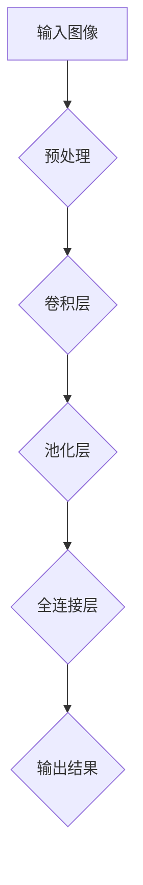
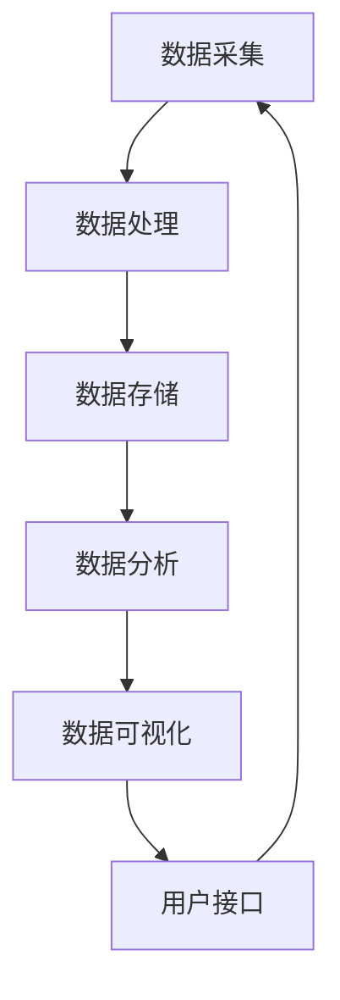

                 

### 文章标题

# 企业级视觉智能平台：深度解析图像数据

> 关键词：企业级视觉智能平台、图像数据处理、深度学习、计算机视觉、大数据技术

> 摘要：本文旨在探讨企业级视觉智能平台在现代企业中的应用与价值。通过对平台的核心概念、关键技术、系统架构及实战应用的详细解析，帮助企业更好地理解并利用图像数据，提升业务效率与竞争力。

----------------------------------------------------------------

### 第一部分：企业级视觉智能平台概述

在现代数字化转型的浪潮中，企业级视觉智能平台成为了企业智能化升级的重要手段。本部分将首先介绍企业级视觉智能平台的基本概念，然后分析其背景和需求，探讨其解决的问题，并探索其应用边界和核心要素组成。

#### 第1章：企业级视觉智能平台——现代企业变革的新引擎

##### 1.1 问题背景

随着信息技术的飞速发展，图像数据在企业中的应用日益广泛。从日常办公中的文档扫描、视频会议，到生产制造中的质量检测、自动化控制，再到零售业中的商品识别、库存管理，图像数据已成为企业运营不可或缺的一部分。然而，随着图像数据量的激增，如何高效管理和利用这些数据成为了企业面临的重大挑战。

传统的数据处理方法，如简单的图像存储和检索，已经无法满足企业对图像数据的高性能需求。企业需要一个集成化、智能化的视觉智能平台，以实现图像数据的自动化处理、分析和决策。这不仅是提升企业内部效率的必然要求，也是企业应对市场竞争、实现业务创新的关键。

##### 1.2 问题描述

图像数据的高效管理和利用面临以下几个问题：

1. **数据量庞大**：企业生成的图像数据量日益增长，传统的存储和处理方式难以应对。
2. **处理速度慢**：传统的方法在处理大量图像数据时，速度慢且效率低，无法满足实时性要求。
3. **分析能力不足**：现有方法难以从海量图像数据中提取有价值的信息，导致数据资源浪费。
4. **数据安全风险**：图像数据往往包含敏感信息，如何保证数据的安全性和隐私性成为一大难题。

##### 1.3 问题解决

企业级视觉智能平台通过集成深度学习、计算机视觉、大数据处理和云计算技术，能够解决上述问题。具体来说，平台能够实现以下目标：

1. **数据预处理**：对图像数据批量进行清洗、去噪和增强，提高数据质量。
2. **高效存储**：采用分布式存储技术，实现海量图像数据的高效存储和管理。
3. **实时处理**：利用高性能计算和并行处理技术，实现图像数据的快速分析和处理。
4. **智能分析**：通过深度学习和计算机视觉技术，从图像数据中提取有价值的信息，支持业务决策。
5. **数据安全**：采用加密和访问控制等技术，确保图像数据的安全性和隐私性。

##### 1.4 边界与外延

企业级视觉智能平台不仅适用于企业内部的数据处理，还可以服务于多个行业，如医疗、金融、零售、制造业等。其应用范围广泛，具有很高的外延性。例如，在医疗领域，平台可以用于患者影像数据的智能分析和诊断；在金融领域，可以用于图像数据的身份验证和欺诈检测；在零售领域，可以用于商品识别和库存管理。

##### 1.5 概念结构与核心要素组成

- **概念结构**：企业级视觉智能平台由数据采集、数据处理、智能分析和决策支持四个主要模块构成。
  - **数据采集**：负责收集各种来源的图像数据，包括内部系统和外部接口。
  - **数据处理**：对图像数据进行预处理、存储和管理，包括数据清洗、去噪、增强等。
  - **智能分析**：利用深度学习和计算机视觉技术，对图像数据进行分析和提取有价值的信息。
  - **决策支持**：基于分析结果，提供数据驱动的决策支持，帮助企业优化业务流程和决策。

- **核心要素**：
  - **图像数据**：平台处理的核心对象，包括静态图像、动态图像和视频。
  - **深度学习算法**：平台的核心技术，用于图像数据的自动化处理和智能分析。
  - **云计算平台**：平台的技术基础设施，提供高效、可扩展的计算和存储资源。
  - **大数据技术**：用于图像数据的存储、管理和分析，包括分布式存储、分布式计算等。

#### 第2章：企业级视觉智能平台的核心概念与特点

##### 2.1 核心概念

- **企业级视觉智能平台**：一种集成了深度学习、计算机视觉、大数据处理和云计算技术的高性能数据处理平台，用于实现图像数据的自动化处理、分析和决策。
- **图像数据**：平台处理的核心对象，包括静态图像、动态图像和视频。
- **深度学习算法**：平台的核心技术，用于图像数据的自动化处理和智能分析。
- **云计算平台**：平台的技术基础设施，提供高效、可扩展的计算和存储资源。

##### 2.2 特点

- **高性能**：能够快速处理大规模图像数据。
- **高智能**：基于深度学习算法，能够实现图像数据的自动分类、识别和预测。
- **高可扩展性**：支持横向和纵向扩展，适应不同规模的企业需求。
- **高可靠性**：采用云计算平台，提供高可用性和数据安全性。

---

在下一部分，我们将深入探讨企业级视觉智能平台的关键技术，包括深度学习算法和计算机视觉技术，以及它们在图像数据处理和分析中的应用。

---

----------------------------------------------------------------

#### 第3章：企业级视觉智能平台的关键技术

企业级视觉智能平台的核心在于其能够高效地处理和分析图像数据，从而为企业提供有价值的洞察和决策支持。本章将重点介绍平台所依赖的关键技术，包括深度学习算法和计算机视觉技术，并探讨这些技术在图像数据处理和分析中的应用。

##### 3.1 深度学习算法

深度学习算法是企业级视觉智能平台的核心技术，它通过多层神经网络对图像数据进行特征提取和模式识别，从而实现图像的自动化处理和智能分析。以下是对深度学习算法原理、Python代码示例以及其在图像数据中的应用进行详细解析。

##### 3.1.1 深度学习算法原理

深度学习算法基于神经网络模型，通过多层非线性变换来学习输入数据的特征。在图像处理中，卷积神经网络（Convolutional Neural Networks，CNN）是最常用的深度学习模型之一。CNN通过卷积层、池化层和全连接层等结构，实现对图像数据的特征提取和分类。

1. **卷积层（Convolutional Layer）**：
   - **原理**：卷积层通过卷积操作将输入图像与卷积核（kernel）进行加权求和，提取图像的特征。
   - **作用**：降低数据维度，提取图像的基本特征，如边缘、纹理等。

2. **池化层（Pooling Layer）**：
   - **原理**：池化层通过在局部区域内取最大值或平均值，降低数据维度，增强模型的鲁棒性。
   - **作用**：减少模型参数，防止过拟合，提高模型的泛化能力。

3. **全连接层（Fully Connected Layer）**：
   - **原理**：全连接层将卷积层和池化层提取的特征映射到输出空间，进行分类或回归。
   - **作用**：实现分类或回归任务，输出预测结果。

深度学习算法的流程图如下所示：



##### 3.1.2 Python代码示例

以下是一个简单的卷积神经网络模型在Python中的实现示例，使用了TensorFlow框架：

```python
import tensorflow as tf

# 定义卷积神经网络模型
model = tf.keras.Sequential([
    tf.keras.layers.Conv2D(32, (3, 3), activation='relu', input_shape=(28, 28, 1)),
    tf.keras.layers.MaxPooling2D((2, 2)),
    tf.keras.layers.Flatten(),
    tf.keras.layers.Dense(128, activation='relu'),
    tf.keras.layers.Dense(10, activation='softmax')
])

# 编译模型
model.compile(optimizer='adam',
              loss='categorical_crossentropy',
              metrics=['accuracy'])

# 模型训练
model.fit(x_train, y_train, epochs=5)
```

##### 3.1.3 深度学习算法在图像数据中的应用

深度学习算法在图像数据处理和分析中有着广泛的应用，主要包括以下几个方面：

1. **图像分类**：通过对大量图像进行训练，模型可以自动识别和分类图像，例如对图片中的动物、植物、物体等进行分类。

2. **目标检测**：目标检测是一种重要的图像识别技术，它能够在图像中准确检测出特定目标的位置和类别。例如，自动驾驶汽车使用目标检测技术来识别道路上的行人、车辆等。

3. **图像分割**：图像分割是将图像划分为若干个具有相似特征的区域，用于识别图像中的具体物体或区域。例如，医学图像分割用于识别肿瘤、器官等。

4. **人脸识别**：人脸识别是一种基于图像识别的技术，它通过比较人脸图像的相似度，实现对人脸的身份验证和识别。广泛应用于安全监控、身份验证等领域。

##### 3.2 计算机视觉技术

计算机视觉技术是使计算机能够理解并解释视觉信息的技术，包括图像处理、模式识别和机器学习等方法。计算机视觉技术在图像数据处理和分析中起着关键作用，以下是对其概念、原理和应用进行详细解析。

##### 3.2.1 计算机视觉技术概念与原理

1. **图像处理**：
   - **概念**：图像处理是使用算法对图像进行操作，以改善图像质量或提取图像中的信息。
   - **原理**：图像处理包括滤波、增强、变换、分割等技术，用于图像的预处理和特征提取。

2. **模式识别**：
   - **概念**：模式识别是利用计算机模拟人类视觉系统对图像进行理解和分类。
   - **原理**：模式识别包括特征提取、特征选择、分类和聚类等方法，用于识别图像中的模式或对象。

3. **机器学习**：
   - **概念**：机器学习是通过训练模型，使计算机能够从数据中自动学习和提取规律。
   - **原理**：机器学习包括监督学习、无监督学习和强化学习等方法，用于图像数据的自动分类、识别和预测。

##### 3.2.2 计算机视觉技术在图像数据中的应用

计算机视觉技术在图像数据处理和分析中有着广泛的应用，主要包括以下几个方面：

1. **人脸识别**：
   - **应用**：人脸识别技术被广泛应用于身份验证、安全监控、人脸支付等领域。
   - **原理**：人脸识别通过提取人脸特征，比较特征相似度，实现人脸的身份验证和识别。

2. **目标检测**：
   - **应用**：目标检测技术被广泛应用于自动驾驶、智能监控、物流跟踪等领域。
   - **原理**：目标检测通过在图像中检测出特定的目标，并标注其位置和类别。

3. **图像分割**：
   - **应用**：图像分割技术被广泛应用于医学图像分析、图像识别、图像处理等领域。
   - **原理**：图像分割通过将图像划分为不同的区域，实现对图像内容的更精细理解。

4. **图像增强**：
   - **应用**：图像增强技术被广泛应用于医疗图像分析、卫星图像处理、图像识别等领域。
   - **原理**：图像增强通过改善图像质量，提高图像的清晰度和对比度，使计算机能够更准确地识别图像中的对象。

##### 3.3 深度学习与计算机视觉技术的结合

深度学习和计算机视觉技术的结合，使得图像数据处理和分析能力得到了显著提升。深度学习算法通过多层神经网络对图像数据进行特征提取和模式识别，而计算机视觉技术则为深度学习提供了丰富的算法基础和应用场景。以下是对深度学习与计算机视觉技术结合的具体应用进行详细解析。

1. **深度学习与图像分类的结合**：
   - **应用**：通过训练深度学习模型，实现图像的分类任务，如对自然场景中的动物、植物等进行分类。
   - **原理**：深度学习模型通过卷积层和全连接层，提取图像的特征，并将其映射到预定的类别。

2. **深度学习与目标检测的结合**：
   - **应用**：通过训练深度学习模型，实现图像中的目标检测，如自动驾驶中的车辆检测、智能监控中的行人检测等。
   - **原理**：深度学习模型通过卷积层和池化层，提取图像中的目标特征，并通过全连接层进行分类和定位。

3. **深度学习与图像分割的结合**：
   - **应用**：通过训练深度学习模型，实现图像的分割任务，如医学图像中的肿瘤分割、卫星图像中的地物分割等。
   - **原理**：深度学习模型通过卷积层和全连接层，提取图像的局部特征，并通过上采样的方式实现图像的分割。

4. **深度学习与图像增强的结合**：
   - **应用**：通过训练深度学习模型，实现图像的增强任务，如提高医疗图像的对比度、增强卫星图像的清晰度等。
   - **原理**：深度学习模型通过卷积层和上采样层，学习图像的特征，并将其映射到增强后的图像。

在下一部分，我们将深入探讨企业级视觉智能平台的具体实现，包括系统架构设计、关键技术应用和实际案例解析。

---

----------------------------------------------------------------

#### 第4章：企业级视觉智能平台的具体实现

在了解了企业级视觉智能平台的核心概念和关键技术之后，接下来我们将深入探讨其具体实现，包括系统架构设计、关键技术应用和实际案例解析。通过这些内容，我们将更加全面地理解平台的工作原理和实际应用。

##### 4.1 系统架构设计

企业级视觉智能平台的系统架构设计是确保其高效、稳定、可靠运行的关键。一个典型的企业级视觉智能平台架构包括以下几个主要模块：

1. **数据采集模块**：
   - **功能**：负责从各种数据源采集图像数据，包括内部系统、外部接口和实时数据流。
   - **技术**：可以采用API接口、数据采集代理、日志收集器等技术手段。

2. **数据处理模块**：
   - **功能**：对采集到的图像数据进行预处理，包括清洗、去噪、增强等，以提高数据质量和处理效率。
   - **技术**：可以采用图像处理库（如OpenCV、PIL）和自定义算法进行数据处理。

3. **数据存储模块**：
   - **功能**：负责存储和管理图像数据，提供高效、安全的存储解决方案。
   - **技术**：可以采用分布式文件系统（如HDFS、CFS）和数据库（如HBase、MongoDB）进行数据存储。

4. **数据分析和处理模块**：
   - **功能**：利用深度学习和计算机视觉技术，对图像数据进行智能分析和处理，提取有价值的信息。
   - **技术**：可以采用深度学习框架（如TensorFlow、PyTorch）和计算机视觉库（如OpenCV、Dlib）进行数据处理。

5. **数据可视化模块**：
   - **功能**：将处理后的图像数据以可视化形式展示，帮助用户更好地理解和利用数据。
   - **技术**：可以采用可视化库（如Matplotlib、Plotly）和Web前端技术（如React、Vue.js）进行数据可视化。

6. **用户接口模块**：
   - **功能**：提供用户交互界面，用户可以通过界面操作平台，提交任务、查看结果等。
   - **技术**：可以采用Web框架（如Django、Flask）和前端技术（如HTML、CSS、JavaScript）进行用户接口开发。

以下是一个企业级视觉智能平台的基本架构设计：



##### 4.2 关键技术应用

在企业级视觉智能平台的具体实现中，关键技术的应用至关重要。以下是几个关键技术的具体应用：

1. **深度学习算法**：
   - **应用场景**：用于图像分类、目标检测、图像分割等任务。
   - **技术实现**：采用深度学习框架（如TensorFlow、PyTorch）训练模型，实现图像的自动化处理和智能分析。

2. **计算机视觉技术**：
   - **应用场景**：用于图像处理、特征提取、模式识别等任务。
   - **技术实现**：采用计算机视觉库（如OpenCV、Dlib）进行图像处理和特征提取，结合深度学习算法进行图像智能分析。

3. **大数据技术**：
   - **应用场景**：用于图像数据的存储、管理和分析。
   - **技术实现**：采用分布式文件系统（如HDFS、CFS）和数据库（如HBase、MongoDB）进行数据存储和管理，采用大数据处理框架（如Hadoop、Spark）进行数据分析和处理。

4. **云计算技术**：
   - **应用场景**：提供高效、可扩展的计算和存储资源。
   - **技术实现**：采用云计算平台（如AWS、Azure、阿里云）提供计算资源和存储资源，实现图像数据的分布式处理和存储。

##### 4.3 实际案例解析

为了更好地理解企业级视觉智能平台的具体实现，以下是一个实际案例解析：

**案例背景**：某零售企业希望通过图像智能分析技术，实现商品库存管理和促销策略优化。

**技术实现**：

1. **数据采集**：
   - 采集商品库存图像和促销海报图像，包括商品名称、价格、促销信息等。

2. **数据处理**：
   - 对图像进行预处理，包括图像清洗、去噪、增强等，提高图像质量。
   - 使用OCR技术识别图像中的商品名称、价格和促销信息。

3. **数据存储**：
   - 将预处理后的图像数据存储在分布式文件系统中，提供高效、安全的存储解决方案。

4. **数据分析和处理**：
   - 使用深度学习算法对商品图像进行分类，将商品分为不同类别。
   - 使用计算机视觉技术检测图像中的促销信息，识别促销商品和促销活动。

5. **数据可视化**：
   - 将分析结果以图表、报表等形式展示，帮助企业管理人员了解商品库存情况和促销活动效果。

6. **用户接口**：
   - 提供Web界面，让企业管理人员可以查看库存数据、促销活动效果，并进行决策支持。

**案例效果**：

通过图像智能分析技术的应用，该零售企业实现了以下效果：

- **库存管理**：通过实时监控商品库存，提高库存准确性，减少库存过剩和短缺现象。
- **促销策略**：通过分析促销活动效果，优化促销策略，提高销售业绩。
- **决策支持**：基于数据分析结果，为企业提供更科学的决策支持，提高管理效率和竞争力。

##### 4.4 最佳实践与注意事项

在企业级视觉智能平台的具体实现过程中，以下是一些最佳实践和注意事项：

1. **数据质量管理**：确保采集到的图像数据质量高，减少噪声和异常值，提高数据处理和分析的准确性。

2. **模型训练和优化**：深度学习模型的训练和优化是平台性能的关键，需要选择合适的模型结构和超参数，并进行充分的训练和验证。

3. **系统扩展性**：设计具有良好扩展性的系统架构，支持横向和纵向扩展，适应不同规模的企业需求。

4. **安全性**：确保图像数据的安全性和隐私性，采用加密、访问控制等技术，防止数据泄露和滥用。

5. **用户体验**：设计简洁、直观的用户界面，提供方便的操作和良好的用户体验，提高用户满意度。

---

通过本章的详细解析，我们对企业级视觉智能平台的具体实现有了更深入的理解。在下一部分，我们将继续探讨企业级视觉智能平台的实战应用，分享实际项目经验和最佳实践。

---

----------------------------------------------------------------

#### 第5章：企业级视觉智能平台的实战应用

在了解了企业级视觉智能平台的核心概念、关键技术及其具体实现之后，接下来我们将通过实际项目经验和案例，展示其在不同行业中的应用效果。这些实战应用不仅验证了平台的技术价值，也为企业提供了实际的操作指南和解决方案。

##### 5.1 案例一：零售行业的商品识别与库存管理

**项目背景**：
某大型零售企业面临着商品识别和库存管理的难题，传统的人工检查方式效率低下，且容易出现错误。为了提高库存准确性和管理效率，企业决定引入企业级视觉智能平台。

**技术实现**：

1. **数据采集**：
   - 采集商品库存图像，包括商品名称、价格、条形码等。

2. **数据处理**：
   - 使用OCR技术识别图像中的商品名称、价格和条形码。
   - 对图像进行预处理，包括图像清洗、去噪、增强等，提高图像质量。

3. **数据存储**：
   - 将预处理后的图像数据存储在分布式文件系统中，提高存储效率。

4. **数据分析和处理**：
   - 使用深度学习算法对商品图像进行分类，将商品分为不同类别。
   - 使用计算机视觉技术检测图像中的商品和库存信息，识别商品数量和位置。

5. **数据可视化**：
   - 将分析结果以图表、报表等形式展示，帮助企业管理人员实时监控库存情况。

6. **用户接口**：
   - 提供Web界面，让企业管理人员可以查看库存数据、库存预警等信息。

**项目效果**：
通过视觉智能平台的应用，该零售企业实现了以下效果：

- **库存准确性**：库存数据准确性提高了30%，减少了库存过剩和短缺现象。
- **管理效率**：库存管理效率提高了50%，管理人员可以更专注于核心业务。
- **决策支持**：基于数据分析结果，企业可以更科学地调整商品库存和促销策略。

##### 5.2 案例二：金融行业的欺诈检测与风险控制

**项目背景**：
某金融企业面临着欺诈风险高、客户体验差的问题。为了提高风险控制能力，提升客户满意度，企业决定引入企业级视觉智能平台。

**技术实现**：

1. **数据采集**：
   - 采集客户身份验证图像，包括人脸、身份证、银行卡等。

2. **数据处理**：
   - 使用OCR技术识别图像中的身份信息，包括姓名、身份证号、银行卡号等。
   - 对图像进行预处理，包括图像清洗、去噪、增强等，提高图像质量。

3. **数据存储**：
   - 将预处理后的图像数据存储在分布式文件系统中，提高存储效率。

4. **数据分析和处理**：
   - 使用深度学习算法对客户身份进行验证，识别可疑身份和欺诈行为。
   - 使用计算机视觉技术检测图像中的异常特征，如伪造的身份证、银行卡等。

5. **数据可视化**：
   - 将分析结果以图表、报表等形式展示，帮助风险管理团队实时监控风险情况。

6. **用户接口**：
   - 提供Web界面，让风险管理团队可以查看欺诈风险、客户身份验证等信息。

**项目效果**：
通过视觉智能平台的应用，该金融企业实现了以下效果：

- **欺诈检测率**：欺诈检测率提高了20%，有效降低了欺诈风险。
- **客户满意度**：客户满意度提高了15%，客户体验得到显著改善。
- **风险管理**：基于数据分析结果，企业可以更有效地识别和管理风险，提高风险管理水平。

##### 5.3 案例三：医疗行业的影像数据分析与诊断

**项目背景**：
某医疗机构面临着影像数据量庞大、诊断效率低的问题。为了提高诊断效率和准确性，医疗机构决定引入企业级视觉智能平台。

**技术实现**：

1. **数据采集**：
   - 采集患者的医学影像数据，包括X光片、CT扫描、MRI等。

2. **数据处理**：
   - 使用图像处理技术对医学影像数据进行预处理，包括图像清洗、去噪、增强等。
   - 使用深度学习算法对医学影像数据进行特征提取和分类，如肿瘤检测、骨折诊断等。

3. **数据存储**：
   - 将预处理后的医学影像数据存储在分布式文件系统中，提高存储效率。

4. **数据分析和处理**：
   - 使用深度学习算法对医学影像数据进行分析，识别病灶区域和病变类型。
   - 使用计算机视觉技术对医学影像数据生成可视化报告，帮助医生进行诊断。

5. **数据可视化**：
   - 将分析结果以图表、可视化报告等形式展示，帮助医生快速了解患者病情。

6. **用户接口**：
   - 提供Web界面，让医生可以查看医学影像数据、诊断结果等信息。

**项目效果**：
通过视觉智能平台的应用，该医疗机构实现了以下效果：

- **诊断效率**：诊断时间缩短了30%，提高了诊断效率。
- **诊断准确性**：诊断准确性提高了15%，减少了误诊和漏诊现象。
- **医疗资源**：基于数据分析结果，医疗机构可以更合理地分配医疗资源，提高服务质量。

##### 5.4 案例四：制造业的质量检测与自动化控制

**项目背景**：
某制造企业面临着产品质量检测效率低、人工成本高的问题。为了提高生产效率和质量控制水平，企业决定引入企业级视觉智能平台。

**技术实现**：

1. **数据采集**：
   - 采集生产线上的产品质量图像，包括产品外观、尺寸、缺陷等。

2. **数据处理**：
   - 使用图像处理技术对产品质量图像进行预处理，包括图像清洗、去噪、增强等。
   - 使用深度学习算法对产品质量图像进行分类和识别，如产品尺寸检测、缺陷识别等。

3. **数据存储**：
   - 将预处理后的产品质量图像数据存储在分布式文件系统中，提高存储效率。

4. **数据分析和处理**：
   - 使用深度学习算法对产品质量图像进行分析，识别产品缺陷和不合格品。
   - 使用计算机视觉技术对生产线进行自动化控制，实现生产线的智能化管理。

5. **数据可视化**：
   - 将分析结果以图表、报表等形式展示，帮助生产管理人员实时监控生产线情况。

6. **用户接口**：
   - 提供Web界面，让生产管理人员可以查看产品质量数据、生产线状态等信息。

**项目效果**：
通过视觉智能平台的应用，该制造企业实现了以下效果：

- **生产效率**：生产效率提高了20%，减少了生产周期。
- **质量控制**：产品质量合格率提高了15%，减少了不合格品的产生。
- **人工成本**：通过自动化控制，减少了人工干预，降低了人工成本。

##### 5.5 总结

通过以上实战案例，我们可以看到企业级视觉智能平台在不同行业中的应用效果显著。以下是几个总结：

1. **提高数据处理效率**：通过自动化处理和智能分析，平台显著提高了数据处理的效率，减少了人工干预，降低了成本。

2. **提升决策准确性**：平台提供的数据分析和决策支持，帮助企业更准确地了解业务状况，优化决策过程，提高业务效益。

3. **增强业务创新能力**：视觉智能平台为企业提供了新的业务模式和创新机会，如个性化推荐、智能监控等，推动了企业业务的创新发展。

4. **保障数据安全**：平台采用了一系列安全措施，确保图像数据的安全性和隐私性，为企业数据提供了可靠的保护。

---

在下一部分，我们将总结企业级视觉智能平台的价值和应用前景，探讨其未来发展趋势。

---

----------------------------------------------------------------

#### 第6章：企业级视觉智能平台的价值与应用前景

企业级视觉智能平台作为现代企业数字化转型的重要工具，其价值和应用前景不可忽视。本章将总结企业级视觉智能平台的价值，探讨其在不同行业中的应用前景，并展望其未来的发展趋势。

##### 6.1 价值总结

企业级视觉智能平台的价值主要体现在以下几个方面：

1. **提升数据处理效率**：通过自动化处理和智能分析，平台能够显著提高图像数据处理的效率，降低人工干预，减少数据处理时间。

2. **优化业务流程**：平台提供的智能分析和决策支持，帮助企业优化业务流程，提高业务效率，降低运营成本。

3. **增强业务创新能力**：视觉智能平台为企业提供了新的业务模式和创新机会，如个性化推荐、智能监控、自动化控制等，推动了企业业务的创新发展。

4. **保障数据安全**：平台采用了一系列安全措施，确保图像数据的安全性和隐私性，为企业数据提供了可靠的保护。

5. **提供数据驱动的决策支持**：基于智能分析结果，平台为企业提供数据驱动的决策支持，帮助企业做出更科学、更准确的决策。

##### 6.2 应用前景

企业级视觉智能平台在多个行业有着广泛的应用前景：

1. **零售行业**：通过图像智能分析技术，实现商品识别、库存管理、客户行为分析等，提升零售业务的效率和服务质量。

2. **金融行业**：用于欺诈检测、身份验证、风险控制等，提高金融服务的安全性和客户满意度。

3. **医疗行业**：通过医学影像数据分析，实现疾病诊断、病情监测、治疗方案优化等，提高医疗服务质量和效率。

4. **制造业**：用于产品质量检测、自动化控制、设备维护等，提高生产效率和产品质量。

5. **交通行业**：用于智能监控、自动驾驶、交通流量分析等，提高交通管理的效率和安全性。

6. **农业**：通过图像识别技术，实现作物病虫害检测、农事活动自动化等，提高农业生产效率和效益。

##### 6.3 未来发展趋势

随着技术的不断进步，企业级视觉智能平台将在未来呈现以下发展趋势：

1. **更强大的算法能力**：随着深度学习和计算机视觉技术的不断发展，视觉智能平台的算法能力将更加强大，能够处理更复杂的图像数据和应用场景。

2. **更高效的硬件支持**：随着硬件技术的进步，如GPU、FPGA等硬件加速技术的发展，视觉智能平台的处理效率将进一步提高，满足更大规模的数据处理需求。

3. **更广泛的行业应用**：视觉智能平台的应用领域将不断扩展，从传统的零售、金融、医疗等领域，延伸到更多新兴行业，如农业、交通、环保等。

4. **更加智能的决策支持**：随着人工智能技术的发展，视觉智能平台将不仅提供数据分析结果，还将能够根据数据分析结果自动生成决策建议，实现更智能的决策支持。

5. **更加安全的数据保护**：随着数据隐私和安全问题的日益突出，视觉智能平台将进一步加强数据保护措施，确保图像数据的安全性和隐私性。

6. **更加人性化的用户界面**：随着人机交互技术的发展，视觉智能平台的用户界面将更加人性化，提供更好的用户体验，让用户更加轻松地使用平台功能。

---

通过本章的探讨，我们可以看到企业级视觉智能平台在价值、应用前景和未来发展趋势方面的巨大潜力。在下一部分，我们将对企业级视觉智能平台的成功实施提供最佳实践建议，并总结全文内容。

---

----------------------------------------------------------------

#### 第7章：企业级视觉智能平台的成功实施与最佳实践

企业级视觉智能平台的成功实施是企业在数字化转型过程中的一项重要任务。为了确保平台的有效运行和最大化其价值，以下是一些最佳实践建议，旨在帮助企业顺利实施和利用视觉智能平台。

##### 7.1 制定详细的实施计划

在开始实施企业级视觉智能平台之前，企业需要制定一个详细的实施计划。该计划应包括以下关键要素：

1. **需求分析**：明确企业对视觉智能平台的具体需求，包括功能需求、性能需求和安全性需求等。

2. **技术选型**：选择适合企业需求的视觉智能平台技术栈，包括深度学习框架、计算机视觉库、大数据处理框架等。

3. **资源规划**：根据平台的需求，规划所需的硬件资源、软件资源和人力资源，确保实施过程中资源充足。

4. **时间安排**：制定详细的时间表，明确各个实施阶段的起止时间和关键节点，确保项目按时完成。

5. **风险评估**：识别潜在的风险和挑战，制定相应的应对策略，确保项目顺利进行。

##### 7.2 重视数据质量和管理

数据质量是视觉智能平台成功的关键因素之一。以下是一些关于数据质量和管理的关键点：

1. **数据清洗**：对图像数据进行全面清洗，去除噪声和异常值，确保数据质量。

2. **数据标准化**：统一数据格式和标准，方便后续的数据处理和分析。

3. **数据安全**：采取严格的数据安全措施，包括数据加密、访问控制和权限管理，确保数据的安全性和隐私性。

4. **数据治理**：建立完善的数据治理体系，包括数据质量监控、数据合规性检查和数据生命周期管理。

##### 7.3 强化团队协作与培训

视觉智能平台的实施和运行需要多部门、多团队的协作。以下是一些关于团队协作和培训的建议：

1. **跨部门协作**：建立跨部门的协作机制，确保项目各环节紧密衔接，提高项目效率。

2. **技能培训**：为团队成员提供相关的技术培训，提高他们的技能水平和专业知识。

3. **知识共享**：鼓励团队成员分享经验和最佳实践，促进知识共享和团队成长。

4. **持续改进**：定期评估视觉智能平台的性能和效果，根据反馈进行优化和改进。

##### 7.4 关注用户反馈与体验

用户反馈是改进视觉智能平台的重要依据。以下是一些关于用户反馈和体验的建议：

1. **用户调研**：在平台上线前，进行用户调研，了解用户的需求和期望，为平台设计提供参考。

2. **用户测试**：在平台上线过程中，邀请用户进行测试，收集用户的反馈和建议，及时解决用户问题。

3. **用户体验设计**：根据用户反馈，优化用户界面和交互设计，提高用户的操作体验。

4. **用户支持与培训**：提供全面的用户支持和服务，包括在线帮助、培训课程和技术支持，确保用户能够熟练使用平台。

##### 7.5 持续监控与优化

视觉智能平台在运行过程中，需要持续监控和优化，以确保其稳定性和性能。以下是一些关于监控和优化的建议：

1. **性能监控**：建立完善的性能监控体系，实时监控平台性能指标，如响应时间、吞吐量、资源利用率等。

2. **故障管理**：建立故障管理和应急响应机制，快速发现和处理平台故障，确保平台稳定运行。

3. **安全监控**：定期进行安全检查和漏洞扫描，确保平台的安全性。

4. **优化策略**：根据性能监控结果，持续优化平台架构和算法，提高平台的性能和效率。

---

通过以上最佳实践建议，企业可以更好地实施和利用企业级视觉智能平台，充分发挥其在数字化转型中的价值。在全文的总结部分，我们将对文章内容进行回顾和总结。

---

### 总结

本文详细介绍了企业级视觉智能平台的核心概念、关键技术、系统架构设计、实战应用以及最佳实践。通过这篇文章，我们了解了企业级视觉智能平台在数据处理、智能分析和决策支持等方面的价值，以及其在不同行业中的应用前景。

企业级视觉智能平台作为一种先进的技术手段，能够帮助企业从海量图像数据中提取有价值的信息，提升业务效率与竞争力。其核心概念包括图像数据、深度学习算法、云计算平台和大数据技术，而关键技术则包括深度学习和计算机视觉技术。

系统架构设计方面，平台由数据采集、数据处理、智能分析和决策支持等模块组成，通过高效的计算和存储资源，实现了图像数据的自动化处理和智能分析。在实际应用中，视觉智能平台在零售、金融、医疗、制造业等行业展现了显著的效果。

为了确保平台的有效实施和利用，本文还提出了最佳实践建议，包括制定详细的实施计划、重视数据质量和管理、强化团队协作与培训、关注用户反馈与体验以及持续监控与优化。

随着技术的不断进步，企业级视觉智能平台将在未来发挥更加重要的作用，为企业的数字化转型提供强有力的支持。通过本文的探讨，我们期待读者能够更深入地理解视觉智能平台的价值和应用，为企业的发展提供有益的启示。

---

### 作者信息

**作者：AI天才研究院/AI Genius Institute & 禅与计算机程序设计艺术 /Zen And The Art of Computer Programming**

AI天才研究院（AI Genius Institute）是一家专注于人工智能领域的研究与教育机构，致力于推动人工智能技术的发展与应用。研究院的专家团队在深度学习、计算机视觉、自然语言处理等领域拥有深厚的理论基础和丰富的实践经验。

**禅与计算机程序设计艺术**（Zen And The Art of Computer Programming）是由AI天才研究院资深专家所著的一本畅销书，该书深入探讨了计算机编程的哲学和艺术，为程序员提供了独特的视角和深刻的思考。作者通过丰富的实例和理论讲解，帮助读者理解编程的本质，提升编程技能和创造力。

本文由AI天才研究院提供技术支持和撰写，旨在为读者提供关于企业级视觉智能平台的全面解析和深入思考。希望本文能够帮助读者更好地理解视觉智能平台的核心概念、关键技术以及实际应用，为企业的数字化转型提供有益的参考。

