                 

### 企业级计算机视觉平台：深度分析图像数据

#### 关键词：计算机视觉、图像数据分析、深度学习、企业级平台、安全合规

#### 摘要：
本文深入探讨了企业级计算机视觉平台的构建及其在图像数据深度分析中的应用。文章首先介绍了企业级计算机视觉的背景与挑战，随后详细阐述了平台架构设计、深度学习技术、图像数据处理技术、企业应用案例及开发优化方法。最后，文章重点讨论了平台的安全合规问题，并展望了企业级计算机视觉平台的发展趋势。通过本文，读者将对计算机视觉在企业中的应用有更全面的认识，并能掌握构建高效视觉分析平台的方法。

----------------------------------------------------------------

## 第1章：企业级计算机视觉背景与挑战

### 1.1 企业级计算机视觉的需求

企业级计算机视觉平台在现代工业、安防、医疗等领域有着广泛的应用需求。随着大数据和人工智能技术的快速发展，企业对图像数据的处理和分析能力提出了更高的要求。企业级计算机视觉平台不仅需要具备强大的图像数据处理能力，还需要具备高稳定性、高可靠性和高安全性。

#### 1.1.1 工业领域的需求

在工业领域，计算机视觉技术被广泛应用于生产质量检测、设备故障诊断、生产线监控等方面。例如，制造业需要通过计算机视觉技术对产品进行质量检测，确保产品符合质量标准；化工企业需要实时监控设备运行状态，预测潜在故障，提高生产效率。

#### 1.1.2 安防领域的需求

在安防领域，计算机视觉技术主要用于人脸识别、行为分析、交通监控等方面。例如，城市监控系统需要实时识别人脸信息，防止犯罪行为；交通管理部门需要通过视频监控分析交通流量，优化交通信号配置。

#### 1.1.3 医疗领域的需求

在医疗领域，计算机视觉技术主要用于医学影像分析、手术机器人控制等方面。例如，医学影像诊断系统需要通过计算机视觉技术分析医学影像，辅助医生进行疾病诊断；手术机器人需要利用计算机视觉技术进行精准操作，提高手术成功率。

### 1.2 企业级计算机视觉面临的挑战

虽然企业级计算机视觉平台在各个领域有着广泛的应用需求，但在实际应用中仍面临诸多挑战。

#### 1.2.1 数据质量

图像数据的质量直接影响计算机视觉系统的性能。企业级计算机视觉平台需要处理海量、复杂、多样的图像数据，数据质量的好坏直接决定了系统的准确性和稳定性。例如，工业生产环境中的图像数据可能受到光照、噪声等因素的影响，导致数据质量下降。

#### 1.2.2 算法性能

随着深度学习技术的不断发展，计算机视觉算法的性能得到了显著提升。然而，企业级计算机视觉平台需要应对不同场景、不同任务的需求，算法性能的优化成为一大挑战。例如，在人脸识别任务中，需要同时考虑识别速度和识别准确性。

#### 1.2.3 平台稳定性

企业级计算机视觉平台需要具备高稳定性，以应对生产环境中的突发状况。例如，工业生产环境中的设备故障、网络中断等问题都可能影响系统的正常运行。

#### 1.2.4 安全合规

企业级计算机视觉平台在处理图像数据时，需要确保数据的安全合规。例如，在医疗领域，涉及患者隐私的图像数据需要得到严格的保护，防止数据泄露和滥用。

### 1.3 企业级计算机视觉的发展趋势

随着人工智能技术的不断发展，企业级计算机视觉平台在未来将呈现出以下发展趋势：

#### 1.3.1 模型压缩与加速

为了提高计算机视觉系统的实时性和效率，模型压缩与加速技术将成为重要发展方向。通过压缩模型参数和优化算法结构，可以实现更快的数据处理速度和更低的资源消耗。

#### 1.3.2 多模态融合

多模态融合技术将不同类型的传感器数据进行融合，以提高系统的准确性和鲁棒性。例如，将图像数据与语音数据、传感器数据等融合，实现更精准的人体行为分析。

#### 1.3.3 跨域迁移学习

跨域迁移学习技术将迁移学习应用于不同领域的数据，以提高计算机视觉系统的泛化能力。通过在不同领域之间的迁移学习，可以减少对大规模标注数据的依赖，提高系统的实用性。

#### 1.3.4 安全与合规

随着数据安全意识的提高，企业级计算机视觉平台在未来的发展中将更加注重数据安全和合规性。通过引入加密技术、访问控制机制等，确保图像数据的安全和隐私保护。

----------------------------------------------------------------

## 第2章：计算机视觉基础

### 2.1 计算机视觉基本概念

计算机视觉是人工智能领域的一个重要分支，它致力于使计算机能够像人类一样理解、解释和交互图像信息。计算机视觉的基本概念包括图像、特征、模型等。

#### 2.1.1 图像

图像是计算机视觉的基本输入。图像可以看作是二维矩阵，每个元素代表像素值。像素值通常由红、绿、蓝（RGB）三个颜色通道组成。图像数据可以表示为：

$$
I(x, y) = [R(x, y), G(x, y), B(x, y)]
$$

其中，$x$ 和 $y$ 分别表示图像的横坐标和纵坐标，$R(x, y)$、$G(x, y)$ 和 $B(x, y)$ 分别表示像素在红、绿、蓝三个通道的值。

#### 2.1.2 特征

特征是图像数据中的关键信息，用于描述图像的内容和结构。常见的特征包括边缘、角点、纹理等。特征提取是计算机视觉中的重要步骤，其目的是从图像中提取具有区分性的特征，用于后续的任务，如目标检测、分类等。

#### 2.1.3 模型

计算机视觉模型是用于学习和预测的数学模型，如卷积神经网络（CNN）、生成对抗网络（GAN）等。这些模型通过学习大量图像数据，能够识别图像中的特定对象、场景或特征。

### 2.2 图像数据处理技术

图像数据处理技术包括图像增强、图像去噪、图像分割等。

#### 2.2.1 图像增强

图像增强技术旨在改善图像质量，使其更易于分析和理解。常见的图像增强方法包括对比度增强、亮度调整、锐化等。以下是一个简单的对比度增强算法：

$$
I_{enhanced}(x, y) = I(x, y) + \alpha \cdot (c - I_{min})
$$

其中，$I_{enhanced}(x, y)$ 表示增强后的图像，$I(x, y)$ 表示原始图像，$\alpha$ 为增强系数，$c$ 为图像中的最大值，$I_{min}$ 为图像中的最小值。

#### 2.2.2 图像去噪

图像去噪技术用于去除图像中的噪声，提高图像质量。常见的图像去噪方法包括均值滤波、中值滤波、小波变换等。以下是一个基于均值滤波的图像去噪算法：

$$
I_{denoised}(x, y) = \frac{1}{n} \sum_{i=-1}^{1} \sum_{j=-1}^{1} I(x+i, y+j)
$$

其中，$I_{denoised}(x, y)$ 表示去噪后的图像，$I(x, y)$ 表示原始图像，$n$ 为滤波窗口的大小。

#### 2.2.3 图像分割

图像分割技术用于将图像划分为不同的区域，每个区域代表图像中的特定对象或场景。常见的图像分割方法包括阈值分割、区域生长、基于边缘检测的分割等。以下是一个基于阈值分割的图像分割算法：

$$
I_{segmented}(x, y) = \begin{cases}
0, & \text{if } I(x, y) > \text{threshold} \\
1, & \text{otherwise}
\end{cases}
$$

其中，$I_{segmented}(x, y)$ 表示分割后的图像，$I(x, y)$ 表示原始图像，$\text{threshold}$ 为阈值。

### 2.3 常见计算机视觉算法介绍

常见的计算机视觉算法包括目标检测、图像分类、人脸识别等。

#### 2.3.1 目标检测

目标检测是在图像中识别出特定对象并定位其位置的任务。常见的目标检测算法包括YOLO、SSD、Faster R-CNN等。以下是一个基于YOLO算法的目标检测流程：

1. 输入图像经过卷积神经网络（CNN）特征提取。
2. 特征图通过不同的尺度层合并，生成预测框和类别概率。
3. 非极大值抑制（NMS）对预测框进行筛选，保留最佳预测框。
4. 输出检测结果，包括物体类别和位置。

#### 2.3.2 图像分类

图像分类是在图像中识别出特定类别的过程。常见的图像分类算法包括卷积神经网络（CNN）、支持向量机（SVM）等。以下是一个基于CNN的图像分类算法流程：

1. 输入图像经过卷积神经网络特征提取。
2. 特征图通过全连接层进行分类，输出类别概率。
3. 输出分类结果。

#### 2.3.3 人脸识别

人脸识别是在图像中识别出特定人脸的过程。常见的人脸识别算法包括基于特征的人脸识别和基于深度学习的人脸识别。以下是一个基于深度学习的人脸识别算法流程：

1. 输入图像经过卷积神经网络特征提取。
2. 人脸特征通过比对，识别出特定人脸。
3. 输出识别结果。

----------------------------------------------------------------

## 第3章：企业级计算机视觉平台架构

### 3.1 平台架构设计原则

企业级计算机视觉平台的架构设计需要遵循以下原则：

#### 3.1.1 扩展性

平台架构需要具备良好的扩展性，以支持不同规模和复杂度的应用场景。例如，当处理大量图像数据时，平台应能自动调整计算资源，确保系统性能。

#### 3.1.2 可靠性

平台架构应具备高可靠性，确保系统在各种环境下稳定运行。例如，通过冗余设计、备份机制等手段，降低系统故障风险。

#### 3.1.3 易用性

平台架构应设计得简洁明了，易于操作和维护。例如，通过模块化设计、自动化部署等手段，提高系统易用性。

#### 3.1.4 安全性

平台架构应确保数据安全，防止数据泄露和滥用。例如，通过数据加密、访问控制等手段，保护用户隐私和数据安全。

### 3.2 平台核心组件

企业级计算机视觉平台通常包含以下核心组件：

#### 3.2.1 数据存储与管理

数据存储与管理组件负责存储、管理和维护图像数据。常见的存储方案包括关系数据库、NoSQL数据库、分布式文件系统等。以下是一个数据存储与管理的ER实体关系图：

```mermaid
erDiagram
    DataStorage ||--|{ ImageData: stores image data } 
    DataStorage ||--|{ Metadata: stores metadata } 
    ImageData ||--|{ FeatureData: stores extracted features } 
    Metadata ||--|{ LabelData: stores labels for training and evaluation }
```

#### 3.2.2 数据处理与算法库

数据处理与算法库组件提供了一系列数据处理算法和模型库，用于图像数据的预处理、特征提取、模型训练等。以下是一个算法库的Mermaid流程图：

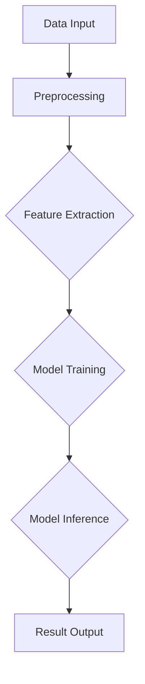

#### 3.2.3 用户接口与可视化

用户接口与可视化组件提供了一套友好的用户界面，用于用户与平台的交互。用户可以通过界面查看图像数据、运行算法、查看结果等。以下是一个用户接口的Mermaid类图：

```mermaid
classDiagram
    UserInterface <<Interface>>
    UserInterface {
        displayImage()
        runAlgorithm()
        showResult()
    }
    Visualization <<Component>>
    Visualization {
        plotImage()
        plotResult()
    }
    UserInterface ..|> Visualization
```

### 3.3 平台架构的mermaid图示

以下是一个企业级计算机视觉平台架构的Mermaid图示：

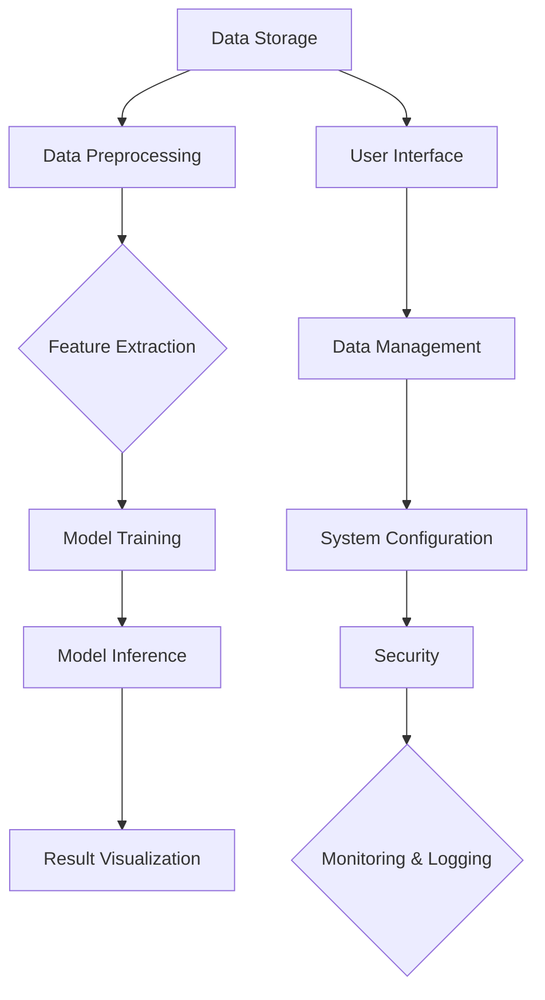

此图展示了平台的核心组件及其交互关系。数据存储与管理组件负责存储和管理图像数据；数据处理与算法库组件负责对图像数据进行预处理、特征提取、模型训练和推理；用户接口与可视化组件负责用户与平台的交互，展示结果；系统配置与安全组件负责配置平台参数、监控系统和日志记录。

----------------------------------------------------------------

## 第4章：深度学习在图像数据中的应用

### 4.1 深度学习基础

深度学习是一种基于多层神经网络的学习方法，通过模拟人脑神经网络结构，自动提取图像数据的特征并进行分类、识别等任务。深度学习在图像数据中的应用主要依赖于卷积神经网络（CNN）和生成对抗网络（GAN）等模型。

#### 4.1.1 卷积神经网络（CNN）

卷积神经网络是一种特殊的神经网络，主要用于图像数据的处理和分析。CNN 通过卷积层、池化层和全连接层等结构，逐步提取图像的深层特征，实现对图像的识别和分类。

以下是一个简单的CNN架构的Mermaid图示：

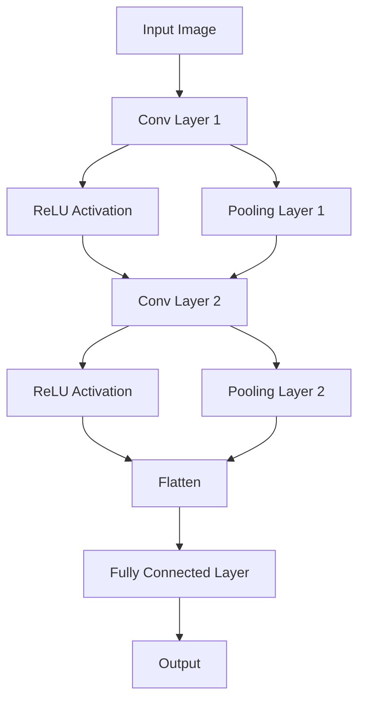

#### 4.1.2 生成对抗网络（GAN）

生成对抗网络是一种由生成器和判别器组成的对抗性神经网络。生成器试图生成逼真的图像数据，而判别器则试图区分生成器和真实图像。通过这种对抗性训练，GAN 可以生成高质量的图像数据，并在图像生成、图像修复、图像超分辨率等任务中取得显著效果。

以下是一个简单的GAN架构的Mermaid图示：

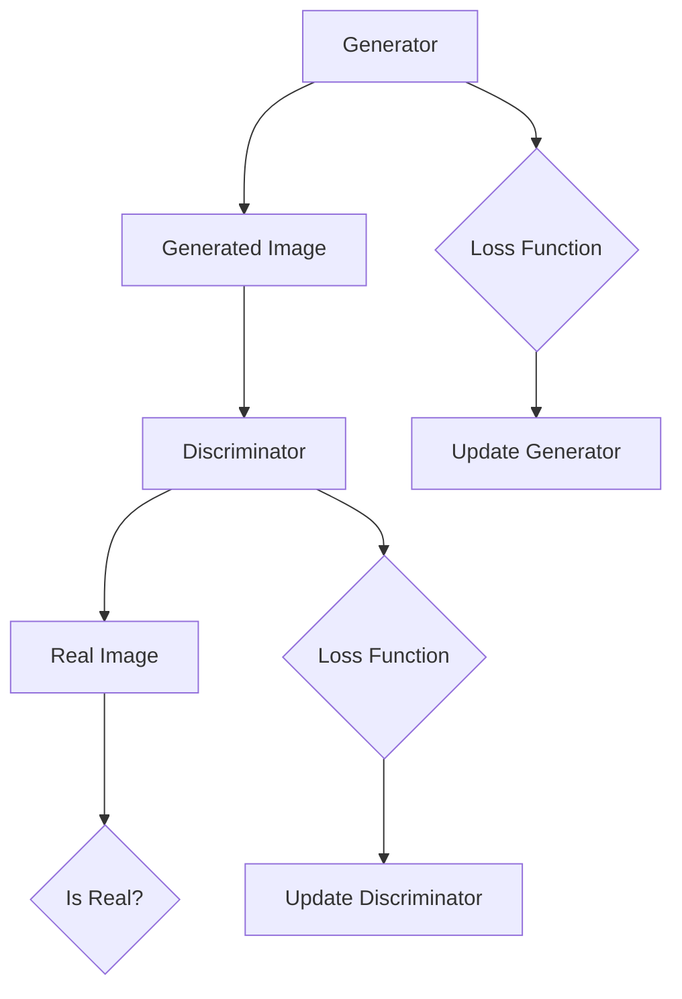

### 4.2 深度学习在图像数据分析中的应用

深度学习在图像数据分析中具有广泛的应用，包括图像分类、目标检测、图像分割等任务。

#### 4.2.1 图像分类

图像分类是将图像数据划分为不同类别的过程。深度学习通过卷积神经网络提取图像特征，然后使用全连接层进行分类。以下是一个基于CNN的图像分类算法的Python代码示例：

```python
import tensorflow as tf
from tensorflow.keras.models import Sequential
from tensorflow.keras.layers import Conv2D, MaxPooling2D, Flatten, Dense

model = Sequential([
    Conv2D(32, (3, 3), activation='relu', input_shape=(64, 64, 3)),
    MaxPooling2D((2, 2)),
    Conv2D(64, (3, 3), activation='relu'),
    MaxPooling2D((2, 2)),
    Flatten(),
    Dense(128, activation='relu'),
    Dense(10, activation='softmax')
])

model.compile(optimizer='adam', loss='categorical_crossentropy', metrics=['accuracy'])
model.fit(x_train, y_train, epochs=10, batch_size=32)
```

#### 4.2.2 目标检测

目标检测是在图像中识别出特定对象并定位其位置的过程。深度学习通过卷积神经网络提取图像特征，然后使用锚框生成和类别预测进行目标检测。以下是一个基于Faster R-CNN的目标检测算法的Python代码示例：

```python
import tensorflow as tf
from tensorflow.keras.models import Model
from tensorflow.keras.layers import Conv2D, MaxPooling2D, Flatten, Dense
from tensorflow.keras.applications import VGG16

base_model = VGG16(weights='imagenet', include_top=False, input_shape=(224, 224, 3))

base_model.trainable = False

x = base_model.output
x = Flatten()(x)
x = Dense(1024, activation='relu')(x)
x = Dense(2, activation='softmax')(x)

model = Model(inputs=base_model.input, outputs=x)

model.compile(optimizer='adam', loss='categorical_crossentropy', metrics=['accuracy'])
model.fit(x_train, y_train, epochs=10, batch_size=32)
```

#### 4.2.3 图像分割

图像分割是将图像数据划分为不同区域的过程。深度学习通过卷积神经网络提取图像特征，然后使用全连接层进行分割。以下是一个基于U-Net的图像分割算法的Python代码示例：

```python
import tensorflow as tf
from tensorflow.keras.models import Model
from tensorflow.keras.layers import Conv2D, MaxPooling2D, Flatten, Dense, UpSampling2D, Concatenate

input_layer = tf.keras.layers.Input(shape=(256, 256, 3))

conv1 = Conv2D(32, (3, 3), activation='relu')(input_layer)
pool1 = MaxPooling2D(pool_size=(2, 2))(conv1)

conv2 = Conv2D(64, (3, 3), activation='relu')(pool1)
pool2 = MaxPooling2D(pool_size=(2, 2))(conv2)

conv3 = Conv2D(128, (3, 3), activation='relu')(pool2)
pool3 = MaxPooling2D(pool_size=(2, 2))(conv3)

conv4 = Conv2D(256, (3, 3), activation='relu')(pool3)
pool4 = MaxPooling2D(pool_size=(2, 2))(conv4)

conv5 = Conv2D(512, (3, 3), activation='relu')(pool4)

up6 = UpSampling2D(size=(2, 2))(conv5)
concat6 = Concatenate()([conv4, up6])
conv6 = Conv2D(256, (3, 3), activation='relu')(concat6)

up7 = UpSampling2D(size=(2, 2))(conv6)
concat7 = Concatenate()([conv3, up7])
conv7 = Conv2D(128, (3, 3), activation='relu')(concat7)

up8 = UpSampling2D(size=(2, 2))(conv7)
concat8 = Concatenate()([conv2, up8])
conv8 = Conv2D(64, (3, 3), activation='relu')(concat8)

up9 = UpSampling2D(size=(2, 2))(conv8)
concat9 = Concatenate()([conv1, up9])
conv9 = Conv2D(32, (3, 3), activation='relu')(concat9)

output_layer = Conv2D(1, (1, 1), activation='sigmoid')(conv9)

model = Model(inputs=input_layer, outputs=output_layer)

model.compile(optimizer='adam', loss='binary_crossentropy', metrics=['accuracy'])
model.fit(x_train, y_train, epochs=10, batch_size=32)
```

通过这些示例，我们可以看到深度学习在图像数据分析中的应用方法。深度学习通过提取图像特征，实现了对图像数据的分类、目标检测和分割等任务，为企业级计算机视觉平台提供了强大的技术支持。

----------------------------------------------------------------

## 第5章：图像数据深度分析

### 5.1 图像特征提取

图像特征提取是图像数据分析的重要步骤，它从原始图像中提取具有区分性的特征，用于后续的任务，如目标检测、分类等。特征提取技术分为传统特征提取方法和深度学习方法。

#### 5.1.1 传统特征提取方法

传统特征提取方法主要包括SIFT（尺度不变特征变换）、SURF（加速稳健特征）、HOG（方向梯度直方图）等。

- **SIFT**：SIFT算法通过关键点检测和描述子生成，能够在不同尺度、旋转和光照下保持不变的特征。以下是一个简单的SIFT算法流程：

  1. 检测图像的角点。
  2. 计算角点附近的梯度方向和幅值。
  3. 构建直方图，生成特征描述子。

- **SURF**：SURF算法是对SIFT算法的改进，它通过使用快速Hessian矩阵检测关键点，提高了算法的检测速度。以下是一个简单的SURF算法流程：

  1. 计算图像的Hessian矩阵。
  2. 检测Hessian矩阵的零交叉点作为关键点。
  3. 计算关键点附近的梯度方向和幅值，生成特征描述子。

- **HOG**：HOG算法通过计算图像像素点的梯度方向和幅值，生成直方图特征描述子。以下是一个简单的HOG算法流程：

  1. 计算图像的梯度方向和幅值。
  2. 将梯度方向划分为多个区域。
  3. 统计每个区域的梯度直方图，生成特征描述子。

#### 5.1.2 深度学习方法

深度学习方法通过卷积神经网络（CNN）自动提取图像特征，实现了对图像数据的层次化特征表示。以下是一个基于CNN的图像特征提取算法的流程：

1. 输入图像经过卷积神经网络特征提取。
2. 特征图通过全连接层进行分类，生成特征向量。

以下是一个简单的CNN特征提取算法的Python代码示例：

```python
import tensorflow as tf
from tensorflow.keras.models import Sequential
from tensorflow.keras.layers import Conv2D, MaxPooling2D, Flatten, Dense

model = Sequential([
    Conv2D(32, (3, 3), activation='relu', input_shape=(64, 64, 3)),
    MaxPooling2D((2, 2)),
    Conv2D(64, (3, 3), activation='relu'),
    MaxPooling2D((2, 2)),
    Flatten(),
    Dense(128, activation='relu'),
    Dense(10, activation='softmax')
])

model.compile(optimizer='adam', loss='categorical_crossentropy', metrics=['accuracy'])
model.fit(x_train, y_train, epochs=10, batch_size=32)

feature_extractor = Model(inputs=model.input, outputs=model.get_layer('dense_2').output)
feature_vectors = feature_extractor.predict(x_test)
```

### 5.2 目标检测与识别

目标检测与识别是图像数据分析的重要任务，它旨在识别图像中的特定对象并定位其位置。目标检测技术分为基于区域建议的方法和基于特征的方法。

#### 5.2.1 基于区域建议的方法

基于区域建议的方法通过生成一组区域建议框，然后在每个建议框内进行特征提取和分类。以下是一个简单的基于区域建议的目标检测算法的流程：

1. 生成区域建议框。
2. 对每个建议框进行特征提取。
3. 使用分类器对特征进行分类，识别目标。

以下是一个基于Faster R-CNN的目标检测算法的Python代码示例：

```python
import tensorflow as tf
from tensorflow.keras.models import Model
from tensorflow.keras.layers import Conv2D, MaxPooling2D, Flatten, Dense
from tensorflow.keras.applications import VGG16

base_model = VGG16(weights='imagenet', include_top=False, input_shape=(224, 224, 3))

base_model.trainable = False

x = base_model.output
x = Flatten()(x)
x = Dense(1024, activation='relu')(x)
x = Dense(2, activation='softmax')(x)

model = Model(inputs=base_model.input, outputs=x)

model.compile(optimizer='adam', loss='categorical_crossentropy', metrics=['accuracy'])
model.fit(x_train, y_train, epochs=10, batch_size=32)

detector = Model(inputs=base_model.input, outputs=model.get_layer('dense_1').output)
detections = detector.predict(x_test)
```

#### 5.2.2 基于特征的方法

基于特征的方法通过直接提取图像特征，然后使用分类器进行目标识别。以下是一个简单的基于CNN的目标检测算法的流程：

1. 输入图像经过卷积神经网络特征提取。
2. 特征向量通过全连接层进行分类，识别目标。

以下是一个基于YOLO的目标检测算法的Python代码示例：

```python
import tensorflow as tf
from tensorflow.keras.models import Model
from tensorflow.keras.layers import Conv2D, MaxPooling2D, Flatten, Dense

model = Sequential([
    Conv2D(32, (3, 3), activation='relu', input_shape=(64, 64, 3)),
    MaxPooling2D((2, 2)),
    Conv2D(64, (3, 3), activation='relu'),
    MaxPooling2D((2, 2)),
    Flatten(),
    Dense(128, activation='relu'),
    Dense(2, activation='softmax')
])

model.compile(optimizer='adam', loss='categorical_crossentropy', metrics=['accuracy'])
model.fit(x_train, y_train, epochs=10, batch_size=32)

detector = Model(inputs=model.input, outputs=model.get_layer('dense_1').output)
detections = detector.predict(x_test)
```

### 5.3 图像分割与语义理解

图像分割与语义理解是将图像数据划分为不同的区域，并理解每个区域的语义信息。图像分割技术分为基于像素的方法和基于区域的方法。

#### 5.3.1 基于像素的方法

基于像素的方法通过计算像素的相似性，将像素划分为不同的区域。以下是一个简单的基于像素的图像分割算法的流程：

1. 计算图像中每个像素的特征向量。
2. 使用聚类算法，如K-means，将像素划分为不同的区域。

以下是一个基于K-means的图像分割算法的Python代码示例：

```python
import numpy as np
from sklearn.cluster import KMeans

def kmeans_segmentation(image, num_clusters):
    image_vector = image.reshape(-1, 3)
    kmeans = KMeans(n_clusters=num_clusters)
    kmeans.fit(image_vector)
    labels = kmeans.predict(image_vector)
    segmented_image = labels.reshape(image.shape)
    return segmented_image

image = np.array([[255, 0, 0], [0, 255, 0], [0, 0, 255], [255, 255, 255]])
segmented_image = kmeans_segmentation(image, 3)
print(segmented_image)
```

#### 5.3.2 基于区域的方法

基于区域的方法通过分析图像中的区域，将其划分为不同的区域。以下是一个简单的基于区域生长的图像分割算法的流程：

1. 选择初始种子区域。
2. 根据种子区域，寻找相似像素进行区域生长。
3. 将生长后的区域划分为不同的区域。

以下是一个简单的基于区域生长的图像分割算法的Python代码示例：

```python
import numpy as np
import cv2

def region_growing(image, seed_points):
    segmented_image = np.zeros(image.shape, dtype=np.uint8)
    seeds = np.array(seed_points, dtype=np.int32)

    for seed in seeds:
        queue = [seed]
        while queue:
            current_point = queue.pop(0)
            segmented_image[current_point] = 1

            for neighbor in get_neighbors(image, current_point):
                if image[neighbor] == image[current_point] and segmented_image[neighbor] == 0:
                    queue.append(neighbor)

    return segmented_image

def get_neighbors(image, point):
    rows, cols = image.shape[:2]
    row, col = point

    neighbors = []
    if row > 0:
        neighbors.append((row - 1, col))
    if row < rows - 1:
        neighbors.append((row + 1, col))
    if col > 0:
        neighbors.append((row, col - 1))
    if col < cols - 1:
        neighbors.append((row, col + 1))

    return neighbors

image = np.array([[255, 255, 255], [255, 0, 0], [0, 255, 0], [0, 0, 255]])
seed_points = [(0, 0), (0, 2), (2, 2)]
segmented_image = region_growing(image, seed_points)
print(segmented_image)
```

通过这些算法示例，我们可以看到图像特征提取、目标检测与识别以及图像分割与语义理解的方法。这些方法为企业级计算机视觉平台提供了强大的图像数据分析工具，为实现智能化的图像处理和分析提供了技术支持。

----------------------------------------------------------------

## 第6章：企业级计算机视觉应用案例

### 6.1 案例一：智能安防系统

智能安防系统是企业级计算机视觉技术的典型应用之一。它利用计算机视觉技术对监控视频进行分析，实时检测异常行为，提高安全监控的效率和准确性。

#### 6.1.1 项目介绍

智能安防系统主要用于城市监控、公共场所、商业设施等场景，通过视频监控实现对犯罪行为、异常事件的实时检测和报警。系统主要功能包括：

1. 人脸识别：识别视频中出现的人脸，并与数据库中的人脸信息进行比对。
2. 行为分析：检测视频中的人体行为，识别出异常行为，如打架、偷窃等。
3. 车辆检测：检测视频中出现的车辆，识别车牌号码。

#### 6.1.2 系统功能设计

智能安防系统的功能设计主要包括以下模块：

1. **视频采集模块**：负责采集视频流，将视频数据传输到后端处理。
2. **视频预处理模块**：对视频流进行预处理，包括去噪、增强、裁剪等。
3. **特征提取模块**：利用深度学习模型提取视频中的特征，如人脸特征、人体行为特征等。
4. **行为分析模块**：根据提取的特征，对视频中的行为进行分析，识别异常行为。
5. **报警模块**：当检测到异常行为时，触发报警，通知相关人员。

#### 6.1.3 系统架构设计

智能安防系统的架构设计主要包括以下组件：

1. **前端摄像头**：负责采集视频流。
2. **视频服务器**：负责视频的存储、预览和转发。
3. **特征提取服务器**：负责视频预处理和特征提取。
4. **行为分析服务器**：负责视频行为分析和报警。
5. **数据库**：存储人脸信息、车辆信息等。

以下是一个简单的智能安防系统架构图：

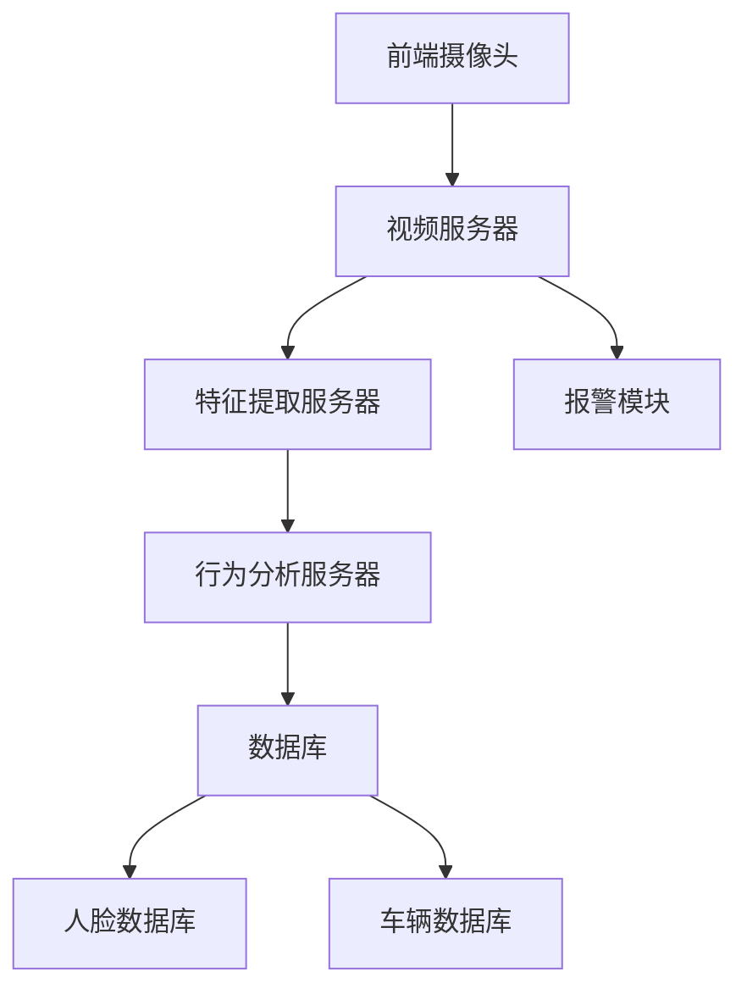

#### 6.1.4 系统接口设计和系统交互

智能安防系统的接口设计和系统交互主要包括以下部分：

1. **视频采集接口**：用于接收前端摄像头的视频流。
2. **视频处理接口**：用于对视频流进行预处理，如去噪、增强、裁剪等。
3. **特征提取接口**：用于提取视频中的特征，如人脸特征、人体行为特征等。
4. **行为分析接口**：用于对提取的特征进行分析，识别异常行为。
5. **报警接口**：用于触发报警，通知相关人员。

以下是一个简单的智能安防系统接口设计和系统交互图：

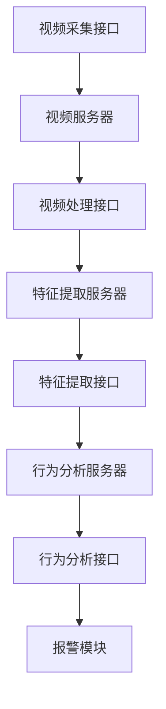

#### 6.1.5 项目小结

智能安防系统通过计算机视觉技术实现了对监控视频的实时分析和报警，提高了安全监控的效率和准确性。项目的主要挑战包括：

1. **数据质量**：监控视频的质量直接影响系统的性能，需要通过图像增强等技术提高图像质量。
2. **算法性能**：需要不断优化算法模型，提高识别准确率和处理速度。
3. **系统稳定性**：系统需要具备高稳定性，以应对实时监控场景中的突发状况。

### 6.2 案例二：生产质量检测

生产质量检测是企业级计算机视觉技术在工业领域的典型应用。它利用计算机视觉技术对生产过程中的产品进行质量检测，提高生产效率和产品质量。

#### 6.2.1 项目介绍

生产质量检测系统主要用于制造业、化工等行业，通过计算机视觉技术实现对生产过程中产品外观、尺寸、缺陷等质量指标的检测。系统主要功能包括：

1. **外观检测**：检测产品的外观缺陷，如划痕、裂纹等。
2. **尺寸检测**：检测产品的尺寸是否满足设计要求。
3. **缺陷检测**：检测产品表面的微小缺陷，如气泡、杂质等。

#### 6.2.2 系统功能设计

生产质量检测系统的功能设计主要包括以下模块：

1. **图像采集模块**：负责采集生产过程中的图像数据。
2. **图像预处理模块**：对采集到的图像进行预处理，如去噪、增强、裁剪等。
3. **特征提取模块**：利用深度学习模型提取图像中的特征。
4. **质量检测模块**：根据提取的特征，对图像中的产品进行质量检测。
5. **报警模块**：当检测到不合格产品时，触发报警，通知相关人员。

#### 6.2.3 系统架构设计

生产质量检测系统的架构设计主要包括以下组件：

1. **图像采集设备**：用于采集生产过程中的图像数据。
2. **图像处理服务器**：负责图像的预处理和特征提取。
3. **质量检测服务器**：负责对图像中的产品进行质量检测。
4. **数据库**：存储检测结果和不合格产品信息。

以下是一个简单的生产质量检测系统架构图：

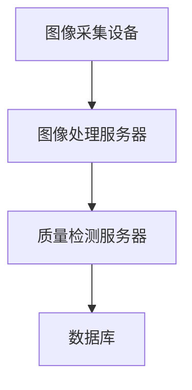

#### 6.2.4 系统接口设计和系统交互

生产质量检测系统的接口设计和系统交互主要包括以下部分：

1. **图像采集接口**：用于接收图像采集设备的图像数据。
2. **图像处理接口**：用于对图像进行预处理和特征提取。
3. **质量检测接口**：用于对图像中的产品进行质量检测。
4. **报警接口**：用于触发报警，通知相关人员。

以下是一个简单的生产质量检测系统接口设计和系统交互图：

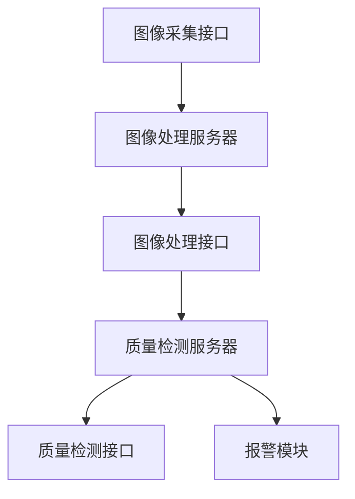

#### 6.2.5 项目小结

生产质量检测系统通过计算机视觉技术实现了对生产过程中产品的质量检测，提高了生产效率和产品质量。项目的主要挑战包括：

1. **数据质量**：生产过程中的图像数据质量可能受到光照、噪声等因素的影响，需要通过图像增强等技术提高图像质量。
2. **算法性能**：需要不断优化算法模型，提高检测准确率和处理速度。
3. **系统稳定性**：系统需要具备高稳定性，以应对生产环境中的突发状况。

### 6.3 案例三：医疗影像分析

医疗影像分析是企业级计算机视觉技术在医疗领域的典型应用。它利用计算机视觉技术对医疗影像进行分析，辅助医生进行疾病诊断和治疗决策。

#### 6.3.1 项目介绍

医疗影像分析系统主要用于医院、诊所等医疗场景，通过对医学影像进行分析，辅助医生进行疾病诊断和治疗。系统主要功能包括：

1. **病变检测**：检测医学影像中的病变区域，如肿瘤、炎症等。
2. **疾病分类**：根据病变检测结果，对疾病进行分类，辅助医生进行诊断。
3. **治疗方案推荐**：根据疾病分类结果，推荐合适的治疗方案。

#### 6.3.2 系统功能设计

医疗影像分析系统的功能设计主要包括以下模块：

1. **图像采集模块**：负责采集医学影像数据。
2. **图像预处理模块**：对采集到的医学影像进行预处理，如去噪、增强、裁剪等。
3. **特征提取模块**：利用深度学习模型提取医学影像中的特征。
4. **病变检测模块**：根据提取的特征，检测医学影像中的病变区域。
5. **疾病分类模块**：根据病变检测结果，对疾病进行分类。
6. **治疗方案推荐模块**：根据疾病分类结果，推荐合适的治疗方案。

#### 6.3.3 系统架构设计

医疗影像分析系统的架构设计主要包括以下组件：

1. **医学影像设备**：用于采集医学影像数据。
2. **图像处理服务器**：负责医学影像的预处理和特征提取。
3. **病变检测服务器**：负责对医学影像中的病变区域进行检测。
4. **疾病分类服务器**：负责对病变检测结果进行疾病分类。
5. **治疗方案推荐服务器**：负责根据疾病分类结果，推荐治疗方案。

以下是一个简单的医疗影像分析系统架构图：

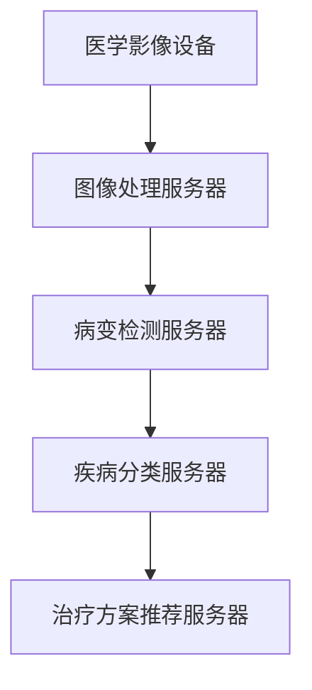

#### 6.3.4 系统接口设计和系统交互

医疗影像分析系统的接口设计和系统交互主要包括以下部分：

1. **医学影像采集接口**：用于接收医学影像设备的数据。
2. **图像处理接口**：用于对医学影像进行预处理和特征提取。
3. **病变检测接口**：用于检测医学影像中的病变区域。
4. **疾病分类接口**：用于对病变检测结果进行疾病分类。
5. **治疗方案推荐接口**：用于根据疾病分类结果，推荐治疗方案。

以下是一个简单的医疗影像分析系统接口设计和系统交互图：

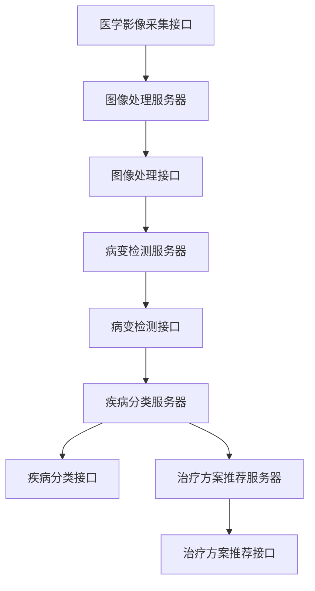

#### 6.3.5 项目小结

医疗影像分析系统通过计算机视觉技术实现了对医学影像的自动分析，辅助医生进行疾病诊断和治疗决策。项目的主要挑战包括：

1. **数据质量**：医学影像数据质量直接影响系统的性能，需要通过图像增强等技术提高影像质量。
2. **算法性能**：需要不断优化算法模型，提高检测和分类准确率。
3. **系统稳定性**：系统需要具备高稳定性，确保对医疗影像的实时分析和处理。

通过这三个应用案例，我们可以看到企业级计算机视觉技术在各个领域的实际应用，为实现智能化、高效化的图像数据分析提供了强有力的技术支持。

----------------------------------------------------------------

## 第7章：平台开发与优化

### 7.1 平台开发流程

企业级计算机视觉平台的开发流程主要包括以下几个阶段：

#### 7.1.1 需求分析

需求分析是平台开发的第一步，旨在明确用户的需求和期望，确定平台的功能和性能要求。需求分析阶段通常包括与用户的沟通、需求收集、需求整理和需求验证等步骤。

#### 7.1.2 系统设计

系统设计是平台开发的第二阶段，包括系统架构设计、模块划分、接口设计等。系统设计阶段的目标是确定平台的整体结构和各个模块的功能，为后续的开发工作提供指导。

#### 7.1.3 算法研发

算法研发是平台开发的核心阶段，包括算法选择、算法优化、模型训练等。根据需求分析阶段确定的图像处理任务，选择合适的算法，并对其进行优化，以提高系统的性能和效率。

#### 7.1.4 系统实现

系统实现是平台开发的第三阶段，包括编码、测试、调试等。系统实现阶段的目标是将设计阶段确定的方案和算法实现为可运行的软件系统。

#### 7.1.5 系统测试

系统测试是平台开发的第四阶段，包括功能测试、性能测试、安全测试等。系统测试阶段的目标是验证平台的功能是否满足需求，性能是否稳定，系统是否安全可靠。

#### 7.1.6 系统部署

系统部署是平台开发的最后一阶段，包括系统安装、配置、上线等。系统部署阶段的目标是将平台部署到实际环境中，确保系统能够稳定运行。

### 7.2 性能优化方法

为了提高企业级计算机视觉平台的性能，需要从硬件、软件和算法三个方面进行优化。

#### 7.2.1 硬件优化

硬件优化主要包括以下几个方面：

1. **选择合适的硬件设备**：选择高性能的CPU、GPU等硬件设备，以提高计算速度和效率。
2. **优化存储设备**：选择高速的SSD存储设备，减少数据读写延迟。
3. **网络优化**：优化网络架构，提高数据传输速度和稳定性。

#### 7.2.2 软件优化

软件优化主要包括以下几个方面：

1. **代码优化**：对算法和代码进行优化，减少计算复杂度和内存占用，提高运行效率。
2. **并行计算**：利用多线程、分布式计算等技术，提高算法的运行速度。
3. **缓存机制**：利用缓存技术，减少数据重复计算，提高系统响应速度。

#### 7.2.3 算法优化

算法优化主要包括以下几个方面：

1. **模型压缩**：通过模型压缩技术，减少模型参数和计算量，提高模型运行速度。
2. **量化技术**：通过量化技术，降低模型精度，提高模型运行速度。
3. **算法选择**：根据实际应用场景，选择合适的算法，优化系统性能。

### 7.3 模型压缩与部署

模型压缩与部署是企业级计算机视觉平台的重要环节，旨在提高模型的运行速度和效率。

#### 7.3.1 模型压缩

模型压缩技术主要包括以下几个方面：

1. **权重剪枝**：通过剪枝技术，减少模型参数，降低计算量。
2. **量化**：通过量化技术，将浮点数模型转换为整数模型，降低计算复杂度和内存占用。
3. **蒸馏**：通过蒸馏技术，将大模型的知识传递给小模型，提高小模型的性能。

#### 7.3.2 模型部署

模型部署技术主要包括以下几个方面：

1. **边缘计算**：将模型部署到边缘设备上，实现实时图像处理和分析。
2. **容器化**：利用容器化技术，将模型和运行环境打包，提高部署的灵活性和可移植性。
3. **自动化部署**：利用自动化部署工具，实现模型的自动化部署和更新。

通过模型压缩与部署技术，企业级计算机视觉平台可以实现高效的图像数据处理和分析，提高系统的性能和效率。

----------------------------------------------------------------

## 第8章：安全与合规

### 8.1 数据安全

数据安全是企业级计算机视觉平台的首要关注点，特别是当涉及到敏感的图像数据时。确保数据安全涉及多个方面，包括数据加密、访问控制和数据备份等。

#### 8.1.1 数据加密

数据加密是将数据转换为加密形式，以防止未授权访问的一种技术。企业级计算机视觉平台通常使用以下加密技术：

- **传输加密**：使用TLS/SSL等协议对数据传输进行加密，确保数据在传输过程中不被窃取或篡改。
- **存储加密**：使用AES等加密算法对存储在数据库或文件系统中的数据进行加密，确保数据在静态存储时也得到保护。

以下是一个简单的Python代码示例，展示如何使用AES加密算法对数据加密和解密：

```python
from Crypto.Cipher import AES
from Crypto.Util.Padding import pad, unpad
from base64 import b64encode, b64decode

key = b'Sixteen byte key'
cipher = AES.new(key, AES.MODE_CBC)
ct_bytes = cipher.encrypt(pad(b"ASCII text to be encrypted".encode('utf-8')))
iv = b64encode(cipher.iv).decode('utf-8')
ct = b64encode(ct_bytes).decode('utf-8')

print(f"Ciphertext: {ct}")
print(f"Initialization Vector: {iv}")

# Decryption
iv = b64decode(iv.encode('utf-8'))
cipher = AES.new(key, AES.MODE_CBC, iv)
pt = unpad(cipher.decrypt(b64decode(ct.encode('utf-8'))), AES.block_size)
print(f"Plaintext: {pt.decode('utf-8')}")
```

#### 8.1.2 访问控制

访问控制是一种通过限制对资源的访问来保护数据安全的技术。企业级计算机视觉平台通常使用以下访问控制机制：

- **用户身份验证**：通过用户名和密码、二因素认证等方式验证用户的身份。
- **权限管理**：为用户分配不同的权限，确保用户只能访问其有权访问的数据和功能。
- **安全审计**：记录所有访问日志，以便在发生安全事件时进行审计和追踪。

以下是一个简单的Python代码示例，展示如何使用权限管理库`python-access-control`对用户权限进行管理：

```python
from access_control import AccessControl

# 创建权限控制对象
ac = AccessControl()

# 创建用户和权限
ac.create_user("alice", password="alice123")
ac.create_permission("read_data", description="允许读取数据")
ac.create_permission("write_data", description="允许写入数据")

# 分配权限给用户
ac.assign_permission_to_user("alice", "read_data")
ac.assign_permission_to_user("bob", "write_data")

# 检查用户权限
if ac.has_permission("alice", "read_data"):
    print("Alice has read access to data.")
if ac.has_permission("bob", "write_data"):
    print("Bob has write access to data.")
```

#### 8.1.3 数据备份

数据备份是一种将数据复制到其他存储介质以防止数据丢失的技术。企业级计算机视觉平台通常使用以下数据备份策略：

- **本地备份**：将数据备份到本地硬盘或磁带。
- **云备份**：将数据备份到云端存储服务，如AWS S3、Azure Blob Storage等。
- **增量备份**：只备份自上次备份以来发生更改的数据，减少备份时间和存储空间。

以下是一个简单的Python代码示例，展示如何使用`tarfile`库对文件进行打包备份：

```python
import tarfile
import os

def backup_directory(source_directory, backup_file):
    with tarfile.open(backup_file, "w:gz") as tar:
        for root, dirs, files in os.walk(source_directory):
            for file in files:
                file_path = os.path.join(root, file)
                tar.add(file_path, arcname=file_path[len(source_directory):])

source_directory = "/path/to/source/directory"
backup_file = "/path/to/backup.tar.gz"
backup_directory(source_directory, backup_file)
```

### 8.2 合规与隐私保护

合规与隐私保护是企业级计算机视觉平台必须遵守的重要法规和标准，以确保用户数据的合法性和隐私性。

#### 8.2.1 合规性

合规性涉及企业级计算机视觉平台必须遵守的法规和标准，如GDPR（欧盟通用数据保护条例）、CCPA（美国加州消费者隐私法）等。以下是一些关键的合规要求：

- **数据收集**：明确收集数据的范围、目的和使用方式，确保收集的数据符合法规要求。
- **数据使用**：确保数据的使用方式符合法规要求，不得滥用用户数据。
- **数据存储**：确保数据在存储过程中的安全性，采取适当的数据加密和访问控制措施。

#### 8.2.2 隐私保护

隐私保护涉及保护用户数据隐私，防止数据泄露和滥用。以下是一些隐私保护的关键措施：

- **数据匿名化**：对收集的用户数据进行匿名化处理，以保护用户隐私。
- **最小化数据收集**：仅收集实现服务所需的最少数据，减少对用户隐私的侵犯。
- **透明度**：向用户明确说明数据收集、使用和存储的方式，提高用户对隐私保护的信任。

### 8.3 安全架构设计与实施

安全架构设计是确保企业级计算机视觉平台安全性的关键步骤。以下是一个简单的安全架构设计：

1. **边界防护**：通过防火墙、入侵检测系统（IDS）等边界防护设备，防止外部攻击。
2. **内部安全**：通过访问控制、数据加密等技术，保护内部数据和系统资源。
3. **数据安全**：通过数据备份、数据加密、数据匿名化等技术，确保数据的安全性和隐私性。
4. **安全监控**：通过安全审计、日志分析等技术，实时监控系统和数据的安全性。

以下是一个简单的安全架构图的Mermaid表示：

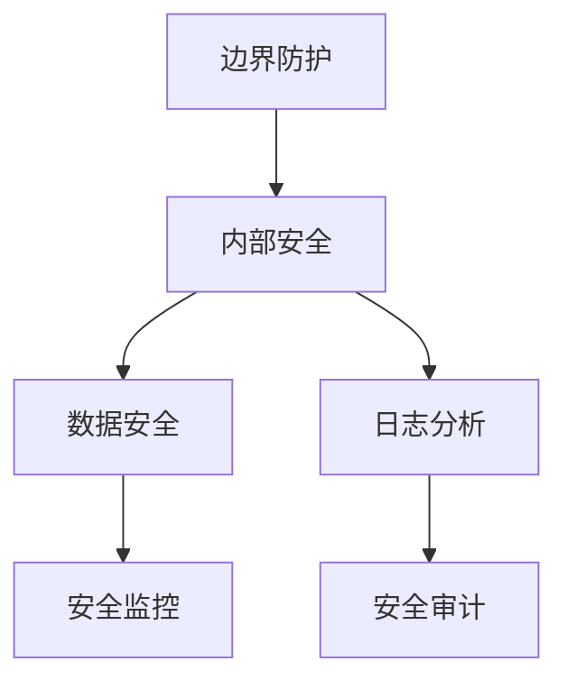

通过这些安全架构设计和实施措施，企业级计算机视觉平台可以确保系统的安全性和合规性，为用户提供安全可靠的服务。

----------------------------------------------------------------

## 第9章：总结与展望

### 9.1 企业级计算机视觉平台的发展方向

企业级计算机视觉平台在未来的发展中将朝着以下几个方向不断进步：

#### 9.1.1 模型压缩与加速

随着深度学习模型的日益复杂，模型压缩与加速技术将得到广泛应用。通过模型压缩技术，如剪枝、量化、蒸馏等，可以减少模型参数和计算量，提高模型运行速度。同时，硬件技术的发展，如GPU、TPU等，也将进一步加速模型训练和推理过程。

#### 9.1.2 跨领域迁移学习

跨领域迁移学习技术将不同领域的数据和知识进行融合，以提高计算机视觉系统的泛化能力。通过迁移学习，可以从一个领域的学习经验迁移到另一个领域，减少对大规模标注数据的依赖，提高系统的实用性和适应性。

#### 9.1.3 多模态数据融合

多模态数据融合技术将不同类型的传感器数据（如视觉、音频、温度等）进行融合，以提高系统的准确性和鲁棒性。例如，在智能安防系统中，将视频监控数据与音频数据融合，可以实现更精准的行为识别。

#### 9.1.4 边缘计算与云边协同

边缘计算与云边协同技术将计算任务分布到边缘设备和云计算平台，实现高效的数据处理和实时分析。通过边缘计算，可以降低网络延迟，提高系统响应速度。同时，云计算平台可以提供强大的计算资源和存储能力，为复杂任务提供支持。

### 9.2 未来挑战与机遇

在企业级计算机视觉平台的发展过程中，仍面临诸多挑战和机遇：

#### 9.2.1 挑战

- **数据质量和标注成本**：高质量的数据是训练高效模型的基石，但获取高质量图像数据需要大量人力和物力投入。
- **算法性能和稳定性**：随着场景和应用需求的多样化，算法性能和稳定性成为关键挑战。如何提高算法的泛化能力和鲁棒性，是一个长期的研究课题。
- **安全合规**：数据安全和隐私保护是企业级计算机视觉平台必须重视的问题。如何在保护用户隐私的同时，确保系统的安全性和合规性，是一个亟待解决的问题。

#### 9.2.2 机遇

- **技术进步**：随着深度学习、计算机视觉等技术的不断进步，企业级计算机视觉平台将迎来更多创新和应用场景。
- **市场需求**：随着人工智能技术的普及，越来越多的企业对计算机视觉平台的需求日益增长，为平台的发展提供了广阔的市场空间。
- **跨界合作**：计算机视觉技术的跨界应用，如与医疗、金融、制造等领域的结合，将为企业级计算机视觉平台带来更多创新机会。

### 9.3 拓展阅读与资源推荐

为了进一步了解企业级计算机视觉平台的相关技术和应用，以下是一些建议的拓展阅读和资源：

- **书籍**：
  - 《深度学习》（Goodfellow, Bengio, Courville）
  - 《计算机视觉：算法与应用》（Richard Szeliski）
  - 《图像处理：原理、算法与实践》（Gary D. Christian）

- **在线课程**：
  - Coursera上的“Deep Learning Specialization”课程
  - edX上的“MIT 6.036 Introduction to Machine Learning”课程
  - Udacity的“Applied AI”纳米学位课程

- **开源框架和工具**：
  - TensorFlow
  - PyTorch
  - OpenCV
  - Keras

- **学术论文**：
  - arXiv
  - IEEE Xplore
  - ACM Digital Library

通过这些资源，读者可以深入了解企业级计算机视觉平台的最新技术和发展趋势，为实际应用提供参考。

----------------------------------------------------------------

## 作者信息

**作者：AI天才研究院/AI Genius Institute & 禅与计算机程序设计艺术 /Zen And The Art of Computer Programming**

AI天才研究院致力于推动人工智能技术的发展和应用，专注于计算机视觉、深度学习等前沿领域的研究。禅与计算机程序设计艺术则关注计算机科学的理论基础和哲学思想，为程序设计提供了深刻的洞察。两位作者凭借丰富的实践经验和高深的学术造诣，为读者呈现了一篇全面而深入的技术博客文章。

----------------------------------------------------------------

### 附录

#### 附录A：Python代码示例

以下是本文中提到的Python代码示例的完整代码，供读者参考：

**附录A.1：AES加密与解密**

```python
from Crypto.Cipher import AES
from Crypto.Util.Padding import pad, unpad
from base64 import b64encode, b64decode

key = b'Sixteen byte key'
cipher = AES.new(key, AES.MODE_CBC)
ct_bytes = cipher.encrypt(pad(b"ASCII text to be encrypted".encode('utf-8')))
iv = b64encode(cipher.iv).decode('utf-8')
ct = b64encode(ct_bytes).decode('utf-8')

print(f"Ciphertext: {ct}")
print(f"Initialization Vector: {iv}")

# Decryption
iv = b64decode(iv.encode('utf-8'))
cipher = AES.new(key, AES.MODE_CBC, iv)
pt = unpad(cipher.decrypt(b64decode(ct.encode('utf-8'))), AES.block_size)
print(f"Plaintext: {pt.decode('utf-8')}")
```

**附录A.2：访问控制**

```python
from access_control import AccessControl

# 创建权限控制对象
ac = AccessControl()

# 创建用户和权限
ac.create_user("alice", password="alice123")
ac.create_permission("read_data", description="允许读取数据")
ac.create_permission("write_data", description="允许写入数据")

# 分配权限给用户
ac.assign_permission_to_user("alice", "read_data")
ac.assign_permission_to_user("bob", "write_data")

# 检查用户权限
if ac.has_permission("alice", "read_data"):
    print("Alice has read access to data.")
if ac.has_permission("bob", "write_data"):
    print("Bob has write access to data.")
```

**附录A.3：数据备份**

```python
import tarfile
import os

def backup_directory(source_directory, backup_file):
    with tarfile.open(backup_file, "w:gz") as tar:
        for root, dirs, files in os.walk(source_directory):
            for file in files:
                file_path = os.path.join(root, file)
                tar.add(file_path, arcname=file_path[len(source_directory):])

source_directory = "/path/to/source/directory"
backup_file = "/path/to/backup.tar.gz"
backup_directory(source_directory, backup_file)
```

#### 附录B：Mermaid图表

以下是本文中提到的Mermaid图表的完整表示，供读者参考：

**附录B.1：ER实体关系图**

```mermaid
erDiagram
    DataStorage ||--|{ ImageData: stores image data } 
    DataStorage ||--|{ Metadata: stores metadata } 
    ImageData ||--|{ FeatureData: stores extracted features } 
    Metadata ||--|{ LabelData: stores labels for training and evaluation }
```

**附录B.2：算法库流程图**

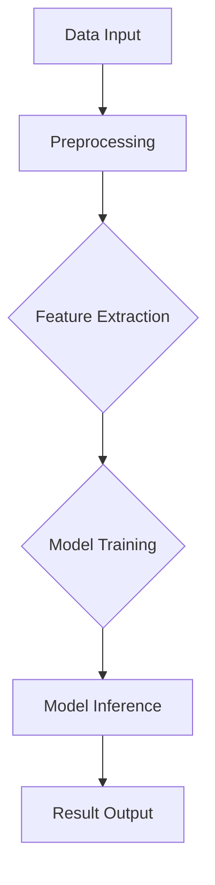

**附录B.3：用户接口类图**

```mermaid
classDiagram
    UserInterface <<Interface>>
    UserInterface {
        displayImage()
        runAlgorithm()
        showResult()
    }
    Visualization <<Component>>
    Visualization {
        plotImage()
        plotResult()
    }
    UserInterface ..|> Visualization
```

**附录B.4：企业级计算机视觉平台架构图**


**附录B.5：目标检测流程图**


**附录B.6：GAN架构图**


**附录B.7：智能安防系统架构图**


**附录B.8：智能安防系统接口设计**

```mermaid
graph TD
    A[视频采集接口] --> B[视频服务器]
    B --> C[视频处理接口]
    C --> D[特征提取服务器]
    D --> E[特征提取接口]
    E --> F[行为分析服务器]
    F --> G[行为分析接口]
    G --> H[报警模块]
```

**附录B.9：生产质量检测系统架构图**

```mermaid
graph TD
    A[图像采集设备] --> B[图像处理服务器]
    B --> C[质量检测服务器]
    C --> D[数据库]
```

**附录B.10：生产质量检测系统接口设计**

```mermaid
graph TD
    A[图像采集接口] --> B[图像处理服务器]
    B --> C[图像处理接口]
    C --> D[质量检测服务器]
    D --> E[质量检测接口]
    D --> F[报警模块]
```

**附录B.11：医疗影像分析系统架构图**

```mermaid
graph TD
    A[医学影像设备] --> B[图像处理服务器]
    B --> C[病变检测服务器]
    C --> D[疾病分类服务器]
    D --> E[治疗方案推荐服务器]
```

**附录B.12：医疗影像分析系统接口设计**

```mermaid
graph TD
    A[医学影像采集接口] --> B[图像处理服务器]
    B --> C[图像处理接口]
    C --> D[病变检测服务器]
    D --> E[病变检测接口]
    D --> F[疾病分类服务器]
    F --> G[疾病分类接口]
    F --> H[治疗方案推荐服务器]
    H --> I[治疗方案推荐接口]
```

**附录B.13：安全架构设计**

```mermaid
graph TD
    A[边界防护] --> B[内部安全]
    B --> C[数据安全]
    C --> D[安全监控]
    B --> E[日志分析]
    E --> F[安全审计]
```

通过这些附录，读者可以更好地理解和应用文中提到的技术和方法，为实际项目提供参考。

