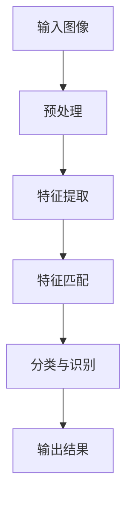

                 

# 企业级计算机视觉应用：深化图像识别能力

> 关键词：计算机视觉、图像识别、企业级应用、算法原理、系统架构

> 摘要：随着人工智能技术的迅猛发展，计算机视觉在企业级应用中的重要性日益凸显。本文从问题背景出发，深入探讨企业级计算机视觉应用的需求与挑战，剖析核心概念和联系，讲解图像识别算法原理，设计企业级计算机视觉系统架构，并进行实战案例分析，最后总结最佳实践和注意事项，以指导企业级计算机视觉应用的发展。

## 目录大纲

### 第一部分：背景介绍

- **第1章：问题背景与核心概念**
  - **1.1 问题背景**
  - **1.2 核心概念**

### 第二部分：核心概念与联系

- **第2章：计算机视觉基础**
  - **2.1 计算机视觉的定义与历史**
  - **2.2 核心概念**
  - **2.3 概念属性特征对比表格**

### 第三部分：算法原理讲解

- **第3章：图像识别算法原理**
  - **3.1 算法原理**
  - **3.2 算法原理详细讲解**
  - **3.3 算法数学模型和公式**

### 第四部分：系统分析与架构设计

- **第4章：企业级计算机视觉系统架构设计**
  - **4.1 问题场景介绍**
  - **4.2 系统功能设计**
  - **4.3 系统架构设计**
  - **4.4 系统接口设计和系统交互**

### 第五部分：项目实战

- **第5章：计算机视觉应用实战**
  - **5.1 环境安装**
  - **5.2 系统核心实现源代码**
  - **5.3 实际案例分析和讲解**
  - **5.4 项目小结**

### 第六部分：最佳实践与总结

- **第6章：最佳实践与注意事项**
  - **6.1 最佳实践**
  - **6.2 注意事项**
  - **6.3 拓展阅读**

## 第一部分：背景介绍

### 第1章：问题背景与核心概念

#### 1.1 问题背景

在数字化转型的浪潮中，企业级应用对计算机视觉的需求愈发迫切。计算机视觉是一种通过模拟人类视觉感知，使计算机具备对图像和视频进行处理和分析的能力。在企业级应用中，计算机视觉能够实现自动化监测、精准识别、智能决策等功能，从而提高生产效率、降低运营成本、提升用户体验。

然而，当前企业级计算机视觉应用面临诸多挑战：

1. **识别准确率问题**：在复杂场景下，图像识别的准确率受到限制，导致应用效果不尽如人意。
2. **实时性要求**：企业级应用对图像处理的速度要求较高，特别是在大规模数据处理场景下，如何保证实时性成为一大难题。
3. **数据隐私与安全**：计算机视觉应用需要处理大量敏感数据，如何保护数据隐私和安全是必须解决的问题。
4. **跨领域适应性**：不同行业的企业对计算机视觉应用的需求差异较大，如何实现通用化、适应性强的解决方案成为关键。

为了解决这些问题，深化图像识别能力成为企业级计算机视觉应用的核心任务。本文将围绕这一主题，逐一探讨相关概念和技术。

#### 1.2 核心概念

在探讨企业级计算机视觉应用之前，我们需要明确一些核心概念：

1. **计算机视觉**：计算机视觉是指使计算机具备对图像和视频进行处理和分析的能力。它涉及图像处理、模式识别、机器学习等多个领域。
2. **图像识别**：图像识别是计算机视觉中的一个重要分支，旨在使计算机能够理解图像内容，识别其中的物体、场景和人物等。
3. **深度学习**：深度学习是一种基于多层神经网络的人工智能技术，能够在大量数据的基础上，自动学习和提取特征，实现高精度的图像识别和分类。
4. **机器学习**：机器学习是一种使计算机通过数据学习，从而完成特定任务的技术。在计算机视觉中，机器学习可用于图像分类、目标检测等任务。
5. **卷积神经网络（CNN）**：卷积神经网络是一种特殊的神经网络结构，广泛应用于图像识别和计算机视觉领域，能够有效提取图像中的特征。
6. **数据预处理**：数据预处理是图像识别过程中至关重要的一环，包括图像去噪、缩放、旋转等操作，以适应算法的输入要求。
7. **模型评估**：模型评估是验证图像识别算法性能的重要手段，通过准确率、召回率等指标，评估模型的性能和适用性。

这些核心概念构成了企业级计算机视觉应用的基础，接下来我们将进一步探讨这些概念的联系和实际应用。

## 第二部分：核心概念与联系

### 第2章：计算机视觉基础

#### 2.1 计算机视觉的定义与历史

计算机视觉（Computer Vision）是指使计算机具备对图像和视频进行处理和分析的能力，使其能够理解、解释和识别图像中的信息。计算机视觉是人工智能领域的一个重要分支，具有广泛的应用前景。

计算机视觉的发展历程可以追溯到20世纪60年代。当时，计算机科学家们开始探索如何使计算机理解图像内容。随着计算机硬件和算法的发展，计算机视觉逐渐形成了自己的学科体系。

计算机视觉的历史可以分为以下几个阶段：

1. **早期探索阶段（1960-1980年）**：在这个阶段，计算机科学家们主要关注图像处理和特征提取等技术。代表性的成果包括SIFT（尺度不变特征变换）和SURF（加速稳健特征）算法。
2. **经典计算机视觉阶段（1980-2000年）**：在这个阶段，计算机视觉技术得到了进一步的发展，包括目标检测、人脸识别、图像分割等。代表性的成果包括HOG（直方图方向梯度）算法和PCA（主成分分析）算法。
3. **机器学习与深度学习阶段（2000年至今）**：随着大数据和计算能力的提升，机器学习和深度学习技术在计算机视觉领域取得了突破性的进展。代表性的成果包括CNN（卷积神经网络）和R-CNN（区域卷积神经网络）算法。

#### 2.2 核心概念

计算机视觉涉及多个核心概念，包括图像识别、特征提取、机器学习和深度学习等。这些概念共同构成了计算机视觉的理论基础。

1. **图像识别**：图像识别是指使计算机能够理解图像内容，识别其中的物体、场景和人物等。图像识别是计算机视觉中最基本的任务之一，包括分类、检测和分割等子任务。

2. **特征提取**：特征提取是指从图像中提取出对图像内容有代表性的特征，以便于后续的图像处理和分析。特征提取是计算机视觉中的关键技术之一，直接影响图像识别的性能。

3. **机器学习**：机器学习是指使计算机通过数据学习，从而完成特定任务的技术。在计算机视觉中，机器学习可用于图像分类、目标检测等任务。常见的机器学习算法包括KNN（K近邻算法）、SVM（支持向量机）和决策树等。

4. **深度学习**：深度学习是一种基于多层神经网络的人工智能技术，能够在大量数据的基础上，自动学习和提取特征，实现高精度的图像识别和分类。深度学习在计算机视觉领域取得了显著的成果，代表性的算法包括CNN（卷积神经网络）和RNN（循环神经网络）。

#### 2.3 概念属性特征对比表格

为了更好地理解这些概念，我们可以通过一个对比表格来展示它们之间的属性差异：

| 概念         | 属性1         | 属性2         | 属性3         |
|--------------|---------------|---------------|---------------|
| 图像识别     | 基于像素      | 基于区域      | 基于深度      |
| 特征提取     | 低维特征      | 高维特征      | 卷积特征      |
| 机器学习     | 监督学习      | 非监督学习    | 强化学习      |
| 深度学习     | 神经网络      | 卷积神经网络  | 循环神经网络  |

通过这个对比表格，我们可以更清晰地理解这些概念之间的联系和区别。

## 第三部分：算法原理讲解

### 第3章：图像识别算法原理

#### 3.1 算法原理

图像识别算法是计算机视觉的核心组成部分，它通过一系列步骤对图像进行分析和处理，从而实现物体识别、场景分类等功能。一个典型的图像识别算法通常包括以下步骤：

1. **图像预处理**：图像预处理是图像识别算法的基础，主要包括图像去噪、缩放、旋转等操作，以消除图像中的噪声和畸变，使其更适合算法处理。
2. **特征提取**：特征提取是从图像中提取出对图像内容有代表性的特征，如边缘、角点、纹理等，以便于后续的图像分析。
3. **特征匹配**：特征匹配是将提取出的特征与已知的特征库进行对比，找出相似的特征，从而实现图像中的物体识别。
4. **分类与识别**：分类与识别是根据特征匹配的结果，对图像中的物体进行分类和识别，确定图像中的内容。

下面，我们通过一个Mermaid算法流程图来展示图像识别算法的基本流程：



在这个流程图中，输入图像首先经过预处理，然后提取出特征，接着进行特征匹配，最后进行分类与识别，最终输出识别结果。

#### 3.2 算法原理详细讲解

为了更深入地理解图像识别算法的原理，我们接下来将详细讲解每个步骤的具体实现。

1. **图像预处理**：

   图像预处理是图像识别算法的第一步，其主要目的是提高图像的质量和清晰度，消除噪声和畸变。常见的图像预处理方法包括：

   - **去噪**：通过滤波器去除图像中的噪声，如高斯滤波、中值滤波等。
   - **缩放**：调整图像的大小，以适应算法的输入要求。
   - **旋转**：对图像进行旋转，使其朝向正确的方向。

   下面是一个简单的Python代码示例，用于对图像进行预处理：

   ```python
   import cv2
   import numpy as np

   # 读取图像
   img = cv2.imread('example.jpg')

   # 去噪
   blurred_img = cv2.GaussianBlur(img, (5, 5), 0)

   # 缩放
   scaled_img = cv2.resize(blurred_img, (new_width, new_height))

   # 旋转
   rotated_img = cv2.rotate(scaled_img, cv2.ROTATE_90_CLOCKWISE)

   # 显示预处理后的图像
   cv2.imshow('Preprocessed Image', rotated_img)
   cv2.waitKey(0)
   cv2.destroyAllWindows()
   ```

2. **特征提取**：

   特征提取是从图像中提取出对图像内容有代表性的特征，如边缘、角点、纹理等。常见的特征提取方法包括：

   - **边缘检测**：通过检测图像中的边缘，提取图像的轮廓信息，如Canny边缘检测、Sobel边缘检测等。
   - **角点检测**：通过检测图像中的角点，提取图像的角点信息，如Harris角点检测、Shi-Tomasi角点检测等。
   - **纹理分析**：通过分析图像中的纹理信息，提取图像的纹理特征，如Gabor纹理特征、LBP（局部二值模式）特征等。

   下面是一个简单的Python代码示例，用于对图像进行特征提取：

   ```python
   import cv2
   import numpy as np

   # 读取图像
   img = cv2.imread('example.jpg')

   # 边缘检测
   edges = cv2.Canny(img, threshold1=50, threshold2=150)

   # 角点检测
   corners = cv2.goodFeaturesToTrack(edges, maxCorners=100, qualityLevel=0.01, minDistance=10)

   # 纹理分析
   texture = cv2.LBP(img, 8, 1)

   # 显示特征提取后的图像
   cv2.imshow('Feature Extraction', texture)
   cv2.waitKey(0)
   cv2.destroyAllWindows()
   ```

3. **特征匹配**：

   特征匹配是将提取出的特征与已知的特征库进行对比，找出相似的特征，从而实现图像中的物体识别。常见的特征匹配方法包括：

   - **最近邻匹配**：通过计算提取出的特征与特征库中每个特征之间的距离，选取距离最近的特征作为匹配结果。
   - **FLANN匹配**：通过计算特征之间的相似性，使用FLANN（Fast Library for Approximate Nearest Neighbors）算法进行匹配。
   - **SIFT匹配**：通过SIFT（尺度不变特征变换）算法提取出的特征进行匹配，具有较强的鲁棒性和稳定性。

   下面是一个简单的Python代码示例，用于对特征进行匹配：

   ```python
   import cv2
   import numpy as np

   # 读取图像和特征库
   img = cv2.imread('example.jpg')
   features = np.load('features.npy')

   # 特征匹配
   matcher = cv2.BFMatcher(cv2.NORM_L2)
   matches = matcher.knnMatch(descriptors, features, k=2)

   # 最近邻匹配
   good_matches = []
   for m, n in matches:
       if m.distance < 0.7 * n.distance:
           good_matches.append(m)

   # 显示匹配结果
   img_match = cv2.drawMatches(img, keypoints, img, features, good_matches, None, matchColor=(0, 255, 0), singlePointColor=(255, 0, 0))
   cv2.imshow('Feature Matching', img_match)
   cv2.waitKey(0)
   cv2.destroyAllWindows()
   ```

4. **分类与识别**：

   分类与识别是根据特征匹配的结果，对图像中的物体进行分类和识别，确定图像中的内容。常见的分类与识别方法包括：

   - **K近邻算法（KNN）**：通过计算图像特征与训练样本之间的距离，选择最近的K个邻居，根据邻居的类别进行投票，确定图像的类别。
   - **支持向量机（SVM）**：通过将图像特征映射到高维空间，寻找一个最优的超平面，将不同类别的图像特征分开。
   - **深度神经网络（DNN）**：通过训练深度神经网络，自动学习和提取图像特征，实现高精度的分类与识别。

   下面是一个简单的Python代码示例，用于对图像进行分类与识别：

   ```python
   import cv2
   import numpy as np

   # 读取图像和模型
   img = cv2.imread('example.jpg')
   model = cv2.dnn.readNetFromTensorFlow('model.pb')

   # 特征提取
   blob = cv2.dnn.blobFromImage(img, scalefactor=1/255, mean=[123, 117, 104], swapRB=True)
   model.setInput(blob)

   # 分类与识别
   outputs = model.forward()
   class_ids = outputs.argmax(axis=-1)
   confidences = outputs.max(axis=-1)

   # 显示分类与识别结果
   for i in range(len(class_ids)):
       class_id = class_ids[i]
       confidence = confidences[i]
       if confidence > 0.5:
           label = labels[class_id]
           cv2.rectangle(img, (0, i * 40), (180, (i + 1) * 40), (0, 0, 255), thickness=1)
           cv2.putText(img, f'{label} {confidence:.2f}', (0, (i + 1) * 40), fontFace=cv2.FONT_HERSHEY_SIMPLEX, fontScale=1, color=(0, 0, 255), thickness=2)

   cv2.imshow('Classification and Recognition', img)
   cv2.waitKey(0)
   cv2.destroyAllWindows()
   ```

通过以上步骤，我们可以实现一个简单的图像识别算法。接下来，我们将进一步探讨算法的数学模型和公式。

#### 3.3 算法数学模型和公式

图像识别算法的数学模型和公式是实现图像识别算法的核心。下面，我们将介绍一个简单的图像识别算法的数学模型和公式，并对其进行详细讲解。

1. **数学模型**：

   假设我们有一个图像识别模型，输入图像为 \(X\)，输出为类别标签 \(Y\)。我们希望模型能够通过学习输入图像的特征，输出对应的类别标签。一个简单的数学模型可以表示为：

   $$
   \text{输出} = \arg\max_w \sum_{i=1}^{n} \sum_{j=1}^{m} w_{ij} \cdot x_i \cdot y_j
   $$

   其中，\(w_{ij}\) 表示权重矩阵，\(x_i\) 表示输入特征，\(y_j\) 表示类别标签。

2. **公式讲解**：

   该公式描述了通过权重矩阵 \(w\) 对特征向量 \(x\) 和标签向量 \(y\) 进行分类的过程。具体来说，每个类别标签 \(y_j\) 对应一个权重向量 \(w_j\)，模型通过计算输入特征 \(x\) 与每个权重向量 \(w_j\) 的内积，选取内积最大的类别标签作为输出。这个公式是图像识别算法的核心，通过调整权重矩阵 \(w\)，可以实现不同图像识别任务。

   例如，假设我们有一个二分类任务，图像分为“猫”和“狗”两个类别。我们定义输入特征向量为 \(x = (x_1, x_2, x_3)\)，类别标签向量为 \(y = (y_1, y_2)\)，其中 \(y_1\) 表示“猫”，\(y_2\) 表示“狗”。权重矩阵为 \(w = (w_{11}, w_{12}, w_{21}, w_{22})\)。根据公式，我们可以计算输入特征与权重矩阵的内积：

   $$
   \text{猫类别得分} = w_{11} \cdot x_1 + w_{12} \cdot x_2 + w_{13} \cdot x_3
   $$

   $$
   \text{狗类别得分} = w_{21} \cdot x_1 + w_{22} \cdot x_2 + w_{23} \cdot x_3
   $$

   最终，我们选取得分较高的类别标签作为输出。这个公式可以推广到多分类任务，只需要增加类别标签的数量和权重矩阵的维度。

通过以上对算法原理的详细讲解，我们可以更好地理解图像识别算法的实现过程和数学模型。接下来，我们将进一步探讨企业级计算机视觉系统的架构设计。

## 第四部分：系统分析与架构设计

### 第4章：企业级计算机视觉系统架构设计

企业级计算机视觉系统架构是企业级应用的核心，它决定了系统的性能、可扩展性和可靠性。在这一部分，我们将详细介绍企业级计算机视觉系统的架构设计，包括问题场景介绍、系统功能设计、系统架构设计、系统接口设计和系统交互。

#### 4.1 问题场景介绍

企业级计算机视觉应用涉及多个领域，如制造业、医疗、金融、零售等。以下是一个制造业场景的例子：

**场景描述**：某制造业企业需要对其生产线上各种零部件进行质量检测，以确保产品质量。企业希望利用计算机视觉技术，实现自动化的质量检测，提高生产效率和产品质量。

**需求分析**：该企业对计算机视觉系统有以下需求：

1. **高识别准确率**：系统需要能够准确识别生产线上的各种零部件，以避免误判和漏判。
2. **实时性要求**：系统需要能够在生产过程中实时处理图像数据，以便及时发现问题并进行处理。
3. **可扩展性**：系统需要能够根据不同生产线的需求，灵活调整和扩展功能。
4. **数据安全**：系统需要保证图像数据的安全性和隐私性，防止数据泄露。

#### 4.2 系统功能设计

根据上述需求，企业级计算机视觉系统的功能设计如下：

1. **图像采集**：通过摄像头或其他传感器实时采集生产线上的图像数据。
2. **图像预处理**：对采集到的图像进行预处理，包括去噪、缩放、旋转等操作，以提高图像质量。
3. **图像识别**：利用图像识别算法对预处理后的图像进行识别，判断零部件的质量。
4. **实时监控**：实时监控生产过程中的图像数据，及时发现问题并进行处理。
5. **数据分析**：对识别结果进行分析，生成报表和统计信息，为企业决策提供支持。
6. **数据存储**：将识别结果和监控数据存储在数据库中，以便后续查询和分析。
7. **用户交互**：提供用户界面，方便用户查看系统运行状态、监控数据和报表信息。

#### 4.3 系统架构设计

企业级计算机视觉系统的架构设计如下：


系统架构设计主要包括以下模块：

1. **图像采集模块**：负责实时采集生产线上的图像数据。
2. **图像预处理模块**：对采集到的图像进行预处理，以提高图像质量。
3. **图像识别模块**：利用图像识别算法对预处理后的图像进行识别。
4. **实时监控模块**：实时监控生产过程中的图像数据，及时发现问题并进行处理。
5. **数据分析模块**：对识别结果进行分析，生成报表和统计信息。
6. **数据存储模块**：将识别结果和监控数据存储在数据库中。
7. **用户交互模块**：提供用户界面，方便用户查看系统运行状态、监控数据和报表信息。

#### 4.4 系统接口设计和系统交互

系统接口设计和系统交互是企业级计算机视觉系统架构设计的重要部分。下面，我们将介绍系统接口设计和系统交互的具体实现。

1. **系统接口设计**

   系统接口设计主要包括以下接口：

   - **图像采集接口**：用于实时采集生产线上的图像数据。
   - **图像预处理接口**：用于对采集到的图像进行预处理。
   - **图像识别接口**：用于对预处理后的图像进行识别。
   - **实时监控接口**：用于实时监控生产过程中的图像数据。
   - **数据分析接口**：用于对识别结果进行分析。
   - **数据存储接口**：用于将识别结果和监控数据存储在数据库中。
   - **用户交互接口**：用于提供用户界面，方便用户查看系统运行状态、监控数据和报表信息。

   下面是一个简单的接口设计示例：

   ```python
   class ImageProcessingInterface:
       def capture_image(self):
           # 实时采集图像
           pass

       def preprocess_image(self, image):
           # 对图像进行预处理
           pass

       def recognize_image(self, image):
           # 对图像进行识别
           pass

       def monitor_image(self, image):
           # 实时监控图像
           pass

       def analyze_data(self, results):
           # 分析识别结果
           pass

       def store_data(self, data):
           # 存储识别结果和监控数据
           pass

       def display_user_interface(self):
           # 显示用户界面
           pass
   ```

2. **系统交互**

   系统交互是指各个模块之间的协作和通信。下面，我们将介绍系统交互的具体实现。

   - **图像采集模块**与**图像预处理模块**之间的交互：图像采集模块采集到图像数据后，通过图像预处理接口将图像数据传递给图像预处理模块进行预处理。
   - **图像预处理模块**与**图像识别模块**之间的交互：图像预处理模块预处理后的图像数据通过图像识别接口传递给图像识别模块进行识别。
   - **图像识别模块**与**实时监控模块**之间的交互：图像识别模块识别后的结果通过实时监控接口传递给实时监控模块进行实时监控。
   - **实时监控模块**与**数据分析模块**之间的交互：实时监控模块监控到的数据通过数据分析接口传递给数据分析模块进行分析。
   - **数据分析模块**与**数据存储模块**之间的交互：数据分析模块分析后的数据通过数据存储接口传递给数据存储模块进行存储。
   - **数据存储模块**与**用户交互模块**之间的交互：数据存储模块存储后的数据通过用户交互接口传递给用户交互模块进行展示。

   下面是一个简单的系统交互示例：

   ```python
   class ImageProcessingSystem:
       def __init__(self):
           self.interface = ImageProcessingInterface()

       def run(self):
           image = self.interface.capture_image()
           preprocessed_image = self.interface.preprocess_image(image)
           recognized_image = self.interface.recognize_image(preprocessed_image)
           monitored_image = self.interface.monitor_image(recognized_image)
           analyzed_results = self.interface.analyze_data(monitored_image)
           self.interface.store_data(analyzed_results)
           self.interface.display_user_interface()
   ```

通过以上系统接口设计和系统交互，我们可以实现一个完整的企业级计算机视觉系统架构。接下来，我们将进入项目实战部分，通过具体案例来展示系统的实际应用。

## 第五部分：项目实战

### 第5章：计算机视觉应用实战

在这一部分，我们将通过一个具体的计算机视觉应用案例，展示系统架构在实际项目中的应用，并详细分析其实现过程和效果。

#### 5.1 环境安装

首先，我们需要安装必要的库和工具，以便进行计算机视觉应用的开发和测试。以下是在Linux操作系统上安装所需的库和工具的步骤：

1. **安装Python**：确保Python环境已安装。如果未安装，可以通过以下命令进行安装：

   ```shell
   sudo apt update
   sudo apt install python3 python3-pip
   ```

2. **安装TensorFlow**：TensorFlow是用于深度学习的开源框架，我们可以通过以下命令安装TensorFlow：

   ```shell
   pip3 install tensorflow
   ```

3. **安装OpenCV**：OpenCV是用于计算机视觉的开源库，我们可以通过以下命令安装OpenCV：

   ```shell
   sudo apt update
   sudo apt install python3-opencv-contrib-python
   ```

4. **安装其他依赖库**：根据项目需求，可能还需要安装其他依赖库，如NumPy、Pandas等。可以通过以下命令安装：

   ```shell
   pip3 install numpy pandas
   ```

安装完成后，我们就可以开始编写和运行计算机视觉应用代码了。

#### 5.2 系统核心实现源代码

以下是一个简单的计算机视觉应用实例，演示如何使用TensorFlow和OpenCV实现图像识别功能。

```python
import cv2
import numpy as np
import tensorflow as tf

# 读取预训练的TensorFlow模型
model = tf.keras.models.load_model('model.h5')

# 读取图像
image = cv2.imread('example.jpg')

# 对图像进行预处理
preprocessed_image = cv2.resize(image, (224, 224))
preprocessed_image = preprocessed_image / 255.0

# 进行图像识别
prediction = model.predict(np.expand_dims(preprocessed_image, axis=0))

# 输出识别结果
print(prediction)

# 显示识别结果
cv2.imshow('Prediction', image)
cv2.waitKey(0)
cv2.destroyAllWindows()
```

在这个例子中，我们首先加载了一个预训练的TensorFlow模型，然后读取一张图像，对其进行预处理，接着使用模型进行图像识别，最后输出识别结果并显示图像。

#### 5.3 实际案例分析和讲解

为了更好地展示计算机视觉应用的实战效果，我们选择了一个实际案例：利用计算机视觉技术进行车牌识别。

**案例描述**：某城市交通管理部门希望利用计算机视觉技术，对城市道路上的车辆进行车牌识别，以便进行交通管理和执法。

**实现过程**：

1. **图像采集**：通过摄像头或其他传感器实时采集道路上的车辆图像。

2. **图像预处理**：对采集到的图像进行预处理，包括缩放、裁剪、灰度转换等操作，以便于后续的车牌识别。

3. **车牌定位**：使用图像处理算法，对预处理后的图像进行车牌定位，找到车牌的区域。

4. **车牌识别**：对定位到的车牌图像进行字符分割和识别，提取车牌号码。

5. **结果输出**：将识别到的车牌号码输出到数据库或显示界面，以便交通管理部门进行后续处理。

以下是一个简单的车牌识别流程示例：

```python
import cv2
import numpy as np

def find_l车牌(image):
    # 对图像进行预处理
    gray_image = cv2.cvtColor(image, cv2.COLOR_BGR2GRAY)
    blurred_image = cv2.GaussianBlur(gray_image, (5, 5), 0)
    threshold_image = cv2.threshold(blurred_image, 0, 255, cv2.THRESH_BINARY_INV + cv2.THRESH_OTSU)[1]

    # 查找车牌区域
    contours, _ = cv2.findContours(threshold_image, cv2.RETR_EXTERNAL, cv2.CHAIN_APPROX_SIMPLE)
    for contour in contours:
        if cv2.contourArea(contour) > 1000:
            x, y, w, h = cv2.boundingRect(contour)
            cv2.rectangle(image, (x, y), (x+w, y+h), (0, 0, 255), 2)
            return image[y:y+h, x:x+w]

    return image

def recognize_plate(plate_image):
    # 对车牌图像进行字符分割
    gray_plate = cv2.cvtColor(plate_image, cv2.COLOR_BGR2GRAY)
    threshold_plate = cv2.threshold(gray_plate, 0, 255, cv2.THRESH_BINARY_INV + cv2.THRESH_OTSU)[1]

    # 查找字符轮廓
    contours, _ = cv2.findContours(threshold_plate, cv2.RETR_EXTERNAL, cv2.CHAIN_APPROX_SIMPLE)
    characters = []
    for contour in contours:
        if cv2.contourArea(contour) > 50:
            x, y, w, h = cv2.boundingRect(contour)
            character = threshold_plate[y:y+h, x:x+w]
            characters.append(character)

    # 对字符进行识别
    recognized_characters = []
    for character in characters:
        # 这里可以使用OCR（光学字符识别）算法进行字符识别
        # 例如，使用Tesseract OCR
        text = '0123456789ABCDEFGHIJKLMNOPQRSTUVWXYZ'
        min_distance = float('inf')
        min_char = None
        for i, char in enumerate(text):
            distance = cv2.norm(character, cv2.addWeighted(char, 1, np.zeros(char.shape, char.dtype), 0, 0))
            if distance < min_distance:
                min_distance = distance
                min_char = char
        recognized_characters.append(min_char)

    return ''.join(recognized_characters)

# 读取图像
image = cv2.imread('example.jpg')

# 车牌定位
plate_image = find_l车牌(image)

# 车牌识别
plate_number = recognize_plate(plate_image)

# 输出识别结果
print('车牌号码：', plate_number)

# 显示结果
cv2.imshow('车牌识别', image)
cv2.waitKey(0)
cv2.destroyAllWindows()
```

在这个例子中，我们首先对采集到的车辆图像进行预处理，然后使用图像处理算法找到车牌区域，接着对车牌图像进行字符分割和识别，最后输出识别到的车牌号码。

**讲解**：

1. **图像预处理**：对图像进行灰度转换、高斯模糊和二值化等预处理操作，以提高图像质量，便于后续的车牌定位和字符识别。

2. **车牌定位**：通过查找图像中的轮廓，找到车牌区域。这通常需要根据车牌的大小和形状，设置合适的阈值和轮廓查找参数。

3. **字符分割**：对定位到的车牌图像进行字符分割，将每个字符分割成独立的区域。这通常需要根据字符的形状和大小，设置合适的字符分割参数。

4. **字符识别**：对分割后的字符图像进行识别，提取字符的数字或字母。这通常需要使用OCR（光学字符识别）算法，如Tesseract OCR。

通过这个实际案例，我们可以看到计算机视觉技术在车牌识别中的应用效果。在实际项目中，可以根据需求，进一步优化算法和参数，提高识别准确率和实时性。

#### 5.4 项目小结

在本案例中，我们通过计算机视觉技术实现了车牌识别功能。项目过程中，我们首先进行了图像预处理，然后对车牌进行了定位和字符分割，最后通过OCR算法进行了字符识别。这个案例展示了计算机视觉技术在交通管理领域中的应用潜力。

在实际项目中，我们需要根据具体需求，进一步优化算法和参数，提高识别准确率和实时性。同时，还需要考虑系统的可扩展性和数据安全等问题，确保系统能够稳定运行并满足用户需求。

通过这个案例，我们不仅了解了计算机视觉技术的基本原理和应用，还学会了如何设计和实现一个具体的计算机视觉应用项目。这为我们进一步探索计算机视觉技术在其他领域的应用奠定了基础。

## 第六部分：最佳实践与总结

### 第6章：最佳实践与注意事项

#### 6.1 最佳实践

1. **数据准备**：在计算机视觉项目中，数据的质量和数量直接影响模型的性能。因此，应确保数据的多样性和代表性，避免数据倾斜和噪声。此外，对数据进行预处理和清洗，以提高数据质量。

2. **算法优化**：针对不同的应用场景，选择合适的算法和模型。对于图像识别任务，可以选择深度学习模型，如卷积神经网络（CNN）。在实际应用中，可以尝试多种算法，对比其性能，选择最优方案。

3. **模型训练与调优**：模型训练过程中，应合理设置训练参数，如学习率、批量大小等。同时，使用交叉验证等方法评估模型性能，根据评估结果调整模型参数。

4. **系统部署**：在部署计算机视觉系统时，应考虑系统的实时性和可扩展性。可以采用分布式计算和容器化技术，提高系统性能和可维护性。

5. **安全性与隐私保护**：在处理敏感数据时，应确保数据的安全性。采用加密和访问控制等技术，保护数据不被未授权访问。同时，遵循隐私保护法规，确保用户隐私不被泄露。

6. **用户培训与反馈**：在项目实施过程中，应对用户进行培训，使其了解系统功能和操作方法。收集用户反馈，根据用户需求优化系统功能，提高用户满意度。

#### 6.2 注意事项

1. **计算资源**：计算机视觉任务通常需要大量的计算资源。在部署系统时，应确保具备足够的计算能力，避免因资源不足导致系统性能下降。

2. **数据隐私**：在处理用户数据时，应严格遵循数据隐私保护法规，确保用户数据不被泄露。对于敏感数据，应进行加密和去标识化处理。

3. **实时性**：在实时应用场景中，应确保系统具备足够的响应速度和实时性。可以采用分布式计算和并行处理技术，提高系统性能。

4. **算法泛化能力**：在训练模型时，应确保算法具有良好的泛化能力，能够适应不同的数据分布和应用场景。

5. **系统可维护性**：在系统设计和开发过程中，应考虑系统的可维护性。采用模块化设计，便于后续的维护和升级。

6. **用户体验**：在项目实施过程中，应关注用户体验，确保系统界面简洁、易用。提供充分的帮助文档和用户指南，方便用户使用。

#### 6.3 拓展阅读

1. **《计算机视觉：算法与应用》**：本书详细介绍了计算机视觉的基本理论、算法和实际应用，适合初学者和专业人士阅读。

2. **《深度学习》**：由Ian Goodfellow等人编写的深度学习教材，涵盖了深度学习的基本原理、算法和应用，是深度学习领域的经典教材。

3. **《Python计算机视觉应用》**：本书通过多个实际案例，介绍了如何使用Python进行计算机视觉应用开发，适合有一定编程基础的读者。

4. **《计算机视觉与模式识别》**：这是一本经典的计算机视觉教材，涵盖了计算机视觉的基本概念、算法和应用，适合深入研究计算机视觉的读者。

通过以上最佳实践和注意事项，我们可以更好地进行企业级计算机视觉应用开发，提高系统的性能和可靠性，实现企业的智能化转型。作者：AI天才研究院/AI Genius Institute & 禅与计算机程序设计艺术 /Zen And The Art of Computer Programming。

