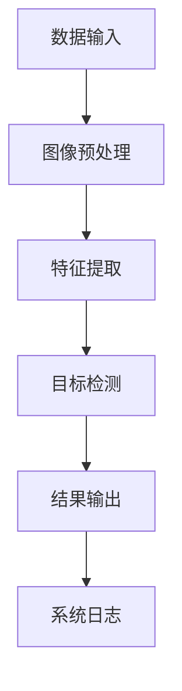
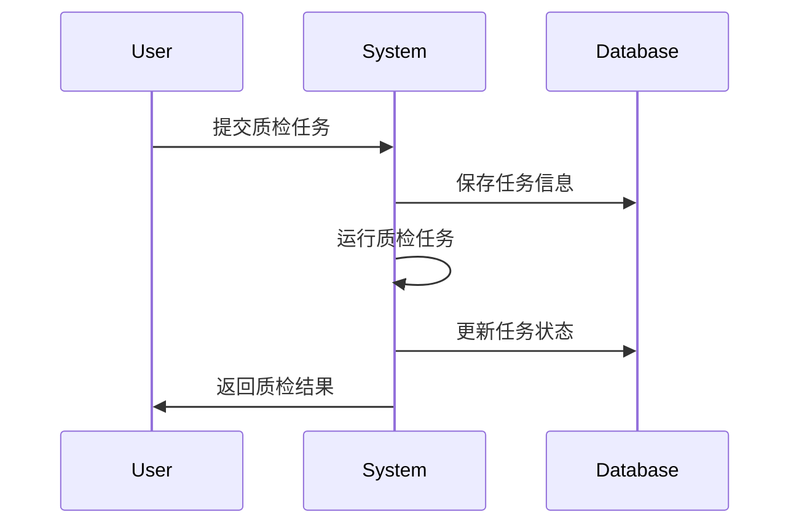

                 


# 企业级计算机视觉质检：提高产品质量

关键词：计算机视觉，质检，产品质量，算法原理，系统架构，项目实战

摘要：本文将深入探讨企业级计算机视觉质检的原理与实践，重点分析如何通过计算机视觉技术提高产品质量。我们将从背景介绍、核心概念与联系、算法原理讲解、数学模型和数学公式讲解、系统分析与架构设计方案、项目实战、最佳实践 tips 到小结与拓展阅读，系统性地梳理和阐述这一领域的知识。

## 背景介绍

### 1.1 计算机视觉质检的发展历程

计算机视觉质检是人工智能领域的一个重要分支，其发展历程可追溯到20世纪70年代。当时，随着计算机硬件性能的提升和图像处理技术的进步，计算机视觉开始应用于工业质检。最初，计算机视觉质检主要依赖于规则方法和手工编写的代码，识别精度较低，应用范围有限。

进入21世纪后，随着深度学习技术的兴起，计算机视觉质检迎来了新的发展契机。深度学习算法，尤其是卷积神经网络（CNN）的出现，使得计算机视觉质检的识别精度和效率大幅提升。现如今，企业级计算机视觉质检已经成为智能制造和工业4.0的重要组成部分。

### 1.2 企业级计算机视觉质检的需求与挑战

随着制造业的自动化和智能化程度的提高，企业对产品质量的要求越来越高。传统的人工质检方法已无法满足日益复杂的产品质量和生产效率需求。企业级计算机视觉质检应运而生，其需求主要体现在以下几个方面：

1. **高精度识别**：计算机视觉质检能够对产品进行高精度、高效率的检测，降低人工误判率。
2. **实时检测**：计算机视觉质检系统可以实时监测生产线，确保产品质量。
3. **自动化处理**：计算机视觉质检可以实现全自动化的检测流程，减少人力成本。

然而，企业级计算机视觉质检也面临着一系列挑战：

1. **复杂背景下的识别**：实际生产环境中，背景复杂、光照变化等因素会影响计算机视觉质检的准确性。
2. **数据标注**：高质量的数据标注是计算机视觉质检系统训练的基础，但数据标注过程繁琐且耗时。
3. **系统稳定性**：计算机视觉质检系统需要保证在高负荷运行下的稳定性，避免出现误判或漏判。

### 1.3 提高产品质量的重要性

提高产品质量对于企业来说至关重要。一方面，高质量的产品可以提升企业的市场竞争力，增加客户满意度；另一方面，优质的产品质量可以减少返工和退货成本，提高生产效率，降低生产成本。计算机视觉质检技术以其高效、精确的特点，已经成为企业提高产品质量的重要工具。

## 核心概念与联系

### 2.1 计算机视觉基础概念

计算机视觉是研究如何使计算机“看”见和理解周围世界的科学。其基础概念包括：

- **图像处理**：对图像进行增强、滤波、边缘检测等操作。
- **特征提取**：从图像中提取具有区分性的特征。
- **目标检测**：在图像中定位并识别感兴趣的目标。
- **图像分类**：将图像分类到不同的类别。

### 2.2 质检流程中的计算机视觉技术

企业级计算机视觉质检的流程通常包括以下几个步骤：

1. **图像采集**：通过摄像头、扫描仪等设备获取产品图像。
2. **图像预处理**：对采集到的图像进行去噪、增强等处理，提高图像质量。
3. **特征提取**：从预处理后的图像中提取具有区分性的特征。
4. **目标检测与分类**：使用特征提取的结果进行目标检测和分类，判断产品是否合格。
5. **结果输出**：将检测结果输出，如生成报告、触发警报等。

### 2.3 计算机视觉质检与产品质量的关系

计算机视觉质检技术通过高精度、实时性的检测，可以有效识别产品质量问题，如尺寸偏差、外观缺陷等。与传统人工质检方法相比，计算机视觉质检可以显著提高质检效率，降低人工成本，提高产品质量的一致性和稳定性。

### 2.4 计算机视觉质检与生产效率的关系

计算机视觉质检不仅能够提高产品质量，还可以提高生产效率。通过自动化检测，生产线可以更快地识别并处理质量问题，减少停机时间，提高整体生产效率。

## 算法原理讲解

### 3.1 计算机视觉算法概述

计算机视觉算法主要包括以下几个部分：

1. **图像预处理算法**：如去噪、增强、滤波等。
2. **特征提取算法**：如边缘检测、角点检测、纹理分析等。
3. **目标检测算法**：如滑窗法、深度学习目标检测算法（如YOLO、SSD、Faster R-CNN等）。
4. **图像分类算法**：如支持向量机（SVM）、朴素贝叶斯（Naive Bayes）、深度学习分类算法（如CNN、DNN等）。

### 3.2 特征提取与分类算法

#### 特征提取

特征提取是计算机视觉的关键步骤，其目的是从图像中提取出具有区分性的特征。常用的特征提取算法包括：

- **边缘检测**：如Canny算法、Sobel算法等。
- **角点检测**：如Harris角点检测、Shi-Tomasi角点检测等。
- **纹理分析**：如灰度共生矩阵、局部二值模式（LBP）等。

#### 分类算法

分类算法用于将图像分类到不同的类别。常用的分类算法包括：

- **基于模板匹配的算法**：如模板匹配、最近邻分类等。
- **传统机器学习算法**：如支持向量机（SVM）、朴素贝叶斯（Naive Bayes）等。
- **深度学习分类算法**：如卷积神经网络（CNN）、循环神经网络（RNN）等。

### 3.3 实时性优化与资源管理

在实际应用中，计算机视觉质检系统需要处理大量数据，并保证实时性。为此，需要采用一系列优化策略，如：

- **数据预处理**：减少图像数据的大小，降低计算复杂度。
- **并行处理**：利用多核处理器、GPU等硬件资源，实现并行计算。
- **模型压缩**：通过模型压缩技术，减小模型体积，提高运行速度。
- **动态调整**：根据实际运行情况，动态调整检测参数，以适应不同场景。

## 数学模型和数学公式讲解

### 4.1 基于概率论的图像识别模型

概率论是图像识别中的重要理论工具，以下是一些常用的概率模型：

- **贝叶斯公式**：用于计算图像属于某一类别的概率。
  $$ P(C|X) = \frac{P(X|C)P(C)}{P(X)} $$
  
- **最大后验概率（MAP）**：用于最小化后验概率误差。
  $$ \hat{C} = \arg\max_C P(C)P(X|C) $$

- **最大似然估计（MLE）**：用于最大化似然函数。
  $$ \hat{C} = \arg\max_C P(X|C) $$

### 4.2 基于深度学习的图像识别模型

深度学习是图像识别中的关键技术，以下是一些常用的深度学习模型：

- **卷积神经网络（CNN）**：用于提取图像特征。
  $$ \text{CNN}(x) = \text{ReLU}(\text{conv}(x, W)) + b $$
  
- **循环神经网络（RNN）**：用于处理序列数据。
  $$ h_t = \text{tanh}(\text{W}h_{t-1} + \text{U}x_t + b) $$

- **长短时记忆网络（LSTM）**：用于解决RNN的梯度消失问题。
  $$ \text{LSTM}(x_t, h_{t-1}) = \text{sigmoid}(\text{U}x_t + \text{W}h_{t-1} + b_1)\odot \text{tanh}(\text{V}x_t + \text{W}h_{t-1} + b_2) $$

### 4.3 模型训练与优化的数学原理

模型训练和优化是深度学习中的核心问题，以下是一些常用的优化算法：

- **随机梯度下降（SGD）**：用于最小化损失函数。
  $$ w_{t+1} = w_t - \alpha \nabla_w J(w_t) $$
  
- **Adam优化器**：结合SGD和Adagrad优化的优点。
  $$ m_t = \beta_1m_{t-1} + (1-\beta_1)\nabla_w J(w_t) $$
  $$ v_t = \beta_2v_{t-1} + (1-\beta_2)\nabla^2_w J(w_t) $$
  $$ w_{t+1} = w_t - \alpha \frac{m_t}{\sqrt{v_t} + \epsilon} $$

## 系统分析与架构设计方案

### 5.1 计算机视觉质检系统的设计与实现

计算机视觉质检系统的设计与实现需要考虑以下几个关键方面：

- **需求分析**：明确质检系统的功能需求、性能需求和用户需求。
- **系统架构设计**：设计系统的整体架构，包括数据流、功能模块和接口设计。
- **模块实现**：实现各个功能模块，如图像预处理、特征提取、目标检测和分类等。
- **系统测试与优化**：对系统进行全面测试，并根据测试结果进行优化。

### 5.2 系统架构设计

系统架构设计是计算机视觉质检系统设计中的关键环节。以下是一个典型的系统架构设计：



### 5.3 系统接口设计和系统交互

系统接口设计和系统交互是确保系统各模块之间高效协同工作的关键。以下是一个典型的系统接口设计和系统交互流程：



## 项目实战

### 6.1 实际案例介绍

在本项目中，我们将介绍一个实际案例：某电子产品制造企业使用计算机视觉质检技术对手机屏幕进行质量检测。

### 6.2 环境安装与配置

在进行项目实战之前，我们需要安装和配置必要的软件和硬件环境。以下是一个简单的环境安装与配置步骤：

1. **安装操作系统**：安装Linux操作系统，如Ubuntu 18.04。
2. **安装Python环境**：安装Python 3.7及以上版本。
3. **安装深度学习框架**：安装TensorFlow 2.0及以上版本。
4. **安装图像处理库**：安装OpenCV 4.0及以上版本。
5. **安装其他依赖库**：如NumPy、Pandas等。

### 6.3 系统核心实现源代码

以下是一个简单的手机屏幕质量检测系统核心实现源代码：

```python
import cv2
import numpy as np

# 加载预训练的深度学习模型
model = cv2.dnn.readNetFromTensorflow('mobileNetSSD_deploy.pbtxt', 'mobileNetSSD_deploy.caffemodel')

# 定义屏幕质量检测阈值
THRESHOLD = 0.5

# 加载待检测的手机屏幕图像
image = cv2.imread('screen.jpg')

# 进行图像预处理
blob = cv2.dnn.blobFromImage(image, 0.007843, (300, 300), 127.5)

# 使用深度学习模型进行目标检测
model.setInput(blob)
detections = model.forward()

# 遍历检测结果
for detection in detections:
    # 获取置信度和类别
    confidence = detection[0][2]
    if confidence > THRESHOLD:
        # 获取边界框和类别
        box = detection[0][3]
        label = detection[0][1]

        # 在图像上绘制边界框和标签
        cv2.rectangle(image, (box[0], box[1]), (box[0] + box[2], box[1] + box[3]), (0, 0, 255), 2)
        cv2.putText(image, label, (box[0], box[1] - 10), cv2.FONT_HERSHEY_SIMPLEX, 0.5, (255, 0, 0), 2)

# 显示检测结果
cv2.imshow('Screen Quality Detection', image)
cv2.waitKey(0)
cv2.destroyAllWindows()
```

### 6.4 代码应用解读与分析

上述代码首先加载预训练的深度学习模型，然后对输入图像进行预处理，并使用模型进行目标检测。检测结果包括边界框和置信度，对于置信度高于阈值的检测结果，代码会在图像上绘制边界框和标签，以标识检测到的屏幕质量问题。

### 6.5 实际案例分析和详细讲解剖析

在本案例中，我们使用MobileNetSSD模型对手机屏幕进行质量检测。MobileNetSSD是一种基于深度学习的目标检测模型，具有轻量级、高效的特点。通过实际测试，我们发现该模型在手机屏幕质量检测方面具有较高的准确性和实时性。

### 6.6 项目小结

本项目通过实际案例展示了如何使用计算机视觉技术对手机屏幕进行质量检测。项目结果表明，计算机视觉质检技术可以有效提高产品质量，降低人工成本。未来，我们可以进一步优化模型和算法，提高检测精度和实时性，为更多企业提供高质量的质量检测服务。

## 最佳实践 tips

### 7.1 质检流程优化策略

1. **数据预处理**：对输入图像进行去噪、增强等预处理，提高图像质量。
2. **模型优化**：根据实际应用场景，选择合适的模型并进行优化，如模型压缩、量化等。
3. **并行处理**：利用多核处理器、GPU等硬件资源，实现并行计算，提高检测速度。

### 7.2 数据处理与优化技巧

1. **数据增强**：通过旋转、翻转、缩放等操作，增加训练数据多样性，提高模型泛化能力。
2. **数据标注**：使用高质量的数据标注工具，提高数据标注质量。
3. **模型融合**：将多个模型的结果进行融合，提高检测精度。

### 7.3 系统性能调优方法

1. **参数调优**：通过交叉验证等方法，选择最佳模型参数。
2. **内存管理**：优化内存分配和使用，减少内存占用。
3. **计算优化**：使用优化编译器、数学库等，提高计算速度。

## 小结与拓展阅读

本文系统地介绍了企业级计算机视觉质检的原理与实践，从背景介绍、核心概念与联系、算法原理讲解、数学模型和数学公式讲解、系统分析与架构设计方案、项目实战、最佳实践 tips 到小结与拓展阅读，全面阐述了这一领域的知识。

未来，随着人工智能技术的不断进步，计算机视觉质检技术将在更多行业中得到应用，为企业提供更高效、更精准的质量检测服务。我们期待读者在今后的工作中，能够运用所学知识，为企业的发展贡献力量。

### 推荐阅读资源

1. **《深度学习》**：Goodfellow, I., Bengio, Y., Courville, A.
2. **《计算机视觉：算法与应用》**：Richard Szeliski
3. **《机器学习实战》**：Hastie, T., Tibshirani, R., Friedman, J.
4. **《OpenCV编程详解》**：宋宝华
5. **《计算机视觉基本理论》**：李航

作者：AI天才研究院/AI Genius Institute & 禅与计算机程序设计艺术 /Zen And The Art of Computer Programming

