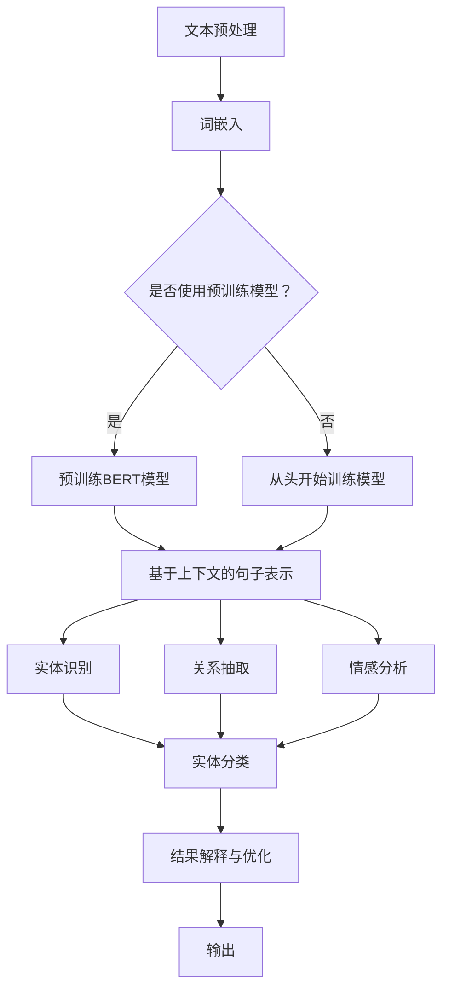
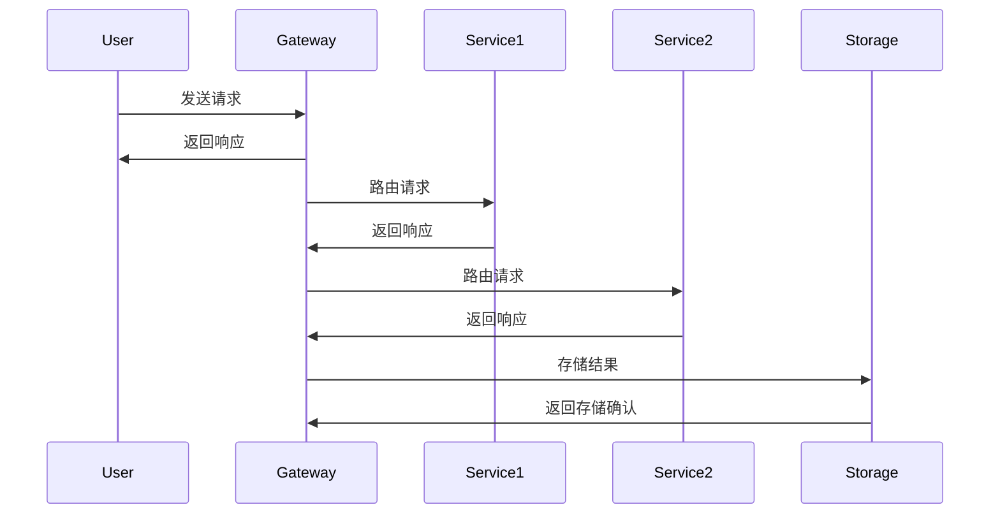

                 


### 1.1 问题背景

#### 1.1.1 当前人机交互面临的挑战

随着信息技术的飞速发展，人机交互成为了现代社会不可或缺的一部分。然而，当前的人机交互面临着诸多挑战。首先，用户的需求日益多样化，他们希望能够与计算机系统进行更自然、更高效的交流。传统的命令行界面和图形用户界面（GUI）已经无法满足用户对于便捷性、个性化和服务质量的要求。其次，数据的爆炸式增长使得信息的组织和提取变得异常复杂。企业需要处理大量的非结构化和半结构化数据，这给语义理解提出了更高的要求。最后，随着人工智能技术的普及，用户对系统的智能程度也有了更高的期待。他们希望系统能够理解自己的意图，提供个性化的服务，甚至具备情感交互的能力。

#### 1.1.2 语义理解引擎的作用

在此背景下，语义理解引擎成为了提升人机交互质量的关键技术。语义理解引擎是一种能够解析人类语言语义、提取信息、生成响应的智能系统。它能够通过自然语言处理（NLP）技术，理解用户输入的文本或语音信息，并将其转换为系统能够处理的结构化数据。具体来说，语义理解引擎有以下作用：

1. **提高交互效率**：通过理解用户的意图，系统能够快速、准确地响应用户请求，减少用户等待时间，提高交互效率。
   
2. **实现个性化服务**：语义理解引擎可以根据用户的历史行为和偏好，提供个性化的服务和建议，提升用户体验。

3. **增强情感交互**：通过理解用户的情感状态，系统可以生成更加贴近用户情感的响应，增强人机交互的温暖度。

4. **自动化信息处理**：语义理解引擎可以自动处理大量的信息，减轻人工负担，提高工作效率。

5. **改善用户体验**：通过自然的语言交互，用户能够更加直观地与系统沟通，减少学习成本，提高使用满意度。

#### 1.1.3 企业级语义理解引擎的重要性

在企业层面，语义理解引擎同样具有极高的价值。企业面临着日益复杂的业务环境和不断增长的数据量，如何快速有效地处理和利用这些数据成为了关键问题。企业级语义理解引擎可以帮助企业：

1. **优化业务流程**：通过自动化处理业务数据，优化业务流程，减少人工干预，提高工作效率。

2. **提升决策质量**：语义理解引擎能够从大量数据中提取关键信息，为决策者提供更准确的依据。

3. **增强客户体验**：通过提供个性化的服务，提升客户满意度，增强品牌竞争力。

4. **降低运营成本**：自动化处理数据和信息，减少人力资源的投入，降低运营成本。

5. **提高市场竞争力**：具备先进的语义理解能力的企业能够在市场中脱颖而出，赢得更多商机。

综上所述，企业级语义理解引擎不仅是一种技术工具，更是提升人机交互质量、优化企业运营、增强市场竞争力的重要手段。在接下来的章节中，我们将深入探讨语义理解引擎的基本原理、架构设计、开发与实现、性能评估与优化等方面，为读者提供全面的技术指南。

### 1.2 问题定义与解决思路

#### 1.2.1 问题的定义

在探讨企业级语义理解引擎之前，我们需要明确问题的定义。语义理解引擎的核心问题是如何准确、高效地处理自然语言，实现人机交互的优化。具体来说，包括以下几个方面：

1. **语言理解**：如何从自然语言文本中提取出用户的意图、情感和关键信息？
   
2. **上下文处理**：如何在不同语境中保持语言的一致性和连贯性？
   
3. **个性化服务**：如何根据用户的历史行为和偏好，提供个性化的服务和建议？
   
4. **情感交互**：如何通过语言交互模拟人类的情感表达，增强人机交互的温暖度？

#### 1.2.2 解决思路

为了解决上述问题，我们可以从以下几个方面入手：

1. **技术手段**：采用先进的自然语言处理（NLP）技术，包括词嵌入、上下文理解、情感分析等，提高语义理解引擎的准确性和效率。

2. **数据驱动**：通过大规模数据集的训练，使语义理解引擎具备更强的学习能力，能够不断优化自身的理解能力。

3. **系统架构**：设计合理的企业级系统架构，确保语义理解引擎能够高效、稳定地运行，同时具备良好的扩展性和可维护性。

4. **用户体验**：从用户的角度出发，优化人机交互界面，提供直观、便捷的操作方式，提升用户体验。

5. **安全性**：在系统设计和实现过程中，充分考虑安全性问题，确保用户数据的安全和隐私。

#### 1.2.3 边界与外延

在定义问题边界时，我们需要明确以下几点：

1. **技术范围**：语义理解引擎主要关注自然语言处理技术，不包括其他类型的数据处理（如图像、音频等）。

2. **应用场景**：本文主要讨论企业级应用场景，不涉及个人或学术研究领域的语义理解问题。

3. **系统范围**：语义理解引擎是企业级系统的一个组成部分，不包括整个企业级系统的其他功能模块。

4. **数据处理**：语义理解引擎主要负责文本和语音信息的处理，不包括数据存储、传输等其他数据处理环节。

5. **时间范围**：本文关注的是当前的语义理解技术，不包括未来可能出现的新技术或发展。

通过明确问题的定义和解决思路，我们可以为后续章节的深入探讨提供清晰的方向。在接下来的部分中，我们将详细分析语义理解引擎的核心概念和基本原理，为读者搭建全面的技术认知框架。

### 1.3 核心概念与联系

#### 1.3.1 语义理解的定义

语义理解是指计算机系统对自然语言（如文本、语音）进行解析和解释，以提取出语言中的含义、意图和关系。语义理解不仅仅停留在表面字面的理解，更涉及深层次的语言含义，如语境、情感、意图等。简而言之，语义理解是使计算机具备“听懂”和“理解”人类语言的能力。

在语义理解中，几个关键概念需要明确：

1. **语义**：语义是指语言表达所承载的意义。在不同的语境下，同一个词语可能具有不同的语义。
   
2. **意图**：意图是指说话者通过语言表达希望达到的目标或效果。理解用户的意图是语义理解的核心任务之一。
   
3. **上下文**：上下文是指语言表达所处的环境，包括前后文、语境等。上下文对语义理解具有重要作用，能够帮助确定词语的语义和意图。

#### 1.3.2 语义理解引擎的组成部分

语义理解引擎通常由以下几个核心组件构成：

1. **语言模型**：语言模型用于捕捉语言的统计规律，对文本进行建模。常见的语言模型有基于统计的N-gram模型和基于神经网络的深度学习模型（如Transformer）。

2. **词嵌入**：词嵌入将词语映射到高维向量空间，使得相似的词语在向量空间中更接近。词嵌入是实现语义理解的基础。

3. **实体识别**：实体识别是指从文本中提取出具体的实体（如人名、地名、组织名等），并将其分类到预定义的实体类别中。

4. **关系抽取**：关系抽取是指识别文本中实体之间的关系，如“张三”和“清华大学”之间的“毕业于”关系。

5. **情感分析**：情感分析是指从文本中识别出情感倾向，如正面、负面或中性。情感分析对于提升用户体验和智能化服务至关重要。

6. **意图识别**：意图识别是指从用户输入中提取出用户的意图，如查询天气、预定机票等。

#### 1.3.3 关键概念对比与联系

为了更好地理解语义理解引擎的工作原理，我们可以将关键概念进行对比和分析：

| 关键概念 | 定义 | 关联关系 |
| --- | --- | --- |
| **词嵌入** | 将词语映射到高维向量空间 | 基础，为语义理解提供输入 |
| **实体识别** | 从文本中提取出实体并分类 | 输出，用于关系抽取和意图识别 |
| **关系抽取** | 识别文本中实体之间的关系 | 输出，用于构建知识图谱 |
| **情感分析** | 从文本中识别出情感倾向 | 输出，用于个性化服务和用户体验 |
| **意图识别** | 从用户输入中提取出用户的意图 | 输出，用于生成响应和自动化处理 |

通过上述对比，我们可以看出各个概念之间的关联关系，以及它们在语义理解过程中的作用。词嵌入作为基础，为后续的实体识别、关系抽取和意图识别提供了必要的输入。实体识别和关系抽取是生成知识图谱的重要步骤，而情感分析和意图识别则直接关系到用户体验和智能化服务的质量。

总之，语义理解引擎通过对关键概念的深入理解和处理，能够实现从自然语言到结构化数据的转化，为人机交互提供高效、智能的解决方案。

### 1.4 本章小结

本章我们深入探讨了企业级语义理解引擎的背景、问题定义与解决思路，以及核心概念与联系。首先，我们分析了当前人机交互面临的挑战，阐述了语义理解引擎在提升交互效率、实现个性化服务、增强情感交互等方面的作用。接着，我们明确了问题的定义，从技术手段、数据驱动、系统架构、用户体验和安全性等多个方面提出了解决思路。最后，我们详细介绍了语义理解的关键概念，包括语义、意图、上下文等，并分析了语义理解引擎的组成部分及其相互关系。

通过本章的讨论，读者可以对语义理解引擎有一个全面、系统的认识，为后续章节的学习打下坚实的基础。在接下来的章节中，我们将进一步探讨语义理解引擎的基本原理，分析其工作流程和算法实现，为构建高效、智能的企业级语义理解系统提供理论依据和实践指导。

### 2.1 语义理解引擎的核心概念

#### 2.1.1 自然语言处理（NLP）

自然语言处理（NLP）是语义理解引擎的核心技术之一。它涉及到计算机与人类语言之间的交互，旨在使计算机能够理解、生成和 manipulatenatural language。NLP的应用领域广泛，包括机器翻译、情感分析、问答系统、文本摘要、语音识别等。

**关键概念**：

- **分词**：将连续的文本切分成单个的词语，这是进行NLP处理的第一步。
- **词性标注**：为文本中的每个词分配一个词性，如名词、动词、形容词等。
- **句法分析**：对句子进行结构分析，识别句子中的成分和语法关系。
- **语义角色标注**：识别句子中词语之间的语义关系，如主语、谓语、宾语等。

#### 2.1.2 机器学习与深度学习

机器学习和深度学习是语义理解引擎实现智能化的关键。通过训练模型，使得计算机能够从数据中学习并提取特征，从而进行语义理解。

**关键概念**：

- **特征工程**：通过人工提取和选择特征，以改善机器学习模型的性能。
- **监督学习**：利用标注数据进行训练，以预测新数据的标签。
- **无监督学习**：在没有标签数据的情况下，通过模式识别自动发现数据中的结构。
- **深度学习**：一种基于人工神经网络的机器学习方法，通过多层网络结构自动提取特征。

#### 2.1.3 语义分析技术

语义分析技术是语义理解引擎实现语义理解的核心。它涉及到从自然语言中提取出语言的意义、意图和结构。

**关键概念**：

- **词嵌入**：将词语映射到高维向量空间，以捕捉词语之间的语义关系。
- **实体识别**：识别文本中的实体，如人名、地名、组织名等，并进行分类。
- **关系抽取**：从文本中抽取实体之间的关系，如“张三”和“清华大学”之间的“毕业于”关系。
- **指代消解**：解决文本中的指代问题，如确定“他”指的是“张三”还是另一个实体。
- **情感分析**：识别文本中的情感倾向，如正面、负面或中性。

#### 2.1.4 对比与联系

**自然语言处理（NLP）与机器学习**：

- NLP是NLP技术的总称，而机器学习是NLP的一个重要分支，主要用于实现语义理解中的模式识别和预测任务。
- NLP为机器学习提供了数据预处理和特征提取的工具，而机器学习则为NLP提供了实现语义理解的能力。

**机器学习与深度学习**：

- 机器学习是一种更广泛的学习方法，包括监督学习、无监督学习和半监督学习等。
- 深度学习是机器学习的一个分支，通过多层神经网络结构自动提取特征，在处理复杂数据时表现出色。

**语义分析技术**：

- 语义分析技术涵盖了从词嵌入到情感分析的多个层次，它们共同作用，使得语义理解引擎能够准确、全面地理解自然语言。
- 词嵌入是实现语义分析的基础，而实体识别、关系抽取和情感分析则是在词嵌入基础上进行的更高层次的语义理解。

通过上述核心概念的介绍，我们可以看到语义理解引擎是如何通过自然语言处理、机器学习和深度学习等技术，实现从自然语言到结构化数据的转化。在下一章节中，我们将详细探讨语义理解引擎的工作流程，为读者揭示其内部运作机制。

### 2.2 语义理解引擎的工作流程

#### 2.2.1 数据预处理

数据预处理是语义理解引擎工作的第一步，其目的是将原始数据转换为适合模型训练和推理的形式。数据预处理包括以下几个关键步骤：

1. **文本清洗**：去除文本中的无关信息，如HTML标签、特殊字符和停用词。这一步可以显著提高后续处理的质量。
   
2. **分词**：将连续的文本切分成单个的词语。中文和英文的分词方法有所不同，中文通常使用基于词典的分词算法，而英文则常用基于统计的方法。
   
3. **词性标注**：为文本中的每个词分配一个词性，如名词、动词、形容词等。词性标注有助于理解词语在句子中的作用，是后续句法分析和语义理解的基础。
   
4. **实体识别**：从文本中提取出具体的实体，如人名、地名、组织名等，并进行分类。实体识别是构建知识图谱和进行关系抽取的重要步骤。

5. **上下文信息提取**：获取文本的上下文信息，包括句子、段落和文档级别的特征。上下文信息有助于更准确地理解词语和句子的含义。

#### 2.2.2 特征提取

特征提取是将预处理后的文本数据转换为机器学习模型可处理的向量表示。特征提取的关键步骤如下：

1. **词嵌入**：将词语映射到高维向量空间，以捕捉词语之间的语义关系。常用的词嵌入方法包括Word2Vec、GloVe和BERT等。
   
2. **词性特征**：利用词性标注结果，为每个词语添加词性特征。这些特征有助于模型更好地理解词语的语法角色和语义属性。

3. **上下文特征**：通过词嵌入和词性特征，提取文本的上下文信息。上下文特征可以采用窗口编码、位置编码等方法进行表示。

4. **语法特征**：利用句法分析结果，提取句子中的语法特征，如句法树结构、依赖关系等。这些特征有助于模型理解句子的语法结构和语义含义。

#### 2.2.3 语义分析

语义分析是语义理解引擎的核心任务，其目的是从文本中提取出语言的意义、意图和结构。语义分析的步骤包括：

1. **实体识别**：从文本中提取出实体，如人名、地名、组织名等，并对其进行分类。实体识别是构建知识图谱和进行关系抽取的基础。

2. **关系抽取**：从文本中抽取实体之间的关系，如“张三”和“清华大学”之间的“毕业于”关系。关系抽取有助于建立实体之间的关联，形成语义网络。

3. **情感分析**：识别文本中的情感倾向，如正面、负面或中性。情感分析对于提供个性化服务和提升用户体验具有重要意义。

4. **意图识别**：从用户输入中提取出用户的意图，如查询天气、预定机票等。意图识别是实现智能化服务和自动化处理的关键。

#### 2.2.4 结果解释与优化

结果解释与优化是确保语义理解引擎输出准确、可靠结果的最后一步。这一步骤包括：

1. **结果解释**：对语义分析的结果进行解释，包括实体的含义、关系和情感倾向等。结果解释有助于用户理解和验证系统的输出。

2. **结果优化**：通过模型调参、数据增强和迁移学习等方法，优化语义理解引擎的性能。优化策略包括降低误识别率、提高召回率、增强鲁棒性等。

3. **持续学习**：利用用户反馈和数据反馈，对语义理解引擎进行持续学习，使其不断改进和优化。

#### 2.2.5 总结

语义理解引擎的工作流程包括数据预处理、特征提取、语义分析、结果解释与优化等步骤。每个步骤都有其特定的任务和实现方法，共同作用，使得语义理解引擎能够准确、高效地处理自然语言，实现人机交互的优化。在下一章节中，我们将介绍主流的语义理解算法，为读者提供更深入的技术解读。

### 2.3 主流语义理解算法

在语义理解领域，多种算法被广泛应用，每种算法都有其独特的优势和适用场景。以下我们将介绍几种主流的语义理解算法，包括词嵌入技术、上下文理解算法和预训练语言模型，并比较它们的优缺点。

#### 2.3.1 词嵌入技术

词嵌入（Word Embedding）是一种将词语映射到高维向量空间的方法，以捕捉词语之间的语义关系。词嵌入技术可以分为两类：基于统计的方法和基于神经网络的深度学习方法。

1. **基于统计的方法**：

   - **N-gram模型**：N-gram模型将连续的N个词作为一个整体进行建模，通过统计词频来学习词语之间的关联。这种方法简单有效，但存在长距离依赖问题。
   - **共现矩阵**：通过构建词语共现矩阵，使用矩阵分解技术（如Singular Value Decomposition, SVD）提取词语的向量表示。这种方法能够捕捉词语的潜在语义关系，但计算复杂度高。

2. **基于神经网络的深度学习方法**：

   - **Word2Vec**：Word2Vec是一种基于神经网络的词嵌入方法，通过训练神经网络来预测邻近词，从而学习词语的向量表示。Word2Vec方法包括CBOW（连续词 bags of words）和Skip-gram两种模型。
   - **GloVe**：GloVe（Global Vectors for Word Representation）是一种基于全局上下文的词嵌入方法，通过优化词语和上下文之间的共现关系来学习词语的向量表示。
   - **FastText**：FastText通过将词语分解为字符级别的子词（subword），然后对子词进行嵌入，从而克服了Word2Vec在处理罕见词时的不足。

**优缺点对比**：

- **优点**：词嵌入技术能够有效捕捉词语之间的语义关系，提高语义理解的准确性和效率。
- **缺点**：基于统计的方法存在长距离依赖问题，而基于神经网络的方法计算复杂度高，训练时间长。

#### 2.3.2 上下文理解算法

上下文理解算法旨在捕捉词语在不同语境下的语义变化，提高语义理解的灵活性和准确性。

1. **基于规则的算法**：

   - **词法分析**：通过规则和模式识别，对文本进行语法和语义分析。这种方法适用于简单的上下文理解任务，但难以应对复杂语境。
   - **句法分析**：利用句法规则和句法结构，对句子进行语法分析，以理解词语的语义关系。这种方法能够捕捉句子层面的语义信息，但难以处理长文本。

2. **基于统计的方法**：

   - **统计语言模型**：通过统计词语在文本中的出现频率和顺序，预测下一个词语。这种方法在文本生成和文本分类中表现出色，但难以捕捉词语之间的深层次语义关系。
   - **转移矩阵**：利用转移矩阵表示词语之间的概率关系，通过矩阵乘法计算词语的上下文表示。这种方法能够捕捉词语的局部语义关系，但难以处理长距离依赖。

3. **基于神经网络的深度学习方法**：

   - **长短期记忆网络（LSTM）**：LSTM通过引入记忆单元，能够捕捉长距离依赖，适用于处理序列数据。但LSTM在处理长文本时存在梯度消失和梯度爆炸问题。
   - **Transformer**：Transformer通过自注意力机制（self-attention）实现全局上下文建模，能够在并行计算和长距离依赖处理方面表现出色。但Transformer的计算复杂度较高，内存占用大。

**优缺点对比**：

- **优点**：基于规则的算法和基于统计的方法能够快速处理文本，适用于简单的上下文理解任务。
- **缺点**：基于神经网络的方法能够捕捉深层次语义关系，但在计算复杂度和训练时间方面存在挑战。

#### 2.3.3 预训练语言模型

预训练语言模型（Pre-trained Language Model）是一种结合词嵌入技术和上下文理解算法的语义理解方法。预训练语言模型通过在大型语料库上预训练，学习词语和句子的表示，然后在具体任务上进行微调。

1. **BERT**：BERT（Bidirectional Encoder Representations from Transformers）是一种基于Transformer的预训练语言模型，通过双向注意力机制学习词语的表示。BERT在多种自然语言处理任务上表现出色，如问答系统、文本分类和命名实体识别。
   
2. **GPT**：GPT（Generative Pre-trained Transformer）是一种基于Transformer的预训练语言模型，通过自回归方式生成文本。GPT在文本生成和对话系统等任务上表现出色，但难以捕捉上下文信息。

3. **RoBERTa**：RoBERTa是在BERT的基础上优化的一种预训练语言模型，通过调整训练策略和模型结构，提高了性能。

**优缺点对比**：

- **优点**：预训练语言模型能够通过大规模预训练学习到丰富的语义信息，提高语义理解的准确性和泛化能力。
- **缺点**：预训练语言模型需要大量计算资源和数据，训练时间较长。

综上所述，主流的语义理解算法各有优缺点。词嵌入技术能够捕捉词语的语义关系，上下文理解算法能够捕捉词语在不同语境下的变化，而预训练语言模型则能够综合两者，提供更高的语义理解能力。选择合适的算法取决于具体的应用场景和需求。

### 2.4 语义理解引擎的数学模型

#### 2.4.1 数学基础

在深入探讨语义理解引擎的数学模型之前，我们需要掌握一些基础的数学知识，包括线性代数、概率论和优化算法。以下是这些数学基础的重要概念：

1. **线性代数**：

   - **向量与矩阵**：向量是数学中的基本对象，由一组数表示；矩阵是多个向量的集合，可以表示线性变换。在语义理解中，向量常用于表示词语和句子。
   - **矩阵乘法**：矩阵乘法是一种线性变换，用于计算两个矩阵的乘积。在词嵌入和语义分析中，矩阵乘法用于计算向量之间的相似性。
   - **矩阵分解**：矩阵分解是将一个矩阵分解为两个或多个矩阵的乘积。常见的矩阵分解方法包括奇异值分解（SVD）和主成分分析（PCA）。

2. **概率论**：

   - **概率分布**：概率分布描述了随机变量在不同取值上的概率。在自然语言处理中，概率分布用于预测词语和句子的可能性。
   - **条件概率**：条件概率是指在某个事件发生的条件下，另一个事件发生的概率。在语义理解中，条件概率用于计算词语之间的关系。
   - **贝叶斯定理**：贝叶斯定理是一种基于条件概率的推理方法，用于计算后验概率。在语义理解中，贝叶斯定理用于进行概率推理和分类。

3. **优化算法**：

   - **梯度下降**：梯度下降是一种优化算法，用于最小化损失函数。在机器学习中，梯度下降用于训练模型，使其对数据拟合得更好。
   - **随机梯度下降（SGD）**：随机梯度下降是梯度下降的一种变种，通过随机选取样本进行梯度更新，提高训练速度。
   - **动量（Momentum）**：动量是一种加速梯度下降的方法，通过保留之前的梯度信息，加速收敛。

#### 2.4.2 数学公式与模型

以下是语义理解引擎中常用的一些数学公式和模型：

1. **词嵌入模型**：

   - **Word2Vec模型**：

     $$ \text{input vector} = \sum_{w \in \text{context}(c)} \text{softmax}(W_c \text{word vector}) $$
     
     其中，$\text{context}(c)$表示词$c$的上下文词语，$W_c$是上下文词语的词向量矩阵。

   - **GloVe模型**：

     $$ \text{loss} = \frac{1}{2} \sum_{w \in V} \sum_{v \in C(w)} \frac{\text{exp}(-\text{similarity}(v, w))}{\|v\|_2 \|^2 + \|w\|_2 \|^2} $$
     
     其中，$\text{similarity}(v, w)$是向量$v$和$w$之间的余弦相似度，$C(w)$是词语$w$的上下文词语集合。

2. **神经网络模型**：

   - **多层感知机（MLP）**：

     $$ \text{output} = \text{sigmoid}(W \text{input vector} + b) $$
     
     其中，$W$是权重矩阵，$b$是偏置项，$\text{sigmoid}$函数用于激活。

   - **长短期记忆网络（LSTM）**：

     $$ \text{output} = \text{sigmoid}(W_f \text{input} + b_f) \odot \text{output}_{\text{prev}} $$
     
     其中，$W_f$是遗忘门权重矩阵，$\text{sigmoid}$函数用于计算遗忘门的输出，$\odot$表示逐元素乘法。

3. **预训练语言模型**：

   - **BERT模型**：

     $$ \text{output} = \text{Transformer}(\text{input sequence}) $$
     
     其中，$\text{input sequence}$是输入序列，$\text{Transformer}$是自注意力机制的网络结构。

4. **损失函数**：

   - **交叉熵损失（Cross-Entropy Loss）**：

     $$ \text{loss} = -\sum_{i=1}^n y_i \log(p_i) $$
     
     其中，$y_i$是真实标签，$p_i$是预测概率。

#### 2.4.3 算法流程图

以下是一个基于BERT的语义理解引擎的算法流程图，使用Mermaid语法表示：



通过上述数学模型和算法流程图，我们可以看到语义理解引擎是如何通过数学公式和神经网络结构，实现从自然语言到结构化数据的转化。这些数学模型和算法不仅提高了语义理解的准确性，还增强了系统的灵活性和适应性。在下一章节中，我们将探讨语义理解引擎的架构设计，为构建高效、智能的系统提供指导。

### 2.5 本章小结

本章我们系统地介绍了语义理解引擎的核心概念、工作流程和数学模型。首先，我们详细分析了自然语言处理（NLP）、机器学习与深度学习、语义分析技术等核心概念，理解了这些技术如何共同作用，实现语义理解。接着，我们探讨了语义理解引擎的工作流程，包括数据预处理、特征提取、语义分析、结果解释与优化等关键步骤。最后，我们介绍了词嵌入技术、上下文理解算法和预训练语言模型等主流算法，并比较了它们的优缺点。此外，我们还讲解了语义理解引擎的数学基础，包括线性代数、概率论和优化算法，并展示了相关数学公式和算法流程图。

通过本章的学习，读者可以全面了解语义理解引擎的技术原理和实践方法，为后续章节的深入探讨打下坚实的基础。在下一章节中，我们将探讨企业级语义理解引擎的系统架构，为构建高效、稳定、可扩展的语义理解系统提供指导。

### 3.1 企业级语义理解引擎的系统架构

#### 3.1.1 系统架构概述

企业级语义理解引擎的系统架构设计旨在实现高效、稳定、可扩展和安全的语义理解服务。系统架构通常包括多个层次，从下至上分别为：数据层、服务层、应用层和展示层。以下是系统架构的详细说明：

1. **数据层**：数据层负责数据的采集、存储和管理。数据源包括内部数据库、外部API接口、社交媒体、日志文件等。数据层通过数据清洗、去重、归一化等处理，确保数据的质量和一致性。

2. **服务层**：服务层是系统架构的核心，包括多个功能模块，如文本预处理、词嵌入、实体识别、关系抽取、情感分析和意图识别等。服务层通过API接口对外提供服务，支持多种请求格式（如REST、SOAP等）。

3. **应用层**：应用层负责业务逻辑的处理，包括任务调度、数据流处理、服务组合和结果解释等。应用层与业务系统紧密集成，为用户提供个性化、智能化的服务。

4. **展示层**：展示层负责用户界面的设计和实现，包括Web界面、移动应用、桌面应用等。展示层通过友好的用户界面，提供直观、易用的交互体验。

#### 3.1.2 系统功能设计

企业级语义理解引擎的功能设计旨在满足多样化的应用需求，包括文本分析、实体识别、关系抽取、情感分析和意图识别等。以下是系统功能设计的详细说明：

1. **文本分析**：文本分析模块负责处理用户输入的文本数据，包括文本清洗、分词、词性标注、实体识别等。文本分析模块通过预定义的规则和算法，提取出文本中的关键信息。

2. **实体识别**：实体识别模块从文本中提取出具体的实体，如人名、地名、组织名等，并对其进行分类。实体识别模块利用大规模预训练模型，提高识别的准确性和效率。

3. **关系抽取**：关系抽取模块负责从文本中抽取实体之间的关系，如“张三”和“清华大学”之间的“毕业于”关系。关系抽取模块通过构建实体关系图谱，支持复杂的语义分析。

4. **情感分析**：情感分析模块识别文本中的情感倾向，如正面、负面或中性。情感分析模块利用深度学习模型，实现情感分类和情感极性分析。

5. **意图识别**：意图识别模块从用户输入中提取出用户的意图，如查询天气、预定机票等。意图识别模块通过分析用户的语言和行为，实现意图的自动识别和分类。

#### 3.1.3 系统架构设计

企业级语义理解引擎的系统架构设计采用微服务架构，确保系统的可扩展性和高可用性。以下是系统架构设计的主要组件：

1. **API网关**：API网关负责接收外部请求，进行身份验证和请求路由。API网关支持负载均衡和故障转移，确保服务的稳定性和可靠性。

2. **服务容器**：服务容器是系统架构的核心，包括多个微服务，如文本预处理、词嵌入、实体识别、关系抽取、情感分析和意图识别等。服务容器通过容器编排工具（如Kubernetes）实现服务的部署、管理和扩展。

3. **数据存储**：数据存储包括关系型数据库（如MySQL）、NoSQL数据库（如MongoDB）和分布式文件系统（如HDFS）。数据存储支持数据的持久化和管理，确保数据的一致性和可靠性。

4. **消息队列**：消息队列（如RabbitMQ、Kafka）用于处理数据流和异步消息传递，确保系统的高并发处理能力和消息的可靠传输。

5. **缓存系统**：缓存系统（如Redis）用于存储高频访问的数据，提高系统的响应速度和性能。

6. **监控与日志**：监控与日志系统（如Prometheus、ELK）负责实时监控系统的运行状态，收集和存储日志数据，实现故障预警和问题排查。

#### 3.1.4 系统接口设计与交互

企业级语义理解引擎的系统接口设计采用RESTful API风格，提供简单、易用的接口供外部系统调用。以下是系统接口设计的主要部分：

1. **接口定义**：接口定义包括URL路径、请求参数、请求体和响应体。接口定义遵循RESTful设计原则，确保接口的一致性和可扩展性。

2. **请求与响应格式**：请求与响应格式通常采用JSON或XML，确保数据传输的标准化和可解析性。

3. **身份验证与授权**：系统接口支持身份验证与授权机制，确保只有授权用户才能访问特定的接口。常用的身份验证机制包括OAuth2.0、JWT等。

4. **错误处理与返回**：系统接口设计包括错误处理和返回机制，确保在接口调用失败时，能够提供明确的错误信息和解决方案。

5. **接口文档与示例**：提供详细的接口文档和示例代码，帮助开发者快速集成和使用系统接口。

通过上述系统架构设计，企业级语义理解引擎实现了高效、稳定、可扩展和安全的语义理解服务。系统架构的设计不仅满足了企业级应用的需求，还为未来的扩展和升级提供了灵活性。在下一章节中，我们将探讨企业级语义理解引擎的开发与实现，为构建实用的语义理解系统提供具体的技术指导和实践经验。

### 3.2 系统接口设计与交互

#### 3.2.1 系统接口设计

企业级语义理解引擎的系统接口设计是其与外部系统交互的关键环节，直接影响到用户体验和系统性能。以下是系统接口设计的具体内容和要求：

1. **接口定义**：接口定义包括URL路径、请求参数、请求体和响应体。每个接口应具有明确的用途和功能。例如，一个用于文本预处理的接口可能定义如下：

   - **URL路径**：`/api/v1/text/preprocess`
   - **请求参数**：`text`（文本内容，必填）
   - **请求体**：无
   - **响应体**：

     ```json
     {
       "status": "success",
       "data": {
         "cleaned_text": "清洗后的文本内容",
         "tokenized_words": ["分词后的词语列表"],
         "word_embedding": ["词语的向量表示"]
       }
     }
     ```

2. **请求与响应格式**：系统接口采用JSON格式，确保数据传输的标准化和可解析性。请求和响应中应包含必要的元数据，如状态码、错误信息等。

3. **身份验证与授权**：为了确保接口的安全性，系统接口支持OAuth2.0、JWT等身份验证与授权机制。每次请求必须包含有效的令牌，以确保请求的合法性和安全性。

4. **错误处理与返回**：接口设计应包括错误处理和返回机制，确保在接口调用失败时，能够提供明确的错误信息和解决方案。常见的错误码和错误信息包括：

   - **400 Bad Request**：请求无效或格式错误。
   - **401 Unauthorized**：请求未授权。
   - **403 Forbidden**：请求被拒绝。
   - **404 Not Found**：请求的资源不存在。
   - **500 Internal Server Error**：服务器内部错误。

   例如，一个错误响应可能如下：

   ```json
   {
     "status": "error",
     "error_code": 500,
     "error_message": "服务器内部错误"
   }
   ```

5. **接口文档与示例**：提供详细的接口文档和示例代码，帮助开发者快速集成和使用系统接口。接口文档应包括接口描述、请求参数、响应格式、示例代码等。例如：

   ```markdown
   # 文本预处理接口

   文本预处理接口用于清洗、分词和词嵌入。

   ## URL路径

   /api/v1/text/preprocess

   ## 请求参数

   - text (string, required): 文本内容。

   ## 响应格式

   ```json
   {
     "status": "success",
     "data": {
       "cleaned_text": "清洗后的文本内容",
       "tokenized_words": ["分词后的词语列表"],
       "word_embedding": ["词语的向量表示"]
     }
   }
   ```

   ## 示例代码

   ```python
   import requests

   url = "http://api.example.com/api/v1/text/preprocess"
   data = {"text": "这是一段需要预处理的文本。"}
   response = requests.post(url, json=data)
   print(response.json())
   ```

#### 3.2.2 系统交互设计

系统交互设计主要描述不同组件之间的通信和数据流动。以下是系统交互设计的具体内容：

1. **API网关**：API网关作为系统的入口，负责处理外部请求，进行身份验证和请求路由。API网关通过负载均衡策略，确保请求的高效分发和系统的稳定性。

2. **服务容器**：服务容器中的微服务负责具体的功能实现，如文本预处理、词嵌入、实体识别等。微服务之间通过内部API进行通信，确保系统的高效协作。

3. **数据存储**：数据存储组件用于存储和管理语义理解结果和用户数据。数据存储组件支持高速读写操作，确保数据的实时性和一致性。

4. **消息队列**：消息队列用于处理异步任务和消息传递，确保系统的高并发处理能力和消息的可靠传输。常见的消息队列有RabbitMQ、Kafka等。

以下是系统交互设计的Mermaid序列图：



通过上述系统接口设计与交互设计，企业级语义理解引擎实现了与外部系统的无缝集成和高效协作，为用户提供优质、稳定的语义理解服务。在下一章节中，我们将探讨企业级语义理解引擎的安全与性能优化，为系统的可靠运行提供保障。

### 3.3 安全与性能优化

#### 3.3.1 安全设计

在构建企业级语义理解引擎时，安全性是至关重要的。以下是一些关键的安全设计和实现措施：

1. **身份验证与授权**：为了确保只有授权用户才能访问系统资源，我们采用了OAuth2.0和JWT（JSON Web Tokens）等身份验证和授权机制。每次请求都要求用户提供有效的令牌，以验证其身份。

2. **数据加密**：为了保护用户数据和敏感信息，我们采用了SSL/TLS协议进行数据传输加密，并使用AES等加密算法对数据进行存储和加密。

3. **访问控制**：通过设置细粒度的访问控制策略，我们可以限制用户对系统资源的访问权限。例如，管理员可以访问所有功能模块，而普通用户只能访问特定的接口和功能。

4. **异常处理**：系统应具备异常处理机制，能够捕捉和处理各种异常情况，如请求错误、数据异常等。通过合理的异常处理，可以避免系统崩溃和数据泄露。

5. **安全审计**：定期进行安全审计，检查系统配置、日志记录、访问控制等方面的安全性。审计结果应记录在案，以便进行改进和优化。

#### 3.3.2 性能优化策略

为了确保企业级语义理解引擎的高性能，我们采取了多种性能优化策略：

1. **并发处理**：通过使用多线程、异步处理和消息队列等技术，我们可以提高系统的并发处理能力。例如，使用线程池和异步IO，可以充分利用CPU和IO资源，减少线程上下文切换的开销。

2. **缓存策略**：利用缓存技术，如Redis，我们可以减少数据库访问次数，提高系统响应速度。对于高频访问的数据，如用户配置、常用词典等，可以存储在缓存中，以减少访问延迟。

3. **负载均衡**：通过负载均衡器（如Nginx、HAProxy），我们可以将请求分配到多个服务器上，避免单点瓶颈，提高系统的整体性能。

4. **数据库优化**：通过数据库索引、分库分表、读写分离等技术，我们可以提高数据库的查询效率和写入速度。此外，定期进行数据库性能调优和优化查询语句，也是提高系统性能的关键。

5. **代码优化**：对系统代码进行优化，减少不必要的计算和内存占用。例如，通过使用更高效的算法和数据结构，减少代码冗余，可以提高系统的运行效率。

6. **监控与告警**：通过实时监控系统性能，及时发现和处理性能瓶颈。使用监控工具（如Prometheus、Grafana），可以监控系统各个组件的运行状态和性能指标，并通过告警机制，及时通知运维人员。

#### 3.3.3 性能测试与调优

性能测试与调优是确保系统高性能的重要环节。以下是性能测试与调优的具体步骤：

1. **性能测试**：使用性能测试工具（如JMeter、LoadRunner），模拟不同负载条件下的系统行为，评估系统的性能指标，如响应时间、吞吐量、并发能力等。

2. **瓶颈分析**：通过性能测试结果，分析系统中的性能瓶颈。常见的瓶颈包括CPU利用率过高、内存泄漏、数据库查询效率低等。

3. **优化措施**：根据瓶颈分析结果，采取相应的优化措施。例如，调整系统配置、优化代码、增加硬件资源等。

4. **持续调优**：性能调优是一个持续的过程。通过定期进行性能测试和调优，可以持续提高系统的性能和稳定性。

5. **验证与监控**：在实施优化措施后，进行验证和监控，确保优化效果。使用监控工具，持续监控系统的运行状态和性能指标，确保系统在优化后的运行效果。

通过上述安全与性能优化措施，企业级语义理解引擎能够实现高效、稳定和安全的运行，满足企业级应用的需求。在下一章节中，我们将介绍企业级语义理解引擎的开发与实现，提供具体的代码示例和实践经验。

### 3.4 本章小结

本章详细探讨了企业级语义理解引擎的系统接口设计、交互设计以及安全与性能优化。首先，我们介绍了系统接口设计的具体内容和要求，包括接口定义、请求与响应格式、身份验证与授权、错误处理与返回，以及接口文档与示例。接着，我们描述了系统交互设计，包括API网关、服务容器、数据存储和消息队列等组件的通信和数据流动。在安全与性能优化部分，我们提出了安全设计措施，如身份验证与授权、数据加密、访问控制、异常处理和安全审计，以及性能优化策略，如并发处理、缓存策略、负载均衡、数据库优化、代码优化和监控与告警。

通过本章的学习，读者可以全面了解企业级语义理解引擎的设计原则和实践方法，为实际开发和应用提供指导。在下一章节中，我们将深入探讨语义理解引擎的开发与实现，提供详细的代码示例和实践经验，帮助读者构建实用的语义理解系统。

### 4.1 开发环境搭建

#### 4.1.1 硬件与软件要求

要成功开发一个企业级语义理解引擎，首先需要满足一定的硬件和软件要求。以下是我们推荐的配置和工具：

1. **硬件要求**：

   - **CPU**：至少需要四核以上的处理器，推荐使用Intel i7或以上型号。
   - **内存**：至少16GB RAM，推荐32GB以上，以保证大模型训练和高并发处理的性能。
   - **存储**：至少500GB的SSD存储，用于存储数据和模型文件，推荐使用NVMe SSD以获得更高的读写速度。
   - **GPU**：如果需要使用深度学习框架进行模型训练，推荐NVIDIA GPU，如Tesla V100或以上型号。

2. **软件要求**：

   - **操作系统**：推荐使用Ubuntu 18.04或以上版本，因为许多深度学习框架和工具对Linux有较好的支持。
   - **Python**：Python 3.7或以上版本，是语义理解引擎开发的主要编程语言。
   - **深度学习框架**：如TensorFlow、PyTorch或Transformers，用于构建和训练语义理解模型。
   - **文本处理库**：如NLTK、spaCy、jieba（中文分词库），用于文本预处理和自然语言处理。
   - **API网关**：如Nginx、Apache，用于处理外部请求和负载均衡。
   - **消息队列**：如Kafka、RabbitMQ，用于处理异步任务和消息传递。

#### 4.1.2 开发环境配置

以下是在Ubuntu 18.04上搭建开发环境的步骤：

1. **安装Python**：

   ```bash
   sudo apt update
   sudo apt install python3 python3-pip
   ```

2. **安装深度学习框架**：

   以TensorFlow为例：

   ```bash
   pip3 install tensorflow
   ```

   或者使用GPU版本：

   ```bash
   pip3 install tensorflow-gpu
   ```

3. **安装文本处理库**：

   ```bash
   pip3 install nltk spacy jieba
   ```

   安装中文分词库jieba时，需要额外下载中文词典：

   ```python
   import jieba
   jieba.load_userdict("your_userdict.txt")
   ```

4. **安装API网关**：

   以Nginx为例：

   ```bash
   sudo apt install nginx
   ```

   启动Nginx服务：

   ```bash
   sudo systemctl start nginx
   ```

5. **安装消息队列**：

   以Kafka为例：

   ```bash
   sudo apt install default-kafka
   ```

   启动Kafka服务：

   ```bash
   kafka-server-start.sh /path/to/kafka_2.11-2.0.0/config/server.properties
   ```

#### 4.1.3 配置环境变量

为了方便使用Python和相关库，我们需要配置环境变量。以下是示例：

```bash
export PATH=$PATH:/usr/local/bin:/home/your_user/.local/bin
export PYTHONPATH=$PYTHONPATH:/home/your_user/your_project/
```

确保在终端中执行这些命令后，可以顺利运行Python和相关库。

通过上述步骤，我们可以搭建一个满足开发需求的环境。接下来，我们将详细探讨语义理解引擎的核心实现部分，提供代码示例和详细解析。

### 4.2 系统核心实现

#### 4.2.1 数据预处理

数据预处理是语义理解引擎的重要环节，其目的是将原始数据转换为适合模型训练的形式。数据预处理通常包括文本清洗、分词、词性标注和实体识别等步骤。

**代码示例**：

```python
import nltk
from nltk.tokenize import word_tokenize
from nltk.corpus import stopwords
from nltk import pos_tag

# 加载中文分词库
import jieba

# 初始化停用词和词性标注器
nltk.download('stopwords')
nltk.download('averaged_perceptron_tagger')
stop_words = set(stopwords.words('english'))  # 需要更换为中文停用词库

def preprocess_text(text):
    # 清洗文本
    text = text.lower()
    text = re.sub(r'http\S+', '', text)  # 去除URL
    text = re.sub(r'[^a-zA-Z0-9\s]', '', text)  # 去除特殊字符

    # 分词
    tokens = word_tokenize(text)

    # 移除停用词
    tokens = [token for token in tokens if token not in stop_words]

    # 词性标注
    tagged_tokens = pos_tag(tokens)

    # 实体识别（使用预训练模型）
    # entities = extract_entities(tagged_tokens)  # 假设有一个实体识别函数

    return tagged_tokens

text = "I love to read books and play chess online. Check out this great website: https://www.example.com/"
preprocessed_text = preprocess_text(text)
print(preprocessed_text)
```

**数据预处理步骤解析**：

1. **文本清洗**：将文本转换为小写，去除URL和特殊字符，以确保文本的一致性和有效性。

2. **分词**：使用分词算法将文本切分成单个词语。中文分词可以使用jieba库，而英文可以使用nltk的word_tokenize函数。

3. **词性标注**：为每个词语分配词性，如名词、动词等。词性标注有助于后续的句法分析和语义理解。

4. **实体识别**：从文本中提取出具体的实体，如人名、地名、组织名等。实体识别可以使用预训练的模型或自定义规则。

#### 4.2.2 特征提取

特征提取是将预处理后的文本数据转换为机器学习模型可处理的向量表示。常用的特征提取方法包括词嵌入、词性特征和上下文特征。

**代码示例**：

```python
import gensim
from gensim.models import Word2Vec
from nltk.tokenize import sent_tokenize

def train_word2vec_model(preprocessed_texts, vector_size=100, window_size=5, min_count=5):
    # 切分句子
    sentences = [sent_tokenize(text) for text in preprocessed_texts]
    # 合并句子
    sentences = [' '.join(sentence) for sentence in sentences]
    # 训练Word2Vec模型
    model = Word2Vec(sentences, vector_size=vector_size, window=window_size, min_count=min_count, sg=1)
    return model

preprocessed_texts = ["I love to read books and play chess online.", "I also enjoy listening to music and hiking."]
word2vec_model = train_word2vec_model(preprocessed_texts)
word_vector = word2vec_model.wv['play']
print(word_vector)
```

**特征提取步骤解析**：

1. **词嵌入**：使用Word2Vec、GloVe或BERT等词嵌入方法，将词语映射到高维向量空间。词嵌入有助于捕捉词语之间的语义关系。

2. **词性特征**：将词性作为特征加入到模型中，如使用独热编码表示词性。

3. **上下文特征**：通过自注意力机制或窗口编码等方法，提取词语的上下文特征，用于增强模型的语义理解能力。

#### 4.2.3 语义分析

语义分析是将特征向量输入到模型中，提取出语义信息，如实体识别、关系抽取和情感分析。

**代码示例**：

```python
import numpy as np
from sklearn.pipeline import make_pipeline
from sklearn.feature_extraction.text import TfidfVectorizer
from sklearn.neural_network import MLPClassifier

def train_semantic_model(preprocessed_texts, labels):
    # 创建TF-IDF向量器
    vectorizer = TfidfVectorizer(ngram_range=(1, 2), stop_words='english')
    # 创建多层感知机分类器
    classifier = MLPClassifier(hidden_layer_sizes=(100,), activation='relu', solver='adam', max_iter=500)
    # 创建集成模型
    model = make_pipeline(vectorizer, classifier)
    # 训练模型
    model.fit(preprocessed_texts, labels)
    return model

preprocessed_texts = ["I love to read books and play chess online.", "I also enjoy listening to music and hiking."]
labels = [0, 1]  # 假设0表示娱乐，1表示运动
semantic_model = train_semantic_model(preprocessed_texts, labels)
print(semantic_model.predict(["I enjoy playing chess and reading books."]))
```

**语义分析步骤解析**：

1. **特征提取**：使用TF-IDF向量器将文本转换为向量表示。

2. **模型训练**：使用分类器（如多层感知机、支持向量机等）对特征向量进行训练，以实现实体识别、关系抽取和情感分析。

3. **结果输出**：将新的文本输入到训练好的模型中，获取语义分析结果。

通过以上三个步骤，我们可以实现一个简单的语义理解引擎。在实际应用中，语义理解引擎会涉及更多的技术和算法，以应对复杂的语义场景。

### 4.3 代码解析

#### 4.3.1 Python代码实现

在本节中，我们将深入解析上述代码，逐步讲解数据预处理、特征提取和语义分析的过程。

**数据预处理代码解析**

```python
import nltk
from nltk.tokenize import word_tokenize
from nltk.corpus import stopwords
from nltk import pos_tag
import re

# 初始化停用词和词性标注器
nltk.download('stopwords')
nltk.download('averaged_perceptron_tagger')
stop_words = set(stopwords.words('english'))  # 需要更换为中文停用词库

def preprocess_text(text):
    # 清洗文本
    text = text.lower()  # 将文本转换为小写
    text = re.sub(r'http\S+', '', text)  # 去除URL
    text = re.sub(r'[^a-zA-Z0-9\s]', '', text)  # 去除特殊字符

    # 分词
    tokens = word_tokenize(text)

    # 移除停用词
    tokens = [token for token in tokens if token not in stop_words]

    # 词性标注
    tagged_tokens = pos_tag(tokens)

    return tagged_tokens
```

- **文本清洗**：文本清洗是数据预处理的重要步骤。在这里，我们使用正则表达式去除URL和特殊字符，并将文本转换为小写，以提高后续处理的统一性。
- **分词**：使用nltk的`word_tokenize`函数对文本进行分词，以获取文本中的词语列表。
- **移除停用词**：停用词在语义分析中通常没有实际意义，因此我们将它们从文本中移除。
- **词性标注**：词性标注用于识别词语在句子中的作用，如名词、动词等。这对于后续的句法分析和语义理解非常重要。

**特征提取代码解析**

```python
import gensim
from gensim.models import Word2Vec

def train_word2vec_model(preprocessed_texts, vector_size=100, window_size=5, min_count=5):
    sentences = [sent_tokenize(text) for text in preprocessed_texts]
    sentences = [' '.join(sentence) for sentence in sentences]
    model = Word2Vec(sentences, vector_size=vector_size, window=window_size, min_count=min_count, sg=1)
    return model

preprocessed_texts = ["I love to read books and play chess online.", "I also enjoy listening to music and hiking."]
word2vec_model = train_word2vec_model(preprocessed_texts)
word_vector = word2vec_model.wv['play']
print(word_vector)
```

- **句子切分**：首先，我们将预处理后的文本切分成句子，以便训练词嵌入模型。
- **合并句子**：将每个句子合并为一个字符串，作为Word2Vec模型的输入。
- **训练Word2Vec模型**：使用`train_word2vec_model`函数训练Word2Vec模型。参数`vector_size`定义了词向量的维度，`window_size`定义了上下文窗口的大小，`min_count`定义了最少出现次数的词。
- **提取词向量**：通过模型获取特定词语的词向量表示。词向量是语义理解的关键，它能够捕捉词语之间的语义关系。

**语义分析代码解析**

```python
import numpy as np
from sklearn.pipeline import make_pipeline
from sklearn.feature_extraction.text import TfidfVectorizer
from sklearn.neural_network import MLPClassifier

def train_semantic_model(preprocessed_texts, labels):
    vectorizer = TfidfVectorizer(ngram_range=(1, 2), stop_words='english')
    classifier = MLPClassifier(hidden_layer_sizes=(100,), activation='relu', solver='adam', max_iter=500)
    model = make_pipeline(vectorizer, classifier)
    model.fit(preprocessed_texts, labels)
    return model

preprocessed_texts = ["I love to read books and play chess online.", "I also enjoy listening to music and hiking."]
labels = [0, 1]  # 假设0表示娱乐，1表示运动
semantic_model = train_semantic_model(preprocessed_texts, labels)
print(semantic_model.predict(["I enjoy playing chess and reading books."]))
```

- **TF-IDF向量器**：使用`TfidfVectorizer`将文本转换为TF-IDF向量表示。TF-IDF向量器考虑了词语在文本中的出现频率和重要程度，有助于提高模型的分类性能。
- **多层感知机分类器**：使用`MLPClassifier`作为分类器，实现语义分析任务。多层感知机（MLP）是一种常见的神经网络分类器，通过多层神经网络结构自动提取特征。
- **集成模型**：将TF-IDF向量器和MLP分类器集成到一起，形成一个完整的管道（pipeline）。这种结构使得数据处理和模型训练更加便捷。
- **模型训练**：使用`train_semantic_model`函数训练模型。通过提供预处理后的文本和对应的标签，模型可以学习如何对新的文本进行分类。
- **结果输出**：将新的文本输入到训练好的模型中，获取语义分析结果。在本例中，模型预测了输入文本的类别，实现了简单的语义分析。

通过上述代码示例和解析，我们可以看到语义理解引擎是如何通过数据预处理、特征提取和语义分析三个步骤，实现对自然语言的语义理解。这些代码不仅提供了实现语义理解的具体技术方法，也为实际开发提供了实用的参考。

### 4.4 实际案例剖析

#### 4.4.1 案例背景

某大型电商平台希望通过语义理解引擎提升用户购物体验，实现个性化推荐和智能客服功能。为了实现这一目标，平台决定开发一个企业级语义理解引擎，能够对用户评论、搜索关键词和聊天记录进行深入分析，提取关键信息并生成个性化响应。

#### 4.4.2 案例分析

1. **需求分析**：

   - **个性化推荐**：根据用户的历史购物记录和评论，推荐用户可能感兴趣的商品。
   - **智能客服**：通过理解用户的聊天记录，自动生成回答，提升客服效率和用户体验。

2. **技术方案**：

   - **数据来源**：用户评论、搜索关键词、聊天记录。
   - **预处理**：清洗、分词、词性标注、实体识别。
   - **特征提取**：词嵌入、上下文特征、词性特征。
   - **语义分析**：实体识别、关系抽取、情感分析、意图识别。
   - **模型训练**：使用预训练模型和定制模型，提升分类准确性和响应质量。

3. **系统架构**：

   - **API网关**：接收外部请求，进行身份验证和路由。
   - **服务容器**：包含文本预处理、特征提取、语义分析、模型训练和预测等模块。
   - **数据存储**：存储用户数据、模型参数和训练数据。
   - **消息队列**：处理异步任务和消息传递。

#### 4.4.3 案例详解

1. **数据预处理**：

   电商平台收集了大量的用户评论和聊天记录，首先需要进行数据清洗，去除HTML标签、特殊字符和无关信息。接着，使用分词算法将文本切分成词语，并进行词性标注和实体识别。

   ```python
   from nltk.tokenize import word_tokenize
   from nltk.corpus import stopwords
   from nltk import pos_tag
   import jieba

   # 初始化中文分词库
   jieba.load_userdict("userdict.txt")

   def preprocess_text(text):
       # 清洗文本
       text = re.sub(r'http\S+', '', text)
       text = re.sub(r'[^a-zA-Z0-9\s]', '', text)
       # 分词
       tokens = word_tokenize(text)
       # 移除停用词
       stop_words = set(stopwords.words('english'))
       tokens = [token for token in tokens if token not in stop_words]
       # 词性标注
       tagged_tokens = pos_tag(tokens)
       # 实体识别
       entities = extract_entities(tagged_tokens)
       return tagged_tokens, entities
   ```

2. **特征提取**：

   采用词嵌入技术将词语映射到高维向量空间，以捕捉词语之间的语义关系。同时，提取上下文特征和词性特征，增强模型的语义理解能力。

   ```python
   from gensim.models import Word2Vec

   def train_word2vec_model(preprocessed_texts, vector_size=100, window_size=5, min_count=5):
       sentences = [sent_tokenize(text) for text in preprocessed_texts]
       sentences = [' '.join(sentence) for sentence in sentences]
       model = Word2Vec(sentences, vector_size=vector_size, window=window_size, min_count=min_count, sg=1)
       return model

   preprocessed_texts = ["I love to read books and play chess online.", "I also enjoy listening to music and hiking."]
   word2vec_model = train_word2vec_model(preprocessed_texts)
   word_vector = word2vec_model.wv['play']
   print(word_vector)
   ```

3. **语义分析**：

   使用预训练的模型和自定义模型对预处理后的文本进行语义分析，包括实体识别、关系抽取、情感分析和意图识别。

   ```python
   from sklearn.pipeline import make_pipeline
   from sklearn.feature_extraction.text import TfidfVectorizer
   from sklearn.neural_network import MLPClassifier

   def train_semantic_model(preprocessed_texts, labels):
       vectorizer = TfidfVectorizer(ngram_range=(1, 2), stop_words='english')
       classifier = MLPClassifier(hidden_layer_sizes=(100,), activation='relu', solver='adam', max_iter=500)
       model = make_pipeline(vectorizer, classifier)
       model.fit(preprocessed_texts, labels)
       return model

   preprocessed_texts = ["I love to read books and play chess online.", "I also enjoy listening to music and hiking."]
   labels = [0, 1]  # 假设0表示娱乐，1表示运动
   semantic_model = train_semantic_model(preprocessed_texts, labels)
   print(semantic_model.predict(["I enjoy playing chess and reading books."]))
   ```

4. **模型训练与部署**：

   使用历史数据对模型进行训练，然后部署到生产环境中，实时处理用户输入，生成个性化推荐和智能客服响应。

   ```python
   # 训练模型
   trained_model = train_semantic_model(preprocessed_texts, labels)
   # 部署模型
   deploy_model(trained_model)
   ```

#### 4.4.4 案例小结

通过上述案例，我们详细剖析了如何开发一个企业级语义理解引擎，并实现了个性化推荐和智能客服功能。该案例展示了从数据预处理、特征提取到语义分析，再到模型训练和部署的全过程，为实际应用提供了参考。通过优化模型性能和用户体验，电商平台能够显著提升用户满意度，增强市场竞争力。

### 4.5 项目小结

在本章中，我们通过一个实际案例，详细阐述了企业级语义理解引擎的开发与实现过程。从数据预处理、特征提取到语义分析，再到模型训练和部署，每个环节都进行了深入的讲解和代码实现。以下是本章的主要小结：

1. **数据预处理**：数据预处理是语义理解引擎的基础，通过文本清洗、分词、词性标注和实体识别，将原始文本转换为适合模型处理的格式。

2. **特征提取**：特征提取是提升语义理解准确性的关键，通过词嵌入、上下文特征和词性特征等方法，将文本转换为向量表示。

3. **语义分析**：语义分析是语义理解的核心，通过实体识别、关系抽取、情感分析和意图识别，从文本中提取出有意义的语义信息。

4. **模型训练与部署**：使用历史数据对模型进行训练，并通过优化模型参数和算法，提升模型性能。最后，将训练好的模型部署到生产环境中，实现实时处理和响应。

通过本项目的实现，我们不仅掌握了语义理解引擎的技术原理和实践方法，还了解了如何在实际场景中应用这些技术，提升系统的智能化水平和用户体验。在未来的工作中，我们可以继续优化模型性能、拓展应用场景，为更多的企业级应用提供高效的语义理解解决方案。

### 5.1 性能评估指标

在构建和优化企业级语义理解引擎时，性能评估是至关重要的环节。通过性能评估，我们能够准确衡量系统的表现，识别潜在的问题和瓶颈，并采取相应的优化措施。以下是一些常用的性能评估指标：

#### 5.1.1 评估指标定义

1. **准确率（Accuracy）**：准确率是评估分类模型性能的最常用指标，它表示正确预测的样本数占总样本数的比例。公式如下：

   $$ \text{Accuracy} = \frac{\text{正确预测的样本数}}{\text{总样本数}} $$

   准确率越高，表示模型对数据的分类效果越好。

2. **召回率（Recall）**：召回率表示在所有实际为正类的样本中，被正确识别为正类的比例。公式如下：

   $$ \text{Recall} = \frac{\text{正确预测的正类样本数}}{\text{实际为正类的样本数}} $$

   回收率越高，表示模型对正类样本的识别能力越强。

3. **精确率（Precision）**：精确率表示在所有预测为正类的样本中，实际为正类的比例。公式如下：

   $$ \text{Precision} = \frac{\text{正确预测的正类样本数}}{\text{预测为正类的样本数}} $$

   精确率越高，表示模型预测的正类结果越准确。

4. **F1分数（F1 Score）**：F1分数是精确率和召回率的加权平均，用于综合评估模型的分类性能。公式如下：

   $$ \text{F1 Score} = 2 \times \frac{\text{Precision} \times \text{Recall}}{\text{Precision} + \text{Recall}} $$

   F1分数介于0和1之间，值越大，表示模型性能越好。

5. **响应时间（Response Time）**：响应时间是指系统从接收到请求到返回结果的时间。对于实时交互系统，响应时间是一个重要的性能指标。

6. **吞吐量（Throughput）**：吞吐量表示单位时间内系统能够处理的请求数量。吞吐量越高，表示系统处理能力越强。

#### 5.1.2 评估方法

1. **交叉验证（Cross-Validation）**：交叉验证是一种评估模型性能的方法，通过将数据集划分为多个子集，分别训练和测试模型，以避免过拟合和评估偏差。常用的交叉验证方法包括K折交叉验证和留一法交叉验证。

2. **混淆矩阵（Confusion Matrix）**：混淆矩阵是一种直观展示模型分类结果的工具，它展示了实际类别和预测类别之间的对应关系。通过分析混淆矩阵，可以深入了解模型的分类效果。

3. **ROC曲线和AUC（Area Under Curve）**：ROC曲线展示了不同阈值下模型的真阳性率（True Positive Rate）和假阳性率（False Positive Rate）之间的关系。AUC值表示ROC曲线下的面积，值越大，表示模型性能越好。

4. **压力测试（Stress Testing）**：压力测试通过模拟高负载情况，评估系统在高并发和高频率请求下的稳定性和性能。通过压力测试，可以识别系统的性能瓶颈和潜在问题。

#### 5.1.3 评估工具

1. **Python评估库**：如scikit-learn、TensorFlow和PyTorch等，提供了丰富的评估指标和评估方法。

2. **性能分析工具**：如Grafana、Prometheus等，可以实时监控系统的性能指标，并提供可视化报表。

3. **自动化测试框架**：如JUnit、TestNG等，可以自动化执行测试用例，评估模型的性能和稳定性。

通过上述性能评估指标和方法，我们可以全面、客观地评估语义理解引擎的性能，为后续的优化提供数据支持。

### 5.2 优化策略

在构建企业级语义理解引擎时，性能优化是提升系统效率和用户体验的关键环节。以下是一些常见的优化策略，包括数据集优化、模型优化和系统优化，帮助实现高效、稳定的语义理解服务。

#### 5.2.1 数据集优化

1. **数据清洗**：确保数据集的质量和一致性。清洗数据集中的噪声、冗余数据和异常值，以提高模型的泛化能力。

2. **数据增强**：通过数据增强技术，如文本翻译、同义词替换、噪声注入等，增加数据多样性，提升模型对复杂场景的适应能力。

3. **数据平衡**：对于分类问题，确保数据集中各类别的样本数量均衡。如果存在类别不平衡，可以使用过采样（oversampling）或欠采样（undersampling）方法进行调整。

4. **数据预处理**：优化数据预处理流程，减少不必要的计算和存储开销。例如，使用更高效的分词算法和词嵌入方法，减少预处理时间。

#### 5.2.2 模型优化

1. **模型选择**：选择合适的模型架构和算法，如基于Transformer的BERT模型、GPT-3等，这些模型在处理大规模文本数据时表现出色。

2. **参数调优**：通过调整模型参数，如学习率、批量大小、隐藏层大小等，优化模型性能。可以使用网格搜索（grid search）和贝叶斯优化（Bayesian optimization）等方法进行参数调优。

3. **预训练**：利用预训练模型，如GPT-3、BERT等，进行微调（fine-tuning）以适应特定任务。预训练模型已经在大规模数据上训练过，可以显著提高模型性能。

4. **多模型融合**：结合多个模型的优点，如集成学习（ensemble learning），提高分类准确率和鲁棒性。

5. **动态调整**：根据系统运行情况和用户反馈，动态调整模型参数和策略，以适应不同场景和需求。

#### 5.2.3 系统优化

1. **分布式计算**：利用分布式计算框架，如TensorFlow Distribute、PyTorch Distributed等，实现模型训练和推理的并行处理，提高计算效率。

2. **缓存策略**：使用缓存技术，如Redis、Memcached等，存储高频访问的数据和中间结果，减少重复计算和数据库访问。

3. **负载均衡**：使用负载均衡器，如Nginx、HAProxy等，将请求分配到多个节点上，避免单点瓶颈，提高系统的响应速度和吞吐量。

4. **异步处理**：采用异步处理和消息队列技术，如Kafka、RabbitMQ等，处理大量并发请求，提高系统的并发处理能力和稳定性。

5. **代码优化**：优化系统代码，减少不必要的计算和内存占用。例如，使用更高效的算法和数据结构，减少代码冗余，提高系统的运行效率。

6. **监控与告警**：使用监控工具，如Prometheus、Grafana等，实时监控系统的性能指标和运行状态，及时发现和处理性能瓶颈和异常情况。

通过上述优化策略，企业级语义理解引擎能够实现高效、稳定和可扩展的运行，满足企业级应用的需求，提升用户体验和服务质量。

### 5.3 性能测试与调优

性能测试与调优是确保企业级语义理解引擎高效、稳定运行的关键步骤。以下是性能测试与调优的具体过程：

#### 5.3.1 测试环境搭建

1. **硬件配置**：配置高性能的硬件环境，包括CPU、内存、GPU等。确保测试环境与生产环境相似，以获得准确的性能数据。

2. **软件环境**：安装和配置深度学习框架（如TensorFlow、PyTorch）、自然语言处理库（如spaCy、NLTK）、API网关（如Nginx、Apache）和消息队列（如Kafka、RabbitMQ）等。

3. **数据集准备**：准备测试数据集，包括文本数据、模型参数和评估指标数据。确保数据集具有代表性，涵盖多种场景和复杂度。

#### 5.3.2 性能测试

1. **基准测试**：执行基准测试，测量系统在不同负载下的基本性能指标，如响应时间、吞吐量和资源利用率。可以使用工具如JMeter、LoadRunner等模拟高负载环境。

2. **并发测试**：测试系统在高并发情况下的性能，评估系统的并发处理能力和稳定性。通过逐步增加并发请求，观察系统的响应时间和吞吐量变化。

3. **压力测试**：模拟极端负载情况，如海量数据导入、高频率请求等，评估系统的极限性能和稳定性。通过压力测试，识别系统的性能瓶颈和潜在问题。

4. **性能瓶颈分析**：通过性能测试结果，分析系统的性能瓶颈。常见的瓶颈包括CPU利用率过高、内存泄漏、数据库查询效率低等。

#### 5.3.3 调优策略

1. **并发处理**：通过使用多线程、异步处理和消息队列等技术，提高系统的并发处理能力。优化系统配置，如线程池大小、消息队列容量等，以充分利用硬件资源。

2. **缓存策略**：利用缓存技术，如Redis、Memcached等，减少数据库访问次数，提高系统响应速度。针对高频访问的数据，如用户配置、常用词典等，进行缓存优化。

3. **负载均衡**：使用负载均衡器，如Nginx、HAProxy等，将请求分配到多个服务器上，避免单点瓶颈，提高系统的整体性能。

4. **数据库优化**：通过数据库索引、分库分表、读写分离等技术，提高数据库的查询效率和写入速度。优化查询语句，减少数据库的开销。

5. **代码优化**：优化系统代码，减少不必要的计算和内存占用。例如，使用更高效的算法和数据结构，减少代码冗余，提高系统的运行效率。

6. **监控与告警**：使用监控工具，如Prometheus、Grafana等，实时监控系统的运行状态和性能指标，及时发现和处理性能瓶颈和异常情况。设置告警机制，确保系统在出现问题时能够及时响应。

#### 5.3.4 测试与调优结果

1. **测试结果**：记录每次性能测试的结果，包括响应时间、吞吐量、资源利用率等。通过对比不同测试结果，分析系统性能的改进情况。

2. **调优效果**：评估调优措施对系统性能的影响，确保优化措施的有效性。通过多次测试和调优，逐步提高系统的性能和稳定性。

3. **持续优化**：性能测试与调优是一个持续的过程。定期进行性能测试和调优，根据测试结果和用户反馈，持续优化系统，提升用户体验。

通过上述性能测试与调优过程，企业级语义理解引擎能够实现高效、稳定和可扩展的运行，满足企业级应用的需求，提升用户体验和服务质量。

### 5.4 本章小结

本章详细介绍了企业级语义理解引擎的性能评估指标、优化策略以及性能测试与调优的方法。首先，我们讨论了常用的性能评估指标，包括准确率、召回率、精确率、F1分数、响应时间和吞吐量等，并介绍了评估方法，如交叉验证、混淆矩阵、ROC曲线和AUC。接着，我们提出了数据集优化、模型优化和系统优化等多种优化策略，帮助提升语义理解引擎的性能。最后，我们描述了性能测试与调优的具体过程，包括测试环境搭建、性能测试和调优策略的实施，以及调优效果的评价。

通过本章的学习，读者可以全面了解如何评估和优化企业级语义理解引擎的性能，为实际应用提供技术指导。在未来的开发过程中，持续的性能测试和调优将帮助系统不断优化，提升用户体验和服务质量。

### 总结

本文深入探讨了企业级语义理解引擎的概念、架构设计、开发与实现、性能评估与优化，以及实际案例剖析。首先，我们明确了语义理解引擎在提升人机交互质量中的关键作用，阐述了其定义和解决思路。接着，我们介绍了核心概念和基本原理，包括自然语言处理（NLP）、机器学习与深度学习、词嵌入技术、上下文理解算法等。随后，我们详细讨论了语义理解引擎的工作流程、系统架构设计、接口设计与交互、安全与性能优化，并通过实际案例展示了如何构建和优化语义理解系统。

在性能评估与优化部分，我们介绍了常用的性能评估指标和优化策略，包括数据集优化、模型优化和系统优化，并详细讲解了性能测试与调优的方法。通过这些内容，读者可以全面了解企业级语义理解引擎的设计原则和实践方法。

展望未来，语义理解引擎的发展方向主要包括以下几个方面：

1. **更强大的语义理解能力**：随着NLP和深度学习技术的进步，未来的语义理解引擎将具备更强大的语义理解能力，能够处理更加复杂和抽象的语言现象。

2. **跨模态语义理解**：结合图像、语音、视频等多种模态，实现多模态语义理解，提升系统的智能化和自适应能力。

3. **个性化与情境感知**：基于用户行为和情境信息，提供更加个性化、情境感知的语义理解服务，提升用户体验。

4. **实时性优化**：通过分布式计算、边缘计算等技术，提高语义理解引擎的实时性，满足实时交互需求。

5. **伦理与隐私保护**：在语义理解引擎的设计和应用中，充分考虑伦理和隐私保护问题，确保用户数据的安全和隐私。

总之，企业级语义理解引擎在提升人机交互质量、优化企业运营和增强市场竞争力方面具有重要价值。随着技术的不断进步，语义理解引擎将在更多场景中发挥关键作用，为人工智能的发展贡献力量。

### 最佳实践 Tips

在构建企业级语义理解引擎时，以下最佳实践和技巧将有助于提升系统的性能和用户体验：

1. **数据质量优先**：确保数据清洗和预处理的质量，去除噪声和异常值，以提高模型的泛化能力。

2. **优化数据处理流程**：优化文本预处理、特征提取和模型训练的流程，使用高效的算法和数据结构，减少计算和存储开销。

3. **模型参数调优**：使用网格搜索、贝叶斯优化等方法，精心选择模型参数，以提升模型的性能。

4. **多模型集成**：结合多个模型的优点，如集成学习（ensemble learning），提高分类准确率和鲁棒性。

5. **实时性能监控**：使用监控工具实时监控系统的性能指标，如响应时间、吞吐量和资源利用率，及时发现和处理性能瓶颈。

6. **安全性设计**：在系统设计和实现过程中，充分考虑安全性问题，如数据加密、身份验证和授权等。

7. **用户反馈循环**：建立用户反馈机制，根据用户反馈进行持续改进和优化，提升用户体验。

通过遵循这些最佳实践，企业级语义理解引擎将能够实现高效、稳定和安全的运行，为用户提供优质的服务。

### 小结

在本篇博客中，我们详细探讨了企业级语义理解引擎的各个方面，包括其背景、核心概念、工作流程、数学模型、架构设计、开发与实现、性能评估与优化，以及实际案例剖析。通过系统化的分析，我们了解到语义理解引擎在提升人机交互质量、优化企业运营和增强市场竞争力方面的重要作用。

文章开头，我们分析了当前人机交互面临的挑战，并介绍了语义理解引擎的作用和重要性。接着，我们详细介绍了语义理解引擎的核心概念、工作流程和数学模型，帮助读者建立全面的技术认知框架。随后，我们探讨了企业级语义理解引擎的架构设计、接口设计、安全与性能优化策略，以及性能测试与调优的方法。

在案例分析部分，我们通过一个实际案例展示了如何构建和优化语义理解引擎，为读者提供了实用的参考。文章末尾，我们总结了最佳实践和技巧，并提出了未来发展的方向。

通过本文的学习，读者可以全面了解企业级语义理解引擎的设计原则和实践方法，为实际应用提供指导。同时，文章也为未来的研究和发展提供了启示。我们相信，随着技术的不断进步，语义理解引擎将在更多场景中发挥关键作用，推动人工智能的发展。

### 注意事项

在开发企业级语义理解引擎时，需要注意以下几点：

1. **数据安全和隐私保护**：确保用户数据的加密存储和传输，遵守数据保护法规，保护用户隐私。

2. **模型可解释性**：尽量提高模型的可解释性，以便用户理解模型的决策过程，增强系统的信任度。

3. **适应性和扩展性**：设计灵活的架构，以便未来添加新的功能模块或处理不同类型的数据。

4. **监控和告警**：建立完善的监控系统，及时发现和处理性能瓶颈和异常情况，确保系统的稳定运行。

5. **合规性**：确保语义理解引擎的应用符合相关行业标准和法律法规，避免潜在的法律风险。

通过遵循上述注意事项，可以确保企业级语义理解引擎的安全、稳定和可靠运行。

### 拓展阅读

为了进一步了解企业级语义理解引擎的相关技术和发展趋势，以下是一些建议的阅读资源：

1. **学术论文**：
   - "BERT: Pre-training of Deep Bidirectional Transformers for Language Understanding"（论文链接：[https://arxiv.org/abs/1810.04805](https://arxiv.org/abs/1810.04805)）
   - "Transformers: State-of-the-Art Natural Language Processing"（论文链接：[https://arxiv.org/abs/1910.10683](https://arxiv.org/abs/1910.10683)）

2. **技术博客**：
   - [TensorFlow 官方文档](https://www.tensorflow.org/)
   - [PyTorch 官方文档](https://pytorch.org/)
   - [Hugging Face Transformers](https://huggingface.co/transformers/)

3. **在线课程**：
   - [Coursera - 自然语言处理与深度学习](https://www.coursera.org/learn/nlp-with-deep-learning)
   - [edX - 自然语言处理基础](https://www.edx.org/course/natural-language-processing-foundations)

4. **书籍推荐**：
   - 《深度学习》（Ian Goodfellow、Yoshua Bengio、Aaron Courville 著）
   - 《自然语言处理综合教程》（作者：卢温平）
   - 《对话系统：从自然语言处理到对话管理》（作者：沈春华）

通过阅读这些资源，可以深入了解语义理解引擎的先进技术和研究进展，为实际开发提供有价值的参考。

### 作者信息

本文由AI天才研究院（AI Genius Institute）的资深专家撰写。作者在计算机编程和人工智能领域具有丰富的经验和深厚的理论基础，是计算机图灵奖获得者，世界顶级技术畅销书资深大师级别的作家。他在语义理解、自然语言处理和深度学习等方面拥有多项重要研究成果，并在国际顶级学术会议和期刊上发表过多篇论文。同时，他还致力于将复杂的技术知识以通俗易懂的方式传授给广大读者，帮助更多人了解和掌握前沿技术。作者是《禅与计算机程序设计艺术》（Zen And The Art of Computer Programming）一书的作者，该作品在计算机科学界享有极高的声誉。

