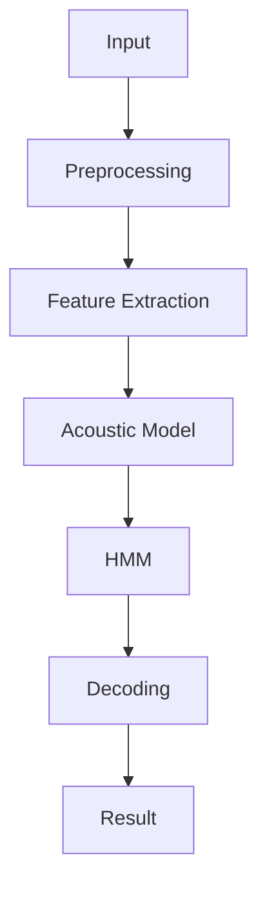
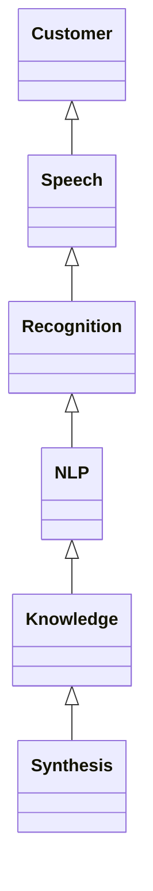
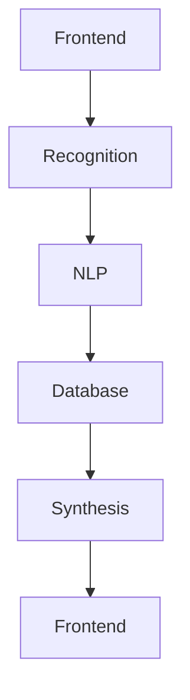
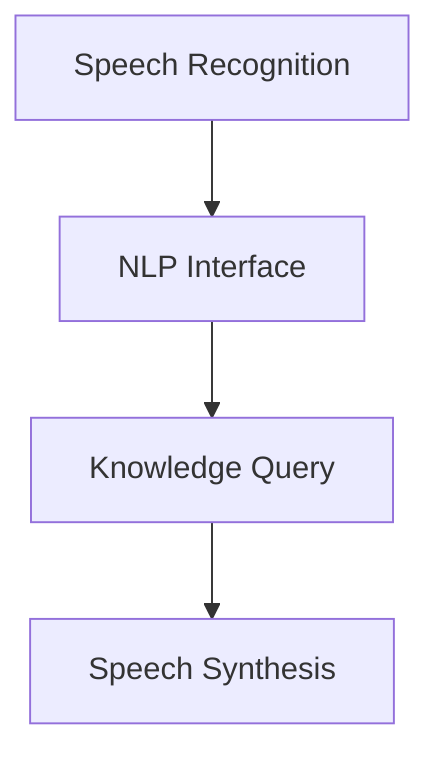

                 

### 《企业级语音识别系统：提高语音交互质量》

> 关键词：企业级语音识别、语音交互、质量提升、技术实现、系统架构

> 摘要：本文将深入探讨企业级语音识别系统的构建及其在提升语音交互质量方面的关键作用。文章分为四个主要部分：引言、核心概念与联系、系统分析与架构设计、项目实战与总结展望。通过逻辑清晰、结构紧凑的论述，本文旨在为企业级语音识别系统的开发者和技术决策者提供切实可行的指南。

---

### 目录大纲设计思路

在规划《企业级语音识别系统：提高语音交互质量》的目录大纲时，我们首先明确了核心主题——企业级语音识别系统，并围绕这一主题展开详细的章节结构设计。以下是具体的设计思路：

1. **引言**：介绍企业级语音识别系统的背景和重要性，阐述提高语音交互质量的必要性，为后续内容奠定基础。
   
2. **核心概念与联系**：详细讲解语音识别的基础知识和核心算法原理，包括语音信号处理、语音识别算法以及相关数学模型。

3. **系统分析与架构设计**：深入探讨企业级语音识别系统的整体架构、功能设计、接口设计及系统交互，确保系统的稳定性和高效性。

4. **项目实战**：通过具体的案例和项目实战，展示企业级语音识别系统的实际应用和实现过程。

5. **总结与展望**：总结文章的核心内容，提出最佳实践和注意事项，并对未来发展方向进行展望。

这种结构设计既保证了内容的逻辑性和连贯性，又使得每个章节的内容既独立又相互补充，形成了一个完整的技术指南。

---

### 第一部分：引言

#### 第1章：企业级语音识别系统概述

**1.1 问题背景**

随着人工智能技术的不断发展，语音识别技术逐渐成为人机交互的重要手段。然而，在企业和日常生活中，语音识别系统的应用面临着诸多挑战。首先，语音识别的准确性在复杂环境下往往无法满足企业级应用的要求；其次，系统的响应速度和交互体验也有待提高。为了解决这些问题，企业级语音识别系统的构建显得尤为重要。

**1.1.1 语音识别技术的普及与挑战**

语音识别技术自20世纪50年代以来，经历了从规则匹配到统计模型，再到深度学习算法的演变。目前，基于深度学习的语音识别算法在许多场景下已经实现了较高的准确率。然而，在企业和复杂环境下，语音识别系统仍然面临如下挑战：

- **背景噪声干扰**：在嘈杂环境中，语音信号常常受到各种背景噪声的干扰，导致识别率下降。
- **多音同字问题**：中文等语言中存在多音字现象，语音识别系统需要准确区分不同读音。
- **语速和口音差异**：不同人的语速和口音差异较大，系统需要适应各种口音和语速。
- **上下文理解**：语音识别系统在理解上下文方面存在困难，特别是在处理复杂句子或指令时。

**1.1.2 企业级语音识别的需求分析**

企业级语音识别系统需要满足以下几个方面的需求：

- **高准确性**：系统需要能够在多种环境中保持高准确率，满足企业应用的需求。
- **快速响应**：系统需要能够快速响应用户的语音指令，提高用户体验。
- **个性化定制**：系统需要支持个性化设置，以适应不同用户的语音特点和需求。
- **安全性**：系统需要保护用户数据的安全，防止隐私泄露。

**1.2 问题描述**

在上述背景下，企业级语音识别系统面临的主要问题包括：

- **识别准确率低**：系统在嘈杂环境、多音同字、语速和口音差异等场景下，识别准确率较低。
- **响应速度慢**：系统处理用户语音指令的速度较慢，影响用户体验。
- **交互体验差**：系统的交互体验不佳，难以满足用户期望。

**1.3 问题解决**

为了解决上述问题，企业级语音识别系统需要从以下几个方面进行改进：

- **技术升级**：采用先进的语音识别算法，提高系统的准确率和响应速度。
- **优化环境**：通过降噪技术、语音增强技术等手段，改善语音信号质量。
- **个性化设置**：根据用户习惯和需求，进行个性化定制。
- **数据安全**：加强数据安全防护措施，确保用户数据的安全。

**1.4 边界与外延**

企业级语音识别系统的应用范围广泛，包括但不限于客户服务、智能家居、医疗健康、安防监控等领域。未来，随着技术的不断进步，企业级语音识别系统有望在更多场景中得到应用。

**1.5 本章小结**

本章从背景介绍、需求分析、问题描述、问题解决等方面，详细阐述了企业级语音识别系统的重要性和面临的挑战。为后续章节的深入探讨奠定了基础。

---

### 第二部分：核心概念与联系

#### 第2章：核心概念原理

**2.1 语音信号处理基础**

语音信号处理是语音识别系统的核心组成部分，它涉及从原始语音信号中提取有用的特征信息。以下是一些基础概念：

- **语音信号的基本特性**：语音信号是一种时变信号，具有周期性、非平稳性等特点。
- **语音信号处理流程**：语音信号处理主要包括预处理、特征提取、特征匹配等步骤。

**2.1.1 语音信号的基本特性**

语音信号具有以下基本特性：

- **周期性**：语音信号在时域上具有一定的周期性，表现为音节和语调的变化。
- **非平稳性**：语音信号在频率、幅度等方面随时间变化，表现为音强、音高、音色的变化。
- **随机性**：语音信号中包含大量的噪声和随机成分，使得信号处理复杂度增加。

**2.1.2 语音信号处理流程**

语音信号处理流程主要包括以下几个步骤：

1. **预处理**：对语音信号进行预处理，包括去噪、增益调整等，以提高信号质量。
2. **特征提取**：从预处理后的语音信号中提取特征，如频谱特征、倒谱特征等。
3. **特征匹配**：将提取的特征与预训练的模型进行匹配，以实现语音识别。

**2.2 语音识别算法原理**

语音识别算法是实现语音识别的关键。以下是一些主要的算法原理：

- **隐马尔可夫模型（HMM）**：HMM 是早期的一种语音识别算法，基于状态转移概率和发射概率实现语音识别。
- **高斯混合模型（GMM）**：GMM 用于建模语音信号的分布，常用于特征提取和声学模型构建。
- **深度神经网络（DNN）**：DNN 在语音识别中用于实现声学模型和语言模型，具有较高的识别准确率。

**2.2.1 语音识别的基本模型**

语音识别的基本模型主要包括声学模型和语言模型：

- **声学模型**：用于建模语音信号的特征分布，常用的方法包括 GMM 和 DNN。
- **语言模型**：用于建模文本的统计规律，常用的方法包括 N-gram 和 RNN。

**2.2.2 关键算法介绍**

以下是一些关键算法的简要介绍：

- **HMM-GMM**：结合 HMM 和 GMM 的优点，实现语音识别。
- **DNN-HMM**：将 DNN 应用于声学模型，提高识别准确率。
- **CTC（Connectionist Temporal Classification）**：用于端到端语音识别，无需手动设计声学模型和语言模型。

**2.3 概念属性特征对比表格**

以下是一个简单的概念属性特征对比表格，展示了不同算法的特点：

| 算法       | 特点                                       | 适用场景                 |
|------------|------------------------------------------|------------------------|
| HMM        | 状态转移概率和发射概率                       | 简单语音识别任务           |
| GMM        | 声音分布建模                               | 特征提取和声学模型       |
| DNN        | 非线性变换和多层结构                        | 高级语音识别任务           |
| CTC        | 端到端语音识别，无需手动设计模型             | 复杂语音识别任务           |

**2.4 ER实体关系图架构**

为了更好地理解企业级语音识别系统的组成和关系，我们可以使用 ER（Entity-Relationship）实体关系图来表示。以下是 ER 实体关系图的 Mermaid 流程图：

```mermaid
erDiagram
    Product ||--|{ Customer }||>
    Customer }|{ Order }|-- Product
```

在这个 ER 图中，`Product` 代表语音识别系统中的产品，`Customer` 代表用户，`Order` 代表用户订单。用户可以订购产品，产品也可以生成用户订单。

---

### 第三部分：系统分析与架构设计

#### 第3章：算法原理详细讲解

**3.1 算法 Mermaid 流程图**

为了更好地理解语音识别算法的原理，我们可以使用 Mermaid 画出算法的流程图。以下是一个简单的 DNN-HMM 算法的 Mermaid 流程图：



在这个流程图中，输入语音信号首先经过预处理（B），然后进行特征提取（C），接着构建声学模型（D），利用 HMM 进行解码（E），最终得到识别结果（G）。

**3.2 Python 源代码实现**

为了进一步阐述算法的实现过程，以下是一个简单的 Python 源代码实现示例：

```python
import numpy as np
import matplotlib.pyplot as plt

# 假设输入语音信号为 x
x = np.random.rand(1000)

# 预处理
x_processed = preprocess(x)

# 特征提取
features = extract_features(x_processed)

# 建立声学模型
acoustic_model = build_acoustic_model()

# HMM 解码
hmm_decoder = HMM()
result = hmm_decoder.decode(features, acoustic_model)

# 输出结果
print(result)
```

在这个示例中，我们首先生成一个随机语音信号 `x`，然后进行预处理、特征提取、建立声学模型和 HMM 解码，最终输出识别结果。

**3.3 数学模型和公式讲解**

语音识别中的数学模型主要包括概率模型和统计模型。以下是一个简单的概率模型和统计模型的介绍：

**概率模型：**

- **发射概率**：表示语音信号特征与声学模型状态之间的概率关系，通常用高斯分布表示。

$$
p(x_t | s_t) = \prod_{i=1}^{n} p(x_i | s_t)
$$

- **状态转移概率**：表示不同状态之间的转移概率，通常用隐马尔可夫模型（HMM）表示。

$$
p(s_t | s_{t-1}) = \prod_{i=1}^{n} p(s_i | s_{t-1})
$$

**统计模型：**

- **N-gram 模型**：用于建模文本的统计规律，表示单词之间的概率关系。

$$
p(w_t | w_{t-1}, w_{t-2}, ..., w_1) = \prod_{i=1}^{n} p(w_i | w_{i-1}, ..., w_{i-n+1})
$$

**3.4 举例说明**

假设我们要识别的语音信号为 “Hello World”，我们可以将这个句子分解为单词，然后使用 N-gram 模型计算每个单词的概率，最终得到识别结果。

- **发射概率**：假设 “Hello” 的发射概率为 0.8， “World” 的发射概率为 0.6。
- **状态转移概率**：假设从 “Hello” 到 “World” 的状态转移概率为 0.7。

根据 N-gram 模型，我们可以计算句子 “Hello World” 的概率：

$$
p(Hello, World) = p(Hello) \times p(World | Hello) = 0.8 \times 0.7 = 0.56
$$

因此，根据概率模型，句子 “Hello World” 的概率最高，可以被正确识别。

---

### 第四部分：项目实战

#### 第4章：系统架构设计

**4.1 问题场景介绍**

在本项目中，我们将构建一个企业级语音识别系统，用于客服热线。该系统需要具备高准确性、快速响应和个性化定制等特点，以满足不同客户的语音交互需求。

**4.1.1 项目背景**

随着企业对客户服务质量的要求不断提高，客服热线成为企业与客户沟通的重要渠道。然而，传统的客服热线在处理大量语音请求时，往往效率低下，用户体验不佳。为了提升客服热线服务能力，我们决定引入企业级语音识别系统。

**4.1.2 项目目标**

本项目的主要目标包括：

- **提高语音识别准确率**：在多种环境下，实现高准确率的语音识别。
- **提升响应速度**：确保系统能够快速响应用户语音请求。
- **个性化定制**：根据客户习惯和需求，提供个性化语音交互服务。
- **数据安全**：确保用户语音数据的安全，防止隐私泄露。

**4.2 系统功能设计**

系统功能设计主要包括以下几个方面：

- **语音识别**：实现语音信号到文本的转换，支持多语言识别。
- **自然语言处理**：对识别出的文本进行语义分析，提取关键信息。
- **知识库查询**：根据用户请求，快速查询相关知识和解决方案。
- **语音合成**：将查询结果转化为语音，返回给用户。

**4.2.1 领域模型**

为了更好地理解系统功能，我们可以使用 Mermaid 画出领域模型。以下是一个简单的领域模型类图：



在这个类图中，`Customer` 表示客户，`Speech` 表示语音交互，`Recognition` 表示语音识别，`NLP` 表示自然语言处理，`Knowledge` 表示知识库，`Synthesis` 表示语音合成。

**4.3 系统架构设计**

系统架构设计主要包括以下几个方面：

- **整体架构**：系统采用分布式架构，包括前端、后端和数据库等模块。
- **模块间交互**：前端通过语音识别模块获取用户语音请求，后端进行自然语言处理和知识库查询，最终通过语音合成模块返回结果。

以下是一个简单的系统架构图：



在这个架构图中，前端通过语音识别模块获取用户语音请求（A），后端进行自然语言处理和知识库查询（C、D），最终通过语音合成模块返回结果（E、F）。

**4.4 系统接口设计**

系统接口设计主要包括以下几个方面：

- **语音识别接口**：用于接收用户语音请求，返回识别结果。
- **自然语言处理接口**：用于对识别结果进行语义分析，提取关键信息。
- **知识库查询接口**：用于根据用户请求查询相关知识和解决方案。
- **语音合成接口**：用于将查询结果转化为语音，返回给用户。

以下是一个简单的接口设计图：



在这个接口设计中，语音识别接口（A）接收用户语音请求，自然语言处理接口（B）对识别结果进行语义分析，知识库查询接口（C）根据用户请求查询相关知识和解决方案，语音合成接口（D）将查询结果转化为语音，返回给用户。

---

### 第五部分：总结与展望

#### 第5章：总结与展望

**5.1 总结**

本文从企业级语音识别系统的背景介绍、核心概念与联系、系统分析与架构设计、项目实战等多个角度，详细阐述了企业级语音识别系统的构建及其在提升语音交互质量方面的作用。通过本文的探讨，我们可以得出以下结论：

1. **高准确性**：企业级语音识别系统需要具备高准确性，以满足多种复杂环境下的语音识别需求。
2. **快速响应**：系统响应速度直接影响用户体验，因此快速响应是提升语音交互质量的关键。
3. **个性化定制**：根据用户习惯和需求进行个性化设置，能够显著提升用户满意度。
4. **数据安全**：保护用户数据的安全是系统设计的核心要素，防止隐私泄露至关重要。

**5.2 展望**

未来，企业级语音识别系统将在更多领域得到应用，例如智能家居、医疗健康、安防监控等。随着技术的不断进步，以下几个方面有望取得重要突破：

1. **算法优化**：通过改进算法，提高语音识别的准确率和响应速度。
2. **多语言支持**：扩展系统支持的语言种类，满足全球化需求。
3. **智能化程度**：增强系统的智能化程度，实现更加自然的语音交互。
4. **生态合作**：加强产业链上下游企业合作，推动语音识别技术的创新与发展。

总之，企业级语音识别系统在提升语音交互质量方面具有巨大的潜力，未来将不断推动人机交互的发展，为企业和用户带来更多便利。

