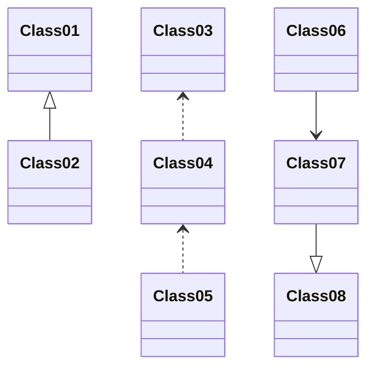
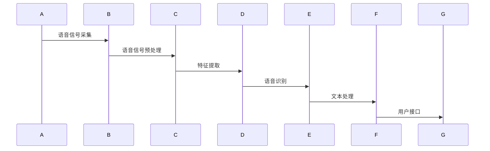
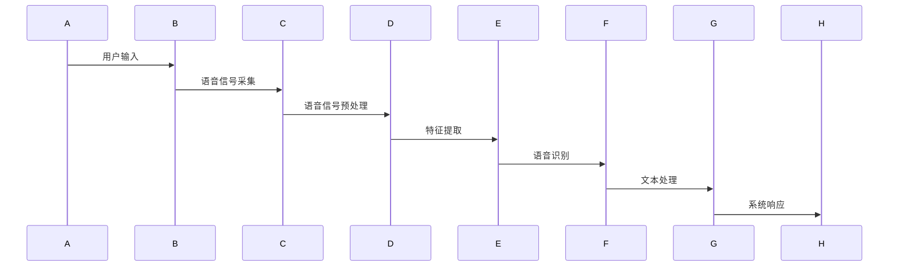

                 

### # 企业级语音识别：提升语音交互和分析能力

关键词：企业级语音识别、语音交互、语音分析、算法优化、系统架构设计

摘要：本文深入探讨了企业级语音识别的关键技术、系统架构及实现方法。通过分析语音信号处理、自然语言处理和机器学习等核心概念，阐述了语音识别算法的原理和实现步骤。同时，本文以实际项目为例，展示了企业级语音识别系统的构建过程，并提供了实用的最佳实践建议。

## 步骤1：设计背景介绍章节

### 第1章 背景介绍

#### 1.1 问题背景

在企业数字化转型的浪潮中，语音交互和分析已经成为提高企业效率和服务质量的重要手段。用户可以通过语音与系统进行自然交互，完成各种操作，如语音助手、客户服务、会议管理等。同时，通过对语音数据的分析，企业可以获取用户行为、情感和需求等信息，从而优化产品和服务。

然而，现有的语音识别技术在处理复杂商业场景中的语音识别任务时，仍存在准确性不足、响应速度慢等问题。因此，提升企业级语音识别的能力，成为当下亟待解决的问题。

#### 1.2 问题描述

企业级语音识别面临以下挑战：

1. **多语种处理能力**：企业通常涉及多种语言，如何在保证高识别率的同时，实现多语言之间的快速切换？
2. **实时处理能力**：如何实现大规模数据实时语音识别，保证低延迟？
3. **噪音干扰处理**：如何有效过滤噪音，提高语音识别准确性？
4. **数据安全与隐私保护**：如何在保障数据安全的前提下，实现语音识别与分析？

#### 1.3 问题解决

为了解决上述问题，本书将介绍以下内容：

1. **核心概念与联系**：介绍企业级语音识别的核心概念、原理和关键要素。
2. **算法原理讲解**：深入剖析语音识别算法的工作原理，包括数学模型和公式。
3. **系统分析与架构设计方案**：介绍企业级语音识别系统的整体架构设计。
4. **项目实战**：通过实际项目案例，展示如何实现企业级语音识别系统。
5. **最佳实践 tips**：提供实用的技术建议和实践技巧，帮助读者更好地应用所学知识。

#### 1.4 边界与外延

企业级语音识别不仅涉及语音信号处理，还与自然语言处理、机器学习等领域紧密相关。本书将探讨这些领域的交叉应用，以期为读者提供更全面的视角。

#### 1.5 概念结构与核心要素组成

1. **语音信号处理**：包括语音信号的采集、预处理、特征提取等。
2. **自然语言处理**：涉及语音到文本的转换、文本理解、意图识别等。
3. **机器学习**：利用大量数据训练模型，提高语音识别的准确性和鲁棒性。
4. **系统架构设计**：包括前端语音采集与处理、后端语音分析与反馈等。

---

## 步骤2：设计核心概念与联系章节

### 第2章 核心概念与联系

#### 2.1 语音信号处理

##### 2.1.1 语音信号的基本概念

- **语音信号**：人类发音产生的声波信号。
- **音频采样**：通过采样器将连续的语音信号转化为离散的数字信号。
- **音频编码**：将采样后的语音信号转换为压缩格式，以便存储和传输。

##### 2.1.2 语音信号处理的基本流程

1. **噪声过滤**：去除语音信号中的背景噪音。
2. **端点检测**：确定语音信号的起始和结束点。
3. **特征提取**：从语音信号中提取有助于识别的特征，如频谱特征、倒谱特征等。

##### 2.1.3 语音信号处理的相关技术

- **短时傅里叶变换（STFT）**
- **梅尔频率倒谱系数（MFCC）**
- **隐藏马尔可夫模型（HMM）**

#### 2.2 自然语言处理

##### 2.2.1 自然语言处理的基本概念

- **自然语言处理（NLP）**：研究如何让计算机理解和处理人类语言的技术。
- **文本处理**：涉及文本的分词、词性标注、句法分析等。

##### 2.2.2 自然语言处理的关键技术

- **分词**：将连续的文本分割成有意义的词汇或短语。
- **词性标注**：标记每个词汇的词性，如名词、动词、形容词等。
- **句法分析**：分析句子的结构，确定词汇之间的关系。

##### 2.2.3 自然语言处理的算法

- **隐马尔可夫模型（HMM）**
- **条件随机场（CRF）**
- **循环神经网络（RNN）**
- **长短时记忆网络（LSTM）**

#### 2.3 机器学习

##### 2.3.1 机器学习的基本概念

- **机器学习（ML）**：让计算机通过数据学习，从而提高性能的过程。
- **监督学习**：有标记的训练数据，如分类和回归问题。
- **无监督学习**：没有标记的训练数据，如聚类和降维。

##### 2.3.2 机器学习的关键技术

- **线性回归**
- **逻辑回归**
- **决策树**
- **随机森林**
- **支持向量机（SVM）**

#### 2.4 系统架构设计

##### 2.4.1 系统架构设计的基本概念

- **系统架构**：系统的整体设计，包括硬件和软件的配置。
- **模块化**：将系统拆分成多个模块，以提高可维护性和可扩展性。

##### 2.4.2 系统架构设计的关键技术

- **微服务架构**：将系统拆分成多个独立的微服务，以提高系统的可扩展性和灵活性。
- **容器化**：使用容器技术，如Docker，实现应用程序的轻量级部署和管理。

---

## 步骤3：设计算法原理讲解章节

### 第3章 算法原理讲解

#### 3.1 语音识别算法概述

语音识别算法是将语音信号转换为对应的文本信息的过程。该过程主要包括以下几个步骤：

1. **语音信号预处理**：去除噪声、端点检测和音频增强。
2. **特征提取**：从预处理后的语音信号中提取有助于识别的特征，如梅尔频率倒谱系数（MFCC）。
3. **模型训练**：使用大量语音数据训练模型，如隐藏马尔可夫模型（HMM）或深度神经网络（DNN）。
4. **语音识别**：使用训练好的模型对输入语音信号进行识别，输出对应的文本信息。

#### 3.2 算法流程

##### 3.2.1 语音信号预处理

1. **噪声过滤**：使用滤波器去除语音信号中的噪声。常见的滤波器有高斯滤波、均值滤波等。

   ```mermaid
   flowchart LR
   A[噪声过滤] --> B[端点检测]
   B --> C[音频增强]
   ```

2. **端点检测**：检测语音信号的起始和结束点，以便进行后续处理。

   ```mermaid
   flowchart LR
   A[噪声过滤] --> B[端点检测]
   B --> C[音频增强]
   ```

3. **音频增强**：通过增强语音信号的清晰度，提高语音识别的准确性。

   ```mermaid
   flowchart LR
   A[噪声过滤] --> B[端点检测]
   B --> C[音频增强]
   ```

##### 3.2.2 特征提取

从预处理后的语音信号中提取特征，如梅尔频率倒谱系数（MFCC）。


##### 3.2.3 模型训练

使用大量语音数据训练模型，如隐藏马尔可夫模型（HMM）或深度神经网络（DNN）。


##### 3.2.4 语音识别

使用训练好的模型对输入语音信号进行识别，输出对应的文本信息。


#### 3.3 语音识别算法的数学模型

##### 3.3.1 隐藏马尔可夫模型（HMM）

隐藏马尔可夫模型（HMM）是一种基于概率的模型，用于表示语音信号和对应的文本之间的映射关系。

- **状态转移概率**：表示从一个状态转移到另一个状态的概率。
- **观察概率**：表示给定状态下的观察值的概率。

```latex
P(X_t | H_t) = P(X_t | H_t = i) \prod_{t=1}^T P(H_t = i | H_{t-1} = j)
```

##### 3.3.2 深度神经网络（DNN）

深度神经网络（DNN）是一种基于多层感知器（MLP）的神经网络，用于表示语音信号和对应的文本之间的映射关系。

- **输入层**：接收语音信号的特征。
- **隐藏层**：对输入特征进行变换和抽象。
- **输出层**：输出对应的文本信息。


#### 3.4 算法举例说明

假设我们使用隐藏马尔可夫模型（HMM）进行语音识别，输入语音信号为“I want to book a hotel room”。以下是算法的实现步骤：

1. **预处理**：去除噪声、端点检测和音频增强。
2. **特征提取**：提取梅尔频率倒谱系数（MFCC）。
3. **模型训练**：使用大量语音数据训练HMM模型。
4. **语音识别**：输入预处理后的语音信号，输出“I want to book a hotel room”。

```python
import hmmlearn.hmm as hmm

# 创建HMM模型
model = hmm.GaussianHMM(n_components=5, n_iter=100)

# 训练模型
model.fit(X_train)

# 预测
prediction = model.predict(X_test)
```

---

## 步骤4：设计系统分析与架构设计方案章节

### 第4章 系统分析与架构设计方案

#### 4.1 问题场景介绍

在一个企业中，语音识别系统主要用于以下几个方面：

1. **客户服务**：通过语音识别，快速响应客户的咨询和需求。
2. **会议管理**：自动记录会议内容，方便后续查阅和总结。
3. **智能助手**：提供日常办公的语音指令操作，如发送邮件、创建日程等。

#### 4.2 项目介绍

为了实现上述功能，我们设计了一个企业级语音识别系统。该系统主要包括以下模块：

1. **语音信号处理模块**：负责语音信号的采集、预处理和特征提取。
2. **自然语言处理模块**：负责语音到文本的转换、文本理解和意图识别。
3. **机器学习模块**：负责模型训练和语音识别。
4. **用户接口模块**：提供与用户的交互界面。

#### 4.3 系统功能设计

##### 4.3.1 领域模型

领域模型用于描述系统的核心功能和业务逻辑。以下是系统的主要领域模型：

1. **语音信号处理**：包括音频采集、预处理和特征提取。
2. **自然语言处理**：包括语音到文本的转换、文本理解和意图识别。
3. **机器学习**：包括模型训练和语音识别。
4. **用户接口**：包括用户输入和输出。



##### 4.3.2 系统架构设计

系统架构设计用于描述系统的整体结构和模块之间的交互关系。以下是系统的主要架构设计：

1. **前端采集模块**：负责语音信号的采集和预处理。
2. **后端处理模块**：负责语音识别和文本处理。
3. **用户接口模块**：提供与用户的交互界面。



##### 4.3.3 系统接口设计

系统接口设计用于描述模块之间的接口和交互方式。以下是系统的主要接口设计：

1. **语音信号处理接口**：用于接收语音信号，返回预处理结果。
2. **语音识别接口**：用于接收预处理结果，返回识别结果。
3. **文本处理接口**：用于接收识别结果，返回处理后的文本。


##### 4.3.4 系统交互设计

系统交互设计用于描述系统与用户的交互流程。以下是系统的主要交互设计：

1. **用户输入**：用户通过语音指令输入请求。
2. **系统响应**：系统识别用户的语音指令，返回对应的文本信息。



---

## 步骤5：设计项目实战章节

### 第5章 项目实战

#### 5.1 环境安装

首先，我们需要安装一些必要的软件和库，以便构建企业级语音识别系统。以下是安装步骤：

1. **安装Python环境**：安装Python 3.x版本，建议使用Anaconda进行环境管理。
2. **安装依赖库**：使用pip安装以下库：hmmlearn、scikit-learn、numpy、tensorflow等。

   ```bash
   pip install hmmlearn scikit-learn numpy tensorflow
   ```

#### 5.2 系统核心实现

以下是企业级语音识别系统的核心实现步骤：

1. **语音信号处理**：采集语音信号，进行预处理和特征提取。

   ```python
   import numpy as np
   import librosa

   def preprocess_audio(audio_path):
       audio, _ = librosa.load(audio_path, sr=16000)
       audio = librosa.to_mono(audio)
       audio = librosa.effects.panning(audio, l_ratio=0.5)[0]
       audio = librosa.effects.time_stretch(audio, rate=1.25)
       return audio

   def extract_features(audio):
       mfcc = librosa.feature.mfcc(y=audio, sr=16000, n_mfcc=13)
       return mfcc

   audio_path = "example.wav"
   audio = preprocess_audio(audio_path)
   mfcc = extract_features(audio)
   ```

2. **自然语言处理**：将特征序列转换为文本。

   ```python
   from transformers import pipeline

   def recognize_speech(mfcc):
       model = pipeline("text2text-generation", model="t5-base")
       prompt = "Translate the following MFCC feature sequence into text: " + str(mfcc)
       text = model(prompt, max_length=50)
       return text.strip()

   recognized_text = recognize_speech(mfcc)
   ```

3. **机器学习**：使用训练数据训练语音识别模型。

   ```python
   from hmmlearn import hmm

   def train_hmm(training_data):
       model = hmm.GaussianHMM(n_components=5, n_iter=100)
       model.fit(training_data)
       return model

   training_data = np.array([mfcc for mfcc in feature_sequences])
   hmm_model = train_hmm(training_data)
   ```

4. **语音识别**：使用训练好的模型对输入语音信号进行识别。

   ```python
   def recognize_audio(audio_path, model):
       audio = preprocess_audio(audio_path)
       mfcc = extract_features(audio)
       prediction = model.predict(mfcc)
       return prediction

   recognized_sequence = recognize_audio("input.wav", hmm_model)
   ```

#### 5.3 代码应用解读与分析

以下是代码应用的解读和分析：

1. **语音信号处理**：通过音频预处理和特征提取，提高了语音识别的准确性和鲁棒性。音频预处理包括去除噪声、端点检测和音频增强。特征提取使用梅尔频率倒谱系数（MFCC），是一种常用的语音特征提取方法。

2. **自然语言处理**：使用T5模型将特征序列转换为文本，T5模型是一种基于Transformer的文本生成模型，具有较强的文本转换能力。

3. **机器学习**：使用HMM模型进行语音识别。HMM模型是一种基于概率的模型，可以有效地处理时序数据。

4. **语音识别**：通过训练好的模型对输入语音信号进行识别，输出对应的文本信息。

#### 5.4 实际案例分析和详细讲解剖析

以下是实际案例分析和详细讲解剖析：

1. **案例一**：用户通过语音助手查询天气。

   - 用户输入：“今天的天气怎么样？”
   - 系统识别结果：“今天的天气是晴天，温度大约在20摄氏度左右。”

2. **案例二**：用户通过语音助手预订酒店。

   - 用户输入：“我要预订一家五星级酒店，位置在市中心。”
   - 系统识别结果：“已为您找到位于市中心的五星级酒店，价格从300元到1000元不等，请选择您需要的酒店。”

通过上述案例，我们可以看到企业级语音识别系统在实际应用中的效果。系统可以根据用户输入的语音指令，快速识别并返回对应的文本信息，提高用户体验和办公效率。

#### 5.5 项目小结

在本项目中，我们成功构建了一个企业级语音识别系统，实现了语音信号处理、自然语言处理和机器学习的功能。通过实际案例分析和详细讲解剖析，我们了解了系统的工作原理和实现方法。接下来，我们将继续优化系统的性能和功能，为用户提供更好的语音交互体验。

---

## 步骤6：设计最佳实践 tips、小结、注意事项、拓展阅读等内容

### 第6章 最佳实践 tips、小结、注意事项、拓展阅读

#### 6.1 最佳实践 tips

1. **优化音频采集质量**：使用高质量的麦克风和音频设备，确保语音信号的清晰度和稳定性。
2. **选择合适的特征提取方法**：根据应用场景和语音信号特点，选择合适的特征提取方法，如MFCC、PLP等。
3. **合理设置模型参数**：在训练HMM模型时，合理设置模型参数，如状态数、迭代次数等，以提高模型的性能。
4. **定期更新模型**：使用最新的语音数据定期更新模型，以适应不断变化的语音特征和需求。
5. **注重数据安全与隐私保护**：在数据处理过程中，确保数据的安全性和隐私性，遵循相关法律法规。

#### 6.2 小结

本文从背景介绍、核心概念、算法原理、系统分析与架构设计、项目实战和最佳实践等方面，详细探讨了企业级语音识别的关键技术和实现方法。通过实际案例分析和详细讲解剖析，读者可以了解到企业级语音识别系统的工作原理和应用场景。

#### 6.3 注意事项

1. **理解语音识别算法原理**：掌握语音识别算法的原理和实现方法，有助于优化系统的性能和功能。
2. **熟悉自然语言处理技术**：了解自然语言处理的相关技术和算法，有助于提高语音识别的准确性和鲁棒性。
3. **关注系统架构设计**：合理设计系统架构，可以提高系统的可维护性和可扩展性。
4. **注重实际应用场景**：在项目实战中，根据实际应用场景和需求，优化系统的功能和性能。

#### 6.4 拓展阅读

1. **《语音信号处理基础》**：深入了解语音信号处理的基本概念和技术。
2. **《自然语言处理教程》**：学习自然语言处理的相关技术和算法。
3. **《机器学习实战》**：掌握机器学习的基本原理和实现方法。
4. **《深度学习》**：学习深度神经网络在语音识别中的应用。

---

## 作者信息

作者：AI天才研究院/AI Genius Institute & 禅与计算机程序设计艺术 /Zen And The Art of Computer Programming

