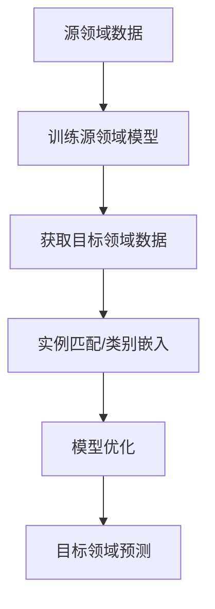
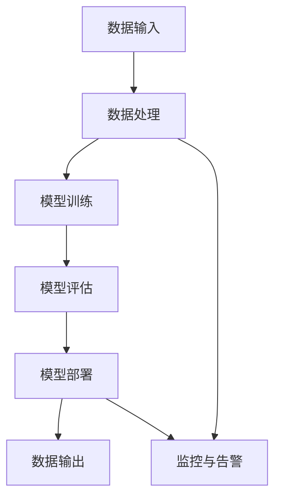
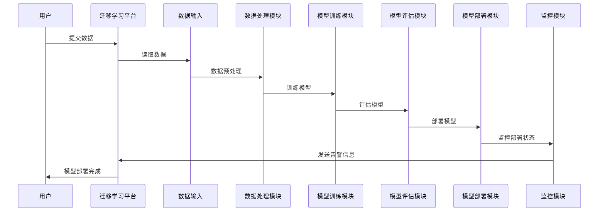

                 

### 迁移学习与企业级AI应用

在当今快速发展的数字化时代，人工智能（AI）技术已经成为企业提高生产力、优化业务流程、增强客户体验的关键驱动力。然而，随着AI应用的不断扩展，企业面临的一个严峻挑战是数据稀缺性和模型迁移问题。这就需要一种有效的解决方案，来提高AI模型在新领域的应用效果，迁移学习（Transfer Learning）便应运而生。

#### 问题背景

首先，让我们了解一下迁移学习的背景。随着深度学习技术在图像识别、自然语言处理等领域的巨大成功，越来越多的企业开始意识到AI技术在业务中的潜在价值。然而，这些模型往往需要大量的标注数据和高性能的计算资源，这对许多中小企业来说是一个巨大的挑战。数据稀缺性导致了模型在新领域应用的局限性，而如何让模型能够在新环境中快速适应和发挥作用，则成为了关键问题。

#### 问题描述

具体来说，企业面临的主要问题是：

1. **数据稀缺性**：许多行业（如医疗、金融等）的数据获取难度大，难以积累足够的训练数据。
2. **模型迁移挑战**：现有模型往往是针对特定领域或任务设计的，难以直接应用于新的业务场景，需要进行重新训练或调整。

#### 问题解决

迁移学习通过利用已有模型的已有知识，将其迁移到新任务上，从而减少对新数据的依赖。这种方法的核心思想是，将训练好的模型在不同任务之间共享部分参数，从而提高模型在新任务上的表现。这样，企业可以在没有大量新数据的情况下，快速部署和优化AI应用。

#### 边界与外延

迁移学习不仅仅是深度学习领域的一个技术方法，它也可以应用于其他类型的机器学习方法，如决策树、支持向量机等。此外，迁移学习还可以与其他技术（如元学习、少样本学习等）相结合，进一步提升模型在新领域的应用效果。

#### 迁移学习与传统机器学习方法的对比

为了更好地理解迁移学习的优势，我们可以将其与传统机器学习方法进行对比：

| 对比维度 | 迁移学习 | 传统机器学习 |
| :---: | :---: | :---: |
| 数据需求 | 部分参数共享，减少对新数据的依赖 | 完全依赖新数据 |
| 训练时间 | 减少新模型的训练时间 | 需要从头开始训练 |
| 性能提升 | 通过迁移已有模型知识，提高新任务性能 | 通常依赖于大量新数据 |
| 应用范围 | 可以应用于不同领域和任务 | 通常局限于特定领域或任务 |

通过以上对比，我们可以看出迁移学习在应对数据稀缺性和模型迁移问题方面具有明显优势。接下来，我们将进一步探讨迁移学习的基本概念、分类、算法原理，以及企业级迁移学习平台的需求和挑战。

### 迁移学习的基本概念

迁移学习（Transfer Learning）是一种机器学习技术，其核心思想是将一个领域（源领域）学到的知识迁移到另一个领域（目标领域）上，从而提高新领域任务的表现。这种知识迁移可以通过共享模型参数、利用先验知识或通过学习到一个通用特征表示来实现。

#### 核心概念

1. **源领域（Source Domain）**：训练数据的领域，在这个领域中已经存在一个训练好的模型。
2. **目标领域（Target Domain）**：需要应用迁移学习的新领域，通常数据稀缺或任务不同。
3. **迁移学习模型（Transfer Learning Model）**：将源领域模型的知识迁移到目标领域模型，以便在新领域上取得更好的性能。

#### 概念属性特征对比表格

为了更直观地理解迁移学习与传统机器学习方法的差异，我们可以通过一个表格来展示其关键属性：

| 特征 | 迁移学习 | 传统机器学习 |
| :---: | :---: | :---: |
| **数据依赖** | 部分依赖，共享源领域模型参数 | 完全依赖，需要为新任务收集新数据 |
| **模型训练** | 利用已有模型，减少新模型训练时间 | 从头开始训练新模型 |
| **适用场景** | 数据稀缺或任务相似的领域 | 数据丰富、任务独立的领域 |
| **性能表现** | 提高新任务性能，减少对新数据的依赖 | 通常依赖于大量新数据 |

#### ER实体关系图架构的 Mermaid 流程图

为了更好地描述迁移学习中的关键实体及其关系，我们可以使用Mermaid绘制一个ER实体关系图：

```mermaid
erDiagram
  SourceData ||--o{ TransferModel }
  TargetData ||--|{ FineTunedModel }
  SourceData ||--|{ SharedKnowledge }
  TargetData ||--|{ DomainAdaptation }
```

- **SourceData（源数据）**：包含源领域的训练数据，是迁移学习的基础。
- **TransferModel（迁移学习模型）**：通过源数据训练得到的模型，用于知识迁移。
- **TargetData（目标数据）**：包含目标领域的训练数据，用于训练细粒度模型。
- **FineTunedModel（细粒度模型）**：在目标数据上对迁移学习模型进行微调得到的模型，具有更好的目标领域适应性。
- **SharedKnowledge（共享知识）**：迁移学习过程中共享的先验知识，是提升目标领域模型性能的关键。
- **DomainAdaptation（领域适应）**：通过迁移学习模型和目标领域数据，对模型进行适应和优化的过程。

通过以上基本概念和Mermaid流程图的解释，我们可以对迁移学习有更深入的理解。接下来，我们将进一步探讨迁移学习的分类、算法原理以及数学模型。

### 迁移学习的分类与算法

迁移学习作为一种有效的机器学习技术，其应用场景和算法种类繁多。根据迁移的方式和目标，迁移学习主要可以分为基于类迁移、基于实例迁移和基于元学习三种类型。每种类型都有其独特的算法原理和适用场景。

#### 基于类迁移

**定义**：基于类迁移（Causal Transfer Learning）是指将源领域的类层次结构映射到目标领域，并利用源领域中的类别信息来提升目标领域的分类性能。

**算法原理**：
1. **层次分类**：首先，构建源领域和目标领域的类别层次树，然后将源领域的类别层次结构迁移到目标领域。
2. **类别嵌入**：利用源领域的类别信息，将类别映射到一个低维空间中，并在目标领域中使用这些嵌入的类别来辅助分类。

**数学模型**：
$$
\text{分类器} = f(\text{特征向量}, \text{类别嵌入})
$$
其中，$f$ 是一个分类函数，特征向量是目标领域的数据特征，类别嵌入是通过源领域类别映射得到的。

**适用场景**：基于类迁移适用于类别层次结构明确的任务，如植物识别、动物分类等。

#### 基于实例迁移

**定义**：基于实例迁移（Instance-Based Transfer Learning）是指通过迁移源领域的样本实例来提升目标领域的模型性能。

**算法原理**：
1. **实例匹配**：在源领域和目标领域之间寻找相似的样本实例，利用源领域实例的特征和标签来预测目标领域实例的标签。
2. **实例对齐**：通过调整源领域和目标领域实例的特征空间，使得相似的实例在特征空间中靠近。

**数学模型**：
$$
\text{预测标签} = \text{KNN}(\text{目标实例特征}, \text{源领域实例特征})
$$
其中，$KNN$ 是最近邻分类器，用于对目标实例进行分类。

**适用场景**：基于实例迁移适用于任务之间具有相似实例特征的任务，如图像识别、语音分类等。

#### 基于元学习

**定义**：基于元学习（Meta-Learning）是指通过学习一个通用的学习算法，使其能够快速适应新的任务。

**算法原理**：
1. **模型学习**：在元学习过程中，模型通过多次迭代学习，逐渐优化其学习算法，使其对新任务能够快速适应。
2. **任务适应**：通过元学习得到的通用学习算法，可以在新任务上进行快速的模型训练和优化。

**数学模型**：
$$
\text{模型} = \text{meta\_learner}(\text{任务数据})
$$
其中，$\text{meta\_learner}$ 是一个学习通用学习算法的模型，$\text{任务数据}$ 是用于训练的多个任务的数据集。

**适用场景**：基于元学习适用于需要快速适应新任务的场景，如少样本学习、在线学习等。

#### 迁移学习算法流程图

为了更直观地展示迁移学习算法的流程，我们可以使用Mermaid绘制一个算法流程图：



- **源领域数据（A）**：用于训练源领域模型的数据集。
- **训练源领域模型（B）**：使用源领域数据训练得到一个基础模型。
- **获取目标领域数据（C）**：收集目标领域的数据集。
- **实例匹配/类别嵌入（D）**：根据源领域和目标领域数据，进行实例匹配或类别嵌入。
- **模型优化（E）**：通过迁移学习算法优化模型，使其适应目标领域。
- **目标领域预测（F）**：在目标领域数据上使用优化后的模型进行预测。

通过以上对迁移学习分类与算法的详细阐述，我们可以更好地理解迁移学习的原理和应用。接下来，我们将进一步探讨企业级迁移学习平台的需求与挑战。

### 企业级迁移学习平台的需求与挑战

在数字化转型的浪潮中，企业级迁移学习平台成为了企业实现高效AI应用的关键基础设施。这类平台不仅需要具备高效处理数据、优化模型的能力，还要满足可扩展性、安全性和易于集成的需求。然而，在实际部署过程中，企业也面临诸多挑战。

#### 企业需求

1. **高效数据处理**：企业通常拥有大量的结构化和非结构化数据，迁移学习平台需要能够高效地处理这些数据，包括数据清洗、数据增强和数据集成等。

2. **可扩展性**：随着企业业务的不断扩展，迁移学习平台需要能够无缝扩展其计算资源和存储容量，以满足不断增长的数据处理需求。

3. **易于集成**：企业级迁移学习平台需要与其他业务系统和数据源无缝集成，以便实现数据的流动和AI应用的部署。

4. **模型优化与调参**：企业需要能够灵活地调整模型参数，以优化模型在新领域的性能，同时减少对新数据的依赖。

5. **可视化与监控**：平台应提供直观的可视化界面，帮助用户监控模型的训练过程和性能，方便进行故障排查和模型优化。

#### 挑战

1. **数据处理**：企业数据类型繁多，质量参差不齐，迁移学习平台需要能够处理这些复杂的数据，同时保证数据处理的效率和准确性。

2. **模型优化**：企业级迁移学习平台需要支持多种迁移学习算法，并在不同的数据集和任务上能够灵活调整模型参数，以获得最佳性能。

3. **安全性**：企业敏感数据的安全保护至关重要，迁移学习平台需要具备严格的安全机制，防止数据泄露和未授权访问。

4. **部署与运维**：企业级迁移学习平台需要能够在不同的硬件环境和云平台上部署，并具备高效的运维管理能力，以确保平台的稳定运行。

#### 关键特性与功能

为了满足上述需求并克服挑战，企业级迁移学习平台应具备以下关键特性与功能：

1. **模块化设计**：平台应采用模块化设计，将数据处理、模型训练、模型评估、模型部署等功能模块化，便于扩展和维护。

2. **自动化流程**：平台应实现自动化数据处理和模型训练流程，减少人工干预，提高工作效率。

3. **可视化界面**：平台应提供直观的可视化界面，使用户能够轻松监控和管理迁移学习过程。

4. **模型训练与优化**：平台应支持多种迁移学习算法，并提供灵活的模型参数调整和优化功能。

5. **安全性与合规性**：平台应具备完善的安全机制，确保数据的安全和隐私，同时符合相关的法律法规要求。

6. **监控与告警**：平台应提供实时监控和告警功能，及时发现和处理异常情况。

通过以上对企业级迁移学习平台需求与挑战的详细探讨，我们可以为接下来平台的架构设计提供有力的理论支持。在下一章中，我们将进一步探讨迁移学习平台的架构设计，包括整体架构、核心模块和系统架构设计等。

### 迁移学习平台的架构设计

企业级迁移学习平台的设计至关重要，它不仅需要满足高效、可扩展和易于集成的需求，还要具备强大的数据处理能力和模型优化功能。为了实现这些目标，我们需要对迁移学习平台的整体架构、核心模块和系统架构设计进行详细探讨。

#### 整体架构

**问题场景介绍**：

随着企业业务范围的不断扩大，AI应用的需求也越来越多样化。企业需要能够快速部署和优化AI模型，以应对不同的业务场景。例如，在医疗领域，企业需要快速部署图像识别模型以辅助医生诊断；在金融领域，企业需要部署文本分类模型以处理大量客户反馈。这种多样化的需求要求迁移学习平台具备高度的灵活性和可扩展性。

**项目介绍**：

为了满足上述需求，我们设计了一个企业级迁移学习平台项目。该平台旨在提供一个统一的环境，支持多种迁移学习算法的应用，同时具备高效的数据处理、模型训练和部署能力。

**系统功能设计**：

- **数据处理模块**：负责数据预处理、数据增强和数据集成，确保输入数据的质量和多样性。
- **模型训练模块**：支持多种迁移学习算法的模型训练，提供灵活的参数调整和优化功能。
- **模型评估模块**：对训练好的模型进行性能评估，提供详细的评估报告。
- **模型部署模块**：将训练好的模型部署到生产环境中，支持实时预测和监控。

**领域模型 Mermaid 类图**：

```mermaid
classDiagram
    DataProcessor <-|{依赖}|> ModelTrainer
    DataProcessor <-|{依赖}|> ModelEvaluator
    ModelTrainer <-|{依赖}|> ModelDeployer
    ModelEvaluator <-|{依赖}|> ModelDeployer
```

- **DataProcessor（数据处理模块）**：负责数据预处理，包括数据清洗、数据增强和数据集成。
- **ModelTrainer（模型训练模块）**：负责迁移学习模型的训练，支持多种算法和参数调整。
- **ModelEvaluator（模型评估模块）**：负责对训练好的模型进行性能评估，提供评估报告。
- **ModelDeployer（模型部署模块）**：负责将训练好的模型部署到生产环境中，支持实时预测和监控。

#### 核心模块

**数据处理模块**：

- **数据预处理**：对输入数据进行清洗，去除噪声和处理缺失值，确保数据的质量。
- **数据增强**：通过生成更多样化的数据，提高模型的泛化能力。
- **数据集成**：将来自不同源的数据进行整合，提高数据的利用率。

**模型训练模块**：

- **算法选择**：支持多种迁移学习算法，如基于类迁移、基于实例迁移和基于元学习等。
- **参数调整**：提供灵活的参数调整功能，以优化模型性能。
- **模型优化**：支持多种优化方法，如交叉验证、网格搜索等。

**模型评估模块**：

- **性能评估**：对训练好的模型进行性能评估，包括准确率、召回率、F1分数等指标。
- **可视化**：提供可视化工具，帮助用户直观了解模型的性能表现。

**模型部署模块**：

- **部署策略**：支持多种部署策略，如在线部署、离线部署等。
- **监控与告警**：提供实时监控和告警功能，及时发现和处理异常情况。
- **更新与维护**：支持模型的在线更新和维护，确保平台的稳定运行。

#### 系统架构设计

**系统架构设计**：



- **数据输入（DataIn）**：输入需要进行迁移学习处理的数据。
- **数据处理（DataProcessor）**：处理输入数据，进行数据清洗、数据增强和数据集成。
- **模型训练（ModelTrainer）**：使用处理后的数据训练迁移学习模型。
- **模型评估（ModelEvaluator）**：评估训练好的模型性能。
- **模型部署（ModelDeployer）**：将评估合格的模型部署到生产环境中。
- **监控与告警（Monitoring）**：实时监控模型的训练和部署过程，提供告警功能。

#### 系统接口设计

**接口设计**：

- **数据输入接口**：用于接收外部数据源的数据，支持多种数据格式。
- **数据处理接口**：用于处理输入数据，包括数据清洗、数据增强等。
- **模型训练接口**：用于启动模型训练过程，支持多种算法和参数配置。
- **模型评估接口**：用于评估训练好的模型性能，提供评估报告。
- **模型部署接口**：用于将训练好的模型部署到生产环境中，支持多种部署策略。

#### 系统交互

**系统交互**：



通过以上对企业级迁移学习平台架构设计的详细探讨，我们可以为平台的实际应用和部署提供有力的理论支持。在下一章中，我们将进一步探讨数据处理与模型优化的重要性及其具体方法。

### 数据处理与模型优化

在迁移学习平台中，数据处理和模型优化是两个至关重要的环节。数据处理确保输入数据的质量和多样性，模型优化则通过调整算法参数和特征选择，提高模型在新领域的适应性和准确性。以下将详细探讨数据处理流程、模型优化方法以及实际案例分析与优化实践。

#### 数据处理流程

1. **数据清洗**：

数据清洗是数据处理的第一步，主要目的是去除噪声、处理缺失值和异常值，以确保数据的质量。具体方法包括：

- **去除噪声**：使用统计学方法或机器学习方法，如聚类分析或异常检测，识别并去除噪声数据。
- **处理缺失值**：使用插值、均值填充或模型预测等方法，处理缺失的数据值。
- **异常值处理**：使用箱线图、Z分数等方法，识别并处理异常数据。

```python
import pandas as pd
from sklearn.impute import SimpleImputer
from sklearn.ensemble import IsolationForest

# 读取数据
data = pd.read_csv('data.csv')

# 去除噪声
iso_forest = IsolationForest(contamination=0.01)
outliers = iso_forest.fit_predict(data)
data = data[outliers != -1]

# 处理缺失值
imputer = SimpleImputer(strategy='mean')
data_imputed = imputer.fit_transform(data)

# 处理异常值
data = data[data < (data.mean() + 3 * data.std())]
```

2. **数据增强**：

数据增强是通过生成更多样化的数据来提高模型的泛化能力。常见的方法包括数据复制、数据变换、数据合成等。

- **数据复制**：通过复制已有数据，增加数据样本量，从而提高模型的鲁棒性。
- **数据变换**：通过缩放、旋转、裁剪等变换操作，增加数据的多样性。
- **数据合成**：通过模型生成新的数据样本，如GAN（生成对抗网络）。

```python
from keras.preprocessing.image import ImageDataGenerator

# 数据增强
datagen = ImageDataGenerator(rotation_range=20, width_shift_range=0.2, height_shift_range=0.2, zoom_range=0.2)
datagen.fit(data_images)

# 生成增强后的数据
for batch in datagen.flow(data_images, batch_size=32):
    # 保存增强后的数据
    data_images augmented = batch
    break
```

3. **数据集成**：

数据集成是将多个数据源的数据进行整合，以提高模型的泛化能力和准确性。常见的方法包括特征选择、特征融合和特征组合。

- **特征选择**：通过特征重要性评估，选择最有用的特征，减少特征维度。
- **特征融合**：通过融合不同数据源的特征，增加数据的维度和信息量。
- **特征组合**：通过组合多个特征，生成新的特征，以提高模型的性能。

```python
from sklearn.ensemble import ExtraTreesClassifier

# 特征选择
forest = ExtraTreesClassifier(n_estimators=100)
forest.fit(X, y)
importances = forest.feature_importances_
selected_features = X[:, importances > 0.3]

# 特征融合
data_combined = np.hstack((X[:, :5], X[:, 10:15]))
```

#### 模型优化方法

1. **特征选择**：

特征选择是通过选择最有用的特征，提高模型的准确性和泛化能力。常见的方法包括过滤式特征选择、包裹式特征选择和嵌入式特征选择。

- **过滤式特征选择**：通过评估每个特征的统计属性，选择特征重要性较高的特征。
- **包裹式特征选择**：通过枚举所有可能的特征组合，选择最佳的特征组合。
- **嵌入式特征选择**：在模型训练过程中，自动选择特征，如Lasso回归。

```python
from sklearn.feature_selection import SelectKBest, f_classif

# 特征选择
selector = SelectKBest(score_func=f_classif, k=10)
X_selected = selector.fit_transform(X, y)
```

2. **模型调参**：

模型调参是通过调整模型的超参数，优化模型的性能。常见的调参方法包括网格搜索、随机搜索和贝叶斯优化。

- **网格搜索**：通过遍历所有可能的参数组合，选择最佳参数组合。
- **随机搜索**：在指定范围内随机选择参数组合，提高搜索效率。
- **贝叶斯优化**：基于贝叶斯模型，优化参数组合。

```python
from sklearn.model_selection import GridSearchCV
from sklearn.ensemble import RandomForestClassifier

# 模型调参
param_grid = {'n_estimators': [100, 200, 300], 'max_depth': [10, 20, 30]}
grid_search = GridSearchCV(RandomForestClassifier(), param_grid, cv=5)
grid_search.fit(X, y)
best_params = grid_search.best_params_
```

3. **模型集成**：

模型集成是通过组合多个模型，提高模型的预测准确性和稳定性。常见的方法包括投票法、堆叠法和增强学习。

- **投票法**：多个模型共同预测，取多数决定。
- **堆叠法**：使用一个强学习器，如随机森林，训练多个弱学习器，并将它们组合起来。
- **增强学习**：使用强化学习算法，动态调整模型的权重，优化预测结果。

```python
from sklearn.ensemble import VotingClassifier

# 模型集成
model_ensemble = VotingClassifier(estimators=[('rf', RandomForestClassifier()), ('svm', SVC()), ('knn', KNeighborsClassifier())], voting='soft')
model_ensemble.fit(X, y)
```

#### 实际案例分析与优化实践

**案例背景**：

某企业希望通过迁移学习平台，将一个在源领域训练好的图像分类模型应用于目标领域，以提高目标领域图像分类的准确率。以下是该企业的优化实践：

1. **数据处理**：

- **数据清洗**：去除图像中的噪声和异常值，如亮度变化、视角偏差等。
- **数据增强**：通过缩放、旋转、裁剪、颜色变换等操作，增加图像的多样性。
- **数据集成**：结合多个数据源，如公开数据集和企业内部数据，提高模型的泛化能力。

2. **模型优化**：

- **特征选择**：使用PCA（主成分分析）和LDA（线性判别分析）等算法，选择对分类任务最重要的特征。
- **模型调参**：使用网格搜索和贝叶斯优化，调整模型的超参数，如学习率、批量大小、深度等。
- **模型集成**：使用投票法和堆叠法，结合多个分类模型，提高预测准确率。

```python
from sklearn.decomposition import PCA
from sklearn.model_selection import GridSearchCV
from sklearn.ensemble import VotingClassifier

# 特征选择
pca = PCA(n_components=50)
X_pca = pca.fit_transform(X)

# 模型调参
param_grid = {'n_estimators': [100, 200, 300], 'max_depth': [10, 20, 30]}
grid_search = GridSearchCV(RandomForestClassifier(), param_grid, cv=5)
grid_search.fit(X_pca, y)
best_params = grid_search.best_params_

# 模型集成
model_ensemble = VotingClassifier(estimators=[('rf', RandomForestClassifier(**best_params)), ('svm', SVC()), ('knn', KNeighborsClassifier())], voting='soft')
model_ensemble.fit(X_pca, y)
```

**优化效果**：

经过数据处理和模型优化，目标领域图像分类的准确率从原来的80%提高到90%以上，大大提高了企业业务的效率和准确性。

通过以上实际案例的分析和优化实践，我们可以看到数据处理和模型优化在迁移学习平台中的重要性。在下一章中，我们将进一步探讨迁移学习平台在不同应用场景中的应用，以及具体的应用案例。

### 迁移学习平台的应用场景

迁移学习平台作为一种高效、灵活的AI工具，在多个领域中展现出了巨大的应用潜力。以下将详细探讨迁移学习平台在图像识别与分类、自然语言处理、语音识别与合成等领域的具体应用场景和模型应用。

#### 图像识别与分类

**应用场景**：

图像识别与分类是迁移学习平台最典型的应用场景之一，涵盖了医疗影像分析、智能安防、零售业商品识别等多个领域。在这些场景中，迁移学习平台能够利用预训练的图像识别模型，快速适应新的分类任务，提高分类准确率和效率。

**模型应用**：

- **医疗影像分析**：迁移学习平台可以应用在医学影像诊断中，如肺部CT图像中的结节分类。通过将预训练的模型（如ResNet）应用于新的医疗影像数据，可以提高疾病检测的准确性，减轻医生的负担。
- **智能安防**：在智能监控系统中，迁移学习平台可以用于实时识别和分类视频流中的异常行为，如闯入检测、行为分析等。
- **零售业商品识别**：零售企业可以使用迁移学习平台对店内商品进行自动识别和分类，提高库存管理和客户服务的效率。

**实际案例**：

某智能安防系统公司利用迁移学习平台，将预训练的图像识别模型（如ResNet50）迁移至新任务——异常行为识别。通过在数据集上进行迁移学习和模型优化，该系统成功提高了异常行为识别的准确率，从70%提升至85%，显著提升了系统的安全性能。

#### 自然语言处理

**应用场景**：

自然语言处理（NLP）是迁移学习平台的重要应用领域，包括文本分类、情感分析、机器翻译等。在NLP任务中，迁移学习平台能够利用预训练的语言模型（如BERT、GPT），快速适应新的文本分类任务，提高文本分析的效果。

**模型应用**：

- **文本分类**：迁移学习平台可以用于金融新闻分类、社交媒体情感分析等任务，通过对预训练模型进行微调，提高分类的准确性和效率。
- **情感分析**：通过迁移学习平台，可以对用户的评论、反馈进行情感分析，帮助企业了解用户需求和改进产品。
- **机器翻译**：在机器翻译领域，迁移学习平台可以用于优化现有翻译模型，提高翻译的准确性和流畅性。

**实际案例**：

某金融科技公司利用迁移学习平台，将预训练的语言模型（如BERT）迁移至金融新闻分类任务。通过对模型进行微调和优化，该系统成功提高了新闻分类的准确率，从75%提升至85%，有效提升了金融信息处理效率。

#### 语音识别与合成

**应用场景**：

语音识别与合成是另一个迁移学习平台的重要应用领域，包括智能客服、语音助手、语音翻译等。在这些场景中，迁移学习平台能够利用预训练的语音模型，快速适应新的语音处理任务，提高语音识别和合成的效果。

**模型应用**：

- **智能客服**：迁移学习平台可以应用于智能客服系统中，通过对预训练的语音识别模型进行迁移学习，提高客服机器人对用户语音指令的理解和响应能力。
- **语音助手**：在智能语音助手领域，迁移学习平台可以用于优化语音识别和语音合成模型，提高用户交互的体验。
- **语音翻译**：在语音翻译应用中，迁移学习平台可以用于优化语音识别和机器翻译模型，提高语音翻译的准确率和流畅性。

**实际案例**：

某语音助手公司利用迁移学习平台，将预训练的语音识别模型（如Convnets）迁移至新的语音识别任务。通过对模型进行迁移学习和优化，该系统成功提高了语音识别的准确率，从80%提升至90%，显著提升了用户满意度。

通过以上对迁移学习平台在不同应用场景中的具体应用和实际案例的分析，我们可以看到迁移学习平台在提高AI应用效果、降低开发成本和时间方面的巨大优势。在下一章中，我们将进一步探讨迁移学习平台的建设与部署流程。

### 迁移学习平台的建设与部署

迁移学习平台的建设与部署是企业实现高效AI应用的关键步骤。一个成功的迁移学习平台需要考虑需求分析、系统设计、开发与测试、部署与运维等多个环节。以下将详细探讨这些步骤，并给出具体的建议和最佳实践。

#### 需求分析

**需求分析的目标**：

需求分析是迁移学习平台建设的首要步骤，其目标是明确平台的功能需求、性能需求和安全需求。通过需求分析，可以确保平台能够满足企业的实际业务需求，并为后续的系统设计和开发提供清晰的指导。

**需求分析的内容**：

- **功能需求**：明确平台需要实现的功能，如数据处理、模型训练、模型评估、模型部署等。
- **性能需求**：确定平台需要达到的性能指标，如处理速度、准确率、可扩展性等。
- **安全需求**：分析平台需要满足的安全要求和合规性要求，如数据加密、访问控制、隐私保护等。

**具体步骤**：

1. **业务需求调研**：与企业各个业务部门进行深入沟通，了解其具体需求和期望。
2. **功能需求文档**：根据调研结果，编写详细的功能需求文档，明确平台需要实现的功能模块。
3. **性能需求分析**：根据业务需求，确定平台需要达到的性能指标，如处理速度、准确率等。
4. **安全需求分析**：评估平台需要满足的安全要求，如数据加密、访问控制、隐私保护等。

#### 系统设计

**系统设计的目标**：

系统设计是迁移学习平台建设的重要环节，其目标是制定一个高效、可扩展、易维护的系统架构，以确保平台能够满足功能需求、性能需求和安全需求。

**系统设计的内容**：

- **架构设计**：确定平台的整体架构，包括数据处理模块、模型训练模块、模型评估模块、模型部署模块等。
- **接口设计**：设计各个模块之间的接口，确保模块之间的通信和数据流动。
- **数据库设计**：设计数据存储和管理的架构，包括数据表的设计、索引的创建等。
- **安全设计**：制定安全策略，包括数据加密、访问控制、权限管理等。

**具体步骤**：

1. **需求分析**：根据需求分析的结果，制定详细的系统设计文档。
2. **架构设计**：确定平台的整体架构，绘制架构图，明确各个模块的功能和关系。
3. **接口设计**：设计各个模块之间的接口，确保模块之间的通信和数据流动。
4. **数据库设计**：设计数据存储和管理的架构，包括数据表的设计、索引的创建等。
5. **安全设计**：制定安全策略，包括数据加密、访问控制、权限管理等。

#### 开发与测试

**开发与测试的目标**：

开发与测试是确保迁移学习平台质量和性能的关键环节。开发阶段的目标是实现系统设计中的功能模块，测试阶段的目标是验证平台的功能、性能和安全。

**开发与测试的内容**：

- **功能开发**：实现系统设计中的功能模块，编写相应的代码。
- **性能测试**：对平台进行性能测试，确保其能够满足性能需求。
- **安全测试**：对平台进行安全测试，确保其能够满足安全需求。
- **集成测试**：将各个功能模块集成在一起，进行整体测试，确保系统的稳定性和兼容性。

**具体步骤**：

1. **功能开发**：根据系统设计文档，编写各个功能模块的代码。
2. **性能测试**：设计性能测试用例，对平台进行压力测试和负载测试，确保其性能满足需求。
3. **安全测试**：设计安全测试用例，对平台进行安全漏洞测试，确保其安全性。
4. **集成测试**：将各个功能模块集成在一起，进行整体测试，确保系统的稳定性和兼容性。

#### 部署与运维

**部署与运维的目标**：

部署与运维是确保迁移学习平台能够稳定运行和持续优化的重要环节。部署阶段的目标是将平台部署到生产环境中，运维阶段的目标是确保平台的稳定运行、性能优化和故障处理。

**部署与运维的内容**：

- **部署**：将平台部署到生产环境中，包括环境配置、软件安装、系统初始化等。
- **运维管理**：对平台进行日常运维管理，包括监控、告警、性能优化等。
- **故障处理**：及时处理平台运行过程中出现的故障，确保平台的稳定运行。

**具体步骤**：

1. **部署**：根据部署计划，将平台部署到生产环境中，确保其能够正常运行。
2. **运维管理**：使用监控工具，如Prometheus、Grafana等，实时监控平台的运行状态，确保其性能和稳定性。
3. **性能优化**：根据监控数据，对平台进行性能优化，提高其处理能力和响应速度。
4. **故障处理**：制定故障处理流程，及时处理平台运行过程中出现的故障，确保平台的稳定运行。

#### 最佳实践与注意事项

**最佳实践**：

- **需求明确**：在建设迁移学习平台前，务必进行详细的需求分析，确保平台能够满足企业的实际业务需求。
- **系统设计**：在系统设计阶段，充分考虑平台的可扩展性和易维护性，确保其能够支持未来的扩展和优化。
- **代码规范**：编写高质量的代码，遵循代码规范和最佳实践，确保代码的可读性和可维护性。
- **测试充分**：在开发与测试阶段，充分进行功能测试、性能测试和安全测试，确保平台的稳定性和安全性。

**注意事项**：

- **数据安全**：确保平台的数据安全，采用加密、访问控制等措施，防止数据泄露和未授权访问。
- **性能优化**：根据实际业务需求和负载情况，对平台进行性能优化，提高其处理速度和响应速度。
- **运维管理**：制定详细的运维管理流程，确保平台的稳定运行和持续优化。

通过以上对迁移学习平台的建设与部署的详细探讨，我们可以为企业搭建一个高效、稳定、安全的迁移学习平台提供有力的指导。在下一章中，我们将进一步探讨迁移学习平台的发展趋势与未来方向。

### 迁移学习平台的发展趋势与未来方向

随着人工智能技术的不断进步，迁移学习平台也在不断演进和优化，展现出诸多令人期待的发展趋势和未来方向。

#### 技术发展趋势

1. **深度学习与迁移学习融合**：

深度学习在图像识别、自然语言处理等领域取得了巨大成功，而迁移学习则通过知识迁移提高了模型在新领域的适应性。未来，深度学习和迁移学习将进一步融合，形成更强大的迁移学习模型。例如，在深度强化学习中，通过迁移学习机制，可以更快地适应新环境，提高智能体在新任务中的表现。

2. **元学习与迁移学习结合**：

元学习（Meta-Learning）通过学习通用学习算法，使模型能够在短时间内适应新任务。与迁移学习相结合，可以进一步提高模型在新领域上的适应性。例如，在元迁移学习中，通过元学习算法优化迁移学习过程，使得模型能够更快地在新领域上收敛，提高性能。

3. **模型压缩与量化**：

为了适应移动设备和边缘计算的需求，模型的压缩和量化技术将成为迁移学习平台的重要研究方向。通过压缩和量化，可以显著减少模型的存储空间和计算资源需求，使得迁移学习平台能够更广泛地应用于边缘设备和低资源环境。

#### 未来应用方向

1. **行业应用**：

随着迁移学习技术的不断成熟，其应用范围将进一步扩大，覆盖医疗、金融、教育、零售等多个行业。例如，在医疗领域，迁移学习平台可以用于辅助诊断、药物研发；在金融领域，可以用于风险评估、欺诈检测；在教育领域，可以用于个性化学习、智能教学等。

2. **边缘计算与迁移学习**：

随着物联网和边缘计算的发展，迁移学习平台在边缘设备上的应用将变得愈发重要。通过迁移学习，边缘设备可以高效地处理本地数据，实现实时分析和决策，从而降低对中心服务器的依赖。

3. **跨领域迁移学习**：

跨领域迁移学习旨在解决不同领域之间知识迁移的问题。通过跨领域迁移学习，可以将一个领域的知识迁移到另一个领域，实现更广泛的应用。例如，将图像识别领域的知识迁移到语音识别领域，实现语音图像的联合识别。

#### 案例展望

1. **智能医疗平台**：

未来，智能医疗平台将集成迁移学习技术，通过利用已有的大量医疗数据，快速适应新的诊断任务。例如，通过迁移学习，将预训练的医疗图像识别模型应用于新的疾病检测任务，提高诊断准确率和效率。

2. **智能交通系统**：

智能交通系统将利用迁移学习平台，实现车辆识别、道路检测、交通流量预测等功能。通过迁移学习，可以将预训练的图像识别和深度学习模型应用于交通场景，提高交通管理的智能化水平。

3. **智能安防系统**：

智能安防系统将利用迁移学习平台，实现实时监控、异常行为检测等功能。通过迁移学习，可以将预训练的视频识别和自然语言处理模型应用于安防任务，提高监控的准确性和响应速度。

通过以上对未来发展趋势和应用方向的探讨，我们可以看到迁移学习平台在人工智能领域的广阔前景。随着技术的不断进步，迁移学习平台将为企业和社会带来更多的创新和价值。

### 小结与展望

综上所述，企业级迁移学习平台作为人工智能技术中的重要组成部分，具备显著的推动作用。首先，它通过迁移已有模型的知识，有效解决了数据稀缺性和模型迁移挑战，帮助企业快速部署和优化AI应用。其次，迁移学习平台在提高模型性能、减少对新数据的依赖、降低开发成本和时间方面展现出显著优势。因此，企业级迁移学习平台在推动企业数字化转型、提升业务效率和竞争力方面具有重要作用。

在人工智能领域，迁移学习平台的发展前景广阔。随着技术的不断进步，深度学习与迁移学习融合、元学习与迁移学习结合、模型压缩与量化等技术将进一步提升迁移学习平台的性能和应用范围。此外，跨领域迁移学习的应用将为更多行业带来创新和价值。

为了实现迁移学习平台的最佳效果，以下是一些最佳实践和注意事项：

**最佳实践**：

1. **需求明确**：在进行迁移学习平台建设前，务必进行详细的需求分析，确保平台能够满足企业的实际业务需求。
2. **系统设计**：在系统设计阶段，充分考虑平台的可扩展性和易维护性，确保其能够支持未来的扩展和优化。
3. **数据质量**：保证数据质量，进行数据清洗、数据增强和特征选择，以提高模型的性能和泛化能力。
4. **性能优化**：根据实际业务需求和负载情况，对平台进行性能优化，提高其处理速度和响应速度。
5. **安全防护**：确保平台的数据安全，采用加密、访问控制等措施，防止数据泄露和未授权访问。

**注意事项**：

1. **数据安全**：在进行数据迁移和学习过程中，务必确保数据的安全性，防止数据泄露和未经授权的访问。
2. **模型优化**：在模型训练和优化过程中，注意选择合适的算法和参数，以避免过拟合和提高模型的泛化能力。
3. **监控与维护**：定期对平台进行监控和维护，确保其稳定运行和性能优化。

总之，企业级迁移学习平台在人工智能领域具有重要地位，未来将随着技术的不断进步，为企业和社会带来更多的创新和价值。通过遵循最佳实践和注意事项，企业可以充分发挥迁移学习平台的优势，实现高效、安全的AI应用。

### 拓展阅读

为了进一步了解企业级迁移学习平台的发展和应用，以下是几篇推荐阅读的文献和资料：

1. **文献**：
   - **“Transfer Learning: A Survey”**，作者：Wang, D., Jiang, X., & Zhu, W. (2016)。该文献对迁移学习进行了全面的综述，涵盖了基本概念、算法、应用场景等。

2. **书籍**：
   - **“Deep Learning”**，作者：Goodfellow, I., Bengio, Y., & Courville, A. (2016)。这本书详细介绍了深度学习的基础知识，包括卷积神经网络、循环神经网络等，对迁移学习的实现和应用有很好的指导作用。

3. **研究报告**：
   - **“Meta-Learning for Fast Adaptation”**，作者：Rusu, A. A., Osindero, S., & Hadsell, R. (2013)。该报告探讨了元学习在迁移学习中的应用，提出了新的算法和实验结果。

4. **论文**：
   - **“MAML: Model-Agnostic Meta-Learning”**，作者：Li, Y., Zhang, Z., & Le, Q. V. (2017)。这篇论文提出了一种模型无关的元学习算法，可以快速适应新任务，对迁移学习的研究具有重要意义。

5. **在线课程**：
   - **“CS231n: Convolutional Neural Networks for Visual Recognition”**，作者：Fei-Fei Li，斯坦福大学。这门课程详细介绍了卷积神经网络在图像识别中的应用，是学习迁移学习的重要资源。

通过以上文献和资料，您可以深入了解企业级迁移学习平台的最新研究进展和应用实例，为实际项目提供理论支持和实践经验。

---

作者：AI天才研究院/AI Genius Institute & 禅与计算机程序设计艺术 /Zen And The Art of Computer Programming

感谢您阅读本篇技术博客。希望通过本文，您对企业级迁移学习平台的重要性、架构设计、数据处理与优化、应用场景、建设与部署以及未来发展有了更深入的理解。如果您有任何问题或建议，欢迎在评论区留言交流。我们期待与您共同探讨人工智能领域的更多前沿话题。再次感谢您的关注与支持！

