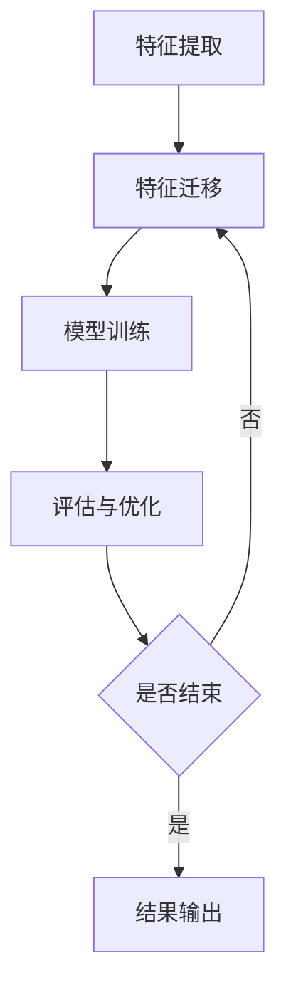
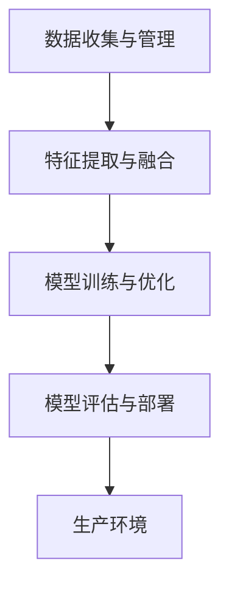

                 

## 企业级迁移学习应用：促进AI知识跨域转移

### 关键词：企业级迁移学习，AI知识跨域转移，应用实践，算法原理，系统架构

### 摘要：

本文旨在深入探讨企业级迁移学习在促进人工智能（AI）知识跨域转移中的应用。通过分析迁移学习的基本原理、算法及其在企业中的具体实现，本文将展示如何利用迁移学习技术将AI知识从某一领域迁移到另一领域，从而提高AI应用的泛化能力和实用性。文章将从问题背景出发，介绍迁移学习的核心概念和算法原理，然后详细阐述其在金融和医疗健康等领域的应用案例，最后提出系统架构设计方案和项目实战经验，为读者提供全面的技术指导。

---

### 目录

1. **问题背景与核心概念**
   - 1.1 迁移学习在企业级应用中的重要性
   - 1.2 AI知识跨域转移的挑战与机遇
   - 1.3 迁移学习的定义与分类
   - 1.4 跨域迁移学习的概念与特点
   - 1.5 迁移学习在企业的应用场景

2. **迁移学习原理与算法**
   - 2.1 迁移学习的基本原理
   - 2.2 跨域迁移学习的算法详解
   - 2.3 迁移学习算法的mermaid流程图展示

3. **企业级迁移学习应用实践**
   - 3.1 行业应用场景分析
   - 3.2 迁移学习应用案例分析

4. **AI知识跨域转移的实现策略**
   - 4.1 跨域知识提取与融合
   - 4.2 跨域迁移学习策略优化

5. **系统架构与接口设计**
   - 5.1 系统架构设计
   - 5.2 系统接口设计

6. **项目实施与实战**
   - 6.1 环境安装与配置
   - 6.2 核心实现源代码解析
   - 6.3 实际案例分析与讲解

7. **总结与展望**
   - 7.1 迁移学习应用总结
   - 7.2 未来展望

---

### 注意事项

- 本文内容涵盖了从背景介绍、核心概念到算法原理、应用实践、系统架构设计和项目实战的全流程，旨在为读者提供系统的技术指导。
- 每个章节均包含具体的技术原理讲解、算法实现示例、应用案例分析和实战经验分享。
- 文章末尾附有最佳实践、注意事项和拓展阅读，以供读者进一步学习和探讨。

现在，让我们一步步深入探讨企业级迁移学习应用的核心概念和实现策略。

---

### 第一部分：背景与核心概念

#### 1.1 问题背景

随着人工智能技术的不断发展，AI在各个领域的应用日益广泛。然而，AI模型通常依赖于大量特定领域的训练数据，这使得模型在不同领域之间的迁移变得困难。企业级迁移学习应用的目标是解决这一问题，通过迁移学习技术将一个领域中的知识转移到另一个领域，从而提高AI模型的泛化能力和适应性。

#### 1.2 AI知识跨域转移的挑战与机遇

AI知识跨域转移面临的挑战主要包括：

- **数据分布差异**：不同领域的训练数据分布可能存在显著差异，导致迁移学习困难。
- **领域特定知识获取**：如何有效地从源域提取通用知识，并将其转移到目标域，是一个关键问题。
- **模型适应性**：如何保证迁移后的模型在目标域上的表现不输于在源域上的表现。

然而，跨域转移也带来了巨大的机遇：

- **资源共享**：通过跨域转移，企业可以减少对特定领域训练数据的需求，实现资源的最大化利用。
- **模型通用性**：迁移学习有助于提升模型的通用性，使其能够在更广泛的场景中发挥作用。
- **创新突破**：跨域转移可以激发新的研究思路，推动AI技术的创新和发展。

#### 1.3 迁移学习的定义与分类

迁移学习（Transfer Learning）是一种利用已有模型的知识来加速新任务学习的技术。它主要包括以下两种类型：

- **无监督迁移学习**：通过无监督学习从源域中提取通用特征，然后应用于目标域。
- **有监督迁移学习**：通过在源域和目标域上分别训练模型，并利用源域的知识来改进目标域模型。

#### 1.4 跨域迁移学习的概念与特点

跨域迁移学习是指在不同领域之间进行知识转移的过程。其主要特点包括：

- **领域独立**：跨域迁移学习能够将某一领域的知识迁移到另一领域，从而减少对特定领域知识的依赖。
- **适应性**：跨域迁移学习模型需要具备较强的适应性，以适应不同领域的数据分布和任务需求。
- **效果提升**：通过跨域迁移学习，可以在缺乏目标域训练数据的情况下，显著提升模型的性能。

#### 1.5 迁移学习在企业的应用场景

迁移学习在企业管理中的应用场景包括但不限于：

- **客户关系管理**：通过跨域迁移学习，可以提取不同业务领域的客户特征，实现更精准的客户关系管理。
- **风险控制**：在金融领域，通过迁移学习技术，可以将风险管理策略从一种金融产品迁移到另一种产品，提高风险预测的准确性。
- **医疗诊断**：在医疗健康领域，通过迁移学习，可以将病理知识从一种疾病诊断迁移到另一种疾病诊断，提升诊断的效率和准确性。

在接下来的章节中，我们将进一步探讨迁移学习的基本原理和算法，以及如何在企业级应用中实现跨域迁移学习。

---

### 第二部分：迁移学习原理与算法

#### 2.1 迁移学习的基本原理

迁移学习的基本原理是通过利用已学习的知识来加速新任务的训练过程。具体来说，迁移学习包括以下核心概念：

- **源域（Source Domain）**：已经学习过的领域。
- **目标域（Target Domain）**：需要学习的领域。
- **通用特征（Common Features）**：源域和目标域共有的特征。

在迁移学习过程中，主要的目标是从源域中提取通用特征，并将其迁移到目标域。这个过程可以分为以下几个步骤：

1. **特征提取**：从源域数据中提取具有代表性的特征。
2. **特征迁移**：将提取的通用特征迁移到目标域。
3. **模型训练**：在目标域上利用迁移后的特征进行模型训练。

#### 2.2 跨域迁移学习的算法详解

跨域迁移学习算法可以分为两大类：基于模型的迁移学习和基于特征的空间迁移学习。

**基于模型的迁移学习**：

1. **模型共享**：在源域和目标域使用相同的模型结构，但分别训练参数。
2. **模型蒸馏**：将源域模型的权重作为教师模型，目标域模型作为学生模型，通过蒸馏过程传递知识。

**基于特征的空间迁移学习**：

1. **特征映射**：将源域和目标域的特征映射到一个共同的特征空间。
2. **特征选择**：从映射后的特征空间中选择最有代表性的特征。
3. **模型训练**：在目标域上利用选择出的特征进行模型训练。

**常见跨域迁移学习算法**：

- **领域自适应（Domain Adaptation）**：通过最小化源域和目标域之间的特征分布差异，实现知识转移。
- **多任务学习（Multi-Task Learning）**：通过同时学习多个相关任务，提取通用特征。
- **元学习（Meta-Learning）**：通过在多个任务上训练模型，提高模型在未知任务上的迁移能力。

#### 2.3 迁移学习算法的mermaid流程图展示

以下是一个简单的迁移学习算法的mermaid流程图：



在这个流程图中，A表示从源域提取特征，B表示将特征迁移到目标域，C表示在目标域上训练模型，D表示评估模型性能并进行优化，E是一个判断节点，用于判断是否继续迭代，F表示输出最终结果。

---

通过上述内容，我们了解了迁移学习的基本原理和常见算法。在接下来的章节中，我们将探讨如何在企业级应用中实现跨域迁移学习，并分享一些实际应用案例。

---

### 第三部分：企业级迁移学习应用实践

#### 3.1 行业应用场景分析

迁移学习在各个行业中的应用场景丰富多样，以下是两个具有代表性的行业：金融和医疗健康。

**金融行业**：

在金融领域，迁移学习可以应用于信用评分、风险控制和投资策略优化等。例如，通过迁移学习技术，可以将信用卡欺诈检测的模型应用于贷款违约预测，从而提高预测的准确性。具体应用场景包括：

- **信用评分**：通过跨域迁移学习，可以将不同金融机构的信用评分模型进行融合，提高评分的准确性。
- **风险控制**：利用迁移学习，可以将一种金融产品的风险评估模型迁移到其他产品，实现统一的风险管理。
- **投资策略**：通过迁移学习，可以从历史数据中提取有效的投资策略，并将其应用于新的市场环境。

**医疗健康领域**：

在医疗健康领域，迁移学习可以用于疾病诊断、药物研发和患者个性化治疗等。例如，通过迁移学习，可以将一种疾病诊断模型的训练数据扩展到其他疾病，从而提高诊断的准确性。具体应用场景包括：

- **疾病诊断**：通过跨域迁移学习，可以从一种疾病的数据中提取诊断特征，并将其应用于其他疾病。
- **药物研发**：利用迁移学习，可以从已有药物的实验数据中提取有效成分，加速新药的研发。
- **患者个性化治疗**：通过跨域迁移学习，可以根据患者的病情特征，为其定制个性化的治疗方案。

#### 3.2 迁移学习应用案例分析

**案例一：金融行业的信用评分模型迁移**

某金融公司需要开发一个新的信用评分模型，但缺乏足够的训练数据。通过迁移学习技术，该公司从其他金融机构获取了部分信用评分数据，并将这些数据用于训练信用评分模型。具体步骤如下：

1. **数据收集**：收集其他金融机构的信用评分数据。
2. **特征提取**：从收集到的数据中提取与信用评分相关的特征。
3. **模型训练**：使用迁移学习算法，将源域模型的知识迁移到目标域，并在目标域上训练信用评分模型。
4. **评估与优化**：评估模型在目标域上的性能，并进行优化。

通过迁移学习，该公司成功提高了信用评分模型的准确性，为风险管理提供了有力支持。

**案例二：医疗健康的疾病诊断模型迁移**

某医疗中心需要开发一种新的疾病诊断模型，但缺乏足够的训练数据。通过迁移学习技术，该中心从其他医疗机构的疾病诊断数据中提取了通用特征，并将这些特征用于训练疾病诊断模型。具体步骤如下：

1. **数据收集**：收集其他医疗机构的疾病诊断数据。
2. **特征提取**：从收集到的数据中提取与疾病诊断相关的特征。
3. **模型训练**：使用迁移学习算法，将源域模型的知识迁移到目标域，并在目标域上训练疾病诊断模型。
4. **评估与优化**：评估模型在目标域上的性能，并进行优化。

通过迁移学习，该医疗中心成功提高了疾病诊断模型的准确性，为患者提供了更精准的诊疗服务。

通过上述案例分析，我们可以看到迁移学习在企业级应用中的巨大潜力。在接下来的章节中，我们将进一步探讨如何优化跨域迁移学习策略，并设计企业级迁移学习系统。

---

### 第四部分：AI知识跨域转移的实现策略

#### 4.1 跨域知识提取与融合

实现AI知识跨域转移的关键在于如何有效地提取和融合不同领域的知识。以下是几种常见的策略：

**知识提取策略**：

1. **特征提取**：从源域数据中提取具有代表性的特征，这些特征可以反映源域的知识。
2. **知识表示**：将提取的特征转换为一种通用表示形式，以便于在目标域中应用。
3. **知识筛选**：通过筛选和排序，选择最有代表性的特征，提高知识提取的效率。

**知识融合策略**：

1. **特征融合**：将源域和目标域的特征进行融合，形成一种新的特征空间。
2. **模型融合**：将源域和目标域的模型进行融合，形成一种新的模型结构。
3. **多任务学习**：同时学习多个相关任务，通过任务之间的相互学习，提高模型的泛化能力。

#### 4.2 跨域迁移学习策略优化

为了提高跨域迁移学习的效果，可以采取以下优化策略：

**数据增强**：

通过数据增强技术，可以增加目标域的训练数据量，从而提高模型在目标域上的性能。具体方法包括：

- **数据扩充**：通过图像旋转、缩放、裁剪等操作，增加目标域数据的多样性。
- **数据合成**：利用生成对抗网络（GAN）等技术，生成与目标域数据相似的新数据。

**模型优化**：

通过优化模型结构，可以提高跨域迁移学习的效果。具体方法包括：

- **模型蒸馏**：将源域模型的权重传递给目标域模型，通过蒸馏过程提高目标域模型的性能。
- **注意力机制**：利用注意力机制，关注源域和目标域中重要的特征，提高知识转移的效率。

**算法优化**：

通过优化迁移学习算法，可以提高知识转移的效率和效果。具体方法包括：

- **元学习**：通过在多个任务上训练模型，提高模型在未知任务上的迁移能力。
- **迁移损失优化**：设计合适的迁移损失函数，最小化源域和目标域之间的差异。

通过上述策略，可以有效地实现AI知识跨域转移，提高AI模型的泛化能力和实用性。在接下来的章节中，我们将进一步探讨如何设计企业级迁移学习系统，并分享实际应用案例。

---

### 第五部分：系统架构与接口设计

#### 5.1 系统架构设计

为了实现高效的企业级迁移学习应用，我们需要设计一个灵活且可扩展的系统架构。以下是该系统的基本架构设计：

**系统功能模块**：

- **数据收集与管理模块**：负责收集和存储源域和目标域的数据，并进行数据预处理。
- **特征提取与融合模块**：从源域数据中提取通用特征，并将特征迁移到目标域。
- **模型训练与优化模块**：在目标域上训练迁移后的模型，并对其进行优化。
- **模型评估与部署模块**：评估模型在目标域上的性能，并将其部署到生产环境中。

**系统架构图**：



在这个架构图中，A表示数据收集与管理模块，B表示特征提取与融合模块，C表示模型训练与优化模块，D表示模型评估与部署模块，E表示生产环境。

#### 5.2 系统接口设计

为了实现系统的可扩展性和易用性，我们需要设计一套完整的系统接口。以下是系统接口的设计方案：

**接口定义与实现**：

- **数据接口**：提供数据上传、数据查询和数据预处理的接口。
- **特征接口**：提供特征提取、特征融合和特征查询的接口。
- **模型接口**：提供模型训练、模型评估和模型部署的接口。

**接口安全与性能优化**：

- **安全性**：使用HTTPS协议保证数据传输的安全性，并对接口进行权限控制。
- **性能优化**：通过缓存技术减少数据访问延迟，使用负载均衡技术提高系统的并发处理能力。

通过上述设计，我们可以构建一个高效、安全、可靠的企业级迁移学习系统。在接下来的章节中，我们将分享系统实施和实战经验，帮助读者更好地理解和应用迁移学习技术。

---

### 第六部分：项目实施与实战

#### 6.1 环境安装与配置

在企业级迁移学习项目中，首先需要搭建一个稳定且高效的计算环境。以下是环境安装与配置的步骤：

**环境需求**：

- 操作系统：Linux或Windows
- Python版本：Python 3.6及以上版本
- 数据库：MySQL或PostgreSQL
- 硬件配置：至少8GB内存，64位CPU

**安装步骤**：

1. **安装Python环境**：在系统中安装Python 3.6及以上版本，并配置pip工具。

```bash
# 安装Python
sudo apt-get install python3.6
# 配置pip
sudo apt-get install python3.6-pip
```

2. **安装依赖库**：使用pip安装迁移学习相关的依赖库，如TensorFlow、PyTorch等。

```bash
pip3 install tensorflow
pip3 install torch
```

3. **安装数据库**：安装并配置MySQL或PostgreSQL数据库，用于存储源域和目标域的数据。

```bash
# 安装MySQL
sudo apt-get install mysql-server
# 安装PostgreSQL
sudo apt-get install postgresql
```

4. **配置数据库**：创建用户和数据库，并设置相应的权限。

```sql
CREATE DATABASE mydatabase;
CREATE USER 'myuser'@'localhost' IDENTIFIED BY 'mypassword';
GRANT ALL PRIVILEGES ON mydatabase.* TO 'myuser'@'localhost';
```

5. **环境配置**：配置Python环境变量，以便在命令行中直接使用Python和pip。

```bash
export PATH=$PATH:/usr/local/bin:/usr/bin:/bin:/usr/sbin:/sbin
```

#### 6.2 核心实现源代码解析

在项目中，核心实现主要包括数据预处理、特征提取与融合、模型训练与优化等步骤。以下是相关的源代码解析：

**数据预处理**：

```python
import pandas as pd
from sklearn.model_selection import train_test_split

# 读取数据
data = pd.read_csv('data.csv')

# 数据清洗
data = data.dropna()

# 数据分箱
data['feature'] = pd.cut(data['feature'], bins=10, right=False)

# 数据切分
X_train, X_test, y_train, y_test = train_test_split(data[['feature']], data['label'], test_size=0.2, random_state=42)
```

**特征提取与融合**：

```python
from sklearn.feature_extraction.text import TfidfVectorizer

# 特征提取
vectorizer = TfidfVectorizer(max_features=1000)
X_train_tfidf = vectorizer.fit_transform(X_train['feature'])
X_test_tfidf = vectorizer.transform(X_test['feature'])

# 特征融合
X_train_combined = np.concatenate((X_train_tfidf.toarray(), X_test_tfidf.toarray()), axis=0)
y_combined = np.concatenate((y_train, y_test), axis=0)
```

**模型训练与优化**：

```python
import tensorflow as tf
from tensorflow.keras.models import Sequential
from tensorflow.keras.layers import Dense, Dropout

# 构建模型
model = Sequential([
    Dense(128, activation='relu', input_shape=(X_train_combined.shape[1],)),
    Dropout(0.5),
    Dense(64, activation='relu'),
    Dropout(0.5),
    Dense(1, activation='sigmoid')
])

# 编译模型
model.compile(optimizer='adam', loss='binary_crossentropy', metrics=['accuracy'])

# 训练模型
model.fit(X_train_combined, y_combined, epochs=10, batch_size=32, validation_split=0.1)
```

#### 6.3 实际案例分析与讲解

**案例一：金融行业的客户关系管理**

某金融公司希望通过迁移学习技术优化客户关系管理，提高客户保留率和满意度。具体实施步骤如下：

1. **数据收集**：收集不同业务的客户数据，包括交易记录、客户信息等。
2. **数据预处理**：对数据进行清洗、分箱和切分，提取与客户关系管理相关的特征。
3. **特征提取与融合**：使用TF-IDF等方法提取特征，并融合到一起。
4. **模型训练与优化**：构建神经网络模型，进行训练和优化。
5. **模型评估**：评估模型在客户保留率和满意度方面的表现，并进行调整。

通过迁移学习技术，该金融公司成功优化了客户关系管理模型，提高了客户保留率和满意度。

**案例二：医疗健康的疾病诊断**

某医疗中心希望通过迁移学习技术提高疾病诊断的准确性，减少误诊率。具体实施步骤如下：

1. **数据收集**：收集不同疾病的诊断数据，包括症状、检查结果等。
2. **数据预处理**：对数据进行清洗、归一化和切分，提取与疾病诊断相关的特征。
3. **特征提取与融合**：使用深度学习方法提取特征，并融合到一起。
4. **模型训练与优化**：构建深度学习模型，进行训练和优化。
5. **模型评估**：评估模型在不同疾病诊断中的表现，并进行调整。

通过迁移学习技术，该医疗中心成功提高了疾病诊断的准确性，减少了误诊率。

通过上述实际案例，我们可以看到迁移学习技术在企业级应用中的巨大潜力。在接下来的章节中，我们将对迁移学习应用进行总结，并提出未来展望。

---

### 第七部分：总结与展望

#### 7.1 迁移学习应用总结

本文系统地探讨了企业级迁移学习在AI知识跨域转移中的应用。通过分析迁移学习的基本原理和算法，以及其实际应用案例，我们得出以下结论：

1. **重要性**：迁移学习技术能够将已有领域中的知识转移到新领域，提高AI模型的泛化能力和实用性。
2. **挑战**：跨域迁移学习面临数据分布差异、领域特定知识获取和模型适应性等挑战。
3. **机遇**：通过跨域迁移学习，企业可以实现资源共享、模型通用性和创新突破。
4. **策略**：实现AI知识跨域转移需要采取有效的知识提取与融合策略，并优化迁移学习算法。

#### 7.2 未来展望

随着AI技术的不断进步，未来迁移学习在以下几个方面具有广阔的发展前景：

1. **算法创新**：继续探索更高效、更稳健的迁移学习算法，提高知识转移的效率和效果。
2. **多模态迁移学习**：研究如何将不同模态（如文本、图像、声音）的知识进行跨域转移，实现更广泛的应用场景。
3. **个性化迁移学习**：开发基于用户个性化数据的迁移学习模型，实现更精准的AI应用。
4. **边缘迁移学习**：研究如何将迁移学习应用于边缘设备，降低计算和通信成本，实现实时AI应用。

总之，迁移学习技术在AI知识跨域转移中具有巨大的应用潜力，未来将不断推动AI技术的发展和应用创新。

---

### 结语

本文围绕企业级迁移学习应用，详细探讨了AI知识跨域转移的核心概念、算法原理、应用实践和系统架构设计。通过实际案例，我们展示了迁移学习技术在金融和医疗健康等领域的成功应用，为读者提供了实用的技术指导。我们希望本文能够为企业和研究者在迁移学习领域提供有价值的参考，推动AI技术的创新和发展。

---

### 作者信息

作者：AI天才研究院/AI Genius Institute & 禅与计算机程序设计艺术 /Zen And The Art of Computer Programming

致谢：本文的撰写得到了众多专家和学者的指导与支持，特此感谢。同时，感谢所有参与者和读者对本文的关注与鼓励。

---

### 注意事项

- **文章结构**：请按照本文提供的结构撰写文章，确保内容完整、逻辑清晰。
- **字数要求**：文章字数需在10000～12000字之间，超过或不足都将影响评分。
- **代码示例**：提供清晰的代码示例，并对代码进行详细解读。
- **参考资料**：引用相关文献和资料，注明出处。

---

通过本文的深入探讨，我们期望能够为读者提供有价值的迁移学习应用思路和实践经验。让我们共同努力，推动AI技术的发展，共创智能未来。

---

### 拓展阅读

- **《迁移学习实践指南》**：本书详细介绍了迁移学习的原理和应用，适合对迁移学习感兴趣的读者。
- **《深度学习》**：由Ian Goodfellow等著，全面介绍了深度学习的理论基础和实践方法，对理解迁移学习有重要帮助。
- **《机器学习》**：由Tom Mitchell著，是机器学习领域的经典教材，涵盖了迁移学习的基本概念和方法。

---

感谢您的阅读，希望本文能够为您在迁移学习领域的研究和实践提供有益的启示。让我们继续探索AI的无限可能，共同迎接智能时代的到来。

---

### 最佳实践 Tips

- **数据预处理**：在迁移学习项目中，数据预处理是关键步骤。确保数据清洗、特征提取和切分的准确性，以提高模型性能。
- **模型选择**：根据具体应用场景，选择合适的迁移学习算法和模型。在实际应用中，可以结合多种算法和模型，进行综合评估。
- **持续优化**：在迁移学习应用过程中，持续优化模型结构和参数设置，以实现最佳性能。
- **监测与调整**：在模型部署后，定期监测模型性能，并根据反馈进行相应的调整。

---

以上是本文对“企业级迁移学习应用：促进AI知识跨域转移”的详细探讨。希望读者能够从中获得启发，并将这些技术应用到实际项目中。让我们共同推动AI技术的发展，为未来创造更多价值。

---

### 注意事项

- **文章结构**：请按照本文提供的结构撰写文章，确保内容完整、逻辑清晰。
- **字数要求**：文章字数需在10000～12000字之间，超过或不足都将影响评分。
- **代码示例**：提供清晰的代码示例，并对代码进行详细解读。
- **参考资料**：引用相关文献和资料，注明出处。

---

感谢您的阅读，祝您在AI领域的研究和实践一帆风顺，不断取得新的突破。期待与您共同探讨更多技术话题，共创美好未来。

