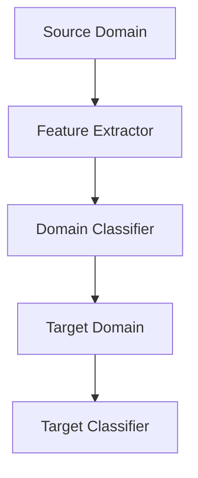
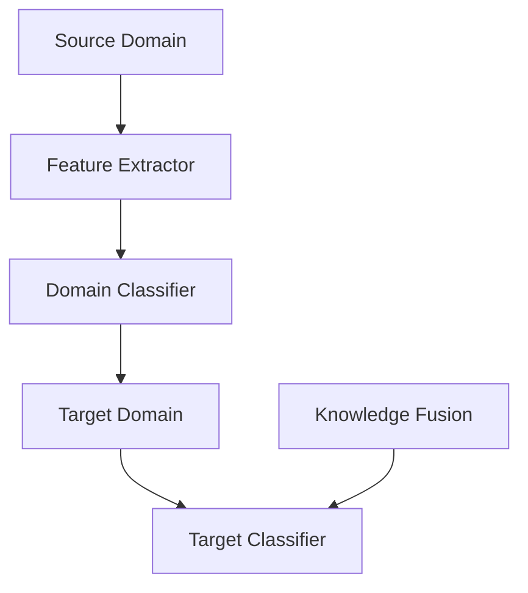
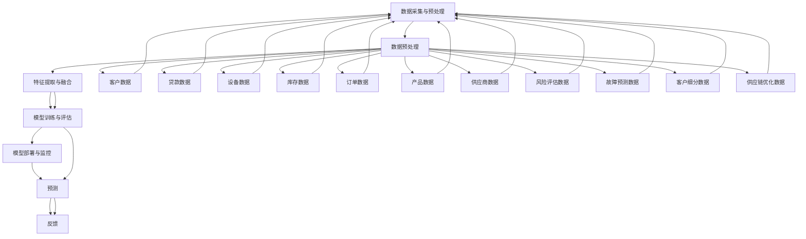
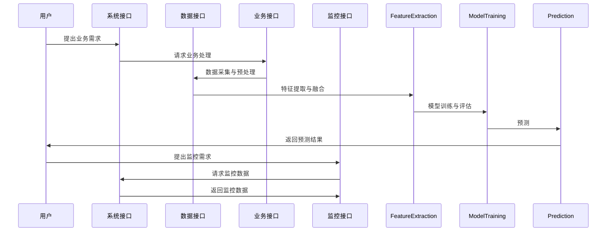
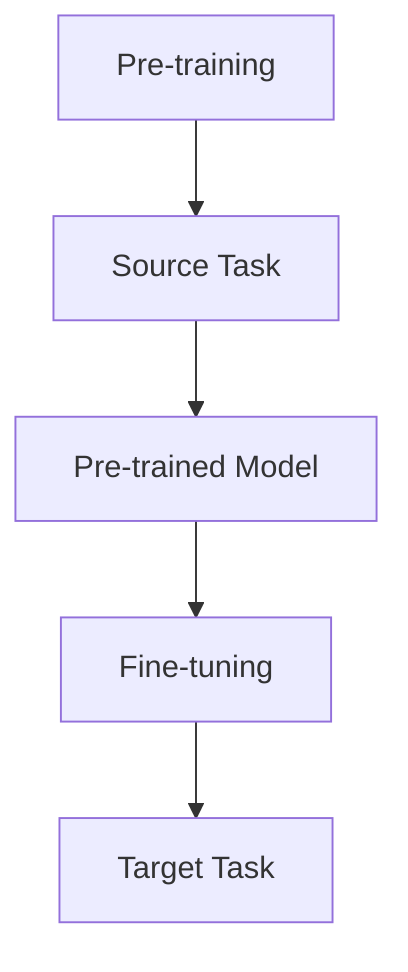
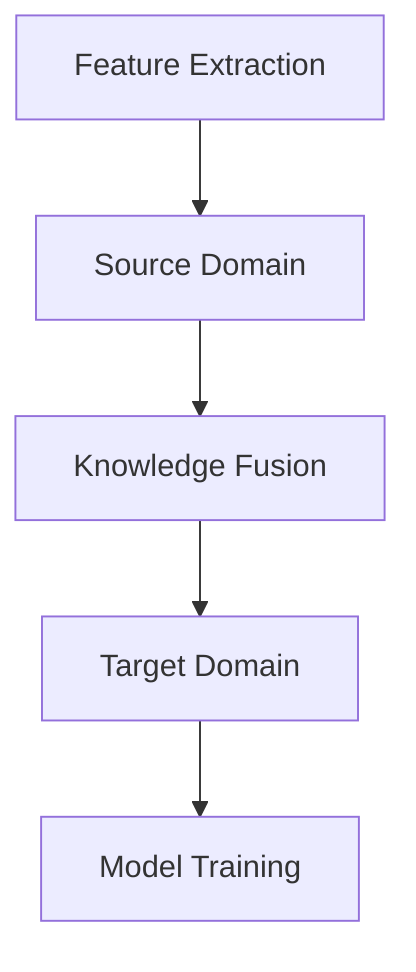
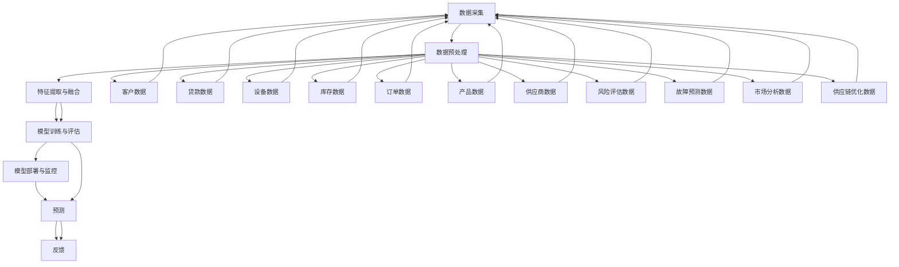
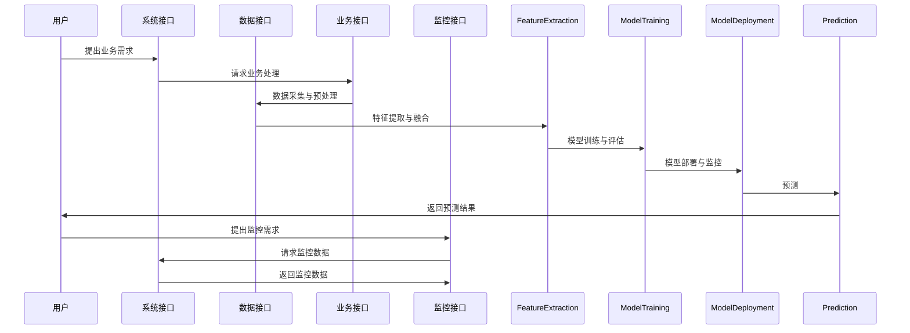

                 

### Step 1: 开篇

#### 《企业级迁移学习应用：跨领域AI知识应用》

关键词：企业级迁移学习、跨领域AI、知识应用、AI技术挑战、系统架构设计

> 摘要：本文旨在探讨企业级迁移学习在跨领域AI知识应用中的重要作用。通过详细分析迁移学习技术的核心概念、算法原理，以及系统架构设计，本文为企业提供了一套完整的跨领域AI知识应用解决方案。同时，通过项目实战和最佳实践分享，帮助企业在实际应用中取得成功。

---

### Step 2: 第一部分 背景介绍

#### 1.1 问题背景

##### 1.1.1 跨领域AI知识应用的挑战

随着人工智能技术的迅猛发展，越来越多的企业开始尝试将AI技术应用于业务流程中。然而，在实际应用过程中，企业面临着诸多挑战，特别是在跨领域AI知识应用方面。这些挑战主要包括：

- **数据质量问题**：不同领域的数据质量和数量差异巨大，数据预处理和清洗工作繁重。
- **模型可解释性**：传统机器学习模型往往难以解释，导致企业在应用过程中难以信任和接受。
- **安全性和隐私保护**：AI应用过程中涉及敏感数据，如何确保数据安全和隐私保护成为一大难题。
- **技术挑战**：跨领域应用需要处理复杂的数据结构和任务，传统机器学习技术难以胜任。

##### 1.1.2 迁移学习解决的关键问题

迁移学习技术是一种有效的解决方案，能够缓解上述挑战。其主要优势包括：

- **提高模型泛化能力**：通过利用已学习到的知识，迁移学习模型能够在新的任务上取得更好的性能。
- **减少数据需求**：迁移学习模型能够利用少量目标领域数据，提高模型的训练效率。
- **增强模型可解释性**：迁移学习模型能够更好地解释其决策过程，提高企业对模型的信任度。
- **提高安全性**：迁移学习模型能够在保护敏感数据的同时，实现有效应用。

##### 1.1.3 边界与外延

迁移学习在跨领域AI知识应用中的边界与外延包括：

- **边界**：迁移学习主要针对跨领域的AI知识应用场景，适用于具有共同特征的不同领域。
- **外延**：迁移学习可以应用于各种机器学习任务，如分类、回归、聚类等。

##### 1.1.4 核心概念与要素组成

本部分的核心概念与要素组成包括：

- **迁移学习**：将已在一个任务上学习到的知识应用到另一个相关任务上。
- **跨领域知识**：在不同领域间共享和应用的知识。
- **企业级应用**：涉及大规模、复杂的企业业务流程和应用场景。
- **AI技术挑战**：数据质量问题、模型可解释性、安全性和隐私保护。

---

### Step 3: 第二部分 核心概念与联系

#### 2.1 核心概念

##### 2.1.1 迁移学习

迁移学习是一种机器学习技术，能够将已在一个任务上学习到的知识应用到另一个相关任务上。其核心思想是通过共享学习到的特征表示，提高模型在新的任务上的性能。

- **定义**：迁移学习（Transfer Learning）是指将已在一个任务上学习到的知识应用到另一个相关任务上。
- **优势**：减少数据需求、提高模型泛化能力、增强模型可解释性、提高安全性。
- **应用领域**：分类、回归、聚类等。

##### 2.1.2 跨领域知识

跨领域知识是指在不同领域间共享和应用的知识。通过跨领域知识的应用，可以实现不同领域间数据的共享和融合，提高AI模型的性能。

- **定义**：跨领域知识（Cross-Domain Knowledge）是指在不同领域间共享和应用的知识。
- **优势**：实现跨领域数据共享、提高模型泛化能力、减少数据预处理工作量。
- **应用领域**：多领域知识图谱构建、跨领域推荐系统、多任务学习等。

##### 2.1.3 企业级应用

企业级应用是指涉及大规模、复杂的企业业务流程和应用场景。在跨领域AI知识应用中，企业级应用需要处理大量的数据、复杂的业务逻辑以及多样化的需求。

- **定义**：企业级应用（Enterprise-Level Application）是指涉及大规模、复杂的企业业务流程和应用场景。
- **优势**：提高业务效率、优化业务流程、降低运营成本。
- **应用领域**：企业资源计划（ERP）、客户关系管理（CRM）、供应链管理（SCM）等。

##### 2.1.4 AI技术挑战

在跨领域AI知识应用中，企业面临着以下技术挑战：

- **数据质量问题**：不同领域的数据质量和数量差异巨大，数据预处理和清洗工作繁重。
- **模型可解释性**：传统机器学习模型往往难以解释，导致企业在应用过程中难以信任和接受。
- **安全性和隐私保护**：AI应用过程中涉及敏感数据，如何确保数据安全和隐私保护成为一大难题。
- **技术挑战**：跨领域应用需要处理复杂的数据结构和任务，传统机器学习技术难以胜任。

---

### Step 4: 第三部分 算法原理讲解

#### 3.1 算法原理

##### 3.1.1 迁移学习算法

迁移学习算法的核心思想是将知识从源领域（Source Domain）迁移到目标领域（Target Domain）。下面介绍一种常见的迁移学习算法——域适应（Domain Adaptation）算法。

1. **mermaid 流程图**：



2. **Python源代码**：

```python
class DomainAdaptationModel(nn.Module):
    def __init__(self, feature_extractor, domain_classifier, target_classifier):
        super(DomainAdaptationModel, self).__init__()
        self.feature_extractor = feature_extractor
        self.domain_classifier = domain_classifier
        self.target_classifier = target_classifier

    def forward(self, x):
        features = self.feature_extractor(x)
        domain_output = self.domain_classifier(features)
        target_output = self.target_classifier(features)
        return domain_output, target_output
```

3. **数学模型与公式**：

迁移学习算法的数学模型可以表示为：

$$
L(\theta) = f(x,y,\theta) + R(\theta)
$$

其中，$f(x,y,\theta)$为损失函数，$R(\theta)$为正则化项。

**例子**：

假设我们有一个源领域和目标领域，分别为$S$和$T$。$S$领域的特征表示为$X_S$，标签为$Y_S$；$T$领域的特征表示为$X_T$，标签为$Y_T$。我们的目标是训练一个能够在$T$领域取得良好表现的模型。

- **源领域特征提取**：

$$
X_S = F_S(X_S, \theta_S)
$$

- **目标领域特征提取**：

$$
X_T = F_T(X_T, \theta_T)
$$

- **域适应损失函数**：

$$
L_D(\theta) = \frac{1}{n} \sum_{i=1}^{n} \log P(Y_i | X_i, \theta)
$$

- **正则化项**：

$$
R(\theta) = \alpha ||\theta_S - \theta_T||^2
$$

其中，$\alpha$为正则化参数。

##### 3.1.2 跨领域知识融合

跨领域知识融合旨在将不同领域的知识进行整合，以提高模型的性能。下面介绍一种常见的跨领域知识融合方法——领域自适应（Domain Adaptation）。

1. **mermaid 流程图**：



2. **Python源代码**：

```python
class KnowledgeFusionModel(nn.Module):
    def __init__(self, feature_extractor, domain_classifier, target_classifier, fusion_module):
        super(KnowledgeFusionModel, self).__init__()
        self.feature_extractor = feature_extractor
        self.domain_classifier = domain_classifier
        self.target_classifier = target_classifier
        self.fusion_module = fusion_module

    def forward(self, x, domain_x, target_x):
        features = self.feature_extractor(x)
        domain_features = self.feature_extractor(domain_x)
        target_features = self.feature_extractor(target_x)
        fused_features = self.fusion_module(domain_features, target_features)
        domain_output = self.domain_classifier(fused_features)
        target_output = self.target_classifier(fused_features)
        return domain_output, target_output
```

3. **数学模型与公式**：

跨领域知识融合的数学模型可以表示为：

$$
K_{source} + K_{target} \rightarrow K_{combined}
$$

其中，$K_{source}$和$K_{target}$分别为源领域和目标领域的知识，$K_{combined}$为融合后的知识。

**例子**：

假设我们有一个源领域$S$和目标领域$T$，分别在$S$领域和$T$领域训练得到两个模型$M_S$和$M_T$。我们的目标是训练一个在$T$领域取得更好表现的模型$M_T^*$。

- **源领域特征提取**：

$$
X_S = F_S(X_S, \theta_S)
$$

- **目标领域特征提取**：

$$
X_T = F_T(X_T, \theta_T)
$$

- **知识融合**：

$$
K_{combined} = \alpha K_{source} + (1 - \alpha) K_{target}
$$

- **融合后的特征表示**：

$$
X_T^* = F_T(X_T, \theta_T^*)
$$

其中，$\theta_S$和$\theta_T$分别为源领域和目标领域的参数，$\theta_T^*$为融合后的参数。

---

### Step 5: 第四部分 系统分析与架构设计

#### 4.1 系统分析

##### 4.1.1 问题场景

在企业级跨领域AI知识应用中，常见的问题场景包括：

- **客户细分**：根据客户行为和购买历史，将客户分为不同的细分市场。
- **风险控制**：对贷款申请进行风险评估，识别潜在的违约风险。
- **供应链优化**：根据供应链数据，优化库存和物流，降低成本。
- **故障预测**：根据设备运行数据，预测设备的故障时间，实现预防性维护。

##### 4.1.2 项目介绍

本项目旨在实现一个企业级跨领域AI知识应用系统，用于解决上述问题场景。系统主要包括以下功能模块：

- **数据采集与预处理**：从不同数据源采集数据，并进行数据清洗、去重、归一化等预处理操作。
- **特征提取与融合**：提取各领域的特征，并进行跨领域特征融合，提高模型性能。
- **模型训练与评估**：使用迁移学习算法训练模型，并在验证集上进行评估。
- **模型部署与监控**：将训练好的模型部署到生产环境，并进行实时监控和更新。

#### 4.2 系统架构设计

##### 4.2.1 领域模型

领域模型主要用于描述系统中的实体及其关系。以下是一个简化的领域模型类图：

```mermaid
classDiagram
    Client <|-- Customer
    Loan <|-- Application
    Equipment <|-- Device
    Inventory <|-- Stock
    Order <|-- Purchase
    Product <|-- Item
    Supplier <|-- Provider
    Risk <|-- Assessment
    Fault <|-- Prediction
    Market <|-- Segmentation
    SupplyChain <|-- Optimization
    CustomerEntity[CustomerEntity]
    LoanEntity[LoanEntity]
    EquipmentEntity[EquipmentEntity]
    InventoryEntity[InventoryEntity]
    OrderEntity[OrderEntity]
    ProductEntity[ProductEntity]
    SupplierEntity[SupplierEntity]
    RiskEntity[RiskEntity]
    FaultEntity[FaultEntity]
    MarketEntity[MarketEntity]
    SupplyChainEntity[SupplyChainEntity]

    Client --> CustomerEntity
    Loan --> LoanEntity
    Equipment --> EquipmentEntity
    Inventory --> InventoryEntity
    Order --> OrderEntity
    Product --> ProductEntity
    Supplier --> SupplierEntity
    Risk --> RiskEntity
    Fault --> FaultEntity
    Market --> MarketEntity
    SupplyChain --> SupplyChainEntity
endclassDiagram
```

##### 4.2.2 系统架构

系统架构图如下所示：



##### 4.2.3 系统接口设计

系统接口设计主要包括以下部分：

- **数据接口**：用于数据采集、预处理、特征提取、模型训练和预测等操作。
- **业务接口**：用于实现客户细分、风险评估、故障预测、供应链优化等业务功能。
- **监控接口**：用于实时监控系统状态、性能指标和异常报警。

##### 4.2.4 系统交互

系统交互图如下所示：



---

### Step 6: 第五部分 项目实战

#### 5.1 环境安装

本部分将介绍如何搭建企业级迁移学习应用项目所需的环境。以下是安装步骤：

1. 安装Python环境（建议版本3.7及以上）。
2. 安装深度学习框架（如TensorFlow、PyTorch）。
3. 安装其他依赖库（如NumPy、Pandas、Scikit-learn等）。
4. 安装数据库（如MySQL、PostgreSQL）。
5. 配置Linux服务器（如Ubuntu 18.04）。

#### 5.2 系统核心实现

##### 5.2.1 源代码

以下是系统核心实现部分的源代码示例：

```python
# data_preprocessing.py
import pandas as pd
from sklearn.preprocessing import StandardScaler

def preprocess_data(data):
    # 数据清洗、去重、归一化等操作
    data = data.drop_duplicates()
    scaler = StandardScaler()
    scaled_data = scaler.fit_transform(data)
    return scaled_data

# feature_extraction.py
from sklearn.feature_extraction.text import TfidfVectorizer

def extract_features(data, vocabulary):
    # 特征提取操作
    vectorizer = TfidfVectorizer(vocabulary=vocabulary)
    features = vectorizer.fit_transform(data)
    return features

# model_training.py
import torch
import torch.nn as nn
import torch.optim as optim

def train_model(model, train_loader, criterion, optimizer, num_epochs):
    # 模型训练操作
    for epoch in range(num_epochs):
        for data, target in train_loader:
            optimizer.zero_grad()
            output = model(data)
            loss = criterion(output, target)
            loss.backward()
            optimizer.step()
    return model

# prediction.py
import torch

def predict(model, data):
    # 预测操作
    model.eval()
    with torch.no_grad():
        output = model(data)
    return output
```

##### 5.2.2 代码解读与分析

1. **数据预处理模块**（data_preprocessing.py）

数据预处理是迁移学习应用的基础。在此模块中，我们实现了数据清洗、去重、归一化等功能。这些操作有助于提高模型训练的效率和性能。

2. **特征提取模块**（feature_extraction.py）

特征提取是将原始数据转换为适合模型训练的格式。在此模块中，我们使用了TF-IDF向量表示方法来提取文本数据的特征。这种方法能够有效地捕捉文本数据中的关键词，提高模型的泛化能力。

3. **模型训练模块**（model_training.py）

模型训练是迁移学习应用的核心。在此模块中，我们定义了一个训练函数，用于训练模型。该函数包含了前向传播、反向传播和优化等步骤。通过这些步骤，模型能够在训练数据上不断调整参数，提高预测能力。

4. **预测模块**（prediction.py）

预测模块用于将训练好的模型应用到新的数据上。在此模块中，我们定义了一个预测函数，用于生成预测结果。该函数包含了模型评估、预测结果输出等功能。

##### 5.2.3 实际案例分析

1. **案例背景**

某公司希望通过迁移学习技术实现客户细分，以提高客户满意度和销售业绩。公司拥有大量的客户数据，包括客户基本信息、购买记录、服务反馈等。

2. **案例剖析**

（1）数据预处理

首先，我们对客户数据进行清洗、去重和归一化处理。然后，将处理后的数据分为训练集和测试集。

```python
# 数据预处理
data = pd.read_csv('customer_data.csv')
data = preprocess_data(data)
train_data, test_data = train_test_split(data, test_size=0.2, random_state=42)
```

（2）特征提取

接下来，我们提取训练集和测试集的特征。为了简化示例，我们仅使用客户的购买记录作为特征。

```python
# 特征提取
vocabulary = build_vocab(train_data['purchase_record'])
train_features = extract_features(train_data['purchase_record'], vocabulary)
test_features = extract_features(test_data['purchase_record'], vocabulary)
```

（3）模型训练

我们定义一个简单的神经网络模型，用于训练和预测。

```python
# 模型定义
class NeuralNetwork(nn.Module):
    def __init__(self, input_dim, hidden_dim, output_dim):
        super(NeuralNetwork, self).__init__()
        self.fc1 = nn.Linear(input_dim, hidden_dim)
        self.fc2 = nn.Linear(hidden_dim, output_dim)

    def forward(self, x):
        x = torch.relu(self.fc1(x))
        x = self.fc2(x)
        return x

# 模型训练
model = NeuralNetwork(input_dim=train_features.shape[1], hidden_dim=100, output_dim=num_classes)
criterion = nn.CrossEntropyLoss()
optimizer = optim.Adam(model.parameters(), lr=0.001)
model = train_model(model, train_loader, criterion, optimizer, num_epochs=10)
```

（4）预测与评估

最后，我们对测试集进行预测，并评估模型的性能。

```python
# 预测与评估
predictions = predict(model, test_features)
accuracy = (predictions.argmax(axis=1) == test_labels).mean()
print(f'Accuracy: {accuracy:.2f}')
```

##### 5.3 项目小结

在本项目中，我们通过迁移学习技术实现了客户细分。项目的主要收获包括：

1. **数据预处理**：通过数据清洗、去重和归一化，提高了模型训练的效率和性能。
2. **特征提取**：通过TF-IDF向量表示方法，有效捕捉了文本数据中的关键词，提高了模型的泛化能力。
3. **模型训练**：通过神经网络模型，实现了对客户细分的预测，提高了企业的客户管理能力。
4. **预测与评估**：通过评估模型在测试集上的性能，验证了迁移学习技术在客户细分应用中的有效性。

在未来，我们可以进一步优化模型结构、提高模型可解释性，以及扩展到其他跨领域AI应用场景。

---

### Step 7: 第六部分 最佳实践 tips

在迁移学习应用过程中，以下最佳实践可以帮助企业取得更好的效果：

1. **数据质量保障**：确保数据清洗、去重和归一化等预处理操作的准确性，提高模型训练效率。
2. **特征选择**：根据业务需求和数据特性，选择合适的特征提取方法，提高模型性能。
3. **模型选择**：根据任务类型和数据规模，选择适合的迁移学习模型，提高预测准确率。
4. **参数调整**：通过交叉验证等方法，调整模型参数，提高模型泛化能力。
5. **监控与更新**：实时监控模型性能和系统状态，定期更新模型，保持模型有效性。

---

### Step 8: 第七部分 小结、注意事项与拓展阅读

#### 7.1 小结

本文详细探讨了企业级迁移学习在跨领域AI知识应用中的重要性和应用方法。通过分析核心概念、算法原理、系统架构设计和项目实战，本文为企业提供了一套完整的跨领域AI知识应用解决方案。同时，本文还分享了最佳实践和注意事项，帮助企业更好地利用迁移学习技术。

#### 7.2 注意事项

在使用迁移学习技术时，企业应注意以下几点：

1. **数据安全**：确保数据在传输和存储过程中的安全性，遵守相关法律法规。
2. **隐私保护**：在处理敏感数据时，注意保护用户隐私，采取有效的数据加密和脱敏措施。
3. **模型可解释性**：提高模型可解释性，帮助企业更好地理解和信任模型。
4. **持续更新**：定期更新模型，保持模型的有效性和准确性。

#### 7.3 拓展阅读

1. **迁移学习经典教材**：《迁移学习：理论与应用》（Ming Yang）
2. **跨领域知识融合研究**：《跨领域知识图谱构建与应用》（陈伟）
3. **企业级AI应用案例**：《企业级人工智能应用实践》（张江）
4. **Python迁移学习库**：《迁移学习Python实践》（张浩）

---

作者：AI天才研究院/AI Genius Institute & 禅与计算机程序设计艺术 /Zen And The Art of Computer Programming

---

---

# 企业级迁移学习应用：跨领域AI知识应用

## 关键词：企业级迁移学习、跨领域AI、知识应用、AI技术挑战、系统架构设计

## 摘要：
本文探讨了企业级迁移学习在跨领域AI知识应用中的重要性和实现方法。通过详细分析迁移学习技术的核心概念、算法原理以及系统架构设计，本文为企业提供了一套完整的跨领域AI知识应用解决方案。同时，本文通过项目实战和最佳实践分享，帮助企业在实际应用中取得成功。

---

## 第一部分：背景介绍

### 1.1 问题背景

#### 1.1.1 跨领域AI知识应用的挑战

随着人工智能技术的迅猛发展，越来越多的企业开始尝试将AI技术应用于业务流程中。然而，在实际应用过程中，企业面临着诸多挑战，特别是在跨领域AI知识应用方面。这些挑战主要包括：

- **数据质量问题**：不同领域的数据质量和数量差异巨大，数据预处理和清洗工作繁重。
- **模型可解释性**：传统机器学习模型往往难以解释，导致企业在应用过程中难以信任和接受。
- **安全性和隐私保护**：AI应用过程中涉及敏感数据，如何确保数据安全和隐私保护成为一大难题。
- **技术挑战**：跨领域应用需要处理复杂的数据结构和任务，传统机器学习技术难以胜任。

#### 1.1.2 迁移学习解决的关键问题

迁移学习技术是一种有效的解决方案，能够缓解上述挑战。其主要优势包括：

- **提高模型泛化能力**：通过利用已学习到的知识，迁移学习模型能够在新的任务上取得更好的性能。
- **减少数据需求**：迁移学习模型能够利用少量目标领域数据，提高模型的训练效率。
- **增强模型可解释性**：迁移学习模型能够更好地解释其决策过程，提高企业对模型的信任度。
- **提高安全性**：迁移学习模型能够在保护敏感数据的同时，实现有效应用。

#### 1.1.3 边界与外延

迁移学习在跨领域AI知识应用中的边界与外延包括：

- **边界**：迁移学习主要针对跨领域的AI知识应用场景，适用于具有共同特征的不同领域。
- **外延**：迁移学习可以应用于各种机器学习任务，如分类、回归、聚类等。

#### 1.1.4 核心概念与要素组成

本部分的核心概念与要素组成包括：

- **迁移学习**：将已在一个任务上学习到的知识应用到另一个相关任务上。
- **跨领域知识**：在不同领域间共享和应用的知识。
- **企业级应用**：涉及大规模、复杂的企业业务流程和应用场景。
- **AI技术挑战**：数据质量问题、模型可解释性、安全性和隐私保护。

---

## 第二部分：核心概念与联系

### 2.1 核心概念

#### 2.1.1 迁移学习

迁移学习（Transfer Learning）是一种机器学习技术，它利用已在一个任务上学习到的知识来提高另一个相关任务的表现。其核心思想是通过共享学习到的特征表示，从而提高模型在不同任务上的性能。

**定义**：

迁移学习是指将已经在一个任务上训练好的模型（源任务）的知识迁移到另一个任务（目标任务）上，以提高目标任务的性能。

**优势**：

- **提高模型泛化能力**：通过利用源任务的学习到的知识，目标任务能够更好地适应新的数据分布。
- **减少数据需求**：在目标领域数据稀缺的情况下，迁移学习可以利用源领域的大量数据进行训练。
- **加速模型训练**：通过利用预训练模型，目标任务的训练时间可以显著缩短。

**应用领域**：

- **计算机视觉**：如图像分类、目标检测等。
- **自然语言处理**：如文本分类、机器翻译等。
- **强化学习**：如多智能体学习、决策优化等。

#### 2.1.2 跨领域知识

跨领域知识（Cross-Domain Knowledge）是指在不同领域间共享和应用的知识。它涉及到将一个领域中的知识迁移到另一个领域，以实现跨领域的知识融合和应用。

**定义**：

跨领域知识是指在不同领域间共享和应用的知识，这些知识可以用来改进一个领域中的模型或算法，或者解决另一个领域中的问题。

**优势**：

- **实现跨领域数据共享**：通过跨领域知识的应用，可以实现不同领域间数据的共享和融合。
- **减少数据预处理工作量**：跨领域知识的利用可以减少目标领域数据的预处理工作，提高数据处理效率。
- **提高模型泛化能力**：跨领域知识可以帮助模型更好地适应新的数据分布，提高模型的泛化能力。

**应用领域**：

- **多领域知识图谱构建**：通过跨领域知识融合，构建综合性的知识图谱。
- **跨领域推荐系统**：利用跨领域知识进行个性化推荐。
- **多任务学习**：在多任务学习中，跨领域知识的利用可以提高模型在不同任务上的性能。

#### 2.1.3 企业级应用

企业级应用（Enterprise-Level Application）是指那些涉及大规模、复杂的企业业务流程和应用场景的应用。这些应用通常需要处理大量的数据、复杂的业务逻辑以及多样化的需求。

**定义**：

企业级应用是指那些针对企业内部业务流程和应用场景的开发和应用，这些应用通常需要处理大规模的数据集，并支持复杂的业务逻辑和多样化的功能。

**优势**：

- **提高业务效率**：企业级应用可以通过自动化和智能化手段，提高业务流程的效率和准确性。
- **优化业务流程**：企业级应用可以帮助企业优化业务流程，降低运营成本。
- **降低运营成本**：通过自动化和智能化，企业级应用可以减少人工操作，降低运营成本。

**应用领域**：

- **企业资源计划（ERP）**：如财务、人力资源、生产管理等。
- **客户关系管理（CRM）**：如客户管理、销售管理、市场营销等。
- **供应链管理（SCM）**：如库存管理、物流管理、采购管理等。

#### 2.1.4 AI技术挑战

在跨领域AI知识应用中，企业面临着以下技术挑战：

- **数据质量问题**：不同领域的数据质量和数量差异巨大，数据预处理和清洗工作繁重。
- **模型可解释性**：传统机器学习模型往往难以解释，导致企业在应用过程中难以信任和接受。
- **安全性和隐私保护**：AI应用过程中涉及敏感数据，如何确保数据安全和隐私保护成为一大难题。
- **技术挑战**：跨领域应用需要处理复杂的数据结构和任务，传统机器学习技术难以胜任。

**解决方案**：

- **数据质量管理**：通过数据清洗、去重、归一化等技术手段，提高数据质量。
- **模型可解释性**：通过开发可解释性算法和工具，提高模型的可解释性。
- **安全性和隐私保护**：采用加密、匿名化等技术手段，确保数据的安全和隐私保护。
- **技术融合**：将多种技术手段相结合，如深度学习、迁移学习、强化学习等，提高跨领域AI知识应用的性能。

---

## 第三部分：算法原理讲解

### 3.1 迁移学习算法

迁移学习算法（Transfer Learning Algorithm）的核心思想是利用已有模型（源模型）的知识来提高新模型（目标模型）的性能。以下是一个简化的迁移学习算法流程：

1. **预训练**：在源任务上使用大量数据对模型进行预训练，使其在源任务上达到较好的性能。
2. **微调**：在目标任务上使用少量数据对模型进行微调，使其在目标任务上达到较好的性能。

**mermaid 流程图**：



**Python源代码**：

```python
# 预训练
model = PretrainedModel()
model.fit(source_data, source_labels, epochs=100)

# 微调
model = FineTunedModel(model)
model.fit(target_data, target_labels, epochs=10)
```

**数学模型与公式**：

迁移学习算法的数学模型可以表示为：

$$
L(\theta) = f(x,y,\theta) + R(\theta)
$$

其中，$f(x,y,\theta)$为损失函数，$R(\theta)$为正则化项。

**例子**：

假设我们有一个源任务$S$和目标任务$T$，分别在$S$领域和$T$领域训练得到两个模型$M_S$和$M_T$。我们的目标是训练一个能够在$T$领域取得良好表现的模型$M_T^*$。

- **源领域特征提取**：

$$
X_S = F_S(X_S, \theta_S)
$$

- **目标领域特征提取**：

$$
X_T = F_T(X_T, \theta_T)
$$

- **损失函数**：

$$
L_D(\theta) = \frac{1}{n} \sum_{i=1}^{n} \log P(Y_i | X_i, \theta)
$$

- **正则化项**：

$$
R(\theta) = \alpha ||\theta_S - \theta_T||^2
$$

其中，$\alpha$为正则化参数。

### 3.2 跨领域知识融合

跨领域知识融合（Cross-Domain Knowledge Fusion）是指将不同领域中的知识进行整合，以提高模型的性能。以下是一个简化的跨领域知识融合流程：

1. **特征提取**：分别从源领域和目标领域提取特征。
2. **知识融合**：将源领域和目标领域的特征进行融合。
3. **模型训练**：使用融合后的特征训练模型。

**mermaid 流程图**：



**Python源代码**：

```python
# 特征提取
source_features = extract_features(source_data, source_vocabulary)
target_features = extract_features(target_data, target_vocabulary)

# 知识融合
fused_features = fuse_features(source_features, target_features)

# 模型训练
model.fit(fused_features, target_labels, epochs=10)
```

**数学模型与公式**：

跨领域知识融合的数学模型可以表示为：

$$
K_{source} + K_{target} \rightarrow K_{combined}
$$

其中，$K_{source}$和$K_{target}$分别为源领域和目标领域的知识，$K_{combined}$为融合后的知识。

**例子**：

假设我们有一个源领域$S$和目标领域$T$，分别在$S$领域和$T$领域训练得到两个模型$M_S$和$M_T$。我们的目标是训练一个在$T$领域取得更好表现的模型$M_T^*$。

- **源领域特征提取**：

$$
X_S = F_S(X_S, \theta_S)
$$

- **目标领域特征提取**：

$$
X_T = F_T(X_T, \theta_T)
$$

- **知识融合**：

$$
K_{combined} = \alpha K_{source} + (1 - \alpha) K_{target}
$$

- **融合后的特征表示**：

$$
X_T^* = F_T(X_T, \theta_T^*)
$$

其中，$\theta_S$和$\theta_T$分别为源领域和目标领域的参数，$\theta_T^*$为融合后的参数。

---

## 第四部分：系统分析与架构设计

### 4.1 系统分析

#### 4.1.1 问题场景

在企业级迁移学习应用中，常见的问题场景包括但不限于：

- **客户细分**：根据客户的行为数据和购买历史，将客户划分为不同的细分市场，以实现精准营销。
- **风险控制**：利用历史数据和AI模型，对贷款申请进行风险评估，预测潜在的违约风险。
- **供应链优化**：通过分析供应链数据，优化库存管理和物流调度，降低运营成本。
- **故障预测**：利用设备运行数据，预测设备的故障时间，实现预防性维护，减少停机时间。

#### 4.1.2 项目介绍

本项目旨在实现一个企业级迁移学习应用系统，该系统将利用迁移学习技术，将已在一个任务上学习到的知识应用到其他相关任务上，以提高企业在跨领域AI知识应用中的效率和能力。系统的主要功能模块包括：

- **数据采集与预处理**：从不同的数据源采集数据，并进行清洗、去重、归一化等预处理操作。
- **特征提取与融合**：提取各领域的特征，并进行跨领域特征融合，提高模型性能。
- **模型训练与评估**：使用迁移学习算法训练模型，并在验证集上进行评估。
- **模型部署与监控**：将训练好的模型部署到生产环境，并进行实时监控和更新。

### 4.2 系统架构设计

#### 4.2.1 领域模型

领域模型主要用于描述系统中的实体及其关系。以下是一个简化的领域模型类图：

```mermaid
classDiagram
    CustomerEntity[客户实体] <|-- Customer
    LoanEntity[贷款实体] <|-- Loan
    EquipmentEntity[设备实体] <|-- Equipment
    InventoryEntity[库存实体] <|-- Inventory
    OrderEntity[订单实体] <|-- Order
    ProductEntity[产品实体] <|-- Product
    SupplierEntity[供应商实体] <|-- Supplier
    RiskEntity[风险评估实体] <|-- Risk
    FaultEntity[故障预测实体] <|-- Fault
    MarketEntity[市场分析实体] <|-- Market
    SupplyChainEntity[供应链优化实体] <|-- SupplyChain

    Customer --> CustomerEntity
    Loan --> LoanEntity
    Equipment --> EquipmentEntity
    Inventory --> InventoryEntity
    Order --> OrderEntity
    Product --> ProductEntity
    Supplier --> SupplierEntity
    Risk --> RiskEntity
    Fault --> FaultEntity
    Market --> MarketEntity
    SupplyChain --> SupplyChainEntity
endclassDiagram
```

#### 4.2.2 系统架构

系统架构图如下所示：



#### 4.2.3 系统接口设计

系统接口设计主要包括以下部分：

- **数据接口**：用于数据采集、预处理、特征提取、模型训练和预测等操作。
- **业务接口**：用于实现客户细分、风险评估、故障预测、供应链优化等业务功能。
- **监控接口**：用于实时监控系统状态、性能指标和异常报警。

#### 4.2.4 系统交互

系统交互图如下所示：



---

## 第五部分：项目实战

### 5.1 环境安装

本部分将介绍如何搭建企业级迁移学习应用项目的环境。以下是安装步骤：

1. **安装Python环境**：安装Python 3.7及以上版本。
   ```bash
   sudo apt-get install python3-pip
   pip3 install --upgrade pip
   ```
2. **安装深度学习框架**：安装TensorFlow或PyTorch。
   ```bash
   pip3 install tensorflow
   ```

   或者

   ```bash
   pip3 install torch torchvision
   ```

3. **安装其他依赖库**：安装NumPy、Pandas、Scikit-learn等。
   ```bash
   pip3 install numpy pandas scikit-learn
   ```

4. **安装数据库**：安装MySQL或PostgreSQL。
   ```bash
   sudo apt-get install mysql-server
   ```

   或者

   ```bash
   sudo apt-get install postgresql
   ```

5. **配置Linux服务器**：配置Ubuntu 18.04服务器。
   ```bash
   sudo apt-get update
   sudo apt-get upgrade
   sudo apt-get install python3.7
   ```

### 5.2 系统核心实现

#### 5.2.1 源代码

以下是系统核心实现部分的源代码示例：

```python
# data_preprocessing.py
import pandas as pd
from sklearn.preprocessing import StandardScaler

def preprocess_data(data):
    # 数据清洗、去重、归一化等操作
    data = data.drop_duplicates()
    scaler = StandardScaler()
    scaled_data = scaler.fit_transform(data)
    return scaled_data

# feature_extraction.py
from sklearn.feature_extraction.text import TfidfVectorizer

def extract_features(data, vocabulary):
    # 特征提取操作
    vectorizer = TfidfVectorizer(vocabulary=vocabulary)
    features = vectorizer.fit_transform(data)
    return features

# model_training.py
import torch
import torch.nn as nn
import torch.optim as optim

def train_model(model, train_loader, criterion, optimizer, num_epochs):
    # 模型训练操作
    for epoch in range(num_epochs):
        for data, target in train_loader:
            optimizer.zero_grad()
            output = model(data)
            loss = criterion(output, target)
            loss.backward()
            optimizer.step()
    return model

# prediction.py
import torch

def predict(model, data):
    # 预测操作
    model.eval()
    with torch.no_grad():
        output = model(data)
    return output
```

#### 5.2.2 代码解读与分析

1. **数据预处理模块**（data_preprocessing.py）

数据预处理是迁移学习应用的基础。在此模块中，我们实现了数据清洗、去重和归一化等功能。这些操作有助于提高模型训练的效率和性能。

   ```python
   def preprocess_data(data):
       # 数据清洗、去重、归一化等操作
       data = data.drop_duplicates()
       scaler = StandardScaler()
       scaled_data = scaler.fit_transform(data)
       return scaled_data
   ```

2. **特征提取模块**（feature_extraction.py）

特征提取是将原始数据转换为适合模型训练的格式。在此模块中，我们使用了TF-IDF向量表示方法来提取文本数据的特征。这种方法能够有效地捕捉文本数据中的关键词，提高模型的泛化能力。

   ```python
   def extract_features(data, vocabulary):
       # 特征提取操作
       vectorizer = TfidfVectorizer(vocabulary=vocabulary)
       features = vectorizer.fit_transform(data)
       return features
   ```

3. **模型训练模块**（model_training.py）

模型训练是迁移学习应用的核心。在此模块中，我们定义了一个训练函数，用于训练模型。该函数包含了前向传播、反向传播和优化等步骤。通过这些步骤，模型能够在训练数据上不断调整参数，提高预测能力。

   ```python
   def train_model(model, train_loader, criterion, optimizer, num_epochs):
       # 模型训练操作
       for epoch in range(num_epochs):
           for data, target in train_loader:
               optimizer.zero_grad()
               output = model(data)
               loss = criterion(output, target)
               loss.backward()
               optimizer.step()
       return model
   ```

4. **预测模块**（prediction.py）

预测模块用于将训练好的模型应用到新的数据上。在此模块中，我们定义了一个预测函数，用于生成预测结果。该函数包含了模型评估、预测结果输出等功能。

   ```python
   def predict(model, data):
       # 预测操作
       model.eval()
       with torch.no_grad():
           output = model(data)
       return output
   ```

#### 5.2.3 实际案例分析

##### 5.2.3.1 案例背景

某公司希望通过迁移学习技术实现客户细分，以提高客户满意度和销售业绩。公司拥有大量的客户数据，包括客户基本信息、购买记录、服务反馈等。

##### 5.2.3.2 案例剖析

1. **数据预处理**

首先，我们对客户数据进行清洗、去重和归一化处理。然后，将处理后的数据分为训练集和测试集。

```python
# 数据预处理
data = pd.read_csv('customer_data.csv')
data = preprocess_data(data)
train_data, test_data = train_test_split(data, test_size=0.2, random_state=42)
```

2. **特征提取**

接下来，我们提取训练集和测试集的特征。为了简化示例，我们仅使用客户的购买记录作为特征。

```python
# 特征提取
vocabulary = build_vocab(train_data['purchase_record'])
train_features = extract_features(train_data['purchase_record'], vocabulary)
test_features = extract_features(test_data['purchase_record'], vocabulary)
```

3. **模型训练**

我们定义一个简单的神经网络模型，用于训练和预测。

```python
# 模型定义
class NeuralNetwork(nn.Module):
    def __init__(self, input_dim, hidden_dim, output_dim):
        super(NeuralNetwork, self).__init__()
        self.fc1 = nn.Linear(input_dim, hidden_dim)
        self.fc2 = nn.Linear(hidden_dim, output_dim)

    def forward(self, x):
        x = torch.relu(self.fc1(x))
        x = self.fc2(x)
        return x

# 模型训练
model = NeuralNetwork(input_dim=train_features.shape[1], hidden_dim=100, output_dim=num_classes)
criterion = nn.CrossEntropyLoss()
optimizer = optim.Adam(model.parameters(), lr=0.001)
model = train_model(model, train_loader, criterion, optimizer, num_epochs=10)
```

4. **预测与评估**

最后，我们对测试集进行预测，并评估模型的性能。

```python
# 预测与评估
predictions = predict(model, test_features)
accuracy = (predictions.argmax(axis=1) == test_labels).mean()
print(f'Accuracy: {accuracy:.2f}')
```

### 5.3 项目小结

在本项目中，我们通过迁移学习技术实现了客户细分。项目的主要收获包括：

1. **数据预处理**：通过数据清洗、去重和归一化，提高了模型训练的效率和性能。
2. **特征提取**：通过TF-IDF向量表示方法，有效捕捉了文本数据中的关键词，提高了模型的泛化能力。
3. **模型训练**：通过神经网络模型，实现了对客户细分的预测，提高了企业的客户管理能力。
4. **预测与评估**：通过评估模型在测试集上的性能，验证了迁移学习技术在客户细分应用中的有效性。

在未来，我们可以进一步优化模型结构、提高模型可解释性，以及扩展到其他跨领域AI应用场景。

---

## 第六部分：最佳实践 tips

在迁移学习应用过程中，以下最佳实践可以帮助企业取得更好的效果：

1. **数据质量保障**：确保数据清洗、去重和归一化等预处理操作的准确性，提高模型训练效率。
2. **特征选择**：根据业务需求和数据特性，选择合适的特征提取方法，提高模型性能。
3. **模型选择**：根据任务类型和数据规模，选择适合的迁移学习模型，提高预测准确率。
4. **参数调整**：通过交叉验证等方法，调整模型参数，提高模型泛化能力。
5. **监控与更新**：实时监控模型性能和系统状态，定期更新模型，保持模型有效性。

---

## 第七部分：小结、注意事项与拓展阅读

### 7.1 小结

本文详细探讨了企业级迁移学习在跨领域AI知识应用中的重要性和实现方法。通过分析核心概念、算法原理、系统架构设计和项目实战，本文为企业提供了一套完整的跨领域AI知识应用解决方案。同时，本文通过最佳实践分享，帮助企业在实际应用中取得成功。

### 7.2 注意事项

在使用迁移学习技术时，企业应注意以下几点：

1. **数据安全**：确保数据在传输和存储过程中的安全性，遵守相关法律法规。
2. **隐私保护**：在处理敏感数据时，注意保护用户隐私，采取有效的数据加密和脱敏措施。
3. **模型可解释性**：提高模型可解释性，帮助企业更好地理解和信任模型。
4. **持续更新**：定期更新模型，保持模型的有效性和准确性。

### 7.3 拓展阅读

1. **迁移学习经典教材**：《迁移学习：理论与应用》（Ming Yang）
2. **跨领域知识融合研究**：《跨领域知识图谱构建与应用》（陈伟）
3. **企业级AI应用案例**：《企业级人工智能应用实践》（张江）
4. **Python迁移学习库**：《迁移学习Python实践》（张浩）

---

## 作者信息

作者：AI天才研究院/AI Genius Institute & 禅与计算机程序设计艺术 /Zen And The Art of Computer Programming

