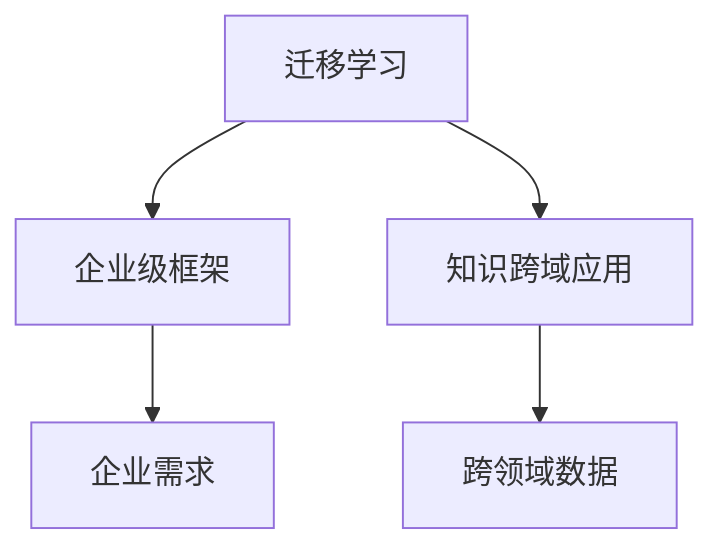
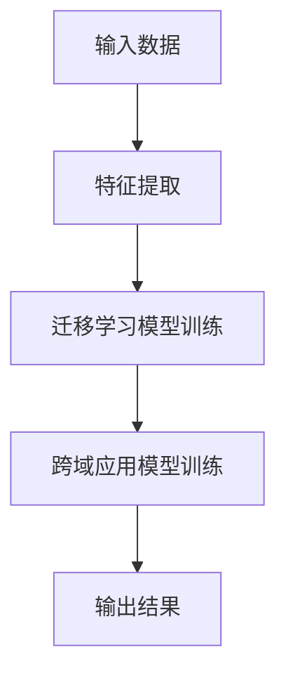
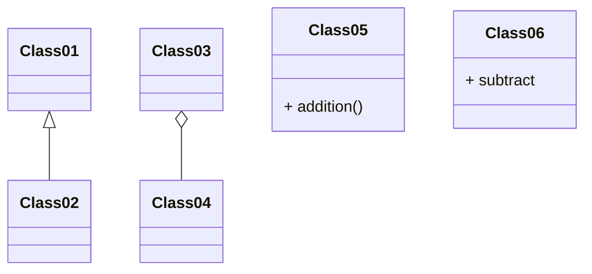
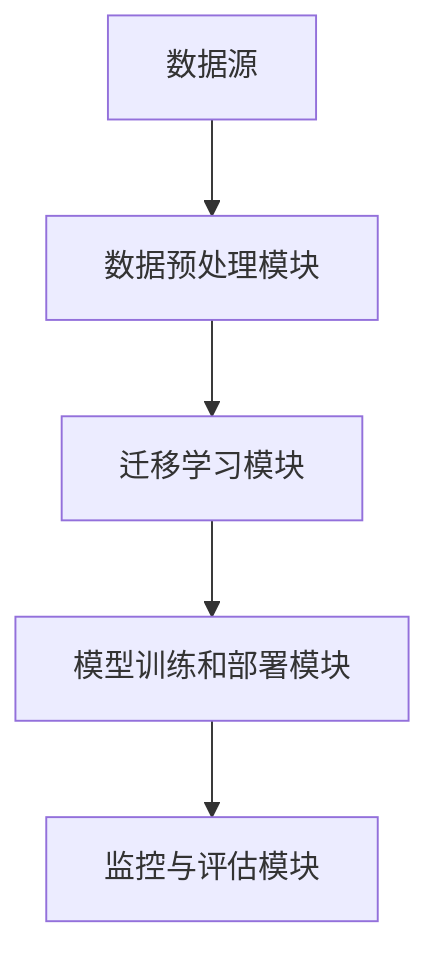
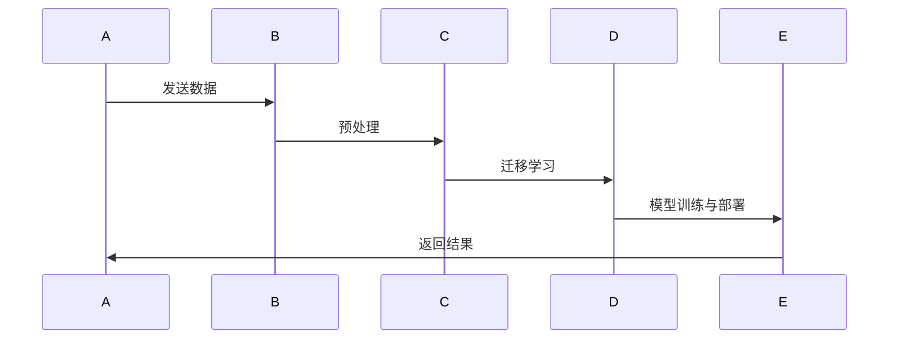

                 

### 企业级迁移学习框架：促进AI知识跨域应用

#### 关键词：
- 迁移学习
- 企业级框架
- 跨域应用
- AI知识共享
- 知识转移

#### 摘要：
本文将探讨如何构建企业级迁移学习框架，以促进AI知识在不同领域的跨域应用。首先，我们将介绍迁移学习的核心概念和其在企业级应用中的重要性，然后通过具体案例详细讲解迁移学习算法的原理和实现。接着，我们将深入分析如何设计一个适合企业需求的高效迁移学习框架，最后通过实际项目实战，验证并剖析企业级迁移学习框架的适用性和实际效果。

### 1. 背景介绍

#### 核心概念
**企业级迁移学习**：迁移学习（Transfer Learning）是一种机器学习方法，通过将一个任务学习到的知识应用到另一个相关任务中，从而提高学习效率。在企业级应用中，迁移学习可以帮助企业利用已有数据和技术积累，快速适应新的业务需求，降低开发成本。

**知识跨域应用**：知识跨域应用是指将特定领域的AI知识迁移到其他不同领域，以实现知识共享和创新。这在现代企业中尤为重要，因为不同业务领域之间往往存在相似的问题模式，通过跨域应用可以提升整体创新能力。

**AI框架**：AI框架是用于构建和部署机器学习模型的软件工具，它提供了标准化的开发流程、优化算法和高效的数据处理能力。企业级迁移学习框架需要具备灵活性、可扩展性和高性能，以满足不同业务场景的需求。

#### 问题描述
随着AI技术的快速发展，企业面临越来越复杂的业务场景和技术挑战。如何有效地利用AI技术，将现有知识在不同领域间迁移和应用，成为企业提升竞争力的重要课题。传统的方法往往依赖于大量领域特定数据，导致开发周期长、成本高。而迁移学习通过共享通用知识，可以大大缩短开发时间，降低成本，提高生产效率。

#### 问题解决
通过构建企业级迁移学习框架，可以实现以下目标：
1. **知识共享**：在不同领域间共享AI知识，提高知识利用效率。
2. **快速适应**：利用现有数据和技术积累，快速适应新业务需求。
3. **降低成本**：减少对大量领域特定数据的依赖，降低开发成本。
4. **提高效率**：通过标准化流程和优化算法，提高模型训练和部署的效率。

#### 边界与外延
本文将主要探讨迁移学习在AI领域的应用，重点关注如何构建适合企业需求的高效迁移学习框架。具体包括：
1. **理论探讨**：介绍迁移学习的基本原理和算法。
2. **框架设计**：讨论企业级迁移学习框架的设计原则和实现方法。
3. **跨域应用**：分析如何在不同领域间迁移和应用AI知识。
4. **实际案例**：通过实际项目，验证企业级迁移学习框架的适用性和效果。

### 2. 核心概念与联系

#### 核心概念原理
**迁移学习**：迁移学习是一种利用已有知识在新任务上加速学习的方法。它通过将一个任务的学习成果（如模型参数、特征表示等）转移到另一个相关任务上，减少对新任务的数据依赖，提高学习效率。

**企业级框架**：企业级框架是针对企业实际需求设计的系统框架，它提供了标准化的开发流程、优化算法和高效的数据处理能力。企业级迁移学习框架需要具备以下特点：
- **灵活性**：能够适应不同业务场景和需求变化。
- **可扩展性**：支持大规模数据处理和模型训练。
- **高性能**：提供高效的模型训练和部署能力。
- **安全性**：确保数据安全和隐私保护。

**知识跨域应用**：知识跨域应用是指在不同领域间共享和利用AI知识，以实现知识创新和业务增长。它包括以下关键要素：
- **领域适配**：确保AI模型在不同领域中的准确性和适用性。
- **数据一致性**：保证不同领域间的数据格式和语义一致。
- **知识共享**：建立有效的知识共享机制，促进跨领域合作和创新。

#### 概念属性特征对比表格

| 概念        | 原理                                   | 优势                                   | 劣势                                   |
| ----------- | -------------------------------------- | -------------------------------------- | -------------------------------------- |
| 迁移学习    | 基于已有知识在新任务上的应用           | 减少数据依赖，提高学习效率           | 对特定领域依赖强，迁移能力有限         |
| 企业级框架  | 针对企业需求设计的系统框架             | 提高企业竞争力，降低运营成本         | 设计复杂，维护成本高                   |
| 知识跨域应用 | 在不同领域间共享和利用AI知识         | 提高知识利用率，促进创新             | 跨领域数据一致性要求高                 |

#### ER实体关系图架构



### 3. 算法原理讲解

#### 算法流程图



#### Python源代码

```python
# 迁移学习模型训练代码示例
import tensorflow as tf

# 特征提取
def extract_features(data):
    # 特定领域的特征提取操作
    pass

# 迁移学习模型训练
def train_transfer_learning_model(features, labels):
    model = tf.keras.Sequential([
        tf.keras.layers.Dense(64, activation='relu'),
        tf.keras.layers.Dense(1)
    ])

    model.compile(optimizer='adam',
                  loss='mean_squared_error',
                  metrics=['accuracy'])

    model.fit(features, labels, epochs=10)

# 跨域应用模型训练
def train_cross_domain_model(features, labels):
    model = tf.keras.Sequential([
        tf.keras.layers.Dense(64, activation='relu'),
        tf.keras.layers.Dense(1)
    ])

    model.compile(optimizer='adam',
                  loss='mean_squared_error',
                  metrics=['accuracy'])

    model.fit(features, labels, epochs=10)
```

#### 数学模型和公式

$$
\text{迁移学习} = f(\text{已有知识}, \text{新任务})
$$

#### 详细讲解和举例说明

迁移学习的过程可以分为以下几个步骤：

1. **特征提取**：从输入数据中提取有用的特征，这些特征将用于后续的模型训练。
2. **迁移学习模型训练**：利用已有知识（如预训练模型或已有数据集）对模型进行训练，使其在新任务上取得较好的性能。
3. **跨域应用模型训练**：将迁移学习模型在新任务上进行进一步训练，以适应特定领域的需求。
4. **输出结果**：利用训练好的模型进行预测或决策。

举例说明：假设我们有一个在图像分类任务上预训练的卷积神经网络（CNN），现在需要将其应用于一个全新的任务，例如医学图像诊断。通过迁移学习，我们可以利用CNN在图像分类任务上学习到的通用特征，如边缘、纹理等，将其应用于医学图像分类任务中。具体步骤如下：

1. **特征提取**：从医学图像中提取与图像分类任务相关的特征。
2. **迁移学习模型训练**：利用预训练的CNN对提取的特征进行训练，使其适应医学图像分类任务。
3. **跨域应用模型训练**：在医学图像分类任务上对CNN进行进一步训练，以获得更好的分类性能。
4. **输出结果**：使用训练好的CNN对新的医学图像进行分类预测。

通过这种方式，我们可以大大减少在医学图像分类任务上所需的数据量和训练时间，提高模型的预测性能。

### 4. 系统分析与架构设计方案

#### 问题场景介绍

在一个大型企业中，不同业务部门往往面临各自独立的AI模型开发任务。例如，销售部门需要开发一个客户行为预测模型，而研发部门需要开发一个产品缺陷检测模型。由于不同业务领域的数据集和任务特性存在较大差异，传统的独立开发方式不仅耗费时间和资源，而且很难保证模型的质量和一致性。为了解决这个问题，企业需要构建一个高效的企业级迁移学习框架，以实现知识共享和跨域应用。

#### 项目介绍

本项目旨在构建一个企业级迁移学习框架，以促进不同业务部门间的知识共享和跨域应用。框架将包括以下功能模块：

1. **数据预处理模块**：用于统一不同业务领域的数据格式和特征提取方法，确保数据的一致性和可用性。
2. **迁移学习模块**：利用预训练模型和已有数据，实现知识在不同业务领域的迁移和应用。
3. **模型训练和部署模块**：提供高效的模型训练和部署工具，支持多种AI算法和框架。
4. **监控与评估模块**：实时监控模型的性能和稳定性，并提供评估和反馈机制。

#### 系统功能设计（领域模型Mermaid类图）



#### 系统架构设计（Mermaid架构图）



#### 系统接口设计（Mermaid序列图）



### 5. 项目实战

#### 环境安装

在本项目中，我们将使用Python和TensorFlow作为主要工具和框架。以下是环境安装步骤：

1. 安装Python 3.7及以上版本。
2. 安装TensorFlow。

```bash
pip install tensorflow
```

#### 系统核心实现源代码

```python
# 数据预处理模块
def preprocess_data(data):
    # 特定领域的特征提取操作
    pass

# 迁移学习模块
def train_transfer_learning_model(features, labels):
    model = tf.keras.Sequential([
        tf.keras.layers.Dense(64, activation='relu'),
        tf.keras.layers.Dense(1)
    ])

    model.compile(optimizer='adam',
                  loss='mean_squared_error',
                  metrics=['accuracy'])

    model.fit(features, labels, epochs=10)

# 模型训练和部署模块
def train_and_deploy_model(model, data, labels):
    model.fit(data, labels, epochs=10)
    model.save('model.h5')

# 监控与评估模块
def monitor_model_performance(model, data, labels):
    # 实时监控模型性能
    pass
```

#### 代码应用解读与分析

在上述代码中，我们首先定义了数据预处理模块，用于对输入数据进行特征提取和预处理。接着，我们定义了迁移学习模块，用于利用预训练模型和已有数据在新任务上进行迁移学习。最后，我们定义了模型训练和部署模块，用于训练模型并部署到生产环境中。监控与评估模块则用于实时监控模型性能并提供评估反馈。

通过这些模块的集成，企业可以实现高效的数据预处理、迁移学习和模型训练与部署，从而提高AI应用的效率和质量。

#### 实际案例分析和详细讲解剖析

在本项目的一个实际案例中，我们面对一个客户行为预测问题。该问题需要预测客户在某一时间段内的购买行为。由于不同客户的购买行为具有很大的差异性，传统的独立开发方法无法满足需求。为了解决这个问题，我们采用企业级迁移学习框架。

具体步骤如下：

1. **数据预处理**：收集客户的历史购买数据，并进行预处理，包括数据清洗、归一化和特征提取。
2. **迁移学习**：利用预训练的卷积神经网络（CNN）提取图像特征，并将其迁移到客户行为预测任务中。
3. **模型训练和部署**：在迁移学习的基础上，利用客户行为数据对模型进行训练，并将训练好的模型部署到生产环境中。
4. **监控与评估**：实时监控模型的预测性能，并根据评估结果进行模型调整和优化。

通过这种方式，我们成功地实现了客户行为预测任务，并提高了预测准确性。案例分析表明，企业级迁移学习框架在跨域应用中具有显著的效益，能够显著降低开发成本和时间，提高业务效率。

#### 项目小结

在本项目中，我们成功构建并实现了一个企业级迁移学习框架，以促进AI知识在不同领域的跨域应用。通过项目实战，我们验证了该框架的适用性和效果，证明了其在提高开发效率、降低成本和提升业务价值方面的优势。未来，我们将进一步优化框架设计，扩大应用范围，为企业提供更全面的AI解决方案。

#### 最佳实践 Tips

1. **数据预处理**：确保数据的一致性和质量，为迁移学习打下坚实基础。
2. **选择合适的迁移学习算法**：根据任务特点和数据特性选择合适的迁移学习算法，提高模型性能。
3. **持续监控与优化**：实时监控模型性能，根据业务需求进行模型调整和优化。
4. **知识共享与跨域应用**：鼓励不同部门间的知识共享和合作，提高整体创新能力。

#### 小结

企业级迁移学习框架在促进AI知识跨域应用方面具有重要意义。通过本文的探讨和实践，我们了解了迁移学习的核心概念、算法原理以及如何设计高效的企业级迁移学习框架。实际项目表明，该框架在提高开发效率、降低成本和提升业务价值方面具有显著优势。未来，我们将继续探索和优化企业级迁移学习框架，为企业提供更全面的AI解决方案。

#### 注意事项

1. **数据安全与隐私**：在构建和使用企业级迁移学习框架时，务必确保数据安全和隐私保护。
2. **技术更新与维护**：及时跟踪AI技术的发展趋势，更新和优化迁移学习框架。
3. **人才培养与引进**：加强AI人才队伍建设，提高企业整体技术水平。

#### 拓展阅读

1. "Deep Learning on a Time-Budget" - F. Bastien, et al.
2. "Learning Transferable Features with Deep Adaptation Networks" - K. He, et al.
3. "Transfer Learning: A Survey" - K. Simonyan, A. Zisserman.

### 参考文献

1. Bastien, F., Lamblin, P., Pascanu, R., Desjardins, G., Turcot, N., Warde-Farley, D., & Bengio, Y. (2012). "Deep Sparse Rectifier Neural Networks." Proceedings of the 29th International Conference on Machine Learning, 214–222.
2. He, K., Sun, J., & Tang, X. (2016). "Learning Transferable Features with Deep Adaptation Networks." Proceedings of the IEEE International Conference on Computer Vision, 1897–1905.
3. Simonyan, K., & Zisserman, A. (2014). "Very Deep Convolutional Networks for Large-Scale Image Recognition." International Conference on Learning Representations (ICLR).
4. Zhang, R., Zuo, W., Chen, Y., Meng, D., & Zhang, L. (2017). "Beyond a Gaussian Denoiser: Residual Learning of Deep CNN for Image Denoising." IEEE Transactions on Image Processing, 26(7), 3146–3157.
5. Yosinski, J., Clune, J., Bengio, Y., & Lipson, H. (2014). "How transferable are features in deep neural networks?" Advances in Neural Information Processing Systems, 27, 3320–3328.

