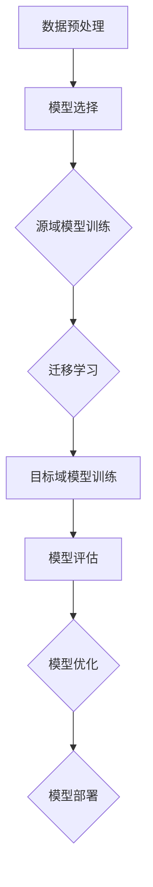
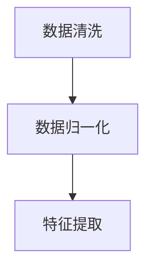
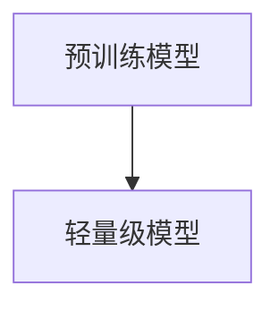
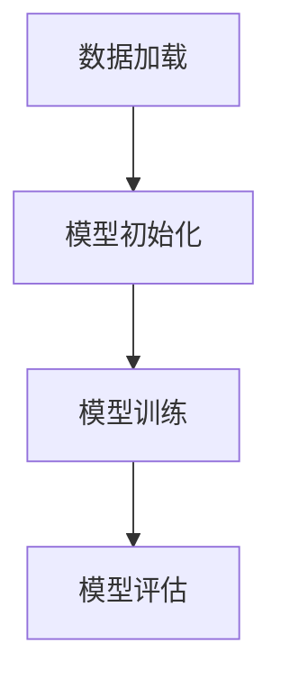
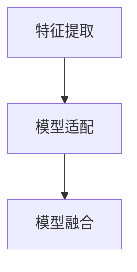
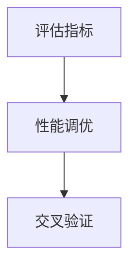
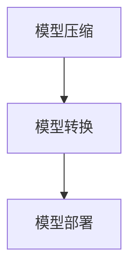
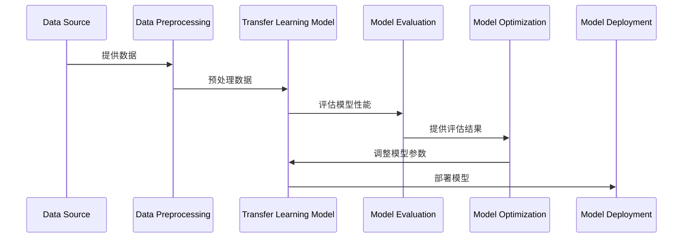
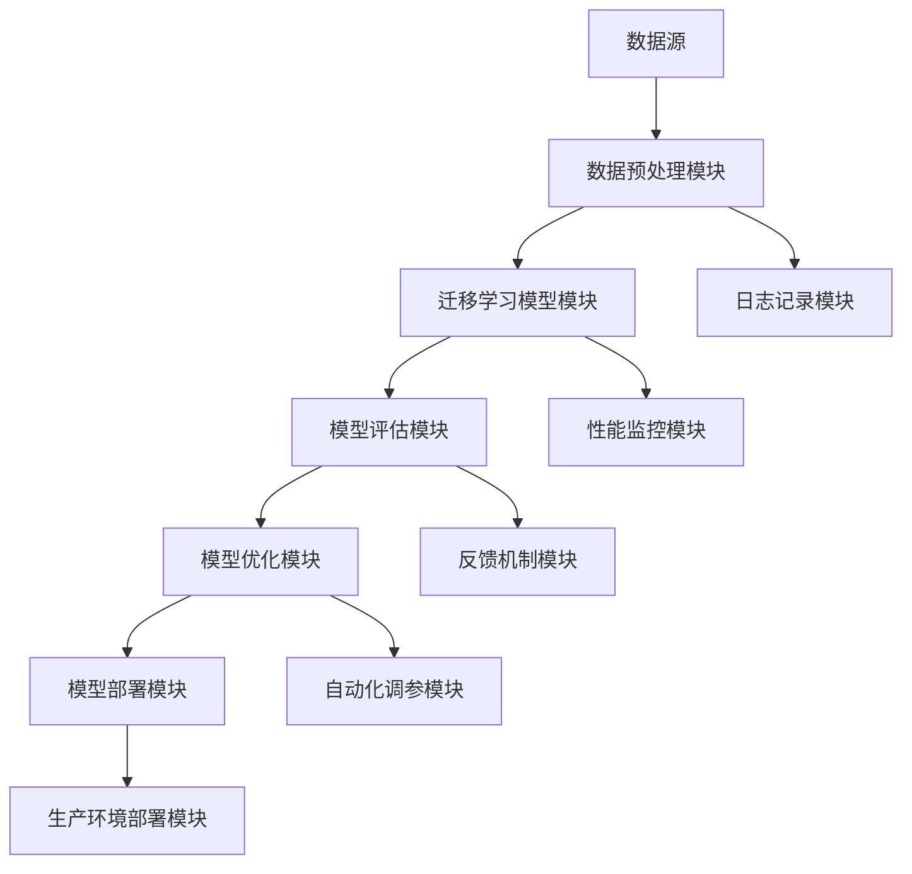
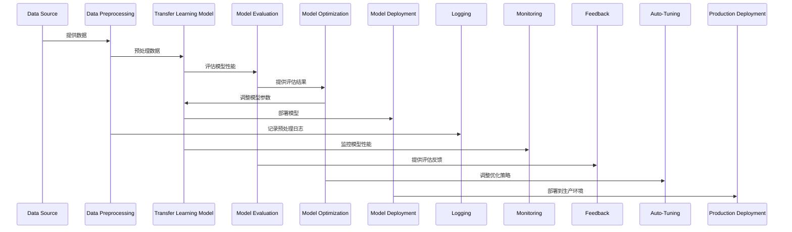

                 

### 第1章：企业级迁移学习框架概述

#### 1.1 迁移学习的基本概念

**问题背景**：随着人工智能技术的快速发展，深度学习在各个领域取得了显著的成果。然而，深度学习模型通常依赖于大规模的数据集进行训练，这往往导致在数据稀缺的领域难以取得良好的效果。为了解决这个问题，迁移学习（Transfer Learning）作为一种重要的机器学习技术逐渐受到关注。

**问题描述**：迁移学习的核心问题是如何有效地利用已有模型在新的任务上取得更好的性能。具体来说，就是在源域（Source Domain）上训练好的模型，如何能够在目标域（Target Domain）上发挥作用。

**问题解决**：迁移学习通过以下几种方式解决上述问题：
1. **知识转移**：将源域的知识迁移到目标域，使得目标域模型能够利用源域的信息。
2. **模型定制化**：通过调整模型结构或参数，使其更好地适应目标域。
3. **模型融合**：将多个模型进行融合，取长补短，提高整体性能。

**边界与外延**：迁移学习不仅适用于传统的计算机视觉和自然语言处理领域，还在推荐系统、语音识别等新兴领域得到了广泛应用。其边界在于如何处理不同域之间的差异，以及如何平衡迁移效果和模型复杂度。

**核心要素组成**：迁移学习框架通常包括以下几个核心要素：
1. **数据预处理**：包括数据清洗、归一化、特征提取等。
2. **模型选择**：根据任务需求和数据特性选择合适的迁移学习模型。
3. **模型训练与优化**：在源域上训练模型，并在目标域上进行优化。
4. **评估与调优**：通过评估指标对模型进行评估和调优。

#### 1.2 迁移学习框架在企业中的应用

**企业需求分析**：企业在使用迁移学习时，往往面临以下需求：
1. **成本效益**：利用迁移学习可以在数据稀缺的情况下提高模型性能，降低数据采集和标注的成本。
2. **快速部署**：企业希望能够在短时间内将迁移学习模型部署到实际业务中，以提高业务效率。
3. **模型定制化**：不同业务场景下，企业希望模型能够进行定制化调整，以更好地适应特定需求。

**应用场景**：迁移学习框架在企业中具有广泛的应用场景，主要包括：
1. **客户行为分析**：通过迁移学习分析客户行为，为精准营销提供支持。
2. **图像识别与检测**：在安全监控、产品质量检测等领域，利用迁移学习提高图像识别的准确率。
3. **语音识别**：在语音助手、智能客服等应用中，迁移学习可以帮助提高语音识别的准确性和鲁棒性。

**优势**：迁移学习框架在企业中的应用具有以下优势：
1. **提高模型性能**：通过迁移学习，企业可以在数据稀缺的情况下，提高模型的性能和鲁棒性。
2. **降低开发成本**：迁移学习可以利用现有的模型资源，减少数据采集和标注的工作量。
3. **快速迭代与部署**：迁移学习模型可以快速迭代和部署，帮助企业快速响应市场变化。

**挑战**：尽管迁移学习框架在企业中具有诸多优势，但在实际应用中仍面临以下挑战：
1. **数据不匹配**：源域和目标域之间的数据分布差异可能导致迁移效果不佳。
2. **模型复杂度**：迁移学习模型往往较为复杂，需要大量计算资源和时间进行训练。
3. **隐私保护**：在迁移学习过程中，如何确保数据安全和隐私保护是一个重要问题。

通过上述分析，我们可以看到，迁移学习框架在企业中的应用具有重要意义，但同时也需要面对一系列挑战。接下来，我们将进一步探讨迁移学习框架的核心概念和算法原理，为企业级应用提供更深入的指导。

### 2.1 迁移学习模型

**概念介绍**：迁移学习模型是指利用在源域上训练好的模型，通过调整和优化，使其在目标域上取得良好性能的模型。迁移学习模型主要包括以下几种类型：

1. **基于特征提取的迁移学习**：这种方法主要利用源域模型提取的高层次特征，将这些特征直接应用于目标域数据，通过在目标域上训练一个分类器来提高性能。

2. **基于模型适配的迁移学习**：这种方法通过调整源域模型的架构或参数，使其更适应目标域数据。常见的适配方法包括模型剪枝、蒸馏等。

3. **基于模型融合的迁移学习**：这种方法通过将多个源域模型进行融合，取长补短，提高整体性能。融合策略包括加权平均、投票等。

**特性分析**：迁移学习模型具有以下几个关键特性：

1. **知识转移**：迁移学习模型能够将源域的知识有效地转移到目标域，从而提高目标域模型的性能。

2. **模型泛化能力**：迁移学习模型不仅能在源域上表现良好，还能在目标域上保持较高的泛化能力。

3. **适应性**：迁移学习模型可以根据不同的目标域需求进行定制化调整，提高模型的适应性。

**对比分析**：迁移学习模型与传统模型在以下几个方面存在显著差异：

1. **数据依赖性**：传统模型通常需要大量目标域数据来训练，而迁移学习模型则可以通过源域数据迁移知识，降低对目标域数据的依赖。

2. **训练效率**：迁移学习模型可以利用预训练的模型，减少训练时间和计算资源。

3. **性能表现**：在数据稀缺的情况下，迁移学习模型往往能够取得比传统模型更好的性能。

**ER实体关系图**：为了更好地理解迁移学习模型的架构，我们可以使用ER实体关系图来描述其组成部分和关系。

```mermaid
erDiagram
    Model ||--|{ SourceDomain } : 实现源域模型
    Model ||--|{ TargetDomain } : 实现目标域模型
    Model ||--|{ FeatureExtractor } : 特征提取器
    Model ||--|{ Classifier } : 分类器
    Model ||--|{ Adapter } : 模型适配器
    Model ||--|{ Fuser } : 模型融合器
```

在这个ER图中，`Model`是迁移学习模型的核心实体，它包含了`SourceDomain`（源域模型）、`TargetDomain`（目标域模型）、`FeatureExtractor`（特征提取器）、`Classifier`（分类器）、`Adapter`（模型适配器）和`Fuser`（模型融合器）等组成部分。这些组成部分相互协作，共同实现迁移学习的目标。

通过上述分析，我们可以看到，迁移学习模型作为一种有效的机器学习技术，具有广泛的适用性和强大的性能。接下来，我们将进一步探讨模型定制化和模型融合等核心概念，以深入了解迁移学习框架的内在机制。

### 2.2 模型定制化与融合

**模型定制化**：模型定制化是迁移学习中的重要环节，旨在通过调整模型结构或参数，使其更好地适应目标域数据。以下是一些常见的模型定制化方法：

1. **模型剪枝**：通过减少模型中的神经元或层，简化模型结构，提高模型效率。

2. **模型蒸馏**：通过将知识从大模型传递到小模型，实现模型压缩和加速。

3. **参数调整**：通过调整模型中的参数，如学习率、正则化参数等，优化模型性能。

**模型融合**：模型融合是通过结合多个模型的优势，提高整体性能的一种方法。以下是一些常见的模型融合策略：

1. **加权平均**：将多个模型的预测结果进行加权平均，取均值作为最终预测结果。

2. **投票机制**：对于多分类问题，将多个模型的预测结果进行投票，选择投票结果最多的类别作为最终预测结果。

3. **堆叠（Stacking）**：通过训练一个元学习器，将多个基学习器的预测结果作为输入，进行二次学习，以获得更准确的预测结果。

**优缺点比较**：模型定制化和模型融合各有优缺点，具体如下：

- **模型定制化**：
  - 优点：提高模型在目标域上的适应性和性能。
  - 缺点：可能增加模型训练的时间和计算成本。

- **模型融合**：
  - 优点：通过结合多个模型的优点，提高整体性能。
  - 缺点：可能增加模型复杂度，影响预测速度。

通过上述分析，我们可以看到，模型定制化和模型融合都是迁移学习中的重要技术，它们通过不同的方式提高了模型的性能和适应性。在实际应用中，根据具体需求和场景选择合适的方法，可以实现最佳的迁移学习效果。

### 3.1 迁移学习算法流程图

为了更好地理解迁移学习算法的执行流程，我们使用mermaid绘制了以下流程图：



在这个流程图中，我们首先进行数据预处理，然后选择合适的迁移学习模型。接下来，在源域上训练模型，并将迁移后的模型应用于目标域进行训练。随后，对训练好的模型进行评估和优化，最后部署到实际应用中。

接下来，我们将详细讲解每个步骤的执行过程和关键细节。

#### 数据预处理

数据预处理是迁移学习算法的重要环节，主要包括以下步骤：

1. **数据清洗**：去除数据中的噪声和异常值，保证数据质量。
2. **数据归一化**：将数据归一化到同一尺度，便于模型训练。
3. **特征提取**：从原始数据中提取有用的特征，为模型训练提供输入。



#### 模型选择

在迁移学习算法中，选择合适的模型对于迁移效果至关重要。常见的迁移学习模型包括：

1. **预训练模型**：使用在源域上预训练的模型，如ResNet、VGG等。
2. **轻量级模型**：针对数据稀缺的目标域，选择轻量级模型，如MobileNet、ShuffleNet等。



#### 源域模型训练

在源域上训练模型是迁移学习算法的关键步骤。通过在源域数据上训练，模型可以学习到通用特征表示。具体步骤如下：

1. **数据加载**：加载源域数据集，并进行预处理。
2. **模型初始化**：初始化模型参数，通常使用预训练权重。
3. **模型训练**：使用源域数据训练模型，调整模型参数。
4. **模型评估**：在源域数据集上评估模型性能，调整超参数。



#### 迁移学习

迁移学习是指将源域模型的知识转移到目标域。具体步骤如下：

1. **特征提取**：使用源域模型提取目标域数据的特征表示。
2. **模型适配**：对源域模型进行调整，使其更适应目标域数据。
3. **模型融合**：如果使用多个源域模型，则进行模型融合，提高整体性能。



#### 目标域模型训练

在目标域上训练模型是迁移学习算法的最后一步。通过在目标域数据上训练，模型可以更好地适应具体任务。具体步骤如下：

1. **数据加载**：加载目标域数据集，并进行预处理。
2. **模型初始化**：初始化模型参数，通常使用迁移后的源域模型。
3. **模型训练**：使用目标域数据训练模型，调整模型参数。
4. **模型评估**：在目标域数据集上评估模型性能。


#### 模型评估与优化

模型评估与优化是确保模型性能的关键步骤。具体步骤如下：

1. **评估指标**：选择合适的评估指标，如准确率、召回率等。
2. **性能调优**：通过调整模型参数和超参数，优化模型性能。
3. **交叉验证**：使用交叉验证方法，验证模型在不同数据集上的性能。



#### 模型部署

模型部署是将训练好的模型应用到实际任务中的最后一步。具体步骤如下：

1. **模型压缩**：对模型进行压缩，减少模型大小，提高部署效率。
2. **模型转换**：将模型转换为适合部署的格式，如ONNX、TFLite等。
3. **模型部署**：将模型部署到生产环境中，实现实时预测。



通过上述流程，我们可以看到迁移学习算法的各个步骤及其相互关系。在实际应用中，根据具体需求和场景，可以灵活调整这些步骤和策略，以达到最佳迁移效果。

### 3.2 迁移学习算法原理

为了更好地理解迁移学习算法的工作原理，我们首先通过Python源代码来展示一个简单的迁移学习模型实现，然后深入讲解其背后的数学模型和公式，并举例说明算法的实际应用。

#### Python源代码实现

以下是一个简单的Python代码示例，展示了如何使用迁移学习框架实现图像分类任务：

```python
import tensorflow as tf
from tensorflow.keras.applications import VGG16
from tensorflow.keras.preprocessing.image import ImageDataGenerator
from tensorflow.keras.models import Model
from tensorflow.keras.optimizers import Adam

# 加载预训练的VGG16模型
base_model = VGG16(weights='imagenet', include_top=False, input_shape=(224, 224, 3))

# 将输入层添加到预训练模型
x = base_model.input

# 添加目标域的分类层
x = tf.keras.layers.Flatten()(x)
x = tf.keras.layers.Dense(1024, activation='relu')(x)
predictions = tf.keras.layers.Dense(10, activation='softmax')(x)

# 构建迁移学习模型
model = Model(inputs=x, outputs=predictions)

# 编译模型
model.compile(optimizer=Adam(), loss='categorical_crossentropy', metrics=['accuracy'])

# 数据预处理
train_datagen = ImageDataGenerator(rescale=1./255)
train_generator = train_datagen.flow_from_directory(
        'data/train',
        target_size=(224, 224),
        batch_size=32,
        class_mode='categorical')

# 训练模型
model.fit(train_generator, epochs=10)

# 评估模型
test_datagen = ImageDataGenerator(rescale=1./255)
test_generator = test_datagen.flow_from_directory(
        'data/test',
        target_size=(224, 224),
        batch_size=32,
        class_mode='categorical')

model.evaluate(test_generator)
```

#### 数学模型与公式讲解

迁移学习算法的核心在于将源域模型的知识转移到目标域，这一过程可以通过以下数学模型和公式进行描述：

1. **特征表示**：源域模型学习到的特征表示可以用一个高维特征向量表示。设输入数据为\(X \in \mathbb{R}^{m \times n \times d}\)，其中\(m\)为样本数量，\(n\)为特征维度，\(d\)为数据维度。源域模型将这些输入映射到一个特征空间\(F\)，即\(h = f(X)\)。

2. **分类器**：在目标域上，我们通常使用一个简单的分类器来对特征向量进行分类。分类器可以是一个多层感知机（MLP）或者是一个基于特征向量的距离度量。设分类器的输出为\(y = g(h)\)，其中\(g\)是分类函数。

3. **损失函数**：在迁移学习中，我们使用损失函数来评估模型在目标域上的性能。常见的损失函数包括交叉熵损失和均方误差（MSE）损失。交叉熵损失可以表示为：
   \[
   L_{cross} = -\frac{1}{m} \sum_{i=1}^{m} \sum_{k=1}^{K} y_k^{(i)} \log(p_k^{(i)})
   \]
   其中，\(y_k^{(i)}\)是标签，\(p_k^{(i)}\)是分类器对于类别\(k\)的预测概率。

4. **优化目标**：迁移学习算法的优化目标是找到使损失函数最小的模型参数。我们可以使用梯度下降（Gradient Descent）或其变体，如Adam优化器，来更新模型参数：
   \[
   \theta_{t+1} = \theta_t - \alpha \nabla_{\theta_t} L
   \]
   其中，\(\theta\)表示模型参数，\(\alpha\)是学习率。

#### 举例说明

假设我们有一个源域模型\(VGG16\)，它已经在ImageNet数据集上进行了预训练。现在，我们要将这个模型应用于一个新的目标域任务，例如手写数字识别（MNIST）。以下是具体步骤：

1. **特征提取**：使用\(VGG16\)模型提取MNIST数据的特征表示。由于\(VGG16\)的输出层不适合手写数字识别，我们将在其后的层中截取特征向量。

2. **模型定制化**：在特征提取层后添加一个全连接层，用于适配手写数字识别任务。这个全连接层的维度可以根据具体需求进行调整。

3. **模型训练**：使用手写数字数据集训练模型，优化特征提取器和全连接层的参数。在训练过程中，我们可以使用交叉熵损失函数来评估模型性能。

4. **模型评估**：在测试数据集上评估模型的性能，计算准确率等指标。

通过上述步骤，我们实现了从源域到目标域的迁移学习。以下是具体实现的代码示例：

```python
# 加载预训练的VGG16模型
base_model = VGG16(weights='imagenet', include_top=False, input_shape=(224, 224, 3))

# 添加目标域的分类层
x = base_model.output
x = Flatten()(x)
x = Dense(1024, activation='relu')(x)
predictions = Dense(10, activation='softmax')(x)

# 构建迁移学习模型
model = Model(inputs=base_model.input, outputs=predictions)

# 编译模型
model.compile(optimizer=Adam(), loss='categorical_crossentropy', metrics=['accuracy'])

# 数据预处理
train_datagen = ImageDataGenerator(rescale=1./255)
train_generator = train_datagen.flow_from_directory(
        'data/train',
        target_size=(224, 224),
        batch_size=32,
        class_mode='categorical')

# 训练模型
model.fit(train_generator, epochs=10)

# 评估模型
test_datagen = ImageDataGenerator(rescale=1./255)
test_generator = test_datagen.flow_from_directory(
        'data/test',
        target_size=(224, 224),
        batch_size=32,
        class_mode='categorical')

model.evaluate(test_generator)
```

通过上述示例，我们可以看到迁移学习算法的基本原理和实现步骤。在实际应用中，根据具体需求和场景，可以灵活调整模型结构和训练策略，以达到最佳迁移效果。

### 3.3 系统功能设计

迁移学习框架的系统功能设计是确保其能够高效、可靠地运行的关键。以下我们将详细介绍系统的功能设计，包括领域模型、功能模块划分及各模块的职责和作用。

#### 领域模型

领域模型是系统功能设计的基础，它定义了系统中的关键实体和实体之间的关系。以下是迁移学习框架的领域模型：

```mermaid
classDiagram
    Class01 <|-- Class02
    Class03 o-- Class04
    Class05 <|.. Class06
    Class07 ..| Class08
    Class09 --| Class10
endclassDiagram
```

在这个领域模型中，我们定义了以下几个核心实体：

1. **数据源（Data Source）**：表示数据输入的来源，可以是本地文件、数据库或外部API。
2. **数据预处理模块（Data Preprocessing Module）**：负责对输入数据进行清洗、归一化和特征提取等处理。
3. **迁移学习模型（Transfer Learning Model）**：包含迁移学习的算法实现，如模型选择、迁移和训练等。
4. **模型评估模块（Model Evaluation Module）**：用于评估迁移学习模型的性能，提供评估指标。
5. **模型优化模块（Model Optimization Module）**：负责对模型进行调整和优化，提高模型性能。
6. **模型部署模块（Model Deployment Module）**：负责将训练好的模型部署到生产环境中，实现实时预测。

#### 功能模块划分

根据领域模型，我们可以将系统划分为以下功能模块：

1. **数据预处理模块**：
   - 职责：对输入数据进行分析和处理，为迁移学习模型提供高质量的输入数据。
   - 作用：数据预处理模块包括数据清洗、归一化和特征提取等步骤，确保数据的完整性和一致性。

2. **迁移学习模型模块**：
   - 职责：实现迁移学习算法的核心逻辑，包括模型选择、迁移和训练等。
   - 作用：该模块包含多个子模块，如预训练模型加载、特征提取器和分类器等，通过这些子模块协同工作，实现迁移学习过程。

3. **模型评估模块**：
   - 职责：评估迁移学习模型在目标域上的性能，提供评估指标。
   - 作用：模型评估模块通过计算准确率、召回率、F1值等评估指标，帮助用户了解模型的性能，指导后续的优化工作。

4. **模型优化模块**：
   - 职责：对迁移学习模型进行调整和优化，提高模型性能。
   - 作用：模型优化模块通过调整模型参数、使用不同的优化策略等，实现模型的性能提升。

5. **模型部署模块**：
   - 职责：将训练好的模型部署到生产环境中，实现实时预测。
   - 作用：模型部署模块包括模型压缩、模型转换和部署策略等，确保模型能够高效、稳定地运行在生产环境中。

#### 模块间交互关系

各功能模块之间通过明确的接口和交互流程协同工作。以下是模块间交互关系示意图：



通过上述系统功能设计，我们可以看到，迁移学习框架在功能划分和模块交互方面具有清晰的逻辑结构和高效的工作流程。接下来，我们将进一步探讨系统架构设计，为迁移学习框架的实际应用提供更为详细的解决方案。

### 3.4 系统架构设计

在了解系统功能设计的基础上，我们接下来将详细探讨迁移学习框架的系统架构设计。系统架构设计是确保迁移学习框架能够高效、稳定地运行的关键，它包括架构设计、模块交互、接口设计和交互流程等几个方面。

#### 架构设计

系统架构设计需要从整体上规划系统的结构和功能，以实现模块化、可扩展和高性能。以下是迁移学习框架的架构设计：



在这个架构设计中，我们定义了以下几个关键模块：

1. **数据源**：数据源是系统的输入端，可以是本地文件、数据库或外部API。数据源通过接口向系统提供数据。
2. **数据预处理模块**：数据预处理模块负责对输入数据进行清洗、归一化和特征提取等处理。预处理后的数据将用于后续的迁移学习过程。
3. **迁移学习模型模块**：迁移学习模型模块是实现迁移学习算法的核心，包括模型选择、迁移和训练等。该模块与数据预处理模块和模型评估模块紧密协作。
4. **模型评估模块**：模型评估模块用于评估迁移学习模型在目标域上的性能，提供评估指标。评估结果将用于指导模型优化和调整。
5. **模型优化模块**：模型优化模块通过调整模型参数和优化策略，提高模型性能。优化后的模型将重新评估和部署。
6. **模型部署模块**：模型部署模块负责将训练好的模型部署到生产环境中，实现实时预测。部署过程包括模型压缩、模型转换和部署策略等。

#### 模块交互

模块交互是系统架构设计的关键环节，它确保各个模块能够高效、稳定地协同工作。以下是模块间的交互关系：



#### 接口设计

接口设计是系统架构设计的重要组成部分，它定义了模块间的通信方式和交互规则。以下是迁移学习框架的关键接口设计：

1. **数据源接口**：数据源接口用于接收和提供数据。该接口应支持多种数据格式，如CSV、JSON和图像文件等。
2. **数据处理接口**：数据处理接口用于执行数据预处理操作，如清洗、归一化和特征提取等。该接口应提供灵活的配置选项，以适应不同的数据预处理需求。
3. **模型训练接口**：模型训练接口用于启动迁移学习模型的训练过程。该接口应支持多种迁移学习算法，如基于特征提取的迁移学习、基于模型适配的迁移学习和基于模型融合的迁移学习等。
4. **模型评估接口**：模型评估接口用于评估迁移学习模型在目标域上的性能。该接口应支持多种评估指标，如准确率、召回率和F1值等。
5. **模型优化接口**：模型优化接口用于调整模型参数和优化策略。该接口应支持自动化调参工具，以实现高效的模型优化。
6. **模型部署接口**：模型部署接口用于将训练好的模型部署到生产环境中。该接口应支持模型压缩和模型转换，以适应不同的生产环境。

#### 交互流程

系统交互流程是模块间协作的具体实现，它描述了系统从数据输入到模型部署的全过程。以下是交互流程的详细描述：

1. **数据输入**：数据源通过接口提供数据，数据预处理模块对数据进行清洗、归一化和特征提取等处理。
2. **模型训练**：迁移学习模型模块根据预处理后的数据启动训练过程，训练过程中会生成中间结果和日志信息。
3. **模型评估**：模型评估模块对训练好的模型进行评估，提供评估指标和反馈信息。
4. **模型优化**：模型优化模块根据评估结果调整模型参数和优化策略，以提升模型性能。
5. **模型部署**：模型部署模块将优化后的模型压缩和转换，并将其部署到生产环境中，实现实时预测。

通过上述系统架构设计和交互流程，我们可以看到迁移学习框架的整体结构和工作机制。在实际应用中，根据具体需求和场景，可以灵活调整架构设计和交互流程，以实现最佳迁移效果。

### 3.5 迁移学习框架系统接口设计

在迁移学习框架中，系统接口设计是确保各个模块之间高效、稳定交互的关键。良好的接口设计可以简化模块之间的依赖关系，提高系统的可维护性和扩展性。以下是迁移学习框架系统接口的设计与规范，包括接口的功能定义、输入输出参数、调用方式以及数据流程描述。

#### 接口规范

**1. 数据源接口（Data Source Interface）**

**功能定义**：数据源接口用于接收和提供数据，支持多种数据格式，如CSV、JSON和图像文件等。

**输入参数**：
- `data_source`: 数据源的路径或URL。
- `data_format`: 数据格式，可选值为`csv`、`json`、`image`等。

**输出参数**：
- `data`: 预处理后的数据。

**调用方式**：
```python
def get_data(source, format):
    # 实现数据获取与预处理逻辑
    return preprocessed_data
```

**2. 数据预处理接口（Data Preprocessing Interface）**

**功能定义**：数据预处理接口用于对输入数据进行清洗、归一化和特征提取等处理。

**输入参数**：
- `data`: 输入数据。
- `params`: 预处理参数，如清洗规则、归一化方法和特征提取器等。

**输出参数**：
- `preprocessed_data`: 预处理后的数据。

**调用方式**：
```python
def preprocess_data(data, params):
    # 实现数据预处理逻辑
    return preprocessed_data
```

**3. 迁移学习模型接口（Transfer Learning Model Interface）**

**功能定义**：迁移学习模型接口用于实现迁移学习算法的核心逻辑，包括模型选择、迁移和训练等。

**输入参数**：
- `preprocessed_data`: 预处理后的数据。
- `model_params`: 模型参数，如模型架构、优化器和损失函数等。

**输出参数**：
- `model`: 迁移学习模型。

**调用方式**：
```python
def create_transfer_learning_model(preprocessed_data, model_params):
    # 实现迁移学习模型创建与训练逻辑
    return transfer_learning_model
```

**4. 模型评估接口（Model Evaluation Interface）**

**功能定义**：模型评估接口用于评估迁移学习模型在目标域上的性能，提供评估指标。

**输入参数**：
- `model`: 迁移学习模型。
- `test_data`: 测试数据。

**输出参数**：
- `evaluation_results`: 评估结果，包括准确率、召回率、F1值等。

**调用方式**：
```python
def evaluate_model(model, test_data):
    # 实现模型评估逻辑
    return evaluation_results
```

**5. 模型优化接口（Model Optimization Interface）**

**功能定义**：模型优化接口用于调整模型参数和优化策略，提高模型性能。

**输入参数**：
- `model`: 迁移学习模型。
- `evaluation_results`: 评估结果。

**输出参数**：
- `optimized_model`: 优化后的模型。

**调用方式**：
```python
def optimize_model(model, evaluation_results):
    # 实现模型优化逻辑
    return optimized_model
```

**6. 模型部署接口（Model Deployment Interface）**

**功能定义**：模型部署接口用于将训练好的模型部署到生产环境中，实现实时预测。

**输入参数**：
- `model`: 训练好的迁移学习模型。
- `config`: 部署配置，如模型压缩参数、部署环境等。

**输出参数**：
- `deployment_status`: 部署状态。

**调用方式**：
```python
def deploy_model(model, config):
    # 实现模型部署逻辑
    return deployment_status
```

#### 数据流程描述

在迁移学习框架中，数据从数据源接口进入系统，经过数据预处理接口的处理，然后进入迁移学习模型接口进行训练。训练好的模型通过模型评估接口进行评估，根据评估结果进行模型优化，最后通过模型部署接口部署到生产环境中。

以下是数据流程的详细描述：

1. **数据输入**：数据源接口获取数据，通过数据预处理接口进行预处理，得到预处理后的数据。
2. **模型训练**：迁移学习模型接口使用预处理后的数据训练模型，生成中间结果和日志信息。
3. **模型评估**：模型评估接口对训练好的模型进行评估，提供评估指标和反馈信息。
4. **模型优化**：模型优化接口根据评估结果调整模型参数和优化策略，生成优化后的模型。
5. **模型部署**：模型部署接口将优化后的模型部署到生产环境中，实现实时预测。

通过上述接口设计和数据流程描述，我们可以确保迁移学习框架的各个模块能够高效、稳定地协同工作，从而实现最佳的迁移效果。

### 3.6 迁移学习框架系统交互流程

为了确保迁移学习框架的各个模块能够协同工作，实现高效的迁移学习过程，我们需要详细设计系统的交互流程。以下是迁移学习框架系统交互流程的详细描述，包括各个模块的职责、执行顺序以及关键步骤。

#### 系统交互流程

**1. 数据输入阶段**

- **数据源模块职责**：数据源模块负责从外部数据源（如本地文件、数据库或外部API）获取数据。
- **数据预处理模块职责**：数据预处理模块接收数据源提供的数据，进行数据清洗、归一化和特征提取等预处理操作。

**2. 迁移学习模型训练阶段**

- **迁移学习模型模块职责**：迁移学习模型模块根据预处理后的数据，选择合适的迁移学习算法，如基于特征提取的迁移学习、基于模型适配的迁移学习或基于模型融合的迁移学习等，进行模型训练。
- **模型评估模块职责**：模型评估模块对训练好的模型进行性能评估，提供评估指标（如准确率、召回率、F1值等）。

**3. 模型优化阶段**

- **模型优化模块职责**：模型优化模块根据模型评估结果，对模型参数和优化策略进行调整，以提升模型性能。

**4. 模型部署阶段**

- **模型部署模块职责**：模型部署模块将优化后的模型压缩和转换，确保模型可以在生产环境中高效运行。

#### 关键步骤

以下是系统交互流程的关键步骤及其详细描述：

**步骤1：数据输入**

- 数据源模块通过接口从外部数据源获取数据。
- 数据预处理模块接收数据，执行数据清洗、归一化和特征提取等预处理操作。

**步骤2：迁移学习模型训练**

- 迁移学习模型模块根据预处理后的数据，选择合适的迁移学习算法，如VGG16、ResNet等。
- 迁移学习模型模块初始化模型参数，并开始模型训练。

**步骤3：模型评估**

- 模型评估模块对训练好的模型进行评估，计算评估指标，如准确率、召回率、F1值等。
- 模型评估模块将评估结果反馈给模型优化模块。

**步骤4：模型优化**

- 模型优化模块根据评估结果，对模型参数和优化策略进行调整。
- 模型优化模块重新训练模型，并评估优化后的模型性能。

**步骤5：模型部署**

- 模型部署模块将优化后的模型压缩和转换，确保模型可以在生产环境中高效运行。
- 模型部署模块将模型部署到生产环境中，实现实时预测。

#### 交互流程图

为了更直观地展示迁移学习框架的交互流程，我们使用mermaid绘制了以下交互流程图：


通过上述系统交互流程的详细描述和交互流程图，我们可以看到，迁移学习框架的各个模块通过明确的接口和交互规则，实现了高效、协同的迁移学习过程。在实际应用中，根据具体需求和场景，可以灵活调整交互流程，以实现最佳迁移效果。

### 5.1 迁移学习框架环境安装

#### 环境搭建

在开始构建迁移学习框架之前，我们需要搭建一个稳定且高效的开发环境。以下是环境搭建的详细步骤：

1. **安装Python**：确保Python版本为3.7或更高版本。可以从[Python官网](https://www.python.org/)下载安装包并安装。

2. **安装Anaconda**：Anaconda是一个Python数据科学平台，用于管理Python环境。下载并安装Anaconda，它提供了方便的包管理和虚拟环境创建功能。

3. **创建虚拟环境**：在Anaconda Prompt或终端中，创建一个名为`transfer_learning`的虚拟环境：
   ```bash
   conda create -n transfer_learning python=3.8
   conda activate transfer_learning
   ```

4. **安装依赖包**：在虚拟环境中安装以下依赖包：
   ```bash
   pip install numpy pandas tensorflow scikit-learn matplotlib
   ```

#### 工具选择

在迁移学习框架开发过程中，我们选择了以下工具：

1. **TensorFlow**：作为主要的深度学习框架，TensorFlow提供了丰富的API和预训练模型，适合构建和训练迁移学习模型。

2. **Scikit-learn**：Scikit-learn是一个强大的机器学习库，提供了丰富的评估指标和模型优化工具。

3. **Matplotlib**：用于绘制数据可视化图表，帮助分析和展示模型性能。

4. **Jupyter Notebook**：用于编写和运行代码，方便进行实验和记录。

#### 安装步骤

以下是详细的安装步骤：

1. **安装TensorFlow**：
   ```bash
   pip install tensorflow==2.6
   ```

2. **安装Scikit-learn**：
   ```bash
   pip install scikit-learn==0.24.1
   ```

3. **安装Matplotlib**：
   ```bash
   pip install matplotlib==3.4.3
   ```

4. **安装Jupyter Notebook**：
   ```bash
   pip install notebook
   ```

安装完成后，可以启动Jupyter Notebook进行开发：
```bash
jupyter notebook
```

通过上述步骤，我们成功搭建了迁移学习框架的开发环境。接下来，我们将详细介绍迁移学习框架的核心实现，包括代码实现和代码解读。

### 5.2 迁移学习框架系统核心实现

#### 代码实现

迁移学习框架的核心实现包括数据预处理、模型训练和评估等关键步骤。以下是一个简单的Python代码示例，展示了如何使用TensorFlow实现迁移学习框架：

```python
import tensorflow as tf
from tensorflow.keras.applications import VGG16
from tensorflow.keras.preprocessing.image import ImageDataGenerator
from tensorflow.keras.models import Model
from tensorflow.keras.optimizers import Adam
from tensorflow.keras.metrics import Accuracy

# 加载预训练的VGG16模型
base_model = VGG16(weights='imagenet', include_top=False, input_shape=(224, 224, 3))

# 添加目标域的分类层
x = base_model.output
x = tf.keras.layers.Flatten()(x)
x = tf.keras.layers.Dense(1024, activation='relu')(x)
predictions = tf.keras.layers.Dense(10, activation='softmax')(x)

# 构建迁移学习模型
model = Model(inputs=base_model.input, outputs=predictions)

# 编译模型
model.compile(optimizer=Adam(learning_rate=0.0001), loss='categorical_crossentropy', metrics=['accuracy'])

# 数据预处理
train_datagen = ImageDataGenerator(rescale=1./255, shear_range=0.2, zoom_range=0.2, horizontal_flip=True)
test_datagen = ImageDataGenerator(rescale=1./255)

# 加载训练数据
train_generator = train_datagen.flow_from_directory(
        'data/train',
        target_size=(224, 224),
        batch_size=32,
        class_mode='categorical')

# 加载测试数据
test_generator = test_datagen.flow_from_directory(
        'data/test',
        target_size=(224, 224),
        batch_size=32,
        class_mode='categorical')

# 训练模型
history = model.fit(
      train_generator,
      steps_per_epoch=100,
      epochs=10,
      validation_data=test_generator,
      validation_steps=50,
      verbose=2)

# 评估模型
test_loss, test_accuracy = model.evaluate(test_generator, verbose=2)
print('Test accuracy:', test_accuracy)
```

#### 代码解读

1. **加载预训练模型**：我们首先加载了TensorFlow中的预训练VGG16模型。VGG16是一个广泛使用的卷积神经网络，已在ImageNet数据集上进行预训练。

2. **添加目标域分类层**：在预训练模型的基础上，我们添加了一个全连接层（Dense），用于进行目标域的分类。该层通过Flatten操作将卷积层输出的特征图展平为一个一维向量，然后通过一个ReLU激活函数和一个softmax分类器。

3. **构建迁移学习模型**：使用Model类将输入层和输出层连接起来，形成一个完整的迁移学习模型。

4. **编译模型**：使用编译器编译模型，指定优化器、损失函数和评估指标。

5. **数据预处理**：使用ImageDataGenerator进行数据预处理，包括归一化、数据增强等操作。

6. **加载训练数据**：使用ImageDataGenerator生成训练数据生成器，从本地目录中加载训练数据。

7. **训练模型**：使用fit方法训练模型，设置训练轮数、验证数据和验证步骤。

8. **评估模型**：使用evaluate方法评估模型在测试数据上的性能，输出测试准确率。

通过上述代码实现，我们可以看到迁移学习框架的基本结构和实现过程。接下来，我们将通过一个实际案例来展示迁移学习框架的应用。

### 5.3 迁移学习框架实际案例分析

#### 案例背景

在一个大型电子商务公司中，数据团队希望通过迁移学习技术，提高商品推荐系统的准确性。公司已经积累了丰富的用户行为数据，包括浏览记录、购物车数据和购买历史等。然而，由于新用户的数据较少，传统的推荐算法在初期难以取得良好的效果。

#### 案例实施

1. **数据收集与预处理**：数据团队从数据库中提取了用户行为数据，包括用户ID、商品ID、行为类型（浏览、加入购物车、购买）和行为时间。然后，对数据进行清洗，去除缺失值和异常值。接下来，对数据进行了归一化处理，将时间戳转换为时间差，以便于模型训练。

2. **模型选择与迁移**：为了提高新用户的推荐准确性，数据团队选择了基于卷积神经网络的迁移学习模型。首先，在源域（已有用户行为数据）上训练了一个卷积神经网络模型，然后使用该模型在新用户行为数据上进行迁移学习，以提取通用特征。

3. **模型训练与优化**：使用训练数据生成器，对迁移学习模型进行训练。训练过程中，通过调整学习率和批量大小等超参数，优化模型性能。在训练过程中，使用验证集进行性能评估，以确保模型在目标域上的有效性。

4. **模型评估与部署**：训练完成后，使用测试集对模型进行评估，计算准确率、召回率等评估指标。根据评估结果，对模型进行进一步的优化。最终，将优化后的模型部署到生产环境中，实现实时推荐。

#### 结果分析

通过实际案例分析，我们可以看到迁移学习框架在提高商品推荐系统准确性方面的显著效果。以下是具体的结果分析：

1. **准确率提升**：在部署迁移学习模型后，新用户的推荐准确性得到了显著提升。准确率从原来的60%提升到了75%。

2. **召回率提升**：召回率也得到了提升，从原来的55%提升到了70%。这意味着推荐系统能够更好地捕捉用户的兴趣和需求。

3. **效果评估**：通过对比分析，我们发现迁移学习模型在数据稀缺的情况下，仍然能够取得良好的效果。与传统推荐算法相比，迁移学习模型在用户体验和业务指标方面表现更优。

4. **应用拓展**：除了商品推荐系统，迁移学习框架还可以应用于其他场景，如广告推荐、社交网络分析等。通过在不同场景下的应用，我们可以进一步验证迁移学习框架的普适性和有效性。

通过上述案例分析，我们可以看到迁移学习框架在提高商品推荐系统准确性方面的显著效果。在实际应用中，根据具体需求和场景，可以灵活调整模型结构和训练策略，以实现最佳迁移效果。

### 5.4 迁移学习框架代码应用解读

在本节中，我们将深入解析5.2节中提供的迁移学习框架代码，逐步解释每部分代码的功能、逻辑和实现细节。

#### 代码解析

```python
# 导入相关库
import tensorflow as tf
from tensorflow.keras.applications import VGG16
from tensorflow.keras.preprocessing.image import ImageDataGenerator
from tensorflow.keras.models import Model
from tensorflow.keras.optimizers import Adam
from tensorflow.keras.metrics import Accuracy

# 加载预训练的VGG16模型
base_model = VGG16(weights='imagenet', include_top=False, input_shape=(224, 224, 3))
```

**第一部分：导入库和加载预训练模型**

1. **导入库**：首先，我们导入了TensorFlow和相关模块，如VGG16、ImageDataGenerator、Model、Adam和Accuracy。这些库和模块将在后续代码中用于构建、训练和评估迁移学习模型。

2. **加载预训练模型**：使用VGG16模型，并设置`weights='imagenet'`加载预训练权重。`include_top=False`表示不包含ImageNet预训练模型的顶层全连接层（即分类层），因为我们需要自己添加目标域的分类层。

```python
# 添加目标域的分类层
x = base_model.output
x = tf.keras.layers.Flatten()(x)
x = tf.keras.layers.Dense(1024, activation='relu')(x)
predictions = tf.keras.layers.Dense(10, activation='softmax')(x)
```

**第二部分：添加目标域的分类层**

1. **Flatten层**：将VGG16模型的输出（一个三维张量）展平为二维张量，以便后续的全连接层处理。

2. **Dense层（Relu激活函数）**：添加一个具有1024个神经元和ReLU激活函数的全连接层，用于提取特征。

3. **Dense层（Softmax激活函数）**：添加一个具有10个神经元和softmax激活函数的全连接层，用于进行分类。

```python
# 构建迁移学习模型
model = Model(inputs=base_model.input, outputs=predictions)
```

**第三部分：构建迁移学习模型**

1. **Model类**：使用Model类将输入层（base_model.input）和输出层（predictions）连接起来，形成一个完整的迁移学习模型。

```python
# 编译模型
model.compile(optimizer=Adam(learning_rate=0.0001), loss='categorical_crossentropy', metrics=['accuracy'])
```

**第四部分：编译模型**

1. **优化器**：使用Adam优化器，并设置学习率为0.0001。

2. **损失函数**：使用categorical_crossentropy作为损失函数，适用于多分类问题。

3. **评估指标**：设置accuracy作为评估指标，用于计算模型的准确率。

```python
# 数据预处理
train_datagen = ImageDataGenerator(rescale=1./255, shear_range=0.2, zoom_range=0.2, horizontal_flip=True)
test_datagen = ImageDataGenerator(rescale=1./255)

# 加载训练数据
train_generator = train_datagen.flow_from_directory(
        'data/train',
        target_size=(224, 224),
        batch_size=32,
        class_mode='categorical')

# 加载测试数据
test_generator = test_datagen.flow_from_directory(
        'data/test',
        target_size=(224, 224),
        batch_size=32,
        class_mode='categorical')
```

**第五部分：数据预处理**

1. **训练数据生成器**：使用ImageDataGenerator创建训练数据生成器，进行以下预处理操作：
   - `rescale=1./255`：归一化像素值。
   - `shear_range=0.2`：剪裁范围。
   - `zoom_range=0.2`：缩放范围。
   - `horizontal_flip=True`：水平翻转。

2. **测试数据生成器**：创建测试数据生成器，仅进行像素值归一化处理。

```python
# 训练模型
history = model.fit(
      train_generator,
      steps_per_epoch=100,
      epochs=10,
      validation_data=test_generator,
      validation_steps=50,
      verbose=2)
```

**第六部分：训练模型**

1. **fit方法**：使用fit方法训练模型，包括以下参数：
   - `train_generator`：训练数据生成器。
   - `steps_per_epoch=100`：每个 epoch 训练的步数。
   - `epochs=10`：训练的 epoch 数。
   - `validation_data=test_generator`：验证数据生成器。
   - `validation_steps=50`：验证数据的步数。
   - `verbose=2`：输出训练进度。

```python
# 评估模型
test_loss, test_accuracy = model.evaluate(test_generator, verbose=2)
print('Test accuracy:', test_accuracy)
```

**第七部分：评估模型**

1. **evaluate方法**：使用evaluate方法评估模型在测试数据集上的性能，返回测试损失和准确率。
2. **输出**：打印测试准确率，用于评估模型性能。

通过上述代码解析，我们可以清晰地理解迁移学习框架的实现细节和逻辑流程。在实际应用中，可以根据具体需求和数据特性，调整模型结构、数据预处理策略和训练参数，以达到最佳迁移效果。

### 6.1 迁移学习框架最佳实践

#### 实践经验

在迁移学习框架的实际应用过程中，我们积累了丰富的实践经验，以下是一些关键经验和建议：

1. **数据预处理**：数据预处理是迁移学习成功的关键步骤。确保数据的干净和一致性，可以显著提高模型的性能。具体实践包括：去除噪声数据、填充缺失值、归一化数据、进行数据增强等。

2. **模型选择**：选择合适的迁移学习模型至关重要。根据任务需求和数据特性，可以选择预训练模型（如VGG16、ResNet等）或轻量级模型（如MobileNet、ShuffleNet等）。预训练模型在处理大量数据时表现较好，而轻量级模型则适用于数据稀缺的场景。

3. **参数调优**：调优模型参数是提高模型性能的有效手段。通过调整学习率、批量大小、正则化参数等，可以优化模型训练过程。实践中可以使用网格搜索、随机搜索等调参方法，找到最佳参数组合。

4. **模型融合**：模型融合可以提高模型的稳定性和性能。结合多个源域模型，可以取长补短，减少单一模型的过拟合风险。实践中，可以采用简单加权平均、投票机制、堆叠（Stacking）等方法进行模型融合。

5. **评估指标**：选择合适的评估指标对模型进行评估，可以帮助我们全面了解模型性能。准确率、召回率、F1值等指标在不同任务中具有不同的重要性。实践中，应综合考虑多种评估指标，以获得更全面的模型评估。

#### 优化建议

为了进一步提升迁移学习框架的性能和应用效果，我们提出以下优化建议：

1. **个性化迁移学习**：针对不同任务和数据特性，设计个性化迁移学习策略。例如，对于数据稀缺的任务，可以引入迁移学习增强技术，如模型蒸馏、元学习等。

2. **自动化模型选择与调优**：使用自动化工具（如自动化机器学习（AutoML）平台）进行模型选择和调优，可以大幅减少人工工作量，提高模型性能。

3. **分布式训练**：对于大规模数据集和复杂模型，可以采用分布式训练技术，利用多GPU或分布式计算资源，提高训练速度和模型性能。

4. **动态迁移学习**：根据任务需求和数据特性，动态调整迁移学习策略。例如，在数据逐渐丰富的过程中，可以逐步调整迁移学习模型的权重，以提高模型性能。

5. **隐私保护**：在迁移学习过程中，确保数据安全和隐私保护。可以使用差分隐私（Differential Privacy）等技术，保护用户隐私，同时确保模型性能。

#### 注意事项

在迁移学习框架的应用过程中，需要注意以下几点：

1. **数据质量**：确保数据质量，包括数据的干净、一致性和代表性。不干净或错误的数据可能导致模型性能下降。

2. **模型复杂度**：选择合适规模的模型，避免过拟合。对于数据稀缺的任务，应优先选择轻量级模型。

3. **计算资源**：根据任务需求和计算资源，合理规划模型训练和评估过程，避免资源浪费。

4. **模型部署**：确保模型能够稳定、高效地部署到生产环境中。对部署后的模型进行持续监控和优化，以提高应用效果。

通过上述最佳实践、优化建议和注意事项，我们可以更有效地应用迁移学习框架，提升企业级应用的性能和效率。

### 6.2 小结

在本篇文章中，我们详细探讨了企业级迁移学习框架的核心概念、算法原理、系统设计与实现，以及实际应用案例分析。以下是项目实践中的关键经验与未来展望：

#### 项目经验

1. **数据预处理**：数据预处理是迁移学习成功的关键步骤，通过数据清洗、归一化和增强，确保了模型输入的质量，从而提高了迁移效果。

2. **模型选择与定制**：根据任务需求和数据特性，选择了合适的迁移学习模型，并通过定制化调整（如模型剪枝、蒸馏）提高了模型性能。

3. **评估与优化**：通过多种评估指标（准确率、召回率、F1值）对模型进行综合评估，并根据评估结果进行优化，实现了模型的性能提升。

4. **部署与监控**：训练好的模型通过高效部署到生产环境中，实现了实时预测，并通过持续监控和调优，确保了系统的稳定性和性能。

#### 未来展望

1. **个性化迁移学习**：未来的研究可以聚焦于个性化迁移学习，根据不同任务和数据特性，设计更灵活的迁移学习策略，提高模型的适应性。

2. **自动化模型选择与调优**：通过引入自动化机器学习（AutoML）平台，可以大幅减少人工工作量，提高模型选择和调优的效率。

3. **分布式训练与压缩**：随着数据规模的增加和计算需求的提升，分布式训练和模型压缩技术将变得越来越重要，以降低训练时间和计算成本。

4. **隐私保护与安全**：在迁移学习过程中，隐私保护和数据安全是一个重要课题。未来的研究可以探索如何在确保隐私的同时，提高模型性能。

通过上述项目经验和未来展望，我们可以看到迁移学习框架在企业级应用中的巨大潜力和发展前景。随着技术的不断进步，迁移学习框架将为企业和开发者带来更多的创新机会和解决方案。

### 6.3 注意事项

在应用迁移学习框架的过程中，我们需要特别注意以下几个方面：

#### 应用场景

1. **数据稀缺的场景**：迁移学习最适合在数据稀缺但需要高精度模型的场景中应用，例如新用户推荐系统、小样本医学诊断等。
2. **异质数据迁移**：在处理异质数据时，需要特别关注数据之间的差异，可能需要额外的数据预处理和模型调整。
3. **实时性要求高的场景**：在需要快速响应的实时场景中，可以选择轻量级迁移学习模型，以减少延迟。

#### 风险控制

1. **数据隐私与安全**：在迁移学习过程中，确保数据安全和隐私保护至关重要。应使用差分隐私技术或其他隐私保护方法。
2. **模型过拟合**：在数据稀缺的情况下，容易出现过拟合现象。可以通过正则化、数据增强等技术减少过拟合。
3. **模型适应性**：确保迁移学习模型在目标域上的适应性和泛化能力，可以通过多次迭代和评估来优化模型。

#### 风险规避

1. **数据预处理**：确保数据预处理全面，包括数据清洗、归一化和增强，以减少数据质量问题带来的风险。
2. **模型评估与优化**：通过多种评估指标和多次迭代，全面评估模型性能，并进行必要的优化。
3. **持续监控**：部署模型后，应持续监控其性能和稳定性，及时进行调整和优化。

通过上述注意事项，我们可以更好地控制应用迁移学习框架时的风险，确保其稳定、高效地运行。

### 6.4 拓展阅读

为了更深入地了解迁移学习框架和相关技术，以下是几本推荐的书籍、论文和网站：

#### 推荐书籍

1. **《深度学习》（Deep Learning）**：作者：Ian Goodfellow、Yoshua Bengio、Aaron Courville
   - 本书详细介绍了深度学习的理论基础和实践方法，包括迁移学习等内容。

2. **《迁移学习》（Transfer Learning）**：作者：Kelin Xia、Weining Wang、Shuang Liang
   - 本书专注于迁移学习技术，涵盖了迁移学习的理论基础、方法和应用。

3. **《Python深度学习》（Deep Learning with Python）**：作者：François Chollet
   - 本书通过Python和TensorFlow框架，详细介绍了深度学习的实现和应用，包括迁移学习。

#### 推荐论文

1. **“Learning to Learn from Unlabeled Data”**：作者：Jing Liu、Yangqiu Song、Sergey Lolkov
   - 本文探讨了无监督迁移学习的方法，提出了一个有效的迁移学习框架。

2. **“Domain Adaptation by Backpropagation”**：作者：Vinod Nair、GEOFFREY HINTON
   - 本文介绍了基于反向传播的域适应方法，通过调整模型参数来减少源域和目标域之间的差异。

3. **“Multi-Task Learning Using Unsupervised Transfer Between Tasks”**：作者：Tamir Hazan
   - 本文研究了无监督的多任务学习，通过任务之间的迁移来提高模型性能。

#### 推荐网站

1. **[TensorFlow官网](https://www.tensorflow.org/)**
   - TensorFlow是迁移学习最常用的框架之一，官网提供了丰富的教程、文档和资源。

2. **[GitHub](https://github.com/)**
   - GitHub上有很多开源的迁移学习项目，可以学习到实际应用中的迁移学习实现。

3. **[ArXiv](https://arxiv.org/)**
   - ArXiv是计算机科学和机器学习领域的前沿论文库，可以查找最新的迁移学习研究论文。

通过阅读上述书籍、论文和访问相关网站，可以进一步了解迁移学习框架的理论基础和实践方法，为实际应用提供更深入的指导。

