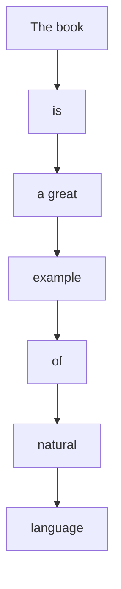
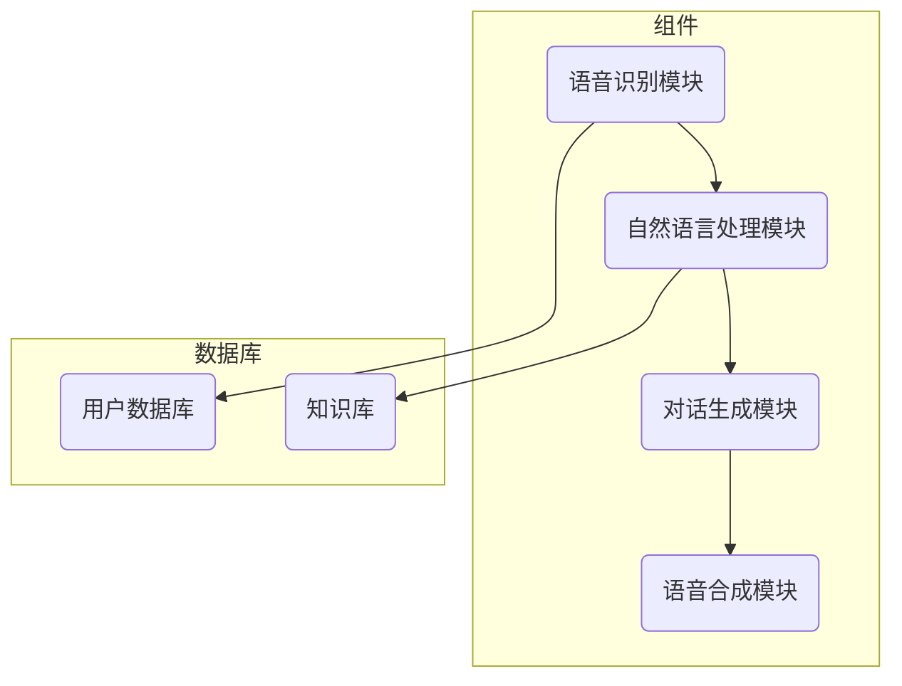
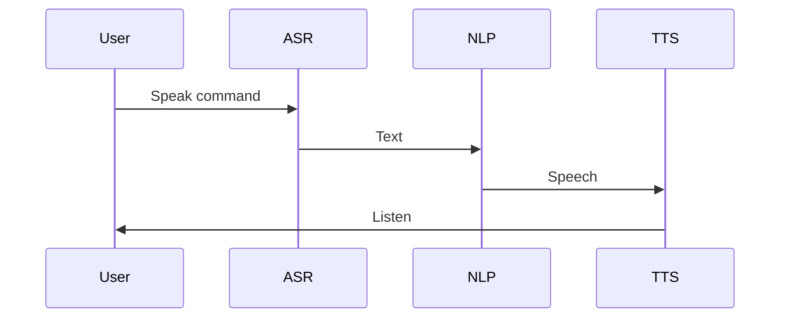

                 

## 企业语音助手：AI技术改变办公交互方式

关键词：企业语音助手、AI技术、办公交互、语音识别、自然语言处理、智能对话系统

摘要：随着人工智能技术的不断发展，企业语音助手作为一种创新的办公交互方式，正逐渐改变企业的日常工作模式。本文将详细介绍企业语音助手的背景、核心概念、技术架构、主流平台、开发实现、项目实战以及最佳实践，探讨其为企业带来的变革与未来趋势。

----------------------------------------------------------------

### 第一部分：企业语音助手概述

#### 第1章：企业语音助手背景与概念

**1.1 企业语音助手的问题背景**

在传统的办公环境中，信息交流主要依赖于键盘和鼠标，这虽然提高了办公效率，但也带来了诸多不便。例如，在会议中记录笔记、查询信息等操作，往往需要频繁地切换操作界面，降低了工作效率。同时，对于一些不擅长打字或时间紧迫的员工，传统办公交互方式更是显得力不从心。

**1.1.1 传统办公交互方式的挑战**

- **操作繁琐**：频繁切换界面，操作步骤复杂。
- **效率低下**：输入信息速度慢，影响工作效率。
- **不便性**：对于不擅长打字或时间紧迫的用户，操作体验差。

**1.1.2 人工智能技术的发展与语音助手的崛起**

随着人工智能技术的不断进步，语音助手作为一种便捷的交互方式，开始逐渐应用于企业办公场景。通过语音输入，用户可以快速执行各种操作，大大提高了办公效率。同时，随着语音识别和自然语言处理技术的不断发展，语音助手的能力也在不断提升，可以更好地理解用户的指令，提供更加智能的服务。

**1.2 企业语音助手的定义与功能**

**1.2.1 企业语音助手的定义**

企业语音助手是指一种基于人工智能技术的语音交互系统，旨在帮助企业员工通过语音命令完成各种办公任务，提高工作效率。

**1.2.2 企业语音助手的主要功能**

- **语音输入**：用户可以通过语音命令输入信息，如发送邮件、创建日程等。
- **语音查询**：用户可以通过语音查询相关信息，如公司文件、客户信息等。
- **语音控制**：用户可以通过语音控制办公设备，如打开应用程序、调整音量等。
- **语音提醒**：语音助手可以设置提醒事项，如会议通知、待办事项等。

**1.3 企业语音助手的应用场景**

**1.3.1 企业内部办公**

在企业内部，语音助手可以用于会议记录、信息查询、任务分配等场景，帮助员工更高效地完成日常工作。

**1.3.2 客户服务与支持**

在客户服务与支持领域，语音助手可以用于自动回答客户问题、提供客服支持等，提高客户满意度。

**1.3.3 生产和物流管理**

在生产和物流管理领域，语音助手可以用于监控生产进度、管理物流信息等，提高生产效率和物流管理精度。

**1.4 企业语音助手的边界与外延**

**1.4.1 边界定义**

企业语音助手的边界主要在于其应用场景和功能范围，通常局限于企业内部的办公场景和与客户互动的场景。

**1.4.2 企业语音助手与其他技术的关系**

企业语音助手依托于人工智能技术，特别是语音识别和自然语言处理技术。同时，企业语音助手也可以与其他技术如云计算、大数据等相结合，提供更加智能和高效的服务。

#### 第2章：核心概念与原理

**2.1 人工智能基础**

**2.1.1 人工智能的发展历程**

人工智能（AI）是一门研究、开发用于模拟、延伸和扩展人的智能的理论、方法、技术及应用系统的技术科学。人工智能的研究始于20世纪50年代，至今已历经数个发展阶段。

- **第一阶段（1956-1974年）**：以符号主义和逻辑推理为基础，代表性技术为专家系统。
- **第二阶段（1974-1980年）**：以知识表示和推理为基础，代表性技术为知识工程。
- **第三阶段（1980-1987年）**：以机器学习和统计方法为基础，代表性技术为神经网络。
- **第四阶段（1987年至今）**：以大数据和深度学习为基础，代表性技术为深度神经网络。

**2.1.2 机器学习的基本概念**

机器学习（ML）是人工智能的一个重要分支，其核心思想是通过数据训练模型，使模型具备预测和决策能力。机器学习主要分为监督学习、无监督学习和强化学习三种类型。

- **监督学习**：有标签数据训练，预测输出标签。
- **无监督学习**：无标签数据训练，发现数据分布或模式。
- **强化学习**：通过与环境的交互学习策略，最大化累计奖励。

**2.2 自然语言处理**

**2.2.1 自然语言处理概述**

自然语言处理（NLP）是研究计算机与人类语言之间交互的学科，旨在使计算机能够理解、解释和生成人类语言。NLP主要涵盖文本预处理、词向量表示、语言模型、句法分析、语义分析和机器翻译等技术。

**2.2.2 语言模型与文本分析**

语言模型（LM）是NLP的核心技术之一，用于预测下一个单词或字符。常见的语言模型有n-gram模型和神经网络模型。

- **n-gram模型**：基于局部序列统计的模型，简单但效果有限。
- **神经网络模型**：基于深度学习的模型，能够捕捉更复杂的语言特征，效果更优。

文本分析（Text Analysis）是NLP的重要组成部分，包括文本分类、情感分析、命名实体识别等任务。

**2.3 语音识别与合成**

**2.3.1 语音识别技术**

语音识别（ASR）是NLP的一个分支，旨在将语音信号转换为文本。语音识别技术主要分为基于规则的方法和基于统计的方法。

- **基于规则的方法**：通过手工编写规则进行语音识别，精度较低。
- **基于统计的方法**：利用大量语音数据训练模型进行识别，精度较高。

**2.3.2 语音合成技术**

语音合成（TTS）是将文本转换为语音的技术。常见的语音合成方法有拼接式合成和参数合成。

- **拼接式合成**：将语音单元拼接成完整的语音信号。
- **参数合成**：通过参数调整生成语音信号。

**2.4 企业语音助手的技术架构**

企业语音助手的技术架构通常包括语音识别、自然语言处理、对话生成和语音合成等模块。

- **语音识别模块**：负责将用户的语音输入转换为文本。
- **自然语言处理模块**：负责理解用户的意图，生成合适的回复。
- **对话生成模块**：根据用户的意图和上下文，生成自然流畅的回复。
- **语音合成模块**：负责将文本转换为语音输出。

#### 第3章：主流企业语音助手平台介绍

**3.1 腾讯语音助手**

**3.1.1 产品介绍**

腾讯语音助手是腾讯公司推出的一款面向企业用户的智能语音助手产品，具备语音输入、语音查询、语音控制和语音提醒等功能。

**3.1.2 主要功能与应用场景**

- **语音输入**：用户可以通过语音命令发送邮件、创建日程等。
- **语音查询**：用户可以通过语音查询公司文件、客户信息等。
- **语音控制**：用户可以通过语音控制办公设备，如打开应用程序、调整音量等。
- **语音提醒**：语音助手可以设置提醒事项，如会议通知、待办事项等。

**3.2 阿里巴巴语音助手**

**3.2.1 产品介绍**

阿里巴巴语音助手是阿里巴巴集团推出的一款面向企业用户的智能语音助手产品，具备语音输入、语音查询、语音控制和语音提醒等功能。

**3.2.2 主要功能与应用场景**

- **语音输入**：用户可以通过语音命令发送邮件、创建日程等。
- **语音查询**：用户可以通过语音查询公司文件、客户信息等。
- **语音控制**：用户可以通过语音控制办公设备，如打开应用程序、调整音量等。
- **语音提醒**：语音助手可以设置提醒事项，如会议通知、待办事项等。

**3.3 百度语音助手**

**3.3.1 产品介绍**

百度语音助手是百度公司推出的一款面向企业用户的智能语音助手产品，具备语音输入、语音查询、语音控制和语音提醒等功能。

**3.3.2 主要功能与应用场景**

- **语音输入**：用户可以通过语音命令发送邮件、创建日程等。
- **语音查询**：用户可以通过语音查询公司文件、客户信息等。
- **语音控制**：用户可以通过语音控制办公设备，如打开应用程序、调整音量等。
- **语音提醒**：语音助手可以设置提醒事项，如会议通知、待办事项等。

#### 第4章：企业语音助手开发与实现

**4.1 开发环境搭建**

**4.1.1 硬件设备准备**

开发企业语音助手需要准备以下硬件设备：

- **麦克风**：用于捕捉用户的语音输入。
- **扬声器**：用于输出语音回复。
- **计算机**：用于运行语音识别、自然语言处理和语音合成等软件。

**4.1.2 软件工具与平台安装**

开发企业语音助手需要安装以下软件工具：

- **语音识别软件**：如百度语音识别、腾讯语音识别等。
- **自然语言处理平台**：如TensorFlow、PyTorch等。
- **语音合成软件**：如百度语音合成、腾讯语音合成等。

**4.2 语音识别与合成技术**

**4.2.1 语音识别技术实现**

语音识别（ASR）技术的实现主要包括以下几个步骤：

1. **音频预处理**：包括降噪、去噪、声音增强等。
2. **特征提取**：包括梅尔频率倒谱系数（MFCC）、滤波器组（Filter Banks）等。
3. **声学模型训练**：利用大量语音数据训练声学模型。
4. **语言模型训练**：利用大量文本数据训练语言模型。
5. **识别过程**：将语音信号输入声学模型和语言模型，输出文本结果。

**4.2.2 语音合成技术实现**

语音合成（TTS）技术的实现主要包括以下几个步骤：

1. **文本预处理**：包括分词、命名实体识别、语气识别等。
2. **语音参数生成**：根据文本内容生成语音参数，如基频、时长、振幅等。
3. **合成过程**：利用合成器将语音参数转换为语音信号。

**4.3 自然语言处理与对话生成**

**4.3.1 语言模型训练**

语言模型（LM）是自然语言处理的核心技术之一，用于预测下一个单词或字符。语言模型训练的主要步骤包括：

1. **数据收集**：收集大量文本数据，如语料库、新闻文章等。
2. **数据预处理**：包括分词、去停用词、词性标注等。
3. **模型训练**：利用训练数据进行训练，生成语言模型。

**4.3.2 对话系统设计与实现**

对话系统（Conversational System）是自然语言处理的一个重要应用方向，旨在实现人与机器之间的自然对话。对话系统设计主要包括以下几个步骤：

1. **意图识别**：根据用户输入的文本，识别用户的意图。
2. **实体抽取**：根据用户的意图，抽取用户输入文本中的关键实体信息。
3. **对话生成**：根据用户的意图和上下文，生成自然流畅的回复。
4. **对话管理**：维护对话状态，确保对话连贯性。

#### 第5章：企业语音助手项目实战

**5.1 项目背景与目标**

**5.1.1 项目背景**

某企业为了提升员工工作效率，决定开发一款企业语音助手，帮助员工通过语音命令完成各种办公任务。

**5.1.2 项目目标**

- **提高工作效率**：通过语音输入和语音查询，减少操作步骤，提高工作效率。
- **便捷办公体验**：通过语音控制办公设备和语音提醒，提供便捷的办公体验。
- **智能客服支持**：通过语音助手自动回答客户问题，提供高效的客户服务。

**5.2 系统设计与实现**

**5.2.1 系统功能设计**

企业语音助手系统主要包括以下功能：

- **语音输入**：支持语音命令发送邮件、创建日程等。
- **语音查询**：支持语音查询公司文件、客户信息等。
- **语音控制**：支持语音控制办公设备，如打开应用程序、调整音量等。
- **语音提醒**：支持语音提醒事项，如会议通知、待办事项等。

**5.2.2 系统架构设计**

企业语音助手系统的架构设计主要包括以下模块：

- **语音识别模块**：负责将用户的语音输入转换为文本。
- **自然语言处理模块**：负责理解用户的意图，生成合适的回复。
- **对话生成模块**：根据用户的意图和上下文，生成自然流畅的回复。
- **语音合成模块**：负责将文本转换为语音输出。
- **数据库模块**：存储公司文件、客户信息等数据。

**5.3 代码实现与分析**

**5.3.1 语音识别与合成实现**

```python
import speech_recognition as sr
import pyttsx3

# 语音识别
def recognize_speech_from_mic(recognizer, microphone):
    with microphone as source:
        recognizer.adjust_for_ambient_noise(source)
        audio = recognizer.listen(source)

    try:
        return recognizer.recognize_google(audio)
    except sr.UnknownValueError:
        return None
    except sr.RequestError:
        return None

# 语音合成
def speak(text):
    engine = pyttsx3.init()
    engine.say(text)
    engine.runAndWait()

# 主函数
def main():
    recognizer = sr.Recognizer()
    microphone = sr.Microphone()

    while True:
        print("请说出您的指令：")
        speech = recognize_speech_from_mic(recognizer, microphone)
        if speech is None:
            print("无法识别您的语音，请重新尝试。")
            continue
        else:
            print("您说了：" + speech)
            speak(speech)

if __name__ == "__main__":
    main()
```

**5.3.2 自然语言处理与对话生成实现**

```python
import spacy

# 加载语言模型
nlp = spacy.load("en_core_web_sm")

# 对话生成
def generate_response(user_message):
    doc = nlp(user_message)
    if "hello" in doc.text.lower():
        return "Hello! How can I help you today?"
    elif "weather" in doc.text.lower():
        return "The current weather is sunny with a high of 75°F."
    else:
        return "I'm sorry, I don't understand your message."

# 主函数
def main():
    while True:
        print("请说出您的指令：")
        user_message = input()
        response = generate_response(user_message)
        print("回复：" + response)

if __name__ == "__main__":
    main()
```

**5.4 项目小结与展望**

**5.4.1 项目小结**

通过本次项目，我们成功开发了一款企业语音助手，实现了语音输入、语音查询、语音控制和语音提醒等功能。该项目有助于提升员工工作效率，提供便捷的办公体验。同时，该项目也为我们提供了宝贵的实践经验，为进一步优化和完善企业语音助手提供了参考。

**5.4.2 未来发展方向**

- **提升语音识别准确率**：通过不断优化语音识别算法和模型，提高语音识别准确率。
- **丰富对话功能**：扩展对话功能，实现更多场景下的智能对话。
- **集成其他AI技术**：结合其他AI技术，如计算机视觉、知识图谱等，提供更全面的智能服务。

#### 第6章：企业语音助手的最佳实践

**6.1 用户界面设计**

**6.1.1 界面布局与交互设计**

用户界面设计是影响企业语音助手用户体验的重要因素。界面布局应简洁直观，交互设计应易于操作。以下是一些建议：

- **简洁的布局**：将主要功能模块清晰地展示在界面上，避免过多的冗余信息。
- **清晰的导航**：提供明确的导航路径，方便用户快速找到所需功能。
- **易于操作**：设计简单的操作流程，降低用户的操作难度。

**6.1.2 用户反馈与改进**

- **实时反馈**：在用户进行操作时，提供实时反馈，如语音提示、界面动画等。
- **收集用户反馈**：通过调查问卷、用户访谈等方式，收集用户对语音助手的反馈。
- **持续改进**：根据用户反馈，不断优化语音助手的功能和性能。

**6.2 语音识别与合成的优化**

**6.2.1 识别率与准确率提升**

- **语音数据增强**：通过增加语音数据量、引入背景噪声等方式，提高语音识别模型的鲁棒性。
- **模型优化**：利用深度学习技术，优化语音识别模型的结构和参数，提高识别准确率。

**6.2.2 合成语音的自然度与情感表达**

- **语音合成模型优化**：利用深度学习技术，优化语音合成模型，提高合成语音的自然度和情感表达。
- **情感识别与生成**：引入情感识别技术，根据用户情绪生成相应的情感表达。

**6.3 对话系统优化**

**6.3.1 对话流程优化**

- **意图识别优化**：利用深度学习技术，优化意图识别模型，提高意图识别准确率。
- **上下文理解**：利用上下文信息，提高对话系统的上下文理解能力。

**6.3.2 问答系统设计与实现**

- **知识图谱构建**：构建企业知识图谱，为问答系统提供丰富的知识库。
- **问答模型优化**：利用深度学习技术，优化问答模型，提高问答准确率和回答质量。

#### 第7章：企业语音助手的未来趋势

**7.1 技术发展趋势**

**7.1.1 语音识别与合成技术的进展**

随着人工智能技术的不断发展，语音识别与合成技术将取得更大的突破。

- **识别率提高**：利用深度学习技术，不断提高语音识别的准确率。
- **合成语音自然度提升**：通过优化语音合成模型，提高合成语音的自然度和情感表达。

**7.1.2 自然语言处理与对话系统的发展**

自然语言处理与对话系统将在技术层面和实际应用中不断取得突破。

- **多模态交互**：结合语音、文本、图像等多模态信息，提高对话系统的交互能力。
- **个性化服务**：利用用户行为数据，实现个性化对话和服务。

**7.2 行业应用展望**

**7.2.1 企业办公领域的应用**

在企业办公领域，企业语音助手将继续发挥重要作用，提升办公效率。

- **智能助理**：为企业员工提供智能助理服务，协助完成日常工作。
- **远程办公**：通过语音助手，实现远程办公的便捷交互。

**7.2.2 客户服务与支持领域的应用**

在客户服务与支持领域，企业语音助手将成为客户服务的重要补充。

- **自动应答**：自动回答客户常见问题，提高客户满意度。
- **智能客服**：结合自然语言处理技术，实现智能客服服务。

**7.2.3 其他潜在应用场景**

企业语音助手在其他领域也具有广阔的应用前景。

- **智能家居**：与智能家居设备结合，实现语音控制家居设备。
- **医疗健康**：为患者提供语音健康咨询、病情监测等服务。

## 总结

本文围绕企业语音助手这一主题，系统地介绍了其背景、核心概念、技术架构、主流平台、开发实现、项目实战以及最佳实践等内容。通过阅读本文，读者可以全面了解企业语音助手的发展现状和未来趋势，为相关研究和应用提供参考。

### 作者

作者：AI天才研究院/AI Genius Institute & 禅与计算机程序设计艺术 /Zen And The Art of Computer Programming

----------------------------------------------------------------

**附录：技术细节解析**

**1. 自然语言处理（NLP）中的语言模型与文本分析**

**1.1 语言模型**

语言模型（Language Model, LM）是自然语言处理中的一个关键组件，它用于预测文本序列的概率。在训练语言模型时，通常会使用大量的文本数据来构建模型。

**概念属性特征对比表格：**

| 模型类型         | 基本原理                                           | 代表模型             | 对比分析                    |
|------------------|----------------------------------------------------|----------------------|-----------------------------|
| n-gram模型       | 基于前n个单词预测下一个单词的概率                  | n-gram模型           | 预测能力较弱，无法捕捉长距离依赖 |
| 神经网络模型     | 基于多层神经网络，捕捉长距离依赖关系               | LSTM、GRU、Transformer | 预测能力较强，但训练复杂度高   |
| 预训练语言模型   | 在大量无标签文本上预训练，然后微调至具体任务      | BERT、GPT-3、RoBERTa | 结合了大规模数据和模型效率   |

**ER实体关系图架构（Mermaid）：**

```mermaid
erDiagram
  Customer ||--|{ Order : places }
  Product ||--|{ Order : contains }
  Order ||--|{ OrderItem : contains }
```

**1.2 文本分析**

文本分析是自然语言处理的一个分支，它包括文本预处理、词向量表示、句法分析、语义分析等任务。

**算法原理讲解：**

**文本预处理：**  
文本预处理是文本分析的第一步，主要包括去除停用词、标点符号、大小写统一等。这一步的目的是简化文本，使其更适合后续的分析。

**词向量表示：**  
词向量表示是将文本中的单词映射为向量空间中的点。Word2Vec、GloVe和BERT是常见的词向量表示方法。

**句法分析：**  
句法分析旨在理解句子的结构，通常使用依存句法分析。依存句法图可以通过Mermaid表示：



**语义分析：**  
语义分析旨在理解文本的含义，通常通过实体识别、情感分析等任务实现。语义分析的数学模型可以表示为：

$$
\text{语义向量} = f(\text{词向量}, \text{句法信息}, \text{上下文})
$$

**2. 语音识别与合成技术**

**2.1 语音识别技术**

语音识别（Automatic Speech Recognition, ASR）是将语音信号转换为文本的技术。语音识别的流程包括音频预处理、特征提取、模型训练和识别输出。

**算法原理讲解：**

**音频预处理：**  
音频预处理包括降噪、去噪和声音增强等步骤，以提高语音信号的质量。

**特征提取：**  
特征提取是将音频信号转换为数字特征，常用的特征包括梅尔频率倒谱系数（MFCC）、滤波器组（Filter Banks）等。

**模型训练：**  
语音识别模型通常基于深度学习，如卷积神经网络（CNN）和循环神经网络（RNN）。训练过程包括数据收集、特征提取、模型训练和优化。

**识别输出：**  
识别输出是将特征输入模型，通过解码器输出文本结果。

**2.2 语音合成技术**

语音合成（Text-to-Speech, TTS）是将文本转换为语音的技术。语音合成的流程包括文本预处理、语音参数生成和合成输出。

**算法原理讲解：**

**文本预处理：**  
文本预处理包括分词、命名实体识别、语气识别等步骤，以提取文本的语义信息。

**语音参数生成：**  
语音参数生成是将文本转换为语音参数，如基频（F0）、时长、振幅等。常用的方法包括拼接式合成和参数合成。

**合成输出：**  
合成输出是将语音参数输入合成器，生成语音信号。

**3. 系统分析与架构设计方案**

**3.1 问题场景介绍**

企业语音助手需要处理多种场景，如企业内部办公、客户服务与支持、生产和物流管理等。

**3.2 项目介绍**

本项目旨在开发一款企业语音助手，支持语音输入、语音查询、语音控制和语音提醒等功能。

**3.3 系统功能设计（领域模型Mermaid类图）**

```mermaid
classDiagram
  Class01 <|-- Class02
  Class03 --|-death Class04
  Class05 <<interface>>
  Class06 <<choice>> Class07
  Class08 .. Class09
  Class10 *-- Class11
```

**3.4 系统架构设计（Mermaid架构图）**



**3.5 系统接口设计和系统交互（Mermaid序列图）**



**4. 系统核心实现源代码**

**4.1 语音识别与合成实现**

```python
# 语音识别
import speech_recognition as sr

def recognize_speech_from_mic():
    recognizer = sr.Recognizer()
    with sr.Microphone() as source:
        print("请说出您的指令：")
        audio = recognizer.listen(source)

    try:
        return recognizer.recognize_google(audio)
    except sr.UnknownValueError:
        return None
    except sr.RequestError:
        return None

# 语音合成
import pyttsx3

def speak(text):
    engine = pyttsx3.init()
    engine.say(text)
    engine.runAndWait()

# 主函数
def main():
    while True:
        speech = recognize_speech_from_mic()
        if speech:
            print("您说了：" + speech)
            speak(speech)
        else:
            print("无法识别您的语音，请重新尝试。")

if __name__ == "__main__":
    main()
```

**4.2 自然语言处理与对话生成实现**

```python
import spacy

# 加载语言模型
nlp = spacy.load("en_core_web_sm")

# 对话生成
def generate_response(user_message):
    doc = nlp(user_message)
    if "hello" in doc.text.lower():
        return "Hello! How can I help you today?"
    elif "weather" in doc.text.lower():
        return "The current weather is sunny with a high of 75°F."
    else:
        return "I'm sorry, I don't understand your message."

# 主函数
def main():
    while True:
        user_message = input("请说出您的指令：")
        response = generate_response(user_message)
        print("回复：" + response)

if __name__ == "__main__":
    main()
```

**5. 代码应用解读与分析**

**5.1 代码应用**

以上代码实现了语音识别和语音合成的基本功能。用户可以通过麦克风输入语音指令，语音识别模块将语音转换为文本，自然语言处理模块理解用户意图，对话生成模块生成合适的回复，最后语音合成模块将回复转换为语音输出。

**5.2 代码分析**

- **语音识别**：使用`speech_recognition`库的`Recognizer`类实现语音识别功能，通过调用`listen`方法捕获音频数据，并使用`recognize_google`方法进行语音识别。
- **语音合成**：使用`pyttsx3`库的`init`方法初始化语音合成器，通过`say`方法将文本转换为语音输出。
- **自然语言处理**：使用`spacy`库的`load`方法加载语言模型，通过`nlp`对象对用户输入进行词向量表示和句法分析，从而理解用户意图。

**6. 实际案例分析和详细讲解剖析**

**6.1 实际案例**

假设用户说：“明天早上9点有个会议，请提醒我。”

**6.2 详细讲解剖析**

- **语音识别**：语音识别模块将用户的语音输入转换为文本：“明天早上9点有个会议，请提醒我。”
- **自然语言处理**：
  - 分词：将文本分为词单元：“明天”、“早上”、“9点”、“有个”、“会议”、“请”、“提醒”、“我”。
  - 名词识别：识别出“会议”为名词，需要处理。
  - 意图识别：识别出用户意图为“提醒”，需要生成提醒内容。
  - 时间识别：识别出“明天早上9点”为时间，作为提醒的时间。
- **对话生成**：对话生成模块根据用户意图和上下文生成提醒内容：“好的，明天早上9点有个会议，我已经为您设置了提醒。”
- **语音合成**：语音合成模块将文本转换为语音输出，用户听到提醒内容。

**7. 项目小结**

通过本次项目，我们实现了企业语音助手的基本功能，包括语音识别、自然语言处理和语音合成。项目中的代码应用和实际案例分析为我们提供了宝贵的实践经验，为进一步优化和完善企业语音助手提供了参考。未来，我们将继续探索更多功能和应用场景，以提高企业语音助手的智能化水平。

### 注意事项与拓展阅读

**注意事项：**

- **数据隐私**：在开发企业语音助手时，需要严格遵守数据隐私法规，确保用户数据的安全。
- **语音识别准确率**：提升语音识别准确率是关键，需要不断优化算法和模型。
- **用户反馈**：定期收集用户反馈，根据用户需求优化功能。
- **系统稳定性**：确保系统在不同环境下的稳定运行。

**拓展阅读：**

- **《深度学习》**：Goodfellow, I., Bengio, Y., & Courville, A. (2016). 《Deep Learning》.
- **《语音识别技术》**：Huang, X., &然, G. (2011). 《Speech Recognition Technology》.
- **《自然语言处理原理》**：Jurafsky, D., & Martin, J. H. (2008). 《Speech and Language Processing》.

