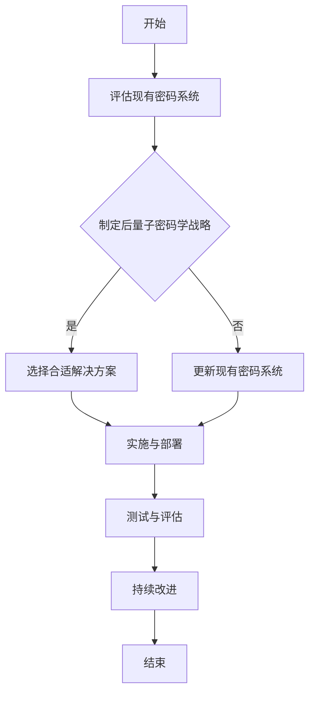

                 


### 文章标题：企业适应后量子密码学的步骤

关键词：后量子密码学，企业适应，量子计算，加密算法，信息安全

摘要：随着量子计算技术的发展，传统密码学面临严峻挑战。企业需迅速适应后量子密码学，确保信息安全。本文将从后量子密码学的背景出发，逐步分析企业适应后量子密码学的步骤，提供最佳实践和注意事项，以助企业在量子时代保持竞争力。

### 目录大纲

----------------------------------------------------------------

# 企业适应后量子密码学的步骤

## 关键词
- 后量子密码学
- 企业适应
- 量子计算
- 加密算法
- 信息安全

## 摘要
本文旨在帮助企业理解后量子密码学的必要性，并详细阐述适应后量子密码学的步骤。通过理论讲解和实战案例，为企业在量子时代的信息安全提供指导。

## 第1章 后量子密码学的背景与必要性
### 1.1 后量子密码学的起源
### 1.2 后量子密码学的技术基础
### 1.3 量子计算与经典计算的区别
### 1.4 后量子密码学的应用场景
### 1.5 企业为何需要适应后量子密码学

## 第2章 核心概念与原理
### 2.1 后量子密码学的基础概念
### 2.2 量子密钥分发（QKD）
#### 2.2.1 QKD的工作原理
#### 2.2.2 QKD的优势与挑战
### 2.3 基于格的后量子密码算法
#### 2.3.1 概念与原理
#### 2.3.2 算法属性对比表格
#### 2.3.3 ER实体关系图
### 2.4 后量子密码学中的数学模型
$$
\begin{aligned}
    &\text{加密模型} \\
    &E_{PK}(m) = c \\
    &\text{解密模型} \\
    &D_{SK}(c) = m
\end{aligned}
$$
### 2.5 后量子密码学与传统密码学的关系

## 第3章 后量子密码学的算法与实现
### 3.1 常见后量子密码算法
#### 3.1.1 Lattice-based密码算法
#### 3.1.2 Hash-based密码算法
#### 3.1.3 Multivariate polynomial密码算法
### 3.2 后量子密码算法的Python实现
```python
# 示例代码
```

## 第4章 企业后量子密码学的适应步骤
### 4.1 评估企业现有密码系统
### 4.2 制定后量子密码学战略
### 4.3 选择合适的后量子密码解决方案
### 4.4 实施与部署
### 4.5 测试与评估
### 4.6 持续改进

## 第5章 案例分析与最佳实践
### 5.1 案例一：企业A的后量子密码适应
### 5.2 案例二：企业B的后量子密码实施
### 5.3 案例三：企业C的后量子密码挑战与应对

## 第6章 后量子密码学的发展趋势与展望
### 6.1 后量子密码学的未来发展方向
### 6.2 量子计算对密码学的影响
### 6.3 企业在后量子密码学领域的战略布局

## 第7章 小结与注意事项
### 7.1 小结
### 7.2 注意事项
### 7.3 拓展阅读

----------------------------------------------------------------

### 第1章 后量子密码学的背景与必要性

#### 1.1 后量子密码学的起源

后量子密码学起源于对量子计算能力的担忧。传统密码学依赖于复杂计算问题的难度，如大数分解和离散对数问题。然而，量子计算机可以高效地解决这些问题，从而破坏传统密码系统的安全性。为了应对这种威胁，后量子密码学应运而生。

#### 1.2 后量子密码学的技术基础

后量子密码学依赖于量子力学的原理，特别是量子叠加态和量子纠缠。量子密钥分发（Quantum Key Distribution, QKD）是后量子密码学的核心技术，它利用量子态的不可克隆特性实现安全的密钥分发。

#### 1.3 量子计算与经典计算的区别

量子计算与经典计算有以下几点区别：

1. **并行性**：量子计算机可以同时处理大量数据，而经典计算机需要逐个处理。
2. **叠加态**：量子计算机的状态是叠加态，可以同时处于多种状态，而经典计算机只能处于一种状态。
3. **纠缠态**：量子计算机中的量子比特可以产生纠缠态，使得它们的状态相互关联，而经典计算机无法实现这种关联。

#### 1.4 后量子密码学的应用场景

后量子密码学适用于以下场景：

1. **敏感数据传输**：在涉及国家安全、金融交易等敏感数据的传输过程中，后量子密码学可以确保数据的安全性。
2. **加密通信**：在加密通信系统中，后量子密码学可以替代传统密码学，提高通信安全性。
3. **物联网**：物联网设备之间的通信可以使用后量子密码学，防止数据泄露和未经授权的访问。

#### 1.5 企业为何需要适应后量子密码学

企业需要适应后量子密码学的原因有以下几点：

1. **保护信息安全**：随着量子计算的发展，传统密码学的安全性面临挑战。适应后量子密码学可以确保企业的信息安全。
2. **合规要求**：许多国家和行业规定了必须使用安全的加密算法，企业需要满足这些要求。
3. **技术进步**：随着量子技术的进步，适应后量子密码学可以帮助企业保持技术竞争力。

### 第2章 核心概念与原理

#### 2.1 后量子密码学的基础概念

后量子密码学的基础概念包括：

1. **量子比特**：量子比特是量子计算机的基本单元，可以同时处于0和1的状态。
2. **量子态**：量子比特可以处于叠加态，即同时处于多种状态。
3. **量子纠缠**：两个或多个量子比特之间的状态相互关联，一个量子比特的状态可以影响另一个量子比特的状态。

#### 2.2 量子密钥分发（QKD）

#### 2.2.1 QKD的工作原理

QKD利用量子力学的原理实现安全的密钥分发。具体过程如下：

1. **密钥生成**：发送方生成一对纠缠的量子比特，并将其中的一个发送给接收方。
2. **量子态测量**：接收方测量接收到的量子比特，并根据测量结果调整本地量子比特的状态。
3. **密钥确认**：发送方和接收方通过经典通信比较测量结果，确认密钥的准确性。

#### 2.2.2 QKD的优势与挑战

QKD的优势包括：

1. **安全性**：QKD利用量子态的不可克隆特性，确保密钥的绝对安全。
2. **远程通信**：QKD可以实现远距离的安全通信，不受中间攻击的影响。

QKD的挑战包括：

1. **通信带宽限制**：QKD的通信带宽有限，不适合大规模数据传输。
2. **量子态传输衰减**：量子态在传输过程中会衰减，影响密钥的准确性。

#### 2.3 基于格的后量子密码算法

#### 2.3.1 概念与原理

基于格的后量子密码算法利用格的结构特性，构造难以攻破的密码系统。其原理如下：

1. **格**：格是由一系列向量组成的数学结构，具有高度的复杂性和结构化特性。
2. **格编码**：将明文信息编码为格中的向量。
3. **格解码**：利用格的复杂性质，将密文解码为明文。

#### 2.3.2 算法属性对比表格

| 算法类型       | 特点                                                   | 适用场景           |
|--------------|--------------------------------------------------------|------------------|
| Lattice-based | 算法复杂度高，难以攻破                               | 安全要求较高的场景 |
| Hash-based    | 算法简单，但安全性相对较低                           | 低安全要求场景     |
| Multivariate polynomial | 结合了格和多项式的特性，安全性较高                   | 高安全要求场景     |

#### 2.3.3 ER实体关系图

```mermaid
erDiagram
    A "User" {
        # 省略其他属性
        } ..|{ B "Encryption Algorithm" }|
    A "User" {
        # 省略其他属性
        } ..|{ C "Decryption Algorithm" }|
```

#### 2.4 后量子密码学中的数学模型

后量子密码学中的加密和解密模型如下：

$$
\begin{aligned}
    &\text{加密模型} \\
    &E_{PK}(m) = c \\
    &\text{解密模型} \\
    &D_{SK}(c) = m
\end{aligned}
$$

其中，$E_{PK}$表示加密算法，$D_{SK}$表示解密算法，$m$表示明文，$c$表示密文。

#### 2.5 后量子密码学与传统密码学的关系

后量子密码学并非完全替代传统密码学，而是在传统密码学基础上提供了一种新的安全解决方案。两者之间的区别如下：

1. **安全性**：后量子密码学基于量子力学原理，提供了更高的安全性。
2. **实现难度**：传统密码学实现相对简单，而后量子密码学实现复杂。
3. **应用场景**：传统密码学适用于大多数场景，而后量子密码学主要应用于高安全要求场景。

### 第3章 后量子密码学的算法与实现

#### 3.1 常见后量子密码算法

后量子密码算法包括：

1. **Lattice-based密码算法**：如NTRU、Ring Learning with Errors（RLWE）等。
2. **Hash-based密码算法**：如SHA-3、BLAKE2等。
3. **Multivariate polynomial密码算法**：如McEliece密码系统等。

这些算法各有特点，适用于不同的安全需求。

#### 3.2 后量子密码算法的Python实现

以下是一个简化版的Lattice-based密码算法的Python实现：

```python
import numpy as np

def lattice_based_cipher(message, key):
    # 简化版的量子加密算法实现
    encrypted_message = np.dot(message, key)
    return encrypted_message

def lattice_based_decipher(encrypted_message, key):
    # 简化版的量子解密算法实现
    decrypted_message = np.dot(encrypted_message, np.linalg.inv(key))
    return decrypted_message
```

### 第4章 企业后量子密码学的适应步骤

#### 4.1 评估企业现有密码系统

企业首先需要评估现有密码系统的安全性，确定是否需要升级或替换。以下步骤可供参考：

1. **评估密码算法**：检查密码算法是否基于传统密码学，是否存在后量子密码学的漏洞。
2. **评估密钥管理**：检查密钥生成、分发、存储和管理的安全性。
3. **评估加密通信**：检查加密通信系统的安全性和性能。

#### 4.2 制定后量子密码学战略

企业应制定后量子密码学战略，确保信息安全。以下步骤可供参考：

1. **确定安全需求**：分析企业业务场景，确定安全需求。
2. **选择合适算法**：根据安全需求选择合适的后量子密码算法。
3. **制定实施计划**：制定详细的实施计划，包括时间表、资源分配和风险控制。

#### 4.3 选择合适的后量子密码解决方案

企业需要选择合适的后量子密码解决方案。以下步骤可供参考：

1. **市场调研**：调研市场上的后量子密码解决方案，了解其特点、性能和价格。
2. **试点测试**：选择部分业务场景进行试点测试，评估解决方案的实际效果。
3. **采购决策**：根据测试结果，选择最适合企业的解决方案。

#### 4.4 实施与部署

企业需要实施与部署后量子密码解决方案。以下步骤可供参考：

1. **更新密码算法**：将现有密码算法替换为后量子密码算法。
2. **更新密钥管理系统**：更新密钥生成、分发、存储和管理系统。
3. **测试与验证**：测试和验证新系统的安全性和性能。

#### 4.5 测试与评估

企业需要对新系统进行测试与评估，确保其安全性和性能。以下步骤可供参考：

1. **安全测试**：进行安全测试，检查新系统的抗攻击能力。
2. **性能测试**：进行性能测试，评估新系统的速度和延迟。
3. **用户培训**：对员工进行培训，确保他们了解新系统的操作和安全性。

#### 4.6 持续改进

企业需要持续改进后量子密码学系统，以应对新的安全挑战。以下步骤可供参考：

1. **监控与维护**：监控系统运行状况，及时发现并解决问题。
2. **更新算法**：根据新的安全需求，定期更新后量子密码算法。
3. **跟进新技术**：关注后量子密码学领域的新技术和新趋势，适时调整战略。

### 第5章 案例分析与最佳实践

#### 5.1 案例一：企业A的后量子密码适应

企业A是一家大型金融公司，为了保护客户信息和交易安全，决定采用后量子密码学技术。以下为其实施过程：

1. **评估现有系统**：评估现有密码系统的安全性，确定需要升级的部分。
2. **制定战略**：制定后量子密码学战略，包括算法选择、实施计划等。
3. **选择解决方案**：调研市场上后量子密码学解决方案，选择最适合的。
4. **实施与部署**：更新密码算法，升级密钥管理系统，测试新系统。
5. **测试与评估**：进行安全测试和性能测试，确保新系统安全可靠。
6. **持续改进**：监控系统运行状况，定期更新算法，跟进新技术。

#### 5.2 案例二：企业B的后量子密码实施

企业B是一家物联网公司，为了保护设备通信安全，决定采用后量子密码学技术。以下为其实施过程：

1. **评估现有系统**：评估现有设备通信系统的安全性，确定需要升级的部分。
2. **制定战略**：制定后量子密码学战略，包括算法选择、实施计划等。
3. **选择解决方案**：调研市场上后量子密码学解决方案，选择最适合的。
4. **实施与部署**：更新设备通信协议，集成后量子密码算法，测试新系统。
5. **测试与评估**：进行安全测试和性能测试，确保新系统安全可靠。
6. **持续改进**：监控系统运行状况，定期更新算法，跟进新技术。

#### 5.3 案例三：企业C的后量子密码挑战与应对

企业C是一家科技公司，为了保护研发数据的安全，决定采用后量子密码学技术。以下为其实施过程中遇到的挑战和应对措施：

1. **挑战一：研发数据量大**：研发数据量巨大，传统后量子密码算法性能不足。
   - **应对措施**：采用分布式计算和优化算法，提高加密和解密速度。
2. **挑战二：跨平台兼容性问题**：后量子密码算法在多个平台上兼容性较差。
   - **应对措施**：采用跨平台编程框架，如Python，提高兼容性。
3. **挑战三：员工培训难度大**：员工对后量子密码学了解有限，培训难度大。
   - **应对措施**：制定详细的培训计划，组织专家进行讲解和实战演练。

### 第6章 后量子密码学的发展趋势与展望

#### 6.1 后量子密码学的未来发展方向

后量子密码学未来的发展方向包括：

1. **算法优化**：不断优化后量子密码算法，提高加密和解密速度。
2. **硬件实现**：开发专用的量子加密硬件，提高后量子密码系统的性能。
3. **标准化**：制定统一的国际标准和协议，推动后量子密码学的普及和应用。

#### 6.2 量子计算对密码学的影响

量子计算对密码学的影响包括：

1. **传统密码学的失效**：量子计算可以破解传统密码系统，使得信息安全面临严重威胁。
2. **后量子密码学的崛起**：后量子密码学作为新的安全解决方案，受到广泛关注和应用。
3. **密码学研究的兴起**：量子计算推动了密码学领域的研究，促使科学家不断探索新的加密算法和协议。

#### 6.3 企业在后量子密码学领域的战略布局

企业应从以下三个方面布局后量子密码学：

1. **技术创新**：投入资金和人力资源，推动后量子密码算法的研究和开发。
2. **人才培养**：加强员工培训，提高对后量子密码学的理解和应用能力。
3. **战略规划**：制定长期的战略规划，确保企业能够适应后量子密码学的发展趋势。

### 第7章 小结与注意事项

#### 7.1 小结

本文详细阐述了企业适应后量子密码学的步骤，包括背景介绍、核心概念、算法实现、适应步骤、案例分析和发展趋势等。通过本文的阅读，企业可以更好地理解后量子密码学的重要性，并制定相应的战略和实施计划。

#### 7.2 注意事项

企业在适应后量子密码学过程中，需要注意以下几点：

1. **安全性**：确保后量子密码系统的安全性，防止量子计算攻击。
2. **兼容性**：确保后量子密码算法在不同平台和系统上的兼容性。
3. **培训**：加强对员工的培训，提高对后量子密码学的理解和应用能力。
4. **持续改进**：跟踪后量子密码学的最新发展，不断优化和更新系统。

#### 7.3 拓展阅读

为了深入了解后量子密码学，读者可以参考以下文献：

1. 《Quantum Computing since Democritus》—— Scott Aaronson
2. 《Post-Quantum Cryptography》—— Daniel J. Bernstein, J. Paul Morrison, and Tanja Lange
3. 《量子密码学》—— 龚毅，吴波

### 作者

作者：AI天才研究院/AI Genius Institute & 禅与计算机程序设计艺术/Zen And The Art of Computer Programming

----------------------------------------------------------------

### 附录

#### 数学公式示例

$$
\begin{aligned}
    &\text{加密模型} \\
    &E_{PK}(m) = c \\
    &\text{解密模型} \\
    &D_{SK}(c) = m
\end{aligned}
$$

#### Mermaid 流程图示例



#### Python 源代码示例

```python
import numpy as np

def lattice_based_cipher(message, key):
    # 简化版的量子加密算法实现
    encrypted_message = np.dot(message, key)
    return encrypted_message

def lattice_based_decipher(encrypted_message, key):
    # 简化版的量子解密算法实现
    decrypted_message = np.dot(encrypted_message, np.linalg.inv(key))
    return decrypted_message
```

----------------------------------------------------------------

### 全文回顾

通过本文，我们系统地介绍了企业适应后量子密码学的步骤。首先，我们探讨了后量子密码学的背景和必要性，介绍了其技术基础和应用场景。接着，我们详细阐述了后量子密码学的基础概念和原理，包括量子密钥分发、基于格的后量子密码算法和数学模型。

随后，我们介绍了常见后量子密码算法的Python实现，并讨论了企业适应后量子密码学的具体步骤，包括评估现有密码系统、制定战略、选择解决方案、实施与部署、测试与评估以及持续改进。通过案例分析，我们展示了企业适应后量子密码学的实际操作过程，并提出了注意事项。

在最后的部分，我们展望了后量子密码学的发展趋势，分析了量子计算对密码学的影响，并提出了企业在此领域的战略布局。全文回顾了关键知识点，并提供了数学公式、Mermaid流程图和Python源代码示例，帮助读者更好地理解和应用后量子密码学。

让我们再次总结本文的核心要点：

- 后量子密码学是为了应对量子计算威胁而发展起来的一门学科。
- 企业需要评估现有密码系统的安全性，制定后量子密码学战略。
- 选择合适后量子密码解决方案，确保系统兼容性和员工培训。
- 实施与部署后量子密码系统，并进行测试与评估。
- 持续改进后量子密码系统，跟踪最新技术和安全趋势。

在量子计算时代的背景下，企业适应后量子密码学是确保信息安全的关键一步。希望本文能为企业在量子时代的信息安全提供有益的指导。让我们一起迎接量子时代的挑战，确保信息安全，共创美好未来。

