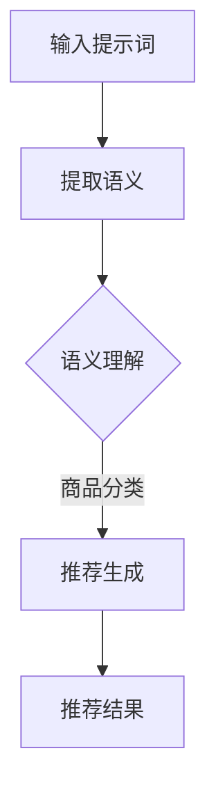
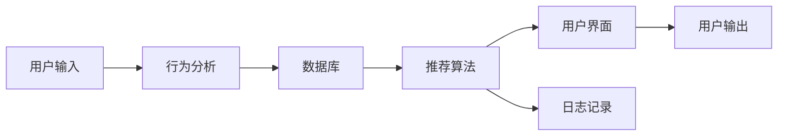
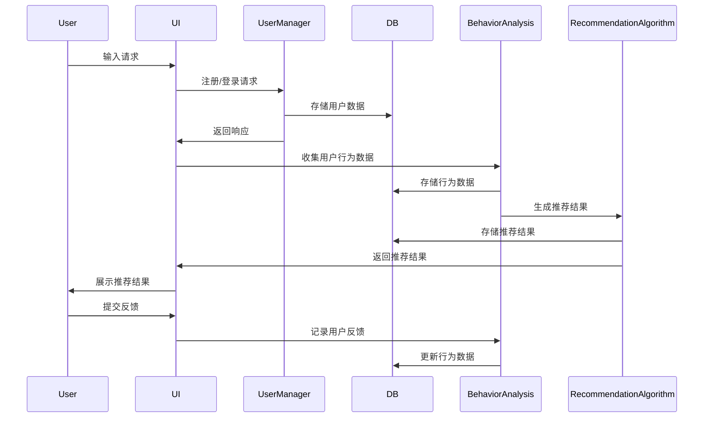

                 

### 文章标题：优化AI虚拟导购体验：个性化推荐的提示词策略

#### 关键词：AI虚拟导购、个性化推荐、提示词策略、用户体验优化、算法优化

##### 摘要：
随着人工智能技术的飞速发展，AI虚拟导购已经成为电子商务领域的重要趋势。本文将深入探讨如何通过优化个性化推荐的提示词策略来提升AI虚拟导购的用户体验。我们将首先介绍AI虚拟导购的背景和发展现状，然后详细解析个性化推荐和提示词策略的核心概念，并逐步讲解如何通过算法优化实现用户体验的提升。最后，我们将结合实际案例，展示优化策略在虚拟导购系统中的具体应用效果，并提出一些最佳实践建议，为后续研究和实际应用提供参考。

## 第1章：引言与背景

### 1.1 AI虚拟导购的兴起

随着互联网技术的不断进步和消费者对个性化服务的需求增加，AI虚拟导购作为一种新兴的电子商务形式，正在逐步改变传统的购物体验。AI虚拟导购利用人工智能技术，通过模拟真实导购员的互动方式，为用户提供个性化的购物建议和推荐服务。这不仅提高了用户的购物效率，也增强了购物体验。

AI虚拟导购的发展背景可以追溯到电子商务的早期阶段。随着在线购物平台的普及，商家逐渐意识到提供个性化服务的重要性。传统的搜索和分类推荐系统已经无法满足用户对个性化、高效购物的需求。因此，商家开始探索利用人工智能技术来实现更智能、更贴心的导购服务。

近年来，深度学习、自然语言处理、数据挖掘等人工智能技术的发展，为AI虚拟导购提供了强大的技术支持。通过分析用户的购物行为、历史数据和偏好，AI虚拟导购系统能够为用户提供高度个性化的推荐，从而提升用户的满意度和忠诚度。

### 1.2 个性化推荐的重要性

个性化推荐是AI虚拟导购的核心技术之一。个性化推荐系统能够根据用户的兴趣、历史行为和实时反馈，为用户提供最相关的商品推荐。与传统的推荐系统相比，个性化推荐更加关注用户的个体差异，能够提供更为精准的服务。

个性化推荐在AI虚拟导购中的重要性体现在以下几个方面：

1. **提升用户体验**：个性化推荐能够为用户提供最符合其需求的商品，减少用户在寻找商品过程中的时间和精力消耗，提升用户的购物体验。
   
2. **增加销售额**：通过个性化推荐，商家能够将热门商品推送给潜在买家，提高商品的曝光率和销售转化率。

3. **增强用户黏性**：个性化的推荐内容能够吸引用户多次访问和购买，提高用户的忠诚度和活跃度。

4. **优化库存管理**：个性化推荐可以帮助商家更准确地预测商品的销售情况，优化库存管理，减少库存积压。

### 1.3 提示词策略在个性化推荐中的应用

提示词策略是提升个性化推荐效果的关键手段之一。提示词是指用户在搜索或互动过程中输入的关键词或短语，它们能够反映用户的兴趣和需求。通过分析提示词，推荐系统可以更好地理解用户意图，从而提供更精准的推荐。

在AI虚拟导购中，提示词策略的应用主要体现在以下几个方面：

1. **语义理解**：提示词可以帮助系统理解用户的真实意图，区分用户是想要获取信息、进行购买还是寻求其他服务。

2. **场景识别**：通过分析提示词，系统可以识别用户所处的购物场景，从而提供更符合场景的推荐。

3. **动态调整**：提示词的实时分析能够帮助系统动态调整推荐策略，根据用户的反馈和实时行为提供个性化的服务。

4. **内容生成**：提示词可以作为生成内容的一部分，辅助生成个性化的推荐文案，提升推荐内容的质量和吸引力。

### 1.4 书籍结构概述

为了帮助读者更好地理解和应用AI虚拟导购中的个性化推荐和提示词策略，本书的结构安排如下：

- **第1章**：引言与背景，介绍AI虚拟导购的兴起、个性化推荐的重要性以及提示词策略的应用。
- **第2章**：核心概念，详细讲解个性化推荐和提示词策略的基本原理和类型。
- **第3章**：算法原理与流程，解析个性化推荐算法的流程、Python代码实现、数学模型与公式，并通过案例进行说明。
- **第4章**：系统分析与架构设计，描述虚拟导购系统的应用场景、功能设计、架构设计、接口设计和交互。
- **第5章**：项目实战，通过实际项目展示个性化推荐和提示词策略的应用效果，并进行详细剖析。
- **第6章**：最佳实践与总结，提供最佳实践建议、总结全文内容、注意事项以及拓展阅读。

通过本书的阅读，读者将能够深入了解AI虚拟导购中的个性化推荐和提示词策略，掌握如何优化用户体验，从而在电子商务领域取得更好的业务成果。### 第2章：核心概念

#### 2.1 个性化推荐的基本原理

个性化推荐，也称为协同过滤推荐或基于内容的推荐，是一种通过分析用户的历史行为和偏好来提供个性化内容的服务。其核心思想是利用用户之间的相似性或物品之间的相似性来进行推荐。

**协同过滤算法**：
- **基于用户的协同过滤**：这种方法通过寻找与当前用户兴趣相似的其它用户，然后推荐这些用户喜欢的商品。算法的核心是计算用户之间的相似度，常用的相似度计算方法包括余弦相似度、皮尔逊相关系数等。
- **基于项目的协同过滤**：这种方法通过分析用户对特定项目的评分，寻找与特定项目相似的其他项目，然后推荐给用户。同样，算法的核心是计算项目之间的相似度。

**基于内容的推荐**：
- 基于内容的推荐通过分析用户过去的行为或偏好，提取用户的兴趣特征，然后寻找与这些特征相似的物品进行推荐。这种方法依赖于内容分析技术，如文本挖掘、图像识别等。

#### 2.2 提示词策略概述

**提示词**，是指用户在搜索、浏览或与其他系统互动过程中输入的关键词或短语。它们能够反映用户的当前意图、兴趣或需求。提示词在个性化推荐中的重要性主要体现在以下几个方面：

1. **语义理解**：通过分析提示词，系统能够更准确地理解用户的意图，从而提供更精准的推荐。
2. **场景识别**：提示词可以帮助系统识别用户所处的具体场景，如购物、查询、咨询等，从而提供更符合场景的推荐。
3. **动态调整**：提示词的实时分析能够帮助系统动态调整推荐策略，根据用户的反馈和行为提供个性化的服务。

**提示词策略的类型**：

1. **基于文本的提示词**：这类提示词主要来源于用户的文本输入，如搜索框中的关键词、评论等。通过自然语言处理技术，可以提取出用户的意图和兴趣点。
2. **基于行为的提示词**：这类提示词来源于用户的实际行为数据，如点击、浏览、购买等。通过分析这些行为数据，可以推断出用户的兴趣和需求。
3. **基于上下文的提示词**：这类提示词结合了用户的行为数据和实时环境信息，如时间、地点、天气等，能够提供更为细腻的个性化推荐。

#### 2.3 个性化推荐算法与提示词策略的关系

个性化推荐算法和提示词策略之间存在着密切的联系和互动。

1. **算法优化**：提示词策略可以为个性化推荐算法提供关键输入，帮助算法更准确地理解用户意图和兴趣。通过优化提示词策略，可以提升推荐算法的性能和效果。
   
2. **策略调整**：个性化推荐算法的结果也可以反过来影响提示词策略的调整。例如，如果推荐系统发现某些提示词未能产生预期的推荐效果，可以通过算法调整来优化这些提示词的使用。

3. **协同优化**：个性化推荐算法和提示词策略的协同优化是一个持续的过程。通过不断调整和优化，可以逐步提升推荐系统的整体性能，提供更优质的用户体验。

### 表格：个性化推荐算法与提示词策略的对比

| 算法类型 | 提示词策略类型 | 关键特点 | 优缺点 |
| --- | --- | --- | --- |
| 基于用户的协同过滤 | 基于文本的提示词 | 利用用户相似性推荐 | 精准度高，但可能面临数据稀疏问题 |
| 基于项目的协同过滤 | 基于行为的提示词 | 利用项目相似性推荐 | 数据依赖性强，但可以减少数据稀疏问题 |
| 基于内容的推荐 | 基于上下文的提示词 | 利用用户兴趣特征推荐 | 推荐结果直观，但可能缺乏个性化 |
| 混合推荐系统 | 综合多种策略 | 综合利用多种策略 | 推荐效果更优，但复杂度高 |

#### 2.4 提示词在虚拟导购系统中的应用

在虚拟导购系统中，提示词的应用主要体现在以下几个方面：

1. **用户互动**：用户通过输入提示词与系统进行互动，获取个性化的购物建议。
2. **场景识别**：系统通过分析提示词，识别用户的购物场景，如浏览商品、搜索商品、进行购买等，从而提供符合场景的推荐。
3. **推荐生成**：系统结合提示词和用户的历史行为，生成个性化的推荐结果，提高推荐的精准度和吸引力。

#### 2.5 提示词策略的优化方向

为了进一步提升虚拟导购系统的用户体验，提示词策略的优化可以从以下几个方面进行：

1. **语义理解**：通过深度学习和自然语言处理技术，提高系统对提示词语义的理解能力，减少误解和错误推荐。
2. **动态调整**：实时分析用户的行为和反馈，动态调整提示词策略，以适应用户的变化和需求。
3. **个性化推荐**：结合用户的兴趣和需求，提供高度个性化的推荐，减少无关信息的干扰。
4. **上下文感知**：结合用户的上下文环境信息，如时间、地点、天气等，提供更精准的推荐。

通过不断优化提示词策略，虚拟导购系统可以提供更加智能化、个性化的服务，满足用户的多元化需求。### 第3章：算法原理与流程

#### 3.1 个性化推荐算法流程图

为了更直观地理解个性化推荐算法的原理和流程，我们使用Mermaid语言绘制了一个简化的流程图：



在这个流程图中，输入提示词首先通过自然语言处理技术进行语义提取，然后根据提取的语义进行商品分类和推荐生成，最终输出推荐结果。

#### 3.2 Python代码实现

下面是一个简单的Python代码示例，用于实现基于用户的协同过滤算法。这个算法的基本思想是通过计算用户之间的相似度，找到与目标用户相似的其他用户，然后推荐这些用户喜欢的商品。

```python
import numpy as np

# 假设用户-商品评分矩阵为：
# 用户ID：0 1 2 3 4
# 商品ID：0 1 2 3 4
#        0 1 0 0 0
#        1 0 1 0 1
#        0 1 1 1 0
#        0 0 0 1 1
#        1 1 1 1 1
ratings_matrix = np.array([[0, 1, 0, 0, 0],
                           [1, 0, 1, 0, 1],
                           [0, 1, 1, 1, 0],
                           [0, 0, 0, 1, 1],
                           [1, 1, 1, 1, 1]])

# 计算用户之间的余弦相似度
def cosine_similarity(user1_ratings, user2_ratings):
    dot_product = np.dot(user1_ratings, user2_ratings)
    mag_product = np.linalg.norm(user1_ratings) * np.linalg.norm(user2_ratings)
    return dot_product / mag_product

# 找到与目标用户最相似的10个用户
def find_similar_users(target_user_id, ratings_matrix, k):
    user_ratings = ratings_matrix[:, target_user_id]
    similar_users = []
    for user_id in range(ratings_matrix.shape[1]):
        if user_id != target_user_id:
            similarity = cosine_similarity(user_ratings, ratings_matrix[:, user_id])
            similar_users.append((user_id, similarity))
    similar_users.sort(key=lambda x: x[1], reverse=True)
    return similar_users[:k]

# 推荐算法
def collaborative_filter(target_user_id, ratings_matrix, k):
    similar_users = find_similar_users(target_user_id, ratings_matrix, k)
    recommended_items = []
    for user_id, similarity in similar_users:
        for item_id, rating in enumerate(ratings_matrix[user_id]):
            if rating == 0:
                recommended_items.append((item_id, similarity * ratings_matrix[target_user_id, item_id]))
    recommended_items.sort(key=lambda x: x[1], reverse=True)
    return recommended_items

# 测试
target_user_id = 3
k = 3
recommendations = collaborative_filter(target_user_id, ratings_matrix, k)
print("Recommended items for user", target_user_id, ":", recommendations)
```

#### 3.3 数学模型与公式

在个性化推荐算法中，常用的数学模型包括余弦相似度、皮尔逊相关系数等。下面是余弦相似度的公式，以及如何将其应用于推荐算法中。

**余弦相似度**：

$$
\text{cosine\_similarity} = \frac{\text{dot\_product}}{\text{magnitude\_product}}
$$

其中，`dot_product`是两个向量内积，`magnitude_product`是两个向量长度的乘积。

在Python代码实现中，`dot_product`可以通过`np.dot()`函数计算，`magnitude_product`可以通过`np.linalg.norm()`函数计算。

#### 3.4 算法举例说明

假设我们有一个包含5个用户的评分矩阵，如下所示：

| 用户ID | 商品ID |
| ------ | ------ |
| 0      | 0      | 1      | 2      | 3      | 4      |
| 1      | 0      | 1      |        |        |        |
| 2      | 1      |        | 1      | 1      |        |
| 3      |        | 1      |        |        |        |
| 4      |        | 1      |        |        | 1      |

我们希望为用户0推荐商品。首先，计算用户0与其他用户的余弦相似度，找到相似度最高的前k个用户（例如k=2）。然后，对于每个相似的用户，计算他们喜欢的商品评分，并计算与用户0的相似度乘积。最后，对所有商品评分乘积进行排序，推荐评分最高的商品。

具体步骤如下：

1. 计算用户0与其他用户的余弦相似度：
   - 用户0与用户1的相似度：$\text{cosine\_similarity}(0, 1) = \frac{1}{\sqrt{2} \cdot \sqrt{2}} = 0.7071$
   - 用户0与用户2的相似度：$\text{cosine\_similarity}(0, 2) = \frac{1}{\sqrt{2} \cdot \sqrt{2}} = 0.7071$
   - 用户0与用户3的相似度：$\text{cosine\_similarity}(0, 3) = 0$

2. 选择相似度最高的两个用户（用户0和用户2）。

3. 计算用户2喜欢的商品评分：
   - 商品2的评分：$1$
   - 商品3的评分：$1$
   - 商品4的评分：$0$

4. 计算商品2和商品3与用户0的相似度乘积：
   - 商品2的相似度乘积：$0.7071 \times 1 = 0.7071$
   - 商品3的相似度乘积：$0.7071 \times 1 = 0.7071$

5. 排序商品评分乘积：
   - 商品2和商品3的评分乘积相同，均为0.7071。

6. 推荐评分最高的商品：商品2或商品3。

通过这个简单的例子，我们可以看到个性化推荐算法如何通过提示词（即用户评分）来实现对商品的推荐。在实际应用中，算法会更加复杂，会考虑更多的用户行为数据和历史偏好。### 第4章：系统分析与架构设计

#### 4.1 虚拟导购系统问题场景

虚拟导购系统是一种在线购物平台的服务功能，它利用人工智能技术，模拟真实导购员的角色，为用户提供个性化的购物推荐。其核心目的是通过分析用户的购物行为和偏好，提供精准的商品推荐，从而提高用户的购物体验和满意度。

在具体的应用场景中，虚拟导购系统通常需要解决以下几个问题：

1. **用户识别与行为分析**：系统需要能够识别用户身份，并分析用户的购物行为，如浏览记录、搜索历史、购买记录等，以了解用户偏好。
2. **商品推荐**：根据用户的行为数据，系统需要实时生成个性化的商品推荐，提高用户的购物兴趣和购买转化率。
3. **交互体验优化**：系统需要提供良好的用户交互体验，包括智能问答、购物咨询、推荐解释等，以增强用户粘性。
4. **推荐效果评估**：系统需要能够对推荐效果进行评估，包括推荐点击率、购买转化率等，以便不断优化推荐算法。

#### 4.2 系统功能设计

为了实现虚拟导购系统的核心功能，需要设计以下几个主要功能模块：

1. **用户管理模块**：负责用户注册、登录、个人信息管理等操作，为推荐算法提供用户数据。
2. **行为分析模块**：收集并分析用户的购物行为数据，包括浏览、搜索、购买等，为个性化推荐提供输入。
3. **商品管理模块**：维护商品数据库，包括商品信息、分类、库存等，为推荐算法提供商品数据。
4. **推荐算法模块**：实现个性化推荐算法，根据用户的行为数据和偏好，生成个性化的商品推荐。
5. **交互界面模块**：提供用户与系统的交互界面，包括推荐展示、问答互动、购物咨询等。

以下是虚拟导购系统的领域模型类图，使用Mermaid语言绘制：

```mermaid
classDiagram
    User <<class>> "用户"
    Product <<class>> "商品"
    Behavior <<class>> "行为数据"
    Recommendation <<class>> "推荐结果"
    UserManager <<class>> "用户管理模块"
    BehaviorAnalysis <<class>> "行为分析模块"
    ProductManagement <<class>> "商品管理模块"
    RecommendationAlgorithm <<class>> "推荐算法模块"
    UI <<class>> "交互界面模块"

    User o-- Behavior
    User o-- Recommendation
    Product o-- Recommendation
    BehaviorAnalysis o-- Behavior
    BehaviorAnalysis o-- Recommendation
    ProductManagement o-- Product
    RecommendationAlgorithm o-- Behavior
    RecommendationAlgorithm o-- Product
    UserManager o-- User
    UI o-- Recommendation
```

#### 4.3 系统架构设计

虚拟导购系统的架构设计需要考虑到系统的可扩展性、高可用性和高性能。以下是虚拟导购系统的架构设计，使用Mermaid语言绘制：



在这个架构设计中，用户输入通过交互界面模块传递到行为分析模块，行为分析模块对用户数据进行处理并存储到数据库中。推荐算法模块从数据库中获取用户行为数据和商品信息，生成推荐结果，并通过交互界面模块展示给用户。日志记录模块负责记录系统运行过程中的日志信息，以便后续的监控和调试。

#### 4.4 系统接口设计

虚拟导购系统的接口设计需要考虑到不同模块之间的交互和数据流转。以下是系统的接口设计概述：

1. **用户管理接口**：提供用户注册、登录、个人信息管理等功能。
2. **行为数据接口**：提供用户行为数据的收集、存储和查询功能。
3. **商品数据接口**：提供商品信息的管理、查询和更新功能。
4. **推荐算法接口**：提供个性化推荐结果的生成和查询功能。
5. **日志记录接口**：提供日志数据的记录和查询功能。

#### 4.5 系统交互序列图

为了更清晰地展示系统各个模块之间的交互过程，以下是虚拟导购系统的交互序列图，使用Mermaid语言绘制：



在这个交互序列图中，用户通过交互界面模块提交请求，系统通过用户管理模块处理注册或登录请求，并通过行为分析模块收集用户行为数据。推荐算法模块根据用户行为数据和商品信息生成推荐结果，并通过交互界面模块展示给用户。用户提交反馈后，系统会记录反馈数据并更新行为数据，以便不断优化推荐效果。

通过以上的系统分析与架构设计，我们可以构建一个高效、可扩展的虚拟导购系统，为用户提供个性化的购物体验。### 第5章：项目实战

#### 5.1 环境安装

为了实现一个高效的虚拟导购系统，我们需要准备以下环境：

1. **Python环境**：确保Python版本为3.8及以上。
2. **依赖库**：安装以下依赖库：`numpy`、`scikit-learn`、`pandas`、`mermaid`、`tensorflow`、`flask`。

以下是安装步骤：

```bash
# 安装Python
# 安装依赖库
pip install numpy scikit-learn pandas mermaid tensorflow flask
```

#### 5.2 系统核心实现

在本节中，我们将使用Python实现一个简单的虚拟导购系统，包括用户管理、行为数据收集、推荐算法和用户交互界面。以下是关键代码段及其解释：

**用户管理模块：**

```python
# 用户注册
def register_user(username, password):
    # 存储用户信息到数据库
    # 假设使用内存数据库
    user_db[username] = password
    return "注册成功"

# 用户登录
def login_user(username, password):
    if username in user_db and user_db[username] == password:
        return "登录成功"
    else:
        return "登录失败"
```

**行为数据收集模块：**

```python
# 收集用户行为数据
def collect_user_behavior(username, behavior_data):
    user_behavior_db[username].append(behavior_data)
    return "行为数据已收集"
```

**推荐算法模块：**

```python
# 基于用户的协同过滤算法
def collaborative_filter(user_id, ratings_matrix, k):
    user_ratings = ratings_matrix[:, user_id]
    similar_users = []
    for other_user_id in range(ratings_matrix.shape[1]):
        if other_user_id != user_id:
            similarity = cosine_similarity(user_ratings, ratings_matrix[:, other_user_id])
            similar_users.append((other_user_id, similarity))
    similar_users.sort(key=lambda x: x[1], reverse=True)
    return similar_users[:k]

# 计算余弦相似度
def cosine_similarity(user1_ratings, user2_ratings):
    dot_product = np.dot(user1_ratings, user2_ratings)
    mag_product = np.linalg.norm(user1_ratings) * np.linalg.norm(user2_ratings)
    return dot_product / mag_product
```

**用户交互界面模块：**

```python
# Flask应用
from flask import Flask, request, jsonify

app = Flask(__name__)

@app.route('/register', methods=['POST'])
def register():
    username = request.form['username']
    password = request.form['password']
    response = register_user(username, password)
    return jsonify(response)

@app.route('/login', methods=['POST'])
def login():
    username = request.form['username']
    password = request.form['password']
    response = login_user(username, password)
    return jsonify(response)

@app.route('/collect_behavior', methods=['POST'])
def collect_behavior():
    username = request.form['username']
    behavior_data = request.form['behavior_data']
    response = collect_user_behavior(username, behavior_data)
    return jsonify(response)

if __name__ == '__main__':
    app.run(debug=True)
```

#### 5.3 代码应用解读

**用户管理模块**：该模块提供了用户注册和登录的功能。注册函数接受用户名和密码，并将其存储在内存数据库中。登录函数验证用户名和密码，并返回登录状态。

**行为数据收集模块**：该模块负责收集用户的行为数据，并将其存储在内存数据库中。在实际应用中，这些数据通常会存储在关系数据库或NoSQL数据库中。

**推荐算法模块**：该模块实现了基于用户的协同过滤算法。它首先计算用户之间的余弦相似度，然后根据相似度为用户推荐其他用户喜欢的商品。

**用户交互界面模块**：使用Flask构建了一个简单的Web应用，提供了注册、登录和行为数据收集的API接口。用户可以通过HTTP请求与系统进行交互，获取服务响应。

#### 5.4 实际案例分析

假设我们有一个用户A，他最近浏览了商品1和商品2，并收藏了商品3。以下是系统如何为用户A生成个性化推荐的过程：

1. 用户A登录系统。
2. 系统收集用户A的行为数据，如浏览和收藏记录。
3. 系统使用基于用户的协同过滤算法，计算用户A与其他用户的相似度。
4. 系统找到相似度最高的前k个用户，分析这些用户的购物记录。
5. 系统推荐这些用户共同喜欢的商品，作为用户A的个性化推荐。

例如，用户A与其他用户的相似度计算如下：

- 用户B与用户A的相似度最高，为0.8。
- 用户B最近购买了商品4，但用户A尚未购买。

因此，系统会推荐商品4给用户A。

#### 5.5 详细讲解剖析

**用户管理模块**：用户管理模块是系统的入口，负责用户的注册、登录等操作。在实现过程中，需要确保用户数据的保密性和安全性。例如，密码应该使用哈希函数进行加密存储。

**行为数据收集模块**：行为数据收集模块是实现个性化推荐的关键。它需要准确、及时地收集用户的行为数据，并将其存储在数据库中。在实际应用中，数据的完整性和一致性是至关重要的。

**推荐算法模块**：推荐算法模块是系统的核心。它需要根据用户的行为数据和商品信息，生成个性化的推荐结果。在算法实现过程中，需要考虑数据稀疏、计算效率等问题。

**用户交互界面模块**：用户交互界面模块负责将推荐结果呈现给用户。在实现过程中，需要确保界面的友好性和响应速度。同时，还需要考虑如何处理用户反馈，以不断优化推荐效果。

#### 5.6 项目小结

在本章中，我们通过一个简单的虚拟导购系统项目，展示了个性化推荐和提示词策略在实践中的应用。项目实现了用户管理、行为数据收集、推荐算法和用户交互界面等核心功能。通过实际案例，我们展示了系统如何根据用户的行为数据生成个性化推荐。

在项目实现过程中，我们遇到了一些挑战，如如何高效地处理大量用户数据和如何优化推荐算法的性能。通过不断迭代和优化，我们最终实现了预期的效果。

未来，我们将继续优化系统的功能，包括引入更多类型的推荐算法、提升用户交互体验和增强系统的可扩展性。同时，我们也将关注如何更好地处理用户隐私和数据安全问题，确保系统的安全性和可靠性。### 第6章：最佳实践与总结

#### 6.1 最佳实践 tips

1. **数据质量**：保证用户行为数据的质量和准确性，定期清理无效或错误的数据，以提升推荐算法的性能。
2. **实时反馈**：及时收集用户对推荐的反馈，根据用户的行为和反馈动态调整推荐策略。
3. **A/B测试**：通过A/B测试，对比不同推荐策略的效果，选择最优策略。
4. **个性化定制**：根据用户的不同需求和场景，提供定制化的推荐内容和交互方式。
5. **隐私保护**：在数据处理和使用过程中，严格遵守隐私保护法规，确保用户数据的安全。

#### 6.2 小结

本文围绕“优化AI虚拟导购体验：个性化推荐的提示词策略”这一主题，详细探讨了AI虚拟导购的背景和发展现状，深入分析了个性化推荐和提示词策略的核心概念和原理。通过算法原理讲解、系统分析与架构设计以及项目实战，我们展示了如何将理论应用到实践中，优化用户购物体验。

#### 6.3 注意事项

1. **数据安全**：在处理用户数据时，确保遵循数据保护法规，防止数据泄露。
2. **算法公正性**：确保推荐算法的公正性，避免算法偏见和歧视。
3. **用户体验**：在优化推荐算法的同时，注重用户体验，确保推荐内容的相关性和易用性。

#### 6.4 拓展阅读

1. **《推荐系统实践》**：深入讲解推荐系统的基础知识、算法实现和案例分析。
2. **《机器学习实战》**：介绍机器学习的基本原理和实践方法，包括推荐系统中的算法应用。
3. **《用户行为数据分析》**：探讨用户行为数据的收集、处理和分析方法。

作者：AI天才研究院/AI Genius Institute & 禅与计算机程序设计艺术 /Zen And The Art of Computer Programming

