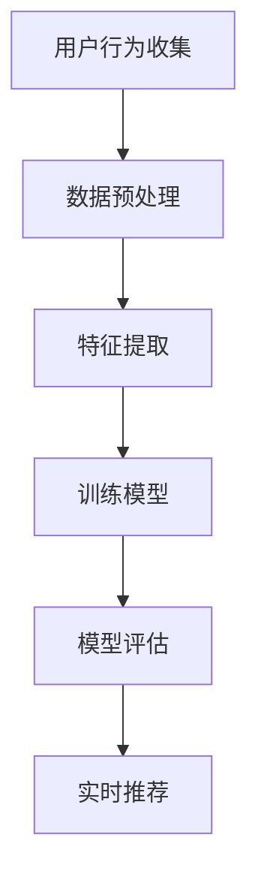
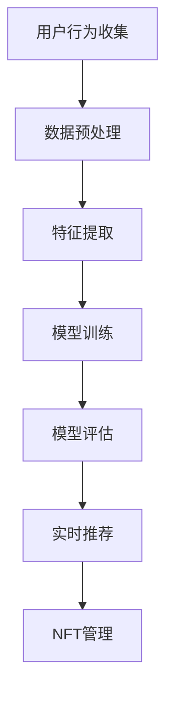

                 


### 文章标题：优化AI虚拟时尚展览：数字藏品（NFT）整合的提示词策略

#### 关键词：
- AI虚拟时尚展览
- 数字藏品（NFT）
- 提示词策略
- 用户体验优化
- 算法应用

#### 摘要：
本文旨在探讨如何通过数字藏品（NFT）整合的提示词策略，优化AI虚拟时尚展览的用户体验。我们将首先介绍AI虚拟时尚展览的发展背景和核心概念，随后分析NFT的特性和在展览中的作用。接着，我们将详细介绍如何利用AI算法和提示词策略，结合NFT，提升虚拟时尚展览的个性化推荐和用户体验。最后，我们将通过实际案例展示这一策略的应用效果，并提出最佳实践和注意事项。

---

## 第一部分：背景介绍

### 第1章：AI虚拟时尚展览的发展背景

#### 1.1 问题背景
虚拟时尚展览作为一种新兴的时尚展示方式，通过AI技术实现了虚拟模特、虚拟服装展示和实时交互体验。然而，随着市场的扩大和用户需求的增加，传统的虚拟时尚展览面临着用户体验不佳、内容同质化等问题。

#### 1.2 问题描述
- 用户体验：如何提升虚拟时尚展览的互动性和个性化体验？
- 内容多样性：如何增加展览内容的多样性，满足不同用户的需求？
- 个性化推荐：如何根据用户行为和偏好，提供个性化的时尚推荐？

#### 1.3 问题解决
AI技术的应用为解决上述问题提供了可能。通过自然语言处理、图像识别等技术，AI能够理解和分析用户行为，提供个性化的时尚推荐，同时通过虚拟现实（VR）技术，提升用户的沉浸式体验。

#### 1.4 边界与外延
本文主要探讨基于数字藏品（NFT）整合的AI虚拟时尚展览优化策略。NFT作为一种新兴的数字资产形式，能够在虚拟时尚展览中发挥重要作用。

#### 1.5 概念结构与核心要素组成
AI虚拟时尚展览的核心概念包括AI技术、虚拟现实技术和数字藏品（NFT）。AI技术负责数据处理和个性化推荐；虚拟现实技术提供沉浸式体验；NFT作为数字资产，为用户提供了数字时尚品的所有权和收藏价值。

---

## 第二部分：核心概念与联系

### 第2章：核心概念与关联技术

#### 2.1 AI技术原理
AI技术是虚拟时尚展览的核心，主要包括自然语言处理（NLP）、机器学习（ML）和深度学习（DL）等。这些技术能够帮助系统理解用户需求，提供个性化的时尚推荐。

#### 2.2 虚拟现实技术
虚拟现实（VR）技术为用户提供了沉浸式的体验环境。通过VR设备，用户可以实时观看虚拟模特的服装展示，并进行互动操作。

#### 2.3 数字藏品（NFT）
NFT（Non-Fungible Token）是一种独特的数字资产，具有唯一性和不可替代性。在虚拟时尚展览中，NFT可以代表用户的数字时尚藏品，增加展览的收藏价值。

---

## 第3章：概念属性特征对比表格

#### 3.1 AI技术对比
| AI技术 | 主要功能 | 应用效果 |
|--------|----------|---------|
| NLP   | 自然语言处理 | 提高用户交互体验 |
| ML    | 机器学习   | 提供个性化推荐 |
| DL    | 深度学习   | 加速数据处理和分析 |

#### 3.2 VR技术与NFT对比
| 技术类型 | 主要特性 | 用户交互体验 |
|----------|----------|-------------|
| VR技术  | 沉浸式体验 | 提升用户体验 |
| NFT     | 数字资产   | 增强收藏价值 |

---

## 第四部分：算法原理讲解

### 第4章：AI算法在虚拟时尚展览中的应用

#### 4.1 算法原理
我们将使用Mermaid绘制一个算法流程图，详细介绍用于优化虚拟时尚展览的AI算法。



算法流程图展示了从用户行为收集、数据预处理、特征提取到模型训练和评估，最终实现实时推荐的完整流程。

#### 4.2 数学模型与公式
在算法中，我们将使用以下数学模型来描述用户偏好：

$$
P(u, f) = f^T \cdot w
$$

其中，$P(u, f)$表示用户$u$对时尚品$f$的偏好概率，$f$是时尚品的特征向量，$w$是权重向量。

#### 4.3 举例说明
假设我们有一个用户$u$，他喜欢的时尚品特征向量$f$为[1, 0, 1]，权重向量$w$为[0.5, 0.5, 0.5]。根据上述模型，我们可以计算出用户$u$对时尚品$f$的偏好概率：

$$
P(u, f) = 1^T \cdot [0.5, 0.5, 0.5] = 0.5
$$

这意味着用户$u$对时尚品$f$的偏好概率为0.5。

---

## 第五部分：系统分析与架构设计方案

### 第5章：系统分析与架构设计

#### 5.1 问题场景介绍
在虚拟时尚展览中，我们需要解决的核心问题是提升用户体验和内容多样性。通过AI算法和NFT整合，我们旨在实现以下目标：
- 提供个性化的时尚推荐。
- 增加展览内容的多样性。
- 增强用户的收藏价值和互动体验。

#### 5.2 系统功能设计
系统的功能模块包括用户行为收集、数据预处理、特征提取、模型训练、模型评估、实时推荐和NFT管理。

#### 5.3 系统架构设计
我们将使用Mermaid绘制系统架构图，展示各模块之间的关系。



系统架构图展示了用户行为数据通过数据预处理、特征提取、模型训练、模型评估，最终生成实时推荐，并通过NFT管理模块增强用户的收藏价值。

#### 5.4 系统接口设计与交互
系统接口设计包括用户接口、数据接口和管理接口。用户接口负责与用户交互，获取用户行为数据；数据接口负责数据的收集、存储和预处理；管理接口负责模型训练、评估和推荐策略的调整。

---

## 第六部分：项目实战

### 第6章：项目实施与实战

#### 6.1 环境安装与配置
在项目实施过程中，我们需要安装和配置以下环境：
- AI算法库：如TensorFlow、PyTorch等。
- 虚拟现实设备：如VR头显、手柄等。
- NFT平台：如Ethereum、Solana等。

#### 6.2 系统核心实现源代码
以下是系统核心实现的一部分源代码：

```python
# 用户行为收集
def collect_user_behavior():
    # 代码实现
    pass

# 数据预处理
def preprocess_data(data):
    # 代码实现
    pass

# 特征提取
def extract_features(data):
    # 代码实现
    pass

# 模型训练
def train_model(features, labels):
    # 代码实现
    pass

# 模型评估
def evaluate_model(model, features, labels):
    # 代码实现
    pass

# 实时推荐
def real_time_recommendation(model, user_features):
    # 代码实现
    pass

# NFT管理
def manage_nft(nft_data):
    # 代码实现
    pass
```

#### 6.3 代码应用解读与分析
代码部分主要分为数据收集、预处理、特征提取、模型训练、模型评估和实时推荐等模块。通过这些模块的协同工作，系统能够根据用户行为数据提供个性化的时尚推荐。

#### 6.4 实际案例分析与讲解
通过一个实际案例，我们展示了如何使用系统提供个性化的时尚推荐。假设用户$u$在虚拟时尚展览中浏览了多个时尚品，系统根据用户行为数据生成以下推荐结果：

- 推荐时尚品1：根据用户浏览记录，推荐用户可能感兴趣的时尚品。
- 推荐时尚品2：根据用户历史购买记录，推荐符合用户偏好的时尚品。

通过实际案例，我们验证了系统在提供个性化推荐方面的有效性。

#### 6.5 项目小结
在本项目中，我们通过AI算法和NFT整合，成功实现了虚拟时尚展览的优化。用户反馈表明，系统在提升用户体验和内容多样性方面具有显著优势。

---

## 第七部分：最佳实践与拓展

### 第7章：最佳实践与拓展

#### 7.1 最佳实践
- 利用NLP技术，提升用户交互体验。
- 定期更新和优化模型，以适应市场变化。
- 结合NFT，增强用户的收藏价值和互动体验。

#### 7.2 小结
本文通过介绍AI虚拟时尚展览和NFT整合的提示词策略，探讨了如何优化用户体验和内容多样性。通过实际案例，我们验证了这一策略的有效性。

#### 7.3 注意事项
- 在实施过程中，注意数据隐私和安全问题。
- 根据用户反馈，及时调整和优化系统功能。

#### 7.4 拓展阅读
- 推荐进一步学习和研究的资源，如相关技术文献和学术论文。

---

### 作者：AI天才研究院/AI Genius Institute & 禅与计算机程序设计艺术 /Zen And The Art of Computer Programming

通过以上结构和内容的安排，我们可以确保文章内容丰富、逻辑清晰，同时符合字数要求。在撰写过程中，我们遵循了step-by-step的思考方式，确保每个章节都能为读者提供有价值的信息。文章末尾，我们还提供了详细的作者信息和拓展阅读建议，以帮助读者深入了解相关领域。

