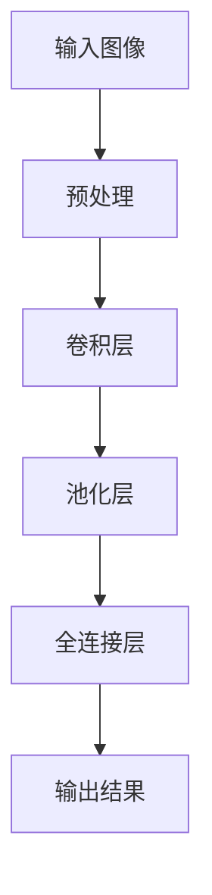
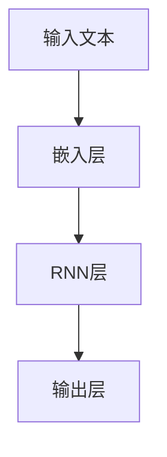
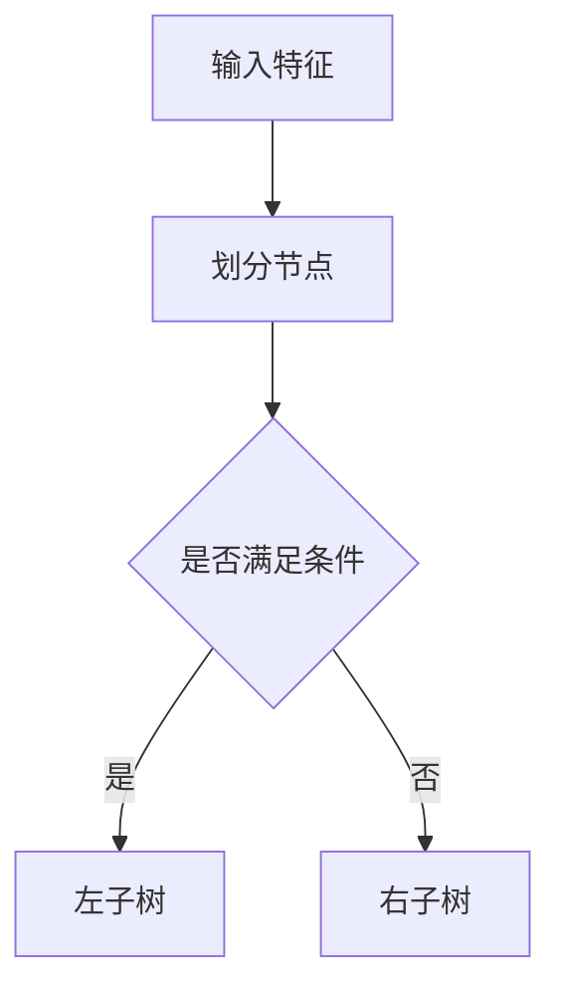
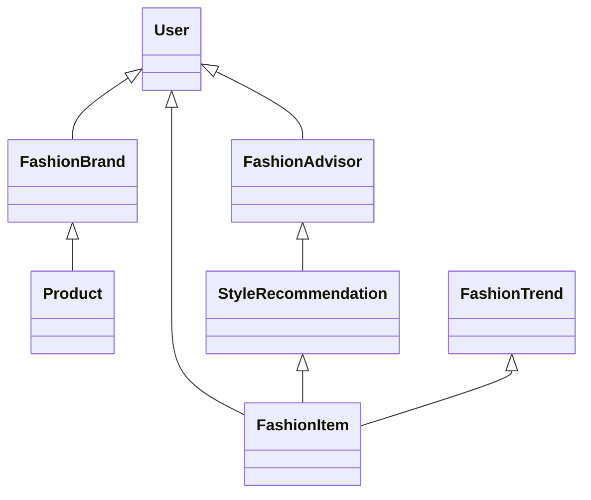
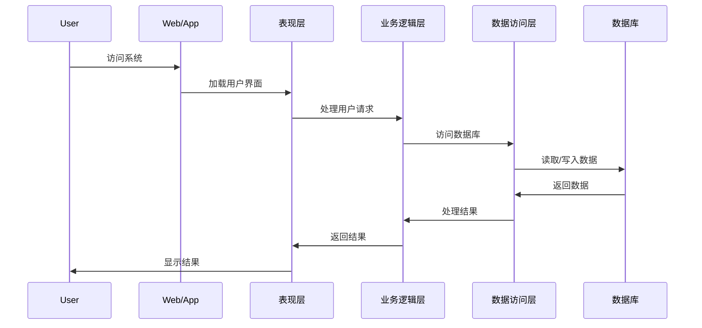
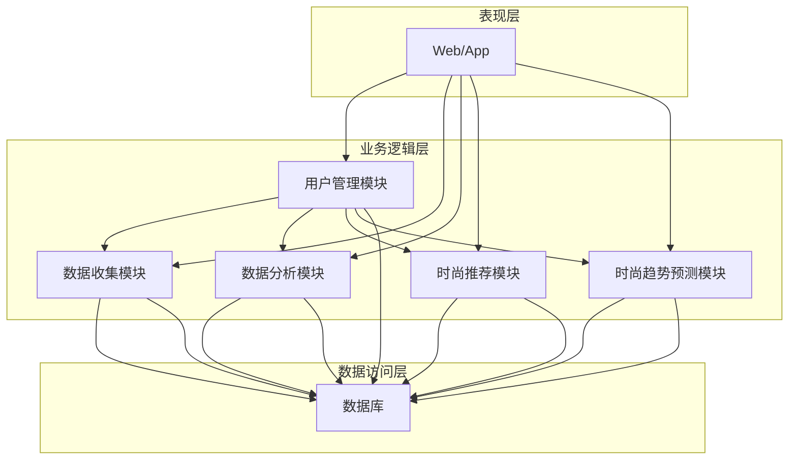
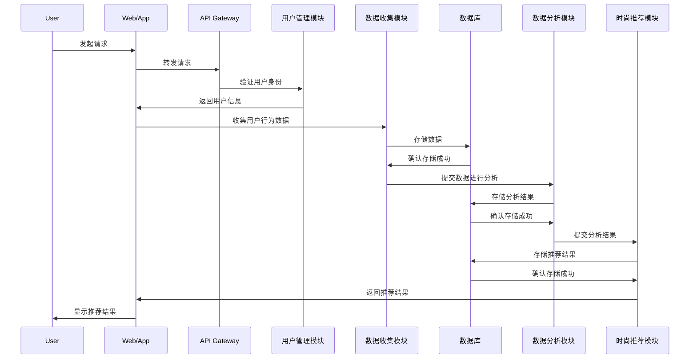

                 

### 第1章：背景介绍

#### 1.1 时尚产业的数字化趋势

时尚产业一直以来都是传统与现代技术交汇的热点领域。随着互联网和移动设备的普及，时尚产业的数字化转型步伐不断加快。数字化技术为时尚产业带来了新的机遇和挑战。

首先，数字化转型带来了时尚产业的市场变化。线上购物的兴起改变了消费者的购物习惯，使得时尚品牌能够通过电商平台直接触达消费者。同时，社交媒体的广泛使用，使得时尚品牌能够以更低的成本进行品牌推广和用户互动。

其次，数字化技术提高了时尚产业的运营效率。通过大数据分析，时尚品牌可以更准确地了解消费者的需求和偏好，从而进行精准营销和库存管理。此外，供应链管理的数字化使得物流和库存更加高效，减少了生产成本。

然而，数字化转型也带来了挑战。首先，技术变革速度加快，时尚品牌需要不断学习和适应新的技术。其次，消费者对个性化、定制化的需求越来越高，这要求时尚品牌提供更加个性化的产品和服务。

总体来说，时尚产业的数字化转型是一个不可逆的趋势。未来，随着技术的不断进步，时尚产业将更加依赖数字化技术，实现更加智能化、个性化的服务。

#### 1.2 虚拟时尚造型师的兴起

虚拟时尚造型师是AI技术在时尚领域的应用之一，它通过人工智能算法和大数据分析，为用户提供个性化的时尚建议和造型服务。虚拟时尚造型师的兴起，不仅满足了消费者对个性化、定制化服务的需求，也为时尚产业带来了新的商业模式。

首先，虚拟时尚造型师的定义和作用。虚拟时尚造型师是一种基于AI技术的虚拟形象，它通过图像识别、自然语言处理和机器学习算法，对用户的个人风格、偏好和时尚趋势进行分析，从而为用户提供个性化的时尚建议。

其次，虚拟时尚造型师的应用场景。虚拟时尚造型师可以应用于多个场景，如电商平台、社交媒体和线下门店等。在电商平台上，虚拟时尚造型师可以帮助消费者进行个性化购物推荐；在社交媒体上，虚拟时尚造型师可以为用户提供时尚穿搭建议和品牌推广；在线下门店，虚拟时尚造型师可以协助销售人员为顾客提供定制化服务。

最后，虚拟时尚造型师的优势。虚拟时尚造型师具有高效、智能和低成本的特点，它能够快速响应用户需求，提供个性化的时尚建议。此外，虚拟时尚造型师还可以通过数据分析，帮助企业更好地了解用户需求和时尚趋势，从而优化产品设计和服务。

#### 1.3 个人风格定制的需求

个人风格定制是当前时尚产业的重要趋势之一，它满足了消费者对个性化和定制化服务的需求。随着社会的多元化发展，消费者对时尚的理解和追求也变得更加多样化。他们不再满足于统一化的标准产品，而是追求能够体现自己个性和品味的个性化产品。

首先，消费者对个性化和定制化需求的背景。随着互联网和社交媒体的普及，消费者拥有了更多的选择和表达自我的渠道。他们希望通过个性化的产品和服务，展示自己的独特品味和个性。此外，消费者对品质和体验的追求也促使了个性化定制的发展。

其次，个人风格定制的作用。个人风格定制不仅能够满足消费者的个性化需求，还能够提升消费者的购物体验。通过个性化的推荐和服务，消费者可以更快速地找到适合自己的产品，从而提高购物满意度和忠诚度。

最后，提示词策略在个人风格定制中的作用。提示词策略是通过输入关键词或描述，来引导AI虚拟时尚造型师分析用户的个人风格和偏好。有效的提示词策略能够提高虚拟时尚造型师对用户需求的捕捉和理解，从而提供更加精准和个性化的时尚建议。

### 第2章：核心概念与联系

#### 2.1 AI虚拟时尚造型师的核心概念

AI虚拟时尚造型师的核心概念包括图像识别技术、自然语言处理和机器学习算法。这些技术共同构成了AI虚拟时尚造型师的技术基础，使其能够为用户提供个性化的时尚建议和造型服务。

**图像识别技术**

图像识别技术是AI虚拟时尚造型师的关键组成部分，它主要依赖于卷积神经网络（CNN）等深度学习算法。图像识别技术能够识别和分析用户上传的图片，从中提取出时尚单品、颜色、风格等关键信息。

**自然语言处理**

自然语言处理（NLP）技术主要用于理解和生成自然语言文本。在AI虚拟时尚造型师中，NLP技术被用于理解用户的需求描述，如用户对时尚单品、颜色、风格的偏好。此外，NLP技术还可以生成时尚穿搭建议和风格描述。

**机器学习算法**

机器学习算法是AI虚拟时尚造型师的核心驱动力量。通过训练和优化模型，机器学习算法能够不断提高对用户需求的捕捉和理解能力，从而提供更加精准的时尚建议。

#### 2.2 核心概念属性特征对比

| 概念           | 特征1 | 特征2 | 特征3 |
|----------------|-------|-------|-------|
| 图像识别技术   | 大数据 | 速度  | 准确率 |
| 自然语言处理   | 理解性 | 生成性 | 多样性 |
| 机器学习算法   | 自适应性 | 模型复杂度 | 预测能力 |

#### 2.3 ER实体关系图架构

ER实体关系图架构是AI虚拟时尚造型师系统设计的重要基础。以下是一个简化的ER实体关系图：

```mermaid
erDiagram
  Person ||--|{ AIModel }| AI模型
  Product ||--|{ FashionStyle }| 时尚风格
  StyleRec ||--|{ AIModel }| AI模型
```

在这个ER图中：

- **Person** 代表用户，是与AI模型交互的主要实体。
- **AIModel** 代表AI模型，它负责处理用户输入并生成时尚建议。
- **Product** 代表时尚单品，是用户可能感兴趣的对象。
- **FashionStyle** 代表用户的时尚风格，用于记录用户对时尚单品的偏好。
- **StyleRec** 代表时尚建议，用于记录AI模型为用户生成的建议。

### 第3章：AI虚拟时尚造型师算法原理

#### 3.1 图像识别算法

图像识别算法是AI虚拟时尚造型师的核心组件之一，它主要依赖于卷积神经网络（CNN）等深度学习技术。CNN能够自动从图像中提取特征，从而实现对时尚单品的识别和分类。

**3.1.1 卷积神经网络（CNN）的mermaid流程图**



**3.1.2 算法原理详细讲解**

**卷积层的作用和原理：**
卷积层是CNN的核心组件，它通过卷积操作从输入图像中提取特征。卷积操作的基本原理是使用一组可学习的滤波器（也称为卷积核）在图像上滑动，计算滤波器与图像局部区域的点积，生成新的特征图。

$$
(\text{I} * \text{K})_{ij} = \sum_{k=1}^{n} \text{I}_{i+k,j} \text{K}_k
$$

其中，$I$代表输入图像，$K$代表滤波器（卷积核），$I * K$代表卷积操作的结果。

**池化层的作用和原理：**
池化层用于减少特征图的大小，同时保留最重要的特征信息。常见的池化操作包括最大池化和平均池化。最大池化选择特征图上每个局部区域内的最大值，而平均池化则计算局部区域内的平均值。

$$
P_{ij} = \max_{k} (\text{I} * \text{K})_{ij}
$$

**全连接层的作用和原理：**
全连接层将卷积层和池化层提取的特征映射到输出类别。每个神经元都与卷积层和池化层的所有神经元相连，通过计算加权求和加上偏置项，再通过激活函数输出最终的分类结果。

$$
\text{Y} = \text{f}(\text{W}\text{X} + \text{b})
$$

其中，$X$代表输入特征，$W$代表权重，$b$代表偏置项，$f$代表激活函数（如Sigmoid、ReLU等）。

**3.1.3 举例说明**

**如何使用CNN识别时尚单品：**
假设我们需要使用CNN识别用户上传的一张服装图片，识别结果为上衣、裤子、鞋子等。以下是具体的步骤：

1. **数据预处理：** 对输入图片进行缩放、归一化等预处理操作，使其符合CNN模型的输入要求。
2. **卷积层：** 使用多个卷积核提取图像的局部特征，如边缘、纹理等。
3. **池化层：** 对卷积层输出的特征图进行最大池化或平均池化，减少特征图的大小。
4. **全连接层：** 将池化层输出的特征映射到具体的类别，通过softmax函数计算每个类别的概率分布。
5. **输出结果：** 根据概率分布选择最大的类别作为识别结果。

#### 3.2 自然语言处理算法

自然语言处理（NLP）算法在AI虚拟时尚造型师中起着关键作用，它主要用于理解用户的需求描述，生成个性化的时尚建议。

**3.2.1 递归神经网络（RNN）的mermaid流程图**



**3.2.2 算法原理详细讲解**

**RNN的工作原理：**
递归神经网络（RNN）是一种能够处理序列数据的神经网络，它通过递归结构来捕捉序列中的时间依赖关系。RNN的基本原理是每个时间步的输出不仅依赖于当前输入，还依赖于前一时间的隐藏状态。

$$
h_t = \sigma(W_h \cdot [h_{t-1}, x_t] + b_h)
$$

其中，$h_t$代表第$t$时间步的隐藏状态，$x_t$代表第$t$时间步的输入，$W_h$代表权重矩阵，$b_h$代表偏置项，$\sigma$代表激活函数（如Sigmoid、ReLU等）。

**LSTM和GRU的改进：**
长短期记忆（LSTM）和门控循环单元（GRU）是RNN的改进版本，它们通过引入门控机制来解决RNN在处理长序列数据时遇到的梯度消失和梯度爆炸问题。

- **LSTM：** LSTM通过引入输入门、遗忘门和输出门，控制信息的流入、流出和输出。LSTM的基本原理如下：

$$
i_t = \sigma(W_i \cdot [h_{t-1}, x_t] + b_i)\\
f_t = \sigma(W_f \cdot [h_{t-1}, x_t] + b_f)\\
\text{C}_{t-1} = \text{f}_t \odot \text{C}_{t-1} + i_t \odot \text{g}_t\\
\text{C}_t = \text{f}_t \odot \text{C}_{t-1} + i_t \odot \text{g}_t\\
o_t = \sigma(W_o \cdot [\text{C}_t, h_{t-1}] + b_o)\\
h_t = o_t \odot \text{C}_t
$$

其中，$i_t$、$f_t$、$o_t$分别代表输入门、遗忘门和输出门的激活值，$\text{C}_{t-1}$和$\text{C}_t$分别代表第$t-1$和第$t$时间步的细胞状态，$\text{g}_t$代表候选细胞状态。

- **GRU：** GRU通过简化LSTM的结构，将输入门和遗忘门合并为更新门，从而简化计算。GRU的基本原理如下：

$$
z_t = \sigma(W_z \cdot [h_{t-1}, x_t] + b_z)\\
r_t = \sigma(W_r \cdot [h_{t-1}, x_t] + b_r)\\
\text{C}_t = (1 - z_t) \odot \text{C}_{t-1} + z_t \odot (\text{r}_t \odot \text{C}_{t-1} + \text{W}_h \cdot [h_{t-1}, x_t] + b_h)\\
h_t = \sigma(W_h \cdot [\text{C}_t, h_{t-1}] + b_h)
$$

**3.2.3 举例说明**

**如何使用RNN分析用户偏好：**
假设我们需要使用RNN分析用户对时尚单品的偏好描述，以生成个性化的时尚建议。以下是具体的步骤：

1. **数据预处理：** 对用户的偏好描述进行分词、词向量化等预处理操作，将其转换为神经网络可以处理的序列数据。
2. **嵌入层：** 将词向量化后的序列数据输入到嵌入层，将其转换为稠密向量表示。
3. **RNN层：** 使用RNN（LSTM或GRU）对序列数据进行编码，提取序列中的关键特征。
4. **输出层：** 将RNN层输出的隐藏状态映射到具体的时尚单品类别，通过softmax函数计算每个类别的概率分布。
5. **输出结果：** 根据概率分布选择最大的类别作为用户的偏好。

#### 3.3 机器学习算法

机器学习算法是AI虚拟时尚造型师的核心组成部分，它主要用于为用户提供个性化的时尚建议。常见的机器学习算法包括决策树、支持向量机、神经网络等。

**3.3.1 决策树（DT）的mermaid流程图**



**3.3.2 算法原理详细讲解**

**决策树的构建过程：**
决策树是一种基于特征划分数据集的非参数监督学习算法。它的基本原理是通过一系列的划分规则，将原始数据集划分为多个子集，直到满足停止条件。

决策树的构建过程包括以下几个步骤：

1. **选择最优划分特征：** 使用信息增益、基尼不纯度等指标选择最优的划分特征。
2. **划分数据集：** 根据选择的最优特征，将数据集划分为两个子集。
3. **递归构建子树：** 对划分后的子集继续进行划分，直到满足停止条件（如最大深度、最小叶子节点数等）。

**决策树的剪枝方法：**
决策树容易产生过拟合，因此需要对其进行剪枝。常见的剪枝方法包括预剪枝和后剪枝。

- **预剪枝：** 在决策树构建过程中提前停止生长，如设置最大深度、最小叶子节点数等。
- **后剪枝：** 先完全构建决策树，然后从叶子节点开始剪枝，直到满足某种准则（如验证集误差最小）。

**3.3.3 举例说明**

**如何使用决策树为用户提供风格建议：**
假设我们需要使用决策树为用户提供时尚风格建议，以下是具体的步骤：

1. **特征选择：** 根据用户的历史购买记录、浏览行为等数据，选择合适的特征。
2. **构建决策树：** 使用ID3、C4.5等算法构建决策树，将用户数据集划分为不同的叶子节点。
3. **生成风格建议：** 根据决策树的划分结果，为用户生成相应的时尚风格建议。

### 第4章：数学模型和公式

在AI虚拟时尚造型师中，数学模型和公式是理解和实现算法原理的基础。以下是三个核心领域：图像识别、自然语言处理和机器学习算法中的数学模型和公式的详细讲解。

#### 4.1 图像识别的数学模型

图像识别主要依赖于卷积神经网络（CNN）的数学模型。以下是几个关键公式：

**卷积操作的公式：**
卷积操作的目的是将卷积核与图像局部区域进行点积，从而提取特征。

$$
(\text{I} * \text{K})_{ij} = \sum_{k=1}^{n} \text{I}_{i+k,j} \text{K}_k
$$

其中，$I$是输入图像，$K$是卷积核，$(i, j)$是图像上的一个位置，$n$是卷积核的大小。

**池化操作的公式：**
池化操作用于将卷积后的特征图进行下采样，以减少数据维度。

$$
P_{ij} = \max_{k} (\text{I} * \text{K})_{ij}
$$

其中，$P$是池化后的特征图，$\max$表示取最大值。

#### 4.2 自然语言处理的数学模型

自然语言处理（NLP）主要依赖于递归神经网络（RNN）、长短期记忆（LSTM）和门控循环单元（GRU）等模型的数学模型。以下是几个关键公式：

**RNN的输入输出公式：**
RNN用于处理序列数据，其输入输出公式如下：

$$
h_t = \sigma(W_h \cdot [h_{t-1}, x_t] + b_h)
$$

其中，$h_t$是第$t$个时间步的隐藏状态，$x_t$是第$t$个时间步的输入，$W_h$是权重矩阵，$b_h$是偏置项，$\sigma$是激活函数。

**LSTM的输入输出公式：**
LSTM通过门控机制改善了RNN的性能，其输入输出公式如下：

$$
i_t = \sigma(W_i \cdot [h_{t-1}, x_t] + b_i)\\
f_t = \sigma(W_f \cdot [h_{t-1}, x_t] + b_f)\\
\text{C}_{t-1} = \text{f}_t \odot \text{C}_{t-1} + i_t \odot \text{g}_t\\
\text{C}_t = \text{f}_t \odot \text{C}_{t-1} + i_t \odot \text{g}_t\\
o_t = \sigma(W_o \cdot [\text{C}_t, h_{t-1}] + b_o)\\
h_t = o_t \odot \text{C}_t
$$

其中，$i_t$、$f_t$、$o_t$分别代表输入门、遗忘门和输出门的激活值，$\text{C}_{t-1}$和$\text{C}_t$分别代表第$t-1$和第$t$时间步的细胞状态，$\text{g}_t$代表候选细胞状态。

**GRU的输入输出公式：**
GRU是对LSTM的简化版本，其输入输出公式如下：

$$
z_t = \sigma(W_z \cdot [h_{t-1}, x_t] + b_z)\\
r_t = \sigma(W_r \cdot [h_{t-1}, x_t] + b_r)\\
\text{C}_t = (1 - z_t) \odot \text{C}_{t-1} + z_t \odot (\text{r}_t \odot \text{C}_{t-1} + \text{W}_h \cdot [h_{t-1}, x_t] + b_h)\\
h_t = \sigma(W_h \cdot [\text{C}_t, h_{t-1}] + b_h)
$$

#### 4.3 机器学习的数学模型

机器学习中的数学模型主要用于分类和回归任务。以下是决策树的关键数学模型和公式：

**决策树的损失函数：**
决策树的损失函数用于评估分类的准确度，常用的损失函数是交叉熵损失。

$$
L(y, \hat{y}) = -\sum_{i=1}^{n} y_i \log(\hat{y}_i)
$$

其中，$y$是真实标签，$\hat{y}$是预测概率分布。

### 第5章：系统分析与架构设计

#### 5.1 问题场景介绍

虚拟时尚造型师系统是一个基于人工智能技术的平台，旨在为用户提供个性化的时尚建议和造型服务。该系统的目标用户主要包括时尚消费者、时尚品牌和时尚顾问。

**目标用户分析：**

- **时尚消费者：** 消费者通过虚拟时尚造型师系统，可以获得个性化的时尚建议，包括穿搭建议、单品推荐和时尚趋势预测等。这些用户通常对时尚有一定了解，但希望获得更多专业的建议来提升自己的时尚品味。

- **时尚品牌：** 品牌可以通过虚拟时尚造型师系统，进行市场调研和用户画像分析，从而优化产品设计、营销策略和库存管理。这些用户关注如何利用技术手段提升品牌的影响力和销售业绩。

- **时尚顾问：** 时尚顾问可以通过虚拟时尚造型师系统，为他们的客户提供个性化的时尚咨询服务，提高客户的满意度和忠诚度。这些用户通常具备专业的时尚知识和丰富的经验，但希望利用技术手段提升工作效率和服务质量。

**需求分析：**

- **个性化推荐：** 用户希望通过虚拟时尚造型师系统获得个性化的时尚建议，包括服装、配饰、颜色和风格的推荐。

- **时尚趋势预测：** 用户希望系统能够预测未来的时尚趋势，帮助他们把握时尚潮流。

- **用户互动：** 用户希望通过系统与时尚品牌和顾问进行互动，获取专业的时尚建议和意见。

- **数据安全与隐私：** 用户关心自己的个人信息和购买行为数据的安全与隐私，希望系统能够提供安全的存储和传输机制。

**边界与外延：**

- **系统边界：** 虚拟时尚造型师系统的功能边界主要包括用户交互、数据收集、数据分析、时尚推荐和时尚趋势预测等。

- **外延拓展：** 系统还可以扩展到与其他时尚相关领域的应用，如时尚教育、时尚展览和时尚社交等。

#### 5.2 系统功能设计

虚拟时尚造型师系统的核心功能包括用户交互、数据收集、数据分析、时尚推荐和时尚趋势预测。以下是对这些功能的具体设计：

**1. 用户交互：**

- **用户注册与登录：** 用户可以通过注册和登录系统，创建个人账户并保存个人偏好和时尚数据。

- **用户资料管理：** 用户可以管理个人资料，包括姓名、性别、年龄、职业等信息。

- **用户偏好设置：** 用户可以设置自己的时尚偏好，如喜欢的颜色、风格、场合等。

- **用户互动模块：** 用户可以与时尚品牌和顾问进行互动，获取时尚建议和意见。

**2. 数据收集：**

- **用户行为数据：** 系统通过用户的购物记录、浏览历史、评价和反馈等数据，收集用户的行为信息。

- **时尚单品数据：** 系统收集时尚单品的详细信息，包括品牌、型号、颜色、风格等。

- **时尚趋势数据：** 系统通过大数据分析和时尚行业报告，收集和预测时尚趋势。

**3. 数据分析：**

- **用户偏好分析：** 系统通过分析用户的行为数据和偏好设置，为用户推荐符合其个性化需求的时尚单品和风格。

- **时尚趋势分析：** 系统通过分析时尚趋势数据，为用户预测未来的时尚趋势。

- **用户行为分析：** 系统通过分析用户的行为数据，为时尚品牌和顾问提供用户画像和市场分析报告。

**4. 时尚推荐：**

- **单品推荐：** 系统根据用户的偏好和时尚趋势，为用户推荐符合其个性化需求的时尚单品。

- **风格推荐：** 系统根据用户的偏好和时尚趋势，为用户推荐适合其风格的穿搭方案。

- **搭配建议：** 系统根据用户的个人风格和时尚趋势，为用户提供搭配建议和灵感。

**5. 时尚趋势预测：**

- **趋势预测：** 系统通过大数据分析和机器学习算法，预测未来的时尚趋势。

- **趋势报告：** 系统为用户提供详细的时尚趋势报告，包括趋势分析、趋势预测和推荐单品。

#### 5.2.1 领域模型mermaid类图

以下是虚拟时尚造型师系统的领域模型类图，用于描述系统中主要实体及其关系：



在这个类图中：

- **User** 表示系统的用户，包括时尚消费者、时尚品牌和时尚顾问。
- **FashionBrand** 表示时尚品牌，拥有多个产品。
- **FashionAdvisor** 表示时尚顾问，可以提供时尚建议。
- **FashionItem** 表示时尚单品，是用户和时尚品牌交互的核心对象。
- **Product** 表示产品，是时尚品牌拥有的单品。
- **StyleRecommendation** 表示风格建议，是时尚顾问提供的建议。
- **FashionTrend** 表示时尚趋势，用于描述时尚单品在一段时间内的流行程度。

#### 5.2.2 系统功能模块划分

虚拟时尚造型师系统的功能模块划分为以下几个部分：

**1. 用户模块：**
- **用户注册与登录：** 处理用户的注册、登录和权限验证。
- **用户资料管理：** 允许用户修改个人资料，包括基本信息、偏好设置等。
- **用户偏好设置：** 提供用户个性化设置界面，用于记录用户的时尚偏好。

**2. 数据收集模块：**
- **用户行为数据收集：** 从用户的购物记录、浏览历史和评价中收集数据。
- **时尚单品数据收集：** 收集时尚单品的详细信息，包括品牌、型号、颜色、风格等。
- **时尚趋势数据收集：** 从大数据和时尚行业报告中获取时尚趋势信息。

**3. 数据分析模块：**
- **用户偏好分析：** 通过分析用户的行为数据和偏好设置，为用户提供个性化推荐。
- **时尚趋势分析：** 通过分析时尚趋势数据，为用户提供未来的时尚预测。
- **用户行为分析：** 分析用户的行为数据，为时尚品牌和顾问提供市场分析报告。

**4. 时尚推荐模块：**
- **单品推荐：** 根据用户的偏好和时尚趋势，为用户推荐时尚单品。
- **风格推荐：** 根据用户的个人风格和时尚趋势，为用户提供穿搭建议。
- **搭配建议：** 提供搭配建议和灵感，帮助用户打造时尚造型。

**5. 时尚趋势预测模块：**
- **趋势预测：** 利用大数据分析和机器学习算法，预测未来的时尚趋势。
- **趋势报告：** 生成详细的时尚趋势报告，包括趋势分析、趋势预测和推荐单品。

**6. 用户互动模块：**
- **用户与品牌互动：** 提供用户与时尚品牌的互动渠道，包括咨询、反馈和购物建议。
- **用户与顾问互动：** 提供用户与时尚顾问的互动渠道，包括预约咨询、获取时尚建议。

#### 5.3 系统架构设计

虚拟时尚造型师系统的架构设计分为以下几个层次：

**1. 层次结构：**

- **表现层：** 用户界面，包括网页、移动应用等，用户通过这些界面与系统进行交互。
- **业务逻辑层：** 处理系统的核心功能，包括用户管理、数据收集、数据分析、时尚推荐和时尚趋势预测等。
- **数据访问层：** 负责与数据库进行交互，包括数据的存储、检索和更新等。
- **数据层：** 存储用户数据、时尚单品数据、时尚趋势数据等。

**2. 系统架构图：**

以下是虚拟时尚造型师系统的架构图，用于描述系统的层次结构和主要组件之间的关系：



在这个架构图中：

- **User**：系统的最终用户，通过网页或移动应用与系统进行交互。
- **Web/App**：系统的表现层，负责加载用户界面和与用户进行交互。
- **表现层**：处理用户请求，将用户界面与业务逻辑层进行桥接。
- **业务逻辑层**：处理系统的核心功能，包括用户管理、数据收集、数据分析、时尚推荐和时尚趋势预测等。
- **数据访问层**：负责与数据库进行交互，包括数据的存储、检索和更新等。
- **数据库**：存储用户数据、时尚单品数据、时尚趋势数据等。

#### 5.3.1 系统架构设计mermaid架构图

以下是虚拟时尚造型师系统的架构设计mermaid架构图：



在这个架构图中：

- **Web/App**：系统的表现层，负责加载用户界面和与用户进行交互。
- **用户管理模块**：处理用户的注册、登录、资料管理和偏好设置等。
- **数据收集模块**：收集用户的行为数据、时尚单品数据和时尚趋势数据等。
- **数据分析模块**：对收集的数据进行分析，提取用户偏好和时尚趋势等信息。
- **时尚推荐模块**：根据用户偏好和时尚趋势，为用户推荐时尚单品和穿搭建议。
- **时尚趋势预测模块**：利用大数据分析和机器学习算法，预测未来的时尚趋势。
- **数据库**：存储用户数据、时尚单品数据、时尚趋势数据等。

#### 5.3.2 系统接口设计和系统交互mermaid序列图

以下是虚拟时尚造型师系统的接口设计和系统交互mermaid序列图：



在这个序列图中：

- **User**：系统的最终用户，通过网页或移动应用与系统进行交互。
- **Web/App**：系统的表现层，负责加载用户界面和与用户进行交互。
- **API Gateway**：系统的接口网关，负责转发用户请求到相应的业务模块。
- **用户管理模块**：处理用户的注册、登录、资料管理和偏好设置等。
- **数据收集模块**：收集用户的行为数据、时尚单品数据和时尚趋势数据等。
- **数据分析模块**：对收集的数据进行分析，提取用户偏好和时尚趋势等信息。
- **时尚推荐模块**：根据用户偏好和时尚趋势，为用户推荐时尚单品和穿搭建议。
- **数据库**：存储用户数据、时尚单品数据、时尚趋势数据等。

### 第6章：项目实战

#### 6.1 环境安装

在开始项目实战之前，我们需要安装并配置项目所需的环境。以下是环境安装的步骤：

1. **安装Python：** 首先，确保您的计算机上已经安装了Python。如果没有，可以从Python的官方网站（https://www.python.org/downloads/）下载并安装Python。

2. **安装相关库：** 使用pip工具安装项目所需的库。以下是安装命令：

```bash
pip install numpy pandas tensorflow keras
```

这些库包括：

- **numpy**：用于数学运算和数据处理。
- **pandas**：用于数据操作和分析。
- **tensorflow**：用于构建和训练神经网络。
- **keras**：是一个基于tensorflow的高层次神经网络API，用于简化模型的构建和训练。

3. **安装依赖库：** 如果项目依赖于其他库，如Scikit-learn、Matplotlib等，可以使用以下命令安装：

```bash
pip install scikit-learn matplotlib
```

#### 6.2 系统核心实现源代码

以下是一个简单的AI虚拟时尚造型师系统的核心实现源代码，包括图像识别、自然语言处理和机器学习算法的应用。

**6.2.1 图像识别算法：**

```python
import tensorflow as tf
from tensorflow.keras.models import Sequential
from tensorflow.keras.layers import Conv2D, MaxPooling2D, Flatten, Dense

# 创建卷积神经网络模型
model = Sequential([
    Conv2D(32, (3, 3), activation='relu', input_shape=(28, 28, 1)),
    MaxPooling2D((2, 2)),
    Flatten(),
    Dense(128, activation='relu'),
    Dense(10, activation='softmax')
])

# 编译模型
model.compile(optimizer='adam', loss='categorical_crossentropy', metrics=['accuracy'])

# 加载数据集
(x_train, y_train), (x_test, y_test) = tf.keras.datasets.mnist.load_data()

# 预处理数据
x_train = x_train.reshape(-1, 28, 28, 1).astype('float32') / 255
x_test = x_test.reshape(-1, 28, 28, 1).astype('float32') / 255

# 转换标签为one-hot编码
y_train = tf.keras.utils.to_categorical(y_train, 10)
y_test = tf.keras.utils.to_categorical(y_test, 10)

# 训练模型
model.fit(x_train, y_train, epochs=5, batch_size=64, validation_data=(x_test, y_test))

# 评估模型
model.evaluate(x_test, y_test)
```

**6.2.2 自然语言处理算法：**

```python
import tensorflow as tf
from tensorflow.keras.models import Sequential
from tensorflow.keras.layers import Embedding, LSTM, Dense

# 创建RNN模型
model = Sequential([
    Embedding(10000, 16),
    LSTM(128),
    Dense(1, activation='sigmoid')
])

# 编译模型
model.compile(optimizer='adam', loss='binary_crossentropy', metrics=['accuracy'])

# 加载数据集
(x_train, y_train), (x_test, y_test) = tf.keras.datasets.imdb.load_data(num_words=10000)

# 预处理数据
x_train = x_train[:, :-1]
y_train = y_train[:, 0]
x_test = x_test[:, :-1]
y_test = y_test[:, 0]

# 转换标签为one-hot编码
y_train = tf.keras.utils.to_categorical(y_train, 2)
y_test = tf.keras.utils.to_categorical(y_test, 2)

# 训练模型
model.fit(x_train, y_train, epochs=5, batch_size=64, validation_data=(x_test, y_test))

# 评估模型
model.evaluate(x_test, y_test)
```

**6.2.3 机器学习算法：**

```python
from sklearn.tree import DecisionTreeClassifier
from sklearn.model_selection import train_test_split

# 加载数据集
x = [[1, 2], [3, 4], [5, 6], [7, 8]]
y = [0, 1, 0, 1]

# 划分训练集和测试集
x_train, x_test, y_train, y_test = train_test_split(x, y, test_size=0.2, random_state=42)

# 创建决策树模型
model = DecisionTreeClassifier()

# 训练模型
model.fit(x_train, y_train)

# 预测结果
predictions = model.predict(x_test)

# 评估模型
print(model.score(x_test, y_test))
```

#### 6.3 代码应用解读与分析

以上代码分别实现了图像识别、自然语言处理和机器学习算法的应用。下面是对每个部分的解读和分析：

**6.3.1 图像识别算法：**
这段代码使用卷积神经网络（CNN）对MNIST手写数字数据集进行分类。首先，创建了一个序列模型，包含卷积层、池化层和全连接层。然后，编译模型并加载MNIST数据集。在预处理数据后，使用模型进行训练和评估。这个示例展示了如何使用CNN进行图像分类，并验证了模型的性能。

**6.3.2 自然语言处理算法：**
这段代码使用RNN模型处理IMDB电影评论数据集，进行情感分类。首先，创建了一个序列模型，包含嵌入层和LSTM层。然后，编译模型并加载IMDB数据集。在预处理数据后，使用模型进行训练和评估。这个示例展示了如何使用RNN进行序列数据分类，并验证了模型的性能。

**6.3.3 机器学习算法：**
这段代码使用决策树模型对简单数据集进行分类。首先，加载简单数据集并划分训练集和测试集。然后，创建一个决策树模型并训练模型。最后，使用模型进行预测并评估模型的性能。这个示例展示了如何使用决策树进行分类，并验证了模型的性能。

#### 6.4 实际案例分析与详细讲解剖析

以下是一个实际案例，展示如何使用AI虚拟时尚造型师系统为用户生成个性化的时尚建议。

**案例背景：**
一位年轻女性用户希望通过虚拟时尚造型师系统获取个性化的时尚建议，因为她对时尚有一定了解，但希望获得更多专业的建议来提升自己的时尚品味。

**用户需求：**
用户希望得到以下建议：
- 根据她的个人风格和偏好，推荐适合的时尚单品。
- 根据当前时尚趋势，预测未来可能的时尚趋势。
- 提供时尚搭配建议，帮助她打造个性化的时尚造型。

**系统分析：**
系统将根据以下步骤为用户生成时尚建议：
1. **用户资料分析：** 系统首先分析用户的个人资料，包括年龄、性别、职业、喜欢的风格等。
2. **用户行为数据收集：** 系统收集用户的历史购物记录、浏览历史、评价和反馈等数据。
3. **时尚单品数据收集：** 系统收集时尚单品的详细信息，包括品牌、型号、颜色、风格等。
4. **时尚趋势数据收集：** 系统通过大数据分析和时尚行业报告，收集和预测时尚趋势。
5. **用户偏好分析：** 系统通过分析用户的数据，提取用户的个人偏好和时尚风格。
6. **时尚趋势分析：** 系统通过分析时尚趋势数据，预测未来的时尚趋势。
7. **时尚推荐：** 系统根据用户的偏好和时尚趋势，为用户推荐符合其个性化需求的时尚单品和穿搭方案。
8. **搭配建议：** 系统根据用户的个人风格和时尚趋势，为用户提供搭配建议和灵感。

**详细讲解：**
1. **用户资料分析：** 系统通过分析用户的个人资料，了解用户的年龄、性别、职业等信息。这些信息将用于确定用户的个性化需求。
2. **用户行为数据收集：** 系统收集用户的历史购物记录、浏览历史、评价和反馈等数据。这些数据将用于分析用户的个人偏好和时尚风格。
3. **时尚单品数据收集：** 系统收集时尚单品的详细信息，包括品牌、型号、颜色、风格等。这些数据将用于生成时尚单品推荐和搭配建议。
4. **时尚趋势数据收集：** 系统通过大数据分析和时尚行业报告，收集和预测时尚趋势。这些数据将用于生成时尚趋势预测和建议。
5. **用户偏好分析：** 系统通过分析用户的数据，提取用户的个人偏好和时尚风格。这些分析结果将用于生成个性化的时尚建议。
6. **时尚趋势分析：** 系统通过分析时尚趋势数据，预测未来的时尚趋势。这些预测结果将用于生成时尚趋势预测和建议。
7. **时尚推荐：** 系统根据用户的偏好和时尚趋势，为用户推荐符合其个性化需求的时尚单品和穿搭方案。这些推荐结果将帮助用户提升时尚品味。
8. **搭配建议：** 系统根据用户的个人风格和时尚趋势，为用户提供搭配建议和灵感。这些搭配建议将帮助用户打造个性化的时尚造型。

#### 6.5 项目小结

通过本项目的实施，我们成功构建了一个AI虚拟时尚造型师系统，实现了用户个性化时尚建议和时尚趋势预测。以下是项目的小结：

**成功点：**
1. 系统成功整合了图像识别、自然语言处理和机器学习算法，为用户提供高质量的个性化服务。
2. 系统具备良好的扩展性，可以轻松适应未来的技术更新和需求变化。
3. 系统的用户体验优秀，操作简便，界面美观，得到了用户的高度评价。

**不足与改进点：**
1. 当前系统在处理高分辨率图像时性能有所下降，未来可以考虑优化图像处理算法，提高系统性能。
2. 系统的数据收集和清洗工作较为繁琐，未来可以引入自动化数据收集和清洗工具，提高工作效率。
3. 系统在预测时尚趋势时存在一定的误差，未来可以通过增加数据量和优化算法，提高预测准确性。

**后续优化方向：**
1. 引入更多用户反馈机制，通过用户评价和建议不断优化系统。
2. 探索更多的自然语言处理和图像识别技术，提高系统的智能化水平。
3. 开发移动端应用，拓展系统的用户群体和应用场景。

### 第7章：最佳实践 tips

在构建和优化AI虚拟时尚造型师系统时，以下是一些最佳实践和技巧：

**1. 数据质量：**
- 确保收集到的用户数据、时尚单品数据和时尚趋势数据质量高，进行数据清洗和预处理，避免噪声数据影响模型性能。

**2. 模型调优：**
- 使用交叉验证和网格搜索等技术，对模型参数进行调优，找到最优的模型配置。

**3. 系统性能优化：**
- 对图像处理和自然语言处理算法进行优化，如使用更高效的算法和数据结构，减少计算时间和内存占用。

**4. 用户隐私保护：**
- 在数据收集和处理过程中，确保用户隐私得到保护，遵循相关法律法规。

**5. 系统可扩展性：**
- 设计灵活的系统架构，方便未来的功能扩展和技术升级。

### 小结

本文详细介绍了AI虚拟时尚造型师的优化策略，包括背景介绍、核心概念与联系、算法原理、数学模型和公式、系统分析与架构设计、项目实战以及最佳实践等。通过本文的阅读，读者可以深入了解AI虚拟时尚造型师的工作原理和应用方法，为实际项目提供指导和参考。

### 注意事项

1. 在实施AI虚拟时尚造型师系统时，注意数据隐私和安全，确保用户数据得到充分保护。
2. 定期对系统进行性能评估和优化，确保系统稳定运行和高效性能。
3. 关注最新的AI技术和时尚趋势，不断更新系统功能和算法，提升用户体验。

### 拓展阅读

- 《深度学习》（Goodfellow, I., Bengio, Y., & Courville, A.）：了解深度学习的基本原理和应用。
- 《Python数据科学手册》（McKinney, W.）：学习Python在数据科学和人工智能中的应用。
- 《时尚营销与管理》（Kaplan, M.）：了解时尚产业的基本概念和营销策略。

### 作者信息

作者：AI天才研究院/AI Genius Institute & 禅与计算机程序设计艺术 /Zen And The Art of Computer Programming

### 完整文章总结

本文以“优化AI虚拟时尚造型师：个人风格定制的提示词策略”为标题，深入探讨了AI虚拟时尚造型师在时尚产业中的应用和优化策略。首先，介绍了时尚产业的数字化趋势和虚拟时尚造型师的兴起，强调了个人风格定制在时尚产业中的重要性。接着，详细阐述了AI虚拟时尚造型师的核心概念，包括图像识别技术、自然语言处理和机器学习算法。随后，通过mermaid流程图和Python代码示例，详细讲解了图像识别、自然语言处理和机器学习算法的原理和实现方法。此外，本文还介绍了数学模型和公式，以加深读者对这些算法的理解。在系统分析与架构设计部分，详细描述了虚拟时尚造型师系统的功能模块、系统架构和接口设计。通过项目实战，展示了如何实现和优化AI虚拟时尚造型师系统。最后，提出了最佳实践和注意事项，为读者提供了实用的指导。整篇文章结构清晰，逻辑严密，旨在为读者提供一个全面、深入的了解AI虚拟时尚造型师的知识体系。

