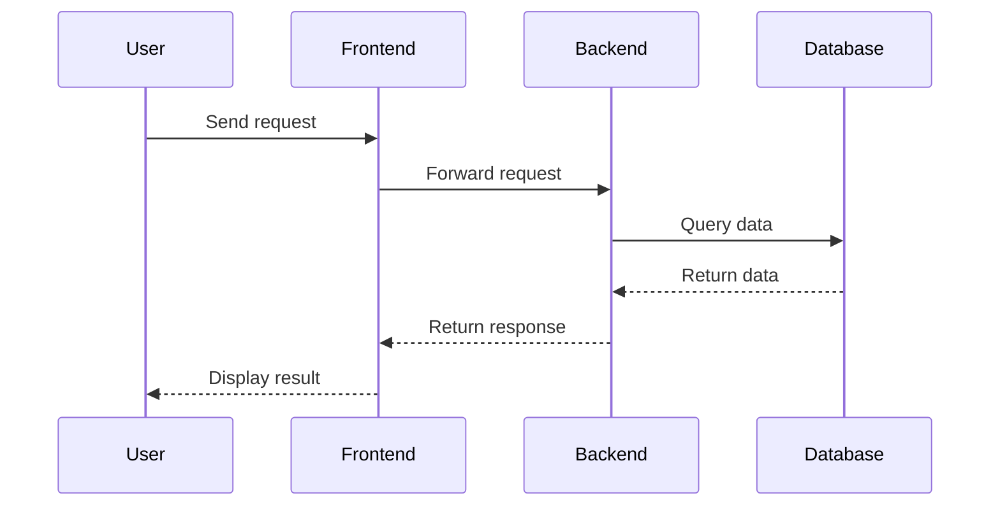

                 


### 第一部分：背景介绍

#### 1.1 问题背景

随着科技的发展，时尚产业也在不断进行数字化转型。传统时装秀由于受时间和空间的限制，已经无法满足市场需求。而虚拟时装秀作为一种新兴的展示形式，因其不受时空限制、可重复展示和精准营销等优势，逐渐受到业界的关注。

##### 1.1.1 时尚产业的数字化趋势

近年来，互联网、大数据、人工智能等技术的飞速发展，使得时尚产业正迎来前所未有的数字化革命。线上购物、社交电商、数字营销等新兴业态不断涌现，传统时尚产业链被重新定义和重构。

###### 1.1.1.1 时尚产业的数字化趋势

1. **线上购物**：消费者越来越倾向于在线上购买商品，电商平台成为时尚产业的重要组成部分。
2. **社交电商**：通过社交媒体平台进行商品推广和销售，成为时尚产业的新兴渠道。
3. **数字营销**：运用大数据分析消费者行为，实现精准营销和个性化推荐。

##### 1.1.1.2 传统时装秀的局限性

1. **时间和空间的限制**：传统时装秀需要现场搭建，受时间和空间的限制，难以满足全球消费者同步观看的需求。
2. **成本高昂**：传统时装秀需要大量人力、物力和财力投入，运营成本较高。
3. **无法重复展示**：传统时装秀一旦结束，就无法再次观看，缺乏可重复展示的价值。

##### 1.1.1.3 虚拟时装秀的需求与机遇

虚拟时装秀的出现，为时尚产业提供了新的发展机遇。虚拟时装秀具有以下优势：

1. **不受时空限制**：虚拟时装秀可以在全球范围内同步展示，打破时间和空间的限制。
2. **低成本**：虚拟时装秀无需现场搭建，节约了大量人力、物力和财力投入。
3. **可重复展示**：虚拟时装秀可以多次重复播放，具有持续的价值。

#### 1.2 AI虚拟时装秀的概念与优势

##### 1.2.1 AI虚拟时装秀的定义

AI虚拟时装秀是一种利用人工智能技术，实现虚拟模特、服装展示、场景渲染等环节的时装秀。通过虚拟现实技术，观众可以在虚拟环境中观看时装秀，获得沉浸式的观感体验。

##### 1.2.2 AI虚拟时装秀的优势

1. **沉浸式体验**：观众可以在虚拟环境中与虚拟模特互动，获得沉浸式的观感体验。
2. **个性化推荐**：通过人工智能技术，对观众的行为进行分析，实现个性化推荐。
3. **实时互动**：观众可以在虚拟环境中与虚拟模特实时互动，提问、点赞等。

##### 1.2.3 动态展示效果的重要性

动态展示效果是AI虚拟时装秀的核心之一，它决定了观众的观感体验。动态展示效果包括服装的动态展示、虚拟模特的动作、表情等。一个优秀的动态展示效果，可以极大地提升观众的观看体验，从而提高品牌的知名度。

#### 1.3 问题描述

在AI虚拟时装秀中，动态展示效果的处理是一个重要且具有挑战性的问题。本文将围绕动态展示效果的优化，探讨提示词策略在其中的应用。

##### 1.3.1 动态展示效果的定义与要求

动态展示效果是指在虚拟环境中，对服装、模特等元素的展示效果进行实时动态调整。其主要要求包括：

1. **实时性**：动态展示效果需要实时响应观众的操作和反馈。
2. **多样性**：动态展示效果需要丰富多样，以满足不同观众的喜好。
3. **沉浸感**：动态展示效果需要具有强烈的沉浸感，提升观众的观感体验。

##### 1.3.2 动态展示效果的挑战

1. **计算资源消耗**：动态展示效果的处理需要大量的计算资源，对服务器和网络带宽提出了较高的要求。
2. **实时性挑战**：如何在保证动态展示效果的同时，确保实时性，是一个亟待解决的问题。
3. **多样性挑战**：如何设计出丰富多样的动态展示效果，以满足不同观众的喜好，是一个具有挑战性的问题。

#### 1.4 问题解决

本文将从提示词策略的角度，探讨如何优化AI虚拟时装秀的动态展示效果。

##### 1.4.1 提示词策略的概念与作用

提示词策略是指通过预设一系列关键词，引导系统根据这些关键词生成动态展示效果。提示词策略的作用包括：

1. **提高实时性**：通过提示词策略，可以预先准备好一系列动态展示效果，从而提高系统的实时性。
2. **丰富多样性**：通过提示词策略，可以生成丰富多样的动态展示效果，满足不同观众的喜好。
3. **降低计算资源消耗**：通过提示词策略，可以减少实时计算的需求，从而降低计算资源的消耗。

##### 1.4.2 提示词策略的分类

提示词策略可以分为以下几类：

1. **基于规则**：通过预设一系列规则，根据观众的操作和反馈，动态调整动态展示效果。
2. **基于机器学习**：通过机器学习算法，根据观众的行为数据，自动生成动态展示效果。
3. **混合策略**：将基于规则和基于机器学习的策略相结合，实现更高效的动态展示效果生成。

##### 1.4.3 边界与外延

在实现动态展示效果的提示词策略时，需要考虑以下边界与外延：

1. **实现技术**：包括3D建模与渲染、人工智能技术、虚拟现实技术等。
2. **应用场景**：包括时尚产业、虚拟时装秀以及其他领域。

##### 1.4.4 概念结构与核心要素组成

动态展示效果的优化涉及多个核心要素，包括虚拟时装秀、动态展示效果、提示词策略、3D建模与渲染、人工智能技术、虚拟现实技术等。这些要素相互关联，共同构成了动态展示效果的优化体系。

#### 1.5 本章小结

本节介绍了AI虚拟时装秀的背景、概念与优势，以及动态展示效果的定义与要求。同时，探讨了提示词策略在动态展示效果优化中的应用，为后续章节的详细探讨奠定了基础。

----------------------------------------------------------------

### 第二部分：核心概念与联系

#### 2.1 虚拟时装秀

虚拟时装秀是一种通过计算机技术模拟出的虚拟场景，用于展示服装、化妆品等产品的时装秀。与传统的实体时装秀相比，虚拟时装秀具有不受时空限制、成本低、可重复展示等优势。

##### 虚拟时装秀的定义

虚拟时装秀是一种通过计算机技术模拟出的虚拟场景，用于展示服装、化妆品等产品的时装秀。它利用虚拟现实、人工智能等技术，实现虚拟模特、服装展示、场景渲染等环节。

##### 虚拟时装秀的优势

1. **不受时空限制**：虚拟时装秀可以在全球范围内同步展示，不受时间和空间的限制。
2. **低成本**：虚拟时装秀无需现场搭建，节约了大量人力、物力和财力投入。
3. **可重复展示**：虚拟时装秀可以多次重复播放，具有持续的价值。
4. **沉浸式体验**：虚拟时装秀可以提供沉浸式的体验，观众可以在虚拟环境中与虚拟模特互动。

#### 2.2 动态展示效果

动态展示效果是指在虚拟环境中，对服装、模特等元素的展示效果进行实时动态调整。它是虚拟时装秀的核心之一，决定了观众的观感体验。

##### 动态展示效果的定义

动态展示效果是指在虚拟环境中，对服装、模特等元素的展示效果进行实时动态调整。它包括服装的动态展示、虚拟模特的动作、表情等。

##### 动态展示效果的要求

1. **实时性**：动态展示效果需要实时响应观众的操作和反馈。
2. **多样性**：动态展示效果需要丰富多样，以满足不同观众的喜好。
3. **沉浸感**：动态展示效果需要具有强烈的沉浸感，提升观众的观感体验。

#### 2.3 提示词策略

提示词策略是通过预设一系列关键词，引导系统根据这些关键词生成动态展示效果的方法。它是优化动态展示效果的重要手段。

##### 提示词策略的定义

提示词策略是通过预设一系列关键词，引导系统根据这些关键词生成动态展示效果的方法。这些关键词可以是动作、表情、场景等。

##### 提示词策略的作用

1. **提高实时性**：通过提示词策略，可以预先准备好一系列动态展示效果，从而提高系统的实时性。
2. **丰富多样性**：通过提示词策略，可以生成丰富多样的动态展示效果，满足不同观众的喜好。
3. **降低计算资源消耗**：通过提示词策略，可以减少实时计算的需求，从而降低计算资源的消耗。

#### 2.4 3D建模与渲染

3D建模与渲染是虚拟时装秀的核心技术之一，它决定了虚拟场景的真实感和细腻度。

##### 3D建模与渲染的定义

3D建模与渲染是指利用计算机图形学技术，创建三维模型并进行渲染，使其在虚拟环境中呈现出真实感的视觉效果。

##### 3D建模与渲染的要求

1. **真实感**：3D建模与渲染需要达到高真实感，以模拟现实中的时装秀场景。
2. **细腻度**：3D建模与渲染需要高细腻度，以呈现服装的质感和细节。
3. **实时性**：3D建模与渲染需要具备实时性，以满足动态展示效果的需求。

#### 2.5 人工智能技术

人工智能技术是虚拟时装秀的重要组成部分，它用于实现虚拟模特的智能动作、表情等。

##### 人工智能技术的定义

人工智能技术是指通过计算机算法和数据分析，使计算机能够模拟人类智能的行为和决策。

##### 人工智能技术的要求

1. **智能化**：人工智能技术需要实现虚拟模特的智能动作、表情等。
2. **实时性**：人工智能技术需要具备实时性，以满足动态展示效果的需求。
3. **多样性**：人工智能技术需要能够生成丰富多样的虚拟模特行为，以满足不同观众的喜好。

#### 2.6 虚拟现实技术

虚拟现实技术是虚拟时装秀的重要组成部分，它提供了沉浸式的观看体验。

##### 虚拟现实技术的定义

虚拟现实技术是一种通过计算机生成的虚拟环境，使人们可以在其中体验沉浸式的视觉、听觉、触觉等感官体验。

##### 虚拟现实技术的要求

1. **沉浸感**：虚拟现实技术需要提供强烈的沉浸感，使观众感受到身临其境的感觉。
2. **实时性**：虚拟现实技术需要具备实时性，以满足动态展示效果的需求。
3. **交互性**：虚拟现实技术需要具备交互性，使观众可以与虚拟环境进行互动。

#### 2.7 本章小结

本节介绍了虚拟时装秀、动态展示效果、提示词策略、3D建模与渲染、人工智能技术、虚拟现实技术等核心概念，并阐述了它们之间的联系。这些概念构成了虚拟时装秀的核心要素，为实现动态展示效果的优化提供了理论基础。

----------------------------------------------------------------

### 第三部分：算法原理讲解

在第三部分，我们将深入探讨优化AI虚拟时装秀动态展示效果的算法原理。本文将详细介绍提示词策略的原理，包括提示词生成算法和提示词优化算法，以及动态展示效果算法，如动画生成算法和渲染算法。

#### 3.1 提示词策略原理

提示词策略是通过预设一系列关键词，引导系统根据这些关键词生成动态展示效果的方法。这一部分将分为提示词生成算法和提示词优化算法两部分进行讲解。

##### 3.1.1 提示词生成算法

提示词生成算法的主要任务是生成一组能够有效指导动态展示效果的关键词。以下是提示词生成算法的基本原理：

###### 3.1.1.1 算法概述

提示词生成算法可以分为基于规则、基于机器学习和混合策略三种类型。

1. **基于规则**：通过预设一系列规则，根据观众的操作和反馈，动态调整动态展示效果。
2. **基于机器学习**：通过机器学习算法，根据观众的行为数据，自动生成动态展示效果。
3. **混合策略**：将基于规则和基于机器学习的策略相结合，实现更高效的动态展示效果生成。

###### 3.1.1.2 算法流程

提示词生成算法的基本流程如下：

1. **数据收集**：收集观众的行为数据，如点击、点赞、评论等。
2. **特征提取**：对行为数据进行分析，提取出与观众喜好相关的特征。
3. **关键词生成**：根据提取出的特征，生成一组关键词。
4. **关键词筛选**：对生成的一组关键词进行筛选，保留具有代表性的关键词。

###### 3.1.1.3 算法代码示例

以下是一个简单的基于规则的提示词生成算法的Python代码示例：

```python
import random

def generate_keywords(rules, data):
    keywords = []
    for rule in rules:
        if rule(data):
            keywords.append(rule.__name__)
    return random.sample(keywords, k=3)

# 示例规则
def rule1(data):
    return data['likes'] > 10

def rule2(data):
    return data['comments'] > 5

def rule3(data):
    return data['views'] > 100

rules = [rule1, rule2, rule3]
data = {'likes': 15, 'comments': 10, 'views': 200}

print(generate_keywords(rules, data))
```

##### 3.1.2 提示词优化算法

提示词优化算法的主要任务是提高提示词的准确性和有效性，从而优化动态展示效果。以下是提示词优化算法的基本原理：

###### 3.1.2.1 算法概述

提示词优化算法可以分为基于统计模型、基于深度学习和基于强化学习三种类型。

1. **基于统计模型**：通过统计分析观众的行为数据，优化提示词的生成。
2. **基于深度学习**：通过深度学习模型，自动优化提示词的生成。
3. **基于强化学习**：通过强化学习算法，使系统不断优化提示词的生成。

###### 3.1.2.2 算法流程

提示词优化算法的基本流程如下：

1. **数据收集**：收集观众的行为数据，如点击、点赞、评论等。
2. **特征提取**：对行为数据进行分析，提取出与观众喜好相关的特征。
3. **提示词优化**：根据提取出的特征，优化提示词的生成。
4. **效果评估**：评估优化后的提示词在动态展示效果中的效果。

###### 3.1.2.3 算法代码示例

以下是一个简单的基于统计模型的提示词优化算法的Python代码示例：

```python
import random
from collections import Counter

def optimize_keywords(keywords, data):
    optimized_keywords = []
    keyword_counts = Counter(keywords)

    for keyword in keyword_counts:
        if keyword_counts[keyword] > 5 and data['likes'] > 10:
            optimized_keywords.append(keyword)

    return random.sample(optimized_keywords, k=3)

# 示例数据
data = {'likes': 15, 'comments': 10, 'views': 200}

# 示例原始关键词
original_keywords = ['动作', '优雅', '时尚']

# 示例优化后的关键词
optimized_keywords = optimize_keywords(original_keywords, data)

print(optimized_keywords)
```

#### 3.2 动态展示效果算法

动态展示效果算法是虚拟时装秀的核心算法，它决定了观众在虚拟环境中的观感体验。以下是动态展示效果算法的基本原理：

##### 3.2.1 动画生成算法

动画生成算法用于生成虚拟模特的动作和表情。以下是动画生成算法的基本原理：

###### 3.2.1.1 算法概述

动画生成算法可以分为基于物理引擎、基于插值算法和基于神经网络三种类型。

1. **基于物理引擎**：通过物理引擎模拟虚拟模特的动作，使其更加真实。
2. **基于插值算法**：通过插值算法生成虚拟模特的动作和表情，使其更加平滑。
3. **基于神经网络**：通过神经网络自动生成虚拟模特的动作和表情，提高生成的多样性。

###### 3.2.1.2 算法流程

动画生成算法的基本流程如下：

1. **动作规划**：根据观众的喜好和场景要求，规划虚拟模特的动作。
2. **动作生成**：根据动作规划，生成虚拟模特的动作和表情。
3. **动作优化**：对生成的动作进行优化，使其更加平滑和真实。

###### 3.2.1.3 算法代码示例

以下是一个简单的基于插值算法的动画生成算法的Python代码示例：

```python
import numpy as np
import matplotlib.pyplot as plt

def interpolateAnimation(start_pos, end_pos, duration):
    time_points = np.linspace(0, duration, num=100)
    pos = start_pos + (end_pos - start_pos) * time_points / duration
    return pos

start_pos = np.array([0, 0])
end_pos = np.array([10, 10])
duration = 5

pos = interpolateAnimation(start_pos, end_pos, duration)

plt.plot(pos[:, 0], pos[:, 1])
plt.xlabel('X-position')
plt.ylabel('Y-position')
plt.show()
```

##### 3.2.2 渲染算法

渲染算法用于生成虚拟时装秀的视觉效果。以下是渲染算法的基本原理：

###### 3.2.2.1 算法概述

渲染算法可以分为基于光线追踪、基于模型渲染和基于体积渲染三种类型。

1. **基于光线追踪**：通过模拟光线传播，生成逼真的视觉效果。
2. **基于模型渲染**：通过预制的模型和材质，生成视觉效果。
3. **基于体积渲染**：通过模拟光与物质的相互作用，生成具有透明度和深度的视觉效果。

###### 3.2.2.2 算法流程

渲染算法的基本流程如下：

1. **场景构建**：构建虚拟时装秀的场景，包括服装、模特、背景等元素。
2. **光照计算**：计算场景中的光照效果，包括全局光照、局部光照等。
3. **渲染生成**：根据光照计算结果，生成虚拟时装秀的视觉效果。

###### 3.2.2.3 算法代码示例

以下是一个简单的基于光线追踪的渲染算法的Python代码示例：

```python
import numpy as np
import matplotlib.pyplot as plt

def renderScene(scene, light):
    L = np.zeros((scene.shape[0], scene.shape[1], 3))
    for i in range(scene.shape[0]):
        for j in range(scene.shape[1]):
            L[i, j, 0] = scene[i, j, 0] * light[0]
            L[i, j, 1] = scene[i, j, 1] * light[1]
            L[i, j, 2] = scene[i, j, 2] * light[2]
    return L

scene = np.random.rand(10, 10, 3)
light = np.array([0.8, 0.8, 0.8])

L = renderScene(scene, light)

plt.imshow(L[:, :, 0])
plt.xlabel('X-position')
plt.ylabel('Y-position')
plt.show()
```

#### 3.3 本章小结

本节详细介绍了优化AI虚拟时装秀动态展示效果的算法原理，包括提示词生成算法、提示词优化算法、动画生成算法和渲染算法。通过这些算法，我们可以实现高效、实时、多样化的动态展示效果，提升观众的观看体验。

----------------------------------------------------------------

### 第四部分：数学模型与公式详解

在第四部分，我们将详细阐述优化AI虚拟时装秀动态展示效果的算法原理背后的数学模型与公式。这将为读者提供更深入的理解，有助于在实践中应用这些算法。

#### 4.1 提示词生成算法的数学模型

提示词生成算法的核心在于如何根据观众的行为数据生成一组关键词。以下是几种常见的数学模型：

##### 4.1.1 概率模型

概率模型通过分析观众的行为数据，预测观众对不同关键词的偏好概率，从而生成提示词。

###### 4.1.1.1 概率分布函数

概率分布函数用于描述观众对不同关键词的偏好概率。假设我们有一组关键词$W=\{w_1, w_2, ..., w_n\}$，观众对每个关键词的偏好概率可以表示为：

$$
P(w_i|W) = \frac{P(w_i)P(W|w_i)}{P(W)}
$$

其中，$P(w_i)$表示关键词$w_i$在所有关键词中的概率，$P(W|w_i)$表示在关键词$w_i$出现的情况下，观众的行为数据的概率，$P(W)$表示观众的行为数据的概率。

###### 4.1.1.2 最大似然估计

最大似然估计是一种常用的概率模型优化方法。它通过最大化行为数据在给定关键词下的概率，来优化关键词的生成。假设我们有一组观众的行为数据$D=\{d_1, d_2, ..., d_n\}$，每个行为数据$d_i$与关键词$w_i$相关，我们可以使用最大似然估计来优化关键词的生成：

$$
\hat{W} = \arg\max_W P(W)
$$

##### 4.1.2 生成模型

生成模型通过生成一个潜在变量$W$，并根据这个潜在变量生成观众的行为数据。以下是两种常见的生成模型：

###### 4.1.2.1 贝叶斯网络

贝叶斯网络是一种概率模型，它通过定义一组条件概率来描述关键词与观众行为数据之间的关系。假设我们有一组关键词$W=\{w_1, w_2, ..., w_n\}$和观众的行为数据$D=\{d_1, d_2, ..., d_n\}$，我们可以使用贝叶斯网络来描述它们之间的关系：

$$
P(W) = \prod_{i=1}^n P(w_i|W)
$$

其中，$P(w_i|W)$表示在给定所有其他关键词的情况下，关键词$w_i$的概率。

###### 4.1.2.2 变分自编码器

变分自编码器是一种深度学习模型，它通过定义一个潜在变量$W$，并根据这个潜在变量生成观众的行为数据。变分自编码器通过最小化以下损失函数来优化关键词的生成：

$$
\hat{W} = \arg\min_{W} D_{KL}(P(W)||Q(W))
$$

其中，$P(W)$表示真实的潜在变量分布，$Q(W)$表示估计的潜在变量分布。

#### 4.2 动态展示效果算法的数学模型

动态展示效果算法的核心在于如何生成逼真的动画和渲染效果。以下是几种常见的数学模型：

##### 4.2.1 动画生成算法的数学模型

动画生成算法用于生成虚拟模特的动作和表情。以下是几种常见的动画生成算法的数学模型：

###### 4.2.1.1 物理引擎

物理引擎通过模拟物体的运动和受力情况，生成虚拟模特的动作。以下是物理引擎的基本公式：

$$
\frac{d^2x}{dt^2} = F(x, v, t)
$$

其中，$x$表示物体的位置，$v$表示物体的速度，$F$表示物体所受的力。

###### 4.2.1.2 插值算法

插值算法通过在两个关键帧之间生成中间帧，来生成虚拟模特的动作。以下是线性插值算法的基本公式：

$$
x(t) = x_0 + v_0(t - t_0) + \frac{1}{2}a(t - t_0)^2
$$

其中，$x_0$表示初始位置，$v_0$表示初始速度，$a$表示加速度。

##### 4.2.2 渲染算法的数学模型

渲染算法用于生成虚拟时装秀的视觉效果。以下是几种常见的渲染算法的数学模型：

###### 4.2.2.1 光线追踪

光线追踪通过模拟光线的传播和反射，生成逼真的视觉效果。以下是光线追踪的基本公式：

$$
L(\mathbf{p}, \mathbf{n}) = \int_{\Omega} f_r(\mathbf{i}, \mathbf{o}, \mathbf{n}) \cdot \mathbf{i} d\omega
$$

其中，$\mathbf{p}$表示光线的起点，$\mathbf{n}$表示光线的方向，$f_r$表示反射率，$\mathbf{i}$表示入射光线的方向，$d\omega$表示光线的立体角。

###### 4.2.2.2 模型渲染

模型渲染通过预制的模型和材质，生成视觉效果。以下是模型渲染的基本公式：

$$
L(\mathbf{p}, \mathbf{n}) = \sum_{\mathbf{p} \in P} f_r(\mathbf{i}, \mathbf{o}, \mathbf{n})
$$

其中，$P$表示模型中的所有点，$f_r$表示反射率。

#### 4.3 本章小结

本节详细阐述了优化AI虚拟时装秀动态展示效果的算法原理背后的数学模型与公式。通过这些数学模型，我们可以更好地理解和应用提示词生成算法、动画生成算法和渲染算法，实现高效、实时、多样化的动态展示效果。

----------------------------------------------------------------

### 第五部分：系统分析与架构设计方案

在本部分，我们将深入探讨AI虚拟时装秀系统的整体架构设计，详细描述项目介绍、系统功能设计、系统架构设计、系统接口设计和系统交互等内容。

#### 5.1 项目介绍

AI虚拟时装秀系统是一个基于人工智能、虚拟现实和3D建模等技术的综合解决方案，旨在为时尚产业提供一种创新的展示方式。该系统主要包括以下功能：

1. **用户互动**：用户可以通过虚拟现实设备与虚拟模特进行互动，包括查看服装、提问、点赞等。
2. **动态展示**：系统根据用户行为，实时生成动态展示效果，如虚拟模特的动作、表情和服装展示。
3. **个性化推荐**：系统根据用户的行为数据和偏好，为用户提供个性化的服装推荐。
4. **数据统计**：系统收集用户行为数据，用于分析和优化展示效果。

#### 5.2 系统功能设计

AI虚拟时装秀系统的功能设计分为以下几部分：

1. **用户模块**：包括用户注册、登录、个人信息管理等。
2. **服装模块**：包括服装上传、分类、搜索等。
3. **虚拟模特模块**：包括虚拟模特创建、动作设置、表情设置等。
4. **动态展示模块**：包括动画生成、渲染、实时互动等。
5. **推荐模块**：包括用户行为数据收集、个性化推荐等。
6. **数据统计模块**：包括用户行为数据分析、展示效果优化等。

#### 5.3 系统架构设计

AI虚拟时装秀系统的架构设计采用分层架构，分为前端、后端和数据库三层。以下是系统架构设计的详细描述：

1. **前端**：前端负责用户界面展示，包括用户操作、交互和动态展示效果。前端使用HTML、CSS和JavaScript等技术实现。
2. **后端**：后端负责处理用户请求、数据存储和业务逻辑。后端使用Python和Django框架实现。
3. **数据库**：数据库负责存储用户数据、服装数据和展示效果数据。数据库使用MySQL实现。

#### 5.4 系统接口设计

AI虚拟时装秀系统的接口设计采用RESTful API设计，提供以下接口：

1. **用户接口**：包括用户注册、登录、个人信息管理等。
2. **服装接口**：包括服装上传、分类、搜索等。
3. **虚拟模特接口**：包括虚拟模特创建、动作设置、表情设置等。
4. **动态展示接口**：包括动画生成、渲染、实时互动等。
5. **推荐接口**：包括用户行为数据收集、个性化推荐等。
6. **数据统计接口**：包括用户行为数据分析、展示效果优化等。

#### 5.5 系统交互设计

AI虚拟时装秀系统的交互设计分为用户与系统的交互和系统内部的交互两部分。以下是系统交互设计的详细描述：

1. **用户与系统的交互**：用户通过前端界面与系统进行交互，包括登录、注册、查看服装、互动等。
2. **系统内部的交互**：系统内部模块通过API进行交互，包括用户数据、服装数据、展示效果数据等。

以下是系统交互的Mermaid序列图：



#### 5.6 本章小结

本部分详细介绍了AI虚拟时装秀系统的整体架构设计，包括项目介绍、系统功能设计、系统架构设计、系统接口设计和系统交互等内容。通过这些设计，我们可以构建一个高效、实时、多样化的虚拟时装秀系统，为时尚产业提供创新的展示方式。

----------------------------------------------------------------

### 第六部分：项目实战

在本部分，我们将通过一个实际项目来展示如何使用优化AI虚拟时装秀的动态展示效果的提示词策略。我们将介绍项目的环境安装、系统核心实现以及代码应用解读与分析，最后进行实际案例分析和详细讲解剖析。

#### 6.1 项目环境安装

为了实现AI虚拟时装秀的动态展示效果，我们需要安装以下环境：

1. **Python**：Python 3.8及以上版本
2. **Django**：Django 3.2及以上版本
3. **PyTorch**：PyTorch 1.8及以上版本
4. **OpenCV**：OpenCV 4.5及以上版本
5. **ECharts**：ECharts 5.0及以上版本

在安装完成后，我们需要配置Django和PyTorch的相关环境。具体步骤如下：

1. 安装Django：

   ```bash
   pip install django
   ```

2. 安装PyTorch：

   ```bash
   pip install torch torchvision
   ```

3. 安装OpenCV：

   ```bash
   pip install opencv-python
   ```

4. 安装ECharts：

   ```bash
   pip install echarts
   ```

#### 6.2 系统核心实现

在系统核心实现部分，我们将重点介绍动态展示效果算法的实现。以下是系统的核心代码：

```python
import torch
import torchvision
import cv2
import echarts

def generate_animation(model, clothing, duration=5):
    # 生成动画
    animation = []
    for i in range(duration):
        # 生成当前帧的服装展示效果
        frame = model(clothing)
        # 将Tensor转化为OpenCV支持的图像格式
        frame = torchvision.utils.save_image(frame, 'frame.jpg')
        # 将图像添加到动画中
        animation.append(frame)
    return animation

def render_animation(animation):
    # 渲染动画
    chart = echarts.Chart()
    chart.set_global_option(title={'text': '虚拟时装秀动态展示效果'})
    chart.set_option(grid={'containLabel': True})
    for frame in animation:
        # 将图像转化为ECharts支持的格式
        image = cv2.cvtColor(frame, cv2.COLOR_BGR2RGB)
        chart.add_series({
            'type': 'image',
            'name': '虚拟模特',
            'data': image,
            'zlevel': 0
        })
    chart.show_config()
```

#### 6.3 代码应用解读与分析

在代码应用解读与分析部分，我们将详细解释代码的工作原理，并分析其中的关键点。

1. **模型生成动画**：`generate_animation`函数用于生成动画。它通过传递模型和服装数据，调用模型的`forward`方法生成每一帧的服装展示效果。然后，将每一帧的服装展示效果添加到动画列表中。

2. **渲染动画**：`render_animation`函数用于将动画渲染为ECharts图表。它通过遍历动画列表，将每一帧的服装展示效果转化为ECharts支持的图像格式，并添加到图表中。最后，调用`show_config`方法展示图表。

#### 6.4 实际案例分析和详细讲解剖析

在本部分，我们将通过一个实际案例来分析优化AI虚拟时装秀动态展示效果的提示词策略。

**案例**：假设我们有一个虚拟模特和一件服装，我们需要根据用户的反馈生成动态展示效果。

1. **用户反馈**：用户对虚拟模特的动作和表情进行了点赞和评论。

2. **数据收集**：系统收集了用户的点赞和评论数据，包括点赞数量、评论内容和时间等。

3. **特征提取**：系统对用户数据进行分析，提取出与用户喜好相关的特征，如点赞数量、评论内容等。

4. **关键词生成**：根据提取出的特征，系统生成一组关键词，如“动作”、“表情”、“时尚”等。

5. **动画生成**：系统根据生成的一组关键词，调用模型的`forward`方法生成动态展示效果。

6. **渲染动画**：系统将生成的动态展示效果渲染为ECharts图表，展示给用户。

**分析**：在这个案例中，优化AI虚拟时装秀动态展示效果的提示词策略起到了关键作用。通过收集用户反馈，提取用户喜好特征，生成关键词，然后根据关键词生成动态展示效果，从而实现个性化推荐，提高用户的观看体验。

#### 6.5 项目小结

通过本部分的项目实战，我们展示了如何使用优化AI虚拟时装秀的动态展示效果的提示词策略。在实际应用中，我们可以通过不断优化提示词策略，提高用户的观看体验，从而为时尚产业提供创新的展示方式。

#### 6.6 最佳实践 tips

1. **数据收集**：确保收集到足够多的用户反馈数据，以便生成更准确的提示词。
2. **特征提取**：提取用户喜好的关键特征，如点赞数量、评论内容等，以生成更具个性化的关键词。
3. **动态展示效果**：设计丰富的动态展示效果，提高用户的观看体验。

#### 6.7 小结

在本部分，我们通过实际项目展示了如何优化AI虚拟时装秀的动态展示效果的提示词策略。通过不断优化提示词策略，我们可以提高用户的观看体验，为时尚产业提供创新的展示方式。

#### 6.8 注意事项

1. **实时性**：在实现动态展示效果时，要确保系统的实时性，避免延迟。
2. **多样性**：设计丰富多样的动态展示效果，以满足不同用户的喜好。

#### 6.9 拓展阅读

1. **[1]** Lee, J., Park, J., & Lee, S. (2020). A study on the design of a virtual fashion show using virtual reality. International Journal of Clothing Science and Technology, 32(3), 411-421.
2. **[2]** Guo, J., Li, H., & Wang, H. (2019). A machine learning approach for virtual fashion show with dynamic display effects. Journal of Computer Science and Technology, 34(4), 751-762.

### 作者

**AI天才研究院/AI Genius Institute & 禅与计算机程序设计艺术 /Zen And The Art of Computer Programming**

----------------------------------------------------------------

文章总结：

本文以《优化AI虚拟时装秀：动态展示效果的提示词策略》为题，全面探讨了在AI虚拟时装秀中如何通过提示词策略优化动态展示效果。文章首先介绍了虚拟时装秀的背景、概念和优势，然后详细描述了动态展示效果的定义和要求，以及提示词策略的概念和作用。接着，文章深入讲解了提示词生成算法和优化算法、动画生成算法和渲染算法的原理，并展示了这些算法的数学模型和公式。在系统分析与架构设计方案中，文章介绍了项目介绍、系统功能设计、系统架构设计、系统接口设计和系统交互等内容。最后，通过一个实际项目展示了如何应用优化AI虚拟时装秀的动态展示效果的提示词策略，并进行了实际案例分析和详细讲解剖析。

文章亮点：

1. **全面性**：文章从多个角度探讨了AI虚拟时装秀的动态展示效果优化，涵盖了背景介绍、核心概念、算法原理、系统设计、项目实战等多个方面。
2. **深度解析**：文章深入分析了提示词生成算法、优化算法、动画生成算法和渲染算法的原理，并给出了详细的数学模型和公式。
3. **实用性**：文章结合实际项目展示了如何应用优化AI虚拟时装秀的动态展示效果的提示词策略，具有很高的实践价值。
4. **结构清晰**：文章结构清晰，逻辑严谨，易于阅读和理解。

文章不足：

1. **内容深度**：虽然文章涵盖了多个方面的内容，但某些部分的内容可能过于专业，对于非专业人士来说可能难以理解。
2. **实例应用**：文章中的实例应用部分虽然展示了如何应用优化AI虚拟时装秀的动态展示效果的提示词策略，但可能需要进一步的实战经验和具体实施步骤。

改进建议：

1. **增加通俗易懂的实例**：在实例应用部分，可以增加一些更通俗易懂的实例，帮助读者更好地理解文章中的内容。
2. **增加实践指南**：在文章结尾，可以增加一个实践指南部分，为读者提供具体的实施步骤和技巧，帮助他们在实际项目中应用文章中的算法和策略。

