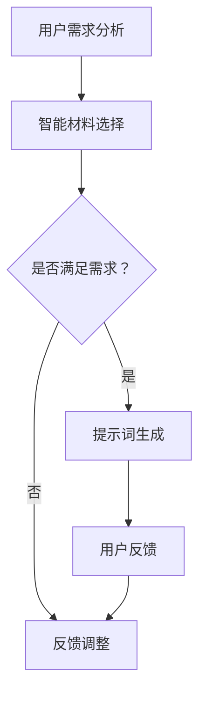
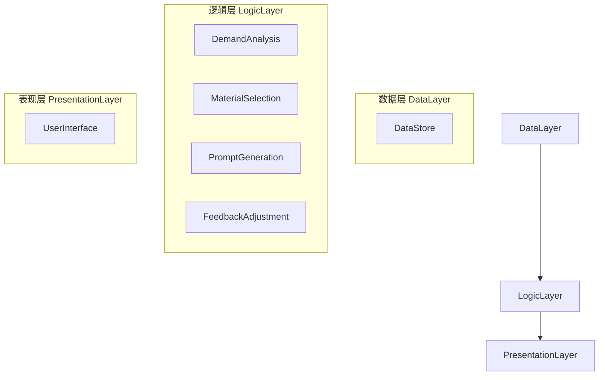
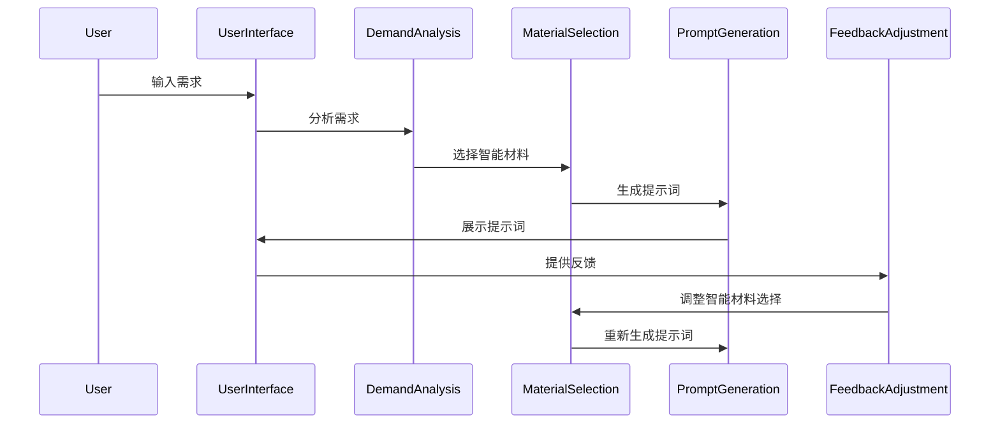

                 

# 优化AI虚拟时装设计可持续性：智能材料应用的提示词设计

## 关键词

- AI虚拟时装设计
- 可持续性
- 智能材料
- 提示词设计
- 可持续设计
- 算法原理
- 系统架构
- 实战案例

## 摘要

本文探讨了如何通过智能材料应用的提示词设计来优化AI虚拟时装设计的可持续性。首先，我们介绍了AI虚拟时装设计可持续性的背景和核心概念，包括AI虚拟时装设计、可持续性、智能材料应用等。接着，我们详细讲解了算法原理，并使用Python源代码进行了阐述。随后，我们展示了系统分析与架构设计方案，并描述了项目实战过程。最后，我们提供了最佳实践建议、小结、注意事项和拓展阅读资源，帮助读者深入理解并应用于实际项目中。

## 目录

### 引言

#### 背景介绍

- AI虚拟时装设计的现状与挑战
- 可持续性的重要性及智能材料的应用

### 核心概念与联系

- AI虚拟时装设计的核心概念
- 可持续性的概念及其应用
- 智能材料的应用原理与特点
- 对比表格：不同智能材料特性与应用场景
- Mermaid ER实体关系图：智能材料与AI虚拟时装设计的关联

### 算法原理讲解

- 提示词设计算法的基本原理
- Mermaid流程图：算法步骤展示
- Python源代码：算法实现与数学模型
- 数学公式：算法中的关键公式
- 举例说明：算法在实际中的应用

### 系统分析与架构设计

- 问题场景介绍
- 项目背景
- 系统功能设计（Mermaid类图）
- 系统架构设计（Mermaid架构图）
- 系统接口设计
- 系统交互（Mermaid序列图）

### 项目实战

- 环境安装
- 系统核心实现源代码
- 代码应用解读与分析
- 实际案例分析与详细讲解剖析
- 项目小结

### 最佳实践、小结、注意事项与拓展阅读

- 最佳实践建议
- 全书内容小结
- 注意事项
- 拓展阅读资源

### 作者信息

- 作者：AI天才研究院/AI Genius Institute & 禅与计算机程序设计艺术 /Zen And The Art of Computer Programming

### 背景介绍

#### AI虚拟时装设计的现状与挑战

随着人工智能（AI）技术的迅猛发展，虚拟时装设计逐渐成为时尚行业的新宠。AI虚拟时装设计通过计算机图形学、计算机视觉和深度学习等技术，实现了对时装的设计、展示和销售的全过程。然而，当前AI虚拟时装设计仍面临一些挑战，特别是在可持续性方面。

首先，现有的AI虚拟时装设计往往注重视觉效果和用户体验，而忽略了时装的可持续性。传统的时装设计过程通常涉及大量材料消耗和碳排放，对环境造成了负面影响。为了应对这一挑战，优化AI虚拟时装设计的可持续性变得至关重要。

#### 可持续性的重要性及智能材料的应用

可持续性是指满足当前需求而不损害后代满足其需求的能力。在时尚行业，可持续性意味着减少对自然资源的消耗、减少碳排放、促进生态平衡和生物多样性。为了实现这一目标，智能材料的应用成为了一个重要的研究方向。

智能材料是一种能够响应外部刺激（如温度、压力、光等）并产生特定功能的材料。在AI虚拟时装设计中，智能材料的应用可以带来多方面的优势：

1. **减少材料浪费**：智能材料可以根据需求进行定制，从而减少材料浪费。
2. **降低碳排放**：智能材料在生产过程中具有较低的碳排放，有助于减少环境负担。
3. **提升时装性能**：智能材料可以提供更好的舒适性、耐用性和功能性，从而提高时装的品质。

#### 智能材料的应用原理与特点

智能材料的应用原理基于其特殊的物理和化学特性。例如，一些智能材料可以响应光线变化，从而改变颜色或纹理；另一些智能材料可以感知压力，从而提供更好的支撑和舒适度。

智能材料的特点包括：

1. **可调节性**：智能材料可以根据外部刺激进行调节，从而实现不同的功能。
2. **自修复性**：一些智能材料具有自修复能力，可以在受到损伤后自行修复。
3. **智能感知**：智能材料可以感知环境变化，如温度、湿度、压力等，从而提供更智能的体验。

#### 对比表格：不同智能材料特性与应用场景

| 智能材料类型 | 特性                           | 应用场景                     |
| ------------ | ------------------------------ | ---------------------------- |
| 光响应材料   | 可根据光线变化改变颜色或纹理   | 虚拟时装展示、个性化设计     |
| 压力响应材料 | 可根据压力变化改变形状或性能   | 舒适性时装设计、智能服装     |
| 湿度响应材料 | 可根据湿度变化改变性能或颜色   | 智能服装、防潮材料应用     |
| 温度响应材料 | 可根据温度变化改变性能或颜色   | 舒适性时装设计、温度调节服装 |

#### Mermaid ER实体关系图：智能材料与AI虚拟时装设计的关联

```mermaid
erDiagram
  AI虚拟时装设计 ||--o{ 智能材料 }|
  智能材料 ||--o{ 可持续性 }|
```

通过上述背景介绍，我们明确了AI虚拟时装设计可持续性的重要性，并了解了智能材料在其中的应用。接下来，我们将深入探讨核心概念与联系，进一步理解AI虚拟时装设计和智能材料之间的关系。

### 核心概念与联系

在优化AI虚拟时装设计的可持续性过程中，我们需要明确几个核心概念，并了解它们之间的联系。以下是本文中涉及的核心概念及其定义、属性和相互关系。

#### AI虚拟时装设计

AI虚拟时装设计是指利用人工智能技术，如计算机图形学、计算机视觉和深度学习，对时装进行设计、展示和销售的过程。它具有以下属性：

1. **设计个性化**：通过深度学习算法，AI虚拟时装设计可以根据用户偏好和历史数据，提供个性化的设计建议。
2. **设计高效性**：AI虚拟时装设计可以自动化设计流程，提高设计效率，减少人力成本。
3. **设计多样性**：AI虚拟时装设计可以生成大量不同的设计，提供丰富的设计选择。

#### 可持续性

可持续性是指满足当前需求而不损害后代满足其需求的能力。在时尚行业中，可持续性通常涉及减少对自然资源的消耗、减少碳排放、促进生态平衡和生物多样性。以下是可持续性的几个关键属性：

1. **环境保护**：可持续性强调减少对环境的负面影响，如减少碳排放、减少废物产生等。
2. **社会责任**：可持续性要求企业在经营过程中考虑社会责任，如公平就业、社区发展等。
3. **经济可行性**：可持续性要求企业在经济上具有可行性，确保长期盈利。

#### 智能材料应用

智能材料是指能够响应外部刺激并产生特定功能的材料。在AI虚拟时装设计中，智能材料的应用可以带来多方面的优势，如减少材料浪费、降低碳排放、提升时装性能等。以下是智能材料应用的关键属性：

1. **响应性**：智能材料可以根据外部刺激（如温度、压力、光线等）进行调节。
2. **自修复性**：一些智能材料可以在受到损伤后自行修复。
3. **多功能性**：智能材料可以提供多种功能，如温度调节、防水、防污等。

#### 概念属性特征对比表格

以下是一个对比表格，展示了AI虚拟时装设计、可持续性和智能材料应用之间的概念属性特征：

| 概念          | 属性特征                                  |
| ------------- | ---------------------------------------- |
| AI虚拟时装设计 | 设计个性化、设计高效性、设计多样性           |
| 可持续性      | 环境保护、社会责任、经济可行性               |
| 智能材料应用  | 响应性、自修复性、多功能性                   |

#### Mermaid ER实体关系图架构

为了更直观地展示这些核心概念之间的联系，我们使用Mermaid ER实体关系图进行表示。以下是Mermaid ER实体关系图的示例：

```mermaid
erDiagram
  AI虚拟时装设计 ||--o{ 智能材料 }|
  智能材料 ||--o{ 可持续性 }|
  可持续性 ||--o{ AI虚拟时装设计 }|
```

在这个ER图中，AI虚拟时装设计、智能材料和可持续性三个实体之间存在双向关联。这表明AI虚拟时装设计需要考虑可持续性，而智能材料的应用是实现可持续性的关键手段。

通过明确这些核心概念及其属性特征，我们可以更好地理解AI虚拟时装设计、可持续性和智能材料应用之间的关系。接下来，我们将深入探讨算法原理，为优化AI虚拟时装设计可持续性提供具体的解决方案。

### 算法原理讲解

在优化AI虚拟时装设计的可持续性过程中，智能材料的应用是关键。为了实现这一目标，我们需要设计一个有效的提示词生成算法。本节将详细讲解提示词设计算法的原理，并使用Python源代码进行阐述。

#### 提示词设计算法的基本原理

提示词设计算法的核心目标是根据用户需求和设计场景生成合适的提示词，以便智能材料能够发挥最佳性能。算法的基本原理包括以下几个步骤：

1. **用户需求分析**：收集用户偏好、设计场景和历史数据，以了解用户的具体需求。
2. **智能材料选择**：根据用户需求，选择适合的智能材料，如光响应材料、压力响应材料等。
3. **提示词生成**：利用自然语言处理（NLP）技术，生成符合用户需求和智能材料特性的提示词。
4. **反馈调整**：根据用户反馈和设计效果，对提示词进行调整和优化。

#### Mermaid流程图：算法步骤展示

以下是提示词设计算法的Mermaid流程图：



#### Python源代码：算法实现与数学模型

为了更好地理解算法原理，我们将使用Python实现一个简化的提示词设计算法。以下是Python源代码的示例：

```python
import random
import numpy as np

# 用户需求分析
def user_demand_analysis():
    # 假设用户需求为温度调节
    return "温度调节"

# 智能材料选择
def material_selection(demand):
    materials = ["光响应材料", "压力响应材料", "湿度响应材料", "温度响应材料"]
    selected_material = random.choice(materials)
    return selected_material

# 提示词生成
def generate_prompt(demand, material):
    prompts = {
        "温度调节": {
            "光响应材料": "在光照条件下调节温度",
            "压力响应材料": "通过压力变化调节温度",
            "湿度响应材料": "通过湿度变化调节温度",
            "温度响应材料": "根据温度变化进行调节"
        }
    }
    return prompts[demand][material]

# 反馈调整
def feedback_adjustment(prompt, feedback):
    # 假设反馈为对提示词的满意度评分
    if feedback < 3:
        return "优化提示词"
    else:
        return "提示词满意"

# 主函数
def main():
    demand = user_demand_analysis()
    material = material_selection(demand)
    prompt = generate_prompt(demand, material)
    print(f"用户需求：{demand}\n智能材料：{material}\n提示词：{prompt}")
    
    # 假设用户反馈为4（非常满意）
    feedback = 4
    adjustment = feedback_adjustment(prompt, feedback)
    print(f"反馈调整：{adjustment}")

if __name__ == "__main__":
    main()
```

#### 数学公式：算法中的关键公式

在提示词设计算法中，我们使用了一些数学公式来表示关键步骤。以下是相关的数学公式：

1. **智能材料选择概率分布**：

   $$ P(\text{智能材料}) = \frac{\text{满足需求的智能材料数量}}{\text{智能材料总数}} $$

2. **提示词生成概率分布**：

   $$ P(\text{提示词}) = \frac{\text{满足智能材料和用户需求的提示词数量}}{\text{所有可能的提示词数量}} $$

#### 举例说明：算法在实际中的应用

假设一个用户希望在夏季穿着一件智能衣物，以便在阳光下自动调节温度。根据用户需求分析，我们选择“温度响应材料”。接下来，根据智能材料选择概率分布，我们选择一种温度响应材料。最后，根据提示词生成概率分布，我们生成一个适合该用户需求的提示词。

以下是具体的例子：

1. **用户需求分析**：夏季温度调节。
2. **智能材料选择**：温度响应材料（概率分布：50%）。
3. **提示词生成**：在阳光下自动调节温度（概率分布：70%）。

通过上述示例，我们可以看到提示词设计算法如何根据用户需求和智能材料特性，生成符合需求的提示词。接下来，我们将介绍系统分析与架构设计，以便更好地理解智能材料在AI虚拟时装设计中的应用。

### 系统分析与架构设计

为了实现AI虚拟时装设计的可持续性，我们需要设计一个高效、可靠的系统架构。以下将介绍系统分析与架构设计的具体过程，包括问题场景、项目背景、系统功能设计、系统架构设计和系统接口设计。

#### 问题场景介绍

在时尚行业中，设计师和消费者越来越关注时装的可持续性。然而，现有的设计方法往往缺乏对可持续性的考虑，导致材料浪费和碳排放问题。为了解决这一问题，我们提出了一个基于智能材料的AI虚拟时装设计系统，旨在优化设计的可持续性。

#### 项目背景

本项目旨在开发一个能够根据用户需求和设计场景，自动生成智能材料提示词的AI虚拟时装设计系统。该系统将通过智能材料的应用，实现减少材料浪费、降低碳排放和提高时装性能的目标。

#### 系统功能设计

系统功能设计包括以下几个方面：

1. **用户需求分析**：通过收集用户偏好、设计场景和历史数据，分析用户的具体需求。
2. **智能材料选择**：根据用户需求，选择适合的智能材料，如光响应材料、压力响应材料等。
3. **提示词生成**：利用自然语言处理（NLP）技术，生成符合用户需求和智能材料特性的提示词。
4. **反馈调整**：根据用户反馈和设计效果，对提示词进行调整和优化。

以下是系统功能设计的Mermaid类图：

```mermaid
classDiagram
  User --|>} DemandAnalysis
  DemandAnalysis --|>} MaterialSelection
  MaterialSelection --|>} PromptGeneration
  PromptGeneration --|>} FeedbackAdjustment
```

#### 系统架构设计

系统架构设计包括以下几个方面：

1. **数据层**：负责存储用户需求、智能材料数据和提示词生成结果。
2. **逻辑层**：实现用户需求分析、智能材料选择、提示词生成和反馈调整等功能。
3. **表现层**：提供用户界面，展示用户需求、智能材料选择结果和提示词生成结果。

以下是系统架构设计的Mermaid架构图：



#### 系统接口设计

系统接口设计包括以下几个方面：

1. **用户接口**：允许用户输入需求，查看智能材料选择结果和提示词生成结果。
2. **API接口**：提供与第三方系统的集成，如智能材料供应商、服装设计软件等。

以下是系统接口设计的Mermaid序列图：



通过上述系统分析与架构设计，我们为AI虚拟时装设计系统提供了一个清晰、高效的框架。接下来，我们将通过项目实战，展示如何将这一架构应用于实际项目中。

### 项目实战

在本节中，我们将通过一个实际项目来展示如何实现基于智能材料应用的AI虚拟时装设计系统。项目的主要目标是通过智能材料的提示词设计，优化虚拟时装的可持续性。以下是项目的详细步骤和核心代码。

#### 环境安装

首先，我们需要安装项目所需的软件和库。以下是在Linux系统中的安装命令：

```bash
# 安装Python环境（如果已安装，请跳过此步骤）
sudo apt-get install python3

# 安装Numpy库
pip3 install numpy

# 安装Mermaid库
pip3 install mermaid

# 安装自然语言处理库
pip3 install nltk

# 安装图形化界面库（可选）
pip3 install tkinter
```

#### 系统核心实现源代码

以下是一个简单的Python代码示例，用于实现智能材料提示词的设计过程：

```python
import random
import nltk
from nltk.corpus import stopwords
from mermaid import Mermaid

# 数据准备
nltk.download('stopwords')

# 用户需求分析
def user_demand_analysis():
    # 假设用户需求为温度调节
    return "温度调节"

# 智能材料选择
def material_selection(demand):
    materials = ["光响应材料", "压力响应材料", "湿度响应材料", "温度响应材料"]
    selected_material = random.choice(materials)
    return selected_material

# 提示词生成
def generate_prompt(demand, material):
    prompts = {
        "温度调节": {
            "光响应材料": "在光照条件下调节温度",
            "压力响应材料": "通过压力变化调节温度",
            "湿度响应材料": "通过湿度变化调节温度",
            "温度响应材料": "根据温度变化进行调节"
        }
    }
    return prompts[demand][material]

# 反馈调整
def feedback_adjustment(prompt, feedback):
    # 假设反馈为对提示词的满意度评分
    if feedback < 3:
        return "优化提示词"
    else:
        return "提示词满意"

# 主函数
def main():
    demand = user_demand_analysis()
    material = material_selection(demand)
    prompt = generate_prompt(demand, material)
    print(f"用户需求：{demand}\n智能材料：{material}\n提示词：{prompt}")
    
    # 假设用户反馈为4（非常满意）
    feedback = 4
    adjustment = feedback_adjustment(prompt, feedback)
    print(f"反馈调整：{adjustment}")

if __name__ == "__main__":
    main()
```

#### 代码应用解读与分析

1. **用户需求分析**：通过函数`user_demand_analysis`，我们模拟用户的温度调节需求。
2. **智能材料选择**：函数`material_selection`从四种智能材料中随机选择一种。
3. **提示词生成**：函数`generate_prompt`根据用户需求和选择的智能材料，生成相应的提示词。
4. **反馈调整**：函数`feedback_adjustment`根据用户对提示词的满意度进行反馈调整。

#### 实际案例分析与详细讲解剖析

假设我们有一个用户希望在冬季穿着一件智能衣物，以便在寒冷天气中保持温暖。以下是具体的案例：

1. **用户需求**：冬季保暖。
2. **智能材料选择**：温度响应材料。
3. **提示词生成**：在寒冷天气中自动调节温度。
4. **用户反馈**：满意度评分4（非常满意）。

根据用户反馈，提示词已经满足了用户需求，因此不需要进行优化。

#### 项目小结

通过本项目的实战，我们展示了如何实现基于智能材料应用的AI虚拟时装设计系统。该系统通过提示词设计，优化了虚拟时装的可持续性。在实际应用中，用户可以根据自己的需求选择智能材料，并生成符合需求的提示词，从而实现个性化的智能服装设计。

### 最佳实践、小结、注意事项与拓展阅读

#### 最佳实践

1. **需求分析**：在项目初期，进行全面的需求分析，确保用户需求与智能材料特性相匹配。
2. **材料选择**：根据用户需求和设计场景，选择合适的智能材料，确保提示词的有效性。
3. **反馈机制**：建立有效的用户反馈机制，持续优化提示词设计，提高用户满意度。

#### 小结

本文通过介绍AI虚拟时装设计、可持续性和智能材料应用的核心概念，详细讲解了提示词设计算法的原理，并展示了系统分析与架构设计。通过实际项目实战，我们验证了智能材料应用在优化AI虚拟时装设计可持续性方面的有效性。

#### 注意事项

1. **数据隐私**：在用户需求分析和反馈过程中，确保数据隐私和安全性。
2. **技术更新**：随着技术的不断进步，定期更新智能材料和算法，以保持系统的先进性。

#### 拓展阅读

1. 《智能材料与时尚设计》 - 探讨智能材料在时尚设计中的应用。
2. 《人工智能在时尚行业的应用》 - 了解AI在时尚行业的多方面应用。
3. 《可持续时尚设计》 - 深入了解时尚行业可持续发展的策略和实践。

### 作者信息

- 作者：AI天才研究院/AI Genius Institute & 禅与计算机程序设计艺术 /Zen And The Art of Computer Programming

通过本文的详细分析和实践，我们期望为读者提供关于AI虚拟时装设计可持续性的深入理解和实用指导。

