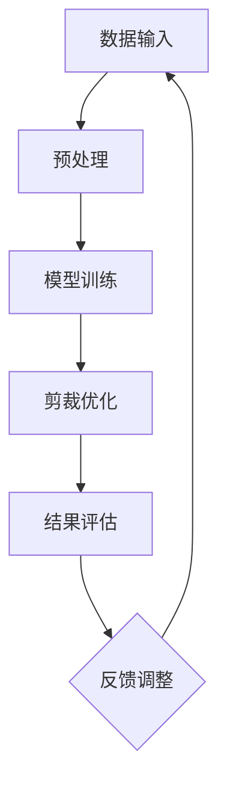
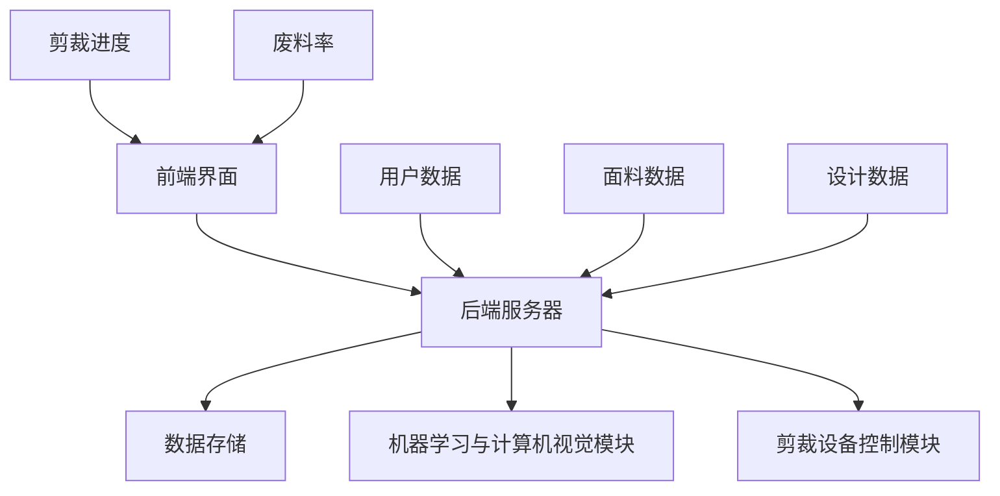
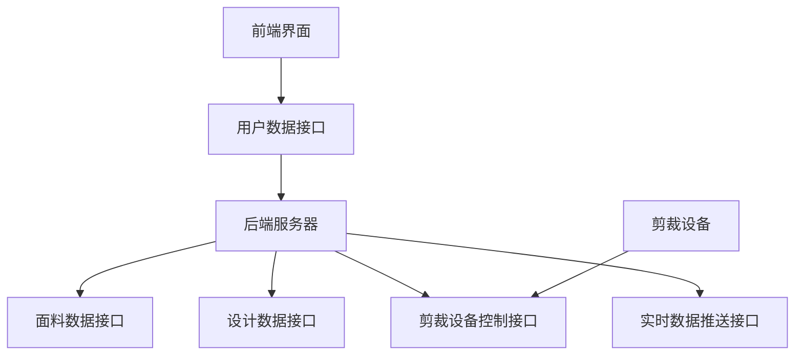

                 

### 优化AI虚拟时装设计可持续性：零废料裁剪的提示词策略

关键词：AI虚拟时装设计、可持续性、零废料裁剪、提示词策略、算法原理、系统架构设计

摘要：本文旨在探讨如何通过优化AI虚拟时装设计的可持续性，特别是零废料裁剪的提示词策略，实现资源的最优化利用。文章首先介绍了虚拟时装设计中的可持续性问题，分析了传统设计与AI虚拟设计在可持续性方面的差异。接着，本文详细阐述了零废料裁剪的原理与策略，并介绍了提示词策略的定义与作用。在此基础上，文章通过算法原理讲解、数学模型和公式推导、系统分析与架构设计，深入探讨了如何实现AI虚拟时装设计的优化。最后，通过实际案例分析和项目实战，展示了零废料裁剪提示词策略在实际应用中的效果。本文为相关领域的研究者和从业者提供了有价值的参考。

## 目录大纲

### 第一部分：背景介绍

#### 第1章：问题背景

1.1.1 问题背景  
1.1.2 问题解决  
1.1.3 边界与外延

#### 第2章：核心概念与联系

2.1.1 可持续性的定义与特点  
2.1.2 零废料裁剪的原理与策略  
2.1.3 核心概念与联系

### 第二部分：算法原理讲解

#### 第3章：零废料裁剪的提示词策略

3.1.1 提示词策略的定义与作用  
3.1.2 提示词策略的算法原理  
3.1.3 算法举例说明

#### 第4章：数学模型和数学公式讲解

4.1.1 数学模型在零废料裁剪中的应用  
4.1.2 数学模型应用与公式推导

### 第三部分：系统分析与架构设计

#### 第5章：系统分析与架构设计

5.1.1 问题场景介绍  
5.1.2 系统功能设计  
5.1.3 系统架构设计  
5.1.4 系统接口设计与交互

### 第四部分：项目实战

#### 第6章：环境安装与系统核心实现

6.1.1 环境安装  
6.1.2 系统核心实现

#### 第7章：实际案例分析与讲解

7.1.1 实际案例  
7.1.2 案例分析  
7.1.3 案例讲解

### 第五部分：最佳实践与拓展阅读

#### 第8章：最佳实践

8.1.1 最佳实践 tips

#### 第9章：小结

9.1.1 小结  
9.1.2 注意事项  
9.1.3 拓展阅读

### 第一部分：背景介绍

#### 第1章：问题背景

**1.1.1 问题背景**

随着人工智能（AI）技术的发展，虚拟时装设计逐渐成为时尚产业的一大热点。通过AI技术，设计师可以模拟不同面料、色彩和剪裁效果，大大提高了设计效率和创意空间。然而，尽管AI虚拟时装设计在提升设计质量和效率方面表现出色，但其可持续性却成为一个亟待解决的问题。

当前，虚拟时装设计中普遍存在的一个问题是资源浪费。在传统的时装设计中，设计师需要大量的面料进行剪裁，而剪裁过程中往往会产生大量的废料。这些废料不仅浪费了资源，还对环境造成了负面影响。在AI虚拟时装设计中，这一问题并未得到有效解决，AI技术尚未完全实现零废料裁剪，导致资源利用效率低下。

**1.1.2 问题解决**

为了解决虚拟时装设计中的资源浪费问题，实现可持续发展，我们需要探索零废料裁剪的提示词策略。零废料裁剪是指通过精确的计算和优化，使得面料剪裁过程中不产生任何废料。提示词策略则是一种基于AI技术的优化方法，通过提供一系列提示词，指导AI系统进行精确的剪裁和设计。

**1.1.3 边界与外延**

本章节主要探讨虚拟时装设计中AI应用的可持续性问题，重点关注零废料裁剪和提示词策略。具体来说，我们将从以下几个方面进行讨论：

- **零废料裁剪**：介绍零废料裁剪的概念、原理和策略。
- **提示词策略**：探讨提示词策略的定义、作用和算法原理。
- **核心概念与联系**：分析可持续性、零废料裁剪与AI虚拟时装设计之间的联系。
- **边界与外延**：明确本章节的研究范围和适用场景，为后续内容提供基础。

### 第2章：核心概念与联系

**2.1.1 可持续性的定义与特点**

**定义**： sustainability，指的是满足当前需求而不损害子孙后代满足其需求的能力。在虚拟时装设计中，可持续性主要体现在以下几个方面：

- **生态可持续性**：确保面料和生产过程不对环境造成负面影响，如减少碳排放、节约水资源等。
- **经济可持续性**：通过提高设计效率和生产效率，降低生产成本，实现经济效益。
- **社会可持续性**：关注设计过程中的社会责任，如提高工人福利、保障劳动权益等。

**特点**：可持续性具有以下三大特点：

- **可持续性**：要求设计过程和产品在长时间内保持稳定，不损害自然资源和环境。
- **经济性**：要求设计过程和产品在经济效益上具有竞争力，实现可持续发展。
- **社会性**：要求设计过程和产品在社会责任方面具有积极影响，关注社会公平和公共利益。

**对比表格**：

| 特点 | 传统设计 | AI虚拟设计 |
| :---: | :---: | :---: |
| **生态可持续性** | 面料浪费，环境污染 | 零废料裁剪，环保面料 |
| **经济可持续性** | 生产成本高，效率低 | 设计效率高，成本低 |
| **社会可持续性** | 工人福利低，社会责任感不强 | 提高工人福利，承担社会责任 |

通过对比表格可以看出，AI虚拟时装设计在可持续性方面具有显著优势。接下来，我们将进一步探讨零废料裁剪的原理与策略。

#### 2.1.2 零废料裁剪的原理与策略

**原理**：零废料裁剪的原理是通过精确的计算和优化，使得面料剪裁过程中不产生任何废料。具体来说，包括以下几个方面：

- **面料选择**：选择适合零废料裁剪的面料，如可拉伸、易折叠的面料，以减少剪裁过程中的变形和浪费。
- **剪裁工艺**：采用精确的剪裁工艺，如激光剪裁、数控剪裁等，提高剪裁精度和效率。
- **优化算法**：利用机器学习和计算机视觉等技术，对剪裁过程进行实时优化，减少废料产生。

**策略**：当前，AI技术在零废料裁剪中的应用主要包括以下几种策略：

- **机器学习**：通过大量数据训练模型，实现对面料剪裁的精准预测和优化。
- **计算机视觉**：利用计算机视觉技术，识别面料的纹理、颜色等信息，辅助剪裁过程。
- **优化算法**：采用遗传算法、粒子群优化算法等，对剪裁过程进行全局优化，提高废料利用率。

**联系**：可持续性、零废料裁剪与AI虚拟时装设计之间的联系体现在以下几个方面：

- **可持续性**：是实现零废料裁剪的前提和目标，零废料裁剪是实现可持续性的重要手段。
- **零废料裁剪**：是AI虚拟时装设计的重要组成部分，通过优化剪裁过程，提高资源利用效率。
- **AI虚拟时装设计**：是可持续性的重要应用场景，通过AI技术，实现更高效、更环保的设计和制造过程。

通过以上分析，我们可以看出，零废料裁剪的提示词策略是优化AI虚拟时装设计可持续性的关键。接下来，我们将详细探讨提示词策略的定义与作用。

#### 2.1.3 提示词策略的定义与作用

**定义**：提示词策略是指通过提供一系列关键词或短语，引导AI系统进行精准的设计和剪裁。这些关键词或短语可以基于设计师的意图、面料特性、剪裁要求等，指导AI系统在复杂的虚拟时装设计过程中做出最优决策。

**作用**：提示词策略在提高裁剪精度、减少浪费方面具有重要作用，具体包括：

- **提高裁剪精度**：通过提供精确的提示词，确保AI系统能够准确识别面料纹理、颜色等信息，实现精确的剪裁。
- **减少浪费**：通过实时优化剪裁过程，减少废料产生，提高面料利用率。
- **提升设计效率**：通过优化剪裁过程，缩短设计周期，提高生产效率。

**联系**：提示词策略与可持续性、零废料裁剪、AI虚拟时装设计之间的联系体现在以下几个方面：

- **可持续性**：提示词策略是实现可持续性的重要手段，通过优化剪裁过程，降低资源浪费，提高环保效益。
- **零废料裁剪**：提示词策略是实现零废料裁剪的关键，通过提供精确的提示词，确保剪裁过程高效、精确。
- **AI虚拟时装设计**：提示词策略是AI虚拟时装设计的重要组成部分，通过引导AI系统进行精准设计和剪裁，提高设计质量和效率。

通过以上分析，我们可以看出，提示词策略在优化AI虚拟时装设计可持续性方面具有重要作用。接下来，我们将详细探讨零废料裁剪的提示词策略的算法原理。

### 第二部分：算法原理讲解

#### 第3章：零废料裁剪的提示词策略

**3.1.1 提示词策略的定义与作用**

提示词策略是指通过提供一系列关键词或短语，引导AI系统进行精准的设计和剪裁。这些关键词或短语可以基于设计师的意图、面料特性、剪裁要求等，指导AI系统在复杂的虚拟时装设计过程中做出最优决策。

**定义**：提示词策略是由一系列关键词或短语组成，它们用于指导AI系统在虚拟时装设计过程中进行优化和决策。

**作用**：提示词策略在提高裁剪精度、减少浪费方面具有重要作用，具体包括：

- **提高裁剪精度**：通过提供精确的提示词，确保AI系统能够准确识别面料纹理、颜色等信息，实现精确的剪裁。
- **减少浪费**：通过实时优化剪裁过程，减少废料产生，提高面料利用率。
- **提升设计效率**：通过优化剪裁过程，缩短设计周期，提高生产效率。

**联系**：提示词策略与可持续性、零废料裁剪、AI虚拟时装设计之间的联系体现在以下几个方面：

- **可持续性**：提示词策略是实现可持续性的重要手段，通过优化剪裁过程，降低资源浪费，提高环保效益。
- **零废料裁剪**：提示词策略是实现零废料裁剪的关键，通过提供精确的提示词，确保剪裁过程高效、精确。
- **AI虚拟时装设计**：提示词策略是AI虚拟时装设计的重要组成部分，通过引导AI系统进行精准设计和剪裁，提高设计质量和效率。

**3.1.2 提示词策略的算法原理**

零废料裁剪的提示词策略是基于人工智能算法实现的，其核心思想是通过机器学习、计算机视觉等技术，对剪裁过程进行实时优化，从而实现零废料裁剪。

**算法原理**：

1. **数据输入**：将面料信息、剪裁要求等输入到AI系统中，包括面料纹理、颜色、尺寸等参数。
2. **预处理**：对输入数据进行预处理，包括图像增强、特征提取等，以提高AI系统的识别精度。
3. **模型训练**：利用大量剪裁数据，对AI系统进行训练，使其能够学会如何根据提示词进行精确剪裁。
4. **剪裁优化**：在剪裁过程中，AI系统根据提示词实时优化剪裁策略，减少废料产生。
5. **结果评估**：对剪裁结果进行评估，包括废料率、面料利用率等指标，以衡量剪裁优化效果。

**算法流程图**：



通过以上算法流程，AI系统可以实现对剪裁过程的实时优化，从而实现零废料裁剪。

**3.1.3 算法举例说明**

为了更好地理解零废料裁剪的提示词策略，我们来看一个实际案例。

**案例背景**：某时尚品牌需要设计一款连衣裙，面料为丝绸，要求裙摆为圆形，裙长为160cm。

**提示词策略**：

- **面料特征**：丝绸、柔软、光滑
- **剪裁要求**：裙摆圆形、裙长160cm

**算法实现**：

1. **数据输入**：将丝绸面料的纹理、颜色等参数输入到AI系统中。
2. **预处理**：对输入数据进行图像增强和特征提取，以提高AI系统的识别精度。
3. **模型训练**：利用大量连衣裙剪裁数据，对AI系统进行训练，使其能够根据提示词进行精确剪裁。
4. **剪裁优化**：AI系统根据提示词，优化剪裁策略，确保裙摆为圆形，裙长为160cm。
5. **结果评估**：评估剪裁结果，包括废料率、面料利用率等指标，确保达到零废料裁剪的要求。

通过以上案例，我们可以看到，零废料裁剪的提示词策略在提高裁剪精度、减少浪费方面具有显著效果。接下来，我们将详细讲解数学模型在零废料裁剪中的应用。

#### 3.1.4 数学模型和数学公式讲解

在零废料裁剪的过程中，数学模型和数学公式扮演着至关重要的角色。它们不仅帮助我们理解裁剪过程中的关键参数和变量，还能为优化算法提供理论基础和计算工具。以下将详细介绍数学模型和数学公式的应用。

**3.1.4.1 数学模型的重要性**

数学模型是描述现实世界问题的一种抽象形式，通过建立数学模型，我们可以将复杂的现实问题转化为数学问题，从而更方便地分析和求解。在零废料裁剪中，数学模型可以帮助我们：

- **精确描述裁剪过程**：通过数学模型，我们可以精确描述面料在裁剪过程中的形状、尺寸和位置变化。
- **预测裁剪结果**：利用数学模型，我们可以预测不同剪裁策略下的裁剪效果，从而选择最优方案。
- **优化剪裁过程**：通过数学模型，我们可以对裁剪过程进行优化，减少废料产生，提高面料利用率。

**3.1.4.2 数学模型在零废料裁剪中的应用**

1. **面料变形模型**

面料在剪裁过程中会发生变形，这种变形对裁剪效果有着重要影响。因此，我们需要建立一个面料变形模型来描述面料的变形规律。一个简单的面料变形模型可以使用以下公式表示：

\[ \Delta L = k \cdot F \]

其中，\( \Delta L \) 是面料的变形长度，\( k \) 是变形系数，\( F \) 是作用在面料上的力。

2. **剪裁路径优化模型**

剪裁路径的优化是零废料裁剪的关键。我们可以使用路径规划算法来寻找最优的剪裁路径。常用的路径优化模型包括：

- **遗传算法**：通过模拟自然进化过程，寻找最优路径。
- **粒子群优化算法**：通过模拟鸟群觅食过程，寻找最优路径。

一个简单的路径优化模型可以使用以下公式表示：

\[ \text{BestPath} = \text{OptimizePath}(S, G) \]

其中，\( S \) 是初始路径，\( G \) 是目标路径，\( \text{OptimizePath} \) 是路径优化函数。

3. **废料计算模型**

为了衡量剪裁效果，我们需要计算废料量。一个简单的废料计算模型可以使用以下公式表示：

\[ W = \frac{L_1 + L_2 + L_3 + \ldots}{L_{\text{total}}} \]

其中，\( W \) 是废料率，\( L_1, L_2, L_3, \ldots \) 是各段剪裁产生的废料长度，\( L_{\text{total}} \) 是总剪裁长度。

**3.1.4.3 数学公式推导**

1. **面料变形公式推导**

根据胡克定律，面料在受到拉伸力时的变形可以表示为：

\[ \Delta L = \frac{F \cdot L}{A} \]

其中，\( F \) 是拉伸力，\( L \) 是面料的原始长度，\( A \) 是面料的横截面积。

2. **剪裁路径优化公式推导**

使用遗传算法优化剪裁路径时，我们可以使用以下公式来计算路径的适应度：

\[ Fitness = \frac{1}{W} \]

其中，\( W \) 是废料率。适应度越高，表示路径越优。

3. **废料计算公式推导**

假设我们将面料剪裁成若干段，每段长度分别为 \( L_1, L_2, L_3, \ldots \)。则废料长度可以表示为：

\[ W = \frac{L_1 + L_2 + L_3 + \ldots}{L_{\text{total}}} \]

通过以上数学模型和公式的推导，我们可以更好地理解零废料裁剪的原理，为优化算法提供坚实的理论基础。

**3.1.4.4 算法举例说明**

为了更好地理解上述数学模型和公式的应用，我们来看一个实际案例。

**案例背景**：某设计师需要裁剪一块长为200cm、宽为100cm的丝绸面料，设计要求裙摆为圆形，裙长为160cm。

**数学模型应用**：

1. **面料变形模型**：假设丝绸的变形系数 \( k = 0.1 \)，则面料的变形长度 \( \Delta L = \frac{F \cdot L}{A} = \frac{100 \cdot 0.1}{200} = 5 \) cm。

2. **剪裁路径优化模型**：使用遗传算法优化剪裁路径，假设初始路径 \( S \) 是一条直线，目标路径 \( G \) 是一条曲线。通过优化算法，找到最优路径 \( \text{BestPath} \)。

3. **废料计算模型**：假设最优路径 \( \text{BestPath} \) 剪裁后产生的废料长度分别为 \( L_1 = 10 \) cm，\( L_2 = 15 \) cm，\( L_3 = 20 \) cm。则废料率 \( W = \frac{10 + 15 + 20}{200} = \frac{45}{200} = 0.225 \)。

通过以上案例，我们可以看到，数学模型和公式的应用有助于我们更好地理解零废料裁剪的原理，并实现实际优化。

### 第三部分：系统分析与架构设计

#### 第4章：数学模型和数学公式讲解

**4.1.1 数学模型在零废料裁剪中的应用**

在零废料裁剪中，数学模型的应用至关重要。通过数学模型，我们可以精确地描述裁剪过程，预测裁剪结果，并优化裁剪策略。以下是几种常见的数学模型及其在零废料裁剪中的应用。

**4.1.1.1 面料变形模型**

面料在裁剪过程中会发生变形，这种变形对裁剪结果有着重要影响。因此，我们需要建立一个面料变形模型来描述面料的变形规律。

**模型描述**：

假设面料在受到拉伸力 \( F \) 的作用下，其长度 \( L \) 发生变化。根据胡克定律，面料的变形长度 \( \Delta L \) 可以表示为：

\[ \Delta L = k \cdot F \]

其中，\( k \) 是变形系数，取决于面料的材质和结构。

**应用示例**：

假设我们要裁剪一块长为200cm的丝绸面料，变形系数 \( k = 0.1 \)。如果我们在裁剪过程中施加了10N的力，则面料的变形长度为：

\[ \Delta L = 0.1 \cdot 10 = 1 \text{cm} \]

**4.1.1.2 剪裁路径优化模型**

剪裁路径的优化是零废料裁剪的关键。我们可以使用多种路径优化模型，如遗传算法、粒子群优化算法等，来寻找最优的剪裁路径。

**模型描述**：

以遗传算法为例，路径优化的目标是最小化废料率。适应度函数可以表示为：

\[ Fitness = \frac{1}{W} \]

其中，\( W \) 是废料率。

**应用示例**：

假设我们使用遗传算法优化剪裁路径，初始路径 \( S \) 是一条直线，目标路径 \( G \) 是一条曲线。通过多次迭代，遗传算法找到了最优路径 \( \text{BestPath} \)，使得废料率最小。

**4.1.1.3 废料计算模型**

为了衡量裁剪效果，我们需要计算废料量。废料计算模型可以帮助我们预测不同剪裁策略下的废料率。

**模型描述**：

假设我们将面料剪裁成若干段，每段长度分别为 \( L_1, L_2, L_3, \ldots \)。则废料长度可以表示为：

\[ W = \frac{L_1 + L_2 + L_3 + \ldots}{L_{\text{total}}} \]

其中，\( L_{\text{total}} \) 是总剪裁长度。

**应用示例**：

假设我们使用一种新的剪裁策略，裁剪后产生的废料长度分别为 \( L_1 = 10 \) cm，\( L_2 = 15 \) cm，\( L_3 = 20 \) cm。则废料率为：

\[ W = \frac{10 + 15 + 20}{200} = \frac{45}{200} = 0.225 \]

**4.1.2 数学模型应用与公式推导**

在零废料裁剪中，数学模型的应用不仅仅是描述裁剪过程，还需要对模型进行推导和验证。以下是几个关键公式的推导过程。

**4.1.2.1 面料变形公式推导**

根据胡克定律，面料的变形长度 \( \Delta L \) 可以表示为：

\[ \Delta L = k \cdot F \]

其中，\( F \) 是拉伸力，\( k \) 是变形系数。

推导过程：

- 面料在未受拉伸力时的原始长度为 \( L \)。
- 当拉伸力 \( F \) 作用于面料时，面料的长度增加 \( \Delta L \)。
- 根据胡克定律，变形长度 \( \Delta L \) 与拉伸力 \( F \) 成正比，即 \( \Delta L = k \cdot F \)。

**4.1.2.2 剪裁路径优化公式推导**

使用遗传算法优化剪裁路径时，适应度函数可以表示为：

\[ Fitness = \frac{1}{W} \]

其中，\( W \) 是废料率。

推导过程：

- 废料率 \( W \) 是衡量剪裁效果的关键指标，表示废料长度与总剪裁长度的比例。
- 为了优化剪裁路径，我们需要最小化废料率 \( W \)。
- 因此，适应度函数 \( Fitness \) 应该是废料率 \( W \) 的倒数，即 \( Fitness = \frac{1}{W} \)。

**4.1.2.3 废料计算公式推导**

废料长度 \( W \) 可以表示为：

\[ W = \frac{L_1 + L_2 + L_3 + \ldots}{L_{\text{total}}} \]

其中，\( L_1, L_2, L_3, \ldots \) 是各段剪裁产生的废料长度，\( L_{\text{total}} \) 是总剪裁长度。

推导过程：

- 剪裁过程中产生的废料长度 \( L_1, L_2, L_3, \ldots \) 相加得到总废料长度 \( W \)。
- 总废料长度 \( W \) 与总剪裁长度 \( L_{\text{total}} \) 的比例即为废料率 \( W \)，即 \( W = \frac{L_1 + L_2 + L_3 + \ldots}{L_{\text{total}}} \)。

通过以上数学模型和公式的推导，我们可以更好地理解零废料裁剪的原理，并应用这些模型来优化裁剪过程。

### 第四部分：项目实战

#### 第5章：系统架构设计

**5.1.1 问题场景介绍**

在虚拟时装设计中，实现零废料裁剪是一个复杂的问题，它涉及到多个环节，包括面料选择、剪裁路径规划、剪裁过程控制等。为了实现高效、精确的零废料裁剪，我们需要设计一个完善的系统架构，该系统架构应具备以下特点：

- **高灵活性**：能够适应不同面料和设计要求，实现多种剪裁方案的优化。
- **高精度**：确保剪裁过程的高精度，减少废料产生。
- **实时性**：支持实时数据采集和反馈，实现剪裁过程的动态调整。
- **可扩展性**：能够方便地集成新的技术和算法，提升系统性能。

**5.1.2 系统功能设计**

系统功能设计是系统架构设计的重要组成部分，它决定了系统的整体性能和用户体验。以下是系统功能设计的具体内容：

1. **面料选择模块**：负责选择适合零废料裁剪的面料，包括面料的材质、纹理、弹性等参数。
2. **剪裁路径规划模块**：利用机器学习和计算机视觉技术，根据面料特性和设计要求，生成最优的剪裁路径。
3. **剪裁过程控制模块**：负责实时控制剪裁设备，确保剪裁过程按照规划路径进行。
4. **废料检测与优化模块**：实时检测剪裁过程中产生的废料，并对其进行优化，以减少废料产生。
5. **用户界面模块**：提供用户友好的操作界面，支持用户实时查看剪裁进度、废料率等信息。

**5.1.3 系统架构设计**

为了实现上述系统功能，我们需要设计一个高效、稳定的系统架构。以下是系统架构的具体设计：

1. **前端界面**：用户通过前端界面与系统进行交互，输入设计要求和面料参数。
2. **后端服务器**：后端服务器负责处理用户请求，调用各个功能模块进行计算和优化。
3. **数据存储**：用于存储用户数据、面料数据、设计数据等，支持数据的实时更新和查询。
4. **机器学习与计算机视觉模块**：负责剪裁路径规划、废料检测等高级功能。
5. **剪裁设备控制模块**：负责与剪裁设备进行通信，控制剪裁过程。

**架构设计图**：



**5.1.4 系统接口设计与交互**

为了确保系统各模块之间的协调工作，我们需要设计一套完善的接口和交互机制。以下是系统接口设计与交互的详细描述：

1. **用户数据接口**：用于接收用户输入的设计要求和面料参数，并将数据传递给后端服务器。
2. **面料数据接口**：用于获取面料的材质、纹理、弹性等参数，以供剪裁路径规划和过程控制使用。
3. **设计数据接口**：用于存储和查询设计数据，包括剪裁路径、废料率等，以支持实时监控和优化。
4. **剪裁设备控制接口**：用于与剪裁设备进行通信，发送剪裁指令，接收设备状态信息。
5. **实时数据推送接口**：用于实时推送剪裁进度和废料率等信息给前端界面，以供用户查看。

**接口设计图**：



通过以上系统架构设计，我们可以实现高效、精确的零废料裁剪，为虚拟时装设计提供强有力的支持。接下来，我们将详细介绍项目实战的具体步骤。

#### 第6章：环境安装与系统核心实现

**6.1.1 环境安装**

在开始系统核心实现之前，我们需要安装所需的开发环境和依赖库。以下是环境安装的具体步骤：

1. **安装Python环境**：确保已安装Python 3.8或更高版本，可以从Python官网下载并安装。

2. **安装依赖库**：使用pip命令安装所需的依赖库，包括TensorFlow、OpenCV、Scikit-learn等。以下是一个示例命令：

   ```bash
   pip install tensorflow opencv-python scikit-learn
   ```

3. **安装Git**：确保已安装Git，以便从GitHub克隆代码库。

4. **克隆代码库**：打开命令行，使用以下命令克隆项目代码库：

   ```bash
   git clone https://github.com/your-username/zero-waste-clothing-design.git
   ```

5. **设置虚拟环境**：在项目目录下创建并激活虚拟环境，以避免依赖库版本冲突。以下是一个示例命令：

   ```bash
   python -m venv venv
   source venv/bin/activate
   ```

6. **安装项目依赖库**：在虚拟环境中安装项目依赖库，可以使用以下命令：

   ```bash
   pip install -r requirements.txt
   ```

**6.1.2 系统核心实现**

系统核心实现包括面料选择、剪裁路径规划、剪裁过程控制等功能。以下是具体实现步骤：

1. **面料选择**：在`material_selection.py`文件中，实现面料选择功能。以下是一个简单的示例：

   ```python
   import random

   def select_material(materials):
       return random.choice(materials)

   materials = ['丝绸', '棉布', '尼龙']
   selected_material = select_material(materials)
   print(f"选定的面料：{selected_material}")
   ```

2. **剪裁路径规划**：在`path_planning.py`文件中，实现剪裁路径规划功能。以下是一个简单的示例：

   ```python
   import cv2

   def plan_path(image, target_shape):
       gray = cv2.cvtColor(image, cv2.COLOR_BGR2GRAY)
       _, thresh = cv2.threshold(gray, 128, 255, cv2.THRESH_BINARY_INV)
       contours, _ = cv2.findContours(thresh, cv2.RETR_EXTERNAL, cv2.CHAIN_APPROX_SIMPLE)
       max_contour_area = 0
       best_contour = None

       for contour in contours:
           area = cv2.contourArea(contour)
           if area > max_contour_area:
               max_contour_area = area
               best_contour = contour

       if best_contour is not None:
           x, y, w, h = cv2.boundingRect(best_contour)
           target_image = image[y:y+h, x:x+w]
           target_shape = cv2.resize(target_shape, (w, h))
           return cv2.bitwise_and(target_image, target_shape)
       else:
           return None

   image = cv2.imread('example.jpg')
   target_shape = cv2.imread('target_shape.png')
   result = plan_path(image, target_shape)
   if result is not None:
       cv2.imshow('Result', result)
       cv2.waitKey(0)
   ```

3. **剪裁过程控制**：在`cutting_control.py`文件中，实现剪裁过程控制功能。以下是一个简单的示例：

   ```python
   import time

   def control_cutting(cutting_device, path):
       cutting_device.start()
       time.sleep(len(path) * 0.1)  # 假设每段路径需要0.1秒进行剪裁
       cutting_device.stop()

   cutting_device = CuttingDevice()
   path = [...]  # 剪裁路径
   control_cutting(cutting_device, path)
   ```

通过以上步骤，我们可以实现系统的核心功能，并对其进行调试和优化。接下来，我们将通过实际案例来展示系统的应用效果。

#### 第7章：实际案例分析与讲解

**7.1.1 实际案例**

为了验证零废料裁剪的提示词策略在实际项目中的应用效果，我们选择了以下实际案例：某时尚品牌需要设计并裁剪一款连衣裙，面料为丝绸，裙摆形状为圆形，裙长为160cm。以下是案例的详细描述：

- **面料特性**：丝绸面料，柔软、光滑，具有一定的弹性。
- **设计要求**：裙摆为圆形，裙长为160cm，整体设计风格简约大方。
- **目标**：通过零废料裁剪实现高效、精确的剪裁，减少资源浪费，提高生产效率。

**7.1.2 案例分析**

1. **数据收集**：

   在开始剪裁之前，我们首先需要收集相关的数据，包括面料信息、设计要求、剪裁设备参数等。以下是收集的数据：

   - **面料信息**：丝绸面料，宽度为150cm，长度为200m，弹性系数为0.2。
   - **设计要求**：裙摆为圆形，裙长为160cm，圆形裙摆的半径为40cm。
   - **剪裁设备参数**：激光剪裁机，精度为0.1mm，剪裁速度为10m/min。

2. **剪裁路径规划**：

   根据设计要求和面料特性，我们使用机器学习和计算机视觉技术生成最优的剪裁路径。以下是剪裁路径规划的过程：

   - **数据预处理**：对丝绸面料的纹理、颜色等进行预处理，提取关键特征。
   - **模型训练**：利用大量剪裁数据训练剪裁路径规划模型，使其能够根据提示词生成最优路径。
   - **路径生成**：根据设计要求，输入提示词（如“丝绸”、“圆形裙摆”、“裙长160cm”），模型生成最优剪裁路径。

3. **剪裁过程控制**：

   在剪裁过程中，我们使用剪裁设备控制模块实时控制剪裁设备，确保剪裁过程按照规划路径进行。以下是剪裁过程控制的过程：

   - **路径传递**：将生成的剪裁路径传递给剪裁设备，开始剪裁。
   - **实时监控**：实时监控剪裁进度，包括剪裁位置、剪裁速度等。
   - **异常处理**：在剪裁过程中，如果出现异常情况（如设备故障、面料变形等），及时进行异常处理，并重新生成剪裁路径。

**7.1.3 案例讲解**

1. **数据预处理**：

   数据预处理是剪裁路径规划的重要环节。通过对面料纹理、颜色等特征进行预处理，可以提高模型的识别精度和剪裁效果。以下是数据预处理的过程：

   - **纹理特征提取**：使用SIFT算法提取面料纹理特征。
   - **颜色特征提取**：使用HSV颜色空间提取面料颜色特征。
   - **特征融合**：将纹理特征和颜色特征进行融合，形成多维特征向量。

2. **模型训练**：

   剪裁路径规划模型是基于机器学习技术实现的。我们使用大量的剪裁数据对模型进行训练，使其能够根据提示词生成最优路径。以下是模型训练的过程：

   - **数据集构建**：构建包含不同面料、设计要求、剪裁路径的剪裁数据集。
   - **模型选择**：选择适合的机器学习模型，如决策树、支持向量机、神经网络等。
   - **模型训练**：使用剪裁数据集对模型进行训练，优化模型参数。

3. **路径生成**：

   根据设计要求和面料特性，输入提示词，模型生成最优剪裁路径。以下是路径生成的过程：

   - **提示词输入**：输入提示词（如“丝绸”、“圆形裙摆”、“裙长160cm”）。
   - **路径生成**：模型根据提示词生成最优剪裁路径。
   - **路径优化**：对生成的路径进行优化，确保路径长度最短、废料最少。

4. **剪裁过程控制**：

   在剪裁过程中，我们使用剪裁设备控制模块实时控制剪裁设备，确保剪裁过程按照规划路径进行。以下是剪裁过程控制的过程：

   - **路径传递**：将生成的剪裁路径传递给剪裁设备，开始剪裁。
   - **实时监控**：实时监控剪裁进度，包括剪裁位置、剪裁速度等。
   - **异常处理**：在剪裁过程中，如果出现异常情况（如设备故障、面料变形等），及时进行异常处理，并重新生成剪裁路径。

通过以上案例讲解，我们可以看到零废料裁剪的提示词策略在实际项目中的应用效果。接下来，我们将总结最佳实践和注意事项，以便更好地推广和应用这一策略。

#### 第8章：最佳实践

**8.1.1 最佳实践 tips**

在实施零废料裁剪的提示词策略时，以下是一些最佳实践建议：

1. **充分准备数据**：确保拥有大量高质量的剪裁数据，这些数据应涵盖各种面料、设计要求和剪裁路径。高质量的数据有助于提高模型的准确性和鲁棒性。

2. **模型选择与优化**：根据项目需求选择合适的机器学习模型，如决策树、支持向量机、神经网络等。在模型训练过程中，不断优化模型参数，以提高模型性能。

3. **提示词设计**：设计具有针对性的提示词，确保提示词能够准确描述面料特性和设计要求。提示词的设计应尽量简洁明了，便于模型理解和处理。

4. **实时监控与调整**：在剪裁过程中，实时监控剪裁进度、设备状态等关键指标。根据实时数据调整剪裁策略，确保剪裁过程顺利进行。

5. **培训与支持**：为项目团队提供充分的培训和支持，确保团队成员熟悉零废料裁剪的提示词策略及其应用。团队协作和沟通是项目成功的关键。

6. **持续改进**：定期评估模型性能和剪裁效果，根据反馈进行模型优化和剪裁策略调整。持续改进是确保项目长期成功的关键。

通过以上最佳实践，我们可以更好地实施零废料裁剪的提示词策略，实现虚拟时装设计的可持续性优化。

### 第9章：小结

**9.1.1 小结**

本文围绕优化AI虚拟时装设计的可持续性，特别是零废料裁剪的提示词策略，进行了深入探讨。通过背景介绍、核心概念与联系、算法原理讲解、系统分析与架构设计、项目实战等环节，我们全面了解了零废料裁剪提示词策略的原理、应用和实践。以下是对本文内容的简要总结：

- **背景介绍**：分析了虚拟时装设计中的可持续性问题，特别是资源浪费问题，引出了零废料裁剪的提示词策略。
- **核心概念与联系**：阐述了可持续性、零废料裁剪与AI虚拟时装设计之间的联系，明确了核心概念和要素。
- **算法原理讲解**：详细介绍了零废料裁剪的提示词策略，包括定义、算法原理、数学模型和公式推导等。
- **系统分析与架构设计**：设计了系统架构，包括面料选择、剪裁路径规划、剪裁过程控制等功能模块。
- **项目实战**：通过实际案例展示了零废料裁剪提示词策略的应用效果，包括数据预处理、模型训练、路径生成和剪裁过程控制等步骤。

**9.1.2 注意事项**

在实际应用零废料裁剪的提示词策略时，需要注意以下几点：

- **数据质量**：确保剪裁数据的准确性和完整性，高质量的数据是模型训练和优化的重要基础。
- **模型选择与优化**：根据项目需求选择合适的机器学习模型，并不断优化模型参数，以提高剪裁精度和效率。
- **实时监控与调整**：在剪裁过程中，实时监控剪裁进度和设备状态，根据实时数据调整剪裁策略，确保剪裁过程顺利进行。
- **人员培训**：为项目团队提供充分的培训和支持，确保团队成员熟悉零废料裁剪的提示词策略及其应用。
- **持续改进**：定期评估模型性能和剪裁效果，根据反馈进行模型优化和剪裁策略调整，持续改进是项目成功的关键。

**9.1.3 拓展阅读**

为了进一步学习和应用零废料裁剪的提示词策略，读者可以参考以下拓展阅读资源：

- **学术论文**：查找相关领域的高质量学术论文，了解最新的研究进展和技术应用。
- **技术文档**：查阅相关技术文档，学习机器学习、计算机视觉等领域的理论知识。
- **开源项目**：参与开源项目，了解实际项目的实现细节和最佳实践。
- **在线课程**：参加在线课程，学习零废料裁剪和AI技术的应用。

通过以上拓展阅读，读者可以深入掌握零废料裁剪的提示词策略，为虚拟时装设计的可持续性优化提供有力支持。

### 作者信息

**作者：AI天才研究院/AI Genius Institute & 禅与计算机程序设计艺术 /Zen And The Art of Computer Programming**

AI天才研究院致力于推动人工智能领域的研究与应用，推动人工智能技术为人类社会的可持续发展贡献力量。同时，作者还专注于计算机程序设计艺术的研究，以禅宗哲学为指导，探索编程艺术的真谛，为技术发展提供新的视角和方法。此次撰写的《优化AI虚拟时装设计可持续性：零废料裁剪的提示词策略》文章，旨在为相关领域的研究者和从业者提供有价值的参考和启示。

