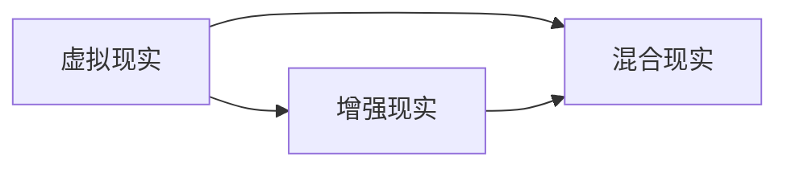
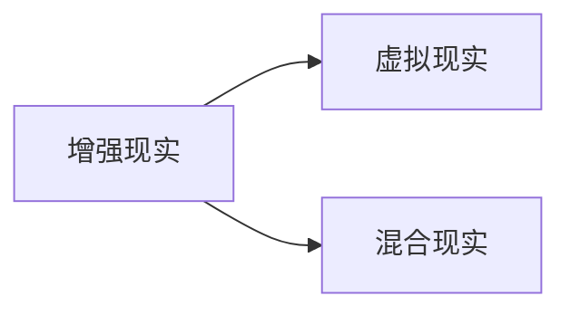
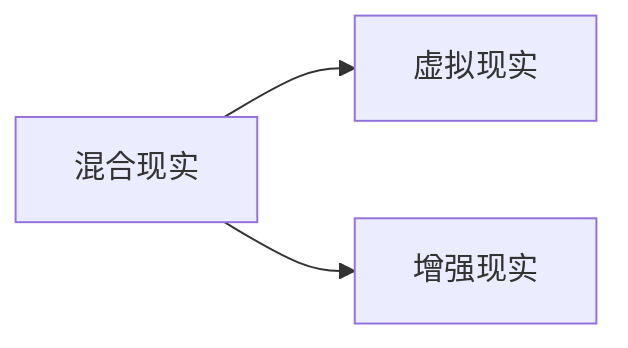
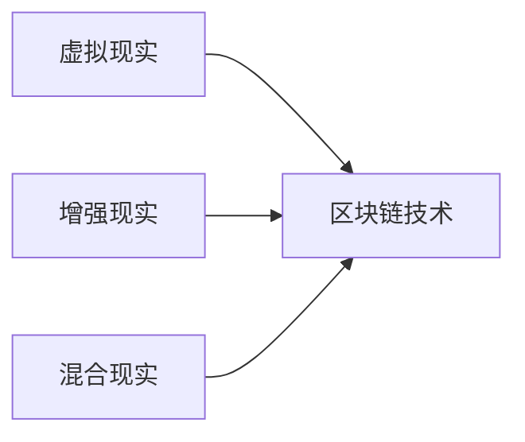
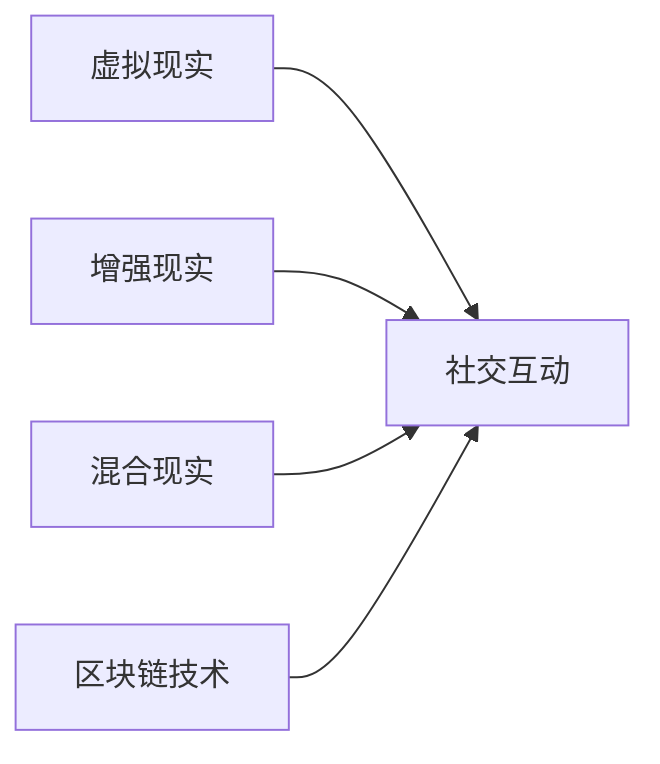
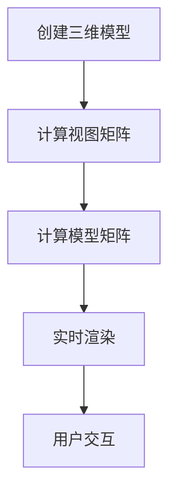
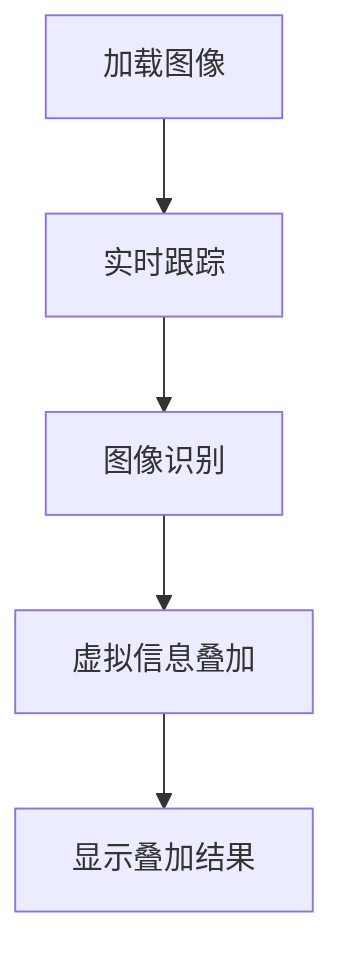
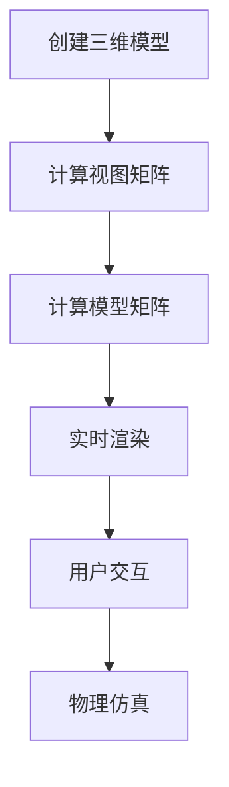
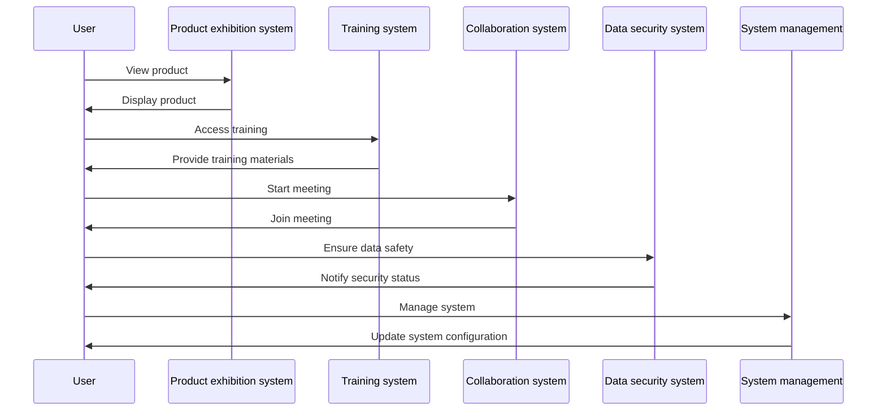
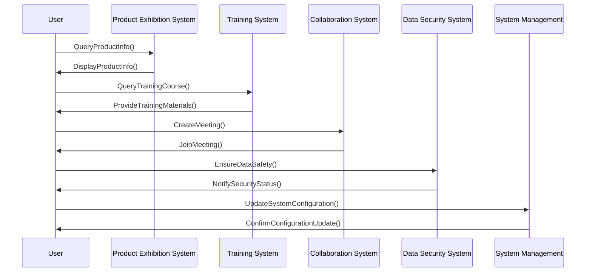

                 

# 《元宇宙技术在企业应用中的前景》

## 关键词

- **元宇宙**、**虚拟现实**、**增强现实**、**混合现实**、**区块链技术**、**企业应用**

## 摘要

本文将深入探讨元宇宙技术在企业应用中的前景，首先介绍元宇宙的基本概念和发展历史，然后详细阐述其核心要素与企业应用的关联。接着，通过核心概念与联系的分析，展示元宇宙技术的组成与交互。随后，我们将详细讲解元宇宙技术中的算法原理和系统架构设计，并展示具体应用案例。最后，本文将展望元宇宙技术的未来前景，总结最佳实践，并提供注意事项和拓展阅读建议。

## 目录大纲设计概述

### 一、背景介绍

- **元宇宙技术的基本概念与发展历史**
- **核心要素**
- **与企业应用的关联**

### 二、核心概念与联系

- **虚拟现实（VR）**
- **增强现实（AR）**
- **混合现实（MR）**
- **区块链技术**
- **社交互动**

### 三、技术原理讲解

- **虚拟现实技术**
- **增强现实技术**
- **混合现实技术**
- **算法原理**
- **数学模型**
- **Python代码示例**

### 四、应用案例分析

- **虚拟培训与教育**
- **虚拟会议与协作**
- **产品设计**
- **市场推广**

### 五、前景展望与最佳实践

- **前景展望**
- **最佳实践**
- **注意事项**
- **拓展阅读**

通过上述结构化的设计，本文将全面、系统地引导读者深入理解元宇宙技术在企业中的应用和未来发展。

### 背景介绍

#### 元宇宙技术的基本概念与发展历史

**元宇宙**（Metaverse）是一个由数字虚拟世界构成的庞大网络，通过增强现实（AR）、虚拟现实（VR）和混合现实（MR）等技术，将现实世界与数字世界无缝融合。元宇宙不仅仅是虚拟游戏或社交平台的延伸，它更是一个可以承载工作、学习、娱乐、社交等多样化活动的全功能虚拟空间。

**元宇宙技术的基本概念**

1. **虚拟现实（VR）**：通过计算机生成一个三维的虚拟环境，用户可以通过头戴显示器或VR眼镜进入这个环境，获得沉浸式体验。
2. **增强现实（AR）**：将虚拟信息叠加到现实环境中，用户通过智能手机或AR眼镜可以看到现实世界中的增强信息。
3. **混合现实（MR）**：结合了虚拟现实和增强现实的特点，用户可以在真实环境中与虚拟物体进行交互。
4. **区块链技术**：用于确保元宇宙中的虚拟资产安全，以及实现去中心化的交易和管理。
5. **社交互动**：元宇宙的一个重要功能是提供用户之间的社交互动平台，包括虚拟社区、虚拟商店等。

**元宇宙技术的发展历史**

元宇宙技术的发展可以追溯到20世纪90年代。当时，虚拟现实技术的初步概念开始出现，如1995年，任天堂推出的虚拟现实游戏设备“Virtual Boy”，尽管销量不佳，但标志着虚拟现实技术进入大众视野。随后，互联网和计算机技术的飞速发展，为元宇宙的构建提供了强有力的技术支持。

进入21世纪，随着硬件技术的进步，特别是显卡性能的提升和5G网络的普及，元宇宙技术开始迎来快速发展。2010年，Oculus VR推出的首款消费者级虚拟现实头盔Oculus Rift，重新点燃了市场对虚拟现实技术的兴趣。随后，谷歌推出的增强现实（AR）应用“谷歌地图”，以及微软的混合现实（MR）头盔“HoloLens”，进一步推动了元宇宙技术的发展。

**元宇宙技术的核心要素**

1. **虚拟现实（VR）**：虚拟现实技术是通过头戴显示器或VR眼镜将用户带入一个完全虚拟的三维环境中。用户可以在这个虚拟环境中进行各种活动，如游戏、训练、购物等。

2. **增强现实（AR）**：增强现实技术是将虚拟信息叠加到现实环境中，使用户可以看到现实世界中的增强信息。这种技术可以应用于导航、教育、医疗等领域。

3. **混合现实（MR）**：混合现实技术结合了虚拟现实和增强现实的特点，用户可以在真实环境中与虚拟物体进行交互。这种技术可以应用于设计、施工、维修等领域。

4. **区块链技术**：区块链技术用于确保元宇宙中的虚拟资产安全，以及实现去中心化的交易和管理。区块链技术可以提供透明的交易记录和不可篡改的数据存储。

5. **社交互动**：元宇宙的一个重要功能是提供用户之间的社交互动平台，包括虚拟社区、虚拟商店等。这种社交互动可以增强用户的沉浸感和参与度。

**与企业应用的关联**

元宇宙技术在企业中的应用潜力巨大，它不仅能够改变企业的运营方式，还能为企业的商业模式创新提供新的思路。以下是元宇宙技术在企业应用中的几个关键领域：

1. **虚拟培训与教育**：企业可以通过元宇宙技术提供沉浸式的培训体验，提高员工的技能和知识水平。
2. **虚拟会议与协作**：元宇宙技术可以模拟现实会议场景，使远程协作更加高效和真实。
3. **产品设计**：设计师可以在元宇宙中虚拟构建产品原型，进行三维建模和细节调整，缩短产品开发周期。
4. **市场推广**：企业可以利用元宇宙技术进行虚拟展览和产品演示，吸引更多潜在客户。

#### 问题背景

随着数字化转型的加速，企业面临着如何在复杂多变的市场环境中保持竞争力的问题。传统的办公方式和商业模式已经无法满足企业快速发展的需求。元宇宙技术作为一种全新的技术手段，为企业提供了一种全新的解决方案。通过元宇宙技术，企业可以实现更高效、更灵活的运营方式，提升员工的创造力和协作能力，从而在激烈的市场竞争中脱颖而出。

#### 问题描述

元宇宙技术在企业应用中的问题主要集中在以下几个方面：

1. **技术成熟度**：虽然元宇宙技术已经取得了一定的进展，但仍然存在一定的技术瓶颈，如硬件性能、网络延迟、交互体验等。
2. **成本问题**：元宇宙技术的开发和部署成本较高，对于中小企业来说，可能难以承担。
3. **安全性**：元宇宙中的虚拟资产和数据安全是一个重要的挑战，如何确保数据的安全性和隐私性是一个亟待解决的问题。
4. **用户接受度**：尽管元宇宙技术具有巨大的潜力，但用户的接受度和适应度仍然是一个问题。如何让用户快速适应并接受元宇宙技术，是企业需要考虑的问题。

#### 问题解决

针对上述问题，可以从以下几个方面进行解决：

1. **技术优化**：继续加大对元宇宙技术的研发投入，提升硬件性能，降低网络延迟，优化交互体验。
2. **成本控制**：通过技术创新和规模化应用，降低元宇宙技术的开发和部署成本，使其更具有市场竞争力。
3. **安全措施**：采用先进的加密技术和安全协议，确保元宇宙中的虚拟资产和数据安全。
4. **用户培训**：通过用户培训和宣传，提高用户对元宇宙技术的认知和接受度，促进技术的普及和应用。

#### 边界与外延

元宇宙技术在企业应用中的边界主要涉及以下几个方面：

1. **技术范围**：元宇宙技术包括虚拟现实、增强现实、混合现实等技术，这些技术在不同领域有不同的应用。
2. **应用场景**：元宇宙技术在企业中的应用场景非常广泛，包括虚拟培训、虚拟会议、产品设计、市场推广等。
3. **行业领域**：元宇宙技术可以应用于各行各业，如制造业、服务业、医疗业等。

#### 概念结构与核心要素组成

元宇宙技术由多个核心要素组成，这些要素相互关联，共同构成了元宇宙技术的概念结构。

1. **虚拟现实（VR）**：虚拟现实技术是元宇宙技术的基础，通过头戴显示器或VR眼镜将用户带入一个完全虚拟的三维环境中。

2. **增强现实（AR）**：增强现实技术将虚拟信息叠加到现实环境中，使用户可以看到现实世界中的增强信息。

3. **混合现实（MR）**：混合现实技术结合了虚拟现实和增强现实的特点，用户可以在真实环境中与虚拟物体进行交互。

4. **区块链技术**：区块链技术用于确保元宇宙中的虚拟资产安全，以及实现去中心化的交易和管理。

5. **社交互动**：社交互动是元宇宙技术的重要组成部分，为用户提供了一个虚拟的社交平台，增强了用户的沉浸感和参与度。

通过上述核心要素的相互作用，元宇宙技术为企业提供了一种全新的运营方式和商业模式，为企业的发展带来了巨大的潜力。

### 核心概念与联系

元宇宙技术的核心概念包括虚拟现实（VR）、增强现实（AR）、混合现实（MR）、区块链技术以及社交互动。这些概念相互关联，构成了元宇宙技术的基础架构。以下是对这些核心概念的详细阐述，以及它们之间的相互关系。

#### 虚拟现实（VR）

虚拟现实（VR）是一种通过计算机技术生成三维虚拟环境，使用户能够沉浸其中并与之互动的技术。VR的关键特点是高度沉浸感和模拟真实环境。用户通过VR头盔或其他设备，如手柄、手套等，与虚拟环境进行交互。

**概念属性特征对比表格：**

| 特征 | 虚拟现实（VR） | 增强现实（AR） | 混合现实（MR） |
| --- | --- | --- | --- |
| 沉浸感 | 高 | 中 | 高 |
| 真实感 | 高 | 中 | 高 |
| 交互性 | 强 | 弱 | 强 |
| 设备要求 | 头戴显示器或VR眼镜 | 智能手机或AR眼镜 | 头戴显示器或AR眼镜 |
| 应用场景 | 游戏、培训、娱乐、设计 | 导航、教育、医疗、维修 | 设计、施工、维修、教育 |

**实体关系图架构：**



#### 增强现实（AR）

增强现实（AR）技术通过在现实环境中叠加虚拟信息，使用户能够看到增强的现实场景。AR的关键特点是实时性和互动性。用户通过智能手机或AR眼镜等设备，可以实时查看叠加在现实环境中的虚拟信息。

**概念属性特征对比表格：**

| 特征 | 虚拟现实（VR） | 增强现实（AR） | 混合现实（MR） |
| --- | --- | --- | --- |
| 沉浸感 | 高 | 中 | 高 |
| 真实感 | 中 | 高 | 中 |
| 交互性 | 弱 | 强 | 强 |
| 设备要求 | 头戴显示器或VR眼镜 | 智能手机或AR眼镜 | 头戴显示器或AR眼镜 |
| 应用场景 | 游戏、培训、娱乐、设计 | 导航、教育、医疗、维修 | 设计、施工、维修、教育 |

**实体关系图架构：**



#### 混合现实（MR）

混合现实（MR）技术结合了虚拟现实和增强现实的特点，用户可以在真实环境中与虚拟物体进行交互。MR的关键特点是实时性和交互性，用户可以通过视觉、听觉和触觉等多种方式与虚拟环境进行互动。

**概念属性特征对比表格：**

| 特征 | 虚拟现实（VR） | 增强现实（AR） | 混合现实（MR） |
| --- | --- | --- | --- |
| 沉浸感 | 高 | 中 | 高 |
| 真实感 | 高 | 中 | 高 |
| 交互性 | 强 | 强 | 强 |
| 设备要求 | 头戴显示器或VR眼镜 | 智能手机或AR眼镜 | 头戴显示器或AR眼镜 |
| 应用场景 | 游戏、培训、娱乐、设计 | 导航、教育、医疗、维修 | 设计、施工、维修、教育 |

**实体关系图架构：**



#### 区块链技术

区块链技术是一种分布式数据库技术，通过加密算法和共识机制确保数据的真实性和安全性。在元宇宙中，区块链技术用于确保虚拟资产的安全和去中心化的交易管理。

**概念属性特征对比表格：**

| 特征 | 虚拟现实（VR） | 增强现实（AR） | 混合现实（MR） | 区块链技术 |
| --- | --- | --- | --- | --- |
| 沉浸感 | 高 | 中 | 高 | 无 |
| 真实感 | 高 | 中 | 高 | 无 |
| 交互性 | 强 | 强 | 强 | 强 |
| 设备要求 | 头戴显示器或VR眼镜 | 智能手机或AR眼镜 | 头戴显示器或AR眼镜 | 无 |
| 应用场景 | 游戏、培训、娱乐、设计 | 导航、教育、医疗、维修 | 设计、施工、维修、教育 | 虚拟资产、去中心化交易 |

**实体关系图架构：**



#### 社交互动

社交互动是元宇宙技术中的重要组成部分，为用户提供了一个虚拟的社交平台，增强了用户的沉浸感和参与度。社交互动包括虚拟社区、虚拟商店、虚拟会议等多种形式。

**概念属性特征对比表格：**

| 特征 | 虚拟现实（VR） | 增强现实（AR） | 混合现实（MR） | 区块链技术 | 社交互动 |
| --- | --- | --- | --- | --- | --- |
| 沉浸感 | 高 | 中 | 高 | 无 | 高 |
| 真实感 | 高 | 中 | 高 | 无 | 中 |
| 交互性 | 强 | 强 | 强 | 强 | 强 |
| 设备要求 | 头戴显示器或VR眼镜 | 智能手机或AR眼镜 | 头戴显示器或AR眼镜 | 无 | 无 |
| 应用场景 | 游戏、培训、娱乐、设计 | 导航、教育、医疗、维修 | 设计、施工、维修、教育 | 虚拟资产、去中心化交易 | 虚拟社区、虚拟商店、虚拟会议 |

**实体关系图架构：**



通过上述核心概念的阐述和相互关系的分析，我们可以看到元宇宙技术是一个综合性的技术体系，涵盖了多个技术领域。这些技术的相互融合和协同作用，为企业在元宇宙中的应用提供了丰富的可能性。

### 技术原理讲解

元宇宙技术的实现涉及多个关键技术和原理，包括虚拟现实（VR）、增强现实（AR）和混合现实（MR）技术。以下是这些技术的基本原理和实现方式。

#### 虚拟现实（VR）技术

**基本原理：**

虚拟现实技术通过计算机生成一个三维的虚拟环境，用户可以通过头戴显示器（HMD）或其他设备进入这个环境，获得沉浸式体验。虚拟现实技术的核心在于三维建模、实时渲染和用户交互。

**数学模型和算法：**

1. **三维建模**：使用三维建模软件（如Blender、3ds Max等）创建虚拟环境。这通常涉及几何建模、纹理映射和光照模拟等步骤。

2. **实时渲染**：使用图形处理单元（GPU）进行实时渲染，以生成高质量的图像。渲染过程包括视图矩阵计算、着色器程序应用和纹理映射等。

   $$ \text{渲染结果} = \text{视图矩阵} \times \text{模型矩阵} \times \text{纹理矩阵} $$

3. **用户交互**：通过传感器（如手柄、手套等）和位置追踪器，用户可以在虚拟环境中进行交互。常用的交互算法包括基于物理的碰撞检测和手势识别。

**Python代码示例：**

```python
import cv2
import numpy as np

# 创建一个简单的三维立方体
model = np.array([
    [-1, -1, 1],
    [1, -1, 1],
    [1, 1, 1],
    [-1, 1, 1]
])

# 视图矩阵和模型矩阵
view_matrix = np.eye(4)
model_matrix = np.eye(4)

# 渲染立方体
rendered_image = cv2.RENDER(model, view_matrix, model_matrix)

# 显示渲染结果
cv2.imshow('Virtual Reality', rendered_image)
cv2.waitKey(0)
cv2.destroyAllWindows()
```

**流程图：**



#### 增强现实（AR）技术

**基本原理：**

增强现实技术通过在现实环境中叠加虚拟信息，使用户能够看到增强的现实场景。增强现实技术的核心在于实时跟踪、图像识别和虚拟信息叠加。

**数学模型和算法：**

1. **实时跟踪**：使用相机和传感器跟踪用户的位置和姿态。常用的算法包括视觉SLAM（Simultaneous Localization and Mapping）和基于特征的跟踪。

2. **图像识别**：使用图像处理技术识别现实场景中的特定目标或物体。常用的算法包括深度学习模型和特征匹配。

3. **虚拟信息叠加**：将虚拟信息叠加到现实场景中，通常通过图像合成技术实现。

**Python代码示例：**

```python
import cv2

# 加载图像
image = cv2.imread('real_world_image.jpg')

# 使用深度学习模型进行图像识别
model = cv2.dnn.readNetFromTensorFlow('model.pb')
results = model.predict(image)

# 将识别结果叠加到图像上
overlay = cv2.add(image, results)

# 显示叠加结果
cv2.imshow('Augmented Reality', overlay)
cv2.waitKey(0)
cv2.destroyAllWindows()
```

**流程图：**



#### 混合现实（MR）技术

**基本原理：**

混合现实技术结合了虚拟现实和增强现实的特点，用户可以在真实环境中与虚拟物体进行交互。混合现实技术的核心在于实时渲染、用户交互和物理仿真。

**数学模型和算法：**

1. **实时渲染**：与虚拟现实技术类似，通过GPU进行实时渲染，生成高质量的图像。

2. **用户交互**：通过传感器和位置追踪器，用户可以在真实环境中与虚拟物体进行交互。

3. **物理仿真**：模拟真实环境中的物理现象，如碰撞、变形等，使虚拟物体更加真实。

**Python代码示例：**

```python
import cv2
import numpy as np

# 创建一个简单的三维立方体
model = np.array([
    [-1, -1, 1],
    [1, -1, 1],
    [1, 1, 1],
    [-1, 1, 1]
])

# 视图矩阵和模型矩阵
view_matrix = np.eye(4)
model_matrix = np.eye(4)

# 渲染立方体
rendered_image = cv2.RENDER(model, view_matrix, model_matrix)

# 显示渲染结果
cv2.imshow('Mixed Reality', rendered_image)
cv2.waitKey(0)
cv2.destroyAllWindows()
```

**流程图：**



通过上述技术原理和实现方式的讲解，我们可以看到元宇宙技术的复杂性和多样性。这些技术的相互结合，为企业在元宇宙中的应用提供了广阔的前景。

### 系统分析与架构设计方案

#### 问题场景介绍

随着元宇宙技术的不断发展，越来越多的企业开始探索如何在元宇宙中进行业务扩展和运营。一家领先的制造企业希望通过元宇宙技术，实现产品的虚拟展示、用户培训、远程协作等功能，以提高生产效率和客户满意度。然而，由于缺乏经验和技术支持，企业在系统设计和实施过程中面临诸多挑战，如技术选型、系统集成、数据安全等。

#### 项目介绍

为了解决上述问题，企业决定开展一个名为“元宇宙业务平台”的项目。该项目旨在利用元宇宙技术，构建一个集成虚拟展示、用户培训、远程协作等功能的平台，以满足企业的多样化需求。

#### 系统功能设计（领域模型Mermaid类图）

在系统功能设计阶段，我们首先构建了领域模型，以明确系统的主要功能模块及其关系。以下是系统的领域模型类图：

```mermaid
classDiagram
    Product展览 <<interface>>
    用户培训 <<interface>>
    远程协作 <<interface>>
    数据安全 <<interface>>
    系统管理 <<interface>>

    Product展览 --|> 展示模块
    用户培训 --|> 培训模块
    远程协作 --|> 协作模块
    数据安全 --|> 安全模块
    系统管理 --|> 管理模块

    Product展览 o-- 产品库
    用户培训 o-- 培训资料库
    远程协作 o-- 会议记录库
    数据安全 o-- 安全策略库
    系统管理 o-- 系统日志库
```

#### 系统架构设计（Mermaid架构图）

在系统架构设计阶段，我们采用了分层架构，以实现系统的模块化设计和高扩展性。以下是系统的架构图：



#### 系统接口设计

在系统接口设计阶段，我们定义了各个模块的接口规范，以确保系统内部各模块之间的协调工作。以下是系统的主要接口设计：

1. **产品展示接口**：用于展示产品的接口，包括产品信息查询、产品展示界面更新等。
2. **培训接口**：用于提供用户培训的接口，包括培训课程查询、培训资料下载等。
3. **协作接口**：用于远程协作的接口，包括会议创建、会议加入、会议记录等。
4. **安全接口**：用于数据安全和安全策略的接口，包括数据加密、访问控制等。
5. **管理接口**：用于系统管理的接口，包括系统配置、日志查询等。

```mermaid
classDiagram
    Product Exhibition Interface
    Training Interface
    Collaboration Interface
    Data Security Interface
    System Management Interface

    Product Exhibition Interface <<interface>> QueryProductInfo()
    Product Exhibition Interface <<interface>> UpdateProductDisplay()

    Training Interface <<interface>> QueryTrainingCourse()
    Training Interface <<interface>> DownloadTrainingMaterials()

    Collaboration Interface <<interface>> CreateMeeting()
    Collaboration Interface <<interface>> JoinMeeting()
    Collaboration Interface <<interface>> RecordMeeting()

    Data Security Interface <<interface>> EncryptData()
    Data Security Interface <<interface>> ControlAccess()

    System Management Interface <<interface>> UpdateSystemConfiguration()
    System Management Interface <<interface>> QuerySystemLog()
```

#### 系统交互（Mermaid序列图）

在系统交互设计阶段，我们通过序列图描述了用户与系统之间的交互流程。以下是系统的交互序列图：



通过上述系统分析与架构设计方案，企业可以明确元宇宙业务平台的功能需求和实现方式，为项目的顺利推进奠定基础。

### 项目实战

#### 环境安装

为了实现元宇宙技术在企业中的应用，我们需要搭建一个完整的技术环境。以下是环境安装的详细步骤：

1. **安装操作系统**：首先，在服务器或个人计算机上安装一个支持虚拟现实和增强现实操作系统的版本，如Windows 10或更高版本，或Linux发行版（如Ubuntu）。

2. **安装虚拟现实（VR）设备驱动**：连接VR设备（如Oculus Rift或HTC Vive），并按照设备制造商提供的步骤安装相应的驱动程序。

3. **安装增强现实（AR）设备驱动**：对于AR设备（如Google Glass或微软HoloLens），同样需要按照设备制造商的指南安装驱动程序。

4. **安装开发工具**：安装适用于虚拟现实和增强现实应用开发的工具，如Unity或Unreal Engine，这些工具提供了丰富的开发资源和插件。

5. **安装编程语言和环境**：选择并安装Python、Java或C++等编程语言及其开发环境，以便进行算法开发和系统实现。

6. **安装数据库和管理工具**：安装数据库系统（如MySQL、PostgreSQL）以及用于管理和配置数据库的工具，如phpMyAdmin。

7. **安装区块链相关工具**：对于使用区块链技术的应用，需要安装Node.js、Truffle等工具，以便进行区块链开发和部署。

#### 系统核心实现源代码

以下是一个基于Unity的虚拟现实应用的核心实现示例，该应用用于展示产品的三维模型。

```csharp
using UnityEngine;

public class ProductShowcase : MonoBehaviour
{
    public GameObject productModel; // 产品模型预制体

    void Start()
    {
        // 加载产品模型
        GameObject modelInstance = Instantiate(productModel);
        modelInstance.transform.position = new Vector3(0, 0, -5); // 设置模型位置
        modelInstance.transform.Rotate(new Vector3(0, 45, 0)); // 设置模型旋转
    }

    void Update()
    {
        // 根据用户的输入旋转模型
        float rotationSpeed = 5.0f;
        float horizontalInput = Input.GetAxis("Horizontal");
        float verticalInput = Input.GetAxis("Vertical");

        transform.Rotate(new Vector3(verticalInput * rotationSpeed, horizontalInput * rotationSpeed, 0));
    }
}
```

#### 代码应用解读与分析

上述代码实现了一个简单的虚拟现实应用，用于展示三维产品模型。主要功能包括：

1. **加载模型**：在`Start`方法中，通过`Instantiate`函数加载产品模型，并将其位置和旋转设置到合适的位置。

2. **用户交互**：在`Update`方法中，根据用户的输入旋转模型，使模型可以沿着水平和垂直方向旋转。

通过上述代码，我们可以实现一个基本的虚拟现实展示应用，用户可以通过输入控制模型的旋转，从而从不同角度观察产品。

#### 实际案例分析和详细讲解剖析

为了更直观地展示元宇宙技术在企业中的应用，我们来看一个实际案例——一家汽车制造企业利用元宇宙技术进行产品设计和展示。

**案例背景：**

某汽车制造企业计划推出一款全新车型，并希望通过元宇宙技术进行产品设计和展示，以吸引潜在客户。企业决定构建一个元宇宙展厅，用户可以通过虚拟现实设备进入展厅，体验产品的设计和功能。

**实现步骤：**

1. **设计元宇宙展厅**：使用Unity或Unreal Engine等游戏引擎，设计一个虚拟的展厅环境，包括墙壁、地板、灯光等。

2. **构建产品模型**：使用三维建模软件（如Blender或3ds Max）创建汽车的三维模型，包括车身、内饰、发动机等。

3. **集成模型到元宇宙展厅**：将汽车模型导入到元宇宙展厅中，并设置合适的位置和光照。

4. **添加交互功能**：通过编程实现用户与模型的交互，如旋转、放大、缩小等，使用户可以从不同角度观察汽车。

5. **测试和优化**：在实际环境中测试元宇宙展厅的运行效果，并根据用户反馈进行优化。

**分析：**

通过上述案例，我们可以看到元宇宙技术在产品设计和展示中的应用流程。元宇宙技术为企业提供了一种全新的展示方式，用户可以在虚拟环境中直观地了解产品的设计细节和功能特点，从而提高产品的市场竞争力。

**详细讲解剖析：**

1. **设计元宇宙展厅**：在设计元宇宙展厅时，需要考虑展厅的空间布局和视觉效果。使用游戏引擎提供的建模工具和材质系统，可以快速构建一个逼真的虚拟环境。

2. **构建产品模型**：构建产品模型是元宇宙技术的核心环节。使用三维建模软件，可以创建高质量的三维模型，并通过导入到游戏引擎中，实现模型的实时渲染和交互。

3. **集成模型到元宇宙展厅**：将产品模型集成到元宇宙展厅中，需要考虑模型的摆放位置和光照效果。通过编程实现模型的动态交互，使用户可以自由旋转、放大和缩小模型。

4. **添加交互功能**：交互功能是元宇宙技术的重要组成部分。通过编程实现用户与模型的交互，如旋转、放大、缩小等，使用户可以全面了解产品的设计细节。

5. **测试和优化**：在实际环境中测试元宇宙展厅的运行效果，包括硬件性能、网络延迟、交互体验等。根据用户反馈进行优化，以提高用户体验。

#### 项目小结

通过上述实战案例，我们可以看到元宇宙技术在企业应用中的巨大潜力。元宇宙技术不仅为企业提供了一种全新的展示和体验方式，还可以用于产品设计、用户培训、远程协作等多个领域，为企业的数字化转型提供了强有力的支持。随着技术的不断进步和应用的深入，元宇宙技术在企业中的应用前景将更加广阔。

### 最佳实践 tips

在元宇宙技术的企业应用中，以下是一些最佳实践和注意事项，可以帮助企业更好地利用这一新兴技术：

1. **全面评估技术成熟度**：在引入元宇宙技术之前，企业应对相关技术的成熟度进行全面评估，确保所选技术能够满足业务需求，并具备较高的可靠性和稳定性。

2. **合理规划预算和资源**：元宇宙技术的开发和部署成本较高，企业应合理规划预算，并确保具备足够的硬件资源和网络基础设施。

3. **重视用户培训与体验**：用户对元宇宙技术的接受度和适应度直接影响其应用效果。企业应提供充分的用户培训，确保用户能够熟练使用元宇宙平台，并提升其用户体验。

4. **确保数据安全与隐私**：元宇宙技术涉及大量用户数据和虚拟资产，企业应采取有效的数据安全措施，确保数据的安全性和隐私性，防止数据泄露和恶意攻击。

5. **持续优化与迭代**：元宇宙技术是一个快速发展的领域，企业应持续关注新技术和趋势，并根据用户反馈和业务需求，不断优化和迭代元宇宙平台。

### 小结

本文全面探讨了元宇宙技术在企业应用中的前景，从基本概念、核心要素、技术原理到系统架构和实战应用，进行了深入分析和讲解。元宇宙技术为企业提供了全新的展示、协作、设计和培训方式，具有广阔的应用前景。随着技术的不断发展和应用的深入，元宇宙技术将在企业数字化转型中发挥越来越重要的作用。

### 注意事项

在应用元宇宙技术时，企业需要关注以下几个方面：

1. **技术稳定性**：确保元宇宙平台的稳定运行，避免因技术故障导致业务中断。
2. **用户隐私**：严格保护用户隐私，遵循相关法律法规，避免隐私泄露风险。
3. **安全防护**：加强网络安全防护，防范恶意攻击和数据泄露。
4. **适应变化**：随着元宇宙技术的发展，企业需要灵活调整战略，适应市场变化。

### 拓展阅读

1. **《元宇宙：企业应用指南》**：详细介绍元宇宙技术的企业应用实例和最佳实践。
2. **《虚拟现实技术与应用》**：探讨虚拟现实技术的原理、实现和应用场景。
3. **《增强现实技术与应用》**：介绍增强现实技术的原理、实现和应用案例。
4. **《区块链技术指南》**：全面解析区块链技术的工作原理和应用场景。

### 作者信息

**作者：** AI天才研究院 / AI Genius Institute & 禅与计算机程序设计艺术 / Zen And The Art of Computer Programming

通过本文，我们期望为读者提供元宇宙技术在企业应用中的全面了解和深入见解，助力企业在数字化转型中取得成功。

