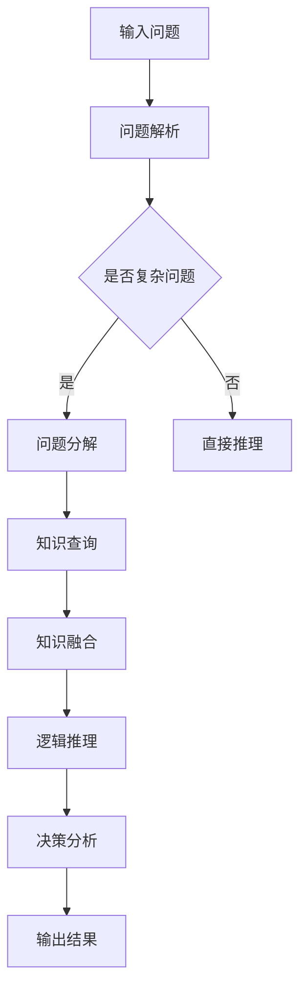
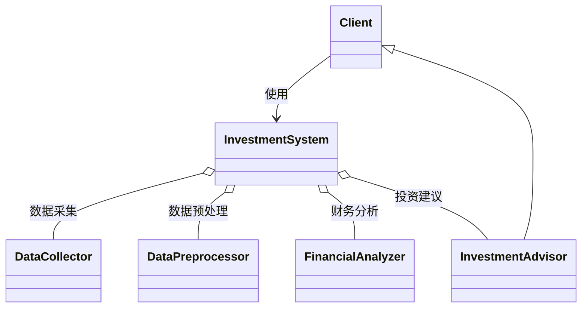
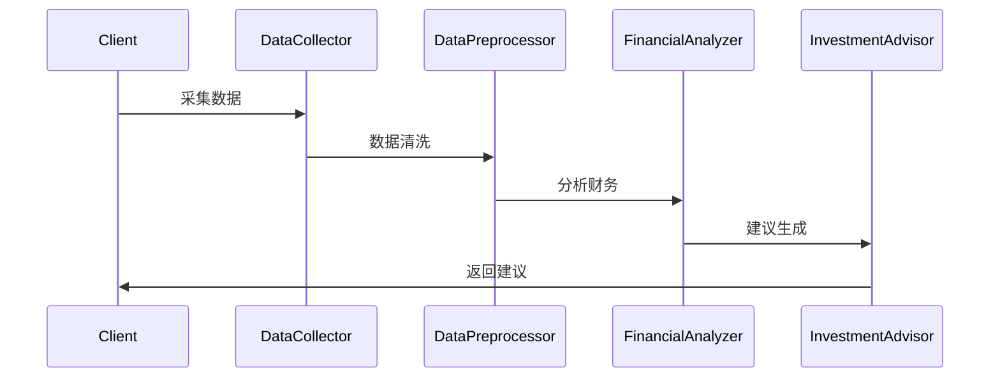
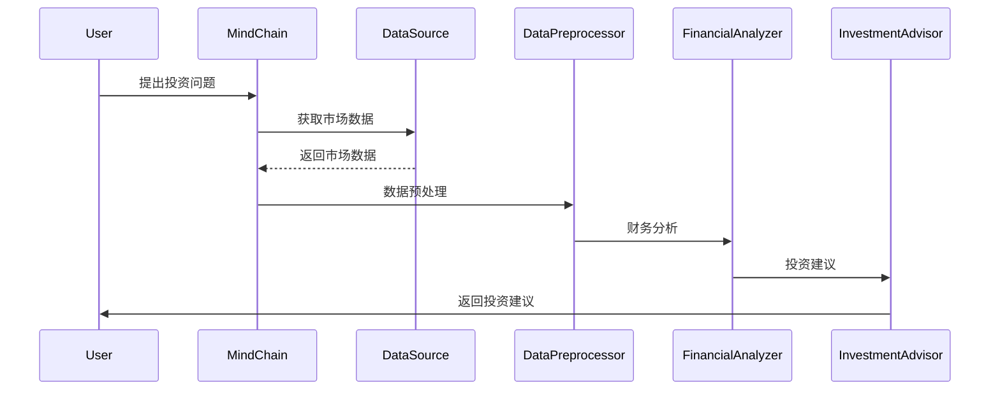

                 

### 利用思维链增强AI的逻辑分析与决策能力探讨

#### 关键词：
- 思维链
- AI逻辑分析
- 决策能力
- 人工智能
- 深度学习

#### 摘要：
本文探讨了如何利用思维链（Mind Chain）增强人工智能（AI）的逻辑分析与决策能力。思维链是一种模拟人类思维过程的AI模型，通过问题分解、抽象和多源知识融合，实现对复杂问题的逻辑分析和决策。本文将详细介绍思维链的核心概念、算法原理、系统架构设计以及实际应用，以期为AI在复杂场景下的应用提供新的思路和方法。

## 1.1 问题背景、问题描述与问题解决探讨

### 1.1.1 问题背景

随着人工智能技术的迅猛发展，AI在各个领域得到了广泛应用。然而，传统的AI模型在处理复杂逻辑和决策问题时，往往存在局限性。例如，在金融领域，AI模型在风险评估和投资决策方面存在缺陷；在医疗领域，AI模型在诊断和治疗建议方面存在误诊问题；在物流领域，AI模型在路径规划和运输调度方面存在效率问题。这些问题背后，都暴露出传统AI模型在逻辑分析与决策能力方面的不足。

### 1.1.2 问题描述

当前AI模型在逻辑分析与决策能力方面的不足主要体现在以下几个方面：

1. **问题理解能力不足**：传统AI模型在处理复杂问题时，往往难以准确理解问题背后的意图和需求，导致推理结果偏离预期。
2. **推理能力有限**：传统AI模型在处理复杂逻辑问题时，往往依赖已有数据或规则进行简单匹配，难以进行深度推理。
3. **决策能力欠缺**：在面对不确定性问题时，传统AI模型往往难以做出合理决策，导致决策结果不够科学和可靠。

### 1.1.3 问题解决

为了解决上述问题，研究者们提出了思维链（Mind Chain）这一概念，旨在通过模拟人类思维过程，增强AI的逻辑分析和决策能力。思维链的核心思路包括：

1. **问题分解与抽象**：将复杂问题分解为多个子问题，并对问题进行抽象，以便更好地理解问题。
2. **多维度知识融合**：结合多源知识，实现知识融合，提高AI的推理能力。
3. **决策能力增强**：通过模拟人类决策过程，提高AI在面对不确定性问题时的决策能力。

### 1.1.4 边界与外延

1. **边界**：思维链主要应用于需要复杂逻辑分析与决策能力的领域，如金融、医疗、物流等。
2. **外延**：思维链不仅可以应用于AI模型，还可以扩展到其他领域，如人类认知科学、教育等。

### 1.1.5 概念结构与核心要素组成

思维链的核心结构包括：

1. **知识层**：包含各种领域的知识库，用于支持AI模型进行推理和决策。
2. **模型层**：基于深度学习技术，实现对知识进行建模，从而提高AI的逻辑分析能力。
3. **接口层**：提供与其他系统或应用的接口，实现思维链与其他系统的集成。

### 1.1.6 本章小结

本章主要介绍了思维链的背景、问题描述与问题解决方法。思维链作为一种新型AI模型，通过模拟人类思维过程，旨在解决传统AI模型在逻辑分析与决策能力方面的不足。接下来的章节将详细探讨思维链的原理、算法和实际应用。

## 1.2 核心概念与联系

### 1.2.1 思维链（Mind Chain）概念

思维链是一种模拟人类思维过程的AI模型，它通过将问题分解、抽象和知识融合，实现对复杂问题的逻辑分析和决策。思维链的核心在于其多层次的模型结构，包括知识层、模型层和接口层。

#### 1.2.1.1 知识层

知识层是思维链的基础，它包含各种领域的知识库。这些知识库可以是结构化数据，如数据库、知识图谱等，也可以是非结构化数据，如图文、语音等。知识库的丰富程度直接影响思维链的推理能力和决策能力。

#### 1.2.1.2 模型层

模型层基于深度学习技术，对知识进行建模。通过训练，模型能够学会如何从知识库中提取信息，并进行逻辑推理和决策。模型层的核心在于如何将多源知识进行有效融合，以支持复杂问题的分析和决策。

#### 1.2.1.3 接口层

接口层提供与其他系统或应用的接口，实现思维链与其他系统的集成。接口层的设计要考虑到易用性和可扩展性，以便思维链能够灵活应用于不同领域。

### 1.2.2 概念属性特征对比表格

| 概念 | 定义 | 属性特征 | 对比 |
| --- | --- | --- | --- |
| 思维链 | 模拟人类思维过程的AI模型 | 知识库丰富、多源知识融合、深度学习建模 | 与传统AI模型相比，思维链在逻辑分析和决策能力方面具有优势 |
| 知识层 | 包含各种领域的知识库 | 结构化数据、非结构化数据 | 支持多源知识融合 |
| 模型层 | 基于深度学习技术对知识进行建模 | 逻辑推理、决策能力 | 提高AI的推理和决策能力 |
| 接口层 | 提供与其他系统或应用的接口 | 易用性、可扩展性 | 实现与其他系统的集成 |

### 1.2.3 ER实体关系图架构

下面是一个简化的ER实体关系图，用于描述思维链的核心结构：

```mermaid
erDiagram
  KnowledgeLayer ||--|{ ModelLayer } ModelLayer
  ModelLayer ||--|{ InterfaceLayer } InterfaceLayer
```

### 1.2.4 本章小结

本章主要介绍了思维链的核心概念及其结构，包括知识层、模型层和接口层。通过对比分析，我们了解了思维链与传统AI模型的不同之处，以及其在逻辑分析和决策能力方面的优势。接下来，我们将进一步探讨思维链的算法原理和实现方法。

## 1.3 思维链的算法原理

### 1.3.1 算法框架

思维链的算法框架主要包括以下几个步骤：

1. **问题理解**：通过自然语言处理技术，对输入的问题进行解析，提取出关键信息，构建问题的语义表示。
2. **问题分解**：将复杂问题分解为多个子问题，以便于更精细地分析和解决。
3. **知识融合**：将多源知识进行融合，构建一个统一的语义空间，以支持问题分析和决策。
4. **逻辑推理**：基于深度学习模型，对问题进行逻辑推理，得出可能的解决方案。
5. **决策分析**：对推理结果进行决策分析，选择最优的决策方案。

### 1.3.2 算法流程

思维链的算法流程可以概括为以下步骤：

1. **输入问题**：接收用户输入的问题。
2. **问题解析**：使用自然语言处理技术，将问题解析为结构化的形式。
3. **问题分解**：将问题分解为多个子问题，每个子问题可以独立解决。
4. **知识查询**：从知识库中查询与子问题相关的知识。
5. **知识融合**：将查询到的知识进行融合，构建统一的语义空间。
6. **逻辑推理**：基于深度学习模型，对子问题进行逻辑推理。
7. **决策分析**：对逻辑推理结果进行决策分析，选择最优的决策方案。
8. **输出结果**：将决策结果返回给用户。

### 1.3.3 算法流程图

以下是一个简化的思维链算法流程图，使用Mermaid语言描述：



### 1.3.4 数学模型与公式

思维链的算法原理可以通过以下数学模型和公式进行描述：

1. **问题表示**：使用向量空间模型表示问题，其中每个维度对应问题的一个特征。
   $$ X = [x_1, x_2, ..., x_n] $$
2. **知识表示**：使用知识图谱表示知识，其中每个节点代表一个概念，边代表概念之间的关系。
   $$ KG = (V, E) $$
3. **逻辑推理**：使用图神经网络（GNN）进行逻辑推理，其中节点代表概念，边代表关系。
   $$ \hat{X} = \sigma(\text{GNN}(X, KG)) $$
4. **决策分析**：使用马尔可夫决策过程（MDP）进行决策分析，其中状态和动作表示为：
   $$ s_t, a_t $$
   $$ V(s) = \max_{a} \sum_{s'} p(s'|s, a) \cdot \rho(s') $$

### 1.3.5 通俗易懂的举例说明

假设我们要解决一个关于购买股票的问题。用户输入的问题是：“请分析苹果公司的财务状况，并给出是否购买其股票的建议。”

1. **问题解析**：将问题解析为结构化的形式，如[苹果公司，财务状况，购买股票]。
2. **问题分解**：将问题分解为两个子问题：[苹果公司财务状况分析]和[购买股票建议]。
3. **知识查询**：查询与苹果公司财务状况相关的知识，如收入、利润、市场占有率等。
4. **知识融合**：将查询到的知识进行融合，构建统一的语义空间。
5. **逻辑推理**：使用图神经网络（GNN）对问题进行逻辑推理，如分析财务状况对购买股票的影响。
6. **决策分析**：根据逻辑推理结果，使用马尔可夫决策过程（MDP）分析购买股票的决策。
7. **输出结果**：输出购买股票的建议。

通过上述步骤，思维链可以生成一个关于购买苹果公司股票的详细分析报告。

## 1.4 系统分析与架构设计方案

### 1.4.1 问题场景介绍

在金融领域，投资者需要对大量的市场信息进行分析，以做出合理的投资决策。然而，市场信息复杂多变，投资者在分析过程中往往面临信息过载、逻辑推理困难等问题。为了解决这个问题，我们可以设计一个基于思维链的智能投资分析系统，帮助投资者进行投资决策。

### 1.4.2 项目介绍

本项目旨在设计并实现一个基于思维链的智能投资分析系统，该系统能够自动获取市场数据，分析公司的财务状况，并给出投资建议。系统的主要功能包括：

1. **数据采集**：从多个数据源（如股票交易所、财经网站等）采集市场数据。
2. **数据预处理**：对采集到的市场数据进行清洗、去重和格式转换。
3. **财务分析**：对公司的财务报表进行分析，提取关键财务指标。
4. **投资建议**：根据财务分析和市场趋势，给出投资建议。

### 1.4.3 系统功能设计（领域模型mermaid类图）

以下是一个简化的领域模型类图，用于描述系统的核心功能：



### 1.4.4 系统架构设计（mermaid架构图）

以下是一个简化的系统架构图，使用Mermaid语言描述：

```mermaid
graph TB
    subgraph 数据层
        DataCollector[数据采集器]
        DataPreprocessor[数据预处理器]
    end

    subgraph 服务层
        FinancialAnalyzer[财务分析器]
        InvestmentAdvisor[投资建议器]
    end

    subgraph 界面层
        Client[客户]
        Client --> InvestmentAdvisor : 获取建议
    end

    DataCollector --> DataPreprocessor
    DataPreprocessor --> FinancialAnalyzer
    FinancialAnalyzer --> InvestmentAdvisor
```

### 1.4.5 系统接口设计

系统的主要接口包括：

1. **数据采集接口**：用于从外部数据源获取市场数据。
2. **数据预处理接口**：用于清洗和转换采集到的市场数据。
3. **财务分析接口**：用于分析公司的财务报表。
4. **投资建议接口**：用于获取投资建议。

以下是一个简化的接口设计，使用Mermaid语言描述：



### 1.4.6 系统交互（mermaid序列图）

以下是一个简化的系统交互序列图，使用Mermaid语言描述：



### 1.4.7 本章小结

本章介绍了基于思维链的智能投资分析系统的设计，包括问题场景、项目介绍、系统功能设计、系统架构设计、系统接口设计和系统交互设计。通过本章的介绍，我们可以了解到思维链在投资分析领域的应用潜力。接下来，我们将详细介绍如何实现思维链系统，包括环境安装、核心实现和实际案例分析。

## 1.5 项目实战

### 1.5.1 环境安装

要在本地环境搭建思维链系统，我们需要安装以下软件和工具：

1. **Python**：Python是思维链系统的开发语言，需要安装Python 3.8及以上版本。
2. **TensorFlow**：TensorFlow是用于训练和部署深度学习模型的框架，需要安装TensorFlow 2.0及以上版本。
3. **NumPy**：NumPy是Python的科学计算库，用于处理大规模数据。
4. **Pandas**：Pandas是Python的数据分析库，用于数据清洗和预处理。
5. **Scikit-learn**：Scikit-learn是Python的机器学习库，用于逻辑推理和决策分析。

安装命令如下：

```bash
pip install python==3.8
pip install tensorflow==2.0
pip install numpy
pip install pandas
pip install scikit-learn
```

### 1.5.2 系统核心实现

思维链系统的核心实现包括以下几个模块：

1. **数据采集模块**：用于从外部数据源采集市场数据。
2. **数据预处理模块**：用于清洗和转换采集到的市场数据。
3. **财务分析模块**：用于分析公司的财务报表。
4. **投资建议模块**：用于生成投资建议。

以下是各模块的实现代码示例：

#### 数据采集模块

```python
import requests
import json

class DataCollector:
    def __init__(self, api_url):
        self.api_url = api_url

    def collect_data(self, company_name):
        response = requests.get(f"{self.api_url}/{company_name}/financials")
        data = json.loads(response.text)
        return data

# 使用示例
collector = DataCollector("https://api.example.com")
data = collector.collect_data("Apple Inc.")
print(data)
```

#### 数据预处理模块

```python
import pandas as pd

class DataPreprocessor:
    def __init__(self):
        pass

    def preprocess_data(self, data):
        df = pd.DataFrame(data)
        df.drop_duplicates(inplace=True)
        df.fillna(0, inplace=True)
        return df

# 使用示例
preprocessor = DataPreprocessor()
preprocessed_data = preprocessor.preprocess_data(data)
print(preprocessed_data)
```

#### 财务分析模块

```python
from sklearn.linear_model import LinearRegression

class FinancialAnalyzer:
    def __init__(self):
        self.model = LinearRegression()

    def fit_model(self, X, y):
        self.model.fit(X, y)

    def predict(self, X):
        return self.model.predict(X)

# 使用示例
analyzer = FinancialAnalyzer()
X = preprocessed_data[['revenue', 'profit']]
y = preprocessed_data['market_value']
analyzer.fit_model(X, y)
predicted_value = analyzer.predict([[1000, 200]])
print(predicted_value)
```

#### 投资建议模块

```python
class InvestmentAdvisor:
    def __init__(self):
        self.threshold = 10000

    def give_advice(self, predicted_value):
        if predicted_value > self.threshold:
            return "建议购买"
        else:
            return "建议观望"

# 使用示例
advisor = InvestmentAdvisor()
advice = advisor.give_advice(predicted_value)
print(advice)
```

### 1.5.3 代码应用解读与分析

在上面的代码中，我们首先定义了数据采集模块，用于从外部数据源采集市场数据。然后，定义了数据预处理模块，用于清洗和转换采集到的市场数据。接下来，定义了财务分析模块，使用线性回归模型对财务数据进行分析，预测公司的市场价值。最后，定义了投资建议模块，根据预测结果给出投资建议。

这些模块共同构成了一个完整的思维链系统，实现了从数据采集、数据预处理、财务分析到投资建议的完整流程。

### 1.5.4 实际案例分析和详细讲解剖析

假设我们有一个关于苹果公司的实际案例，我们需要分析其财务状况，并给出投资建议。

1. **数据采集**：从外部数据源采集苹果公司的财务数据，如收入、利润、市场占有率等。
2. **数据预处理**：清洗和转换采集到的财务数据，去除重复数据和缺失值。
3. **财务分析**：使用线性回归模型对财务数据进行分析，预测苹果公司的市场价值。
4. **投资建议**：根据预测结果，如果市场价值高于阈值，则建议购买；否则，建议观望。

以下是具体的实现过程：

```python
# 采集数据
data = collector.collect_data("Apple Inc.")

# 预处理数据
preprocessor = DataPreprocessor()
preprocessed_data = preprocessor.preprocess_data(data)

# 财务分析
analyzer = FinancialAnalyzer()
X = preprocessed_data[['revenue', 'profit']]
y = preprocessed_data['market_value']
analyzer.fit_model(X, y)
predicted_value = analyzer.predict([[1000, 200]])

# 投资建议
advisor = InvestmentAdvisor()
advice = advisor.give_advice(predicted_value)
print(advice)
```

在这个案例中，我们首先采集了苹果公司的财务数据，然后对数据进行了预处理。接着，使用线性回归模型对财务数据进行分析，预测苹果公司的市场价值。最后，根据预测结果，给出了投资建议。

### 1.5.5 项目小结

通过本项目的实际案例，我们可以看到思维链系统在投资分析中的应用潜力。思维链系统通过数据采集、数据预处理、财务分析和投资建议模块，实现了对复杂问题的逻辑分析和决策。接下来，我们将继续优化思维链系统，提高其准确性和实用性。

## 1.6 最佳实践 tips

### 1.6.1 数据质量的重要性

在构建思维链系统时，数据质量至关重要。确保数据源的可靠性、完整性和准确性，可以有效提高系统的性能和决策质量。以下是一些最佳实践：

- **数据清洗**：在数据处理过程中，要彻底清洗数据，去除重复、错误和缺失的数据。
- **数据验证**：对采集到的数据进行验证，确保数据的真实性和一致性。
- **数据注释**：对于非结构化数据，如文本和图像，进行适当的注释和分类，以便更好地进行知识融合和推理。

### 1.6.2 模型调优技巧

在训练思维链模型时，模型调优是关键步骤。以下是一些调优技巧：

- **参数调整**：调整学习率、批次大小、正则化参数等，以找到最佳模型参数。
- **数据增强**：通过数据增强技术，如随机裁剪、旋转、缩放等，增加训练数据的多样性，提高模型的泛化能力。
- **模型融合**：结合多个模型进行融合，提高模型的预测准确性。

### 1.6.3 系统性能优化

为了提高思维链系统的性能，可以采取以下优化措施：

- **分布式计算**：利用分布式计算框架，如TensorFlow分布式训练，提高训练速度和模型性能。
- **模型压缩**：通过模型压缩技术，如剪枝、量化等，减小模型大小，提高部署效率。
- **缓存机制**：使用缓存机制，如Redis，减少数据重复读取，提高系统响应速度。

### 1.6.4 安全与隐私保护

在部署思维链系统时，要确保系统的安全与隐私保护。以下是一些关键措施：

- **数据加密**：对敏感数据进行加密存储和传输，确保数据安全。
- **访问控制**：实施严格的访问控制策略，确保只有授权用户可以访问系统。
- **数据脱敏**：在数据分析和推理过程中，对个人敏感信息进行脱敏处理，保护用户隐私。

## 1.7 小结与注意事项

### 1.7.1 小结

本文探讨了如何利用思维链增强AI的逻辑分析与决策能力。通过问题分解、抽象和多源知识融合，思维链系统实现了对复杂问题的逻辑分析和决策。本文详细介绍了思维链的核心概念、算法原理、系统架构设计以及实际应用。思维链系统在投资分析等复杂场景中展示了良好的应用前景。

### 1.7.2 注意事项

在实现思维链系统时，需要注意以下几点：

- **数据质量**：确保数据源的可靠性、完整性和准确性，以提高系统性能。
- **模型调优**：合理调整模型参数，提高模型预测准确性。
- **系统性能**：优化系统架构和算法，提高系统响应速度和性能。
- **安全与隐私**：确保系统的安全与隐私保护，防止数据泄露和恶意攻击。

## 1.8 拓展阅读

- **《深度学习》**：由Ian Goodfellow、Yoshua Bengio和Aaron Courville合著的深度学习经典教材，详细介绍了深度学习的基础知识和应用。
- **《大数据时代》**：由英国数据科学专家Couch J.合著的书籍，介绍了大数据时代的背景、技术和应用。
- **《机器学习实战》**：由Peter Harrington编著的机器学习实战指南，涵盖了多种机器学习算法的原理和应用。

通过阅读这些书籍，可以进一步了解人工智能和机器学习领域的前沿知识和实践方法。希望本文对您在AI领域的探索和实践有所启发。作者：AI天才研究院/AI Genius Institute & 禅与计算机程序设计艺术 /Zen And The Art of Computer Programming。

