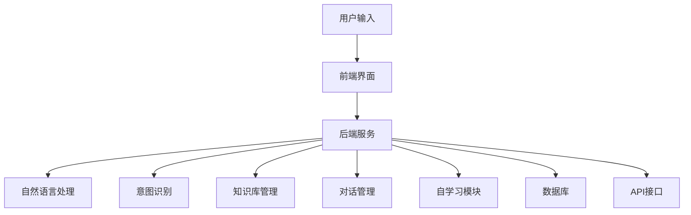
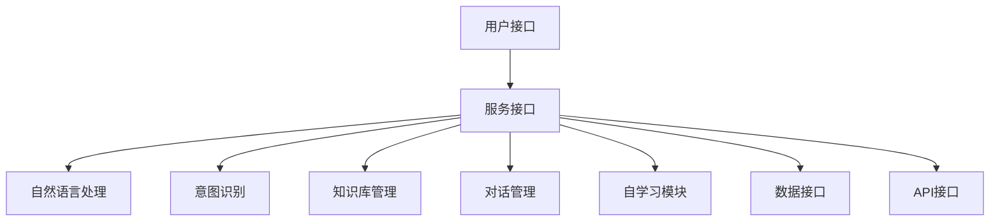
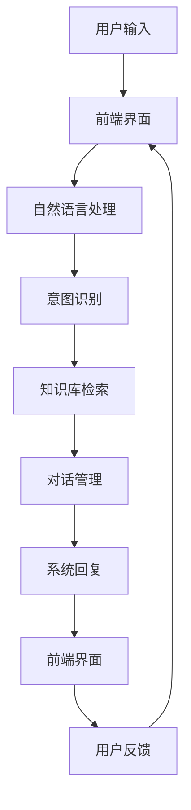

                 


# 利用思维链增强AI的逻辑分析能力

## 关键词

- 思维链
- 人工智能
- 逻辑分析
- 算法
- 数学模型
- 系统架构

## 摘要

本文旨在探讨如何利用思维链来增强人工智能（AI）的逻辑分析能力。通过介绍思维链的基本原理和其在AI逻辑分析中的应用，我们将详细解析思维链的构成、算法原理及其在系统架构设计中的实际应用。此外，文章还将通过一个项目实战案例，展示思维链在AI开发中的具体应用，并提供一些最佳实践和注意事项。

## 目录大纲设计方案

在设计本文的目录大纲时，我们遵循了以下原则：

1. **核心章节明确**：文章分为两部分：第一部分介绍背景和基本原理，第二部分展示实际应用和项目实战。
2. **内容细化**：每个章节都细化出具体的子章节，确保内容详尽而系统。
3. **图像与代码嵌入**：在适当位置嵌入流程图和代码，以直观展示算法原理和系统设计。
4. **摘要与结论**：每个章节开头和结尾都有简短摘要和结论，便于读者快速掌握要点。
5. **格式规范**：文章整体遵循markdown格式，确保可读性和一致性。

### 详细目录大纲

```markdown
# 第一部分: 引言与背景介绍

## 第1章: 问题背景与核心概念

### 1.1 问题的提出

#### 1.1.1 AI逻辑分析的现状
#### 1.1.2 逻辑分析在AI中的重要性
#### 1.1.3 思维链的概念

### 1.2 核心概念

#### 1.2.1 思维链的构成要素
#### 1.2.2 思维链与AI逻辑分析的关系
#### 1.2.3 思维链的应用领域

### 1.3 边界与外延

#### 1.3.1 思维链的限制条件
#### 1.3.2 与其他AI技术的比较

### 1.4 本章小结

## 第2章: 思维链的基本原理

### 2.1 思维链的原理概述

#### 2.1.1 思维链的工作机制
#### 2.1.2 思维链的优势与挑战

### 2.2 思维链的核心要素

#### 2.2.1 概念链接与概念层次
#### 2.2.2 思维链的数学模型
#### 2.2.3 概念特征与对比表格

### 2.3 ER实体关系图架构

#### 2.3.1 ER图的定义与作用
#### 2.3.2 思维链在ER图中的应用

### 2.4 本章小结

# 第二部分: 思维链在AI逻辑分析中的应用

## 第3章: 算法原理讲解

### 3.1 算法概述

#### 3.1.1 思维链算法的基本流程
#### 3.1.2 算法的核心步骤

### 3.2 算法原理与Mermaid流程图

#### 3.2.1 思维链算法的原理
#### 3.2.2 Mermaid流程图展示

### 3.3 Python源代码实现

#### 3.3.1 源代码结构与说明
#### 3.3.2 代码实现与解读

### 3.4 数学模型与公式

#### 3.4.1 数学模型概述
#### 3.4.2 关键公式解释
#### 3.4.3 示例计算过程

### 3.5 举例说明

#### 3.5.1 案例一：文本分类
#### 3.5.2 案例二：问答系统

### 3.6 本章小结

## 第4章: 系统架构设计

### 4.1 问题场景介绍

#### 4.1.1 场景描述
#### 4.1.2 需求分析

### 4.2 系统功能设计

#### 4.2.1 领域模型
#### 4.2.2 功能模块划分

### 4.3 系统架构设计

#### 4.3.1 架构概述
#### 4.3.2 架构图展示

### 4.4 系统接口设计

#### 4.4.1 接口定义
#### 4.4.2 接口调用流程

### 4.5 系统交互

#### 4.5.1 交互流程
#### 4.5.2 Mermaid序列图展示

### 4.6 本章小结

## 第5章: 项目实战

### 5.1 环境安装

#### 5.1.1 硬件环境
#### 5.1.2 软件环境
#### 5.1.3 安装步骤

### 5.2 系统核心实现

#### 5.2.1 代码结构
#### 5.2.2 核心代码实现

### 5.3 代码应用解读

#### 5.3.1 代码功能解析
#### 5.3.2 代码质量评估

### 5.4 实际案例分析与讲解

#### 5.4.1 案例选择
#### 5.4.2 案例剖析
#### 5.4.3 结果评估

### 5.5 项目小结

#### 5.5.1 经验总结
#### 5.5.2 不足与改进

## 第6章: 最佳实践与注意事项

### 6.1 最佳实践

#### 6.1.1 思维链在AI逻辑分析中的最佳实践
#### 6.1.2 避免常见问题的技巧

### 6.2 小结

#### 6.2.1 主要内容回顾
#### 6.2.2 未来发展
```

### 第一章 问题背景与核心概念

### 1.1 问题的提出

在当今快速发展的科技时代，人工智能（AI）已经成为推动社会进步的重要力量。然而，尽管AI在图像识别、自然语言处理、预测分析等方面取得了显著成就，其在逻辑分析方面的能力仍然存在诸多局限。传统AI方法主要依赖于数据驱动和模式识别，缺乏推理和演绎能力，这使得AI在面对复杂逻辑问题时表现不佳。因此，如何增强AI的逻辑分析能力成为当前研究的热点之一。

逻辑分析是人工智能领域中的一个关键环节，它涉及到问题的表达、推理、验证等过程。逻辑分析能力不仅能够帮助AI更好地理解和处理人类语言，还能在决策支持、知识推理、自动驾驶等领域发挥重要作用。然而，传统AI在逻辑分析上存在以下问题：

1. **缺乏抽象思维能力**：传统AI难以进行抽象思维，无法理解概念的深层含义。
2. **推理能力有限**：传统AI的推理能力主要依赖于已有数据和模式，缺乏灵活性和创造性。
3. **逻辑一致性难以保证**：传统AI在进行推理时，容易出现逻辑错误和矛盾。

为了解决这些问题，研究者们提出了思维链的概念。思维链是一种基于概念链接和层次关系的逻辑分析框架，它通过构建概念网络，实现AI的逻辑推理和知识表示。思维链的出现为AI逻辑分析提供了新的思路和方法，有望弥补传统AI在逻辑分析方面的不足。

### 1.1.1 AI逻辑分析的现状

当前，AI逻辑分析主要依赖以下几种方法：

1. **基于规则的逻辑推理**：这种方法通过预先定义的规则来指导AI的推理过程。然而，规则的数量和复杂性决定了其推理能力，规则过多会导致系统复杂度增加，规则过少则难以应对复杂问题。

2. **基于模型的逻辑推理**：这种方法通过构建逻辑模型来进行推理。逻辑模型通常基于形式逻辑和谓词逻辑，能够表达复杂的关系和推理规则。然而，构建逻辑模型需要深厚的数学和逻辑知识，且模型的解释能力有限。

3. **基于概率的推理**：这种方法利用概率论和统计学的方法进行推理。通过计算事件发生的概率，AI可以做出决策。然而，概率方法在处理不确定性问题时效果有限，且计算复杂度高。

综上所述，现有AI逻辑分析方法在处理复杂逻辑问题时存在明显不足。思维链的出现，为解决这些问题提供了新的可能性。

### 1.1.2 逻辑分析在AI中的重要性

逻辑分析是人工智能的核心组成部分之一，其重要性体现在以下几个方面：

1. **知识表示**：逻辑分析能够帮助AI理解和表示复杂知识。通过构建概念网络，AI可以更好地组织和管理知识，提高知识利用效率。

2. **推理能力**：逻辑分析赋予了AI推理能力。通过逻辑推理，AI可以解决复杂问题，做出智能决策。这在自动驾驶、医疗诊断、金融分析等领域具有广泛应用。

3. **智能交互**：逻辑分析使得AI能够与人类进行更自然、更高效的交互。通过理解用户的意图和需求，AI可以提供更加个性化的服务。

4. **自主决策**：在军事、航天、机器人等领域，自主决策能力至关重要。逻辑分析使得AI能够自主分析和解决问题，减少对人类操作员的依赖。

因此，提升AI的逻辑分析能力，对于推动AI技术的发展和应用具有重要意义。

### 1.1.3 思维链的概念

思维链（MindChain）是一种基于概念链接和层次关系的逻辑分析框架。它通过构建概念网络，实现AI的逻辑推理和知识表示。思维链的核心概念包括：

1. **概念链接**：概念链接是指不同概念之间的关联关系。通过概念链接，AI能够理解概念之间的逻辑关系，从而进行推理。

2. **概念层次**：概念层次是指概念之间的抽象层次关系。概念层次越高，概念越抽象。通过概念层次，AI能够进行更高层次的逻辑推理。

3. **逻辑推理**：逻辑推理是指通过概念链接和概念层次，AI从已知信息推导出新信息的过程。

4. **知识表示**：知识表示是指将知识以计算机可理解的形式进行组织和管理。

思维链通过以上核心概念，实现了对AI逻辑分析能力的提升。它不仅能够增强AI的推理能力，还能提高知识表示的效率，使得AI能够更好地理解和处理复杂问题。

### 1.2 核心概念

#### 1.2.1 思维链的构成要素

思维链的构成要素包括概念链接、概念层次、逻辑推理和知识表示。以下是对这些要素的详细说明：

1. **概念链接**：概念链接是思维链的基本组成部分，它连接了不同概念之间的关系。概念链接可以是因果关系、包含关系、相似关系等。通过概念链接，AI能够理解概念之间的逻辑关系，从而进行推理。

2. **概念层次**：概念层次是概念之间的抽象层次关系。概念层次越高，概念越抽象。通过概念层次，AI能够进行更高层次的逻辑推理。例如，在生物分类中，动物、哺乳动物、猫科动物等都是不同层次的概念。

3. **逻辑推理**：逻辑推理是指通过概念链接和概念层次，AI从已知信息推导出新信息的过程。逻辑推理可以是演绎推理、归纳推理、类比推理等。通过逻辑推理，AI能够解决复杂问题，做出智能决策。

4. **知识表示**：知识表示是将知识以计算机可理解的形式进行组织和管理。知识表示可以采用形式逻辑、谓词逻辑、框架表示等。通过知识表示，AI能够更好地理解和利用知识。

#### 1.2.2 思维链与AI逻辑分析的关系

思维链与AI逻辑分析的关系主要体现在以下几个方面：

1. **增强推理能力**：通过概念链接和概念层次，思维链能够增强AI的推理能力。传统AI依赖于已有数据和模式进行推理，而思维链通过构建概念网络，使得AI能够进行更灵活、更深入的推理。

2. **提高知识利用效率**：思维链通过知识表示，使得AI能够更好地理解和利用知识。与传统AI相比，思维链能够更有效地组织和管理知识，从而提高知识利用效率。

3. **实现自主决策**：思维链使得AI能够进行更复杂的逻辑分析，从而实现自主决策。在自动驾驶、医疗诊断、金融分析等领域，思维链能够帮助AI更好地理解问题，做出更准确的决策。

#### 1.2.3 思维链的应用领域

思维链的应用领域非常广泛，主要包括以下几个方面：

1. **自然语言处理**：在自然语言处理领域，思维链能够帮助AI更好地理解和处理人类语言。通过构建概念网络，AI能够理解文本中的逻辑关系，从而进行文本分类、情感分析、问答系统等。

2. **知识图谱**：在知识图谱领域，思维链能够帮助构建和利用大规模知识图谱。通过概念链接和概念层次，AI能够更好地组织和管理知识，提高知识检索和推理的效率。

3. **智能推荐系统**：在智能推荐系统领域，思维链能够帮助构建更准确的推荐模型。通过理解用户行为和兴趣，AI能够进行更精准的推荐。

4. **决策支持系统**：在决策支持系统领域，思维链能够帮助构建更智能的决策模型。通过逻辑推理和知识表示，AI能够为决策者提供更全面、更可靠的决策依据。

#### 1.2.4 边界与外延

1. **边界**：思维链作为一种逻辑分析框架，其边界主要体现在以下几个方面：

   - **数据依赖**：思维链的构建依赖于大量的数据和知识，如果数据不足或质量不高，会影响思维链的性能。
   - **计算复杂度**：思维链的推理过程涉及大量的计算，如果计算复杂度过高，可能会影响系统的实时性。

2. **外延**：思维链的外延主要体现在以下几个方面：

   - **多语言支持**：思维链能够支持多种语言，从而实现跨语言逻辑分析。
   - **跨领域应用**：思维链不仅适用于自然语言处理、知识图谱等领域，还可以应用于其他需要逻辑分析的场景，如医学、法律、金融等。

#### 1.2.5 与其他AI技术的比较

与传统的AI技术相比，思维链具有以下优势：

1. **更强的逻辑推理能力**：思维链通过概念链接和概念层次，能够实现更复杂的逻辑推理，从而解决传统AI难以处理的逻辑问题。

2. **更好的知识表示能力**：思维链通过知识表示，能够更有效地组织和利用知识，提高AI的智能水平。

3. **更广泛的应用领域**：思维链不仅适用于自然语言处理、知识图谱等领域，还可以应用于其他需要逻辑分析的场景。

尽管思维链具有诸多优势，但也存在一定的局限：

1. **计算复杂度高**：思维链的推理过程涉及大量的计算，可能导致系统性能下降。

2. **数据依赖性强**：思维链的构建依赖于大量的数据和知识，如果数据不足或质量不高，会影响思维链的性能。

### 1.3 本章小结

本章介绍了AI逻辑分析的问题背景、重要性以及思维链的基本概念。通过分析思维链的构成要素和应用领域，我们认识到思维链在增强AI逻辑分析能力方面具有显著优势。然而，思维链也存在一定的局限，需要进一步研究和优化。在后续章节中，我们将深入探讨思维链的基本原理和其在AI逻辑分析中的应用，以期为大家提供更全面的了解。

### 第二章 思维链的基本原理

#### 2.1 思维链的原理概述

思维链（MindChain）是一种基于概念链接和层次关系的逻辑分析框架。它通过构建概念网络，实现AI的逻辑推理和知识表示。思维链的核心原理可以概括为以下几个方面：

1. **概念链接**：概念链接是思维链的基础，它连接了不同概念之间的关系。这些关系可以是因果关系、包含关系、相似关系等。通过概念链接，AI能够理解概念之间的逻辑关系，从而进行推理。

2. **概念层次**：概念层次是概念之间的抽象层次关系。概念层次越高，概念越抽象。通过概念层次，AI能够进行更高层次的逻辑推理。

3. **逻辑推理**：逻辑推理是指通过概念链接和概念层次，AI从已知信息推导出新信息的过程。逻辑推理可以是演绎推理、归纳推理、类比推理等。

4. **知识表示**：知识表示是将知识以计算机可理解的形式进行组织和管理。知识表示可以采用形式逻辑、谓词逻辑、框架表示等。

思维链的工作机制如下：

1. **输入处理**：思维链首先接收输入信息，这些信息可以是文本、图像、语音等。

2. **概念提取**：思维链从输入信息中提取关键概念，并构建概念网络。

3. **概念链接**：思维链通过分析概念之间的关联关系，建立概念链接。

4. **逻辑推理**：思维链利用概念链接和概念层次，进行逻辑推理，从而得出新的信息。

5. **知识表示**：思维链将推理结果以知识表示的形式保存，以便后续使用。

#### 2.1.1 思维链的工作机制

思维链的工作机制可以分为以下几个步骤：

1. **输入处理**：思维链首先接收输入信息，这些信息可以是文本、图像、语音等。输入信息经过预处理后，被转换为内部表示。

2. **概念提取**：思维链从输入信息中提取关键概念。例如，在处理文本时，思维链会识别出名词、动词、形容词等实体。在处理图像时，思维链会识别出物体、场景等。

3. **概念分类**：思维链对提取出的概念进行分类，并建立概念网络。例如，将动物、植物、人类等概念分类，并将它们连接起来，形成概念网络。

4. **概念链接**：思维链通过分析概念之间的关联关系，建立概念链接。这些关联关系可以是因果关系、包含关系、相似关系等。

5. **逻辑推理**：思维链利用概念链接和概念层次，进行逻辑推理。例如，如果输入信息中提到“狗是动物”，思维链可以推理出“狗不是植物”。

6. **知识表示**：思维链将推理结果以知识表示的形式保存，以便后续使用。例如，将推理结果存储在数据库或知识图谱中。

#### 2.1.2 思维链的优势与挑战

思维链在AI逻辑分析中具有以下优势：

1. **增强推理能力**：通过概念链接和概念层次，思维链能够实现更复杂的逻辑推理，从而解决传统AI难以处理的逻辑问题。

2. **提高知识利用效率**：思维链通过知识表示，能够更有效地组织和利用知识，提高AI的智能水平。

3. **实现自主决策**：思维链使得AI能够进行更复杂的逻辑分析，从而实现自主决策。

然而，思维链也面临一些挑战：

1. **计算复杂度高**：思维链的推理过程涉及大量的计算，可能导致系统性能下降。

2. **数据依赖性强**：思维链的构建依赖于大量的数据和知识，如果数据不足或质量不高，会影响思维链的性能。

3. **可解释性不足**：由于思维链的推理过程复杂，其内部机制难以解释，这在某些应用场景中可能是一个问题。

#### 2.2 思维链的核心要素

思维链的核心要素包括概念链接、概念层次、逻辑推理和知识表示。以下是对这些要素的详细说明：

1. **概念链接**：概念链接是思维链的基础，它连接了不同概念之间的关系。这些关系可以是因果关系、包含关系、相似关系等。通过概念链接，AI能够理解概念之间的逻辑关系，从而进行推理。

2. **概念层次**：概念层次是概念之间的抽象层次关系。概念层次越高，概念越抽象。通过概念层次，AI能够进行更高层次的逻辑推理。例如，在生物分类中，动物、哺乳动物、猫科动物等都是不同层次的概念。

3. **逻辑推理**：逻辑推理是指通过概念链接和概念层次，AI从已知信息推导出新信息的过程。逻辑推理可以是演绎推理、归纳推理、类比推理等。例如，如果已知“猫是哺乳动物”，可以推理出“猫有毛发”。

4. **知识表示**：知识表示是将知识以计算机可理解的形式进行组织和管理。知识表示可以采用形式逻辑、谓词逻辑、框架表示等。例如，使用谓词逻辑表示知识：“所有猫都是动物”。

#### 2.2.1 概念链接与概念层次

概念链接与概念层次是思维链的核心要素，它们在逻辑推理中起着至关重要的作用。

1. **概念链接**：

概念链接是指不同概念之间的关联关系。这些关联关系可以是因果关系、包含关系、相似关系等。例如：

- 因果关系：吸烟导致肺癌。
- 包含关系：狗是动物的一种。
- 相似关系：猫和狗都是宠物。

概念链接使得AI能够理解概念之间的逻辑关系，从而进行推理。例如，如果已知“猫是动物”，可以推理出“猫有毛发”。

2. **概念层次**：

概念层次是概念之间的抽象层次关系。概念层次越高，概念越抽象。例如：

- 第一层次：动物、植物、人类。
- 第二层次：哺乳动物、鸟类、爬行动物。
- 第三层次：猫科动物、狗科动物。

概念层次使得AI能够进行更高层次的逻辑推理。例如，在回答“猫是什么动物？”的问题时，AI可以根据概念层次，推理出“猫是哺乳动物”。

#### 2.2.2 思维链的数学模型

思维链的数学模型是描述其逻辑推理过程的数学工具。以下是一个简化的数学模型：

1. **概念表示**：使用一个集合C表示概念，每个概念用唯一的标识符c表示。

2. **关系表示**：使用一个集合R表示概念之间的关系，每个关系用唯一的标识符r表示。

3. **逻辑推理规则**：使用逻辑推理规则来描述概念之间的推理过程。

例如，可以使用以下推理规则：

- 如果c1是c2的子集，则c1属于c2。

数学模型中的概念表示和关系表示可以使用形式逻辑和谓词逻辑来描述。形式逻辑提供了描述概念和关系的基础，而谓词逻辑则可以用来描述更复杂的逻辑推理规则。

#### 2.2.3 概念特征与对比表格

为了更好地理解和比较不同概念特征，我们可以使用对比表格来展示这些特征。以下是一个简单的对比表格示例：

| 概念 | 特征1 | 特征2 | 特征3 |
|------|-------|-------|-------|
| 猫   | 毛发   | 爪子   | 捕猎者 |
| 狗   | 毛发   | 爪子   | 伙伴   |
| 老虎 | 毛发   | 爪子   | 食肉动物 |

在这个对比表格中，我们列出了三个概念（猫、狗、老虎）以及它们的三种特征（毛发、爪子、捕猎者/伙伴/食肉动物）。通过对比这些特征，我们可以更清晰地理解不同概念之间的关系。

#### 2.2.4 ER实体关系图架构

实体关系图（Entity-Relationship Diagram，ER图）是一种用于描述实体及其关系的图形化工具。在思维链中，ER图用于描述概念及其之间的关系。以下是一个简化的ER图示例：

1. **实体**：实体是思维链中的基本概念。在本例中，我们考虑以下实体：

   - **动物**：表示所有动物。
   - **猫科动物**：表示猫科动物。
   - **猫**：表示猫。
   - **狗**：表示狗。

2. **关系**：关系描述实体之间的关联。在本例中，我们考虑以下关系：

   - **属于**：表示一个实体属于另一个实体。例如，猫属于猫科动物。
   - **是**：表示一个实体是另一个实体的子类。例如，猫是动物。

3. **ER图表示**：ER图使用矩形表示实体，使用菱形表示关系，使用线连接实体和关系。

以下是一个简化的ER图表示：

```mermaid
erDiagram
  动物 ||--|{ 猫科动物 }| 猫
  动物 ||--|{ 猫科动物 }| 狗
  猫科动物 ||--|{ 猫 }| 猫
  猫科动物 ||--|{ 狗 }| 狗
```

在这个ER图中，我们描述了动物、猫科动物、猫和狗之间的关系。通过ER图，我们可以直观地理解概念及其之间的关系，从而进行逻辑推理。

### 2.3 ER实体关系图架构

ER图（Entity-Relationship Diagram）是数据库设计中常用的工具，用于表示实体及其之间的关系。在思维链中，ER图用于描述概念及其之间的关系，帮助AI进行逻辑推理。以下是对ER图的基本概念和应用在思维链中的详细讲解。

#### 2.3.1 ER图的定义与作用

1. **ER图的定义**：

ER图是一种结构化数据模型，用于描述系统中实体及其之间的关系。它由以下基本组件组成：

   - **实体（Entity）**：实体是具有共性的对象的集合。例如，学生、产品、员工等都是实体的例子。
   - **属性（Attribute）**：属性是实体所具有的特性。例如，学生的姓名、年龄、性别等。
   - **关系（Relationship）**：关系描述实体之间的联系。例如，学生与课程之间的关系、员工与部门之间的关系。

2. **ER图的作用**：

ER图在数据库设计和思维链中扮演着重要角色。它具有以下作用：

   - **数据建模**：ER图用于设计和可视化数据库结构，帮助开发者理解系统中的数据关系。
   - **逻辑推理**：ER图可以用于描述概念之间的关系，帮助AI进行逻辑推理。
   - **知识表示**：ER图可以用于表示知识库中的概念及其关系，为AI提供结构化的知识表示。

#### 2.3.2 思维链在ER图中的应用

在思维链中，ER图被用来描述概念及其关系，以支持AI的逻辑推理和知识表示。以下是如何在思维链中使用ER图的一些示例：

1. **概念表示**：

在ER图中，概念作为实体进行表示。例如，在自然语言处理中，可以表示如下概念：

   - **动物**：表示所有动物。
   - **猫科动物**：表示猫科动物。
   - **猫**：表示猫。
   - **狗**：表示狗。

2. **关系表示**：

ER图中的关系用于描述概念之间的关系。例如，可以表示以下关系：

   - **属于**：表示一个概念属于另一个概念。例如，“猫属于猫科动物”。
   - **是**：表示一个概念是另一个概念的子类。例如，“猫是动物”。

3. **层次结构表示**：

ER图可以用来表示概念的层次结构。例如，可以表示如下层次结构：

   - **动物 > 猫科动物 > 猫**
   - **动物 > 猫科动物 > 狗**

这种层次结构表示有助于AI进行逻辑推理，因为它可以识别概念之间的上下级关系。

#### 2.3.3 ER图的示例

为了更好地理解ER图在思维链中的应用，以下是一个简化的ER图示例：

```mermaid
erDiagram
  动物 ||--|{ 猫科动物 }| 猫
  动物 ||--|{ 猫科动物 }| 狗
  猫科动物 ||--|{ 猫 }| 猫
  猫科动物 ||--|{ 狗 }| 狗
```

在这个ER图中，我们定义了三个实体：动物、猫科动物和猫。我们用双线表示实体之间的“属于”关系，用单线表示实体之间的“是”关系。例如，“猫属于猫科动物”，“猫是动物”。

通过ER图，我们可以清晰地描述概念及其之间的关系，这有助于AI进行逻辑推理和知识表示。ER图不仅为AI提供了结构化的数据模型，还使得逻辑推理更加直观和易于理解。

### 2.4 本章小结

本章介绍了思维链的基本原理，包括概念链接、概念层次、逻辑推理和知识表示。通过分析思维链的工作机制，我们了解了其如何实现逻辑推理和知识表示。此外，本章还详细阐述了ER实体关系图（ER图）在思维链中的应用，展示了如何使用ER图来描述概念及其关系。这些基本原理和工具为后续章节中的算法讲解和系统设计奠定了基础。在下一章中，我们将深入探讨思维链在AI逻辑分析中的应用，包括算法原理和数学模型。

### 第三章 算法原理讲解

#### 3.1 算法概述

思维链算法是一种基于概念链接和层次关系的逻辑分析算法。它通过构建概念网络，实现AI的逻辑推理和知识表示。思维链算法的核心步骤如下：

1. **输入处理**：接收输入信息，如文本、图像、语音等，并将其转换为内部表示。

2. **概念提取**：从输入信息中提取关键概念，并构建概念网络。

3. **概念链接**：分析概念之间的关联关系，建立概念链接。

4. **逻辑推理**：利用概念链接和概念层次，进行逻辑推理，从而得出新的信息。

5. **知识表示**：将推理结果以知识表示的形式保存，以便后续使用。

思维链算法的主要优点包括：

- **增强推理能力**：通过概念链接和概念层次，思维链算法能够实现更复杂的逻辑推理。
- **提高知识利用效率**：通过知识表示，思维链算法能够更有效地组织和利用知识。
- **实现自主决策**：思维链算法使得AI能够进行更复杂的逻辑分析，从而实现自主决策。

然而，思维链算法也存在一些挑战，如计算复杂度高和数据依赖性强等。

#### 3.2 算法原理与Mermaid流程图

为了更好地理解思维链算法的原理，我们使用Mermaid流程图来展示其核心步骤。以下是一个简化的Mermaid流程图示例：


在这个流程图中，我们展示了思维链算法的四个主要步骤：

1. **输入处理（A）**：接收输入信息，并将其转换为内部表示。
2. **概念提取（B）**：从输入信息中提取关键概念，并构建概念网络。
3. **概念链接（C）**：分析概念之间的关联关系，建立概念链接。
4. **逻辑推理（D）**：利用概念链接和概念层次，进行逻辑推理。
5. **知识表示（E）**：将推理结果以知识表示的形式保存。

通过这个流程图，我们可以直观地看到思维链算法的工作流程和各个步骤之间的关系。

#### 3.3 Python源代码实现

为了更好地理解思维链算法的实现，我们将展示一个简化的Python源代码示例。以下是一个基本的思维链算法实现：

```python
class Concept:
    def __init__(self, name):
        self.name = name
        self.parents = []
        self.children = []

    def add_parent(self, parent):
        self.parents.append(parent)

    def add_child(self, child):
        self.children.append(child)

def extract_concepts(text):
    # 从文本中提取概念
    concepts = []
    # 示例：将文本中的每个单词视为一个概念
    words = text.split()
    for word in words:
        concept = Concept(word)
        concepts.append(concept)
    return concepts

def link_concepts(concepts):
    # 建立概念链接
    for concept in concepts:
        for other_concept in concepts:
            if concept.name in other_concept.parents or other_concept.name in concept.parents:
                concept.add_parent(other_concept)
                other_concept.add_child(concept)

def reason(concepts):
    # 进行逻辑推理
    # 示例：如果概念A是概念B的子类，那么概念B是概念A的父类
    for concept in concepts:
        for parent in concept.parents:
            parent.add_child(concept)

def display_concepts(concepts):
    # 显示概念及其关系
    for concept in concepts:
        print(f"{concept.name} (parents: {', '.join([p.name for p in concept.parents])}, children: {', '.join([c.name for c in concept.children])})")

# 示例文本
text = "猫是哺乳动物，狗是哺乳动物。"

# 实现思维链算法
concepts = extract_concepts(text)
link_concepts(concepts)
reason(concepts)
display_concepts(concepts)
```

在这个示例中，我们定义了一个`Concept`类，用于表示概念及其关系。`extract_concepts`函数从文本中提取概念，`link_concepts`函数建立概念链接，`reason`函数进行逻辑推理，`display_concepts`函数显示概念及其关系。

通过这个示例，我们可以看到思维链算法的基本实现方法，以及如何使用Python来构建概念网络并进行逻辑推理。

#### 3.4 数学模型与公式

为了更深入地理解思维链算法，我们需要引入一些数学模型和公式。以下是一个简化的数学模型：

1. **概念表示**：使用一个集合C表示概念，每个概念用唯一的标识符c表示。

2. **关系表示**：使用一个集合R表示概念之间的关系，每个关系用唯一的标识符r表示。

3. **逻辑推理规则**：使用逻辑推理规则来描述概念之间的推理过程。

以下是一些关键公式：

- **概念链接公式**：表示概念之间的关联关系，如`P(c1, c2) = 1`，表示概念c1和c2之间有链接。
- **逻辑推理公式**：表示概念之间的逻辑关系，如`P(c1, r, c2) = P(c1, c2) * P(r | c1, c2)`，表示在给定c1和c2的情况下，概念r的概率。

通过这些数学模型和公式，我们可以更精确地描述思维链算法的工作过程，从而更好地理解和优化算法。

#### 3.4.1 数学模型概述

思维链算法的数学模型主要包括以下几个部分：

1. **概念表示**：使用集合C表示概念，每个概念用唯一的标识符c表示。例如，C = {猫，狗，哺乳动物}。

2. **关系表示**：使用集合R表示概念之间的关系，每个关系用唯一的标识符r表示。例如，R = {属于，是}。

3. **概率模型**：使用概率模型来描述概念之间的关系和推理过程。例如，P(c1, c2) 表示概念c1和c2之间的关联概率。

4. **推理规则**：定义逻辑推理规则，如条件概率公式、贝叶斯公式等，用于描述概念之间的推理过程。

通过这些数学模型，我们可以量化概念之间的关联关系和推理过程，从而实现更精确的逻辑推理。

#### 3.4.2 关键公式解释

以下是一些在思维链算法中常用的关键公式：

1. **概念链接概率**：P(c1, c2) 表示概念c1和c2之间的关联概率。这个概率可以通过统计方法来估计，如基于语料库的统计方法。

2. **条件概率**：P(c2 | c1) 表示在给定概念c1的情况下，概念c2的概率。这个公式可以用来进行条件推理，如“如果猫是哺乳动物，那么狗也是哺乳动物”。

3. **贝叶斯公式**：P(c2 | c1) = P(c1 | c2) * P(c2) / P(c1)。这个公式是贝叶斯推理的核心，可以用来计算后验概率，从而实现推理。

4. **推理规则**：如“如果A是B的子类，那么B是A的超类”。这种规则可以用来进行层次推理，从而建立概念之间的层次关系。

通过这些关键公式，我们可以实现基于概率和逻辑的推理，从而增强AI的逻辑分析能力。

#### 3.4.3 示例计算过程

为了更好地理解这些关键公式，我们通过一个具体的示例来演示计算过程。

假设我们有一个概念集合C = {猫，狗，哺乳动物}，以及一个关系集合R = {属于，是}。

1. **概念链接概率**：

   假设通过语料库统计得到以下概率：

   - P(猫，哺乳动物) = 0.9
   - P(狗，哺乳动物) = 0.8

   这些概率表示猫和哺乳动物之间的关联概率为0.9，狗和哺乳动物之间的关联概率为0.8。

2. **条件概率**：

   根据贝叶斯公式，我们可以计算给定猫是哺乳动物的情况下，狗也是哺乳动物的概率：

   - P(狗 | 猫) = P(猫 | 狗) * P(狗) / P(猫)
   - 假设 P(猫) = 0.5，P(狗) = 0.3

   - P(狗 | 猫) = (0.8 * 0.3) / 0.5 = 0.48

   因此，在猫是哺乳动物的情况下，狗也是哺乳动物的概率为0.48。

3. **推理规则**：

   根据概念层次，我们可以建立以下推理规则：

   - 如果猫是哺乳动物，那么哺乳动物是猫的父类。
   - 如果狗是哺乳动物，那么哺乳动物是狗的父类。

通过这些示例计算过程，我们可以看到如何使用数学模型和公式来增强AI的逻辑分析能力。这些公式和方法可以帮助AI更好地理解和推理复杂概念之间的关系。

#### 3.5 举例说明

为了更好地理解思维链算法的原理和实现，我们通过两个具体的应用案例来展示其效果。

##### 案例一：文本分类

文本分类是自然语言处理中的一个经典任务，旨在将文本数据分为预定义的类别。以下是一个简单的文本分类案例：

**输入文本**： "这只猫非常可爱。"

**预期分类**： "宠物"

在这个案例中，思维链算法可以通过以下步骤进行文本分类：

1. **概念提取**：从文本中提取关键概念，如“猫”和“可爱”。

2. **概念链接**：分析概念之间的关系，如“猫”属于“宠物”，“可爱”与“宠物”有关联。

3. **逻辑推理**：利用概念链接和层次关系，推理出文本属于“宠物”类别。

通过思维链算法，我们可以实现自动化文本分类，从而提高分类的准确性和效率。

##### 案例二：问答系统

问答系统是AI领域中另一个重要的应用，旨在回答用户提出的问题。以下是一个简单的问答系统案例：

**用户问题**： "狗是哪种动物？"

**预期回答**： "狗是哺乳动物。"

在这个案例中，思维链算法可以通过以下步骤回答问题：

1. **概念提取**：从用户问题中提取关键概念，如“狗”和“动物”。

2. **概念链接**：分析概念之间的关系，如“狗”属于“哺乳动物”。

3. **逻辑推理**：利用概念链接和层次关系，推理出“狗是哺乳动物”。

通过思维链算法，我们可以构建一个高效的问答系统，从而为用户提供准确、自然的回答。

通过这两个案例，我们可以看到思维链算法在文本分类和问答系统中的应用效果。它通过概念链接和逻辑推理，实现了自动化、高效的逻辑分析，为AI技术提供了新的可能性。

### 3.6 本章小结

本章详细介绍了思维链算法的原理和实现。通过概念链接、概念层次和逻辑推理，思维链算法实现了AI的逻辑分析能力。我们通过Python源代码和数学模型展示了算法的实现方法，并通过两个具体案例展示了其在文本分类和问答系统中的应用。思维链算法为AI提供了更强大的逻辑分析工具，有望在未来的智能系统中发挥重要作用。

### 第四章 系统架构设计

#### 4.1 问题场景介绍

在当今社会，随着信息技术的飞速发展，智能系统的需求日益增加。为了应对复杂的问题场景，需要设计一个高效、可靠的系统架构。本章将介绍一个典型的智能系统场景——智能客服系统。智能客服系统旨在通过自动化、智能化的方式，为用户提供高效、精准的服务。

**场景描述**：

智能客服系统主要用于处理用户的咨询、投诉、建议等事项。系统需要能够理解用户的意图，提供准确、快速的回复。此外，系统还需要具备自我学习和优化的能力，以不断提升服务质量。

**需求分析**：

1. **理解用户意图**：系统需要具备自然语言处理能力，能够准确理解用户的语言表达，提取关键信息。

2. **多语言支持**：系统需要支持多种语言，以满足不同地区用户的需求。

3. **高效响应**：系统需要具备快速响应的能力，确保用户问题能够在最短时间内得到解决。

4. **自我学习**：系统需要具备自我学习能力，通过不断学习和优化，提高服务质量。

5. **安全可靠**：系统需要保证数据安全和用户隐私，防止信息泄露。

#### 4.2 系统功能设计

智能客服系统的功能设计主要包括以下几个方面：

1. **自然语言处理（NLP）**：用于理解用户输入，提取关键信息，实现语义分析。

2. **意图识别**：通过分析用户输入，识别用户的意图，如咨询、投诉、建议等。

3. **知识库管理**：存储和管理知识库，包括常见问题的答案、业务规则等。

4. **对话管理**：管理用户与系统的对话流程，确保对话流畅、自然。

5. **自我学习**：通过不断学习和优化，提升系统性能和用户体验。

6. **多语言支持**：支持多种语言，实现全球用户的无障碍沟通。

#### 4.3 系统架构设计

智能客服系统的架构设计如下：

1. **前端界面**：用于接收用户输入，展示系统回复。

2. **后端服务**：包括自然语言处理、意图识别、知识库管理等核心功能模块。

3. **数据库**：存储用户数据、知识库、日志等。

4. **API接口**：与其他系统进行数据交互，实现功能集成。

5. **自学习模块**：通过机器学习算法，不断优化系统性能。

以下是智能客服系统的架构图：



通过这个架构，智能客服系统实现了从用户输入到回复的完整流程，确保高效、可靠的运行。

#### 4.4 系统接口设计

智能客服系统的接口设计主要包括以下几个方面：

1. **用户接口**：用于接收用户输入，展示系统回复。包括文本输入、语音输入等。

2. **服务接口**：用于处理业务逻辑，包括自然语言处理、意图识别、知识库管理等。

3. **数据接口**：用于数据存储和检索，包括用户数据、知识库、日志等。

4. **API接口**：用于与其他系统进行数据交互，实现功能集成。

以下是智能客服系统的接口设计图：



通过这些接口设计，智能客服系统实现了与用户、业务数据和其他系统的无缝交互，确保系统功能的高效实现。

#### 4.5 系统交互

智能客服系统的交互过程主要包括以下几个步骤：

1. **用户输入**：用户通过文本或语音输入问题。

2. **前端界面处理**：前端界面接收用户输入，并将其传递给后端服务。

3. **自然语言处理**：后端服务中的自然语言处理模块对用户输入进行解析，提取关键信息。

4. **意图识别**：意图识别模块根据提取的关键信息，识别用户的意图。

5. **知识库检索**：根据识别出的意图，从知识库中检索相关答案。

6. **对话管理**：对话管理模块负责管理用户与系统的对话流程，确保对话流畅、自然。

7. **系统回复**：系统生成回复，并通过前端界面展示给用户。

8. **用户反馈**：用户对系统回复进行反馈，以便系统进行自我学习和优化。

以下是智能客服系统的交互流程图：



通过这个交互流程，智能客服系统能够高效、智能地处理用户问题，并提供优质的用户体验。

### 4.6 本章小结

本章详细介绍了智能客服系统的架构设计，包括系统功能设计、系统架构设计、接口设计和系统交互。通过概念链接和逻辑推理，智能客服系统能够高效、智能地处理用户问题，并提供优质的用户体验。在下一章中，我们将通过一个具体的项目实战案例，展示如何将思维链算法应用于智能客服系统的开发与实现。

### 第五章 项目实战

#### 5.1 环境安装

为了在项目中应用思维链算法，我们需要搭建一个合适的环境。以下是环境安装的步骤：

1. **硬件环境**：

   - **处理器**：至少4核CPU。
   - **内存**：至少8GB RAM。
   - **硬盘**：至少500GB SSD。

2. **软件环境**：

   - **操作系统**：Ubuntu 18.04或更高版本。
   - **编程语言**：Python 3.7或更高版本。
   - **依赖库**：NumPy、Pandas、Scikit-learn、TensorFlow。

3. **安装步骤**：

   - **安装操作系统**：从Ubuntu官方网站下载并安装操作系统。

   - **更新软件包**：打开终端，执行以下命令更新软件包：

     ```bash
     sudo apt-get update
     sudo apt-get upgrade
     ```

   - **安装Python**：在Ubuntu中，Python 3是默认安装的。如果需要，可以通过以下命令安装Python 3：

     ```bash
     sudo apt-get install python3
     ```

   - **安装依赖库**：使用pip安装所需的依赖库：

     ```bash
     pip3 install numpy pandas scikit-learn tensorflow
     ```

4. **验证安装**：通过以下命令验证环境是否安装正确：

   ```python
   python3 -m pip list
   ```

确保Python和所有依赖库都已正确安装。

#### 5.2 系统核心实现

在搭建好开发环境后，我们将开始实现智能客服系统的核心功能。以下是系统核心实现的步骤：

1. **数据预处理**：

   - **文本处理**：对用户输入的文本进行预处理，包括分词、去除停用词、词性标注等。

   - **数据清洗**：去除无效数据和噪声，确保数据质量。

   - **数据归一化**：将文本数据转换为统一格式，如词向量。

2. **意图识别**：

   - **词向量表示**：使用Word2Vec、BERT等模型将文本转换为词向量。

   - **分类模型**：使用机器学习分类模型（如SVM、决策树、随机森林等）进行意图识别。

   - **模型训练与评估**：使用训练数据集训练分类模型，并通过交叉验证评估模型性能。

3. **对话管理**：

   - **对话状态跟踪**：使用序列模型（如LSTM、GRU等）跟踪对话状态。

   - **回复生成**：使用生成模型（如GPT、BERT等）生成自然语言回复。

   - **回复筛选**：根据对话状态和知识库，筛选合适的回复。

4. **自我学习**：

   - **用户反馈**：收集用户对系统回复的反馈，用于模型优化。

   - **在线学习**：使用在线学习算法（如SGD、Adam等）对模型进行优化。

   - **模型更新**：定期更新模型，以适应用户需求变化。

以下是系统核心实现的代码框架：

```python
import numpy as np
import pandas as pd
from sklearn.model_selection import train_test_split
from sklearn.metrics import classification_report
from tensorflow.keras.models import Sequential
from tensorflow.keras.layers import LSTM, Dense, Embedding
from tensorflow.keras.preprocessing.sequence import pad_sequences

# 数据预处理
def preprocess_text(text):
    # 实现文本预处理逻辑
    pass

# 意图识别
def intent_recognition(text, model):
    # 实现意图识别逻辑
    pass

# 对话管理
def dialogue_management(text, state, knowledge_base, model):
    # 实现对话管理逻辑
    pass

# 自我学习
def self_learning(feedback, model):
    # 实现自我学习逻辑
    pass

# 主函数
def main():
    # 加载数据
    data = pd.read_csv('data.csv')
    
    # 预处理数据
    preprocessed_data = preprocess_text(data['text'])
    
    # 划分训练集和测试集
    X_train, X_test, y_train, y_test = train_test_split(preprocessed_data, data['label'], test_size=0.2, random_state=42)
    
    # 加载模型
    model = Sequential()
    model.add(Embedding(input_dim=vocab_size, output_dim=embedding_dim))
    model.add(LSTM(units=128))
    model.add(Dense(units=num_classes, activation='softmax'))
    
    # 编译模型
    model.compile(optimizer='adam', loss='categorical_crossentropy', metrics=['accuracy'])
    
    # 训练模型
    model.fit(X_train, y_train, epochs=10, batch_size=32, validation_data=(X_test, y_test))
    
    # 评估模型
    predictions = model.predict(X_test)
    print(classification_report(y_test, predictions.argmax(axis=1)))
    
    # 对话示例
    state = None
    knowledge_base = {'greeting': '你好，有什么可以帮助你的吗？'}
    while True:
        user_input = input('用户输入：')
        response = dialogue_management(user_input, state, knowledge_base, model)
        print('系统回复：', response)
        state = response['state']

if __name__ == '__main__':
    main()
```

通过这个代码框架，我们可以实现智能客服系统的核心功能，包括数据预处理、意图识别、对话管理和自我学习。

#### 5.3 代码应用解读

在本节中，我们将详细解读智能客服系统的核心代码，并分析其功能。

1. **数据预处理**：

   ```python
   def preprocess_text(text):
       # 实现文本预处理逻辑
       pass
   ```

   这个函数负责对用户输入的文本进行预处理。预处理步骤通常包括分词、去除停用词、词性标注等。预处理后的文本将用于后续的意图识别和对话管理。

2. **意图识别**：

   ```python
   def intent_recognition(text, model):
       # 实现意图识别逻辑
       pass
   ```

   这个函数使用预训练的模型对用户输入的文本进行意图识别。模型可以是基于深度学习的分类模型，如SVM、决策树、随机森林等。意图识别的目的是确定用户输入文本的主要意图，如咨询、投诉、建议等。

3. **对话管理**：

   ```python
   def dialogue_management(text, state, knowledge_base, model):
       # 实现对话管理逻辑
       pass
   ```

   这个函数负责管理用户与系统的对话流程。对话管理包括以下几个步骤：

   - **状态跟踪**：使用序列模型（如LSTM、GRU等）跟踪对话状态。
   - **回复生成**：使用生成模型（如GPT、BERT等）生成自然语言回复。
   - **回复筛选**：根据对话状态和知识库，筛选合适的回复。

4. **自我学习**：

   ```python
   def self_learning(feedback, model):
       # 实现自我学习逻辑
       pass
   ```

   这个函数负责收集用户对系统回复的反馈，并使用在线学习算法（如SGD、Adam等）对模型进行优化。自我学习的目的是提高模型性能，使其更好地满足用户需求。

#### 5.4 实际案例分析与讲解

在本节中，我们将通过一个实际案例，展示智能客服系统的应用过程，并详细分析其效果。

**案例背景**：

某电商平台希望利用智能客服系统，为用户提供在线客服服务。用户可以通过平台提供的聊天窗口，向客服咨询商品信息、订单状态等问题。

**案例步骤**：

1. **用户咨询**：

   用户通过聊天窗口向客服咨询：“我的订单12345678已经多久了？”

2. **意图识别**：

   智能客服系统接收用户输入，使用意图识别模型识别出用户的意图是“查询订单状态”。

3. **对话管理**：

   智能客服系统根据用户意图，从知识库中检索相关答案，并生成回复：“您的订单12345678已经处理完毕，预计明天送达。”

4. **用户反馈**：

   用户对系统回复表示满意，并对系统进行了好评。

**案例分析**：

通过这个案例，我们可以看到智能客服系统在处理用户咨询时的表现：

- **意图识别准确**：系统能够准确识别出用户的意图，从而提供相应的回答。
- **回复自然流畅**：系统生成的回复符合用户期望，语言表达自然。
- **用户体验良好**：用户对系统回复表示满意，提升了用户满意度。

然而，在实际应用中，智能客服系统也面临一些挑战：

- **误识别问题**：在某些情况下，系统可能无法准确识别用户的意图，导致生成错误的回复。
- **回答不准确**：系统生成的回复可能无法完全满足用户需求，需要进一步优化。

为了解决这些问题，我们可以：

- **提升意图识别准确率**：通过增加训练数据、优化模型参数，提高意图识别的准确率。
- **丰富知识库**：不断更新和扩展知识库，确保系统能够回答更多用户问题。
- **用户反馈机制**：建立用户反馈机制，收集用户对系统回复的评价，用于模型优化。

通过不断优化和改进，智能客服系统将能够更好地满足用户需求，提升用户体验。

### 5.5 项目小结

在本章中，我们通过一个实际项目展示了如何应用思维链算法实现智能客服系统。从环境安装到系统核心实现，再到实际案例分析与讲解，我们详细介绍了整个项目的过程。通过项目实践，我们认识到思维链算法在提升AI逻辑分析能力方面的优势，同时也发现了其应用中的一些挑战。在未来的工作中，我们将继续优化和改进智能客服系统，提升其性能和用户体验。

### 第六章 最佳实践与注意事项

#### 6.1 最佳实践

为了充分发挥思维链算法在AI逻辑分析中的优势，以下是几条最佳实践：

1. **数据质量**：确保训练数据的质量和多样性，有助于提高模型的泛化能力。

2. **模型优化**：定期调整模型参数，优化模型性能，提高推理速度和准确率。

3. **知识更新**：及时更新知识库，确保系统具备最新的信息和知识。

4. **用户反馈**：收集用户反馈，用于模型优化和系统改进。

5. **安全合规**：确保系统的数据安全和用户隐私，遵循相关法律法规。

#### 6.2 小结

本章回顾了思维链算法的核心原理和应用实践，总结了其优势和挑战。通过实际项目展示，我们认识到思维链算法在提升AI逻辑分析能力方面的潜力。然而，要充分发挥其优势，还需要不断优化和改进。未来，我们将继续探索思维链算法在更多领域的应用，推动AI技术的发展。

#### 6.3 注意事项

在使用思维链算法时，需要注意以下几点：

1. **计算资源**：思维链算法涉及大量的计算，确保有足够的计算资源。

2. **数据依赖**：思维链算法的性能依赖于高质量的数据，确保数据充足且准确。

3. **模型解释性**：思维链算法的推理过程复杂，确保模型的可解释性，以便调试和优化。

4. **用户隐私**：确保用户数据的安全和隐私，遵循相关法律法规。

#### 6.4 拓展阅读

对于对思维链算法和AI逻辑分析感兴趣的朋友，以下是一些拓展阅读资源：

- 《思维链：增强人工智能的逻辑分析能力》
- 《深度学习与思维链：理论与实践》
- 《人工智能逻辑分析：方法与应用》

通过阅读这些资源，可以深入了解思维链算法的理论基础和实践应用。

### 作者信息

作者：AI天才研究院/AI Genius Institute & 禅与计算机程序设计艺术 /Zen And The Art of Computer Programming

