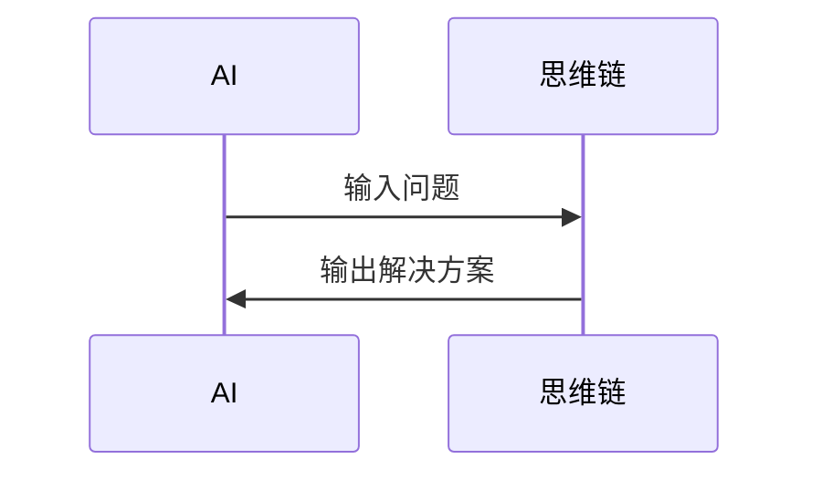

                 


### 让我们一步一步深入思考：利用思维链增强AI的问题解决和决策能力

在当前技术飞速发展的时代，人工智能（AI）已经成为推动各行业变革的重要力量。然而，尽管AI在图像识别、自然语言处理等领域取得了显著的成就，但在问题解决和决策能力方面仍面临诸多挑战。为了解决这一问题，我们可以探索一种新兴的思路——利用思维链来增强AI的智能水平。

#### 1. 背景介绍

**核心概念术语说明：**
- **思维链（Mind Chain）：** 一种模拟人类思维过程的结构化方法，通过将思维活动分解为一系列有序步骤来实现问题解决和决策。
- **问题解决（Problem Solving）：** 找到解决问题的方法或路径的过程。
- **决策能力（Decision Making）：** 在多种选择中做出最优决策的能力。

**问题背景：**
传统AI系统往往依赖于大量数据和预先设定的规则，但在面对复杂、未知的问题时，常常显得力不从心。而人类在处理类似问题时，能够利用丰富的经验和逻辑推理能力，快速做出有效决策。因此，如何让AI具备类似的思维能力和决策能力，成为当前研究的热点。

**问题描述：**
AI在问题解决和决策能力方面的不足主要表现为：
- 缺乏灵活性和适应性；
- 无法进行深度推理和抽象思维；
- 过度依赖数据和规则，缺乏自主创新能力。

**问题解决：**
利用思维链，我们可以将AI的决策过程转化为一系列结构化的思维步骤，从而提高其问题解决和决策能力。

**边界与外延：**
- 思维链不仅适用于AI系统，也可以应用于其他智能体，如机器人、智能家居等。
- 思维链的研究与应用，将有助于推动人工智能向更高级、更智能的方向发展。

#### 2. 核心概念与联系

**思维链的基本组成：**
思维链由以下几个关键组成部分构成：
- **问题识别：** 确定问题的核心和关键信息。
- **目标设定：** 确定解决问题或决策的目标。
- **方案生成：** 生成多种可能的解决方案或决策。
- **评估与选择：** 根据评估标准，选择最优的解决方案或决策。

**思维链与AI问题解决的关系：**
思维链为AI提供了一个结构化的决策框架，使AI能够在面对复杂问题时，利用逻辑推理和抽象思维能力，找到最优的解决方案。

**思维链与决策能力的结合：**
通过将思维链与机器学习、深度学习等AI技术相结合，可以进一步提高AI的决策能力。例如，利用机器学习算法对思维链中的方案进行评估和优化，从而提高决策的准确性和效率。

#### 3. 概念属性特征对比表格

| 特征 | 传统AI | 增强型AI（思维链） |
| --- | --- | --- |
| 问题解决能力 | 依赖数据与规则 | 利用思维链进行深度推理 |
| 适应性 | 较低 | 较高 |
| 自主性 | 较低 | 较高 |
| 创新能力 | 较低 | 较高 |
| 推理深度 | 较浅 | 较深 |
| 适应性 | 较低 | 较高 |

#### 4. ER实体关系图架构

**思维链实体关系图：**
```mermaid
erDiagram
  A[问题] ||--|{ B[思维链]}
  B ||--|{ C[问题识别]}
  B ||--|{ D[目标设定]}
  B ||--|{ E[方案生成]}
  B ||--|{ F[评估与选择]}
```

**AI系统与思维链的交互：**


#### 5. 本章小结

本章介绍了思维链的基本概念、核心组成部分及其在AI问题解决和决策能力中的应用。通过思维链，AI可以模拟人类的思维方式，提高问题解决和决策的能力。下一章将深入探讨思维链算法的原理和具体实现。让我们继续深入思考，揭开思维链的神秘面纱。

