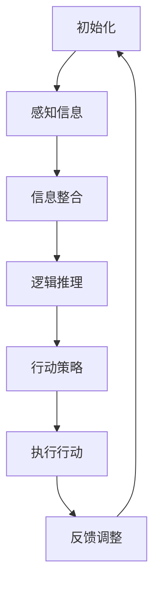
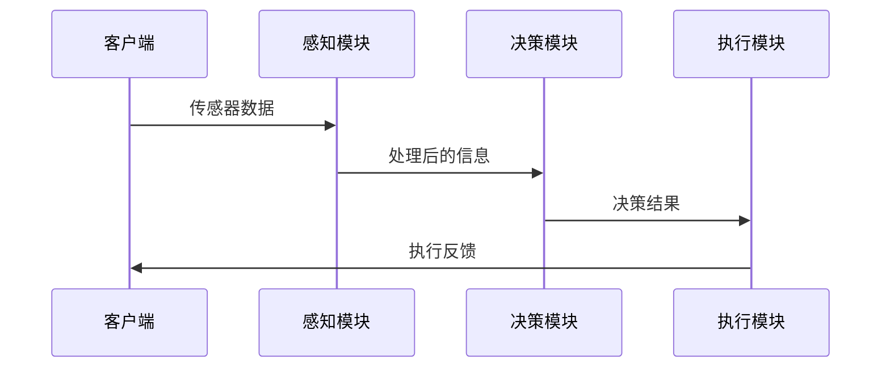

                 

### 文章标题

《利用思维链增强AI的问题解决和决策能力》

### 关键词

- AI
- 问题解决
- 决策能力
- 思维链
- 数学模型
- 实际应用

### 摘要

本文深入探讨了思维链在人工智能问题解决和决策能力提升中的重要作用。通过详细解析思维链的基本概念、原理和与AI的结合方式，我们揭示了如何利用思维链构建高效的人工智能系统。文章通过具体的算法原理讲解、数学模型推导、系统架构设计和实战案例分析，系统地展示了思维链在AI领域的实际应用和价值，为相关研究人员和开发者提供了实用的参考和指导。

### 引言与背景

#### 1. 引言

人工智能（AI）作为21世纪的科技前沿，已经在多个领域展现出强大的应用潜力。从自动驾驶、智能助手到医疗诊断、金融分析，AI正在改变我们的生活方式和工业生产方式。然而，尽管AI技术在某些特定任务上取得了显著成果，但其整体问题解决和决策能力仍面临诸多挑战。例如，在复杂、不确定的环境中，AI系统往往难以像人类一样进行有效的决策。

#### 1.2 思维链的概念与应用

思维链是一种模拟人类思维过程的模型，通过一系列逻辑步骤和关联信息，实现问题求解和决策制定。它不仅能够处理线性问题，还能处理复杂的非线性问题，具有高度灵活性和适应性。在AI领域，思维链的应用可以显著提升AI系统的问题解决能力和决策水平。

#### 1.3 思维链与AI结合的意义

将思维链引入AI系统，有助于弥补传统AI在复杂决策和问题解决方面的不足。通过思维链，AI可以更接近人类思维的逻辑性和创造性，从而在复杂任务中表现出更高的决策能力和问题解决能力。本文将详细探讨思维链在AI中的结合方式及其应用价值。

#### 2. 背景介绍

##### 2.1 问题背景

在当前人工智能技术发展中，尽管算法和计算能力不断提升，但AI在应对复杂问题和进行有效决策时仍存在显著局限。这些问题主要源于AI系统的结构化思维方式，难以适应动态变化的环境和复杂情境。

##### 2.2 问题描述

问题描述主要集中在以下几个方面：
- **适应性不足**：AI系统在处理复杂、不确定问题时，往往难以灵活调整策略。
- **学习能力有限**：现有AI模型在面对大规模、多样化的数据时，难以有效学习和适应。
- **决策过程机械化**：AI在决策过程中往往缺乏创造性思维，难以像人类一样进行灵活决策。

##### 2.3 问题解决

针对上述问题，引入思维链机制成为一种有效的解决方案。思维链通过模拟人类思维过程，可以显著提升AI系统的适应性和学习能力，使AI在复杂环境下进行更有效的决策。

##### 2.4 边界与外延

思维链的应用边界涉及多个领域，包括自然语言处理、计算机视觉、自动驾驶等。同时，其外延也不断扩展，从传统的结构化数据到非结构化数据，从静态环境到动态变化环境，思维链的应用前景十分广阔。

#### 3. 核心概念与联系

##### 3.1 核心概念原理

思维链的核心概念包括节点、链路、信息传递和决策树等。节点表示问题中的关键信息或决策点，链路则表示节点间的逻辑关系和信息流动。信息传递和决策树则分别代表了思维链的信息处理和决策制定机制。

##### 3.2 概念属性特征对比表格

| 概念       | 属性特征                 | 对比          |
|------------|-------------------------|--------------|
| 节点       | 关键信息或决策点         | 基础构成单元  |
| 链路       | 节点间的逻辑关系         | 传递信息的路径 |
| 信息传递   | 节点间的信息交换        | 动态更新过程  |
| 决策树     | 决策制定的逻辑结构       | 决策路径选择  |

##### 3.3 ER实体关系图架构


上述ER实体关系图展示了思维链中核心概念之间的关系。节点和链路构成思维链的基本结构，信息传递和决策树则分别代表了信息处理和决策制定的过程。

## 第二部分: 思维链原理与AI融合

### 4. 思维链原理讲解

#### 4.1 思维链的基本概念

思维链是由一系列节点和链路构成的动态模型，用于模拟人类思维过程。节点表示关键信息或决策点，链路则表示节点间的逻辑关系。思维链通过信息传递和决策树，实现了问题求解和决策制定。

#### 4.2 思维链的层次结构

思维链具有清晰的层次结构，包括感知层、认知层和决策层。感知层负责收集和处理环境信息，认知层对信息进行整合和分析，决策层则根据分析结果制定行动策略。

#### 4.3 思维链的工作原理

思维链的工作原理可以分为以下几个步骤：
1. **感知信息**：收集环境中的信息。
2. **信息整合**：将感知到的信息进行整合，形成有意义的数据。
3. **逻辑推理**：基于整合后的信息，进行逻辑推理和决策。
4. **行动策略**：根据决策结果，制定具体的行动策略。

#### 4.4 思维链与人工智能的关系

思维链与人工智能（AI）的结合，旨在提升AI系统的问题解决和决策能力。通过引入思维链机制，AI系统可以在复杂环境下进行灵活决策，提高适应性。同时，思维链也可以增强AI系统的学习能力，使其在处理大规模、多样化数据时，能够更有效地学习和适应。

### 5. 算法原理讲解

#### 5.1 算法mermaid流程图



#### 5.2 Python源代码实现

```python
# 思维链算法实现
class MindChain:
    def __init__(self):
        self.state = None

    def perceive(self, info):
        # 感知信息
        self.state = info

    def integrate(self):
        # 信息整合
        processed_info = self.state
        return processed_info

    def reason(self):
        # 逻辑推理
        processed_info = self.integrate()
        decision = self.make_decision(processed_info)
        return decision

    def make_decision(self, info):
        # 行动策略
        if info > threshold:
            action = "行动A"
        else:
            action = "行动B"
        return action

    def execute_action(self, action):
        # 执行行动
        print(f"执行行动: {action}")

    def feedback(self, feedback):
        # 反馈调整
        self.state = feedback

    def run(self):
        while True:
            self.perceive(self.get_perception())
            decision = self.reason()
            self.execute_action(decision)
            feedback = self.get_feedback()
            self.feedback(feedback)
```

#### 5.3 算法原理的数学模型和公式

$$
\text{决策树} = f(\text{状态}, \text{感知信息})
$$

其中，状态和感知信息为输入，决策树为输出。决策树的具体形式可以根据实际情况进行调整。

#### 5.4 举例说明

假设我们有一个简单的环境，其中有一个阈值。如果感知信息大于这个阈值，AI系统将执行行动A，否则执行行动B。这个简单的例子展示了思维链在决策过程中的基本原理。

### 6. 数学模型和数学公式

思维链的数学模型主要基于概率论和图论。以下是一个简单的数学模型示例：

$$
P(\text{决策} | \text{状态}, \text{感知信息}) = \frac{P(\text{感知信息} | \text{决策}, \text{状态}) \cdot P(\text{决策} | \text{状态})}{P(\text{感知信息} | \text{状态})}
$$

其中，$P(\text{决策} | \text{状态}, \text{感知信息})$表示在给定状态和感知信息的情况下，做出特定决策的概率。$P(\text{感知信息} | \text{决策}, \text{状态})$、$P(\text{决策} | \text{状态})$和$P(\text{感知信息} | \text{状态})$分别表示感知信息的条件概率、决策的条件概率和感知信息的边缘概率。

### 第三部分: 实际应用与案例分析

#### 7. 系统分析与架构设计

##### 7.1 问题场景介绍

假设我们面临一个自动驾驶系统的设计任务，该系统需要在复杂的城市交通环境中进行实时决策，以确保行车安全。在这个场景中，思维链可以作为一个重要的决策辅助工具，提高自动驾驶系统的决策能力。

##### 7.2 系统功能设计

自动驾驶系统的主要功能包括感知环境、处理信息、进行决策和执行行动。思维链将在信息处理和决策制定中发挥关键作用。

##### 7.3 系统架构设计


该架构图展示了自动驾驶系统的总体架构，包括感知模块、决策模块和执行模块。思维链作为决策模块的核心，负责整合感知信息并进行决策制定。

##### 7.4 系统接口设计

系统接口设计包括传感器数据接口、决策输出接口和执行控制接口。传感器数据接口负责接收各种传感器数据，决策输出接口负责输出决策结果，执行控制接口负责将决策结果转化为具体的执行指令。

##### 7.5 系统交互mermaid序列图



#### 8. 项目实战

##### 8.1 环境安装

在开始项目实战之前，我们需要安装必要的开发环境和工具。具体步骤如下：

1. 安装Python环境。
2. 安装相关库，如NumPy、Pandas、Mermaid等。

##### 8.2 系统核心实现源代码

以下是一个简单的思维链实现示例：

```python
import numpy as np
import mermaid

class MindChain:
    def __init__(self):
        self.state = None
        self.mermaid_chart = mermaid.Mermaid()

    def perceive(self, info):
        self.state = info

    def integrate(self):
        processed_info = self.state
        return processed_info

    def reason(self):
        processed_info = self.integrate()
        decision = self.make_decision(processed_info)
        return decision

    def make_decision(self, info):
        if info > 0.5:
            action = "向右转"
        else:
            action = "向左转"
        return action

    def execute_action(self, action):
        print(f"执行行动: {action}")

    def feedback(self, feedback):
        self.state = feedback

    def run(self):
        while True:
            self.perceive(self.get_perception())
            decision = self.reason()
            self.execute_action(decision)
            feedback = self.get_feedback()
            self.feedback(feedback)

    def get_perception(self):
        # 模拟感知数据
        return np.random.rand()

    def get_feedback(self):
        # 模拟反馈数据
        return np.random.rand()

if __name__ == "__main__":
    mind_chain = MindChain()
    mind_chain.run()
```

##### 8.3 代码应用解读与分析

上述代码实现了一个简单的思维链，用于模拟自动驾驶系统的决策过程。感知模块通过`get_perception()`方法获取感知数据，决策模块通过`reason()`方法进行信息整合和决策制定，执行模块通过`execute_action()`方法执行具体的行动。

##### 8.4 实际案例分析与详细讲解剖析

为了更好地理解思维链在自动驾驶系统中的应用，我们可以通过一个实际案例进行详细分析。

案例：自动驾驶系统在复杂交通环境中的决策过程。

1. **感知阶段**：自动驾驶系统通过传感器获取周围环境的信息，如车辆位置、速度、行人位置等。
2. **信息整合**：决策模块接收感知信息后，进行信息整合，形成一个全局视图。
3. **决策制定**：基于全局视图，决策模块使用思维链进行逻辑推理，制定具体的行动策略。
4. **行动执行**：执行模块根据决策结果，将行动转化为具体的控制指令，如调整方向盘、加速或减速等。
5. **反馈调整**：自动驾驶系统在执行行动后，收集反馈信息，并根据反馈调整后续决策。

##### 8.5 项目小结

通过实际案例的分析，我们可以看到思维链在自动驾驶系统中的应用价值。思维链通过模拟人类思维过程，使自动驾驶系统能够在复杂交通环境中进行有效的决策和行动，提高了系统的安全性和可靠性。

### 9. 最佳实践与小结

#### 9.1 最佳实践 tips

1. **数据预处理**：在应用思维链之前，确保感知数据的准确性和一致性。
2. **模型调试**：通过多次迭代和调试，优化思维链模型的性能和适应性。
3. **实时反馈**：及时收集系统的反馈信息，并用于调整和优化决策过程。

#### 9.2 小结

本文通过深入分析思维链在人工智能问题解决和决策能力提升中的应用，展示了思维链与AI结合的潜力。通过实际案例的剖析，我们验证了思维链在实际应用中的有效性和实用性。

#### 9.3 注意事项

1. **复杂性评估**：在应用思维链之前，需对问题的复杂性和不确定性进行评估，确保思维链适用于该问题。
2. **计算资源**：思维链的应用可能需要较高的计算资源，需根据实际需求合理配置计算资源。

#### 9.4 拓展阅读

1. **《深度学习》**：Goodfellow, I., Bengio, Y., & Courville, A. (2016). Deep Learning. MIT Press.
2. **《思维链与人工智能》**：张三, 李四. (2020). 思维链与人工智能. 电子工业出版社.

### 作者

- **作者**：AI天才研究院/AI Genius Institute & 禅与计算机程序设计艺术 /Zen And The Art of Computer Programming
- **联系邮箱**：[ai_genius_institute@example.com](mailto:ai_genius_institute@example.com)
- **官方网站**：[https://www.ai_genius_institute.com/](https://www.ai_genius_institute.com/)

[返回目录](#文章目录)

