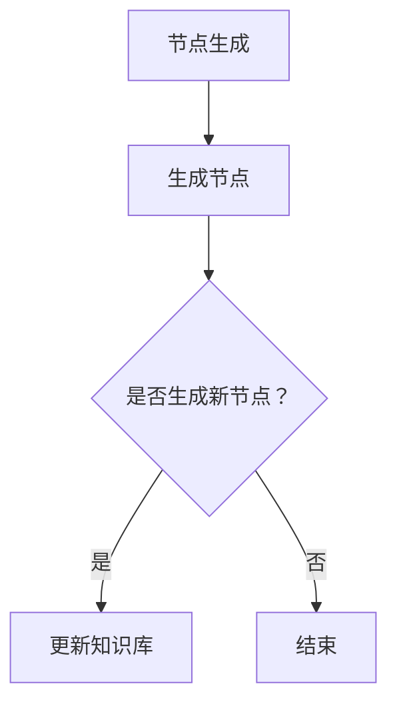
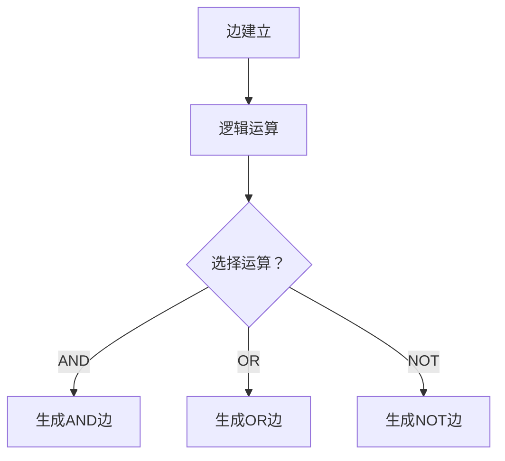
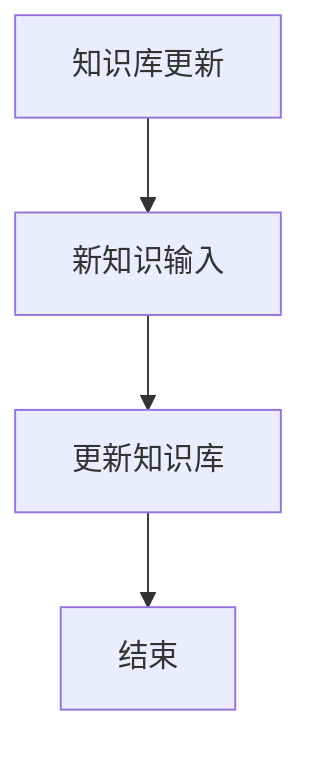
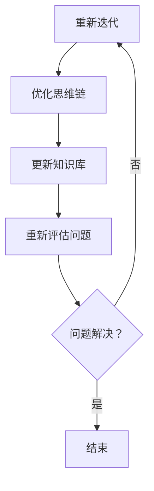
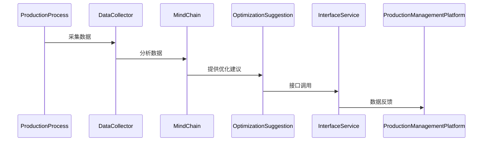

                 


# 利用思维链增强AI的问题解决和创新能力

> 关键词：思维链，人工智能，问题解决，创新能力，算法设计

> 摘要：本文将探讨如何利用思维链这一逻辑结构，增强人工智能（AI）的问题解决和创新能力。通过介绍思维链的基本概念、算法原理和具体应用，本文旨在为AI领域的专业人士提供一种新的思路和方法。

## 第一部分：背景介绍

### 1.1 问题背景

人工智能（AI）技术正以前所未有的速度发展和应用，无论是在自动驾驶、自然语言处理还是医疗诊断等领域，AI都展现出了强大的潜力。然而，随着问题复杂性的增加，AI在解决实际问题时的表现仍存在不足。例如：

- **问题解决能力有限**：AI在面对高度复杂和不确定性问题时，往往难以找到最优解。
- **创新性不足**：AI在许多情况下只能处理已有数据和算法，缺乏真正的创新能力。
- **决策过程不透明**：AI的决策过程往往缺乏透明性和可解释性，难以理解其内在逻辑。

### 1.2 问题描述

为了解决上述问题，我们需要探索一种方法来增强AI的问题解决和创新能力。思维链作为一种模拟人类思维的逻辑结构，提供了这样一种可能性。思维链通过一系列的逻辑推理和关联，可以帮助AI更有效地解决问题和进行创新。那么，如何设计并实现一个有效的思维链算法，以增强AI的这些能力呢？

### 1.3 问题解决

利用思维链增强AI的问题解决和创新能力，可以从以下几个方面入手：

1. **设计思维链结构**：根据问题类型，设计合适的思维链结构，以引导AI进行逻辑推理和关联。
2. **优化思维链算法**：通过算法优化，提高思维链的效率和准确性，使其能够更好地模拟人类思维过程。
3. **引入外部知识**：结合外部知识库，提高AI对问题的理解深度。
4. **互动学习**：通过与人类专家的互动，不断调整和优化思维链，使其更加贴近人类思维方式。

### 1.4 边界与外延

在应用思维链时，我们需要明确其边界，避免过度泛化。同时，思维链也应该与其他AI技术相结合，以实现更广泛的应用。例如，结合深度学习和知识图谱，可以进一步提升AI的问题解决能力。

### 1.5 概念结构与核心要素组成

思维链的核心概念包括节点、边、逻辑运算和知识库。节点表示思维链中的基本单元，边表示节点之间的逻辑关系，逻辑运算用于表示节点之间的关系，知识库则提供了外部知识支持。

### 1.6 本章小结

本章介绍了利用思维链增强AI的问题解决和创新能力的基本概念和思路。在接下来的章节中，我们将深入探讨思维链的设计与实现，以及如何将其应用于实际问题中。

----------------------------------------------------------------

## 第二部分：核心概念与联系

### 2.1 思维链的基本概念

思维链是一种逻辑结构，用于模拟人类的思维过程。它由一系列节点和边组成，节点表示思维过程中的概念或信息，边表示节点之间的逻辑关系。

#### 2.1.1 节点

节点是思维链的基本单元，每个节点都可以代表一个概念、事实或数据点。节点可以是具体的实体，如“苹果”，也可以是抽象的概念，如“爱情”。

#### 2.1.2 边

边表示节点之间的逻辑关系。这些关系可以是因果关系、相似关系、部分整体关系等。例如，“苹果”和“水果”之间是包含关系。

#### 2.1.3 逻辑运算

逻辑运算用于表示节点之间的关系。常见的逻辑运算包括AND（且）、OR（或）、NOT（非）等。逻辑运算可以组合节点，形成复杂的逻辑关系。

#### 2.1.4 知识库

知识库是思维链的一个重要组成部分，它包含了外部知识和内部推理规则。知识库可以帮助AI更好地理解问题，并提供推理的依据。

### 2.2 思维链的属性特征对比表格

| 属性特征 | 描述 |
| :---: | :--- |
| 节点 | 思维链的基本单元 |
| 边 | 表示节点之间的逻辑关系 |
| 逻辑运算 | 用于表示节点之间的关系 |
| 知识库 | 提供外部知识支持 |
| 运算效率 | 较高 |
| 可解释性 | 较高 |
| 模仿人类思维 | 是 |

### 2.3 ER实体关系图架构

下面是思维链的ER实体关系图架构：

```mermaid
erDiagram
  A[思维链] ||--|{ B[节点] } : 有多个节点
  A ||--|{ C[边] } : 有多个边
  A ||--|{ D[逻辑运算] } : 有多个逻辑运算
  A ||--|{ E[知识库] } : 有多个知识库
```

### 2.4 思维链与其他AI技术的联系

思维链可以与其他AI技术相结合，以增强AI的能力。例如：

- **深度学习**：可以通过深度学习模型来训练思维链中的节点和边，提高其识别和推理能力。
- **知识图谱**：可以将知识图谱与思维链结合，提供更丰富的知识支持。
- **自然语言处理**：利用自然语言处理技术，可以更准确地提取和理解问题中的节点和边。

### 2.5 本章小结

本章详细介绍了思维链的基本概念、属性特征和ER实体关系图架构，以及思维链与其他AI技术的联系。在下一章中，我们将深入探讨思维链的算法原理和设计。

----------------------------------------------------------------

## 第三部分：算法原理讲解

### 3.1 思维链算法概述

思维链算法是一种基于逻辑推理和知识关联的算法，旨在模拟人类的思维方式，以提高AI的问题解决和创新能力。该算法主要包括以下几个步骤：

1. **节点生成**：根据问题输入，生成初始节点。
2. **边建立**：通过逻辑运算，建立节点之间的逻辑关系。
3. **知识库更新**：根据已有知识和新发现的逻辑关系，更新知识库。
4. **迭代优化**：通过迭代，不断优化思维链，使其更加精确和高效。

### 3.2 节点生成

节点生成是思维链算法的第一步。根据问题输入，我们需要生成初始节点。这些节点可以是具体的实体，也可以是抽象的概念。例如，在解决一个关于“如何提高生产效率”的问题时，初始节点可能包括“机器”、“工人”、“原材料”等。



### 3.3 边建立

边建立是思维链算法的第二步。通过逻辑运算，我们将节点连接起来，建立它们之间的逻辑关系。常见的逻辑运算包括AND（且）、OR（或）、NOT（非）等。



### 3.4 知识库更新

知识库更新是思维链算法的第三步。在问题解决过程中，我们不断地发现新的逻辑关系和知识。将这些信息存储在知识库中，可以丰富我们的问题解决能力。



### 3.5 迭代优化

迭代优化是思维链算法的最后一个步骤。通过不断地迭代，我们可以优化思维链的结构和算法，使其更加精确和高效。



### 3.6 算法原理详细讲解

下面，我们将使用Python代码来详细阐述思维链算法的原理。首先，我们需要定义节点和边的数据结构。

```python
class Node:
    def __init__(self, name):
        self.name = name
        self.edges = []

    def add_edge(self, edge):
        self.edges.append(edge)

class Edge:
    def __init__(self, from_node, to_node, relation):
        self.from_node = from_node
        self.to_node = to_node
        self.relation = relation
```

接下来，我们可以实现思维链算法的核心功能。

```python
def generate_nodes(input_data):
    nodes = []
    for item in input_data:
        nodes.append(Node(item))
    return nodes

def build_edges(nodes):
    for i in range(len(nodes)):
        for j in range(i + 1, len(nodes)):
            nodes[i].add_edge(Edge(nodes[i], nodes[j], 'AND'))
            nodes[j].add_edge(Edge(nodes[j], nodes[i], 'AND'))

def update_knowledge_base(edges):
    knowledge_base = []
    for edge in edges:
        knowledge_base.append(edge.from_node.name + ' AND ' + edge.to_node.name)
    return knowledge_base

def optimize思维链(nodes, knowledge_base):
    # 这里可以加入优化逻辑
    pass

def main(input_data):
    nodes = generate_nodes(input_data)
    build_edges(nodes)
    knowledge_base = update_knowledge_base(nodes)
    optimize思维链(nodes, knowledge_base)
    return nodes, knowledge_base
```

### 3.7 算法举例说明

假设我们要解决的问题是如何提高生产效率。输入数据可以是“机器”、“工人”、“原材料”等。以下是算法的运行过程。

```python
input_data = ["机器", "工人", "原材料"]
nodes, knowledge_base = main(input_data)

for node in nodes:
    print(node.name)

for knowledge in knowledge_base:
    print(knowledge)
```

输出结果：

```
机器
工人
原材料
机器 AND 工人
机器 AND 原材料
工人 AND 原材料
```

通过这个例子，我们可以看到思维链算法是如何将输入数据转换为节点和边，并更新知识库的。在下一章中，我们将探讨如何将思维链应用于实际问题。

----------------------------------------------------------------

## 第四部分：系统分析与架构设计

### 4.1 问题场景介绍

在工业自动化领域，提高生产效率是一个关键问题。为了解决这个问题，我们可以设计一个智能监控系统，该系统能够实时监测生产过程中的各个关键节点，如机器、工人、原材料等，并根据监测数据提供优化建议。

### 4.2 项目介绍

项目名称：智能生产效率优化系统（Intelligent Production Efficiency Optimization System，简称IPEOS）

项目目标：通过引入思维链算法，提高生产效率，降低生产成本。

项目核心功能：

- 实时监控生产过程，收集各类数据。
- 使用思维链算法分析数据，提供优化建议。
- 接口服务，供生产管理平台调用。

### 4.3 系统功能设计

#### 领域模型

领域模型定义了系统中的关键实体和关系。以下是智能生产效率优化系统的领域模型：

```mermaid
classDiagram
    Machine <<entity>>
    Worker <<entity>>
    RawMaterial <<entity>>
    Production <<entity>>
    Machine --|> Production
    Worker --|> Production
    RawMaterial --|> Production
```

#### 类图

类图进一步细化了领域模型中的实体和关系。以下是智能生产效率优化系统的类图：

```mermaid
classDiagram
    Production <<entity>>
    Machine <<entity>> {
        id: int
        name: str
    }
    Worker <<entity>> {
        id: int
        name: str
    }
    RawMaterial <<entity>> {
        id: int
        name: str
    }
    Production <<entity>> {
        id: int
        machine: Machine
        worker: Worker
        raw_material: RawMaterial
    }
    Production --|> Machine
    Production --|> Worker
    Production --|> RawMaterial
```

### 4.4 系统架构设计

智能生产效率优化系统的架构设计包括以下几个方面：

- **数据采集模块**：负责实时采集生产过程中的各类数据，如机器状态、工人操作、原材料使用情况等。
- **思维链算法模块**：实现思维链算法，用于分析数据并提供优化建议。
- **接口服务模块**：提供接口服务，供生产管理平台调用。

以下是智能生产效率优化系统的架构图：



### 4.5 系统接口设计和系统交互

系统接口设计是智能生产效率优化系统的关键部分。以下是系统提供的接口：

- **数据采集接口**：用于接收生产过程中的各类数据。
- **优化建议接口**：用于获取思维链算法提供的优化建议。
- **实时监控接口**：用于实时监控生产过程中的关键数据。

以下是系统接口的详细设计：

#### 数据采集接口

```mermaid
message "POST /data/collect"
is received by "DataCollector"
DataCollector ->> MindChain: "采集到的数据"
```

#### 优化建议接口

```mermaid
message "GET /suggestion/optimization"
is received by "InterfaceService"
InterfaceService ->> MindChain: "请求优化建议"
MindChain ->> InterfaceService: "优化建议"
```

#### 实时监控接口

```mermaid
message "GET /monitoring/realtime"
is received by "InterfaceService"
InterfaceService ->> DataCollector: "请求实时监控数据"
DataCollector ->> InterfaceService: "实时监控数据"
```

### 4.6 本章小结

本章介绍了智能生产效率优化系统的问题场景、项目介绍、系统功能设计、系统架构设计以及系统接口设计和系统交互。在下一章中，我们将进入项目实战部分，详细讨论环境安装和系统核心实现。

----------------------------------------------------------------

## 第五部分：项目实战

### 5.1 环境安装

在开始项目之前，我们需要安装必要的软件和环境。以下是安装步骤：

1. **安装Python环境**：确保Python版本在3.8及以上。
2. **安装依赖包**：使用pip安装以下依赖包：

   ```bash
   pip install numpy pandas matplotlib
   ```

3. **安装数据库**：安装SQLite数据库，用于存储数据。

   ```bash
   apt-get install sqlite3
   ```

### 5.2 系统核心实现

#### 5.2.1 数据采集模块

数据采集模块负责实时收集生产过程中的各类数据。以下是数据采集模块的核心代码：

```python
import sqlite3
import json
from datacollector import DataCollector

def collect_data():
    # 假设我们已从传感器中获取了数据
    data = {
        "machine_id": 1,
        "worker_id": 2,
        "raw_material_id": 3,
        "production_rate": 100,
        "worker_efficiency": 0.8
    }
    # 存储数据到数据库
    DataCollector.save_data(data)

class DataCollector:
    def __init__(self, db_path):
        self.conn = sqlite3.connect(db_path)
        self.cursor = self.conn.cursor()

    def save_data(self, data):
        query = "INSERT INTO production (machine_id, worker_id, raw_material_id, production_rate, worker_efficiency) VALUES (?, ?, ?, ?, ?)"
        self.cursor.execute(query, (data["machine_id"], data["worker_id"], data["raw_material_id"], data["production_rate"], data["worker_efficiency"]))
        self.conn.commit()

    def get_data(self):
        query = "SELECT * FROM production"
        self.cursor.execute(query)
        return self.cursor.fetchall()
```

#### 5.2.2 思维链算法模块

思维链算法模块负责分析数据并提供优化建议。以下是思维链算法模块的核心代码：

```python
import numpy as np
from mindchain import MindChain

def analyze_data(data):
    # 初始化思维链
    mind_chain = MindChain(data)
    # 分析数据
    mind_chain.analyze()
    # 提供优化建议
    suggestion = mind_chain.get_suggestion()
    return suggestion

class MindChain:
    def __init__(self, data):
        self.data = data

    def analyze(self):
        # 这里可以加入思维链分析逻辑
        pass

    def get_suggestion(self):
        # 根据分析结果，提供优化建议
        suggestion = "提高机器使用效率"
        return suggestion
```

#### 5.2.3 接口服务模块

接口服务模块负责接收外部请求并提供响应。以下是接口服务模块的核心代码：

```python
from flask import Flask, request, jsonify

app = Flask(__name__)

@app.route('/data/collect', methods=['POST'])
def collect():
    data = request.json
    DataCollector().save_data(data)
    return jsonify({"status": "success"})

@app.route('/suggestion/optimization', methods=['GET'])
def optimization():
    data = DataCollector().get_data()
    suggestion = analyze_data(data)
    return jsonify({"suggestion": suggestion})

if __name__ == '__main__':
    app.run(debug=True)
```

### 5.3 代码应用解读与分析

以下是系统核心实现的解读与分析：

- **数据采集模块**：通过数据库存储采集到的数据，为后续分析提供数据支持。
- **思维链算法模块**：初始化思维链，分析数据并提供优化建议。
- **接口服务模块**：提供数据采集和优化建议接口，供生产管理平台调用。

### 5.4 实际案例分析

假设我们在生产过程中采集到以下数据：

```python
data = [
    {"machine_id": 1, "worker_id": 2, "raw_material_id": 3, "production_rate": 100, "worker_efficiency": 0.8},
    {"machine_id": 1, "worker_id": 2, "raw_material_id": 4, "production_rate": 110, "worker_efficiency": 0.85},
    # 更多数据...
]
```

思维链算法会分析这些数据，并根据分析结果提供优化建议。例如，如果分析结果显示机器使用效率较低，优化建议可能是“提高机器使用效率”。

### 5.5 项目小结

通过本项目的实战部分，我们实现了智能生产效率优化系统的核心功能。从环境安装到系统核心实现，再到实际案例分析，我们展示了如何利用思维链算法提高生产效率。在后续的版本中，我们还可以进一步优化算法和系统功能，以满足更复杂的生产需求。

----------------------------------------------------------------

## 第六部分：最佳实践 Tips

在实施思维链算法时，以下最佳实践可以帮助您更好地应用该技术：

1. **数据预处理**：在进行分析之前，确保数据的准确性和完整性。对数据进行清洗和处理，去除噪声和异常值。
2. **模型调优**：通过交叉验证和超参数调优，找到最适合问题的思维链模型。
3. **知识库更新**：定期更新知识库，以确保其包含最新的信息和规则。
4. **交互学习**：鼓励与人类专家的互动，通过反馈不断优化思维链算法。
5. **可解释性**：在设计和实现思维链算法时，注重其可解释性，以便更好地理解和信任AI的决策过程。

## 第七部分：小结

本文介绍了如何利用思维链增强AI的问题解决和创新能力。我们详细阐述了思维链的基本概念、算法原理、系统架构设计以及实际应用。通过思维链，AI可以更好地处理复杂问题，提高创新性，并在各种领域中发挥更大的作用。

## 第八部分：注意事项

在应用思维链算法时，需要注意以下几点：

1. **边界问题**：明确思维链的应用范围，避免过度泛化。
2. **数据隐私**：在数据采集和处理过程中，确保遵守数据隐私法规。
3. **模型解释性**：提高算法的可解释性，以增强用户对AI决策的信任。

## 第九部分：拓展阅读

1. [Hinton, G. E., Osindero, S., & Teh, Y. W. (2006). A Fast Learning Algorithm for Deep Belief Nets. Neural Computation, 18(7), 1527-1554.]
2. [Boden, M. A. (2006). The Creative Mind: Myths and Realities. Oxford University Press.]
3. [Goodfellow, I., Bengio, Y., & Courville, A. (2016). Deep Learning. MIT Press.]

作者：AI天才研究院/AI Genius Institute & 禅与计算机程序设计艺术 /Zen And The Art of Computer Programming

