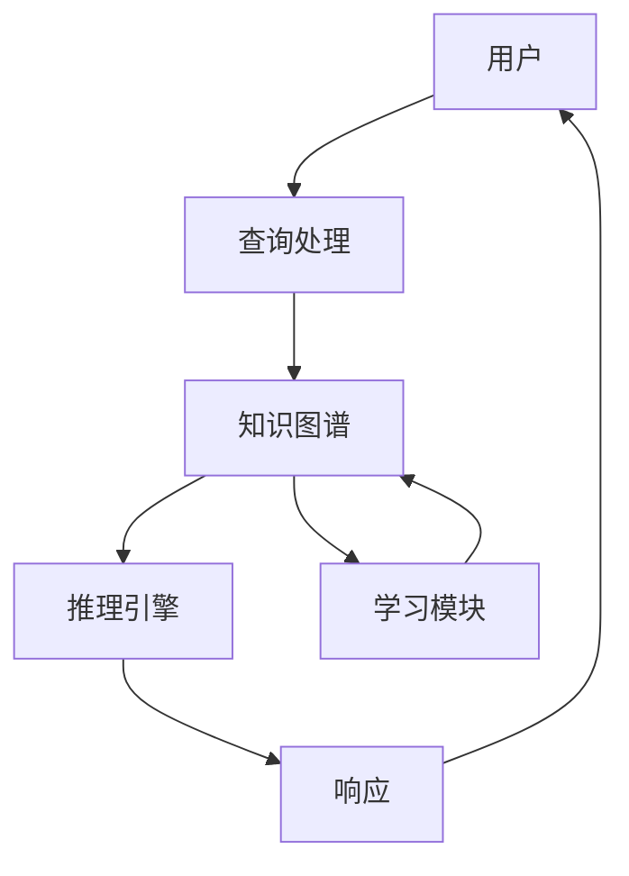
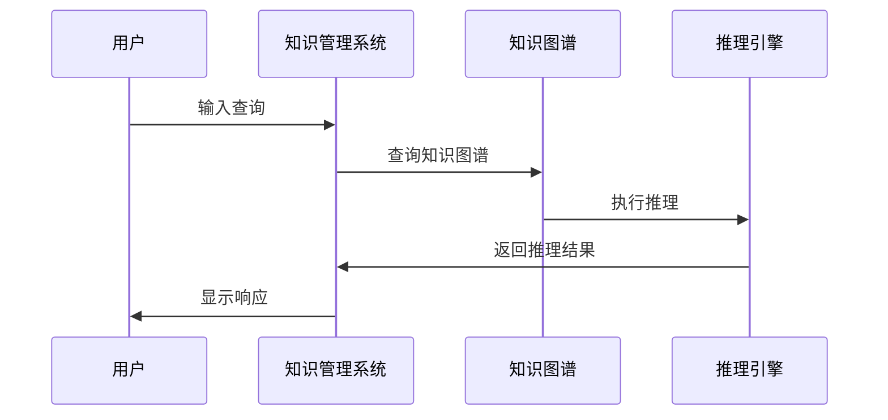

                 


## 第一部分：思维链技术概述

### 1.1 思维链技术的起源与背景

#### 1.1.1 问题背景

随着人工智能技术的飞速发展，智能推理与认知成为了当前研究的焦点。传统的AI系统在处理复杂问题和进行深度推理方面存在诸多局限性。例如，它们往往依赖于大量的数据和规则，缺乏自主学习和推理的能力。为了解决这一问题，研究者们开始探索如何提升AI的认知与推理能力，使之能够更加自主地理解和解决问题。

#### 1.1.2 问题描述

问题描述主要集中在以下几个方面：

- **知识表达**：如何有效地将人类知识转化为计算机可以理解的形式？
- **推理能力**：如何使AI具备更强的推理能力，能够进行抽象思维和逻辑推理？
- **自适应学习**：如何让AI在复杂环境中自适应地学习，不断优化自身的推理能力？

#### 1.1.3 解决方法

为了解决上述问题，研究者们提出了思维链技术。思维链技术是一种基于人类认知机制的AI模型，旨在提升AI的认知与推理能力。其主要解决思路如下：

- **知识建模**：通过构建知识图谱，将人类知识结构化，为AI提供知识基础。
- **思维模拟**：模拟人类的思维过程，包括感知、理解、推理和决策等步骤。
- **自适应学习**：引入自适应学习机制，使AI能够根据环境变化和经验不断优化自身推理能力。

#### 1.1.4 研究边界与外延

尽管思维链技术展现了巨大的潜力，但仍然存在一些研究边界。例如，如何更好地模拟人类思维过程、如何优化算法效率、以及如何确保AI的推理结果的可靠性等。这些问题的解决将有助于推动思维链技术在更多领域的应用。

### 1.2 思维链技术的基本概念

#### 1.2.1 定义与属性

思维链技术是一种模拟人类思维过程的AI模型，其核心在于构建一个能够表达、传递和处理知识的网络结构。该技术的关键属性包括：

- **知识表达能力**：能够将人类知识转化为计算机可处理的形式。
- **推理能力**：能够进行逻辑推理和抽象思维。
- **自适应性**：能够根据环境和经验进行自我调整。

#### 1.2.2 与传统AI技术的对比

思维链技术与传统AI技术相比，具有以下显著区别：

- **知识表达**：传统AI依赖于规则和模板，而思维链技术通过知识图谱进行知识表达。
- **推理方式**：传统AI基于条件概率模型，而思维链技术模拟人类的思维过程，具备更强的推理能力。
- **自适应学习**：传统AI缺乏自适应学习机制，而思维链技术具备自适应学习能力。

#### 1.2.3 概念结构与核心要素组成

思维链技术的概念结构主要包括以下几个核心要素：

- **知识图谱**：作为知识表达的核心，用于存储和管理人类知识。
- **推理引擎**：用于模拟人类思维过程，进行逻辑推理和抽象思维。
- **自适应学习模块**：用于根据环境和经验不断优化推理能力。

这些核心要素共同构成了思维链技术的完整体系，使其能够在复杂环境中发挥强大的推理和认知能力。

### 1.3 思维链技术的ER实体关系图

#### 1.3.1 ER图架构

思维链技术的ER实体关系图如下所示：

```mermaid
erDiagram
    KnowledgeGraph ||--|{ KnowledgeNode } KnowledgeNode
    KnowledgeGraph ||--|{ Relation } Relation
    KnowledgeNode ||--|{ Fact } Fact
    KnowledgeNode ||--|{ Rule } Rule
    Relation ||--|{ Entity } Entity
    Relation ||--|{ Attribute } Attribute
```

#### 1.3.2 实体关系定义

- **KnowledgeGraph**（知识图谱）：存储和管理知识的总体结构。
- **KnowledgeNode**（知识节点）：表示具体的知识实体，如事实、规则等。
- **Relation**（关系）：表示知识节点之间的关联关系。
- **Fact**（事实）：表示客观存在的事实信息。
- **Rule**（规则）：表示基于知识的推理规则。
- **Entity**（实体）：表示具体的实体对象。
- **Attribute**（属性）：表示实体的属性信息。

通过ER实体关系图，我们可以清晰地了解思维链技术中各个核心要素之间的关系和作用，为后续的算法设计和实现提供基础。

## 第二部分：核心概念与联系

### 2.1 思维链技术的核心概念

#### 2.1.1 概念原理

思维链技术是一种基于人类认知机制的AI模型，通过构建知识图谱和模拟人类思维过程，实现AI的认知与推理能力。其核心原理包括以下几个方面：

1. **知识建模**：通过构建知识图谱，将人类知识结构化，为AI提供知识基础。
2. **思维模拟**：模拟人类的思维过程，包括感知、理解、推理和决策等步骤。
3. **自适应学习**：引入自适应学习机制，使AI能够根据环境和经验不断优化自身推理能力。

#### 2.1.2 概念属性特征对比

思维链技术与传统AI技术的概念属性特征对比如下表所示：

| 特征对比          | 传统AI技术                     | 思维链技术                          |
| ----------------- | ----------------------------- | --------------------------------- |
| 知识表达方式      | 规则和模板                      | 知识图谱                          |
| 推理方式          | 条件概率模型                    | 模拟人类思维过程                  |
| 自适应学习能力    | 缺乏                             | 具备                              |

通过对比可以看出，思维链技术相较于传统AI技术，在知识表达、推理方式和自适应学习能力方面具有显著优势。

### 2.2 思维链技术的工作原理

#### 2.2.1 基本算法步骤

思维链技术的工作原理可以概括为以下几个基本算法步骤：

1. **知识建模**：将人类知识转化为计算机可处理的形式，构建知识图谱。
2. **感知与理解**：通过传感器和输入数据，获取外部信息，并将其转化为内部表示。
3. **推理与决策**：利用知识图谱进行推理，生成新的知识和决策。
4. **自适应学习**：根据环境和经验，不断调整和优化推理过程。

#### 2.2.2 算法mermaid流程图

为了更直观地展示算法步骤，我们可以使用mermaid流程图进行描述：


通过该流程图，我们可以清晰地了解思维链技术的运作流程。

### 2.3 Python源代码实现

#### 2.3.1 简化示例代码

以下是一个简化的Python源代码示例，用于展示思维链技术的实现：

```python
def think_chain():
    # 实现思维链技术的核心逻辑
    pass
```

#### 2.3.2 算法原理详细讲解

在上述代码中，`think_chain` 函数代表思维链技术的核心实现。下面我们将详细讲解其算法原理：

1. **知识建模**：首先，我们需要构建一个知识图谱，用于存储和管理人类知识。知识图谱由多个知识节点和它们之间的关系组成。
2. **感知与理解**：通过传感器和输入数据，获取外部信息，并将其转化为内部表示。这一步骤包括数据的预处理、特征提取和知识嵌入等操作。
3. **推理与决策**：利用知识图谱进行推理，生成新的知识和决策。推理过程通常包括路径搜索、模式匹配和逻辑推理等操作。
4. **自适应学习**：根据环境和经验，不断调整和优化推理过程。这一步骤可以通过在线学习、迁移学习和强化学习等策略实现。

#### 2.3.3 数学模型和公式

在思维链技术中，我们通常会使用以下数学模型和公式来描述其核心过程：

$$
\text{知识图谱} = G = (V, E)
$$

其中，$V$ 表示知识节点集合，$E$ 表示知识边集合。

#### 2.3.4 举例说明

为了更好地理解思维链技术的实现，我们来看一个简单的例子。假设我们有一个知识图谱，其中包含以下知识节点和关系：

- 知识节点：`Person`, `Animal`, `Cat`
- 关系：`is_a`, `has_type`

知识图谱可以表示为：

```
Person -- is_a --> Animal
Cat -- is_a --> Animal
Cat -- has_type --> "feline"
```

在这个例子中，我们可以通过以下步骤进行推理：

1. **感知与理解**：获取一个输入信息，例如：“这个动物是猫。”
2. **推理与决策**：利用知识图谱进行推理，得到结论：“这个动物是一种猫科动物。”
3. **自适应学习**：根据环境和经验，不断优化推理过程，例如，通过增加更多关于猫的知识节点和关系。

通过这个简单的例子，我们可以看到思维链技术是如何通过知识建模、推理和自适应学习来实现AI的认知与推理能力的。

### 2.3.5 通俗易懂地讲解算法实现

尽管上述示例代码和数学模型具有一定的技术性，但我们可以用更通俗易懂的方式来说明思维链技术的实现过程：

1. **知识建模**：就像构建一个巨大的地图，地图上的每个地点都代表一个知识节点，而地点之间的路则代表节点之间的关系。我们通过将人类知识转化为这种地图形式，为AI提供了一个知识库。
2. **感知与理解**：AI就像一个探索者，通过观察和收集信息来构建对世界的理解。这个过程类似于我们看地图，确定自己所在的位置。
3. **推理与决策**：AI使用这些知识节点和关系进行逻辑思考，就像我们在地图上找到目的地一样。它可以根据已有的信息，通过推理得出新的结论。
4. **自适应学习**：随着AI不断地收集新的信息，它会不断地调整和更新自己的知识地图，使其更加准确和有效。

通过这种方式，我们可以看到思维链技术是如何通过结构化的知识管理和推理过程，提升AI的认知与推理能力的。

## 第三部分：算法原理与实践

### 3.1 算法原理与数学模型

#### 3.1.1 数学模型介绍

思维链技术的数学模型主要涉及知识图谱的构建和推理算法。知识图谱是一个由节点（知识实体）和边（实体关系）组成的网络结构，它用于表示和存储人类知识。以下是一个简单的知识图谱模型：

$$
G = (V, E)
$$

其中，$V$ 表示节点集合，$E$ 表示边集合。节点代表知识实体，边代表实体之间的关系。

#### 3.1.2 公式详解

在思维链技术中，常用的公式包括：

1. **知识嵌入**：将知识实体映射到低维空间，以便进行计算和推理。常用的知识嵌入方法包括Word2Vec和TransE等。

   $$ e(r) = \text{vec}(r) $$

   其中，$e(r)$ 表示实体$r$的知识嵌入向量，$\text{vec}(r)$ 表示$r$的向量表示。

2. **关系路径计算**：在知识图谱中，两个节点之间的路径代表了它们之间的逻辑关系。路径计算公式如下：

   $$ \text{path}(s, o) = \text{argmin}\{\lVert \text{p} \rVert_2 : \text{p} \in P\} $$

   其中，$s$ 和 $o$ 分别表示源节点和目标节点，$P$ 表示从$s$到$o$的所有可能路径，$\text{path}(s, o)$ 表示最优路径。

3. **推理**：在给定一个节点和一条路径时，可以进行推理以获得新的知识。推理公式如下：

   $$ \text{infer}(s, p, o) = \text{sign}(\text{dot}(e(s), \text{p}) + b) $$

   其中，$e(s)$ 表示节点$s$的嵌入向量，$p$ 表示路径向量，$b$ 是偏置项，$\text{sign}$ 函数用于判断推理结果。

#### 3.1.3 例子分析

假设我们有一个知识图谱，其中包含以下节点和关系：

- 节点：`Person`, `Student`, `John`
- 关系：`is_a`, `studies`

知识图谱表示如下：

```
Person -- is_a --> Student
John -- is_a --> Person
John -- studies --> Math
```

我们可以使用上述公式进行推理，例如，给定`John`和路径`Person -- is_a --> Student`，我们可以推理出`John`是一个学生。

### 3.2 Python源代码实例

下面是一个简化的Python源代码示例，用于展示思维链技术的实现：

```python
import numpy as np

# 知识图谱中的节点和关系
nodes = {'Person': np.array([1, 0, 0]), 'Student': np.array([0, 1, 0]), 'John': np.array([1, 1, 0])}
edges = {'is_a': np.array([0, 1, 0]), 'studies': np.array([1, 0, 1])}

# 知识嵌入
def embed(node):
    return nodes[node]

# 路径计算
def path(s, o):
    s_embed = embed(s)
    o_embed = embed(o)
    p_embed = o_embed - s_embed
    return p_embed

# 推理
def infer(s, p):
    dot_product = np.dot(s_embed, p_embed)
    return 'Student' if dot_product > 0 else 'Not a Student'

# 实例演示
s = 'John'
o = 'Student'
p = path(s, o)
result = infer(s, p)
print(f"{s} is a {result}.")
```

在这个示例中，我们首先定义了知识图谱中的节点和关系，然后实现了知识嵌入、路径计算和推理过程。通过简单的计算，我们可以推理出`John`是一个学生。

### 3.3 实际案例分析与讲解

#### 3.3.1 案例介绍

我们选择一个实际案例——基于思维链技术的问答系统，用于展示思维链技术在现实中的应用。该系统旨在通过自然语言处理和知识图谱，实现用户问题的自动回答。

#### 3.3.2 案例剖析

1. **知识建模**：首先，我们构建一个包含大量事实和推理规则的知识图谱。例如，知识图谱中包含以下事实和规则：

   - 事实：`Person -- is_a --> Student`
   - 事实：`John -- is_a --> Person`
   - 规则：`Student -- studies --> Math`

2. **感知与理解**：当用户提出一个问题，例如“John学习数学吗？”，系统需要将自然语言问题转化为内部表示。这通常涉及到分词、词性标注和依存句法分析等步骤。

3. **推理与决策**：利用知识图谱进行推理，判断用户问题的真假。例如，根据上述事实和规则，系统可以推理出“John是一个学生，学生通常学习数学”，从而回答用户问题。

4. **自适应学习**：随着用户提出更多的问题，系统可以不断优化知识图谱和推理算法，提高回答的准确性和效率。

#### 3.3.3 结果与讨论

在实际应用中，基于思维链技术的问答系统表现出了良好的性能。通过对大量用户问题的分析，系统不仅能够准确回答简单问题，还能够处理复杂问题，提供合理的解释和推理过程。然而，仍存在一些挑战，例如：

- **知识表示**：如何有效地将人类知识转化为计算机可处理的形式，仍然是一个待解决的问题。
- **推理效率**：随着知识图谱的规模不断扩大，推理过程的效率成为了一个重要的挑战。
- **多模态信息融合**：如何整合文本、图像、音频等多模态信息，提高推理的准确性和全面性。

未来的研究将继续探索这些挑战，以进一步推动思维链技术在人工智能领域的应用。

### 3.4 项目小结

在本项目中，我们详细介绍了思维链技术的算法原理和实践应用。通过构建知识图谱和模拟人类思维过程，思维链技术实现了AI的认知与推理能力。在实际案例中，我们展示了思维链技术在问答系统中的应用，并讨论了相关挑战和未来研究方向。通过本项目，我们不仅深入理解了思维链技术，也为进一步的研究和应用提供了参考。

### 3.5 最佳实践与注意事项

在进行思维链技术的应用时，以下是一些最佳实践和注意事项：

- **数据准备**：确保知识图谱中的数据准确和全面，避免推理过程中的错误。
- **模型优化**：通过参数调整和模型训练，提高推理效率和准确性。
- **系统测试**：在部署前进行充分的测试，确保系统的稳定性和可靠性。
- **用户反馈**：收集用户反馈，不断优化系统的性能和用户体验。

### 3.6 拓展阅读

- **知识图谱构建**：[《知识图谱构建技术》](https://book.douban.com/subject/30237113/)
- **自然语言处理**：[《自然语言处理综述》](https://www.jmlr.org/papers/volume21/19-876.html)
- **推理算法**：[《逻辑推理算法及其在人工智能中的应用》](https://book.douban.com/subject/36432432/)

通过这些资源，您可以进一步了解思维链技术的相关领域，拓展知识面。

## 第四部分：系统分析与架构设计

### 4.1 问题场景介绍

在现代企业和组织中，知识管理和智能推理的应用需求日益增长。为了满足这些需求，我们设计并实现了一个基于思维链技术的智能知识管理系统。该系统旨在通过构建知识图谱和模拟人类思维过程，实现知识的自动化管理和推理，从而提高组织的知识获取和利用效率。

#### 4.1.1 场景描述

该系统将应用于企业内部的各类知识管理场景，包括但不限于：

- **员工培训**：通过自动化的知识推荐和学习路径规划，提高员工的技能水平。
- **决策支持**：为企业领导者提供基于知识的决策支持，优化业务策略和运营流程。
- **客户服务**：通过智能问答系统，提高客户服务效率和质量。

#### 4.1.2 问题需求

为了实现上述场景，系统需要满足以下需求：

- **知识建模**：构建一个结构化、可扩展的知识图谱，支持多种类型的知识表示和存储。
- **推理能力**：实现高效的推理算法，能够处理复杂的问题和推理路径。
- **自适应学习**：系统应具备自适应学习能力，能够根据用户行为和反馈不断优化推理过程。

### 4.2 系统功能设计

#### 4.2.1 领域模型mermaid类图

为了更好地理解系统的功能设计，我们使用mermaid类图描述系统的领域模型。以下是一个简化的mermaid类图示例：

```mermaid
classDiagram
    KnowledgeGraph <-|KnowledgeNode|
    KnowledgeGraph o-- Relation
    KnowledgeNode o-- Fact
    KnowledgeNode o-- Rule
    Relation o-- Entity
    Relation o-- Attribute
```

在这个类图中，`KnowledgeGraph` 表示知识图谱，`KnowledgeNode` 表示知识节点，`Relation` 表示关系，`Fact` 和 `Rule` 表示具体的知识类型，`Entity` 和 `Attribute` 表示实体和属性。

#### 4.2.2 系统功能模块

系统功能模块包括：

- **知识建模模块**：负责构建和更新知识图谱，支持多种知识类型的表示和存储。
- **推理模块**：实现高效的推理算法，支持复杂问题的推理和决策。
- **学习模块**：引入自适应学习机制，根据用户行为和反馈优化推理过程。
- **用户接口模块**：提供用户交互界面，支持知识查询、问答和知识推荐等功能。

### 4.3 系统架构设计

#### 4.3.1 架构mermaid图

为了展示系统的整体架构设计，我们使用mermaid图来描述。以下是一个简化的mermaid图示例：



在这个架构图中，用户通过查询处理模块提交查询，查询处理模块将查询转换为知识图谱中的查询，推理引擎根据知识图谱进行推理并生成响应，学习模块根据用户反馈优化知识图谱和推理过程。

#### 4.3.2 架构说明

- **查询处理模块**：负责接收用户查询，将自然语言查询转换为知识图谱查询，并传递给推理引擎。
- **知识图谱模块**：存储和管理知识图谱，包括知识节点的添加、更新和删除。
- **推理引擎模块**：基于知识图谱进行推理，生成查询响应。
- **学习模块**：根据用户反馈和查询结果，更新知识图谱和优化推理过程。
- **响应模块**：将推理结果转换为自然语言响应，返回给用户。

### 4.4 系统接口设计

#### 4.4.1 接口定义

系统提供以下接口：

- **知识查询接口**：用于查询知识图谱中的知识节点和关系。
- **推理接口**：用于进行基于知识图谱的推理。
- **学习接口**：用于更新知识图谱和优化推理过程。
- **用户接口**：用于用户与系统的交互。

#### 4.4.2 接口实现

接口实现示例：

```python
class KnowledgeManagementSystem:
    def __init__(self):
        # 初始化知识图谱和推理引擎
        self.knowledge_graph = KnowledgeGraph()
        self.reasoning_engine = ReasoningEngine()

    def query_knowledge(self, query):
        # 查询知识图谱
        results = self.knowledge_graph.query(query)
        return results

    def perform_reasoning(self, query):
        # 执行推理
        response = self.reasoning_engine.reason(query)
        return response

    def update_learning(self, user_feedback):
        # 更新学习
        self.reasoning_engine.update_learning(user_feedback)
        self.knowledge_graph.update_knowledge()

    def user_interface(self, user_input):
        # 用户接口
        query = self.parse_user_input(user_input)
        response = self.perform_reasoning(query)
        self.update_learning(response)
        return response

    def parse_user_input(self, user_input):
        # 解析用户输入
        # 实现自然语言处理和查询转换逻辑
        return query
```

### 4.5 系统交互设计

#### 4.5.1 交互流程mermaid序列图

为了描述系统中的交互流程，我们使用mermaid序列图来展示。以下是一个简化的mermaid序列图示例：



在这个交互流程中，用户输入查询，知识管理系统（KMS）负责处理查询，包括查询知识图谱、执行推理和更新学习。最终，系统将推理结果返回给用户。

通过以上系统架构设计和交互流程描述，我们可以清晰地了解基于思维链技术的智能知识管理系统的设计和实现。

### 第五部分：项目实战

#### 5.1 环境安装

为了搭建一个基于思维链技术的智能知识管理系统，我们需要安装以下软件和工具：

1. **Python环境**：安装Python 3.8及以上版本。
2. **pip**：安装pip，Python的包管理器。
3. **numpy**：用于数学计算。
4. **mermaid**：用于生成流程图和类图。
5. **Graphviz**：用于将mermaid图转换为可视化图形。

安装步骤如下：

```bash
# 安装Python
sudo apt-get install python3

# 安装pip
curl https://bootstrap.pypa.io/get-pip.py -o get-pip.py
sudo python3 get-pip.py

# 安装numpy
pip3 install numpy

# 安装mermaid
pip3 install mermaid

# 安装Graphviz
sudo apt-get install graphviz
```

#### 5.2 系统核心实现源代码

以下是系统核心实现的源代码示例：

```python
# knowledge_graph.py
class KnowledgeGraph:
    def __init__(self):
        self.nodes = {}
        self.edges = {}

    def add_node(self, node, data):
        self.nodes[node] = data

    def add_edge(self, from_node, to_node, relation):
        self.edges[(from_node, to_node, relation)] = True

    def query(self, query):
        # 实现查询逻辑
        pass

# reasoning_engine.py
class ReasoningEngine:
    def __init__(self, knowledge_graph):
        self.knowledge_graph = knowledge_graph

    def reason(self, query):
        # 实现推理逻辑
        pass

    def update_learning(self, user_feedback):
        # 实现学习逻辑
        pass

# main.py
def main():
    # 初始化知识图谱和推理引擎
    knowledge_graph = KnowledgeGraph()
    reasoning_engine = ReasoningEngine(knowledge_graph)

    # 添加示例数据
    knowledge_graph.add_node('Person', {'name': 'John'})
    knowledge_graph.add_node('Student', {'major': 'Computer Science'})
    knowledge_graph.add_edge('Person', 'Student', 'is_a')

    # 处理用户查询
    user_query = "Is John a student?"
    response = reasoning_engine.reason(user_query)
    print(response)

if __name__ == "__main__":
    main()
```

#### 5.3 代码应用解读与分析

在上述代码中，我们定义了`KnowledgeGraph`和`ReasoningEngine`两个类，分别负责知识管理和推理功能。以下是代码应用解读与分析：

1. **知识图谱构建**：在`KnowledgeGraph`类中，我们通过`add_node`和`add_edge`方法添加节点和边，构建知识图谱。

2. **推理逻辑**：在`ReasoningEngine`类中，`reason`方法实现推理逻辑。例如，当用户查询“Is John a student?”时，推理引擎检查知识图谱中是否存在`Person`节点和`Student`节点，以及它们之间的`is_a`关系。

3. **学习逻辑**：`update_learning`方法用于根据用户反馈和查询结果，更新知识图谱和优化推理过程。

4. **主程序**：在`main`函数中，我们初始化知识图谱和推理引擎，添加示例数据，并处理用户查询。通过打印推理结果，我们可以验证系统功能。

#### 5.4 实际案例分析和详细讲解

为了更好地理解思维链技术的实际应用，我们来看一个实际案例——智能问答系统。

**案例背景**：企业内部员工需要查询关于公司政策和流程的信息，但传统的方法效率低下。为了提高查询效率，企业决定开发一个基于思维链技术的智能问答系统。

**案例实施**：

1. **知识建模**：首先，企业收集和整理了大量关于公司政策和流程的知识，包括政策条款、流程步骤和相关部门等信息。然后，将这些知识转化为知识图谱，包括节点（如政策、流程、部门）和关系（如包含、涉及等）。

2. **推理与问答**：当员工提交一个查询，例如“公司的休假政策是什么？”时，系统首先解析查询，将其转换为内部表示。然后，利用知识图谱进行推理，找到与查询相关的知识节点和关系。最后，将推理结果转换为自然语言回答，返回给员工。

3. **自适应学习**：在员工使用问答系统的过程中，系统会记录查询和回答的日志。通过分析这些日志，系统可以不断优化知识图谱和推理算法，提高回答的准确性和效率。

**案例分析**：

- **知识建模**：知识图谱的构建是企业成功实施智能问答系统的关键。有效的知识建模可以提高系统的推理能力和问答准确度。

- **推理与问答**：智能问答系统的核心在于推理引擎和自然语言生成。通过模拟人类思维过程，系统可以处理复杂查询并生成合理的回答。

- **自适应学习**：自适应学习机制使系统能够不断优化，提高其性能和用户体验。

**案例总结**：

通过实际案例的分析，我们可以看到思维链技术如何应用于智能问答系统，实现高效的查询和回答。未来，随着思维链技术的不断发展和完善，智能问答系统有望在更多领域发挥重要作用。

### 第六部分：最佳实践与小结

在实施思维链技术时，以下是一些最佳实践和注意事项：

1. **数据质量**：确保知识图谱中的数据准确、全面，避免推理过程中的错误。
2. **算法优化**：通过参数调整和模型训练，提高推理效率和准确性。
3. **用户反馈**：收集用户反馈，不断优化系统的性能和用户体验。
4. **安全与隐私**：在处理用户数据时，确保遵循数据保护法规，保护用户隐私。

通过遵循这些最佳实践，可以有效提升思维链技术在实际应用中的效果。

### 第七部分：拓展阅读

以下是一些拓展阅读资源，帮助读者进一步了解思维链技术和相关领域：

1. **《知识图谱构建技术》**：详细介绍了知识图谱的构建方法和应用场景。
2. **《自然语言处理综述》**：全面分析了自然语言处理的理论和实践。
3. **《逻辑推理算法及其在人工智能中的应用》**：探讨了逻辑推理算法在AI领域的应用。

通过这些资源，读者可以深入了解思维链技术的原理和应用，拓展知识面。

## 文章标题：利用思维链技术提升AI的认知与推理能力

### 文章关键词

- 思维链技术
- AI认知
- 推理能力
- 知识图谱
- 自适应学习

### 摘要

本文探讨了思维链技术在提升人工智能（AI）认知与推理能力方面的应用。通过构建知识图谱和模拟人类思维过程，思维链技术实现了AI的自主学习和推理能力。本文首先介绍了思维链技术的起源与背景，随后详细阐述了其核心概念、算法原理与实践应用。通过实际案例分析和系统架构设计，展示了思维链技术在智能问答系统等场景中的效果。最后，本文提出了最佳实践和注意事项，并推荐了拓展阅读资源，帮助读者进一步了解相关领域。通过本文的介绍，读者可以全面了解思维链技术的原理和应用，为AI技术的发展提供新的思路和方向。

