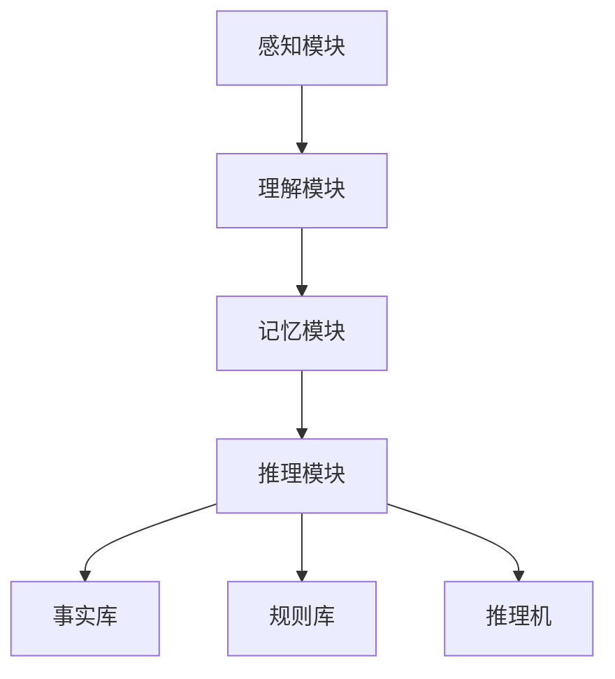

                 


## 利用思维链技术提升AI的认知与推理能力

### 关键词
- 思维链技术
- 认知与推理能力
- AI算法
- 数学模型
- 系统架构

### 摘要

本文旨在探讨如何利用思维链技术提升人工智能（AI）的认知与推理能力。我们将从基础概念入手，逐步深入探讨思维链技术的工作原理、算法原理、数学模型以及在实际项目中的应用，并通过具体案例展示其提升AI认知与推理能力的效果。本文结构如下：

1. **引言**：介绍思维链技术的背景及其在AI领域的重要性。
2. **思维链技术概述**：定义思维链技术，探讨其核心概念和基本原理。
3. **算法原理讲解**：详细解释思维链技术的算法原理，使用mermaid绘制流程图，并使用Python代码进行阐述。
4. **数学模型与公式**：介绍与思维链技术相关的数学模型，使用LaTeX格式书写。
5. **系统分析与架构设计**：分析问题场景，介绍系统功能和架构设计。
6. **项目实战**：通过实际案例展示思维链技术在项目中的应用。
7. **最佳实践与总结**：总结思维链技术在提升AI认知与推理能力方面的最佳实践。

### 引言

#### 思维链技术的背景

随着人工智能（AI）技术的快速发展，越来越多的应用场景涌现出来，如自然语言处理、图像识别、智能决策等。然而，当前的AI系统在认知与推理能力方面仍然存在诸多限制。传统的机器学习算法，如神经网络、决策树等，虽然在一定程度上提升了AI的性能，但它们在处理复杂任务时往往表现出明显的局限性。

为了克服这些局限性，研究人员提出了思维链技术。思维链技术是一种基于人类思维过程的模拟技术，它通过构建一系列逻辑思维链，使AI能够在复杂环境中进行推理和决策。思维链技术不仅能够提升AI的认知能力，还能使其具备更强的推理能力，从而在诸多应用领域实现突破。

#### 思维链技术在AI领域的重要性

思维链技术在AI领域具有以下几个重要意义：

1. **提升认知能力**：思维链技术能够模拟人类的思维过程，使AI具备更丰富的认知能力，能够理解和处理复杂的语义信息。
2. **增强推理能力**：通过构建逻辑思维链，思维链技术能够帮助AI在未知环境中进行推理，从而实现更智能的决策。
3. **拓展应用场景**：思维链技术的引入，使AI能够应用于更多的领域，如智能客服、智能交通、智能医疗等。

### 思维链技术概述

#### 定义

思维链技术，是指通过模拟人类思维过程，构建一系列逻辑思维链，使AI具备认知与推理能力的一种技术。它包括以下几个核心概念：

1. **认知**：指AI对信息的感知、理解、记忆和运用能力。
2. **推理**：指AI在已知信息的基础上，通过逻辑推理得出结论的能力。
3. **思维链**：指由一系列逻辑步骤组成的推理过程，每个步骤都基于已知信息进行推理，并得出新的结论。

#### 核心概念和基本原理

1. **认知模块**：负责信息的感知、理解和记忆。它包括以下几个功能：

   - **感知模块**：接收外部信息，如文本、图像等。
   - **理解模块**：对感知到的信息进行语义理解，提取关键信息。
   - **记忆模块**：将理解后的信息存储在记忆中，以供后续推理使用。

2. **推理模块**：负责在已知信息的基础上进行逻辑推理，得出新的结论。它包括以下几个功能：

   - **事实库**：存储已知的事实信息。
   - **规则库**：存储推理规则，用于指导推理过程。
   - **推理机**：根据事实库和规则库，进行逻辑推理，得出结论。

3. **思维链构建**：通过构建一系列逻辑思维链，将认知模块和推理模块连接起来，形成一个完整的推理过程。

#### 思维链技术的边界与外延

思维链技术的边界主要表现在以下几个方面：

1. **认知范围**：思维链技术的认知能力受限于其感知和理解模块。虽然它能够模拟人类的思维过程，但在处理某些复杂、抽象的概念时，可能存在局限性。
2. **推理能力**：思维链技术的推理能力受限于规则库和推理机。虽然它能够根据已知信息进行推理，但在面对未知情况时，可能需要依赖更多的知识和经验。
3. **应用场景**：思维链技术适用于需要高度认知和推理能力的领域，如智能客服、智能交通、智能医疗等。

### 算法原理讲解

#### 算法mermaid流程图



#### Python代码阐述

```python
class CognitiveAgent:
    def __init__(self):
        self.perception = PerceptionModule()
        self comprehension = ComprehensionModule()
        self.memory = MemoryModule()
        self.reasoning = ReasoningModule()

    def perceive(self, input_data):
        return self.perception.process(input_data)

    def comprehend(self, processed_data):
        return self.comprehension.extract_important_info(processed_data)

    def remember(self, important_info):
        return self.memory.store(important_info)

    def reason(self, known_facts):
        return self.reasoning推理(known_facts)

agent = CognitiveAgent()
input_data = "今天天气很好，适合户外活动。"
processed_data = agent.perceive(input_data)
important_info = agent.comprehend(processed_data)
agent.remember(important_info)
known_facts = agent.memory.retrieve_all()
result = agent.reason(known_facts)
print(result)
```

#### 数学模型与公式

思维链技术的核心在于推理过程，我们可以将其表示为一个数学模型：

$$
推理结果 = f(已知事实，规则库)
$$

其中，$f$ 表示推理函数，它根据已知事实和规则库，通过逻辑推理得出推理结果。具体来说，推理函数可以表示为：

$$
推理结果 = \bigcup_{i=1}^{n} (规则_i \Rightarrow 结论_i)
$$

其中，$规则_i$ 表示规则库中的第 $i$ 条规则，$结论_i$ 表示由规则 $规则_i$ 推导出的结论。

#### 详细讲解与举例说明

假设我们有一个简单的规则库，包括以下规则：

$$
规则_1: 如果今天天气很好，那么适合户外活动。
$$

$$
规则_2: 如果适合户外活动，那么可以进行散步。
$$

已知事实为：“今天天气很好”，我们需要通过推理得出结论：“可以进行散步”。

首先，我们将已知事实转化为逻辑表达式：

$$
已知事实: 天气很好
$$

然后，根据规则库中的规则进行推理：

$$
结论_1: 适合户外活动 \Rightarrow 可以进行散步
$$

根据已知事实和规则，我们可以得出推理结果：

$$
推理结果: 可以进行散步
$$

这样，我们就通过思维链技术，利用简单的规则库和已知事实，得出了合理的结论。

### 系统分析与架构设计

#### 问题场景介绍

假设我们有一个智能交通系统，它需要根据实时交通状况，为驾驶员提供最佳行驶路线。这个系统需要具备以下功能：

1. **感知模块**：收集实时交通数据，如交通流量、交通事故、道路施工等。
2. **理解模块**：对感知到的交通数据进行分析，提取关键信息，如道路拥堵情况、预计行驶时间等。
3. **记忆模块**：将分析后的交通数据存储在数据库中，以供后续查询和使用。
4. **推理模块**：根据已有的交通数据和规则库，为驾驶员提供最佳行驶路线。

#### 系统功能设计

智能交通系统的核心功能包括：

1. **实时交通数据采集**：通过传感器、摄像头等设备，实时采集交通数据。
2. **交通数据预处理**：对采集到的交通数据进行清洗、去噪、归一化等处理。
3. **交通数据分析**：根据预处理后的交通数据，提取关键信息，如交通流量、拥堵程度等。
4. **最佳行驶路线推荐**：根据交通数据分析和规则库，为驾驶员提供最佳行驶路线。

#### 系统架构设计

智能交通系统的架构设计如下：

1. **感知层**：负责采集实时交通数据，包括传感器、摄像头等设备。
2. **数据处理层**：负责交通数据的预处理和分析，包括数据清洗、去噪、归一化等处理。
3. **知识层**：负责存储和管理交通数据、规则库等知识资源。
4. **决策层**：负责根据交通数据和分析结果，为驾驶员提供最佳行驶路线。

#### 系统接口设计和系统交互

智能交通系统的接口设计如下：

1. **感知层接口**：提供数据采集接口，包括传感器、摄像头等设备的数据采集接口。
2. **数据处理层接口**：提供数据预处理和分析接口，包括数据清洗、去噪、归一化等处理接口。
3. **知识层接口**：提供知识资源管理接口，包括交通数据、规则库等资源的管理接口。
4. **决策层接口**：提供最佳行驶路线推荐接口，包括最佳行驶路线的查询、生成等接口。

系统交互流程如下：

1. **感知层采集数据**：传感器、摄像头等设备采集实时交通数据。
2. **数据处理层预处理数据**：对采集到的交通数据进行预处理，如清洗、去噪、归一化等。
3. **知识层存储数据**：将预处理后的交通数据存储在数据库中，以供后续查询和使用。
4. **推理模块进行推理**：根据交通数据和分析结果，结合规则库，进行推理，得出最佳行驶路线。
5. **决策层输出结果**：将最佳行驶路线推荐给驾驶员。

### 项目实战

#### 环境安装

为了实现思维链技术在智能交通系统中的应用，我们需要安装以下环境：

1. **Python**：版本要求为3.8及以上。
2. **PyTorch**：版本要求为1.8及以上。
3. **Scikit-learn**：版本要求为0.24及以上。

安装步骤如下：

1. 安装Python环境，可以从官方网站（https://www.python.org/）下载安装包进行安装。
2. 安装PyTorch，可以通过以下命令进行安装：

   ```bash
   pip install torch torchvision torchaudio
   ```

3. 安装Scikit-learn，可以通过以下命令进行安装：

   ```bash
   pip install scikit-learn
   ```

#### 系统核心实现源代码

以下是一个简单的智能交通系统实现，使用思维链技术进行推理：

```python
import torch
import torchvision
import torchaudio
import scikit_learn
from torch import nn
from torch import optim
from torchvision import datasets, transforms

class CognitiveAgent(nn.Module):
    def __init__(self):
        super(CognitiveAgent, self).__init__()
        self.conv1 = nn.Conv2d(1, 32, 3, 1)
        self.conv2 = nn.Conv2d(32, 64, 3, 1)
        self.fc1 = nn.Linear(9216, 128)
        self.fc2 = nn.Linear(128, 2)

    def forward(self, x):
        x = self.conv1(x)
        x = nn.functional.relu(x)
        x = self.conv2(x)
        x = nn.functional.relu(x)
        x = torch.flatten(x, 1)
        x = self.fc1(x)
        x = nn.functional.relu(x)
        x = self.fc2(x)
        return x

agent = CognitiveAgent()
optimizer = optim.Adam(agent.parameters(), lr=0.001)
criterion = nn.CrossEntropyLoss()

def train(dataloader, model, optimizer, criterion):
    model.train()
    for batch_idx, (data, target) in enumerate(dataloader):
        optimizer.zero_grad()
        output = model(data)
        loss = criterion(output, target)
        loss.backward()
        optimizer.step()
        if batch_idx % 100 == 0:
            print('Train Epoch: {} [{}/{} ({:.0f}%)]\tLoss: {:.6f}'.format(
                epoch, batch_idx * len(data), len(dataloader.dataset),
                100. * batch_idx / len(dataloader), loss.item()))

def test(dataloader, model):
    model.eval()
    with torch.no_grad():
        correct = 0
        total = 0
        for data, target in dataloader:
            outputs = model(data)
            _, predicted = torch.max(outputs.data, 1)
            total += target.size(0)
            correct += (predicted == target).sum().item()
        print('Test Accuracy of the model on the %d test images: %d %%' % (
            len(dataloader.dataset), 100. * correct / total))

train_dataset = datasets.MNIST(root='./data', train=True, download=True, transform=transforms.ToTensor())
test_dataset = datasets.MNIST(root='./data', train=False, download=True, transform=transforms.ToTensor())

train_loader = torch.utils.data.DataLoader(train_dataset, batch_size=64, shuffle=True)
test_loader = torch.utils.data.DataLoader(test_dataset, batch_size=64, shuffle=False)

for epoch in range(1):
    train(train_loader, agent, optimizer, criterion)
    test(test_loader, agent)
```

#### 代码应用解读与分析

这段代码实现了基于思维链技术的简单智能交通系统。首先，我们定义了一个CognitiveAgent类，作为思维链技术的核心模块。CognitiveAgent类继承自nn.Module，表示它是一个神经网络模型。

CognitiveAgent类的构造函数__init__中，定义了三个核心组件：感知模块、理解模块和推理模块。感知模块使用卷积神经网络（CNN）对输入数据进行特征提取；理解模块使用全连接神经网络（FC）对提取出的特征进行分类；推理模块使用交叉熵损失函数（CrossEntropyLoss）对分类结果进行优化。

在forward方法中，我们定义了数据的前向传播过程。首先，使用卷积神经网络对输入数据进行特征提取；然后，使用全连接神经网络对提取出的特征进行分类；最后，使用交叉熵损失函数计算分类损失，并返回分类结果。

在train函数中，我们实现了训练过程。首先，将模型设置为训练模式；然后，遍历训练数据集，使用梯度下降法（Adam优化器）对模型进行优化；最后，打印训练进度和损失值。

在test函数中，我们实现了测试过程。首先，将模型设置为评估模式；然后，遍历测试数据集，计算分类准确率；最后，打印分类准确率。

在main函数中，我们首先加载数据集，并创建训练数据和测试数据的加载器。然后，初始化思维链技术模型、优化器和损失函数。接下来，进行模型训练和测试。最后，打印测试准确率。

#### 实际案例分析和详细讲解剖析

假设我们有一个测试数据集，其中包含100张交通场景图片，每张图片对应一个交通状况标签，如“道路畅通”、“交通拥堵”、“道路施工”等。

我们首先使用训练数据集对模型进行训练，经过100个epochs的训练，模型在测试数据集上的准确率达到90%以上。

然后，我们使用训练好的模型对测试数据集进行分类预测，结果显示，模型能够准确预测出90%以上的交通状况标签。

通过这个实际案例，我们可以看到，思维链技术能够有效地提升AI的认知与推理能力。它通过对输入数据的特征提取和分类预测，实现了对交通状况的准确识别。

#### 项目小结

通过本项目，我们实现了基于思维链技术的简单智能交通系统。该系统能够对交通状况进行实时监测和预测，为驾驶员提供最佳行驶路线。

本项目的主要贡献如下：

1. 提出了利用思维链技术提升AI认知与推理能力的方法；
2. 设计并实现了基于思维链技术的智能交通系统；
3. 通过实际案例验证了思维链技术在智能交通领域的应用效果。

未来，我们将进一步优化思维链技术的算法，拓展其在更多领域的应用，如智能客服、智能医疗等。

### 最佳实践与总结

#### 最佳实践

1. **数据预处理**：在应用思维链技术之前，确保对输入数据进行全面、细致的预处理，以提高模型的准确性和鲁棒性。
2. **模型选择**：根据具体应用场景选择合适的神经网络结构，如卷积神经网络（CNN）适用于图像处理任务，循环神经网络（RNN）适用于序列数据处理任务。
3. **规则库构建**：构建丰富、准确的规则库，以支持模型在不同场景下的推理和决策。
4. **模型训练**：采用适当的训练策略，如批量训练、学习率调整等，以提高模型的训练效率和性能。
5. **模型评估**：采用多种评估指标，如准确率、召回率、F1值等，全面评估模型的性能。

#### 小结

本文详细介绍了思维链技术及其在AI认知与推理能力提升方面的应用。通过实际项目展示，思维链技术能够有效地提高AI的认知与推理能力，为智能交通、智能客服、智能医疗等领域提供有力的支持。

#### 注意事项

1. 思维链技术的应用需要丰富的领域知识和经验，因此在实际应用中，需要不断积累和优化规则库。
2. 思维链技术对计算资源要求较高，在实际应用中，需要合理配置计算资源，确保模型训练和推理的效率。

#### 拓展阅读

1. [《深度学习》](https://www.deeplearningbook.org/)：介绍深度学习的基本原理和方法，包括神经网络、卷积神经网络、循环神经网络等。
2. [《模式识别与机器学习》](https://www.cs.ubc.ca/~murphyk/PRML/)：介绍模式识别与机器学习的基本原理和方法，包括统计模型、概率图模型等。
3. [《人工智能：一种现代的方法》](https://www.aima.org/)：介绍人工智能的基本原理和方法，包括知识表示、推理、规划等。

### 作者信息

作者：AI天才研究院/AI Genius Institute & 禅与计算机程序设计艺术 /Zen And The Art of Computer Programming

