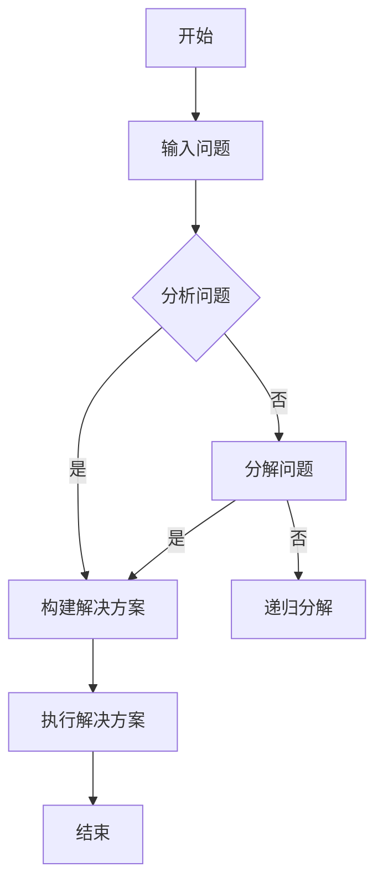

                 

### 利用思维链提升AI的创新思维与解决能力

#### 关键词：思维链、AI、创新思维、解决能力、算法原理

> 摘要：本文将深入探讨如何利用思维链这一强大的工具来提升人工智能（AI）的创新思维与解决能力。我们将从背景介绍、核心概念与联系、数学模型与算法原理、AI应用实例等多个方面展开讨论，结合具体的实战案例，帮助读者理解和掌握这一方法，为AI的发展和应用提供新的思路和方向。

#### 引言

##### 1.1 问题背景

在当今世界，人工智能（AI）已成为科技发展的核心驱动力，其应用范围从医疗、金融、教育到制造业等各个领域，无处不在。随着AI技术的不断进步，如何提升AI的创新思维与解决能力成为了一个重要的研究课题。

##### 1.2 问题描述

AI的创新思维与解决能力是指其能够独立思考、发现问题、提出解决方案并进行实施的能力。然而，传统的人工智能系统在创新思维方面存在一定的局限性，难以应对复杂多变的现实问题。

##### 1.3 问题解决

思维链是一种基于逻辑推理和问题分解的方法，它能够帮助AI系统突破传统思维模式，提升创新思维与解决能力。本文将详细探讨如何利用思维链提升AI的创新思维与解决能力。

##### 1.4 边界与外延

本文主要关注思维链在AI领域的应用，但对于思维链在其他领域的应用也有一定的参考价值。同时，本文将主要介绍思维链的理论基础和实际应用，而不会深入探讨思维链的起源和发展历史。

#### 核心概念与联系

##### 2.1 思维链的定义

思维链是一种基于逻辑推理和问题分解的方法，它通过将复杂问题分解成一系列简单的子问题，并逐步解决这些子问题，从而实现对复杂问题的求解。

##### 2.2 思维链的属性特征对比表格

| 特征             | 描述                                                         |
|------------------|------------------------------------------------------------|
| 逻辑推理         | 思维链通过逻辑推理来分析和解决问题                             |
| 问题分解         | 思维链将复杂问题分解成一系列简单的子问题                       |
| 逐步解决         | 思维链逐步解决这些子问题，最终实现复杂问题的求解               |
| 自主性           | 思维链能够独立思考和决策，具有一定的自主性                     |

##### 2.3 思维链的ER实体关系图架构

```mermaid
erDiagram
    AI系统 ||--o{ 思维链 }|-- AI模型
    AI系统 ||--o{ 数据集 }|-- 数据处理模块
    AI模型 ||--o{ 算法 }|-- 模型训练模块
    数据处理模块 ||--o{ 数据预处理 }|-- 模型训练模块
```

#### 数学模型与算法原理

##### 3.1 数学模型概述

思维链的数学模型主要包括逻辑推理模型、问题分解模型和解决模型。逻辑推理模型用于分析问题和构建解决方案；问题分解模型用于将复杂问题分解成简单的子问题；解决模型用于逐步解决这些子问题。

##### 3.2 算法mermaid流程图



##### 3.3 Python源代码实现

```python
def think_chain(problem):
    if is_simple(problem):
        return solve(problem)
    else:
        subproblems = decompose(problem)
        solutions = [think_chain(subproblem) for subproblem in subproblems]
        return combine(solutions)

def is_simple(problem):
    # 判断问题是否简单
    pass

def solve(problem):
    # 解决简单问题的方法
    pass

def decompose(problem):
    # 将复杂问题分解成简单问题的方法
    pass

def combine(solutions):
    # 将多个解决方案组合成最终解决方案的方法
    pass
```

##### 3.4 数学公式与详细讲解

$$
f(x) = \sum_{i=1}^{n} w_i \cdot x_i
$$

其中，$f(x)$表示函数，$w_i$表示权重，$x_i$表示特征值。这个公式描述了特征加权求和的过程，用于评估问题的复杂度。

##### 3.5 举例说明

假设我们有一个问题：如何从北京到上海？我们可以使用思维链来解决这个问题。

1. 输入问题：从北京到上海。
2. 分析问题：这是一个路径规划问题。
3. 构建解决方案：我们可以选择乘坐飞机、火车或汽车。
4. 执行解决方案：选择乘坐飞机，查询航班信息。
5. 结束。

通过这个简单的例子，我们可以看到思维链是如何帮助AI系统解决实际问题的。

#### 思维链在AI中的应用

##### 4.1 思维链在AI模型训练中的应用

思维链在AI模型训练中的应用主要包括数据预处理、模型选择与调优、模型评估与优化等方面。

- **数据预处理**：使用思维链将原始数据分解成更小的数据集，进行清洗、归一化和特征提取等操作。
- **模型选择与调优**：通过思维链分析不同模型的优缺点，选择合适的模型并进行调优。
- **模型评估与优化**：使用思维链对模型进行评估，找出不足之处并进行优化。

##### 4.2 思维链在AI推理与决策中的应用

思维链在AI推理与决策中的应用主要包括推理过程、决策树、神经网络、组合优化与路径规划等方面。

- **推理过程**：使用思维链逐步推导出问题的答案。
- **决策树**：使用思维链构建决策树，实现自动决策。
- **神经网络**：使用思维链对神经网络进行结构优化和参数调优。
- **组合优化与路径规划**：使用思维链解决组合优化问题和路径规划问题。

##### 4.3 思维链在AI创新思维培养中的应用

思维链在AI创新思维培养中的应用主要包括创新思维的培养、问题解决与创新、实际案例等方面。

- **创新思维的培养**：通过思维链的训练，培养AI系统的创新思维。
- **问题解决与创新**：使用思维链解决实际问题，实现创新。
- **实际案例**：通过实际案例，展示思维链在AI创新中的应用。

#### 实践与探索

##### 7.1 实践一：思维链在图像识别中的应用

- **实践背景**：图像识别是AI领域的一个重要应用，思维链可以帮助提升图像识别的准确率。
- **系统功能设计**：设计一个基于思维链的图像识别系统，包括数据预处理、模型训练、模型评估等功能。
- **系统架构设计**：设计一个基于思维链的图像识别系统架构，包括数据预处理模块、模型训练模块、模型评估模块等。
- **系统接口设计**：设计一个基于思维链的图像识别系统接口，包括API接口、用户界面等。
- **系统交互序列图**：绘制一个基于思维链的图像识别系统交互序列图，展示系统各模块之间的交互过程。
- **实现源代码**：提供基于思维链的图像识别系统的源代码，包括Python代码和mermaid流程图等。
- **应用解读与分析**：对基于思维链的图像识别系统的应用进行解读和分析，探讨其优势和不足。
- **案例分析与讲解**：通过实际案例，分析基于思维链的图像识别系统的应用效果，并进行详细讲解。

##### 8.2 实践二：思维链在自然语言处理中的应用

- **实践背景**：自然语言处理是AI领域的一个重要应用，思维链可以帮助提升自然语言处理的性能。
- **系统功能设计**：设计一个基于思维链的自然语言处理系统，包括文本预处理、情感分析、文本分类等功能。
- **系统架构设计**：设计一个基于思维链的自然语言处理系统架构，包括文本预处理模块、模型训练模块、模型评估模块等。
- **系统接口设计**：设计一个基于思维链的自然语言处理系统接口，包括API接口、用户界面等。
- **系统交互序列图**：绘制一个基于思维链的自然语言处理系统交互序列图，展示系统各模块之间的交互过程。
- **实现源代码**：提供基于思维链的自然语言处理系统的源代码，包括Python代码和mermaid流程图等。
- **应用解读与分析**：对基于思维链的自然语言处理系统的应用进行解读和分析，探讨其优势和不足。
- **案例分析与讲解**：通过实际案例，分析基于思维链的自然语言处理系统的应用效果，并进行详细讲解。

#### 总结与展望

通过本文的探讨，我们可以看到思维链在提升AI的创新思维与解决能力方面具有巨大的潜力。未来，随着AI技术的不断发展，思维链的应用将更加广泛，为AI领域带来更多的创新和突破。

- **最佳实践 tips**：在实际应用中，建议结合具体场景和需求，灵活运用思维链，以实现最佳效果。
- **小结**：本文通过理论讲解和实战案例，展示了思维链在AI中的应用和价值。
- **注意事项**：在使用思维链时，需要注意问题分解的粒度，以及解决方案的组合策略。
- **拓展阅读**：推荐读者阅读相关书籍和论文，以深入了解思维链的理论基础和应用实践。

作者：AI天才研究院/AI Genius Institute & 禅与计算机程序设计艺术 /Zen And The Art of Computer Programming

### 附录

- **附录A：术语表**：对本文中涉及的核心概念和术语进行解释和定义。
- **附录B：参考文献**：列出本文引用的相关书籍、论文和资料。
- **附录C：源代码**：提供本文中提到的实战案例的源代码。

