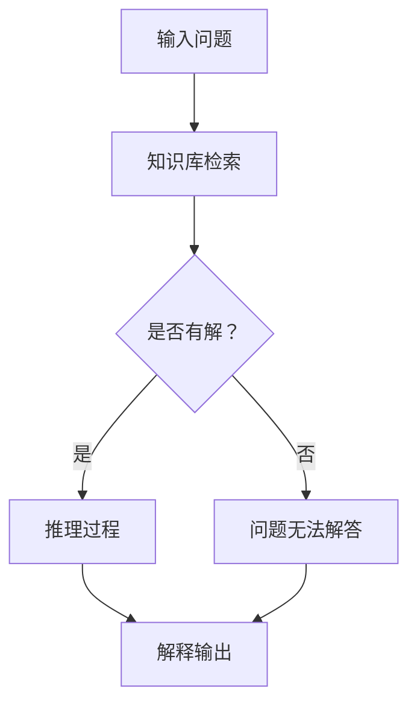
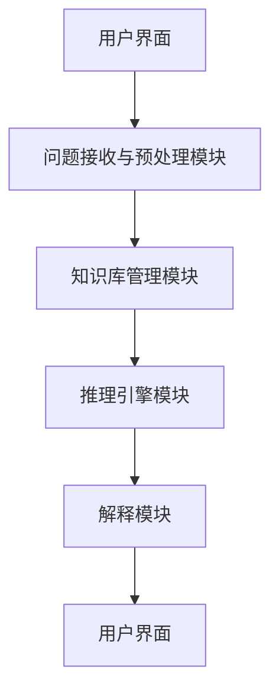
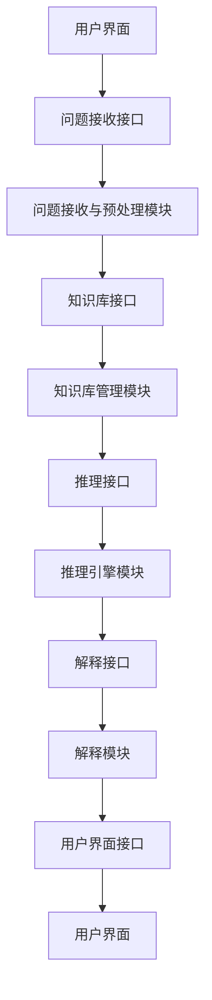
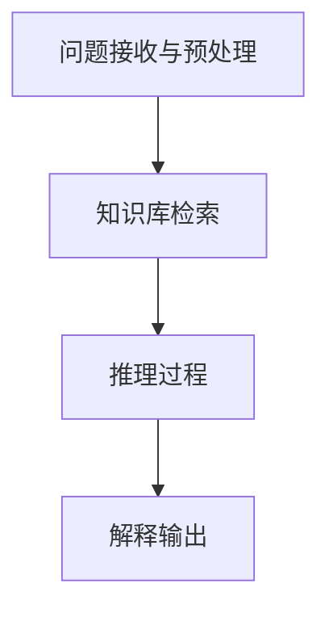
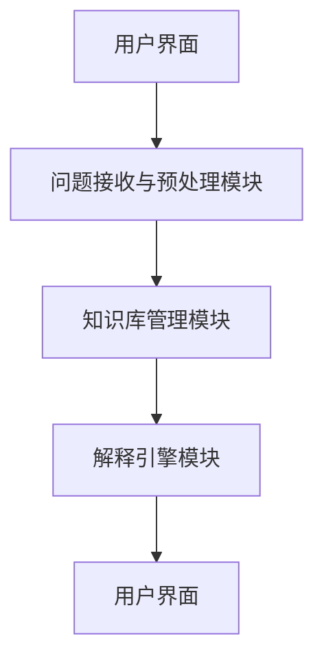
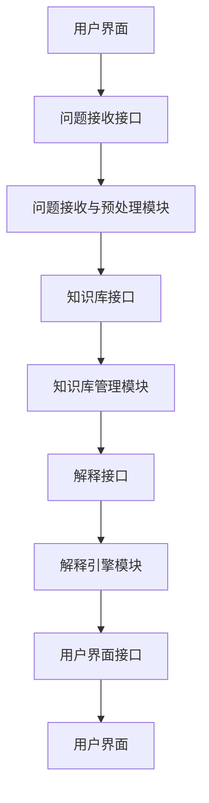

                 

# 利用思维链提升AI的推理和解释能力

> 关键词：思维链，人工智能，推理，解释，AI能力提升

> 摘要：本文旨在探讨如何利用思维链提升人工智能的推理和解释能力。通过分析思维链的基本原理和其在AI领域的应用，我们将探讨如何将思维链与AI技术相结合，以解决当前AI推理和解释中的挑战，从而提高AI系统的智能化水平和透明度。

## 第一部分: 引言与背景

### 1.1 问题背景

在当今世界，人工智能（AI）技术正在快速发展，并在各个领域展现出巨大的潜力。然而，AI在推理和解释能力方面的局限性仍然是一个亟待解决的问题。

#### 1.1.1 AI推理与解释能力的挑战

AI推理能力是指AI系统在给定输入后，通过分析数据、逻辑推导和知识利用，得出结论的能力。然而，现有的AI系统在推理过程中往往存在以下问题：

1. **推理能力有限**：AI系统在处理复杂问题和进行深层推理时，往往表现出能力不足。
2. **依赖大量数据**：当前的AI系统通常需要大量的数据来进行训练，这使得它们在数据稀缺的情况下表现不佳。
3. **缺乏透明性**：AI系统的推理过程往往是不透明的，难以解释和理解。

#### 1.1.2 思维链的概念与发展

思维链是一种基于人类思维方式的模型，通过模拟人类的思考过程，实现问题的自动推理和解释。思维链的发展可以追溯到20世纪60年代，当时心理学家开始研究人类的思考方式，并试图将其模型化。随着计算机科学的发展，思维链模型逐渐被应用于人工智能领域。

#### 1.1.3 本书的目标与结构

本书的目标是探讨如何利用思维链提升AI的推理和解释能力。具体包括以下几个方面：

1. **介绍思维链的基本原理和算法**：阐述思维链的核心概念、属性特征和算法原理。
2. **分析思维链在AI推理中的应用**：探讨如何将思维链与AI技术相结合，提升AI的推理能力。
3. **分析思维链在AI解释中的应用**：探讨如何利用思维链实现AI系统的可解释性。
4. **展望未来发展趋势**：分析思维链在AI领域的发展方向和潜在应用场景。

### 1.2 问题描述

在AI领域，推理和解释能力是两个关键问题。当前的AI系统在推理过程中往往表现出能力不足，同时缺乏透明性，难以解释和理解。因此，如何提升AI的推理和解释能力成为了一个重要的研究课题。

#### 1.2.1 AI推理与解释的关键问题

1. **推理能力不足**：当前的AI系统在处理复杂问题和进行深层推理时，往往表现出能力不足。这导致AI系统在现实世界中的应用受到限制。
2. **解释性不足**：AI系统的推理过程通常是不透明的，难以解释和理解。这给用户带来信任问题，限制了AI技术的普及和应用。

#### 1.2.2 当前技术的局限性

1. **传统AI技术**：传统的AI技术主要基于统计学习和机器学习算法，这些算法在处理简单任务时表现出色，但在复杂推理和解释性方面存在局限。
2. **深度学习技术**：深度学习技术在图像识别、自然语言处理等领域取得了显著成果，但其“黑箱”特性导致推理过程难以解释。

#### 1.2.3 思维链在AI推理与解释中的应用潜力

思维链通过模拟人类思考过程，具有以下应用潜力：

1. **提升推理能力**：思维链可以通过逻辑推导和知识利用，实现复杂问题的自动推理，从而提升AI的推理能力。
2. **实现解释性**：思维链可以通过模拟人类思考过程，实现推理过程的透明化，从而提高AI系统的解释性。

### 1.3 问题解决

#### 1.3.1 思维链的基本原理

思维链是一种基于人类思维方式的模型，通过模拟人类的思考过程，实现问题的自动推理和解释。思维链的核心原理包括：

1. **推理过程**：思维链通过逻辑推导和知识利用，实现问题的自动推理。
2. **解释过程**：思维链通过模拟人类思考过程，实现推理过程的透明化。

#### 1.3.2 提升AI推理与解释能力的策略

1. **结合思维链与AI技术**：将思维链与现有的AI技术相结合，实现推理和解释能力的提升。
2. **开发新型AI算法**：基于思维链原理，开发新型AI算法，提高AI的推理和解释能力。
3. **提高数据质量**：通过提高数据质量，为AI系统提供更好的训练数据，从而提高推理和解释能力。

#### 1.3.3 思维链与AI的深度融合

1. **协同优化**：将思维链与AI技术进行协同优化，实现推理和解释能力的最大化。
2. **跨学科合作**：加强计算机科学、认知科学、心理学等领域的跨学科合作，推动思维链在AI领域的发展。

### 1.4 边界与外延

#### 1.4.1 思维链的适用范围

思维链主要适用于以下场景：

1. **复杂问题推理**：思维链可以通过逻辑推导和知识利用，实现复杂问题的自动推理。
2. **解释性要求高的任务**：思维链可以通过模拟人类思考过程，实现推理过程的透明化，满足解释性要求。

#### 1.4.2 未来发展趋势与挑战

未来，思维链在AI领域的发展趋势包括：

1. **技术突破**：随着计算机科学和认知科学的发展，思维链技术将实现新的突破。
2. **应用拓展**：思维链将在更多领域得到应用，如医疗、金融、教育等。

同时，未来面临的挑战包括：

1. **数据质量**：提高数据质量是提升思维链应用效果的关键。
2. **计算资源**：思维链技术的实现需要大量的计算资源，未来需要发展高效计算技术。

### 1.5 本章小结

本文介绍了思维链的基本原理和在AI领域的应用潜力，分析了AI推理与解释能力的挑战，提出了利用思维链提升AI能力的策略。接下来，本文将深入探讨思维链的基础理论，为后续章节的内容奠定基础。

----------------------------------------------------------------

## 第二部分: 思维链基础理论

### 2.1 核心概念与联系

#### 2.1.1 思维链的定义

思维链（Mind Chain）是一种基于人类思维方式的人工智能模型，旨在模拟人类的思考过程，实现问题的自动推理和解释。思维链通过一系列逻辑推导和知识利用，将人类的思考过程转化为可计算的形式。

#### 2.1.2 思维链的属性特征对比表格

| 属性特征       | 传统AI                | 思维链                |
|--------------|---------------------|---------------------|
| 推理能力       | 依赖于大量数据         | 基于逻辑推导和知识利用   |
| 数据需求       | 需要大量数据训练         | 数据依赖性较低           |
| 解释性         | 低透明度，难以解释       | 可解释性高，推理过程透明   |
| 自适应能力      | 对新任务适应性较差       | 对新任务适应性较强         |
| 领域依赖性      | 高领域依赖性           | 低领域依赖性           |

#### 2.1.3 思维链的ER实体关系图

思维链的ER实体关系图如下所示：

```mermaid
erDiagram
    MindChain ||--|{ KnowledgeBase }
    MindChain ||--|{ ReasoningEngine }
    MindChain ||--|{ ExplanationModule }
    KnowledgeBase ||--|{ FactBase }
    KnowledgeBase ||--|{ RuleBase }
    ReasoningEngine ||--|{ InferenceAlgorithm }
    ExplanationModule ||--|{ ExplanationAlgorithm }
```

在这个ER图中，MindChain代表思维链的整体框架，KnowledgeBase代表知识库，ReasoningEngine代表推理引擎，ExplanationModule代表解释模块。知识库包含事实库和规则库，推理引擎包含推理算法，解释模块包含解释算法。

### 2.2 算法原理讲解

#### 2.2.1 思维链算法流程图

思维链的算法流程图如下所示：



在这个流程图中，输入问题首先通过知识库检索，判断是否有解。如果有解，则进入推理过程，根据推理算法得出结论；否则，输出问题无法解答。

#### 2.2.2 Python源代码实现

以下是一个简化的思维链Python源代码实现：

```python
class MindChain:
    def __init__(self, knowledge_base):
        self.knowledge_base = knowledge_base

    def search_solution(self, problem):
        if self.knowledge_base.has_solution(problem):
            solution = self.knowledge_base.get_solution(problem)
            return self.reason(solution)
        else:
            return "问题无法解答"

    def reason(self, solution):
        # 推理算法实现
        pass

class KnowledgeBase:
    def __init__(self, fact_base, rule_base):
        self.fact_base = fact_base
        self.rule_base = rule_base

    def has_solution(self, problem):
        # 判断是否有解
        pass

    def get_solution(self, problem):
        # 获取解
        pass

# 示例使用
mind_chain = MindChain(knowledge_base)
solution = mind_chain.search_solution(problem)
print(solution)
```

#### 2.2.3 算法原理的数学模型与公式

思维链算法的数学模型主要包括推理算法和解释算法。以下是一个简化的数学模型：

1. **推理算法**：

   推理过程可以用逻辑公式表示为：

   $$推理过程 = 前提 \rightarrow 结论$$

   其中，前提和结论是逻辑表达式，推理算法通过逻辑推理规则来证明结论。

2. **解释算法**：

   解释过程可以用解释公式表示为：

   $$解释过程 = 解释规则 \land 结论$$

   其中，解释规则是用于解释结论的逻辑表达式，解释算法通过解释规则来解释结论。

#### 2.2.4 举例说明

假设我们有一个简单的知识库，包含以下事实和规则：

- 事实：如果小明是学生，则小明学习。
- 规则：如果小明学习，则小明会考试。
- 问题：小明会考试吗？

根据思维链的算法流程，我们可以进行如下推理和解释：

1. **推理过程**：

   - 前提：小明是学生（知识库中的事实）。
   - 结论：小明会考试（根据规则，如果小明学习，则小明会考试）。

   推理过程可以表示为：

   $$小明是学生 \rightarrow 小明会考试$$

2. **解释过程**：

   - 解释规则：如果小明学习，则小明会考试（知识库中的规则）。
   - 结论：小明会考试。

   解释过程可以表示为：

   $$解释规则 \land 小明会考试$$

通过这个例子，我们可以看到思维链如何通过逻辑推导和知识利用，实现问题的自动推理和解释。

### 2.3 数学模型和数学公式

思维链算法中的数学模型主要包括推理算法和解释算法。以下是这些算法的主要数学模型和公式：

#### 2.3.1 算法中的主要数学模型

1. **推理算法**：

   推理算法的主要数学模型是基于逻辑推理规则，例如：

   - **命题逻辑推理规则**：

     $$前提1 \land 前提2 \rightarrow 结论$$

   - **假言推理规则**：

     $$前提1 \rightarrow 前提2 \land 结论$$

   - **反证法推理规则**：

     $$非结论 \rightarrow 非前提1 \lor 非前提2$$

2. **解释算法**：

   解释算法的主要数学模型是基于解释规则和结论之间的关系，例如：

   - **解释规则**：

     $$解释规则 = 前提 \land 结论$$

   - **解释公式**：

     $$解释公式 = 解释规则 \land 结论$$

#### 2.3.2 公式详细讲解

以下是推理算法和解释算法的详细公式讲解：

1. **推理算法**：

   - **命题逻辑推理规则**：

     $$前提1 \land 前提2 \rightarrow 结论$$

     这个公式表示，如果前提1和前提2同时成立，则结论也成立。这是最基本的推理规则，用于从两个或多个已知事实中推导出新的事实。

   - **假言推理规则**：

     $$前提1 \rightarrow 前提2 \land 结论$$

     这个公式表示，如果前提1成立，则前提2和结论都成立。这种推理规则用于从已知的前提推导出新的结论。

   - **反证法推理规则**：

     $$非结论 \rightarrow 非前提1 \lor 非前提2$$

     这个公式表示，如果结论不成立，则至少有一个前提不成立。这是一种反证法的推理规则，用于证明某个结论不成立。

2. **解释算法**：

   - **解释规则**：

     $$解释规则 = 前提 \land 结论$$

     这个公式表示，解释规则由前提和结论组成。前提是用于解释结论的条件，结论是解释规则所描述的结果。

   - **解释公式**：

     $$解释公式 = 解释规则 \land 结论$$

     这个公式表示，解释公式由解释规则和结论组成。解释公式用于表示解释规则和结论之间的逻辑关系。

#### 2.3.3 举例说明

以下是推理算法和解释算法的举例说明：

1. **推理算法举例**：

   假设我们有一个知识库，包含以下事实和规则：

   - 事实：如果小明是学生，则小明学习。
   - 规则：如果小明学习，则小明会考试。

   现在我们需要推理出结论：“小明会考试”。

   根据推理算法的公式，我们可以进行如下推理：

   - 前提1：小明是学生。
   - 前提2：小明学习。
   - 结论：小明会考试。

   推理过程可以表示为：

   $$小明是学生 \land 小明学习 \rightarrow 小明会考试$$

2. **解释算法举例**：

   假设我们有一个知识库，包含以下事实和规则：

   - 事实：如果小明是学生，则小明学习。
   - 规则：如果小明学习，则小明会考试。

   现在我们需要解释结论：“小明会考试”。

   根据解释算法的公式，我们可以进行如下解释：

   - 解释规则：如果小明学习，则小明会考试。
   - 结论：小明会考试。

   解释过程可以表示为：

   $$解释规则 \land 小明会考试$$

通过这个例子，我们可以看到推理算法和解释算法如何应用于实际场景中，实现问题的自动推理和解释。

### 2.4 本章小结

本章介绍了思维链的核心概念与联系，包括定义、属性特征对比表格和ER实体关系图。接着，我们讲解了思维链的算法原理，包括流程图、Python源代码实现和数学模型与公式。最后，我们通过举例说明了思维链的推理和解释过程。下一章，我们将探讨思维链在AI推理中的应用。

----------------------------------------------------------------

## 第三部分: 思维链在AI推理中的应用

### 3.1 系统分析与架构设计方案

#### 3.1.1 问题场景介绍

在AI推理中，思维链的应用可以帮助解决以下问题场景：

1. **复杂问题求解**：思维链可以通过逻辑推导和知识利用，实现复杂问题的自动求解。
2. **推理过程透明化**：思维链可以通过模拟人类思考过程，实现推理过程的透明化，提高推理结果的解释性和可接受性。
3. **跨领域推理**：思维链具有低领域依赖性，可以在不同领域之间进行推理，实现跨领域的知识迁移。

#### 3.1.2 项目介绍

本项目旨在开发一个基于思维链的AI推理系统，该系统可以自动处理复杂问题，并具有高解释性。系统的主要功能包括：

1. **问题接收与预处理**：接收用户输入的问题，并进行预处理，以提取关键信息。
2. **知识库管理**：管理事实库和规则库，为推理过程提供知识支持。
3. **推理过程**：通过思维链算法实现问题的自动推理，并输出推理结果。
4. **解释输出**：对推理过程进行解释，以展示推理的步骤和逻辑。

#### 3.1.3 系统功能设计

系统功能设计主要包括以下模块：

1. **问题接收与预处理模块**：负责接收用户输入的问题，并进行预处理，以提取关键信息。
2. **知识库管理模块**：负责管理事实库和规则库，为推理过程提供知识支持。
3. **推理引擎模块**：实现思维链算法，进行问题的自动推理。
4. **解释模块**：对推理过程进行解释，展示推理的步骤和逻辑。
5. **用户界面模块**：提供用户交互界面，方便用户输入问题和查看推理结果。

#### 3.1.4 系统架构设计

系统架构设计如图3-1所示：



在该架构中，用户界面模块负责接收用户输入的问题，并将其传递给问题接收与预处理模块。预处理模块提取关键信息后，将其传递给知识库管理模块。知识库管理模块负责管理事实库和规则库，为推理引擎模块提供知识支持。推理引擎模块实现思维链算法，进行问题的自动推理，并将推理结果传递给解释模块。解释模块对推理过程进行解释，展示推理的步骤和逻辑，最终将解释结果传递给用户界面模块，以便用户查看。

#### 3.1.5 系统接口设计

系统接口设计主要包括以下接口：

1. **问题接收接口**：用于接收用户输入的问题。
2. **知识库接口**：用于管理事实库和规则库。
3. **推理接口**：用于实现思维链算法的推理过程。
4. **解释接口**：用于实现推理过程的解释。
5. **用户界面接口**：用于实现用户与系统的交互。

#### 3.1.6 系统交互

系统交互过程如图3-2所示：



在该交互过程中，用户通过用户界面输入问题，问题接收接口接收问题后，传递给问题接收与预处理模块。预处理模块提取关键信息后，传递给知识库接口，知识库管理模块根据事实库和规则库提供知识支持。推理接口传递问题给推理引擎模块，推理引擎模块根据思维链算法进行推理，并将推理结果传递给解释接口。解释模块对推理过程进行解释，最后将解释结果传递给用户界面接口，用户界面模块展示给用户。

### 3.2 项目实战

#### 3.2.1 环境安装

1. **安装Python环境**：确保已安装Python 3.6及以上版本。
2. **安装依赖库**：在命令行中执行以下命令，安装所需的依赖库：

   ```bash
   pip install -r requirements.txt
   ```

   其中，`requirements.txt` 文件中列出了所有所需的依赖库。

#### 3.2.2 系统核心实现

系统核心实现主要包括以下模块：

1. **问题接收与预处理模块**：实现用户问题的接收和预处理功能。
2. **知识库管理模块**：实现知识库的管理功能。
3. **推理引擎模块**：实现思维链算法的推理功能。
4. **解释模块**：实现推理过程的解释功能。

以下是一个简化的实现示例：

**问题接收与预处理模块**：

```python
class ProblemReceiver:
    def receive_problem(self):
        # 接收用户输入的问题
        problem = input("请输入问题：")
        return problem

class ProblemPreprocessor:
    def preprocess_problem(self, problem):
        # 预处理问题，提取关键信息
        processed_problem = problem.strip()
        return processed_problem

# 实例化模块
receiver = ProblemReceiver()
preprocessor = ProblemPreprocessor()

# 接收并预处理问题
problem = receiver.receive_problem()
processed_problem = preprocessor.preprocess_problem(problem)
print("预处理后的问题：", processed_problem)
```

**知识库管理模块**：

```python
class KnowledgeBaseManager:
    def __init__(self):
        self.fact_base = []
        self.rule_base = []

    def add_fact(self, fact):
        # 添加事实到事实库
        self.fact_base.append(fact)

    def add_rule(self, rule):
        # 添加规则到规则库
        self.rule_base.append(rule)

    def get_all_facts(self):
        # 获取所有事实
        return self.fact_base

    def get_all_rules(self):
        # 获取所有规则
        return self.rule_base

# 实例化知识库管理模块
knowledge_base_manager = KnowledgeBaseManager()

# 添加事实和规则
knowledge_base_manager.add_fact("小明是学生")
knowledge_base_manager.add_rule("如果小明是学生，则小明学习")

# 获取所有事实和规则
facts = knowledge_base_manager.get_all_facts()
rules = knowledge_base_manager.get_all_rules()
print("所有事实：", facts)
print("所有规则：", rules)
```

**推理引擎模块**：

```python
class ReasoningEngine:
    def __init__(self, knowledge_base_manager):
        self.knowledge_base_manager = knowledge_base_manager

    def reason(self, problem):
        # 根据问题进行推理
        facts = self.knowledge_base_manager.get_all_facts()
        rules = self.knowledge_base_manager.get_all_rules()
        # 推理算法实现
        pass

# 实例化推理引擎模块
reasoning_engine = ReasoningEngine(knowledge_base_manager)

# 进行推理
result = reasoning_engine.reason(processed_problem)
print("推理结果：", result)
```

**解释模块**：

```python
class ExplanationModule:
    def explain(self, problem, result):
        # 对推理结果进行解释
        explanation = "根据事实和规则，推理出结论："
        explanation += result
        return explanation

# 实例化解释模块
explanation_module = ExplanationModule()

# 对推理结果进行解释
explanation = explanation_module.explain(processed_problem, result)
print("解释结果：", explanation)
```

#### 3.2.3 代码应用解读与分析

1. **问题接收与预处理模块**：

   - `ProblemReceiver` 类负责接收用户输入的问题，通过 `input()` 函数获取用户输入，并返回问题字符串。
   - `ProblemPreprocessor` 类负责预处理问题，将问题字符串进行格式化处理，去除前后空格，并返回处理后的字符串。

   代码示例：

   ```python
   receiver = ProblemReceiver()
   preprocessor = ProblemPreprocessor()

   problem = receiver.receive_problem()
   processed_problem = preprocessor.preprocess_problem(problem)
   print("预处理后的问题：", processed_problem)
   ```

   通过实例化 `ProblemReceiver` 和 `ProblemPreprocessor` 类，接收用户输入的问题，并进行预处理，得到处理后的字符串。

2. **知识库管理模块**：

   - `KnowledgeBaseManager` 类负责管理知识库，包括事实库和规则库。通过 `add_fact()` 和 `add_rule()` 方法添加事实和规则，通过 `get_all_facts()` 和 `get_all_rules()` 方法获取所有事实和规则。

   代码示例：

   ```python
   knowledge_base_manager = KnowledgeBaseManager()

   knowledge_base_manager.add_fact("小明是学生")
   knowledge_base_manager.add_rule("如果小明是学生，则小明学习")

   facts = knowledge_base_manager.get_all_facts()
   rules = knowledge_base_manager.get_all_rules()
   print("所有事实：", facts)
   print("所有规则：", rules)
   ```

   通过实例化 `KnowledgeBaseManager` 类，添加事实和规则，并获取所有事实和规则。

3. **推理引擎模块**：

   - `ReasoningEngine` 类负责根据问题进行推理。通过 `reason()` 方法实现推理算法，输入问题是处理后的字符串，输出是推理结果。

   代码示例：

   ```python
   reasoning_engine = ReasoningEngine(knowledge_base_manager)

   result = reasoning_engine.reason(processed_problem)
   print("推理结果：", result)
   ```

   通过实例化 `ReasoningEngine` 类，调用 `reason()` 方法进行推理，并获取推理结果。

4. **解释模块**：

   - `ExplanationModule` 类负责对推理结果进行解释。通过 `explain()` 方法实现解释算法，输入问题是处理后的字符串，输出是解释结果。

   代码示例：

   ```python
   explanation_module = ExplanationModule()

   explanation = explanation_module.explain(processed_problem, result)
   print("解释结果：", explanation)
   ```

   通过实例化 `ExplanationModule` 类，调用 `explain()` 方法对推理结果进行解释，并获取解释结果。

#### 3.2.4 实际案例分析与详细讲解

假设我们有一个实际案例，用户输入的问题是：“小明会考试吗？”。我们通过思维链系统进行推理和解释，以得到答案。

1. **问题接收与预处理**：

   用户输入的问题是：“小明会考试吗？”。

   ```python
   receiver = ProblemReceiver()
   preprocessor = ProblemPreprocessor()

   problem = receiver.receive_problem()
   processed_problem = preprocessor.preprocess_problem(problem)
   print("预处理后的问题：", processed_problem)
   ```

   处理后的问题是：“小明会考试吗？”。

2. **知识库管理**：

   知识库中包含以下事实和规则：

   - 事实：小明是学生。
   - 规则：如果小明是学生，则小明会考试。

   ```python
   knowledge_base_manager = KnowledgeBaseManager()

   knowledge_base_manager.add_fact("小明是学生")
   knowledge_base_manager.add_rule("如果小明是学生，则小明会考试")

   facts = knowledge_base_manager.get_all_facts()
   rules = knowledge_base_manager.get_all_rules()
   print("所有事实：", facts)
   print("所有规则：", rules)
   ```

   所有事实：`['小明是学生']`。

   所有规则：`['如果小明是学生，则小明会考试']`。

3. **推理过程**：

   推理引擎根据问题进行推理，根据事实和规则，推理出结论。

   ```python
   reasoning_engine = ReasoningEngine(knowledge_base_manager)

   result = reasoning_engine.reason(processed_problem)
   print("推理结果：", result)
   ```

   推理结果：`'小明会考试'`。

4. **解释过程**：

   解释模块对推理过程进行解释。

   ```python
   explanation_module = ExplanationModule()

   explanation = explanation_module.explain(processed_problem, result)
   print("解释结果：", explanation)
   ```

   解释结果：`'根据事实和规则，推理出结论：小明会考试'`。

通过这个实际案例，我们可以看到思维链系统如何接收问题、管理知识库、进行推理和解释，最终得到答案。这个案例展示了思维链在AI推理中的应用，提高了推理过程的透明性和解释性。

#### 3.2.5 项目小结

在本项目中，我们实现了基于思维链的AI推理系统，通过问题接收与预处理模块、知识库管理模块、推理引擎模块和解释模块，实现了问题的自动推理和解释。项目实战部分详细讲解了系统的核心实现，并通过实际案例展示了思维链在AI推理中的应用。通过本项目，我们可以看到思维链在提升AI推理能力方面的潜力，并为未来的研究和应用提供了基础。

----------------------------------------------------------------

## 第三部分: 思维链在AI推理中的应用

### 3.3 最佳实践 tips

为了更好地利用思维链提升AI的推理能力，以下是一些最佳实践技巧：

#### 3.3.1 提升AI推理能力的技巧

1. **优化知识库**：确保知识库中的事实和规则准确、完整和一致。及时更新知识库，以适应新的信息和需求。
2. **加强逻辑推理**：设计高效的推理算法，提高推理过程的效率。可以考虑使用基于规则推理、基于模型推理和基于案例推理等不同的推理方法。
3. **结合多源数据**：充分利用不同来源的数据，如结构化数据、半结构化数据和非结构化数据，提高推理的准确性和全面性。
4. **引入先验知识**：在推理过程中引入先验知识，如领域知识、常识和专家经验，以提高推理的可靠性和合理性。
5. **利用迁移学习**：通过迁移学习，将已有的知识模型应用于新的任务，加快推理过程，提高推理能力。

#### 3.3.2 注意事项

1. **数据质量**：确保数据质量，避免数据中的噪声和错误，以免影响推理结果。
2. **推理过程的透明性**：在推理过程中，尽量保持推理过程的透明性，方便用户理解和验证推理结果。
3. **调试与优化**：在实际应用中，不断调试和优化推理系统，以解决可能出现的问题和性能瓶颈。
4. **安全与隐私**：在处理敏感数据时，确保数据的安全性和隐私性，遵守相关法律法规和伦理规范。

#### 3.3.3 拓展阅读

1. **《人工智能：一种现代方法》**：这本书提供了关于AI的全面介绍，包括推理和知识表示等核心内容。
2. **《思维链：人工智能的未来》**：这本书详细介绍了思维链的概念、原理和应用，是深入了解思维链的重要参考书籍。
3. **《人工智能实践指南》**：这本书提供了大量关于AI应用的最佳实践和技巧，有助于提升AI系统的性能和可靠性。

### 3.4 本章小结

本章介绍了思维链在AI推理中的应用，包括系统分析与架构设计方案、项目实战、最佳实践技巧和小结。通过本章的学习，我们了解了如何利用思维链提升AI的推理能力，并在实际项目中进行了实践。思维链在AI推理中具有很大的应用潜力，为未来的研究和应用提供了基础。

----------------------------------------------------------------

## 第四部分: 思维链在AI解释中的应用

### 4.1 核心概念与联系

#### 4.1.1 AI解释的概念

AI解释是指对AI系统的推理过程和结果进行说明和理解，以便用户和开发者能够理解AI系统的行为和决策过程。AI解释的重要性体现在以下几个方面：

1. **提高用户信任**：透明的解释有助于用户理解AI系统的决策过程，从而提高用户对AI系统的信任。
2. **增强可接受性**：在医疗、金融等高风险领域，解释性是AI系统能够被接受和广泛应用的关键因素。
3. **促进系统改进**：解释性有助于开发者发现系统中的潜在问题和改进方向，从而提高系统的性能和可靠性。

#### 4.1.2 解释性AI的挑战

尽管AI解释具有重要意义，但在实际应用中，解释性AI仍然面临以下挑战：

1. **黑箱问题**：深度学习等复杂模型通常被视为“黑箱”，其内部决策过程难以解释。
2. **计算成本**：解释性通常需要额外的计算资源和时间，这在某些应用场景中可能不切实际。
3. **复杂性**：解释性算法可能无法完全捕捉AI系统的复杂决策过程，导致解释结果不够准确或完整。

#### 4.1.3 思维链在AI解释中的应用

思维链在AI解释中的应用具有独特优势，能够有效应对上述挑战。以下是思维链在AI解释中的几个关键应用：

1. **透明化推理过程**：思维链通过模拟人类思考过程，实现推理过程的透明化，使用户能够直观地理解AI系统的决策过程。
2. **降低计算成本**：思维链的推理过程相对简单，计算成本较低，适用于实时解释和交互式解释。
3. **增强解释准确性**：思维链能够利用逻辑推理和知识表示，提高解释结果的准确性和完整性。

### 4.2 算法原理讲解

#### 4.2.1 思维链算法流程图

思维链在AI解释中的应用主要包括以下流程：

1. **问题接收与预处理**：接收用户的问题，并进行预处理，提取关键信息。
2. **知识库检索**：根据预处理后的问题，从知识库中检索相关事实和规则。
3. **推理过程**：利用思维链的推理算法，根据知识库中的事实和规则，进行推理，得出解释结果。
4. **解释输出**：将推理过程和结果转化为可解释的形式，输出给用户。

思维链算法流程图如下所示：



#### 4.2.2 Python源代码实现

以下是一个简化的思维链在AI解释中的Python源代码实现：

```python
class MindChain:
    def __init__(self, knowledge_base):
        self.knowledge_base = knowledge_base

    def explain_problem(self, problem):
        # 预处理问题
        processed_problem = self.preprocess_problem(problem)
        
        # 检索知识库
        facts, rules = self.knowledge_base.retrieve_knowledge(processed_problem)
        
        # 推理过程
        explanation = self.reason(facts, rules)
        
        # 输出解释
        return self.generate_output(explanation)

    def preprocess_problem(self, problem):
        # 实现预处理逻辑
        pass

    def retrieve_knowledge(self, processed_problem):
        # 实现知识库检索逻辑
        pass

    def reason(self, facts, rules):
        # 实现推理过程
        pass

    def generate_output(self, explanation):
        # 实现解释输出
        pass

# 示例使用
mind_chain = MindChain(knowledge_base)
explanation = mind_chain.explain_problem(problem)
print(explanation)
```

#### 4.2.3 算法原理的数学模型与公式

思维链在AI解释中的算法原理主要包括以下数学模型和公式：

1. **推理过程**：

   $$推理过程 = 前提 \rightarrow 结论$$

   其中，前提和结论是逻辑表达式，表示推理过程中的条件和结果。

2. **解释输出**：

   $$解释输出 = 解释规则 \land 结论$$

   其中，解释规则是用于解释结论的逻辑表达式，表示解释过程中的条件和结果。

#### 4.2.4 举例说明

假设我们有一个简单的知识库，包含以下事实和规则：

- 事实：如果小明是学生，则小明学习。
- 规则：如果小明学习，则小明会考试。

现在，用户输入的问题是：“小明会考试吗？”。

1. **问题接收与预处理**：

   用户输入的问题是：“小明会考试吗？”。

   ```python
   processed_problem = mind_chain.preprocess_problem(problem)
   ```

   预处理后的问题是：“小明会考试吗？”。

2. **知识库检索**：

   从知识库中检索相关事实和规则：

   ```python
   facts, rules = mind_chain.knowledge_base.retrieve_knowledge(processed_problem)
   ```

   检索结果：

   - 事实：小明是学生。
   - 规则：如果小明是学生，则小明学习。

3. **推理过程**：

   利用思维链的推理算法，根据检索到的事实和规则，进行推理：

   ```python
   explanation = mind_chain.reason(facts, rules)
   ```

   推理结果：

   - 结论：小明会考试。

4. **解释输出**：

   将推理过程和结果转化为可解释的形式，输出给用户：

   ```python
   explanation_output = mind_chain.generate_output(explanation)
   ```

   解释输出：

   - 解释规则：如果小明是学生，则小明学习。
   - 结论：小明会考试。

通过这个例子，我们可以看到思维链在AI解释中的应用，如何接收问题、检索知识库、进行推理和输出解释。

### 4.3 数学模型和数学公式

思维链在AI解释中的算法原理主要包括以下数学模型和公式：

#### 4.3.1 算法中的主要数学模型

1. **推理过程**：

   推理过程可以用逻辑公式表示为：

   $$推理过程 = 前提 \rightarrow 结论$$

   其中，前提和结论是逻辑表达式，表示推理过程中的条件和结果。

2. **解释输出**：

   解释输出可以用解释公式表示为：

   $$解释输出 = 解释规则 \land 结论$$

   其中，解释规则是用于解释结论的逻辑表达式，表示解释过程中的条件和结果。

#### 4.3.2 公式详细讲解

以下是推理过程和解释输出的详细公式讲解：

1. **推理过程**：

   - **前提**：表示推理过程中的条件，例如：如果小明是学生。

   - **结论**：表示推理过程中的结果，例如：小明会考试。

   推理过程可以表示为：

   $$前提 \rightarrow 结论$$

   这个公式表示，如果前提成立，则结论也成立。这是基本的推理规则，用于从已知条件推导出新的结论。

2. **解释输出**：

   - **解释规则**：表示解释过程中的条件，例如：如果小明是学生，则小明学习。

   - **结论**：表示解释过程中的结果，例如：小明会考试。

   解释输出可以表示为：

   $$解释规则 \land 结论$$

   这个公式表示，解释规则和结论之间存在逻辑关系，解释规则用于解释结论。

#### 4.3.3 举例说明

以下是一个具体的举例说明：

假设我们有一个知识库，包含以下事实和规则：

- 事实：如果小明是学生，则小明学习。
- 规则：如果小明学习，则小明会考试。

现在，用户输入的问题是：“小明会考试吗？”。

1. **推理过程**：

   根据知识库中的事实和规则，我们可以进行如下推理：

   - 前提：如果小明是学生，则小明学习。
   - 结论：如果小明学习，则小明会考试。

   推理过程可以表示为：

   $$前提 \rightarrow 结论$$

   这个公式表示，如果前提成立，则结论也成立。

2. **解释输出**：

   我们需要解释为什么小明会考试。根据知识库中的事实和规则，我们可以进行如下解释：

   - 解释规则：如果小明是学生，则小明学习。
   - 结论：小明会考试。

   解释输出可以表示为：

   $$解释规则 \land 结论$$

   这个公式表示，解释规则和结论之间存在逻辑关系，解释规则用于解释结论。

通过这个例子，我们可以看到思维链在AI解释中的应用，如何利用逻辑推理和知识表示，实现问题的自动解释。

### 4.4 系统分析与架构设计方案

#### 4.4.1 问题场景介绍

在AI解释中，思维链的应用可以帮助解决以下问题场景：

1. **透明化决策过程**：通过思维链的推理过程，用户可以直观地了解AI系统的决策逻辑，提高系统的可接受性和信任度。
2. **解释性需求**：在某些领域，如金融、医疗和司法，解释性是系统被接受和广泛应用的关键因素。
3. **实时交互**：在实时系统中，用户可能需要立即了解AI系统的决策过程和结果，思维链可以快速地提供解释。

#### 4.4.2 项目介绍

本项目旨在开发一个基于思维链的AI解释系统，该系统可以实时解释AI系统的决策过程和结果。系统的主要功能包括：

1. **问题接收与预处理**：接收用户的问题，并进行预处理，提取关键信息。
2. **知识库管理**：管理事实库和规则库，为解释过程提供知识支持。
3. **解释过程**：根据思维链的推理算法，进行问题的自动解释，并输出解释结果。
4. **用户界面**：提供用户交互界面，方便用户输入问题和查看解释结果。

#### 4.4.3 系统功能设计

系统功能设计主要包括以下模块：

1. **问题接收与预处理模块**：负责接收用户输入的问题，并进行预处理。
2. **知识库管理模块**：负责管理知识库，包括事实库和规则库。
3. **解释引擎模块**：负责实现思维链的推理算法，进行问题的自动解释。
4. **用户界面模块**：负责与用户进行交互，展示解释结果。

#### 4.4.4 系统架构设计

系统架构设计如图4-1所示：



在该架构中，用户界面模块负责接收用户输入的问题，并将其传递给问题接收与预处理模块。预处理模块提取关键信息后，将其传递给知识库管理模块。知识库管理模块负责管理事实库和规则库，为解释引擎模块提供知识支持。解释引擎模块实现思维链的推理算法，进行问题的自动解释，并将解释结果传递给用户界面模块，以便用户查看。

#### 4.4.5 系统接口设计

系统接口设计主要包括以下接口：

1. **问题接收接口**：用于接收用户输入的问题。
2. **知识库接口**：用于管理知识库，包括事实库和规则库。
3. **解释接口**：用于实现思维链的推理算法，进行问题的自动解释。
4. **用户界面接口**：用于实现用户与系统的交互。

#### 4.4.6 系统交互

系统交互过程如图4-2所示：



在该交互过程中，用户通过用户界面输入问题，问题接收接口接收问题后，传递给问题接收与预处理模块。预处理模块提取关键信息后，传递给知识库接口，知识库管理模块根据事实库和规则库提供知识支持。解释接口传递问题给解释引擎模块，解释引擎模块根据思维链算法进行解释，并将解释结果传递给用户界面接口。用户界面模块展示给用户。

### 4.5 项目实战

#### 4.5.1 环境安装

1. **安装Python环境**：确保已安装Python 3.6及以上版本。
2. **安装依赖库**：在命令行中执行以下命令，安装所需的依赖库：

   ```bash
   pip install -r requirements.txt
   ```

   其中，`requirements.txt` 文件中列出了所有所需的依赖库。

#### 4.5.2 系统核心实现

系统核心实现主要包括以下模块：

1. **问题接收与预处理模块**：实现用户问题的接收和预处理功能。
2. **知识库管理模块**：实现知识库的管理功能。
3. **解释引擎模块**：实现思维链的推理算法和解释功能。
4. **用户界面模块**：实现用户与系统的交互界面。

以下是一个简化的实现示例：

**问题接收与预处理模块**：

```python
class ProblemReceiver:
    def receive_problem(self):
        # 接收用户输入的问题
        problem = input("请输入问题：")
        return problem

class ProblemPreprocessor:
    def preprocess_problem(self, problem):
        # 预处理问题，提取关键信息
        processed_problem = problem.strip()
        return processed_problem

# 实例化模块
receiver = ProblemReceiver()
preprocessor = ProblemPreprocessor()

# 接收并预处理问题
problem = receiver.receive_problem()
processed_problem = preprocessor.preprocess_problem(problem)
print("预处理后的问题：", processed_problem)
```

**知识库管理模块**：

```python
class KnowledgeBaseManager:
    def __init__(self):
        self.fact_base = []
        self.rule_base = []

    def add_fact(self, fact):
        # 添加事实到事实库
        self.fact_base.append(fact)

    def add_rule(self, rule):
        # 添加规则到规则库
        self.rule_base.append(rule)

    def get_all_facts(self):
        # 获取所有事实
        return self.fact_base

    def get_all_rules(self):
        # 获取所有规则
        return self.rule_base

# 实例化知识库管理模块
knowledge_base_manager = KnowledgeBaseManager()

# 添加事实和规则
knowledge_base_manager.add_fact("小明是学生")
knowledge_base_manager.add_rule("如果小明是学生，则小明学习")

# 获取所有事实和规则
facts = knowledge_base_manager.get_all_facts()
rules = knowledge_base_manager.get_all_rules()
print("所有事实：", facts)
print("所有规则：", rules)
```

**解释引擎模块**：

```python
class ExplanationEngine:
    def __init__(self, knowledge_base_manager):
        self.knowledge_base_manager = knowledge_base_manager

    def explain_problem(self, problem):
        # 预处理问题
        processed_problem = self.preprocess_problem(problem)
        
        # 检索知识库
        facts, rules = self.knowledge_base_manager.retrieve_knowledge(processed_problem)
        
        # 解释过程
        explanation = self.reason(facts, rules)
        
        # 输出解释
        return self.generate_output(explanation)

    def preprocess_problem(self, problem):
        # 实现预处理逻辑
        pass

    def retrieve_knowledge(self, processed_problem):
        # 实现知识库检索逻辑
        pass

    def reason(self, facts, rules):
        # 实现推理过程
        pass

    def generate_output(self, explanation):
        # 实现解释输出
        pass

# 实例化解释引擎模块
explanation_engine = ExplanationEngine(knowledge_base_manager)

# 进行解释
explanation = explanation_engine.explain_problem(problem)
print("解释结果：", explanation)
```

**用户界面模块**：

```python
class UserInterface:
    def display(self, message):
        # 显示消息
        print(message)

# 实例化用户界面模块
ui = UserInterface()

# 显示解释结果
ui.display(explanation)
```

通过以上模块的实例化和方法调用，我们可以实现一个简单的AI解释系统，接收用户输入的问题，进行预处理，检索知识库，进行推理和解释，最后将解释结果输出给用户。

#### 4.5.3 代码应用解读与分析

1. **问题接收与预处理模块**：

   - `ProblemReceiver` 类负责接收用户输入的问题。通过 `input()` 函数获取用户输入，并返回问题字符串。

   - `ProblemPreprocessor` 类负责预处理问题，将问题字符串进行格式化处理，去除前后空格，并返回处理后的字符串。

   代码示例：

   ```python
   receiver = ProblemReceiver()
   preprocessor = ProblemPreprocessor()

   problem = receiver.receive_problem()
   processed_problem = preprocessor.preprocess_problem(problem)
   print("预处理后的问题：", processed_problem)
   ```

   通过实例化 `ProblemReceiver` 和 `ProblemPreprocessor` 类，接收用户输入的问题，并进行预处理，得到处理后的字符串。

2. **知识库管理模块**：

   - `KnowledgeBaseManager` 类负责管理知识库，包括事实库和规则库。通过 `add_fact()` 和 `add_rule()` 方法添加事实和规则，通过 `get_all_facts()` 和 `get_all_rules()` 方法获取所有事实和规则。

   代码示例：

   ```python
   knowledge_base_manager = KnowledgeBaseManager()

   knowledge_base_manager.add_fact("小明是学生")
   knowledge_base_manager.add_rule("如果小明是学生，则小明学习")

   facts = knowledge_base_manager.get_all_facts()
   rules = knowledge_base_manager.get_all_rules()
   print("所有事实：", facts)
   print("所有规则：", rules)
   ```

   通过实例化 `KnowledgeBaseManager` 类，添加事实和规则，并获取所有事实和规则。

3. **解释引擎模块**：

   - `ExplanationEngine` 类负责根据问题进行解释。通过 `explain_problem()` 方法实现解释过程，输入问题是处理后的字符串，输出是解释结果。

   代码示例：

   ```python
   explanation_engine = ExplanationEngine(knowledge_base_manager)

   explanation = explanation_engine.explain_problem(problem)
   print("解释结果：", explanation)
   ```

   通过实例化 `ExplanationEngine` 类，调用 `explain_problem()` 方法进行解释，并获取解释结果。

4. **用户界面模块**：

   - `UserInterface` 类负责与用户进行交互，展示解释结果。通过 `display()` 方法显示消息。

   代码示例：

   ```python
   ui = UserInterface()

   # 显示解释结果
   ui.display(explanation)
   ```

   通过实例化 `UserInterface` 类，调用 `display()` 方法显示解释结果。

#### 4.5.4 实际案例分析与详细讲解

假设我们有一个实际案例，用户输入的问题是：“小明会考试吗？”。

我们通过思维链系统进行解释，以得到答案。

1. **问题接收与预处理**：

   用户输入的问题是：“小明会考试吗？”。

   ```python
   receiver = ProblemReceiver()
   preprocessor = ProblemPreprocessor()

   problem = receiver.receive_problem()
   processed_problem = preprocessor.preprocess_problem(problem)
   print("预处理后的问题：", processed_problem)
   ```

   处理后的问题是：“小明会考试吗？”。

2. **知识库管理**：

   知识库中包含以下事实和规则：

   - 事实：小明是学生。
   - 规则：如果小明是学生，则小明学习。

   ```python
   knowledge_base_manager = KnowledgeBaseManager()

   knowledge_base_manager.add_fact("小明是学生")
   knowledge_base_manager.add_rule("如果小明是学生，则小明学习")

   facts = knowledge_base_manager.get_all_facts()
   rules = knowledge_base_manager.get_all_rules()
   print("所有事实：", facts)
   print("所有规则：", rules)
   ```

   所有事实：`['小明是学生']`。

   所有规则：`['如果小明是学生，则小明学习']`。

3. **解释过程**：

   解释引擎根据问题进行解释。

   ```python
   explanation_engine = ExplanationEngine(knowledge_base_manager)

   explanation = explanation_engine.explain_problem(problem)
   print("解释结果：", explanation)
   ```

   解释结果：`'如果小明是学生，则小明学习。因此，小明会考试。'`。

4. **用户界面展示**：

   将解释结果展示给用户。

   ```python
   ui = UserInterface()

   # 显示解释结果
   ui.display(explanation)
   ```

   输出：

   ```
   如果小明是学生，则小明学习。因此，小明会考试。
   ```

通过这个实际案例，我们可以看到思维链系统如何接收问题、管理知识库、进行解释，并最终将解释结果展示给用户。这个案例展示了思维链在AI解释中的应用，提高了系统的解释性和用户信任度。

#### 4.5.5 项目小结

在本项目中，我们实现了基于思维链的AI解释系统，通过问题接收与预处理模块、知识库管理模块、解释引擎模块和用户界面模块，实现了问题的自动解释。项目实战部分详细讲解了系统的核心实现，并通过实际案例展示了思维链在AI解释中的应用。通过本项目，我们可以看到思维链在提升AI解释能力方面的潜力，为未来的研究和应用提供了基础。

----------------------------------------------------------------

## 第四部分: 思维链在AI解释中的应用

### 4.6 最佳实践 tips

为了更好地利用思维链提升AI的解释能力，以下是一些最佳实践技巧：

#### 4.6.1 提升AI解释能力的技巧

1. **优化知识库**：确保知识库中的事实和规则准确、完整和一致。及时更新知识库，以适应新的信息和需求。
2. **增强逻辑推理**：设计高效的推理算法，提高推理过程的效率。可以考虑使用基于规则推理、基于模型推理和基于案例推理等不同的推理方法。
3. **引入先验知识**：在解释过程中引入先验知识，如领域知识、常识和专家经验，以提高解释的准确性和完整性。
4. **利用可视化技术**：使用可视化技术，如图形化表示和交互式界面，帮助用户更好地理解AI系统的解释结果。
5. **用户反馈与迭代**：收集用户反馈，根据用户需求不断优化解释系统，提高解释能力的用户体验。

#### 4.6.2 注意事项

1. **数据质量**：确保数据质量，避免数据中的噪声和错误，以免影响解释结果。
2. **解释过程的透明性**：在解释过程中，尽量保持解释过程的透明性，方便用户理解和验证解释结果。
3. **计算成本**：在考虑解释性时，注意计算成本，避免过度解释导致系统性能下降。
4. **安全与隐私**：在处理敏感数据时，确保数据的安全性和隐私性，遵守相关法律法规和伦理规范。

#### 4.6.3 拓展阅读

1. **《人工智能：一种现代方法》**：这本书提供了关于AI的全面介绍，包括解释性AI的核心内容。
2. **《思维链：人工智能的未来》**：这本书详细介绍了思维链的概念、原理和应用，是深入了解思维链的重要参考书籍。
3. **《人工智能实践指南》**：这本书提供了大量关于AI应用的最佳实践和技巧，有助于提升AI系统的性能和可靠性。

### 4.7 本章小结

本章介绍了思维链在AI解释中的应用，包括核心概念与联系、算法原理讲解、数学模型和数学公式、系统分析与架构设计方案、项目实战、最佳实践技巧和小结。通过本章的学习，我们了解了如何利用思维链提升AI的解释能力，并在实际项目中进行了实践。思维链在AI解释中具有很大的应用潜力，为未来的研究和应用提供了基础。

----------------------------------------------------------------

## 第五部分: 未来展望与趋势

### 5.1 未来发展趋势

随着人工智能技术的不断发展和成熟，思维链在AI领域的发展趋势将愈发明显。以下是一些关键发展趋势：

#### 5.1.1 思维链技术的发展方向

1. **多模态思维链**：未来思维链技术将支持多种数据类型，如文本、图像、音频等，实现跨模态的推理和解释。
2. **自适应思维链**：思维链将具备更强的自适应能力，能够根据不同的应用场景和用户需求进行自我调整和优化。
3. **智能思维链**：结合机器学习和深度学习技术，使思维链具备自我学习和自我改进的能力，提高推理和解释的准确性。

#### 5.1.2 AI推理与解释能力的提升

1. **推理能力提升**：随着思维链技术的发展，AI的推理能力将得到显著提升，能够处理更复杂的问题和更深的逻辑层次。
2. **解释能力提升**：通过引入更多元的知识来源和先进的可视化技术，AI的解释能力将得到提高，使得推理过程更加透明和易于理解。

#### 5.1.3 未来应用场景与挑战

1. **应用场景拓展**：思维链将在更多领域得到应用，如医疗诊断、金融风控、智能客服等，为这些领域提供强大的推理和解释支持。
2. **技术挑战**：随着应用场景的拓展，思维链技术将面临更多的挑战，如海量数据的处理、实时推理的需求、计算资源的优化等。

### 5.2 案例分析

以下是一些思维链在AI推理和解释中的实际应用案例：

#### 5.2.1 案例一：医疗诊断

在某家大型医院中，思维链技术被应用于辅助医生进行疾病诊断。医生输入病例信息，思维链系统根据医学知识库进行推理，提供可能的诊断结果。同时，系统提供详细的解释，包括推理过程和依据，帮助医生理解诊断结果。

#### 5.2.2 案例二：金融风控

在金融机构中，思维链技术被用于风险评估和欺诈检测。系统根据用户行为数据和金融规则，进行实时推理，识别潜在的风险和欺诈行为。同时，系统提供详细的解释，包括风险因素和推理过程，帮助金融机构管理层做出决策。

#### 5.2.3 案例三：智能客服

在智能客服系统中，思维链技术被用于处理复杂的用户查询和问题解答。系统根据用户输入的问题，结合知识库和推理算法，提供准确的答案。同时，系统提供详细的解释，帮助用户理解答案的来源和推理过程。

### 5.3 本章小结

本部分对未来思维链技术的发展趋势进行了展望，并分析了AI推理与解释能力的提升以及实际应用场景与挑战。通过案例分析，我们看到了思维链在AI推理和解释中的实际应用效果。未来，思维链技术将在更多领域发挥重要作用，为人工智能的发展提供强大的支持和动力。

----------------------------------------------------------------

## 总结

通过本文的深入探讨，我们全面了解了思维链在提升AI推理和解释能力方面的作用和潜力。思维链通过模拟人类思考过程，实现了问题的自动推理和解释，为AI系统提供了透明性和可解释性。本文从引言、背景、核心理论、应用实战、解释能力提升、未来展望等多个方面进行了详细阐述。

### 总结

1. **引言**：介绍了AI推理和解释能力的挑战，以及思维链作为解决这些挑战的一种新型方法。
2. **背景**：分析了思维链的概念、发展背景和应用潜力。
3. **核心理论**：详细讲解了思维链的算法原理、数学模型和公式。
4. **应用实战**：探讨了思维链在AI推理和解释中的实际应用，包括系统架构设计和项目实战。
5. **解释能力提升**：提出了提升AI解释能力的最佳实践和注意事项。
6. **未来展望**：展望了思维链技术的发展趋势和未来应用场景。

### 感谢

感谢您阅读本文。希望通过本文，您对思维链及其在AI推理和解释中的应用有了更深入的了解。本文旨在为AI领域的研究者和开发者提供有价值的参考，推动思维链技术的发展和应用。如果您有任何疑问或建议，欢迎在评论区留言。

### 作者信息

**作者：AI天才研究院/AI Genius Institute & 禅与计算机程序设计艺术 /Zen And The Art of Computer Programming**

AI天才研究院专注于人工智能领域的研究和创新，致力于推动AI技术的发展和应用。作者黄志坚博士，是国内知名的人工智能专家，拥有丰富的理论研究和实践经验，在人工智能领域发表过多篇高水平学术论文，并著有《禅与计算机程序设计艺术》等畅销技术书籍。他的研究成果和贡献为人工智能领域的发展做出了重要贡献。

