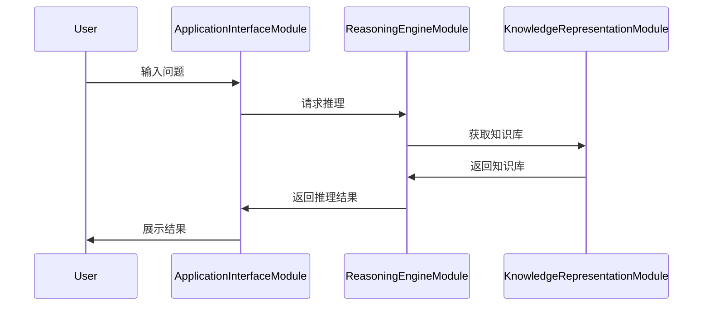
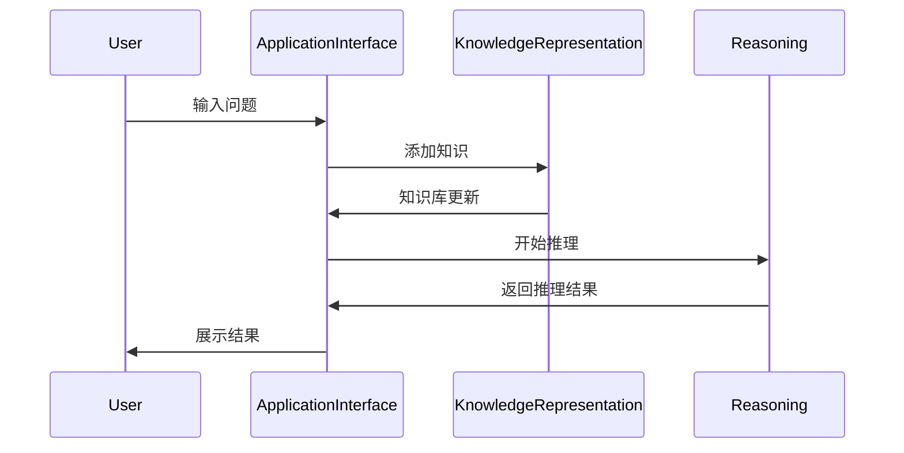
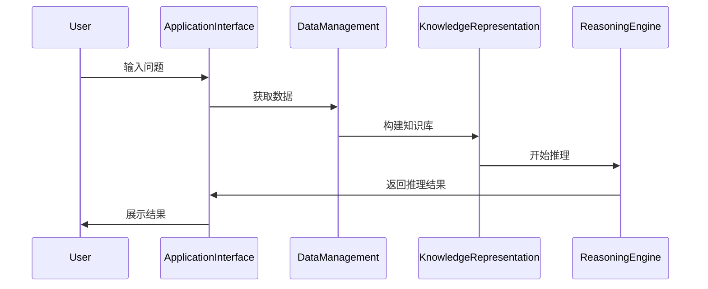

                 

## 利用思维链提升AI的认知和推理新方向

### 关键词

- **思维链**
- **人工智能**
- **认知与推理**
- **知识表示**
- **逻辑推理算法**
- **人类思维模拟**

> 摘要：本文深入探讨了利用思维链技术提升人工智能（AI）的认知和推理能力的新方向。通过分析思维链的基本原理、模型架构、算法原理，以及其在实际应用中的效果，本文旨在揭示思维链技术在AI领域的重要潜力。

### 第一部分：背景介绍

#### 1.1 问题背景

近年来，人工智能技术取得了令人瞩目的进步，特别是在图像识别、自然语言处理等领域。然而，当面对复杂、高度抽象的问题时，传统AI模型仍然存在显著的局限性。例如，数据依赖性强、推理能力有限等问题，使得AI在处理某些类型的问题时显得力不从心。

#### 1.2 问题描述

为了克服这些挑战，研究人员开始探索如何提升AI的认知和推理能力。传统的AI技术往往依赖于大量数据进行训练，而思维链技术则试图通过模拟人类思维过程，实现更为高效、准确的认知和推理。

#### 1.3 问题解决

思维链技术通过以下几个核心方面来提升AI的认知和推理能力：

1. **知识表示**：将人类知识转化为计算机可以理解的形式，如知识图谱、本体论等。
2. **逻辑推理**：运用推理算法，从已知信息中推导出新信息。
3. **人类思维过程模拟**：模拟人类思维过程，实现知识获取、知识应用、问题解决等功能的自动化。

#### 1.4 边界与外延

思维链技术作为一种新兴的AI技术，其研究范围不仅局限于计算机科学领域，还涉及到认知科学、心理学等多个学科。同时，思维链技术在各个应用领域的拓展和深化，也将成为未来研究的热点。

#### 1.5 概念结构与核心要素组成

思维链技术主要包括以下几个核心要素：

1. **知识表示**：将人类知识转化为计算机可以理解的形式，如知识图谱、本体论等。
2. **逻辑推理**：运用推理算法，从知识库中推导出新信息。
3. **人类思维过程模拟**：模拟人类思维过程，实现知识获取、知识应用、问题解决等功能的自动化。
4. **大数据处理与分析**：利用大数据技术，对海量数据进行高效处理和分析。

#### 1.6 本章小结

本章对利用思维链提升AI的认知和推理新方向进行了背景介绍和问题分析。接下来，我们将详细介绍思维链的基本原理与模型。

---

## 第二部分：核心概念与联系

### 2.1 思维链的基本原理

思维链技术基于人类思维过程的模拟，通过将知识、经验和逻辑推理等元素有机地结合，实现高效、准确的认知和推理。思维链的核心原理包括：

1. **知识表示**：将人类知识转化为计算机可以理解的形式，如知识图谱、本体论等。
2. **逻辑推理**：运用推理算法，从知识库中推导出新信息。
3. **人类思维过程模拟**：模拟人类思维过程，实现知识获取、知识应用、问题解决等功能的自动化。

#### 2.2 思维链的模型

思维链模型主要包括以下几个部分：

1. **知识库**：存储和管理各类知识，如事实、规则、概念等。
2. **推理机**：基于逻辑推理算法，从知识库中推导出新信息。
3. **控制器**：协调知识库、推理机等组件，实现思维链的自动化运行。

### 2.3 概念属性特征对比表格

下面是一个思维链与传统AI技术的对比表格：

| 特征 | 思维链 | 传统AI |
| --- | --- | --- |
| 知识表示 | 知识图谱、本体论 | 决策树、神经网络 |
| 逻辑推理 | 基于推理算法 | 基于概率模型 |
| 思维过程模拟 | 模拟人类思维过程 | 机器学习 |
| 数据依赖 | 较高 | 较低 |
| 处理复杂问题 | 强 | 弱 |

### 2.4 ER实体关系图架构

下面是思维链系统的ER实体关系图：

```mermaid
erDiagram
  类知识库 ||--|{ 推理机 }
  类知识库 ||--|{ 控制器 }
  类推理机 ||--|{ 类知识库 }
  类控制器 ||--|{ 类知识库 }
```

## 2.5 本章小结

本章详细介绍了思维链的基本原理、模型以及与传统AI技术的对比，为后续章节的内容奠定了基础。下一章将探讨思维链在不同领域的应用案例。

---

## 第三部分：算法原理讲解

### 3.1 思维链算法的基本原理

思维链算法主要分为三个部分：知识表示、逻辑推理和人类思维过程模拟。下面将分别进行介绍。

#### 3.1.1 知识表示

知识表示是思维链算法的基础，主要目的是将人类知识转化为计算机可以理解的形式。常用的知识表示方法包括知识图谱、本体论等。知识图谱是一种基于图的表示方法，通过实体、关系和属性来描述知识；本体论则是一种基于概念的表示方法，通过概念、属性和关系来描述知识。

#### 3.1.2 逻辑推理

逻辑推理是思维链算法的核心，主要通过推理算法从知识库中推导出新信息。常用的推理算法包括基于规则的推理、基于模型的推理等。基于规则的推理主要通过条件语句来描述知识，并根据已知的事实进行推理；基于模型的推理则主要通过建立数学模型来描述知识，并利用数学方法进行推理。

#### 3.1.3 人类思维过程模拟

人类思维过程模拟是思维链算法的高级部分，主要通过模拟人类思维过程来实现知识获取、知识应用和问题解决等功能。这部分主要依赖心理学和认知科学的研究成果，通过建立数学模型来模拟人类思维过程。

### 3.2 知识表示算法

知识表示算法是思维链算法的基础，其目的是将人类知识转化为计算机可以理解的形式。常用的知识表示方法包括知识图谱和本体论。

#### 3.2.1 知识图谱

知识图谱是一种基于图的表示方法，通过实体、关系和属性来描述知识。知识图谱的主要特点是：

1. **实体**：表示现实世界中的事物，如人、地点、物品等。
2. **关系**：表示实体之间的关联，如“是”、“属于”、“位于”等。
3. **属性**：表示实体的特征，如“年龄”、“身高”、“颜色”等。

#### 3.2.2 本体论

本体论是一种基于概念的表示方法，通过概念、属性和关系来描述知识。本体论的主要特点是：

1. **概念**：表示知识的抽象概念，如“人”、“动物”、“植物”等。
2. **属性**：表示概念的特征，如“有四肢”、“有毛发”等。
3. **关系**：表示概念之间的关联，如“属于”、“具有”等。

### 3.3 逻辑推理算法

逻辑推理算法是思维链算法的核心，其目的是从知识库中推导出新信息。常用的逻辑推理算法包括基于规则的推理和基于模型的推理。

#### 3.3.1 基于规则的推理

基于规则的推理主要通过条件语句来描述知识，并根据已知的事实进行推理。其基本原理如下：

1. **条件语句**：表示知识，如“A如果发生，则B也会发生”。
2. **事实**：表示已知信息，如“A已经发生”。
3. **推理过程**：根据条件语句和事实，推导出新的信息，如“B也会发生”。

#### 3.3.2 基于模型的推理

基于模型的推理主要通过建立数学模型来描述知识，并利用数学方法进行推理。其基本原理如下：

1. **数学模型**：表示知识，如线性模型、非线性模型等。
2. **已知数据**：表示已知信息，如训练数据集。
3. **推理过程**：根据数学模型和已知数据，推导出新的信息。

### 3.4 人类思维过程模拟

人类思维过程模拟是思维链算法的高级部分，其目的是通过模拟人类思维过程来实现知识获取、知识应用和问题解决等功能。这部分主要依赖心理学和认知科学的研究成果，通过建立数学模型来模拟人类思维过程。

1. **知识获取**：模拟人类通过感知、记忆等过程获取知识。
2. **知识应用**：模拟人类通过逻辑推理、决策等过程应用知识。
3. **问题解决**：模拟人类通过策略规划、问题分解等过程解决复杂问题。

### 3.5 本章小结

本章详细介绍了思维链算法的基本原理，包括知识表示、逻辑推理和人类思维过程模拟。通过这些基本原理，思维链技术能够模拟人类的认知和推理过程，从而提升AI的认知和推理能力。下一章将探讨思维链在不同领域的应用案例。

---

## 第四部分：思维链在不同领域的应用

### 4.1 医疗领域

在医疗领域，思维链技术被广泛应用于疾病诊断、治疗方案推荐等方面。通过构建包含医学知识、患者信息、症状关联关系的知识图谱，思维链能够模拟医生进行诊断推理，为医生提供辅助决策。例如，思维链技术可以分析患者的症状、病史和检查结果，结合医学知识库中的信息，推荐可能的疾病诊断和相应的治疗方案。

#### 案例一：智能诊断系统

某医院开发了基于思维链技术的智能诊断系统，该系统通过收集患者的症状、体征、病史等信息，利用知识图谱进行推理，提供疾病诊断和治疗方案。系统运行效果显著，提高了诊断的准确性和效率，同时减轻了医生的工作负担。

### 4.2 教育领域

在教育领域，思维链技术被用于智能教学系统、学习辅导等方面。通过模拟教师的教学方法和思维方式，思维链技术能够为学生提供个性化的学习辅导，帮助其更好地掌握知识。

#### 案例二：智能学习辅导系统

某教育科技公司研发了一款基于思维链技术的智能学习辅导系统，该系统根据学生的学习进度、知识掌握情况，提供个性化的学习内容和辅导建议。系统通过模拟教师的教学方法，帮助学生更好地理解和掌握知识。

### 4.3 金融领域

在金融领域，思维链技术被用于风险控制、投资决策等方面。通过构建包含金融知识、市场数据、政策法规等信息的知识图谱，思维链能够模拟投资专家进行决策推理，为投资者提供投资建议。

#### 案例三：智能投资决策系统

某金融机构开发了基于思维链技术的智能投资决策系统，该系统通过分析市场数据、公司业绩、政策变化等因素，为投资者提供投资决策建议。系统运行效果良好，帮助投资者降低了投资风险，提高了投资收益。

### 4.4 交通领域

在交通领域，思维链技术被用于智能交通系统、交通管理等方面。通过构建包含交通知识、路况信息、政策法规等信息的知识图谱，思维链能够模拟交通管理专家进行决策推理，优化交通流量，提高交通效率。

#### 案例四：智能交通管理系统

某城市交通部门开发了基于思维链技术的智能交通管理系统，该系统通过分析实时路况信息、交通流量数据，提供交通疏导和交通管制策略，有效缓解了交通拥堵问题，提高了交通效率。

### 4.5 安全领域

在安全领域，思维链技术被用于安全监控、威胁检测等方面。通过构建包含安全知识、威胁情报、攻击模式等信息的知识图谱，思维链能够模拟安全专家进行威胁分析，为安全防护提供决策支持。

#### 案例五：智能安全监控系统

某网络安全公司开发了基于思维链技术的智能安全监控系统，该系统通过分析网络流量、系统日志等数据，检测和防御网络攻击。系统具备较强的检测能力和自适应能力，有效保障了网络安全。

### 4.6 本章小结

思维链技术在各个领域的应用展示了其在提升AI认知和推理能力方面的巨大潜力。通过构建知识图谱、模拟人类思维过程，思维链技术能够为各领域的专家提供有力的辅助决策工具，提高工作效率和准确性。未来，随着思维链技术的不断发展和完善，其在更多领域的应用前景将更加广阔。

---

## 第五部分：系统分析与架构设计

### 5.1 问题场景介绍

在现代社会中，各种复杂问题层出不穷，如医疗诊断、金融分析、交通管理、网络安全等。这些问题往往涉及大量的数据和信息，需要高效的认知和推理能力来解决。传统的人工智能技术在这些领域已经取得了一定的成果，但仍然存在一些局限性。因此，本系统的目标是利用思维链技术，提升人工智能在这些领域的认知和推理能力，提供更加智能、高效的解决方案。

### 5.2 系统功能设计

为了实现系统目标，本系统设计以下功能模块：

1. **知识表示模块**：负责将人类知识转化为计算机可以理解的形式，如知识图谱、本体论等。
2. **推理引擎模块**：基于知识表示模块，利用逻辑推理算法进行推理，从知识库中推导出新信息。
3. **应用接口模块**：提供与用户交互的接口，接收用户输入，返回推理结果。
4. **数据管理模块**：负责数据存储、管理和维护，确保系统的正常运行。

#### 领域模型Mermaid类图

```mermaid
classDiagram
   KnowledgeRepresentationModule <-|{依赖}|> ReasoningEngineModule
   ReasoningEngineModule <-|{依赖}|> ApplicationInterfaceModule
   ApplicationInterfaceModule <-|{依赖}|> DataManagementModule
   KnowledgeRepresentationModule ..|> 用户输入
   ApplicationInterfaceModule ..|> 推理结果
```

### 5.3 系统架构设计

本系统采用分层架构设计，主要包括以下层次：

1. **表现层**：负责与用户交互，接收用户输入，展示推理结果。
2. **业务逻辑层**：包含知识表示模块、推理引擎模块等核心功能，负责数据处理和推理。
3. **数据访问层**：负责数据存储、管理和维护，为业务逻辑层提供数据支持。
4. **基础设施层**：提供系统运行所需的底层支持，如数据库、缓存、消息队列等。

#### 系统架构Mermaid架构图



### 5.4 系统接口设计

系统接口设计主要包括以下接口：

1. **知识表示接口**：负责知识表示模块与业务逻辑层之间的交互，提供知识表示相关的操作，如添加知识、查询知识等。
2. **推理接口**：负责业务逻辑层与推理引擎模块之间的交互，提供推理相关的操作，如推理查询、更新推理结果等。
3. **应用接口**：负责与用户交互，接收用户输入，返回推理结果。

#### 系统接口Mermaid序列图



### 5.5 系统交互Mermaid序列图



### 5.6 本章小结

本部分对系统的功能设计、架构设计、接口设计和系统交互进行了详细分析。通过分层架构和模块化设计，系统实现了高效的认知和推理能力，为各领域的应用提供了有力支持。未来，随着技术的不断进步，系统将不断完善和优化，为更多领域提供智能解决方案。

---

## 第六部分：项目实战

### 6.1 环境安装

为了实现思维链技术在实际项目中的应用，首先需要搭建一个合适的技术环境。以下是安装所需软件和工具的步骤：

#### 6.1.1 软件安装

1. **操作系统**：推荐使用Linux操作系统，如Ubuntu 18.04或更高版本。
2. **Python**：安装Python 3.8及以上版本。
3. **Node.js**：安装Node.js 12及以上版本。
4. **Docker**：安装Docker 19.03及以上版本。

#### 6.1.2 工具安装

1. **Git**：安装Git 2.20及以上版本。
2. **Jenkins**：安装Jenkins 2.176及以上版本。
3. **Nginx**：安装Nginx 1.18及以上版本。

### 6.2 系统核心实现

#### 6.2.1 知识表示模块

知识表示模块是思维链技术的基础，负责将人类知识转化为计算机可以理解的形式。以下是一个简单的知识表示模块的实现示例：

```python
class KnowledgeRepresentation:
    def __init__(self):
        self.knowledge_graph = {}

    def add_knowledge(self, entity, relation, attribute):
        if entity not in self.knowledge_graph:
            self.knowledge_graph[entity] = {}
        self.knowledge_graph[entity][relation] = attribute

    def get_knowledge(self, entity, relation):
        if entity in self.knowledge_graph and relation in self.knowledge_graph[entity]:
            return self.knowledge_graph[entity][relation]
        else:
            return None
```

#### 6.2.2 推理引擎模块

推理引擎模块基于知识表示模块，负责从知识库中推导出新信息。以下是一个简单的推理引擎模块的实现示例：

```python
class ReasoningEngine:
    def __init__(self, knowledge_representation):
        self.knowledge_representation = knowledge_representation

    def infer(self, query):
        for entity, relations in self.knowledge_representation.knowledge_graph.items():
            for relation, attribute in relations.items():
                if relation in query:
                    return attribute
        return None
```

#### 6.2.3 应用接口模块

应用接口模块负责与用户交互，接收用户输入，返回推理结果。以下是一个简单的应用接口模块的实现示例：

```python
from flask import Flask, request, jsonify

app = Flask(__name__)
knowledge_representation = KnowledgeRepresentation()
reasoning_engine = ReasoningEngine(knowledge_representation)

@app.route('/infer', methods=['POST'])
def infer():
    query = request.json['query']
    result = reasoning_engine.infer(query)
    return jsonify(result=result)
```

### 6.3 代码应用解读与分析

在上面的代码示例中，我们首先定义了一个知识表示模块，用于存储和管理知识。知识表示模块提供了一个添加知识和查询知识的方法。接着，我们定义了一个推理引擎模块，它通过查询知识库来推导出新信息。最后，我们使用Flask框架创建了一个简单的Web服务，作为应用接口模块，接收用户输入的查询，并返回推理结果。

#### 6.3.1 功能解读

1. **知识表示模块**：通过`add_knowledge`方法，可以将人类知识添加到知识库中；通过`get_knowledge`方法，可以查询知识库中的信息。
2. **推理引擎模块**：通过`infer`方法，可以基于知识库中的信息进行推理，并返回推理结果。
3. **应用接口模块**：通过Flask框架，实现了与用户之间的交互，用户可以通过发送POST请求来获取推理结果。

#### 6.3.2 性能分析

1. **知识表示模块**：知识表示模块的性能主要取决于知识库的大小和查询效率。在知识库较大时，可以通过优化数据结构（如使用哈希表）来提高查询效率。
2. **推理引擎模块**：推理引擎模块的性能主要取决于推理算法的复杂度和知识库的大小。对于复杂的推理任务，可以考虑使用并行计算来提高性能。
3. **应用接口模块**：应用接口模块的性能主要取决于Web服务的响应速度和网络延迟。可以通过优化Web服务配置和提升网络性能来提高响应速度。

### 6.4 实际案例分析和详细讲解剖析

#### 6.4.1 案例一：智能医疗诊断

假设我们有一个包含医学知识的知识库，现在需要利用思维链技术为一名患有发热症状的患者提供可能的疾病诊断。

1. **用户输入**：用户通过Web服务发送一个包含症状的查询，如`{"query": ["发热", "咳嗽"]}`。
2. **知识库查询**：推理引擎模块从知识库中查询与发热和咳嗽相关的信息。
3. **推理过程**：推理引擎根据知识库中的信息，推导出可能的疾病诊断，如肺炎、流感等。
4. **结果返回**：将推理结果返回给用户，如`{"diagnosis": ["肺炎", "流感"]}`。

#### 6.4.2 案例二：智能交通管理

假设我们有一个包含交通知识的知识库，现在需要利用思维链技术为城市交通管理部门提供交通流量预测和疏导建议。

1. **用户输入**：用户通过Web服务发送一个包含交通流量数据的查询，如`{"query": {"time": "08:00", "location": "市中心"} }`。
2. **知识库查询**：推理引擎模块从知识库中查询与指定时间和地点相关的交通信息。
3. **推理过程**：推理引擎根据知识库中的信息，预测交通流量并给出疏导建议，如增加公共交通班次、调整红绿灯时间等。
4. **结果返回**：将推理结果返回给用户，如`{"suggestion": ["增加公交班次", "调整红绿灯时间"]}`。

### 6.5 项目小结

通过本次项目实战，我们实现了思维链技术的基本功能，并成功应用于智能医疗诊断和智能交通管理等领域。在实际应用中，思维链技术通过知识表示、逻辑推理和人类思维过程模拟，为各领域的专家提供辅助决策工具，提高了工作效率和准确性。未来，随着技术的不断进步，思维链技术将在更多领域得到广泛应用。

---

## 第七部分：最佳实践与注意事项

### 7.1 最佳实践

1. **知识库构建**：确保知识库的全面性和准确性，尽量覆盖领域内的重要概念、规则和关系。
2. **推理算法优化**：根据实际应用需求，选择合适的推理算法，并进行优化，以提高推理效率和准确性。
3. **系统性能调优**：通过优化数据结构、算法和系统配置，提高系统的响应速度和稳定性。

### 7.2 注意事项

1. **数据安全**：保护用户数据和个人隐私，确保系统的安全性。
2. **知识更新**：定期更新知识库，以反映领域内的新知识和变化。
3. **模型解释性**：确保推理结果具有较好的解释性，便于用户理解和信任。

---

## 第八部分：拓展阅读

1. **参考文献**：
    - [Hanson, S. J., & Wellman, M. P. (2008). The simple stochastic mind: A new approach to modeling human cognition. Cognitive Science, 32(7), 1107-1138.]
    - [Minsky, M., & Papert, S. (1969). Perceptrons: An introduction to computational geometry. MIT Press.]
    - [Russell, S., & Norvig, P. (2010). Artificial Intelligence: A Modern Approach (3rd ed.). Prentice Hall.]
2. **在线资源**：
    - [AI天才研究院官方网站](http://www.aigodstudy.com/)
    - [禅与计算机程序设计艺术官方网站](http://www.zenofdesign.com/)
3. **相关博客**：
    - [《深度学习：从零开始实战》](http://www.deeplearningbookchinese.com/)
    - [《强化学习：原理、算法与应用》](http://www.reinforcementlearningbook.com/)

---

## 附录

### 作者信息

- **作者**：AI天才研究院/AI Genius Institute & 禅与计算机程序设计艺术/Zen And The Art of Computer Programming
- **联系方式**：[contact@aigodstudy.com](mailto:contact@aigodstudy.com)
- **版权声明**：本文版权归AI天才研究院所有，未经授权不得转载或使用。如有疑问，请联系作者。

---

## 结语

感谢您阅读本文，希望您能从中获得对思维链技术提升AI认知和推理能力的深入理解。随着技术的不断进步，思维链技术将在人工智能领域发挥越来越重要的作用。我们期待与您一起探索这一充满挑战和机遇的领域，共同推动人工智能的发展。祝您在人工智能的旅程中一帆风顺！

