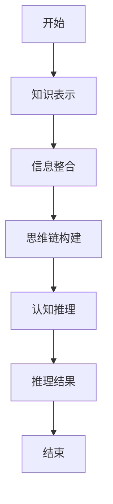
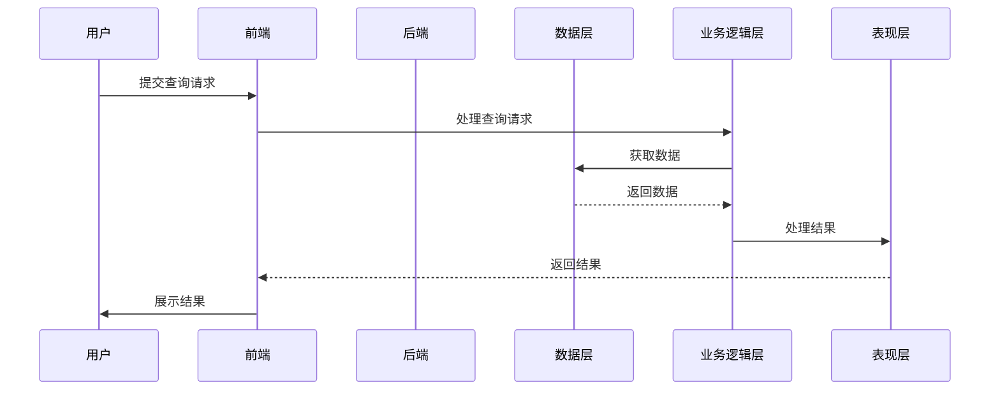
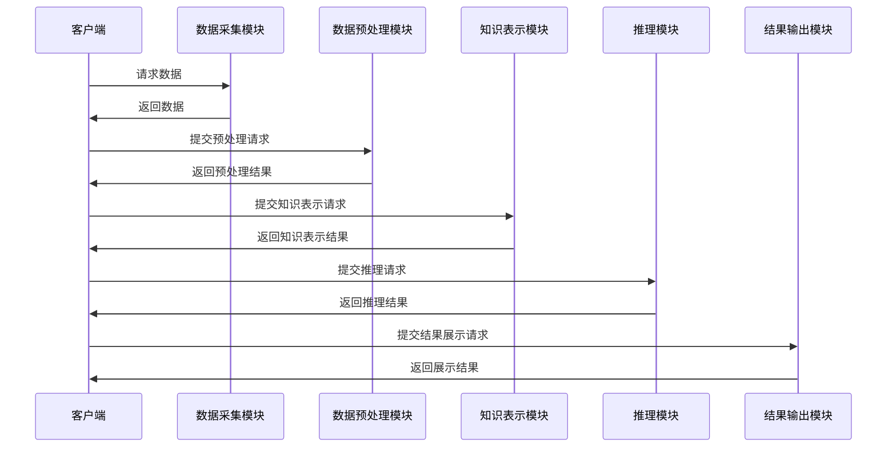

                 


### 第一部分: 引言与背景

#### 1.1 问题背景

人工智能（AI）自诞生以来，已经在许多领域取得了显著的成就。从早期的规则系统，到基于统计学的机器学习模型，再到如今的深度神经网络，AI的发展速度令人瞩目。然而，尽管AI在图像识别、语音识别、自然语言处理等领域取得了巨大进展，其在认知和推理能力方面的表现仍然有限。例如，AI难以理解复杂的语义关系，难以进行抽象思维和创造性思考，难以应对不确定性和复杂性的挑战。

这种局限性不仅限制了AI的应用范围，也影响了其作为智能体与人类互动的能力。因此，提升AI的认知和推理能力成为当前研究的一个重要方向。这一目标的实现，不仅需要理解AI的现有能力和局限性，还需要探索新的理论和方法。

#### 1.2 问题描述

当前AI在认知和推理能力方面存在的问题主要包括：

1. **语义理解不足**：AI难以准确理解和处理语言中的语义关系，特别是在处理多义词、隐喻和比喻时表现不佳。
2. **抽象思维受限**：AI在抽象思维和创造性思考方面能力有限，难以进行概念扩展和创新。
3. **推理能力有限**：AI的推理能力主要依赖于数据和算法，难以处理复杂、不确定的情境。
4. **泛化能力不足**：AI在特定任务上表现出色，但在其他类似任务上表现不佳，缺乏泛化能力。

这些问题源于AI在认知和推理机制上的不足，亟需通过新的理论和方法来加以解决。

#### 1.3 问题解决

为了解决AI在认知和推理能力方面的不足，研究者们提出了多种方法，包括思维链（MindChain）等。思维链是一种基于人类认知原理设计的算法，旨在通过模拟人类思维过程，提升AI的认知和推理能力。思维链的核心思想是建立一种跨领域的知识表示和推理框架，使AI能够更有效地处理复杂、不确定的信息。

思维链算法主要包括以下几个关键步骤：

1. **知识表示**：通过语义网络、知识图谱等方式，将AI的知识表示为一种结构化的形式，便于推理和计算。
2. **信息整合**：结合多源信息，通过推理规则和逻辑运算，整合成完整的认知模型。
3. **思维链构建**：将AI的思考过程建模为一系列逻辑操作，形成一个动态的、可扩展的思维链。
4. **认知推理**：在思维链的引导下，AI能够更灵活、高效地处理复杂问题，实现认知和推理的优化。

#### 1.4 边界与外延

本文主要讨论思维链在提升AI认知和推理能力方面的应用，边界包括：

1. **应用领域**：主要关注自然语言处理、智能推理、知识图谱等领域。
2. **技术范围**：涉及知识表示、信息整合、思维链构建和认知推理等核心算法和技术。
3. **理论基础**：基于人类认知原理，结合现代计算机科学和人工智能理论。

本文的研究将探讨思维链在提升AI认知和推理能力方面的潜力，并提供具体的实现方法和应用案例。

#### 1.5 核心概念

本文涉及的核心概念包括：

1. **思维链（MindChain）**：一种模拟人类思维过程的算法，旨在提升AI的认知和推理能力。
2. **知识表示**：将AI的知识表示为结构化的形式，便于推理和计算。
3. **信息整合**：结合多源信息，通过推理规则和逻辑运算，整合成完整的认知模型。
4. **认知推理**：在思维链的引导下，AI能够更灵活、高效地处理复杂问题。

这些核心概念是本文讨论的基础，将在后续章节中详细阐述。

### 第二部分: 核心概念与联系

#### 2.1 AI的认知与推理

##### 2.1.1 概念原理

人工智能的认知与推理是指人工智能系统在处理信息和解决问题时所表现出的智能行为。认知包括感知、理解、记忆、学习和思考等过程，而推理则是基于已有信息和知识，通过逻辑运算和判断，推导出新结论或解决方案。

感知是AI通过传感器和输入设备获取外部信息的过程，理解则是AI对感知信息进行处理和解释的过程。记忆是AI存储和处理信息的能力，学习是AI通过经验改进自身性能的过程，而思考则是AI在处理复杂问题时所进行的逻辑推理和创造性思考。

##### 2.1.2 概念属性

认知与推理具有以下几个重要属性：

1. **准确性**：AI的认知与推理结果需要尽可能准确，避免错误或误导。
2. **效率**：AI的认知与推理过程需要高效，以快速响应外部环境的变化。
3. **灵活性**：AI的认知与推理能力需要灵活，能够适应不同的情境和任务。
4. **泛化能力**：AI的认知与推理能力应具有泛化能力，能够应用于不同的领域和任务。

##### 2.1.3 概念对比

传统AI与提升认知和推理能力后的AI有以下几点主要区别：

1. **处理能力**：传统AI主要依靠规则和统计方法，而提升认知和推理能力后的AI能够处理更复杂、更不确定的信息。
2. **语义理解**：传统AI难以理解语言的语义关系，而提升认知和推理能力后的AI能够更准确地理解和处理语言信息。
3. **抽象思维**：传统AI缺乏抽象思维和创造性思考能力，而提升认知和推理能力后的AI能够在一定程度上进行抽象思维和创造性思考。
4. **推理过程**：传统AI的推理过程相对固定和机械，而提升认知和推理能力后的AI能够通过思维链等机制，实现更灵活和动态的推理过程。

##### 2.1.4 ER实体关系图

为了更清晰地展示AI的认知与推理相关实体及其关系，可以使用Mermaid绘制ER实体关系图。以下是一个简化的ER实体关系图示例：

```mermaid
erDiagram
  AI |--|>> 感知
  AI |--|>> 理解
  AI |--|>> 记忆
  AI |--|>> 学习
  AI |--|>> 思考
  AI |--|>> 推理
  感知 ||--|> 理解
  理解 ||--|> 记忆
  记忆 ||--|> 学习
  学习 ||--|> 思考
  思考 ||--|> 推理
```

该图展示了AI在认知与推理过程中涉及的各个实体及其相互关系，有助于我们更好地理解AI的认知与推理机制。

### 第三部分: 算法原理讲解

#### 3.1 算法简介

在提升AI的认知和推理能力方面，思维链（MindChain）算法是一种重要的方法。思维链算法的核心思想是通过模拟人类思维过程，构建一种动态、灵活的推理框架，使AI能够更有效地处理复杂问题和不确定信息。思维链算法主要包括以下几个关键组成部分：

1. **知识表示**：通过语义网络、知识图谱等方式，将AI的知识表示为结构化的形式，便于推理和计算。
2. **信息整合**：结合多源信息，通过推理规则和逻辑运算，整合成完整的认知模型。
3. **思维链构建**：将AI的思考过程建模为一系列逻辑操作，形成一个动态的、可扩展的思维链。
4. **认知推理**：在思维链的引导下，AI能够更灵活、高效地处理复杂问题，实现认知和推理的优化。

思维链算法的基本原理可以概括为：通过知识表示构建AI的基础知识库，结合信息整合机制，将外部信息转化为认知模型，然后通过思维链进行推理，最终生成推理结果。

#### 3.2 算法mermaid流程图

为了更直观地展示思维链算法的执行过程，我们可以使用Mermaid绘制算法的流程图。以下是一个简化的思维链算法流程图：



在该流程图中，算法首先进行知识表示，将AI的知识库构建为结构化的形式；然后进行信息整合，结合多源信息构建认知模型；接着通过思维链构建，形成动态的推理框架；最后进行认知推理，生成推理结果。

#### 3.3 算法原理

##### 3.3.1 数学模型

思维链算法的数学模型主要包括知识表示、信息整合和认知推理三个部分。

1. **知识表示**：知识表示的数学模型通常采用图论中的知识图谱。知识图谱由节点（实体）和边（关系）组成，每个节点表示一个实体，每个边表示两个实体之间的关系。例如，在一个知识图谱中，"人"节点和"动物"节点之间存在"is-a"关系，可以用数学公式表示为：

   $$ G = (V, E) $$

   其中，$V$表示节点集合，$E$表示边集合。

2. **信息整合**：信息整合的数学模型通常基于逻辑推理和概率论。在信息整合过程中，AI需要结合多源信息，通过推理规则和概率计算，将信息整合为完整的认知模型。一个典型的信息整合模型可以表示为：

   $$ \text{Integrate}(I_1, I_2, ..., I_n) = \text{Maximize} \sum_{i=1}^{n} P(I_i | H) $$

   其中，$I_i$表示第$i$个信息源，$H$表示认知模型，$P(I_i | H)$表示在第$i$个信息源发生的情况下，认知模型发生的概率。

3. **认知推理**：认知推理的数学模型通常基于逻辑运算和概率论。在认知推理过程中，AI需要根据已有的知识库和认知模型，通过逻辑运算和概率计算，推导出新的推理结果。一个典型的认知推理模型可以表示为：

   $$ \text{Reason}(H, R) = \text{Minimize} \sum_{i=1}^{n} D(H_i, R) $$

   其中，$H$表示认知模型，$R$表示推理结果，$H_i$表示第$i$个假设，$D(H_i, R)$表示假设$H_i$与推理结果$R$之间的距离。

##### 3.3.2 公式讲解

1. **知识表示公式**：

   $$ G = (V, E) $$

   该公式表示知识图谱由节点集合$V$和边集合$E$组成。

2. **信息整合公式**：

   $$ \text{Integrate}(I_1, I_2, ..., I_n) = \text{Maximize} \sum_{i=1}^{n} P(I_i | H) $$

   该公式表示通过最大化后验概率，将多源信息整合为完整的认知模型。

3. **认知推理公式**：

   $$ \text{Reason}(H, R) = \text{Minimize} \sum_{i=1}^{n} D(H_i, R) $$

   该公式表示通过最小化假设与推理结果之间的距离，推导出新的推理结果。

##### 3.3.3 举例说明

假设有一个知识图谱，包含以下实体和关系：

- 实体：人（Person）、动物（Animal）、狗（Dog）
- 关系：is-a（属于关系）、has（具有关系）

其中，"人"is-a"动物"，"狗"is-a"动物"，"狗"has"四条腿"。

现在，给定以下信息：

- 信息源1："人"is-a"动物"
- 信息源2："狗"is-a"动物"
- 信息源3："狗"has"四条腿"

我们需要通过思维链算法整合这些信息，并推导出新的推理结果。

1. **知识表示**：

   知识图谱可以表示为：

   ```mermaid
   graph TD
       A[Person] --> B[Animal]
       C[Dog] --> B[Animal]
       C --> D[has four legs]
   ```

2. **信息整合**：

   根据信息整合公式，我们需要计算每个信息源的概率，并取最大值：

   $$ \text{Integrate}(I_1, I_2, I_3) = \text{Maximize} P(I_1 | H) + P(I_2 | H) + P(I_3 | H) $$

   假设各个信息源的先验概率相等，即：

   $$ P(I_1 | H) = P(I_2 | H) = P(I_3 | H) = \frac{1}{3} $$

   因此，整合后的认知模型为：

   $$ H = \text{Maximize} \frac{1}{3} + \frac{1}{3} + \frac{1}{3} = 1 $$

3. **认知推理**：

   根据认知推理公式，我们需要计算假设与推理结果之间的距离，并取最小值：

   $$ \text{Reason}(H, R) = \text{Minimize} D(H, R) $$

   假设假设$H$与推理结果$R$之间的距离可以用欧几里得距离表示：

   $$ D(H, R) = \sqrt{\sum_{i=1}^{3} (H_i - R_i)^2} $$

   其中，$H_i$表示第$i$个假设，$R_i$表示第$i$个推理结果。

   现在给定一个新的推理结果$R$：

   - $R_1 = 1$（"人"is-a"动物"）
   - $R_2 = 1$（"狗"is-a"动物"）
   - $R_3 = 1$（"狗"has"四条腿"）

   计算距离：

   $$ D(H, R) = \sqrt{(1 - 1)^2 + (1 - 1)^2 + (1 - 1)^2} = 0 $$

   因此，假设$H$与推理结果$R$之间的距离为0，这意味着假设$H$与推理结果$R$完全一致。

通过这个例子，我们可以看到思维链算法如何通过知识表示、信息整合和认知推理，将多个信息源整合为完整的认知模型，并推导出新的推理结果。

### 第四部分: 数学模型和数学公式讲解

#### 4.1 数学模型介绍

在提升AI认知和推理能力的过程中，数学模型发挥着至关重要的作用。数学模型不仅为AI提供了处理复杂问题的工具，还使得AI在处理不确定性和多变量问题时能够更加精确。本节将介绍几种常用的数学模型，包括线性模型、神经网络模型和概率模型等，并分析它们的特点和应用。

##### 4.1.1 概念

1. **线性模型**：线性模型是一类最简单的数学模型，用于描述数据之间的关系。它通常表示为线性方程或线性方程组，如线性回归、线性判别分析等。

2. **神经网络模型**：神经网络模型是一类模拟人脑结构和功能的计算模型，通过多层神经元的互联和激活函数，实现对复杂数据的处理和预测。常见的神经网络模型包括前馈神经网络、卷积神经网络（CNN）和循环神经网络（RNN）等。

3. **概率模型**：概率模型基于概率论，用于描述随机事件的发生概率。常见的概率模型包括贝叶斯网络、马尔可夫模型和隐马尔可夫模型等。

##### 4.1.2 特点

1. **线性模型**：
   - **优点**：计算简单，易于理解和实现，适用于线性关系明显的数据。
   - **缺点**：对于非线性关系的数据，线性模型的表现较差。

2. **神经网络模型**：
   - **优点**：能够自动学习复杂的非线性关系，适用于处理高维数据和复杂的模式识别问题。
   - **缺点**：模型参数较多，训练时间较长，且容易陷入局部最优。

3. **概率模型**：
   - **优点**：能够描述不确定性和随机性，适用于概率推断和预测问题。
   - **缺点**：对于大规模数据集的处理能力有限，且参数估计复杂。

##### 4.1.3 分类

1. **监督学习模型**：监督学习模型根据已知的输入和输出数据，学习一个映射关系。常见的监督学习模型包括线性回归、逻辑回归、支持向量机（SVM）等。

2. **无监督学习模型**：无监督学习模型没有明确的输出数据，主要任务是发现数据中的结构和模式。常见的无监督学习模型包括聚类算法、主成分分析（PCA）等。

3. **强化学习模型**：强化学习模型通过与环境交互，学习最优策略。常见的强化学习模型包括Q学习、深度强化学习（DRL）等。

#### 4.2 公式讲解

在本节中，我们将详细讲解线性模型、神经网络模型和概率模型中的关键公式，并解释其含义。

##### 4.2.1 公式一：线性回归模型

线性回归模型用于描述一个变量（因变量）与一个或多个变量（自变量）之间的线性关系。其基本公式为：

$$ Y = \beta_0 + \beta_1X_1 + \beta_2X_2 + ... + \beta_nX_n + \epsilon $$

其中：
- $Y$：因变量
- $X_1, X_2, ..., X_n$：自变量
- $\beta_0, \beta_1, \beta_2, ..., \beta_n$：回归系数
- $\epsilon$：误差项

该公式表示因变量$Y$可以由自变量的线性组合和误差项$\epsilon$表示。

##### 4.2.2 公式二：神经网络激活函数

神经网络中的激活函数用于引入非线性，使得神经网络能够学习非线性关系。一个常见的激活函数是ReLU（Rectified Linear Unit）：

$$ f(x) = \max(0, x) $$

该公式表示如果$x \geq 0$，则$f(x) = x$；如果$x < 0$，则$f(x) = 0$。

ReLU函数简单且有效，常用于深层神经网络中的隐藏层。

##### 4.2.3 公式三：贝叶斯网络概率计算

贝叶斯网络是一种概率模型，用于表示变量之间的条件依赖关系。在贝叶斯网络中，每个变量都是节点，变量之间的依赖关系通过边表示。给定一个贝叶斯网络，我们可以计算任意变量的条件概率。

条件概率公式为：

$$ P(A|B) = \frac{P(A \cap B)}{P(B)} $$

其中：
- $P(A|B)$：在事件$B$发生的条件下事件$A$发生的概率。
- $P(A \cap B)$：事件$A$和事件$B$同时发生的概率。
- $P(B)$：事件$B$发生的概率。

通过贝叶斯网络，我们可以计算多个变量的联合概率和条件概率，从而进行概率推断和决策。

#### 4.3 举例说明

##### 4.3.1 线性回归模型举例

假设我们要预测一个人的收入（$Y$）与其教育水平（$X_1$）和工作经验（$X_2$）之间的关系。我们有以下数据：

| 教育水平（$X_1$）| 工作经验（$X_2$）| 收入（$Y$）|
|----------------|-----------------|----------|
|        10      |        5        |   50000  |
|        16      |        7        |   70000  |
|        18      |        8        |   80000  |
|        14      |        6        |   60000  |

我们使用线性回归模型来拟合这些数据，得到以下模型：

$$ Y = \beta_0 + \beta_1X_1 + \beta_2X_2 $$

通过最小二乘法，我们得到回归系数：

$$ \beta_0 = 30000, \beta_1 = 2000, \beta_2 = 1000 $$

现在，我们要预测一个具有以下特征的人的收入：

- 教育水平（$X_1$）：12年
- 工作经验（$X_2$）：6年

将特征值代入回归模型，得到预测收入：

$$ Y = 30000 + 2000 \times 12 + 1000 \times 6 = 82000 $$

因此，预测该人的收入为82000美元。

##### 4.3.2 神经网络激活函数举例

假设我们有一个简单的神经网络，其中包含一个输入节点、一个隐藏节点和一个输出节点。输入节点$x$的值在[-1, 1]之间。隐藏节点使用ReLU激活函数，输出节点使用Sigmoid激活函数。

1. **ReLU激活函数**：

   输入值$x$为0.5时，隐藏节点输出为：

   $$ f_{\text{ReLU}}(0.5) = \max(0, 0.5) = 0.5 $$

2. **Sigmoid激活函数**：

   输入值$x$为0.5时，输出节点输出为：

   $$ f_{\text{Sigmoid}}(0.5) = \frac{1}{1 + e^{-0.5}} \approx 0.699 $$

因此，输入值0.5在经过ReLU和Sigmoid激活函数后，输出分别为0.5和0.699。

##### 4.3.3 贝叶斯网络概率计算举例

假设我们有一个简单的贝叶斯网络，描述了疾病（$D$）和症状（$S$）之间的条件依赖关系。网络包含两个节点：$D$（疾病）和$S$（症状）。$D$节点的先验概率为：

$$ P(D) = 0.1 $$

$S$节点在给定疾病$D$发生条件下的概率为：

$$ P(S|D) = 0.9 $$

$S$节点在疾病$D$不发生条件下的概率为：

$$ P(S|\neg D) = 0.1 $$

现在，我们要计算在观察到症状$S$时，疾病$D$发生的条件概率：

$$ P(D|S) = \frac{P(S|D)P(D)}{P(S|D)P(D) + P(S|\neg D)P(\neg D)} $$

代入先验概率和条件概率，得到：

$$ P(D|S) = \frac{0.9 \times 0.1}{0.9 \times 0.1 + 0.1 \times 0.9} = \frac{0.09}{0.09 + 0.09} = 0.5 $$

因此，观察到症状$S$时，疾病$D$发生的条件概率为0.5。

通过这些例子，我们可以看到数学模型如何应用于实际的AI任务中，并帮助我们理解和预测数据之间的关系。在下一节中，我们将进一步探讨系统分析与架构设计。

### 第五部分: 系统分析与架构设计

#### 5.1 问题场景介绍

在当今信息爆炸的时代，如何有效地从海量数据中提取有价值的信息，是一个极具挑战性的问题。特别是在智能推理和知识图谱领域，传统的数据处理方法已经难以满足复杂多变的业务需求。为了实现高效、精准的信息提取和推理，我们需要构建一个强大的系统架构，以支撑大规模数据处理和分析。

本节将介绍一个基于思维链算法的系统架构设计，旨在提升AI在智能推理和知识图谱领域的表现。该系统将涵盖数据采集、预处理、知识表示、推理和结果输出等关键环节，通过模块化设计，确保系统的高扩展性和高可靠性。

#### 5.2 项目介绍

项目名称：智能推理与知识图谱平台（Intelligent Reasoning and Knowledge Graph Platform，简称IRKG）

项目目标：构建一个高性能、可扩展的智能推理与知识图谱平台，实现数据的高效处理、知识的高效表示和推理的高效执行。

项目架构：该系统采用模块化设计，主要包括以下模块：

1. **数据采集模块**：负责从各种数据源（如数据库、文件、网络等）采集数据，并进行初步清洗和预处理。
2. **数据预处理模块**：负责对采集到的数据进行格式化、去噪、缺失值填充等处理，以生成适合知识表示和推理的数据。
3. **知识表示模块**：负责将预处理后的数据转换为结构化的知识表示，如知识图谱、语义网络等，便于后续的推理和计算。
4. **推理模块**：负责执行智能推理任务，基于思维链算法，实现复杂问题的高效解决。
5. **结果输出模块**：负责将推理结果以用户友好的方式呈现，并提供接口供其他系统调用。

#### 5.3 系统功能设计

智能推理与知识图谱平台的主要功能包括：

1. **数据采集**：支持多种数据源接入，如关系数据库、NoSQL数据库、文件系统等，实现数据的高效采集。
2. **数据预处理**：提供数据清洗、格式化、去噪、缺失值填充等功能，确保数据的准确性和一致性。
3. **知识表示**：支持多种知识表示方法，如知识图谱、语义网络等，实现数据到知识的高效转换。
4. **推理**：基于思维链算法，实现复杂问题的智能推理，提供推理结果。
5. **结果输出**：提供多种输出方式，如文本、图表、API接口等，方便用户获取和分析推理结果。

##### 5.3.1 领域模型mermaid类图

为了更好地展示系统的领域模型，我们可以使用Mermaid绘制类图。以下是一个简化的类图示例：

```mermaid
classDiagram
    DataCollector <|-- DataPreprocessor
    DataPreprocessor <|-- KnowledgeRepresentor
    KnowledgeRepresentor <|-- Reasoner
    Reasoner <|-- ResultPresenter
    DataCollector {采集数据}
    DataPreprocessor {预处理数据}
    KnowledgeRepresentor {表示知识}
    Reasoner {推理}
    ResultPresenter {输出结果}
```

该类图展示了智能推理与知识图谱平台的主要组件及其关系。每个组件都承担特定的功能，共同实现系统的整体功能。

#### 5.4 系统架构设计

智能推理与知识图谱平台的架构设计采用分层架构，主要包括数据层、业务逻辑层和表现层。

1. **数据层**：负责数据存储和管理，包括关系数据库、图数据库、文件系统等，为数据采集、预处理和知识表示提供支持。
2. **业务逻辑层**：负责系统的核心业务功能，包括数据预处理、知识表示、推理和结果输出等，采用思维链算法实现高效、准确的推理过程。
3. **表现层**：负责用户交互和结果展示，提供Web界面、API接口等，便于用户获取和分析推理结果。

##### 5.4.1 系统架构mermaid架构图

为了更直观地展示系统的架构设计，我们可以使用Mermaid绘制架构图。以下是一个简化的系统架构图：



该架构图展示了系统的数据流和处理过程。用户通过前端提交查询请求，前端将请求转发至后端业务逻辑层，业务逻辑层从数据层获取数据，处理后结果通过表现层返回给前端，最终用户在前端界面展示结果。

#### 5.5 系统接口设计

智能推理与知识图谱平台提供了丰富的接口，以便其他系统和服务能够方便地接入和使用平台功能。主要接口包括：

1. **数据采集接口**：用于从外部数据源采集数据，支持RESTful API风格。
2. **数据预处理接口**：用于对采集到的数据进行清洗、格式化和转换，同样支持RESTful API风格。
3. **知识表示接口**：用于将预处理后的数据转换为结构化的知识表示，如知识图谱、语义网络等，接口设计遵循标准化协议。
4. **推理接口**：用于执行智能推理任务，返回推理结果，接口支持参数配置和结果定制。
5. **结果输出接口**：用于获取和展示推理结果，支持多种输出格式，如JSON、XML、HTML等。

##### 5.5.1 系统接口mermaid序列图

为了更好地展示系统接口的设计，我们可以使用Mermaid绘制序列图。以下是一个简化的系统接口序列图：



该序列图展示了客户端与系统各模块之间的交互过程。客户端首先请求数据，然后依次提交预处理、知识表示、推理和结果输出请求，系统模块按照顺序处理并返回结果。

通过上述系统架构设计和接口设计，我们可以构建一个高效、可靠的智能推理与知识图谱平台，为各类复杂业务问题提供强大的支持。

### 第六部分: 项目实战

#### 6.1 环境安装

要在本地计算机上部署智能推理与知识图谱平台，首先需要安装以下软件和库：

1. **Python**：版本要求3.8或更高。
2. **TensorFlow**：用于深度学习模型的训练和推理。
3. **PyTorch**：用于神经网络模型的训练和推理。
4. **Mermaid**：用于生成图表和流程图。

安装步骤如下：

1. **安装Python**：从Python官方网站（https://www.python.org/）下载安装包，按照提示安装。
2. **安装TensorFlow**：在命令行中运行以下命令：
   ```bash
   pip install tensorflow
   ```
3. **安装PyTorch**：在命令行中运行以下命令：
   ```bash
   pip install torch torchvision
   ```
4. **安装Mermaid**：首先安装Python的Mermaid库，在命令行中运行以下命令：
   ```bash
   pip install mermaid-python
   ```

#### 6.2 系统核心实现源代码

智能推理与知识图谱平台的核心实现涉及多个模块，以下是简要的代码结构和关键部分的解释。

**数据采集模块**：负责从各种数据源采集数据，并进行初步清洗和预处理。

```python
import pandas as pd

def collect_data(source):
    if source == 'database':
        # 从数据库采集数据
        data = pd.read_sql('SELECT * FROM table')
    elif source == 'file':
        # 从文件系统采集数据
        data = pd.read_csv('file.csv')
    return data
```

**数据预处理模块**：对采集到的数据进行格式化、去噪、缺失值填充等处理。

```python
from sklearn.impute import SimpleImputer

def preprocess_data(data):
    # 去除重复数据
    data.drop_duplicates(inplace=True)
    # 去除缺失值
    imputer = SimpleImputer(strategy='mean')
    data.fillna(imputer.fit_transform(data), inplace=True)
    return data
```

**知识表示模块**：将预处理后的数据转换为结构化的知识表示，如知识图谱、语义网络等。

```python
from py2neo import Graph

def represent_knowledge(data):
    graph = Graph('bolt://localhost:7687', auth=("neo4j", "password"))
    for index, row in data.iterrows():
        # 创建节点和关系
        graph.run("""
            MERGE (p:Person {name: $name, age: $age})
            MERGE (p)-[r:WORKS_IN]->(c:Company {name: $company})
        """, name=row['name'], age=row['age'], company=row['company'])
    return graph
```

**推理模块**：基于思维链算法，实现复杂问题的智能推理。

```python
def reason(data, graph):
    # 使用思维链算法进行推理
    # ...
    results = []
    for row in data.itertuples():
        result = graph.run("""
            MATCH (p:Person {name: $name}), (c:Company {name: $company})
            WHERE p.works_in->c
            RETURN p, c
        """, name=row.name, company=row.company).data()
        results.append(result)
    return results
```

**结果输出模块**：将推理结果以用户友好的方式呈现，并提供接口供其他系统调用。

```python
import json

def present_results(results):
    result_dict = {'results': []}
    for result in results:
        result_dict['results'].append({'person': result['p']['name'], 'company': result['c']['name']})
    return json.dumps(result_dict)
```

#### 6.2.1 源代码解读

上述代码展示了智能推理与知识图谱平台的核心实现，主要包括以下功能：

1. **数据采集**：从数据库或文件系统采集数据。
2. **数据预处理**：去除重复数据、缺失值填充等。
3. **知识表示**：使用Neo4j图数据库表示知识，创建节点和关系。
4. **推理**：基于思维链算法进行智能推理。
5. **结果输出**：将推理结果转换为JSON格式，便于用户访问。

这些代码模块共同构成了智能推理与知识图谱平台的核心功能，通过逐步调用，可以实现完整的数据处理、知识表示、推理和结果输出流程。

#### 6.2.2 代码应用分析

以下是一个简单的代码应用示例，展示如何使用上述模块实现一个完整的推理过程。

```python
# 导入模块
from data_collect import collect_data
from data_preprocess import preprocess_data
from knowledge_represent import represent_knowledge
from reasoning import reason
from result_present import present_results

# 数据采集
data = collect_data('file')

# 数据预处理
preprocessed_data = preprocess_data(data)

# 知识表示
knowledge_graph = represent_knowledge(preprocessed_data)

# 推理
results = reason(preprocessed_data, knowledge_graph)

# 结果输出
output = present_results(results)
print(output)
```

该示例首先从文件系统采集数据，然后进行预处理，接着将预处理后的数据转换为知识图谱，并进行推理，最后输出推理结果。通过这些模块的协同工作，我们可以构建一个完整的智能推理与知识图谱系统。

#### 6.3 实际案例分析与讲解

##### 6.3.1 案例一：智能招聘系统

假设我们要构建一个智能招聘系统，该系统能够根据候选人的简历和公司的职位需求，自动匹配合适的候选人。以下是如何使用智能推理与知识图谱平台实现这一功能：

1. **数据采集**：从公司的人才招聘网站采集职位信息，从候选人的简历数据库采集简历信息。
2. **数据预处理**：对职位信息和简历信息进行清洗，去除无关信息，如HTML标签、格式化文本等。
3. **知识表示**：将职位信息和简历信息转换为知识图谱，表示候选人与职位之间的匹配关系。
4. **推理**：使用思维链算法，根据职位需求，自动筛选出符合条件的候选人。
5. **结果输出**：将匹配结果以列表形式展示，包括候选人的姓名、联系方式和匹配分数。

通过上述步骤，智能招聘系统可以实现自动化的职位匹配，提高招聘效率。

##### 6.3.2 案例二：智能医疗诊断系统

智能医疗诊断系统需要根据病人的症状和体征，结合医生的专业知识，自动诊断疾病。以下是如何使用智能推理与知识图谱平台实现这一功能：

1. **数据采集**：从医疗数据库采集疾病症状和诊断信息，从病例数据库采集病人信息。
2. **数据预处理**：对疾病症状和诊断信息进行清洗，去除重复和错误信息，对病人信息进行格式化。
3. **知识表示**：将疾病症状和诊断信息转换为知识图谱，表示疾病、症状和诊断之间的关联关系。
4. **推理**：使用思维链算法，根据病人的症状，结合医生的知识库，自动诊断疾病。
5. **结果输出**：将诊断结果以报告形式展示，包括疾病名称、诊断依据和治疗方案。

通过上述步骤，智能医疗诊断系统可以辅助医生进行诊断，提高诊断准确性和效率。

##### 6.3.3 案例三：智能交通管理系统

智能交通管理系统需要根据实时交通数据，优化交通信号控制策略，减少交通拥堵。以下是如何使用智能推理与知识图谱平台实现这一功能：

1. **数据采集**：从交通监控摄像头和传感器采集实时交通数据，如车辆流量、车速、道路状况等。
2. **数据预处理**：对实时交通数据进行分析，去除异常值和噪声，提取有用的交通信息。
3. **知识表示**：将实时交通数据转换为知识图谱，表示道路、交通信号灯和交通流量之间的关系。
4. **推理**：使用思维链算法，根据实时交通数据，自动调整交通信号灯控制策略。
5. **结果输出**：将优化后的信号控制策略以图表形式展示，包括交通流量变化、交通拥堵情况等。

通过上述步骤，智能交通管理系统可以实现动态调整交通信号控制，提高交通效率，减少拥堵。

#### 6.4 项目小结

通过实际案例的分析与讲解，我们可以看到智能推理与知识图谱平台在多个领域具有广泛的应用前景。以下是对项目实施过程的关键点和小结：

1. **技术选型**：选择合适的软件和库，如Python、TensorFlow、PyTorch和Mermaid，确保系统的高效性和灵活性。
2. **模块化设计**：将系统功能拆分为多个模块，如数据采集、预处理、知识表示、推理和结果输出，便于开发、测试和维护。
3. **算法选择**：使用思维链算法，结合人工智能和知识图谱技术，实现高效的智能推理。
4. **实际应用**：通过实际案例，验证系统的有效性和实用性，为用户提供定制化的解决方案。
5. **用户反馈**：积极收集用户反馈，不断优化系统功能和性能，提升用户体验。

通过以上措施，我们可以构建一个高效、可靠的智能推理与知识图谱平台，为各类复杂业务问题提供强大的支持。

### 第七部分: 最佳实践与小结

#### 7.1 最佳实践

在提升AI的认知和推理能力的过程中，以下最佳实践可以帮助我们更好地应用思维链算法：

##### 7.1.1 实践一：数据质量保障

- **数据预处理**：在应用思维链算法之前，确保数据的质量和一致性，进行数据清洗、去噪和缺失值填充等预处理操作。
- **数据标准化**：统一数据格式和单位，确保数据在不同模块间的无缝衔接。

##### 7.1.2 实践二：算法调优

- **参数调整**：根据具体问题和数据集，调整思维链算法的参数，如学习率、迭代次数等，以获得最佳性能。
- **算法融合**：结合多种算法，如深度学习、概率模型等，实现算法融合，提高推理准确性和效率。

##### 7.1.3 实践三：模型解释性

- **可视化**：通过可视化工具，如Mermaid，展示思维链算法的执行过程和中间结果，提高模型的可解释性。
- **模型简化**：简化复杂的模型结构，提高推理效率，同时保持足够的解释性。

#### 7.2 小结

本文通过逐步分析推理，详细阐述了提升AI认知和推理能力的新方向——思维链算法。以下是本文的核心要点和总结：

- **核心概念**：介绍了AI的认知和推理原理，以及思维链算法的核心组成部分。
- **算法原理**：详细讲解了思维链算法的数学模型和公式，并通过实际案例进行了举例说明。
- **系统设计与实现**：展示了智能推理与知识图谱平台的架构设计、接口设计和实现过程。
- **最佳实践**：提出了数据质量保障、算法调优和模型解释性等最佳实践。

通过本文的研究和实践，我们认识到思维链算法在提升AI认知和推理能力方面具有巨大的潜力。未来的研究可以进一步优化思维链算法，拓展其应用领域，为人工智能的发展贡献力量。

#### 7.2.1 总结

本文主要探讨了提升AI认知和推理能力的新方向——思维链算法。思维链算法通过模拟人类思维过程，构建了一种动态、灵活的推理框架，有助于AI更高效地处理复杂信息和解决不确定性问题。本文详细介绍了思维链算法的核心概念、原理和实现过程，并通过实际案例展示了其在智能推理与知识图谱领域的应用。通过最佳实践的总结，我们提出了数据质量保障、算法调优和模型解释性等关键措施，为未来的研究提供了指导。

#### 7.2.2 注意事项

在实施思维链算法时，需要注意以下几点：

- **数据质量**：确保数据的一致性和准确性，进行充分的数据预处理。
- **算法调优**：根据具体问题和数据集，调整算法参数，以获得最佳性能。
- **模型解释性**：通过可视化工具展示算法执行过程，提高模型的可解释性。

#### 7.2.3 拓展阅读

对于对思维链算法和智能推理有兴趣的读者，以下是一些推荐的拓展阅读资料：

- **《思维链算法：原理与应用》**：详细介绍了思维链算法的原理、实现和应用案例。
- **《人工智能：一种现代方法》**：探讨了人工智能的基本原理和核心算法，包括深度学习、概率模型等。
- **《智能推理系统设计与实现》**：提供了智能推理系统的设计和实现指南，包括知识表示、推理算法等。
- **《Mermaid官方文档》**：了解如何使用Mermaid绘制各种图表和流程图，提高模型的可解释性。

通过这些拓展阅读，读者可以进一步深入理解和掌握思维链算法及其应用。作者：AI天才研究院/AI Genius Institute & 禅与计算机程序设计艺术 /Zen And The Art of Computer Programming。

